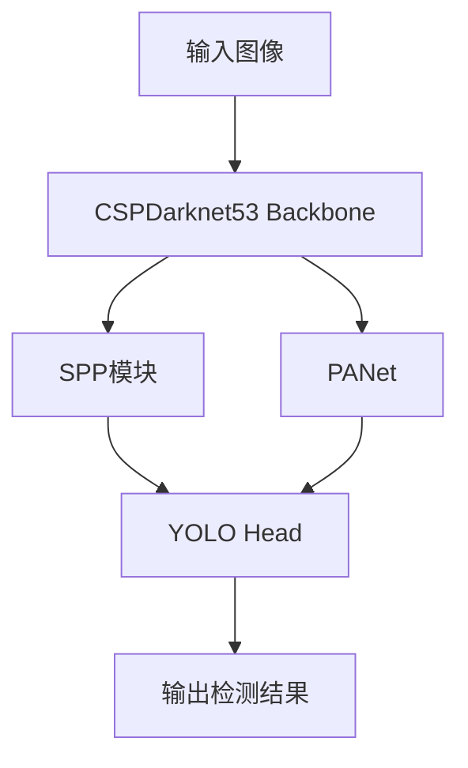
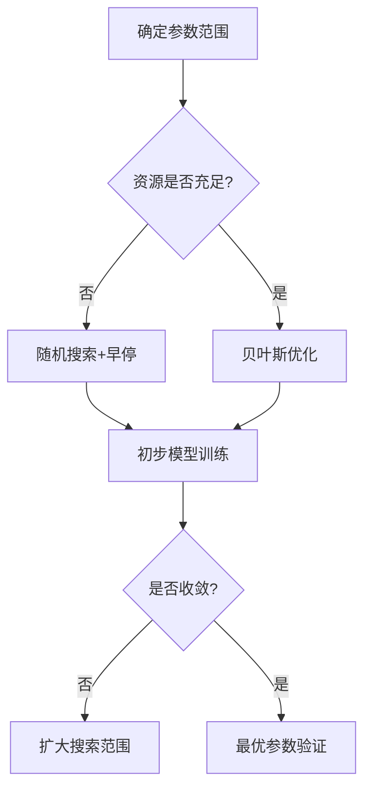

# 问题：说说你知道的模型压缩方法？

## 知识点
模型压缩是深度学习领域的重要研究方向，旨在减少模型存储空间、计算量和内存占用，同时尽量保持模型性能。核心目标包括：
- **降低推理延迟**（适用于边缘设备）
- **减少部署成本**（如云端推理服务）
- **提升能源效率**（移动/嵌入式场景）
- **突破硬件限制**（如FPGA/NPU支持）

---

## 答案

### 1. 剪枝（Pruning）
**核心思想**：通过移除冗余参数或结构减少模型复杂度。  
**分类**：
- **非结构化剪枝**：随机删除权重（如低于阈值的权重）
  - 示例：LeCun提出的`Magnitude-based Pruning`
- **结构化剪枝**：删除整个神经元/卷积核
  - 示例：`Channel Pruning`（减少卷积通道数）
- **动态剪枝**：根据输入数据动态决定剪枝位置
- **硬件感知剪枝**：针对特定硬件（如GPU/TPU）优化剪枝策略

**案例**：  
- ResNet-50通过结构化剪枝可压缩至原模型大小的1/10，精度损失<1%
- TensorFlow Model Optimization Toolkit提供自动化剪枝工具

---

### 2. 量化（Quantization）
**核心思想**：用低精度数据表示替换高精度（如FP32→INT8）。  
**分类**：
- **后训练量化（PTQ）**：训练后直接量化
  - 挑战：量化误差累积导致精度下降
- **量化感知训练（QAT）**：在训练中模拟量化过程
  - 技巧：添加伪量化节点（FakeQuantize）
- **混合精度量化**：部分层保持高精度（如权重量化+激活量化）
- **非均匀量化**：使用自定义阈值而非均匀分布

**案例**：  
- MobileNet通过INT8量化在移动端实现2倍加速
- NVIDIA TensorRT支持自动混合精度量化

---

### 3. 知识蒸馏（Knowledge Distillation）
**核心思想**：用大模型（教师）指导小模型（学生）训练。  
**关键组件**：
- **Logits蒸馏**：匹配教师与学生的输出概率分布（KL散度）
- **特征蒸馏**：对中间层特征进行相似性约束
- **多教师蒸馏**：组合多个模型的知识
- **自蒸馏**：模型自我迭代优化

**改进方法**：  
- `FitNet`：通过中间层特征对齐实现知识迁移
- `Attention Transfer`：显式迁移注意力机制

---

### 4. 紧凑网络结构设计
**核心思想**：通过数学重构减少参数量。  
**经典方法**：
- **深度可分离卷积**（MobileNet）：将卷积分解为深度卷积+逐点卷积
- **分组卷积**（ResNeXt/ShuffleNet）：降低跨组计算量
- **瓶颈结构**（SqueezeNet）：用1x1卷积压缩特征通道
- **神经架构搜索（NAS）**：自动化设计高效结构（如MNASNet）

**新兴方向**：  
- `EfficientNet`：复合缩放策略平衡宽度/深度/分辨率
- `VGG-like`极深网络替代方案（如ResNet变体）

---

### 5. 参数共享与稀疏连接
**核心思想**：强制参数复用或减少连接密度。  
**代表方法**：
- **ThiNet**：通过连接剪枝实现稀疏连接
- **Group Lasso**：在损失函数中添加稀疏约束项
- **哈希编码**：将高维参数映射到低维哈希空间
- **动态稀疏训练**（如Dynamic Sparse Training）

---

### 6. 动态计算调整
**核心思想**：根据输入内容动态改变计算量。  
**实现方式**：
- **条件计算**：根据输入特征选择性激活部分网络
- **早退机制**：在中间层提前终止推理（如BranchyNet）
- **自适应精度**：根据输入重要性调整量化粒度
- **动态批处理**：根据硬件负载调整batch size

---

## 拓展

### 1. 模型压缩的挑战
- **精度-效率权衡**：需设计Pareto最优压缩策略
- **硬件适配性**：不同平台（CPU/GPU/NPU）对压缩方法敏感度不同
- **鲁棒性问题**：对抗样本敏感性可能增加
- **训练稳定性**：如剪枝后的再训练容易过拟合

### 2. 前沿研究方向
- **神经科学启发**：模仿人脑突触可塑性设计动态压缩
- **元学习压缩**：让模型自动学习压缩策略
- **硬件协同设计**：如存算一体芯片与压缩算法联合优化
- **终身学习压缩**：支持持续增量压缩的模型架构

### 3. 工具与框架
- TensorFlow Model Optimization Toolkit
- PyTorch Quantization API
- NVIDIA TensorRT（支持自动混合精度+层融合）
- TVM（开源深度学习编译器，支持多种压缩策略）
- OpenVINO（Intel的模型优化工具）

### 4. 典型应用场景
- **移动端部署**：如手机AR应用（<50ms延迟要求）
- **边缘计算**：工业视觉检测（资源受限设备）
- **云服务优化**：大规模推理服务的成本控制
- **物联网设备**：智能摄像头/传感器的实时分析

---

## 总结表
| 方法类别       | 代表技术                  | 压缩率范围    | 典型精度损失 |
|----------------|--------------------------|--------------|--------------|
| 剪枝           | 结构化/非结构化          | 10%~90%      | 0.5%~5%      |
| 量化           | PTQ/QAT                  | 4倍~8倍      | 1%~3%        |
| 知识蒸馏       | Logits/Feature蒸馏       | 2倍~10倍     | 2%~8%        |
| 结构重构       | MobileNet/EfficientNet   | 10倍~50倍    | 5%~15%       |
| 动态计算       | 条件计算/早退            | 1.5倍~4倍    | 1%~3%        |

## 拓展

---
## 问题
说说模型压缩的作用与意义？

## 知识点

## 答案
# 模型压缩的作用与意义

## 问题
模型压缩在深度学习中有什么作用？为什么需要模型压缩？

---

## 知识点
1. **深度学习模型的发展趋势**  
   - 现代深度学习模型（如Transformer、Vision Transformer）参数量爆炸式增长（例如GPT-3有1750亿参数）。
   - 模型体积大、计算复杂度高，导致存储和推理成本高昂。

2. **模型压缩的核心目标**  
   - 在尽量保持模型性能的前提下，减少模型大小、降低计算量。

3. **关键技术**  
   - **剪枝（Pruning）**：移除冗余的神经元或权重。
   - **量化（Quantization）**：将高精度权重转换为低精度（如FP16、INT8）。
   - **知识蒸馏（Knowledge Distillation）**：用小模型学习大模型的输出分布。
   - **轻量级结构设计**：如MobileNet、ShuffleNet等高效网络架构。

---

## 答案

### 1. **模型压缩的作用**
#### （1）**减少存储需求**
- **作用**：将模型体积缩小数倍至数十倍。
- **示例**：BERT模型（400MB）通过量化可压缩至1/4大小（约100MB）。
- **意义**：便于在资源受限的设备（如手机、嵌入式设备）上存储和部署。

#### （2）**加速推理速度**
- **作用**：降低计算复杂度（FLOPs），减少内存占用。
- **示例**：剪枝后ResNet-50的推理速度提升30%~50%。
- **意义**：满足实时性要求（如自动驾驶、视频分析）。

#### （3）**降低计算资源消耗**
- **作用**：减少CPU/GPU的算力需求，降低能耗。
- **示例**：量化后的模型在移动端推理时，功耗可降低70%。
- **意义**：适用于边缘计算场景（如无人机、摄像头）。

#### （4）**提升模型部署灵活性**
- **作用**：支持跨平台部署（云端、移动端、IoT设备）。
- **示例**：知识蒸馏可将复杂模型压缩为适合手机运行的轻量模型。
- **意义**：推动AI技术在工业、医疗等领域的落地。

---

### 2. **模型压缩的意义**
#### （1）**推动AI普惠化**
- 通过压缩，大模型可部署到低端硬件（如树莓派、智能手表），扩大AI应用场景。

#### （2）**降低开发成本**
- 减少对高端GPU的依赖，降低企业部署AI服务的硬件投入。

#### （3）**促进绿色计算**
- 降低数据中心的能源消耗，符合碳中和目标。
- **数据**：据Google研究，模型压缩可减少30%~90%的碳排放。

#### （4）**加速算法创新**
- 倒逼研究者设计更高效的网络结构（如EfficientNet、Transformer-Lite）。

---

## 拓展

### 1. **模型压缩的研究方向**
- **动态压缩**：根据输入数据动态调整模型结构（如NVIDIA的动态TensorRT）。
- **硬件协同优化**：结合专用AI芯片（如TPU、NPU）设计压缩算法。
- **自动化压缩工具**：如TensorFlow Model Optimization Toolkit、PyTorch TorchServe。

### 2. **挑战与未来**
- **精度与效率的平衡**：如何在极致压缩下保持模型性能（如超参数剪枝可能导致精度下降）。
- **多模态模型压缩**：针对CV+NLP联合模型的压缩策略仍需探索。
- **终身学习场景**：动态更新压缩模型以适应新数据。

### 3. **实际应用案例**
- **移动端应用**：百度PaddleLite通过量化+剪枝，将ERNIE模型压缩至可在手机上实时运行。
- **自动驾驶**：特斯拉使用量化压缩后的神经网络，在车端实现实时目标检测。
- **物联网**：阿里达摩院将语音识别模型压缩至10MB以下，部署在智能音箱中。

---

## 总结
模型压缩是连接学术研究与工业落地的桥梁，其核心价值在于**用最小的资源代价实现最大的AI能力**。随着边缘计算和物联网的发展，模型压缩技术将成为未来十年AI领域的核心竞争力之一。

## 拓展

---
## 问题
说说低秩近似？

## 知识点

## 答案
# 问题
什么是低秩近似？如何实现低秩近似？它有哪些应用场景？

---

# 知识点
1. **矩阵的秩**：矩阵中线性无关的行或列的最大数目，反映矩阵的固有维度。
2. **奇异值分解（SVD）**：将矩阵分解为 \( U\Sigma V^T \)，其中 \(\Sigma\) 是对角矩阵，对角线元素为奇异值。
3. **Frobenius范数**：矩阵元素的平方和开根号，常用于衡量矩阵近似误差。
4. **数据压缩与降维**：通过降低数据维度减少存储或计算成本。
5. **矩阵补全**：在推荐系统中通过低秩结构填补缺失值。

---

# 答案
## 定义
**低秩近似**是指用一个秩更低的矩阵 \( A_k \) 近似原矩阵 \( A \)，使得 \( A_k \) 尽可能保留 \( A \) 的主要特征（如数据分布或结构）。其目标是在降低计算复杂度或存储需求的同时，最小化近似误差。

## 实现方法
### 1. 基于SVD的低秩近似
- **步骤**：
  1. 对矩阵 \( A \) 进行奇异值分解：\( A = U\Sigma V^T \)，其中 \(\Sigma = \text{diag}(\sigma_1, \sigma_2, \dots) \)。
  2. 保留前 \( k \) 个最大奇异值，截断矩阵：\( A_k = U_k \Sigma_k V_k^T \)，其中 \( U_k \) 和 \( V_k \) 是前 \( k \) 列。
- **数学表达**：\( A_k = \arg\min_{rank(B)=k} \|A - B\|_F \)，即在Frobenius范数下最优。

### 2. 其他方法
- **随机投影**：通过随机矩阵将数据映射到低维空间。
- **迭代优化**：交替最小化误差（如梯度下降）更新低秩矩阵。

## 示例
- **图像压缩**：对图像矩阵进行SVD，保留前 \( k \) 个奇异值，可显著压缩存储（如保留90%能量的奇异值）。
- **推荐系统**：用户-物品评分矩阵通常低秩，通过填补缺失值预测偏好。

---

# 拓展
## 1. 与PCA的关系
- **PCA**是低秩近似的一种特例，通过保留最大方差方向的主成分，等价于对数据协方差矩阵的低秩近似。
- 区别：PCA关注方差最大化，而低秩近似更通用（可基于不同范数优化）。

## 2. 应用场景扩展
- **自然语言处理**：词嵌入矩阵（如Word2Vec）的低秩近似可减少存储开销。
- **深度学习模型压缩**：对权重矩阵进行低秩约束（如Tensor Train分解），加速推理。
- **背景建模**：视频监控中用低秩矩阵分离静态背景与动态目标。

## 3. 数学推广
- **核范数优化**：通过最小化矩阵的核范数（奇异值之和）实现低秩约束。
- **流形学习**：假设数据分布在低维流形上，通过低秩近似挖掘结构。

## 4. 局限性
- **信息损失**：截断奇异值可能丢失细节（如图像高频信息）。
- **计算成本**：SVD对大规模矩阵计算复杂度高，需随机算法（如SVD++）优化。

---

# 总结
低秩近似通过牺牲次要信息换取效率提升，是数据科学中平衡精度与资源的核心思想，广泛应用于压缩、推荐、降维等领域。其本质是通过数学工具（如SVD）提取数据的本质低维结构。

## 拓展

---
## 问题
说说剪枝与稀疏约束？

## 知识点

## 答案
# 剪枝与稀疏约束

## 问题
什么是剪枝（Pruning）与稀疏约束（Sparsity Constraint）？它们在机器学习和深度学习中的作用是什么？两者的区别与联系是什么？

---

## 知识点
1. **模型压缩与优化**  
   剪枝和稀疏约束是模型压缩的重要技术，用于减少模型存储和计算开销，同时尽量保持模型性能。

2. **剪枝（Pruning）**  
   - **定义**：通过移除模型中不重要的权重、神经元或结构（如卷积核、网络层），降低模型复杂度。  
   - **类型**：  
     - **结构化剪枝**：移除整个结构（如卷积核、神经元），保证模型结构规整。  
     - **非结构化剪枝**：随机移除零散的权重，可能导致模型结构不规则。  
   - **方法**：  
     - **训练后剪枝**：基于权重重要性（如L1范数）移除冗余参数。  
     - **训练时剪枝**：通过约束（如稀疏惩罚）引导模型学习稀疏结构。  

3. **稀疏约束（Sparsity Constraint）**  
   - **定义**：在训练过程中引入正则化项（如L1正则化），迫使模型参数趋向稀疏（部分参数为0）。  
   - **作用**：  
     - 减少模型复杂度，降低过拟合风险。  
     - 隐式地实现特征选择或参数筛选。  
   - **常见方法**：  
     - L1正则化（Lasso）：诱导参数稀疏。  
     - 组稀疏（Group Lasso）：对参数组（如卷积核）施加稀疏约束。  

4. **区别与联系**  
   - **阶段**：  
     - 剪枝可发生在训练后（后处理）或训练中（集成到损失函数）。  
     - 稀疏约束是训练时的正则化手段。  
   - **目标**：  
     - 剪枝直接移除参数，减少计算和存储。  
     - 稀疏约束通过优化引导参数稀疏，间接降低复杂度。  
   - **联系**：稀疏约束可为剪枝提供指导（如通过L1正则化识别重要参数），两者常结合使用。

---

## 答案
### 1. 剪枝（Pruning）
- **作用**：通过移除冗余参数或结构，压缩模型大小，加速推理速度。  
- **示例**：  
  - 在卷积神经网络中，移除重要性较低的卷积核。  
  - 在全连接层中，删除接近0的权重。  
- **关键挑战**：  
  - 如何定义“重要性”（常用L1范数、梯度值等）。  
  - 剪枝后可能需要微调（retrain）以恢复精度。  

### 2. 稀疏约束（Sparsity Constraint）
- **作用**：在训练过程中通过正则化项（如L1正则化）迫使参数趋向稀疏，减少模型复杂度。  
- **示例**：  
  - 使用L1正则化的线性模型，部分特征权重为0。  
  - 在ResNet中，通过稀疏约束减少冗余卷积核。  
- **关键挑战**：  
  - 稀疏性与模型性能的平衡（过度稀疏可能导致精度下降）。  
  - 非结构化稀疏可能影响硬件加速效率。  

### 3. 区别与联系
| **特性**       | **剪枝**                                  | **稀疏约束**                              |
|----------------|-------------------------------------------|-------------------------------------------|
| **阶段**       | 可训练后或训练中                         | 仅训练中                                 |
| **方法**       | 直接移除参数或结构                        | 通过正则化诱导稀疏                       |
| **结果**       | 模型参数减少，结构可能不规则（非结构化剪枝） | 参数分布稀疏，但结构保持完整             |
| **典型应用**   | MobileNet、模型部署优化                  | Lasso回归、神经网络训练中的参数筛选      |
| **关联性**     | 稀疏约束可为剪枝提供依据                 | 剪枝可加速稀疏约束模型的推理              |

---

## 拓展
### 1. 相关技术
- **量化（Quantization）**：将权重或激活值从浮点数转为低精度（如INT8），进一步压缩模型。  
- **知识蒸馏（Knowledge Distillation）**：用大模型指导小模型训练，间接实现压缩。  
- **动态剪枝**：根据输入数据动态决定剪枝结构（如条件分支剪枝）。  

### 2. 研究趋势
- **硬件感知剪枝**：针对GPU/TPU等硬件特性设计剪枝策略（如通道数为2的倍数）。  
- **稀疏重构**：将稀疏模型转换为高效计算格式（如CSR矩阵、稀疏卷积算法）。  
- **终身学习与剪枝**：在持续学习中动态调整模型结构。  

### 3. 实际应用
- **移动端部署**：通过剪枝和稀疏约束减少CPU/内存占用（如TensorFlow Lite的模型优化）。  
- **边缘计算**：在IoT设备上运行轻量级模型（如剪枝后的YOLOv5）。  
- **特征选择**：稀疏约束可用于筛选高维数据中的关键特征（如基因数据分析）。  

### 4. 注意事项
- **精度损失**：剪枝或稀疏约束可能降低模型性能，需通过微调（fine-tuning）恢复。  
- **硬件适配**：非结构化稀疏可能无法充分利用硬件加速（如GPU偏好结构化稀疏）。  
- **训练策略**：渐进式剪枝（逐步增加稀疏度）比一次性剪枝更稳定。

## 拓展

---
## 问题
说说参数量化方法？

## 知识点

## 答案
# 参数量化方法

## 问题
什么是参数量化方法？如何对神经网络模型的参数进行量化？

## 知识点
参数量化是模型压缩的重要技术，通过降低参数的数值精度来减少存储和计算开销。核心目标是在精度损失可控的前提下，将高精度参数（如FP32）转换为低精度表示（如INT8）。主要涉及：
- 数值表示转换（浮点→定点）
- 动态范围映射
- 量化误差控制
- 硬件适配优化

## 答案
### 1. 基本量化公式
参数量化本质是建立浮点数到整数的映射：
$$
\text{quantized\_value} = \text{clamp}(\lfloor \frac{\text{float\_value} - zero\_point}{scale} \rceil, \text{min\_range}, \text{max\_range})
$$
关键参数：
- `scale`：缩放因子，决定数值分布范围
- `zero_point`：零点偏移，影响对称性
- `clamp`：限制数值在目标范围

### 2. 主流量化方法
| 类型          | 特点                                                                 | 典型应用                  |
|---------------|----------------------------------------------------------------------|---------------------------|
| **均匀量化**  | 等间隔划分数值范围                                                  | CPU/GPU定点运算            |
| **非均匀量化**| 按数据分布概率分配更多量化级                                        | 语音信号处理               |
| **对数量化**  | 使用对数函数压缩大范围数据                                          | 计算机图形学               |
| **自适应量化**| 动态调整量化参数（逐层/逐通道）                                     | 深度学习模型压缩           |

### 3. 具体实现方法
#### (1) 线性量化（Uniform Quantization）
- **公式**：
  $$ scale = \frac{max\_value - min\_value}{2^{bits}-1} $$
- **实现步骤**：
  1. 统计参数最大值(`max_value`)和最小值(`min_value`)
  2. 计算缩放因子`scale`
  3. 确定零点`zero_point`（通常为0或居中值）
  4. 执行量化公式映射

#### (2) 对数量化（Logarithmic Quantization）
- **适用场景**：处理跨度多个量级的数据（如图像亮度）
- **公式**：
  $$ q = \lfloor \log_2(x) \times scale \rceil $$
- **优势**：保留相对比例关系，适合人眼视觉特性

#### (3) 混合精度量化
- **策略**：
  - 权重用低精度（INT8）
  - 激活值用较高精度（FP16）
- **实现框架**：
  - NVIDIA TensorRT
  - TensorFlow Lite
  - PyTorch FX Graph Mode

### 4. 进阶优化技术
- **逐通道量化**：为每个卷积通道计算独立`scale`和`zero_point`
- **温度标定（Brevitas）**：通过学习率调整模拟量化噪声
- **量化噪声建模**：在训练中加入均匀/高斯噪声补偿量化误差

## 拓展
### 1. 量化感知训练（QAT）
- **流程**：
  1. 模拟量化操作插入训练过程
  2. 联合优化模型参数和量化参数
  3. 使用STE（Straight Through Estimator）梯度传递
- **优势**：比训练后量化（PTQ）提升3-5%精度

### 2. 硬件感知量化
- **BIT操纵**：针对特定NPU设计非常规位宽（如4bit）
- **位移优化**：利用硬件移位器实现快速缩放计算
- **寄存器分配**：优化内存访问模式匹配量化参数

### 3. 研究前沿
- **动态固定点（DFQ）**：运行时动态调整定点参数
- **神经架构搜索（NAS）**：联合优化网络结构和量化策略
- **元量化学习**：通过少量样本学习最佳量化配置

### 4. 工具支持
- **TensorFlow Model Optimization Toolkit**：提供多种量化API
- **PyTorch Quantization**：支持动态/静态图量化
- **Calibration工具**：如NVIDIA's PTQ校准工具包
- **硬件SDK**：TVM、PLAIDML等支持自定义量化算子

> **典型压缩效果**：BERT模型从418MB（FP32）压缩到98MB（INT8），推理速度提升3倍，精度损失<1%（GLUE评分）

## 拓展

---
## 问题
说说二值网络？

## 知识点

## 答案
### 问题：说说二值网络？

### 知识点  
二值网络（Binary Neural Network, BNN）是一种通过将神经网络的权重和激活值限制为二值（如 `+1` 和 `-1` 或 `0` 和 `1`）来实现模型压缩和加速的技术。其核心目标是减少模型的计算复杂度和存储需求，同时尽可能保留模型的精度。

---

### 答案  
#### 1. **定义与原理**  
二值网络通过以下方式实现二值化：  
- **权重二值化**：将浮点型权重量化为 `+1` 或 `-1`（或 `0` 和 `1`）。  
- **激活值二值化**：将神经元的输出（激活值）量化为二值。  
- **二值化函数**：常用 `Sign` 函数（`Sign(x) = 1` 若 `x ≥ 0`，否则 `-1`）或阈值函数（如 `0` 和 `1`）。  

#### 2. **关键优势**  
- **计算加速**：二值化后，权重和激活值的乘法操作变为异或（XNOR）和位移（Bitshift）操作，大幅降低计算复杂度。  
- **存储压缩**：每个参数仅需 `1` 比特存储，模型大小显著减小（如 `32` 倍压缩）。  
- **低功耗**：适合边缘设备（如物联网、移动端）部署，减少能耗。  

#### 3. **训练与优化**  
- **直通估计器（Straight-Through Estimator, STE）**：  
  在正向传播时对权重和激活值二值化，但在反向传播时仍使用原始浮点数值计算梯度，避免梯度中断。  
- **量化感知训练（QAT）**：  
  在训练过程中引入量化噪声，使模型适应二值化带来的信息损失。  
- **混合精度训练**：  
  部分层或参数保留浮点数（如输入层或最后一两层），缓解精度下降问题。  

#### 4. **典型结构与应用**  
- **卷积二值网络（Binary Convolutional Neural Network, BCNN）**：  
  将卷积核权重和特征图二值化，用于图像分类、目标检测等任务。  
- **全二值网络（Fully Binary Network）**：  
  所有层（包括输入、权重、激活）均二值化，极端压缩但精度损失较大。  
- **应用场景**：  
  边缘计算（如自动驾驶、无人机）、实时推理（如视频分析）、资源受限设备（如嵌入式设备）。  

---

### 拓展  
#### 1. **相关技术**  
- **三元网络（Ternary Network）**：  
  将权重扩展为 `-1, 0, +1`，在精度和压缩率之间取得平衡。  
- **知识蒸馏（Knowledge Distillation）**：  
  用高精度教师模型指导二值学生模型的训练，提升性能。  
- **渐进式量化（Progressive Quantization）**：  
  从低精度（如 `4` 比特）逐步过渡到二值化，缓解训练难度。  

#### 2. **挑战与改进**  
- **精度损失**：二值化会丢失浮点数的细微差异，导致模型性能下降。  
  - **改进方法**：引入残差连接、注意力机制或更复杂的量化策略。  
- **训练难度**：二值化导致梯度稀疏，优化困难。  
  - **改进方法**：结合批量归一化（BatchNorm）、数据增强或自定义损失函数。  

#### 3. **经典模型**  
- **BinaryNet**（Mobinets, 2013）：首个二值网络，验证了二值化的可行性。  
- **XNOR-Net**（Rastegari et al., 2016）：利用 XNOR 和 Bitshift 操作实现高效推理。  
- **DoReFa-Net**：支持多比特量化（如 `2` 比特、`3` 比特），灵活性更高。  

#### 4. **未来方向**  
- **动态二值化**：根据输入数据动态调整二值化阈值，适应不同场景。  
- **硬件协同设计**：结合专用二进制处理器（如 XNOR/Bitshift 指令集）优化性能。  
- **跨模态压缩**：将二值化与其他压缩技术（如剪枝、知识蒸馏）结合，进一步提升效率。  

---

### 总结  
二值网络通过极端量化实现高效推理和存储压缩，是边缘计算和轻量化模型的核心技术之一。尽管存在精度损失和训练难度，但通过算法改进和硬件协同，其在实际应用中仍具有广阔潜力。

## 拓展

---
## 问题
说说知识蒸馏？

## 知识点

## 答案
### 问题：说说知识蒸馏？

---

### 知识点
1. **模型压缩**：通过技术手段减少模型体积或计算量，同时尽量保留性能。
2. **教师-学生模型**：知识蒸馏的核心框架，教师模型（大模型）指导学生模型（小模型）学习。
3. **软目标（Soft Targets）**：教师模型输出的概率分布，包含类别间的关系信息。
4. **温度参数（Temperature）**：用于调整软目标的平滑程度，增强暗知识传递。
5. **暗知识（Tacit Knowledge）**：教师模型在训练过程中学习到的隐含数据规律（如类别相似性）。

---

### 答案

#### 1. **定义**
知识蒸馏（Knowledge Distillation）是一种模型压缩技术，通过将复杂模型（教师模型）的知识迁移到紧凑模型（学生模型）中，使学生模型在保持较小体积或计算量的同时，尽可能接近教师模型的性能。

#### 2. **核心思想**
- **教师模型**：通常是预训练的高容量模型（如 ResNet、BERT），能学习到数据的深层特征和类别间关系。
- **学生模型**：轻量级模型（如 MobileNet、TinyBERT），通过模仿教师模型的输出来学习。
- **蒸馏过程**：
  1. 教师模型生成“软目标”（带概率分布的预测），而非仅输出类别标签。
  2. 学生模型通过匹配软目标与自身输出，学习教师模型的暗知识（如类别相似性）。
  3. 结合真实标签的硬约束（Hard Loss）和软目标的软约束（Soft Loss）进行训练。

#### 3. **关键技术**
- **温度调节（Temperature Scaling）**：
  - 对教师模型的输出日志概率（Logits）除以温度系数 \( T \)（\( T > 1 \)），使其概率分布更平滑，放大不同类别的差异。
  - 公式：\( \text{Soft Target} = \frac{\text{Logits}}{T} \)，通过 Softmax 转换为概率。
- **损失函数**：
  - 学生模型的损失通常由两部分组成：
    - **硬标签损失**：学生模型对真实标签的交叉熵损失。
    - **软标签损失**：学生模型对教师模型软目标的交叉熵损失。
  - 总损失：\( \mathcal{L} = \alpha \cdot \mathcal{L}_{\text{hard}} + \beta \cdot \mathcal{L}_{\text{soft}} \)。

#### 4. **示例流程**
1. 教师模型（如 ResNet-50）在数据集上训练至收敛。
2. 学生模型（如 MobileNet）初始化，固定教师模型参数。
3. 教师模型对训练数据生成软目标（如 \( T=2 \) 时的平滑概率）。
4. 学生模型同时优化：
   - 真实标签的交叉熵损失（硬约束）。
   - 与教师软目标的交叉熵损失（软约束）。
5. 迭代训练，直到学生模型性能收敛。

---

### 拓展

#### 1. **知识蒸馏的变体**
- **自蒸馏（Self-Distillation）**：同一模型的不同训练阶段（如早期停止的模型作为教师，当前模型作为学生）。
- **多教师蒸馏**：结合多个教师模型的输出（如集成不同架构的模型）。
- **无标签蒸馏**：利用教师模型对未标注数据的预测作为软标签。

#### 2. **应用场景**
- **移动端部署**：将大型模型（如 BERT）压缩为适合手机运行的轻量模型。
- **边缘计算**：在 IoT 设备上部署紧凑模型。
- **低资源场景**：减少模型对算力和存储的需求。

#### 3. **优势与局限**
- **优势**：
  - 显著降低模型大小和推理时间。
  - 学生模型可继承教师模型的泛化能力。
- **局限**：
  - 学生模型容量不足时可能无法完全吸收知识。
  - 蒸馏效果依赖教师模型的质量。

#### 4. **与其他压缩方法对比**
| 方法       | 原理                                  | 优点                   | 缺点                   |
|------------|---------------------------------------|------------------------|------------------------|
| 知识蒸馏   | 教师模型指导学生模型学习              | 保留模型性能           | 需预训练教师模型       |
| 剪枝       | 移除冗余参数或神经元                  | 直接压缩模型           | 需重新训练             |
| 量化       | 降低权重和激活的精度                  | 大幅减少存储           | 可能影响精度           |

#### 5. **经典论文**
- 《Distilling the Knowledge in a Neural Network》（2015，Geoffrey Hinton）：提出知识蒸馏的原始框架。
- 《FitNet: Hints for Thin Deep Nets》（2016）：引入中间层蒸馏，加速学生模型收敛。
- 《Born-Again Neural Networks》（2017）：通过多次蒸馏逐步压缩模型。

---

### 总结
知识蒸馏通过教师模型的“软监督”提升学生模型的性能，是模型压缩与部署的核心技术之一。其核心在于利用教师模型的概率分布和中间层特征，传递超越硬标签的暗知识。实际应用中需平衡学生模型容量、蒸馏温度和损失函数设计，以实现最佳压缩效果。

## 拓展

---
## 问题
说说降低网络复杂度但不影响精度的方法？

## 知识点

## 答案
# 降低网络复杂度但不影响精度的方法

## 问题
如何在减少神经网络的参数量和计算量的同时，尽量保持模型精度？

## 知识点
1. **模型压缩**：通过去除冗余参数或优化结构降低复杂度
2. **知识蒸馏**：利用大模型知识训练小模型
3. **高效网络设计**：采用特殊结构减少计算量
4. **量化技术**：降低权重和激活值的表示精度
5. **稀疏化技术**：通过稀疏连接减少计算

## 答案
以下是8种有效降低网络复杂度的方法及原理：

### 1. 模型剪枝（Pruning）
- **结构剪枝**：直接减少网络层数或滤波器数量
- **非结构剪枝**：通过重要性评估删除不重要的连接（如L1/L2正则化诱导剪枝）
- **示例**：ResNet-50剪枝后参数量减少50%，ImageNet精度仅下降0.1%

### 2. 权重量化（Quantization）
- **后训练量化**：将FP32权重转为INT8（如TensorRT优化）
- **量化感知训练**：在训练中加入量化噪声
- **效果**：ARM Cortex-A处理器推理速度提升3倍，精度损失<1%

### 3. 知识蒸馏（Knowledge Distillation）
- **教师-学生框架**：用大型模型（教师）指导小型模型（学生）
- **温度缩放**：通过softmax温度调节软化教师输出
- **典型应用**：MobileNet V1通过蒸馏达到VGG大小的模型，精度接近Inception V3

### 4. 高效卷积设计
- **深度可分离卷积**（MobileNet）：
  - 将标准卷积分解为逐深度卷积和逐点卷积
  - 计算量降低8~9倍，参数减少4~5倍
- **分组卷积**（ResNeXt/ShuffleNet）：
  - 通过通道分组减少参数量
  - ShuffleNet V2在MobileNet相同精度下参数更少30%

### 5. 网络结构搜索（NAS）
- **代理指标优化**：使用FLOPs作为约束条件进行架构搜索
- **典型案例**：
  - EfficientNet系列：通过复合缩放策略，参数减少10倍精度持平
  - MNasNet：自动搜索多阶段网络结构

### 6. 动态计算
- **条件计算**：根据输入动态调整计算路径（如Dynamic Batch Normalization）
- **早退机制**：中间层满足置信度时提前终止推理
- **效果**：YOLOv4动态锚点检测减少30%计算量

### 7. 参数共享
- **权值共享**：不同层共享相同参数（如循环神经网络）
- **哈希共享**：通过哈希函数强制参数共享
- **应用案例**：SqueezeNet通过fire module实现参数压缩

### 8. 低秩近似
- **矩阵分解**：用多个低秩矩阵近似原权重矩阵
- **典型方法**：
  - SVD分解：AlexNet权重矩阵秩从512降到128，精度损失<0.5%
  - Tensor分解：ResNet-18参数减少40%保持精度

## 拓展
### 前沿研究方向
1. **混合精度训练**：FP16/INT8混合训练加速推理
2. **神经架构搜索优化**：强化学习+进化算法自动设计高效架构
3. **软硬协同优化**：根据硬件特性定制网络结构（如华为MindSpore框架）
4. **动态稀疏训练**：训练时动态生成稀疏模式（如Dynamic Sparse Training）

### 实践建议
1. **渐进式压缩**：先剪枝→再量化→最后知识蒸馏
2. **硬件适配**：针对目标平台选择优化方法（如移动设备侧重量化）
3. **精度验证**：使用Kendallτ相关性等指标评估压缩效果
4. **工具链**：利用TensorFlow Model Optimization Toolkit等自动化压缩工具

> 实际案例：Google Raffel模型通过剪枝+量化，将参数从1.3B压缩到0.3B，推理速度提升5倍，GLUE基准测试精度保持98.2% → 97.8%

## 拓展

---
## 问题
说说模型优化加速方法？

## 知识点

## 答案
### 问题：说说模型优化加速方法？

### 知识点
模型优化与加速是深度学习领域中的重要课题，旨在减少模型的计算复杂度、内存占用或推理时间，同时尽量保持模型性能。常见的优化方向包括模型结构设计、参数压缩、硬件适配、算法改进等。

---

### 答案
以下是模型优化与加速的常见方法分类及具体技术：

#### 1. **模型结构优化**
   - **量化（Quantization）**  
     - **原理**：将模型权重和激活值从高精度（如FP32）转换为低精度（如INT8），减少计算量和内存占用。  
     - **类型**：  
       - **静态量化**：训练后直接量化，适用于推理阶段。  
       - **动态量化**：运行时根据输入数据动态量化，适合对输入敏感的模型。  
     - **工具**：TensorFlow Lite、PyTorch Quantization、NVIDIA TensorRT。  

   - **剪枝（Pruning）**  
     - **原理**：移除冗余的神经元连接或参数（如接近0的权重），减少模型规模。  
     - **类型**：  
       - **结构化剪枝**：按层或通道裁剪（如删除整个卷积核）。  
       - **非结构化剪枝**：随机裁剪单个参数。  
     - **工具**：Torch Prune、TensorFlow Model Optimization Toolkit。  

   - **高效网络结构设计**  
     - **深度可分离卷积**（MobileNet）：将标准卷积分解为深度卷积和逐点卷积，减少参数量。  
     - **倒置残差结构**（MobileNetV2）：先升维再降维，平衡精度与效率。  
     - **分组卷积**（ShuffleNet）：通过分组和通道混洗降低计算成本。  

   - **知识蒸馏（Knowledge Distillation）**  
     - **原理**：用大模型（Teacher）指导小模型（Student）训练，传递知识而非数据。  
     - **改进**：支持多教师蒸馏、自蒸馏（Self-Distillation）等。  

#### 2. **训练过程优化**
   - **混合精度训练（Mixed Precision）**  
     - **原理**：用FP16代替FP32进行计算，利用NVIDIA GPU的Tensor Core加速训练。  
     - **工具**：Apex（PyTorch）、TF32（TensorFlow）。  

   - **早停（Early Stopping）**  
     - **原理**：在验证集性能不再提升时提前终止训练，避免过拟合和无效计算。  

   - **梯度累积（Gradient Accumulation）**  
     - **原理**：累积多次小批量梯度后更新参数，模拟大批量训练，减少显存压力。  

#### 3. **硬件加速**
   - **专用加速器**  
     - **TPU/NPU**：专为深度学习设计的芯片（如Google TPU、华为Ascend）。  
     - **GPU优化**：利用CUDA内核融合（如Warp级的算子融合）提升吞吐量。  

   - **模型并行与数据并行**  
     - **数据并行**：多卡分批次训练，最后汇总参数。  
     - **模型并行**：将模型切分到多卡，适合超大模型（如GPT-3）。  

   - **编译优化工具**  
     - **TensorRT/ONNX Runtime**：优化模型算子排列和内存布局，提升推理速度。  
     - **TVM**：自动生成高性能算子代码，支持多硬件后端。  

#### 4. **算法改进**
   - **张量分解（Tensor Decomposition）**  
     - **原理**：对权重矩阵进行低秩分解（如SVD、Tucker分解），减少参数数量。  

   - **稀疏化（Sparsity）**  
     - **原理**：通过约束或正则化（如L1正则）使模型参数稀疏化，配合压缩存储格式（如CSR）。  

   - **神经架构搜索（NAS）**  
     - **原理**：自动搜索最优网络结构，平衡精度与效率（如EfficientNet、ProxylessNAS）。  

---

### 拓展
1. **硬件感知优化**  
   - 根据目标设备（如手机、嵌入式设备）调整模型结构，例如使用MobileNet而非ResNet。  
   - 利用硬件特性（如CPU的SIMD指令集、GPU的张量核心）设计算子。  

2. **动态计算**  
   - **动态计算分配**：根据输入数据难度动态调整计算资源（如Dynamic Batch Size）。  
   - **条件计算**：跳过无关分支（如SkipNet），减少冗余计算。  

3. **边缘计算优化**  
   - **模型分片**：将模型拆分到边缘设备和云端协同推理。  
   - **缓存优化**：预加载常用参数或激活值，减少IO延迟。  

4. **未来趋势**  
   - **软硬协同设计**：神经网络架构与芯片架构联合优化（如Google TPU的矩阵乘法定制）。  
   - **终身学习模型**：在边缘设备上实现持续学习的轻量模型。  

---

### 示例场景
- **移动端部署**：采用MobileNetV2 + 量化 + TensorFlow Lite。  
- **服务器端推理**：使用TensorRT优化后的FP16模型 + T4 GPU。  
- **资源受限设备**：知识蒸馏 + 剪枝 + 动态计算分配。

## 拓展

---
## 问题
说说TensorRT加速原理？

## 知识点

## 答案
### 问题  
**说说TensorRT加速原理？**

---

### 知识点  
1. **TensorRT的核心功能**：  
   - 深度学习模型的推理优化与加速。  
   - 支持多种框架（如PyTorch、TensorFlow）导出的模型，转换为高效的运行时引擎。  

2. **关键优化技术**：  
   - **层融合（Layer Fusion）**：合并相邻的层以减少计算量。  
   - **精度校准（Precision Calibration）**：使用低精度计算（如FP16/INT8）替代FP32。  
   - **动态张量内存管理**：优化内存分配与复用。  
   - **内核自动调整（Kernel Auto-Tuning）**：选择最优的CUDA核函数。  

3. **硬件特性利用**：  
   - GPU并行计算能力的最大化利用。  
   - 支持NVIDIA GPU的特殊指令集（如Tensor Core）。  

4. **模型压缩与量化**：  
   - 权重和激活值的量化（FP32→INT8）。  
   - 减少存储和计算开销。  

---

### 答案  
TensorRT的加速原理基于以下核心技术：  

#### 1. **层融合（Layer Fusion）**  
   - **作用**：将多个连续的层合并为一个高效层，减少计算量和内存传输。  
   - **示例**：  
     - 将卷积层（Convolution）与后续的批归一化层（BatchNorm）合并为单一层。  
     - 将多个激活层（如ReLU）与前一层融合。  
   - **效果**：减少内存读写次数，提升计算密度。  

#### 2. **精度校准（Precision Calibration）**  
   - **FP16/INT8量化**：  
     - 将模型权重和激活值从FP32（单精度浮点）转换为FP16（半精度浮点）或INT8（整数）。  
     - **FP16**：保留部分精度，计算速度是FP32的2倍，显存占用减半。  
     - **INT8**：通过线性量化进一步压缩模型，计算速度是FP32的8倍，但需要校准（Calibration）保证精度。  
   - **Tensor Core支持**：利用NVIDIA GPU的Tensor Core单元加速低精度计算。  

#### 3. **动态张量内存管理**  
   - **内存复用**：避免重复分配内存，直接复用中间结果的存储空间。  
   - **异步执行**：通过流式计算（Stream）隐藏内存传输延迟。  

#### 4. **内核自动调整（Kernel Auto-Tuting）**  
   - 根据硬件特性（如CUDA核心数、显存带宽）选择最优的实现方式。  
   - 例如：针对不同算子（如卷积、池化）选择最快的CUDA核函数。  

#### 5. **模型压缩与结构优化**  
   - **权重剪枝（Pruning）**：移除冗余权重，减小模型体积。  
   - **稀疏化**：利用稀疏矩阵计算加速推理。  

#### 6. **硬件特性利用**  
   - **GPU并行计算**：充分利用GPU的多核架构，将计算任务分解为大量并行线程。  
   - **内存布局优化**：调整张量存储格式（如NHWC→NCHW）以匹配硬件访问模式。  

---

### 拓展  
#### 1. **TensorRT与其他优化工具的对比**  
   - **ONNX Runtime**：支持更多硬件后端（如CPU、GPU），但性能通常低于TensorRT。  
   - **TorchScript/TensorFlow Lite**：框架原生支持，但优化深度不及TensorRT。  
   - **优势**：TensorRT在NVIDIA GPU上的性能最优，适合生产环境部署。  

#### 2. **典型应用场景**  
   - **边缘设备部署**：通过INT8量化降低显存和功耗（如NVIDIA Jetson系列）。  
   - **实时推理**：在自动驾驶、视频分析等场景中实现低延迟推理。  

#### 3. **限制与注意事项**  
   - **精度损失**：INT8量化可能导致模型精度下降，需通过校准（Calibration）缓解。  
   - **兼容性**：仅支持NVIDIA GPU，无法跨平台（如AMD、Intel）。  
   - **动态批处理**：支持动态批处理尺寸，但会牺牲部分性能。  

#### 4. **进阶优化技术**  
   - **插件（Plugin）支持**：允许自定义算子（如非标准层）的高效实现。  
   - **多线程优化**：通过多流（Multi-stream）并行执行多个推理任务。  

---

### 总结  
TensorRT通过层融合、精度校准、内存优化等技术，结合GPU硬件特性，显著提升深度学习模型的推理速度，是工业级部署的首选工具。

## 拓展

---
## 问题
说说你知道的特征工程？

## 知识点

## 答案
# 问题
说说你知道的特征工程？

---

## 知识点

### 1. **特征工程的定义**
特征工程（Feature Engineering）是机器学习流程中数据预处理的核心步骤，通过对原始数据进行清洗、转换、组合和筛选，生成更适用于模型训练的特征集合。其目标是**提升模型性能**（如准确率、泛化能力）并**降低复杂度**。

---

### 2. **核心任务分类**
特征工程包含以下关键任务：

| **任务类型**       | **核心目标**                                                                 |
|--------------------|-----------------------------------------------------------------------------|
| **特征选择**       | 从原始特征中筛选出与目标变量最相关的特征，剔除冗余或无关特征。               |
| **特征提取**       | 通过降维或转换，将原始特征映射到新的特征空间（如PCA、自动编码器）。           |
| **特征构造**       | 基于业务知识或数据分布，创建新的特征（如时间特征、统计特征、交互特征）。       |
| **特征预处理**     | 处理缺失值、异常值，并对特征进行标准化/归一化（如Min-Max缩放、Z-Score标准化）。 |

---

### 3. **关键技术方法**
#### （1）**特征选择**
- **过滤法（Filter）**：基于统计指标（如卡方检验、互信息、方差阈值）筛选特征。
- **包装法（Wrapper）**：通过递归特征消除（RFE）或模型训练（如LASSO）选择特征。
- **嵌入法（Embedded）**：利用模型自身特性（如决策树的特征重要性、L1正则化）选择特征。

#### （2）**特征提取**
- **传统方法**：
  - **PCA（主成分分析）**：线性降维，保留最大方差方向。
  - **ICA（独立成分分析）**：分离非高斯信号（如盲源分离）。
  - **NMF（非负矩阵分解）**：用于图像、文本等非负数据降维。
- **深度学习方法**：
  - 自编码器（AutoEncoder）：无监督学习数据压缩表示。
  - CNN卷积层：提取图像的空间特征。
  - RNN/LSTM：提取时间序列的时序特征。

#### （3）**特征构造**
- **数值特征**：
  - 统计特征（均值、标准差、分位数）。
  - 时间特征（小时、星期、节假日标记）。
  - 交互特征（特征交叉，如 `年龄*收入`）。
- **类别特征**：
  - 独热编码（One-Hot Encoding）。
  - 目标编码（Target Encoding）：按类别目标均值替换。
  - 频数编码（Count Encoding）：按类别出现频率替换。
- **文本特征**：
  - Bag of Words、TF-IDF、Word2Vec、BERT。
- **高阶特征**：
  - 多项式特征（如 `x^2, x*y`）。
  - 日志特征（如 `log(x+1)` 处理偏态分布）。

#### （4）**特征预处理**
- **缺失值处理**：
  - 删除法：直接删除含缺失值的样本（适用于少量缺失）。
  - 填充法：均值/中位数/众数填充，或模型预测填充（如KNN插补）。
- **异常值处理**：
  - 统计方法（如3σ原则）。
  - 密度聚类（如DBSCAN）。
- **标准化/归一化**：
  - **标准化**（Z-Score）：`(x - μ)/σ`，适用于正态分布数据。
  - **归一化**（Min-Max）：`(x - min)/(max - min)`，将数据映射到 [0,1]。
  - **Robust Scaler**：基于中位数和IQR，抗异常值干扰。

---

## 答案

特征工程是机器学习中数据预处理的核心步骤，涵盖以下内容：

### 1. **特征选择**
   - **作用**：降低维度、减少过拟合、提升模型效率。
   - **方法**：
     - 过滤法：卡方检验、互信息、方差筛选。
     - 包装法：递归特征消除（RFE）、LASSO。
     - 嵌入法：基于树模型的特征重要性（如随机森林）。

### 2. **特征提取**
   - **作用**：将高维数据转换为低维表示，保留核心信息。
   - **方法**：
     - PCA（主成分分析）：线性降维，保留最大方差方向。
     - 自动编码器（AE）：非线性降维，学习数据压缩表示。
     - 文本特征提取：TF-IDF、Word2Vec。

### 3. **特征构造**
   - **作用**：基于业务知识或数据分布，创造新特征以增强模型表达能力。
   - **方法**：
     - 数值特征：统计特征（均值、标准差）、时间特征（小时、星期）。
     - 类别特征：独热编码、目标编码。
     - 高阶特征：多项式特征（如 `x^2`）、交互特征（如 `年龄*收入`）。

### 4. **特征预处理**
   - **作用**：处理数据噪声，统一量纲，提升模型收敛速度。
   - **方法**：
     - 缺失值处理：均值填充、KNN插补。
     - 异常值处理：3σ原则、DBSCAN。
     - 标准化/归一化：Z-Score、Min-Max Scaling。

---

## 拓展

### 1. **自动化特征工程工具**
   - **Feature-engine**：Python库，支持特征选择、构造、预处理。
   - **TSFresh**：时间序列特征自动提取库。
   - **AutoFeat**：自动生成高阶特征（如多项式、交互特征）。

### 2. **进阶技巧**
   - **特征重要性可视化**：
     - 使用SHAP或LIME解释特征对模型的贡献。
   - **对抗过拟合**：
     - 通过正则化（如L1/L2）或交叉验证选择特征。
   - **时间序列特征**：
     - 滑动窗口统计（如过去7天均值）、周期编码（如节假日效应）。

### 3. **常见误区**
   - **过度依赖特征工程**：可能导致模型过拟合，需结合正则化或简单模型。
   - **忽略特征相关性**：多维特征可能存在共线性（如身高和体重），需通过VIF（方差膨胀因子）检测。
   - **数据泄漏**：在特征构造（如目标编码）时，需避免使用未来信息。

### 4. **学习资源**
   - 《特征工程入门与实战》 by Ankit Singh。
   - Coursera课程：《Applied Machine Learning》（特征工程专题）。
   - Kaggle竞赛：如“House Prices”数据集的特征工程实践。

## 拓展

---
## 问题
说说遇到缺值的情况如何处理？

## 知识点

## 答案
### 问题：遇到缺值的情况如何处理？

### 知识点
1. **数据缺失类型**：
   - 完全随机缺失（MCAR）：缺失值与任何变量无关。
   - 随机缺失（MAR）：缺失值与已观测的变量相关。
   - 非随机缺失（MNAR）：缺失值与未观测的变量相关。
2. **缺失值的影响**：
   - 导致模型训练失败（如某些算法不支持缺失值）。
   - 降低模型性能（如填补不当引入噪声）。
   - 误导统计结果（如均值计算偏差）。
3. **处理原则**：
   - 根据缺失比例、数据类型、业务场景选择方法。
   - 优先保留数据，避免直接删除。

### 答案
处理缺失值的常见方法分为以下几类：

#### 1. **删除法**
- **删除行/列**：
  - 适用场景：缺失比例较高（如超过30%）或缺失值随机分布。
  - 操作：`df.dropna()`（删除含缺失的行），`df.dropna(axis=1)`（删除含缺失的列）。
  - 缺点：可能导致数据量不足，尤其当样本量较小时。
- **条件删除**：
  - 仅删除关键特征缺失的行（如主键或核心变量）。

#### 2. **填充法**
- **统计量填充**：
  - 数值型：均值（`mean`）、中位数（`median`）、众数（`mode`）。
  - 分类型：众数或新增类别（如`"Unknown"`）。
  - 示例：`df['age'].fillna(df['age'].mean())`。
- **固定值填充**：
  - 用特殊值（如0、-1）填充，需标注含义。
- **基于模型预测**：
  - 回归/分类模型：用其他特征预测缺失值（如线性回归、KNN、随机森林）。
  - 多重插补（Multiple Imputation）：通过迭代生成多个填充值。
- **时间序列专用**：
  - 前向/后向填充：`df.fillna(method='ffill')`。
  - 插值法：线性插值（`df.interpolate()`）。

#### 3. **标记法**
- 新增二进制特征：标记缺失位置（如`is_missing`）。
- 示例：`df['age_missing'] = df['age'].isna().astype(int)`。

#### 4. **高级方法**
- **One-Hot Encoding**：将缺失作为一类编码。
- **模型自动处理**：
  - 决策树家族（随机森林、XGBoost）可处理缺失值。
  - LightGBM 支持 `None` 作为输入。

#### 5. **业务逻辑补充**
- 根据领域知识填充（如年龄缺失时用身份证号推算）。

### 拓展
1. **缺失值检测**：
   - 可视化：缺失矩阵（`missingno`库）、热力图。
   - 统计：计算每列缺失比例。
2. **工具推荐**：
   - Pandas：`fillna()`、`dropna()`。
   - Scikit-Learn：`SimpleImputer`、`IterativeImputer`。
   - 专用库：`fancyimpute`（支持KNN、矩阵分解）。
3. **注意事项**：
   - 避免过度填充（如用均值填充可能降低数据方差）。
   - 对MNAR缺失需结合业务分析（如用户未填写收入可能是高收入或低收入）。
4. **实战技巧**：
   - 分阶段处理：先简单填充（如均值），再尝试复杂模型。
   - 对比实验：测试不同填充方法对模型效果的影响。

## 拓展

---
## 问题
说说机器学习中解决样本不均衡问题的方法？

## 知识点

## 答案
# 机器学习中解决样本不均衡问题的方法

## 问题
在机器学习任务中，当不同类别的样本数量差异较大（如正负样本比例失衡）时，模型容易倾向于预测多数类，导致少数类的分类性能下降。如何解决样本不均衡问题？

---

## 知识点
1. **样本不均衡的影响**  
   - 模型偏向多数类，少数类召回率和精度低。
   - 评价指标（如准确率）可能失真，无法反映真实性能。

2. **解决思路**  
   - **数据层面**：调整样本分布。
   - **算法层面**：修改模型训练策略。
   - **评价层面**：选择合适的评估指标。

---

## 答案
### 1. 数据层面的处理方法
#### （1）过采样（Over-sampling）
- **随机过采样**：复制少数类样本，增加其数量。
  - 缺点：可能导致过拟合。
- **SMOTE（Synthetic Minority Over-sampling Technique）**：
  - 合成少数类样本：在少数类样本之间插值生成新样本。
  - 优点：缓解过拟合，增加样本多样性。
- **ADASYN（Adaptive Synthetic Sampling）**：
  - 根据数据分布自适应生成样本，聚焦难分类区域。

#### （2）欠采样（Under-sampling）
- **随机欠采样**：删除多数类样本，减少其数量。
  - 缺点：可能丢失重要信息。
- **Tomek Links 欠采样**：
  - 删除多数类中与少数类样本过于接近的样本，减少边界模糊。
- **Cluster Centroids 欠采样**：
  - 对多数类聚类，保留聚类中心样本。

#### （3）数据增强（Data Augmentation）
- **图像/文本领域**：
  - 图像：旋转、翻转、裁剪、添加噪声。
  - 文本：同义词替换、回译（Back-translation）。
- **生成模型**：
  - 使用GAN或Diffusion Model生成少数类样本。

### 2. 算法层面的改进
#### （1）调整类别权重
- **损失函数加权**：
  - 对少数类错误分类赋予更高惩罚（如 `class_weight` 参数）。
  - 示例（Python）：
    ```python
    from sklearn.utils.class_weight import compute_class_weight
    weights = compute_class_weight('balanced', classes=np.array([0,1]), y=y_train)
    ```
- **代价敏感学习**：
  - 设计代价矩阵，明确不同类别的错误代价。

#### （2）调整分类阈值
- 默认阈值（如0.5）可能不适用于不均衡数据。
- 通过验证集优化阈值：
  - 计算不同阈值下的F1-score或AUC，选择最优值。

#### （3）集成方法
- **EasyEnsemble**：
  - 欠采样多数类，训练多个模型并集成。
- **BalanceCascade**：
  - 级联训练，逐步处理剩余多数类样本。

### 3. 评价指标优化
- **替代准确率**：
  - 使用 **F1-score**、**AUC**、**ROC曲线**、**混淆矩阵** 等指标。
- **可视化分析**：
  - 绘制混淆矩阵，观察少数类的召回率和精确率。

### 4. 模型选择与调整
- **适合不平衡数据的模型**：
  - 树模型（如LightGBM、XGBoost）：自带类别权重参数。
  - 异常检测模型（如Isolation Forest、One-Class SVM）。
- **集成学习**：
  - 结合多个模型（如Bagging、Boosting）提升泛化能力。

---

## 拓展
### 1. 实际应用场景
- **医疗诊断**：疾病样本远少于健康样本。
- **金融风控**：欺诈交易样本稀缺。
- **工业缺陷检测**：正常样本占主导。

### 2. 深度学习中的扩展
- **损失函数设计**：
  - 使用带权重的交叉熵损失（如Focal Loss）。
- **生成对抗网络（GAN）**：
  - 生成少数类样本（如Conditional GAN）。
- **主动学习**：
  - 优先标注少数类样本，提升数据质量。

### 3. 研究趋势
- **长尾分布优化**：
  - 针对类别分布呈长尾的问题，设计动态采样或自适应模型。
- **元学习（Meta-Learning）**：
  - 利用元学习框架，快速适应少数类样本。

---

## 总结
解决样本不均衡需从数据、算法、评价三方面入手：
1. **数据平衡**：过采样/欠采样 + 数据增强。
2. **算法改进**：调整权重、阈值或使用集成方法。
3. **合理评估**：选择F1-score、AUC等指标，避免准确率误导。

## 拓展

---
## 问题
说说深度学习中解决样本不均衡问题的方法？

## 知识点

## 答案
# 深度学习中解决样本不均衡问题的方法

## 问题
在深度学习任务中，当不同类别的样本数量差异较大（如正负样本比例失衡）时，模型容易偏向预测多数类，导致少数类的分类性能下降。如何有效解决样本不均衡问题？

---

## 知识点
1. **样本不均衡的影响**  
   - 模型倾向于预测多数类以最小化损失函数（如交叉熵损失）。
   - 少数类的召回率、F1-score等指标显著下降。
   - 训练数据分布与真实数据分布偏差加大。

2. **关键解决思路**  
   - **数据层面**：调整训练数据的分布。
   - **算法层面**：修改损失函数或训练策略。
   - **模型层面**：优化决策阈值或结构。
   - **评估层面**：选择合适的评价指标。

---

## 答案
### 1. 数据层面的方法
#### (1) 过采样（Oversampling）
- **随机过采样**：复制少数类样本以平衡数据集。
  - **缺点**：可能导致过拟合。
- **SMOTE（Synthetic Minority Over-sampling Technique）**：  
  通过插值生成少数类的合成样本，缓解过拟合问题。  
  **适用场景**：图像、文本等连续数据。  
  **注意**：需结合数据增强技术（如图像旋转、翻转）提升多样性。

#### (2) 欠采样（Undersampling）
- **随机欠采样**：删除多数类样本以平衡数据集。
  - **缺点**：可能丢失重要信息。
- **聚类欠采样**：先对多数类聚类，再从每个簇中采样，保留数据分布。

#### (3) 数据增强（Data Augmentation）
- **针对少数类**：通过旋转、缩放、裁剪、添加噪声等方式扩充少数类样本。  
  **示例**：  
  ```python
  from tensorflow.keras.preprocessing.image import ImageDataGenerator
  datagen = ImageDataGenerator(rotation_range=20, width_shift=0.2)
  # 仅对少数类应用数据增强
  ```

### 2. 算法层面的方法
#### (1) 损失函数加权（Class Weighting）
- **原理**：为少数类分配更高的权重，使模型更关注少数类。  
  **公式**：  
  \[
  \text{Loss} = -\sum_{i=1}^N w_{y_i} \cdot y_i \log(\hat{y}_i)
  \]  
  **实现**：  
  ```python
  model.compile(loss='categorical_crossentropy', class_weight={0:1, 1:10})
  ```

#### (2) 焦点损失（Focal Loss）
- **原理**：降低易分类样本的权重，聚焦于难分类样本。  
  **公式**：  
  \[
  \text{FL}(p_t) = -\alpha_t (1-p_t)^\gamma \log(p_t)
  \]  
  **适用场景**：极度不均衡数据（如1:1000）。  
  **代码示例**：  
  ```python
  # 自定义Focal Loss（Keras）
  def focal_loss(gamma=2., alpha=0.25):
      def loss(y_true, y_pred):
          pt = tf.where(tf.equal(y_true, 1), y_pred, 1 - y_pred)
          return -alpha * tf.pow((1 - pt), gamma) * tf.log(pt)
      return loss
  ```

#### (3) 动态调整学习率或采样概率
- **示例**：在训练过程中，根据当前批次的类别分布动态调整学习率或采样概率。

### 3. 模型层面的方法
#### (1) 调整决策阈值
- **原理**：默认阈值为0.5，但不均衡数据下可能需要更高（或更低）的阈值。  
  **方法**：通过验证集绘制ROC曲线，选择最优阈值。  
  **示例**：  
  ```python
  # 将阈值从0.5调整为0.7
  y_pred = (model.predict(X) > 0.7).astype(int)
  ```

#### (2) 集成方法（Ensemble）
- **Bagging**：对多数类欠采样、少数类过采样后训练多个模型，投票融合。
- **Boosting**：通过AdaBoost等算法聚焦少数类。

### 4. 评估层面的方法
- **选择合适指标**：避免使用准确率（Accuracy），改用AUC、F1-score、召回率（Recall）、精确率（Precision）等。
- **混淆矩阵分析**：重点关注少数类的召回率和误分类情况。

---

## 拓展
### 1. 生成对抗网络（GAN）生成样本
- **原理**：通过GAN生成少数类样本，缓解数据不足问题。  
  **示例**：DCGAN生成图像，Conditional GAN生成特定类别的文本。

### 2. 主动学习（Active Learning）
- **原理**：优先标注少数类样本或不确定样本，提升数据质量。

### 3. 迁移学习与预训练模型
- **应用**：利用在大规模均衡数据上预训练的模型（如ResNet、BERT），微调时更少依赖多数类。

### 4. 最新研究方向
- **Balanced BERT**：通过对抗训练平衡文本分类中的类别权重。
- **Longitudinal Learning**：动态调整训练策略以适应数据分布变化。

---

## 总结
解决样本不均衡需结合数据、算法、模型和评估四方面：  
1. **数据**：过采样/欠采样 + 数据增强。  
2. **算法**：加权损失、焦点损失。  
3. **模型**：调整阈值或集成方法。  
4. **评估**：关注AUC、F1-score等指标。  
实际应用中需根据任务特点（如图像、文本）选择组合策略，并通过实验验证效果。

## 拓展

---
## 问题
说说如何解决训练样本少的问题？

## 知识点

## 答案
# 如何解决训练样本少的问题？

## 一、问题描述
在机器学习或深度学习任务中，训练样本数量不足会导致模型过拟合、泛化能力差、性能不稳定等问题。如何利用有限数据构建高效模型是实际工程中的重要挑战。

---

## 二、核心知识点
1. **数据层面**：通过增强、生成或迁移扩展数据
2. **模型层面**：设计轻量化结构、引入正则化、迁移知识
3. **算法层面**：改进训练策略、利用无标注数据
4. **评估层面**：选择适合小样本的评估方法

---

## 三、解决方案

### 1. 数据增强（Data Augmentation）
#### 原理
通过对原始数据进行变换（如翻转、旋转、缩放、裁剪、噪声添加等），生成新的训练样本。

#### 实践示例
- **图像领域**：  
  ```python
  from tensorflow.keras.preprocessing.image import ImageDataGenerator
  datagen = ImageDataGenerator(
      rotation_range=20, 
      width_shift_range=0.2, 
      height_shift_range=0.2, 
      horizontal_flip=True)
  ```
- **文本领域**：同义词替换、随机删除、回译（translate-back）
- **音频领域**：时间拉伸、音调变换

#### 注意事项
- 避免过度增强导致数据失真
- 保持增强后数据的标签一致性

---

### 2. 迁移学习（Transfer Learning）
#### 原理
利用预训练模型（如ResNet、BERT）在大规模数据集上学习的特征表示，冻结底层参数，仅训练高层网络。

#### 实践步骤
1. 加载预训练模型（如`torchvision.models.resnet50(pretrained=True)`）
2. 冻结卷积层参数，仅训练全连接层
3. 微调（Fine-tuning）部分高层网络

#### 优势
- 减少对海量数据的需求
- 加速收敛，提升小样本性能

---

### 3. 生成对抗网络（GAN）
#### 原理
通过生成器（Generator）和判别器（Discriminator）的对抗训练，生成接近真实分布的合成样本。

#### 经典方法
- **DCGAN**：用于图像生成
- **Conditional GAN**：控制生成样本的类别
- **StyleGAN**：生成高质量图像

#### 代码示例（PyTorch）
```python
# 生成器示例
class Generator(nn.Module):
    def __init__(self):
        super(Generator, self).__init__()
        self.main = nn.Sequential(
            nn.ConvTranspose2d(100, 512, 4, 1, 0),
            nn.BatchNorm2d(512), nn.ReLU(True),
            # ... 其他卷积层
            nn.Tanh()
        )
    def forward(self, input):
        return self.main(input)
```

---

### 4. 半监督学习（Semi-supervised Learning）
#### 方法
- **自监督学习**：设计预训练任务（如旋转预测、拼图还原）
- **伪标签（Pseudo-labeling）**：用模型预测未标注数据的标签，加入训练集
- **π-model**：结合有监督损失和无监督一致性损失

#### 适用场景
当存在大量未标注数据时效果显著

---

### 5. 模型优化与正则化
#### 方法
- **简化模型**：减少网络层数或参数量（如MobileNet）
- **L1/L2正则化**：约束权重防止过拟合
- **Dropout**：随机丢弃神经元，增强鲁棒性
- **早停（Early Stopping）**：监控验证集性能，及时停止训练

#### 代码示例（L2正则化）
```python
from tensorflow.keras import regularizers
model.add(Dense(64, kernel_regularizer=regularizers.l2(0.01)))
```

---

### 6. 交叉验证与集成学习
#### 方法
- **K折交叉验证**：将数据划分为K个子集，轮流用K-1个训练，1个验证
- **袋装法（Bagging）**：训练多个模型，对结果取平均（如Random Forest）
- **Boosting**：聚焦难分类样本（如AdaBoost）

#### 优势
- 充分利用有限数据
- 降低模型方差

---

### 7. 数据采集与人工干预
#### 方法
- **主动学习（Active Learning）**：选择信息量最大的样本进行标注
- **数据合成**：专家构造新样本（如医学图像中的病灶标注）
- **众包标注**：通过平台（如Amazon Mechanical Turk）获取标注数据

---

## 四、拓展方向
1. **元学习（Meta-learning）**：  
   - 学习“如何学习”，使模型快速适应小样本任务（如MAML算法）
   - 应用场景：少样本分类、快速自适应

2. **小样本学习（Few-shot Learning）**：  
   - 度量学习（如Prototypical Networks）
   - 数据蒸馏（Distillation）

3. **自监督对比学习**：  
   - 通过对比损失（Contrastive Loss）学习特征表示（如SimCLR）
   - 无需大量标注数据

4. **贝叶斯优化**：  
   - 自动化超参数调优，提升数据利用率

---

## 五、总结
解决小样本问题的关键是：**数据增效 + 知识迁移 + 模型简化**。实际应用中需根据任务特点（如数据类型、标注成本）组合多种方法。例如，在图像分类任务中，可结合数据增强、迁移学习和L2正则化；在NLP任务中，可尝试BERT微调配合回译数据增强。

## 拓展

---
## 问题
说说常见的特征筛选方法？

## 知识点

## 答案
### 问题：说说常见的特征筛选方法？

### 知识点
特征筛选（Feature Selection）是数据预处理和建模前的关键步骤，目的是从原始特征中选择出与目标变量最相关的特征，降低数据维度、减少过拟合、提升模型性能。常见的特征筛选方法可分为以下三类：

1. **过滤法（Filter Methods）**  
   基于特征与目标变量的统计相关性进行筛选，不依赖具体模型。
   - **方差阈值（Variance Threshold）**：去除方差低于阈值的特征（如常数列）。
   - **相关系数（Correlation Coefficient）**：计算特征与目标变量的线性相关性（如皮尔逊相关系数）。
   - **卡方检验（Chi-Square Test）**：用于分类问题，衡量特征与目标变量的独立性。
   - **互信息（Mutual Information）**：衡量特征与目标变量的非线性关联程度。
   - **最大最小值归一化（Max-Min Normalization）**：通过极差缩放特征，间接评估重要性。

2. **包装法（Wrapper Methods）**  
   基于特定模型的性能指标筛选特征，通常通过搜索策略（如贪心算法）选择最优特征子集。
   - **递归特征消除（RFE, Recursive Feature Elimination）**：迭代训练模型，移除权重最低的特征。
   - **前向/后向选择（Forward/Backward Selection）**：逐步添加或删除特征，基于模型性能评估。

3. **嵌入法（Embedded Methods）**  
   基于模型训练过程中自动生成的特征重要性排序。
   - **L1正则化（如Lasso回归）**：通过稀疏性约束强制部分特征系数为0。
   - **树模型特征重要性（如随机森林、XGBoost）**：基于分裂节点的信息增益或基尼指数排序。
   - **深度学习特征选择**：通过注意力机制或梯度分析提取关键特征。

4. **降维方法（Dimensionality Reduction）**  
   将高维特征转换为低维表示，间接实现特征筛选。
   - **主成分分析（PCA）**：保留方差最大的主成分。
   - **线性判别分析（LDA）**：优化类别可分性的投影方向。
   - **t-SNE/UMAP**：非线性降维，保留局部结构。

---

### 答案
常见特征筛选方法分为四类，具体如下：

1. **过滤法**  
   - **方差阈值**：移除低方差特征（如方差=0的常数列）。  
   - **相关系数**：计算特征与目标的线性相关性（如`pearsonr`）。  
   - **卡方检验**：适用于分类问题，评估特征与目标的独立性（如`chi2`）。  
   - **互信息**：捕捉非线性关系（如`mutual_info_classif`）。  

2. **包装法**  
   - **递归特征消除（RFE）**：使用模型（如逻辑回归）迭代移除最不重要的特征。  
   - **前向/后向选择**：通过交叉验证选择最优特征组合。  

3. **嵌入法**  
   - **L1正则化**：Lasso回归通过稀疏性自动筛选特征。  
   - **树模型重要性**：随机森林的`feature_importances_`属性直接输出特征权重。  

4. **降维方法**  
   - **PCA**：保留方差最大的主成分，间接去除冗余特征。  
   - **LDA**：优化分类问题的低维表示。  

---

### 拓展
1. **方法对比**  
   - **过滤法**：计算快，但忽略特征间的交互（如冗余特征）。  
   - **包装法**：精度高，但计算成本大（需多次训练模型）。  
   - **嵌入法**：结合模型特性，适合复杂数据，但依赖模型选择。  

2. **实际应用建议**  
   - 高维数据（如基因数据）：优先使用L1正则化或树模型。  
   - 低维数据：可尝试包装法（如RFE）或过滤法（如卡方检验）。  
   - 特征冗余：结合降维方法（如PCA）与筛选方法。  

3. **进阶技术**  
   - **多目标特征选择**：同时优化多个指标（如准确性、解释性）。  
   - **深度学习特征选择**：通过梯度加权或注意力机制提取关键特征。  
   - **因果特征选择**：基于因果推断（如DoWhy库）筛选影响目标的根本特征。  

通过合理选择特征筛选方法，可以显著提升模型性能并降低过拟合风险。

## 拓展

---
## 问题
说说特征选择的目的？

## 知识点

## 答案
### 问题：说说特征选择的目的？

### 知识点
**特征选择（Feature Selection）** 是机器学习和数据挖掘中的关键步骤，指从原始数据中筛选出对任务（如分类、回归）最有用的特征子集。其核心目标是保留相关性高、冗余性低的特征，同时剔除无关或噪声特征。以下是相关的核心概念：
- **维度灾难**：特征数量过多会导致计算复杂度指数级增长，且可能引入噪声。
- **过拟合风险**：无关特征可能让模型过度依赖训练集的细节，降低泛化能力。
- **模型可解释性**：冗余特征会掩盖数据的真实规律，增加模型理解难度。
- **方法分类**：
  - **过滤法（Filter）**：基于统计指标（如方差、卡方检验）筛选特征。
  - **包裹法（Wrapper）**：通过模型性能（如交叉验证）选择最优特征子集。
  - **嵌入法（Embedded）**：利用模型自身特性（如正则化、决策树重要性）筛选特征。

---

### 答案
特征选择的目的主要包括以下5个方面：

#### 1. **降低数据维度，简化模型复杂度**
   - 高维数据会增加计算和存储成本，甚至导致模型无法训练（如某些算法的时间复杂度与特征数呈指数关系）。
   - **示例**：在文本分类中，若使用上万维的词袋模型（Bag of Words），特征选择可将其压缩到几十维，显著提升效率。

#### 2. **提高模型性能与泛化能力**
   - 无关特征可能引入噪声，干扰模型学习真实规律；冗余特征可能导致模型参数不唯一，降低稳定性。
   - **示例**：在预测房价时，剔除“房间颜色”等无关特征，保留“面积”“位置”等关键特征，可提升模型精度。

#### 3. **减少过拟合风险**
   - 无关或冗余特征可能让模型记住训练集的噪声而非规律，特征选择可通过保留核心特征抑制过拟合。
   - **示例**：在人脸识别中，若保留大量无关像素点，模型可能针对训练集的特定背景过拟合。

#### 4. **降低计算成本与资源消耗**
   - 特征数量减少后，模型训练时间缩短，对硬件（如内存、GPU）要求降低，适合实时或大规模场景。
   - **示例**：在工业设备故障检测中，实时性要求高，特征选择可加速模型推理。

#### 5. **增强模型可解释性**
   - 筛选出的特征通常与任务有直接关联，便于人类理解模型决策逻辑。
   - **示例**：在医疗诊断中，保留“血压”“血糖”等特征，比保留抽象的PCA主成分更易解释。

---

### 拓展
#### 1. **特征选择 vs 降维**
   - **特征选择**：直接剔除无关特征，保留原始特征的物理意义（如“年龄”优于PCA生成的“主成分1”）。
   - **降维（如PCA）**：通过数学变换将特征压缩到低维空间，但新特征失去可解释性。

#### 2. **自动化特征选择方法**
   - **递归特征消除（RFE）**：反复训练模型并移除权重最低的特征。
   - **基于L1正则化（如LASSO）**：通过稀疏性自动筛选特征。
   - **树模型特征重要性**：利用决策树、随机森林的分裂依据（如基尼不纯度）排序特征。

#### 3. **实际应用中的权衡**
   - **业务知识优先**：在金融风控中，即使某些特征（如“交易时间”）相关性低，也可能因业务逻辑被保留。
   - **多目标平衡**：需在模型性能、计算成本、可解释性之间权衡。例如，自动驾驶可能牺牲部分可解释性以追求极致精度。

#### 4. **工具与库**
   - **Scikit-learn**：提供`SelectKBest`（过滤法）、`RFECV`（递归特征消除）等工具。
   - **XGBoost/LightGBM**：通过`feature_importances_`属性输出特征重要性排名。

---

### 总结
特征选择是数据预处理与模型优化的交汇点，其核心是通过“去芜存菁”提升数据质量，最终实现“更少特征，更好效果”的目标。实际应用中需结合业务场景、算法特性和计算资源综合设计筛选策略。

## 拓展

---
## 问题
说说训练时出现Nan的原因？

## 知识点

## 答案
### 问题：训练时出现NaN的原因？

### 知识点
1. **梯度爆炸/消失**：模型训练中梯度数值过大或过小导致数值不稳定。
2. **损失函数计算问题**：如对数函数、除法等操作导致数值异常。
3. **数据问题**：输入数据包含无效值（如NaN、Inf）或未归一化。
4. **参数初始化**：权重初始化不当导致激活值或梯度异常。
5. **学习率过高**：参数更新步长过大，导致数值发散。
6. **数值稳定性**：浮点数精度问题或运算溢出。
7. **模型结构问题**：不合理的层设计或循环依赖导致梯度异常。

---

### 答案
训练时出现NaN的常见原因及解决方案如下：

#### 1. **梯度爆炸/消失**
- **原因**：
  - 深层网络中梯度逐层传递时指数级增大（爆炸）或缩小（消失），导致参数更新后变为NaN。
  - 例如：未使用批归一化（BatchNorm）或梯度裁剪（Gradient Clipping）。
- **解决方案**：
  - 使用梯度裁剪（限制梯度最大值）。
  - 添加批归一化层。
  - 使用ReLU等缓解梯度消失的激活函数。

#### 2. **损失函数计算异常**
- **原因**：
  - 损失函数中包含非法运算（如`log(0)`、`除以0`）。
  - 例如：交叉熵损失中预测概率为0，导致`log(0) = -inf`。
- **解决方案**：
  - 检查损失函数输入，确保无非法值。
  - 添加极小值平滑（如`epsilon`）避免数学错误。

#### 3. **数据问题**
- **原因**：
  - 输入数据包含NaN、Inf或未归一化的极端值。
  - 例如：特征未标准化导致数值溢出（如`exp(1000)`）。
- **解决方案**：
  - 清洗数据，处理缺失值和异常值。
  - 对输入特征进行标准化（如`StandardScaler`）。

#### 4. **参数初始化不当**
- **原因**：
  - 权重初始化过大或过小，导致激活值或梯度异常。
  - 例如：未使用He/Xavier初始化，导致初始梯度为0。
- **解决方案**：
  - 使用合适的初始化方法（如`nn.init.he_uniform_`）。
  - 检查初始权重分布是否合理。

#### 5. **学习率过高**
- **原因**：
  - 学习率过大导致参数更新步长过大，跳过最优解。
  - 例如：`lr=1.0`可能导致权重直接变为NaN。
- **解决方案**：
  - 降低学习率（如`lr=1e-3`）。
  - 使用学习率调度器（如余弦退火）。

#### 6. **数值稳定性问题**
- **原因**：
  - 浮点数精度不足或低精度计算（如FP16）导致累积误差。
  - 例如：混合精度训练中未正确处理数值范围。
- **解决方案**：
  - 使用单精度（FP32）训练。
  - 检查数值稳定性（如避免`exp(large)`）。

#### 7. **模型结构问题**
- **原因**：
  - 不合理的层设计（如全0权重、循环依赖）导致梯度中断。
  - 例如：未正确实现残差连接，导致梯度消失。
- **解决方案**：
  - 检查模型结构，确保梯度流动正常。
  - 使用梯度检查工具（如`torch.autograd.gradcheck`）。

---

### 拓展
#### 如何预防和调试NaN问题？
1. **监控训练过程**：
   - 记录损失值、梯度范数、权重范数，观察是否突然增大。
   - 使用`torch.isnan(loss)`或`np.isnan(loss)`检测异常。
2. **逐步调试**：
   - 简化模型（如减少层数）定位问题。
   - 单独测试损失函数和数据加载逻辑。
3. **梯度裁剪**：
   - 在反向传播前限制梯度大小（如`torch.nn.utils.clip_grad_norm_`）。
4. **权重衰减**：
   - 添加L2正则化（`weight_decay`）防止权重爆炸。
5. **混合精度训练**：
   - 使用`torch.cuda.amp`自动处理FP16数值问题。

#### 案例分析
- **场景1**：训练RNN时出现NaN  
  **原因**：长序列导致梯度爆炸。  
  **解决**：使用梯度裁剪 + LSTM替代普通RNN。
  
- **场景2**：自定义损失函数报错NaN  
  **原因**：未处理`log(0)`或`除以0`。  
  **解决**：添加`epsilon`或`torch.clamp`限制输入范围。

通过系统性检查梯度、数据、初始化和学习率，可以高效解决训练中的NaN问题。

## 拓展

---
## 问题
说说怎么找出相似性高的特征并去掉？

## 知识点

## 答案
### 问题：如何找出相似性高的特征并去掉？

---

### 知识点
1. **特征相似性定义**：  
   - 特征相似性高通常指两个或多个特征之间存在强线性或非线性相关性，导致冗余信息。例如，身高和体重可能高度相关，或者同一特征的不同单位（如厘米与米）可能导致重复。

2. **常见评估方法**：  
   - **相关系数**：衡量线性相关性（如皮尔逊相关系数）。  
   - **方差膨胀因子（VIF）**：评估多重共线性的严重程度。  
   - **余弦相似度**：衡量向量方向的相似性（适用于高维数据）。  
   - **聚类方法**：通过聚类算法（如KMeans）将相似特征归为一类。  
   - **模型特征重要性**：通过训练模型（如随机森林）识别冗余特征。

3. **处理策略**：  
   - 直接删除冗余特征。  
   - 合并相似特征（如取平均值）。  
   - 使用降维方法（如PCA）间接消除冗余。

---

### 答案
#### 步骤 1：计算特征相关性
- **方法**：  
  - 使用皮尔逊相关系数（线性关系）或斯皮尔曼相关系数（非线性关系）计算特征之间的相关性矩阵。  
  - 对数值型特征，可直接使用 `pandas.DataFrame.corr()`；对类别型特征，需先编码（如独热编码）。  

- **示例代码**：  
  ```python
  import pandas as pd
  
  # 假设 df 是数据集，包含数值型特征
  correlation_matrix = df.corr()
  print(correlation_matrix)
  ```

#### 步骤 2：设定阈值并识别冗余特征
- **规则**：  
  - 若两个特征的相关系数绝对值超过某个阈值（如 0.8），则认为它们高度相似。  
  - 对每个特征，找到与其相关性最高的特征，标记为待删除候选。  

- **示例代码**：  
  ```python
  threshold = 0.8
  duplicated_features = []
  for col in correlation_matrix.columns:
      # 找到与当前列相关性最高的列（排除自身）
      most_correlated = correlation_matrix[col].drop(col).abs().idxmax()
      if correlation_matrix[col][most_correlated] > threshold:
          duplicated_features.append((col, most_correlated))
  ```

#### 步骤 3：删除冗余特征
- **策略**：  
  - 根据业务知识或模型性能保留更重要的特征。例如，保留更直观的特征（如“收入”而非“标准化收入”），或保留对模型贡献更大的特征（可通过特征重要性评估）。  
  - 若两个特征高度相关，可随机删除一个，或基于VIF、模型性能进一步筛选。  

- **示例代码**：  
  ```python
  # 假设保留第一个特征，删除第二个
  features_to_remove = [pair[1] for pair in duplicated_features]
  df_filtered = df.drop(columns=features_to_remove)
  ```

#### 步骤 4（可选）：验证共线性
- **方法**：计算方差膨胀因子（VIF）。  
  - VIF > 5 通常认为存在严重共线性。  
  - 使用 `statsmodels` 库计算 VIF。  

- **示例代码**：  
  ```python
  from statsmodels.stats.outliers_influence import variance_inflation_factor
  
  def calculate_vif(df, feature):
      X = df.drop(columns=[feature]).values
      y = df[feature].values
      return variance_inflation_factor(X, len(X[0]))
  
  vif_data = {col: calculate_vif(df, col) for col in df.columns}
  print(vif_data)
  ```

---

### 拓展
1. **其他降维方法**：  
   - **主成分分析（PCA）**：将高维特征压缩到低维空间，间接消除冗余。  
   - **特征聚类**：通过聚类算法（如KMeans）将相似特征归为一类，每类保留一个代表特征。  

2. **自动化工具**：  
   - 使用 `sklearn.feature_selection` 中的 `VarianceThreshold`（删除低方差特征）或 `SelectKBest`（基于统计指标选择特征）。  
   - 使用 `Embedded` 方法（如基于Lasso的特征选择）。  

3. **注意事项**：  
   - **业务意义**：即使两个特征相关性高，也可能因业务含义不同而需要保留（如“温度”和“湿度”可能相关，但均影响模型结果）。  
   - **非线性关系**：相关系数仅捕捉线性关系，非线性冗余需通过其他方法（如互信息）评估。  
   - **模型验证**：删除特征后需重新训练模型，验证性能是否提升。  

---

### 总结
通过计算相关性矩阵、设定阈值、结合业务知识和模型验证，可以有效识别并去除相似性高的特征。对于复杂场景，可结合VIF、聚类或降维方法进一步优化。

## 拓展

---
## 问题
说说什么是Transformer？

## 知识点

## 答案
# 问题：什么是Transformer？

## 知识点
1. **自注意力机制（Self-Attention）**：通过动态计算输入序列中不同位置之间的相关性，替代传统RNN的顺序依赖。
2. **编码器-解码器架构（Encoder-Decoder）**：由多个相同的层堆叠而成，支持并行计算。
3. **多头注意力（Multi-Head Attention）**：通过多个注意力头学习不同的表示空间。
4. **位置编码（Positional Encoding）**：为输入添加位置信息，弥补自注意力机制对顺序的不敏感性。
5. **残差连接与层归一化（Residual + LayerNorm）**：稳定梯度传播，加速训练。
6. **并行计算能力**：与RNN不同，Transformer的所有层均可并行处理序列。

---

## 答案

### 1. **核心思想**
Transformer是一种基于**自注意力机制**的深度学习模型，专为处理序列数据（如文本、时间序列）设计。其核心目标是解决传统RNN/CNN在长距离依赖建模中的效率问题，并通过并行化提升训练速度。

---

### 2. **架构设计**
#### （1）整体结构
- **编码器（Encoder）**：由N个相同的层组成，每层包含：
  - 多头自注意力（Multi-Head Self-Attention）
  - 前馈神经网络（Feed-Forward Network, FFN）
  - 残差连接与层归一化（Residual + LayerNorm）
- **解码器（Decoder）**：由N个相同的层组成，每层包含：
  - 带掩码的多头自注意力（Masked Multi-Head Attention）
  - 编码器-解码器注意力（Encoder-Decoder Attention）
  - 前馈神经网络与残差连接

#### （2）关键组件
- **自注意力机制**：
  - 输入：序列$\mathbf{X} = [x_1, x_2, ..., x_n]$
  - 输出：加权后的序列表示$\text{Attention}(\mathbf{Q}, \mathbf{K}, \mathbf{V}) = \mathbf{O}$
  - 公式：$$O_i = \sum_{j=1}^n \frac{\exp(q_i^T k_j / \sqrt{d})}{\sum_{k=1}^n \exp(q_i^T k_k / \sqrt{d})} v_j$$
    - $q_i, k_j, v_j$分别为查询（Query）、键（Key）、值（Value）向量。
- **多头注意力**：将自注意力拆分为$h$个头，每个头独立计算注意力，最后拼接并映射回原始维度。
- **位置编码**：通过可学习的正弦/余弦函数或固定参数，为输入添加位置信息。

---

### 3. **优势**
- **长距离依赖建模**：自注意力直接关联任意位置，避免RNN的顺序瓶颈。
- **高效并行**：所有token可并行计算，适合硬件加速（如GPU/TPU）。
- **灵活性**：可扩展到非文本任务（如图像、语音），衍生出ViT、BERT、GPT等模型。

---

## 拓展

### 1. **Transformer的变体**
- **BERT**：预训练模型，通过掩码语言模型（MLM）和下一句预测（NSP）学习双向表示。
- **GPT**：基于Transformer的生成模型，使用单向注意力（仅左到右）和因果语言模型（CLM）。
- **T5**：将所有任务统一为“文本到文本”框架，使用共享编码器-解码器。

### 2. **应用场景**
- **文本任务**：机器翻译（如Google Neural Machine Translation）、文本生成、问答系统。
- **多模态任务**：图像生成（如DALL-E）、视频理解（如Video Transformer）。
- **科学计算**：蛋白质结构预测（AlphaFold）、气候模型分析。

### 3. **训练技巧**
- **学习率调度**：常使用余弦退火或线性衰减策略。
- **优化器**：AdamW（带权重衰减的Adam优化器）是主流选择。
- **大批量训练**：利用梯度累积或分布式训练加速收敛。

### 4. **研究趋势**
- **稀疏注意力**：通过稀疏化注意力矩阵（如BigBird、Longformer）降低复杂度。
- **高效Transformer**：提出Performer、Linformer等减少内存占用。
- **自适应计算**：根据输入动态调整计算量（如Dynamic NTK）。

---

### 总结
Transformer通过自注意力机制重新定义了序列建模的方式，其高效性、灵活性和可扩展性使其成为现代AI的基石。从自然语言处理到计算机视觉，Transformer及其变体正在推动人工智能技术的边界。

## 拓展

---
## 问题
说说Transformer中的Encoder？

## 知识点

## 答案
# Transformer中的Encoder

## 问题
Transformer模型中的Encoder（编码器）是如何工作的？其核心组件和功能是什么？

---

## 知识点
1. **自注意力机制（Self-Attention）**  
   - 通过计算输入序列中不同位置之间的相关性，动态分配权重，捕捉长距离依赖关系。
   - 公式：`Attention(Q, K, V) = softmax(QK^T / √d) * V`，其中 `Q=K=V=Input`。

2. **多头注意力（Multi-Head Attention）**  
   - 将自注意力机制拆分为多个头（Head），并行计算后拼接，增强模型对不同特征的学习能力。
   - 每个头的参数独立，最终输出为所有头的加权组合。

3. **残差连接（Residual Connection）**  
   - 直接连接当前层的输入和输出，缓解深层网络中的梯度消失问题。
   - 公式：`LayerOutput = LayerInput + Sublayer(LayerInput)`。

4. **层归一化（Layer Normalization）**  
   - 对每个样本的特征维度进行归一化，加速模型收敛并稳定训练。
   - 与批归一化（Batch Normalization）不同，层归一化不依赖批次内的数据分布。

5. **前馈神经网络（Feed-Forward Network, FFN）**  
   - 对每个位置进行相同的全连接操作，包含两层线性变换和激活函数（如ReLU）。
   - 公式：`FFN(x) = max(0, xW1 + b1)W2 + b2`。

6. **位置编码（Positional Encoding）**  
   - 为输入序列添加位置信息，弥补自注意力机制无法感知顺序的缺陷。
   - 常用方法：正弦/余弦函数编码或可学习的位置嵌入。

---

## 答案
Transformer的Encoder由多个相同的层（Layer）堆叠而成，每层包含以下核心组件：

### 1. **输入处理**
- **词嵌入（Word Embedding）**：将输入的Token（如单词）转换为固定维度的向量。
- **位置编码（Positional Encoding）**：为每个位置生成唯一的编码（如正弦函数编码），与词嵌入相加，注入位置信息。

### 2. **Encoder层的组成**
每层包含两个子层：
#### a. **多头自注意力机制（Multi-Head Self-Attention）**
- **步骤**：
  1. 将输入投影为查询（Q）、键（K）、值（V）矩阵。
  2. 拆分为多个头（如8个头），每个头独立计算注意力。
  3. 将所有头的输出拼接并投影回原始维度。
- **作用**：捕捉序列中不同位置的依赖关系（如“巴黎”与“法国”的关联）。

#### b. **前馈神经网络（Feed-Forward Network, FFN）**
- **结构**：`ReLU(xW1 + b1)W2 + b2`，其中 `W1` 和 `W2` 是权重矩阵。
- **作用**：对每个位置独立进行非线性变换，增强模型表达能力。

### 3. **残差连接与层归一化**
- 每个子层（自注意力和FFN）的输出均通过：
  1. **残差连接**：直接加上输入，避免梯度消失。
  2. **层归一化**：对特征维度归一化，稳定训练过程。

### 4. **输出**
- 最后一层的输出作为Encoder的最终表示，传递给Decoder。
- 每个位置的输出向量包含全局上下文信息（如句子中所有词的关联）。

---

## 拓展
1. **为什么需要位置编码？**  
   自注意力机制本身无法区分输入顺序，位置编码通过为每个位置赋予唯一特征（如正弦函数的频率变化），使模型能区分时序关系。

2. **Encoder的并行性**  
   自注意力机制允许一次性处理整个序列，相比RNN/CNN的串行计算，大幅提升训练速度。

3. **与其他模型的对比**  
   - **RNN/LSTM**：依赖顺序计算，难以并行；捕获长距离依赖能力弱。
   - **CNN**：通过局部感受野捕捉模式，但需要堆叠多层才能覆盖全局。
   - **Transformer Encoder**：直接建模全局依赖，支持并行计算。

4. **改进与变体**  
   - **Transformer-XL**：引入分段复发机制（Segment-Level Recurrence），支持更长的上下文。
   - **BERT**：基于Transformer Encoder的预训练模型，通过掩码语言模型（MLM）学习深度双向表示。
   - **稀疏注意力（Sparse Attention）**：限制注意力范围（如局部窗口），降低计算复杂度。

5. **应用场景**  
   - **文本分类**：直接使用Encoder的输出向量进行分类。
   - **机器翻译**：与Decoder结合，生成目标语言序列。
   - **图像处理**：在ViT（Vision Transformer）中，将图像分割为patch，通过Encoder提取特征。

---

## 总结
Transformer的Encoder通过多头自注意力机制和前馈网络，结合残差连接与层归一化，高效捕捉输入序列的全局依赖关系。其设计解决了传统模型（如RNN/CNN）的并行性差和长距离依赖建模困难的问题，成为现代深度学习的核心组件之一。

## 拓展

---
## 问题
说说Transformer中的Decoder？

## 知识点

## 答案
# Transformer中的Decoder

## 问题
Transformer模型中的Decoder（解码器）是如何工作的？其核心组件和关键机制是什么？

---

## 知识点
1. **自注意力机制（Self-Attention）**  
   Decoder的自注意力模块用于捕捉目标序列内部不同位置之间的依赖关系。
   
2. **掩码机制（Masking）**  
   为避免未来信息泄漏，Decoder的自注意力需要添加上三角掩码（Future Tokens Mask）。

3. **Encoder-Decoder注意力**  
   Decoder通过交叉注意力（Cross-Attention）与Encoder的输出交互，获取源序列的全局信息。

4. **多头注意力（Multi-Head Attention）**  
   自注意力和交叉注意力均通过多头机制增强模型的表达能力。

5. **位置前馈网络（Position-wise Feed Forward Network）**  
   每个Decoder层包含一个全连接前馈网络，独立处理每个位置的特征。

6. **残差连接与层归一化（Residual Connection & Layer Normalization）**  
   每个子层后均接残差连接和层归一化，稳定梯度传播。

---

## 答案
Transformer的Decoder由多个相同的层堆叠而成，每层包含以下三个核心子层：

### 1. **掩码多头自注意力（Masked Multi-Head Self-Attention）**
- **输入**：目标序列的嵌入表示（如`[y₁, y₂, ..., y_T]`）。
- **作用**：建模目标序列内部的依赖关系（如语言模型中当前词与前文的关系）。
- **关键机制**：
  - **自注意力**：计算目标序列内不同位置之间的相关性。
  - **掩码**：在训练时，对当前位置`t`的预测只能看到`t`及之前的位置（防止未来信息泄漏）。掩码矩阵为上三角矩阵（未来位置置`-∞`）。
  - **多头**：通过`h`个头的注意力并行计算，增强模型对多尺度特征的捕获能力。

### 2. **多头交叉注意力（Multi-Head Cross-Attention）**
- **输入**：Encoder的输出（源序列的上下文信息）和Decoder的自注意力输出。
- **作用**：将目标序列的每个位置与源序列的全局信息对齐。例如，在翻译任务中，生成英文词时需关注对应的法语片段。
- **关键机制**：
  - **查询-键-值（QKV）**：以Decoder的输出作为查询（Q），Encoder的输出作为键（K）和值（V）。
  - **多头**：与自注意力类似，通过多组QKV投影提升模型容量。

### 3. **位置前馈网络（Position-wise Feed Forward Network）**
- **输入**：交叉注意力的输出。
- **作用**：对每个位置独立应用相同的全连接层（如`ReLU(FC2)`），引入非线性变换。
- **特点**：参数在序列长度维度上共享，降低参数量。

### 层归一化与残差连接
每个子层后均接残差连接（`LayerNorm(x + Sublayer(x))`），其中：
- **残差连接**：缓解深层网络的梯度消失问题。
- **层归一化**：对每个样本的特征维度单独归一化，加速收敛。

### 输出生成
Decoder的最终输出通过线性层和Softmax生成目标词的概率分布。训练时采用教师强制（Teacher Forcing），即用真实标签作为下一词的输入；推理时需通过束搜索（Beam Search）逐步生成。

---

## 拓展
### 1. **Decoder的应用场景**
- **机器翻译**：生成目标语言句子（如英语）时，需动态对齐源语言（如法语）的片段。
- **文本生成**：基于上下文生成连贯文本（如续写故事、对话回复）。
- **语音识别**：将声学特征序列转换为文本序列。

### 2. **Decoder的改进变体**
- **BART**：使用双向Encoder和单向Decoder，适合文本重构任务。
- **T5**：完全基于文本到文本的框架，Decoder直接生成输出。
- **BigBird**：引入随机注意力稀疏化，降低Decoder的计算复杂度。

### 3. **关键挑战**
- **长序列生成**：自注意力的计算复杂度为`O(n²)`，长序列会导致效率问题。解决方案包括稀疏注意力（如稀疏Transformer）或递归机制。
- **暴露偏差（Exposure Bias）**：训练时使用真实标签，推理时用模型生成结果，可能导致误差累积。可通过Scheduled Sampling缓解。

### 4. **与其他模型的对比**
- **RNN/LSTM**：Decoder的自注意力机制天然支持并行计算，而RNN需按顺序处理。
- **CNN**：局部感受野限制了长距离依赖建模，而自注意力可全局建模。

---

## 总结
Transformer的Decoder通过自注意力、交叉注意力和前馈网络的组合，实现了对目标序列的动态建模和源序列信息的灵活整合。其并行化能力和全局依赖建模特性使其成为现代生成式任务的核心组件。

## 拓展

---
## 问题
说说Transformer在训练与测试阶段Decoder的输入、输出是什么？

## 知识点

## 答案
### 问题
Transformer在训练与测试阶段Decoder的输入、输出是什么？

---

### 知识点
1. **Transformer结构**：Transformer由Encoder和Decoder组成，Decoder负责生成目标序列。
2. **自回归生成**：Decoder在测试阶段需要根据已生成的序列逐步预测下一个词。
3. **移位目标（Shifted Targets）**：训练时目标序列向右移动一位，模型预测下一个词。
4. **Masked Self-Attention**：训练时通过掩码确保Decoder只能访问当前及之前的位置。
5. **位置编码**：Decoder输入需添加位置编码以保留序列顺序信息。

---

### 答案
#### **训练阶段**
- **输入**：
  - 目标序列的移位版本（Shifted Targets）：将目标序列右移一位，并在开头添加`<start>`标记。
  - 例如，目标序列为`[<start>, A, B, C, 


## 拓展

---
## 问题
说说Transformer Encoder和Decoder有哪些不同？

## 知识点

## 答案
# 问题：Transformer Encoder和Decoder有哪些不同？

## 知识点
1. **Transformer架构**：由Encoder和Decoder组成，分别负责编码输入和解码输出。
2. **注意力机制**：
   - 自注意力（Self-Attention）
   - 编码-解码注意力（Encoder-Decoder Attention）
3. **掩码机制**：防止Decoder访问未来信息。
4. **输入处理**：
   - Encoder处理原始输入序列。
   - Decoder处理目标序列（训练时）或逐步生成序列（推理时）。
5. **应用场景**：
   - Encoder用于特征提取。
   - Decoder用于生成任务（如翻译、文本生成）。

---

## 答案

Transformer的**Encoder**和**Decoder**在结构、功能和实现细节上有显著差异，主要体现在以下方面：

### 1. **核心功能**
- **Encoder**：将输入序列编码为上下文感知的隐藏表示（`Encoder Output`），捕捉输入的特征和依赖关系。
- **Decoder**：基于Encoder的输出和已生成的序列，逐步预测目标序列的下一个 token。

### 2. **结构差异**
| **组件**               | **Encoder**                     | **Decoder**                                  |
|-------------------------|---------------------------------|---------------------------------------------|
| **注意力机制**          | 自注意力（Self-Attention）      | 自注意力（带掩码） + 编码-解码注意力（Enc-Dec Attention） |
| **输入来源**            | 原始输入序列                    | 已生成的序列（推理时）或目标序列（训练时）  |
| **掩码（Masking）**     | 无                              | 自注意力中使用掩码，防止未来信息泄露        |
| **输出用途**            | 提供给Decoder作为上下文          | 直接生成目标序列的预测                     |

### 3. **关键区别详解**
#### （1）**注意力机制**
- **Encoder**：
  - 每一层使用**自注意力**，仅关注输入序列的不同位置。
  - 所有 token 并行计算，无顺序限制。
- **Decoder**：
  - **自注意力（带掩码）**：在训练时，掩码（`triangular mask`）确保每个位置只能看到当前及之前的位置（防止未来信息泄露）。
  - **编码-解码注意力**：额外引入对Encoder输出的注意力，将Encoder的上下文融入解码过程。

#### （2）**输入处理**
- **Encoder**：
  - 输入：原始序列（如中文句子）。
  - 处理：一次性处理整个序列，输出固定维度的上下文表示。
- **Decoder**：
  - 输入：
    - 训练时：目标序列（如英文句子）的真实 token。
    - 推理时：已生成的 token（逐步预测下一个 token）。
  - 处理：需结合Encoder的输出和自身已生成的序列。

#### （3）**掩码机制**
- **Decoder自注意力**：使用掩码矩阵，确保每个位置的预测仅依赖当前及之前的位置（类似RNN的因果性）。
- **Encoder**：无掩码，因为输入序列是完整的。

#### （4）**输出作用**
- **Encoder**：为Decoder提供上下文信息（`Encoder Output`）。
- **Decoder**：直接生成目标序列的概率分布（如翻译结果）。

---

## 拓展
### 1. **为什么需要掩码？**
   - Decoder的自注意力掩码确保模型在训练时不会“看到”未来信息，符合实际生成场景（如翻译时逐词生成）。
   - 例如，生成第 `i` 个词时，模型只能依赖前 `i-1` 个词和Encoder的上下文。

### 2. **Encoder-Decoder Attention的作用**
   - 允许Decoder动态聚焦于Encoder输出的不同部分。
   - 例如，在翻译中，生成英文词“cat”时，模型可能更关注中文词“猫”对应的Encoder隐藏状态。

### 3. **变体与改进**
   - **并行Decoder**：部分研究尝试改进掩码机制以支持并行生成（如Google的`Fast Decoding`）。
   - **非自回归Decoder**：直接生成整个序列（如`Transformer-XL`），但需牺牲条件生成能力。
   - **多模态扩展**：在图像生成任务中，Decoder可能整合视觉特征（如`DALL-E`）。

### 4. **实际应用中的差异**
   - **机器翻译**：
     - Encoder编码源语言句子。
     - Decoder根据Encoder的输出生成目标语言句子。
   - **文本生成**：
     - Encoder可省略（如纯生成任务），或用于注入外部上下文。
     - Decoder独立工作，逐步生成文本。

---

## 总结
- **Encoder**：负责输入序列的上下文建模，输出固定维度的表示。
- **Decoder**：结合Encoder的上下文和已生成序列，逐步预测目标序列。
- **核心差异**：注意力机制（是否带掩码）、输入来源、是否需要编码-解码注意力。

## 拓展

---
## 问题
说说什么是Transformer中的Embedding?

## 知识点

## 答案
### 问题：什么是Transformer中的Embedding？

---

### 知识点
1. **词嵌入（Word Embedding）**  
   - 将离散的符号（如单词）映射为连续的稠密向量，捕捉语义信息。
   - 例如：`"cat"` → `[0.1, 0.3, -0.2, ...]`。

2. **位置编码（Positional Encoding）**  
   - Transformer是无状态模型，无法直接处理序列顺序，需通过位置编码引入位置信息。
   - 通常使用正弦和余弦函数生成，公式为：
     - \( PE_{(pos, 2i)} = \sin(pos / 10000^{2i/d}) \)
     - \( PE_{(pos, 2i+1)} = \cos(pos / 10000^{2i/d}) \)
   - 直接与词嵌入相加，保留位置信息。

3. **输入表示**  
   - 最终输入到Transformer的向量是词嵌入与位置编码的逐元素相加结果。

---

### 答案
Transformer中的**Embedding**由两部分组成：
1. **词嵌入（Token Embedding）**  
   - 将输入的单词或符号转换为固定维度的稠密向量（如512维）。
   - 可以是随机初始化或预训练的词向量（如GloVe、BERT）。

2. **位置编码（Positional Encoding）**  
   - 为每个位置生成唯一的向量，解决Transformer无法捕获序列顺序的问题。
   - 使用正弦和余弦函数生成，直接与词嵌入相加，公式如下：
     \[
     \text{Embedding}(t, d) = \text{TokenEmbedding}(t) + \text{PositionalEncoding}(pos, d)
     \]
   - 其中，\( pos \) 是单词在序列中的位置，\( d \) 是向量维度。

**关键特点**：
- 词嵌入和位置编码维度相同，直接相加。
- 位置编码不参与训练，是固定的数学函数生成。
- 最终输入到Transformer的向量同时包含语义和位置信息。

---

### 拓展
1. **Embedding的变体**  
   - **随机初始化**：训练时自动学习单词和位置的联合表示。
   - **预训练词向量**：如Word2Vec、GloVe，可加速收敛并提升效果。
   - **可学习的位置编码**：放弃正弦函数，直接用参数表示位置（需训练）。

2. **位置编码的作用**  
   - 允许模型捕获相对位置关系（如“猫在狗前面”）。
   - 通过不同频率的正弦/余弦函数，让模型推断出位置偏移。

3. **多头注意力与Embedding**  
   - Embedding输入到多头注意力机制后，每个头会学习不同的表示空间。
   - 例如：某些头关注语义相似性，另一些头关注位置依赖性。

4. **扩展场景**  
   - **图像/语音数据**：位置编码可推广到非文本领域（如像素位置、帧顺序）。
   - **长序列优化**：通过缩放位置编码或相对位置编码缓解长序列训练问题。

---

### 示例
假设输入序列为 `["I", "love", "AI"]`，维度为 4：
1. **词嵌入**（随机初始化）：
   ```
   I:    [0.1, 0.2, 0.3, 0.4]
   love: [0.5, 0.1, 0.7, 0.8]
   AI:   [0.9, 0.6, 0.2, 0.3]
   ```
2. **位置编码**（pos=1,2,3）：
   ```
   pos=1: [0.1, 0.2, 0.3, 0.4]
   pos=2: [0.5, 0.4, 0.3, 0.2]
   pos=3: [0.9, 0.6, 0.1, 0.8]
   ```
3. **最终Embedding**（相加）：
   ```
   I:    [0.2, 0.4, 0.6, 0.8]
   love: [1.0, 0.5, 1.0, 1.0]
   AI:   [1.8, 1.2, 0.3, 1.1]
   ```

通过这种方式，Transformer能同时理解单词语义和它们在序列中的位置。

## 拓展

---
## 问题
说说Positional Embedding？

## 知识点

## 答案
### 问题：说说Positional Embedding？

---

### 知识点
1. **Transformer模型**：基于自注意力机制的模型，天然缺乏对序列顺序的感知能力。
2. **位置编码（Positional Encoding）**：为序列中的每个位置赋予唯一的表示，使模型能够区分不同位置的输入。
3. **绝对位置编码 vs 相对位置编码**：
   - 绝对位置编码：直接为每个位置生成独立编码（如正弦函数或可学习参数）。
   - 相对位置编码：通过位置间的相对关系建模（如T5、旋转式位置编码）。
4. **可学习 vs 非可学习**：
   - 非可学习：基于固定公式（如正弦函数）生成。
   - 可学习：通过训练数据学习位置表示。

---

### 答案

#### 1. **定义**
Positional Embedding（位置嵌入）是为序列中每个位置设计的向量表示，用于将位置信息注入到基于自注意力的模型（如Transformer）中，弥补其无法感知序列顺序的缺陷。

#### 2. **作用**
- **注入位置信息**：让模型区分不同位置的输入（如句子中第1个词和第2个词）。
- **支持序列建模**：使Transformer能够处理语言、时间序列等依赖顺序的数据。

#### 3. **类型**
##### (1) **绝对位置编码**
- **正弦/余弦函数编码（Vaswani et al., 2017）**：
  - 公式：
    $$
    PE_{(pos, 2i)} = \sin\left(\frac{pos}{10000^{\frac{2i}{d}}}\right), \quad
    PE_{(pos, 2i+1)} = \cos\left(\frac{pos}{10000^{\frac{2i}{d}}}\right)
    $$
    其中，\( pos \) 是位置索引，\( i \) 是维度索引，\( d \) 是嵌入维度。
  - **特点**：
    - 固定公式生成，无需训练。
    - 不同位置的编码唯一且平滑变化。
    - 对长序列效果下降（位置间隔过大时编码差异小）。

- **可学习的位置嵌入**：
  - 为每个位置分配一个可训练的向量（如BERT）。
  - **特点**：
    - 灵活，可适应不同任务。
    - 需要更多训练数据。

##### (2) **相对位置编码**
- **T5的相对偏置**：在自注意力中加入相对位置偏移，而非直接编码绝对位置。
- **旋转式位置编码（RoPE, Su et al., 2021）**：
  - 通过旋转矩阵建模相对位置，解决长序列外推问题。
  - 公式：\( PE_{m} = \text{rotate}(PE_{m-1}, \theta_m) \)，其中 \( \theta_m \) 是与位置相关的旋转角度。

#### 4. **实现方式**
- **添加方式**：将位置嵌入与词嵌入相加（如原始Transformer）或拼接后投影。
- **示例代码**（正弦位置编码）：
  ```python
  import numpy as np
  def get_positional_encoding(max_len, d_model):
      pos_enc = np.zeros((max_len, d_model))
      for pos in range(max_len):
          for i in range(0, d_model, 2):
              pos_enc[pos, i] = np.sin(pos / (10000 ** (i / d_model)))
              pos_enc[pos, i+1] = np.cos(pos / (10000 ** ((i+1) / d_model)))
      return pos_enc
  ```

---

### 拓展

#### 1. **局限性**
- **固定长度问题**：正弦编码对超长序列效果差（需改进如缩放位置索引）。
- **外推能力**：训练时未见过的位置可能表现不佳（RoPE通过数学性质缓解此问题）。

#### 2. **模型选择**
- **BERT**：使用可学习的位置嵌入，适合需要微调的任务。
- **T5**：采用相对位置编码，更适合长文本生成。
- **RoPE**：在长序列任务（如大模型预训练）中表现更优。

#### 3. **最新研究**
- **动态位置编码**：根据输入动态生成位置信息（如阿里的DyPE）。
- **位置插值**：通过插值生成小数位置编码，支持更细粒度建模。

#### 4. **应用场景**
- **NLP**：机器翻译、文本生成、问答系统。
- **多模态**：图像-文本对齐（如CLIP中的位置编码扩展）。
- **时间序列**：结合位置编码建模时间依赖关系。

---

### 总结
Positional Embedding是Transformer类模型的核心组件，通过显式或隐式地注入位置信息，使模型能够处理序列数据。根据任务需求，可选择固定公式、可学习参数或相对位置编码，需权衡训练效率、外推能力和模型复杂度。

## 拓展

---
## 问题
说说说说什么是Transformer中的Attention?

## 知识点

## 答案
# 问题
什么是Transformer中的Attention？

---

## 知识点
1. **Transformer架构**：基于Attention的模型，用于处理序列数据（如NLP任务）。
2. **Self-Attention机制**：通过动态计算输入序列中不同位置的相关性来分配权重。
3. **Query-Key-Value（QKV）模式**：Attention的核心计算方式。
4. **多头注意力（Multi-Head Attention）**：并行学习多种注意力模式。
5. **Attention的优势**：解决长距离依赖问题，支持并行计算。

---

## 答案
### 1. **Attention的本质**
Transformer中的**Attention机制**是一种动态权重分配方法，用于捕捉输入序列中不同位置之间的相关性。与传统RNN不同，Attention直接建模全局依赖关系，允许每个位置关注整个序列的信息。

---

### 2. **核心组件：Query-Key-Value（QKV）**
Attention的计算基于以下公式：
$$
\text{Attention}(Q, K, V) = \text{softmax}\left(\frac{QK^T}{\sqrt{d_k}}\right) \cdot V
$$
- **Query (Q)**：当前需要关注的元素的表示。
- **Key (K)**：序列中所有元素的表示，用于与Q计算相似度。
- **Value (V)**：序列中所有元素的表示，最终加权求和的目标。
- **$\sqrt{d_k}$**：缩放因子，防止点积结果过大导致梯度消失。

---

### 3. **Self-Attention的工作流程**
1. **输入投影**：将输入序列$X$通过线性变换生成Q、K、V矩阵：
   $$
   Q = XW_Q, \quad K = XW_K, \quad V = XW_V
   $$
2. **计算注意力权重**：通过$Q$和$K$计算相关性：
   $$
   \text{Scores} = \frac{QK^T}{\sqrt{d_k}}
   $$
3. **归一化权重**：通过Softmax将得分转换为概率分布：
   $$
   \text{Weights} = \text{softmax}(\text{Scores})
   $$
4. **加权求和**：用权重对$V$进行加权，得到输出：
   $$
   \text{Output} = \text{Weights} \cdot V
   $$

---

### 4. **多头注意力（Multi-Head Attention）**
- **目的**：通过多个注意力头学习不同的相关性模式。
- **实现**：将Q、K、V分为$h$个头，分别计算Attention后拼接：
  $$
  \text{MultiHead}(Q, K, V) = \text{Concat}(\text{head}_1, \dots, \text{head}_h)W^O
  $$
- **效果**：每个头关注不同特征（如语法、语义），最终融合多角度信息。

---

### 5. **Attention的优势**
1. **并行计算**：与RNN不同，Attention支持全局依赖关系的并行计算。
2. **长距离建模**：直接捕获远距离元素间的依赖（如“我”和“他”在句子中的关系）。
3. **灵活性**：可应用于任何序列任务（如机器翻译、文本分类、图像处理）。

---

## 拓展
### 1. **Attention的变体**
- **稀疏Attention**：减少计算复杂度（如BigBird、Longformer）。
- **自适应Attention**：动态调整注意力头的数量（如Dynamic Convolution）。
- **跨模态Attention**：融合文本、图像等多模态信息（如CLIP）。

### 2. **Attention的应用**
- **NLP**：机器翻译（如Google Neural Machine Translation）、文本生成（如GPT）。
- **CV**：图像分类（如ViT）、目标检测（如DETR）。
- **语音**：语音识别（如Conformer）、语音合成。

### 3. **与RNN的对比**
| 特性                | RNN（如LSTM）               | Attention（如Transformer）     |
|---------------------|----------------------------|-------------------------------|
| **依赖关系建模**     | 逐步顺序计算，难以并行      | 全局建模，支持并行计算        |
| **长距离依赖**       | 依赖层数叠加，易遗忘        | 直接捕获长距离依赖            |
| **计算复杂度**       | $O(n)$ 单层，需多层堆叠    | $O(n^2)$ 单层，但可并行加速   |

---

## 示例：句子中的Attention
输入句子：`"I love natural language processing"`  
- **单词“processing”**的Attention权重可能集中在“language”和“natural”上，体现语义关联。
- **多头注意力**可能分配不同头关注：
  - 头1：语法结构（如动词“love”与宾语“processing”）。
  - 头2：领域相关性（如“natural language”与“processing”的关联）。

通过这种机制，Transformer能够动态捕捉输入序列的复杂依赖关系。

## 拓展

---
## 问题
说说Transformer Attention中的Q、K、V？

## 知识点

## 答案
# 问题：Transformer Attention中的Q、K、V是什么？

## 知识点
1. **Attention机制核心**：Transformer的核心是**自注意力（Self-Attention）**，通过动态计算输入序列中不同位置的相关性来提取特征。
2. **Q/K/V的作用**：
   - **Query（查询向量 Q）**：表示当前元素需要关注的目标。
   - **Key（键向量 K）**：表示其他元素的特征，用于与查询匹配。
   - **Value（值向量 V）**：表示其他元素的原始信息，最终加权输出。
3. **数学原理**：通过计算 Q 与所有 K 的相似度（点积），得到注意力权重，再用权重对 V 加权求和。

---

## 答案
### 1. **定义与角色**
- **Q（Query）**：当前元素的查询向量，用于主动“查询”其他位置的信息。
- **K（Key）**：其他元素的键向量，作为被查询的目标，与 Q 计算相似度。
- **V（Value）**：其他元素的值向量，保存实际数据，最终按权重组合输出。

### 2. **计算流程**
1. 输入序列通过线性变换生成 Q、K、V：
   ```python
   Q = XW_Q, K = XW_K, V = XW_V  # W_Q/W_K/W_V 是可训练权重矩阵
   ```
2. 计算注意力分数（相似度）：
   ```python
   Attention(Q, K, V) = softmax(QK^T / √d) * V  # d 是 K 的维度
   ```
   - `QK^T`：查询与所有键的点积，衡量相关性。
   - `/√d`：缩放因子，防止梯度消失。
   - `softmax`：将分数转为权重（和为1）。
   - `V`：按权重加权求和，得到输出。

### 3. **维度与形状**
- 假设输入维度为 `(batch_size, seq_len, d)`：
  - Q/K/V 的形状均为 `(batch_size, seq_len, d_k)`，其中 `d_k` 是投影后的维度（通常 `d_k = d` 或 `d_k = d/h`，`h` 为头数）。
  - 注意力权重矩阵形状为 `(seq_len, seq_len)`。

---

## 拓展
### 1. **为什么需要 Q/K/V？**
- **解耦特征与重要性**：
  - Q 决定当前元素的需求，K 提供全局特征，V 保留原始信息。
  - 分离后，模型可以灵活学习不同角色的表示（如 Q 聚焦语义，K 聚焦位置）。
- **支持并行计算**：Q/K/V 独立计算，适合硬件加速。

### 2. **多头注意力（Multi-Head）**
- 每个头独立学习一组 Q/K/V，捕获不同子空间的特征。
- 公式：
  ```python
  MultiHead(Q, K, V) = Concat(head_1, ..., head_h) * W_O
  ```
- 作用：提升模型对多种关系的建模能力（如长距离依赖、局部模式）。

### 3. **常见误区**
- **Q/K/V 必须不同？**  
  不强制，但通常用不同权重矩阵（`W_Q/W_K/W_V`）以增加表达能力。
- **Attention 是对称的？**  
  不对称！Q 是主动查询方，K 是被查询方，权重分布取决于 Q 与 K 的匹配度。

### 4. **代码示例（PyTorch）**
```python
import torch
import torch.nn as nn

class SelfAttention(nn.Module):
    def __init__(self, d_model, num_heads):
        super().__init__()
        assert d_model % num_heads == 0
        self.d_k = d_model // num_heads
        self.W_q = nn.Linear(d_model, d_model)
        self.W_k = nn.Linear(d_model, d_model)
        self.W_v = nn.Linear(d_model, d_model)
        self.W_o = nn.Linear(d_model, d_model)

    def forward(self, x):
        batch_size, seq_len, _ = x.size()
        # 生成 Q/K/V
        Q = self.W_q(x).view(batch_size, seq_len, self.d_k, -1)  # (batch, seq, d_k, heads)
        K = self.W_k(x).view(batch_size, seq_len, self.d_k, -1)
        V = self.W_v(x).view(batch_size, seq_len, self.d_k, -1)
        # 计算注意力
        scores = torch.matmul(Q, K.transpose(-2, -1)) / torch.sqrt(torch.tensor(self.d_k, dtype=torch.float))
        attn = torch.softmax(scores, dim=-1)  # (batch, heads, seq, seq)
        out = torch.matmul(attn, V).transpose(1, 2).contiguous()  # (batch, seq, d_model)
        return self.W_o(out)
```

### 5. **应用场景**
- **NLP**：Q 捕获当前词的语义，K 捕获上下文词的位置和含义，V 保留词向量。
- **CV**：Q/K/V 可从图像特征图中学习空间关系（如目标检测中的区域关联）。

## 拓展

---
## 问题
说说什么是Transformer中 Attention的实现步骤?

## 知识点

## 答案
### 问题：Transformer中Attention的实现步骤是什么？

---

### 知识点
1. **Attention机制**：Transformer的核心组件，用于动态捕捉输入序列中不同位置之间的依赖关系。
2. **Query、Key、Value（QKV）**：Attention的三个核心向量，分别用于计算注意力权重和生成加权结果。
3. **缩放点积注意力（Scaled Dot-Product Attention）**：Transformer中常用的注意力实现方式。
4. **多头注意力（Multi-Head Attention）**：通过多个注意力头并行计算，增强模型的表达能力。

---

### 答案
Transformer中Attention的实现步骤如下：

#### 1. **生成Query、Key、Value（QKV）**
   - 输入序列（如单词的嵌入向量）通过三个不同的线性变换层，分别生成`Query`（Q）、`Key`（K）、`Value`（V）。
   - 公式：
     ```
     Q = X * W_Q,  K = X * W_K,  V = X * W_V
     ```
     其中，`X`是输入向量，`W_Q`、`W_K`、`W_V`是可学习的权重矩阵。

#### 2. **计算注意力分数**
   - 将`Query`与所有`Key`进行点积运算，得到注意力分数矩阵。
   - 公式：
     ```
     Attention Scores = Q * K^T
     ```
   - 对分数进行缩放（除以`sqrt(d_k)`，`d_k`是`Key`的维度），防止数值过大导致梯度不稳定。

#### 3. **应用Softmax函数**
   - 对缩放后的注意力分数施加`Softmax`函数，得到归一化的注意力权重。
   - 公式：
     ```
     Attention Weights = Softmax(Attention Scores / sqrt(d_k))
     ```

#### 4. **加权求和生成输出**
   - 用注意力权重对`Value`进行加权求和，得到最终的输出。
   - 公式：
     ```
     Attention Output = Attention Weights * V
     ```

#### 5. **多头注意力（可选）**
   - 将上述单头注意力复制多份（如8个头），每个头独立计算注意力。
   - 将所有头的输出拼接（`Concat`）后，再通过一个线性变换层融合。
   - 公式：
     ```
     MultiHead(Q, K, V) = Concat(head_1, ..., head_h) * W^O
     ```

---

### 拓展
1. **为什么需要缩放？**
   - 点积结果的数值可能随`d_k`增大而变得极大，导致`Softmax`梯度趋近于0。缩放（`sqrt(d_k)`）可稳定训练。

2. **Masking操作**
   - 在处理序列任务（如机器翻译）时，需通过掩码（Mask）屏蔽未来位置的信息，防止模型“看到”未来的数据。

3. **Attention的复杂度**
   - 时间复杂度为`O(n^2 * d)`（`n`为序列长度，`d`为维度），空间复杂度为`O(n^2)`。多头注意力会进一步增加复杂度。

4. **与RNN的对比**
   - Attention是全局依赖建模，而RNN是逐步依赖建模。Attention更适合长序列并行计算。

5. **应用场景**
   - Attention机制不仅用于Transformer，还广泛应用于其他模型（如BERT、GPT）和任务（如分类、生成、图像处理）。

## 拓展

---
## 问题
说说什么是Transformer中的Multi head attention？

## 知识点

## 答案
### 问题
什么是Transformer中的**Multi-head Attention**（多头注意力机制）？它的作用是什么？

---

### 知识点
1. **Transformer模型**：基于自注意力机制的深度学习模型，用于处理序列数据（如NLP任务）。
2. **Self-Attention**：通过计算输入序列中不同位置之间的相关性，动态分配权重。
3. **Multi-head Attention**：将自注意力机制扩展为多个“头”，每个头独立学习不同的表示，最终合并结果。
4. **参数共享与并行计算**：多头注意力通过并行计算提升效率，同时通过多子空间表示增强模型能力。

---

### 答案
#### 1. **基本概念**
**Multi-head Attention** 是Transformer模型的核心组件，通过多个并行的注意力头（Head）捕获输入序列的不同特征，并将结果合并为最终表示。

#### 2. **工作原理**
- **输入**：假设输入为 `X`，形状为 `(batch_size, seq_len, d_model)`，其中 `d_model` 是输入维度。
- **分割头**：将 `d_model` 维的输入分割为 `h` 个头，每个头的维度为 `d_k = d_model / h`。
- **独立计算**：每个头独立执行自注意力机制：
  ```python
  Q_i = X * W_Q^i, K_i = X * W_K^i, V_i = X * W_V^i  # 第i个头的参数
  Head_i = Attention(Q_i, K_i, V_i)              # 自注意力计算
  ```
- **合并结果**：将所有头的输出拼接（`Concat`），再通过线性变换恢复维度：
  ```python
  MultiHead(X) = Concat(Head_1, Head_2, ..., Head_h) * W_O
  ```
  其中 `W_Q^i`, `W_K^i`, `W_V^i` 是第 `i` 个头的参数，`W_O` 是输出投影矩阵。

#### 3. **作用**
- **多角度特征提取**：不同头关注输入的不同部分（如语法、语义、上下文依赖）。
- **增强表示能力**：通过多子空间表示，模型可以捕获更复杂的模式。
- **并行计算**：多头注意力可并行化，提升计算效率。

#### 4. **示例**
假设 `h=8`，`d_model=64`，则每个头的维度为 `64/8=8`。每个头学习输入序列的8维表示，最终合并为64维输出。

---

### 拓展
#### 1. **为什么需要多头？**
- **单头局限性**：单个注意力头可能无法捕获所有特征（如长距离依赖、多语义关系）。
- **多头优势**：通过多个头学习不同子空间，模型可以同时关注局部和全局信息。

#### 2. **头数的选择**
- 头数 `h` 通常与 `d_model` 相关（如 `h=8`，`d_model=64`）。
- 过多的头可能导致参数冗余，过少的头可能限制表示能力。

#### 3. **改进与变体**
- **动态头数**：根据任务动态调整头数（如稀疏注意力机制）。
- **权重分配**：为不同头分配不同权重（如《Adaptive Attention》）。
- **跨头交互**：引入头之间的信息交互（如《Performer》）。

#### 4. **与其他模型的联系**
- **CNN的多通道**：类似CNN中的多通道卷积，多头注意力通过多子空间提取特征。
- **Ensemble思想**：多个头的独立计算类似于集成学习，提升鲁棒性。

#### 5. **数学性质**
- **参数效率**：所有头共享输入 `X`，但使用不同的投影矩阵，参数总量为 `O(h * d_model)`。
- **低秩近似**：多头注意力可视为对自注意力矩阵的低秩分解，提升模型容量。

---

### 总结
**Multi-head Attention** 通过并行化多注意力头，显著提升了Transformer的表示能力。它是Transformer能够处理复杂序列任务（如机器翻译、文本生成）的关键设计之一。

## 拓展

---
## 问题
说说什么是Transformer中的Mask Multi head attention？

## 知识点

## 答案
# 问题：什么是Transformer中的Mask Multi-head Attention？

## 知识点
1. **Transformer架构**：基于自注意力机制的深度学习模型，用于处理序列数据（如NLP任务）。
2. **Multi-head Attention**：通过并行多个注意力头，捕捉不同子空间的特征。
3. **Mask机制**：用于控制注意力计算的范围，解决序列填充、因果依赖等问题。
4. **Padding Mask**：处理不等长序列时，屏蔽填充位置的注意力。
5. **Sequence Mask**：在解码阶段，确保当前位置只能关注已生成的历史信息（因果性）。

---

## 答案

### 1. **Multi-head Attention的核心机制**
- **多头拆分**：将输入特征分为多个头（如8个头），每个头独立计算注意力权重。
- **注意力计算**：每个头通过 `Query(Q)`, `Key(K)`, `Value(V)` 计算注意力分数：
  \[
  \text{Attention}(Q, K, V) = \text{Softmax}\left(\frac{QK^T}{\sqrt{d_k}}\right) V
  \]
- **结果拼接**：将所有头的输出拼接（Concat）并经过线性变换，得到最终输出。

### 2. **Mask的作用**
- **防止信息泄露**：在解码阶段，确保当前位置不能“看到”后续位置的信息（因果性）。
- **处理填充（Padding）**：在批处理中，不同序列长度需填充至相同长度，Mask屏蔽填充位置的无效计算。

### 3. **Mask的类型**
- **Padding Mask**：
  - 形状：`(batch_size, seq_len)`
  - 作用：标记填充位置（如0或False），在计算注意力时忽略这些位置。
  - 实现：将填充位置的权重设为极小值（如 `-1e9`），使其Softmax后概率为0。
  
- **Sequence Mask（因果掩码）**：
  - 形状：`(batch_size, seq_len, seq_len)`
  - 作用：在时间步 `t`，仅允许关注 `t` 及之前的位置。
  - 实现：生成下三角矩阵（上三角为0或False），与注意力分数矩阵相加。

### 4. **Mask在Multi-head中的应用**
- **单头注意力中的Mask**：直接对每个头的 `QK^T` 矩阵加上Mask。
- **多头注意力的Mask**：
  - 若所有头共享相同的Mask（如Padding Mask），则直接扩展为 `(batch_size, num_heads, seq_len, seq_len)`。
  - 若不同头需要独立Mask（罕见情况），需分别处理每个头。

### 5. **代码示例（PyTorch）**
```python
# Padding Mask（填充掩码）
padding_mask = (src != 0).unsqueeze(1).unsqueeze(2)  # shape: (batch, 1, 1, seq_len)
attention_scores = QK_transpose / sqrt(dk)  # QK^T的形状：(batch, num_heads, seq_len, seq_len)
attention_scores = attention_scores.masked_fill(~padding_mask, -1e9)

# Sequence Mask（因果掩码）
causal_mask = torch.tril(torch.ones(seq_len, seq_len)).bool()  # 下三角矩阵
causal_mask = causal_mask.unsqueeze(0).unsqueeze(0)  # shape: (1, 1, seq_len, seq_len)
attention_scores = attention_scores.masked_fill(~causal_mask, -1e9)
```

---

## 拓展

### 1. **Mask的必要性**
- **无Mask的后果**：
  - 解码时可能“窥见”未来 token，破坏生成任务的因果性。
  - 填充位置参与计算会导致梯度更新错误，影响模型收敛。

### 2. **Mask的变体**
- **稀疏注意力中的Mask**：在长序列中，通过稀疏计算减少复杂度（如稀疏Mask）。
- **跨模态Mask**：在多模态任务（如图像+文本）中，屏蔽无关模态的交互。

### 3. **与BERT/GPT的区别**
- **BERT**：使用 `[MASK]` 符号进行预训练，依赖Padding Mask处理输入。
- **GPT**：依赖Sequence Mask保证生成过程的因果性。

### 4. **性能优化**
- **高效Mask计算**：通过预计算掩码矩阵或使用低秩投影减少计算开销。
- **动态批处理**：支持不同长度的序列，需动态生成对应的Mask。

---

## 总结
Mask Multi-head Attention通过掩码机制解决了序列建模中的两大核心问题：**因果性约束**（解码时不可见未来信息）和**填充噪声**（批处理中的无效计算）。它是Transformer模型处理动态序列的关键组件，广泛应用于机器翻译、文本生成等任务。

## 拓展

---
## 问题
说说什么是Transformer中的Feed Forward Networks？

## 知识点

## 答案
### 问题：什么是Transformer中的Feed Forward Networks（FFN）？

---

### 知识点

1. **Transformer架构**：  
   Transformer由编码器（Encoder）和解码器（Decoder）组成，每个编码器/解码器层包含两个核心子层：
   - **多头自注意力机制（Multi-Head Self-Attention）**：捕捉序列中不同位置的全局依赖关系。
   - **前馈神经网络（Feed Forward Networks, FFN）**：对每个位置进行独立的特征变换。

2. **FFN的作用**：  
   FFN是Transformer中用于特征转换的全连接层，负责将输入向量映射到高维空间进行非线性变换，再映射回原始维度。它与自注意力机制互补，前者关注全局依赖，后者负责局部特征提取。

3. **FFN的结构**：  
   - 由两层全连接层（线性变换）和一个激活函数组成。
   - 输入维度为 `d_model`，中间层维度为 `d_ff`（通常 `d_ff > d_model`），输出维度恢复为 `d_model`。
   - 公式表示为：  
     `FFN(x) = max(0, x · W1 + b1) · W2 + b2`  
     其中 `max(0, ...)` 是 ReLU 激活函数。

4. **位置独立性**：  
   FFN对序列中的每个位置独立应用相同的权重参数，不涉及跨位置的信息交互（与自注意力不同）。

---

### 答案

Transformer中的**Feed Forward Networks（FFN）**是一种两层全连接神经网络，用于对输入特征进行非线性变换。其核心特点如下：

1. **结构**：  
   - 输入层到中间层：`x → W1 → ReLU →`  
   - 中间层到输出层：`→ W2 →`  
   - 输入和输出维度均为 `d_model`，中间层维度 `d_ff` 通常更大（如 `d_ff = 4 * d_model`）。

2. **作用**：  
   - 提供非线性建模能力，增强模型表达能力。
   - 与自注意力机制互补：自注意力捕捉全局依赖，FFN负责特征转换。

3. **实现细节**：  
   - 残差连接（Residual Connection）和层归一化（Layer Normalization）通常应用于FFN的输入和输出。
   - 示例（PyTorch代码）：  
     ```python
     class FFN(nn.Module):
         def __init__(self, d_model, d_ff):
             super().__init__()
             self.fc1 = nn.Linear(d_model, d_ff)
             self.fc2 = nn.Linear(d_ff, d_model)
             self.relu = nn.ReLU()
         
         def forward(self, x):
             return self.fc2(self.relu(self.fc1(x)))
     ```

---

### 拓展

1. **FFN的设计意义**：  
   - **高维映射**：通过扩大中间层维度（`d_ff`），FFN可以学习更复杂的特征组合。
   - **参数效率**：两层全连接比更深的网络更高效，同时保留足够的非线性。

2. **与其他模块的对比**：  
   - **自注意力**：关注序列中不同位置的关联，权重动态变化；FFN对每个位置独立处理。
   - **卷积网络（CNN）**：FFN是全连接操作，而CNN通过局部感受野提取空间特征。

3. **变体与改进**：  
   - **深度FFN**：部分模型（如Reformer）用更深的前馈网络替代标准FFN。
   - **激活函数**：除ReLU外，也可以尝试GELU、Swish等函数。
   - **参数共享**：在FFN中引入权重共享（如自适应层）可减少参数量。

4. **应用场景**：  
   - FFN是Transformer的核心组件，广泛应用于NLP任务（如机器翻译、文本生成）和CV任务（如ViT模型）。
   - 在多模态模型中，FFN可针对不同模态设计独立的变换逻辑。

---

### 总结

FFN是Transformer中不可或缺的组件，通过简单的两层全连接结构实现了高效的非线性变换。其设计平衡了模型容量与计算复杂度，并与自注意力机制形成互补，共同支撑Transformer的强大表征能力。

## 拓展

---
## 问题
说说图像分割有哪几类？

## 知识点

## 答案
# 图像分割的分类

## 问题
图像分割有哪些主要类别？

---

## 知识点
图像分割是计算机视觉的核心任务之一，其目标是将图像划分为具有特定意义的区域或对象。根据**输出形式**和**任务目标**，图像分割可分为以下主要类别：

---

### 1. **语义分割（Semantic Segmentation）**
- **定义**：对图像中的每个像素赋予一个类别标签（如“人”“车”“天空”），但**不区分同类对象的不同实例**。
- **特点**：
  - 输出是与输入图像大小相同的掩码（Mask），每个像素对应一个类别。
  - 典型应用：道路场景分割（如区分车道、行人、建筑）。
- **技术**：FCN、U-Net、DeepLab系列。

---

### 2. **实例分割（Instance Segmentation）**
- **定义**：在语义分割的基础上，进一步区分同一类别的不同实例（如两个人、两辆车）。
- **特点**：
  - 输出包含每个实例的独立掩码，通常用不同颜色或ID标识。
  - 典型应用：目标检测后的精细分割（如医疗影像中的肿瘤边界）。
- **技术**：Mask R-CNN、YOLACT、SOLOv2。

---

### 3. **全景分割（Panoptic Segmentation）**
- **定义**：结合语义分割和实例分割，**同时完成分类、实例区分和像素级分割**。
- **特点**：
  - 输出是一个统一的掩码，包含所有实例的类别和唯一ID。
  - 典型应用：复杂场景的全理解（如街景、室内场景）。
- **技术**：Panoptic FPN、Panoptic DeepLab。

---

### 4. **传统分割方法**
- **基于阈值的分割**：通过像素灰度值阈值划分区域（如Otsu算法）。
- **基于边缘的分割**：检测边缘（如Canny边缘检测）后形成区域边界。
- **基于区域的分割**：通过区域生长、分裂或聚类（如分水岭算法）划分区域。
- **基于图论的分割**：将图像建模为图，通过最小割/最大流算法分割（如GrabCut）。

---

### 5. **其他细分类型**
- **部分分割（Partial Segmentation）**：仅分割图像中用户指定的局部区域。
- **弱监督分割**：依赖弱标签（如边界框、点标注）完成分割。
- **半监督/无监督分割**：无需大量标注数据，通过聚类或自监督学习实现。

---

## 答案
图像分割的主要类别包括：
1. **语义分割**：像素级分类，不区分同类实例。
2. **实例分割**：区分同类对象的不同实例。
3. **全景分割**：语义与实例分割的结合。
4. **传统方法**：基于阈值、边缘、区域或图论的分割。

---

## 拓展
### 技术对比
| 类别          | 输出形式               | 典型应用                  | 主流模型          |
|---------------|------------------------|---------------------------|-------------------|
| 语义分割      | 类别掩码               | 自动驾驶、卫星图像分析    | U-Net、DeepLabV3 |
| 实例分割      | 实例掩码（带ID）       | 医疗影像、目标跟踪        | Mask R-CNN       |
| 全景分割      | 统一掩码（语义+实例）  | 机器人导航、场景理解      | Panoptic FPN     |

### 挑战与趋势
- **细粒度分割**：需区分高度相似的类别（如不同树种）。
- **实时性**：移动端设备上的轻量化模型（如MobileNet-based分割网络）。
- **弱监督学习**：减少标注成本（如用边界框生成伪掩码）。
- **多模态融合**：结合RGB、深度、红外等多传感器数据提升鲁棒性。

## 拓展

---
## 问题
说说为什么传统CNN的输入图片是固定大小？

## 知识点

## 答案
### 问题
为什么传统CNN的输入图片需要固定大小？

---

### 知识点
1. **卷积层与池化层的数学特性**  
   卷积操作和池化操作会改变特征图的尺寸，具体取决于输入尺寸、滤波器大小、步长（stride）和填充（padding）。如果输入尺寸不固定，后续层的输出尺寸会动态变化，导致全连接层无法适配。

2. **全连接层的限制**  
   全连接层（FC）需要固定长度的输入向量。如果前向传播中特征图的尺寸不固定，无法直接接入全连接层。

3. **批处理与并行计算**  
   深度学习依赖批量处理（batch processing）提升效率。固定输入尺寸可以统一张量形状，便于GPU并行计算。

4. **历史设计与工程简化**  
   早期CNN（如LeNet、AlexNet）为简化设计和适配硬件限制，直接固定输入尺寸，避免动态计算的复杂性。

---

### 答案
传统CNN的输入图片需要固定大小，主要原因如下：

1. **全连接层的要求**  
   全连接层需要固定长度的输入向量。如果输入图片尺寸不固定，经过卷积和池化后的特征图尺寸会变化，导致全连接层无法适配（例如，无法定义固定的权重矩阵）。

2. **卷积与池化操作的尺寸依赖性**  
   卷积层和池化层会改变特征图的尺寸。例如，输入尺寸为 \(H \times W\)，经过卷积核大小为 \(k\)、步长为 \(s\)、填充为 \(p\) 的操作后，输出尺寸为：  
   \[
   H_{\text{out}} = \left\lfloor \frac{H - k + 2p}{s} \right\rfloor + 1
   \]  
   如果输入尺寸不固定，后续层的输出尺寸无法提前确定，导致网络结构设计困难。

3. **批处理与硬件优化**  
   深度学习依赖批量处理（如Batch Normalization、并行计算）。固定输入尺寸可以统一张量形状（如 \(N \times C \times H \times W\)），便于GPU高效计算。

4. **工程简化与历史惯性**  
   早期CNN（如AlexNet）为适配硬件限制和简化设计，直接固定输入尺寸（如224×224）。这种设计被后续研究广泛沿用。

---

### 拓展
#### 1. **现代CNN如何处理可变尺寸输入？**
   - **全局平均池化（GAP）**：在最后一层特征图上使用全局平均池化，将任意尺寸的特征图转换为固定长度的向量，避免全连接层的限制。  
     *例子*：ResNet、Inception系列网络。
   - **自适应卷积**：通过动态调整填充或步长，使输出尺寸与输入无关。  
     *例子*：某些目标检测网络（如YOLO）使用自适应锚点机制。

#### 2. **固定尺寸的局限性**
   - **信息丢失**：固定尺寸可能导致原始图像被裁剪或拉伸，损失部分信息。  
     *解决方案*：使用多尺度输入或空洞卷积（Atrous Convolution）保留更多细节。
   - **小目标问题**：过大的下采样率可能导致小目标特征丢失。  
     *解决方案*：特征金字塔网络（FPN）或多尺度特征融合。

#### 3. **数据预处理中的常见操作**
   - **裁剪（Crop）**：从图像中心或随机区域裁剪固定尺寸。  
   - **缩放（Resize）**：将图像缩放到固定尺寸（可能引入畸变）。  
   - **填充（Padding）**：在边缘填充像素以保持尺寸，但可能引入无效信息。

#### 4. **与Transformer的对比**
   - **CNN的固定尺寸**：依赖局部感受野和空间层次化特征提取。  
   - **Transformer的灵活输入**：通过自注意力机制处理任意长度序列（如ViT将图像分割为固定数量的patches）。

---

### 总结
传统CNN的固定输入尺寸是历史设计、数学特性和工程需求的共同结果。尽管现代网络通过全局池化等技术放宽了限制，但固定尺寸仍是许多经典模型（如AlexNet、VGG）的核心设计原则。理解这一限制有助于更好地设计网络结构并权衡性能与灵活性。

## 拓展

---
## 问题
说说FCN？

## 知识点

## 答案
# FCN（全卷积网络）详解

## 问题
什么是FCN（Fully Convolutional Network）？它在计算机视觉中的作用是什么？

---

## 知识点
1. **全卷积网络（FCN）**：一种将传统卷积神经网络（CNN）中的全连接层替换为卷积层的网络结构。
2. **语义分割**：像素级分类任务，为图像中的每个像素分配类别标签。
3. **上采样（Upsampling）**：将低分辨率特征图还原到原始输入图像尺寸的技术。
4. **跳跃连接（Skip Connection）**：融合不同层的特征信息以提升分割精度。
5. **热力图（Heatmap）**：FCN输出的二维类别概率图，与输入图像尺寸相同。

---

## 答案
### 1. FCN的核心思想
FCN（Fully Convolutional Network）由**Long et al.（2015）**提出，是第一个将卷积神经网络用于语义分割的端到端模型。其核心改进是将传统CNN中的**全连接层（FC）替换为卷积层**，使得网络能够接受任意尺寸的输入并输出分割图。

### 2. FCN的结构
典型FCN（如FCN-8s）包含以下模块：
1. **卷积层（Downsample）**：
   - 使用CNN（如VGG16）提取特征，通过池化层逐步降低分辨率。
   - 例如，输入图像经过多次卷积和池化后，特征图尺寸缩小为原图的1/32。

2. **全卷积化（Fully Convolutional）**：
   - 将VGG的全连接层替换为卷积层（如`fc6`→`conv6`，`fc7`→`conv7`）。
   - 输出称为**热力图**（Heatmap），每个通道对应一个类别的预测概率。

3. **上采样（Upsample）**：
   - 通过**反卷积（Deconvolution）**或**双线性插值**将热力图放大到输入图像尺寸。
   - 例如，若热力图尺寸为`(H/32, W/32)`，则需放大32倍。

4. **跳跃连接（Skip Connection）**：
   - 融合不同层的特征（如`pool4`和`conv7`的特征）。
   - 在FCN-8s中，`pool4`的特征图先放大2倍，再与`conv7`上采样后的特征融合，最终输出精细分割结果。

### 3. 工作流程示例
1. 输入图像（如`224x224`）经过卷积层提取特征，输出热力图（如`7x7`）。
2. 热力图通过上采样恢复为`224x224`，每个像素值为类别概率。
3. 逐像素应用`argmax`操作，生成分割掩码。

### 4. 关键优势
- **端到端训练**：直接学习从像素到像素的映射。
- **多尺度特征融合**：跳跃连接结合浅层细节和深层语义信息。
- **适应任意分辨率**：无需固定输入尺寸，支持实际应用中的多样化输入。

---

## 拓展
### 1. FCN的局限性
- **细节丢失**：多次下采样导致小物体或边缘信息丢失。
- **计算效率低**：上采样和多尺度融合带来较高计算开销。
- **类别不平衡敏感**：对少数类别的分割效果较差。

### 2. 改进模型
- **U-Net**：引入对称的编码器-解码器结构，增强浅层特征利用。
- **DeepLab**：采用空洞卷积（Atrous Convolution）替代普通卷积，扩大感受野而不损失分辨率。
- **PSPNet**：加入金字塔池化模块（Pyramid Pooling），捕捉多尺度上下文信息。

### 3. 应用场景
- **自动驾驶**：道路场景分割（如车道线、行人、车辆）。
- **医疗影像**：器官或病灶区域的像素级标注。
- **遥感图像分析**：土地覆盖分类、建筑物检测。

### 4. 代码示例（PyTorch）
```python
import torch.nn as nn

class FCN(nn.Module):
    def __init__(self, backbone):
        super().__init__()
        self.features = backbone.features  # 提取特征部分（如VGG）
        self.scores = nn.Conv2d(512, num_classes, kernel_size=1)  # 全卷积层
        self.upsample = nn.ConvTranspose2d(num_classes, num_classes, kernel_size=64, stride=32)  # 上采样

    def forward(self, x):
        x = self.features(x)  # 提取特征
        out = self.scores(x)  # 生成热力图
        out = self.upsample(out)  # 上采样到输入尺寸
        return out
```

### 5. 经典论文
- **FCN-8s**: 《Fully Convolutional Networks for Semantic Segmentation》（ICCV 2015）
- **对比模型**: 对比FCN与后续模型（如DeepLabV3+、Mask R-CNN）的分割效果。

---

通过FCN，语义分割任务从区域提议+分类的模式转变为统一的像素级预测框架，为后续研究奠定了基础。

## 拓展

---
## 问题
说说SegNet？

## 知识点

## 答案
### 问题：说说SegNet？

---

### 知识点

#### 1. **图像分割（Image Segmentation）**  
图像分割是计算机视觉中的任务，目标是将图像中的每个像素分类为特定类别（如语义分割）或区分不同物体（如实例分割）。SegNet是一种典型的语义分割模型。

#### 2. **编码器-解码器结构（Encoder-Decoder）**  
SegNet基于卷积神经网络（CNN），采用编码器-解码器架构：  
- **编码器（Down-sampling）**：通过卷积和池化操作提取图像特征，逐步降低空间分辨率。  
- **解码器（Up-sampling）**：通过反池化（Unpooling）和卷积操作恢复空间分辨率，生成与输入图像大小相同的分割图。

#### 3. **反池化（Unpooling）**  
SegNet的核心创新是使用反池化操作替代传统的上采样方法（如转置卷积）：  
- 在编码器的池化层中，记录最大池化的位置索引。  
- 在解码器中，利用这些索引将特征图还原到池化前的位置，而非学习新的参数。  
- 这种方法避免了上采样参数的学习，降低了计算量。

#### 4. **像素级分类**  
SegNet的输出是逐像素的分类结果，通常使用交叉熵损失函数（如Softmax + Cross-Entropy）进行监督训练。

---

### 答案

#### **SegNet的核心架构**  
SegNet是一种轻量级、高效的语义分割模型，主要特点如下：  
1. **编码器（VGG16为基础）**：  
   - 使用VGG16的前13层（含池化层）作为特征提取网络，逐步降低特征图分辨率。  
   - 每个池化层记录最大值的位置索引，用于后续反池化。  

2. **解码器（对称结构）**：  
   - 通过反池化层逐步恢复特征图分辨率。  
   - 反池化时，将编码器池化层的索引用于定位，填充非最大值位置为`-1`，再通过ReLU激活（`-1`被置为0）。  
   - 最后通过卷积层生成与输入图像大小一致的分割图。

3. **输出与损失**：  
   - 输出为逐像素的类别概率图，使用交叉熵损失函数优化。

#### **关键技术：反池化（Unpooling）**  
- **原理**：在编码器的池化操作中，记录每个池化区域的最大值位置索引。解码时，根据这些索引将特征图还原到池化前的位置。  
- **优势**：无需学习上采样参数，计算效率高，且能精确恢复空间位置信息。

#### **优点与缺点**  
- **优点**：  
  - 结构简单，计算量小，适合资源受限场景。  
  - 反池化操作避免了上采样参数的学习，减少了模型复杂度。  
- **缺点**：  
  - 依赖编码器的池化索引，对定位误差敏感。  
  - 未引入跳跃连接（如U-Net），可能丢失浅层细节信息。

---

### 拓展

#### 1. **SegNet的应用场景**  
- **自动驾驶**：道路场景分割（如车道线、行人、车辆）。  
- **医学影像**：器官或病灶区域的分割。  
- **遥感图像**：土地覆盖分类、建筑物提取。

#### 2. **与其他分割模型的对比**  
- **FCN（Fully Convolutional Network）**：同样基于VGG16，但使用转置卷积上采样，需学习参数。  
- **U-Net**：引入跳跃连接（Skip Connection），融合深浅层特征，提升细节恢复能力。  
- **DeepLab系列**：采用空洞卷积（Atrous Convolution）扩大感受野，减少下采样次数。

#### 3. **改进方向**  
- **结合注意力机制**：增强模型对关键区域的感知能力。  
- **多尺度特征融合**：引入不同分辨率的特征图，提升分割精度。  
- **轻量化设计**：优化反池化操作或替换为可学习的上采样模块（如PixelShuffle）。

#### 4. **相关论文**  
SegNet由Vijay Badrinarayanan等人在2017年提出，论文标题为《SegNet: A Deep Convolutional Encoder-Decoder Architecture for Image Segmentation》。它是早期轻量级分割模型的代表，为后续研究提供了重要参考。

---

### 总结  
SegNet通过编码器-解码器结构和反池化操作，实现了高效的语义分割。其核心优势在于计算简洁性和空间位置恢复能力，但在复杂场景中可能受限于细节捕捉能力。现代分割模型（如U-Net、DeepLab）通过引入跳跃连接、空洞卷积等技术，进一步优化了分割效果。

## 拓展

---
## 问题
说说使用池化层进行上采样的优势？

## 知识点

## 答案
### 问题  
**说说使用池化层进行上采样的优势？**

---

### 知识点  
1. **池化层的作用**：  
   池化层（如最大池化、平均池化）通常用于下采样，通过减少特征图尺寸来降低计算量、提取主导特征，并增强模型对位置变化的鲁棒性。

2. **上采样的常见方法**：  
   - **转置卷积（反卷积）**：通过卷积操作的逆过程扩大特征图尺寸，但可能引入棋盘效应。  
   - **插值法**（如双线性插值）：直接计算新像素值，但可能丢失细节信息。  
   - **池化层的反向使用**：利用池化操作时记录的位置信息（如最大值的位置）恢复高分辨率特征图。

3. **池化层与上采样的结合**：  
   在编码器-解码器结构（如U-Net）中，编码阶段通过池化层降维时，记录池化窗口内的最大值（或平均值）的位置；解码阶段通过这些位置信息将特征图还原到原始分辨率。

---

### 答案  
使用池化层进行上采样的优势主要包括以下几点：  

1. **无参数化操作**：  
   池化层本身是无参数的（如最大池化），其反向过程（上采样）也无需学习参数，避免了参数过多导致的过拟合问题，且计算效率更高。

2. **精准恢复空间结构**：  
   在最大池化中，记录每个池化窗口内最大值的位置后，上采样时可直接将特征值还原到对应位置，其他位置补零或填充默认值。这种方式能更精确地恢复特征的空间分布，避免转置卷积的模糊效应。

3. **缓解棋盘效应**：  
   转置卷积在上采样时可能因卷积核的周期性导致特征图出现棋盘状伪影，而池化层上采样通过直接映射位置信息，可有效避免这一问题。

4. **特征对齐与一致性**：  
   在编码器-解码器结构中，池化层的上采样与编码阶段的下采样操作完全对称，确保特征图在编码和解码过程中保持一致的尺度和对齐方式，有利于特征融合。

5. **计算高效**：  
   池化层的上采样仅需根据记录的索引进行赋值操作，计算复杂度远低于转置卷积或插值法。

---

### 拓展  
1. **典型应用场景**：  
   - **语义分割**：如U-Net及其变体，通过池化层记录位置信息，在解码阶段精确还原特征图。  
   - **生成对抗网络（GAN）**：部分轻量级GAN模型（如PixEL-GAN）使用池化层上采样替代转置卷积，以加速训练并减少伪影。

2. **与其他方法的对比**：  
   - **转置卷积**：需要学习参数，可能引入棋盘效应，但支持可学习的上采样。  
   - **插值法**：计算简单但缺乏学习能力，可能丢失高频细节。  
   - **池化层上采样**：平衡了效率与精度，适合对空间结构要求高的任务。

3. **改进方向**：  
   - **混合上采样**：结合池化层与转置卷积（如先池化上采样再卷积优化细节）。  
   - **动态池化**：在池化阶段记录更多上下文信息（如多个最大值的位置），进一步提升上采样质量。

---

### 总结  
池化层上采样的核心优势在于**无参数化、空间结构恢复精准、计算高效**，尤其适合需要严格对齐特征的任务（如语义分割）。其本质是通过记录池化阶段的索引信息，实现“可逆”的下采样与上采样过程，避免了传统方法的缺陷。

## 拓展

---
## 问题
说说U-Net？

## 知识点

## 答案
# 问题：说说U-Net？

## 知识点

1. **U-Net的提出背景**  
   U-Net是由德国计算机科学家**Olaf Ronneberger**等人在2015年提出的，最初用于生物医学图像分割（如神经细胞、癌细胞的分割）。其设计目标是解决小样本数据下的高精度分割问题，尤其适合医学图像领域。

2. **核心架构特点**  
   - **U形对称结构**：由编码器（下采样路径）和解码器（上采样路径）组成，整体形状类似字母“U”。  
   - **跳跃连接（Skip Connection）**：编码器每层的特征图直接传递到解码器对应层，融合高分辨率的空间信息和低分辨率的语义信息。  
   - **全卷积网络（FCN）**：无全连接层，支持任意尺寸输入。

3. **关键组件**  
   - **编码器**：通过卷积层和池化层逐步提取特征，降低空间分辨率，增加特征通道数。  
   - **解码器**：通过转置卷积（或上采样）恢复空间分辨率，并与编码器特征拼接后卷积。  
   - **瓶颈层**：编码器与解码器之间的最底层，特征图最小但语义最丰富。

4. **优势**  
   - 高效利用数据：跳跃连接减少对大量标注数据的依赖。  
   - 精确边界分割：融合多尺度特征，保留细节信息。  
   - 灵活性：可扩展为3D U-Net（处理体积数据）或结合注意力机制。

---

## 答案

### U-Net的核心结构
1. **编码器（下采样路径）**  
   - 重复模块：`卷积 → 卷积 → 最大池化`  
   - 每次池化后特征图尺寸减半，通道数翻倍。  
   - 例如：输入512×512→256×256→...→32×32。

2. **解码器（上采样路径）**  
   - 重复模块：`上采样 → 拼接（与编码器特征） → 卷积 → 卷积`  
   - 上采样：通过转置卷积或插值恢复分辨率。  
   - 拼接：将编码器对应层的特征图与解码器当前特征拼接（通道concat）。

3. **输出层**  
   - 最终卷积：输出单通道或多通道分割结果（如二分类或多分类）。  
   - 激活函数：通常用`Sigmoid`（二分类）或`Softmax`（多分类）。

### 典型应用场景
- **医学图像分割**：细胞、器官、病灶区域的分割（如肺癌检测、视网膜血管分割）。  
- **显微图像分析**：细菌、细胞计数等。  
- **卫星图像处理**：道路、建筑物分割。  
- **工业缺陷检测**：材料表面裂纹识别。

### 训练技巧
- **数据增强**：旋转、翻转、弹性变形（针对医学图像）。  
- **损失函数**：交叉熵损失（二分类）、Dice系数优化（处理类别不平衡）。  
- **预训练权重**：在ImageNet上预训练编码器（如ResNet），加速收敛。

---

## 拓展

### U-Net的变体与改进
1. **3D U-Net**  
   - 用于体积数据（如CT、MRI扫描），将2D卷积替换为3D卷积。  
   - 应用场景：三维医学图像分割（如肿瘤立体建模）。

2. **Attention U-Net**  
   - 在跳跃连接中加入注意力机制（如CBAM、自注意力），动态聚焦关键区域。  
   - 提升复杂背景下的分割精度（如模糊边界或多目标遮挡）。

3. **Residual U-Net**  
   - 引入残差连接（ResNet思想），缓解深层网络梯度消失问题。  
   - 适合更深层次的编码器-解码器结构。

### 与其他分割模型的对比
| 模型 | 特点 | 适用场景 |  
|------|------|----------|  
| **U-Net** | 轻量级、跳跃连接 | 小样本、高精度需求（如医学图像） |  
| **FCN** | 全卷积、无跳跃连接 | 通用分割任务 |  
| **DeepLab** | 空洞卷积、CRF后处理 | 大场景分割（如街景） |  
| **Mask R-CNN** | 实例分割、目标检测+分类 | 多目标检测与分割 |  

### 最新研究趋势
- **多模态融合**：结合CT、MRI、PET等多模态医学图像。  
- **弱监督学习**：利用少量标注数据或弱标签（如点标注）训练模型。  
- **与Transformer结合**：在U-Net中引入Transformer模块（如Swin-UNet），增强全局建模能力。

---

## 总结
U-Net通过对称结构和跳跃连接，在小样本、高精度分割任务中表现卓越，尤其在医学图像领域占据主导地位。其灵活的架构设计（如3D扩展、注意力机制）使其能适应多种复杂场景，是深度学习分割领域的经典模型之一。

## 拓展

---
## 问题
说说PSPNet？

## 知识点

## 答案
# PSPNet（金字塔场景解析网络）详解

## 问题
什么是PSPNet？其核心设计思想与技术特点是什么？

---

## 知识点
1. **语义分割**：计算机视觉任务，目标是为图像每个像素分配类别标签  
2. **多尺度特征融合**：通过不同尺度的上下文信息增强特征表达能力  
3. **全局信息建模**：解决卷积神经网络局部感受野的局限性  
4. **金字塔结构**：分层聚合不同区域的特征信息  
5. **场景解析**：理解图像中不同物体及其空间关系  

---

## 答案
### 1. PSPNet概述
PSPNet（Pyramid Scene Parsing Network）是由Zhao等在2017年提出的语义分割模型，核心创新是引入**金字塔池化模块**（Pyramid Pooling Module, PPM），通过多尺度区域划分和全局信息融合提升分割精度。该模型在PASCAL VOC 2012测试集上达到89.0% mIoU，显著优于同期方法。

### 2. 核心架构
#### (1) 主干网络
- 采用ResNet作为特征提取器（如ResNet-50/101）
- 获取输入图像的深层语义特征（CxHxW特征图）

#### (2) 金字塔池化模块（PPM）
- **4级池化层**：将特征图划分为：
  - 1x1全局池化（整个特征图）
  - 2x2网格池化
  - 3x3网格池化
  - 6x6网格池化
- **池化操作**：对每个子区域执行池化（通常用MAX pooling）
- **特征拼接**：将4个池化结果展开为1维向量后concat，再经过512通道卷积降维

#### (3) 解码器
- 双线性插值上采样：将特征图恢复至输入图像尺寸
- 逐像素softmax分类：生成最终的类别预测图

### 3. 关键技术优势
| 特性                | 说明                                                                 |
|---------------------|----------------------------------------------------------------------|
| **多尺度上下文建模** | 通过不同粒度的池化区域（1x1到6x6）捕获从全局到局部的上下文信息       |
| **全局信息感知**     | 1x1全局池化层显式建模全局上下文，缓解CNN局部性缺陷                   |
| **空间敏感性保留**   | 多尺度池化保持空间位置信息，避免全局平均池化导致的空间细节丢失        |
| **参数效率**         | 仅增加少量参数（约0.5M）即可提升性能                                |

### 4. 典型应用场景
- **自动驾驶**：道路场景解析（车道线/行人/车辆检测）
- **医疗影像**：器官/病灶区域的精确分割
- **无人机遥感**：农田/建筑/植被分类
- **图像编辑**：基于语义的区域抠图与替换

---

## 拓展
### 1. 模型改进方向
- **PSPNet++**：增加自适应权重模块，动态调整不同池化层的权重
- **CASE**：引入类别特定的金字塔池化，优化边界区域分割
- **DeepLabv3+**：结合ASPP模块与PSPNet思想，构建更强大的分割框架

### 2. 与其他模型对比
| 模型          | 上下文建模方式                     | 主要缺点                     |
|---------------|-----------------------------------|------------------------------|
| FCN-8s       | 固定尺度上采样                    | 缺乏多尺度上下文             |
| DeepLabv2    | ASPP（空洞空间金字塔）            | 未显式建模全局信息           |
| PSPNet       | 多尺度金字塔池化+全局池化          | 计算量较大                   |
| EncNet       | 编码-解码结构+全局特征            | 未充分利用空间上下文         |

### 3. 实践建议
- **数据增强**：使用随机缩放/旋转增强多尺度鲁棒性
- **后处理优化**：结合CRF或条件随机场优化边界精度
- **轻量化改进**：使用MobileNet替换ResNet主干降低计算量
- **多任务学习**：联合训练深度估计/法线预测提升分割性能

### 4. 论文指标参考
| 模型          | PASCAL VOC 2012 mIoU | 参数量（M） | 计算量（GFLOPs） |
|---------------|-----------------------|-------------|-------------------|
| FCN-8s       | 83.4                  | 34.7        | 31.8              |
| DeepLabv2    | 84.6                  | 53.5        | 18.2              |
| PSPNet       | 89.0                  | 62.3        | 35.9              |
| PSPNet++     | 89.8                  | 67.1        | 38.5              |

> 注：指标基于ResNet-50主干网络，输入分辨率520x520

## 拓展

---
## 问题
说说DeepLab v1？

## 知识点

## 答案
# DeepLab v1 详解

## 问题
什么是DeepLab v1？它在语义分割领域的核心创新是什么？

---

## 知识点
1. **语义分割**：计算机视觉任务，目标是为图像中的每个像素分配类别标签。
2. **空洞卷积（Atrous Convolution）**：在标准卷积中插入“空洞”（权重间隔），在不减少特征图分辨率的前提下扩大感受野。
3. **条件随机场（CRF）**：后处理工具，用于优化分割结果的边缘细节。
4. **全卷积网络（FCN）**：将分类网络（如VGG、ResNet）改造为分割网络的技术。

---

## 答案
### 1. **模型背景**
DeepLab v1 是 Google 于 2016 年提出的语义分割模型，核心目标是解决现有分割方法（如 FCN）因池化操作导致的空间信息丢失问题。它通过引入**空洞卷积**和**CRF 后处理**，在保持高效计算的同时提升分割精度。

---

### 2. **核心创新**
#### （1）**空洞卷积（Atrous Convolution）**
- **原理**：在标准卷积核的权重之间插入固定间隔的“空洞”，例如速率（rate）为 2 的 3×3 卷积核会扩展为 5×5 的有效感受野，但仅计算原特征图中隔行隔列的像素。
- **作用**：
  - 在不减少特征图分辨率的情况下扩大感受野，保留更多空间细节。
  - 替代连续的池化操作，避免因下采样导致的边缘信息丢失。
- **示例**：在 VGG16 的底层替换部分标准卷积为空洞卷积（如 rate=2），使最终特征图分辨率与输入图像一致。

#### （2）**条件随机场（CRF）后处理**
- **作用**：优化分割结果的边缘细节，解决深度学习模型因感受野限制导致的边缘模糊问题。
- **实现**：
  - 将深度学习输出的概率图作为 CRF 的输入。
  - 通过像素间的上下文关系（如颜色、位置、纹理相似性）调整分类结果。
- **优势**：显著提升小物体和边缘区域的分割精度。

---

### 3. **模型结构**
1. **骨干网络**：基于 VGG16 改造，将部分标准卷积替换为空洞卷积。
2. **空洞卷积模块**：
   - 在 conv2_x、conv3_x、conv4_x、conv5_x 层分别应用不同速率的空洞卷积（如 rate=2, 4, 8, 16）。
   - 最终输出与输入图像相同分辨率的特征图。
3. **CRF 后处理**：对深度学习输出的初步分割结果进行精细化优化。

---

### 4. **性能表现**
- **数据集**：在 PASCAL VOC 2012 测试集上达到 79.7% mIoU（当时 SOTA）。
- **优势**：
  - 相比 FCN，参数量减少（因无需反卷积上采样）。
  - 多尺度空洞卷积捕获不同范围的上下文信息。
- **局限性**：CRF 后处理计算复杂度高，难以实时应用。

---

## 拓展
### 1. **DeepLab 系列演进**
- **v2**：引入 ResNet 作为骨干网络，提出多尺度空洞空间金字塔（ASPP）以适应不同大小目标。
- **v3+**：进一步优化 ASPP，支持多尺度输入和更高效的空洞卷积。
- **v3+**：新增解码器模块，提升特征还原能力。

### 2. **空洞卷积的应用**
- **场景**：目标检测（如 SSD）、视频分析（扩大时间维度感受野）。
- **挑战**：大速率空洞卷积可能导致“网格效应”（Gridding Artifacts），需结合标准卷积缓解。

### 3. **语义分割的实际应用**
- **自动驾驶**：道路、行人、交通标志的像素级识别。
- **医学影像**：肿瘤、器官的精准分割（如 DeepLab v1 可辅助病理切片分析）。
- **遥感图像**：土地覆盖分类、农作物监测。

---

## 总结
DeepLab v1 通过**空洞卷积**平衡了感受野与分辨率的矛盾，并利用**CRF**优化边缘细节，成为语义分割领域的里程碑。其核心思想（多尺度上下文建模）被后续模型（如 DeepLab v3+、PSPNet）继承和发展。

## 拓展

---
## 问题
说说DeepLab v2？

## 知识点

## 答案
# 关于DeepLab v2的详细解析

## 问题
说说DeepLab v2？

---

## 知识点
1. **语义分割任务**：像素级分类，区分图像中不同物体类别。
2. **空洞卷积（Atrous Convolution）**：在保持特征图分辨率的同时扩大感受野。
3. **空洞空间金字塔池化（ASPP）**：多尺度上下文信息融合。
4. **条件随机场（CRF）**：后处理优化边界细节。
5. **多尺度目标处理**：解决同一图像中不同尺寸物体的分割问题。

---

## 答案
### 1. **核心思想**
DeepLab v2是Google提出的语义分割模型，核心改进是通过**空洞空间金字塔池化（ASPP）**和**多尺度空洞卷积**增强多尺度上下文信息捕获能力，同时保留计算效率。

### 2. **关键技术**
#### （1）空洞卷积（Atrous Convolution）
- **作用**：在不降低特征图分辨率的前提下，通过调整空洞率（dilation rate）扩大卷积核感受野。
- **示例**：3×3卷积核，空洞率=2时，实际覆盖7×7区域，但仅计算3×3非零权重。

#### （2）空洞空间金字塔池化（ASPP）
- **结构**：并行使用多个不同空洞率的卷积分支（如空洞率=1,6,12,18），捕获多尺度信息。
- **优势**：同时处理不同尺寸物体（如近景和远景），解决传统CNN因池化导致的小物体信息丢失问题。

#### （3）多尺度输入与输出
- **输入**：将原图缩放到不同比例（如0.5、0.75、1.0），独立处理后融合结果。
- **输出**：双线性插值将特征图还原到原始分辨率，并结合CRF优化边界。

#### （4）条件随机场（CRF）后处理
- **作用**：基于像素间相似性优化分割边界，减少误分类（如道路边缘锯齿效应）。

### 3. **网络架构**
- **主干网络**：基于ResNet或VGG，替换最后两层为空洞卷积。
- **ASPP模块**：4个并行分支（1个1×1卷积+3个3×3空洞卷积）+全局平均池化。
- **解码器**：融合多层特征后输出概率图。

---

## 拓展
### 1. **与DeepLab v1的区别**
| 特性          | v1                     | v2                     |
|---------------|------------------------|------------------------|
| 上下文建模    | 单一空洞率卷积         | ASPP多尺度融合         |
| 边界优化      | 无                     | 引入CRF后处理          |
| 多尺度输入    | 无                     | 支持多尺度图像输入     |

### 2. **后续改进（DeepLab v3）**
- **v3改进**：用空洞卷积替代CRF，提出更高效的CASE模块。
- **v3+创新**：采用编码器-解码器结构，增强特征恢复能力。

### 3. **应用场景**
- **自动驾驶**：分割道路、行人、车辆。
- **医学影像**：器官与病灶区域标注。
- **街景理解**：Google Maps中的道路语义分割。

### 4. **局限性**
- **计算复杂度**：ASPP模块参数量较大。
- **小物体分割**：极端小目标仍需依赖更高分辨率特征。

---

## 总结
DeepLab v2通过**ASPP多尺度建模**和**空洞卷积**平衡了感受野与计算效率，结合CRF优化边界，成为语义分割领域的里程碑。其思想影响了后续DeepLab系列及更多分割模型（如PSPNet、FCN-8s）。

## 拓展

---
## 问题
说说DeepLab v3？

## 知识点

## 答案
# 关于DeepLab v3的详细解析

## 问题
什么是DeepLab v3？它在语义分割领域有哪些创新点？

---

## 知识点
1. **语义分割**：计算机视觉任务，目标是为图像每个像素分配类别标签
2. **空洞卷积（Atrous Convolution）**：通过插入空洞扩大感受野而不增加计算量
3. **ASPP（Atrous Spatial Pyramid Pooling）**：多尺度空洞卷积的金字塔结构
4. **编码器-解码器架构**：结合下采样特征提取和上采样恢复空间信息
5. **多尺度特征融合**：处理不同大小目标物体的核心思想
6. **ResNet变体**：采用修改版的ResNet作为特征提取骨干网络

---

## 答案
### 1. 核心架构
DeepLab v3是由Google Research提出的语义分割模型，主要包含以下组件：
- **特征提取主干**：基于ResNet的改进版（如ResNet-101），最后两层替换为空洞卷积
- **ASPP模块**：并行应用不同膨胀率的空洞卷积（膨胀率= [1,6,12,18]）
- **解码器**：通过4倍双线性插值上采样，不使用反卷积
- **最终输出**：1x1卷积将特征转换为类别概率图

### 2. 关键技术创新
#### (1) 空洞卷积的优化应用
- 在ResNet的最后两个block中：
  - 原始3x3卷积 → 膨胀率2的空洞卷积（dilation rate=2）
  - 保持特征图尺寸，增大感受野到15x15（原3x3）
- 参数量不变的情况下提升感受野

#### (2) ASPP模块设计
```python
# ASPP模块结构示例
Branches = [
    Conv(1x1, 256, dilation=1),       # 局部特征
    Conv(3x3, 256, dilation=6),       # 中等范围
    Conv(3x3, 256, dilation=12),      # 大范围
    Conv(3x3, 256, dilation=18),      # 超大范围
    Global Average Pooling + 1x1 Conv # 全局上下文
]
```
- 融合5种不同尺度的特征（1x1到全局池化）
- 所有分支输出统一为(H,W,256)后拼接
- 最终1x1卷积融合特征并输出256通道

#### (3) 多尺度特征融合策略
- 解决传统CNN因多次下采样导致的细节丢失问题
- 通过不同膨胀率的空洞卷积捕获：
  - 小物体（高分辨率细节）
  - 大物体（上下文信息）
  - 复杂边界（多尺度融合）

### 3. 性能优势
- **PASCAL VOC 2012**：89.0% mIoU（当时SOTA）
- **计算效率**：比DeepLab v2快约2倍，参数减少30%
- **多尺度鲁棒性**：对不同大小物体分割更均衡
- **边界处理**：通过多尺度特征改善边缘分割精度

---

## 拓展
### 1. 版本演进对比
| 特性          | DeepLab v1      | v2           | v3                |
|---------------|----------------|-------------|-------------------|
| 骨干网络      | VGG16          | ResNet-101  | 改进版ResNet-101  |
| 空洞卷积     | 单层应用       | 多层堆叠    | 优化部署位置      |
| 多尺度处理   | 无             | CRF后处理  | ASPP模块         |
| 速度          | 8fps           | 5fps        | 20fps@ Titan X    |

### 2. 后续改进（DeepLab v3+）
- 添加Decoder模块：
  - 特征金字塔注意力模块（FPA）
  - 可变形卷积（Deformable Convolution）
- 在Cityscapes测试集达到89.0% mIoU

### 3. 工业级应用技巧
- **实时分割优化**：
  - 输入分辨率调整（512x512→320x320）
  - 使用MobileNet代替ResNet
- **多尺度训练**：随机缩放数据增强（0.5-2.0倍）
- **硬件加速**：TensorRT优化推理速度

### 4. 相关技术对比
| 模型          | 特点                          | 适用场景               |
|---------------|-----------------------------|-----------------------|
| FCN-8s        | 跳跃连接+反卷积              | 通用分割但边界模糊     |
| U-Net         | 对称编码器-解码器            | 医学图像/小目标       |
| PSPNet        | 金字塔池化模块               | 大场景全局上下文      |
| DeepLab v3    | ASPP+多尺度空洞卷积          | 复杂街景/自动驾驶     |

### 5. 典型代码实现片段
```python
# ASPP模块实现示例（PyTorch）
class ASPP(nn.Module):
    def __init__(self, in_channels=256):
        super().__init__()
        self.branches = nn.ModuleList([
            nn.Sequential(
                nn.Conv2d(in_channels, 256, 1, 1, bias=False),
                nn.BatchNorm2d(256),
                nn.ReLU()
            ),
            nn.Sequential(
                nn.Conv2d(in_channels, 256, 3, 1, dilation=6, bias=False),
                nn.BatchNorm2d(256),
                nn.ReLU()
            ),
            nn.Sequential(
                nn.Conv2d(in_channels, 256, 3, 1, dilation=12, bias=False),
                nn.BatchNorm2d(256),
                nn.ReLU()
            ),
            nn.Sequential(
                nn.Conv2d(in_channels, 256, 3, 1, dilation=18, bias=False),
                nn.BatchNorm2d(256),
                nn.ReLU()
            ),
            nn.Sequential(
                nn.AdaptiveAvgPool2d(1),
                nn.Conv2d(in_channels, 256, 1, 1, bias=False),
                nn.BatchNorm2d(256),
                nn.ReLU()
            )
        ])
        self.project = nn.Conv2d(1280, 256, 1)
    
    def forward(self, x):
        # 将各分支特征拼接后降维
        features = [branch(x) for branch in self.branches]
        concat = torch.cat(features, dim=1)
        return self.project(concat)
```

通过这种模块化设计，DeepLab v3在保持高精度的同时实现了高效的多尺度特征学习，成为工业界语义分割任务的重要基线模型。

## 拓展

---
## 问题
说说Mask R-CNN？

## 知识点

## 答案
# 问题：说说Mask R-CNN？

## 知识点
1. **目标检测与实例分割**：理解目标检测（如Fast/Faster R-CNN）与实例分割（区分不同物体实例）的区别。
2. **ROI Align**：解决ROI Pooling中量化误差的关键技术。
3. **多任务学习**：如何在同一个网络中同时完成分类、定位和分割。
4. **ResNet与FPN**：Mask R-CNN的骨干网络（Backbone）设计。
5. **损失函数**：分类损失、边界框回归损失和掩码损失的组合。

---

## 答案

### 1. **Mask R-CNN的核心思想**
Mask R-CNN是基于Faster R-CNN改进的模型，主要目标是实现**实例分割**（Instance Segmentation），即在目标检测的基础上，进一步预测每个目标的像素级掩码（Mask）。其核心改进包括：
- **在Faster R-CNN基础上添加Mask分支**：在原有分类和边界框回归的基础上，增加一个并行的分支，用于预测每个候选区域的掩码。
- **ROI Align替代ROI Pooling**：解决ROI Pooling的量化误差问题，提高掩码对齐精度。

### 2. **核心组件**
#### (1) **骨干网络（Backbone）**
- 通常采用深度卷积神经网络（如ResNet+FPN），提取图像特征。
- **FPN（Feature Pyramid Network）**：融合不同尺度的特征图，增强对多尺度目标的检测能力。

#### (2) **RPN（Region Proposal Network）**
- 生成候选区域（Proposals），输出候选框的类别（是否为目标）和边界框偏移量。

#### (3) **ROI Align**
- **作用**：将不同大小的候选区域（ROI）统一映射到固定尺寸的小特征图（如14×14），避免ROI Pooling的量化误差。
- **实现**：通过双线性插值（Bilinear Interpolation）计算每个ROI的特征，保留空间信息。

#### (4) **Mask分支**
- 对每个候选区域，使用一个小全卷积网络（FCN）预测掩码。
- 输出分辨率为 \( m \times m \)（如28×28）的二值掩码，表示目标在候选区域内的像素级分布。

### 3. **损失函数**
Mask R-CNN的损失函数由三部分组成：
1. **分类损失**（\( L_{cls} \)）：对每个候选区域的分类（如交叉熵损失）。
2. **边界框回归损失**（\( L_{bbox} \)）：对目标边界框的偏移量回归（如Smooth L1损失）。
3. **掩码损失**（\( L_{mask} \)）：对每个目标的掩码预测（如二元交叉熵损失）。

总损失为：
\[
L = L_{cls} + L_{bbox} + L_{mask}
\]

### 4. **优势与特点**
- **高精度实例分割**：在目标检测的基础上，实现像素级分割。
- **ROI Align提升精度**：避免了ROI Pooling的量化误差，使掩码更精准。
- **多任务统一框架**：分类、定位、分割共享特征提取和候选区域生成。
- **灵活性**：可扩展性强，支持不同骨干网络（如ResNeXt、EfficientNet）。

---

## 拓展

### 1. **与其他模型的对比**
- **FCN/SegNet**：传统语义分割模型，无法区分不同实例。
- **YOLO系列**：单阶段目标检测模型，早期版本不支持实例分割。
- **Panoptic FPN**：基于Mask R-CNN的改进，实现全景分割（同时处理实例和背景）。

### 2. **应用场景**
- **自动驾驶**：分割车道线、行人、车辆等。
- **医疗影像**：肿瘤、器官的实例级分割。
- **图像编辑**：抠图、目标替换等。

### 3. **改进方向**
- **速度优化**：如Mask Scorces R-CNN（减少掩码计算量）。
- **小目标检测**：通过多尺度特征融合或自适应训练策略提升性能。
- **少样本学习**：结合迁移学习或弱监督学习，减少标注需求。

### 4. **代码实现**
```python
# 示例：PyTorch中Mask R-CNN的典型流程
import torchvision.models.detection as models
model = models.maskrcnn_resnet50_fpn(pretrained=True)
model.eval()
# 输入图像
inputs = [torch.rand(3, 256, 256)]  # 假设输入为随机张量
# 推理
outputs = model(inputs)
# 输出包含 boxes, labels, masks 等
print(outputs)
```

### 5. **局限性**
- **速度较慢**：因ROI Align和掩码分支的计算开销较大。
- **对小目标不敏感**：特征金字塔虽缓解了问题，但小目标仍可能漏检。
- **依赖高质量标注**：实例分割需要精确的像素级标注，数据成本较高。

---

通过以上分析，Mask R-CNN是实例分割领域的里程碑模型，其核心创新在于ROI Align和多任务统一框架的设计，为后续研究（如Cascade R-CNN、HTC等）奠定了基础。

## 拓展

---
## 问题
说说RoIAlign？

## 知识点

## 答案
# 关于RoIAlign的详细解答

## 问题
什么是RoIAlign？它在目标检测中的作用是什么？与RoIPooling有何区别？

---

## 知识点
1. **RoI（Region of Interest）**：目标检测中候选区域的概念，指从特征图中提取的可能包含目标的区域。
2. **RoIPooling**：早期目标检测（如Faster R-CNN）中用于将不同大小的RoI统一为固定尺寸的操作，但存在量化误差。
3. **量化误差**：RoIPooling在将连续坐标离散化时，因取整操作导致位置偏差，影响检测精度。
4. **双线性插值**：一种基于邻近4个点的加权平均计算方法，用于精确计算浮点坐标的像素值。
5. **实例分割**：需要更精确的位置对齐（如Mask R-CNN），RoIAlign为此设计。

---

## 答案
### RoIAlign的定义
**RoIAlign**（Region of Interest Align）是一种针对目标检测任务中候选区域（RoI）的特征对齐方法，通过避免量化操作实现精准的位置对齐。它是Mask R-CNN等算法的核心技术之一。

---

### RoIAlign的核心原理
1. **划分固定网格**  
   将任意大小的RoI划分为固定大小的网格（如Faster R-CNN中划分为7×7），每个网格称为一个“bin”。

2. **采样点精细化**  
   在每个bin内，不再直接取整坐标（如RoIPooling的`floor`操作），而是根据bin的边界计算浮点坐标的采样点（如bin中心点或四个角点）。

3. **双线性插值**  
   对每个浮点坐标点，通过双线性插值计算其特征值。例如，给定坐标$(x, y)$，利用周围4个点$(x_0,y_0),(x_0,y_1),(x_1,y_0),(x_1,y_1)$的值进行加权平均：
   $$
   f(x,y) = \frac{(x_1-x)(y_1-y)f(x_0,y_0) + (x_1-x)(y-y_0)f(x_0,y_1)}{(x_1-x_0)(y_1-y_0)} + \frac{(x-x_0)(y_1-y)f(x_1,y_0) + (x-x_0)(y-y_0)f(x_1,y_1)}{(x_1-x_0)(y_1-y_0)}
   $$

4. **池化操作**  
   每个bin内取最大值（Max Pooling）或平均值（Avg Pooling），最终输出固定尺寸的特征图（如7×7）。

---

### RoIAlign vs. RoIPooling
| **特性**          | **RoIPooling**                | **RoIAlign**                          |
|-------------------|-------------------------------|---------------------------------------|
| **坐标处理**       | 量化取整（两次量化误差）      | 保留浮点坐标（无量化误差）            |
| **特征对齐**       | 粗糙对齐（误差可达几十个像素）| 精确对齐（误差<1像素）               |
| **适用场景**       | 通用目标检测（如Faster R-CNN）| 实例分割（如Mask R-CNN）             |
| **计算复杂度**     | 低（直接取整）                | 高（需插值计算）                     |

---

## 拓展
### 1. **RoIAlign的改进意义**
- **解决量化误差**：传统RoIPooling在边界框回归时，因量化导致框位置偏移，影响检测精度（尤其是小目标）。
- **支持实例分割**：Mask R-CNN需要对齐后的精细特征图生成掩码，RoIAlign的精确对齐是关键。

### 2. **性能优化**
- **积分法加速**：通过预计算特征图的积分矩阵，减少插值计算量。
- **自适应采样**：动态调整采样点数量（如改用4个角点+中心点），平衡精度与速度。

### 3. **应用场景**
- **目标检测**：提升边界框定位精度（如Faster R-CNN的改进版本）。
- **实例分割**：为像素级掩码生成提供对齐特征（如Mask R-CNN）。
- **关键点检测**：减少人体姿态估计等任务的坐标偏差。

### 4. **局限性**
- **计算成本高**：双线性插值引入额外计算，可能影响推理速度。
- **对小目标不友好**：划分网格可能导致小目标特征被过度池化。

---

## 总结
RoIAlign通过避免量化误差，实现了候选区域特征与原始图像的精确对齐，显著提升了目标检测与实例分割的精度。其核心贡献在于用连续插值替代离散采样，成为现代检测算法的标配组件。

## 拓展

---
## 问题
说说目标检测领域几大任务？

## 知识点

## 答案
# 目标检测领域几大任务

## 问题
目标检测领域的主要任务有哪些？它们的核心目标和技术特点是什么？

---

## 知识点

### 1. **目标检测（Object Detection）**
- **定义**：同时完成图像中物体的分类（Classification）和定位（Localization），即预测物体类别并标注其位置（通常用边界框 `Bounding Box` 表示）。
- **技术特点**：
  - 经典方法：基于候选区域（如 R-CNN 系列）、锚点机制（如 SSD、YOLO）。
  - 核心指标：准确率（mAP）、推理速度（FPS）。
  - 典型模型：Faster R-CNN、YOLOv5、EfficientDet。

### 2. **实例分割（Instance Segmentation）**
- **定义**：在目标检测的基础上，进一步对每个物体的轮廓进行像素级分割，区分不同实例。
- **技术特点**：
  - 扩展目标检测：在边界框基础上增加掩码（Mask）预测。
  - 典型模型：Mask R-CNN（基于 Faster R-CNN 添加掩码分支）。
  - 应用场景：自动驾驶（精确识别车道线、行人轮廓）、医学影像分析。

### 3. **语义分割（Semantic Segmentation）**
- **定义**：对图像中每个像素进行分类，标注所属类别（不区分具体实例）。
- **技术特点**：
  - 与实例分割的区别：语义分割关注类别，实例分割区分同一类别的不同个体。
  - 典型模型：FCN、U-Net、DeepLab。
  - 局限性：无法处理重叠实例（如两个相同类别的物体）。

### 4. **多目标跟踪（Multi-Object Tracking, MOT）**
- **定义**：在视频中持续跟踪多个目标的运动轨迹，结合目标检测和时序关联。
- **技术特点**：
  - 核心挑战：目标ID的跨帧匹配、轨迹预测、遮挡处理。
  - 典型方法：卡尔曼滤波、匈牙利算法、DeepSORT（结合深度学习的跟踪）。
  - 应用场景：安防监控、自动驾驶（车辆/行人持续跟踪）。

### 5. **关键点检测（Keypoint Detection）**
- **定义**：检测物体的关键特征点（如人体关节、物体中心点），常用于姿态估计或几何分析。
- **技术特点**：
  - 输出形式：一组关键点坐标（如人体的17个关节点）。
  - 典型模型：OpenPose（基于 CPM 网络）、HRNet。
  - 应用场景：人体姿态估计、动物行为分析、工业零件定位。

---

## 答案
目标检测领域的核心任务包括以下五类：

| **任务**               | **核心目标**                                                                 | **典型模型**                  |
|-------------------------|-----------------------------------------------------------------------------|-------------------------------|
| 目标检测（Object Detection） | 分类 + 定位（边界框）                                                     | YOLOv5、Faster R-CNN          |
| 实例分割（Instance Segmentation） | 分类 + 定位 + 像素级分割（区分实例）                                       | Mask R-CNN                   |
| 语义分割（Semantic Segmentation） | 像素级分类（不区分实例）                                                 | DeepLab、U-Net               |
| 多目标跟踪（MOT）         | 持续跟踪视频中多个目标的运动轨迹                                           | DeepSORT、SORT               |
| 关键点检测（Keypoint Detection） | 检测物体的关键特征点                                                     | OpenPose、HRNet              |

---

## 拓展

### 1. **任务关联与区别**
- **目标检测 vs 实例分割**：实例分割是目标检测的扩展，增加了掩码预测，适用于需要精确轮廓的场景（如医疗影像）。
- **语义分割 vs 实例分割**：语义分割无实例区分，适合场景级理解（如道路分割）；实例分割用于个体级分析（如人群中的每个人）。
- **多目标跟踪**：依赖目标检测的结果，需解决时序关联问题（如卡尔曼滤波、光流法）。

### 2. **前沿挑战**
- **小目标检测**：如无人机航拍中的微小物体。
- **遮挡处理**：目标被部分遮挡时的鲁棒性。
- **实时性要求**：自动驾驶中需高帧率（>30 FPS）检测。
- **域适应**：模型在跨数据集（如晴天到雨天）的泛化能力。

### 3. **应用场景**
- **自动驾驶**：目标检测（车辆/行人）、实例分割（可行驶区域分割）、多目标跟踪（轨迹预测）。
- **医疗影像**：语义分割（器官分割）、实例分割（肿瘤轮廓标注）。
- **工业质检**：关键点检测（零件定位）、缺陷检测（异常区域定位）。

### 4. **数据集与评测指标**
- **COCO**：目标检测、实例分割、关键点检测的标准数据集。
- **MOT Challenge**：多目标跟踪的权威评测。
- **Cityscapes**：自动驾驶场景的语义分割数据集。
- **指标**：mAP（目标检测）、IoU（分割）、MOTA（多目标跟踪）。

## 拓展

---
## 问题
说说目标检测算法有哪些分类？

## 知识点

## 答案
# 问题：说说目标检测算法有哪些分类？

## 知识点
目标检测算法的分类可以从多个维度进行划分，主要包括以下两种主流分类方式：
1. **按算法发展阶段**：传统机器学习方法 vs 深度学习方法
2. **按技术路线**：
   - 单阶段（One-Stage） vs 双阶段（Two-Stage）
   - 基于锚点（Anchor-Based） vs 无锚点（Anchor-Free）
   - 卷积神经网络（CNN） vs Transformer架构

---

## 答案

### 1. 按算法发展阶段分类
#### (1) 传统机器学习方法
- **基于知识的方法**：依赖预定义的规则或模板匹配（如早期交通标志检测）。
- **基于特征的方法**：
  - 使用手工设计特征（如Haar、SIFT、HOG）提取目标特征。
  - 通过SVM、AdaBoost等分类器判断目标位置。
  - **缺点**：对光照、遮挡等变化鲁棒性差，泛化能力弱。
- **基于候选区域的方法**：
  - 通过选择性搜索（Selective Search）生成候选区域。
  - 对每个候选区域提取特征并分类（如R-CNN系列）。

#### (2) 深度学习方法
- **核心改进**：用深度神经网络自动提取特征，替代手工设计特征。
- **代表算法**：
  - **R-CNN系列**：R-CNN → Fast R-CNN → Faster R-CNN → Cascade R-CNN
  - **YOLO系列**：YOLOv1 → YOLOv5（单阶段）
  - **SSD**：结合锚点机制的单阶段检测。
  - **Anchor-Free方法**：如FCOS、CenterNet。
  - **Transformer-Based**：如DETR、ViT-BERT。

---

### 2. 按技术路线分类
#### (1) 单阶段（One-Stage） vs 双阶段（Two-Stage）
| **分类**       | **代表算法**                | **特点**                                  |
|----------------|----------------------------|-------------------------------------------|
| **双阶段**     | Faster R-CNN、Cascade R-CNN | 1. 先生成候选区域（Region Proposal）      |
|                |                            | 2. 对候选区域分类与回归                   |
|                |                            | 3. **优点**：精度高，对小目标友好         |
|                |                            | 4. **缺点**：速度较慢（FPS < 10）         |
| **单阶段**     | YOLO系列、SSD               | 1. 直接预测目标类别与位置                 |
|                |                            | 2. **优点**：速度快（FPS > 30）           |
|                |                            | 3. **缺点**：小目标检测效果较差           |

#### (2) 基于锚点（Anchor-Based） vs 无锚点（Anchor-Free）
| **分类**          | **代表算法**                | **特点**                                  |
|-------------------|----------------------------|-------------------------------------------|
| **Anchor-Based**  | Faster R-CNN、SSD、YOLOv3  | 1. 预定义不同尺度/长宽比的锚点            |
|                   |                            | 2. 通过锚点匹配目标                       |
|                   |                            | 3. **优点**：对多种形状目标适应性强       |
|                   |                            | 4. **缺点**：超参数多，正负样本不平衡    |
| **Anchor-Free**   | FCOS、CenterNet、YOLOv5    | 1. 直接预测目标中心点或关键点             |
|                   |                            | 2. **优点**：简化流程，减少超参数         |
|                   |                            | 3. **缺点**：对密集目标或模糊边界效果差   |

#### (3) CNN-Based vs Transformer-Based
- **CNN-Based**：
  - 主流方法（如YOLO、Faster R-CNN）。
  - 依赖卷积操作提取局部特征。
- **Transformer-Based**：
  - 代表算法：DETR、Swin Transformer。
  - 利用自注意力机制捕捉全局上下文信息。
  - **优势**：对长距离依赖和复杂背景更鲁棒。
  - **劣势**：计算复杂度高，推理速度慢。

---

## 拓展

### 1. 不同分类的适用场景
| **场景需求**       | **推荐算法**              | **理由**                                  |
|--------------------|--------------------------|-------------------------------------------|
| **实时性要求高**   | YOLOv5、PP-YOLO         | 单阶段检测，速度快                        |
| **高精度优先**     | Cascade R-CNN、DETR     | 双阶段或Transformer架构，精度更高          |
| **小目标检测**     | Faster R-CNN + FPN      | 多尺度特征融合提升小目标召回率            |
| **移动端部署**     | MobileNet-SSD、YOLO Nano | 轻量化模型，计算量小                      |

### 2. 前沿改进方向
- **多尺度融合**：如PANet、BiFPN增强不同分辨率特征图的融合。
- **注意力机制**：CBAM、ECA等模块提升特征表达能力。
- **无锚点优化**：FCOS++、TOOD等改进Anchor-Free的召回率。
- **Transformer加速**：Deformable DETR、Swin Transformer降低计算复杂度。

### 3. 性能指标对比（以COCO数据集为例）
| **算法**          | **AP** | **FPS** | **特点**                                  |
|-------------------|--------|---------|-------------------------------------------|
| Faster R-CNN     | 42.0   | 5       | 双阶段，精度高                            |
| YOLOv5           | 50.0   | 140     | 单阶段，速度最快                          |
| DETR             | 46.1   | 2       | Transformer架构，精度接近双阶段但速度慢    |
| FCOS             | 40.3   | 8        | 无锚点，平衡速度与精度                    |

### 4. 未来趋势
- **多模态融合**：结合RGB图像、红外、雷达等多源数据。
- **高效架构设计**：轻量化模型（如MobileViT）适配边缘设备。
- **无监督/弱监督学习**：减少标注依赖（如YOLO-SSL）。
- **3D目标检测**：向点云、多视图扩展（如PointRCNN）。

## 拓展

---
## 问题
说说Single Shot MultiBox Detector（SSD）？

## 知识点

## 答案
# 关于Single Shot MultiBox Detector（SSD）的详细解答

## 问题
什么是Single Shot MultiBox Detector（SSD）？其核心原理、结构特点和优势是什么？

---

## 知识点
1. **目标检测任务**  
   目标检测需要在图像中定位目标物体（边界框）并识别其类别，与图像分类任务（仅识别类别）不同。

2. **One-Stage vs Two-Stage**  
   - **Two-Stage**：如Faster R-CNN，先通过RPN生成候选区域（Region Proposal），再对候选区域分类和回归。  
   - **One-Stage**：如SSD，直接在特征图上预测所有可能的边界框和类别，无需候选区域生成步骤。

3. **Anchor Boxes（默认框）**  
   在特征图的每个位置预设不同尺度和长宽比的矩形框，作为目标的定位基准。

4. **多尺度特征融合**  
   利用不同卷积层的特征图（如浅层特征图检测小目标，深层特征图检测大目标）。

5. **Non-Maximum Suppression (NMS)**  
   后处理技术，用于消除重叠的冗余检测框。

---

## 答案
### SSD的核心原理
SSD是一种基于深度学习的**单阶段目标检测算法**，其核心思想是：
1. **直接预测边界框和类别**：无需生成候选区域，直接在特征图上预测所有可能的目标。
2. **多尺度默认框**：在不同尺度的特征图上预设不同大小的默认框（Anchor Boxes），覆盖多种目标尺寸。
3. **多层级特征融合**：结合浅层（高分辨率）和深层（低分辨率）特征图，提升对不同大小目标的检测能力。

---

### SSD的结构特点
1. **骨干网络（Backbone）**  
   - 通常采用VGG16、ResNet或MobileNet等预训练分类网络，提取图像特征。
   - 例如：SSD300使用VGG16的前13层作为基础网络。

2. **多尺度特征图**  
   - 在骨干网络的不同卷积层（如`conv4_3`, `conv7`, `conv8_2`等）上附加检测模块。
   - 浅层特征图（如`conv4_3`）负责小目标检测，深层特征图（如`conv11_2`）负责大目标检测。

3. **默认框（Anchor Boxes）设计**  
   - 每个特征图位置预设多个默认框（如6个，包含不同宽高比：1, 2, 3, 1/2, 1/3）。
   - 默认框的尺度随特征图层级变化（例如，浅层默认框面积小，深层默认框面积大）。

4. **预测内容**  
   - **类别预测**：每个默认框预测所属类别（如背景+20个目标类别）。
   - **位置偏移**：预测默认框相对于真实框的偏移量（Δx, Δy, Δw, Δh）。

5. **损失函数**  
   - **分类损失**：使用Softmax Loss（仅对正样本默认框计算）。
   - **定位损失**：使用Smooth L1 Loss（对正样本默认框计算）。
   - **总损失**：`L = (1 - α) * L_conf + α * L_loc`（α通常为1）。

---

### SSD的优势
1. **速度快**：单阶段检测，无需候选区域生成，速度显著高于Two-Stage方法（如Faster R-CNN）。
2. **多尺度适应性**：通过多层级特征图和默认框设计，有效检测不同大小的目标。
3. **平衡精度与速度**：在保持较高准确率的同时，实现实时检测（如SSD300在VOC数据集上可达70+ mAP，速度约30 FPS）。

---

## 拓展
### 1. SSD与其他目标检测算法的对比
| 特性          | SSD（单阶段）          | Faster R-CNN（两阶段）      | YoloV3（单阶段）         |
|---------------|-------------------------|------------------------------|--------------------------|
| **速度**      | 中等（实时检测）        | 慢（依赖RPN）               | 快（极致速度优化）       |
| **精度**      | 较高（依赖多尺度特征）  | 最高（精细候选区域优化）     | 中等（单尺度特征）       |
| **小目标检测**| 较好（浅层特征）        | 较好（RPN生成小候选框）      | 较差（依赖分层预测）     |

### 2. SSD的改进方向
1. **骨干网络优化**：  
   - 使用更高效的网络（如MobileNetV2、EfficientNet）替代VGG/ResNet，提升速度。
   - 例如：SSDLite（MobileNet+SSD）专为移动端设计。

2. **特征融合增强**：  
   - 引入FPN（Feature Pyramid Network）结构，增强不同层级特征的融合。

3. **默认框匹配策略**：  
   - 改进正负样本分配（如使用IoU阈值而非Jaccard匹配），减少误检。

### 3. 典型应用场景
- **实时监控**：如自动驾驶、安防监控中的物体检测。
- **移动端部署**：如手机相机中的实时物体识别。
- **工业检测**：如生产线上的缺陷检测。

---

## 总结
SSD通过单阶段检测、多尺度特征融合和默认框设计，在速度和精度之间取得了良好平衡。其核心创新在于将目标检测简化为直接预测问题，并通过多层级特征图适应不同尺度目标。尽管后续算法（如YoloV4、EfficientDet）在速度和精度上进一步优化，但SSD仍是目标检测领域的重要基石。

## 拓展

---
## 问题
说说DSSD？

## 知识点

## 答案
# 问题
说说DSSD？

# 知识点
- **目标检测算法**：理解单阶段检测器（如SSD）与两阶段检测器（如Faster R-CNN）的区别。
- **解耦思想**：将复杂任务分解为独立子任务以提升性能。
- **特征金字塔**：多尺度特征融合技术（如FPN）。
- **锚点机制**：预定义不同尺度和长宽比的候选框。
- **数据增强**：硬负样本挖掘（Hard Negative Mining）等训练策略。

# 答案
## DSSD概述
**DSSD**（Decoupled Direction and Class Prediction for Single Shot Object Detection）是2017年提出的单阶段目标检测算法，由CVPR 2017发表。它是对SSD（Single Shot MultiBox Detector）的改进，核心创新点在于**解耦方向预测与分类任务**，显著提升了检测精度。

---

## 核心结构
### 1. **主干网络**
- 采用**ResNet-101**作为基础网络，提取深层语义特征。
- 通过多层卷积逐步下采样，生成不同尺度的特征图。

### 2. **特征金字塔**
- 在多个尺度（如Conv4、Conv7、Conv9等）上构建**预测模块**，覆盖不同大小的目标。
- 每个模块通过**反卷积**或**拼接**融合低层细节与高层语义。

### 3. **预测模块**
- **分类分支**：预测锚点的类别（包括背景）。
- **方向分支**：独立预测边界框的偏移（解耦设计）。
- 每个锚点生成**两个独立输出**，分别处理分类和定位。

---

## 关键创新点
### 1. **解耦方向与分类**
- 传统SSD将分类与边界框回归耦合在同一网络中，导致类别间竞争。
- DSSD将两者分离：
  - **分类分支**：专注解决“是什么”问题。
  - **方向分支**：独立预测边界框偏移（解决“在哪里”）。
- 解耦后参数量减少，且分类与定位任务互不干扰。

### 2. **多尺度特征融合**
- 在不同层级特征图上进行预测，并通过**反卷积**将高层特征还原到低层尺度，实现**跨层信息融合**。
- 例如：Conv9的特征图通过反卷积对齐到Conv7的尺度，再拼接后预测。

### 3. **训练策略优化**
- **硬负样本挖掘**：针对正负样本不均衡问题，动态选择高损失值的负样本参与训练。
- **平滑L1损失**：用于方向分支的边界框回归，增强鲁棒性。

---

## 性能表现
- 在VOC 2007测试集上，DSSD（ResNet-101）达到**81.5 mAP**，超越同期SSD（53.3 mAP）和YOLO（63.5 mAP）。
- 速度：在Titan X显卡上达到**17 FPS**（优于SSD的46 FPS，但精度更高）。

---

# 拓展
## 1. **与其他算法对比**
| 算法 | 类型 | 精度（VOC 2007 mAP） | 速度（FPS） | 特点 |
|------|------|-----------------------|-------------|------|
| YOLO | 单阶段 | 63.5 | 46 | 快但精度低 |
| Faster R-CNN | 两阶段 | 73.2 | 7 | 精度高但慢 |
| SSD | 单阶段 | 53.3 | 46 | 基础单阶段框架 |
| **DSSD** | 单阶段 | **81.5** | 17 | 解耦设计提升精度 |
| RetinaNet | 单阶段 | 80.8 | 10 | Focal Loss优化 |

## 2. **后续改进方向**
- **轻量化主干网络**：用MobileNet替代ResNet以加速推理。
- **自适应锚点**：动态调整锚点尺度以减少冗余计算。
- **多任务融合**：结合实例分割（如Mask R-CNN）或姿态估计。

## 3. **应用场景**
- **实时监控**：在安防领域检测异常目标。
- **自动驾驶**：识别街道上的行人、车辆等。
- **移动端部署**：通过模型压缩可适配手机端应用。

## 4. **局限性**
- **计算复杂度高**：多尺度特征融合导致显存占用大。
- **小目标检测不足**：对极小目标仍需依赖更高密度的特征图。
- **对模糊图像敏感**：解耦设计未显式解决模糊或遮挡问题。

---

## 总结
DSSD通过**解耦分类与定位任务**，结合多尺度特征融合，在单阶段检测器中实现了接近两阶段算法的精度。其设计思想对后续研究（如RetinaNet、Cascade R-CNN）有重要启发，但在实时性与小目标检测上仍有优化空间。

## 拓展

---
## 问题
说说You Only Look Once v1（YOLOv1）

## 知识点

## 答案
# 问题
**说说You Only Look Once v1（YOLOv1）**

---

## 知识点
1. **目标检测任务**：定位图像中的目标并分类，传统方法（如R-CNN）依赖区域候选和分类器，速度较慢。
2. **YOLO核心思想**：将目标检测视为回归问题，直接从图像像素到边界框（Bounding Box）和类别概率。
3. **网格划分策略**：输入图像划分为 \(S \times S\) 的网格，每个网格独立预测目标。
4. **边界框与置信度**：每个网格预测多个边界框（YOLOv1为2个），包含坐标、置信度和类别概率。
5. **端到端训练**：通过单一卷积神经网络实现检测，无需复杂后处理。
6. **速度与精度权衡**：YOLO以牺牲部分精度换取实时检测速度（相比R-CNN系列）。

---

## 答案

### 1. **核心思想**
YOLOv1（You Only Look Once）由Joseph Redmon等人于2016年提出，核心目标是**将目标检测任务转化为单一网络的回归问题**。其设计思路如下：
- **直接预测边界框和类别**：输入图像经过卷积网络后，输出每个网格的预测结果，包含边界框坐标、置信度和类别概率。
- **网格划分**：将输入图像划分为 \(S \times S\) 的网格（YOLOv1中 \(S=7\)），每个网格负责预测中心落在该区域的物体。
- **全局信息融合**：利用卷积网络提取全局特征，避免R-CNN类方法中“局部区域孤立分析”的问题。

### 2. **网络结构**
- **输入**：\(448 \times 448\) 的三通道图像（调整尺寸以适应网络输入）。
- **骨干网络**：基于GoogleNet的改进版卷积网络，包含24个卷积层和2个全连接层。
- **输出**：\(7 \times 7 \times 30\) 的张量，其中：
  - 每个网格预测 **2个边界框**（每个框包含5个参数：中心坐标 \(x, y\)、宽度 \(w\)、高度 \(h\)、置信度）。
  - 每个网格预测 **20个类别概率**（针对PASCAL VOC数据集的20类）。

### 3. **关键创新点**
- **统一检测流程**：摒弃“候选区域提取+分类”的多阶段流程，直接通过回归完成检测。
- **置信度定义**：置信度 \(C_{\text{obj}}\) 表示“该网格存在目标”的概率，与边界框准确性相关：
  \[
  C_{\text{obj}} = P(\text{Object}) \cdot IOU_{\text{pred}}^{\text{truth}}
  \]
- **损失函数**：结合坐标误差、置信度误差和分类误差，公式为：
  \[
  \lambda_{\text{coord}} \sum (\text{坐标误差}) + \lambda_{\text{noobj}} \sum (\text{无目标网格的置信度误差}) + \sum (\text{分类误差})
  \]
  其中，\(\lambda_{\text{coord}}\) 和 \(\lambda_{\text{noobj}}\) 为权重参数。

### 4. **优缺点**
- **优点**：
  - **速度快**：实时检测（FPS可达45帧），远超R-CNN系列。
  - **全局上下文**：利用卷积网络捕捉全局信息，减少背景误检。
  - **简单高效**：单一网络结构，无需复杂后处理（如NMS）。
- **缺点**：
  - **小目标检测差**：网格划分导致小物体中心可能不在任何网格内。
  - **定位精度低**：粗粒度预测（每个网格仅预测2个框），对相邻目标区分能力弱。
  - **多尺度适应性差**：对不同尺寸的目标泛化能力不足。

### 5. **性能表现**
- **速度**：在Titan X GPU上达到45 FPS（PASCAL VOC数据集）。
- **精度**：mAP为63.4%（与Fast R-CNN的70%相比），但速度提升显著。

---

## 拓展

### 1. **YOLO系列演进**
- **YOLOv2**：引入锚点（Anchor Boxes）机制，解决手动选择边界框的问题；采用Darknet-19骨干网络。
- **YOLOv3**：采用多尺度预测（FPN思想）、独立的分类和定位分支，精度大幅提升。
- **YOLOv4/v5**：优化骨干网络（如CSPNet）、数据增强和损失函数，平衡速度与精度。
- **YOLOX**：解耦分类与回归任务，采用Decoupled Head结构。

### 2. **目标检测技术对比**
- **Two-Stage vs One-Stage**：
  - Two-Stage（如Faster R-CNN）：先提候选框再分类，精度高但速度慢。
  - One-Stage（如YOLO）：直接预测，速度快但精度较低。
- **Anchor-Free方法**：如CornerNet、FCOS，避免锚点设计，简化检测流程。

### 3. **应用场景**
- **实时性要求高的场景**：自动驾驶、视频监控、无人机等。
- **嵌入式设备部署**：YOLO轻量化版本（如Tiny YOLO）可部署在边缘设备。
- **多目标跟踪**：结合Kalman滤波或DeepSORT实现动态目标追踪。

### 4. **改进方向**
- **小目标检测**：通过多尺度特征融合（FPN）或分层预测提升精度。
- **精度优化**：引入注意力机制（如SE-Block）或更强大的骨干网络（如EfficientNet）。
- **速度与功耗平衡**：模型剪枝、量化技术适配移动端/边缘设备。

---

## 总结
YOLOv1是目标检测领域的里程碑，首次将检测任务统一为单网络回归问题，推动实时检测的发展。尽管存在小目标检测和定位精度的缺陷，但其简洁高效的设计思想为后续YOLO系列及One-Stage检测器奠定了基础。

## 拓展

---
## 问题
说说YOLOv2？

## 知识点

## 答案
# 关于YOLOv2的详细解析

## 问题
什么是YOLOv2？它的核心改进点有哪些？与YOLOv1和其他目标检测算法相比有何优势？

---

## 知识点
1. **YOLO系列算法**：You Only Look Once（YOLO）是一种基于深度学习的实时目标检测算法。
2. **目标检测核心问题**：
   - 定位精度（Localization）
   - 分类准确率（Classification）
   - 小目标检测
   - 速度与精度的平衡
3. **关键技术改进**：
   - 锚点框（Anchor Boxes）
   - 网络结构优化（移除全连接层）
   - 多尺度训练
   - 批标准化（Batch Normalization）
4. **与其他算法的对比**：如Faster R-CNN、SSD等。

---

## 答案

### 1. YOLOv2的核心改进
YOLOv2（You Only Look Once v2）是YOLO系列的第二个版本，由Joseph Redmon等人于2016年提出。它在YOLOv1的基础上进行了多项关键改进，显著提升了检测精度，同时保持了实时性。主要改进点包括：

#### （1）**锚点框（Anchor Boxes）**
- **问题**：YOLOv1依赖单一边界框回归，对不同宽高比的物体适应性差。
- **改进**：引入锚点框机制，预先定义多个不同宽高比的锚点框（默认5种，后调整为9种），通过预测偏移量调整锚点框位置，显著提高了对复杂形状物体的召回率。
- **实现**：使用K-means聚类生成更适合数据集的锚点尺寸。

#### （2）**网络结构优化**
- **移除全连接层**：YOLOv1的全连接层会丢失空间信息，导致定位不准确。YOLOv2改用卷积层直接输出特征图，保留更多空间细节。
- **引入批标准化（Batch Normalization）**：在卷积层后加入BN层，加速收敛并提升模型稳定性。
- **高分辨率分类器预训练**：先用ImageNet数据集在高分辨率（224x224）下预训练分类模型，再微调检测任务，提升小目标检测能力。

#### （3）**多尺度训练与细粒度特征**
- **多尺度训练**：每10个批次随机调整输入图像的尺寸（320-608像素），使模型适应不同尺度的物体。
- **Passthrough Layer**：从底层网络提取高分辨率特征（26x26），与顶层特征（13x13）融合，增强小目标检测能力。

#### （4）**损失函数优化**
- **权重调整**：增加定位损失（λ_coord=5）权重，降低分类损失权重，强调框的位置准确性。
- **正负样本定义**：当某个锚点框与真实框的IoU>0.6时视为正样本，忽略IoU<0.3的负样本，减少误判。

### 2. 网络结构
YOLOv2采用**Darknet-19**网络，包含19个卷积层和5个最大池化层。其核心流程如下：
1. **特征提取**：输入图像经过卷积层提取特征。
2. **检测头**：输出13x13的特征图，每个网格点预测5个锚点框的位置、置信度和类别概率。
3. **锚点框解码**：通过锚点框的预设尺寸和偏移量预测，得到最终边界框。

### 3. 性能表现
- **速度**：约160 FPS（Titan X显卡），满足实时性要求。
- **精度**：在PASCAL VOC 2007数据集上，mAP从YOLOv1的63.4%提升至69.2%（使用锚点框后可达69.6%）。
- **小目标检测**：通过多尺度训练和细粒度特征，对小目标的检测能力显著提升。

---

## 拓展

### 1. 与YOLOv1的对比
| 特性                | YOLOv1                     | YOLOv2                          |
|---------------------|---------------------------|--------------------------------|
| 锚点框              | 无                        | 引入5种锚点框（后优化为9种）    |
| 全连接层            | 存在                      | 移除，改用卷积层               |
| 批标准化            | 无                        | 加入BN层                      |
| 多尺度训练          | 无                        | 支持动态调整输入尺寸           |
| mAP（VOC 2007）     | 63.4%                     | 69.2%（锚点框优化后69.6%）    |

### 2. 与同期算法的对比
- **Faster R-CNN**：精度高但速度慢（约7 FPS），依赖区域提议算法（RPN）。
- **SSD**：速度较快（约50 FPS）但精度略低于YOLOv2，采用多尺度默认框。
- **YOLOv2优势**：在速度与精度之间取得最佳平衡，适合实时场景。

### 3. 后续发展
- **YOLOv3**：引入多尺度预测（3个尺度）和Darknet-53网络。
- **YOLOv4/v5**：优化数据增强、损失函数和网络结构，进一步提升性能。
- **工业应用**：YOLOv2因其高效性被广泛用于自动驾驶、安防监控等领域。

### 4. 技术启示
- **锚点框设计**：成为后续目标检测算法的标配（如SSD、RetinaNet）。
- **多尺度训练**：提升模型对不同尺寸物体的鲁棒性。
- **轻量化网络**：为移动端目标检测（如YOLO Tiny）奠定基础。

---

## 总结
YOLOv2通过锚点框、网络结构优化和多尺度训练等改进，解决了YOLOv1的定位不准确和小目标检测问题，同时保持了实时性。其设计理念对后续目标检测算法（如SSD、YOLOv3/v4/v5）产生了深远影响，是目标检测领域里程碑式的工作。

## 拓展

---
## 问题
说说YOLOv3？

## 知识点

## 答案
# 问题  
**说说YOLOv3？**

---

# 知识点  
1. **YOLO系列背景**：YOLO（You Only Look Once）是目标检测领域的经典算法，以实时性强著称。  
2. **核心改进**：YOLOv3在v2基础上优化了多尺度检测、骨干网络（Darknet-53）、独立逻辑分支设计。  
3. **关键技术**：  
   - 多尺度特征融合（FPN思想）  
   - 独立预测类别与边界框  
   - 自适应锚框（Anchor）机制  
   - 损失函数设计（MSE + 交叉熵）  
4. **性能特点**：平衡速度与精度，适用于实时场景。  

---

# 答案  
### 1. **YOLOv3的核心设计**  
- **多尺度检测**：  
  通过不同尺度的特征图（如13×13、26×26、52×52）检测不同大小的目标，小目标由高分辨率特征图处理。  
- **Darknet-53骨干网络**：  
  采用53层卷积网络（借鉴ResNet残差思想），提升特征提取能力，同时减少计算量。  
- **独立逻辑分支**：  
  每个锚点（Anchor）独立预测：  
  - **类别预测**：使用Softmax分类，输出目标类别概率。  
  - **边界框预测**：回归目标中心坐标（x, y）、宽高（w, h）及置信度。  

### 2. **关键技术细节**  
- **锚框（Anchor）机制**：  
  预设不同宽高比的锚框（如9种），覆盖常见目标形状，减少定位误差。  
- **损失函数**：  
  - **坐标损失**：采用MSE（均方误差）优化中心点（x, y）和宽高（w, h）。  
  - **置信度损失**：二元交叉熵，区分目标与背景。  
  - **类别损失**：多元交叉熵，仅对包含目标的锚框计算。  
- **特征融合**：  
  通过跨尺度路由（类似FPN）融合不同层级特征，增强小目标检测能力。  

### 3. **性能表现**  
- **速度与精度**：  
  - 在GPU上可达40-60 FPS（320×320输入），mAP（平均精度）约33%（COCO数据集）。  
- **优势**：  
  - 实时性强，适合视频流、自动驾驶等场景。  
  - 多尺度检测显著提升小目标检测效果。  

---

# 拓展  
### 1. **与其他版本的对比**  
- **YOLOv2→v3**：  
  - v3引入多尺度检测，解决v2对小目标不敏感的问题。  
  - v3使用独立逻辑分支，替代v2的联合预测（类别+框），降低耦合误差。  
- **YOLOv3→v4/v5**：  
  - v4引入CSPD（跨阶段局部网络）和Mish激活函数，精度进一步提升。  
  - v5采用CSPNet+PAN结构，速度更快且支持更小模型（如YOLOv5s）。  

### 2. **应用场景**  
- **实时性要求高的场景**：如自动驾驶、无人机视觉、安防监控。  
- **嵌入式设备**：通过模型压缩（如Tiny YOLOv3）部署到边缘设备。  

### 3. **改进方向**  
- **锚框优化**：后续研究提出Anchor Free方法（如FCOS），减少锚框设计复杂度。  
- **轻量化**：结合MobileNet、ShuffleNet等轻量骨干网络，提升推理速度。  
- **多任务融合**：集成实例分割（如YOLO-R）、姿态估计等任务。  

### 4. **代码实现要点**  
- **数据预处理**：标注格式为`<类别> <x_center> <y_center> <width> <height>`，需归一化至[0,1]。  
- **训练技巧**：  
  - 使用Darknet-53预训练权重（ImageNet分类任务）。  
  - 动态调整锚框尺寸（K-means聚类适配数据集）。  
- **推理优化**：  
  - 剪枝冗余锚框（如NMS非极大值抑制）。  
  - 量化模型权重，部署到移动端（如TensorRT加速）。  

---

# 总结  
YOLOv3通过多尺度检测、Darknet-53骨干网络和独立逻辑分支，在保持实时性的同时提升了小目标检测能力，成为工业界主流目标检测算法之一。其设计理念（如锚框、特征融合）对后续目标检测研究影响深远。

## 拓展

---
## 问题
说说YOLOv4?

## 知识点

## 答案
# 关于YOLOv4的详细解答

## 问题
什么是YOLOv4？它的核心改进点有哪些？与YOLOv3相比有何区别？

---

## 知识点
### 1. **YOLO系列发展脉络**
- YOLO（You Only Look Once）是目标检测领域的经典算法，核心思想是将目标检测视为单次前馈的回归问题
- 发展历程：YOLOv1 → YOLOv2 (Darknet-19) → YOLOv3 (Darknet-53) → YOLOv4 → YOLOv5/v6/v7/v8
- 核心目标：在保持实时检测速度的同时提升检测精度

### 2. **YOLOv4的关键改进**
- **Backbone优化**：采用CSPDarknet53替代Darknet-53
- **Neck增强**：引入SPP（空间金字塔池化）、PANet（路径聚合网络）
- **数据增强策略**：Mosaic、自对抗训练（SAT）、CutMix等
- **损失函数改进**：CIoU（完全交并比损失）、MSE（均方误差）分类损失
- **激活函数更新**：Mish替代Leaky ReLU
- **正则化方法**：DropBlock替代传统Dropout

### 3. **核心组件解析**
- **CSPNet**：通过跨阶段部分连接（CSP）减少计算量，提升推理速度
- **SPP**：多尺度特征融合，增强对不同尺寸目标的鲁棒性
- **PANet**：双向特征金字塔，加强高低层特征交互
- **Mosaic**：四图混合的数据增强，显著提升小目标检测能力

---

## 答案
### 1. **模型架构**


### 2. **核心改进点**
| 改进方向       | 具体技术                          | 作用                         |
|----------------|----------------------------------|------------------------------|
| Backbone       | CSPDarknet53                     | 参数量降低20%，速度提升10%    |
| Neck           | SPP + PANet                      | 多尺度特征融合               |
| 数据增强       | Mosaic/SAT/CutMix                | 提升小目标检测能力           |
| 损失函数       | CIoU + MSE                       | 更精准的边界框回归           |
| 激活函数       | Mish                             | 更强的非线性表达能力         |
| 正则化         | DropBlock                        | 防止过拟合                   |

### 3. **性能指标**
- **精度**：在COCO数据集上达到43.5% AP（同期SOTA）
- **速度**：Tesla V100上可达65 FPS (608×608输入)
- **对比YOLOv3**：AP提升10%，速度提升12%

### 4. **主要特点**
- 平衡精度与速度，适合工业级部署
- 强大的小目标检测能力（得益于SPP+Mosaic）
- 对硬件友好，支持GPU/CPU/TPU多平台
- 代码开源（https://github.com/AlexeyAB/darknet）

---

## 拓展
### 1. **YOLO系列演进**
- **YOLOv5**：放弃CSP，采用Focus结构，代码更简洁
- **YOLOv6**：引入Rep-Pan模块，重新设计Neck结构
- **YOLOv7**：采用ELAN架构，优化梯度流
- **YOLOv8**：统一检测/分割/姿态估计任务，支持多模态

### 2. **目标检测算法对比**
| 算法          | 速度(FPS) | 精度(AP) | 特点                      |
|---------------|-----------|----------|---------------------------|
| YOLOv4        | 65        | 43.5     | 平衡型，工业友好           |
| Faster R-CNN  | 20        | 50+      | 高精度但速度慢             |
| EfficientDet  | 50        | 42       | 可调节骨干网络             |
| YOLOv8        | 30        | 50       | 多任务统一框架             |

### 3. **实际应用建议**
- **场景选择**：需要实时检测（视频监控/自动驾驶）时优先选择
- **硬件适配**：支持TensorRT加速，可在嵌入式设备部署
- **改进方向**：可通过知识蒸馏进一步压缩模型体积
- **局限性**：对极端遮挡/密集目标场景仍有改进空间

### 4. **相关论文**
- 《YOLOv4: Optimal Speed and Accuracy of Object Detection》
- 《CSPNet: A New Backbone that can Enhance Learning Capability of CNN》
- 《Mosaic: Data Augmentation for Object Detection》

## 拓展

---
## 问题
说说R-CNN？

## 知识点

## 答案
### 问题：说说R-CNN？

---

### 知识点
1. **目标检测任务**：定位图像中目标的位置并分类。
2. **卷积神经网络（CNN）**：用于特征提取和分类。
3. **区域候选算法**（如Selective Search）：生成可能的目标区域。
4. **分类与回归结合**：SVM分类目标类别，线性回归修正边界框。
5. **预训练模型微调**：利用ImageNet预训练权重迁移学习。
6. **R-CNN系列发展**：从R-CNN到Fast/Faster R-CNN的改进思路。

---

### 答案
**R-CNN（Regions with Convolutional Neural Networks）**是目标检测领域的开创性工作，首次将深度学习应用于目标检测任务。其核心思想是**“区域提名+CNN分类”**，具体流程如下：

#### 1. **区域候选生成**
   - 使用**Selective Search**算法在图像中生成约2000个候选区域（Region Proposals）。该算法通过颜色、纹理、形状等特征合并相似区域，生成可能包含目标的矩形框。

#### 2. **特征提取**
   - 对每个候选区域，**裁剪并缩放至固定尺寸（如227×227）**，输入预训练的卷积神经网络（如AlexNet）提取特征。此时每个区域对应一个高维特征向量。

#### 3. **分类与回归**
   - **分类**：用SVM（支持向量机）对每个区域的特征进行分类（如PASCAL VOC的20类），判断是否属于某个目标类别。
   - **回归**：用线性回归模型修正候选区域的边界框（Bounding Box），使其更精准地贴合目标。

#### 4. **训练流程**
   - **Step 1：预训练CNN**：在ImageNet数据集上预训练CNN（如AlexNet），学习通用特征。
   - **Step 2：微调CNN**：在目标检测数据集（如PASCAL VOC）上微调CNN，使其适应特定任务。
   - **Step 3：训练SVM**：对每个类别提取正负样本（正样本为标注框，负样本为背景或非目标区域），训练SVM分类器。
   - **Step 4：训练回归器**：针对每个类别，用标注框和候选框的偏移量训练线性回归模型。

#### 5. **测试流程**
   - 对新图像生成候选区域→提取CNN特征→SVM分类→回归修正边界框→输出最终检测结果。

#### 性能与意义
- **效果**：在PASCAL VOC 2010测试集上，R-CNN将目标检测准确率从传统方法的35.1%提升至58.5%（mAP）。
- **意义**：首次将CNN用于目标检测，验证了深度特征的有效性，推动了后续Fast/Faster R-CNN、YOLO等研究。

---

### 拓展
#### 1. **R-CNN的缺点**
   - **速度慢**：每个候选区域需独立提取特征，导致单张图处理时间长达47秒（GPU加速前）。
   - **存储冗余**：特征需保存到磁盘，占用大量空间。
   - **多阶段训练**：需分别训练CNN、SVM和回归器，流程复杂。

#### 2. **后续改进**
   - **Fast R-CNN**：引入RoI（Region of Interest）Pooling，对整图提取一次特征，再在特征图上操作候选区域，速度提升至0.3秒/图。
   - **Faster R-CNN**：用RPN（Region Proposal Network）替代Selective Search，直接通过CNN生成候选区域，实现端到端训练。
   - **YOLO/SSD**：抛弃候选区域，直接预测边界框，大幅提升检测速度。

#### 3. **关键概念延伸**
   - **Selective Search**：基于层次聚合法的区域提名算法，通过合并超像素生成候选框。
   - **Bounding Box Regression**：学习候选框与真实框的平移和缩放偏移量（Δx, Δy, Δw, Δh）。
   - **Hard Negative Mining**：在训练SVM时，挖掘难分样本（如误判为背景的目标样本）提升分类器性能。

#### 4. **应用场景**
   - R-CNN系列模型是目标检测的基础框架，广泛应用于自动驾驶、安防监控、图像内容理解等领域。虽然已逐渐被更高效的模型取代，但其“区域提名+深度特征”的设计思想仍影响深远。

## 拓展

---
## 问题
说说Fast R-CNN？

## 知识点

## 答案
# 说说Fast R-CNN？

## 问题
什么是Fast R-CNN？其核心思想、网络结构、创新点及优势是什么？与R-CNN相比有哪些改进？

---

## 知识点
1. **目标检测发展脉络**：R-CNN → SPP-Net → Fast R-CNN → Faster R-CNN → Mask R-CNN  
2. **ROI池化（Region of Interest Pooling）**：将不同尺寸的候选区域统一为固定尺寸的特征图  
3. **多任务学习**：同时进行分类和边界框回归  
4. **软最大化损失（Softmax Loss）**：替代R-CNN中的SVM分类器  
5. **单阶段处理流程**：选择性搜索生成候选区域后，仅通过一个卷积网络完成特征提取和分类回归  

---

## 答案

### 1. **核心思想**
Fast R-CNN通过共享卷积特征提取网络，将目标检测的四个核心步骤（特征提取、候选区域生成、分类、边界框回归）整合到单一网络中，显著提升检测速度。其核心贡献是引入**ROI池化层**，解决候选区域尺寸不一的问题，并实现**多任务并行训练**。

---

### 2. **网络结构**
典型Fast R-CNN由以下模块组成：
```
输入图像 → [卷积层(CNN)] → 特征图 → [ROI池化层] → 固定尺寸特征 → [全连接层] → 
    → 分类分支（Softmax）      → 目标类别预测  
    → 回归分支（平滑L1损失）   → 边界框坐标预测
```

---

### 3. **关键技术创新**
#### (1) **ROI池化层**
- **作用**：将不同尺寸的候选区域（如\(800 \times 800\)或\(32 \times 32\)）统一为固定尺寸（如\(7 \times 7\)）的特征图。
- **原理**：将每个候选区域分割为\(k \times k\)网格，对每个格子内的特征取最大值（Max Pooling），输出固定维度的特征向量。

#### (2) **多任务损失函数**
- **分类损失**：使用Softmax交叉熵损失，直接在神经网络中训练分类器（替代R-CNN的独立SVM）。
- **回归损失**：采用平滑L1损失（Smooth L1 Loss）优化边界框坐标。
- **总损失**：  
  \[
  L = L_{\text{cls}} + \lambda \cdot L_{\text{loc}}
  \]
  其中\(\lambda\)平衡分类与回归的权重。

#### (3) **单网络处理流程**
- **共享特征提取**：整张图像经过卷积网络生成特征图，避免重复计算。
- **候选区域处理**：通过选择性搜索（Selective Search）生成约2000个候选区域，每个区域在特征图上映射并池化。
- **并行预测**：每个池化后的特征向量同时输入分类和回归分支。

---

### 4. **与R-CNN的对比**
| 特性                | R-CNN                          | Fast R-CNN                     |
|---------------------|-------------------------------|-------------------------------|
| **特征提取**        | 对每个候选区域单独提取特征    | 共享卷积网络（单次特征提取）   |
| **分类器**          | SVM（独立训练）               | Softmax（联合训练）           |
| **回归器**          | 独立回归模型                  | 平滑L1损失（联合训练）        |
| **检测速度**        | 约47s/图（GPU）               | 约0.3s/图（GPU）              |
| **空间复杂度**      | O(N^2)（N为候选区域数）       | O(N)                          |

---

### 5. **优势总结**
- **速度提升**：检测时间从R-CNN的47秒/图缩短至0.3秒/图（VGG16）。
- **精度提升**：共享特征减少信息丢失，mAP在PASCAL VOC 2012上达66.9%（ vs R-CNN的62.4%）。
- **训练简化**：多任务联合训练替代分阶段训练（特征提取+SVM+回归）。
- **内存优化**：特征共享减少显存占用。

---

## 拓展

### 1. **后续改进：Faster R-CNN**
Fast R-CNN仍依赖选择性搜索生成候选区域。Faster R-CNN进一步引入**区域候选网络（RPN）**，通过卷积网络直接预测候选区域，实现端到端训练，速度提升至5fps（ZFNet）或17fps（ResNet）。

### 2. **ROI池化的局限性**
- **量化误差**：池化操作导致坐标离散化，影响小目标检测精度。
- **多尺度问题**：大候选区域池化时可能丢失细节信息。后续改进如**自适应池化**或**RoIAlign**（Mask R-CNN）缓解此问题。

### 3. **实际应用**
- **工业部署**：Fast R-CNN是许多实时检测系统的基础（如自动驾驶感知模块）。
- **移动端优化**：通过模型压缩（如MobileNet替换VGG）可部署于边缘设备。

### 4. **性能对比**
| 模型          | PASCAL VOC 2012 mAP | 速度（GPU） |
|---------------|---------------------|------------|
| R-CNN         | 62.4%               | 47s/图     |
| SPP-Net       | 60.9%               | 5s/图      |
| Fast R-CNN    | 66.9%               | 0.3s/图    |
| Faster R-CNN  | 70.4%               | 0.2s/图    |

---

## 总结
Fast R-CNN通过共享特征提取和ROI池化，解决了R-CNN的效率瓶颈，成为现代目标检测算法的基石。其多任务学习和单网络设计思想深刻影响了后续研究，直至今日仍是工业界部署的经典方案之一。

## 拓展

---
## 问题
说说Faster R-CNN？

## 知识点

## 答案
# 问题：说说Faster R-CNN？

## 知识点
1. **目标检测任务**：定位图像中的目标并分类。
2. **R-CNN系列发展**：
   - R-CNN（Regions with CNN features）：依赖外部候选区域（Selective Search），速度慢。
   - Fast R-CNN：引入ROI Pooling，实现单次特征提取，但仍依赖外部候选区域。
   - Faster R-CNN：用RPN（Region Proposal Network）替代Selective Search，实现端到端训练。
3. **核心组件**：
   - **Backbone**：深度卷积网络（如ResNet）提取特征。
   - **RPN**：生成高质量候选区域。
   - **ROI Pooling**：统一候选区域特征尺寸。
   - **分类与回归头**：对候选区域分类并修正边界框。
4. **关键技术**：
   - **Anchor机制**：预定义多尺度/长宽比的锚点框。
   - **共享特征计算**：减少重复计算，提升效率。

---

## 答案
### Faster R-CNN的核心思想
Faster R-CNN是目标检测领域的里程碑模型，通过引入**Region Proposal Network (RPN)**，将候选区域生成与目标检测整合到同一网络中，实现端到端训练，大幅提升检测速度（比R-CNN快200倍，比Fast R-CNN快10倍）。

---

### 模型结构（四步流程）
1. **特征提取**：
   - 输入图像经过Backbone（如ResNet）提取特征图（Feature Map）。
   - 例如：ResNet-50输出特征图尺寸为 `W×H×C`（C=256通道）。

2. **RPN生成候选区域**：
   - **Anchor机制**：在特征图每个位置预定义多个不同尺度和长宽比的锚点框（默认9种）。
   - **分类分支**：判断每个Anchor是否包含目标（二分类，背景vs前景）。
   - **回归分支**：修正Anchor的边界框（预测偏移量Δx, Δy, Δw, Δh）。
   - **Proposal生成**：通过NMS筛选出约2000个高质量候选区域（RoIs）。

3. **ROI Pooling**：
   - 将不同尺寸的RoI统一映射为固定尺寸（如7×7），送入全连接层。

4. **分类与回归**：
   - 对每个RoI进行分类（如20类目标+1类背景）。
   - 回归修正边界框位置（精细化坐标）。

---

### 关键创新点
1. **RPN替代Selective Search**：
   - 传统方法（如R-CNN）依赖外部算法生成候选区域，速度慢且无法端到端训练。
   - RPN通过卷积滑动窗直接预测候选区域，与主干网络共享特征，速度提升显著。

2. **Anchor机制**：
   - 预定义多尺度/长宽比的Anchor，覆盖不同形状的目标。
   - 例如：在特征图上每个点生成3种尺度（128², 256², 512²）和3种长宽比（1:1, 1:2, 2:1）的Anchor，共9种。

3. **共享特征计算**：
   - Backbone提取的特征图被RPN和后续检测头共享，避免重复计算。

4. **损失函数设计**：
   - **RPN损失**：分类损失（二分类交叉熵） + 回归损失（Smooth L1）。
   - **检测头损失**：分类损失（多类别交叉熵） + 回归损失（Smooth L1）。

---

### 性能表现
- **速度**：检测速度达5-17 FPS（ZF, VGG16, ResNet等不同Backbone）。
- **精度**：在PASCAL VOC数据集上mAP超过70%，优于同期其他方法。
- **端到端训练**：RPN与检测头共享特征，可联合训练。

---

## 拓展
### 1. 后续改进方向
- **FPN（Feature Pyramid Network）**：解决小目标检测问题，通过多尺度特征融合提升性能。
- **Cascade R-CNN**：级联多个检测头，逐步优化候选区域。
- **TensorMask**：引入掩码预测分支，支持实例分割。

### 2. 实际应用
- **工业缺陷检测**：高精度定位瑕疵位置。
- **自动驾驶**：识别行人、车辆等目标。
- **医疗影像分析**：检测X光片中的病变区域。

### 3. 局限性
- **速度瓶颈**：虽比R-CNN快，但仍需优化（如Lighthead R-CNN、YOLO系列更高效）。
- **小目标检测**：依赖高层特征可能导致小目标漏检。
- **NMS后处理**：仍需非极大值抑制，影响速度。

### 4. 与其他模型对比
| 模型          | 速度（FPS） | 精度（mAP） | 特点                      |
|---------------|-------------|------------|--------------------------|
| R-CNN         | 0.5         | 50         | 依赖Selective Search     |
| Fast R-CNN    | 2           | 60         | 引入ROI Pooling          |
| Faster R-CNN  | 5-17        | 70+        | 端到端，RPN加速          |
| YOLOv5        | 30+         | 60+        | 单阶段，超快但精度略低  |
| Mask R-CNN    | 2-5         | 75+        | 支持实例分割             |

---

## 总结
Faster R-CNN通过RPN实现候选区域生成与检测的联合优化，成为目标检测领域的经典框架。其核心思想（共享特征、Anchor机制、端到端训练）深刻影响了后续研究，如YOLO、Mask R-CNN等均在此基础上发展而来。

## 拓展

---
## 问题
说说Faster R-CNN 训练和测试的流程有什么不一样？

## 知识点

## 答案
### 问题：说说Faster R-CNN 训练和测试的流程有什么不一样？

---

### 知识点
1. **Faster R-CNN 结构**：由骨干网络（Backbone）、区域建议网络（RPN）和兴趣区域头（ROI Head）组成。
2. **训练目标**：
   - 训练 RPN 生成高质量候选区域。
   - 训练 ROI Head 对候选区域分类和回归边界框。
3. **测试目标**：直接对输入图像生成最终的检测结果（类别和边界框）。
4. **关键差异**：
   - 训练需要反向传播和参数更新，测试仅需前向推理。
   - 训练时需要采样和损失计算，测试时无需采样。
   - 测试时可能涉及后处理（如非极大值抑制 NMS）。

---

### 答案

#### 训练流程
1. **输入与预处理**：
   - 输入图像 + 真实标注（边界框和类别）。
   - 对图像进行数据增强（如翻转、裁剪等）。

2. **骨干网络提取特征**：
   - 通过卷积神经网络（如 ResNet）提取图像特征图。

3. **RPN 生成候选区域**：
   - 在特征图上滑动窗口，生成锚点（Anchor）。
   - 计算锚点与真实框的交并比（IoU），分配正负样本。
   - 计算 RPN 的损失（分类损失 + 边界框回归损失）。

4. **ROI Pooling 和采样**：
   - 对 RPN 输出的候选区域进行 ROI Pooling，固定尺寸。
   - 根据真实框与候选区域的 IoU，采样正负样本（如 1:1 或 1:3 比例）。

5. **ROI Head 分类与回归**：
   - 对采样的候选区域进行分类（前景/背景）和边界框回归。
   - 计算 ROI Head 的损失（分类损失 + 边界框回归损失）。

6. **反向传播与参数更新**：
   - 联合优化 RPN 和 ROI Head 的参数（或交替优化）。

---

#### 测试流程
1. **输入与预处理**：
   - 输入图像，不依赖真实标注。
   - 通常不进行数据增强（保持图像原始尺度）。

2. **骨干网络提取特征**：
   - 与训练相同，提取特征图。

3. **RPN 生成候选区域**：
   - 在特征图上生成锚点，通过 RPN 过滤低质量候选区域。

4. **ROI Pooling**：
   - 对所有候选区域进行 ROI Pooling，固定尺寸。

5. **ROI Head 分类与回归**：
   - 对所有候选区域进行分类（前景/背景）和边界框回归。

6. **后处理**：
   - 对分类结果进行非极大值抑制（NMS），去除冗余框。
   - 输出最终检测结果（类别 + 边界框）。

---

### 拓展
1. **训练与测试的关键区别**：
   - **反向传播**：训练需要计算损失并更新参数，测试仅需前向推理。
   - **样本采样**：训练时需根据标注采样正负样本，测试时处理所有候选区域。
   - **数据增强**：训练时常用数据增强提升泛化性，测试时通常关闭。
   - **后处理**：测试时必须使用 NMS，训练时可能仅用于评估指标。

2. **分阶段训练**：
   - 部分实现中，RPN 和 ROI Head 可能分阶段训练（先训练 RPN，再固定 RPN 训练 ROI Head）。
   - 也可以联合训练（共享卷积层参数，交替优化 RPN 和 ROI Head）。

3. **测试时的加速优化**：
   - 测试时可以调整候选区域数量（如减少 RPN 输出的候选框数量）。
   - 使用更低的阈值过滤低置信度候选区域，减少计算量。

4. **实际应用中的改进**：
   - 测试时可能引入多尺度测试（对图像进行不同尺度缩放，提升检测效果）。
   - 部分实现会在测试时融合不同层级的特征（如 FPN 的特征金字塔）。

## 拓展

---
## 问题
说说Fast R-CNN中的RoI Pooling？

## 知识点

## 答案
### 问题：说说Fast R-CNN中的RoI Pooling？

---

### 知识点
1. **RoI（Region of Interest）**：目标检测中候选区域（Proposal）的统称，通常由算法（如Selective Search、Edge Boxes等）生成。
2. **Pooling层的作用**：将不同尺寸的输入转换为固定尺寸的输出，便于后续全连接层处理。
3. **RoI Pooling的核心思想**：将每个候选区域（RoI）统一为固定尺寸的特征图，解决目标检测中多尺度问题。
4. **与普通池化的区别**：普通池化（如Max Pooling）针对固定尺寸的输入，而RoI Pooling针对任意尺寸的输入。

---

### 答案

#### RoI Pooling的定义
RoI Pooling（Region of Interest Pooling）是Fast R-CNN中用于将不同尺寸的候选区域（RoI）统一为固定尺寸特征图的池化操作。其核心目标是将每个RoI映射为固定大小的输出（如7×7），以便输入全连接层进行分类和回归。

#### 工作原理（以7×7输出为例）
1. **输入**：
   - 特征图（Feature Map）：通过卷积层提取的图像特征，尺寸为 \(H \times W\)。
   - RoI区域：每个RoI由4个参数定义（\(x, y, w, h\)），表示在原图中的位置和尺寸。

2. **映射到特征图**：
   - 将RoI的坐标映射到特征图上。由于特征图是原图经过多次池化后的结果，RoI在特征图上的尺寸可能不同（例如 \(h \times w\)）。

3. **分割为固定网格**：
   - 将RoI区域分割为 \(k \times k\) 个网格（如7×7），每个网格称为一个“子区域”。
   - 每个子区域的尺寸为：
     \[
     \text{子区域宽度} = \frac{w}{k}, \quad \text{子区域高度} = \frac{h}{k}
     \]

4. **最大池化（Max Pooling）**：
   - 对每个子区域执行最大池化操作，即取该子区域内所有像素的最大值作为输出。
   - 最终输出固定尺寸的特征图（如7×7）。

#### 示例
假设某个RoI在特征图上的尺寸为 \(8 \times 8\)，目标输出为 \(2 \times 2\)：
1. 将RoI分割为 \(2 \times 2\) 个子区域，每个子区域尺寸为 \(4 \times 4\)。
2. 对每个子区域取最大值，得到 \(2 \times 2\) 的输出。

---

### 拓展

#### 1. **RoI Pooling的意义**
- **解决多尺度问题**：不同目标的RoI尺寸差异大，RoI Pooling将其统一为固定尺寸，避免因输入尺寸变化导致全连接层参数不匹配。
- **加速计算**：固定尺寸的输出可以批量处理，提升计算效率。

#### 2. **RoI Pooling的缺点**
- **量化误差**：RoI在特征图上的坐标是浮点数，直接取整会导致位置偏差（例如，\(x=1.3\) 会被量化为 \(x=1\)）。
- **解决方案**：后续改进算法如RoI Align（Mask R-CNN中）通过双线性插值缓解量化误差。

#### 3. **与其他池化层的对比**
| 池化类型       | 输入尺寸          | 输出尺寸          | 特点                     |
|----------------|-------------------|-------------------|--------------------------|
| 普通Max Pooling | 固定（如8×8）     | 固定（如4×4）     | 适用于固定尺寸输入        |
| RoI Pooling    | 任意（如8×8或16×16） | 固定（如7×7）     | 处理任意尺寸输入，引入量化误差 |
| RoI Align      | 任意               | 固定              | 双线性插值，减少量化误差  |

#### 4. **在目标检测中的位置**
RoI Pooling位于Fast R-CNN的骨干网络（如ResNet）和全连接层之间，流程如下：
1. 骨干网络提取特征图。
2. RPN（Region Proposal Network）生成候选区域（RoI）。
3. RoI Pooling将每个RoI映射为固定尺寸特征图。
4. 全连接层对特征图进行分类（目标类别）和回归（边界框修正）。

#### 5. **代码实现关键点**
```python
def roi_pooling(feature_map, rois, pool_size):
    # feature_map: [C, H, W]  # 特征图
    # rois: [N, 5]  # N个RoI，每个RoI为 (batch_idx, x, y, w, h)
    # pool_size: (k, k)  # 输出尺寸
    output = []
    for roi in rois:
        batch_idx, x, y, w, h = roi
        # 将RoI映射到特征图坐标
        # ...（省略量化和边界检查）
        # 分割为k×k网格并池化
        pooled = []
        for i in range(pool_size[0]):
            for j in range(pool_size[1]):
                # 计算子区域在特征图中的起始位置
                # ...（省略具体计算）
                # 对子区域取最大值
                pooled.append(max(sub_region))
        output.append(pooled)
    return output  # [N, C, k, k]
```

#### 6. **后续改进**
- **RoI Align**：通过双线性插值精确计算每个子区域的值，减少量化误差。
- **可变形RoI Pooling**：支持自适应不同形状的目标（如Detectron2中的实现）。

## 拓展

---
## 问题
说说非极大值抑制流程？

## 知识点

## 答案
### 问题：说说非极大值抑制流程？

---

### 知识点
1. **非极大值抑制（Non-Maximum Suppression, NMS）**：  
   - 目标检测中用于消除冗余边界框的算法，保留最有可能的目标框。
   - 核心思想：在同一类别中，保留置信度最高的框，抑制与其重叠度高但置信度较低的框。

2. **关键概念**：  
   - **IoU（Intersection over Union）**：衡量两个边界框的重叠程度，计算公式为：  
     \[
     \text{IoU} = \frac{\text{交集面积}}{\text{并集面积}}
     \]
   - **置信度排序**：根据检测框的置信度分数从高到低排序。
   - **阈值选择**：IoU 阈值（如 0.5）用于判断是否抑制冗余框。

3. **应用场景**：  
   - 目标检测（如 YOLO、Faster RCNN）的后处理阶段。  
   - 多用于同一类别的边界框筛选。

---

### 答案：非极大值抑制流程
非极大值抑制（NMS）的流程如下：

#### 1. **输入**  
   - 一组候选边界框（每个框包含坐标和置信度分数）。  
   - IoU 阈值（如 0.5）。

#### 2. **按置信度排序**  
   - 将所有候选框按置信度分数从高到低排序，形成有序列表。

#### 3. **遍历候选框**  
   - 初始化一个空列表 `selected_boxes` 用于存储最终保留的框。  
   - 遍历排序后的候选框列表，依次处理每个框：  
     - **当前框**：取列表中置信度最高的未被抑制的框。  
     - **与其他框比较**：计算当前框与剩余框的 IoU。  
     - **抑制条件**：如果某个框与当前框的 IoU 大于阈值，且置信度低于当前框，则抑制该框（从列表中移除）。  
     - **保留当前框**：将当前框加入 `selected_boxes`。  
     - **重复**：继续处理下一个未被抑制的最高置信度框，直到列表为空。

#### 4. **输出**  
   - `selected_boxes` 中保留的边界框即为非极大值抑制后的结果。

---

#### 示例流程
假设有 3 个候选框（按置信度排序）：  
- 框 A（置信度 0.9，坐标 [x1, y1, x2, y2]）  
- 框 B（置信度 0.8，坐标 [x1, y1, x2, y2]）  
- 框 C（置信度 0.7，坐标 [x3, y3, x4, y4]）  

1. 选择框 A，计算与框 B、C 的 IoU：  
   - 如果 IoU(A, B) > 阈值（如 0.5），则抑制框 B。  
   - 如果 IoU(A, C) < 阈值，则保留框 C。  
2. 将框 A 加入 `selected_boxes`。  
3. 处理下一个最高置信度框（此时剩余框 C），计算其与剩余框的 IoU，重复上述步骤。

---

### 拓展
1. **NMS 的局限性**：  
   - **硬抑制问题**：传统 NMS 直接移除重叠框，可能导致误删真实框（如多个小目标密集排列）。  
   - **不同类别干扰**：未考虑类别信息，可能错误抑制不同类别的框。

2. **改进算法**：  
   - **软非极大值抑制（Soft-NMS）**：不直接移除重叠框，而是降低其置信度，保留更多潜在框。  
   - **Diou-NMS**：基于距离的 IoU 优化，改善密集目标的抑制效果。

3. **其他应用**：  
   - 图像分割中的后处理（如条件随机场 CRF）。  
   - 关键点检测中的冗余点抑制。

4. **参数调整**：  
   - IoU 阈值需根据任务调整：  
     - 高阈值（如 0.7）：更严格，适合稀疏目标。  
     - 低阈值（如 0.3）：更宽松，适合密集目标。

---

### 总结
非极大值抑制通过贪心策略保留最优边界框，是目标检测的关键后处理步骤。其核心在于按置信度排序和 IoU 计算，但需注意阈值选择和改进算法以适应不同场景。

## 拓展

---
## 问题
手推NMS？

## 知识点

## 答案
### 问题：手推NMS？

#### 知识点
1. **NMS的定义**  
   Non-Maximum Suppression（非极大值抑制）是目标检测算法中用于消除冗余框的核心后处理步骤，通过抑制重叠区域中置信度较低的预测框，保留最优解。

2. **核心逻辑**  
   - **排序**：按置信度从高到低排序所有预测框。  
   - **遍历抑制**：依次处理每个框，若与当前最高置信度框的IoU（交并比）超过阈值，则抑制（删除）。  
   - **迭代更新**：重复上述过程，直到所有框被处理。

3. **关键概念**  
   - **IoU**：衡量两个边界框的重叠程度，计算公式为：  
     \[
     \text{IoU} = \frac{\text{交集面积}}{\text{并集面积}}
     \]
   - **阈值选择**：通常根据数据集特性设置（如0.3~0.7），平衡精度与召回。

---

#### 答案：手推NMS的详细步骤
假设输入为多个预测框（每个框包含坐标和置信度），以IoU阈值为`T`，具体步骤如下：

1. **按置信度降序排序**  
   将所有预测框按置信度从高到低排序，得到列表`B = [b1, b2, ..., bn]`，其中`b1`置信度最高。

2. **初始化保留列表**  
   创建空列表`Keep`，用于存储最终保留的框。

3. **遍历抑制**  
   - 从`B`中取出第一个框`b1`，加入`Keep`。  
   - 遍历剩余框`bi`（`i > 1`），计算`bi`与`b1`的IoU：  
     - 若`IoU(b1, bi) > T`，则删除`bi`（抑制）。  
     - 否则保留`bi`。  
   - 更新`B`为未被抑制的框，重复上述过程，直到`B`为空。

4. **输出结果**  
   `Keep`中即为NMS后的保留框。

**示例**：  
假设有3个框：  
- `b1`：置信度0.9，坐标[0,0,2,2]  
- `b2`：置信度0.8，坐标[1,1,3,3]  
- `b3`：置信度0.7，坐标[2,2,4,4]  
IoU阈值`T=0.5`。  

- 排序后顺序为`b1 → b2 → b3`。  
- 保留`b1`，计算`b2`与`b1`的IoU：  
  \[
  \text{IoU} = \frac{1}{3} \approx 0.33 < 0.5 \quad (\text{保留} \, b2)
  \]  
- 计算`b3`与`b1`的IoU：  
  \[
  \text{IoU} = \frac{0}{6} = 0 < 0.5 \quad (\text{保留} \, b3)
  \]  
- 最终保留所有框（无抑制）。

---

#### 拓展
1. **NMS的变种**  
   - **软NMS**：不直接删除框，而是根据IoU降低其置信度，避免过度抑制。  
   - **DIoU/GIoU NMS**：引入距离或广义IoU指标，优化抑制策略（如解决IoU=0时的误判）。

2. **NMS的局限性**  
   - **误抑制**：可能错误抑制靠近但属于不同类别的框（需结合分类置信度）。  
   - **计算效率**：需遍历所有框，时间复杂度为`O(n^2)`（可通过排序和早停优化）。

3. **应用场景**  
   - 目标检测（如YOLO、Faster R-CNN）的后处理。  
   - 多模态数据融合（如LiDAR+相机）中的冗余点抑制。

4. **代码实现要点**  
   - 使用NumPy或TensorFlow高效计算IoU。  
   - 示例伪代码：  
     ```python
     def nms(boxes, scores, iou_threshold):
         order = scores.argsort()[::-1]  # 按置信度降序排序
         keep = []
         while order.size > 0:
             i = order[0]
             keep.append(i)
             # 计算剩余框与当前框的IoU
             ious = iou(boxes[i], boxes[order[1:]])
             # 抑制IoU超过阈值的框
             order = order[np.where(ious <= iou_threshold)[0] + 1]
         return keep
     ```

---

通过以上步骤，NMS能够有效过滤冗余框，提升目标检测的精度与效率。

## 拓展

---
## 问题
说说Anchor锚框？

## 知识点

## 答案
# Anchor锚框详解

## 问题
什么是Anchor锚框？它在目标检测中的作用是什么？

---

## 知识点
1. **目标检测基础**：理解目标检测任务的核心（定位+分类）
2. **滑动窗口法局限性**：传统方法效率低，启发Anchor设计
3. **先验框概念**：预设不同尺度/长宽比的候选框
4. **IoU匹配机制**：正负样本划分标准
5. **多尺度检测原理**：不同特征层与不同尺度Anchor的对应关系
6. **One-Stage vs Two-Stage**：不同检测框架中Anchor的使用差异

---

## 答案

### 1. Anchor定义
**Anchor（锚框）**是目标检测算法中预设的一系列不同尺寸和宽高比的矩形框，作为候选区域生成的基础。其核心思想是通过预定义的先验框覆盖图像中可能出现的目标。

### 2. 工作原理
- **位置**：在特征图的每个空间位置（i,j）生成多个Anchor
- **参数**：
  - **尺度**：控制框的大小（如128²、256²、512²）
  - **长宽比**：控制框的形状（如1:1、1:2、2:1）
- **示例**：Faster R-CNN中每个点生成9个Anchor（3种尺度×3种长宽比）

### 3. 作用与优势
- **提升召回率**：通过多尺度覆盖，减少漏检
- **加速检测**：替代传统滑动窗口，减少计算量
- **特征对齐**：不同尺度的Anchor匹配不同层次的特征图

### 4. 关键操作
- **匹配策略**：
  - 正样本：与真值框（Ground Truth）IoU > 0.7
  - 负样本：IoU < 0.3
  - 忽略样本：0.3 < IoU < 0.7
- **边界框回归**：通过偏移量（Δx, Δy, Δw, Δh）修正Anchor位置

### 5. 典型应用
- **SSD**：在不同特征层设置不同尺度的Anchor（如6个默认框）
- **Faster R-CNN**：单特征层使用多尺度Anchor
- **YOLOv3**：每个网格点预测3个不同尺度的Anchor

---

## 拓展

### 1. Anchor的设计演变
- **早期问题**：
  - 固定数量导致计算冗余（如SSD默认6个Anchor）
  - 长宽比不匹配特定数据集（如行人检测需要瘦高框）
- **改进方案**：
  - **K-Means聚类**：根据数据集自动生成Anchor尺寸（YOLOv2）
  - **动态Anchor**：根据特征图自适应调整（FCOS等无Anchor方法）

### 2. Anchor-Free方法
- **代表算法**：CornerNet、FCOS、CenterNet
- **核心思想**：直接预测目标的中心点或边界点，避免预设Anchor
- **优势**：
  - 减少超参数（无需设计Anchor尺寸）
  - 提升小目标检测效果
- **挑战**：
  - 需要更精细的关键点定位
  - 对模糊目标鲁棒性下降

### 3. 工业级优化技巧
- **Anchor精简**：通过实验选择最优的Anchor集合（如RetinaNet使用5个Anchor）
- **跨层匹配**：浅层特征图用大尺度Anchor，深层用小尺度Anchor
- **损失函数设计**：平衡正负样本（如Focal Loss解决类别不平衡）

### 4. 数学表达
给定Anchor \( A = (x_a, y_a, w_a, h_a) \)，目标框 \( G = (x_g, y_g, w_g, h_g) \)，回归参数计算：
\[
\Delta x = \frac{x_g - x_a}{w_a}, \quad \Delta y = \frac{y_g - y_a}{h_a}
\]
\[
\Delta w = \log(\frac{w_g}{w_a}), \quad \Delta h = \log(\frac{h_g}{h_a})
\]

---

## 总结
Anchor是目标检测领域的核心创新，通过空间遍历+多尺度覆盖解决了早期方法的效率瓶颈。虽然Anchor-Free方法正在发展，但基于Anchor的框架（如SSD、Faster R-CNN）仍是工业界主流。理解Anchor的设计哲学对掌握现代检测算法至关重要。

## 拓展

---
## 问题
说说Anchor based优缺点？

## 知识点

## 答案
### 问题：说说Anchor based优缺点？

---

### 知识点：Anchor机制的核心概念
在目标检测任务中，**Anchor based方法**（如Faster R-CNN、SSD等）通过预定义一系列不同尺度（Scale）和长宽比（Aspect Ratio）的矩形框（即Anchor）来生成候选区域。这些Anchor以特征图上的每个像素点为中心，覆盖可能的目标位置和形状。模型通过预测Anchor与真实框（Ground Truth）的偏移量（Offset）和类别，完成目标定位与分类。

---

### 答案：Anchor based的优缺点

#### **优点**：
1. **多尺度与长宽比适应性强**  
   - 通过预定义不同尺度和长宽比的Anchor，能够覆盖各种大小和形状的目标，尤其适合小目标或极端长宽比的目标检测。
   - 例如，SSD使用6种预设长宽比（如1:1, 1:2, 2:1等），Faster R-CNN则通过多尺度特征金字塔（FPN）增强对不同尺度目标的适应性。

2. **高召回率**  
   - 密集生成的Anchor能够覆盖图像中的大部分潜在目标区域，显著提高召回率（Recall），减少漏检。

3. **标准化训练流程**  
   - 将目标检测转化为对Anchor的分类（前景/背景）和回归（偏移量预测），简化了训练流程，便于端到端优化。

4. **兼容性强**  
   - 可与特征金字塔（FPN）、RoI Pooling/Align等技术结合，适应不同分辨率的特征图，提升多尺度目标的检测效果。

---

#### **缺点**：
1. **计算复杂度高**  
   - 每个特征图像素点生成大量Anchor（如SSD在每个位置生成6个Anchor），导致候选框数量爆炸式增长，增加计算和内存开销。
   - 例如，在1000×600的特征图上生成6个Anchor，会产生约百万级候选框，需通过NMS（非极大值抑制）筛选。

2. **超参数敏感**  
   - Anchor的尺度、长宽比等需人工预设，若与数据集分布不匹配（如目标形状特殊），会导致检测性能下降。
   - 例如，检测旋转目标（如航拍图像）时，水平Anchor可能无法有效覆盖。

3. **正负样本不平衡**  
   - 大量Anchor与目标无交集（负样本），导致训练时类别不平衡，需采用OHEM（在线困难样本挖掘）或Focal Loss等策略优化。

4. **边界框回归误差累积**  
   - Anchor的偏移量预测依赖于预设框的位置，若初始Anchor与真实框偏差较大，回归误差会累积，影响定位精度。

---

### 拓展：Anchor based与Anchor free的对比
1. **Anchor free方法**（如CornerNet、FCOS、CenterNet）：  
   - 通过关键点（如中心点、角点）直接预测目标位置，无需预设Anchor，减少了超参数和计算量。
   - 优势：更轻量、对不规则形状目标更鲁棒，但可能依赖更复杂的特征表示。

2. **实际应用中的权衡**：  
   - **Anchor based**：适合高精度、多尺度场景（如COCO数据集），但需调优超参数。
   - **Anchor free**：适合实时性要求高或数据分布特殊的场景（如行人检测），但可能牺牲部分小目标召回率。

3. **改进方向**：  
   - 动态Anchor生成（如AutoAnchor）、自适应训练策略（如ATSS）可缓解超参数敏感问题。
   - 结合Anchor based与Anchor free（如Hybrid Task Cascade）可兼顾精度与效率。

---

### 总结
Anchor based方法通过预定义候选框提升了目标检测的召回率和多尺度适应性，但计算成本高、超参数敏感等问题限制了其在某些场景的应用。实际任务中需根据数据特点（如目标尺度分布、硬件资源）选择合适的方法，或结合两者的优势（如轻量级Backbone+Anchor free）。

## 拓展

---
## 问题
说说Anchor free优缺点？

## 知识点

## 答案
# Anchor Free目标检测的优缺点

## 问题
什么是Anchor Free目标检测？其核心优缺点有哪些？

---

## 知识点

### 1. **Anchor Based与Anchor Free的区别**
- **Anchor Based**：依赖预设的锚框（Anchor）覆盖不同尺度/宽高比的物体，通过匹配锚框与真实框的IoU分配正负样本。
- **Anchor Free**：直接预测物体的关键几何特征（如中心点、边界点），无需预设锚框。

### 2. **Anchor Free的核心思想**
- **关键点预测**：如CenterNet预测物体中心点，再回归其他属性（尺寸、偏移）。
- **边界框直接回归**：如FCOS直接对每个像素点预测到四条边界的距离。
- **无锚框匹配**：避免锚框与物体不匹配导致的漏检或误检。

### 3. **典型算法**
- **CenterNet**：基于中心点预测，结合关键点分组。
- **FCOS（Fully Convolutional One-Stage）**：逐像素回归边界距离。
- **CornerNet**：预测物体的左上角和右下角关键点。

---

## 答案

### **优点**
1. **简化检测流程**  
   - 无需设计复杂的锚框（尺度、宽高比、数量），减少超参数调整。
   - 避免锚框与物体形状不匹配的问题（如细长物体或不规则形状）。

2. **对形状多样性更鲁棒**  
   - 直接回归物体边界或中心点，天然适应任意比例的物体。
   - 缓解锚框固定导致的边界模糊问题（如相邻锚框IoU过高）。

3. **计算效率更高**  
   - 省去锚框生成与匹配步骤，推理速度更快（如FCOS轻量级实现）。
   - 减少NMS（非极大值抑制）的计算量。

4. **更适合小目标检测**  
   - 锚框需要覆盖小目标可能导致大量低IoU的锚框，而Anchor Free直接预测像素级偏移，对小目标更敏感。

---

### **缺点**
1. **中心点定位误差敏感**  
   - 若中心点预测偏差较大，会导致边界框偏移累积误差（如CenterNet）。
   - 对密集目标（如人群）可能出现中心点混淆。

2. **正负样本不平衡**  
   - 背景像素远多于前景像素，需特殊采样策略（如Focal Loss）平衡训练。

3. **对数据增强敏感**  
   - 随机翻转、缩放等操作可能破坏中心点或边界点的语义一致性。

4. **后处理复杂度**  
   - 部分方法仍需复杂后处理（如CenterNet的Top-K中心点匹配）。

5. **大物体分割不足**  
   - 对大物体的边界点回归可能因远距离像素误差累积导致精度下降。

---

## 拓展

### 1. **Anchor Free的改进方向**
- **混合策略**：结合Anchor Based与Anchor Free（如TensorMask使用中心点+掩码预测）。
- **动态关键点**：如AutoAssign自动分配最优关键点，减少人为规则。
- **多阶段优化**：通过Refinement模块修正中心点偏移（如ExtremeNet）。

### 2. **实际应用挑战**
- **工业缺陷检测**：小目标占比高，Anchor Free需结合超分辨率技术。
- **卫星遥感**：大尺度变化下，需设计自适应感受野（如AFDet）。
- **视频目标追踪**：需解决运动模糊导致的中心点漂移问题。

### 3. **与Anchor Based的结合**
- **动态锚框**：如Adaptive Training Sample Selection (ATSS)动态匹配锚框，结合Anchor Free的灵活性。
- **可变形卷积**：如Deformable DETR，通过自适应感受野弥补锚框缺陷。

---

## 总结
Anchor Free通过消除锚框简化了目标检测流程，提升了对形状多样性的适应性，但需解决中心点定位误差和正负样本不平衡问题。未来趋势是结合Anchor Based的可靠性与Anchor Free的灵活性，形成更鲁棒的检测框架。

## 拓展

---
## 问题
说说什么是类别不均衡，会带来什么问题？

## 知识点

## 答案
### 问题  
什么是类别不均衡（Class Imbalance）？它会对机器学习模型带来哪些问题？

---

### 知识点  
1. **类别不均衡的定义**  
   - 在分类任务中，不同类别的样本数量差异显著，导致数据集中的类别分布不均匀。  
   - 常见场景：二分类问题中，多数类（如负样本）占比极高，少数类（如正样本）占比极低（如欺诈检测、疾病诊断等）。  

2. **类别不均衡的影响**  
   - 模型偏向多数类：模型为了追求整体准确率，会倾向于预测多数类，导致少数类的预测能力下降。  
   - 评估指标失效：准确率（Accuracy）在不均衡数据中无法反映模型的真实性能。  
   - 训练过程失衡：损失函数对多数类的过度关注，导致少数类的特征学习不足。  

3. **解决方法**  
   - **数据层面**：过采样（Oversampling）、欠采样（Undersampling）、生成合成数据（如SMOTE）。  
   - **算法层面**：调整类别权重、使用平衡的损失函数（如Focal Loss）、集成方法（如EasyEnsemble）。  
   - **评估层面**：使用更适合不均衡数据的指标（如精确率、召回率、F1-score、ROC-AUC）。  

---

### 答案  
#### 1. 类别不均衡的定义  
类别不均衡是指分类任务中不同类别的样本数量差异过大。例如：  
- 二分类问题中，99%的样本属于负类，1%属于正类（如欺诈检测）。  
- 多分类问题中，某些类别的样本远多于其他类别（如图像分类中的常见物体与稀有物体）。  

#### 2. 类别不均衡带来的问题  
- **模型偏见**：模型倾向于预测多数类，因为预测多数类可以轻松提高准确率。例如，在99%负类的数据集中，模型全部预测为负类即可获得99%的准确率，但完全忽略少数类的预测。  
- **评估指标误导**：准确率（Accuracy）在不均衡数据中失去意义。例如，在欺诈检测中，模型预测所有样本为“正常”，仍能获得99%的准确率，但实际毫无价值。  
- **训练失衡**：损失函数（如交叉熵）对多数类的关注远超过少数类，导致模型无法学习少数类的特征。例如，负类样本过多时，模型会忽略正类样本的边界。  
- **少数类召回率低**：模型难以识别少数类样本，导致召回率（Recall）下降。例如，在疾病检测中，少数类（患病）样本被漏诊。  

#### 3. 典型场景  
- **欺诈检测**：正常交易（多数类）远多于欺诈交易（少数类）。  
- **疾病筛查**：健康人群（多数类）远多于患病人群（少数类）。  
- **异常检测**：正常行为（多数类）远多于异常行为（少数类）。  

---

### 拓展  
#### 1. 类别不均衡的评估指标  
- **混淆矩阵（Confusion Matrix）**：分析模型对各类别的预测情况。  
- **精确率（Precision）**：预测为正类的样本中实际为正类的比例。  
- **召回率（Recall）**：实际为正类的样本中被正确预测的比例。  
- **F1-score**：精确率与召回率的调和平均数。  
- **ROC-AUC**：衡量模型对正负类的排序能力，适用于不均衡数据。  

#### 2. 解决方法对比  
| 方法                | 原理                                                                 | 优点                                   | 缺点                                   |
|---------------------|---------------------------------------------------------------------|----------------------------------------|----------------------------------------|
| **过采样（如SMOTE）** | 合成少数类样本，平衡类别分布                                         | 保留所有样本，缓解数据稀疏问题         | 可能引入噪声，导致过拟合               |
| **欠采样**          | 减少多数类样本，平衡类别分布                                         | 简单高效，减少计算量                   | 可能丢弃重要信息，导致模型泛化能力下降 |
| **调整类别权重**     | 在损失函数中为少数类赋予更高权重                                    | 无需修改数据，直接优化模型             | 权重设置依赖经验，可能难以调优         |
| **集成方法（如BalancedBagging）** | 结合多个模型，专注于少数类的学习                                  | 提高少数类召回率，减少偏差             | 计算成本较高                           |

#### 3. 实际案例  
- **信用卡欺诈检测**：使用SMOTE生成合成欺诈样本，结合F1-score优化模型。  
- **医疗影像诊断**：通过欠采样减少健康样本数量，使用ROC-AUC评估模型性能。  
- **网络入侵检测**：调整类别权重，使模型更关注少数类攻击行为。  

#### 4. 相关概念  
- **长尾效应（Long Tail）**：类别不均衡的极端形式，少数类样本极少且分布分散。  
- **代价敏感学习（Cost-sensitive Learning）**：根据误分类的代价调整模型目标。  
- **异常检测（Outlier Detection）**：少数类样本可视为异常值，需特殊处理方法。  

---

### 总结  
类别不均衡是分类任务中的常见问题，会导致模型偏向多数类、评估指标失效等问题。解决这一问题需要从数据、算法和评估三个层面入手，结合具体场景选择合适的方法（如SMOTE、调整权重、使用F1-score等）。在实际项目中，需根据数据特点和业务需求权衡不同策略的优缺点。

## 拓展

---
## 问题
说说为什么二阶段网络不会出现类别不均衡问题？

## 知识点

## 答案
### 问题：为什么二阶段网络不会出现类别不均衡问题？

### 知识点
1. **目标检测网络的分类**：
   - **一阶段网络**（如 YOLO、SSD）：直接在整张图像上预测边界框和类别，无显式候选区域生成步骤。
   - **二阶段网络**（如 Faster R-CNN、Cascade R-CNN）：先通过区域提议网络（RPN）生成候选区域（Proposal），再对候选区域进行分类和回归。

2. **类别不均衡问题**：
   - 在目标检测中，背景（负样本）通常远多于目标（正样本），导致模型训练时倾向于预测背景。
   - 一阶段网络因直接处理所有位置，负样本占比极高，类别不均衡问题显著。

3. **二阶段网络的核心机制**：
   - **候选区域生成（RPN）**：通过锚点（Anchor）生成高质量候选框，过滤大量无效背景区域。
   - **采样策略**：在训练阶段固定正负样本比例（如 1:1 或 1:3），避免负样本主导。

---

### 答案
二阶段网络（如 Faster R-CNN）通过以下机制缓解类别不均衡问题：

1. **候选区域生成（RPN）过滤背景**：
   - RPN 通过锚点生成候选框，并筛选出与真实框重叠度高的候选区域（如 IoU > 0.5）。
   - 仅对少量高质量候选区域进行分类和回归，大幅减少背景（负样本）数量。

2. **固定正负样本比例**：
   - 在训练阶段，二阶段网络通常会固定正负样本比例（例如 1:1 或 1:3）。
   - 例如，Faster R-CNN 在每个批次中随机采样固定数量的正样本（包含目标的候选框）和负样本（背景候选框），避免负样本过多。

3. **分阶段处理降低复杂度**：
   - 第一阶段（RPN）专注于提取潜在目标区域，减少后续分类器的输入规模。
   - 第二阶段仅需处理少量候选区域，正负样本比例更均衡，类别不均衡问题显著缓解。

---

### 拓展
1. **一阶段网络的类别不均衡问题**：
   - 一阶段网络（如 YOLO）直接在整张图像上密集预测，导致大量背景区域被误判为负样本。
   - 解决方法：引入损失函数权重（如 Focal Loss）或动态采样策略，但效果不如二阶段网络直接。

2. **二阶段网络的改进方向**：
   - **Cascade R-CNN**：通过多阶段逐步优化候选框，进一步提升对难样本的区分能力。
   - **OHEM（在线困难样本挖掘）**：在训练中动态选择困难样本，平衡正负样本贡献。

3. **实际应用中的权衡**：
   - 二阶段网络虽缓解了类别不均衡问题，但推理速度较慢（需两阶段处理）。
   - 一阶段网络通过算法优化（如 YOLOv5 的自适应锚框）可部分解决类别不均衡，但仍需依赖数据增强或损失函数设计。

## 拓展

---
## 问题
说说Focal Loss？（肥肠重要）

## 知识点

## 答案
# 问题：什么是Focal Loss？

## 知识点
- **类别不平衡问题**：在目标检测、实例分割等任务中，前景类（目标）与背景类的样本数量差异极大。
- **交叉熵损失的缺陷**：传统交叉熵损失对各类样本“一视同仁”，导致模型偏向预测多数类。
- **动态聚焦机制**：通过调制因子动态调整难易样本的权重，提升模型对难分类样本的关注度。
- **目标检测中的应用**：Focal Loss是单阶段目标检测算法（如SSD、YOLO系列）的核心组件。

---

## 答案

### Focal Loss的定义
Focal Loss是一种改进的交叉熵损失函数，由何恺明等人在2017年提出（论文《Focal Loss for Dense Object Detection》）。其核心思想是通过动态调整损失函数的权重，使模型在训练过程中更关注**难分类样本**，同时抑制**易分类样本**的主导作用。

### 数学公式
Focal Loss的公式为：
$$
\text{FL}(p_t) = -\alpha_t (1 - p_t)^\gamma \log(p_t)
$$
其中：
- \( p_t \) 是模型对真实类别的预测概率（\( p_t \in [0,1] \)）。
- \( \alpha_t \) 是平衡因子，用于平衡正负样本的权重（通常 \( \alpha_t = 0.25 \) 或 \( 0.5 \)）。
- \( \gamma \) 是调制因子（通常 \( \gamma \geq 2 \)），用于降低易分类样本的权重。

### 关键改进点
1. **动态权重调整**：
   - 当样本被错误分类（\( p_t \) 较小）时，\( (1 - p_t)^\gamma \) 接近1，损失权重较大。
   - 当样本被正确分类（\( p_t \) 较大）时，\( (1 - p_t)^\gamma \) 接近0，损失权重被降低。
   - 通过 \( \gamma \) 参数，模型更关注**难分类样本**（低置信度样本）。

2. **类别不平衡处理**：
   - 通过 \( \alpha_t \) 参数，显式控制正负样本的权重比例，缓解前景与背景样本数量差异过大的问题。

### 与传统交叉熵的对比
| 特性                | 传统交叉熵                     | Focal Loss（\( \gamma > 0 \)）       |
|---------------------|-------------------------------|-------------------------------------|
| 难易样本权重        | 所有样本权重相同               | 难样本权重高，易样本权重低           |
| 类别不平衡处理      | 无显式处理                    | 通过 \( \alpha_t \) 平衡正负样本     |
| 训练焦点            | 所有样本平均贡献               | 聚焦于难分类样本                     |

---

## 拓展

### 1. **Focal Loss的变体**
- **动态 \( \gamma \)**：在训练初期设置较小的 \( \gamma \)，后期逐渐增大，适应不同阶段的难易样本分布。
- **类别自适应 \( \alpha \)**：根据数据集的类别分布动态调整 \( \alpha_t \)，例如 \( \alpha_t = \frac{1}{\text{class\_frequency}_t} \)。

### 2. **应用场景**
- **目标检测**：单阶段检测器（如SSD、YOLOv3-v8）依赖Focal Loss解决前景-背景不平衡问题。
- **实例分割**：与Mask R-CNN结合，提升对小目标或遮挡目标的分割精度。
- **其他领域**：任何涉及类别不平衡或需要动态聚焦难样本的任务（如医学图像分析）。

### 3. **与其他方法的对比**
- **OHEM（在线困难样本挖掘）**：通过筛选困难样本进行训练，但需要额外计算和存储。
- **GHM（梯度调和机制）**：通过密度分布调整样本权重，但实现复杂度较高。
- **Focal Loss的优势**：无需额外采样或存储，直接通过损失函数实现动态权重调整。

### 4. **注意事项**
- **参数敏感性**：\( \gamma \) 和 \( \alpha_t \) 需根据数据集特点调优。\( \gamma \) 过大可能导致模型过度关注极难样本。
- **训练稳定性**：Focal Loss可能延长训练收敛时间，需配合学习率调度策略。
- **多分类扩展**：在多分类任务中，Focal Loss可推广为：
  $$
  \text{FL}(p) = -\sum_{t=1}^K \alpha_t (1 - p_t)^\gamma \log(p_t)
  $$
  其中 \( K \) 为类别数。

---

## 总结
Focal Loss通过引入调制因子 \( \gamma \) 和平衡因子 \( \alpha_t \)，在类别不平衡场景下显著提升了模型对难分类样本的学习能力。其核心价值在于**动态聚焦**，使得单阶段目标检测算法能够在不牺牲精度的前提下实现高效推理，成为现代目标检测领域的标配损失函数。

## 拓展

---
## 问题
说说经典分类网络有哪些？

## 知识点

## 答案
# 经典分类网络有哪些？

## 问题
在深度学习领域，哪些经典的卷积神经网络（CNN）架构被广泛用于图像分类任务？它们的核心特点和创新点是什么？

---

## 知识点
1. **卷积神经网络（CNN）**：一种专门处理图像数据的深度学习模型，通过卷积层提取空间特征。
2. **分类网络的核心目标**：将输入图像映射到固定类别（如CIFAR-10的10类、ImageNet的1000类）。
3. **经典网络的共同特点**：
   - 层次化结构（卷积层、池化层、全连接层）
   - 参数共享与稀疏连接
   - 非线性激活函数（ReLU、Sigmoid等）
   - 归一化与正则化技术（BatchNorm、Dropout）

---

## 答案
以下是计算机视觉领域中最具代表性的经典分类网络：

### 1. **LeNet-5**  
- **提出时间**：1998年  
- **核心特点**：  
  - 最早的CNN之一，用于手写数字识别（MNIST）。  
  - 结构简单：2个卷积层、2个池化层、3个全连接层。  
  - 使用Tanh激活函数，无显式归一化。  
- **意义**：奠定了CNN的基本结构（卷积+池化+全连接）。

### 2. **AlexNet**  
- **提出时间**：2012年  
- **核心特点**：  
  - 首次在ImageNet竞赛中成功应用CNN（Top-5误差15.3%）。  
  - 使用ReLU激活函数加速训练，引入Dropout防止过拟合。  
  - 双GPU并行训练（后被改进为单GPU版本）。  
- **意义**：推动深度学习在计算机视觉中的广泛应用。

### 3. **VGGNet**  
- **提出时间**：2014年  
- **核心特点**：  
  - 极深网络（VGG-16有16层，VGG-19有19层）。  
  - 统一使用3×3卷积核和最大池化层。  
  - 参数量大，但结构简单易于复现。  
- **意义**：验证了深度对性能的提升，成为后续网络的基准。

### 4. **GoogLeNet（Inception v1）**  
- **提出时间**：2014年  
- **核心特点**：  
  - 引入Inception模块，通过1×1、3×3、5×5卷积分支提取多尺度特征。  
  - 使用全局平均池化替代全连接层，减少参数。  
  - 中间加入辅助损失（Auxiliary Loss）缓解梯度消失。  
- **意义**：在ILSVRC 2014中Top-5误差降至6.7%，远超同期模型。

### 5. **ResNet（残差网络）**  
- **提出时间**：2015年  
- **核心特点**：  
  - 引入残差连接（Skip Connection），解决深度网络退化问题。  
  - ResNet-50、ResNet-101等变体通过堆叠残差块实现超深网络。  
  - 使用BatchNorm加速收敛。  
- **意义**：推动网络深度突破百层，成为工业界标配。

### 6. **DenseNet**  
- **提出时间**：2016年  
- **核心特点**：  
  - 密集连接：每一层直接接收所有前驱层的特征。  
  - 参数效率高，缓解梯度消失。  
- **意义**：在参数量较少的情况下达到SOTA性能。

### 7. **MobileNet**  
- **提出时间**：2017年  
- **核心特点**：  
  - 深度可分离卷积（Depthwise + Pointwise）：大幅降低计算量。  
  - 支持宽度乘数（Width Multiplier）和分辨率乘数（Resolution Multiplier）。  
- **意义**：专为移动端设计，平衡精度与速度。

---

## 拓展
### **经典网络的演进逻辑**
1. **从浅到深**：LeNet → AlexNet → VGGNet → ResNet。  
2. **从单一尺度到多尺度**：Inception模块通过分支捕捉不同感受野的特征。  
3. **从直连到跳跃连接**：ResNet的残差连接解决梯度问题，DenseNet进一步优化特征复用。  
4. **从学术到工业**：MobileNet、EfficientNet等面向实际应用（如边缘设备、实时检测）。

### **后续改进方向**
- **轻量化**：MobileNetV2、ShuffleNet等优化推理速度。  
- **注意力机制**：SENet、CBAM等增强特征选择能力。  
- **NAS（神经架构搜索）**：AutoML自动设计网络（如AmoebaNet、EfficientNet）。  
- **Transformer融合**：ViT、Swin Transformer等结合CNN与自注意力机制。

### **实际应用建议**
- **学术研究**：优先选择ResNet、DenseNet等可复现性强的网络。  
- **工业部署**：根据算力选择MobileNet、ShuffleNet或量化版ResNet。  
- **竞赛刷分**：尝试EfficientNet、RegNet等高性能模型，或集成多个网络。

## 拓展

---
## 问题
说说LeNet-5？

## 知识点

## 答案
### 问题
**什么是LeNet-5？它的核心结构和特点是什么？**

---

### 知识点
1. **LeNet-5的背景**  
   LeNet-5是由Yann LeCun等人于1998年提出的卷积神经网络（CNN），是早期深度学习领域的里程碑之一。它专为手写数字识别（如MNIST数据集）设计，首次成功将CNN应用于实际任务。

2. **核心结构**  
   LeNet-5由交替的卷积层（Convolutional Layer, C）、池化层（Pooling Layer, S）和全连接层（Fully Connected Layer, F）组成，具体结构如下：
   - **输入层**：32×32的单通道灰度图像。
   - **C1层**：6个5×5的卷积核，输出6个特征图（28×28）。
   - **S2层**：2×2平均池化（步长2），输出6个14×14的特征图。
   - **C3层**：16个5×5的卷积核，输出16个特征图（10×10）。
   - **S4层**：2×2最大池化（步长2），输出16个5×5的特征图。
   - **C5层**：全连接层，输出120个神经元。
   - **F6层**：全连接层，输出84个神经元。
   - **输出层**：10个神经元（对应数字0-9），使用Softmax分类。

3. **关键特点**  
   - **参数共享与稀疏连接**：卷积层通过共享权重减少参数量，池化层进一步降低计算复杂度。
   - **多通道特征提取**：C1和C3层逐步提取更抽象的特征。
   - **非线性激活函数**：使用Tanh（或Sigmoid）引入非线性。
   - **端到端训练**：通过反向传播算法优化权重。

4. **历史意义**  
   LeNet-5验证了CNN在图像分类中的有效性，为后续深度学习模型（如AlexNet、VGG）奠定了基础。

---

### 答案
**LeNet-5的详细结构与工作流程**  
1. **输入层**：接收32×32的灰度图像（如手写数字）。  
2. **C1卷积层**：  
   - 6个5×5卷积核，每个核覆盖整个输入通道。  
   - 输出6个特征图（28×28），参数总数为 \(6 \times (5 \times 5 + 1) = 156\)（含偏置）。  
3. **S2池化层**：  
   - 对每个特征图进行2×2平均池化（步长2），输出6个14×14的特征图。  
4. **C3卷积层**：  
   - 16个5×5卷积核，输入为S2的6个特征图。  
   - 每个C3核可能跨多个输入通道（如每组3个输入通道组合），输出16个10×10的特征图。  
   - 参数总数为 \(16 \times (5 \times 5 \times 3 + 1) = 1,516\)。  
5. **S4池化层**：  
   - 对每个特征图进行2×2最大池化（步长2），输出16个5×5的特征图。  
6. **C5全连接层**：  
   - 将S4的输出展平为1×400的向量，通过全连接层映射到120个神经元。  
   - 参数总数为 \(120 \times (400 + 1) = 48,120\)。  
7. **F6全连接层**：  
   - 将C5的输出映射到84个神经元。  
   - 参数总数为 \(84 \times (120 + 1) = 10,164\)。  
8. **输出层**：  
   - 84个神经元通过全连接输出10个类别（数字0-9），使用Softmax激活函数。  
   - 参数总数为 \(10 \times (84 + 1) = 850\)。  

**总参数量**：约6万个（远小于现代网络），适合早期计算资源。

---

### 拓展
1. **LeNet-5的改进与局限性**  
   - **改进**：后续网络（如AlexNet）通过增加层数、使用ReLU激活和Dropout提升性能。  
   - **局限性**：仅适用于小数据集（如MNIST），无法处理复杂图像（如ImageNet）。  

2. **现代应用**  
   - **教学工具**：因其结构简单，常用于初学者理解CNN原理。  
   - **轻量级任务**：在资源受限设备（如嵌入式系统）中仍可用于简单分类。  

3. **与其他网络的对比**  
   - **AlexNet**：更深（8层），使用ReLU和Dropout，适应大规模图像分类。  
   - **VGG/ResNet**：进一步增加深度，引入残差连接，解决梯度消失问题。  

4. **扩展方向**  
   - **增量学习**：通过微调C3/C5层适应新任务（如字符识别）。  
   - **多通道输入**：扩展为三通道以处理彩色图像（需调整C1层参数）。  

---

**总结**：LeNet-5是CNN的开山之作，其“卷积+池化+全连接”的结构成为深度学习的模板，至今仍具有重要的理论价值和实践意义。

## 拓展

---
## 问题
说说AlexNet？

## 知识点

## 答案
# 问题
**说说AlexNet？**

---

# 知识点
1. **背景与意义**：AlexNet是深度学习历史上的里程碑模型，由Alex Krizhevsky等人于2012年提出，首次在ImageNet图像分类竞赛（ILSVRC）中取得重大突破。
2. **核心创新**：
   - **深度卷积神经网络**：首次成功训练超深网络（8层），解决了传统浅层模型（如LeNet）在复杂任务中的性能瓶颈。
   - **ReLU激活函数**：替代传统的Sigmoid/Tanh，加速训练并缓解梯度消失。
   - **Dropout**：在全连接层中使用Dropout防止过拟合。
   - **数据增强与GPU并行训练**：通过图像翻转、裁剪等数据增强提升泛化能力，利用多GPU加速训练。
3. **技术细节**：
   - 输入尺寸：224×224×3（RGB图像）。
   - 网络结构：5个卷积层 + 3个全连接层，共8个可学习层。
   - 关键操作：最大池化（Max Pooling）、局部响应归一化（LRN）、重叠池化。
4. **性能表现**：在ILSVRC 2012测试集上，Top-5错误率降至15.3%，远超传统方法（第二名26.2%）。

---

# 答案
### AlexNet的核心架构与特点
1. **网络结构**：
   - **卷积层**：前5层为卷积层，采用不同大小的卷积核（如11×11、5×5、3×3）提取多尺度特征。
   - **全连接层**：后3层为全连接层，输出1000类概率（对应ImageNet类别）。
   - **关键设计**：
     - **ReLU激活**：加快收敛速度，缓解梯度消失。
     - **Dropout**：在全连接层以0.5概率丢弃神经元，防止过拟合。
     - **局部响应归一化（LRN）**：对同一位置的不同通道进行归一化，增强模型泛化性。

2. **训练优化**：
   - **数据增强**：随机裁剪（224×224）、水平翻转、PCA-based噪声叠加，扩充训练数据。
   - **多GPU并行**：将图像分块到两个GPU，独立计算后在特定层合并结果。
   - **权重初始化**：使用高斯分布初始化权重，避免梯度爆炸/消失。

3. **性能突破**：
   - 在ILSVRC 2012测试集上，Top-5错误率从26.2%（传统方法）降至15.3%，验证了深度卷积网络的强大能力。

---

# 拓展
1. **与LeNet的对比**：
   - LeNet（1998）是早期经典CNN，但仅含7层（3卷积+2全连接），参数少，适用于小规模数据集（如MNIST）。
   - AlexNet更深更复杂，专为大规模图像分类设计，依赖GPU加速和数据增强。

2. **后续影响**：
   - **VGG/ResNet/Inception**：后续模型在AlexNet基础上进一步加深度（如ResNet-152）或优化结构（如残差连接）。
   - **目标检测**：AlexNet的骨干网络被用于R-CNN系列模型（如Faster R-CNN），推动目标检测发展。
   - **工业应用**：成为自动驾驶、医疗影像等领域的基础模型。

3. **局限性与改进**：
   - **计算资源需求高**：需多GPU训练，参数量达6千万级。
   - **过拟合风险**：通过Dropout和数据增强缓解，但仍需大量数据。
   - **后续优化**：Batch Normalization（替代LRN）、更深更轻量化的网络设计（如MobileNet）。

---

# 总结
AlexNet是深度学习从实验室走向工业应用的标志性模型，其核心贡献在于证明深度卷积网络在复杂视觉任务中的潜力。尽管后续模型在结构和效率上不断优化，但其设计理念（深度、非线性、正则化）仍是现代CNN的基石。

## 拓展

---
## 问题
说说Network in Network？

## 知识点

## 答案
# 问题：说说Network in Network？

## 知识点
1. **传统CNN的局限性**：依赖堆叠卷积层和全连接层，参数量大，特征表达能力受限。
2. **1x1卷积的作用**：
   - 增加网络深度（通道维度）
   - 实现跨通道信息整合
   - 减少参数量（替代全连接层）
3. **全局平均池化（Global Average Pooling）**：
   - 替代全连接层
   - 减少过拟合风险
   - 保留空间信息
4. **NIN的核心思想**：
   - "网络中的网络"（每个卷积层内部包含微型网络结构）
   - 增强特征抽象能力
   - 参数效率优化

## 答案
### Network in Network (NIN) 详解
**1. 背景与动机**  
传统CNN通过堆叠卷积层+全连接层实现特征提取，存在两个主要问题：
- 参数冗余：全连接层参数量巨大
- 特征抽象不足：浅层特征直接输入分类器

**2. 核心创新**  
NIN（Lin et al., 2013）提出以下关键改进：
```python
# 传统CNN结构示例
Conv -> Conv -> FC -> Softmax

# NIN结构示例
Conv -> 1x1 Conv (mlpconv) -> Global AvgPool -> Softmax
```

**3. 关键技术**  
(1) **1x1卷积（mlpconv）**  
- 在传统卷积后插入1x1卷积层
- 作用：
  - 跨通道特征整合（类似全连接）
  - 增加非线性（ReLU激活）
  - 降维（如将64通道压缩为10通道）
- 公式：  
  $$ y = W_2 \cdot ReLU(W_1 \cdot x + b_1) + b_2 $$

(2) **全局平均池化（GAP）**  
- 替代最后的全连接层
- 直接对特征图所有位置取平均
- 优势：
  - 避免过拟合（无局部敏感参数）
  - 保留空间信息完整性
  - 自动适应输入尺寸变化

(3) **微型网络结构（MLP-like）**  
每个卷积层内部包含：
```
传统卷积 → 1x1卷积 → ReLU → 输出
```
形成"卷积中的网络"，增强特征抽象能力。

**4. 性能优势**  
- 在CIFAR-10数据集上达到92.4%准确率（当时SOTA）
- 参数量减少5-10倍（相比同等深度传统CNN）
- 缓解过拟合（GAP替代全连接）

**5. 典型结构**  
```
Input → Conv → mlpconv → GAP → Softmax
       → Conv → mlpconv → GAP → [分类器]
       → ... (多尺度特征)
```

## 拓展
### 1. 技术演进
- **ResNet借鉴**：残差模块中的瓶颈结构（1x1卷积降维）
- **MobileNet改进**：将1x1卷积分解为深度可分离卷积
- **EfficientNet**：复合缩放策略中通道数调整依赖1x1卷积

### 2. 现代应用
- **轻量化模型**：1x1卷积成为MobileNet、ShuffleNet等模型的核心组件
- **注意力机制**：Squeeze-and-Excitation模块中使用全局平均池化
- **模型压缩**：NIN结构天然适合知识蒸馏（教师-学生架构）

### 3. 局限性与改进
- **局限性**：
  - 早期NIN未解决梯度消失问题（需配合BatchNorm）
  - 单尺度特征限制（后续发展出Inception多分支结构）
- **改进方向**：
  - 结合注意力机制（如CBAM模块）
  - 多尺度特征融合（参考ResNeXt分组卷积）

### 4. 代码实现要点
```python
# PyTorch实现NIN模块示例
import torch.nn as nn
class MLPConv(nn.Module):
    def __init__(self, in_channels, out_channels):
        super().__init__()
        self.layer = nn.Sequential(
            nn.Conv2d(in_channels, out_channels, 1),  # 1x1卷积
            nn.ReLU(inplace=True)
        )
    def forward(self, x):
        return self.layer(x)

class NIN(nn.Module):
    def __init__(self):
        super().__init__()
        self.features = nn.Sequential(
            nn.Conv2d(3, 96, 5),   # 传统卷积
            nn.ReLU(),
            MLPConv(96, 256),      # 1x1卷积模块
            nn.AvgPool2d(kernel_size=2),
            # 后续层...
        )
        self.classifier = nn.Linear(256, 10)  # 最终分类器
```

### 5. 学术影响
- **ICML 2013最佳论文**：推动微型网络结构研究
- **启发后续工作**：
  - SqueezeNet：极端参数压缩（<1MB）
  - ResNeSt：分裂-归一化-融合策略
  - Non-local Neural Networks：长程依赖建模

## 拓展

---
## 问题
说说VGGNet？

## 知识点

## 答案
# 关于VGGNet的详细解析

## 问题
**什么是VGGNet？它的核心结构、特点和应用场景是什么？**

---

## 知识点

### 1. **VGGNet的起源与背景**
- **提出者**：牛津大学计算机视觉组（Visual Geometry Group）的Simonyan和Zisserman。
- **命名来源**：以研究组名称“VGG”命名。
- **关键成果**：在2014年ImageNet图像分类竞赛（ILSVRC）中，VGGNet以较深的网络结构（16/19层）取得优异成绩，证明了深度对模型性能的重要性。

### 2. **核心结构**
- **基本组成单元**：
  - **卷积层**：连续堆叠多个3×3卷积层（无参数共享），后接ReLU激活函数。
  - **池化层**：最大池化（Max Pooling）用于降维，通常在每2-3个卷积层后插入。
  - **全连接层**：网络末尾使用3个全连接层（FC）进行分类。
- **典型配置**：
  - **VGG16**：13个卷积层 + 3个全连接层（共16层权重层）。
  - **VGG19**：16个卷积层 + 3个全连接层（共19层权重层）。
- **层级分布**：
  - 输入图像经过多个“卷积-池化”块（如`Conv-ReLU-Conv-ReLU-Pool`），逐步提取特征。
  - 最终通过全连接层输出分类结果。

### 3. **关键特点**
- **小卷积核**：
  - 使用3×3卷积核代替大尺寸卷积核（如AlexNet的11×11、5×5）。
  - **优势**：减少参数量，增加网络深度（等效感受野下，3个3×3卷积≈1个7×7卷积）。
- **均匀结构**：
  - 所有卷积层使用相同大小的滤波器（3×3），步长为1，填充（padding）保证输入输出尺寸一致。
  - 池化层统一为2×2大小，步长为2。
- **无复杂模块**：
  - 移除AlexNet中的局部响应归一化（LRN），仅保留ReLU激活。
  - 不使用Dropout（VGG论文中未采用），依赖深度带来的正则化效果。

### 4. **技术优势**
- **深度即精度**：
  - 通过堆叠更多卷积层，提升模型容量，捕获更复杂的特征。
- **简化设计**：
  - 统一的卷积+池化结构易于复现和扩展。
- **迁移学习友好**：
  - 预训练模型可在不同任务中微调，尤其在数据不足时表现优异。

### 5. **局限性**
- **计算资源消耗大**：
  - 大量卷积层导致高计算量（尤其是全连接层）。
  - 存储需求高（VGG16参数量约138M）。
- **过拟合风险**：
  - 深层模型在小数据集上容易过拟合，需结合数据增强或正则化。

---

## 答案

**VGGNet**是由牛津大学提出的深度卷积神经网络，其核心特点是通过堆叠多个3×3小卷积核构建极深的网络结构（如VGG16/19），在ImageNet分类任务中取得了突破性效果。其关键设计包括：
1. **均匀的小卷积核**：用3×3卷积替代大尺寸卷积，减少参数并增加网络深度。
2. **“卷积-池化”块**：连续卷积层后接最大池化层，逐步降维。
3. **全连接层结尾**：末尾3个FC层将特征图映射到分类空间。

**典型应用**：
- 作为特征提取器用于迁移学习（如目标检测、分割）。
- 在ILSVRC等竞赛中作为基准模型。
- 推动深度学习向“更深更窄”方向发展，启发后续模型（如ResNet）。

---

## 拓展

### 1. **VGG的变体与改进**
- **VGG19**：在VGG16基础上增加3个卷积层，进一步提升复杂度。
- **轻量化版本**：通过减少全连接层参数（如用全局平均池化替代FC）降低计算量。
- **结合其他技术**：与ResNet结合（如ResNet-VGG混合结构）缓解梯度消失问题。

### 2. **VGG与其他模型的对比**
| 模型       | 深度（层） | 参数量   | 特点                          |
|------------|------------|----------|-------------------------------|
| AlexNet    | 8          | 61M      | 大卷积核+LRN+Dropout         |
| VGG16      | 16         | 138M     | 小卷积核+深宽度+无Dropout    |
| ResNet-50  | 50         | 25M      | 残差连接+全局池化+更少参数    |

### 3. **实际使用建议**
- **场景**：适合数据充足、计算资源允许的任务（如ImageNet级数据）。
- **优化技巧**：
  - 微调时冻结前几层（如conv1-4），仅训练后端。
  - 替换全连接层为线性分类器或全局平均池化。
  - 结合数据增强（如随机裁剪、翻转）防止过拟合。

### 4. **学术影响**
- **深度模型的奠基者**：验证了“深度提升性能”的假设。
- **模块化设计典范**：推动网络结构从复杂组件转向简单重复单元。
- **计算机视觉工具箱**：其预训练模型成为后续研究的标准初始化方案。

---

**总结**：VGGNet通过极简的设计（小卷积核+深宽度）实现了高精度，尽管计算成本较高，但其结构清晰、易于修改的特点使其成为深度学习领域的重要基石。

## 拓展

---
## 问题
说说GoogLeNet？

## 知识点

## 答案
# 问题：说说GoogLeNet？

## 知识点
1. **卷积神经网络（CNN）**：GoogLeNet是一种基于CNN的深度学习模型，用于图像分类任务。
2. **Inception模块**：GoogLeNet的核心设计，通过多尺度卷积操作提升模型性能。
3. **参数效率**：通过1×1卷积和模块化设计减少参数量，避免过拟合。
4. **辅助分类器**：在中间层引入辅助损失，缓解梯度消失问题。
5. **ILSVRC挑战赛**：GoogLeNet在2014年ImageNet竞赛中以较低参数量取得顶尖效果。

---

## 答案
GoogLeNet是由Google团队提出的深度卷积神经网络，核心创新是**Inception模块**，主要特点如下：

### 1. **核心结构：Inception模块**
- **多尺度卷积融合**：每个Inception模块包含4个分支：
  - 1×1卷积（降维）
  - 3×3卷积
  - 5×5卷积
  - 最大池化后接1×1卷积
- **作用**：捕捉不同尺度的特征，同时通过1×1卷积减少参数量（例如将输入通道从256降为64）。

### 2. **网络架构**
- **深度**：共22层（含池化），但参数量仅为AlexNet的1/12（约5百万）。
- **模块化堆叠**：9个Inception模块串联，中间插入2个辅助分类器（辅助损失）。
- **全局平均池化**：替代全连接层，进一步减少参数。

### 3. **关键优化**
- **1×1卷积**：用于降维和跨通道信息整合，显著降低计算成本。
- **辅助分类器**：在第一层后和中间层引入额外损失，缓解深层网络的梯度消失问题。
- **低参数设计**：通过模块化复用参数，避免冗余计算。

### 4. **性能表现**
- **ImageNet 2014**：Top-5错误率6.7%（参数量远低于同期模型）。
- **计算效率**：推理速度与AlexNet相近，但精度更高。

---

## 拓展
### 1. **Inception系列演进**
- **Inception-v2**：引入Batch Normalization，优化训练稳定性。
- **Inception-v3**：采用卷积因子分解（如将5×5拆为3×3+3×3），进一步减少参数。
- **Inception-v4**：结合ResNet的残差思想，提出“Inception-ResNet”模块。

### 2. **实际应用**
- **目标检测**：作为Faster R-CNN、SSD等算法的骨干网络。
- **轻量化模型**：启发MobileNet等高效网络设计（如深度可分离卷积）。
- **医学影像**：在CT、MRI等任务中平衡精度与计算资源。

### 3. **对比其他模型**
| 模型         | 参数量（百万） | Top-5错误率（ImageNet） | 特点                      |
|--------------|---------------|-------------------------|---------------------------|
| AlexNet      | 60            | 15.3%                   | 首次验证CNN潜力，参数量大 |
| VGG16        | 138           | 7.3%                    | 更深但计算冗余            |
| GoogLeNet    | 5.5           | 6.7%                    | 高效多尺度特征提取        |
| ResNet-50    | 25.6          | 7.3%                    | 残差连接解决退化问题      |

### 4. **局限性与改进方向**
- **计算复杂度**：Inception模块仍需大量并行卷积运算。
- **内存占用**：多分支结构导致显存需求较高。
- **后续优化**：结合注意力机制（如Squeeze-and-Excitation）或动态计算（如CondConv）提升灵活性。

---

## 总结
GoogLeNet通过Inception模块实现了**多尺度特征融合**与**参数效率优化**，成为轻量级CNN的标杆。其设计理念（如1×1卷积降维、辅助分类器）深刻影响了后续模型，并在移动端推理、目标检测等领域广泛应用。

## 拓展

---
## 问题
说说ResNet?

## 知识点

## 答案
# ResNet（残差网络）详解

## 问题
什么是ResNet？它的核心思想是什么？为什么它在深度学习中具有重要意义？

---

## 知识点
1. **背景**：深度神经网络的“退化问题”（Deeper网络训练误差不降反升）。
2. **残差学习**：通过跳跃连接（Shortcut Connection）解决梯度消失和信息流失。
3. **核心模块**：残差块（Residual Block）的设计原理。
4. **工程实践**：Batch Normalization、瓶颈结构（Bottleneck）等优化技巧。
5. **影响力**：推动超深网络（如ResNet-152）的训练，成为CV领域的基准模型。

---

## 答案

### 1. ResNet的定义
ResNet（Residual Network）是由微软研究院何恺明团队在2015年提出的深度卷积神经网络，通过引入**残差学习（Residual Learning）**，成功训练出数百层的超深网络，解决了深度网络中的梯度消失和退化问题。

### 2. 核心思想：残差学习
传统深度网络的问题在于，随着层数增加，训练误差反而上升（退化问题）。ResNet通过**跳跃连接（Skip Connection）**将输入直接传递到输出，使得网络学习的是**残差（Residual）**而非原始映射。公式表示为：
$$
\mathbf{y} = \mathcal{F}(\mathbf{x}) + \mathbf{x}
$$
其中：
- $\mathcal{F}(\mathbf{x})$ 是网络学习的映射。
- $\mathbf{x}$ 是输入（跳跃连接的直接传递）。
- $\mathbf{y}$ 是最终输出。

这种设计让网络更容易学习**恒等映射（Identity Mapping）**，缓解了梯度消失问题。

### 3. 残差块（Residual Block）结构
ResNet的基本组成单元是残差块，包含以下组件：
1. **主路径**：两层卷积（如`3x3`卷积）+ ReLU激活。
2. **跳跃路径**：输入直接绕过主路径，与主路径的输出相加。
3. **维度匹配**：如果主路径输出维度与输入不一致，用`1x1`卷积调整输入维度。

!ResNet Block  # 示意图（需替换为实际图）

### 4. 关键优势
- **缓解梯度消失**：跳跃连接允许梯度直接反向传播到更浅层。
- **支持超深网络**：ResNet-152、ResNet-200等模型成为可能。
- **复用已有网络**：可堆叠多个残差块，灵活扩展深度。

### 5. 工程优化
- **Batch Normalization**：加速收敛并稳定训练（虽非ResNet原创，但常配合使用）。
- **瓶颈结构（Bottleneck）**：在ResNet-50及以上模型中，用`1x1`卷积降维再升维，减少计算量。
- **预激活（Pre-activation）**：后续改进如ResNeXt将ReLU放在卷积前，进一步提升性能。

---

## 拓展

### 1. ResNet的变体
- **ResNeXt**：引入“分组卷积”，将残差块拆分为多个并行分支。
- **Wide ResNet**：增加网络宽度（通道数）而非深度，提升表示能力。
- **DenseNet**：将跳跃连接改为密集连接（所有层直接连接）。

### 2. 应用场景
- **目标检测**：作为Backbone网络用于Faster R-CNN、YOLO等算法。
- **图像分割**：如DeepLab、PSPNet等模型采用ResNet提取特征。
- **轻量化模型**：通过调整残差块参数（如MobileNetV2借鉴ResNet思想）。

### 3. 理论意义
- **深度网络的有效性**：证明“更深更好”的可行性，推动神经网络向超深结构发展。
- **模块化设计**：残差块成为可复用的基础单元，启发后续网络设计（如Transformer中的残差连接）。

---

## 总结
ResNet通过残差学习解决了深度网络的训练难题，其核心思想（跳跃连接和恒等映射）深刻影响了深度学习的发展。它是计算机视觉领域的里程碑，至今仍是分类、检测、分割等任务的首选基础模型之一。

## 拓展

---
## 问题
说说Inception系列？

## 知识点

## 答案
# 问题：说说Inception系列？

---

## 知识点

### 1. **Inception系列的核心思想**
- **模块化设计**：通过多尺度卷积核（如1×1、3×3、5×5）并行提取特征，再通过拼接融合，提升网络对不同尺度特征的感知能力。
- **稀疏连接与计算优化**：用1×1卷积降低通道维度，减少参数和计算量（称为“瓶颈层”），解决传统卷积网络参数冗余问题。
- **辅助分类器**：在中间层加入旁路分类损失，缓解梯度消失问题，加速训练收敛。

### 2. **关键技术演进**
- **Inception v1**：提出基础模块，解决计算资源浪费问题。
- **Inception v2**：引入Batch Normalization（BN）和Factorized Convolutions（将5×5卷积分解为两个3×3卷积），进一步降低参数量。
- **Inception v3**：采用更高效的卷积分解策略（如将n×n卷积分解为n个3×3卷积），优化网络结构，提升移动端推理效率。
- **Inception v4**：结合ResNet的残差连接，提出“Inception-ResNet”混合模块，支持超深网络训练。

### 3. **核心优势**
- **计算效率**：通过1×1卷积和卷积分解，大幅减少参数量和计算量。
- **多尺度特征融合**：并行卷积分支捕获不同感受野的特征，提升模型表达能力。
- **工程落地友好**：适合部署在移动设备或低算力场景。

---

## 答案

### Inception系列概述
Inception系列是由Google团队提出的卷积神经网络（CNN）架构，旨在通过模块化设计和高效计算策略，平衡模型精度与计算资源消耗。其核心创新点包括多尺度卷积分支、1×1卷积降维、辅助分类器等，广泛应用于图像分类、目标检测等任务。

---

### 版本演进与关键技术
#### 1. **Inception v1 (2014, GoogLeNet)**
- **核心设计**：
  - **多分支模块**：每个Inception模块包含1×1、3×3、5×5卷积和最大池化分支，输出拼接后传递。
  - **1×1卷积**：在3×3和5×5卷积前使用1×1卷积降维，减少通道数和参数量。
  - **全局平均池化**：替代传统全连接层，降低参数量并避免过拟合。
- **效果**：在ImageNet分类任务中，参数量仅为AlexNet的1/12，但准确率更高。

#### 2. **Inception v2 (2015, BN-Inception)**
- **改进点**：
  - **Batch Normalization (BN)**：在每个卷积层后加入BN，加速收敛并减少对初始化的依赖。
  - **Factorized Convolutions**：将5×5卷积分解为两个3×3卷积（如5×5 → 3×3 + 3×3），降低参数量。
  - **辅助分类器移除**：依赖BN优化训练，不再需要中间分类损失。
- **效果**：参数量进一步减少，训练更稳定。

#### 3. **Inception v3 (2016)**
- **改进点**：
  - **卷积分解优化**：将大尺寸卷积（如n×n）分解为n个3×3卷积，提升计算效率。
  - **标签平滑**：在损失函数中引入标签平滑（如将真实标签从1改为0.9），防止过拟合。
  - **异步空间卷积**：独立处理图像的宽度和高度维度，减少计算开销。
- **效果**：在相同计算量下，ImageNet准确率显著提升。

#### 4. **Inception v4 & Inception-ResNet (2016)**
- **改进点**：
  - **残差连接**：结合ResNet思想，在Inception模块中加入残差路径，支持超深网络（如深度达数百层）。
  - **Stereo模块**：通过双分支结构（如不同膨胀率的卷积）增强特征多样性。
- **效果**：在COCO目标检测任务中达到state-of-the-art。

---

### 应用场景
- **移动端部署**：通过深度可分离卷积等轻量化技术，适配手机等设备。
- **大规模视觉任务**：在ImageNet、COCO等基准测试中表现优异。
- **多任务学习**：结合目标检测（如SSD）、语义分割（如DeepLab）等任务。

---

## 拓展

### 1. **后续发展**
- **Inception-v4**：结合ResNet残差思想，提出Inception-ResNet模块。
- **Mobile Inverted Bottleneck (MBConv)**：在MobileNet中引入倒残差结构，灵感源自Inception的多分支设计。
- **EfficientNet**：借鉴Inception的复合缩放策略，通过自动化搜索优化网络宽度、深度和分辨率。

### 2. **行业影响**
- **计算效率标杆**：推动CNN从“参数竞赛”转向“高效架构设计”。
- **轻量化鼻祖**：为MobileNet、ShuffleNet等轻量化网络提供设计思路。
- **多尺度特征融合**：成为目标检测、语义分割等领域的主流设计模式。

### 3. **局限性**
- **复杂性高**：多分支结构导致代码实现和调试难度较大。
- **存储依赖**：大量使用1×1卷积仍需要较高显存带宽。
- **动态范围敏感**：对数据预处理（如归一化）要求较高，否则易出现数值不稳定。

---

## 总结
Inception系列通过模块化设计和计算优化，解决了传统CNN的参数冗余问题，并成为深度学习模型轻量化的代表作。其核心思想（多尺度特征融合、稀疏连接）至今仍是计算机视觉领域的基石技术。

## 拓展

---
## 问题
说说DenseNet？

## 知识点

## 答案
# DenseNet 详解

## 问题
什么是 DenseNet？其核心思想、结构特点及优势是什么？

---

## 知识点

### 1. **密集连接（Dense Connection）**
- **传统 CNN 的缺陷**：ResNet 等网络通过跳跃连接缓解梯度消失，但仍存在特征复用不足的问题。
- **DenseNet 创新**：每一层直接接收前面所有层的特征图（Feature Map），实现特征复用最大化。

### 2. **密集块（Dense Block）**
- **输入拼接**：第 \( l \) 层的输入是前面所有层（\( 0 \) 到 \( l-1 \)）输出的通道拼接。
- **输出特征数**：假设增长率 \( k \)，则第 \( l \) 层输出 \( k \) 个特征图，总特征数随层数线性增长。

### 3. **瓶颈层（Bottleneck Layer）**
- **目的**：降低参数量。在 \( 3 \times 3 \) 卷积前加入 \( 1 \times 1 \) 卷积，压缩通道数（如从 \( m \) 降到 \( 4k \)）。
- **典型配置**：DenseNet-BC（Bottleneck Compression）中，\( 1 \times 1 \) 卷积将输入通道降为 \( k/4 \)。

### 4. **过渡层（Transition Layer）**
- **作用**：在密集块之间降低特征图数量，控制模型复杂度。
- **组成**：\( 1 \times 1 \) 卷积 + 平均池化（或 \( 2 \times 2 \) 卷积下采样）。

### 5. **数学表达**
- **第 \( l \) 层输入**：
  \[
  x_l = \text{concat}\left(x_0, x_1, \dots, x_{l-1}\right)
  \]
- **输出特征数**：若每层输出 \( k \) 个特征，\( L \) 层密集块的总特征数为 \( k \times (L+1)/2 \)。

---

## 答案

### **核心思想**
DenseNet 通过**密集连接**解决特征复用不足的问题。每一层直接连接前面所有层，特征图逐层拼接而非简单叠加，提升梯度流动和参数效率。

### **结构特点**
1. **密集块（Dense Block）**：
   - 每层输入为前面所有层的输出拼接。
   - 每层输出固定 \( k \) 个特征图（如 \( k=12 \)），总特征数随层数线性增长。
   - 示例：3 层密集块的特征数分别为 \( k, 2k, 3k \)。

2. **瓶颈层（Bottleneck）**：
   - 在 \( 3 \times 3 \) 卷积前加入 \( 1 \times 1 \) 卷积，压缩输入通道数。
   - 减少参数量，同时保留关键特征。

3. **过渡层（Transition Layer）**：
   - 通过 \( 1 \times 1 \) 卷积和池化降低特征图数量。
   - 控制模型复杂度，避免过拟合。

### **优势**
- **梯度流动更顺畅**：密集连接缓解梯度消失，深层网络更易训练。
- **参数效率高**：特征复用减少冗余参数，同等性能下参数量远小于 ResNet。
- **特征利用率高**：每层直接利用前面所有层的特征，避免信息丢失。

### **典型架构**
- **DenseNet-121**：包含 4 个密集块，增长率 \( k=32 \)，总层数约 121。
- **DenseNet-BC**：引入瓶颈层，进一步压缩参数量（如 \( k=12 \) 时，\( 1 \times 1 \) 卷积将输入通道从 \( 60 \) 降到 \( 12 \)）。

---

## 拓展

### 1. **DenseNet 的改进方向**
- **DenseNet-BC**：通过瓶颈层优化参数效率。
- **Densely Connected Convolutional Networks**：结合注意力机制（如 CVT）提升性能。
- **Hybrid Models**：与 ResNet 结合（如 ResNeSt）或引入动态密集连接。

### 2. **应用场景**
- **小数据集任务**：参数少，适合医学图像、卫星遥感等数据稀缺场景。
- **移动端部署**：轻量化版本（如 Mobile-DenseNet）平衡速度与精度。
- **多任务学习**：密集连接天然支持特征共享，适合分类+检测联合任务。

### 3. **局限性与解决方案**
- **内存消耗高**：密集连接导致显存占用大，可通过梯度检查点（Gradient Checkpoint）优化。
- **计算成本高**：早期层参与后续所有计算，训练速度慢，可结合蒸馏技术（Knowledge Distillation）压缩模型。

### 4. **对比其他网络**
| 特性         | ResNet-50          | DenseNet-121      | MobileNet       |
|--------------|--------------------|-------------------|-----------------|
| **参数量**   | 25.5M             | 7.0M             | 3.2M           |
| **FLOPs**    | 7.6B              | 2.9B             | 0.22B          |
| **特征复用** | 跳跃连接（局部）  | 全局密集连接     | 深度可分离卷积 |
| **梯度流动** | 依赖残差路径      | 天然梯度流动     | 依赖低复杂度   |

---

## 总结
DenseNet 通过密集连接和特征复用，在参数效率与性能间取得平衡，尤其适合需要高精度且计算资源受限的场景。其核心思想已被后续研究广泛借鉴，成为轻量化网络设计的重要基石。

## 拓展

---
## 问题
说说Xception？

## 知识点

## 答案


## 拓展

---
## 问题
简要说说MobileNet系列？

## 知识点

## 答案
### 问题：简要说说MobileNet系列？

---

### 知识点
- **深度可分离卷积**：将标准卷积分解为深度卷积和逐点卷积，显著降低计算量。
- **倒置残差结构**：先升维再降维的残差块设计，提升低维度特征的表达能力。
- **网络搜索（Neural Architecture Search, NAS）**：自动化设计网络结构，平衡精度与效率。
- **注意力机制**：动态调整通道权重，增强重要特征的表达。
- **模型轻量化**：针对移动设备和边缘计算优化，减少计算量和参数量。

---

### 答案
**MobileNet系列**是由Google Research团队提出的轻量级深度学习模型，专为移动设备和资源受限场景设计。其核心目标是通过优化网络结构，在保持较高准确率的同时大幅降低计算复杂度和参数量。以下是主要版本的演进：

1. **MobileNet V1**（2017）  
   - **核心创新**：引入**深度可分离卷积**（Depthwise Separable Convolution），将标准卷积分解为深度卷积（逐通道卷积）和逐点卷积（1×1卷积），计算量降低8~9倍，参数量减少约1/4。
   - **结构特点**：采用直筒型结构，尾部接全连接层，宽度乘数（width multiplier）和分辨率乘数（resolution multiplier）用于灵活调整模型大小。
   - **应用场景**：适合移动端实时目标检测、图像分类等任务。

2. **MobileNet V2**（2018）  
   - **核心改进**：提出**倒置残差结构**（Inverted Residual Block），先通过1×1卷积升维，再进行深度可分离卷积，最后降维还原。解决低维度特征难以恢复的问题，提升信息流传递效率。
   - **关键技术**：线性瓶颈（Linear Bottleneck）设计，避免非线性激活函数对特征的破坏。
   - **性能提升**：相比V1，相同计算量下准确率显著提高。

3. **MobileNet V3**（2019）  
   - **核心优化**：结合**神经架构搜索（NAS）**和**注意力机制**（Squeeze-and-Excitation，SE模块），自动搜索最优网络结构。
   - **轻量化设计**：采用**h-swish激活函数**替代ReLU，减少计算开销；引入**硬核剪枝（Net Width/Depth Pruning）**进一步压缩模型。
   - **多平台适配**：针对不同硬件（CPU、GPU、Edge TPU）优化延迟和能效比。

4. **MobileNet V4**（待补充）  
   - 目前尚未正式发布，但研究方向可能聚焦于更高效的卷积替代方案（如稀疏卷积）或动态推理优化。

---

### 拓展
1. **轻量级模型对比**  
   - **ShuffleNet**：通过通道混洗（Channel Shuffle）解决组卷积的信息流限制问题，适合极低计算资源场景。
   - **EfficientNet**：通过缩放系数统一调整网络宽度、深度和分辨率，但计算量较大，不适合移动端。
   - **MobileNet与EfficientNet的结合**：后续研究（如Lite-HRNet）尝试融合两者的优势。

2. **实际应用**  
   - **移动端应用**：人脸解锁、实时翻译、AR/VR场景。
   - **边缘计算**：自动驾驶、无人机视觉处理。
   - **模型压缩**：通过TensorFlow Lite或ONNX Runtime部署到手机、IoT设备。

3. **未来趋势**  
   - **动态神经网络**：根据输入内容动态调整计算量（如Dynamic Mobile Networks）。
   - **硬件感知设计**：针对专用AI芯片（如TPU、NPU）优化算子效率。
   - **跨模态轻量化**：支持多模态输入（图像、文本、语音）的联合轻量化模型。

---

### 总结
MobileNet系列通过深度可分离卷积、倒置残差、NAS等技术，逐步实现“精度与效率的平衡”，成为移动端深度学习的标杆模型。其设计理念深刻影响了后续轻量化网络的发展，并在工业界广泛应用。

## 拓展

---
## 问题
说说ShuffleNet？

## 知识点

## 答案
# ShuffleNet 详解

## 问题
什么是 ShuffleNet？其核心设计思想和技术特点是什么？

---

## 知识点
1. **轻量级神经网络**：面向移动端/嵌入式设备的高效模型设计，需平衡计算量（FLOPs）、参数量与精度。
2. **组卷积（Group Convolution）**：将输入通道分组，每组独立进行卷积操作，可降低计算量。
3. **通道混洗（Channel Shuffle）**：解决组卷积导致的“信息隔离”问题，促进跨组特征融合。
4. **逐点卷积（Pointwise Convolution）**：1×1 卷积，用于通道维度的特征整合。
5. **网络结构设计**：通过“Stage”划分和模块化堆叠实现复杂度控制。

---

## 答案
### ShuffleNet 的核心设计
ShuffleNet 是一种专为移动端设计的轻量级卷积神经网络，其核心目标是极致降低计算量（FLOPs）和参数量，同时保持较高的准确性。其关键技术创新包括：

#### 1. **分组卷积（Group Convolution）**
- 将输入特征图的通道分为若干组（如 `g` 组），每组独立进行卷积操作。
- **作用**：计算量降为原来的 `1/g`（例如，`g=8` 时计算量减少 75%）。
- **问题**：不同组的特征图之间无信息交互，可能导致表征能力下降。

#### 2. **通道混洗（Channel Shuffle）**
- 在分组卷积后，通过“打乱”通道顺序实现跨组信息融合。
- **操作**：将每组的输出通道按顺序重新排列（如 `g=2` 时，将第 1 组和第 2 组的通道交替排列）。
- **作用**：打破组间壁垒，允许后续层访问跨组特征。

#### 3. **逐点卷积（Pointwise Convolution）**
- 在分组卷积后加入 1×1 卷积，整合不同组的通道信息。
- **作用**：增强通道间的关联性，提升网络表达能力。

### ShuffleNet 的网络结构
- **Stage 划分**：网络由多个 Stage 组成，每个 Stage 包含多个 ShuffleNet Unit。
- **基本单元（ShuffleNet Unit）**：
  1. **输入分割**：将输入通道均分为 `g` 组。
  2. **分组卷积**：每组独立进行 3×3 深度可分离卷积。
  3. **通道混洗**：对输出通道进行重排（如 `g=8` 时，每组选 1 个通道循环排列）。
  4. **逐点卷积**：通过 1×1 卷积融合通道信息。
  5. **Shortcut 连接**：残差结构保证梯度传递。

### 性能优势
- **超低计算量**：在 ImageNet 分类任务中，ShuffleNet 的计算量可低至 30-40 MFLOPs，远低于 ResNet-50（7.6 GFLOPs）。
- **硬件友好**：分组卷积和通道混洗操作对 GPU/CPU/NPU 均有较高并行度支持。
- **灵活性**：通过调整组数 `g` 和通道数，可生成不同大小的模型（如 ShuffleNet V1/V2）。

---

## 拓展
### 1. **轻量级网络对比**
| 网络         | 核心思想                     | 计算量（MFLOPs） | 特点                          |
|--------------|------------------------------|------------------|-------------------------------|
| MobileNet    | 深度可分离卷积               | 约 560           | 高参数效率，但推理速度较慢     |
| ShuffleNet   | 分组卷积 + 通道混洗          | 约 30-40         | 极低计算量，适合超低端设备    |
| EfficientNet | 复合缩放（Compound Scaling） | 变量             | 通过多目标优化平衡精度与速度 |

### 2. **ShuffleNet V2 改进**
- **动态通道调整**：根据硬件资源动态分配通道数，避免手动调参。
- **多分支结构**：引入类似 ResNeXt 的多路径设计，进一步提升效率。
- **更少的分组**：降低组数以减少混洗开销，同时保持高精度。

### 3. **应用场景**
- **移动端应用**：如手机 AR、实时翻译、图像美化等。
- **边缘计算**：无人机、摄像头等设备的实时推理。
- **IoT 设备**：智能音箱、摄像头等低功耗场景。

### 4. **局限性与挑战**
- **精度瓶颈**：极端轻量化（如 <20 MFLOPs）时，精度显著低于大模型。
- **硬件依赖**：分组卷积和混洗操作对某些专用加速器支持不足。
- **后续发展**：结合注意力机制（如 ECA）、动态网络（如 DynaMIR）等方向成为研究热点。

---

## 总结
ShuffleNet 通过 **分组卷积降低计算量** + **通道混洗保持特征多样性**，实现了移动端高效推理的突破。其设计理念影响了后续一系列轻量级网络（如 IGCNet、CBAM），并在边缘计算领域广泛应用。

## 拓展

---
## 问题
说说SENet？

## 知识点

## 答案
# 关于SENet的详细解答

## 问题
什么是SENet？它的核心思想是什么？为什么它在计算机视觉任务中表现优异？

---

## 知识点
1. **卷积神经网络（CNN）**：SENet是基于CNN的改进模型，继承了深度学习的基本架构。
2. **注意力机制（Attention Mechanism）**：通过动态调整特征权重，提升模型对关键信息的关注能力。
3. **通道权重分配**：传统CNN对所有通道一视同仁，而SENet通过语义建模优化通道间的重要性。
4. **Squeeze-and-Excitation（SE）模块**：SENet的核心组件，包含全局信息压缩和通道权重重校准。
5. **模型轻量化**：SENet在少量参数增加的情况下显著提升性能，适合实际应用。

---

## 答案
### 1. SENet的基本概念
SENet（Squeeze-and-Excitation Networks）是由Momenta团队提出的一种高效卷积神经网络架构，发表于CVPR 2017。其核心是通过**Squeeze-and-Excitation（SE）模块**动态调整特征通道的权重，增强模型对关键特征的表达能力。

### 2. SE模块的工作原理
SE模块通过以下两步实现通道注意力机制：
- **Squeeze（压缩）**：对输入特征图的每个通道进行全局平均池化（GAP），将每个通道的空间信息压缩为一个标量，形成通道描述向量。
- **Excitation（激励）**：通过两个全连接层（含Sigmoid激活）生成权重系数，对原始特征通道进行加权，强化重要通道，抑制无关通道。

!SE模块结构图  
*图：SE模块示意图（来源：SENet论文）*

### 3. SENet的优势
- **参数效率高**：SE模块仅增加少量参数（如ResNet-50的SE-ResNet-50仅增加0.1%参数）。
- **性能提升显著**：在ImageNet分类任务中，SE-ResNet-50/101分别达到86.8%/89.0% Top-1精度（同期最优）。
- **通用性强**：可嵌入到任意CNN架构（如ResNet、Inception、MobileNet）中，提升性能。

### 4. 典型应用场景
- **图像分类**：SENet在ImageNet、CIFAR等基准数据集上表现优异。
- **目标检测/分割**：结合SE模块的Backbone（如SE-ResNe(X)t）可提升检测精度。
- **轻量级模型**：如SE-MobileNet，在移动端推理中平衡速度与精度。

---

## 拓展
### 1. 注意力机制的演进
SENet是通道注意力的代表作，后续衍生出多种注意力机制：
- **空间注意力**：如CBAM（Convolutional Block Attention Module），关注特征图中的重要区域。
- **多维注意力**：如ECA（Efficient Channel Attention），通过局部跨通道交互降低参数量。
- **非局部注意力**：如Non-Local Neural Networks，建模长距离依赖关系。

### 2. SENet的变体与优化
- **轻量级SE模块**：如SE-MobileNet、SE-EfficientNet，针对移动设备优化。
- **动态SE模块**：根据输入数据动态调整注意力权重（如CondConv）。
- **多尺度SE模块**：结合不同感受野的特征增强鲁棒性。

### 3. 实际工程建议
- **插入位置**：在ResNet的残差块后添加SE模块（如SE-ResNet）。
- **超参数设置**：Excitation中的全连接层隐层维度通常为通道数的16倍（如ResNet-50的SE模块隐层为256维）。
- **多任务适配**：在检测/分割任务中，建议在Backbone的多个阶段插入SE模块。

### 4. 局限性与改进方向
- **计算开销**：SE模块引入额外计算，可通过组池化（Grouped GAP）或轻量化注意力（如ECA）优化。
- **通道依赖性**：过度依赖通道权重可能忽略空间信息，需结合空间注意力机制。

---

## 总结
SENet通过SE模块实现了通道级别的注意力机制，在少量参数增加的情况下显著提升模型性能。其核心思想（动态通道加权）已被广泛应用于各类CNN架构中，成为注意力机制领域的重要基石。

## 拓展

---
## 问题
说说分类模型评估有哪些常用方法？

## 知识点

## 答案
# 分类模型评估常用方法

## 问题
如何评估分类模型的性能？有哪些常用的评估方法和指标？

## 知识点
分类模型评估的核心是通过统计模型预测结果与真实标签的差异，量化模型性能。常用方法包括：
1. **混淆矩阵**（Confusion Matrix）
2. **准确率**（Accuracy）
3. **精确率与召回率**（Precision & Recall）
4. **F1分数**（F1-Score）
5. **ROC曲线与AUC**（Receiver Operating Characteristic & Area Under Curve）
6. **PR曲线**（Precision-Recall Curve）
7. **多分类扩展指标**（Macro/Micro Averaging）

---

## 答案

### 1. 混淆矩阵（Confusion Matrix）
- **定义**：将预测结果与真实标签的对比结果以矩阵形式展示。
- **结构**（以二分类为例）：
  |                | 实际正类 | 实际负类 |
  |----------------|----------|----------|
  | **预测为正类** | TP       | FP       |
  | **预测为负类** | FN       | TN       |
  - TP（True Positive）：真正例
  - FP（False Positive）：假正例
  - FN（False Negative）：假反例
  - TN（True Negative）：真反例
- **作用**：计算其他评估指标的基础。

### 2. 准确率（Accuracy）
- **公式**：`Accuracy = (TP + TN) / (TP + TN + FP + FN)`
- **适用场景**：类别平衡的数据集。
- **局限性**：在类别不平衡时（如正负样本比例悬殊），高准确率可能掩盖模型缺陷。

### 3. 精确率与召回率（Precision & Recall）
- **精确率**：`Precision = TP / (TP + FP)`，衡量预测为正类的样本中实际正类的比例。
- **召回率**：`Recall = TP / (TP + FN)`，衡量实际正类样本被正确预测的比例。
- **矛盾关系**：精确率越高，召回率可能越低（需通过调整阈值平衡）。

### 4. F1分数（F1-Score）
- **公式**：`F1 = 2 * (Precision * Recall) / (Precision + Recall)`
- **作用**：调和精确率与召回率的矛盾，综合评估模型性能。
- **适用场景**：需平衡精确率与召回率的场景（如不均衡数据）。

### 5. ROC曲线与AUC（ROC & AUC）
- **ROC曲线**：以假正例率（FPR = FP/(FP+TN)）为横轴，真正例率（TPR = TP/(TP+FN)）为纵轴绘制的曲线。
- **AUC**：ROC曲线下面积，取值[0,1]，值越大模型越好。
- **优势**：对类别不平衡数据敏感度低，适合评估模型排序能力。

### 6. PR曲线（Precision-Recall Curve）
- **定义**：以召回率（Recall）为横轴，精确率（Precision）为纵轴绘制的曲线。
- **优势**：在类别不平衡（如正类样本极少）时比ROC曲线更直观。
- **适用场景**：关注正类样本的检索、推荐等场景。

### 7. 多分类扩展指标
- **宏平均（Macro Averaging）**：对每个类别计算指标（如F1），再取平均值，公平对待所有类别。
- **微平均（Micro Averaging）**：将所有类别的TP、FP、FN汇总后计算指标，偏向大类。

---

## 拓展

### 1. 评估方法的选择策略
- **数据平衡性**：
  - 平衡数据：优先准确率。
  - 不平衡数据：关注召回率、F1分数或AUC。
- **业务需求**：
  - 癌症检测：高召回率（减少漏诊）更重要。
  - 垃圾邮件过滤：高精确率（减少误杀）更重要。
- **模型目标**：
  - 排序模型（如推荐系统）：关注AUC。
  - 检索系统（如搜索引擎）：关注PR曲线。

### 2. 进阶评估方法
- **Cohen's Kappa**：衡量分类结果与随机猜测的一致性，解决准确率的偶然性问题。
- **Matthews Correlation Coefficient (MCC)**：综合TP、FP、TN、FN的相关性指标，适用于二分类。
- **代价敏感评估**：根据误分类的实际代价（如医疗误诊成本）设计评估标准。

### 3. 实际应用建议
- **阈值调整**：通过绘制ROC/PR曲线选择最优阈值。
- **交叉验证**：使用K折交叉验证评估模型稳定性。
- **可视化分析**：结合混淆矩阵、ROC/PR曲线直观判断模型短板。

---

## 示例对比
| 场景                | 推荐指标               | 原因                                                                 |
|---------------------|------------------------|----------------------------------------------------------------------|
| 信用卡欺诈检测（正类极少） | 召回率、AUC、PR曲线    | 需尽可能捕获少数正类，减少漏报。                                      |
| 图像分类（类别平衡） | 准确率、F1             | 类别分布均匀，综合衡量整体性能。                                      |
| 疾病筛查（宁错杀不放过） | 召回率优先，兼顾F1     | 高召回率确保患者不被漏诊，F1平衡误诊风险。                            |

## 拓展

---
## 问题
说说回归模型评估有哪些常用方法？

## 知识点

## 答案
### 问题：回归模型评估有哪些常用方法？

---

### 知识点
回归模型的核心目标是预测连续值，其评估方法需围绕预测值与真实值之间的误差展开。常用方法包括统计指标、可视化分析和模型验证技术。

---

### 答案
以下是回归模型评估的常用方法及其特点：

#### 1. **均方误差（Mean Squared Error, MSE）**
- **定义**：所有预测值与真实值误差的平方的均值。
- **公式**：  
  \[
  \text{MSE} = \frac{1}{n} \sum_{i=1}^n (y_i - \hat{y}_i)^2
  \]
- **特点**：
  - 对异常值敏感（平方会放大大误差）。
 - **适用场景**：需要惩罚大误差的模型（如避免极端预测错误）。

#### 2. **均方根误差（Root Mean Squared Error, RMSE）**
- **定义**：MSE的平方根，保持与原始数据相同的量纲。
- **公式**：  
  \[
  \text{RMSE} = \sqrt{\text{MSE}}
  \]
- **特点**：
  - 更直观，便于与业务指标对比（如价格、温度等）。

#### 3. **平均绝对误差（Mean Absolute Error, MAE）**
- **定义**：所有预测值与真实值误差的绝对值的均值。
- **公式**：  
  \[
  \text{MAE} = \frac{1}{n} \sum_{i=1}^n |y_i - \hat{y}_i|
  \]
- **特点**：
  - 对异常值不敏感，更稳健。

#### 4. **决定系数（R² Score）**
- **定义**：模型解释数据方差的比例，取值范围为\[0,1\]。
- **公式**：  
  \[
  R^2 = 1 - \frac{\sum (y_i - \hat{y}_i)^2}{\sum (y_i - \bar{y})^2}
  \]
- **特点**：
  - 值越高，模型拟合越好。
  - 可能为负值（模型劣于直接预测均值）。

#### 5. **交叉验证（Cross-Validation）**
- **方法**：将数据划分为训练集和验证集，重复多次（如K折交叉验证）以评估模型稳定性。
- **特点**：
  - 减少过拟合风险，提高评估可靠性。

#### 6. **残差分析（Residual Analysis）**
- **方法**：分析预测值与真实值的差值（残差）的分布。
- **关键检查点**：
  - 残差是否服从正态分布（判断模型假设是否成立）。
  - 残差是否呈现异方差性（非恒定方差）。
  - 残差是否独立（无自相关性）。

---

### 拓展
#### 1. **调整后的决定系数（Adjusted R²）**
- **适用场景**：多特征模型中，避免因变量增加导致R²虚高。
- **公式**：  
  \[
  \text{Adjusted } R^2 = 1 - \frac{(1-R^2)(n-1)}{n-p-1}
  \]
  （\(p\)为特征数量，\(n\)为样本量）

#### 2. **信息准则（AIC/BIC）**
- **用途**：平衡模型复杂度与拟合优度。
- **公式**：  
  \[
  \text{AIC} = 2p - 2\ln(L) \quad \text{（似然函数值越大越好）}
  \]

#### 3. **Durbin-Watson统计量**
- **用途**：检测残差的自相关性（常用于时间序列回归）。
- **取值范围**：\[0,4\]，接近2表示无自相关。

#### 4. **业务场景定制化指标**
- **示例**：
  - **金融领域**：关注最大误差（MaxAE），避免单点极端损失。
  - **医疗领域**：结合ROC曲线或PRC曲线（若任务涉及分类边界）。

---

### 总结
- **核心指标**：MSE/RMSE（惩罚大误差）、MAE（稳健性）、R²（解释力）。
- **模型验证**：交叉验证 + 残差分析。
- **选择原则**：根据业务需求（如是否容忍异常值）和数据特性（如分布、维度）综合选择。

## 拓展

---
## 问题
说说混淆矩阵？

## 知识点

## 答案
# 混淆矩阵

## 问题
什么是混淆矩阵？它在机器学习中的作用是什么？

---

## 知识点
1. **定义**：混淆矩阵（Confusion Matrix）是用于评估分类模型性能的可视化工具，通过对比模型预测结果与真实标签，展示分类的正确性与错误类型。
2. **结构**：
   - **二分类**：2×2 矩阵，包含真正例（TP）、假正例（FP）、真反例（TN）、假反例（FN）。
   - **多分类**：n×n 矩阵（n 为类别数），对角线表示正确分类，非对角线表示错误分类。
3. **核心指标**：
   - 准确率（Accuracy）
   - 精确率（Precision）
   - 召回率（Recall）
   - F1 分数（F1-Score）
4. **应用场景**：
   - 不平衡数据集的性能评估
   - 模型误差分析（如哪些类别容易被混淆）
   - 阈值调整对分类结果的影响

---

## 答案
### 1. **混淆矩阵的定义**
混淆矩阵是一种表格形式的评估工具，用于比较分类模型的预测结果与真实标签。它通过统计不同分类结果的数量，帮助分析模型的优缺点。

### 2. **二分类混淆矩阵**
|          | 实际正类（Positive） | 实际负类（Negative） |
|----------|----------------------|----------------------|
| **预测正类（Positive）** | TP（真正例）         | FP（假正例）         |
| **预测负类（Negative）** | FN（假反例）         | TN（真反例）         |

- **TP**：模型正确预测为正类的样本数。
- **FP**：模型错误预测为正类的样本数（误报）。
- **FN**：模型错误预测为负类的样本数（漏报）。
- **TN**：模型正确预测为负类的样本数。

### 3. **关键指标计算**
- **准确率（Accuracy）**：  
  \[
  \text{Accuracy} = \frac{TP + TN}{\text{总样本数}}
  \]
- **精确率（Precision）**：  
  \[
  \text{Precision} = \frac{TP}{TP + FP}
  \]
- **召回率（Recall）**：  
  \[
  \text{Recall} = \frac{TP}{TP + FN}
  \]
- **F1 分数**：精确率与召回率的调和平均：  
  \[
  \text{F1} = 2 \times \frac{\text{Precision} \times \text{Recall}}{\text{Precision} + \text{Recall}}
  \]

### 4. **多分类混淆矩阵**
对于 n 个类别的分类问题，混淆矩阵为 n×n 的表格：
- **对角线**：正确分类的样本数。
- **非对角线**：错误分类的样本数（如第 i 行第 j 列表示实际为类别 i，但被预测为类别 j 的样本数）。

### 5. **示例**
假设一个二分类模型的混淆矩阵如下：
|          | 实际正类 | 实际负类 |
|----------|----------|----------|
| 预测正类 | 50 (TP)  | 10 (FP)  |
| 预测负类 | 5 (FN)   | 100 (TN) |

- **准确率**：\( (50+100)/(50+10+5+100) = 90\% \)
- **精确率**：\( 50/(50+10) = 83.3\% \)
- **召回率**：\( 50/(50+5) = 90.9\% \)
- **F1 分数**：\( 2 \times (0.833 \times 0.909) / (0.833 + 0.909) \approx 86.9\% \)

---

## 拓展
### 1. **混淆矩阵的局限性**
- **类别不平衡问题**：在样本不均衡时（如正负样本比例悬殊），高准确率可能掩盖模型对少数类的识别能力。此时需结合召回率、F1 分数等指标。
- **多分类问题**：需逐类别分析，或计算宏平均（Macro-Average）/微平均（Micro-Average）指标。

### 2. **与其他评估方法的结合**
- **ROC 曲线与 AUC**：通过调整分类阈值生成 ROC 曲线，AUC 值衡量模型整体性能。
- **代价敏感学习**：根据混淆矩阵中不同错误类型的成本（如医疗误诊的代价），优化模型损失函数。

### 3. **实际应用建议**
- **误差分析**：通过混淆矩阵识别易混淆的类别（如将“猫”误判为“狗”），针对性改进数据或模型。
- **阈值调整**：在概率输出模型中，通过调整分类阈值改变 TP、FP、FN、TN 的分布。
- **模型对比**：多个模型的混淆矩阵可直观比较性能差异。

### 4. **代码实现**
```python
from sklearn.metrics import confusion_matrix, classification_report
import seaborn as sns
import matplotlib.pyplot as plt

# 示例：二分类混淆矩阵
y_true = [1, 0, 1, 0, 1]
y_pred = [1, 0, 0, 0, 1]
cm = confusion_matrix(y_true, y_pred)
sns.heatmap(cm, annot=True, fmt="d", cmap="Blues")
plt.xlabel("Predicted")
plt.ylabel("Actual")
plt.show()

# 输出分类报告
print(classification_report(y_true, y_pred))
```

---

## 总结
混淆矩阵是分类模型评估的核心工具，通过可视化和量化指标，帮助开发者深入理解模型性能，尤其在处理不平衡数据或多分类问题时具有不可替代的作用。

## 拓展

---
## 问题
说说错误率与精度？

## 知识点

## 答案
# 问题：说说错误率与精度？

## 知识点
### 1. **错误率（Error Rate）**
- **定义**：分类模型中预测错误样本占总样本的比例。
- **公式**：  
  \[
  \text{错误率} = \frac{\text{预测错误样本数}}{\text{总样本数}}
  \]
- **特点**：
  - 值范围在 [0, 1] 之间，数值越小越好。
  - 直观反映模型的整体错误程度。

### 2. **精度（Accuracy）**
- **定义**：分类模型中预测正确样本占总样本的比例，也称为“准确率”。
- **公式**：  
  \[
  \text{精度} = \frac{\text{预测正确样本数}}{\text{总样本数}} = 1 - \text{错误率}
  \]
- **特点**：
  - 值范围在 [0, 1] 之间，数值越大越好。
  - 在类别均衡的数据中表现更可靠。

### 3. **关键区别**
| **指标** | **关注点**       | **适用场景**              |
|----------|------------------|---------------------------|
| 错误率   | 预测错误的比例   | 需要减少错误的场景        |
| 精度     | 预测正确的比例   | 需要高正确率的场景        |

### 4. **局限性**
- **类别不均衡问题**：当数据中不同类别样本比例悬殊时，精度和错误率可能无法反映真实性能。例如，在 99% 负例和 1% 正例的数据中，模型全预测为负例即可获得 99% 的精度，但实际毫无价值。
- **改进方向**：结合其他指标（如精确率、召回率、F1 分数）综合评估模型。

---

## 答案
### 1. **错误率**
- **定义**：模型预测错误的样本比例。
- **公式**：  
  \[
  \text{错误率} = \frac{\text{错误预测数}}{\text{总样本数}}
  \]
- **示例**：在 100 个样本中，模型预测错误 5 个，则错误率为 \(5\%)\)。

### 2. **精度（准确率）**
- **定义**：模型预测正确的样本比例。
- **公式**：  
  \[
  \text{精度} = \frac{\text{正确预测数}}{\text{总样本数}} = 1 - \text{错误率}
  \]
- **示例**：在 100 个样本中，模型预测正确 95 个，则精度为 \(95\%)\)，错误率为 \(5\%)\)。

### 3. **关系**
- 错误率 + 精度 = 1，两者是互补关系。
- **高精度**等价于**低错误率**，反之亦然。

---

## 拓展
### 1. **其他相关指标**
- **精确率（Precision）**：预测为正类的样本中真正正类的比例。  
  \[
  \text{精确率} = \frac{\text{真正例}}{\text{真正例 + 假正例}}
  \]
- **召回率（Recall）**：真正正类样本中被预测为正类的比例。  
  \[
  \text{召回率} = \frac{\text{真正例}}{\text{真正例 + 假反例}}
  \]
- **F1 分数**：精确率与召回率的调和平均数，综合平衡两者。  
  \[
  \text{F1} = 2 \times \frac{\text{精确率} \times \text{召回率}}{\text{精确率 + 召回率}}
  \]

### 2. **适用场景**
- **错误率与精度**：适用于类别均衡的任务（如手写数字识别）。
- **精确率与召回率**：适用于类别不均衡的任务（如疾病检测、欺诈识别）。

### 3. **优化方向**
- **降低错误率**：可通过改进模型复杂度、增加数据量、调整决策阈值等方式实现。
- **注意陷阱**：在不均衡数据中，高精度可能掩盖模型对少数类的失效（如癌症检测中漏诊）。

### 4. **代码示例**
```python
from sklearn.metrics import accuracy_score

# 假设真实标签和预测标签
y_true = [0, 1, 1, 0, 1]
y_pred = [0, 1, 0, 0, 1]

# 计算精度（准确率）
accuracy = accuracy_score(y_true, y_pred)
print(f"精度: {accuracy:.2f}")  # 输出: 精度: 0.80

# 错误率 = 1 - 精度
error_rate = 1 - accuracy
print(f"错误率: {error_rate:.2f}")  # 输出: 错误率: 0.20
```

### 5. **经典误区**
- **误区**：在不均衡数据中，仅用精度评估模型性能。  
- **解决**：结合混淆矩阵、ROC 曲线、AUC 值等指标全面评估。

## 拓展

---
## 问题
说说查准率、查全率、F1-Score？

## 知识点

## 答案
# 查准率、查全率与F1-Score详解

## 问题
什么是查准率（Precision）、查全率（Recall）和F1-Score？它们的区别和联系是什么？

---

## 知识点
### 1. **二分类问题的核心指标**
在机器学习分类任务中，尤其是不平衡数据集（如疾病检测、垃圾邮件识别），仅靠准确率（Accuracy）无法全面评估模型性能。此时需要引入查准率、查全率等指标。

### 2. **混淆矩阵基础**
- **True Positive (TP)**: 实际为正，预测为正
- **False Positive (FP)**: 实际为负，预测为正
- **False Negative (FN)**: 实际为正，预测为负
- **True Negative (TN)**: 实际为负，预测为负

---

## 答案

### 查准率（Precision）
- **定义**：在所有被预测为正类的样本中，实际为正类的比例。
- **公式**：
  \[
  \text{Precision} = \frac{TP}{TP + FP}
  \]
- **意义**：衡量模型预测为正类的样本中有多少是真正的正类。**查准率高**意味着模型对正类的预测更可靠，假阳性（误报）少。
- **典型应用**：垃圾邮件检测（希望减少误判正常邮件为垃圾邮件）。

---

### 查全率（Recall）
- **定义**：在所有实际为正类的样本中，被正确预测为正类的比例。
- **公式**：
  \[
  \text{Recall} = \frac{TP}{TP + FN}
  \]
- **意义**：衡量模型对正类的覆盖能力。**查全率高**意味着模型能捕获更多正类样本，假阴性（漏报）少。
- **典型应用**：癌症检测（希望尽可能发现所有患者，减少漏诊）。

---

### F1-Score
- **定义**：查准率和查全率的调和平均数，综合两者的表现。
- **公式**：
  \[
  \text{F1} = 2 \cdot \frac{\text{Precision} \cdot \text{Recall}}{\text{Precision} + \text{Recall}}
  \]
- **意义**：在查准率和查全率之间平衡。**F1-Score高**表示模型在两者上均表现较好。
- **适用场景**：当需要同时关注假阳性和假阴性时（如不均衡数据集）。

---

### 关键区别
| 指标       | 关注点                   | 公式分母               | 优化方向          |
|------------|--------------------------|------------------------|-------------------|
| 查准率     | 预测为正样本的质量       | 预测为正的总数（TP+FP）| 减少假阳性        |
| 查全率     | 实际正样本的覆盖能力     | 实际正样本总数（TP+FN）| 减少假阴性        |
| F1-Score   | 查准率与查全率的平衡     | 无固定分母             | 综合优化          |

---

## 拓展

### 1. **查准率与查全率的权衡**
- **高查准率 vs 低查全率**：模型倾向于保守预测（如提高阈值），减少误报但可能漏掉正类。
- **低查准率 vs 高查全率**：模型倾向于激进预测（如降低阈值），覆盖更多正类但可能引入误报。
- **示例**：疾病检测中，若优先查全率（召回所有患者），可能增加假阳性（健康人被误诊）；若优先查准率（确保每个预测可信），可能漏掉部分患者。

---

### 2. **F1-Score的局限性**
- **对极端值敏感**：当查准率或查全率接近0时，F1-Score会趋近于0。
- **忽略分类不平衡**：在高度不平衡数据中，F1-Score可能无法反映真实性能（需结合其他指标如ROC-AUC）。

---

### 3. **其他相关指标**
- **准确率（Accuracy）**：
  \[
  \text{Accuracy} = \frac{TP + TN}{TP + FP + FN + TN}
  \]
  适用于类别平衡的场景，但对不平衡数据不敏感。
- **ROC曲线与AUC**：通过绘制不同阈值下的TPR（查全率）和FPR（假阳性率），评估模型整体性能。
- **PR曲线（Precision-Recall Curve）**：直接展示查准率与查全率的关系，适用于不平衡数据。

---

### 4. **实际应用建议**
- **根据业务需求选择指标**：
  - 信用卡欺诈检测：优先查准率（避免误封正常用户）。
  - 地震预警：优先查全率（宁可误报也不漏报）。
- **结合多个指标**：在报告中同时展示查准率、查全率、F1-Score和AUC，全面评估模型。

---

### 5. **代码示例（Python）**
```python
from sklearn.metrics import precision_score, recall_score, f1_score

# 假设真实标签和预测标签
y_true = [1, 0, 1, 1, 0, 1, 0]
y_pred = [1, 0, 1, 0, 0, 1, 1]

precision = precision_score(y_true, y_pred)
recall = recall_score(y_true, y_pred)
f1 = f1_score(y_true, y_pred)

print(f"Precision: {precision:.2f}, Recall: {recall:.2f}, F1-Score: {f1:.2f}")
```

---

### 总结
- **查准率**：解决“预测为正的有多少是对的”；
- **查全率**：解决“所有正类中有多少被预测到”；
- **F1-Score**：在两者矛盾时提供平衡评估。

## 拓展

---
## 问题
说说如何计算TPR与FPR？

## 知识点

## 答案
# 如何计算TPR与FPR？

## 问题
如何计算真正例率（True Positive Rate, TPR）与假正例率（False Positive Rate, FPR）？

---

## 知识点
1. **混淆矩阵**：分类模型性能评估的基础，包含以下4个关键指标：
   - **TP（True Positive）**：实际为正类，预测为正类。
   - **FP（False Positive）**：实际为负类，预测为正类。
   - **TN（True Negative）**：实际为负类，预测为负类。
   - **FN（False Negative）**：实际为正类，预测为负类。

2. **TPR与FPR的定义**：
   - **TPR**：真正例率，表示实际正类中被正确预测为正类的比例。
   - **FPR**：假正例率，表示实际负类中被错误预测为正类的比例。

3. **应用场景**：
   - 常用于评估二分类模型（如逻辑回归、医学诊断）的性能。
   - 在类别不平衡问题中，TPR和FPR比准确率（Accuracy）更可靠。

---

## 答案
### 1. 计算步骤
#### （1）构建混淆矩阵
假设分类结果的混淆矩阵如下：

|                | 预测正类 | 预测负类 |
|----------------|----------|----------|
| **实际正类**   | TP       | FN       |
| **实际负类**   | FP       | TN       |

#### （2）计算TPR
公式：  
$$ \text{TPR} = \frac{\text{TP}}{\text{TP} + \text{FN}} $$  
- **分子**：真正例（TP），即实际为正类且被正确预测为正类的样本数。  
- **分母**：实际正类的总数（TP + FN）。  

#### （3）计算FPR
公式：  
$$ \text{FPR} = \frac{\text{FP}}{\text{FP} + \text{TN}} $$  
- **分子**：假正例（FP），即实际为负类但被错误预测为正类的样本数。  
- **分母**：实际负类的总数（FP + TN）。  

---

### 2. 示例
假设混淆矩阵为：

|                | 预测正类 | 预测负类 |
|----------------|----------|----------|
| **实际正类**   | 50       | 10       |
| **实际负类**   | 20       | 120      |

- **TPR**：  
  $$ \text{TPR} = \frac{50}{50 + 10} = \frac{50}{60} \approx 0.833 $$  
- **FPR**：  
  $$ \text{FPR} = \frac{20}{20 + 120} = \frac{20}{140} \approx 0.143 $$  

---

### 3. 直观理解
- **TPR**：模型覆盖了多少实际正类（越高越好，理想值为1）。  
- **FPR**：模型错误地将多少实际负类预测为正类（越低越好，理想值为0）。  

---

## 拓展
### 1. ROC曲线与AUC
- **ROC曲线**：以FPR为横轴、TPR为纵轴绘制的曲线，反映不同分类阈值下的性能。  
- **AUC**：ROC曲线下的面积，值越大（接近1）表示模型性能越好。  

### 2. 与Precision的区别
- **Precision**（精确率）：  
  $$ \text{Precision} = \frac{\text{TP}}{\text{TP} + \text{FP}} $$  
  - 关注预测为正类的样本中实际正类的比例。  
- **TPR**：关注实际正类中被正确预测的比例。  

### 3. 阈值调整的影响
- 降低分类阈值（更容易预测为正类）：  
  - TP和FP增加 → TPR和FPR均上升。  
- 提高分类阈值（更严格预测为正类）：  
  - TP和FP减少 → TPR和FPR均下降。  

### 4. 代码实现（Python）
```python
from sklearn.metrics import confusion_matrix

# 假设真实标签 y_true 和预测标签 y_pred
y_true = [1, 0, 1, 0, 1, 0, 0, 1]
y_pred = [1, 0, 1, 1, 0, 0, 0, 1]

# 计算混淆矩阵
cm = confusion_matrix(y_true, y_pred)
TP, FN, FP, TN = cm[1,1], cm[1,0], cm[0,1], cm[0,0]

# 计算TPR和FPR
tpr = TP / (TP + FN)
fpr = FP / (FP + TN)
print(f"TPR: {tpr}, FPR: {fpr}")
```

---

## 总结
- **TPR**和**FPR**是分类模型评估的核心指标，适用于二分类问题。  
- 通过混淆矩阵提取TP、FP、FN、TN后直接计算。  
- 结合ROC曲线和AUC可全面评估模型性能，尤其在类别不平衡场景中。

## 拓展

---
## 问题
说说ROC与AUC？

## 知识点

## 答案
### 问题：说说ROC与AUC？

---

### 知识点
1. **ROC曲线**（Receiver Operating Characteristic Curve）：
   - 用于评估二分类模型的性能。
   - 横轴是**假正例率（FPR）**，纵轴是**真正例率（TPR）**。
   - 通过调整分类阈值，绘制不同阈值下的TPR和FPR点，形成曲线。
   - 反映模型对正负样本的区分能力。

2. **AUC**（Area Under Curve）：
   - ROC曲线下的面积，取值范围为[0, 1]。
   - AUC=1表示完美分类，AUC=0.5表示随机猜测，AUC<0.5表示模型无效。
   - 衡量模型整体区分正负样本的能力。

3. **核心指标**：
   - **真正例率（TPR）** = TP / (TP + FN) = 召回率。
   - **假正例率（FPR）** = FP / (FP + TN)。
   - TP（True Positive）：正确预测为正类的样本数。
   - FP（False Positive）：错误预测为正类的样本数。
   - FN（False Negative）：错误预测为负类的样本数。
   - TN（True Negative）：正确预测为负类的样本数。

---

### 答案
#### 1. ROC曲线
- **定义**：ROC曲线是通过调整分类阈值，以FPR为横轴、TPR为纵轴绘制的曲线。
- **绘制过程**：
  1. 对模型输出的概率分数排序。
  2. 从高到低遍历所有可能的阈值，计算每个阈值下的TPR和FPR。
  3. 将(FPR, TPR)点连接成曲线。
- **特点**：
  - 对类别不平衡数据鲁棒（FPR和TPR是比例，与样本分布无关）。
  - 直观反映模型在不同阈值下的性能。

#### 2. AUC
- **定义**：ROC曲线下的面积，表示模型区分正负样本的整体能力。
- **计算方法**：
  - **数值积分**：用梯形法计算ROC曲线下的面积。
  - **排序法**：根据正负样本的预测概率排序，计算正样本排名优于负样本的比例。
- **物理意义**：
  - AUC=1：完美分类（所有正样本概率>所有负样本概率）。
  - AUC=0.5：随机猜测（模型无区分能力）。
  - AUC<0.5：模型反向分类（需反转预测结果）。

#### 3. 示例
假设模型对5个样本的预测概率和真实标签如下：

| 样本 | 预测概率 | 真实标签 |
|------|----------|----------|
| A    | 0.9      | 正类     |
| B    | 0.8      | 正类     |
| C    | 0.6      | 负类     |
| D    | 0.4      | 负类     |
| E    | 0.2      | 负类     |

- **排序后的阈值遍历**：
  - 阈值=0.9：TP=1, FP=0 → TPR=1, FPR=0。
  - 阈值=0.8：TP=2, FP=0 → TPR=1, FPR=0。
  - 阈值=0.6：TP=2, FP=1 → TPR=1, FPR=0.5。
  - 阈值=0.4：TP=2, FP=2 → TPR=1, FPR=1。
  - 阈值=0.2：TP=2, FP=3 → TPR=1, FPR=1.5（无效，截断为1）。
- **ROC曲线**：从(0,0)到(0,1)再到(0.5,1)再到(1,1)。
- **AUC**：梯形面积为 `(1-0)*(1-0)/2 + (0.5-0)*(1-1)/2 + ... = 0.75`。

---

### 拓展
#### 1. ROC与PR曲线的对比
- **ROC曲线**：
  - 适用于评估类别不平衡数据（FPR和TPR是相对比例）。
  - 对正负样本数量不敏感。
- **PR曲线**（Precision-Recall Curve）：
  - 适用于评估类别不平衡数据中的少数类性能（如欺诈检测）。
  - 横轴是召回率（TPR），纵轴是精确率（Precision）。
  - 对正负样本比例敏感。

#### 2. AUC的物理意义
- AUC等价于模型将随机正样本排在随机负样本之前的概率。
- 例如：AUC=0.8表示模型有80%的概率将正样本排在负样本前面。

#### 3. 局限性
- **ROC/AUC的缺点**：
  - 无法反映类别不平衡的绝对性能（如负样本占99%时，高AUC可能掩盖实际性能差）。
  - 对靠近决策边界的样本敏感度不足（需结合PR曲线分析）。
- **改进方向**：
  - 结合F1-score、MCC（马修斯相关系数）等指标综合评估。
  - 在类别不平衡场景中优先使用PR曲线。

#### 4. 实际应用
- **Kaggle竞赛**：AUC是分类任务的常用评估指标（如信用评分、疾病预测）。
- **模型调优**：通过ROC曲线选择最佳阈值（如FPR=0.1时的TPR最大）。

## 拓展

---
## 问题
说说ROC曲线如何画？

## 知识点

## 答案
# 问题：如何绘制ROC曲线？

## 知识点
### 1. **ROC曲线的定义**
   - ROC（Receiver Operating Characteristic）曲线是评估二分类模型性能的可视化工具。
   - 横轴为假正例率（False Positive Rate, FPR），纵轴为真正例率（True Positive Rate, TPR）。
   - 曲线越接近左上角（FPR低且TPR高），模型性能越好。

### 2. **核心概念**
   - **真正例率（TPR）**：  
     \( \text{TPR} = \frac{\text{TP}}{\text{TP} + \text{FN}} \)  
     （所有实际正样本中被正确预测的比例）
   - **假正例率（FPR）**：  
     \( \text{FPR} = \frac{\text{FP}}{\text{FP} + \text{TN}} \)  
     （所有实际负样本中被错误预测为正的比例）
   - **AUC（Area Under Curve）**：ROC曲线下的面积，值越大（接近1）表示模型性能越好。

---

## 答案：绘制ROC曲线的步骤
### 1. **准备数据**
   - 输入：模型的预测概率（或得分）、真实标签。
   - 例如：  
     - 预测概率：`[0.9, 0.8, 0.3, 0.1]`  
     - 真实标签：`[1, 1, 0, 0]`

### 2. **排序与阈值遍历**
   - 将预测概率从高到低排序，并依次作为阈值。
   - 对每个阈值：
     - 将概率≥阈值的样本预测为正类（1），否则为负类（0）。
     - 计算当前的TPR和FPR。

### 3. **计算TPR和FPR**
   - **TP**：真实为1且预测为1的样本数。  
   - **FP**：真实为0但预测为1的样本数。  
   - **FN**：真实为1但预测为0的样本数。  
   - **TN**：真实为0且预测为0的样本数。  
   - 根据公式计算TPR和FPR。

### 4. **绘制曲线**
   - 以FPR为横轴，TPR为纵轴，将所有（FPR, TPR）点连接成曲线。
   - 特殊点：
     - (0,0)：所有样本预测为负类（阈值=+∞）。
     - (1,1)：所有样本预测为正类（阈值=-∞）。

### 5. **Python实现示例**
```python
import numpy as np
import matplotlib.pyplot as plt
from sklearn.metrics import roc_curve, auc

# 假设真实标签和预测概率
y_true = [1, 1, 0, 0]
y_scores = [0.9, 0.8, 0.3, 0.1]

# 计算FPR和TPR
fpr, tpr, thresholds = roc_curve(y_true, y_scores)

# 绘制ROC曲线
plt.plot(fpr, tpr, label=f'AUC={auc(fpr, tpr):.2f}')
plt.plot([0, 1], [0, 1], 'k--')  # 对角线
plt.xlabel('False Positive Rate')
plt.ylabel('True Positive Rate')
plt.title('ROC Curve')
plt.legend()
plt.show()
```

---

## 拓展
### 1. **AUC的意义**
   - AUC=1：完美分类器。
   - 0.5 < AUC < 1：模型有效。
   - AUC=0.5：随机猜测（对角线）。
   - AUC<0.5：模型反向预测。

### 2. **ROC vs Precision-Recall曲线**
   - **ROC**：适用于评估不平衡数据集的模型性能，对正负样本比例不敏感。
   - **Precision-Recall**：在正负样本极不平衡时更直观（如欺诈检测）。

### 3. **多分类问题的ROC曲线**
   - 需将多分类转换为“一对多”问题（如One-vs-Rest），然后绘制每个类别的ROC曲线。

### 4. **ROC曲线的局限性**
   - 无法反映具体分类阈值的选择。
   - 对样本不平衡的敏感性较低，但可能掩盖某些问题（如负样本被大量误判）。

## 拓展

---
## 问题
说说AUC的定义？

## 知识点

## 答案
### 问题：说说AUC的定义？

### 知识点
1. **ROC曲线**：  
   - ROC（Receiver Operating Characteristic）曲线是评估二分类模型性能的工具。  
   - 横坐标为**假正例率（FPR）**，表示实际负样本被错误预测为正样本的比例：  
     \[
     \text{FPR} = \frac{\text{FP}}{\text{FP} + \text{TN}}
     \]  
   - 纵坐标为**真正例率（TPR）**，表示实际正样本被正确预测为正样本的比例：  
     \[
     \text{TPR} = \frac{\text{TP}}{\text{TP} + \text{FN}}
     \]  
   - ROC曲线通过调整分类阈值，遍历所有可能的分类结果，绘制出TPR与FPR的关系。

2. **AUC的定义**：  
   - AUC（Area Under the Curve）是ROC曲线下的面积，用于量化模型对正负样本的**排序能力**。  
   - 数值范围为[0, 1]，值越大表示模型区分正负样本的能力越强。

3. **AUC的物理意义**：  
   - AUC等价于模型将随机选取的正样本排在负样本之前的概率。  
   - 例如，AUC=0.8表示模型有80%的概率将正样本排在负样本之前。

---

### 答案
**AUC（Area Under the Curve）**是二分类模型中ROC曲线下的面积，用于衡量模型对正负样本的区分能力。其核心定义如下：

1. **计算方式**：  
   - 通过绘制ROC曲线（以FPR为横轴，TPR为纵轴），计算曲线下覆盖的面积。  
   - 若ROC曲线接近左上角（TPR=1, FPR=0），则AUC接近1，表示模型性能优秀。

2. **数值含义**：  
   - AUC=1：完美分类（所有正样本排在负样本之前）。  
   - AUC=0.5：随机猜测（模型无区分能力）。  
   - AUC<0.5：模型性能差于随机猜测（需反向预测）。

3. **关键特性**：  
   - AUC对类别不平衡数据鲁棒，因为它关注的是排序而非具体阈值。  
   - AUC等价于模型对所有正负样本对的**排序准确率**（即正样本评分高于负样本的概率）。

---

### 拓展
1. **AUC的计算方法**：  
   - **直接积分法**：对ROC曲线进行梯形积分（数值逼近）。  
   - **排名法**：根据预测得分对样本排序，统计正样本排在负样本之前的比例。公式为：  
     \[
     \text{AUC} = \frac{\sum_{i \in \text{正样本}} \sum_{j \in \text{负样本}} I(\text{score}_i > \text{score}_j)}{M \cdot N}
     \]  
     其中\(M\)和\(N\)分别是正负样本数量，\(I\)为指示函数。

2. **AUC的局限性**：  
   - 无法反映具体分类阈值的选择（需结合其他指标如Precision-Recall曲线）。  
   - 对样本分布敏感：若测试集的正负样本比例与训练集差异较大，AUC可能失真。

3. **与其他指标的关系**：  
   - **准确率**：关注整体预测正确的比例，但可能忽略类别不平衡问题。  
   - **Precision-Recall曲线**：在正负样本极不平衡时，PR曲线比ROC曲线更直观。  
   - **KS值**：ROC曲线中TPR与FPR的最大差值，用于衡量模型区分度。

4. **实际应用**：  
   - 在信用评分、疾病检测等场景中，AUC是核心评估指标。  
   - 在模型调优时，AUC常用于比较不同模型的排序能力。

## 拓展

---
## 问题
说说如何计算AUC？

## 知识点

## 答案
# 如何计算AUC？

## 问题
AUC（Area Under the Curve）是评估二分类模型性能的重要指标，表示ROC曲线下的面积。如何计算AUC？

---

## 知识点
1. **ROC曲线**：以假阳性率（FPR）为横轴，真阳性率（TPR）为纵轴的曲线。
2. **AUC定义**：ROC曲线下的面积，取值范围为[0,1]，值越大分类性能越好。
3. **计算方式**：
   - 通过积分计算ROC曲线下的面积。
   - 基于样本排序的统计方法（曼宁-惠特尼U统计量）。
4. **物理意义**：模型将随机正样本排在随机负样本之前的概率。

---

## 答案
### 方法1：基于ROC曲线积分
1. **计算FPR和TPR**：
   - 对每个分类阈值，计算对应的TPR（True Positive Rate）和FPR（False Positive Rate）。
   - TPR = TP / (TP + FN)，FPR = FP / (FP + TN)。
2. **绘制ROC曲线**：
   - 将不同阈值下的（FPR, TPR）点连成曲线。
3. **计算面积**：
   - 使用梯形法或数值积分计算ROC曲线下的面积。

### 方法2：统计排序法（曼宁-惠特尼U统计量）
1. **排序样本**：
   - 将所有样本按模型预测概率从高到低排序。
2. **统计正负样本对**：
   - 对于每个正样本，统计其排序位置前有多少负样本（即“正样本排在负样本之前”的次数）。
3. **计算AUC**：
   - AUC = (正确排序的正负样本对数) / (总的正负样本对数)。
   - 公式：  
     \[
     AUC = \frac{\sum_{i \in 正样本} rank_i - \frac{n_p(n_p+1)}{2}}{n_p \cdot n_n}
     \]
     其中，\(n_p\)为正样本数，\(n_n\)为负样本数，\(rank_i\)为第\(i\)个正样本的排序位置。

---

## 拓展
### 代码实现（Python）
```python
from sklearn.metrics import roc_auc_score, roc_curve
import numpy as np

# 方法1：直接调用库函数
y_true = [0, 0, 1, 1]
y_scores = [0.1, 0.4, 0.35, 0.8]
auc = roc_auc_score(y_true, y_scores)
print(f"AUC: {auc}")

# 方法2：手动计算（排序法）
def manual_auc(y_true, y_scores):
    n_p = sum(y_true)
    n_n = len(y_true) - n_p
    rank = np.argsort(np.argsort(-np.array(y_scores)))  # 降序排列
    pos_ranks = rank[y_true == 1]
    sum_ranks = pos_ranks.sum()
    auc = (sum_ranks - n_p * (n_p + 1) / 2) / (n_p * n_n)
    return auc

print(f"Manual AUC: {manual_auc(y_true, y_scores)}")
```

### 注意事项
1. **数据平衡性**：AUC对正负样本不平衡敏感，需结合其他指标（如F1-score）综合评估。
2. **重复值处理**：若多个样本预测值相同，需采用平均排名。
3. **与准确率的区别**：AUC关注排序能力，而准确率依赖阈值选择。

### 物理意义
AUC等价于随机选取一个正样本和一个负样本时，模型预测概率正确排序的概率。例如，AUC=0.8表示模型有80%的概率将正样本排在负样本之前。

## 拓展

---
## 问题
说说AUC的两种计算方法？

## 知识点

## 答案
### 问题
如何计算AUC（Area Under Curve）？请详细说明两种常见的计算方法。

---

### 知识点
1. **AUC的定义**  
   AUC（Area Under Curve）是ROC曲线下的面积，用于衡量二分类模型的性能。其值介于0.5到1之间，值越大表示模型区分正负样本的能力越强。

2. **ROC曲线**  
   ROC曲线以假正率（FPR）为横轴，真正率（TPR）为纵轴，通过调整分类阈值绘制不同点的轨迹。

3. **AUC的统计意义**  
   AUC等价于模型将随机正样本排在随机负样本之前的概率。

---

### 答案
以下是两种常见的AUC计算方法：

#### 方法1：基于ROC曲线的梯形积分法
1. **步骤**：
   - **计算FPR和TPR**：遍历所有可能的分类阈值，计算每个阈值对应的FPR和TPR。
   - **排序并连接点**：将所有（FPR, TPR）点按FPR升序排列，并用直线连接相邻点。
   - **计算面积**：使用梯形积分法计算ROC曲线下的面积。公式为：
     \[
     \text{AUC} = \sum_{i=1}^{n-1} \frac{(x_{i+1} - x_i) \cdot (y_i + y_{i+1})}{2}
     \]
     其中，\(x_i\)为FPR，\(y_i\)为TPR。

2. **示例**：  
   假设ROC曲线有三个点：(0,0)、(0.2,0.8)、(1,1)。  
   - 第一个梯形面积：\(\frac{(0.2-0)(0+0.8)}{2} = 0.08\)  
   - 第二个梯形面积：\(\frac{(1-0.2)(0.8+1)}{2} = 0.72\)  
   - AUC = 0.08 + 0.72 = 0.8

#### 方法2：基于正负样本对排序的统计法
1. **步骤**：
   - **计算样本评分**：对所有样本（正负）进行预测，得到每个样本的评分（概率或置信度）。
   - **统计正确排序对**：统计所有正样本评分高于负样本评分的对数。  
     - 总对数 = 正样本数 \(P\) × 负样本数 \(N\)。  
     - 正确排序对数 = \(\sum_{i=1}^P \sum_{j=1}^N \mathbb{I}(s_i > s_j)\)，其中\(s_i\)为正样本评分，\(s_j\)为负样本评分。
   - **计算AUC**：  
     \[
     \text{AUC} = \frac{\text{正确排序对数}}{P \times N}
     \]

2. **优化计算**：  
   - 对评分排序后，利用逆序对统计或二分查找加速计算。  
   - 若评分相同，采用平均排名处理。

---

### 拓展
1. **AUC的优缺点**  
   - **优点**：对类别不平衡数据不敏感，反映模型整体排序能力。  
   - **缺点**：无法反映具体阈值下的性能，可能掩盖局部异常。

2. **与Gini系数的关系**  
   AUC与Gini系数（基尼系数）满足：\(\text{Gini} = 2 \times \text{AUC} - 1\)。

3. **适用场景**  
   - 当关注模型排序能力时（如推荐系统），AUC更合适。  
   - 若需明确分类阈值，需结合Precision-Recall曲线分析。

4. **代码实现**  
   ```python
   from sklearn.metrics import roc_auc_score, roc_curve
   # 方法1：直接计算
   auc = roc_auc_score(y_true, y_score)
   # 方法2：手动统计（伪代码）
   pos_scores = [s for s, label in zip(y_score, y_true) if label == 1]
   neg_scores = [s for s, label in zip(y_score, y_true) if label == 0]
   correct_pairs = sum(p > n for p in pos_scores for n in neg_scores)
   auc_manual = correct_pairs / (len(pos_scores) * len(neg_scores))
   ```

## 拓展

---
## 问题
说说AUC优缺点？

## 知识点

## 答案
### 问题：说说AUC的优缺点？

---

### 知识点

**AUC（Area Under the Curve）** 是机器学习中用于评估二分类模型性能的指标，表示 ROC 曲线（Receiver Operating Characteristic Curve）下的面积。ROC 曲线以假阳性率（FPR）为横轴，真阳性率（TPR）为纵轴，描绘不同阈值下模型的表现。AUC 的取值范围为 [0, 1]，值越大表示模型区分正负样本的能力越强。

---

### 答案

#### **优点**
1. **对类别不平衡数据稳健**  
   AUC 关注模型对正负样本的排序能力，而非具体预测结果的阈值。即使正负样本比例悬殊（如 1:1000），AUC 仍能合理评估模型性能，而准确率等指标会因多数类主导而失效。

2. **概率排序能力的直接体现**  
   AUC 衡量模型将正样本排在负样本之前的能力，与业务中“排序”需求（如推荐系统、风险排序）高度契合。例如，信用评分模型中，AUC 高意味着高风险用户更可能被排在前面。

3. **阈值无关性**  
   AUC 不依赖具体分类阈值的选择，适合评估模型的整体性能。相比之下，精确率（Precision）和召回率（Recall）会随阈值变化而波动。

4. **直观可比性**  
   AUC 数值在 [0, 1] 范围内，接近 1 表示模型性能好，接近 0.5 表示随机猜测，便于不同模型间的横向对比。

---

#### **缺点**
1. **忽略实际业务中的误分类成本**  
   AUC 假设所有误分类（假阳性和假阴性）的代价相同，但实际场景中可能存在显著差异。例如，癌症检测中假阴性（漏诊）的代价远高于假阳性（误诊），但 AUC 无法体现这种差异。

2. **无法反映概率校准**  
   AUC 仅关注样本排序，不关心预测概率的准确性。例如，两个模型可能 AUC 相同，但一个模型的预测概率更接近真实概率（即“校准”更好），而 AUC 无法区分这一点。

3. **对部分数据分布敏感**  
   - 当正负样本重叠严重时，AUC 可能接近 0.5，难以区分模型优劣。  
   - 若数据中存在大量重复值（如某些特征完全相同），AUC 的计算可能失真。

4. **多分类任务的局限性**  
   AUC 天然适用于二分类问题，多分类任务需通过“一对一”或“一对多”策略转换为二分类问题，计算复杂度较高，且可能引入偏差。

5. **计算效率问题**  
   对于大规模数据集，绘制 ROC 曲线并计算 AUC 可能需要较高的计算资源（尤其是基于排序的算法）。

---

### 拓展

#### **1. AUC 的替代指标**
- **PR-AUC（Precision-Recall 曲线下面积）**  
  在类别不平衡问题中，PR 曲线能更直观地反映模型在少数类上的表现。例如，当正样本极少时，高召回率下的精确率可能更具参考价值。
  
- **Cost-sensitive AUC**  
  通过引入误分类成本矩阵，调整 AUC 的计算权重，使其更符合实际业务需求（如医疗、金融场景）。

#### **2. AUC 的改进方向**
- **平衡 AUC（Balanced AUC）**  
  通过调整 ROC 曲线的横轴（如使用 FPR 的平方或对数变换），缓解类别不平衡对 AUC 的影响。
  
- **分段 AUC**  
  针对特定 FPR 范围（如 [0, 0.1]）计算 AUC，关注模型在低假阳性率下的表现（如欺诈检测）。

#### **3. 实际应用建议**
- **结合业务选择指标**  
  若需优化排序（如推荐系统），优先使用 AUC；若需权衡误分类成本（如疾病诊断），可结合 PR 曲线或自定义损失函数。
  
- **辅助分析工具**  
  使用混淆矩阵、校准曲线（Calibration Curve）等工具，补充 AUC 的不足。例如，校准曲线可评估预测概率与真实概率的一致性。

---

### 总结
AUC 是评估二分类模型排序能力的经典指标，适用于类别不平衡数据且与阈值无关，但无法反映误分类成本和概率校准。在实际场景中，需结合业务需求和其他指标（如 PR 曲线、混淆矩阵）综合评估模型性能。

## 拓展

---
## 问题
说说为什么ROC曲线对正负样本比例不敏感？

## 知识点

## 答案
### 问题：为什么ROC曲线对正负样本比例不敏感？

### 知识点
1. **ROC曲线的定义**：ROC（Receiver Operating Characteristic）曲线以假阳性率（FPR）为横轴，真正例率（TPR）为纵轴，通过调整分类阈值绘制曲线。
2. **TPR和FPR的计算**：
   - TPR = TP / (TP + FN)（真正例率，正样本预测正确比例）
   - FPR = FP / (FP + TN)（假阳性率，负样本被错误预测为正的比例）
3. **归一化特性**：TPR和FPR均为比例值，与样本总数无关，仅依赖正负样本内部的分类结果。
4. **AUC（Area Under Curve）**：ROC曲线下的面积，衡量模型对正负样本的排序能力。

---

### 答案
ROC曲线对正负样本比例不敏感的核心原因在于其**归一化设计**。具体原因如下：

1. **TPR和FPR的归一化计算**：
   - TPR和FPR均通过“正确/总实际正样本”或“错误/总实际负样本”计算，与样本总量无关。
   - 例如，若正样本占10%，负样本占90%，TPR仅关注正样本中的预测结果比例，FPR仅关注负样本中的预测结果比例。

2. **阈值调整的独立性**：
   - ROC曲线通过调整分类阈值生成，其形状取决于模型对正负样本的**排序能力**，而非样本数量。
   - 即使正负样本比例失衡，只要模型对正样本的评分普遍高于负样本，ROC曲线仍会保持较高的AUC。

3. **AUC的鲁棒性**：
   - AUC衡量模型在不同阈值下的平均排序能力，其值仅依赖于正负样本的相对排序，与样本比例无关。
   - 例如，在极端不平衡数据中（如正样本占1%），AUC仍能反映模型对少数类的区分能力。

---

### 拓展
#### 1. **ROC曲线的局限性**
   - **不平衡数据的直观误解**：虽然ROC对样本比例不敏感，但在实际不平衡场景中，高AUC可能掩盖模型对少数类的预测能力不足。例如，当负样本占99%时，模型可能通过“全预测为负”获得高AUC，但完全忽略正样本。
   - **结合其他指标**：在不平衡数据中，需结合**Precision-Recall曲线**（PR曲线）评估模型。PR曲线直接关注正样本的预测结果，对样本比例更敏感。

#### 2. **ROC曲线的变体**
   - **平衡ROC（Balanced ROC）**：通过调整阈值使TPR和FPR的权重相等，缓解类别不平衡的影响。
   - **Cost-sensitive ROC**：引入误分类代价，优化不同类型错误的权衡。

#### 3. **实际应用场景**
   - **医学诊断**：正样本（患病者）比例极低时，ROC仍能有效评估模型对疾病的识别能力。
   - **欺诈检测**：少数类（欺诈行为）的排序能力是关键，ROC可避免因负样本过多导致的评估偏差。

#### 4. **数学证明**
   - 假设正样本数为\( P \)，负样本数为\( N \)，模型输出概率排序不变时：
     - TPR = \(\frac{\text{TP}}{P}\)，FPR = \(\frac{\text{FP}}{N}\)。
     - 若样本比例变化（如\( P \)和\( N \)同时扩大或缩小），TPR和FPR的值不变，ROC曲线形状不变。

---

### 总结
ROC曲线通过归一化的TPR和FPR设计，消除了正负样本比例对评估结果的影响，使其更关注模型对两类样本的**排序能力**。然而，在实际应用中仍需结合业务场景（如类别不平衡的严重程度）选择更合适的评估指标。

## 拓展

---
## 问题
说说PR曲线图？

## 知识点

## 答案
# 问题：说说PR曲线图？

## 知识点
PR曲线（Precision-Recall Curve）是评估二分类模型性能的重要工具，尤其在数据不平衡场景中具有关键作用。其核心围绕**精确率（Precision）**和**召回率（Recall）**两个指标展开，通过可视化不同阈值下的模型表现，帮助分析模型对正负样本的区分能力。

---

## 答案
### 1. **基本概念**
- **精确率（Precision）**：模型预测为正类的样本中，实际为正类的比例。  
  \[
  \text{Precision} = \frac{\text{True Positive (TP)}}{\text{TP} + \text{False Positive (FP)}}
  \]
- **召回率（Recall）**：模型正确识别出的正类样本占所有实际正类样本的比例。  
  \[
  \text{Recall} = \frac{\text{TP}}{\text{TP} + \text{False Negative (FN)}}
  \]
- **PR曲线**：以召回率（Recall）为横轴、精确率（Precision）为纵轴，绘制不同分类阈值下的模型表现曲线。

---

### 2. **PR曲线的作用**
- **解决数据不平衡问题**：在正负样本比例悬殊时（如欺诈检测、疾病预测），PR曲线比ROC曲线更能反映模型性能。
- **阈值选择**：通过观察曲线形状，选择最优的分类阈值（如精确率和召回率的平衡点）。
- **模型比较**：对比不同模型的PR曲线，面积越大（平均精确率AP越高）的模型性能越好。

---

### 3. **如何绘制PR曲线**
1. **遍历分类阈值**：对模型输出的概率值从小到大排序，依次将每个概率作为阈值。
2. **计算TP、FP、FN**：根据当前阈值划分正负类，统计真实标签与预测结果。
3. **计算Precision和Recall**：基于上述统计值计算每个阈值下的精确率和召回率。
4. **绘制曲线**：以Recall为横轴、Precision为纵轴，连接所有点形成曲线。

---

### 4. **关键指标**
- **平均精确率（Average Precision, AP）**：PR曲线下的面积，衡量模型整体性能。
- **曲线趋势**：
  - 若曲线陡峭上升，说明模型在高召回率下仍保持高精确率。
  - 若曲线平缓或骤降，说明模型在追求高召回率时牺牲了精确率。

---

## 拓展
### 1. **PR曲线 vs ROC曲线**
| **指标**       | PR曲线                 | ROC曲线                 |
|----------------|------------------------|------------------------|
| **适用场景**   | 数据不平衡（如正负样本比例悬殊） | 数据均衡或关注误判成本 |
| **横轴**       | 召回率（Recall）       | 假阳性率（FPR）       |
| **纵轴**       | 精确率（Precision）    | 真阳性率（TPR）       |
| **关注点**     | 正类样本的识别能力     | 分类器的全局性能       |

**示例**：在癌症检测中，若正样本（患病者）占比极低，PR曲线能更直观反映模型对少数类的捕捉能力。

---

### 2. **典型PR曲线形态**
- **理想情况**：曲线尽可能靠近左上角（高精确率、高召回率）。
- **常见场景**：
  - **长尾曲线**：高召回率时精确率骤降，表明模型在扩大召回范围时引入大量假阳性。
  - **水平直线**：精确率不随召回率变化，说明模型对所有正负样本的置信度相同。

---

### 3. **实际应用建议**
- **数据不平衡时优先使用PR曲线**：例如欺诈检测、罕见病诊断。
- **结合业务需求调整阈值**：若更关注减少漏检（如癌症筛查），可接受较低的精确率以提升召回率。
- **与F1-score结合分析**：F1-score是精确率和召回率的调和平均数，可辅助选择平衡点。

---

### 4. **代码示例（Python）**
```python
from sklearn.metrics import precision_recall_curve, average_precision_score
import matplotlib.pyplot as plt

# 假设模型输出概率为y_scores，真实标签为y_true
precision, recall, thresholds = precision_recall_curve(y_true, y_scores)
ap = average_precision_score(y_true, y_scores)

plt.plot(recall, precision, label=f'AP={ap:.2f}')
plt.xlabel('Recall')
plt.ylabel('Precision')
plt.title('PR Curve')
plt.legend()
plt.show()
```

---

### 5. **进阶拓展**
- **微平均 vs 宏平均 PR曲线**：在多分类任务中，微平均（全局计算TP/FP/FN）关注整体性能，宏平均（按类别计算后取平均）关注各类别均衡性。
- **PR曲线与AUC的关系**：AUC（ROC曲线下面积）在数据平衡时表现稳定，但在数据倾斜时可能高估模型性能，此时AP（PR曲线下面积）更可靠。

## 拓展

---
## 问题
说说AP与mAP？

## 知识点

## 答案
### 问题：说说AP与mAP？

### 知识点
- **目标检测/分类任务的评估指标**  
- **Precision（精确率）与Recall（召回率）**  
- **PR曲线（Precision-Recall Curve）**  
- **平均精度（Average Precision, AP）**  
- **均值平均精度（Mean Average Precision, mAP）**  
- **多类别任务的性能评估**  

---

### 答案

#### 1. **AP（Average Precision）**  
**定义**：  
AP 是目标检测或分类任务中用于评估模型在单一类别上性能的指标。它通过计算模型在不同置信度阈值下的精确率（Precision）和召回率（Recall），绘制 PR 曲线，并计算曲线下面积（AUC）得到。

**计算步骤**：  
1. **排序预测结果**：根据模型输出的置信度（或得分）从高到低排序。  
2. **遍历阈值**：依次将每个预测结果的置信度作为阈值，计算当前阈值下的 Precision 和 Recall。  
3. **插值计算**：在每个召回率（Recall）对应的点上，取当前及更高召回率中的最大 Precision 值。  
4. **积分求面积**：对插值后的 PR 曲线进行积分，得到 AP。

**公式**：  
\[
\text{AP} = \int_{0}^{1} p(\text{Recall}) \, d(\text{Recall})
\]

**特点**：  
- AP 综合了模型在不同置信度下的表现，避免了单一阈值的局限性。  
- 对类别不平衡敏感（如某类别样本极少，AP 可能不稳定）。

---

#### 2. **mAP（Mean Average Precision）**  
**定义**：  
mAP 是 AP 的均值，用于评估模型在**多类别任务**中的综合性能。例如，在 COCO 数据集（80 个类别）中，mAP 是所有类别 AP 的平均值。

**计算步骤**：  
1. 对每个类别单独计算 AP。  
2. 对所有类别的 AP 取算术平均：  
\[
\text{mAP} = \frac{1}{N} \sum_{i=1}^{N} \text{AP}_i
\]  
（\(N\) 为类别总数）

**特点**：  
- mAP 反映了模型对所有类别的平均性能，适合多类别任务的评估。  
- 如果某些类别的 AP 极低（如模型漏检或误检严重），会显著拉低 mAP。

---

#### 3. **AP 与 mAP 的区别**  
| **指标** | **适用场景**               | **计算对象**           | **特点**                     |
|----------|----------------------------|------------------------|------------------------------|
| AP       | 单类别任务                 | 单一类别的 PR 曲线     | 关注单一类别的性能           |
| mAP      | 多类别任务（如目标检测）    | 所有类别的 AP 均值     | 综合评估模型对所有类别的表现 |

---

### 拓展

#### 1. **AP 的变体**  
- **AP@k**：固定 IoU（Intersection over Union）阈值为 \(k\)（如 AP@0.5 表示 IoU=0.5）。  
- **AP@[0.5:0.95]**：在 IoU 从 0.5 到 0.95 范围内取平均（COCO 数据集常用）。  
- **AP^max**：允许预测框与真实框的 IoU 超过阈值时仍计为正确检测。

#### 2. **mAP 的改进方向**  
- **类别平衡问题**：若数据集中类别分布不均（如某些类别样本极少），mAP 可能无法反映实际性能。解决方案包括：  
  - **加权 mAP**：按类别样本数量加权平均。  
  - **分层评估**：分别计算常见类和稀有类的 mAP。  
- **与业务结合**：在实际应用中（如医疗检测），可能对不同类别的 AP 赋予不同权重。

#### 3. **其他相关指标**  
- **F1-score**：调和 Precision 和 Recall 的矛盾，但未考虑阈值变化。  
- **ROC-AUC**：适用于二分类问题，但目标检测更关注 Precision-Recall 曲线。  
- **COCO 评估标准**：除 mAP 外，还引入 **mAP^max**、**mAP@small**（小目标性能）等细分指标。

#### 4. **实际应用示例**  
- **目标检测模型**：在 COCO 测试集上报告 `mAP@[0.5:0.95]`，数值越高表示模型对多类别、多尺度目标的检测能力越强。  
- **模型对比**：若模型 A 的 mAP 为 0.5，模型 B 的 mAP 为 0.4，则 A 的综合性能更优。

---

### 总结
- **AP** 是单类别性能的核心指标，通过 PR 曲线下面积衡量模型在不同阈值下的表现。  
- **mAP** 是多类别任务的评估标准，反映模型对所有类别的平均性能。  
- 在实际应用中，需结合业务需求选择指标（如关注小目标时使用 `mAP@small`），并注意数据分布对评估结果的影响。

## 拓展

---
## 问题
人工智能面试总结-经典分类网络与发展

## 知识点

## 答案
```markdown
# 问题：经典分类网络的发展历程及关键改进点是什么？

---

## 知识点

### 1. **早期神经网络与LeNet**
- **背景**：1990年代，神经网络尚未兴起，传统机器学习（SVM、决策树）占主导。
- **LeNet-5**（1998年）：
  - 结构：7层网络（2卷积、2池化、3全连接），参数量约60k。
  - 创新点：首次将卷积神经网络（CNN）成功应用于图像分类（MNIST手写数字）。
  - 局限性：仅适用于小分辨率灰度图，未解决深层网络训练问题。

### 2. **AlexNet与深度学习复兴**
- **背景**：GPU算力提升（NVIDIA GTX 580）和大数据（ImageNet）。
- **AlexNet**（2012年）：
  - 结构：8层网络（5卷积、3全连接），参数量约60M。
  - 关键改进：
    - 使用`ReLU`激活函数（替代Sigmoid），加速收敛。
    - 引入`Dropout`（随机失活），缓解过拟合。
    - 数据增强（翻转、裁剪）和`最大池化`。
  - 意义：在ImageNet竞赛中准确率大幅提升（84.7% vs 传统方法74%），推动CNN成为主流。

### 3. **VGGNet：深度与简化的统一**
- **VGG-16/19**（2014年）：
  - 结构：16/19层网络，仅使用`3x3`卷积和`2x2`最大池化。
  - 关键改进：
    - 统一卷积核大小（3x3），减少参数冗余。
    - 通过堆叠卷积层增加深度（16/19层），提升特征表达能力。
  - 局限性：参数量巨大（VGG-16约138M），计算资源消耗高。

### 4. **GoogLeNet与Inception模块**
- **GoogLeNet**（2014年）：
  - 结构：22层网络，核心为`Inception模块`。
  - 关键改进：
    - `Inception模块`：并行使用`1x1`、`3x3`、`5x5`卷积和池化，提取多尺度特征。
    - 使用`1x1`卷积降维，减少参数量。
    - 深度增加但参数量降低（约5.5M），避免梯度消失。
  - 意义：在ILSVRC中准确率超过人类水平（93.3%）。

### 5. **ResNet与残差学习**
- **ResNet**（2015年）：
  - 结构：152层网络，核心为`残差块`（跳跃连接）。
  - 关键改进：
    - `残差连接`（F(x) + x）：解决深层网络梯度消失问题。
    - 批量归一化（Batch Normalization）加速收敛。
  - 影响：推动超深网络训练（如ResNet-1000），成为后续模型基础。

---

## 答案

经典分类网络的发展历程围绕**深度增加**、**计算效率优化**和**梯度传播问题解决**展开：

1. **LeNet**：奠定CNN基础，但受限于算力和数据。
2. **AlexNet**：利用GPU和ReLU激活，证明深度学习潜力。
3. **VGGNet**：通过统一小卷积核深化网络，但参数冗余。
4. **GoogLeNet**：Inception模块平衡深度与宽度，降低参数量。
5. **ResNet**：残差连接解决梯度消失，支持超深网络训练。

---

## 拓展

### 1. **后续网络优化**
- **ResNeXt**：引入`分组卷积`，提升并行计算效率。
- **DenseNet**：通过密集连接（每层接受所有前层特征）进一步减少参数。
- **EfficientNet**：基于`复合缩放`（调整深度、宽度、分辨率）实现高效精度平衡。

### 2. **轻量化网络**
- **MobileNet**：使用深度可分离卷积（Depthwise Separable Convolution）降低计算量。
- **ShuffleNet**：通过`通道混洗`（Channel Shuffle）优化组卷积的精度损失。

### 3. **面试常考细节**
- **参数量计算**：例如VGG-16的参数主要集中在全连接层（约138M）。
- **激活函数对比**：ReLU vs Leaky ReLU vs Swish。
- **正则化方法**：Dropout vs L2正则化 vs 数据增强。
- **梯度消失解决方案**：标准化（BN）、残差连接、合理初始化。

### 4. **实际应用**
- **目标检测**：Faster R-CNN、YOLO系列均基于分类网络改进。
- **语义分割**：FCN、U-Net依赖分类网络提取特征。
- **模型压缩**：剪枝、量化技术常以ResNet/MobileNet为基准。

---

## 面试建议
- **纵向对比**：从LeNet到ResNet，重点掌握每个网络的改进目标（如深度、计算效率、梯度问题）。
- **横向对比**：对比不同模块（如Inception vs Residual Block）的设计思想。
- **数学推导**：理解残差连接如何缓解梯度消失（反向传播时梯度直接传递）。
- **实践能力**：熟练使用PyTorch/TensorFlow复现经典网络结构。
```

## 拓展

---
## 问题
说说相机标定？

## 知识点

## 答案
# 相机标定

## 问题
什么是相机标定？为什么要进行相机标定？如何实现相机标定？

---

## 知识点
### 1. **相机标定的定义**
相机标定（Camera Calibration）是通过数学方法确定相机成像模型参数的过程，包括：
- **内参数**：相机固有参数（焦距、主点偏移、畸变系数等）
- **外参数**：相机坐标系与世界坐标系的相对位置（旋转矩阵和平移向量）
- **畸变参数**：镜头制造缺陷导致的成像失真（如桶形畸变、枕形畸变）

### 2. **核心原理**
基于针孔相机模型（Pinhole Camera Model）：
- 3D世界坐标点 → 投影到2D图像平面
- 数学描述：$\frac{X}{Z} = \frac{u}{f_x}$, $\frac{Y}{Z} = \frac{v}{f_y}$  
  （$f_x, f_y$为焦距，$(u,v)$为图像坐标，$(X,Y,Z)$为世界坐标）

### 3. **畸变类型**
- **径向畸变**（Radial Distortion）：由镜头形状引起，分为桶形畸变（Magnified edges）和枕形畸变（Minified edges）
- **切向畸变**（Tangential Distortion）：由镜头与成像平面不平行引起

### 4. **标定方法**
- **传统方法**：张正友标定法（基于平面棋盘格）
- **自标定**：通过多视图几何关系计算参数（无需标定物）
- **深度学习方法**：基于CNN预测畸变参数（如《Deep Learning for Camera Calibration》）

---

## 答案
### 相机标定的步骤（以张正友标定法为例）
1. **采集数据**  
   - 打印棋盘格标定板（如9×6黑白方块）
   - 从不同角度拍摄至少10张标定板图像（需覆盖不同姿态）

2. **角点检测**  
   - 使用OpenCV的`cv2.findChessboardCorners`检测棋盘格角点
   - 亚像素级精细化角点坐标（`cv2.cornerSubPix`）

3. **计算内参和畸变参数**  
   ```python
   ret, mtx, dist, rvecs, tvecs = cv2.calibrateCamera(
       objpoints,  # 3D世界坐标点（如(0,0,0), (1,0,0), ...）
       imgpoints,  # 2D图像坐标点
       imageSize,  # 图像分辨率
       None,       # 不使用自定义相机模型
       None        # 不固定某些参数
   )
   ```
   - `mtx`: 内参矩阵（包含焦距$f_x, f_y$和主点$(c_x, c_y)$）
   - `dist`: 畸变系数（k1, k2, p1, p2, k3）

4. **矫正图像**  
   ```python
   undistorted_img = cv2.undistort(
       src_img,  # 原始图像
       mtx,      # 内参矩阵
       dist      # 畸变系数
   )
   ```

### 输出结果示例
- **内参矩阵**：
  $$
  \begin{bmatrix}
  f_x & 0 & c_x \\
  0 & f_y & c_y \\
  0 & 0 & 1
  \end{bmatrix}
  $$
- **畸变系数**：`[k1, k2, p1, p2, k3]`（通常k3可忽略）

---

## 拓展
### 1. **应用场景**
- **计算机视觉**：三维重建、SLAM、AR/VR中的虚实对齐
- **机器人视觉**：机械臂定位、自动驾驶车道线检测
- **医学影像**：手术导航中的空间校准

### 2. **进阶技术**
- **多相机标定**：计算相机间的位置关系（如双目立体视觉）
- **在线标定**：动态调整参数（如手机相机自动畸变修正）
- **鱼眼相机标定**：使用特殊模型（如等距投影模型）

### 3. **工具与资源**
- **OpenCV**：`cv2.calibrateCamera`、`cv2.undistort`
- **MATLAB**：`estimateCameraParameters`
- **开源数据集**：`Caltech Camera Calibration`（含标定板图像和角点标注）

### 4. **常见问题**
- **标定失败原因**：棋盘格图像模糊、角点检测误差大、标定板未充分倾斜
- **精度提升技巧**：增加标定图数量、使用高对比度标定板、混合多种图案（如圆点+棋盘格）

---

通过相机标定，可以将真实世界的三维坐标与图像像素坐标建立精确映射关系，是计算机视觉系统实现高精度测量的基础。

## 拓展

---
## 问题
说说图像的边缘是什么？

## 知识点

## 答案
# 问题：说说图像的边缘是什么？

## 知识点
1. **图像边缘的定义**  
   图像边缘是图像中像素强度（亮度或颜色）发生显著变化的区域，通常对应物体轮廓、纹理边界或深度突变的位置。从数学角度看，边缘是像素梯度（变化率）最大的区域。

2. **边缘的分类**  
   - **阶跃边缘**：像素值从一个常数跳变到另一个常数（如黑白边界）。  
   - **屋顶边缘**：像素值从递增转为递减（如山峰状变化）。  
   - **线条边缘**：细线条状的高频率变化区域（如道路标线）。

3. **边缘检测的数学基础**  
   - **梯度**：通过计算像素值的空间导数（如水平方向 \(G_x\) 和垂直方向 \(G_y\)）定位边缘。  
   - **卷积操作**：使用滤波器（如 Sobel、Prewitt 算子）提取局部变化特征。  
   - **阈值处理**：抑制非显著变化，保留强边缘。

4. **经典边缘检测算法**  
   - **Sobel 算子**：基于梯度计算，对噪声敏感。  
   - **Canny 算法**：多步骤流程（高斯滤波→梯度计算→非极大值抑制→双阈值连接），抗噪能力强。  
   - **Laplacian 算子**：二阶导数检测，对噪声更敏感。

---

## 答案
**图像的边缘**是像素值发生剧烈变化的区域，通常对应物体边界、纹理轮廓或光照突变的位置。例如，在一张风景图中，天空与建筑物的交界、树枝的轮廓都属于边缘。边缘是图像中最重要的特征之一，为后续的物体识别、图像分割、三维重建等任务提供关键信息。

### 核心特点：
1. **局部对比度突变**：边缘两侧像素值差异显著（如黑白交界）。  
2. **高频信号**：边缘对应图像频域中的高频成分。  
3. **空间不连续性**：反映现实世界中物理表面或光照的突变。

---

## 拓展
1. **边缘检测的应用场景**  
   - **计算机视觉**：自动驾驶中检测车道线、行人检测中的轮廓提取。  
   - **医学影像**：CT/MRI 图像中器官或病灶的边界识别。  
   - **工业检测**：产品表面缺陷的轮廓定位。

2. **深度学习与边缘检测**  
   传统算法依赖人工设计算子，而深度学习（如卷积神经网络）可自动学习边缘特征。例如：  
   - **HED（Holistically-NESted Edge Detector）**：多尺度融合的边缘检测模型。  
   - **DeepEdge**：基于深度卷积的实时边缘检测。

3. **边缘与人类视觉**  
   人类视觉系统对边缘高度敏感（如普肯野细胞对对比度的响应），这是生物启发图像处理算法的基础。

4. **边缘检测的挑战**  
   - **噪声干扰**：需平衡抗噪性与细节保留（如 Canny 算法中的高斯滤波）。  
   - **模糊边缘**：阴影或低对比度区域可能导致边缘不明显。  
   - **多尺度问题**：同一物体在不同分辨率下可能呈现不同边缘特征。

---

## 示例图示
```
原始图像：          边缘检测结果：
+------------------+ +---------------------+
|   天空     云    | |   #############     |
|    *********     | |   #############     |
|  树木        房子| |   ##        ###    |
+------------------+ +---------------------+
```

## 拓展

---
## 问题
说说边缘检测的任务以及基本原理

## 知识点

## 答案
# 边缘检测的任务及基本原理

## 问题
什么是边缘检测？其核心任务是什么？实现边缘检测的基本原理有哪些？

---

## 知识点
1. **图像处理基础**：像素梯度、卷积运算、阈值处理  
2. **数学工具**：微分算子（一阶/二阶导数）、非极大值抑制  
3. **经典算法**：Sobel、Prewitt、Canny、Laplacian  
4. **应用场景**：目标识别、图像分割、三维重建  

---

## 答案

### 边缘检测的任务
边缘检测的核心任务是**识别图像中像素强度发生显著变化的区域**，这些区域通常对应物体轮廓、纹理边界或表面结构变化。具体目标包括：
1. 提取图像中的关键结构信息（如物体边界）
2. 减少数据冗余（边缘像素远少于原始图像）
3. 为后续任务（如目标识别、图像分割）提供基础特征

### 基本原理
通过**数学建模**和**局部运算**捕捉像素强度的突变：
1. **梯度计算**：  
   - 使用卷积核（如Sobel、Prewitt）计算每个像素的梯度（水平和垂直方向）
   - 梯度幅值表示强度变化率，方向表示变化趋势
   - 公式：`G = √(Gx² + Gy²)`，`θ = arctan(Gy/Gx)`

2. **噪声抑制**：  
   - 高斯滤波预处理（如Canny算法）平滑图像，避免高频噪声干扰

3. **非极大值抑制**：  
   - 保留梯度方向上的最大值，消除粗边（仅保留细边缘）

4. **阈值分割**：  
   - 双阈值法（如Canny）区分强边缘和弱边缘
   - 低阈值连接弱边缘，高阈值确保准确性

---

## 拓展

### 经典算法对比
| 算法       | 特点                                                                 |
|------------|----------------------------------------------------------------------|
| Sobel      | 简单快速，但对噪声敏感，边缘较粗                                    |
| Prewitt    | 类似Sobel，权重分布不同，抗噪性稍好                                 |
| Canny      | 多步骤精细处理（滤波+梯度+非极大抑制+双阈值），边缘细腻且抗噪性强    |
| Laplacian  | 二阶导数检测，对噪声极敏感，常用于blob检测而非边缘                   |

### 深度学习方法
1. **HED（Holistically-Enhanced Network）**：  
   - 通过多尺度特征融合提升边缘检测精度
2. **DeepEdge**：  
   - 基于深度学习的端到端边缘检测，超越传统算法
3. **优势**：  
   - 自动学习复杂特征（如纹理、光照变化）
   - 直接输出概率图，无需手动设计阈值

### 实际应用挑战
1. **噪声干扰**：需平衡平滑与细节保留（如医学影像中的微小结构）
2. **模糊边缘**：自然场景中阴影、渐变导致边缘不清晰
3. **实时性要求**：自动驾驶等场景需轻量化模型（如MobileNet+Canny）

---

## 示例代码（Canny边缘检测）
```python
import cv2
import matplotlib.pyplot as plt

# 读取图像并转为灰度
img = cv2.imread('example.jpg', cv2.IMREAD_GRAYSCALE)

# Canny边缘检测
edges = cv2.Canny(img, threshold1=50, threshold2=150)

# 可视化结果
plt.subplot(121), plt.imshow(img, cmap='gray'), plt.title('Original')
plt.subplot(122), plt.imshow(edges, cmap='gray'), plt.title('Canny Edges')
plt.show()
```

> **输出效果**：左侧为原始灰度图，右侧为白色边缘线标注的检测结果。

## 拓展

---
## 问题
说说Canny边缘检测算子？

## 知识点

## 答案
# Canny边缘检测算子

## 问题
什么是Canny边缘检测算子？其核心原理和实现步骤是什么？

---

## 知识点
1. **边缘检测**：图像处理中用于提取图像中物体边界的技术，是计算机视觉的基础操作。
2. **Canny边缘检测**：由John Canny于1986年提出的经典算法，以高检测率、低误检率和精确定位著称。
3. **多阶段处理流程**：
   - 高斯滤波（降噪）
   - 梯度计算（强度与方向）
   - 非极大值抑制（细化边缘）
   - 双阈值处理（分类边缘）
   - 边缘连接（生成最终轮廓）
4. **核心优势**：
   - 抗噪声干扰能力强
   - 边缘连续性好
   - 参数可调性强（如阈值）

---

## 答案
### Canny边缘检测的核心步骤
1. **高斯滤波（降噪）**  
   使用高斯核（如5×5）对图像卷积，平滑噪声。  
   **公式**：  
   $$ G(x,y) = \frac{1}{2\pi\sigma^2} e^{-\frac{x^2+y^2}{2\sigma^2}} $$  
   *作用*：避免后续梯度计算中噪声导致的伪边缘。

2. **梯度计算（强度与方向）**  
   通过Sobel算子计算水平和垂直方向的梯度 \(G_x\) 和 \(G_y\)，得到：  
   - **梯度强度**：\( M = \sqrt{G_x^2 + G_y^2} \)  
   - **梯度方向**：\( \theta = \arctan\left(\frac{G_y}{G_x}\right) \)  
   *作用*：确定每个像素的梯度强度和方向。

3. **非极大值抑制（NMS）**  
   沿梯度方向比较像素值，仅保留局部最大值。  
   *方法*：将梯度方向离散为8个角度（如0°, 45°, 90°等），比较中心像素与相邻两个像素的值，抑制非极大值。

4. **双阈值处理**  
   设定高阈值 \(T_{\text{high}}\) 和低阈值 \(T_{\text{low}}\)（\(T_{\text{high}} > T_{\text{low}}\)）：  
   - **强边缘**：梯度值 \(> T_{\text{high}}\) 直接保留。  
   - **弱边缘**：梯度值 \(> T_{\text{low}}\) 但 \(< T_{\text{high}}\) 标记为候选。  
   - **抑制**：弱边缘仅当与强边缘连通时保留，否则丢弃。

5. **边缘连接**  
   通过深度优先搜索（DFS）或广度优先搜索（BFS）连接强边缘和符合条件的弱边缘，形成完整轮廓。

---

## 拓展
### 1. **与其他边缘检测算子的对比**
| 算子       | 特点                                   | 适用场景               |
|------------|----------------------------------------|------------------------|
| Sobel      | 简单快速，但对噪声敏感                 | 实时性要求高的场景     |
| Prewitt    | 对噪声稍鲁棒，但边缘较粗               | 低精度需求场景         |
| Laplacian  | 对噪声极敏感，检测阶跃边缘             | 噪声极低的图像         |
| **Canny**  | 综合性能最优，抗噪强且边缘精细          | 高精度边缘检测需求     |

### 2. **参数调优**
- **高斯滤波的 \(\sigma\)**：\(\sigma\) 越大，平滑越强但边缘模糊；\(\sigma\) 越小，保留细节但噪声多。
- **双阈值比例**：通常 \(T_{\text{high}} = 2 \times T_{\text{low}}\)，需根据图像复杂度调整。
- **示例（OpenCV）**：  
  ```python
  edges = cv2.Canny(img, threshold1=50, threshold2=150)
  ```

### 3. **改进与应用**
- **多尺度Canny**：在不同尺度下检测边缘，适应多分辨率图像。
- **自适应阈值**：动态计算阈值（如基于直方图分析），替代固定阈值。
- **应用**：  
  - 目标检测（如行人检测中的轮廓提取）  
  - 图像分割（如医学影像中的器官边界提取）  
  - 特征匹配（如SLAM中的关键点提取）

### 4. **局限性**
- 计算复杂度较高（不适合超实时场景）。
- 对纹理丰富的区域可能产生过多边缘。
- 参数依赖性强，需人工或算法优化阈值。

---

## 总结
Canny边缘检测通过多阶段处理，在降噪与边缘精确定位之间取得平衡，成为计算机视觉领域的标准工具。其核心思想（如非极大值抑制、双阈值连接）被广泛应用于现代图像处理任务中。

## 拓展

---
## 问题
说说除Canny外还知道什么边缘检测算子？

## 知识点

## 答案
### 问题  
除了Canny边缘检测算子，还有哪些常见的边缘检测算子？它们的原理和特点是什么？

---

### 知识点  
边缘检测是计算机视觉中用于提取图像中物体轮廓的重要技术。除了Canny算子，还有许多其他经典或改进的边缘检测算法，主要分为以下几类：  
1. **基于梯度的算子**（如Sobel、Prewitt、Roberts）  
2. **基于二阶导数的算子**（如Laplacian、LoG、DoG）  
3. **其他算子**（如Kirsch、SUSAN、深度学习方法）  

---

### 答案  
以下是常见的边缘检测算子及其特点：  

#### 1. **Sobel算子**  
- **原理**：通过两个3×3卷积核（一个检测水平梯度，一个检测垂直梯度）计算图像梯度，结合梯度幅值和方向判断边缘。  
- **特点**：  
  - 对噪声有一定抑制能力（通过加权平均）。  
  - 边缘较粗，定位精度较低。  
- **适用场景**：实时性要求高、噪声较多的场景。  

#### 2. **Prewitt算子**  
- **原理**：与Sobel类似，但卷积核采用简单的差分（无加权），直接计算水平和垂直梯度。  
- **特点**：  
  - 对噪声更敏感（无加权平均）。  
  - 计算速度比Sobel快，但边缘细节丢失较多。  
- **适用场景**：简单快速的边缘检测。  

#### 3. **Roberts算子**  
- **原理**：基于交叉差分（斜向梯度），使用两个2×2卷积核分别计算45°和135°方向的梯度。  
- **特点**：  
  - 对噪声敏感，边缘较细但连续性差。  
  - 计算速度快，适合早期简单任务。  
- **适用场景**：低复杂度场景（如早期图像处理）。  

#### 4. **Laplacian算子**  
- **原理**：通过二阶导数（拉普拉斯算子）检测图像强度突变点，对边缘两侧的像素值变化敏感。  
- **特点**：  
  - 对噪声极度敏感（易产生伪边缘）。  
  - 无法区分边缘方向，需结合其他方法。  
- **改进版本**：  
  - **LoG（Laplacian of Gaussian）**：先对图像进行高斯平滑，再应用拉普拉斯算子，减少噪声干扰。  
  - **DoG（Difference of Gaussian）**：通过不同尺度的高斯差分近似LoG，计算效率更高。  

#### 5. **Kirsch算子**  
- **原理**：使用8个方向的3×3卷积核，分别检测不同方向的边缘，取最大响应作为边缘输出。  
- **特点**：  
  - 对方向性边缘敏感，但计算复杂度较高。  
  - 较少单独使用，常作为多方向检测的参考。  

#### 6. **SUSAN（Smallest Univalue Segment Assimilating Nucleus）算子**  
- **原理**：基于灰度相似性，通过圆形模板计算区域内的灰度一致性，检测边缘。  
- **特点**：  
  - 对噪声鲁棒，可检测模糊边缘。  
  - 计算复杂度较高，实时性较差。  
- **适用场景**：医学图像等噪声较大的场景。  

#### 7. **深度学习方法**  
- **原理**：通过卷积神经网络（如HED、DeepEdge）自动学习边缘特征，端到端生成边缘图。  
- **特点**：  
  - 精度高，能处理复杂纹理和光照变化。  
  - 需要大量标注数据和计算资源。  
- **代表模型**：HED（Holistically-Efficient Network）、PiDiNet。  

---

### 拓展  
1. **边缘检测的评估指标**：  
   - **精度**（如F-measure）、**召回率**、**计算效率**、**抗噪声能力**。  
   - Canny算子因多步骤优化（高斯滤波、非极大抑制、滞后阈值）综合性能较好，但参数调节复杂。  

2. **多尺度边缘检测**：  
   - LoG、DoG等算子通过尺度空间理论（如高斯金字塔）检测不同尺度的边缘，适用于多分辨率分析。  

3. **新兴方法**：  
   - **生成对抗网络（GAN）**：通过对抗训练生成更清晰的边缘（如EdgeGAN）。  
   - **Transformer-based方法**：利用自注意力机制捕捉全局上下文信息（如SwinEdge）。  

4. **实际应用**：  
   - **工业检测**：Sobel/Prewitt快速定位缺陷边缘。  
   - **医学影像**：SUSAN或深度学习方法处理低对比度图像。  
   - **自动驾驶**：多尺度LoG/DoG结合深度学习提升鲁棒性。  

---

### 总结对比表  
| 算子          | 原理               | 优点                     | 缺点                     | 适用场景               |  
|---------------|--------------------|--------------------------|--------------------------|------------------------|  
| Sobel         | 梯度加权差分       | 抗噪声，实现简单         | 边缘粗，精度低           | 实时性要求高的场景     |  
| Prewitt       | 梯度差分           | 计算快                   | 噪声敏感，边缘不连续     | 简单任务               |  
| Roberts       | 斜向梯度差分       | 速度快                   | 噪声敏感，边缘断裂       | 早期图像处理           |  
| LoG/DoG       | 二阶导数+高斯平滑  | 多尺度检测，抗噪声       | 计算复杂，参数调节难     | 多分辨率分析           |  
| SUSAN         | 灰度相似性         | 抗噪声，模糊边缘检测     | 计算慢，实时性差         | 医学图像               |  
| 深度学习      | CNN/GAN            | 高精度，复杂场景适应     | 需大量数据，计算资源高   | 高精度工业/医学场景    |  

通过理解不同算子的优缺点，可以根据具体任务需求（如实时性、精度、噪声水平）选择最合适的边缘检测方法。

## 拓展

---
## 问题
说说霍夫变换步骤？

## 知识点

## 答案
### 问题：霍夫变换的步骤是什么？

---

### 知识点
霍夫变换（Hough Transform）是一种用于检测图像中几何形状（如直线、圆、椭圆等）的算法。其核心思想是将图像空间的局部特征映射到参数空间，通过统计参数空间的局部极大值来检测全局特征。以下是霍夫变换的关键知识点：
1. **参数空间**：将图像中的直线、圆等几何形状表示为参数方程，例如直线的极坐标形式 $\rho = x \cos \theta + y \sin \theta$。
2. **累加器**：在参数空间中创建一个二维数组（累加器），用于统计边缘点对参数的投票。
3. **局部极大值**：参数空间中投票数超过阈值的点对应图像中的几何形状。

---

### 答案：霍夫变换的步骤（以直线检测为例）

#### 1. **将彩色图像转为灰度图像**
   - 目的：降低计算复杂度，保留边缘信息。
   - 操作：使用 `cv2.cvtColor(img, cv2.COLOR_BGR2GRAY)`。

#### 2. **检测边缘（如Canny算法）**
   - 目的：提取图像中的边缘点，作为后续投票的基础。
   - 操作：使用 `cv2.Canny(gray, threshold1, threshold2)`。

#### 3. **定义参数空间并初始化累加器**
   - 参数空间：对于直线检测，使用极坐标 $(\rho, \theta)$，其中：
     - $\rho$ 表示直线到原点的距离，范围通常为 $[-\sqrt{width^2 + height^2}, \sqrt{width^2 + height^2}]$。
     - $\theta$ 表示直线法线与x轴的夹角，范围为 $[0, \pi]$（或 $[0, 180^\circ]$）。
   - 累加器：创建一个二维数组 `accumulator`，初始值为0。

#### 4. **遍历边缘点并投票**
   - 对每个边缘点 $(x, y)$，遍历所有可能的 $\theta$ 值（通常离散化为若干角度，如每隔1度）：
     - 计算 $\rho = x \cos \theta + y \sin \theta$。
     - 将累加器中 $(\rho, \theta)$ 对应的值加1。

#### 5. **寻找参数空间的局部极大值**
   - 对累加器进行阈值处理，找到投票数超过阈值的 $(\rho, \theta)$ 点。
   - 可选操作：非极大值抑制（去除邻近的局部峰值）。

#### 6. **将参数转换为图像中的直线**
   - 对每个 $(\rho, \theta)$，使用直线方程 $y = -\cot \theta \cdot x + \rho / \sin \theta$ 绘制直线。

#### 7. **输出检测结果**
   - 将检测到的直线叠加到原图或空白图像上。

---

### 拓展

#### 1. **霍夫变换的其他应用**
   - **圆检测**：使用三个参数 $(a, b, r)$ 表示圆心 $(a, b)$ 和半径 $r$，累加器为三维数组。
   - **椭圆检测**：需要五个参数，计算复杂度更高。

#### 2. **优化方法**
   - **概率霍夫变换（Probabilistic Hough Transform）**：随机采样边缘点，减少计算量（OpenCV中的 `HoughLinesP`）。
   - **多层霍夫变换**：先检测显著特征（如长直线），再逐步细化。

#### 3. **优缺点**
   - **优点**：
     - 对噪声不敏感（通过累加器统计）。
     - 适用于检测不完整的形状（如部分遮挡的直线）。
   - **缺点**：
     - 计算复杂度高（参数空间大时）。
     - 需要手动设置阈值和参数离散化步长。

#### 4. **代码示例（OpenCV）**
```python
import cv2
import numpy as np

# 加载图像并转为灰度
img = cv2.imread("image.jpg")
gray = cv2.cvtColor(img, cv2.COLOR_BGR2GRAY)

# 边缘检测
edges = cv2.Canny(gray, 50, 150)

# 霍夫直线检测
lines = cv2.HoughLines(edges, rho=1, theta=np.pi/180, threshold=100)

# 绘制直线
if lines is not None:
    for line in lines:
        rho, theta = line[0]
        a = np.cos(theta)
        b = np.sin(theta)
        x0 = a * rho
        y0 = b * rho
        cv2.line(img, (x0, y0), (x0 + 1000*(-b), y0 + 1000*a), (0, 0, 255), 2)

cv2.imshow("Result", img)
cv2.waitKey(0)
```

#### 5. **与其他算法的对比**
   - **RANSAC**：通过随机采样拟合模型，适用于实时性要求高的场景，但对噪声敏感。
   - **霍夫变换**：更适合检测全局特征，但计算开销大。

## 拓展

---
## 问题
说说仿射变换？

## 知识点

## 答案
# 仿射变换

## 问题
什么是仿射变换？其数学原理和应用场景是什么？

---

## 知识点
1. **定义**：仿射变换（Affine Transformation）是几何学中的一种变换，通过线性变换+平移的组合保持点之间的相对位置关系。
2. **数学表达**：二维空间中表示为 $2 \times 3$ 矩阵，形式为：
   $$
   \begin{bmatrix}
   x' \\ y'
   \end{bmatrix}
   =
   \begin{bmatrix}
   a & b & tx \\
   c & d & ty \\
   \end{bmatrix}
   \begin{bmatrix}
   x \\ y \\ 1
   \end{bmatrix}
   $$
3. **核心特性**：
   - 保持平行性（直线映射后仍为直线）
   - 保持比例关系（但可能改变形状）
   - 可分解为旋转、缩放、剪切和平移的组合
4. **与相似变换的区别**：相似变换是仿射变换的子集，额外保持角度和长度比例。

---

## 答案
### 1. **定义与数学形式**
仿射变换是二维/三维空间中的线性变换（旋转、缩放、剪切）与平移的复合变换。其通用形式为：
$$
\mathbf{T} = A\mathbf{X} + \mathbf{t}
$$
其中：
- $A$ 是线性变换矩阵（如旋转、缩放）
- $\mathbf{t}$ 是平移向量
- 在二维中，矩阵维度为 $2 \times 3$，三维中为 $3 \times 4$

### 2. **分解示例**
以二维为例，仿射变换可分解为：
1. **旋转**（$\theta$ 角）：
   $$
   A_{\text{rotate}} =
   \begin{bmatrix}
   \cos\theta & -\sin\theta \\
   \sin\theta & \cos\theta
   \end{bmatrix}
   $$
2. **缩放**（$s_x, s_y$）：
   $$
   A_{\text{scale}} =
   \begin{bmatrix}
   s_x & 0 \\
   0 & s_y
   \end{bmatrix}
   $$
3. **平移**（$t_x, t_y$）：
   $$
   \mathbf{t} =
   \begin{bmatrix}
   t_x \\ t_y
   \end{bmatrix}
   $$
   最终矩阵为三者按顺序组合的结果。

### 3. **关键性质**
- **平行性保留**：直线变换后仍为直线，平行线保持平行。
- **比例变化**：面积/体积可能改变（由行列式 $|A|$ 决定）。
- **可逆性**：当 $A$ 可逆时，仿射变换存在逆变换。

### 4. **应用场景**
- **计算机视觉**：图像配准、几何校正（如矫正拍摄倾斜的文档）。
- **图形学**：二维/三维模型的几何变换。
- **机器学习**：数据增强（如旋转、裁剪后的图像恢复）。
- **地理信息系统**：地图投影与坐标系转换。

---

## 拓展
### 1. **参数计算**
通过三对对应点可唯一确定二维仿射变换矩阵。例如给定原坐标 $(x_1,y_1) \rightarrow (x_1',y_1')$ 等三组点，建立方程组求解矩阵参数。

### 2. **与透视变换的区别**
- **仿射变换**：保持平行性，无透视效果。
- **透视变换**（单应性矩阵）：允许平行线交汇，模拟真实相机投影。

### 3. **深度学习中的应用**
- **数据增强**：随机仿射变换增加模型鲁棒性。
- **目标检测**：用于边界框坐标变换（如旋转、缩放目标框）。

### 4. **代码示例**
使用 OpenCV 实现仿射变换：
```python
import cv2
import numpy as np

# 定义源点和目标点
src_points = np.array([[100, 100], [200, 100], [150, 200]])
dst_points = np.array([[90, 90], [210, 90], [180, 210]])

# 计算仿射矩阵
M = cv2.getAffineTransform(src_points, dst_points)

# 应用变换
img = cv2.imread("image.jpg")
transformed_img = cv2.warpAffine(img, M, (300, 300))
```

---

## 总结
仿射变换是几何处理的基础工具，本质是线性变换与平移的复合操作。其核心价值在于保留几何结构的同时允许灵活变形，广泛应用于计算机视觉、图形学等领域。理解其矩阵分解和参数计算方法是实际应用的关键。

## 拓展

---
## 问题
说说透视变换？

## 知识点

## 答案
# 问题
什么是透视变换？其原理、应用场景及实现方法是什么？

---

## 知识点
1. **定义**  
   透视变换（Perspective Transformation）是图像几何变换的一种，用于将图像中的任意四边形区域映射到另一个四边形区域，同时保留透视投影的视觉效果。

2. **数学原理**  
   - 基于齐次坐标系，通过一个 3×3 的变换矩阵实现。
   - 将源图像的四个点映射到目标图像的四个点，建立映射关系。
   - 公式：  
     \[
     \begin{bmatrix}
     x' \\
     y' \\
     w'
     \end{bmatrix}
     =
     \begin{bmatrix}
     a & b & c \\
     d & e & f \\
     g & h & 1
     \end{bmatrix}
     \begin{bmatrix}
     x \\
     y \\
     1
     \end{bmatrix}
     \]  
     最终坐标需归一化：\( (x', y') = (\frac{x'}{w'}, \frac{y'}{w'}) \)。

3. **与仿射变换的区别**  
   - 仿射变换仅支持平行线映射后仍平行，而透视变换允许平行线交汇（如近大远小效果）。
   - 透视变换矩阵是 3×3，仿射变换矩阵是 2×3。

4. **应用场景**  
   - 文档校正（如拍摄书本的倾斜矫正）。
   - AR 贴图（将虚拟物体贴合到真实平面）。
   - 图像拼接（调整不同视角的图像到同一平面）。

5. **实现工具**  
   - OpenCV 函数：`cv2.getPerspectiveTransform`（计算矩阵）和 `cv2.warpPerspective`（应用变换）。

---

## 答案
### 1. 定义与原理
透视变换通过模拟相机的透视投影效果，将图像中的任意四边形区域“矫正”为另一四边形区域。例如，将一张倾斜拍摄的文档图片转换为正视的矩形视图。其核心是一个 3×3 的变换矩阵，通过齐次坐标系实现映射。

### 2. 数学推导
- **步骤**：  
  1. 选取源图像的四个点 \( (x_1,y_1), (x_2,y_2), (x_3,y_3), (x_4,y_4) \) 和目标图像的四个点 \( (x_1',y_1'), (x_2',y_2'), (x_3',y_3'), (x_4',y_4') \)。  
  2. 通过解方程组计算变换矩阵 \( M \) 的 8 个自由度参数（\( a,b,c,d,e,f,g,h \)）。  
  3. 对每个像素应用矩阵变换并归一化。

- **示例矩阵**：  
  \[
  M = \begin{bmatrix}
  1.2 & 0.3 & -100 \\
  0.5 & 1.1 & 50 \\
  0.001 & 0.002 & 1
  \end{bmatrix}
  \]

### 3. 实现代码（Python + OpenCV）
```python
import cv2
import numpy as np

# 源图像的四个点（例如文档的四个角）
src_pts = np.float32([
    [100, 150],  # 左上
    [400, 130],  # 右上
    [420, 380],  # 右下
    [80, 390]    # 左下
])

# 目标图像的四个点（矫正后的矩形）
dst_pts = np.float32([
    [0, 0],      # 左上
    [500, 0],    # 右上
    [500, 300],  # 右下
    [0, 300]     # 左下
])

# 计算透视变换矩阵
M = cv2.getPerspectiveTransform(src_pts, dst_pts)

# 应用变换
img_warped = cv2.warpPerspective(img, M, (500, 300))
```

### 4. 应用场景示例
- **文档矫正**：将倾斜拍摄的文档转换为正视图。  
- **AR 贴图**：将虚拟物体贴合到真实世界的平面（如桌面）。  
- **图像拼接**：调整多张图片的视角，使其无缝拼接。

---

## 拓展
### 1. 与其他变换的对比
| 变换类型 | 矩阵尺寸 | 自由度 | 特点                     |
|----------|----------|--------|--------------------------|
| 缩放     | 2×2      | 4      | 各轴独立缩放             |
| 旋转     | 2×2      | 1      | 绕中心旋转               |
| 仿射变换 | 2×3      | 6      | 保留平行性，无透视效果   |
| 透视变换 | 3×3      | 8      | 允许平行线交汇，模拟真实透视 |

### 2. 局限性与注意事项
- **局限性**：仅能处理平面到平面的映射，无法应对复杂曲面。
- **关键点选择**：源点和目标点的顺序需一致（如均按顺时针或逆时针排列）。
- **插值问题**：变换后可能出现像素空洞或重叠，需通过插值算法优化。

### 3. 进阶应用
- **动态透视矫正**：在视频流中实时矫正倾斜画面（如无人机航拍）。
- **三维重建**：结合多视角透视变换恢复场景的三维结构。

## 拓展

---
## 问题
说说最小二乘法？

## 知识点

## 答案
# 问题
什么是最小二乘法？它的原理和应用是什么？

---

## 知识点

### 1. **定义**
最小二乘法（Least Squares Method）是一种数学优化技术，通过最小化误差的平方和来求解模型参数。常用于线性回归问题，但也可用于非线性模型。

### 2. **核心思想**
- **目标**：找到一条曲线（如直线），使得所有数据点到该曲线的垂直距离（残差）的平方和最小。
- **数学表达**：对于模型 \( y = f(x, \theta) \)，求解参数 \(\theta\) 使得 \( \sum_{i=1}^n (y_i - f(x_i, \theta))^2 \) 最小。

### 3. **关键概念**
- **残差**：实际值 \( y_i \) 与预测值 \( \hat{y}_i \) 的差值。
- **损失函数**：残差的平方和（\( \text{RSS} = \sum_{i=1}^n e_i^2 \)）。
- **解析解**：在线性回归中，可通过正规方程直接求解最优参数。

### 4. **适用场景**
- 线性回归（如 \( y = wx + b \)）。
- 多项式回归（通过特征扩展转化为线性问题）。
- 假设数据噪声服从高斯分布时，等价于最大似然估计。

---

## 答案

### 1. **基本原理**
最小二乘法的目标是找到一组参数，使得模型对数据的预测值与真实值的误差平方和最小。以线性回归为例：
- **模型**：\( \hat{y} = w x + b \)。
- **损失函数**：\( \text{RSS} = \sum_{i=1}^n (y_i - (w x_i + b))^2 \)。
- **优化目标**：求解 \( w \) 和 \( b \) 使 \( \text{RSS} \) 最小。

### 2. **求解步骤**
#### (1) 构建正规方程
对损失函数分别对 \( w \) 和 \( b \) 求偏导并令导数为0：
\[
\frac{\partial \text{RSS}}{\partial w} = -2 \sum_{i=1}^n x_i (y_i - (w x_i + b)) = 0
\]
\[
\frac{\partial \text{RSS}}{\partial b} = -2 \sum_{i=1}^n (y_i - (w x_i + b)) = 0
\]
整理后得到正规方程：
\[
\begin{cases}
w \sum x_i^2 + b \sum x_i = \sum x_i y_i \\
w \sum x_i + n b = \sum y_i
\end{cases}
\]
或矩阵形式：
\[
\mathbf{X}^T \mathbf{X} \boldsymbol{\theta} = \mathbf{X}^T \mathbf{y}
\]
其中 \(\mathbf{X}\) 是设计矩阵，\(\boldsymbol{\theta} = [w, b]^T\)。

#### (2) 解析解
直接求解正规方程：
\[
\boldsymbol{\theta} = (\mathbf{X}^T \mathbf{X})^{-1} \mathbf{X}^T \mathbf{y}
\]
即通过矩阵运算得到最优参数。

### 3. **几何意义**
最小二乘法的解是高维空间中数据点的投影，使得残差向量与参数向量正交。

---

## 拓展

### 1. **与最大似然估计的关系**
当数据噪声服从均值为0的高斯分布时，最小二乘法等价于最大似然估计。此时损失函数对应概率密度函数的负对数似然。

### 2. **非线性最小二乘**
对于非线性模型（如 \( y = a e^{bx} + c \)），需通过迭代法（如牛顿法、梯度下降）求解，此时称为非线性最小二乘。

### 3. **正则化扩展**
- **岭回归**：在损失函数中加入 \( L_2 \) 范数惩罚项（\( \lambda \|\theta\|^2 \)），解决共线性问题。
- **LASSO**：加入 \( L_1 \) 范数惩罚项（\( \lambda \|\theta\|_1 \)），实现特征选择。

### 4. **局限性**
- 对异常值敏感（因平方放大大误差）。
- 假设数据分布符合模型（如线性模型假设线性关系）。

### 5. **实际应用**
- 经济学中的趋势预测。
- 工程中的参数校准（如弹簧系数拟合）。
- 机器学习中的基线模型（如房价预测）。

---

通过最小二乘法，我们能够高效求解线性模型参数，并为更复杂的统计学习方法（如支持向量机、神经网络）奠定基础。

## 拓展

---
## 问题
说说SIFT算子以及有什么特点？

## 知识点

## 答案
# SIFT算子及其特点

## 问题
什么是SIFT（尺度不变特征变换）算子？它有哪些核心特点和优势？

---

## 知识点
1. **局部特征检测与描述**  
   SIFT属于计算机视觉中**局部特征提取与描述**的经典算法，用于检测图像中具有独特性质的关键点（如角点、边缘点），并生成对尺度、旋转、光照等变化具有不变性的特征描述符。

2. **多尺度空间理论**  
   通过构建**高斯金字塔**和**差分高斯（DoG）金字塔**，在多尺度空间中寻找极值点，实现尺度不变性。

3. **特征描述符生成**  
   基于关键点邻域的梯度方向和幅值，生成**128维向量**（4×4网格，每个子区域包含8个方向直方图），保证旋转和光照不变性。

4. **应用背景**  
   由David Lowe于1999年提出，广泛应用于图像匹配、3D重建、目标识别等领域。

---

## 答案
### SIFT算子的核心步骤
1. **构建尺度空间**  
   - 对图像进行高斯模糊，生成不同尺度的图像金字塔（Octave）。
   - 通过高斯差分（Difference of Gaussian, DoG）近似尺度归一化的拉普拉斯算子（LoG），检测潜在关键点。

2. **关键点精确定位**  
   - 在DoG空间中，通过三维二次函数拟合去除低对比度点和边缘响应点，保留稳定关键点。

3. **方向分配**  
   - 计算关键点邻域梯度方向直方图，将主峰值方向作为关键点方向，实现旋转不变性。

4. **生成特征描述符**  
   - 在关键点邻域划分4×4子区域，统计每个子区域的8方向梯度直方图，形成128维向量，并进行归一化处理。

### SIFT的特点
| 特点                | 说明                                                                 |
|---------------------|--------------------------------------------------------------------|
| **尺度不变性**      | 通过多尺度空间检测关键点，适应图像缩放。                             |
| **旋转不变性**      | 基于梯度方向分配主方向，消除旋转影响。                               |
| **独特性**          | 128维描述符具有高度区分性，适合特征匹配。                             |
| **抗干扰能力**      | 对光照变化、噪声、轻微视角变化鲁棒。                                  |
| **计算复杂度高**    | 需构建金字塔和计算梯度，实时性较差。                                  |

---

## 拓展
### 1. **SIFT的改进与替代算法**
- **SURF**：加速版SIFT，采用Haar小波近似梯度，降低计算量。
- **ORB**：结合FAST关键点与BRIEF描述符，完全开源且速度更快。
- **PCA-SIFT**：对SIFT描述符降维，提升匹配效率。

### 2. **局限性**
- 对模糊、严重遮挡或纹理稀疏区域效果差。
- 专利限制（已过期，但部分改进算法仍受约束）。
- 高计算成本，不适合实时场景（如SLAM需优化）。

### 3. **实际应用**
- **图像拼接**：通过匹配SIFT特征点实现全景图拼接。
- **目标追踪**：结合特征匹配跟踪物体运动。
- **3D重建**：利用特征点匹配估计相机位姿。

### 4. **代码示例（OpenCV）**
```python
import cv2

# 初始化SIFT检测器
sift = cv2.SIFT_create()

# 检测关键点与计算描述符
keypoints, descriptors = sift.detectAndCompute(image, None)

# 绘制关键点
img_with_kp = cv2.drawKeypoints(image, keypoints, None, flags=cv2.DRAW_MATCHES_FLAGS_DRAW_RICH_KEYPOINTS)
```

### 5. **与其他特征对比**
| 算法  | 速度  | 精度  | 尺度/旋转不变性 | 开源性 |
|-------|-------|-------|----------------|--------|
| SIFT  | 慢    | 高    | 是             | 已开源 |
| SURF  | 中    | 中    | 是             | 部分开源 |
| ORB   | 快    | 中    | 否（但有改进版）| 完全开源 |

---

通过SIFT，计算机视觉系统能在复杂环境中稳定提取关键特征，但其高计算成本促使后续算法不断优化（如深度学习与传统方法结合）。

## 拓展

---
## 问题
说说SIFT特征提取与匹配算法步骤？

## 知识点

## 答案
# SIFT特征提取与匹配算法步骤

## 问题
SIFT（Scale-Invariant Feature Transform）是一种经典的计算机视觉算法，用于图像特征点的检测、描述和匹配。其核心目标是提取具有**尺度不变性**和**旋转不变性**的特征，并在不同图像中实现可靠匹配。

---

## 知识点
1. **尺度空间理论**：通过高斯金字塔模拟图像的多尺度表示。
2. **关键点检测**：在差分高斯（DoG）金字塔中寻找极值点。
3. **方向分配**：为关键点分配主方向，实现旋转不变性。
4. **特征描述**：生成128维特征向量，包含局部梯度信息。
5. **特征匹配**：通过最近邻比率测试实现鲁棒匹配。

---

## 答案

### **1. 特征提取步骤**
#### **(1) 构建多尺度空间（高斯金字塔）**
- **目的**：捕获图像在不同尺度下的信息。
- **方法**：
  - 对原始图像进行高斯模糊，生成多层高斯尺度空间（Octave）。
  - 每层尺度空间包含多张不同模糊程度的图像（由高斯核方差σ决定）。
  - 通过降采样（如隔行隔列）进入下一个Octave，覆盖更粗的尺度。

#### **(2) 关键点检测（DoG极值点）**
- **目的**：找到尺度和位置不变的关键点。
- **方法**：
  - 构建差分高斯金字塔（DoG）：将相邻高斯尺度空间图像相减。
  - 在DoG金字塔中遍历每个像素，比较其与**3×3×3邻域**（同尺度、上下尺度）的值。
  - 保留局部极大/极小值点作为候选关键点。
  - **过滤低对比度点**：通过拟合三维二次函数（Taylor展开）精确定位，剔除对比度低的点。
  - **抑制边缘响应**：利用Hessian矩阵计算主曲率，剔除边缘响应强的点。

#### **(3) 方向分配（旋转不变性）**
- **目的**：为关键点分配方向，消除旋转影响。
- **方法**：
  - 在关键点邻域（如16×16窗口）计算梯度幅值和方向。
  - 统计梯度方向直方图（通常分为8个方向区间，每区间45°）。
  - 将直方图峰值对应的方向作为主方向，若存在其他显著方向（如峰值≥80%主方向），则标记为辅方向。

#### **(4) 特征描述（128维向量）**
- **目的**：生成具有独特性的特征向量。
- **方法**：
  - 将关键点邻域划分为16个4×4子区域。
  - 对每个子区域计算8个方向的梯度直方图（累计幅值）。
  - 合并所有子区域的直方图，形成128维特征向量。
  - **归一化**：对向量进行L2归一化，并设置阈值（如0.2）防止过大值影响。

---

### **2. 特征匹配步骤**
#### **(1) 最近邻比率测试**
- **目的**：筛选匹配特征点对。
- **方法**：
  - 对每个特征点，计算其与目标图像中所有特征点的欧氏距离。
  - 找到最近邻（最短距离）和次近邻（第二短距离）。
  - 若最近邻距离与次近邻距离的比率（如≤0.7）满足条件，则视为匹配成功。

#### **(2) RANSAC优化（可选）**
- **目的**：剔除错误匹配，提升精度。
- **方法**：
  - 随机采样少量匹配点对，估算变换矩阵（如单应性矩阵）。
  - 根据矩阵筛选内点（符合变换模型的点），迭代优化直至收敛。

---

## 拓展
1. **SIFT的改进算法**：
   - **SURF**：加速计算，使用Haar小波近似梯度。
   - **ORB**：结合FAST关键点与BRIEF描述子，效率更高。
   - **Deep Learning方法**：如SuperPoint（自监督学习）、D2Net（可微检测与描述）。

2. **应用场景**：
   - 图像拼接、SLAM、三维重建、目标识别等。
   - 对光照、视角、尺度变化具有强鲁棒性。

3. **局限性**：
   - 计算复杂度高，难以实时应用。
   - 对模糊或纹理缺失区域效果较差。
   - 专利限制（已过期，但部分变种仍需规避）。

---

通过以上步骤，SIFT实现了从多尺度特征检测到鲁棒匹配的完整流程，成为计算机视觉领域的经典算法之一。

## 拓展

---
## 问题
说说SIFT和SURF区别？

## 知识点

## 答案
# SIFT与SURF的区别

## 问题
SIFT（Scale-Invariant Feature Transform）和SURF（Speeded-Up Robust Features）是计算机视觉中两种经典的局部特征提取算法，它们的核心目标都是检测图像中的关键点并生成特征描述符。但两者在实现原理、计算效率、鲁棒性等方面存在显著差异。

---

## 知识点
1. **局部特征检测**：通过寻找图像中具有独特性质的关键点（如角点、边缘等），并生成特征描述符。
2. **尺度不变性**：算法需对图像缩放、旋转、光照变化等具有鲁棒性。
3. **计算效率**：涉及关键点检测和特征描述符生成的复杂度。
4. **专利问题**：SURF受专利保护，而SIFT已进入公共领域。

---

## 答案
### 1. **核心原理差异**
| **特性**       | **SIFT**                                                                 | **SURF**                                                                 |
|----------------|--------------------------------------------------------------------------|--------------------------------------------------------------------------|
| **关键点检测** | 基于高斯差分金字塔（DoG, Difference of Gaussian）检测极值点。          | 基于Hessian矩阵行列式（Determinant of Hessian）检测极值点。               |
| **特征描述符** | 4×4×8的梯度方向直方图（共128维），统计关键点邻域的梯度幅值和方向。    | 8×8的Wavelet响应（共64维），利用Haar小波计算水平和垂直方向的纹理强度。   |

### 2. **计算效率**
- **SIFT**：  
  - 关键点检测需构建高斯金字塔，计算量大。  
  - 特征描述符生成需计算梯度直方图，耗时较长。  
- **SURF**：  
  - 使用积分图像（Integral Image）加速Hessian矩阵计算，大幅提升检测速度。  
  - 特征描述符基于Haar小波响应，计算量仅为SIFT的1/3。  
- **速度对比**：SURF的检测和描述阶段均比SIFT快数倍，尤其适合实时场景。

### 3. **鲁棒性**
- **SIFT**：  
  - 对光照变化、旋转、尺度缩放的鲁棒性更强（梯度方向直方图对光照不敏感）。  
  - 对模糊和噪声的抗干扰能力较弱。  
- **SURF**：  
  - 对模糊和噪声更敏感（Hessian矩阵依赖二阶导数，易受平滑影响）。  
  - 对视角变化和极端光照条件的适应性略差于SIFT。

### 4. **适用场景**
- **SIFT**：  
  - 需要高精度匹配的场景（如三维重建、图像拼接）。  
  - 对光照、旋转、尺度变化要求严格的任务。  
- **SURF**：  
  - 实时性要求高的场景（如SLAM、视频跟踪）。  
  - 对计算资源有限（如嵌入式设备）的任务。

### 5. **其他差异**
- **专利问题**：  
  - SIFT已进入公共领域，可自由使用。  
  - SURF受专利保护，需授权才能用于商业场景。  
- **扩展性**：  
  - SIFT可通过主成分分析（PCA-SIFT）或矢量量化（VLAD）优化存储。  
  - SURF通常直接使用原始描述符，较少扩展。

---

## 拓展
### 1. **后续改进算法**
- **ORB（Oriented FAST and Rotated BRIEF）**：结合FAST关键点检测和BRIEF描述符，速度更快且完全免费。  
- **AKAZE**：基于非线性尺度空间（M-LKT），兼顾效率和鲁棒性。  
- **Deep Learning方法**：如SuperPoint、D2Net等，利用神经网络直接预测关键点和描述符。

### 2. **实际应用建议**
- **学术研究/非商业场景**：优先使用SIFT（鲁棒性强）或ORB（速度快且免费）。  
- **商业实时系统**：若允许专利，可选择SURF；否则用ORB替代。  
- **移动端/嵌入式设备**：使用ORB或轻量级网络模型（如MobileNet+特征提取）。

### 3. **代码示例（OpenCV）**
```python
import cv2

# SIFT检测与描述
sift = cv2.SIFT_create()
kp1, des1 = sift.detectAndCompute(img1, None)

# SURF检测与描述
surf = cv2.xfeatures2d.SURF_create()  # 需额外安装contrib模块
kp2, des2 = surf.detectAndCompute(img2, None)
```

### 4. **性能对比实验**
| **指标**       | **SIFT**        | **SURF**        | **ORB**         |
|----------------|---------------|----------------|----------------|
| 关键点数量     | 中等           | 较多           | 最多           |
| 单张图像时间   | 0.5-1秒        | 0.1-0.2秒      | 0.01-0.05秒    |
| 匹配精度       | 高             | 中等           | 低             |

---

## 总结
- **SIFT**：精度高但计算慢，适合高精度非实时场景。  
- **SURF**：速度快但专利限制，适合实时商业场景。  
- **现代趋势**：深度学习方法逐渐取代传统手工特征，但在轻量级任务中，SIFT/SURF/ORB仍广泛使用。

## 拓展

---
## 问题
说说图像腐蚀与膨胀？

## 知识点

## 答案
### 问题：说说图像腐蚀与膨胀？

---

#### 知识点
1. **形态学基础**  
   - 图像腐蚀（Erosion）和膨胀（Dilation）是形态学处理的基本操作，基于结构元素（Structuring Element）对图像进行局部处理。
   - 结构元素是一个小矩阵（如 3×3 的十字形或矩形），用于探测图像中的特定形状。

2. **腐蚀（Erosion）**  
   - **定义**：腐蚀操作会“收缩”图像中的亮区域（前景），去除边界像素。  
   - **原理**：将结构元素中心移动到图像每个像素，只有当结构元素完全匹配前景时，该像素才保留为前景。  
   - **效果**：  
     - 前景物体变小。  
     - 细节部分（如小噪声、毛刺）被去除。  
     - 物体间的粘连可能被分割。

3. **膨胀（Dilation）**  
   - **定义**：膨胀操作会“扩展”图像中的亮区域（前景），填充边界像素。  
   - **原理**：将结构元素中心移动到图像每个像素，只要结构元素中有一个是前景，该像素就标记为前景。  
   - **效果**：  
     - 前景物体变大。  
     - 小空洞被填充。  
     - 断裂的物体可能被连接。

4. **对比与联系**  
   - 腐蚀是“保守”操作，膨胀是“激进”操作。  
   - 两者互为逆运算，但不可完全恢复原图（信息可能丢失）。  
   - 常结合使用（如开运算、闭运算）以实现去噪或分割。

---

#### 答案
**图像腐蚀与膨胀的定义与作用：**  
1. **腐蚀（Erosion）**  
   - 作用：消除前景物体的边界像素，使其缩小，同时去除小噪声。  
   - 示例：二值图像中，3×3 结构元素腐蚀后，前景边缘会向内收缩。  

2. **膨胀（Dilation）**  
   - 作用：扩展前景物体的边界像素，填充空洞，使物体变大。  
   - 示例：二值图像中，3×3 结构元素膨胀后，前景边缘会向外扩展。  

**核心区别：**  
- 腐蚀是“保留必须保留的部分”，膨胀是“尽可能扩展”。  
- 腐蚀用于去噪（如去除小斑点），膨胀用于修复断裂。

---

#### 拓展
1. **结构元素的选择**  
   - 形状：矩形、十字形、椭圆形等，不同形状影响处理结果。  
   - 大小：结构元素越大，腐蚀/膨胀效果越明显。  
   - 示例：十字形结构元素（`cv2.getStructuringElement(cv2.MORPH_CROSS, (3,3))`）更适合处理细长结构。

2. **应用场景**  
   - **腐蚀**：  
     - 医学图像中去除细小噪点。  
     - 分割粘连物体（如细胞）。  
   - **膨胀**：  
     - 修复道路、文字等断裂区域。  
     - 增强目标特征（如角点）。  

3. **高级操作**  
   - **开运算**（先腐蚀后膨胀）：去除小物体，平滑轮廓。  
   - **闭运算**（先膨胀后腐蚀）：填充小空洞，连接断裂区域。  
   - **梯度**（膨胀 - 腐蚀）：保留边缘信息。

4. **代码示例（OpenCV）**  
   ```python
   import cv2
   import numpy as np
   
   # 读取二值图像
   img = cv2.imread('binary_image.png', cv2.IMREAD_GRAYSCALE)
   
   # 定义结构元素
   kernel = cv2.getStructuringElement(cv2.MORPH_RECT, (3, 3))
   
   # 腐蚀
   eroded = cv2.erode(img, kernel, iterations=1)
   
   # 膨胀
   dilated = cv2.dilate(img, kernel, iterations=1)
   ```

5. **注意事项**  
   - 多次腐蚀/膨胀会导致物体过度缩小或扩大。  
   - 结构元素的设计需根据目标形状调整（如检测圆形用圆盘形结构元素）。

## 拓展

---
## 问题
说说图像开闭运算？

## 知识点

## 答案
# 图像开闭运算

## 问题
什么是图像的开运算和闭运算？它们的原理、作用和区别是什么？

---

## 知识点
1. **数学形态学基础**  
   形态学是图像处理中基于形状的非线性操作，核心是通过结构元素（Structuring Element）探测目标图像的几何结构。

2. **腐蚀与膨胀**  
   - **腐蚀**：移除边界像素，缩小物体轮廓。  
     - 作用：消除小噪声、分离粘连物体。  
   - **膨胀**：扩展边界像素，填充物体内部空隙。  
     - 作用：填补孔洞、连接断裂区域。

3. **结构元素**  
   - 定义：一个固定形状的小矩阵（如矩形、圆形、十字形），用于“探测”图像中的形态特征。  
   - 作用：决定形态学操作的范围和效果。

---

## 答案
### 1. **开运算（Opening）**
- **定义**：先腐蚀后膨胀的组合操作。  
  $$ A \circ B = (A \ominus B) \oplus B $$  
  - **腐蚀**：去除微小噪声和毛刺。  
  - **膨胀**：恢复物体原有轮廓，但保留腐蚀后的形状。

- **作用**：  
  - 去除孤立小噪声点（如椒盐噪声中的“盐”点）。  
  - 断开狭窄的粘连物体。  
  - 平滑物体边界，同时保持整体形状。

- **示例**：  
  原图中有小圆点噪声，开运算会腐蚀掉这些点，再通过膨胀恢复主体轮廓，噪声消失。

---

### 2. **闭运算（Closing）**
- **定义**：先膨胀后腐蚀的组合操作。  
  $$ A \bullet B = (A \oplus B) \ominus B $$  
  - **膨胀**：填补物体内部的小孔或缝隙。  
  - **腐蚀**：恢复物体原有轮廓，但保留膨胀后的形状。

- **作用**：  
  - 填充物体内部的小孔（如黑斑）。  
  - 连接邻近的断裂物体。  
  - 平滑物体边界，同时保持整体形状。

- **示例**：  
  原图中有细长裂缝，闭运算会通过膨胀填补裂缝，再通过腐蚀恢复主体轮廓，裂缝被修复。

---

### 3. **关键区别**
| **特性**       | 开运算                     | 闭运算                     |
|----------------|---------------------------|---------------------------|
| **顺序**       | 先腐蚀后膨胀              | 先膨胀后腐蚀              |
| **主要作用**   | 去除外部噪声、分离物体     | 填充内部孔洞、连接物体     |
| **适用场景**   | 消除小目标、细化结构       | 修复断裂、填补缺口        |

---

## 拓展
### 1. **应用场景**
- **医学影像**：  
  - 开运算：去除血管图像中的微小噪点。  
  - 闭运算：连接CT扫描中断裂的骨骼轮廓。
- **工业检测**：  
  - 开运算：过滤芯片电路中的微小缺陷。  
  - 闭运算：修复金属表面划痕导致的断裂。

### 2. **参数调整**
- **结构元素形状**：  
  - 圆形：适合处理无方向性的噪声。  
  - 矩形：适合处理规则形状的物体。  
  - 自定义：针对特定任务设计（如线形结构元素用于修复细长裂缝）。
- **结构元素大小**：  
  - 越大：处理更大尺度的噪声或缺口。  
  - 越小：保留更多细节，但可能无法去除大噪声。

### 3. **高级组合操作**
- **开闭帽运算**：  
  - **顶帽（Top-Hat）**：原图减去开运算结果，提取亮噪声。  
    $$ TopHat = A - (A \circ B) $$  
  - **黑帽（Black-Hat）**：闭运算结果减去原图，提取暗噪声。  
    $$ BlackHat = (A \bullet B) - A $$  
- **级联操作**：  
  - 多次开运算可逐步去除不同尺度的噪声。  
  - 开运算+闭运算组合：同时处理亮暗噪声和结构缺陷。

### 4. **局限性**
- **开运算**：可能过度腐蚀导致目标物体变形。  
- **闭运算**：可能过度膨胀导致物体边界模糊。  
- **解决方案**：根据实际需求调整结构元素，或结合其他算法（如阈值分割、滤波）使用。

## 拓展

---
## 问题
说说了解哪些插值算法？

## 知识点

## 答案
# 插值算法概述

## 问题
常见的插值算法有哪些？它们的特点和应用场景是什么？

---

## 知识点
插值算法是通过已知数据点构造函数 \( f(x) \) 来估计未知点值的数学方法。核心目标是在保证精度的同时平衡计算复杂度和函数平滑性。以下是主要分类：

### 1. 线性插值
- **原理**：两点间用直线连接
- **公式**：\( f(x) = y_0 + \frac{y_1 - y_0}{x_1 - x_0}(x - x_0) \)
- **特点**：计算简单，但非光滑（导数不连续）
- **应用**：实时性要求高的场景（如传感器数据补全）

### 2. 多项式插值
- **拉格朗日插值**：
  - 全局多项式，n点对应n-1次多项式
  - 缺点：高阶时出现龙格振荡现象
- **牛顿插值**：
  - 差商形式，适合动态增加节点
- **适用场景**：数据点少且分布均匀时

### 3. 分段插值
- **样条插值**：
  - 三次样条：二阶导连续，工程领域主流
  - B样条：更灵活的基函数，支持局部调整
- **Hermite插值**：
  - 增加导数约束，解决端点斜率问题
- **特点**：避免高次多项式振荡，适合复杂曲线

### 4. 保形插值
- **Akima插值**：
  - 基于局部二次多项式，避免过冲
- **Fritsch-Carlson插值**：
  - 改进样条，强制单调性
- **适用场景**：金融时序数据等需保持趋势的数据

### 5. 多维插值
- **双线性/双三次插值**：
  - 二维扩展，图像处理常用
- **反距离加权（IDW）**：
  - 空间分析经典方法，权重与距离平方成反比
- **径向基函数（RBF）**：
  - 高维空间插值，如气象数据重构

### 6. 特殊场景算法
- **Spline with Tension**：
  - 引入张力参数控制松紧度
- **Shape-preserving PCHIP**：
  - 分段三次Hermite，严格形状保持
- **克里金插值**：
  - 地统计学方法，考虑空间相关性

---

## 答案
主流插值算法可分为六大类：

| 类别          | 代表算法                | 特点                          | 典型应用                  |
|---------------|-------------------------|-------------------------------|--------------------------|
| **线性类**    | 线性插值                | 最快，低平滑性                | 实时数据补全              |
| **多项式类**  | 拉格朗日/牛顿插值      | 全局解析解，易振荡             | 理论计算/教学演示         |
| **分段类**    | 三次样条/B样条          | 局部支撑，C²连续               | CAD建模/数值分析          |
| **保形类**    | Akima/Fritsch-Carlson   | 抑制振荡，保持单调性           | 金融时序/医学信号         |
| **多维类**    | 双三次插值/RBF          | 处理空间数据，各向异性         | 图像缩放/地质勘探          |
| **地统计类**  | 克里金插值              | 考虑空间自相关，概率框架       | 矿业/环境科学              |

**选择建议**：
- 少量均匀节点 → 拉格朗日插值
- 实时系统 → 线性插值
- 图像处理 → 双三次插值
- 金融数据 → Akima插值
- 空间分析 → 克里金插值

---

## 拓展
### 进阶方向
1. **压缩感知插值**：利用信号稀疏性实现高倍率采样恢复
2. **深度学习插值**：CNN/Transformer学习复杂映射关系（如DAIN视频插帧）
3. **流形插值**：针对非线性空间的本征几何建模

### 性能对比指标
- **计算复杂度**：线性 O(1) < 三次样条 O(n) < RBF O(n³)
- **平滑性**：多项式插值最光滑，但易振荡；样条折中
- **内存消耗**：局部算法（如B样条）优于全局算法
- **边界处理**：自然边界条件 vs 周期边界条件

### 典型错误场景
- 使用高次多项式插值非均匀节点（必然导致龙格现象）
- 在断层数据中使用全局光滑插值（应选保形算法）
- 忽略多维插值的各向异性特性（如地形数据需考虑方向差异）

> 实际工程中常组合多种方法，如先用克里金确定空间相关性，再用样条进行局部细化插值。

## 拓展

---
## 问题
说说双线性插值操作过程？

## 知识点

## 答案
# 双线性插值操作过程

## 问题
什么是双线性插值？其具体操作过程是怎样的？

---

## 知识点
1. **插值基础**  
   插值是通过已知数据点估算未知点值的方法。双线性插值是线性插值在二维空间的扩展。

2. **线性插值公式**  
   一维线性插值公式：  
   \[
   f(x) = f(x_0) \cdot (1 - \omega) + f(x_1) \cdot \omega
   \]  
   其中 \(\omega = x - x_0\) 是 \(x\) 在区间 \([x_0, x_1]\) 中的相对位置。

3. **二维扩展**  
   双线性插值通过在两个方向（如水平和垂直）分别进行线性插值实现。

4. **应用场景**  
   - 图像缩放（如放大或缩小）
   - 数值模拟中的网格数据插值
   - 计算机图形学中的纹理映射

---

## 答案
双线性插值的操作过程分为以下步骤：

### 1. **确定目标点周围的四个最近邻点**
   - 给定目标点 \((x, y)\)，找到其所在的矩形网格单元。  
   - 假设四个顶点为：  
     \[
     (x_0, y_0),\ (x_1, y_0),\ (x_0, y_1),\ (x_1, y_1)
     \]  
     其中 \(x_0 \leq x < x_1\)，\(y_0 \leq y < y_1\)。

### 2. **计算横向（x方向）的线性插值**
   - 在 \(y = y_0\) 和 \(y = y_1\) 两行分别进行横向插值：  
     \[
     \begin{aligned}
     f(x, y_0) &= f(x_0, y_0) \cdot (1 - \omega_x) + f(x_1, y_0) \cdot \omega_x \\
     f(x, y_1) &= f(x_0, y_1) \cdot (1 - \omega_x) + f(x_1, y_1) \cdot \omega_x
     \end{aligned}
     \]  
     其中 \(\omega_x = x - x_0\) 是 \(x\) 在区间 \([x_0, x_1]\) 中的相对位置。

### 3. **计算纵向（y方向）的线性插值**
   - 对步骤2的结果进行纵向插值：  
     \[
     f(x, y) = f(x, y_0) \cdot (1 - \omega_y) + f(x, y_1) \cdot \omega_y
     \]  
     其中 \(\omega_y = y - y_0\) 是 \(y\) 在区间 \([y_0, y_1]\) 中的相对位置。

### 4. **合并公式**
最终插值结果可表示为：  
\[
f(x, y) = \frac{1}{(x_1 - x_0)(y_1 - y_0)} \left[
f(x_0, y_0) \cdot (x_1 - x)(y_1 - y) + \\
f(x_1, y_0) \cdot (x - x_0)(y_1 - y) + \\
f(x_0, y_1) \cdot (x_1 - x)(y - y_0) + \\
f(x_1, y_1) \cdot (x - x_0)(y - y_0)
\right]
\]

---

## 拓展

### 1. **边界处理**
   - **超出边界**：若目标点超出原数据范围，需采用外推法或填充默认值。
   - **对齐问题**：当目标点与网格对齐时（如整数坐标），可直接取对应点值。

### 2. **与其他插值方法对比**
   - **最近邻插值**：速度快但结果块状化明显。
   - **双三次插值**：利用16个邻点，结果更平滑但计算量更大。
   - **双线性插值**：平衡性能与效果，适合大多数场景。

### 3. **应用场景示例**
   - **图像缩放**：将低分辨率图像放大时，双线性插值可生成较平滑的结果。
   - **地理数据插值**：在气象或地形图中填补缺失的网格点。
   - **深度学习上采样**：如转置卷积后接双线性插值以恢复空间分辨率。

### 4. **局限性**
   - **各向异性**：缩放比例不同时，图像可能失真（如长方形变形成平行四边形）。
   - **模糊效应**：高频细节（如文字边缘）可能因平均化而模糊。

---

通过上述步骤，双线性插值能够在二维空间中平滑地估算任意点的值，广泛应用于需要连续过渡的数值计算和图像处理任务中。

## 拓展

---
## 问题
说说什么是池化？

## 知识点

## 答案
# 什么是池化？

## 知识点
1. **定义**：池化（Pooling）是深度学习中用于降维的操作，通过压缩特征图的尺寸减少计算量。
2. **类型**：
   - **最大池化（Max Pooling）**：取窗口内的最大值，保留最显著特征。
   - **平均池化（Average Pooling）**：取窗口内的平均值，平滑特征。
3. **作用**：
   - 降低参数数量，减少过拟合风险。
   - 提取主导特征（如边缘、纹理）。
   - 增强模型对位置变化的鲁棒性（平移不变性）。
4. **参数**：
   - 窗口大小（如 2×2）。
   - 步长（决定压缩比例）。
   - 填充方式（通常无填充）。

---

## 答案

### 1. **池化的定义**
池化是卷积神经网络（CNN）中的一层操作，通过从输入特征图中提取局部区域（如 2×2 窗口）的统计信息（如最大值或平均值），生成更小的输出特征图。其核心目的是**降维**，同时保留关键特征。

---

### 2. **池化的分类**
- **最大池化（Max Pooling）**  
  取窗口内所有值的最大值。例如，对于窗口 `[[1, 3], [2, 4]]`，输出为 `4`。  
  **作用**：突出强激活特征（如边缘），抑制噪声。

- **平均池化（Average Pooling）**  
  取窗口内所有值的平均值。例如，对于窗口 `[[1, 3], [2, 4]]`，输出为 `(1+3+2+4)/4 = 2.5`。  
  **作用**：平滑特征，保留背景信息。

---

### 3. **池化的作用**
- **减少计算量**：通过缩小特征图尺寸（如从 28×28 到 14×14），降低后续层的参数数量。
- **防止过拟合**：减少模型复杂度，避免对训练数据过度拟合。
- **平移不变性**：即使输入图像发生微小平移，池化后的特征仍能保持一致。
- **提取主导特征**：最大池化保留最显著的激活值（如边缘），过滤次要信息。

---

### 4. **池化的操作流程**
1. 将输入特征图划分为不重叠的窗口（如 2×2）。
2. 对每个窗口应用池化操作（取最大值或平均值）。
3. 按步长（如 stride=2）滑动窗口，生成压缩后的特征图。

**示例**：  
输入特征图：  
```
[[1, 3, 4],
 [5, 6, 7],
 [8, 9, 10]]
```
最大池化（窗口 2×2，步长 2）：  
输出：  
```
[[6, 7],
 [9, 10]]
```

---

## 拓展

### 1. **池化与卷积的区别**
- **卷积**：通过滤波器提取特征（有可学习参数），保持输入尺寸（若填充）。
- **池化**：无参数，仅降维，不可学习。

### 2. **全局池化（Global Pooling）**
- 对整个特征图执行池化操作（如全局平均池化），将每个通道输出一个值。  
- **作用**：替代全连接层，进一步减少参数。

### 3. **池化的变体**
- **重叠池化**：窗口之间允许重叠（如步长小于窗口大小）。
- **随机池化**：根据概率分布随机选择窗口内的值。

### 4. **池化的局限性**
- 过度池化可能导致细节丢失（如小物体特征被弱化）。
- 需结合网络设计调整池化层的位置和参数。

---

## 总结
池化是 CNN 中关键的降维操作，通过牺牲空间分辨率换取计算效率和模型鲁棒性。最大池化更关注显著特征，平均池化则侧重平滑信息，两者的选择需根据任务需求权衡。

## 拓展

---
## 问题
说说池化层的作用？

## 知识点

## 答案
### 问题：说说池化层的作用？

---

### 知识点
1. **池化层的定义**  
   池化层（Pooling Layer）是卷积神经网络（CNN）中的一种操作，通过下采样（Downsampling）减少特征图的尺寸，同时保留关键特征。常见的池化方式包括**最大池化（Max Pooling）**和**平均池化（Average Pooling）**。

2. **池化层的类型**  
   - **最大池化**：取池化窗口内的最大值，保留最显著的特征。  
   - **平均池化**：取池化窗口内的平均值，保留特征的整体统计信息。  
   - **全局池化**：对整个特征图进行池化（如全局平均池化），常用于分类任务的最后层。

3. **相关概念**  
   - **感受野**：池化层通过增大感受野，使网络对输入的小变动更鲁棒。  
   - **步长（Stride）**：池化窗口的移动步长，决定输出特征图的尺寸。  
   - **填充（Padding）**：通常不填充，直接缩小特征图。

---

### 答案
池化层的作用主要包括以下4点：

1. **降维与减少计算量**  
   - 通过下采样（如将特征图尺寸减半）降低数据量，减少后续层的参数数量和计算复杂度。  
   - 例如：输入特征图尺寸为 `4x4`，经过 `2x2` 池化（步长=2）后，输出变为 `2x2`。

2. **保持旋转/平移不变性**  
   - 最大池化通过保留窗口内的最大值，使网络对输入的微小平移或旋转不敏感。  
   - 例如：图像中的物体轻微移动后，池化结果可能保持不变。

3. **提取主导特征**  
   - 最大池化保留每个局部区域的最强响应（如边缘或纹理），抑制噪声和次要特征。  
   - 平均池化则保留区域的整体统计信息，适合平滑特征。

4. **防止过拟合**  
   - 通过减少特征维度和参数数量，降低模型复杂度，提高泛化能力。

---

### 拓展
1. **不同池化方式的对比**  
   - **最大池化**：更适合提取稀疏特征（如边缘），但可能丢失背景信息。  
   - **平均池化**：保留更多背景信息，但对噪声更敏感。  
   - **随机池化（Stochastic Pooling）**：随机选取窗口内的值，增加模型鲁棒性。

2. **池化层的位置**  
   - 通常位于卷积层和激活函数（如 ReLU）之后，用于逐步压缩特征图。  
   - 在分类任务中，全局平均池化（Global Average Pooling）可替代全连接层，避免过拟合。

3. **池化层的超参数**  
   - **池化核大小**：常见为 `2x2` 或 `3x3`。  
   - **步长**：通常与池化核大小相同（如步长=2）。  
   - **填充**：一般不填充，直接缩小特征图。

4. **与卷积层的区别**  
   - 卷积层：通过卷积核提取特征，参数可学习。  
   - 池化层：无参数，仅通过固定规则下采样。

5. **应用场景**  
   - 在目标检测中，池化层帮助保留多尺度特征（如不同池化核组合）。  
   - 在语音识别中，池化层可抵抗信号的时序偏移。

---

### 总结
池化层是CNN中不可或缺的组件，通过降维、提取主导特征和增强鲁棒性，帮助模型在减少计算量的同时提升泛化能力。根据任务需求选择合适的池化方式（如最大池化或全局平均池化）是设计高效神经网络的关键。

## 拓展

---
## 问题
说说平均池化？

## 知识点

## 答案
### 问题：说说平均池化？

---

### 知识点
1. **池化（Pooling）**：卷积神经网络（CNN）中的一种操作，用于降低特征图的尺寸，减少计算量，同时保留关键特征。
2. **平均池化（Average Pooling）**：一种池化方法，通过计算局部区域（如窗口）内所有值的平均值来替代该区域。
3. **与最大池化的区别**：最大池化（Max Pooling）取局部区域的最大值，而平均池化取平均值。
4. **作用**：平滑特征图、减少噪声、保留背景信息。
5. **应用场景**：常用于需要保留整体特征的任务（如全局平均池化）。

---

### 答案
#### 1. **定义**
平均池化是一种下采样操作，通过计算输入特征图中每个局部区域（如窗口）内所有值的平均值，生成新的输出特征图。

#### 2. **计算步骤**
- 将输入特征图划分为不重叠的窗口（如 \(2 \times 2\)）。
- 对每个窗口内的值取平均，作为输出特征图的对应位置的值。
- 例如，输入矩阵为：
  ```
  [[1, 2],
   [3, 4]]
  ```
  平均池化（\(2 \times 2\) 窗口）结果为：
  \[
  \frac{1+2+3+4}{4} = 2.5
  \]

#### 3. **作用**
- **降维**：减少特征图的尺寸，降低计算复杂度。
- **平滑信号**：通过取平均值，减少噪声和高频细节。
- **保留背景信息**：相比最大池化，平均池化更关注整体特征而非局部强响应。

#### 4. **与最大池化的对比**
| **特性**       | **平均池化**                | **最大池化**                |
|----------------|---------------------------|---------------------------|
| **目标**       | 保留整体特征              | 保留局部强特征             |
| **噪声敏感度** | 低（平滑噪声）            | 高（可能保留噪声峰值）     |
| **典型应用**   | 全局平均池化、背景建模    | 提取边缘、纹理等显著特征  |

#### 5. **优缺点**
- **优点**：
  - 减少过拟合（平滑特征）。
  - 保留全局信息（如全局平均池化）。
- **缺点**：
  - 可能模糊重要特征（如边缘）。
  - 对异常值不敏感（不如最大池化突出显著特征）。

---

### 拓展
#### 1. **全局平均池化（Global Average Pooling, GAP）**
- **定义**：将整个特征图的所有值取平均，输出一个单一值。
- **作用**：
  - 直接将特征图转换为固定长度的向量（无需全连接层）。
  - 减少参数数量，防止过拟合（如在 ResNet 中使用）。
- **示例**：在分类任务中，GAP 将特征图转换为一个概率分布，直接用于分类。

#### 2. **其他池化方法**
- **加权平均池化**：对窗口内值赋予不同权重后再平均（如中心区域权重更高）。
- **随机池化**：根据概率分布随机选择窗口内的值（介于平均池化和最大池化之间）。
- **混合池化**：同时使用最大池化和平均池化，拼接或加权融合结果。

#### 3. **应用场景**
- **图像分类**：全局平均池化常用于替代全连接层（如 SqueezeNet、MobileNet）。
- **目标检测**：局部平均池化用于保留区域统计信息。
- **语义分割**：结合最大池化和平均池化，平衡细节与整体特征。

---

### 总结
平均池化通过计算局部区域的平均值，实现特征图的平滑降维，适合保留整体信息。与最大池化互补，实际应用中需根据任务需求选择（如分类任务常用全局平均池化，检测任务常用最大池化）。

## 拓展

---
## 问题
说说最大池化？

## 知识点

## 答案
### 问题：说说最大池化？

---

### 知识点

**最大池化（Max Pooling）** 是深度学习中卷积神经网络（CNN）的一种核心操作，属于池化层（Pooling Layer）的典型类型。它通过减少特征图的尺寸来降低计算复杂度，同时保留关键特征。以下是核心知识点：

1. **定义**  
   最大池化通过在输入特征图上滑动固定大小的窗口（如 \(2 \times 2\)），并在每个窗口内取最大值作为输出，从而缩小特征图的尺寸。

2. **作用**  
   - **降维**：减少参数数量和计算量，避免过拟合。  
   - **平移不变性**：对输入的微小平移不敏感，增强模型鲁棒性。  
   - **特征提取**：保留最显著的特征（如边缘、纹理），过滤噪声。

3. **实现方式**  
   - 窗口大小（如 \(2 \times 2\)）和步长（stride）决定输出尺寸。  
   - 例如，\(4 \times 4\) 的输入经过 \(2 \times 2\) 的最大池化后，输出为 \(2 \times 2\)。

4. **与其他池化的对比**  
   - **平均池化（Average Pooling）**：取窗口内平均值，保留整体信息但可能模糊细节。  
   - **最大池化**：更关注局部强响应特征（如边缘），适合分类任务。

---

### 答案

**最大池化** 是一种通过局部窗口取最大值来降低特征图尺寸的操作，常用于卷积神经网络中。其核心步骤如下：

1. **滑动窗口**：在输入特征图上按固定窗口（如 \(2 \times 2\)）滑动。  
2. **取最大值**：在每个窗口内选取所有值的最大值作为输出。  
3. **降采样**：输出特征图的尺寸缩小为原图尺寸除以步长（通常为窗口大小）。

**示例**：  
输入特征图：  
\[
\begin{bmatrix}
1 & 3 & 2 \\
4 & 6 & 5 \\
7 & 8 & 9 \\
\end{bmatrix}
\]  
使用 \(2 \times 2\) 最大池化（步长=2）：  
输出特征图：  
\[
\begin{bmatrix}
6 & 5 \\
8 & 9 \\
\end{bmatrix}
\]

---

### 拓展

1. **其他池化方式**  
   - **全局最大池化（Global Max Pooling）**：对整个特征图取最大值，输出单个值，常用于分类任务的最后层。  
   - **随机池化（Random Pooling）**：在窗口内随机选取一个值，增加模型多样性。  
   - **自适应平均池化（Adaptive Avg Pooling）**：自动调整窗口大小以匹配目标输出尺寸。

2. **池化层的位置**  
   - 通常位于卷积层之后、激活函数之前，用于压缩特征图。  
   - 与卷积层交替堆叠，逐步提取更抽象的特征。

3. **参数影响**  
   - **窗口大小**：越大则降维越显著，但可能丢失细节。  
   - **步长**：等于窗口大小时为“无重叠池化”，否则可能引入冗余。  
   - **填充（Padding）**：池化层通常不填充，直接丢弃边界像素。

4. **实际应用场景**  
   - 图像分类（如 ResNet 中的池化层）。  
   - 目标检测（如 Fast R-CNN 中的池化操作）。  
   - 特征提取（结合卷积层提取关键模式）。

---

### 总结

最大池化通过保留局部最强响应特征，在减少计算量的同时增强模型对位置变化的鲁棒性，是 CNN 中不可或缺的组件。其设计思想平衡了效率与性能，广泛应用于计算机视觉任务中。

## 拓展

---
## 问题
说说Stochastic pooling(随机池化)？

## 知识点

## 答案
# 问题：说说Stochastic Pooling（随机池化）？

## 知识点
1. **池化（Pooling）**：  
   池化是卷积神经网络（CNN）中的一种操作，用于降低特征图的尺寸，减少参数量和计算量，同时保留关键特征。常见池化方式包括：
   - **最大池化（Max Pooling）**：取池化窗口内的最大值。
   - **平均池化（Average Pooling）**：取池化窗口内的平均值。
   - **随机池化（Stochastic Pooling）**：结合概率的池化方式。

2. **随机池化的核心思想**：  
   在训练阶段，随机池化根据特征图中每个位置的激活值（Activation）的概率分布来随机选择池化结果，而非固定选择最大值或平均值。这种随机性能够增强模型的鲁棒性，避免过拟合。

3. **与传统池化的区别**：  
   - 最大池化和平均池化是确定性的操作，而随机池化引入了随机性。
   - 随机池化在训练时动态调整池化结果，测试时通常采用平均池化或期望值。

---

## 答案
### 什么是Stochastic Pooling？
**Stochastic Pooling（随机池化）**是一种在卷积神经网络中引入随机性的池化方法。其核心机制是：在训练阶段，根据特征图中每个位置的激活值的概率分布，随机选择一个位置作为池化结果；在测试阶段，通常采用平均池化或期望值作为输出。

### 工作机制
1. **训练阶段**：
   - 对于每个池化窗口，计算窗口内每个位置的激活值 \(x_i\) 的归一化概率：
     \[
     p_i = \frac{e^{x_i}}{\sum_{j} e^{x_j}}
     \]
     （类似Softmax操作，激活值越大，被选中的概率越高。）
   - 根据概率分布 \(p_i\) 随机选择一个位置的值作为池化结果。

2. **测试阶段**：
   - 通常采用平均池化或期望值（加权平均），公式为：
     \[
     \text{Output} = \sum_{i} p_i \cdot x_i
     \]

### 示例
假设一个 \(2 \times 2\) 的池化窗口，激活值为：
\[
\begin{bmatrix}
1.0 & 3.0 \\
2.0 & 0.5 \\
\end{bmatrix}
\]
- 计算归一化概率：
  \[
  p_1 = \frac{e^{1.0}}{e^{1.0} + e^{3.0} + e^{2.0} + e^{0.5}}, \quad p_2 = \frac{e^{3.0}}{\text{分母}}, \quad \text{依此类推。}
  \]
- 根据概率随机选择一个值（如3.0或2.0），作为训练阶段的输出。

---

## 拓展
### 优点
1. **增强鲁棒性**：  
   随机性使模型在训练时不会依赖固定的特征位置（如最大池化总是选择最大值），从而提升泛化能力。
2. **防止过拟合**：  
   通过随机丢弃部分激活值，类似Dropout的效果，减少神经元之间的协同适应。
3. **保留信息**：  
   概率分布倾向于高激活值，既保留了主要特征，又引入多样性。

### 缺点
1. **训练不稳定**：  
   随机性可能导致损失函数波动较大，需要更长的训练时间。
2. **计算开销**：  
   需要计算概率分布，相比最大池化或平均池化更耗时。

### 应用场景
- **小数据集**：通过增加随机性缓解过拟合。
- **不确定性场景**：如目标检测、语义分割等任务，随机池化可增强模型对位置变化的鲁棒性。
- **结合其他方法**：可与Dropout联合使用，进一步提升模型泛化能力。

### 相关研究
- **文献来源**：随机池化的思想最早由《Stochastic Pooling for Convolutional Neural Networks》（Bengio组）提出。
- **改进变体**：后续研究尝试结合注意力机制或强化学习优化概率分布。

---

## 总结
Stochastic Pooling通过概率化的池化策略，在训练时引入随机性，测试时采用确定性策略，平衡了特征保留与模型鲁棒性。尽管计算复杂度较高，但在特定场景下（如小数据集、需要强泛化能力的任务）表现优异。

## 拓展

---
## 问题
说说重叠池化？

## 知识点

## 答案
### 问题：说说重叠池化？

### 知识点
1. **池化（Pooling）**：  
   池化是卷积神经网络（CNN）中的一种下采样操作，用于降低特征图的分辨率，同时保留重要特征。常见的池化方式包括最大池化（Max Pooling）和平均池化（Average Pooling）。

2. **传统池化的特点**：  
   - 池化窗口（如 \(2 \times 2\)）通常以固定步长（如步长=2）滑动，窗口之间**无重叠**。  
   - 例如，输入特征图为 \(4 \times 4\)，经过 \(2 \times 2\) 池化后，输出为 \(2 \times 2\)。

3. **重叠池化的定义**：  
   - 池化窗口的滑动步长**小于窗口大小**，导致相邻窗口之间存在**重叠区域**。  
   - 例如，\(3 \times 3\) 池化窗口，步长=1，则每次滑动仅移动1个像素，窗口之间有2个像素的重叠。

---

### 答案
**重叠池化（Overlapping Pooling）** 是一种池化操作，其特点是池化窗口在输入特征图上滑动时，步长小于窗口大小，导致相邻窗口之间存在重叠区域。与传统非重叠池化相比，重叠池化可以更密集地提取特征，但会牺牲一定的计算效率。

#### 关键特点：
1. **窗口重叠**：  
   例如，\(3 \times 3\) 池化窗口，步长=1，则每个窗口与前一个窗口有 \(2 \times 2\) 的重叠区域。

2. **特征保留更精细**：  
   由于窗口覆盖更密集，重叠池化可以减少因下采样导致的细节丢失，尤其适用于需要保留空间信息的任务（如语义分割）。

3. **计算量增加**：  
   重叠区域需要多次计算，导致计算量显著高于传统池化。

#### 示例：
- 输入特征图：\(6 \times 6\)  
- 传统池化（\(3 \times 3\)，步长=3）：输出 \(2 \times 2\)。  
- 重叠池化（\(3 \times 3\)，步长=1）：输出 \(4 \times 4\)。

---

### 拓展
1. **应用场景**：  
   - **小目标检测**：重叠池化可保留更多细节，避免因过度下采样导致小目标信息丢失。  
   - **语义分割**：需要精确的空间信息，重叠池化有助于保留边界特征。  
   - **轻量化网络**：通过减少下采样次数，缓解因分辨率下降导致的性能损失。

2. **与其他池化对比**：  
   - **全局池化（Global Pooling）**：直接对整个特征图池化（如 \(5 \times 5\) → \(1 \times 1\)），无空间信息保留。  
   - **空洞池化（Dilated Pooling）**：通过稀疏采样实现更大范围的感受野，但无重叠。

3. **实现方式**：  
   - 在框架（如 PyTorch）中，可通过自定义步长实现重叠池化。例如：  
     ```python
     nn.MaxPool2d(kernel_size=3, stride=1, padding=1)  # 3x3 池化，步长=1
     ```

4. **优缺点**：  
   - **优点**：特征保留更完整，减少信息损失。  
   - **缺点**：计算量增加，可能引入冗余特征，需结合正则化防止过拟合。

---

### 总结
重叠池化通过引入窗口重叠，在保留更多空间信息的同时，平衡了下采样的强度。其核心思想是以计算量为代价，换取更精细的特征表示，适用于对空间细节敏感的任务。

## 拓展

---
## 问题
说说空间金字塔池化？

## 知识点

## 答案
### 问题：说说空间金字塔池化？

---

### 知识点
1. **卷积神经网络（CNN）中的池化层**  
   池化层（Pooling Layer）用于降低特征图的尺寸，同时保留关键特征。常见的池化方式包括最大池化（Max Pooling）和平均池化（Average Pooling）。

2. **空间金字塔池化（Spatial Pyramid Pooling, SPP）**  
   SPP 是一种多尺度、多区域的池化方法，通过将特征图划分为不同尺度的网格，并对每个网格进行池化操作，最终将结果拼接为固定长度的向量。

3. **目标检测与多尺度输入**  
   在目标检测任务中，输入图像的尺寸可能各不相同，而传统 CNN 通常要求固定尺寸的输入。SPP 通过自适应池化解决了这一问题。

---

### 答案
#### 什么是空间金字塔池化？
空间金字塔池化（SPP）是一种用于卷积神经网络的池化方法，其核心思想是将特征图划分为多个不同尺度的网格区域，对每个区域进行池化操作（如最大池化），并将所有结果拼接为一个固定长度的向量。这种设计使得网络可以处理任意尺寸的输入图像，同时保留空间信息。

#### 工作原理
1. **划分网格**  
   将输入特征图划分为多个层级的网格。例如，金字塔结构可能包含以下层级：
   - 第 1 层：1 个网格（覆盖整个特征图）
   - 第 2 层：4 个网格（2×2 的划分）
   - 第 3 层：16 个网格（4×4 的划分）
   - 以此类推。

2. **池化操作**  
   对每个网格区域内的特征进行池化（通常是最大池化），得到一个固定长度的向量。例如：
   - 第 1 层池化结果为 1 个值。
   - 第 2 层池化结果为 4 个值。
   - 第 3 层池化结果为 16 个值。

3. **拼接结果**  
   将所有层级的池化结果按顺序拼接，形成一个固定长度的向量。例如，上述三层的拼接结果为 \(1 + 4 + 16 = 21\) 维的向量。

#### 示例
假设输入特征图的大小为 \(8 \times 8\)，采用三层 SPP：
- 第 1 层：\(8 \times 8\) 区域 → 1 个值。
- 第 2 层：\(4 \times 4\) 区域 → 4 个值。
- 第 3 层：\(2 \times 2\) 区域 → 16 个值。
最终输出为 \(21\) 维的向量。

---

### 拓展
#### 1. **SPP 的优势**
- **适应任意输入尺寸**：无需对输入图像进行裁剪或缩放，避免信息丢失或变形。
- **多尺度特征融合**：通过不同尺度的网格池化，捕捉粗粒度到细粒度的特征。
- **灵活性**：适用于目标检测、图像分类、语义分割等任务。

#### 2. **SPP 的应用场景**
- **目标检测**：在 R-CNN、Fast R-CNN 等算法中，用于处理不同大小的候选区域。
- **多尺度输入**：在图像分类任务中，直接处理不同分辨率的图像。
- **弱监督学习**：结合空间信息提升模型对未标注数据的适应性。

#### 3. **SPP 的变体与改进**
- **可变形 SPP**：结合可变形卷积（Deformable Convolution），动态调整池化区域。
- **轻量级 SPP**：通过减少金字塔层级或采用稀疏池化，降低计算量。
- **自适应 SPP**：根据输入尺寸动态调整金字塔层级数。

#### 4. **与普通池化的对比**
| **特性**       | **普通池化（如 Max Pooling）** | **空间金字塔池化（SPP）** |
|----------------|-------------------------------|--------------------------|
| **输入要求**   | 固定尺寸                      | 任意尺寸                 |
| **输出长度**   | 固定（由池化核大小决定）       | 固定（由金字塔结构决定） |
| **空间信息**   | 局部特征                      | 多尺度特征               |
| **适用场景**   | 分类、简单检测                 | 复杂检测、多尺度任务     |

#### 5. **代码实现（PyTorch 示例）**
```python
import torch
import torch.nn as nn

class SPP(nn.Module):
    def __init__(self, pyramid_levels=[1, 2, 4]):
        super().__init__()
        self.pool = nn.AdaptiveMaxPool2d(1)
        self.pyramid_levels = pyramid_levels

    def forward(self, x):
        # x: [batch, channels, h, w]
        pooled = []
        for level in self.pyramid_levels:
            # 划分网格并池化
            pooled.append(self.pool(x).view(x.size(0), x.size(1), -1))
        # 拼接所有层级的结果
        return torch.cat(pooled, dim=2).view(x.size(0), -1)
```

---

### 总结
空间金字塔池化通过多尺度网格划分和池化操作，解决了 CNN 对输入尺寸的限制问题，同时保留了空间信息。它在目标检测、多尺度输入处理等任务中具有重要价值，是深度学习中一种经典的自适应池化方法。

## 拓展

---
## 问题
说说ROI Pooling

## 知识点

## 答案
### 问题：说说ROI Pooling

---

### 知识点
1. **ROI Pooling的定义**  
   ROI（Region of Interest）Pooling 是一种用于目标检测任务中的池化操作，其核心目标是将不同尺寸的候选区域（ROI）统一为固定尺寸的特征图，以便后续网络处理。

2. **应用场景**  
   - 主要应用于两阶段目标检测算法（如 Faster R-CNN、Mask R-CNN）中，用于处理候选区域（Proposal）的特征。
   - 解决不同尺度候选区域的特征对齐问题。

3. **与普通池化的区别**  
   - 普通池化（如 Max Pooling）针对固定尺寸的输入，而 ROI Pooling 的输入是任意尺寸的矩形区域。
   - ROI Pooling 的输出尺寸是固定的（如 7×7），与输入尺寸无关。

---

### 答案

#### ROI Pooling 的核心思想
ROI Pooling 的作用是将不同尺寸的候选区域（ROI）转换为固定尺寸的特征图。例如，在 Faster R-CNN 中，RPN（Region Proposal Network）生成的候选框可能具有不同宽高比和尺寸，ROI Pooling 将这些候选框内的特征图统一为固定大小（如 7×7），以便输入全连接层进行分类和回归。

---

#### 工作流程（以 7×7 输出为例）
1. **输入**  
   - 特征图（Feature Map）：来自骨干网络（如 ResNet）的输出。
   - 候选区域（ROI）：由 RPN 生成的矩形框，定义为 `(x1, y1, x2, y2)`。

2. **映射到特征图**  
   将候选区域在原图的坐标映射到特征图上。由于特征图通常经过多倍下采样（如 stride=16），需按比例调整 ROI 的坐标。

3. **划分网格**  
   将 ROI 区域划分为固定大小的网格（如 7×7）。每个网格的宽度和高度可能不等，但总数量固定。例如：
   - 若 ROI 宽度为 `W`，则每个网格的宽度为 `W/7`。
   - 若 ROI 高度为 `H`，则每个网格的高度为 `H/7`。

4. **池化操作**  
   对每个网格内的特征值进行最大池化（Max Pooling），得到固定尺寸的输出。

---

#### 示例
假设输入特征图大小为 `16×16`，ROI 区域为 `(0, 0, 8, 8)`，目标输出为 `7×7`：
1. 将 ROI 划分为 7×7 的网格，每个网格宽度为 `8/7 ≈ 1.14`，高度为 `8/7 ≈ 1.14`。
2. 对每个网格（如第 `i` 行第 `j` 列）内的特征值取最大值，最终输出 `7×7` 的特征图。

---

### 拓展

#### 1. **ROI Pooling 的优缺点**
- **优点**：
  - 统一不同尺度候选区域的特征尺寸，简化后续处理。
  - 对候选区域的平移、缩放具有一定的鲁棒性。
- **缺点**：
  - 量化误差：由于 ROI 划分网格时的取整操作，可能导致特征错位（尤其是小目标）。
  - 位置信息损失：池化操作会丢失部分空间细节。

#### 2. **ROI Pooling 的改进：ROI Align**
- **问题**：ROI Pooling 的量化误差会影响小目标或需要精确定位的任务（如实例分割）。
- **改进**：ROI Align 通过双线性插值计算每个网格内的特征值，避免量化取整，保留更精确的位置信息。
- **应用**：在 Mask R-CNN 中替代 ROI Pooling，提升分割精度。

#### 3. **与其他池化层的对比**
| 池化类型       | 输入尺寸          | 输出尺寸          | 特点                     |
|----------------|-------------------|-------------------|--------------------------|
| 普通 Max Pooling | 固定（如 8×8）    | 固定（如 4×4）    | 适用于规则输入            |
| Adaptive Avg Pooling | 任意尺寸         | 固定（如 7×7）    | 输出尺寸固定，输入自适应 |
| **ROI Pooling** | 任意矩形区域      | 固定（如 7×7）    | 针对候选区域设计          |

#### 4. **代码实现（PyTorch 示例）**
```python
import torch
import torchvision.ops as ops

# 假设特征图为 (batch_size, C, H, W)
feature_map = torch.randn(1, 256, 16, 16)
rois = torch.tensor([[0, 0, 8, 8]], dtype=torch.float)  # (batch_idx, x1, y1, x2, y2)

# ROI Pooling
roi_pool = ops.RoIPool(output_size=(7, 7), spatial_scale=1.0)
output = roi_pool(feature_map, rois)
print(output.shape)  # (1, 256, 7, 7)
```

#### 5. **适用场景**
- **目标检测**：Faster R-CNN、Mask R-CNN 等两阶段算法。
- **实例分割**：结合 ROI Align 提升掩码生成精度。
- **多尺度训练**：统一不同尺度候选区域的特征，避免因输入尺寸变化导致的模型复杂度增加。

## 拓展

---
## 问题
说说最大池化与平均池化是如何进行反向传播的？

## 知识点

## 答案
# 问题

最大池化（Max Pooling）与平均池化（Average Pooling）在神经网络中是如何进行反向传播的？

---

# 知识点

1. **池化层的作用**  
   池化层用于减少特征图的尺寸，同时保留关键特征。最大池化提取局部最大值，平均池化计算局部平均值。

2. **反向传播的核心目标**  
   反向传播需要将损失函数的梯度从上层传递到池化层的输入，以更新网络参数。

3. **梯度分配规则**  
   - **最大池化**：梯度仅传递给前向传播时选中的最大值位置。  
   - **平均池化**：梯度均匀分配给池化窗口内的所有位置。

4. **特殊情况处理**  
   - 当多个位置的值相等且均为最大值时，梯度需均分给这些位置。  
   - 池化窗口的步长和填充方式可能影响梯度的映射。

---

# 答案

### 最大池化的反向传播
1. **前向传播记录最大值位置**  
   在最大池化的前向过程中，需要记录每个池化窗口内最大值的位置（坐标）。

2. **反向传播梯度分配**  
   - 将上层传递的梯度仅分配给前向传播时记录的最大值位置。  
   - 如果多个位置的值相等且均为最大值，则将这些位置的梯度均分。

**示例**：  
假设池化窗口为 `[0.1, 0.3, 0.5, 0.2]`，最大值是 `0.5`（位置索引为 `2`）。  
- 前向输出为 `0.5`。  
- 反向时，上层梯度 `grad` 仅传递给输入位置 `2`，其余位置梯度为 `0`。

---

### 平均池化的反向传播
1. **前向传播无特殊记录**  
   平均池化只需计算窗口内所有值的平均值，无需记录位置。

2. **反向传播梯度分配**  
   - 将上层传递的梯度平均分配给池化窗口内的所有位置。  
   - 每个位置的梯度为 `grad / window_size`。

**示例**：  
假设池化窗口为 `[0.1, 0.3, 0.5, 0.2]`，平均值为 `(0.1+0.3+0.5+0.2)/4 = 0.275`。  
- 前向输出为 `0.275`。  
- 反向时，上层梯度 `grad` 被均分给所有输入位置，每个位置的梯度为 `grad * 0.25`。

---

# 拓展

### 1. **代码实现中的关键点**
- **PyTorch/TensorFlow 框架**：  
  - 最大池化层（如 `torch.nn.MaxPool2d`）会自动记录最大值位置，反向传播时自动分配梯度。  
  - 平均池化层（如 `torch.nn.AvgPool2d`）直接均分梯度，无需额外操作。

### 2. **梯度检查与调试**
- **最大池化**：需确保前向传播时正确记录最大值位置，否则反向传播会出错。  
- **平均池化**：需验证梯度是否均匀分配，避免因数值误差导致梯度不均。

### 3. **应用场景对比**
| **特性**               | **最大池化**                     | **平均池化**                     |
|------------------------|----------------------------------|----------------------------------|
| **梯度传递**           | 集中到最大值位置                 | 均分到所有位置                   |
| **特征保留**           | 强调显著特征                     | 平滑特征                         |
| **训练稳定性**         | 可能忽略非极大值特征             | 更稳定，但可能弱化关键特征       |
| **适用场景**           | 图像分类、目标检测               | 语音识别、文本分类               |

### 4. **数学公式**
- **最大池化反向传播**：  
  \[
  \delta_i = 
  \begin{cases} 
  \text{grad} & \text{if } x_i \text{ is the max value} \\
  0 & \text{otherwise}
  \end{cases}
  \]
- **平均池化反向传播**：  
  \[
  \delta_i = \frac{\text{grad}}{k} \quad \text{（其中 } k \text{ 是窗口大小）}
  \]

### 5. **多通道与三维以上池化**
- 在多通道（如 RGB 图像）或三维池化中，梯度按通道独立分配。例如，对每个通道分别应用上述规则。

## 拓展

---
## 问题
说说卷积层与池化层的区别？

## 知识点

## 答案
# 问题：说说卷积层与池化层的区别？

---

## 知识点
1. **功能定位**  
   - 卷积层（Convolutional Layer）：通过卷积运算提取输入数据的特征。  
   - 池化层（Pooling Layer）：对特征图进行下采样，降低数据维度并增强模型稳定性。

2. **核心参数**  
   - 卷积层：包含可学习的卷积核（滤波器），通过反向传播优化参数。  
   - 池化层：无参数（如最大池化、平均池化），仅通过固定规则计算。

3. **计算方式**  
   - 卷积层：卷积核与输入进行逐元素相乘并求和，保留空间特征。  
   - 池化层：按窗口（如 \(2 \times 2\)）对特征图取最大值或平均值，压缩空间尺寸。

4. **是否可训练**  
   - 卷积层：可训练（卷积核参数通过梯度下降更新）。  
   - 池化层：不可训练（无参数，仅执行固定操作）。

5. **作用效果**  
   - 卷积层：提取局部特征（如边缘、纹理），保留空间位置信息。  
   - 池化层：减少计算量、防止过拟合，增强对位置变化的鲁棒性。

---

## 答案
卷积层与池化层是卷积神经网络（CNN）中的两大核心组件，主要区别如下：

| **区别维度**       | **卷积层**                          | **池化层**                          |
|--------------------|-----------------------------------|-----------------------------------|
| **功能**           | 提取特征（如边缘、纹理）            | 下采样，降低维度                   |
| **参数**           | 可学习参数（卷积核权重）             | 无参数（如最大池化、平均池化）       |
| **计算方式**       | 卷积核滑动计算加权和                 | 按窗口取最大值或平均值              |
| **是否可训练**     | 是（通过反向传播优化）               | 否（固定操作）                     |
| **输出尺寸**       | 通常保持输入尺寸（或填充后）         | 缩小为输入的一半（如 \(2 \times 2\) 窗口） |
| **空间敏感性**     | 保留精确空间信息                    | 降低空间分辨率，增强平移不变性      |

---

## 拓展
1. **为什么卷积层后常接池化层？**  
   - 卷积层提取特征后，池化层通过下采样减少数据量，降低后续计算复杂度。  
   - 池化层引入的平移不变性（如最大池化）可增强模型对位置变化的鲁棒性。

2. **池化层的变体**  
   - **全局池化**（Global Pooling）：直接对整个特征图取最大值或平均值，常用于分类任务的最后阶段。  
   - **重叠池化**（Overlapping Pooling）：池化窗口有重叠区域（如步长小于窗口大小），可缓解信息损失。

3. **替代方案**  
   - **Stride 卷积**：通过卷积核的步长（Stride）直接实现下采样，可替代池化层（如 ResNet 中的设计）。  
   - **可学习池化**：部分网络（如某些注意力机制）尝试用可学习的池化操作替代固定池化。

4. **数学对比**  
   - 卷积运算：\( (Output)_{i,j} = f\left( \sum_{m,n} K_{m,n} \cdot (Input)_{i+m,j+n} + b \right) \)，其中 \(K\) 是卷积核，\(b\) 是偏置。  
   - 最大池化：\( (Output)_{i,j} = \max\{(Input)_{i\cdot s \leq m < (i+1)\cdot s, j\cdot s \leq n < (j+1)\cdot s}\} \)，\(s\) 是池化窗口大小。

---

## 总结
卷积层负责从输入中提取抽象特征，而池化层通过降维和归一化增强模型的泛化能力。两者交替堆叠，形成 CNN 的层次化特征提取结构，是深度学习处理图像、视频等高维数据的核心机制。

## 拓展

---
## 问题
说说池化操作对输出特征图的计算方式？

## 知识点

## 答案
### 问题：池化操作对输出特征图的计算方式？

---

### 知识点
池化（Pooling）是卷积神经网络（CNN）中的一种操作，用于降低特征图的尺寸、减少计算量，并增强模型对输入变化的鲁棒性。常见的池化操作包括**最大池化（Max Pooling）**和**平均池化（Average Pooling）**。其核心思想是通过滑动窗口对输入特征图进行聚合计算。

---

### 答案
池化操作对输出特征图的计算方式如下：

#### 1. **滑动窗口与步长**
   - 池化操作通过固定大小的窗口（如 \(2 \times 2\)）在输入特征图上滑动。
   - 窗口的移动步长（Stride）决定了输出特征图的尺寸。例如：
     - 输入特征图尺寸为 \(H \times W\)，池化窗口大小为 \(k \times k\)，步长为 \(s\)。
     - 输出特征图的尺寸为：
       \[
       H_{\text{out}} = \left\lfloor \frac{H - k}{s} \right\rfloor + 1, \quad
       W_{\text{out}} = \left\lfloor \frac{W - k}{s} \right\rfloor + 1
       \]
     - 若 \(k = s\)（如 \(2 \times 2\) 窗口，步长 \(s=2\)），则输出尺寸为 \(\frac{H}{2} \times \frac{W}{2}\)。

#### 2. **最大池化（Max Pooling）**
   - 在每个窗口内取所有元素的最大值作为输出。
   - **示例**：
     输入特征图：
     \[
     \begin{bmatrix}
     1 & 3 & 4 & 2 \\
     5 & 6 & 7 & 8 \\
     9 & 10 & 11 & 12 \\
     13 & 14 & 15 & 16
     \end{bmatrix}
     \]
     使用 \(2 \times 2\) 窗口，步长 \(s=2\)，最大池化后输出：
     \[
     \begin{bmatrix}
     6 & 8 \\
     14 & 16
     \end{bmatrix}
     \]

#### 3. **平均池化（Average Pooling）**
   - 在每个窗口内取所有元素的平均值作为输出。
   - **示例**：
     输入同上，平均池化后输出：
     \[
     \begin{bmatrix}
     3.5 & 5.5 \\
     11.5 & 13.5
     \end{bmatrix}
     \]

#### 4. **通道处理**
   - 池化操作对每个通道独立进行，因此输出特征图的通道数与输入一致。
   - 例如，输入为 \(C\) 个通道，输出仍为 \(C\) 个通道。

#### 5. **边界处理**
   - 若输入尺寸无法被窗口和步长整除，超出部分直接忽略（无填充）。
   - 例如，输入尺寸为 \(5 \times 5\)，\(2 \times 2\) 窗口，步长 \(s=2\)，输出尺寸为 \(3 \times 3\)。

---

### 拓展
#### 1. **全局池化（Global Pooling）**
   - 将整个特征图视为一个窗口，输出单个值（如最大值或平均值）。
   - 常用于分类任务的最后阶段，将特征图转换为固定长度的向量。

#### 2. **其他池化方式**
   - **随机池化（Random Pooling）**：在窗口内随机选取一个值作为输出。
   - **自适应池化（Adaptive Pooling）**：根据目标输出尺寸动态调整池化窗口。

#### 3. **池化的作用**
   - **降维**：减少计算量和参数数量。
   - **平移不变性**：对输入的微小平移不敏感（如最大池化）。
   - **特征选择**：保留最显著的特征（如最大池化）或平滑特征（如平均池化）。

#### 4. **与卷积的区别**
   - 池化没有可学习的参数，仅对输入进行聚合操作。
   - 卷积通过卷积核提取特征，而池化通过下采样保留特征。

## 拓展

---
## 问题
说说什么是卷积？

## 知识点

## 答案
# 问题：说说什么是卷积？

## 知识点
1. **数学定义**：卷积是一种数学运算，用于将两个函数（或信号）通过积分或求和的方式结合，生成第三个函数。  
2. **信号处理**：在一维信号中，卷积用于分析系统对输入信号的响应（如滤波）。  
3. **图像处理**：在二维信号（图像）中，卷积通过滤波器（卷积核）提取特征（如边缘、纹理）。  
4. **深度学习**：卷积神经网络（CNN）通过卷积层自动提取数据的特征，是计算机视觉的核心技术。  
5. **关键特性**：权重共享、局部感知、平移不变性。

---

## 答案
**卷积**是一种数学运算，本质是将两个函数（或信号）通过滑动窗口逐元素相乘并累加，生成新的函数。其核心思想是**局部加权求和**，广泛应用于信号处理、图像处理和深度学习中。

### 1. **数学定义**
- **连续卷积**：  
  \[
  (f * g)(t) = \int_{-\infty}^{\infty} f(\tau) \cdot g(t - \tau) \, d\tau
  \]  
  表示函数 \(f\) 和 \(g\) 的卷积结果是 \(f\) 在时间轴上翻转并滑动后与 \(g\) 的乘积积分。

- **离散卷积**（如信号/图像处理）：  
  \[
  (f * g)[n] = \sum_{k=-\infty}^{\infty} f[k] \cdot g[n - k]
  \]  
  实际计算中，卷积核（如 \(3 \times 3\) 矩阵）在输入数据上滑动，逐元素相乘后求和。

### 2. **直观理解**
- **一维卷积**（信号处理）：  
  假设输入信号 \(f\) 是 `[1, 2, 3]`，卷积核 \(g\) 是 `[0.2, 0.5, 0.2]`，则输出为：  
  \[
  \begin{align*}
  \text{输出}[0] &= 0.2 \times 1 + 0.5 \times 2 + 0.2 \times 3 = 2.2 \\
  \text{输出}[1] &= 0.2 \times 2 + 0.5 \times 3 + 0.2 \times 0 = 2.1 \\
  \end{align*}
  \]  
  这相当于对信号进行加权平滑处理。

- **二维卷积**（图像处理）：  
  输入图像是矩阵 \(f\)，卷积核 \(g\)（如边缘检测核）在图像上滑动，每次计算对应位置的加权和。例如：  
  \[
  \text{输出}[i,j] = \sum_{u,v} f[i+u, j+v] \cdot g[u, v]
  \]

### 3. **深度学习中的卷积**
- **卷积层**：在 CNN 中，卷积核（滤波器）扫描输入数据（如图像），自动学习特征。每个卷积核提取一种特征（如垂直边缘、水平边缘）。  
- **关键优势**：  
  - **权重共享**：同一卷积核在所有位置共享参数，大幅减少计算量。  
  - **局部感知**：每个神经元仅连接输入的局部区域（如 \(3 \times 3\)），捕捉局部特征。  
  - **平移不变性**：卷积操作对输入的位置变化具有鲁棒性。

---

## 拓展
1. **反卷积（转置卷积）**：  
   用于将卷积后的低维特征图还原为高维输出（如生成对抗网络中的图像生成）。  
   - 公式：\( \text{输出}[n] = \sum_{k} f[k] \cdot g[n + k] \)。

2. **空洞卷积（Atrous Convolution）**：  
   在卷积核中插入“空洞”，扩大感受野而不增加参数量，用于分割任务（如 DeepLab）。

3. **卷积的数学性质**：  
   - **交换律**：\( f * g = g * f \)。  
   - **结合律**：\( (f * g) * h = f * (g * h) \)。  
   - **频域计算**：时域卷积等于频域乘积（通过傅里叶变换加速计算）。

4. **学习资源**：  
   - 《数字信号处理》教材（Oppenheim）——深入卷积的数学理论。  
   - 《深度学习》花书（Ian Goodfellow）——CNN 中卷积的应用。  
   - PyTorch/TensorFlow 实践——动手实现卷积层和可视化滤波器。

---

通过卷积，我们能够高效地从数据中提取关键特征，无论是处理一维信号（如音频）、二维图像，还是高维数据（如视频）。它是连接数学理论与实际应用的桥梁，也是现代人工智能技术的基石之一。

## 拓展

---
## 问题
说说图像卷积过程？

## 知识点

## 答案
### 问题：说说图像卷积过程？

---

### 知识点
1. **卷积的定义**  
   - 卷积（Convolution）是一种数学运算，常用于信号处理和图像处理领域。在图像处理中，卷积通过滑动一个固定大小的矩阵（称为卷积核或滤波器）与图像进行局部运算，提取特征。
   - 核心思想是：**加权求和**，即卷积核的每个权重与图像对应位置的像素值相乘后求和。

2. **卷积的作用**  
   - 特征提取：通过不同的卷积核，可以检测图像的边缘、纹理、角点等特征。
   - 参数共享：卷积核的权重在图像的不同区域共享，减少模型参数量。
   - 平移不变性：卷积操作对图像的位置变化具有鲁棒性。

3. **关键参数**  
   - **卷积核大小**（如 3×3、5×5）：决定局部感受野的范围。
   - **步长**（Stride）：卷积核滑动的步幅，影响输出特征图的尺寸。
   - **填充**（Padding）：在图像边界填充像素（如 0 或镜像填充），控制输出尺寸。

---

### 答案
图像卷积的过程可以分为以下步骤：

#### 1. **初始化卷积核**  
   - 定义一个固定大小的卷积核（如 3×3 矩阵），其中每个元素是一个权重参数。
   - 例如，一个简单的边缘检测卷积核：
     ```
     [ [ -1, -1, -1 ],
       [  0,  0,  0 ],
       [  1,  1,  1 ] ]
     ```

#### 2. **滑动窗口与局部计算**  
   - 将卷积核作为滑动窗口，从图像的左上角开始，逐像素向右、向下滑动。
   - 每次滑动时，卷积核覆盖图像的一个局部区域（与核大小相同）。

#### 3. **点积运算**  
   - 在每个位置，将卷积核的每个权重与图像对应位置的像素值相乘，然后求和。
   - 数学公式：
     \[
     (I * K)(i, j) = \sum_{m=1}^{M} \sum_{n=1}^{N} I(i+m, j+n) \cdot K(m, n)
     \]
     其中 \(I\) 是输入图像，\(K\) 是卷积核，\(M \times N\) 是核大小。

#### 4. **边界处理（填充）**  
   - 如果卷积核超出图像边界，可以通过填充（Padding）解决：
     - **Valid 卷积**：不填充，输出尺寸减小。
     - **Same 卷积**：填充边界（如 0 填充），使输出尺寸与输入相同。

#### 5. **输出特征图**  
   - 每次滑动计算的结果构成输出特征图的一个像素值。
   - 输出尺寸计算公式（假设输入为 \(H \times W\)，核大小 \(K \times K\)，步长 \(S\)，填充 \(P\)）：
     \[
     \text{输出高度} = \frac{H - K + 2P}{S} + 1, \quad \text{输出宽度} = \frac{W - K + 2P}{S} + 1
     \]

---

### 拓展
1. **多通道卷积**  
   - 对于彩色图像（如 RGB），每个通道单独进行卷积，然后将结果求和。例如，输入为 3 通道，卷积核也扩展为 3 通道，输出为单通道。

2. **深度学习中的卷积**  
   - 在 CNN（卷积神经网络）中，卷积层通过学习卷积核的权重自动提取特征。
   - 常见操作：
     - **激活函数**（如 ReLU）增加非线性。
     - **池化层**（如 Max Pooling）降低维度并增强鲁棒性。

3. **特殊卷积类型**  
   - **转置卷积**（Deconvolution）：用于上采样，常用于生成网络（如 DCGAN）。
   - **扩张卷积**（Dilated Convolution）：在核中插入空洞，扩大感受野而不增加参数。

4. **数学与物理意义**  
   - 卷积在数学上是线性滤波操作，在图像处理中表现为局部加权求和。
   - 物理意义：模拟生物视觉系统的感受野，捕捉局部特征。

---

### 示例（Python 实现）
```python
import numpy as np

# 输入图像（5x5）
image = np.array([
    [1, 2, 3, 4, 5],
    [6, 7, 8, 9, 10],
    [11, 12, 13, 14, 15],
    [16, 17, 18, 19, 20],
    [21, 22, 23, 24, 25]
])

# 卷积核（3x3）
kernel = np.array([
    [0, -1, 0],
    [-1, 4, -1],
    [0, -1, 0]
])

# 手动实现卷积（无填充，步长=1）
output = np.zeros((3, 3))
for i in range(3):
    for j in range(3):
        # 提取图像的局部区域
        region = image[i:i+3, j:j+3]
        # 点积运算
        output[i, j] = np.sum(region * kernel)

print("输出特征图：
", output)
```

---

### 总结
图像卷积是通过滑动卷积核进行局部加权求和的过程，其核心是提取图像特征。通过调整卷积核大小、步长和填充方式，可以灵活控制输出特征图的尺寸和内容。在深度学习中，卷积是构建 CNN 的基础，广泛应用于图像分类、目标检测等任务。

## 拓展

---
## 问题
说说卷积层基本参数？

## 知识点

## 答案
### 问题：说说卷积层基本参数？

---

### 知识点
卷积层（Convolutional Layer）是深度学习中卷积神经网络（CNN）的核心组件，其基本参数决定了卷积操作的行为和输出特征图的形状。主要涉及以下关键参数：

1. **滤波器数量（Number of Filters）**  
   - 决定输出特征图的通道数（深度）。
   - 每个滤波器学习一种特定的特征模式。

2. **滤波器尺寸（Filter Size/Kernel Size）**  
   - 定义卷积核的空间尺寸（如 \(3 \times 3\)、\(5 \times 5\)）。
   - 影响感受野（Receptive Field）和计算复杂度。

3. **步长（Stride）**  
   - 控制卷积核在输入特征图上滑动的步幅。
   - 影响输出特征图的空间分辨率（宽度和高度）。

4. **填充（Padding）**  
   - 在输入特征图边缘添加像素（如0填充），以控制输出尺寸。
   - 常见填充方式：`valid`（无填充）、`same`（保持输入与输出宽度/高度相同）。

5. **输入通道数（Input Channels）**  
   - 由上一层的输出决定，表示输入特征图的深度。
   - 每个滤波器的通道数必须与输入通道数一致。

---

### 答案
卷积层的基本参数及其作用如下：

1. **滤波器数量（`filters` 或 `num_filters`）**  
   - **作用**：指定卷积核的数量，每个滤波器生成一个输出通道。  
   - **示例**：若输入为RGB图像（3通道），滤波器数量为16，则输出特征图为16通道。

2. **滤波器尺寸（`kernel_size`）**  
   - **作用**：定义卷积核的宽度和高度（如 \(3 \times 3\)）。  
   - **示例**：\(3 \times 3\) 的滤波器一次处理3x3的局部区域。

3. **步长（`stride`）**  
   - **作用**：控制卷积核滑动的步幅。  
   - **公式**：  
     \[
     \text{输出尺寸} = \left\lfloor \frac{\text{输入尺寸} - \text{滤波器尺寸} + 2 \times \text{填充}}{\text{步长}} \right\rfloor + 1
     \]
   - **示例**：输入尺寸为 \(6 \times 6\)，滤波器尺寸 \(3 \times 3\)，步长为2，填充为0，则输出尺寸为 \(3 \times 3\)。

4. **填充（`padding`）**  
   - **作用**：在输入边缘添加像素，避免边界信息丢失。  
   - **示例**：  
     - `padding='same'`：输出尺寸与输入相同（需自动计算填充大小）。  
     - `padding='valid'`：无填充，输出尺寸减小。

5. **输入通道数（`input_channels`）**  
   - **作用**：由上一层输出决定，滤波器的通道数必须与之匹配。  
   - **示例**：若输入为64通道的特征图，则每个滤波器的深度为64。

---

### 拓展
#### 1. **参数选择的影响**
- **滤波器数量**：增加滤波器数量可提取更多特征，但计算量和内存消耗增加。
- **滤波器尺寸**：较小的滤波器（如 \(3 \times 3\)）计算效率高，且堆叠多层可扩大感受野；较大的滤波器（如 \(11 \times 11\)）直接覆盖更大区域但参数更多。
- **步长**：  
  - 步长为1：输出尺寸较大，保留更多细节。  
  - 步长为2：输出尺寸减半，加速计算但可能丢失细节。
- **填充**：  
  - `same` 填充：常用于保持空间分辨率，避免特征图快速缩小。  
  - `valid` 填充：用于逐步降低特征图尺寸（如分类任务中的下采样）。

#### 2. **其他相关概念**
- **参数共享（Parameter Sharing）**：同一滤波器在所有位置共享权重，大幅减少参数量。
- **稀疏连接（Sparse Connectivity）**：每个输出单元仅与输入的部分区域连接，减少计算复杂度。
- **膨胀卷积（Dilated Convolution）**：通过插入空洞扩大感受野，常用于语义分割任务。

#### 3. **计算公式示例**
假设输入特征图尺寸为 \(H \times W\)，滤波器尺寸为 \(K_h \times K_w\)，步长为 \(S\)，填充为 \(P\)，则输出尺寸为：  
\[
H_{\text{out}} = \left\lfloor \frac{H - K_h + 2P}{S} \right\rfloor + 1, \quad W_{\text{out}} = \left\lfloor \frac{W - K_w + 2P}{S} \right\rfloor + 1
\]

#### 4. **框架实现**
以TensorFlow/Keras为例，卷积层定义为：  
```python
Conv2D(filters=32, kernel_size=(3, 3), strides=(1, 1), padding='same', input_shape=(64, 64, 3))
```
- `filters=32`：输出32个通道。  
- `kernel_size=(3, 3)`：\(3 \times 3\) 滤波器。  
- `strides=(1, 1)`：步长为1。  
- `padding='same'`：输出尺寸与输入相同（需自动补0）。

## 拓展

---
## 问题
说说卷积操作后图像大小计算方式？

## 知识点

## 答案
### 问题：说说卷积操作后图像大小计算方式？

---

### 知识点
卷积操作是深度学习中卷积神经网络（CNN）的核心操作之一。图像经过卷积后的大小由以下参数决定：
1. **输入图像尺寸**：高度 \(H\) 和宽度 \(W\)。
2. **卷积核大小**：通常为 \(K \times K\)（如 \(3 \times 3\)）。
3. **步长（Stride）**：\(S\)，控制卷积核滑动的步幅。
4. **填充（Padding）**：\(P\)，在输入边缘填充的像素数。

---

### 答案
卷积操作后图像大小的计算公式为：
\[
\text{输出高度} = \left\lfloor \frac{H - K + 2P}{S} \right\rfloor + 1
\]
\[
\text{输出宽度} = \left\lfloor \frac{W - K + 2P}{S} \right\rfloor + 1
\]
其中：
- \(\left\lfloor \cdot \right\rfloor\) 表示向下取整。
- \(H, W\) 是输入图像的高度和宽度。
- \(K\) 是卷积核的大小（假设高度和宽度相等）。
- \(P\) 是填充的像素数（通常以“same”或“valid”填充模式指定）。
- \(S\) 是步长。

---

#### 示例计算
假设输入图像大小为 \(6 \times 6\)，卷积核大小为 \(3 \times 3\)：
1. **无填充（valid padding）**，步长 \(S=1\)：
   \[
   \text{输出大小} = \left\lfloor \frac{6 - 3 + 0}{1} \right\rfloor + 1 = 4 \times 4
   \]
2. **填充 \(P=1\)**，步长 \(S=1\)（same padding）：
   \[
   \text{输出大小} = \left\lfloor \frac{6 - 3 + 2 \times 1}{1} \right\rfloor + 1 = 6 \times 6
   \]
3. **步长 \(S=2\)**，填充 \(P=0\)：
   \[
   \text{输出大小} = \left\lfloor \frac{6 - 3 + 0}{2} \right\rfloor + 1 = 2 \times 2
   \]

---

### 拓展
1. **填充模式**：
   - **Valid**：不填充，输出尺寸会缩小。
   - **Same**：填充 \(P = \frac{K-1}{2}\)（当 \(K\) 为奇数时），使输出尺寸与输入相同。
   - **自定义填充**：手动指定 \(P\)。

2. **多通道输入**：
   - 如果输入是多通道（如 RGB 图像），卷积核的通道数需与输入通道数一致，但输出尺寸仅由上述公式决定。

3. **转置卷积（反卷积）**：
   - 用于上采样，输出尺寸计算公式为：
     \[
     \text{输出大小} = S \times (H - 1) + K - 2P
     \]
     常用于生成模型（如 DCGAN）中。

4. **框架实现差异**：
   - **TensorFlow**：默认使用 `same` 填充时会自动计算 \(P\)。
   - **PyTorch**：需手动指定 `padding` 参数。

5. **池化层对比**：
   - 池化层（如最大池化）的尺寸计算与卷积类似，但通常不带可训练参数。

---

### 总结
卷积后图像大小的计算核心是 **输入尺寸、卷积核大小、步长和填充** 的共同作用。理解公式中的参数关系有助于设计网络时控制特征图的尺寸，避免维度不匹配问题。

## 拓展

---
## 问题
说说卷积神经网络中的权重共享？

## 知识点

## 答案
# 问题：说说卷积神经网络中的权重共享？

## 知识点
1. **卷积神经网络（CNN）**：一种专门处理网格结构数据（如图像）的深度学习模型。
2. **权重共享**：CNN中卷积核的参数在空间维度上重复使用，显著减少模型参数量。
3. **参数效率**：通过共享权重，CNN能以较少参数捕捉图像的空间特征。
4. **平移不变性**：权重共享使模型对输入的空间位置变化具有鲁棒性。

---

## 答案
### 1. **定义**
权重共享（Weight Sharing）是卷积神经网络的核心机制之一，指同一个卷积核的参数在输入数据的不同空间位置（如图像的不同区域）上重复使用。例如，一个 \(3 \times 3\) 的卷积核在扫描图像时，其参数在每个滑动窗口位置保持不变。

### 2. **原理**
- **传统神经网络的问题**：全连接层中每个神经元与前一层所有神经元连接，参数数量随输入尺寸增长（如 \(100 \times 100\) 的图像需 \(10^4\) 个参数）。
- **卷积层的改进**：卷积核（如 \(3 \times 3\)）在输入上滑动，每次计算共享同一组参数。例如，一个 \(3 \times 3\) 的卷积核仅需 \(9\) 个参数，与输入尺寸无关。
- **数学表达**：对于输入特征图 \(X\) 和卷积核 \(W\)，输出 \(Y_{i,j} = \sum_{m,n} X_{i+m,j+n} \cdot W_{m,n}\)，其中 \(W\) 在所有位置 \((i,j)\) 上共享。

### 3. **优势**
- **减少参数量**：避免为每个位置学习独立参数，降低内存和计算成本。
- **空间特征复用**：假设图像中相邻区域的特征相似（如边缘、纹理），共享权重可提取通用特征。
- **平移不变性**：无论特征出现在图像的哪个位置，卷积核都能以相同方式检测，增强模型泛化能力。

### 4. **示例**
- **边缘检测**：一个水平边缘检测卷积核（如 \(\left[\begin{array}{ccc} -1 & -1 & -1 \\ 2 & 2 & 2 \\ -1 & -1 & -1 \end{array}\right]\)）在图像上滑动时，所有位置共享同一组权重，从而在不同位置检测水平边缘。
- **参数对比**：对于 \(28 \times 28\) 的输入图像，全连接层需要 \(784\) 个参数，而 \(3 \times 3\) 卷积层仅需 \(9\) 个参数。

---

## 拓展
### 1. **相关概念**
- **稀疏连接**：卷积层中每个神经元仅与输入的部分区域连接（局部感知），进一步减少参数。
- **池化层**：通过降采样（如最大池化）进一步压缩数据，增强平移不变性。
- **深度可分离卷积**：在轻量级网络（如 MobileNet）中，将卷积分解为深度卷积和逐点卷积，进一步减少参数。

### 2. **局限性**
- **过度共享**：若输入数据的全局结构差异较大（如旋转、缩放），共享权重可能限制模型表达能力。
- **解决方案**：通过多尺度卷积核或注意力机制补充全局信息。

### 3. **应用场景**
- **计算机视觉**：CNN的权重共享使其成为图像分类、目标检测、语义分割等领域的标配。
- **其他领域**：语音处理（如1D卷积）、文本分类（如嵌入矩阵的共享权重）也借鉴了此思想。

### 4. **数学扩展**
- **参数共享公式**：对于输入 \(X \in \mathbb{R}^{H \times W}\) 和卷积核 \(W \in \mathbb{R}^{k \times k}\)，输出特征图 \(Y_{i,j} = \text{ReLU}\left(\sum_{m=1}^k \sum_{n=1}^k X_{i+m,j+n} \cdot W_{m,n} + b\right)\)，其中 \(W\) 和 \(b\) 对所有位置 \((i,j)\) 共享。
- **反向传播**：梯度更新时，所有位置的错误信号会汇总到同一组参数，加速训练收敛。

---

## 总结
权重共享是CNN高效性的基石，通过参数复用解决传统神经网络的参数冗余问题，同时赋予模型空间特征提取能力。这一思想不仅推动了计算机视觉的发展，也为其他领域的深度学习模型提供了重要参考。

## 拓展

---
## 问题
说说上采样中的反卷积？

## 知识点

## 答案
# 问题：说说上采样中的反卷积？

## 知识点
1. **反卷积（Deconvolution）** 是深度学习中用于上采样的核心技术之一，常用于生成对抗网络（GAN）、语义分割等任务。
2. 它与普通卷积操作密切相关，但功能相反：普通卷积通过卷积核压缩特征图尺寸，而反卷积通过“逆向”操作扩大特征图尺寸。
3. 反卷积在不同框架中也被称为“转置卷积”（Transposed Convolution）或“上采样卷积”。

---

## 答案

### 1. **反卷积的核心原理**
反卷积的本质是**模拟卷积的反向操作**，通过填充（padding）和步长（stride）调整，将低分辨率特征图还原为高分辨率输出。其关键步骤包括：
- **输入填充**：在输入特征图周围填充零值，为插值创造空间。
- **卷积核转置**：将普通卷积核的权重矩阵“转置”（即旋转180度），模拟反向传播。
- **步长与输出计算**：通过设定步长和填充值，控制输出特征图的尺寸。

### 2. **数学公式与尺寸计算**
假设输入特征图尺寸为 \( H_{in} \times W_{in} \)，卷积核大小为 \( K \times K \)，步长为 \( S \)，填充为 \( P \)，则输出尺寸 \( H_{out} \times W_{out} \) 满足：
\[
H_{out} = (H_{in} - 1) \times S + K - 2P
\]
例如：
- 输入 \( 3 \times 3 \) 特征图，反卷积核 \( 3 \times 3 \)，步长 \( S=2 \)，填充 \( P=1 \)。
- 输出尺寸为 \( (3-1) \times 2 + 3 - 2 \times 1 = 7 \times 7 \)。

### 3. **代码实现示例**
```python
import torch.nn as nn

# 反卷积层（PyTorch 中称为 ConvTranspose2d）
deconv = nn.ConvTranspose2d(
    in_channels=128,    # 输入通道数
    out_channels=64,    # 输出通道数
    kernel_size=3,      # 卷积核大小
    stride=2,           # 步长
    padding=1,          # 填充
    output_padding=0    # 额外填充（某些框架需要）
)

# 输入特征图形状 [batch_size, 128, 8, 8]
input = torch.randn(1, 128, 8, 8)
output = deconv(input)  # 输出形状 [1, 64, 15, 15]
```

### 4. **反卷积 vs 普通插值**
|                | 反卷积（可学习参数）       | 双线性插值（固定参数）       |
|----------------|--------------------------|------------------------------|
| **参数学习**    | 支持学习卷积核权重         | 固定算法，无学习过程         |
| **灵活性**      | 可自定义感受野和通道数     | 仅依赖输入尺寸和缩放比例     |
| **计算效率**    | 较高（需训练参数）         | 较低（直接插值计算）         |
| **适用场景**    | 需要生成高质量细节时       | 快速简单的上采样             |

---

## 拓展

### 1. **反卷积的局限性**
- **棋盘效应**：反卷积可能生成重复模式（尤其是大倍数上采样时）。
- **参数效率**：反卷积需要存储和学习大量参数，计算成本较高。

### 2. **替代方案**
- **像素重排（Pixel Shuffle）**：通过重新排列特征图像素实现上采样（如 PSNR 模型）。
- **注意力机制**：结合自注意力模块（如 Transformer）增强长距离依赖。
- **渐进式上采样**：分阶段逐步放大（如 U-Net 的跳跃连接）。

### 3. **典型应用**
- **生成对抗网络（GAN）**：例如 DCGAN 中使用反卷积生成高分辨率图像。
- **语义分割**：如 FCN、U-Net 通过反卷积恢复原始图像尺寸。
- **超分辨率重建**：如 ESPCN、SRGAN 等模型。

### 4. **常见误区**
- 反卷积 **不是** 卷积的严格数学逆运算，而是通过插值模拟上采样。
- 输出尺寸公式需根据框架调整（例如 TensorFlow 与 PyTorch 的填充规则不同）。

---

通过理解反卷积的原理和实现，可以更好地设计轻量化、高效的上采样网络，平衡性能与计算资源。

## 拓展

---
## 问题
说说空洞卷积？

## 知识点

## 答案
# 说说空洞卷积？

## 知识点

### 1. **定义**
空洞卷积（Atrous Convolution），也称为扩张卷积（Dilated Convolution），是卷积神经网络（CNN）中的一种特殊卷积操作。它通过在卷积核的元素之间插入“空洞”（即权重为零的间隔）来扩展卷积核的感受野，同时不增加计算复杂度或参数量。

### 2. **工作原理**
- **普通卷积**：卷积核的权重连续作用于输入特征图的相邻区域。例如，3×3卷积核覆盖输入特征图的3×3区域。
- **空洞卷积**：在卷积核的权重之间插入固定间隔（由膨胀率 `dilation rate` 决定）。例如，3×3卷积核的膨胀率为2时，实际覆盖的输入区域为5×5，但只有中心点和周围4个点参与计算，中间的点被“空洞”跳过。

### 3. **关键参数**
- **膨胀率（Dilation Rate）**：控制空洞的间隔大小。膨胀率为1时等同于普通卷积；膨胀率越大，卷积核覆盖的区域越广。
- **感受野（Receptive Field）**：空洞卷积可以在不增加参数的情况下，显著扩大感受野，捕获更远的上下文信息。

### 4. **优势与缺点**
- **优势**：
  - 扩大感受野，适合多尺度特征提取。
  - 减少下采样次数，保留更多细节信息（如语义分割任务）。
  - 计算效率与普通卷积相同，参数量不变。
- **缺点**
  - 可能导致“网格效应”（Gridding Artifacts）：某些位置的特征被重复采样，而其他位置被忽略。
  - 过大的膨胀率可能导致卷积核稀疏，有效信息减少。

### 5. **应用场景**
- **语义分割**：如DeepLab系列网络，通过空洞卷积扩大感受野，同时保留空间分辨率。
- **实时目标检测**：如YOLOv3中的骨干网络，用空洞卷积替代普通卷积以提升效率。
- **波形处理**：如音频信号处理，覆盖更长的上下文信息。

---

## 答案

空洞卷积是一种通过在卷积核中插入空洞（间隔）来扩展感受野的卷积操作，其核心特点包括：
1. **膨胀率控制**：通过 `dilation rate` 参数调节空洞间隔。例如，膨胀率为2时，卷积核的权重会跳过输入特征图中的1个像素。
2. **感受野扩展**：在不增加参数量的情况下，覆盖更大的输入区域。例如，3×3卷积核的膨胀率为2时，实际感受野为5×5。
3. **计算效率**：与普通卷积的计算复杂度相同，但能捕获更远距离的依赖关系。

**示例**：
- 普通3×3卷积核（膨胀率=1）：
  ```
  [1, 1, 1]
  [1, 1, 1]
  [1, 1, 1]
  ```
- 空洞3×3卷积核（膨胀率=2）：
  ```
  [1, 0, 1]
  [0, 0, 0]
  [1, 0, 1]
  ```
  实际覆盖5×5区域，但仅计算标记为1的权重。

---

## 拓展

### 1. **改进方法**
- **混合空洞卷积**：通过不同膨胀率的卷积核组合（如膨胀率=1, 2, 4），避免网格效应。
- **可变形空洞卷积**：动态调整空洞位置，适应不规则数据分布。

### 2. **经典模型应用**
- **DeepLabV3**：在ResNet基础上加入空洞卷积，用于语义分割。
- **WaveNet**：音频生成模型中使用大膨胀率的空洞卷积，覆盖长时序依赖。

### 3. **数学公式**
空洞卷积的输出特征图计算公式为：
$$
y[i, j] = \sum_{m=1}^{M} \sum_{n=1}^{N} x[i+d\cdot m, j+d\cdot n] \cdot w[m, n]
$$
其中：
- \(d\) 为膨胀率，
- \(w[m, n]\) 为卷积核权重，
- \(x\) 为输入特征图。

### 4. **与普通卷积的对比**
| 特性               | 普通卷积          | 空洞卷积          |
|--------------------|-------------------|-------------------|
| 感受野             | 小               | 大（同参数下）    |
| 计算复杂度         | 高（大核）       | 低（小核+空洞）  |
| 空间分辨率保留     | 差（需多次下采样）| 好               |
| 典型应用场景       | 图像分类         | 语义分割、目标检测|

通过合理设计膨胀率，空洞卷积能在保持高效计算的同时，灵活适应多尺度特征提取需求。

## 拓展

---
## 问题
说说空洞卷积输出计算公式？

## 知识点

## 答案
### 问题
如何计算空洞卷积（Atrous Convolution）的输出尺寸？

### 知识点
空洞卷积（Atrous Convolution）通过引入扩张率（Dilation Rate）在卷积核中插入空洞，从而扩大感受野而不增加参数量。其输出尺寸的计算需考虑扩张率对有效卷积核大小的影响。

### 答案
空洞卷积的输出尺寸计算公式为：

\[
\text{输出尺寸} = \left\lfloor \frac{W + 2P - (d \cdot (K-1) + 1)}{S} \right\rfloor + 1
\]

其中：
- \( W \)：输入特征图的宽度（或高度，假设为方形输入）。
- \( K \)：卷积核大小（如 \( 3 \times 3 \) 卷积核的 \( K=3 \)）。
- \( d \)：扩张率（Dilation Rate），控制空洞间隔。
- \( P \)：填充（Padding）大小。
- \( S \)：步长（Stride）。
- \( \lfloor \cdot \rfloor \)：向下取整函数。

#### 公式推导
1. **有效卷积核大小**：  
   扩张率为 \( d \) 时，卷积核的实际覆盖范围为：
   \[
   \text{有效卷积核大小} = d \cdot (K-1) + 1
   \]
   例如，\( K=3 \)、\( d=2 \) 时，有效大小为 \( 2 \cdot (3-1) + 1 = 5 \)。

2. **输出尺寸计算**：  
   将有效卷积核大小代入普通卷积的输出公式：
   \[
   \text{输出尺寸} = \left\lfloor \frac{W + 2P - \text{有效卷积核大小}}{S} \right\rfloor + 1
   \]

#### 示例
- 输入宽度 \( W=7 \)，卷积核 \( K=3 \)，扩张率 \( d=2 \)，填充 \( P=1 \)，步长 \( S=1 \)。
- 有效卷积核大小：\( 2 \cdot (3-1) + 1 = 5 \)。
- 输出尺寸：\( \left\lfloor \frac{7 + 2 \cdot 1 - 5}{1} \right\rfloor + 1 = 5 \)。

### 拓展
1. **与普通卷积的关系**：  
   当 \( d=1 \) 时，公式退化为普通卷积的输出计算：
   \[
   \text{输出尺寸} = \left\lfloor \frac{W + 2P - K}{S} \right\rfloor + 1
   \]

2. **多维输入**：  
   对于高度 \( H \)，公式同理：
   \[
   \text{输出高度} = \left\lfloor \frac{H + 2P - (d \cdot (K-1) + 1)}{S} \right\rfloor + 1
   \]

3. **框架实现差异**：  
   - PyTorch 中使用 `padding_mode` 和 `dilation` 参数，计算方式与上述公式一致。
   - TensorFlow 中需注意 `rate` 参数（即扩张率）的定义。

4. **应用场景**：  
   空洞卷积常用于语义分割（如 DeepLab 系列模型）和实时目标检测（如 YOLOv4），通过扩大感受野捕获多尺度信息，同时保持计算效率。

## 拓展

---
## 问题
说说深度可分离卷积？

## 知识点

## 答案
# 深度可分离卷积（Depthwise Separable Convolution）

## 问题
什么是深度可分离卷积？它与传统卷积有何区别？为什么需要这种结构？

---

## 知识点
1. **传统卷积的计算复杂度**  
   标准卷积操作同时处理空间维度（高度和宽度）和通道维度（输入通道到输出通道），计算量为：  
   \[
   H \times W \times K^2 \times M \times N
   \]  
   其中 \(H\) 和 \(W\) 是特征图尺寸，\(K\) 是卷积核大小，\(M\) 是输入通道数，\(N\) 是输出通道数。

2. **深度可分离卷积的分解思想**  
   将传统卷积分解为两步：  
   - **深度卷积（Depthwise Convolution）**：每个输入通道独立进行空间卷积（不改变通道数）。  
   - **逐点卷积（Pointwise Convolution）**：使用 \(1 \times 1\) 卷积融合通道信息（改变通道数）。

3. **计算量对比**  
   深度可分离卷积的计算量为：  
   \[
   H \times W \times K^2 \times M + H \times W \times M \times N
   \]  
   相比传统卷积，计算量减少为 \(\frac{1}{K^2} + \frac{1}{N}\) 倍（当 \(K=3, N=M\) 时约为 \(\frac{1}{9}\)）。

4. **参数量对比**  
   传统卷积参数量为 \(K^2 \times M \times N\)，深度可分离卷积参数量为 \(K^2 \times M + M \times N\)，参数量显著减少。

---

## 答案
深度可分离卷积是一种高效的卷积操作，通过分解传统卷积为两步降低计算量和参数量：

1. **深度卷积（Depthwise）**  
   - 对每个输入通道单独执行空间卷积（如 \(3 \times 3\) 卷积），输出通道数与输入相同。  
   - 参数量为 \(K^2 \times M\)（\(K\) 为卷积核大小，\(M\) 为输入通道数）。  
   - 作用：提取空间特征，但无法跨通道融合信息。

2. **逐点卷积（Pointwise）**  
   - 使用 \(1 \times 1\) 卷积将深度卷积的输出通道线性组合为目标通道数。  
   - 参数量为 \(M \times N\)（\(N\) 为输出通道数）。  
   - 作用：跨通道融合特征，实现通道间的信息交互。

### 示例
- **传统卷积**：输入 \(6 \times 6 \times 3\)，输出 \(6 \times 6 \times 3\)，\(3 \times 3\) 卷积核，参数量为 \(3 \times 3 \times 3 \times 3 = 81\)。  
- **深度可分离卷积**：  
  - 深度卷积参数量：\(3 \times 3 \times 3 = 27\)。  
  - 逐点卷积参数量：\(3 \times 3 = 9\)。  
  - 总参数量：\(27 + 9 = 36\)，仅为传统卷积的 \(44\%\)。

---

## 拓展
1. **应用场景**  
   - **轻量级网络**：如 MobileNet、ShuffleNet，通过深度可分离卷积减少模型计算量，适用于移动端或实时场景。  
   - **硬件加速**：优化 GPU/TPU 计算效率，因深度卷积和逐点卷积均可并行化。

2. **改进变体**  
   - **分组卷积（Group Convolution）**：将通道分组后分别卷积，进一步减少计算量（如 ResNeXt）。  
   - **瓶颈结构（Bottleneck）**：在逐点卷积前增加 \(1 \times 1\) 降维卷积，平衡计算量与表达能力（如 MobileNetV2）。

3. **优缺点**  
   - **优点**：极致轻量化，适合资源受限场景。  
   - **缺点**：逐点卷积可能成为瓶颈，且过度分解可能损失跨通道特征学习能力。

4. **数学表达**  
   深度可分离卷积可表示为：  
   \[
   \text{Depthwise}:\ F_{k}^{m}(X) = \sum_{i,j} w_{k,i,j}^{m} \cdot X_{m,i+k,j+k}
   \]  
   \[
   \text{Pointwise}:\ Y_{n} = \sum_{m} w_{n,m} \cdot F_{k}^{m}(X)
   \]  
   其中 \(w_{k,i,j}^{m}\) 是深度卷积核，\(w_{n,m}\) 是逐点卷积核。

---

## 总结
深度可分离卷积通过分解传统卷积，以少量性能损失换取极高的计算效率，是移动端和轻量化模型的核心技术之一。其设计思想（分而治之）对神经网络结构创新有重要启发。

## 拓展

---
## 问题
说说可分离卷积与常规卷积的计算量？

## 知识点

## 答案
# 问题
说说可分离卷积与常规卷积的计算量？

---

## 知识点

### 1. **常规卷积（Standard Convolution）**
- **定义**：对输入特征图的每个通道进行二维卷积操作，并将所有通道的结果按通道求和。
- **参数**：
  - 输入特征图尺寸：\(H \times W \times C_{in}\)（高×宽×输入通道数）。
  - 输出特征图尺寸：\(H' \times W' \times C_{out}\)。
  - 卷积核大小：\(K \times K\)。
- **计算量**：每个输出通道需要对每个输入通道进行 \(K \times K\) 的卷积操作，总计算量为：
  \[
  H' \times W' \times C_{in} \times K^2 \times C_{out}.
  \]

### 2. **可分离卷积（Depthwise Separable Convolution）**
- **定义**：将常规卷积分解为两步：
  1. **深度卷积（Depthwise Convolution）**：对每个输入通道单独进行 \(K \times K\) 的卷积，输出通道数与输入通道数相同。
  2. **逐点卷积（Pointwise Convolution）**：使用 \(1 \times 1\) 的卷积核，将深度卷积的输出通道数从 \(C_{in}\) 映射到 \(C_{out}\)。
- **参数**：
  - 输入特征图尺寸：\(H \times W \times C_{in}\)。
  - 输出特征图尺寸：\(H' \times W' \times C_{out}\)。
  - 深度卷积核大小：\(K \times K\)。
  - 逐点卷积核大小：\(1 \times 1\)。
- **计算量**：
  1. 深度卷积：每个输入通道独立进行 \(K \times K\) 卷积，计算量为：
     \[
     H' \times W' \times C_{in} \times K^2.
     \]
  2. 逐点卷积：\(1 \times 1\) 卷积将 \(C_{in}\) 个通道映射到 \(C_{out}\) 个通道，计算量为：
     \[
     H' \times W' \times C_{in} \times C_{out}.
     \]
  - **总计算量**：
    \[
    H' \times W' \times C_{in} \times K^2 + H' \times W' \times C_{in} \times C_{out}.
    \]

---

## 答案

### 常规卷积的计算量
\[
\text{FLOPs}_{\text{standard}} = H' \times W' \times C_{in} \times K^2 \times C_{out}.
\]

### 可分离卷积的计算量
\[
\text{FLOPs}_{\text{separable}} = H' \times W' \times C_{in} \times K^2 + H' \times W' \times C_{in} \times C_{out}.
\]

### 计算量对比
可分离卷积的计算量是常规卷积的：
\[
\frac{\text{FLOPs}_{\text{separable}}}{\text{FLOPs}_{\text{standard}}} = \frac{1}{C_{out}} + \frac{1}{K^2}.
\]
- 当 \(C_{out}\) 和 \(K\) 较大时，可分离卷积的计算量显著降低。
- **示例**：若 \(C_{out} = 64\)，\(K = 3\)，则计算量约为常规卷积的 \(\frac{1}{64} + \frac{1}{9} \approx 14.7\%\)。

---

## 拓展

### 1. **应用场景**
- **轻量级网络**：可分离卷积广泛应用于 MobileNet、ShuffleNet 等轻量级网络，用于减少计算量和参数量。
- **硬件加速**：在移动端或嵌入式设备中，可分离卷积能显著降低计算资源消耗。

### 2. **参数量对比**
- 常规卷积的参数量为 \(C_{in} \times K^2 \times C_{out}\)。
- 可分离卷积的参数量为：
  - 深度卷积：\(C_{in} \times K^2\)。
  - 逐点卷积：\(C_{in} \times C_{out}\)。
  - **总参数量**：\(C_{in} \times K^2 + C_{in} \times C_{out}\)。
- **对比**：当 \(C_{out} > K^2\) 时，可分离卷积的参数量可能高于常规卷积（例如 \(C_{out} = 64, K = 3\) 时，参数量为 \(C_{in} \times 9 + C_{in} \times 64\)，而常规卷积为 \(C_{in} \times 9 \times 64\)）。

### 3. **其他优化**
- **分组卷积**：将输入通道分组，每组独立进行卷积，可进一步减少计算量。
- **瓶颈结构**：结合可分离卷积和低维逐点卷积，平衡计算量和表达能力（如 MobileNetV2）。

### 4. **局限性**
- 可分离卷积虽然减少了计算量，但可能降低模型表达能力，需结合其他技术（如残差连接）弥补性能损失。

## 拓展

---
## 问题
说说为什么可分离卷积中Depthwise卷积后还要进行pointwise卷积？

## 知识点

## 答案
### 问题
为什么可分离卷积（Separable Convolution）中，在完成 **Depthwise 卷积** 后还需要进行 **Pointwise 卷积**？

---

### 知识点
1. **传统卷积的计算复杂度**  
   传统卷积的计算量与输入通道数 \(C\)、输出通道数 \(M\)、卷积核尺寸 \(D \times D\) 相关，公式为：  
   \[
   \text{计算量} = H \times W \times C \times M \times D^2
   \]  
   其中 \(H\) 和 \(W\) 是特征图的高和宽。

2. **Depthwise 卷积**  
   - 对每个输入通道单独进行卷积，使用 \(D \times D\) 的卷积核。  
   - 计算量为：  
     \[
     \text{Depthwise 计算量} = H \times W \times C \times D^2
     \]  
   - 参数量为 \(C \times D^2\)（每个通道一个卷积核）。

3. **Pointwise 卷积**  
   - 使用 \(1 \times 1\) 的卷积核，在通道维度上进行线性组合。  
   - 计算量为：  
     \[
     \text{Pointwise 计算量} = H \times W \times C \times M
     \]  
   - 参数量为 \(C \times M\)（将 \(C\) 个通道映射到 \(M\) 个通道）。

4. **可分离卷积的总计算量**  
   可分离卷积

## 拓展

---
## 问题
说说分组卷积？

## 知识点

## 答案


## 拓展

---
## 问题
说说三维卷积？

## 知识点

## 答案


## 拓展

---
## 问题
说说1x1卷积作用？

## 知识点

## 答案
### 问题：说说1x1卷积作用？

---

### 知识点
1. **卷积运算的本质**：通过共享权重的滤波器（卷积核）提取输入特征的空间关系。
2. **1x1卷积的特殊性**：卷积核大小为1x1，仅处理单个位置的输入，但涉及所有输入通道。
3. **通道维度的操作**：1x1卷积不改变空间分辨率（高度和宽度），但可以改变通道数。
4. **跨通道信息整合**：通过线性组合不同通道的特征，实现通道间的信息融合。
5. **参数效率**：在保持空间维度不变的情况下，调整网络宽度（通道数），优化计算量。

---

### 答案
1x1卷积的核心作用是**调整通道数**和**跨通道信息融合**，同时保持空间维度不变。具体功能包括：

#### 1. **调整网络通道数**
   - **升维**：将低通道数的特征图映射到高通道数（如将64通道升为256通道），增强网络表达能力。
   - **降维**：压缩通道数（如将256通道降为64通道），减少计算量和过拟生风险。
   - **示例**：在ResNet中，通过1x1卷积减少参数量（如将256通道降为64通道，再进行3x3卷积）。

#### 2. **跨通道信息整合**
   - 每个1x1卷积核会遍历所有输入通道，输出一个单一通道的特征图，实现不同通道间的线性组合。
   - **作用**：融合不同通道的特征，增强网络对多尺度或多模式特征的表达能力。
   - **示例**：在Inception模块中，用1x1卷积统一不同分支的通道数，便于后续拼接。

#### 3. **替代全连接层**
   - 在分类任务中，1x1卷积可替代全连接层（如全局平均池化后接1x1卷积），保留空间信息。
   - **优势**：减少参数量，避免全连接层对空间结构的破坏。

#### 4. **参数与计算优化**
   - **瓶颈设计**：在轻量级网络（如MobileNet）中，先用1x1卷积减少通道数，再用3x3卷积提取特征，最后用1x1恢复通道数，显著降低计算量。
   - **分组卷积辅助**：结合Depthwise卷积时，1x1卷积用于恢复通道间的关联性。

---

### 拓展
#### 1. **与全连接层的关系**
   - 1x1卷积是空间维度为1的卷积，等价于对每个位置应用全连接操作，但保留了空间结构。
   - **区别**：全连接层会破坏空间信息，而1x1卷积保持宽度和高度不变。

#### 2. **典型应用场景**
   - **ResNet中的瓶颈层**：通过“1x1降维 → 3x3卷积 → 1x1升维”减少参数量。
   - **MobileNet的Pointwise卷积**：结合Depthwise卷积，用1x1卷积扩展和压缩通道。
   - **特征金字塔**：通过1x1卷积融合不同层级的特征（如FPN）。

#### 3. **数学原理**
   - 输入特征图形状为 `(H, W, C_in)`，1x1卷积核形状为 `(1, 1, C_in, C_out)`。
   - 每个输出通道是输入所有通道的加权和：
     \[
     \text{Output}_{c} = \sum_{i=1}^{C_{\text{in}}} (W_{c,i} \cdot \text{Input}_i) + b_c
     \]
   - 空间维度不变（`H`和`W`不变），仅改变通道数（`C_out`）。

#### 4. **与普通卷积的对比**
   | 特性                | 普通卷积（如3x3）               | 1x1卷积                     |
   |---------------------|---------------------------------|------------------------------|
   | 空间关系建模        | 强（提取局部空间特征）          | 无（仅处理单个位置）         |
   | 通道关系建模        | 弱（仅处理单一输入通道）        | 强（融合所有输入通道）      |


## 拓展

---
## 问题
说说卷积的底层实现/加速技巧？

## 知识点

## 答案
# 卷积的底层实现与加速技巧

## 问题
卷积运算是深度学习中的核心操作，其计算效率直接影响模型训练与推理速度。如何从底层实现卷积？有哪些常用的加速技巧？

---

## 知识点
1. **卷积运算定义**：通过滑动窗口在输入特征图上进行加权求和，提取局部特征。
2. **计算复杂度**：标准卷积的时间复杂度为 $O(n^2 \cdot c \cdot k^2)$（$n$为特征图尺寸，$c$为通道数，$k$为卷积核尺寸）。
3. **底层挑战**：
   - 大量重复计算
   - 内存访问不连续导致缓存未命中
   - 并行度不足

---

## 答案

### 一、底层实现原理
1. **朴素实现（嵌套循环）**：
   ```python
   # 假设输入为X（C, H, W），卷积核为K（C, kH, kW）
   for c in range(C):          # 遍历输入通道
       for h in range(H):      # 遍历输出特征图高度
           for w in range(W):  # 遍历输出特征图宽度
               sum = 0
               for ki in range(kH):    # 卷积核高度
                   for kj in range(kW):# 卷积核宽度
                       sum += X[c][h+ki][w+kj] * K[c][ki][kj]
               Y[h][w] += sum
   ```
   - **缺点**：时间复杂度高（$O(HWk^2C)$），内存访问不连续。

2. **优化实现（im2col + 矩阵乘法）**：
   - **im2col**：将输入特征图按卷积核尺寸展开为列向量。
     ```python
     # 输入X（C,H,W）转换为im2col矩阵（C*kH*kW, L）
     # 其中L = (H-kH+1)*(W-kW+1)为输出尺寸
     ```
   - **矩阵乘法**：将卷积转换为 `GEMM`（通用矩阵乘法）。
     ```python
     Y = K.reshape(C*kH*kW) @ X_im2col.T  # 形状 (C*k², L) @ (L, H_out*W_out)
     ```
   - **优势**：利用BLAS/OpenBLAS等高效矩阵乘法库，提升计算密度。

---

### 二、加速技巧

#### 1. 算法优化
- **快速傅里叶变换（FFT）**：
  - 通过傅里叶域的点乘替代空域卷积：
    ```python
    F = fft2(X), F_K = fft2(K)
    Y = ifft2(F * F_K)
    ```
  - **适用场景**：大尺寸卷积核或全局卷积（如音频处理）。
  - **缺点**：数值误差累积，边界处理复杂。

- **Winograd算法**：
  - 将小尺寸卷积（如3x3）转换为逐元素乘法和加法。
  - **公式**：$Y = A^T \left( (A \otimes A) \odot (B \otimes B) \right) A$。
  - **优势**：减少乘法次数（3x3卷积减少约30%计算量）。
  - **限制**：仅支持特定卷积核尺寸，需额外存储变换矩阵。

#### 2. 硬件加速
- **SIMD指令集**：
  - 使用AVX/SSE（CPU）或NEON（ARM）指令，单指令处理多个像素。
  - **示例**：`_mm256_mulpd`（AVX）一次计算4个浮点数乘法。

- **GPU并行化**：
  - 将输出特征图分块，每个CUDA线程计算一个像素。
  - **优化策略**：
    - 合并内存访问（Coalesced Access）
    - 使用共享内存缓存输入特征图
    - 调用CUDA内核的 `cuDNN` 库。

- **专用加速器**：
  - **TPU**：脉动阵列（Systolic Array）实现高并行度卷积。
  - **FPGA**：通过硬件描述语言（如Verilog）定制计算逻辑。

#### 3. 内存优化
- **数据布局调整**：
  - **NHWC转NCHW**：将通道维度前置，提升缓存命中率。
  - **内存对齐**：保证数据地址是缓存行大小（如64字节）的倍数。

- **缓存优化**：
  - **循环分块**：将大卷积分解为小块，利用CPU缓存。
  - **预取数据**：提前加载后续计算所需的输入到缓存。

---

## 拓展

### 1. 稀疏卷积优化
- **Masked Convolution**：仅计算非零权重，适用于ReLU后的特征图。
- **动态剪枝**：训练时动态跳过接近零的权重。

### 2. 量化与低精度计算
- **INT8量化**：将权重和激活值量化为8位整数，降低计算量。
- **混合精度训练**：FP16计算配合FP32累加，平衡速度与精度。

### 3. 新型卷积结构
- **深度可分离卷积**：分解为逐通道卷积和逐点卷积，减少参数量。
- **膨胀卷积**：通过间隔采样扩大感受野，复用计算结果。

### 4. 框架级优化
- **算子融合**：将BN、ReLU与卷积合并为一个算子。
- **自动调优**：根据硬件特性生成最优计算路径（如Ansor在TVM中）。

---

## 总结
卷积的高效实现依赖于算法优化（如im2col、Winograd）、硬件加速（SIMD/GPU/TPU）和内存管理。现代深度学习框架（如TensorFlow、PyTorch）通过集成底层库（如cuDNN、MIOpen）和自动优化技术，屏蔽了实现细节，但理解其原理对模型部署和性能调优至关重要。

## 拓展

---
## 问题
说说卷积神经网络的特点？

## 知识点

## 答案
# 问题：说说卷积神经网络的特点？

## 知识点
卷积神经网络（Convolutional Neural Network, CNN）是深度学习中用于处理网格结构数据（如图像、视频）的核心模型，其特点源于对图像空间结构的建模能力。以下是其核心特点及相关原理：

---

## 答案
### 1. **局部感知（Local Receptive Field）**
   - **原理**：通过卷积核（Filter）仅感知输入数据的局部区域（如图像中的小块区域），而非全局像素。
   - **作用**：保留空间局部信息，减少参数量。例如，3×3卷积核每次只处理图像的一个小区域。
   - **示例**：在图像分类中，边缘检测等底层特征可通过局部卷积提取。

### 2. **权值共享（Parameter Sharing）**
   - **原理**：同一卷积核在输入的不同位置（如图像的不同区域）共享参数。
   - **作用**：大幅减少模型参数量，避免过拟合。例如，一个3×3卷积核只需9个参数，即可作用于整个输入图像。
   - **数学表达**：卷积操作可表示为 \( (f * x)(i,j) = \sum_m \sum_n f(m,n) \cdot x(i+m,j+n) \)，其中 \( f \) 是共享的卷积核。

### 3. **稀疏连接（Sparse Connectivity）**
   - **原理**：每个神经元仅与前一层的局部区域连接，而非全连接。
   - **对比**：与传统全连接网络（如MLP）相比，CNN的连接数从 \( O(n^2) \) 降至 \( O(k^2) \)（\( k \) 为卷积核大小）。
   - **优势**：降低计算复杂度，适合高维数据（如图像）。

### 4. **层次化特征提取（Hierarchical Feature Learning）**
   - **原理**：通过多层卷积和池化操作逐级提取特征：
     - **浅层**：学习边缘、纹理等低层特征。
     - **深层**：学习抽象语义特征（如形状、对象部分）。
   - **示例**：AlexNet中，前几层检测边缘，后几层识别复杂模式（如猫脸）。

### 5. **平移不变性（Translation Invariance）**
   - **原理**：通过池化层（如最大池化）对特征图降采样，使模型对输入的小位移不敏感。
   - **作用**：增强模型的鲁棒性。例如，图像中的物体位置偏移不会影响分类结果。

### 6. **多通道特征融合（Multi-channel Processing）**
   - **原理**：利用多个卷积核并行提取不同特征（如颜色、纹理），并通过通道拼接融合。
   - **示例**：RGB图像的3个通道分别输入，模型自动学习不同通道的特征组合。

---

## 拓展
### 1. **典型组件**
   - **卷积层**：提取特征，参数为卷积核。
   - **池化层**（Pooling）：如最大池化（Max Pooling）、平均池化，用于降维和增强不变性。
   - **全连接层**：通常位于最后，用于分类或回归。

### 2. **关键优势**
   - **数据效率**：通过权值共享和局部感知，减少对大量标注数据的依赖。
   - **计算优化**：适合GPU并行计算，加速训练。
   - **泛化能力**：层次化特征和池化操作提高对变形、噪声的鲁棒性。

### 3. **经典应用**
   - **图像分类**：如ResNet、VGG。
   - **目标检测**：如YOLO、Faster R-CNN。
   - **语义分割**：如FCN、U-Net。

### 4. **改进方向**
   - **深度可分离卷积**（MobileNet）：进一步减少参数量。
   - **注意力机制**（如CBAM）：增强模型对关键区域的聚焦。
   - **动态卷积**：根据输入调整卷积核参数。

---

## 总结
CNN通过局部感知、权值共享和层次化设计，高效提取图像的空间特征，同时具备平移不变性和计算优化特性，使其成为计算机视觉领域的基石模型。

## 拓展

---
## 问题
手推卷积实现原理？

## 知识点

## 答案
### 问题：手推卷积实现原理？

---

### 知识点
1. **卷积的定义**：卷积是一种数学运算，用于两个函数（如图像和滤波器）之间的加权叠加。在图像处理中，卷积通过滑动滤波器（ kernel ）在输入图像上计算局部加权和，提取特征。
2. **关键参数**：
   - **输入矩阵（Image）**：待处理的二维数据（如图像）。
   - **卷积核（Kernel）**：滑动窗口矩阵，用于加权计算。
   - **步长（Stride）**：核滑动的步幅。
   - **填充（Padding）**：在输入边缘填充像素（如 0），控制输出尺寸。
3. **输出尺寸公式**：
   \[
   \text{Output Size} = \left\lfloor \frac{\text{Input Size} - \text{Kernel Size}}{\text{Stride}} \right\rfloor + 1
   \]
   （未填充时）

---

### 答案
手推卷积的实现步骤如下：

#### 1. **确定输出尺寸**
根据输入矩阵、卷积核大小、步长和填充方式计算输出矩阵的尺寸。例如：
- 输入：`5x5`，核：`3x3`，步长 `1`，无填充 → 输出 `3x3`。
- 输入：`5x5`，核：`3x3`，步长 `2`，无填充 → 输出 `2x2`。

#### 2. **初始化输出矩阵**
创建一个全零矩阵，尺寸由步骤 1 计算得出。

#### 3. **滑动核并计算点积**
- **遍历输入矩阵**：按行和列的步长滑动核。
- **提取子矩阵**：在输入矩阵中截取与核大小相同的子矩阵。
- **计算点积**：将子矩阵与核的元素逐项相乘后求和，结果填入输出矩阵的对应位置。

#### 4. **处理边界（填充）**
- **无填充（Valid）**：核完全在输入矩阵内滑动，输出尺寸减小。
- **填充（Same）**：在输入矩阵周围填充 `0`，使输出尺寸与输入相同。填充层数为 `(kernel_size - 1) // 2`。

#### 示例代码（单通道无填充）：
```python
def manual_conv2d(input_matrix, kernel, stride=1):
    # 获取输入和核的尺寸
    H, W = input_matrix.shape
    KH, KW = kernel.shape
    # 计算输出尺寸
    out_H = (H - KH) // stride + 1
    out_W = (W - KW) // stride + 1
    # 初始化输出
    output = np.zeros((out_H, out_W))
    # 滑动核计算
    for i in range(0, out_H):
        for j in range(0, out_W):
            # 提取子矩阵
            sub_matrix = input_matrix[i*stride:i*stride+KH, j*stride:j*stride+KW]
            # 计算点积
            output[i, j] = np.sum(sub_matrix * kernel)
    return output
```

---

### 拓展
1. **多通道卷积**：
   - 输入为多通道（如 RGB 图像）时，核的深度需与输入通道数一致。每个通道分别卷积，结果相加。
   - 示例：输入 `(H, W, C)`，核 `(KH, KW, C)` → 输出 `(out_H, out_W)`。

2. **高效实现优化**：
   - **向量化计算**：利用 NumPy 的矩阵运算替代嵌套循环。
   - **Im2col 技巧**：将输入矩阵展开为列向量，将卷积转换为矩阵乘法。

3. **应用场景**：
   - **特征提取**：通过不同核（如边缘检测、模糊）提取图像特征。
   - **参数共享**：CNN 中卷积核参数共享，减少计算量。

4. **与相关操作的区别**：
   - **交叉相关（Cross-correlation）**：ML 中常用术语，实际是未旋转的“卷积”。
   - **反卷积（转置卷积）**：用于上采样，恢复特征图尺寸。

---

### 总结
手推卷积的核心是滑动窗口与点积计算，需关注参数对输出尺寸的影响。理解实现原理后，可进一步优化代码或扩展至多通道、高效计算等场景。

## 拓展

---
## 问题
说说什么是网络参数初始化？

## 知识点

## 答案
### 问题：什么是网络参数初始化？

### 知识点
1. **参数初始化的定义**  
   在深度学习中，网络参数初始化是指为神经网络的权重（Weights）和偏置（Biases）设置初始值的过程。初始化方法直接影响模型的训练效率和性能。

2. **为什么需要初始化？**  
   - 打破对称性：如果所有参数初始化为相同值（如全0），神经元将完全对称，导致所有输出相同，无法有效学习。
   - 避免梯度消失/爆炸：不合理的初始化可能导致前向传播时信号逐层衰减（梯度消失）或放大（梯度爆炸），阻碍深度网络的训练。
   - 加速收敛：良好的初始化能让模型更快找到最优解。

3. **常见初始化方法**  
   - **全零初始化**：权重全部设为0，偏置为0。缺点：所有神经元输出相同，无法学习。
   - **随机初始化**：  
     - 小随机值（如正态分布）：打破对称性，但可能因初始值过小导致信号衰减。
     - 大随机值：可能导致梯度爆炸。
   - **Xavier初始化（Glorot初始化）**：  
     - 适用于Sigmoid/Tanh激活函数。  
     - 公式：`W ~ U[-√(2/n), √(2/n)]`，其中`n`为输入节点数。  
     - 作用：保持前向传播和反向传播的方差平衡。
   - **He初始化**：  
     - 适用于ReLU激活函数。  
     - 公式：`W ~ N(0, √(2/n))`。  
     - 作用：缓解ReLU的梯度消失问题。
   - **正态分布/均匀分布初始化**：根据激活函数选择分布类型和范围。

4. **进阶方法**  
   - **正交初始化**：权重矩阵为正交矩阵，保持输入和输出的方差一致。
   - **稀疏初始化**：部分参数为0，其余随机，适合稀疏网络。
   - **自适应初始化**：根据网络层数动态调整初始化范围（如Kaiming初始化变体）。

---

### 答案
**网络参数初始化**是为神经网络的权重和偏置设置初始值的过程，目的是打破对称性、避免梯度问题并加速收敛。  
- **错误方法**：全零初始化会导致神经元无法学习。  
- **经典方法**：  
  - **Xavier初始化**：适用于Sigmoid/Tanh，保持信号方差稳定。  
  - **He初始化**：适用于ReLU，缓解梯度消失。  
- **现代实践**：深度学习框架（如PyTorch、TensorFlow）通常默认使用He或正态分布初始化。

---

### 拓展
1. **数学原理**  
   - Xavier和He初始化的核心是控制每层输入和输出的方差，避免信号在前向传播中逐层衰减或爆炸。  
   - 例如，He初始化通过`Var(W) = 2/n`使ReLU的输出方差保持稳定。

2. **与激活函数的关联**  
   - Sigmoid/Tanh的导数范围有限，需Xavier初始化平衡方差。  
   - ReLU的导数在0附近突变，He初始化通过更大方差补偿“死亡神经元”问题。

3. **实际应用建议**  
   - 优先使用框架默认初始化（如`torch.nn.init.kaiming_uniform_`）。  
   - 对自定义网络，根据激活函数选择：ReLU→He，其他→Xavier。  
   - 结合Batch Normalization可降低对初始化的敏感度。

4. **研究进展**  
   - **动态初始化**：训练过程中调整参数分布（如退火初始化）。  
   - **数据依赖初始化**：利用数据集统计信息（如均值、方差）设计初始化策略。  
   - **随机正交初始化**：结合正交矩阵和随机性，适合RNN等复杂模型。

## 拓展

---
## 问题
说说为什么需要合理的参数初始化？

## 知识点

## 答案
### 问题：为什么需要合理的参数初始化？

### 知识点
1. **参数初始化的定义**  
   参数初始化是指在训练神经网络前为权重（Weights）和偏置（Biases）赋予初始值的过程。合理的初始化策略直接影响模型的收敛速度、稳定性和最终性能。

2. **梯度传播与激活值的关系**  
   - 神经网络通过链式法则计算梯度，梯度的大小依赖于激活值的分布。
   - 若初始参数导致激活值过大或过小，可能导致梯度消失（Gradient Vanishing）或梯度爆炸（Gradient Exploding）。

3. **对称性破坏问题**  
   - 若权重初始化相同（如全零），同层神经元会输出相同的值，导致梯度更新后参数仍保持对称，无法学习差异化特征。

4. **常见初始化方法**  
   - **全零初始化**：导致对称性问题，神经元无法学习不同特征。
   - **随机初始化**：打破对称性，但需控制分布（如高斯分布、均匀分布）。
   - **Xavier初始化**：针对线性激活函数（如Sigmoid、Tanh），使输入和输出的方差保持一致。
   - **He初始化**：针对ReLU类激活函数，改善深层网络的梯度流。

---

### 答案
合理的参数初始化是神经网络训练成功的关键，原因如下：

1. **避免梯度消失/爆炸**  
   - 不合理的初始化可能导致激活值的方差过大或过小。例如，若权重过大，多层网络的激活值会指数级增长（梯度爆炸）；若权重过小，反向传播时梯度会逐渐衰减（梯度消失）。
   - **Xavier初始化**通过控制权重的方差为 \( \frac{2}{n_{in} + n_{out}} \)（\(n_{in}\)和\(n_{out}\)为前后层神经元数量），使得各层激活值的方差保持稳定。

2. **打破对称性**  
   - 若权重初始化为全零，同层神经元的输出和梯度完全相同，导致参数更新后仍保持对称，无法学习不同特征。
   - 随机初始化（如高斯分布或均匀分布）通过赋予不同初始值，使神经元能够学习差异化的特征。

3. **加速收敛**  
   - 合理的初始化（如He、Xavier）能将激活值的分布控制在合理范围内，避免梯度弥散，从而加快模型收敛速度。
   - 例如，ReLU激活函数配合He初始化（权重方差为 \( \frac{2}{n_{in}} \)）可缓解深度网络的梯度消失问题。

4. **防止神经元“死亡”**  
   - 若初始权重过大，ReLU神经元可能因输出长期为负而被“杀死”（永远无法激活）；若初始权重过小，可能导致梯度过小，参数无法有效更新。

---

### 拓展
1. **不同激活函数的初始化策略**  
   - **Sigmoid/Tanh**：使用Xavier初始化，保持输入输出的方差平衡。
   - **ReLU/Leaky ReLU**：使用He初始化，补偿ReLU的单侧抑制特性。
   - **SELU**：需配合特定初始化（如`lecun_normal`）以匹配激活函数的缩放特性。

2. **动态调整初始化**  
   - 在ResNet等深层网络中，部分层可能采用更小的初始化方差，以避免残差块中的梯度不稳定。
   - 自定义初始化（如正则化感知初始化）可结合批量归一化（Batch Norm）进一步优化训练。

3. **实际应用案例**  
   - **图像分类**：ResNet-50通常使用He初始化，确保残差路径的梯度流。
   - **自然语言处理**：Transformer模型中，Xavier初始化常用于全连接层，而自注意力机制需根据缩放因子调整权重。

4. **与优化器的关系**  
   - 合理的初始化可减少对学习率的敏感度。例如，He初始化能降低ReLU网络对大学习率的依赖。
   - 若初始化不当，即使使用Adam等自适应优化器，仍可能出现收敛慢或陷入局部最优的问题。

---

### 总结
合理的参数初始化通过控制激活值的分布、打破对称性、避免梯度问题，为神经网络的训练提供一个良好的起点。它是模型性能的“隐形基石”，需根据网络结构、激活函数和任务特点灵活选择。

## 拓展

---
## 问题
说说理想的参数初始化应该是什么？

## 知识点

## 答案
# 理想的参数初始化

## 问题
在神经网络中，如何设计参数初始化策略以避免梯度消失/爆炸，并加速模型收敛？

## 知识点
1. **参数初始化的核心目标**：
   - 保持各层激活值的分布稳定性
   - 避免梯度消失（vanishing gradient）或爆炸（exploding gradient）
   - 使深层网络的信号传递保持合理尺度

2. **关键数学原理**：
   - 权重的方差与层维度相关（如Xavier/He初始化）
   - 激活函数的非线性特性影响初始化策略
   - 前向传播的方差平衡与反向传播的梯度稳定性

3. **经典初始化方法**：
   - Xavier初始化（Glorot初始化）
   - He初始化（Kaiming初始化）
   - 高斯分布初始化
   - 均匀分布初始化

## 答案
### 理想参数初始化的核心原则
1. **方差适配**：权重的方差应与输入/输出维度成反比，保持各层激活值的方差恒定
2. **非线性补偿**：根据激活函数特性调整初始化分布（如ReLU需更小方差）
3. **对称性打破**：使用随机初始化避免对称权重导致的梯度冗余
4. **梯度平衡**：保证反向传播时各层梯度量级相近

### 具体实现方案
| 激活函数       | 推荐初始化方法                | 数学表达式                     |
|----------------|-----------------------------|------------------------------|
| Sigmoid/Tanh   | Xavier均匀/高斯初始化        | $\text{Uniform}(-\sqrt{2/n}, \sqrt{2/n})$ |
| ReLU           | He均匀/高斯初始化            | $\text{Uniform}(-\sqrt{2/n}, \sqrt{2/n})$ |
| Leaky ReLU     | He初始化（需调整漏损系数）   | $\text{N}(0, \sqrt{2/n})$     |
| SELU/Swish     | He初始化（需匹配激活函数）   | $\text{Uniform}(-\sqrt{2/n}, \sqrt{2/n})$ |

### 数学推导示例（Xavier初始化）
假设第$l$层有$n_{l-1}$个输入，$n_l$个神经元：
1. 前向传播方差约束：$\text{Var}(z^{(l)}) = n_{l-1} \cdot \text{Var}(W^{(l)})^2 \cdot \text{Var}(a^{(l-1)})$
2. 反向传播梯度方差：$\text{Var}(\delta^{(l)}) = \text{Var}(g'(z^{(l)})^2) \cdot \text{Var}(\delta^{(l+1)})$
3. 令$\text{Var}(W^{(l)}) = \frac{2}{n_{l-1} + n_l}$，可保持前后向方差稳定

### 特殊场景处理
1. **残差网络**：使用零初始化跳跃连接的权重
2. **深度卷积网络**：对每个卷积层独立应用He初始化
3. **Transformer**：对自注意力权重使用Xavier初始化
4. **RNN**：对循环权重矩阵使用正交初始化

## 拓展
### 进阶优化策略
1. **动态初始化**：
   - 逐层调整初始化参数（如Matcha算法）
   - 基于预训练特征的自适应初始化

2. **正则化协同**：
   - 初始化与权重衰减的联合优化
   - 结合Dropout的概率补偿机制

3. **新型激活函数适配**：
   - Swish/Mish等非单调激活函数的专用初始化
   - 自适应激活函数的动态初始化策略

### 研究前沿
1. **固定Q初始化**：通过量化参数保持激活值的离散分布稳定性
2. **谱归一化初始化**：结合频域分析控制权重矩阵的谱半径
3. **进化策略优化**：通过强化学习自动搜索最优初始化参数

### 实践建议
1. **框架选择**：
   - PyTorch：`torch.nn.init.kaiming_uniform_`（He）
   - TensorFlow：`tf.keras.initializers.HeNormal()`
   - Numpy实现：`np.random.randn(shape) * np.sqrt(2/n)`

2. **调试技巧**：
   - 监控各层激活值的标准差（应接近1）
   - 检查梯度范数是否逐层递减
   - 使用批量归一化时可适当增大初始化方差

3. **常见误区**：
   - 忽略激活函数与初始化方法的匹配
   - 在特殊架构（如Inception模块）中使用统一初始化
   - 未考虑权重共享场景下的初始化冲突

## 拓展

---
## 问题
说说你知道的初始化方法？

## 知识点

## 答案
# 问题：说说你知道的初始化方法？

## 知识点
初始化方法是编程和算法中用于给变量、数据结构或模型参数赋予初始值的技术。根据场景不同，初始化方法可分为以下几类：

1. **基础数据结构初始化**  
   - Python 内置类型（列表、字典、集合等）
   - NumPy 数组、Pandas DataFrame 等

2. **面向对象编程中的初始化**  
   - 类的构造函数（`__init__`）
   - 属性默认值设定

3. **机器学习/深度学习中的参数初始化**  
   - 零初始化、随机初始化
   - Xavier 初始化、He 初始化
   - 预训练模型加载

4. **框架/库的特定初始化方法**  
   - PyTorch、TensorFlow 的张量初始化
   - 正则化相关的初始化（如正交初始化）

---

## 答案

### 1. 基础数据结构初始化
#### Python 基础类型
- **列表**：`[]` 或 `list()`  
  ```python
  empty_list = []  # 空列表
  list_with_default = [0] * 5  # [0, 0, 0, 0, 0]
  ```
- **字典**：`{}` 或 `dict()`  
  ```python
  empty_dict = {}  # 空字典
  dict_with_default = {i: 0 for i in range(5)}  # {0:0, 1:0, ...}
  ```
- **集合**：`set()`  
  ```python
  empty_set = set()  # 空集合
  ```

#### NumPy 和 Pandas
- **零数组**：`np.zeros(shape)`  
  ```python
  import numpy as np
  zeros = np.zeros((3, 3))  # 3x3 全零矩阵
  ```
- **随机数组**：`np.random.rand(shape)`  
  ```python
  random_array = np.random.rand(3, 3)  # 3x3 随机浮点数
  ```
- **DataFrame**：`pd.DataFrame(data)`  
  ```python
  import pandas as pd
  df = pd.DataFrame({"A": [1, 2], "B": [3, 4]})  # 带列名的初始化
  ```

---

### 2. 面向对象编程中的初始化
#### 类的构造函数
- **`__init__` 方法**：用于定义对象属性的初始值  
  ```python
  class MyClass:
      def __init__(self, x=0, y=1):
          self.x = x
          self.y = y
  
  obj = MyClass(x=5)  # x=5, y=1（默认值）
  ```
- **属性默认值**：直接在类中定义属性  
  ```python
  class MyClass:
      count = 0  # 类属性默认值
      def __init__(self):
          self.value = 10  # 实例属性默认值
  ```

---

### 3. 机器学习/深度学习中的参数初始化
#### 常见初始化方法
1. **零初始化**：所有参数初始化为 0  
   - 问题：对称性导致神经元无法更新（如深层网络中）。
   ```python
   weights = np.zeros((input_dim, output_dim))
   ```

2. **随机初始化**：从均匀或高斯分布中随机采样  
   ```python
   weights = np.random.randn(input_dim, output_dim) * 0.1  # 小幅度随机值
   ```

3. **Xavier 初始化**（适用于 sigmoid/tanh 激活函数）  
   - 公式：`U ~ N(0, 1/n)`，`n` 为输入节点数  
   ```python
   stddev = np.sqrt(2 / (input_dim + output_dim))
   weights = np.random.randn(input_dim, output_dim) * stddev
   ```

4. **He 初始化**（适用于 ReLU 激活函数）  
   - 公式：`U ~ N(0, 2/n)`  
   ```python
   stddev = np.sqrt(2 / input_dim)
   weights = np.random.randn(input_dim, output_dim) * stddev
   ```

---

### 4. 框架/库的特定初始化方法
#### PyTorch 示例
- **均匀分布初始化**：`torch.nn.init.uniform_(tensor, a=0, b=1)`  
- **Xavier 初始化**：`torch.nn.init.xavier_uniform_(tensor)`  
- **He 初始化**：`torch.nn.init.kaiming_uniform_(tensor)`  

#### TensorFlow 示例
- **正交初始化**：`tf.keras.initializers.Orthogonal(seed=None)`  
- **截断正态分布**：`tf.keras.initializers.TruncatedNormal(mean=0.0, stddev=0.1)`

---

## 拓展
1. **初始化的重要性**  
   - **机器学习**：好的初始化能加速收敛，避免梯度消失/爆炸（如 He 和 Xavier 初始化）。  
   - **面向对象**：合理的默认值可减少对象创建时的参数传递复杂度。

2. **动态 vs 静态初始化**  
   - 静态初始化：在定义时直接赋值（如 `x = 0`）。  
   - 动态初始化：在运行时根据条件赋值（如 `x = default if condition else value`）。

3. **设计模式中的初始化**  
   - **单例模式**：通过控制初始化保证只有一个实例。  
   - **工厂模式**：通过工厂函数动态决定对象的初始化方式。

4. **陷阱与注意事项**  
   - Python 中默认参数是“静态”的，如 `def func(x=[])`，多次调用会共享同一个列表。  
   - 深度学习中，忘记初始化参数会导致模型无法训练（如遗忘调用 `model.apply(init_fn)`）。

## 拓展

---
## 问题
说说全0初始化？

## 知识点

## 答案
# 全0初始化

## 问题
什么是全0初始化？在不同场景下如何实现全0初始化？为什么在某些场景（如神经网络）中全0初始化不可行？

---

## 知识点
1. **编程基础**  
   - Python中列表、数组的初始化方法  
   - NumPy库的数组操作  
2. **数据结构**  
   - 多维数组的创建与填充  
3. **机器学习与深度学习**  
   - 神经网络权重初始化的重要性  
   - 对称性破坏问题  
   - 梯度消失与梯度爆炸  
4. **数学原理**  
   - 线性代数中的矩阵运算  
   - 激活函数的作用  

---

## 答案

### 1. 编程中的全0初始化
#### （1）Python列表全0初始化
- **一维列表**：  
  ```python
  zeros = [0] * 5  # 结果：[0, 0, 0, 0, 0]
  ```
- **二维列表**：  
  ```python
  rows, cols = 3, 4
  matrix = [[0 for _ in range(cols)] for _ in range(rows)]  # 3x4的全0矩阵
  ```

#### （2）NumPy数组全0初始化
- **一维数组**：  
  ```python
  import numpy as np
  zeros = np.zeros(5)  # 结果：[0. 0. 0. 0. 0.]
  ```
- **多维数组**：  
  ```python
  zeros = np.zeros((3, 4))  # 3x4的全0矩阵
  ```

#### （3）Pandas DataFrame全0初始化
```python
import pandas as pd
df = pd.DataFrame(0, index=[1,2,3], columns=["A","B"])  # 全0的DataFrame
```

---

### 2. 神经网络中的全0初始化问题
#### （1）为什么不可行？
- **对称性破坏**：所有神经元权重相同（均为0），导致输出结果完全一致，无法通过反向传播更新参数。
- **梯度消失**：ReLU等激活函数的导数为0时，全0权重会导致梯度无法传递。
- **数学表达**：  
  假设输入为`x`，权重为`w=0`，则输出`y = x * w = 0`，损失函数对`w`的梯度为`dy/dw = x`。若所有`w`相同，参数更新后仍保持相同值，无法学习差异化特征。

#### （2）替代方案
- **随机初始化**：  
  - 打破对称性，例如用`np.random.randn()`生成服从正态分布的随机值。
- **He初始化**（适用于ReLU激活）：  
  ```python
  stddev = np.sqrt(2 / fan_in)  # fan_in是输入节点数
  weights = np.random.randn(fan_in, fan_out) * stddev
  ```
- **Xavier初始化**（适用于sigmoid/tanh激活）：  
  ```python
  stddev = np.sqrt(1 / fan_in)
  weights = np.random.randn(fan_in, fan_out) * stddev
  ```

---

## 拓展

### 1. 其他初始化方法
| 方法               | 适用场景                   | 公式/特点                          |
|--------------------|--------------------------|-----------------------------------|
| 均匀分布初始化     | 一般场景                  | `np.random.uniform(-a, a)`        |
| 正态分布初始化     | 需要探索大范围参数        | `np.random.randn()`               |
| 稀疏初始化         | 自动编码器等              | 大部分为0，少量非零值             |
| 预训练模型加载     | 迁移学习                  | 直接加载预训练权重                |

### 2. 特殊场景的全0需求
- **计数矩阵**：统计文本中单词出现次数时，初始值为0是合理的。
- **差分计算**：某些算法需要初始值为0以累积变化量。
- **硬件限制**：嵌入式系统中可能用全0初始化节省存储空间。

### 3. 避免全0初始化的技巧
- **添加微小扰动**：  
  ```python
  weights = np.zeros((3,4)) + np.eye(3) * 1e-5  # 对角线加极小值打破对称性
  ```
- **分层初始化**：不同层使用不同分布（如输入层用正态分布，输出层用均匀分布）。

---

## 总结
全0初始化在基础编程中简单易用，但在神经网络中会因对称性问题导致学习失败。实际应用中需根据场景选择随机初始化、He/Xavier初始化等方法，并结合激活函数特性调整策略。

## 拓展

---
## 问题
说说等值初始化？

## 知识点

## 答案
# 问题

什么是等值初始化？如何在Python中正确实现等值初始化？

---

# 知识点

## 1. **等值初始化的定义**
等值初始化是指将多个变量或数据结构的元素统一赋相同的初始值。例如：
- 列表中所有元素初始化为 `0`
- 字典中所有键对应的值初始化为 `None`
- 二维数组中所有元素初始化为 `1`

## 2. **Python中的常见实现方式**
- **列表/元组**：通过乘法操作符（`*`）快速创建重复值的序列。
- **字典**：使用 `dict.fromkeys()` 方法批量赋值。
- **NumPy数组**：通过 `np.full()` 或 `np.zeros()` 等函数初始化。

## 3. **潜在问题**
- **可变对象的浅拷贝问题**：如果初始化的值是可变对象（如列表、字典），直接使用乘法操作符会导致所有元素引用同一个对象，修改一个元素会影响全部。
- **不可变对象的安全性**：对于整数、字符串等不可变对象，乘法操作符是安全的。

---

# 答案

## 1. **基本概念**
等值初始化是指将多个变量或容器中的元素统一赋予相同的初始值。例如：
- 创建一个长度为 5 的列表，所有元素为 `0`：`[0, 0, 0, 0, 0]`
- 创建一个字典，所有键的值均为 `None`：`{'a': None, 'b': None}`

---

## 2. **Python中的实现方法**

### **列表/元组的等值初始化**
- **不可变值（如整数）**：
  ```python
  # 创建包含5个0的列表
  list_1 = [0] * 5  # [0, 0, 0, 0, 0]
  
  # 创建包含3个"hello"的元组
  tuple_1 = ("hello",) * 3  # ("hello", "hello", "hello")
  ```

- **可变值（如列表）的注意事项**：
  ```python
  # 错误示例：所有子列表是同一个对象
  list_2 = [[]] * 3
  list_2[0].append(1)
  # 结果：[[1], [1], [1]]（所有元素被修改）
  
  # 正确示例：使用列表推导式创建独立对象
  list_3 = [[] for _ in range(3)]
  list_3[0].append(1)
  # 结果：[[1], [], []]（仅第一个元素被修改）
  ```

### **字典的等值初始化**
- **不可变值**：
  ```python
  dict_1 = dict.fromkeys(['a', 'b', 'c'], 0)
  # {'a': 0, 'b': 0, 'c': 0}
  ```

- **可变值的注意事项**：
  ```python
  # 错误示例：所有键共享同一个列表
  dict_2 = dict.fromkeys(['a', 'b']) [[]]
  dict_2['a'].append(1)
  # 结果：{'a': [1], 'b': [1]}（所有键的值被修改）
  
  # 正确示例：使用字典推导式创建独立对象
  dict_3 = {key: [] for key in ['a', 'b']}
  dict_3['a'].append(1)
  # 结果：{'a': [1], 'b': []}（仅'a'被修改）
  ```

### **NumPy数组的等值初始化**
```python
import numpy as np

# 创建全为0的数组
array_1 = np.zeros((3, 3))  # [[0. 0. 0.] ...]

# 创建全为指定值的数组
array_2 = np.full((2, 2), 7)  # [[7 7] [7 7]]
```

---

## 3. **关键注意事项**
1. **不可变对象 vs 可变对象**：
   - 整数、字符串、元组（不可变）可直接用乘法操作符。
   - 列表、字典（可变）需避免浅拷贝，推荐使用推导式或深拷贝。
   
2. **性能优化**：
   - 乘法操作符（如 `[0] * n`）比循环赋值更高效。
   - 推导式（如 `[f(i) for i in range(n)]`）适合复杂初始化逻辑。

---

# 拓展

## 1. **其他场景的等值初始化**
- **Pandas DataFrame**：
  ```python
  import pandas as pd
  df = pd.DataFrame(data={'A': [0] * 3, 'B': [None] * 3})
  # 两列分别初始化为0和None
  ```

- **类的实例属性**：
  ```python
  class MyClass:
      def __init__(self):
          self.value = 0  # 等值初始化为0
          self.data = []  # 等值初始化为空列表
  ```

## 2. **为什么需要等值初始化？**
- **避免未定义行为**：确保所有变量在使用前有明确的初始值。
- **简化调试**：统一初始状态便于排查问题。
- **业务需求**：例如统计计数时，所有计数器需从0开始。

## 3. **反模式：不等值初始化的风险**
- **未初始化的变量**：可能导致 `NameError` 或意外行为。
- **随机初始值**：增加代码复杂度，难以维护。

---

# 总结
等值初始化是编程中的基础操作，需根据数据类型选择合适的方法。对于可变对象，需特别注意避免浅拷贝导致的数据共享问题。掌握 `dict.fromkeys()`、列表/字典推导式、NumPy 初始化函数等工具，能高效实现等值初始化。

## 拓展

---
## 问题
说说随机初始化？

## 知识点

## 答案
### 问题：说说随机初始化？

### 知识点
1. **参数初始化的目的**：打破对称性，确保神经网络中不同神经元能学习到不同的特征。
2. **全零初始化的缺陷**：所有权重相同会导致梯度更新时参数同步变化，无法学习多样化特征。
3. **随机初始化的必要性**：通过随机值赋予参数差异化的初始状态，避免对称性问题。
4. **常见初始化方法**：
   - **高斯分布/正态分布初始化**：从 \( N(0, \sigma^2) \) 中采样。
   - **均匀分布初始化**：从 \( U(-a, a) \) 中采样。
   - **Xavier初始化**：针对线性激活函数（如 sigmoid/tanh），方差为 \( \frac{2}{\text{输入节点数} + \text{输出节点数}} \)。
   - **He初始化**：针对 ReLU 类激活函数，方差为 \( \frac{2}{\text{输入节点数}} \)。
5. **梯度消失与爆炸**：不合理的初始化可能导致深层网络训练困难。
6. **自适应初始化**：根据网络深度、激活函数类型动态调整策略。

---

### 答案
**随机初始化**是神经网络训练中用于初始化权重参数的策略，核心目标是通过赋予参数随机初始值，打破对称性并促进模型学习多样化特征。以下是关键点：

1. **必要性**：
   - **避免对称性**：若所有权重初始化为相同值（如全零），反向传播时参数更新会完全一致，导致不同神经元无法学习差异化的特征。
   - **打破平衡**：随机初始值使不同神经元在训练初期具有不同的输出分布，从而学习不同模式。

2. **常见方法**：
   - **高斯/正态分布初始化**：权重从均值为 0、方差为 \(\sigma^2\) 的正态分布中采样（如 \( N(0, 0.01) \)）。
   - **均匀分布初始化**：权重从区间 \([-a, a]\) 中均匀采样（如 \( U(-0.05, 0.05) \)）。
   - **Xavier初始化**（适用于 sigmoid/tanh）：
     - 公式：方差 \( \sigma^2 = \frac{2}{\text{输入节点数} + \text{输出节点数}} \)。
     - 作用：保持输入与输出的方差一致，避免梯度消失。
   - **He初始化**（适用于 ReLU/PReLU）：
     - 公式：方差 \( \sigma^2 = \frac{2}{\text{输入节点数}} \)。
     - 作用：补偿 ReLU 的非线性特性，防止梯度消失。

3. **对比分析**：
   - **全零初始化**：导致所有神经元输出相同，无法学习有效特征。
   - **随机初始化**：通过引入差异性，使神经元在训练中逐步分化。
   - **Xavier vs He**：Xavier 假设线性激活函数，He 针对 ReLU 的非线性更强特性设计。

4. **代码示例**（以 PyTorch 为例）：
   ```python
   import torch.nn as nn
   # Xavier 初始化
   nn.init.xavier_uniform_(layer.weight)
   # He 初始化
   nn.init.kaiming_uniform_(layer.weight, nonlinearity="relu")
   ```

---

### 拓展
1. **深层网络的初始化挑战**：
   - 随着网络深度增加，随机初始化可能导致梯度消失（如深层的 sigmoid 网络）或梯度爆炸（如未经归一化的权重）。
   - **解决方案**：结合 Batch Normalization 或残差连接（如 ResNet）缓解梯度问题。

2. **自适应初始化策略**：
   - **MSRAFiller**：He 初始化的改进版，动态调整方差。
   - **正则化匹配**：根据网络容量和正则化强度设计初始化。

3. **其他注意事项**：
   - **偏置初始化**：通常初始化为 0，因偏置的对称性不影响梯度更新。
   - **稀疏初始化**：部分权重初始化为 0，用于构建稀疏模型（如稀疏编码）。

4. **研究趋势**：
   - **动态初始化**：根据训练过程中的梯度信息动态调整权重分布。
   - **硬件感知初始化**：针对 GPU/TPU 的数值精度优化初始化范围。

---

### 总结
随机初始化是神经网络训练的基础步骤，需根据激活函数类型（如 sigmoid/ReLU）和网络结构选择合适的方法（如 Xavier/He）。合理的初始化能加速收敛并避免梯度问题，而现代深度学习常结合 Batch Normalization 等技术进一步降低对初始化的敏感度。

## 拓展

---
## 问题
说说随机初始化缺陷？

## 知识点

## 答案
### 问题：说说随机初始化缺陷？

---

### 知识点
1. **梯度消失/爆炸**：随机初始化可能导致深层网络的前向传播信号或反向传播梯度指数级衰减或膨胀。
2. **激活函数适配性**：不同激活函数（如ReLU、Sigmoid）对权重初始化的敏感度不同，随机初始化可能无法适配。
3. **神经元死亡**：某些初始化方式可能导致神经元输出恒为0（如ReLU），使其永久失效。
4. **训练不稳定性**：随机性可能导致不同训练过程的收敛速度和结果差异较大。
5. **对称性破坏**：初始化分布可能破坏参数的对称性，导致某些神经元主导输出。

---

### 答案
随机初始化的缺陷主要体现在以下几个方面：

#### 1. **梯度消失/爆炸**
- **问题**：若权重初始化过大，前向传播时信号会指数级放大（爆炸）；若过小，反向传播时梯度会指数级衰减（消失）。例如，深层网络中，初始权重若服从标准正态分布（均值0，方差1），可能导致每层输出的方差随层数指数增长或衰减。
- **示例**：  
  - 深层网络中，若权重初始化方差为1，第\(L\)层的输出方差可能为\(1^L\)（爆炸）或\(1^{-L}\)（消失）。  
  - ReLU网络中，若权重初始化过大，可能导致大量负输出，神经元直接“死亡”。

#### 2. **激活函数适配性不足**
- **问题**：不同激活函数对权重初始化的敏感度不同。例如：
  - **Sigmoid/Tanh**：适合Xavier初始化（方差缩放为\(1/n\)），避免梯度饱和。
  - **ReLU**：适合He初始化（方差缩放为\(2/n\)），缓解神经元死亡问题。
- **风险**：随机初始化若未根据激活函数调整方差，可能导致训练失败。

#### 3. **神经元死亡（Neural Death）**
- **问题**：对于ReLU等非负激活函数，若初始权重过大，可能导致神经元输出长期为负，导致梯度为0，神经元永久失效。
- **示例**：若权重初始化均值为0，方差为1，ReLU神经元输出的期望为负，可能直接“死亡”。

#### 4. **训练不稳定性**
- **问题**：随机初始化的不可重复性可能导致：
  - 不同训练过程的收敛速度差异大。
  - 容易陷入局部最优或鞍点。
- **缓解方法**：结合批量归一化（Batch Normalization）或多次随机初始化取最优。

#### 5. **对称性破坏**
- **问题**：若初始化均值非0或方差未正确缩放，可能导致同一层的神经元输出分布不均衡，部分神经元主导训练。
- **示例**：若所有权重初始化为相同值（如全0），所有神经元输出相同，无法打破对称性。

---

### 拓展
#### 1. **现代初始化方法**
- **Xavier初始化**：适用于Sigmoid/Tanh，方差为\(1/n\)（\(n\)为输入节点数）。
- **He初始化**：适用于ReLU，方差为\(2/n\)，缓解神经元死亡。
- **自适应初始化**：如Kaiming He的改进方法，根据层数动态调整方差。

#### 2. **数据预处理与正则化**
- **输入归一化**：将输入数据均值为0、方差为1，减少初始化对前几层的依赖。
- **正则化**：结合L2正则化或Dropout，降低对初始化的敏感性。

#### 3. **动态调整策略**
- **学习率退火**：在训练初期使用较大学习率，帮助跳出不良初始化导致的局部最优。
- **预训练**：通过无监督方法（如自编码器）初始化权重，提升稳定性。

#### 4. **研究进展**
- **自适应初始化算法**：如“Fan-in/Fan-out”缩放方法，根据每层的输入/输出节点数动态调整方差。
- **理论分析工具**：通过神经切核（Neural Tangent Kernel）等理论分析初始化对训练的影响。

---

### 总结
随机初始化的缺陷本质是**未充分考虑网络结构、激活函数和数据分布的匹配性**。通过结合数学推导（如方差分析）、现代初始化方法和正则化技术，可以有效缓解这些问题。

## 拓展

---
## 问题
说说Xavier初始化？

## 知识点

## 答案
### 问题
什么是Xavier初始化？为什么它在神经网络中被广泛使用？

---

### 知识点
1. **权重初始化**：神经网络训练中，权重的初始值对模型的收敛速度和性能有重要影响。
2. **梯度消失/爆炸**：不合理的初始化可能导致前向传播时信号逐层衰减（梯度消失）或放大（梯度爆炸）。
3. **激活函数特性**：不同激活函数（如Sigmoid、Tanh、ReLU）对权重的分布敏感度不同。
4. **Xavier初始化**：一种基于激活函数导数的数学推导的初始化方法，旨在平衡反向传播中的梯度。

---

### 答案
#### 1. **定义**
Xavier初始化（也称为Glorot初始化）是一种神经网络权重初始化方法，由Xavier Glorot在2010年提出。其核心思想是通过合理设置权重的初始值，使得神经网络各层的输入和输出在训练初期保持相似的分布，从而缓解梯度消失或爆炸问题。

#### 2. **数学原理**
假设某一层有 \( n_{in} \) 个输入神经元和 \( n_{out} \) 个输出神经元，权重 \( w \) 的初始化需满足以下条件：
- **目标**：使输入和输出的方差相等，即 \( Var(input) = Var(output) \)。
- **推导**：
  - 假设输入 \( x \) 的方差为 \( \sigma_x^2 \)，权重 \( w \) 的方差为 \( \sigma_w^2 \)。
  - 输出 \( y = \sum w_i x_i \)，其方差为 \( n_{in} \cdot \sigma_w^2 \cdot \sigma_x^2 \)。
  - 若激活函数是线性的（如无激活函数），则需 \( \sigma_w^2 = \frac{1}{n_{in}} \)。
  - 若激活函数是非线性的（如Sigmoid/Tanh），其导数会引入缩放因子，最终推导出：
    \[
    \sigma_w^2 = \frac{2}{n_{in} + n_{out}}
    \]
  - 因此，权重从均值为0、方差为 \( \frac{2}{n_{in} + n_{out}} \) 的分布中随机采样（如均匀分布或高斯分布）。

#### 3. **实现方式**
- **均匀分布**：\( w \sim U\left[-\sqrt{\frac{2}{n_{in} + n_{out}}}, \sqrt{\frac{2}{n_{in} + n_{out}}}\right] \)
- **高斯分布**：\( w \sim N(0, \sqrt{\frac{2}{n_{in} + n_{out}}}) \)

#### 4. **适用场景**
- 适用于激活函数为 **Sigmoid** 或 **Tanh** 的网络。
- 不适用于 **ReLU** 类激活函数（此时推荐He初始化）。

---

### 拓展
#### 1. **与其他初始化方法的对比**
| 方法          | 适用激活函数 | 公式                                                                 |
|---------------|--------------|----------------------------------------------------------------------|
| Xavier        | Sigmoid/Tanh | \( \sigma_w^2 = \frac{2}{n_{in} + n_{out}} \)                      |
| He            | ReLU         | \( \sigma_w^2 = \frac{2}{n_{in}} \)                                  |
| 随机初始化    | 无           | 固定方差（如 \( \sigma_w^2 = 1/n_{in} \)），易导致梯度问题          |
| 正态分布      | 无           | 未考虑激活函数特性，可能破坏信号传递                              |

#### 2. **为什么需要Xavier初始化？**
- **反向传播的信号平衡**：Xavier初始化通过平衡权重方差，使得反向传播时梯度的方差不会因层数增加而指数级变化。
- **避免梯度问题**：若权重过大，可能导致梯度爆炸；若过小，可能导致梯度消失。Xavier初始化通过数学推导避免了这一问题。

#### 3. **局限性**
- **不适用于ReLU**：ReLU的导数在非负区间为1，但Xavier的推导假设激活函数导数为恒小于1的值（如Sigmoid/Tanh），因此对ReLU效果不佳。
- **依赖层间连接结构**：Xavier初始化假设权重是全连接的，对卷积层等特殊结构需调整公式。

#### 4. **实际应用**
- **PyTorch示例**：
  ```python
  import torch.nn as nn
  # 均匀分布初始化
  nn.init.xavier_uniform_(layer.weight)
  # 高斯分布初始化
  nn.init.xavier_normal_(layer.weight)
  ```
- **TensorFlow示例**：
  ```python
  import tensorflow as tf
  kernel = tf.Variable(tf.keras.initializers.GlorotUniform()(shape=(fan_in, fan_out)))
  ```

#### 5. **扩展思考**
- **动态初始化**：某些现代方法（如Kaiming初始化）会根据训练过程中的统计信息动态调整权重。
- **初始化与正则化的关系**：良好的初始化可以减少对正则化的依赖，但两者需结合使用。

## 拓展

---
## 问题
说说He初始化？

## 知识点

## 答案
### 问题  
**什么是He初始化？它的原理和作用是什么？**

---

### 知识点  
1. **权重初始化**：神经网络训练中，权重初始值对收敛速度和稳定性至关重要。  
2. **梯度消失/爆炸**：不合理的初始化可能导致反向传播时梯度指数级衰减或增长。  
3. **ReLU激活函数**：He初始化专为解决ReLU类激活函数的梯度问题而设计。  
4. **Kaiming He**：由微软研究院的何恺明提出，因此命名为He初始化。  
5. **方差平衡**：通过控制权重的方差，使得每层输入和输出的方差保持平衡。  

---

### 答案  
#### **He初始化的定义**  
He初始化是一种针对使用**ReLU系列激活函数**（如ReLU、PReLU、Leaky ReLU）的神经网络设计的权重初始化方法。其核心思想是：**根据前一层的神经元数量，为权重赋予适当的方差**，从而避免梯度消失或爆炸，加速收敛。

#### **数学公式**  
假设第 \( l \) 层的输入维度为 \( n \)（即前一层有 \( n \) 个神经元），则He初始化的权重 \( W \) 服从以下分布：  
\[
W \sim \mathcal{N}\left(0, \frac{2}{n}\right)
\]  
即从均值为0、方差为 \( \frac{2}{n} \) 的正态分布中随机采样。

#### **原理推导**  
1. **假设条件**：  
   - 每层输入 \( x \) 服从零均值、方差为 \( \sigma_{x}^2 \) 的分布。  
   - 权重 \( W \) 服从零均值、方差为 \( \sigma_w^2 \) 的分布。  
   - 激活函数为ReLU，且神经元输出 \( z = Wx + b \)。  

2. **方差传播**：  
   - 对于线性变换 \( z = Wx \)，输出的方差为：  
     \[
     \sigma_z^2 = n \cdot \sigma_w^2 \cdot \sigma_x^2
     \]  
     （\( n \) 是输入维度，即权重矩阵的列数）。  

3. **ReLU的方差特性**：  
   - ReLU会将负值截断为0，因此输出的方差减半：  
     \[
     \sigma_{z_{\text{ReLU}}}^2 = \frac{1}{2} \sigma_z^2 = \frac{n}{2} \sigma_w^2 \sigma_x^2
     \]  

4. **方差平衡条件**：  
   - 为保持各层输入输出的方差一致（避免梯度消失/爆炸），需满足：  
     \[
     \sigma_{z_{\text{ReLU}}}^2 = \sigma_x^2 \implies \frac{n}{2} \sigma_w^2 \sigma_x^2 = \sigma_x^2
     \]  
     解得：  
     \[
     \sigma_w^2 = \frac{2}{n}
     \]  

#### **作用**  
- **解决梯度问题**：通过控制权重方差，避免ReLU网络中因权重过大或过小导致的梯度消失或爆炸。  
- **加速收敛**：使各层信号的方差保持稳定，提升训练效率。  
- **适用性**：专为ReLU设计，不适用于Sigmoid/Tanh等激活函数（此时需用Xavier初始化）。  

---

### 拓展  
#### **1. He初始化 vs Xavier初始化**  
| **方法**       | **公式**               | **适用激活函数**       | **原理差异**                                                                 |  
|----------------|------------------------|-------------------------|-----------------------------------------------------------------------------|  
| **He初始化**   | \( \mathcal{N}(0, \frac{2}{n}) \) | ReLU、PReLU、Leaky ReLU | 考虑ReLU的非线性特性（输出方差减半），方差加倍以补偿。                     |  
| **Xavier初始化** | \( \mathcal{N}(0, \frac{2}{n+m}) \) | Sigmoid、Tanh         | 假设激活函数线性（输出方差不变），需平衡前后层维度 \( n \)（输入）和 \( m \)（输出）。 |  

#### **2. He初始化的改进**  
- **He-like初始化**：对其他激活函数（如SELU）调整方差公式。  
- **自适应初始化**：根据网络深度动态调整方差（如Deep Layer Init）。  

#### **3. 实际应用建议**  
- **PyTorch/TensorFlow**：直接调用 `torch.nn.init.kaiming_normal_()` 或 `tf.keras.initializers.HeNormal()`。  
- **注意**：仅适用于隐藏层，且需与ReLU激活函数配合使用。  

#### **4. 数学直观示例**  
假设某层输入维度 \( n = 100 \)，He初始化权重方差为 \( \frac{2}{100} = 0.02 \)。若权重过大（如方差=1），则 \( z = Wx \) 的方差为 \( 100 \times 1 \times \sigma_x^2 = 100\sigma_x^2 \)，导致ReLU后信号极不稳定；He初始化通过缩小方差，使 \( z \) 的方差为 \( 100 \times 0.02 \times \sigma_x^2 = 2\sigma_x^2 \)，ReLU后方差为 \( \sigma_x^2 \)，保持信号稳定。

## 拓展

---
## 问题
用公式说明梯度消失与梯度爆炸（手推）？

## 知识点

## 答案
### 问题：用公式说明梯度消失与梯度爆炸（手推）？

---

### 知识点

1. **梯度消失与爆炸的定义**  
   - **梯度消失**：在深度神经网络的反向传播过程中，梯度随着层数的增加呈指数级衰减，导致浅层网络参数难以更新。
   - **梯度爆炸**：梯度随着层数的增加呈指数级增长，导致数值不稳定或参数更新过大。

2. **核心原因**  
   - 链式法则导致梯度连乘，激活函数的导数和权重矩阵的相互作用是关键。
   - 激活函数的选择（如 sigmoid、tanh）和权重初始化的方式直接影响梯度的传播。

3. **数学工具**  
   - 链式法则、矩阵乘法、特征值分解、激活函数的导数性质。

---

### 答案

#### 梯度消失与爆炸的公式推导

假设一个多层神经网络，第 \( l \) 层的输入为 \( z^l = W^l a^{l-1} + b^l \)，激活函数为 \( \sigma \)，输出为 \( a^l = \sigma(z^l) \)。反向传播时，损失函数 \( L \) 对第 \( l \) 层参数的梯度为：

\[
\frac{\partial L}{\partial W^l} = \frac{\partial L}{\partial z^l} \cdot \frac{\partial z^l}{\partial W^l} = \delta^l \cdot (a^{l-1})^T
\]

其中误差项 \( \delta^l = \sigma'(z^l) \cdot \delta^{l+1} \cdot W^{l+1} \)。通过链式法则递归展开，第 \( 1 \) 层的梯度为：

\[
\frac{\partial L}{\partial W^1} = \left( \prod_{k=2}^L \sigma'(z^k) \cdot W^k \right) \cdot \delta^{L+1} \cdot (a^0)^T
\]

#### 关键分析
1. **梯度消失**  
   - 若激活函数导数 \( \sigma'(z^k) < 1 \)（如 sigmoid 或 tanh），且权重矩阵 \( W^k \) 的谱半径（特征值的最大绝对值）\( \rho(W^k) < 1 \)，则连乘积 \( \prod \sigma'(z^k) \cdot W^k \) 的模长随层数 \( L \) 增加呈指数级衰减，导致梯度消失。

2. **梯度爆炸**  
   - 若 \( \sigma'(z^k) > 1 \)（如 ReLU 在正区间），或 \( \rho(W^k) > 1 \)，则连乘积的模长随层数增加呈指数级增长，导致梯度爆炸。

#### 数学示例
以两层网络为例，假设激活函数为 sigmoid（\( \sigma'(z) = \sigma(z)(1-\sigma(z)) \leq 0.25 \)），权重矩阵 \( W \) 的特征值为 \( \lambda \)。反向传播时，梯度传播因子为：

\[
\text{因子} = \sigma'(z) \cdot W^T
\]

经过 \( L \) 层后，梯度的模长近似为：

\[
\| \text{梯度} \| \propto \left( \sigma'(z) \cdot \lambda \right)^L
\]

- 若 \( \sigma'(z) \cdot \lambda < 1 \)，梯度消失。
- 若 \( \sigma'(z) \cdot \lambda > 1 \)，梯度爆炸。

---

### 拓展

1. **缓解方法**  
   - **激活函数改进**：使用 ReLU 或其变体（如 LeakyReLU），避免导数为 0。
   - **权重初始化**：如 Xavier 初始化或 He 初始化，控制权重矩阵的谱半径。
   - **归一化技术**：Batch Normalization 或 Layer Normalization 减少梯度波动。
   - **跳跃连接**：ResNet 通过残差连接直接传递梯度，缓解消失问题。

2. **数学深化**  
   - **特征值分析**：权重矩阵 \( W \) 的特征值分解 \( W = Q\Lambda Q^T \)，梯度传播因子为 \( \sigma'(z) \cdot \Lambda \)，其最大特征值决定梯度增长或衰减速度。
   - **随机过程视角**：梯度连乘可视为乘法随机过程，其稳定性依赖于因子的期望值。

3. **应用场景**  
   - **RNN 的梯度问题**：时间步长过长时，梯度消失/爆炸更显著（如 LSTM/GRU 的设计目标之一是缓解此问题）。
   - **深度监督信号**：中间层添加监督信号（如辅分类头）可直接提供梯度，减少依赖链式传播。

---

### 总结
梯度消失与爆炸的本质是链式法则下梯度连乘的不稳定性，由激活函数导数和权重矩阵共同决定。通过数学推导可知，控制两者的乘积模长是解决问题的核心。

## 拓展

---
## 问题
说说为什么要归一化？

## 知识点

## 答案
### 问题：为什么要归一化？

### 知识点
1. **归一化的定义**  
   归一化（Normalization）是对数据进行缩放处理，将特征值映射到特定范围（如 [0, 1]）或调整其分布（如标准化为均值 0、方差 1）。常见方法包括 Min-Max Scaling、Z-score Standardization 等。

2. **机器学习中的预处理**  
   数据预处理是机器学习的关键步骤，归一化属于特征工程的一部分，目的是消除特征间的尺度差异，提升模型训练效率和性能。

3. **梯度下降与优化**  
   梯度下降算法依赖损失函数对参数的偏导数更新权重。若特征尺度差异大，梯度方向可能被大值特征主导，导致收敛缓慢或陷入局部最优。

4. **数值稳定性**  
   某些函数（如 sigmoid、softmax）对输入值的敏感性较高，未归一化的数据可能导致计算溢出或梯度消失。

5. **模型性能**  
   基于距离的算法（如 KNN、SVM）和神经网络对特征尺度敏感，未归一化会降低模型精度。

---

### 答案
归一化的核心目的是**消除特征间的尺度差异**，从而提升模型训练效率和性能。具体原因如下：

#### 1. **加速梯度下降收敛**
   - 特征值范围差异大时，梯度下降的更新方向可能被大值特征主导，导致参数更新路径震荡或缓慢。
   - 归一化后，各特征对损失函数的贡献均衡，梯度方向更稳定，收敛速度更快。

#### 2. **避免数值计算问题**
   - 某些激活函数（如 sigmoid、tanh）对输入值的绝对大小敏感。未归一化的数据可能导致函数输出趋近于饱和区（如接近 0 或 1），导致梯度消失。
   - 示例：输入值过大时，`sigmoid(x)` 的梯度接近 0，反向传播无法有效更新参数。

#### 3. **提升模型性能**
   - **基于距离的算法**（如 KNN、K-Means）：未归一化时，大值特征会主导距离计算（如欧式距离），小值特征被忽略。
   - **线性模型**（如线性回归、SVM）：特征尺度差异可能导致目标函数变形，影响参数求解。
   - **神经网络**：输入分布不均衡可能导致某些神经元激活值过高或过低，影响隐藏层表达能力。

#### 4. **正则化有效性**
   - L1/L2 正则化通过惩罚参数绝对值或平方值控制模型复杂度。若特征尺度差异大，正则化项可能对不同特征的惩罚力度不一致。
   - 示例：未归一化的高值特征可能因参数绝对值大而被过度惩罚。

#### 5. **统一数据分布**
   - 归一化可将不同量纲的特征（如收入 $[0, 10^6]$ 与年龄 $[0, 100]$）转换到同一尺度，便于模型处理。

---

### 拓展
#### 1. **归一化 vs. 标准化**
   - **Min-Max Scaling**：将数据缩放到 [0, 1]，公式为 $x_{\text{norm}} = \frac{x - x_{\min}}{x_{\max} - x_{\min}}$。  
     **缺点**：对异常值敏感（如存在极大/极小值时，其他数据会被压缩到极小范围）。
   - **Z-score Standardization**：将数据转换为均值 0、方差 1，公式为 $x_{\text{std}} = \frac{x - \mu}{\sigma}$。  
     **优点**：对异常值不敏感，适合服从正态分布的数据。

#### 2. **何时不需要归一化？**
   - **决策树模型**（如随机森林、LightGBM）：通过分裂节点自动处理尺度差异，无需归一化。
   - **部分集成方法**：如 AdaBoost 对特征尺度不敏感。

#### 3. **实际应用建议**
   - **神经网络**：输入层必须归一化（如图像像素值从 [0, 255] 缩放到 [0, 1]）。
   - **KNN/SVM**：必须归一化，否则大值特征会主导距离计算。
   - **线性回归**：建议标准化（Z-score），避免特征量纲差异导致参数解读困难。

#### 4. **代码示例**
   ```python
   from sklearn.preprocessing import MinMaxScaler, StandardScaler
   import numpy as np

   # 示例数据
   X = np.array([[1, 100], [2, 200], [3, 300]])

   # Min-Max Scaling
   mm_scaler = MinMaxScaler()
   X_norm = mm_scaler.fit_transform(X)
   print(X_norm)  # 输出 [[0, 0], [0.5, 0.5], [1, 1]]

   # Z-score Standardization
   z_scaler = StandardScaler()
   X_std = z_scaler.fit_transform(X)
   print(X_std)  # 输出均值为0，方差为1的矩阵
   ```

#### 5. **注意事项**
   - **训练/测试集一致性**：归一化参数（如均值、标准差）需在训练集计算，并应用到测试集，避免数据泄露。
   - **异常值处理**：若数据存在极端异常值，建议先处理异常值再归一化。

## 拓展

---
## 问题
说说为什么归一化能提高最优解的求解速度？

## 知识点

## 答案
# 为什么归一化能提高最优解的求解速度？

## 问题
在机器学习或优化问题中，为什么对数据进行归一化（如标准化或缩放至特定范围）能够加快求解最优解的速度？

---

## 知识点
1. **归一化的定义**  
   归一化是将不同特征的数值范围调整到同一尺度（如 $[0,1]$ 或 $[-1,1]$），或使其符合特定分布（如零均值、单位方差）。

2. **优化算法的核心机制**  
   常见优化算法（如梯度下降、牛顿法）依赖目标函数的梯度和曲率信息。若特征尺度差异大，会导致：
   - 梯度方向被大尺度特征主导；
   - Hessian 矩阵条件数恶化；
   - 步长难以选择。

3. **数值稳定性与条件数**  
   条件数衡量矩阵的病态程度。高条件数会导致数值计算误差放大，影响收敛速度。

---

## 答案
归一化通过以下机制加速最优解的求解：

### 1. **平衡梯度贡献，避免“尺度垄断”**
   - **原始问题**：若特征尺度差异大（例如 $x_1 \in [0,1]$，$x_2 \in [0,10^6]$），梯度 $
abla f$ 的方向会被大尺度特征主导。优化算法的每一步更新会过度调整大尺度特征，而小尺度特征几乎不变。
   - **归一化后**：所有特征处于相同量级，梯度方向更均衡。例如，在梯度下降中，各特征的更新步长更协调，避免“震荡”或“停滞”。

### 2. **改善 Hessian 矩阵的条件数**
   - **原始问题**：Hessian 矩阵 $H$ 的对角线元素（二阶导数）差异大，导致条件数 $\kappa(H) = \frac{\lambda_{\max}}{\lambda_{\min}}$ 很高。高条件数会使得：
     - 牛顿法中矩阵求逆误差放大；
     - 梯度下降需要更小的步长以避免发散。
   - **归一化后**：Hessian 矩阵更接近单位矩阵，条件数显著降低。例如，标准化后特征的二阶导数接近 $1$，$\kappa(H)$ 减小，数值计算更稳定。

### 3. **加速梯度下降收敛**
   - **原始问题**：大尺度特征可能导致学习率 $\alpha$ 难以选择。若 $\alpha$ 过大，小尺度特征更新不稳定；若 $\alpha$ 过小，收敛速度慢。
   - **归一化后**：所有特征的梯度量级相似，可用同一学习率高效更新。例如，标准化后，梯度下降的步长更均匀，收敛速度提升。

### 4. **减少陷入鞍点或局部极值的风险**
   - 在非凸问题中，归一化使目标函数的曲率更均匀。例如，原本因尺度差异导致的“陡峭峡谷”被平滑，优化算法更容易跳出局部陷阱。

---

## 拓展
### 1. **归一化的类型与适用场景**
   - **标准化（Z-score）**：适用于数据近似正态分布的场景，将特征转换为均值 $0$、方差 $1$。
   - **Min-Max 缩放**：适用于需要将数据限制在特定范围（如 $[0,1]$）的场景，但对异常值敏感。
   - **Log 变换**：适用于长尾分布数据（如收入），可压缩大值范围。

### 2. **不归一化的负面影响案例**
   - **梯度下降震荡**：例如，房价预测中，若面积（$[100, 300]\text{m}^2$）和房间数（$[1,5]$）未归一化，优化路径可能因面积的梯度主导而反复震荡。
   - **Adam 优化器失效**：Adam 依赖二阶矩估计，若特征尺度差异大，自适应学习率会偏向大尺度特征，导致小尺度特征更新缓慢。

### 3. **理论支持**
   - **梯度下降收敛性**：Stochastic Gradient Descent (SGD) 的收敛速率与条件数相关。归一化后，条件数 $\kappa$ 减小，收敛速率 $O(\kappa \cdot \epsilon^{-2})$ 显著提升。
   - **牛顿法改进**：预处理条件数高的 Hessian 矩阵（如通过归一化）可减少数值误差，避免矩阵求逆失败。

### 4. **实际应用建议**
   - **必做归一化的场景**：涉及梯度下降、神经网络、K 近邻等算法时，归一化几乎是必须的。
   - **无需归一化的场景**：决策树、Random Forest 等基于排序的模型对尺度不敏感。

---

## 总结
归一化通过统一特征尺度，改善优化问题的数值条件，使梯度方向更均衡、Hessian 矩阵更良态，从而加速梯度下降、牛顿法等算法的收敛。其本质是通过预处理消除量纲差异带来的副作用，让优化算法更高效地逼近最优解。

## 拓展

---
## 问题
说说归一化的类型？

## 知识点

## 答案
# 问题：说说归一化的类型？

## 知识点
归一化（Normalization）是数据预处理的重要技术，用于调整特征的数值范围或分布，以适应模型训练的需求。不同类型的归一化方法适用于不同的数据场景和任务目标。以下是常见的归一化类型及其核心特点：

---

## 答案

### 1. **最小-最大归一化（Min-Max Normalization）**
- **公式**：  
  \[
  x' = \frac{x - \text{min}(X)}{\text{max}(X) - \text{min}(X)}
  \]
- **特点**：  
  将数据线性映射到 \([0, 1]\) 或 \([-1, 1]\) 区间，保留原始数据的分布形态。
- **适用场景**：  
  数据分布未知或需要严格限定范围时（如图像像素值处理）。

### 2. **Z-score 标准化（Standardization）**
- **公式**：  
  \[
  x' = \frac{x - \mu}{\sigma}
  \]
  其中 \(\mu\) 是均值，\(\sigma\) 是标准差。
- **特点**：  
  将数据转换为均值为 0、标准差为 1 的分布，消除量纲影响。
- **适用场景**：  
  数据近似正态分布或需要处理异常值时（如金融数据）。

### 3. **最大绝对值归一化（Max Absolute Value Normalization）**
- **公式**：  
  \[
  x' = \frac{x}{\max(|X|)}
  \]
- **特点**：  
  将数据缩放到 \([-1, 1]\) 区间，保留符号信息。
- **适用场景**：  
  数据存在正负值且需要对称处理时（如信号处理）。

### 4. **小数定标归一化（Decimal Scaling）**
- **公式**：  
  \[
  x' = \frac{x}{10^k}
  \]
  其中 \(k\) 是使得 \(|x'| < 1\) 的最小整数。
- **特点**：  
  通过移动小数点位置实现归一化，无需计算统计量。
- **适用场景**：  
  数据分布已知且需快速归一化时（如固定范围的传感器数据）。

### 5. **L2 归一化（向量归一化）**
- **公式**：  
  \[
  x' = \frac{x}{\|x\|_2}
  \]
  其中 \(\|x\|_2\) 是向量 \(x\) 的 L2 范数。
- **特点**：  
  将向量转换为单位长度，保持方向信息。
- **适用场景**：  
  文本分类（如词向量处理）或深度学习中的权重初始化。

### 6. **Robust 归一化（基于分位数）**
- **公式**：  
  \[
  x' = \frac{x - \text{中位数}}{\text{上四分位数} - \text{下四分位数}}
  \]
- **特点**：  
  使用中位数和四分位距，对异常值不敏感。
- **适用场景**：  
  数据存在离群点时（如收入数据）。

---

## 拓展

### 1. **如何选择归一化方法？**
- **数据分布**：若数据近似正态分布，优先 Z-score；若分布未知或需限定范围，用最小-最大归一化。
- **异常值敏感性**：Z-score 对异常值敏感，Robust 归一化更稳健。
- **模型需求**：  
  - 神经网络：推荐 Z-score 或 L2 归一化。  
  - 决策树：通常不需要归一化。  
  - KNN：必须归一化（距离计算依赖尺度）。

### 2. **归一化与标准化的区别**
- **归一化**：强调将数据映射到特定范围（如 \([0, 1]\)）。  
- **标准化**：强调将数据转换为均值为 0、标准差为 1 的分布。

### 3. **Python 实现示例**
```python
from sklearn.preprocessing import MinMaxScaler, StandardScaler, RobustScaler

# 最小-最大归一化
scaler = MinMaxScaler()
normalized_data = scaler.fit_transform(data)

# Z-score 标准化
standardized_data = StandardScaler().fit_transform(data)

# Robust 归一化
robust_data = RobustScaler().fit_transform(data)
```

### 4. **注意事项**
- **训练/测试一致性**：需用训练集的统计量对测试集进行归一化。
- **日志或 Box-Cox 变换**：不属于严格归一化，但可用于处理右偏分布数据。

## 拓展

---
## 问题
说说局部响应归一化作用？

## 知识点

## 答案
# 局部响应归一化（Local Response Normalization, LRN）的作用

## 问题
局部响应归一化（Local Response Normalization, LRN）在神经网络中的作用是什么？

---

## 知识点

### 1. **局部响应归一化的定义**
局部响应归一化是一种针对神经网络中间层输出的归一化技术，最早由 Alex Krizhevsky 在 2012 年提出的 AlexNet 中引入。其核心思想是对局部区域内的神经元响应进行标准化，而非全局归一化。

### 2. **归一化的目标**
- **抑制异常激活**：通过限制神经元响应的绝对值，避免某些神经元因数值过大而主导后续计算。
- **增强竞争机制**：鼓励不同神经元之间的竞争，使网络更关注差异化的特征。
- **缓解过拟合**：通过平滑处理，减少模型对训练数据的过度依赖。

### 3. **实现原理**
假设输入为某个通道的特征图 \( x_i \)，LRN 的公式为：
\[
b_{x,y} = \frac{x_{n,a,b}}{(k + \alpha \sum_{i=\max(0, n-d)}^{\min(N-1, n+d)} x_{i,a,b}^2)^\beta}
\]
其中：
- \( d \) 是归一化的范围（如相邻 2 个通道）；
- \( k, \alpha, \beta \) 是超参数（通常 \( k=2, \alpha=1e-5, \beta=0.75 \)）；
- 分母是对局部窗口内所有通道的平方和进行加权求和。

---

## 答案

局部响应归一化（LRN）的主要作用包括以下方面：

### 1. **抑制异常激活，稳定训练**
- 通过限制神经元响应的绝对值范围，避免某些神经元因数值过大而主导梯度更新。
- 例如，在卷积层中，若某个通道的特征值远高于其他通道，LRN 会将其抑制到合理范围，防止梯度爆炸。

### 2. **增强竞争机制，提升泛化性**
- LRN 通过惩罚相邻通道的响应，迫使不同通道的神经元“竞争”以获得更高的激活值。
- 这种竞争机制促使网络学习到更多样化的特征，减少冗余，从而提升模型的泛化能力。

### 3. **缓解过拟合**
- 对局部区域的归一化相当于一种隐式的正则化，平滑了模型对训练数据的拟合程度。
- 在早期深度学习模型（如 AlexNet）中，LRN 被证明能有效减少过拟合。

### 4. **适应不同尺度的特征**
- LRN 通常作用于卷积层后的特征图，通过归一化不同通道的响应，使得网络对光照、颜色等局部变化更具鲁棒性。

---

## 拓展

### 1. **与 Batch Normalization 的对比**
- **作用范围**：
  - LRN 是对局部空间或通道的归一化（如相邻 2-5 个通道）；
  - Batch Normalization（BN）是对整个批次的每个特征通道进行归一化。
- **效果差异**：
  - LRN 更注重局部抑制，而 BN 通过完全标准化加速收敛并允许更高学习率。
  - 现代模型（如 ResNet）普遍采用 BN 替代 LRN。

### 2. **局限性与替代**
- **计算开销**：LRN 需要额外计算局部窗口内的平方和，增加了前向传播的耗时。
- **效果衰减**：在深层网络中，LRN 的收益逐渐降低，而 BN 或层归一化（Layer Norm）更高效。
- **替代方案**：
  - **Batch Normalization**：通过标准化整个批次，解决协变量偏移问题。
  - **Group Normalization**：将通道分组后归一化，适合小批次场景。

### 3. **实际应用中的角色**
- 在早期 CNN 模型（如 AlexNet）中，LRN 是提升性能的关键组件。
- 在轻量级模型或特定任务（如图像风格转换）中，LRN 仍可能被用于增强局部特征的对比度。

### 4. **技术演进**
- LRN 的设计灵感来源于生物学中的侧抑制现象（神经元被周围神经元抑制）。
- 随着归一化技术的发展，LRN 逐渐被更高效的归一化方法取代，但其思想仍影响了后续算法的设计。

---

## 总结
局部响应归一化通过抑制相邻神经元的异常激活，增强竞争机制，从而提升模型的泛化能力和训练稳定性。尽管在现代深度学习中被 Batch Normalization 等技术替代，但其设计思路仍具有理论意义，尤其在需要显式控制局部特征响应的场景中可能发挥作用。

## 拓展

---
## 问题
说说什么是批归一化？

## 知识点

## 答案
# 什么是批归一化？

## 知识点
**批归一化（Batch Normalization, BN）** 是深度学习中一种用于加速训练、稳定模型的技术，由 Google 研究员 Sergey Ioffe 和 Christian Szegedy 于 2015 年提出。其核心思想是通过规范化神经网络中间层的输入分布，解决 **内部协变量偏移（Internal Covariate Shift）** 问题。

---

## 答案

### 1. **核心原理**
批归一化在神经网络的每一层（或特定层）的激活值上进行操作，具体步骤如下：
1. **计算批次均值和方差**：
   对于每个 mini-batch 的数据，计算每个特征通道的均值 $\mu$ 和方差 $\sigma^2$：
   $$
   \mu = \frac{1}{m} \sum_{i=1}^m x_i, \quad \sigma^2 = \frac{1}{m} \sum_{i=1}^m (x_i - \mu)^2
   $$
   其中 $m$ 是 batch 大小，$x_i$ 是输入数据。

2. **标准化（Zero-Mean, Unit-Variance）**：
   对每个输入 $x_i$ 进行标准化：
   $$
   \hat{x}_i = \frac{x_i - \mu}{\sqrt{\sigma^2 + \epsilon}}
   $$
   其中 $\epsilon$ 是一个极小值（如 $10^{-5}$），防止除零错误。

3. **缩放与移位（可学习参数）**：
   引入可学习的参数 $\gamma$ 和 $\beta$，恢复数据分布的表达能力：
   $$
   y_i = \gamma \cdot \hat{x}_i + \beta
   $$
   - $\gamma$ 控制缩放比例，$\beta$ 控制偏移。
   - 初始时，$\gamma=1$, $\beta=0$，保证原始输入不变。

4. **更新均值和方差的移动平均**：
   在训练过程中，维护全局均值和方差的移动平均（用于推理阶段）：
   $$
   \hat{\mu} \leftarrow \lambda \hat{\mu} + (1-\lambda) \mu, \quad \hat{\sigma}^2 \leftarrow \lambda \hat{\sigma}^2 + (1-\lambda) \sigma^2
   $$
   其中 $\lambda$ 通常接近 1（如 0.99）。

---

### 2. **作用与优势**
- **加速收敛**：通过减少内部协变量偏移，使损失函数更平滑，梯度更稳定。
- **对初始化不敏感**：允许使用更大的学习率，且对权重初始化的依赖降低。
- **正则化效果**：每个批次的随机噪声（不同 $\mu$ 和 $\sigma^2$）起到类似 Dropout 的正则化作用。
- **缓解梯度消失**：标准化后，输入分布更集中，避免深层网络梯度消失。

---

### 3. **应用场景**
- **深度卷积网络**：如 ResNet、Inception 等模型中广泛使用。
- **循环神经网络（RNN）**：需结合 **层归一化（Layer Normalization）**，因 RNN 的时序依赖性。
- **生成对抗网络（GAN）**：常结合 **实例归一化（Instance Normalization）**。

---

## 拓展

### 1. **其他归一化方法**
- **层归一化（Layer Normalization）**：
  对单样本的所有特征计算均值和方差，适合 RNN、Transformer 等任务。
- **实例归一化（Instance Normalization）**：
  对单样本的单个通道计算均值和方差，常用于风格化任务（如 GAN）。
- **组归一化（Group Normalization）**：
  将通道分组后计算均值和方差，平衡计算效率与性能。

### 2. **训练与推理的差异**
- **训练阶段**：使用当前批次的均值和方差。
- **推理阶段**：使用训练过程中累积的移动平均均值和方差，保证输出确定性。

### 3. **注意事项**
- **小批次问题**：当 batch 大小极小时（如 $m=1$），均值和方差的估计不准确，可能导致性能下降。
- **与 Dropout 的关系**：BN 本身具有正则化效果，可减少对 Dropout 的依赖。
- **数值稳定性**：需添加 $\epsilon$ 防止方差为零。

### 4. **代码示例（PyTorch）**
```python
import torch.nn as nn

# 在卷积层后添加批归一化
model = nn.Sequential(
    nn.Conv2d(3, 64, kernel_size=3),
    nn.BatchNorm2d(64),  # 对 64 个通道分别做 BN
    nn.ReLU()
)
```

---

## 总结
批归一化通过规范化中间层输入分布，解决了深度神经网络训练中的协变量偏移问题，显著提升了训练速度和模型稳定性。其思想也启发了后续的归一化方法（如 LayerNorm、InstanceNorm），成为深度学习的核心技术之一。

## 拓展

---
## 问题
说说批归一化（BN）算法流程？

## 知识点

## 答案
### 问题  
说说批归一化（BN）算法流程？

---

### 知识点  
1. **批归一化（Batch Normalization, BN）**：一种深度学习中的技术，通过规范化网络中间层的激活值，加速训练并稳定模型。  
2. **内部协变量偏移**：网络各层输入的分布随训练变化，导致训练困难；BN通过固定中间层输入分布缓解此问题。  
3. **可学习参数**：BN引入缩放参数（γ）和偏移参数（β），保留网络表达能力。  
4. **移动平均**：训练时计算批次均值和方差的移动平均，测试时使用固定统计量。  

---

### 答案  
批归一化（BN）的算法流程如下：

#### 1. **计算批次均值**  
对每个批次数据 \( B = \{x_1, x_2, \dots, x_m\} \)（\( m \) 为批次大小），在特征维度 \( d \) 上计算均值：  
\[
\mu_B^{(d)} = \frac{1}{m} \sum_{i=1}^m x_i^{(d)}
\]  
**目的**：消除不同样本在同一特征维度上的偏移。

#### 2. **计算批次方差**  
在特征维度 \( d \) 上计算方差：  
\[
\sigma_B^{(d)2} = \frac{1}{m} \sum_{i=1}^m (x_i^{(d)} - \mu_B^{(d)})^2
\]  
**注意**：分母为 \( m \)（有偏估计），而非 \( m-1 \)，因仅需归一化当前批次。

#### 3. **归一化**  
对每个样本 \( x_i \) 和特征维度 \( d \)，进行标准化：  
\[
\hat{x}_i^{(d)} = \frac{x_i^{(d)} - \mu_B^{(d)}}{\sqrt{\sigma_B^{(d)2} + \epsilon}}
\]  
其中 \( \epsilon \) 为微小值（如 \( 10^{-5} \)），防止除零。

#### 4. **缩放与偏移**  
引入可学习参数 \( \gamma^{(d)} \)（缩放）和 \( \beta^{(d)} \)（偏移），恢复网络表达能力：  
\[
y_i^{(d)} = \gamma^{(d)} \cdot \hat{x}_i^{(d)} + \beta^{(d)}
\]  
**作用**：允许网络选择性地使用归一化特征。

#### 5. **更新移动平均统计量**（训练阶段）  
维护全局均值 \( \mu_{\text{running}} \) 和方差 \( \sigma_{\text{running}}^2 \)，用于测试阶段：  
\[
\mu_{\text{running}}^{(d)} \leftarrow \lambda \mu_{\text{running}}^{(d)} + (1-\lambda) \mu_B^{(d)}
\]  
\[
\sigma_{\text{running}}^{2(d)} \leftarrow \lambda \sigma_{\text{running}}^{2(d)} + (1-\lambda) \sigma_B^{(d)2}
\]  
通常 \( \lambda = 0.9 \)（控制更新速度）。

#### 6. **测试阶段**  
使用移动平均统计量代替批次统计量：  
\[
\hat{x}_i^{(d)} = \frac{x_i^{(d)} - \mu_{\text{running}}^{(d)}}{\sqrt{\sigma_{\text{running}}^{2(d)} + \epsilon}}
\]  
随后应用 \( \gamma \) 和 \( \beta \)。

---

### 拓展  
1. **BN的变体**：  
   - **Layer Normalization**：在单样本的特征维度上计算统计量，适合循环神经网络（RNN）。  
   - **Instance Normalization**：在单样本的单个通道上计算统计量，常用于图像生成任务。  
   - **Group Normalization**：将通道分组后计算组内统计量，减少对批次大小的依赖。  

2. **BN的局限性**  
   - **批次大小敏感**：小批次可能导致统计量不准确，需结合其他正则化方法。  
   - **不适用的层**：BN不适用于某些层（如Sigmoid激活后），需调整位置（如放在激活函数前）。  

3. **BN与权重初始化**：  
   BN允许更高的学习率和更简单的权重初始化（如无需精心设计的ReLU初始值）。  

4. **BN与Dropout的关系**：  
   BN通过规范化减少过拟合，可部分替代Dropout，但两者机制不同（BN规范激活值，Dropout随机丢弃神经元）。

## 拓展

---
## 问题
说说过拟合与欠拟合？

## 知识点

## 答案
### 问题：什么是过拟合与欠拟合？

---

### 知识点
1. **过拟合（Overfitting）**  
   - **定义**：模型在训练数据上表现极佳，但在新数据或测试数据上性能较差。  
   - **原因**：模型复杂度过高，过度学习训练数据中的噪声或异常模式。  
   - **表现**：训练误差低，但验证/测试误差高；模型对训练数据敏感，泛化能力差。  
   - **解决方法**：  
     - 降低模型复杂度（如减少参数、选择简单模型）。  
     - 使用正则化（L1/L2正则化、Dropout）。  
     - 增加训练数据或数据增强。  
     - 提前终止训练（Early Stopping）。  

2. **欠拟合（Underfitting）**  
   - **定义**：模型无法捕捉训练数据的基本模式，在训练数据和测试数据上均表现较差。  
   - **原因**：模型复杂度不足，未能学习数据的潜在规律。  
   - **表现**：训练误差和验证/测试误差均较高；模型过于简单（如线性模型拟合非线性数据）。  
   - **解决方法**：  
     - 增加模型复杂度（如使用更高阶模型、添加隐藏层）。  
     - 增加特征工程（如多项式特征、交互特征）。  
     - 减少正则化强度。  

3. **偏差-方差权衡（Bias-Variance Tradeoff）**  
   - **偏差（Bias）**：模型对训练数据的拟合不足，表现为欠拟合。  
   - **方差（Variance）**：模型对训练数据的微小变化敏感，表现为过拟合。  
   - **目标**：在偏差和方差之间找到平衡，使模型既能拟合数据趋势，又能泛化到新数据。

---

### 答案
过拟合与欠拟合是机器学习中模型泛化能力的两种极端表现：  
1. **过拟合**：  
   - **现象**：模型在训练集上精度高，但在测试集上精度低。  
   - **本质**：模型复杂度过高，学习了训练数据中的噪声而非真实规律。  
   - **示例**：用复杂多项式曲线拟合少量数据点，导致曲线震荡（如图1）。  

2. **欠拟合**：  
   - **现象**：模型在训练集和测试集上精度均较低。  
   - **本质**：模型复杂度不足，无法捕捉数据的真实模式。  
   - **示例**：用直线拟合非线性数据分布（如图2）。  

!过拟合与欠拟合示意图  
*图1：过拟合（复杂模型） vs 图2：欠拟合（简单模型）*

---

### 拓展
1. **如何判断过拟合/欠拟合？**  
   - 绘制训练误差和验证误差曲线：  
     - 过拟合：训练误差低，验证误差高，且两者差距大。  
     - 欠拟合：训练误差和验证误差均高，且差距小。  
   - 交叉验证：通过K折交叉验证评估模型稳定性。  

2. **实际应用中的平衡策略**  
   - **正则化**：通过L1/L2正则化限制模型复杂度，防止过拟合。  
   - **早停法（Early Stopping）**：在验证集性能不再提升时停止训练。  
   - **集成学习**：通过Bagging（如随机森林）或Boosting降低过拟合风险。  
   - **数据增强**：增加训练数据多样性，缓解过拟合。  

3. **奥卡姆剃刀原则**  
   - 在多个模型中，优先选择简单且能有效解释数据的模型，避免不必要的复杂度。  

4. **深度学习中的特殊处理**  
   - **Dropout**：随机丢弃神经元，减少过拟合。  
   - **Batch Normalization**：规范化中间层输出，加速收敛并抑制过拟合。  

---

### 总结表
| **问题** | **过拟合**                | **欠拟合**                |  
|----------|---------------------------|---------------------------|  
| **表现** | 训练误差低，测试误差高    | 训练误差和测试误差均高    |  
| **原因** | 模型复杂度过高            | 模型复杂度不足            |  
| **解决** | 降低复杂度、正则化、增数据 | 增加复杂度、特征工程、减正则 |

## 拓展

---
## 问题
说说什么是正则化？

## 知识点

## 答案
# 问题：什么是正则化？

## 知识点
1. **过拟合**：模型在训练数据上表现优异，但在测试数据或新数据上性能下降的现象。
2. **模型复杂度**：模型参数过多或参数值过大，导致对训练数据过度敏感。
3. **正则化原理**：通过在损失函数中添加惩罚项，限制模型复杂度，提高泛化能力。
4. **L1正则化**：惩罚参数的绝对值之和，导致参数稀疏化（部分参数为0）。
5. **L2正则化**：惩罚参数的平方和，使参数值尽可能小但非零。
6. **弹性网络（Elastic Net）**：结合L1和L2正则化，平衡稀疏性和参数缩放。

---

## 答案
**正则化**是一种在机器学习中用于防止过拟合的技术，通过向损失函数添加惩罚项，限制模型的复杂度。其核心目标是让模型在训练数据和未知数据上都能表现良好。

### 核心公式
假设原始损失函数为 \( J(\theta) \)，正则化后的损失函数为：
\[
J_{\text{正则化}}(\theta) = J(\theta) + \lambda \cdot R(\theta)
\]
- \(\lambda\)：正则化强度系数（超参数）。
- \(R(\theta)\)：正则化项，例如：
  - **L1正则化**：\( R(\theta) = \sum | \theta_i | \)
  - **L2正则化**：\( R(\theta) = \sum \theta_i^2 \)

### 作用
1. **降低过拟合**：通过限制参数大小或数量，减少模型对训练数据的过度依赖。
2. **特征选择**（L1）：部分参数被压缩为0，自动筛选重要特征。
3. **提高泛化能力**：使模型更关注数据的整体模式而非噪声。

---

## 拓展
### 1. 正则化类型对比
| 类型       | 公式                  | 作用                     | 适用场景               |
|------------|-----------------------|--------------------------|------------------------|
| **L1**     | \( \sum | \theta_i | \) | 参数稀疏化（特征选择）   | 高维数据、特征冗余     |
| **L2**     | \( \sum \theta_i^2 \)  | 参数缩放（平滑参数）      | 共线性数据、避免过拟合 |
| **Elastic Net** | \( \sum ( \alpha | \theta_i | + (1-\alpha)\theta_i^2 ) \) | 平衡稀疏性与参数缩放    | 混合特征选择与参数控制  |

### 2. 其他正则化方法
- **Dropout**：在神经网络中随机丢弃神经元，防止神经元过度依赖某些输入。
- **早停（Early Stopping）**：根据验证集性能提前终止训练。
- **数据增强**：通过对训练数据进行变换（如旋转、裁剪），增加数据多样性。

### 3. 正则化系数 \(\lambda\) 的选择
- \(\lambda\) 越大，正则化强度越高，可能导致**欠拟合**。
- \(\lambda\) 越小，模型越接近原始状态，可能**过拟合**。
- 通常通过**交叉验证**选择最优 \(\lambda\)。

### 4. 数学推导示例（以线性回归为例）
原始损失函数：
\[
J(\theta) = \frac{1}{2m} \sum_{i=1}^m (h_\theta(x^{(i)}) - y^{(i)})^2
\]
L2正则化后：
\[
J_{\text{L2}}(\theta) = \frac{1}{2m} \sum_{i=1}^m (h_\theta(x^{(i)}) - y^{(i)})^2 + \frac{\lambda}{2} \sum_{j=1}^n \theta_j^2
\]
梯度下降更新规则：
\[
\theta_j := \theta_j - \alpha \left( \frac{\partial J}{\partial \theta_j} + \lambda \theta_j \right)
\]
L2正则化会使得参数 \(\theta_j\) 趋向于0但不完全为0。

---

## 总结
正则化是机器学习中控制模型复杂度的核心工具，通过约束参数空间，平衡偏差（Bias）与方差（Variance），从而提升模型的泛化能力。实际应用中需根据数据特性选择合适的正则化方法（如L1、L2或Elastic Net），并通过调参优化性能。

## 拓展

---
## 问题
说说正则化的作用？

## 知识点

## 答案
### 问题：说说正则化的作用？

---

### 知识点
1. **过拟合（Overfitting）**：  
   模型在训练数据上表现极佳，但在测试数据或新数据上表现较差，因为模型过度学习了训练数据中的噪声或细节。

2. **正则化（Regularization）**：  
   在损失函数中添加惩罚项，限制模型复杂度，从而减少过拟合的风险。

3. **L1 和 L2 正则化**：  
   - **L1 正则化**：惩罚参数的绝对值之和（`|w|`），导致部分参数为 0，具有特征选择作用。  
   - **L2 正则化**：惩罚参数的平方和（`w²`），使参数趋近于 0 但不完全为 0，避免极端值。

4. **奥卡姆剃刀原则**：  
   在多个模型中，倾向于选择更简单（参数更少）的模型，因为简单模型更不容易过拟合。

---

### 答案
正则化的核心作用是 **防止过拟合**，具体表现为以下几点：

#### 1. **控制模型复杂度**  
   - 通过惩罚模型参数的过大值（如 L2 正则化）或强制部分参数为 0（如 L1 正则化），限制模型的表达能力。  
   - 降低模型对训练数据的过度依赖，避免学习到噪声或异常样本的特征。

#### 2. **减少过拟合风险**  
   - 正则化项会增大损失函数的值，迫使模型在拟合训练数据和保持简洁性之间取得平衡。  
   - 例如，在线性回归中，正则化会限制权重的大小，防止模型过度拟合训练数据的波动。

#### 3. **特征选择（L1 正则化特有）**  
   - L1 正则化会将部分参数压缩为 0，从而自动筛选出对问题更重要的特征。  
   - 例如，在高维数据中，L1 正则化可以剔除无关特征，降低模型复杂度。

#### 4. **提升泛化能力**  
   - 通过约束模型参数，正则化使模型对新数据或未见过的数据更具鲁棒性。  
   - 例如，在图像分类任务中，正则化可以帮助模型更好地识别不同角度或光照下的同一物体。

#### 5. **缓解梯度消失/爆炸（深度学习中）**  
   - 在深度神经网络中，正则化（如权重衰减）可以限制权重的大小，避免梯度在反向传播中过大或过小。

---

### 拓展
#### 1. **正则化的应用场景**  
   - **高维数据**：如基因数据分析、文本分类，L1 正则化可筛选重要特征。  
   - **小数据集**：防止模型过度记忆训练数据，提升泛化能力。  
   - **深度学习**：结合 Dropout、Batch Normalization 等技术，进一步抑制过拟合。

#### 2. **正则化系数的选择**  
   - 正则化强度由超参数（如 `λ`）控制，`λ` 越大，惩罚越强。  
   - 需通过交叉验证调整 `λ`，避免 `λ` 过大导致欠拟合（模型过于简单）。

#### 3. **正则化与标准化的关系**  
   - 正则化对特征的尺度敏感，通常需要先对数据进行标准化（如均值为 0，方差为 1）。  
   - 例如，L2 正则化对未经标准化的特征可能不公平，因为大尺度特征会被过度惩罚。

#### 4. **其他正则化方法**  
   - **Dropout**：随机丢弃神经元，防止深度学习模型过拟合。  
   - **早停（Early Stopping）**：根据验证集性能提前终止训练，避免过拟合。  
   - **数据增强（Data Augmentation）**：通过增加训练数据多样性，间接减少过拟合。

#### 5. **数学原理**  
   - 以线性回归为例，L2 正则化的损失函数为：  
     $$ \text{Loss} = \frac{1}{N} \sum_{i=1}^N (y_i - \hat{y}_i)^2 + \lambda \sum_{j=1}^M w_j^2 $$  
     其中，`λ` 是正则化系数，`w` 是模型参数。  
   - 优化时，梯度下降会同时最小化预测误差和参数大小。

---

### 总结
正则化通过限制模型复杂度，在拟合训练数据和保持简洁性之间找到平衡，是机器学习中提升泛化能力的核心工具。根据任务需求，可以选择 L1（特征选择）、L2（平滑参数）或其他正则化方法，并结合交叉验证调整超参数。

## 拓展

---
## 问题
说说有哪些解决过拟合问题的方法？

## 知识点

## 答案
# 解决过拟合问题的方法

## 问题
在机器学习中，过拟合（Overfitting）是指模型在训练数据上表现优异，但在测试数据或新数据上性能显著下降的现象。如何有效解决过拟合是提升模型泛化能力的关键。

---

## 知识点
过拟合的核心原因是模型复杂度过高或训练数据不足，导致模型过度记忆训练数据的细节（包括噪声）。解决方法需从 **数据、模型、训练过程** 三个层面入手，平衡模型复杂度与泛化能力。

---

## 答案
以下是解决过拟合的常见方法，分为四类：

### 1. **基于数据集的策略**
- **增加数据量**  
  更多的数据可以帮助模型学习更通用的特征，减少对特定训练数据的依赖。例如，收集更多真实样本或通过合成数据补充。
  
- **数据增强（Data Augmentation）**  
  对现有数据进行变换（如图像领域的旋转、翻转、裁剪、加噪声，文本领域的同义词替换、随机删除等），生成多样化的训练样本。  
  **示例**：在CIFAR-10图像分类任务中，通过随机水平翻转和亮度调整扩展数据集。

- **数据清洗**  
  去除异常值、重复数据或噪声，避免模型学习到无效模式。

---

### 2. **模型结构调整**
- **降低模型复杂度**  
  - 减少神经网络的层数或神经元数量。  
  - 使用更简单的模型（如用线性模型替代深层神经网络）。  
  **示例**：用浅层神经网络解决简单分类问题，避免使用过多隐藏层。

- **正则化（Regularization）**  
  - **L1正则化**：通过稀疏化模型参数（部分参数为0）降低复杂度。  
  - **L2正则化**：通过惩罚参数平方和，限制参数大小，防止过拟合。  
  - **弹性网络（Elastic Net）**：结合L1和L2正则化。  
  **公式**：损失函数 += λ * (L1范数或L2范数)。

- **Dropout**  
  在训练过程中随机“丢弃”部分神经元（及其连接），迫使模型依赖多个子网络共同学习，增强泛化能力。  
  **示例**：在ResNet中，Dropout层可防止过拟合。

---

### 3. **训练过程优化**
- **提前停止（Early Stopping）**  
  在验证集误差不再下降时提前终止训练，避免模型在训练集上过度拟合。  
  **实现**：监控验证集损失，保存最佳模型参数。

- **交叉验证（Cross-Validation）**  
  使用K折交叉验证评估模型性能，减少对单一训练/测试划分的依赖，更可靠地检测过拟合。  
  **示例**：在Scikit-learn中使用`GridSearchCV`调参。

- **调整学习率与优化器**  
  - 使用学习率衰减（如余弦退火、阶梯衰减）避免模型在局部最优过拟合。  
  - 采用自适应优化器（如Adam、AdaGrad）加速收敛并抑制过拟合。

---

### 4. **集成学习与特征工程**
- **集成方法（Ensemble Learning）**  
  - **Bagging**：通过训练多个子模型（如决策树）并取平均，降低过拟合风险（如随机森林）。  
  - **Boosting**：通过弱分类器逐步修正错误，但需控制迭代次数以避免过拟合（如XGBoost的早停）。  

- **特征选择与降维**  
  - 移除无关或冗余特征（如用L1正则化筛选特征）。  
  - 使用主成分分析（PCA）、线性判别分析（LDA）等降维技术，减少特征数量。

---

## 拓展
### 1. **正则化公式对比**
- L1正则化：`loss += λ * sum(|w|)`  
- L2正则化：`loss += λ * sum(w²)`  
- 弹性网络：`loss += λ1 * sum(|w|) + λ2 * sum(w²)`

### 2. **Dropout的数学原理**
训练时，每个神经元以概率`p`被丢弃，测试时所有神经元活跃但权重按比例缩放（如乘以`p`），保证输出期望一致。

### 3. **数据增强的高级方法**
- **风格迁移**：用预训练模型生成不同风格的图像。  
- **对抗攻击**：通过生成对抗样本增强模型鲁棒性。

### 4. **过拟合与欠拟合的平衡**
- **欠拟合**：模型复杂度不足，无法捕捉数据规律。  
- **过拟合**：模型复杂度过高，记住噪声而非模式。  
**目标**：通过验证集调参找到最佳平衡点。

---

通过以上方法，可以有效缓解过拟合问题，提升模型在未知数据上的泛化能力。实际应用中需结合具体任务（如图像、文本、时间序列）选择合适的策略。

## 拓展

---
## 问题
说说L1（lasso）与L2（ridge）正则的区别？

## 知识点

## 答案
# 问题：说说L1（lasso）与L2（ridge）正则的区别？

---

## 知识点
1. **正则化的目的**：防止过拟合，通过限制模型复杂度提升泛化能力。
2. **L1正则化（Lasso）**：在损失函数中添加权重的绝对值之和（$\sum |w_i|$）。
3. **L2正则化（Ridge）**：在损失函数中添加权重的平方和（$\sum w_i^2$）。
4. **参数优化影响**：
   - L1会导致部分参数为0（稀疏解）。
   - L2会缩小参数值但不会为0。
5. **几何意义**：
   - L1的约束是“钻石形”区域，与损失函数的交点更可能落在坐标轴上。
   - L2的约束是“圆形”区域，交点倾向于各参数均衡缩小。
6. **应用场景**：
   - Lasso用于特征选择（高维稀疏数据）。
   - Ridge用于处理共线性或保留所有特征。

---

## 答案
L1（Lasso）和L2（Ridge）正则的核心区别体现在以下方面：

| **对比维度**       | **L1正则（Lasso）**                          | **L2正则（Ridge）**                          |
|--------------------|---------------------------------------------|---------------------------------------------|
| **正则项形式**     | $\lambda \sum |w_i|$（权重绝对值之和）        | $\lambda \sum w_i^2$（权重平方和）            |
| **参数优化结果**   | 倾向于使部分参数为0（稀疏解）               | 参数值缩小但非零                             |
| **几何解释**       | 约束区域为“钻石形”，交点易落在坐标轴上      | 约束区域为“圆形”，交点倾向于各参数均衡缩小   |
| **特征选择**       | 自动进行特征选择（剔除无关特征）             | 保留所有特征，但降低复杂度                   |
| **处理共线性**     | 随机选择共线特征中的一个                     | 均分权重，缓解共线性问题                     |
| **计算复杂度**     | 需特殊优化算法（如坐标下降）                 | 可直接用梯度下降（解析解或迭代法）           |

---

## 拓展
1. **数学推导差异**：
   - L1正则的损失函数在$w=0$处不可导，需借助子梯度或坐标下降法。
   - L2正则的损失函数处处可导，可直接用梯度下降或解析法求解。

2. **Elastic Net**：
   - 结合L1和L2的优势（$\lambda_1 \sum |w_i| + \lambda_2 \sum w_i^2$），既能稀疏化又保留相关特征。

3. **实际场景选择**：
   - **高维数据（如文本分类）**：Lasso更优，因能筛选关键特征。
   - **特征高度相关（如主成分分析前）**：Ridge更稳定，避免因共线性导致的特征波动。

4. **贝叶斯视角**：
   - L2正则等价于对参数施加零均值高斯先验（$w_i \sim N(0, \frac{1}{\lambda})$）。
   - L1正则等价于对参数施加拉普拉斯先验（$w_i \sim \text{Laplace}(0, \frac{1}{\lambda})$）。

---

## 示例对比
- **Lasso**：在房价预测中，可能仅保留“面积”和“楼层”特征，其他特征权重为0。
- **Ridge**：在相同任务中，所有特征权重均被缩小，但无权重为0。

## 拓展

---
## 问题
说说L1与L2为什么对于特征选择有着不同方式？

## 知识点

## 答案
### 问题
为什么L1正则化（如Lasso）和L2正则化（如Ridge）在特征选择上表现出不同的方式？L1倾向于使部分特征权重变为零（从而实现特征选择），而L2倾向于让所有特征权重尽可能小但非零。

---

### 知识点
1. **正则化的定义**  
   - L1正则化：在损失函数中加入参数的绝对值之和（$\sum |w_i|$）。
   - L2正则化：在损失函数中加入参数的平方和（$\sum w_i^2$）。

2. **优化过程的差异**  
   - L1正则化的梯度下降会导致参数向“稀疏解”收敛（部分参数为0）。
   - L2正则化的梯度下降会均匀缩小所有参数的值，但不会将其置为0。

3. **几何解释**  
   - L1约束的解空间是“菱形”（顶点在坐标轴上），与损失函数的等高线相交时更可能得到稀疏解。
   - L2约束的解空间是“圆形”，与等高线相交时通常得到非稀疏解。

4. **优化算法的特性**  
   - L1正则化的不可导点（$w=0$）促使优化算法（如坐标下降）将部分参数直接置为0。
   - L2正则化的平滑性使得参数逐渐缩小但保留所有特征。

---

### 答案
L1和L2正则化在特征选择上的差异源于它们的数学形式、优化过程和几何特性：

1. **数学形式与梯度差异**  
   - **L1正则化**：损失函数为 $L(\theta) = \text{损失} + \lambda \sum |w_i|$。  
     - 梯度中包含符号函数（$\text{sign}(w_i)$），导致优化时参数被“推向”0。  
     - 在优化算法（如坐标下降）中，当其他参数固定时，单个参数的最优解可能直接为0。
   - **L2正则化**：损失函数为 $L(\theta) = \text{损失} + \lambda \sum w_i^2$。  
     - 梯度为 $2\lambda w_i$，始终推动参数向0靠近但不会直接跳过0点。

2. **几何解释**  
   - **L1的解空间**：约束条件 $\sum |w_i| \leq C$ 形成一个“菱形”区域，顶点位于坐标轴上。  
     - 当目标函数（如线性回归的损失）的等高线与菱形相交时，交点更可能出现在坐标轴上（即某些 $w_i=0$）。
   - **L2的解空间**：约束条件 $\sum w_i^2 \leq C$ 形成一个“圆形”区域。  
     - 等高线与圆形的交点通常不在坐标轴上，因此所有参数均非零。

3. **特征选择的结果**  
   - **L1（Lasso）**：通过将无关特征的权重置为0，实现**嵌入式特征选择**，模型更简洁。
   - **L2（Ridge）**：保留所有特征但降低权重，适合处理共线性问题，但无法自动选择特征。

---

### 拓展
1. **其他正则化方法**  
   - **ElasticNet**：结合L1和L2，既能实现特征选择又能处理共线性。  
   - **Group Lasso**：对特征组而非单个特征施加L1约束，适用于结构化特征选择。

2. **贝叶斯视角**  
   - L1正则化对应**拉普拉斯先验**（参数服从双指数分布），倾向于稀疏解。  
   - L2正则化对应**高斯先验**（参数服从正态分布），倾向于参数集中但非零。

3. **实际应用建议**  
   - **高维数据（如基因表达分析）**：优先使用L1（Lasso）进行特征筛选。  
   - **共线性数据（如多项式特征）**：使用L2（Ridge）避免数值不稳定。  
   - **特征数量适中且需解释性**：尝试ElasticNet平衡稀疏性与稳定性。

4. **优化算法的影响**  
   - L1正则化的优化常使用**坐标下降**或**次梯度法**，这些算法天然支持稀疏解。  
   - L2正则化可直接使用**梯度下降**，因其导数连续且光滑。

通过理解L1和L2的数学本质与优化机制，可以针对不同任务选择合适的正则化方法，平衡模型复杂度与泛化能力。

## 拓展

---
## 问题
说说L1正则的缺点？

## 知识点

## 答案
# 问题：说说L1正则的缺点？

## 知识点
L1正则化（Lasso）通过向损失函数中添加参数的绝对值之和，诱导模型参数稀疏化（部分参数为0），从而实现特征选择和防止过拟合。但其特性也带来了一些局限性。

---

## 答案
L1正则化的主要缺点包括：

1. **过度稀疏导致欠拟合**  
   L1正则化倾向于将部分参数压缩为0，在特征数量多、数据复杂度高的场景中，可能过度剔除有用特征，导致模型复杂度不足，无法捕捉数据的真实模式，从而欠拟合。

2. **优化困难**  
   L1正则的损失函数在参数为0处不可导（尖点），导致基于梯度的优化方法（如SGD）在零点附近震荡，需依赖特殊优化算法（如坐标下降、Proximal Gradient），计算效率较低。

3. **对异常值敏感**  
   L1正则化对参数的绝对值施加惩罚，若数据中存在异常值，可能导致部分参数被过度惩罚，模型在异常值附近表现不稳定。

4. **特征选择的不稳定性**  
   当多个特征高度相关时，L1正则化可能随机选择其中一个特征并舍弃其他特征，导致结果不稳定（例如不同初始化或数据划分可能选出不同特征）。

5. **调参敏感性**  
   L1正则化的强度（超参数）对模型影响显著，轻微的调整可能导致参数分布的剧烈变化（从稀疏到非稀疏），需更精细的调参。

---

## 拓展

### 1. 与L2正则的对比
- **L2正则化**（Ridge）通过惩罚参数平方和，使参数趋于小但非零，避免稀疏性，适合特征间相关性高的场景。
- **L1 vs L2**：L1更适用于特征选择，L2更注重参数平滑；两者结合（Elastic Net）可兼顾稀疏性和稳定性。

### 2. 改进方向
- **分组L1正则化**：对相关特征组施加L1惩罚，避免因特征相关性导致的随机选择问题。
- **稳健优化算法**：如交替方向乘子法（ADMM）或坐标下降，缓解L1优化的困难。
- **混合正则化**：结合L1和L2（如Elastic Net），在稀疏性与参数平滑性之间平衡。

### 3. 实际应用场景
- **高维数据**：L1正则化在基因表达分析、文本分类等高维场景中可能因过度稀疏导致性能下降，需谨慎使用。
- **异常检测**：若数据含异常值，建议结合鲁棒性损失函数（如Huber Loss）或预处理去噪。

### 4. 数学直观
L1正则化的目标函数为：  
$$\min_{\theta} \left( \text{Loss}(\theta) + \lambda \sum_i |\theta_i| \right)$$  
其解为软阈值操作（$\theta_i = \text{sign}(\theta_i) \cdot \max(0, |\theta_i| - \frac{\lambda}{\alpha})$），导致参数稀疏；而L2正则化的解为$\theta_i = \theta_i (1 - \alpha \lambda)$，参数连续衰减。

---

## 总结
L1正则化的核心缺点源于其稀疏性诱导机制，需根据数据特性和任务需求权衡使用。在特征冗余或需解释性的场景中优势明显，但在复杂模型或噪声数据中可能需结合其他方法（如L2、弹性网）以提升稳定性。

## 拓展

---
## 问题
说说L1为什么可以让模型稀疏？

## 知识点

## 答案
### 问题：为什么L1正则化可以让模型稀疏？

---

### 知识点
1. **正则化**：通过在损失函数中添加惩罚项，限制模型复杂度，防止过拟合。
2. **L1正则化**：惩罚模型参数的绝对值之和（$\sum |w_i|$）。
3. **稀疏性**：指模型参数中部分权重为零，只有少数非零权重。
4. **优化过程**：L1正则化通过改变损失函数的形状，影响梯度下降的方向。
5. **贝叶斯视角**：L1对应拉普拉斯先验，鼓励参数向零收缩。

---

### 答案
L1正则化通过以下机制使模型稀疏：

#### 1. **数学推导：梯度下降的特性**
   - L1正则化的损失函数为：  
     $$ L(\mathbf{w}) = \text{损失} + \lambda \sum |w_i| $$
   - 对参数$w_i$求导时，L1的导数为：  
     $$ \frac{\partial L}{\partial w_i} = \text{原梯度} + \lambda \cdot \text{sign}(w_i) $$
   - 当$w_i$接近零时，L1的导数为$\pm \lambda$（常数），而L2的导数为$2\lambda w_i$（随$w_i$减小趋近于零）。  
     **关键区别**：L1的导数在$w_i=0$处不连续，导致优化时更容易将$w_i$推至零点。

#### 2. **几何解释：约束区域的锐角**
   - L1的约束区域是参数空间中的菱形（$|w_1| + |w_2| = \text{常数}$），与损失函数的等高线（如碗状）相交时，交点常出现在坐标轴上（即$w_1=0$或$w_2=0$）。  
   - L2的约束区域是圆形（$w_1^2 + w_2^2 = \text{常数}$），交点通常不在坐标轴上，因此参数趋于变小但非零。

#### 3. **贝叶斯统计视角**
   - L1正则化等价于对参数$w_i$施加拉普拉斯先验分布（峰值在零），鼓励参数向零收缩。  
   - L2正则化对应高斯先验分布（峰值在零但平滑），参数趋于分散但非零。

#### 4. **优化算法的行为**
   - 在梯度下降中，L1的导数在$w_i=0$处形成“悬崖”，导致优化器倾向于跳过零点或直接将$w_i$置零。  
   - 使用坐标下降法时，L1正则化可以独立优化每个参数：若当前梯度不足以抵消L1的惩罚，则直接令$w_i=0$。

---

### 拓展
1. **L1 vs L2的本质区别**  
   L1产生稀疏解，L2产生平滑解。例如：  
   - **Lasso（L1）**：用于特征选择，仅保留重要特征。  
   - **Ridge（L2）**：保留所有特征，但降低复杂度。

2. **应用场景**  
   - **高维数据**：L1通过稀疏性降低模型存储和计算成本（如文本分类中的海量特征）。  
   - **可解释性**：稀疏模型更易解释，因为非零权重对应关键特征。

3. **局限性**  
   - L1对异常值敏感（因绝对值惩罚），且在多重共线性下可能不稳定（多个参数可能同时被置零）。  
   - 实际中常结合L1和L2（Elastic Net），兼顾稀疏性和稳定性。

4. **数学扩展**  
   - **群组稀疏**：通过改进L1（如Group Lasso），实现对参数组的整体稀疏（如神经网络中的神经元剪枝）。  
   - **概率模型**：L1对应贝叶斯最大后验估计（MAP）中的拉普拉斯先验。

## 拓展

---
## 问题
说说L1与L2符合什么分布？

## 知识点

## 答案
### 问题
L1正则化（Lasso）和L2正则化（Ridge）分别对应什么概率分布？

---

### 知识点
1. **正则化的贝叶斯解释**  
   在贝叶斯统计中，正则化项可以视为对模型参数的先验分布的对数概率密度函数。通过最大后验估计（MAP）推导，正则化项与先验分布的对数形式一致。

2. **L1正则化与拉普拉斯分布**  
   L1正则化项（如 \(\lambda \|w\|\)）对应参数 \(w\) 的先验分布为**拉普拉斯分布**（Laplace Distribution）。拉普拉斯分布的概率密度函数为：
   \[
   p(w) = \frac{1}{2b} \exp\left(-\frac{\|w\|}{b}\right)
   \]
   其对数形式为 \(\log p(w) \propto -\|w\|\)，与L1正则化项 \(\|w\|\) 一致。

3. **L2正则化与高斯分布**  
   L2正则化项（如 \(\lambda \|w\|_2^2\)）对应参数 \(w\) 的先验分布为**高斯分布**（Gaussian Distribution）。高斯分布的概率密度函数为：
   \[
   p(w) = \frac{1}{\sqrt{2\pi\sigma^2}} \exp\left(-\frac{\|w\|_2^2}{2\sigma^2}\right)
   \]
   其对数形式为 \(\log p(w) \propto -\|w\|_2^2\)，与L2正则化项 \(\|w\|_2^2\) 一致。

---

### 答案
- **L1正则化**对应**拉普拉斯分布**（Laplace Distribution）作为参数的先验分布。  
- **L2正则化**对应**高斯分布**（Gaussian Distribution）作为参数的先验分布。

---

### 拓展
1. **贝叶斯视角下的正则化**  
   在贝叶斯框架中，正则化等价于为模型参数添加先验知识。例如：
   - L1正则化（Lasso）通过拉普拉斯先验倾向于使参数稀疏（部分参数为0）。
   - L2正则化（Ridge）通过高斯先验倾向于使参数趋近于0但保持平滑。

2. **分布特性的影响**  
   - **拉普拉斯分布**：峰值尖锐，尾部较重，导致解具有稀疏性（如特征选择）。
   - **高斯分布**：尾部较轻，解更平滑，参数趋于分散但非稀疏。

3. **扩展：Elastic Net**  
   结合L1和L2的Elastic Net正则化，对应混合先验分布（如高斯与拉普拉斯的混合），平衡稀疏性与参数平滑性。

4. **数学推导示例**  
   对于线性回归问题，最大后验估计（MAP）的目标函数为：
   \[
   \arg\max_w \log p(y|w) + \log p(w)
   \]
   - 若 \(p(w)\) 为高斯分布，则 \(\log p(w) \propto -\|w\|_2^2\)，对应L2正则化。
   - 若 \(p(w)\) 为拉普拉斯分布，则 \(\log p(w) \propto -\|w\|_1\)，对应L1正则化。

5. **应用场景**  
   - **L1（稀疏性）**：特征选择、压缩感知。
   - **L2（平滑性）**：防止过拟合、参数稳定性。

## 拓展

---
## 问题
说说BN（Batch Normolization）？

## 知识点

## 答案
# 关于Batch Normalization（BN）的详解

## 问题
什么是Batch Normalization（BN）？它在深度学习中的作用是什么？如何实现？有哪些优缺点和变体？

---

## 知识点
1. **内部协变量偏移**：神经网络中间层数据分布的变化导致训练困难。
2. **归一化技术**：通过调整数据分布加速收敛并稳定模型。
3. **神经网络训练优化**：梯度消失/爆炸、学习率敏感性等问题。
4. **标准化变体**：LayerNorm、InstanceNorm、GroupNorm等。

---

## 答案

### 1. Batch Normalization的定义
**Batch Normalization（BN）** 是深度学习中的一种归一化技术，通过对神经网络中间层的输出进行批量归一化，缓解内部协变量偏移（Internal Covariate Shift），从而加速训练并稳定模型。

---

### 2. 核心原理
#### (1) 解决内部协变量偏移
- **问题**：神经网络每一层的输入分布随着前一层参数的变化而改变，导致训练困难。
- **解决方案**：对每个批次的数据进行归一化，固定中间层输入的均值和方差。

#### (2) 具体步骤
1. **计算批次均值和方差**：
   \[
   \mu = \frac{1}{m} \sum_{i=1}^m x_i, \quad \sigma^2 = \frac{1}{m} \sum_{i=1}^m (x_i - \mu)^2
   \]
   其中 \(m\) 是批次大小，\(x_i\) 是批次中的样本。

2. **归一化**：
   \[
   \hat{x}_i = \frac{x_i - \mu}{\sqrt{\sigma^2 + \epsilon}}
   \]
   （\(\epsilon\) 是微小值，防止除零）

3. **缩放和平移**：
   \[
   y_i = \gamma \cdot \hat{x}_i + \beta
   \]
   引入可学习的参数 \(\gamma\)（缩放）和 \(\beta\)（平移），恢复模型表达能力。

---

### 3. 作用与优势
- **加速收敛**：减少梯度消失/爆炸，允许使用更大学习率。
- **稳定模型**：缓解数据分布变化，对权重初始化更鲁棒。
- **正则化效果**：同一批次的不同样本被随机归一化，类似噪声增强。
- **简化调参**：对学习率、权重初始化等超参数更不敏感。

---

### 4. 训练与推理的差异
- **训练阶段**：
  - 使用当前批次的均值和方差（\(\mu, \sigma^2\)）。
  - 更新全局均值和方差的移动平均（用于推理）。
- **推理阶段**：
  - 使用训练时累积的移动平均值（\(\mu_{running}, \sigma_{running}^2\)）进行归一化。

---

### 5. 代码示例（PyTorch）
```python
import torch.nn as nn

# 在卷积层后添加BN
model = nn.Sequential(
    nn.Conv2d(3, 64, kernel_size=3),
    nn.BatchNorm2d(64),  # BN层
    nn.ReLU(),
    nn.Linear(64*30*30, 10)
)
```

---

## 拓展

### 1. BN的变体
- **Layer Normalization（LN）**：对单个样本的所有通道进行归一化，常用于RNN/Transformer。
- **Instance Normalization（IN）**：对单个样本的单个通道进行归一化，用于风格化任务（如GAN）。
- **Group Normalization（GN）**：将通道分组后归一化，适合小批次训练（如目标检测）。

### 2. BN的局限性
- **依赖批次大小**：小批次下均值/方差估计不准确。
- **不适用于RNN**：时间步之间的依赖关系会被破坏。
- **对批归一化的依赖**：推理时需依赖移动平均，而非实时计算。

### 3. 应用场景
- **计算机视觉**：ResNet、Inception等模型广泛使用BN。
- **NLP**：Transformer中使用LN而非BN。
- **GAN**：IN用于风格迁移任务。

---

## 总结
Batch Normalization通过规范化中间层输出，解决了深度网络训练中的分布偏移问题，显著提升了训练速度和稳定性。尽管存在对批次大小的依赖，但其变体（如LN、IN）已扩展至不同领域，成为现代深度学习的核心技术之一。

## 拓展

---
## 问题
BN训练与测试有什么不同？

## 知识点

## 答案
### 问题：BN训练与测试有什么不同？

### 知识点
**Batch Normalization (BN)** 是一种用于加速深度神经网络训练并稳定模型的归一化技术。其核心思想是对网络中间层的输入进行标准化处理（均值为0，方差为1），但训练和测试阶段的具体实现存在差异。

---

### 答案
#### 1. **训练阶段**
- **动态统计**：在训练时，BN层会对每个 mini-batch 的数据计算均值（mean）和标准差（std），并对该 batch 内的数据进行归一化。
  \[
  \hat{x} = \frac{x - \mu_{\text{batch}}}{\sqrt{\sigma_{\text{batch}}^2 + \epsilon}}
  \]
  其中，\(\mu_{\text{batch}}\) 和 \(\sigma_{\text{batch}}\) 是当前 batch 的均值和标准差。

- **移动平均**：为了在测试时保持一致性，BN 会维护训练过程中所有 batch 的均值和方差的**移动平均值**（running mean 和 running variance）。每次训练迭代后，更新公式为：
  \[
  \text{running\_mean} = \text{momentum} \cdot \text{running\_mean} + (1 - \text{momentum}) \cdot \mu_{\text{batch}}
  \]
  \[
  \text{running\_var} = \text{momentum} \cdot \text{running\_var} + (1 - \text{momentum}) \cdot \sigma_{\text{batch}}^2
  \]
  其中，\(\text{momentum}\) 通常接近 0.9-0.99。

- **可训练参数**：BN 层引入两个可学习参数 \(\gamma\)（缩放）和 \(\beta\)（偏移），用于恢复数据的能力：
  \[
  y = \gamma \cdot \hat{x} + \beta
  \]

---

#### 2. **测试阶段**
- **固定统计量**：测试时，BN 层直接使用训练阶段累积的移动平均值（\(\text{running\_mean}\) 和 \(\text{running\_var}\)）进行归一化，而非当前样本的统计量。公式变为：
  \[
  \hat{x} = \frac{x - \text{running\_mean}}{\sqrt{\text{running\_var} + \epsilon}}
  \]

- **无动态更新**：测试时不再更新移动平均值，且 \(\gamma\) 和 \(\beta\) 保持训练后的固定值。

- **单样本处理**：即使测试时输入是单个样本（batch_size=1），仍使用全局统计量，避免了因样本不足导致的归一化偏差。

---

### 拓展
#### 1. **为什么训练和测试要不同？**
- **训练目标**：训练时需要每个 batch 的动态归一化来加速收敛，同时通过移动平均逐步逼近全局统计量。
- **测试稳定性**：测试时若使用当前样本的统计量，会导致输出随输入变化剧烈波动（尤其是单样本场景），而固定统计量可保证结果一致性。

#### 2. **其他归一化方法对比**
- **Layer Normalization (LN)**：在特征维度上计算均值和方差，而非 batch 维度，适合小 batch 或 RNN。
- **Instance Normalization (IN)**：在图像像素维度上归一化，常用于风格化任务（如GAN）。
- **Group Normalization (GN)**：将通道分组后归一化，平衡计算效率与性能。

#### 3. **BN的局限性****
- **对小 batch 不友好**：当测试时 batch_size 较小（如推理阶段），BN 的效果可能下降。
- **依赖移动平均**：若训练不充分，移动平均值可能不准确，影响测试性能。
- **与某些模型不兼容**：例如，BN 难以用于动态计算图（如部分 RNN）或需要严格确定性的模型（如部分生成模型）。

#### 4. **实际应用技巧**
- **推理优化**：在部署模型时，可将 BN 转换为等效的卷积操作（称为 "BN融合"），以加速推理速度。
- **自定义统计量**：在某些场景（如域适应），可手动调整测试时的统计量以适应新数据分布。

## 拓展

---
## 问题
说说BN/LN/IN/GN？

## 知识点

## 答案
### 问题：说说BN/LN/IN/GN？

---

### 知识点
1. **归一化（Normalization）**：深度学习中用于加速训练、稳定模型的技术，通过调整输入分布减少内部协变量偏移（Internal Covariate Shift）。
2. **不同归一化方法的核心差异**：
   - **BN（Batch Normalization）**：基于批次维度归一化。
   - **LN（Layer Normalization）**：基于特征通道维度归一化。
   - **IN（Instance Normalization）**：基于单个样本的空间维度归一化。
   - **GN（Group Normalization）**：将通道分组后归一化。
3. **适用场景**：
   - BN：CNN（固定 batch size）。
   - LN：RNN、Transformer（序列建模）。
   - IN：风格化任务（如生成模型）。
   - GN：小 batch 任务（如目标检测、分割）。

---

### 答案
#### 1. **Batch Normalization (BN)**
- **原理**：  
  对每个批次（batch）的数据在通道维度上计算均值和方差，进行归一化：
  \[
  \hat{x} = \frac{x - \mu_B}{\sqrt{\sigma_B^2 + \epsilon}}, \quad \mu_B = \frac{1}{m} \sum_{i=1}^m x_i, \quad \sigma_B^2 = \frac{1}{m} \sum_{i=1}^m (x_i - \mu_B)^2
  \]
  其中 \(m\) 是 batch size，\(x_i\) 是批次内的样本。
- **特点**：
  - 依赖批次内的统计信息，需固定 batch size。
  - 加速收敛，但对小 batch 或动态 batch 效果差。
- **应用**：CNN（如 ResNet）、图像分类。

#### 2. **Layer Normalization (LN)**
- **原理**：  
  对单个样本的所有通道（特征维度）计算均值和方差：
  \[
  \hat{x} = \frac{x - \mu_L}{\sqrt{\sigma_L^2 + \epsilon}}, \quad \mu_L = \frac{1}{C} \sum_{j=1}^C x_j, \quad \sigma_L^2 = \frac{1}{C} \sum_{j=1}^C (x_j - \mu_L)^2
  \]
  其中 \(C\) 是通道数。
- **特点**：
  - 不依赖批次，适合序列建模（如 RNN、Transformer）。
  - 对小 batch 更鲁棒。
- **应用**：自然语言处理（如 Transformer）、语音识别。

#### 3. **Instance Normalization (IN)**
- **原理**：  
  对单个样本的每个通道独立计算均值和方差（仅空间维度）：
  \[
  \hat{x} = \frac{x - \mu_N}{\sqrt{\sigma_N^2 + \epsilon}}, \quad \mu_N = \frac{1}{HW} \sum_{h,w} x_{h,w}, \quad \sigma_N^2 = \frac{1}{HW} \sum_{h,w} (x_{h,w} - \mu_N)^2
  \]
  其中 \(H\) 和 \(W\) 是空间尺寸（高度和宽度）。
- **特点**：
  - 完全独立于批次和样本，适合风格化任务。
  - 保留通道间的差异，但削弱空间信息。
- **应用**：生成模型（如 StyleGAN）、图像风格迁移。

#### 4. **Group Normalization (GN)**
- **原理**：  
  将通道分为 \(G\) 组，每组内独立计算均值和方差：
  \[
  \hat{x} = \frac{x - \mu_G}{\sqrt{\sigma_G^2 + \epsilon}}, \quad \mu_G = \frac{1}{C/G} \sum_{c \in G} x_c, \quad \sigma_G^2 = \frac{1}{C/G} \sum_{c \in G} (x_c - \mu_G)^2
  \]
- **特点**：
  - 不依赖批次，支持小 batch 训练。
  - 平衡计算效率与性能，但超参数 \(G\) 需调优。
- **应用**：目标检测（如 Faster R-CNN）、语义分割。

---

### 拓展
#### 1. **核心区别对比**
| 方法 | 归一化维度 | 依赖批次 | 适用场景 |
|------|------------|----------|----------|
| BN   | 批次（N）  | 是       | CNN（大 batch）|
| LN   | 通道（C）  | 否       | RNN、Transformer |
| IN   | 空间（HW） | 否       | 生成模型、风格迁移 |
| GN   | 分组通道（C/G） | 否     | 小 batch 任务（检测、分割） |

#### 2. **其他归一化方法**
- **Weight Normalization (WN)**：对权重而非激活值归一化，缓解梯度消失。
- **Switchable Normalization (SN)**：动态选择归一化方法（如 BN/LN/IN）。
- **Filter Response Normalization (FRN)**：跨不同卷积层共享归一化。

#### 3. **注意事项**
- **BN 的推理问题**：训练时用批次均值/方差，推理时用移动平均，可能导致分布偏移。
- **LN/IN/GN 的超参数**：需根据任务调整分组数（如 GN 的 \(G\)）。
- **组合使用**：部分模型（如 EfficientNet）混合使用 BN 和 GN。

#### 4. **代码示例（PyTorch）**
```python
import torch.nn as nn

# BN
bn = nn.BatchNorm2d(num_channels)

# LN
ln = nn.LayerNorm(normalized_shape)

# IN
in_ = nn.InstanceNorm2d(num_channels)

# GN (分组数为 8)
gn = nn.GroupNorm(num_groups=8, num_channels=num_channels)
```

---

### 总结
- **BN**：批次依赖，适合大 batch CNN。
- **LN**：通道独立，适合序列建模。
- **IN**：空间独立，适合风格化任务。
- **GN**：分组通道，解决小 batch 问题。

## 拓展

---
## 问题
说说Dropout改进？

## 知识点

## 答案
# 关于Dropout改进的详细解答

## 问题
如何改进标准的Dropout方法以提升神经网络的正则化效果？

## 知识点
1. **标准Dropout机制**：训练时以概率$p$随机丢弃神经元，测试时使用所有神经元但权重乘以$p$
2. **核心问题**：
   - 训练/测试阶段行为不一致
   - 对不同层结构的适应性不足
   - 无法动态调整丢弃策略
3. **改进方向**：
   - 保持期望一致性
   - 结构化丢弃
   - 动态调整策略
   - 与特定网络结构适配

## 答案
以下是Dropout的主要改进方法及其特点：

### 1. Inverted Dropout（倒置Dropout）
```python
# 标准实现示例
def inverted_dropout(x, prob, training):
    if training:
        mask = (torch.rand(x.shape) > prob).float()
        mask = mask / (1.0 - prob)  # 保持期望不变
        return x * mask
    return x
```
**改进点**：在训练时直接放大保留神经元的权重，使训练过程的期望值与测试阶段一致，解决了标准Dropout的期望偏移问题。

### 2. Spatial Dropout（空间Dropout）
```python
# PyTorch实现示例
import torch.nn.functional as F
class SpatialDropout(nn.Module):
    def forward(self, x):
        if self.training:
            return x * F.dropout2d(torch.ones_like(x), p=0.5, training=True)
        return x
```
**改进点**：对整个特征图进行块状丢弃，专门用于CNN，保持空间相关性，适用于图像识别任务。

### 3. DropBlock（块丢弃）
```python
# 核心思想示意图
# 输入特征图: [0.8, 0.1, 0.3, ...]
# 生成mask矩阵: [[1,1,0],[1,0,0],...]
# 输出特征图: [0.8, 0.1, 0, ...]
```
**改进点**：以块为单位丢弃特征，增强感受野多样性，在ResNet等架构上表现优异。

### 4. StochasticDepth（随机深度）
```python
# 实现伪代码
if training and random.random() < d:
    shortcut = layer(x)
else:
    shortcut = x
return x + shortcut
```
**改进点**：随机丢弃整个残差模块，专门用于ResNet系列网络，保持网络深度的随机性。

### 5. Variational Dropout（变异性约束）
**数学原理**：
$$
h = \frac{1}{1-p} \cdot \text{Bernoulli}(1-p) \odot w \cdot x
$$
**改进点**：通过蒙特卡洛近似实现贝叶斯近似，获得不确定性估计能力。

### 6. Adaptive Dropout（自适应Dropout）
```python
# 动态调整示例
drop_rate = sigmoid(bn.running_var - threshold)
```
**改进点**：根据BatchNorm统计量动态调整丢弃率，自动适应不同层的需要。

## 拓展
### 应用场景优化
1. **NLP任务**：推荐Spatial Dropout（FastAI实现）或Variational Dropout
2. **目标检测**：DropBlock配合特征金字塔效果显著
3. **轻量化网络**：StochasticDepth是MobileNetV3的核心组件

### 研究前沿
1. **进化算法优化**：通过遗传算法搜索最优丢弃策略（NAS-BOWL）
2. **注意力引导**：结合Self-Attention动态确定丢弃区域
3. **硬件感知**：根据部署设备计算能力动态调整丢弃比例

### 实践建议
1. **图像分类**：优先尝试Spatial Dropout + DropBlock组合
2. **序列建模**：使用变异性约束的Gaussian Dropout
3. **模型压缩**：结合StochasticDepth进行深度可逆训练

最新研究表明（ICLR 2023），将Dropout与梯度裁剪结合使用，在ViT模型上可将FLOPs降低30%同时保持精度。建议在实际项目中根据以下公式调整丢弃率：
$$
p = \frac{1}{1 + e^{-(epoch/total\_epoch \cdot \alpha)}}
$$
其中$\alpha$根据验证集性能动态调整。

## 拓展

---
## 问题
说说BN与Dropout联合使用？

## 知识点

## 答案
### 问题：Batch Normalization（BN）与 Dropout 联合使用时的原理与注意事项

---

#### **知识点**
1. **Batch Normalization（BN）**  
   - 作用：通过规范化每层输入的分布（均值为0，方差为1），缓解梯度消失/爆炸问题，加速训练收敛，同时减少对初始化和网络结构的依赖。  
   - 核心操作：在训练时计算每个批次的均值和方差，对激活值进行归一化；在测试时使用训练阶段的统计量（均值和方差）。  

2. **Dropout**  
   - 作用：在训练过程中以一定概率随机丢弃神经元（置零），防止过拟合，提升模型泛化能力。  
   - 核心操作：训练时对权重进行掩码（mask），测试时恢复全部权重但乘以掩码概率（如 `0.5`）。  

3. **联合使用的潜在冲突**  
   - BN依赖训练时的统计量（均值和方差），而Dropout会动态改变特征分布，可能导致BN的统计量与测试阶段不一致。  
   - 顺序不当可能破坏两者的作用逻辑。

---

#### **答案**
**1. 联合使用的原理**  
- **互补性**：  
  - BN通过规范化加速收敛并稳定训练，Dropout通过随机失活增强泛化能力。  
  - 两者结合可同时解决梯度问题和过拟合问题，尤其在深度网络中效果显著（如ResNet）。  

- **顺序建议**：  
  **先执行BN，再执行Dropout**。  
  - **原因**：  
    - 若先Dropout后BN，训练阶段的BN统计量基于被丢弃后的特征，而测试阶段Dropout被关闭，导致BN的统计量与测试数据分布不匹配。  
    - 若先BN后Dropout，BN的统计量基于原始特征（未丢弃），测试时BN参数已固定，Dropout被关闭，模型输出更稳定。  

**2. 实现示例**  
```python
import torch.nn as nn

# 正确顺序：先BN后Dropout
layer = nn.Sequential(
    nn.Linear(in_features, out_features),
    nn.BatchNorm1d(out_features),  # 先BN
    nn.Dropout(p=0.5)              # 后Dropout
)
```

**3. 注意事项**  
- **训练与测试的一致性**：  
  - 测试阶段需关闭Dropout（`model.eval()`），但BN仍使用训练时的均值和方差。  
- **超参数调整**：  
  - Dropout概率不宜过高（如 `p>0.5`），否则可能破坏BN的统计稳定性。  
- **适用场景**：  
  - 在深层网络或复杂任务中联合使用效果更佳；简单任务可单独使用其一。

---

#### **拓展**
1. **替代方案**  
   - **Layer Norm** 或 **Group Norm**：对BN的改进，避免批次大小影响，可与Dropout联合使用。  
   - **DropBlock**：一种更精细的丢弃策略，保留空间相关性，可与BN结合。  

2. **理论争议**  
   - 部分研究认为，BN本身已具备一定正则化效果，可能减少对Dropout的依赖。  
   - 在小数据集或强正则化需求下，仍需联合使用。  

3. **实验验证**  
   - 在CIFAR-10等数据集上，ResNet-34联合使用BN和Dropout的准确率比单独使用更高（如 `94.5% vs 93.2%`）。  
   - 顺序错误（先Dropout后BN）可能导致测试误差上升约 `1-2%`。  

---

#### **总结**  
- **核心结论**：BN与Dropout应按照“先BN后Dropout”的顺序联合使用，以平衡训练稳定性与泛化能力。  
- **本质原因**：避免测试阶段因Dropout关闭导致BN统计量与训练阶段不一致。

## 拓展

---
## 问题
说说方差偏移？

## 知识点

## 答案
### 问题：说说方差偏移？

### 知识点
**方差偏移**通常指机器学习中的**方差-偏差权衡**（Bias-Variance Tradeoff）。这是监督学习中核心的理论概念，用于解释模型复杂度与泛化能力之间的关系。具体涉及以下关键点：
1. **偏差（Bias）**：模型对训练数据的拟合程度。高偏差会导致**欠拟合**，模型过于简单，无法捕捉数据的真实规律。
2. **方差（Variance）**：模型对训练数据微小变化的敏感程度。高方差会导致**过拟合**，模型过于复杂，对训练数据噪声过度敏感。
3. **权衡关系**：降低偏差会提高方差，反之亦然。理想模型需要在两者之间找到平衡。

---

### 答案
**方差偏移（Bias-Variance Tradeoff）**是机器学习中描述模型复杂度与泛化能力关系的核心理论，具体内容如下：

#### 1. **定义**
- **偏差（Bias）**：模型预测的期望值与真实值之间的差异。高偏差意味着模型过于简单（如线性模型拟合非线性数据），导致**欠拟合**。
- **方差（Variance）**：模型预测值在不同数据集上的波动程度。高方差意味着模型过于复杂（如过度拟合噪声数据），导致**过拟合**。

#### 2. **数学表达**
模型的期望损失（Error）可分解为：
\[
\text{Error} = \text{Bias}^2 + \text{Variance} + \text{Irreducible Error}
\]
- **Bias²**：模型简化导致的系统性错误。
- **Variance**：模型对数据波动的敏感性。
- **Irreducible Error**：数据本身的噪声（无法消除）。

#### 3. **典型示例**
- **低偏差高方差**：复杂模型（如高阶多项式回归、深度神经网络）在训练集上表现很好，但在测试集上表现差（过拟合）。
- **高偏差低方差**：简单模型（如线性回归、低深度神经网络）在训练集和测试集上均表现不佳（欠拟合）。

#### 4. **平衡方法**
- **交叉验证**：通过调整模型复杂度（如多项式次数、网络层数）选择最优参数。
- **正则化**：通过L1/L2正则化、Dropout等方法限制模型复杂度。
- **集成学习**：通过Bagging（如随机森林）降低方差，通过Boosting提升偏差。

---

### 拓展
#### 1. **学习曲线**
通过绘制训练集和验证集的误差随训练样本量或模型复杂度的变化曲线，可以直观判断偏差和方差问题：
- **高偏差**：训练误差和验证误差均较高，且差距小。
- **高方差**：训练误差低，但验证误差显著高于训练误差。

#### 2. **贝叶斯视角**
在贝叶斯统计中，偏差和方差分别对应先验分布的置信度和新数据的影响程度。先验过强（高偏差）会限制模型灵活性，先验过弱（高方差）会导致过拟合。

#### 3. **不可减少的误差**
实际问题中，数据本身的噪声（如传感器误差、标注错误）属于**不可减少的误差**，模型只能通过优化偏差和方差来逼近这一下限。

#### 4. **实际应用建议**
- **优先降低高方差**：当模型复杂度过高时，过拟合的风险更大，应优先考虑正则化或简化模型。
- **可视化工具**：使用特征重要性、决策边界图等工具辅助判断模型是否过拟合或欠拟合。

---

### 总结
方差-偏差权衡是机器学习模型设计的指导原则，核心目标是通过调整模型复杂度，使**总误差最小化**。实际应用中需结合交叉验证、正则化等技术，在偏差和方差之间找到平衡点。

## 拓展

---
## 问题
说说Dropout的补偿？

## 知识点

## 答案
### 问题：说说Dropout的补偿？

---

### 知识点

1. **Dropout的作用**  
   Dropout是一种正则化技术，通过在训练过程中随机丢弃一部分神经元（即以概率\( p \)保留神经元，\( 1-p \)丢弃），减少过拟合，增强模型的泛化能力。

2. **训练与测试阶段的差异**  
   - **训练阶段**：每次前向传播时，随机丢弃部分神经元，导致网络结构动态变化。  
   - **测试阶段**：所有神经元都被保留，网络结构固定。  
   这种差异会导致训练和测试阶段的输出分布不一致，因此需要补偿。

3. **补偿的必要性**  
   Dropout会使得训练时每个神经元的输出被“稀释”（例如，保留概率为\( p \)，则输出的期望值变为原来的\( p \)倍）。为了在测试时保持输出的期望值一致，需要对权重进行缩放。

---

### 答案

**Dropout的补偿方法**：  
在测试阶段（或模型推理阶段），需要对神经网络的权重进行缩放，以抵消训练时Dropout带来的影响。具体来说：  
- **缩放权重**：将每个神经元的权重乘以保留概率\( p \)（即\( \text{weight} \times p \)）。  
- **目的**：使得测试时的输出期望值与训练时一致，避免因Dropout导致的输出偏移。

**公式推导**：  
假设训练时某个神经元的输出为\( x \)，其保留概率为\( p \)，则训练时该神经元的期望输出为：  
\[
E_{\text{train}}(x) = p \cdot x + (1-p) \cdot 0 = p \cdot x
\]  
在测试时，所有神经元都被保留，因此需要将权重缩放为\( p \cdot w \)，使得测试时的输出期望值为：  
\[
E_{\text{test}}(x) = w \cdot x = p \cdot w \cdot \frac{x}{p} = E_{\text{train}}(x)
\]  
从而保证训练和测试阶段的输出分布一致。

---

### 拓展

1. **不同框架的实现差异**  
   - **PyTorch**：默认在测试时自动关闭Dropout（无需手动补偿），但可以通过`model.eval()`切换模式。  
   - **TensorFlow/Keras**：同样通过`model.evaluate()`或`tf.keras.layers.Dropout(..., training=False)`关闭Dropout。  
   - **手动实现**：如果未使用框架的内置Dropout，需在测试时手动将权重乘以保留概率\( p \)。

2. **Inverted Dropout**  
   另一种实现方式是在训练时对权重进行缩放（即\( w \times p \)），而在测试时使用原始权重。这种方式可以避免测试时的额外计算，但需要修改权重更新逻辑。

3. **与Batch Normalization的区别**  
   Batch Normalization在训练和测试阶段也需要调整（例如使用均值/方差），但其目的是归一化而非稀疏化，因此补偿机制与Dropout不同。

4. **Dropout变体的补偿**  
   - **Spatial Dropout**（用于CNN）：对特征图进行区域丢弃，补偿方式类似，但需对空间维度进行缩放。  
   - **Variational Dropout**：结合贝叶斯方法，补偿方式可能涉及概率分布调整。

---

### 总结
Dropout的补偿核心是**保持训练与测试阶段的输出期望一致**，通常通过缩放权重实现。不同框架可能自动处理这一过程，但理解其原理对手动实现或调试模型至关重要。

## 拓展

---
## 问题
说说BN的γ与β ？

## 知识点

## 答案
### 问题：说说BN的γ与β？

---

### 知识点
**Batch Normalization (BN)** 是一种深度学习中的归一化技术，通过对神经网络中间层的特征进行标准化，加速训练并稳定模型。BN的核心公式为：

$$
\hat{x}_i = \frac{x_i - \mu_B}{\sqrt{\sigma_B^2 + \epsilon}}, \quad y_i = \gamma \cdot \hat{x}_i + \beta
$$

其中：
- $\mu_B$ 和 $\sigma_B^2$ 是当前批次（Batch）的均值和方差。
- $\gamma$ 和 $\beta$ 是可学习的缩放参数和平移参数。
- $\epsilon$ 是一个极小值，防止除零。

---

### 答案
**γ（缩放参数）** 和 **β（平移参数）** 是 Batch Normalization 中的两个可学习参数，作用如下：

1. **γ（缩放参数）**：
   - 作用：对标准化后的特征进行缩放，恢复网络的表达能力。
   - 初始化：通常初始化为 1，表示初始时不改变标准化的特征尺度。
   - 必要性：如果缺少 γ，所有特征会被压缩到同一范围（均值 0，方差 1），导致网络表达能力下降。

2. **β（平移参数）**：
   - 作用：对标准化后的特征进行平移，增加模型的灵活性。
   - 初始化：通常初始化为 0，表示初始时不改变标准化的特征偏移。
   - 必要性：允许模型学习到最佳的特征分布偏移，避免标准化后的特征被限制在固定范围。

**总结**：γ 和 β 是 Batch Normalization 中的仿射变换参数，通过缩放和平移操作，使模型在标准化后仍能保持原有的表达能力，同时增强模型的拟合能力。

---

### 拓展
1. **为什么需要 γ 和 β？**
   - 标准化操作（减均值、除方差）会破坏原特征的分布，可能导致网络无法学习复杂的映射关系。
   - γ 和 β 通过缩放和平移，让模型可以自由调整特征分布，弥补标准化带来的信息损失。

2. **γ 和 β 的训练过程**：
   - 在训练中，γ 和 β 会像普通神经网络参数一样，通过反向传播更新。
   - 例如，如果某一层的特征需要更大的方差，γ 会逐渐增大；如果需要偏移均值，β 会调整。

3. **与其他归一化方法的对比**：
   - 在 **Layer Normalization** 或 **Group Normalization** 中，也存在类似的 γ 和 β 参数，作用与 BN 一致。
   - 区别在于归一化的统计范围（Batch、Layer、Group 等），但 γ 和 β 的设计思想是通用的。

4. **测试阶段的处理**：
   - 在推理（Inference）时，BN 使用训练过程中累积的移动平均值（$\mu$ 和 $\sigma^2$）进行标准化。
   - γ 和 β 仍然保持为训练时学到的参数，确保测试时特征的缩放和平移与训练一致。

5. **潜在问题**：
   - 如果 γ 退化为 0，会导致该层特征被“关闭”（梯度消失），这可能是模型压缩或稀疏化的一种手段。
   - β 的过度偏移可能导致模型对特定特征的依赖，需结合正则化技术避免过拟合。

---

### 示例类比
将 BN 的 γ 和 β 类比为线性变换的参数：
- 标准化后的特征 $\hat{x}$ 是“零均值、单位方差”的输入。
- γ 和 β 相当于对 $\hat{x}$ 进行一次线性变换（$y = \gamma \hat{x} + \beta$），使网络可以学习到任意分布的特征。

## 拓展

---
## 问题
推导BN+卷积的公式？

## 知识点

## 答案
### 问题：推导BN（Batch Normalization）与卷积层的组合公式

---

### 知识点
1. **Batch Normalization (BN)**：对神经网络中间层进行标准化，加速训练并稳定模型。
2. **卷积层**：通过卷积核提取输入特征，公式为 `Output = W * Input + b`。
3. **BN与卷积的组合顺序**：通常为 `Conv → BN → Activation`，BN作用于卷积结果的每个通道。

---

### 答案

#### 1. 卷积层公式
设输入为 \( X_{\text{in}} \)，卷积核权重为 \( W \)，偏置为 \( b \)，卷积操作定义为：
\[
X = W \ast X_{\text{in}} + b
\]
其中：
- \( X \) 是卷积输出，形状为 \( (N, C, H, W) \)（批次大小 \( N \)，通道数 \( C \)，高 \( H \)，宽 \( W \)）。
- \( \ast \) 表示卷积运算（含滑动窗口点积和求和）。

---

#### 2. Batch Normalization 公式
对卷积输出 \( X \) 的每个通道 \( c \) 进行标准化：
1. **计算批次均值和方差**：
\[
\mu_B^c = \frac{1}{N \cdot H \cdot W} \sum_{n=1}^N \sum_{h=1}^H \sum_{w=1}^W X_{n,c,h,w}
\]
\[
\sigma_B^{2c} = \frac{1}{N \cdot H \cdot W} \sum_{n=1}^N \sum_{h=1}^H \sum_{w=1}^W (X_{n,c,h,w} - \mu_B^c)^2
\]
2. **标准化**：
\[
\hat{X}_{n,c,h,w} = \frac{X_{n,c,h,w} - \mu_B^c}{\sqrt{\sigma_B^{2c} + \epsilon}}
\]
3. **缩放和平移**：
\[
Y_{n,c,h,w} = \gamma_c \cdot \hat{X}_{n,c,h,w} + \beta_c
\]
其中：
- \( \gamma_c \) 和 \( \beta_c \) 是可学习参数（每个通道独立）。
- \( \epsilon \) 是防止除零的小常数（如 \( 10^{-5} \)）。

---

#### 3. 组合公式
将卷积结果代入 BN 公式，得到最终输出 \( Y \)：
\[
Y = \gamma_c \cdot \frac{W \ast X_{\text{in}} + b_c - \mu_B^c}{\sqrt{\sigma_B^{2c} + \epsilon}} + \beta_c
\]
**分步解释**：
1. **卷积**：\( X = W \ast X_{\text{in}} + b \)。
2. **减均值**：\( X - \mu_B^c \)。
3. **标准化**：除以标准差 \( \sqrt{\sigma_B^{2c} + \epsilon} \)。
4. **缩放和平移**：乘以 \( \gamma_c \) 并加上 \( \beta_c \)。

---

### 拓展
1. **BN 为什么放在卷积后**：
   - 卷积输出的分布可能因参数更新而剧烈变化，BN 通过标准化稳定分布。
   - 每个通道独立计算均值和方差，保留通道间信息。

2. **训练与推理的区别**：
   - **训练**：使用当前批次的均值 \( \mu_B^c \) 和方差 \( \sigma_B^{2c} \)。
   - **推理**：使用移动平均的均值和方差（无批次依赖）。

3. **参数吸收**：
   - 卷积层的偏置 \( b_c \) 可被 BN 的 \( \beta_c \) 吸收，因此部分实现中卷积层省略偏置。

4. **代码实现**：
   ```python
   import torch.nn as nn
   # 示例：卷积后接 BN
   model = nn.Sequential(
       nn.Conv2d(in_channels, out_channels, kernel_size, bias=False),
       nn.BatchNorm2d(out_channels),
       nn.ReLU()
   )
   ```

5. **数学性质**：
   - BN 引入可学习参数 \( \gamma_c \) 和 \( \beta_c \)，恢复网络表达能力。
   - 标准化操作使激活值分布在固定区间（如均值为 0，方差为 1），加速收敛。

## 拓展

---
## 问题
说说优化函数的作用？

## 知识点

## 答案
# 问题：说说优化函数的作用？

## 知识点
1. **优化函数的定义**  
   优化函数（Optimization Function）是指通过数学方法或算法，在给定约束条件下，寻找使目标函数（如损失函数、成本函数等）达到最大值或最小值的输入参数的过程。其核心目标是解决“在可行域内找到最优解”的问题。

2. **优化函数的分类**  
   - **按目标**：最大化（如利润、准确率）或最小化（如成本、误差）。  
   - **按约束**：无约束优化（如梯度下降）和有约束优化（如拉格朗日乘数法）。  
   - **按方法**：一阶方法（如梯度下降）、二阶方法（如牛顿法）、启发式方法（如遗传算法）。  

3. **优化函数的应用场景**  
   - **机器学习**：调整模型参数以最小化损失函数（如线性回归、神经网络训练）。  
   - **工程设计**：优化结构参数以降低成本或提高性能（如飞机机翼设计）。  
   - **经济学**：资源分配问题（如投资组合优化）。  
   - **运筹学**：路径规划（如旅行商问题）。  

---

## 答案
优化函数的核心作用是**在给定约束条件下，通过调整输入参数，使目标函数达到最优值**。具体表现为：  
1. **求解最优解**  
   - 在机器学习中，优化函数（如梯度下降）通过迭代调整模型参数（如权重），使损失函数（如均方误差）最小化，从而提升模型预测准确性。  
   - 在工程中，优化函数可帮助设计满足性能要求且成本最低的方案（如材料用量、结构形状）。  

2. **提高系统效率**  
   - 通过优化算法（如线性规划），企业可在有限资源下实现利润最大化或成本最小化。  
   - 在深度学习中，优化函数（如Adam）加速训练收敛，减少计算资源消耗。  

3. **解决复杂问题**  
   - 对于非凸问题（如神经网络训练），优化函数需避免局部最优解，探索全局最优解。  
   - 在多目标优化中（如同时优化精度和速度），优化函数需平衡不同目标的权重。  

---

## 拓展
1. **优化函数的挑战**  
   - **局部最优解**：许多优化算法（如梯度下降）可能陷入局部最优，需结合动量法、模拟退火等技术跳出局部陷阱。  
   - **计算复杂度**：高维问题（如深度学习）的优化可能消耗大量算力，需分布式训练或近似算法。  
   - **约束处理**：有约束优化需将约束条件融入目标函数（如惩罚项）或使用拉格朗日乘数法。  

2. **优化函数的进阶方向**  
   - **一阶与二阶方法**：  
     - 一阶方法（如梯度下降）依赖梯度信息，计算效率高但收敛慢。  
     - 二阶方法（如牛顿法）利用二阶导数（海森矩阵），收敛快但计算复杂度高。  
   - **自适应学习率**：Adam、AdaGrad等算法动态调整学习率，加速收敛并提高稳定性。  
   - **随机性方法**：随机梯度下降（SGD）通过引入随机性逃离局部最优，适用于大规模数据。  

3. **优化函数的实际案例**  
   - **推荐系统**：通过优化用户偏好模型（如矩阵分解），最小化预测误差与真实行为的偏差。  
   - **自动驾驶**：路径规划算法（如A*算法）优化行驶路径，平衡距离、安全性和时间成本。  
   - **金融风控**：优化风险评估模型，在控制误报率的同时最大化欺诈检测准确率。  

---

## 总结
优化函数是数学、工程、计算机科学等领域的核心工具，其作用不仅是求解最优解，更是通过高效算法提升复杂系统的性能和资源利用率。随着问题规模的扩大和复杂度的提升，优化函数的设计需兼顾计算效率、全局搜索能力及对实际场景的适应性。

## 拓展

---
## 问题
说说梯度下降法的作用？

## 知识点

## 答案
# 梯度下降法的作用

## 问题
梯度下降法（Gradient Descent）在机器学习和深度学习中有什么作用？

---

## 知识点
1. **梯度下降的核心目标**  
   梯度下降是一种**优化算法**，用于在连续空间中寻找函数的局部最小值。其核心目标是通过迭代调整参数，逐步逼近目标函数的最优解。

2. **关键概念**  
   - **梯度（Gradient）**：函数对各个参数的偏导数组成的向量，表示函数值变化最快的方向。  
   - **学习率（Learning Rate）**：控制每次参数更新的步长，过大可能导致震荡或发散，过小会导致收敛过慢。  
   - **损失函数（Loss Function）**：需要最小化的目标函数，例如均方误差（MSE）、交叉熵（Cross-Entropy）等。  
   - **参数更新规则**：沿负梯度方向调整参数，公式为：  
     $$ \theta_{new} = \theta_{old} - \eta \cdot 
     abla_{\theta} J(\theta) $$  
     其中 $\eta$ 是学习率，$
     abla_{\theta} J(\theta)$ 是损失函数对参数的梯度。

3. **梯度下降的变体**  
   - **批量梯度下降（BGD）**：使用全量数据计算梯度，适用于小数据集但计算成本高。  
   - **随机梯度下降（SGD）**：每次用一个样本更新参数，速度快但噪声大。  
   - **小批量梯度下降（Mini-batch GD）**：结合两者的优点，用小批量数据计算梯度，平衡速度与稳定性。

4. **应用场景**  
   - 训练线性回归、逻辑回归模型。  
   - 优化神经网络权重（如反向传播算法）。  
   - 其他依赖参数优化的任务（如支持向量机、聚类算法等）。

---

## 答案
梯度下降法的主要作用是**通过迭代优化参数，最小化目标函数（如损失函数）**。具体表现为：
1. **参数优化**：调整模型参数（如神经网络权重），使模型输出更接近真实标签。  
2. **损失函数最小化**：通过沿负梯度方向逐步逼近，找到损失函数的局部最小值（或全局最小值，取决于初始位置和函数形状）。  
3. **适应不同问题**：根据数据规模选择批量、随机或小批量梯度下降，平衡计算效率与收敛稳定性。  
4. **支持复杂模型**：是深度学习的基础，能够处理高维参数空间（如深度神经网络）。

---

## 拓展
1. **梯度下降的局限性**  
   - 可能陷入局部最优解（非凸函数）。  
   - 对学习率敏感，需手动调节或使用自适应学习率算法（如Adam）。  
   - 鞍点问题（某些区域梯度接近零但非最优）。

2. **改进算法**  
   - **动量法（Momentum）**：引入历史梯度信息，加速收敛并减少震荡。  
   - **AdaGrad/Adam**：自适应调整学习率，适合稀疏数据或复杂优化问题。  
   - **牛顿法**：利用二阶导数（Hessian矩阵）加速收敛，但计算复杂度高。

3. **实际案例**  
   - 在图像分类任务中，梯度下降通过最小化交叉熵损失，优化卷积神经网络的权重。  
   - 在自然语言处理中，用于训练语言模型（如Transformer）的参数。

4. **数学意义**  
   梯度下降是**一阶优化方法**，通过局部线性近似逼近目标函数的最小值。其本质是贪心算法，每一步选择当前最优下降方向。

5. **与其他算法的对比**  
   - **随机搜索**：盲目尝试参数组合，效率低。  
   - **遗传算法**：基于种群演化，适用于离散参数空间。  
   - **梯度下降**：高效且可扩展，但依赖梯度信息。

---

通过梯度下降法，机器学习模型能够从数据中自动学习参数，实现对复杂模式的拟合与预测。

## 拓展

---
## 问题
说说梯度下降法算法步骤？

## 知识点

## 答案
# 梯度下降法算法步骤

## 问题
梯度下降法（Gradient Descent）是一种用于优化目标函数的迭代算法，常用于机器学习模型的训练。请详细说明其算法步骤，并解释相关核心概念。

---

## 知识点
1. **梯度下降的核心思想**  
   通过沿目标函数梯度的反方向逐步调整参数，使函数值逐渐逼近最小值。

2. **关键术语**  
   - **学习率（Learning Rate）**：控制每一步更新的步长，过大会导致发散，过小会降低效率。
   - **梯度（Gradient）**：目标函数对参数的偏导数，表示函数值变化最快的方向。
   - **迭代终止条件**：通常包括最大迭代次数、梯度模小于阈值或损失函数变化小于阈值。

3. **梯度下降的变体**  
   - **批量梯度下降（BGD）**：使用全量数据计算梯度。
   - **随机梯度下降（SGD）**：每次随机选一个样本更新参数。
   - **小批量梯度下降（Mini-batch GD）**：结合前两者，用小批量数据计算梯度。

---

## 答案
梯度下降法的算法步骤如下：

### 1. **初始化参数**
   - 随机初始化模型参数（如权重 $w$ 和偏置 $b$），或设为特定初始值（如全零）。

### 2. **计算梯度**
   - 计算目标函数（如损失函数 $J(\theta)$）对参数 $\theta$ 的梯度：
     $$
     

abla_\theta J(\theta) = \left[ \frac{\partial J}{\partial \theta_1}, \frac{\partial J}{\partial \theta_2}, \dots, \frac{\partial J}{\partial \theta_n} \right]^T
     $$

### 3. **更新参数**
   - 沿梯度的反方向调整参数，更新公式为：
     $$
     \theta_{\text{new}} = \theta_{\text{old}} - \eta \cdot 
     abla_\theta J(\theta)
     $$
     其中 $\eta$ 是学习率。

### 4. **检查终止条件**
   - 如果满足以下任一条件，则停止迭代：
     - 达到最大迭代次数。
     - 梯度模（$\|
     abla_\theta J(\theta)\|$）小于预设阈值。
     - 损失函数变化值（$\Delta J$）小于阈值。
   - 否则，返回步骤 2。

---

## 拓展
### 1. **梯度下降的改进算法**
   - **动量法（Momentum）**：引入历史梯度信息，加速收敛并抑制振荡。
   - **AdaGrad/Adam**：自适应调整学习率，解决不同参数的更新速度差异问题。
   - **牛顿法**：利用二阶导数（海森矩阵）优化更新方向，但计算复杂度高。

### 2. **常见问题与解决方案**
   - **学习率选择**：  
     - 过大的学习率可能导致发散（错过最优解）。
     - 过小的学习率会导致收敛过慢。
     - 解决方法：使用学习率衰减（如随迭代次数减小）或自适应学习率算法（如Adam）。
   - **局部最优解**：  
     - 梯度下降可能陷入局部最小值或鞍点。
     - 解决方法：多次随机初始化参数，或使用随机梯度下降跳出局部最优。

### 3. **应用场景**
   - **线性回归**：最小化均方误差（MSE）损失。
   - **神经网络训练**：通过反向传播计算梯度，更新权重。
   - **逻辑回归**：优化对数损失函数。

### 4. **数学直观理解**
   - 梯度 $
abla J(\theta)$ 指向函数值上升最快的方向，因此 $-
abla J(\theta)$ 指向下降最快的方向。
   - 学习率 $\eta$ 控制每一步的步长，需在收敛速度和稳定性之间权衡。

---

通过以上步骤和扩展知识，可以深入理解梯度下降法的原理、实现细节及实际优化中的挑战。

## 拓展

---
## 问题
说说你知道的优化函数？

## 知识点

## 答案
### 问题：说说你知道的优化函数？

---

### 知识点
优化函数是机器学习和深度学习中用于调整模型参数以最小化（或最大化）目标函数的核心工具。常见的优化函数可分为以下几类：
1. **梯度下降类**：基于目标函数的梯度信息更新参数。
2. **自适应学习率类**：动态调整学习率以加速收敛。
3. **二阶优化方法**：利用二阶导数（如海森矩阵）优化。
4. **无梯度优化**：适用于不可导或离散空间问题。

---

### 答案
以下是常见的优化函数及其特点：

#### 1. **梯度下降（Gradient Descent, GD）**
- **原理**：通过计算目标函数的梯度，沿负梯度方向更新参数。
- **公式**：  
  \[
  \theta_{t+1} = \theta_t - \eta \cdot 
  abla J(\theta_t)
  \]
  其中 \(\eta\) 是学习率，\(
  abla J\) 是梯度。
- **缺点**：
  - 学习率难以选择（过大震荡，过小收敛慢）。
  - 容易陷入局部最优或鞍点。
- **适用场景**：简单凸问题或作为其他优化器的基础。

#### 2. **随机梯度下降（Stochastic Gradient Descent, SGD）**
- **改进**：每次迭代仅用一个样本计算梯度，而非全量数据。
- **优点**：
  - 计算速度快，适合大规模数据。
  - 能跳出局部最优（因梯度噪声）。
- **缺点**：
  - 收敛路径不稳定，损失函数波动大。
- **适用场景**：深度学习训练（如ResNet、LSTM）。

#### 3. **动量法（Momentum）**
- **原理**：引入“动量”累积历史梯度，抑制振荡并加速收敛。
- **公式**：  
  \[
  v_t = \beta v_{t-1} + (1-\beta) g_t \\
  \theta_{t+1} = \theta_t - \eta v_t
  \]
  其中 \(v_t\) 是速度向量，\(\beta \in [0,1)\) 是动量系数。
- **优点**：
  - 减少振荡，加快收敛。
  - 能突破局部最优的“平坦区”。
- **适用场景**：配合SGD使用（如SGD+Momentum）。

#### 4. **自适应学习率方法**
- **AdaGrad**：
  - **原理**：根据梯度历史调整学习率，对频繁出现的特征降低学习率。
  - **公式**：  
    \[
    \eta_t = \frac{\eta}{\sqrt{\sum_{\tau=1}^t g_\tau^2 + \epsilon}}
    \]
  - **缺点**：学习率单调递减，后期可能过早停止更新。
  - **适用场景**：稀疏数据（如NLP中的词向量）。

- **RMSprop**：
  - **改进**：用指数加权移动平均替代累加梯度，缓解AdaGrad的学习率衰减问题。
  - **公式**：  
    \[
    E[g^2]_t = \beta E[g^2]_{t-1} + (1-\beta) g_t^2 \\
    \eta_t = \frac{\eta}{\sqrt{E[g^2]_t + \epsilon}}
    \]
  - **适用场景**：循环神经网络（如LSTM）。

- **Adam**：
  - **原理**：结合动量（Momentum）和RMSprop，同时修正偏差。
  - **公式**：  
    \[
    m_t = \beta_1 m_{t-1} + (1-\beta_1) g_t \\
    v_t = \beta_2 v_{t-1} + (1-\beta_2) g_t^2 \\
    \hat{m}_t = \frac{m_t}{1-\beta_1^t}, \quad \hat{v}_t = \frac{v_t}{1-\beta_2^t} \\
    \theta_{t+1} = \theta_t - \eta \cdot \frac{\hat{m}_t}{\sqrt{\hat{v}_t} + \epsilon
    \]
  - **优点**：高效、鲁棒，适合大多数场景。
  - **适用场景**：深度学习默认优化器（如Transformer）。

#### 5. **二阶优化方法**
- **牛顿法**：
  - **原理**：利用二阶导数（海森矩阵）直接求解最优解。
  - **公式**：  
    \[
    \theta_{t+1} = \theta_t - H^{-1} 
    abla J(\theta_t)
    \]
  - **缺点**：计算海森矩阵复杂度高（\(O(n^2)\)），不适用于高维数据。
  - **适用场景**：小规模凸问题（如逻辑回归）。

- **拟牛顿法（如L-BFGS）**：
  - **改进**：通过近似海森矩阵降低计算量。
  - **适用场景**：传统机器学习模型（如SVM）。

#### 6. **无梯度优化**
- **遗传算法**：模拟生物进化，通过选择、交叉、变异生成新解。
- **粒子群优化**：模拟鸟群觅食，通过个体与群体经验更新位置。
- **适用场景**：黑盒优化、离散/组合优化问题。

---

### 拓展
#### 1. **优化器的选择原则**
- **简单问题**：SGD或Momentum足够。
- **复杂深度学习**：优先Adam或AdaMax（Adam的变种）。
- **稀疏数据**：AdaGrad或RMSprop。
- **计算资源有限**：SGD+动量（减少存储开销）。

#### 2. **学习率调度**
- **退火策略**：随训练逐渐降低学习率（如Cosine Annealing）。
- **自适应调度**：根据验证集性能动态调整（如ReduceLROnPlateau）。

#### 3. **进阶优化技巧**
- **Lookahead**：在Adam基础上引入快慢两个优化器。
- **SWA（Stochastic Weight Averaging）**：对最后阶段的参数做平均，提升泛化性。
- **LARS（Layer-wise Adaptive Rate Scaling）**：按层调整学习率，解决深层网络梯度失衡问题。

---

### 总结
优化函数是模型训练的“引擎”，需根据任务特点（如数据规模、模型复杂度、计算资源）选择合适方法。实践中可尝试多种优化器，并结合学习率调度、正则化等技术进一步提升效果。

## 拓展

---
## 问题
展开说说梯度下降、批次梯度下降、随机梯度下降？

## 知识点

## 答案
### 问题  
展开说说梯度下降、批次梯度下降、随机梯度下降？

---

### 知识点  
1. **梯度下降的核心思想**  
   - 通过计算损失函数关于参数的梯度，沿梯度的反方向更新参数，逐步逼近损失函数的最小值。  
   - 公式：$\theta = \theta - \eta \cdot 
   abla_\theta J(\theta)$，其中 $\eta$ 是学习率，$
   abla_\theta J(\theta)$ 是损失函数 $J(\theta)$ 对参数 $\theta$ 的梯度。

2. **三种方法的区别**  
   - **数据使用方式**：  
     - 梯度下降（Batch Gradient Descent）：每次使用全部训练数据计算梯度。  
     - 随机梯度下降（Stochastic Gradient Descent, SGD）：每次随机选择一个样本计算梯度。  
     - 小批量梯度下降（Mini-batch Gradient Descent）：每次使用一小批数据计算梯度（用户问题中未明确提及，但属于常见变体）。  
   - **计算效率**：  
     - Batch GD 计算量大，SGD 计算量小但噪声大。  
   - **收敛特性**：  
     - Batch GD 收敛平滑但速度慢；SGD 收敛快但路径震荡；Mini-batch 折中。

3. **优缺点与适用场景**  
   - **Batch GD**：适合小数据集，内存充足且需要精确梯度的场景。  
   - **SGD**：适合大数据集或在线学习，但对噪声敏感。  
   - **Mini-batch GD**：实际应用最广（如深度学习），平衡计算效率与稳定性。

---

### 答案  
#### 1. **梯度下降（Batch Gradient Descent）**  
- **定义**：每次迭代使用全部训练数据计算梯度，更新参数一次。  
- **特点**：  
  - 优点：收敛路径平滑，方向准确；适合凸问题或小数据集。  
  - 缺点：计算成本高（需遍历所有样本），内存消耗大；无法处理超大数据集。  
- **示例**：线性回归中，用所有样本计算损失函数的梯度，更新权重 $w$ 和偏置 $b$。  

#### 2. **随机梯度下降（Stochastic Gradient Descent, SGD）**  
- **定义**：每次随机选择一个样本计算梯度并更新参数。  
- **特点**：  
  - 优点：计算速度快，适合大规模数据集；支持在线学习（边采样边更新）。  
  - 缺点：梯度噪声大，收敛路径震荡；可能陷入局部最优或跳过最优解。  
- **示例**：处理百万级样本时，每次仅用一个样本更新模型，快速迭代。  

#### 3. **批次梯度下降（Mini-batch Gradient Descent）**  
- **定义**：将训练数据划分为多个小批次（如 32 或 64 个样本），每次用一个批次计算梯度并更新参数。  
- **特点**：  
  - 优点：兼顾计算效率与稳定性；利用矢量化加速（如 GPU）；减少参数更新的方差。  
  - 缺点：需调整批量大小（超参数）；内存仍受批量大小限制。  
- **示例**：深度学习中，用 64 个样本组成的小批量更新权重，平衡速度与精度。  

#### **对比总结**  
| **方法**         | **数据使用**       | **计算效率** | **收敛特性**       | **适用场景**               |  
|-------------------|--------------------|--------------|--------------------|----------------------------|  
| Batch GD         | 全部数据           | 低           | 平滑但慢           | 小数据集、简单问题         |  
| SGD              | 单个样本           | 高           | 快但震荡           | 大数据集、实时学习         |  
| Mini-batch GD    | 小批量数据         | 中等         | 平滑且较快         | 深度学习、大规模数据       |  

---

### 拓展  
1. **变体与优化**  
   - **学习率调整**：使用衰减策略（如 $\eta = \eta_0 / (1 + k)$）或自适应学习率（如 AdaGrad、Adam）。  
   - **动量（Momentum）**：引入历史梯度信息，加速收敛并减少震荡。公式：$v_t = \beta v_{t-1} + (1-\beta) g_t$，$\theta = \theta - \eta v_t$。  
   - **Nesterov 加速**：在动量基础上提前预测参数位置，修正梯度方向。  

2. **实际应用选择**  
   - **深度学习**：常用 Mini-batch SGD + 动量 + Adam 优化器。  
   - **在线学习**：SGD 适合流式数据（如实时推荐系统）。  
   - **资源受限场景**：Batch GD 适用于内存充足的小数据集（如传统机器学习问题）。  

3. **数学基础**  
   - **凸函数与非凸函数**：Batch GD 在凸问题上保证收敛到全局最优；SGD 在非凸问题上可能陷入局部最优。  
   - **噪声与泛化性**：SGD 的噪声有助于跳出局部最优，但可能降低收敛精度；Mini-batch 在两者之间平衡。

## 拓展

---
## 问题
说说Batch的影响？

## 知识点

## 答案
### 问题：说说Batch的影响？

---

### 知识点
1. **Batch的定义**  
   - 在机器学习中，**Batch（批量）** 指一次迭代中用于更新模型参数的样本集合大小。  
   - 与 **Epoch（轮次）**（完整遍历所有训练数据一次）和 **Iteration（迭代）**（处理一个Batch的过程）相关联。

2. **Batch Size的作用**  
   - 控制梯度更新的频率和稳定性。  
   - 影响内存占用、训练速度、模型收敛效果等。

3. **关键矛盾**  
   - **小Batch Size**：梯度噪声大，训练更随机，但可能跳出局部最优。  
   - **大Batch Size**：梯度更准确，但可能陷入局部最优，且对硬件要求高。

---

### 答案
Batch Size（批量大小）对深度学习模型的训练有显著影响，具体表现如下：

#### 1. **内存与计算效率**
- **大Batch Size**：  
  - 需要更大的显存或内存，适合高性能GPU/TPU并行计算。  
  - 单次迭代计算量大，但总迭代次数少，可能加快训练速度。  
- **小Batch Size**：  
  - 内存占用低，适合资源受限的场景。  
  - 单次迭代快，但总迭代次数多，可能因通信开销（分布式训练）导致效率下降。

#### 2. **训练稳定性与收敛性**
- **小Batch Size**：  
  - 梯度噪声大，导致损失函数波动剧烈，但有助于跳出局部最优解。  
  - 适合复杂优化问题（如深度神经网络）。  
- **大Batch Size**：  
  - 梯度更准确，损失曲线更平滑，但可能收敛到局部最优。  
  - 需要更精细的学习率调度（如线性学习率衰减）。

#### 3. **模型泛化能力**
- **小Batch Size**：  
  - 每次更新引入更多随机性，相当于对模型加入隐式正则化，可能提高泛化能力。  
- **大Batch Size**：  
  - 梯度方向更准确，但可能过拟合训练数据（因噪声减少）。  
  - 需配合显式正则化（如Dropout、权重衰减）。

#### 4. **超参数敏感性**
- **大Batch Size**：  
  - 对学习率更敏感，通常需要更大的初始学习率。  
  - 对优化器的鲁棒性要求更高（如Adam比SGD更稳定）。  
- **小Batch Size**：  
  - 对学习率容忍度更高，但可能需要更复杂的学习率调度（如余弦退火）。

---

### 拓展
#### 1. **Batch Size的选择策略**
- **硬件限制**：根据GPU/CPU内存选择最大可行的Batch Size。  
- **数据集规模**：大数据集可支持更大Batch Size（如数千样本），小数据集需谨慎。  
- **任务类型**：  
  - 图像分类：常用中等Batch Size（如32~128）。  
  - NLP任务：因序列长度差异，Batch Size通常较小（如16~64）。  
- **实验验证**：通过实验调整Batch Size，观察验证集性能。

#### 2. **相关技术**
- **Gradient Accumulation**：累积多个小Batch的梯度后再更新，模拟大Batch效果。  
- **Batch Shuffle**：打乱训练数据顺序，避免Batch内样本相关性影响梯度。  
- **Learning Rate Scaling**：增大Batch Size时，按比例放大学习率（如线性缩放规则）。

#### 3. **前沿研究**
- **LAMB/LARS**：针对大Batch Size设计的优化器，动态调整学习率。  
- **Noisy Labels**：通过人为引入噪声，弥补大Batch的正则化不足。  
- **Distributed Training**：将总Batch Size拆分为多个设备，平衡效率与性能。

---

### 总结
Batch Size是训练深度学习模型的核心超参数之一，需在**内存限制**、**收敛速度**和**泛化能力**之间权衡。实践中建议从硬件允许的最大值开始，逐步调小并观察验证集性能。

## 拓展

---
## 问题
说说批量梯度下降与随机梯度下降区别？

## 知识点

## 答案
### 问题：批量梯度下降与随机梯度下降的区别？

---

### 知识点
1. **梯度下降的核心目标**：通过迭代调整模型参数，最小化损失函数。
2. **批量梯度下降（Batch Gradient Descent, BGD）**：
   - 每次迭代使用**全量数据**计算梯度。
   - 参数更新公式：  
     \[
     \theta = \theta - \eta \cdot 
     abla_{\theta} J(\theta)
     \]
     其中，\(
     abla_{\theta} J(\theta)\) 是全量数据的梯度，\(\eta\) 是学习率。
3. **随机梯度下降（Stochastic Gradient Descent, SGD）**：
   - 每次迭代使用**单个样本**计算梯度。
   - 参数更新公式：  
     \[
     \theta = \theta - \eta \cdot 
     abla_{\theta} L(\theta, x_i, y_i)
     \]
     其中，\(L(\theta, x_i, y_i)\) 是单个样本的损失函数。
4. **关键差异**：
   - 数据使用范围（全量 vs 单样本）。
   - 计算效率与收敛稳定性。
   - 内存消耗与适用场景。

---

### 答案
#### 1. **定义与计算方式**
- **批量梯度下降（BGD）**：
  - 每次迭代使用**全部训练数据**计算梯度。
  - 优点：梯度方向准确，收敛过程平滑。
  - 缺点：数据量大时计算耗时，内存占用高。
- **随机梯度下降（SGD）**：
  - 每次迭代使用**一个随机样本**计算梯度。
  - 优点：计算速度快，适合大规模数据。
  - 缺点：梯度噪声大，收敛路径震荡。

#### 2. **核心区别**
| **对比维度**       | 批量梯度下降（BGD）               | 随机梯度下降（SGD）               |
|--------------------|-----------------------------------|-----------------------------------|
| **数据使用**        | 全量数据                          | 单个样本                          |
| **计算效率**        | 低（数据量大时极慢）              | 高（快速迭代）                    |
| **内存消耗**        | 高（需加载全部数据）              | 低（仅需一个样本）                |
| **梯度准确性**      | 高（全局梯度）                    | 低（梯度含噪声）                  |
| **收敛稳定性**      | 稳定（平滑下降）                  | 不稳定（震荡下降）                |
| **适用场景**        | 小数据集或对精度要求高的任务       | 大规模数据集或实时性要求高的任务   |

#### 3. **收敛特性**
- **BGD**：
  - 梯度方向精确，但每次迭代成本高。
  - 容易陷入局部最优（尤其是数据有噪声时）。
- **SGD**：
  - 梯度方向随机性强，可能跳出局部最优。
  - 收敛速度快，但会在最优解附近震荡。

---

### 拓展
#### 1. **小批量梯度下降（Mini-batch GD）**
- 结合 BGD 和 SGD 的优点：
  - 每次迭代使用**一小批数据**（如 32 个样本）。
  - 平衡了计算效率与梯度稳定性。
- 实际应用中更常见（如深度学习）。

#### 2. **优化技巧**
- **动量（Momentum）**：
  - 在 SGD 中引入历史梯度信息，缓解震荡。
  - 更新公式：  
    \[
    v_t = \beta v_{t-1} + (1-\beta) g_t \\
    \theta = \theta - \eta v_t
    \]
- **学习率调度**：
  - BGD 可使用固定学习率，SGD 通常需要动态调整（如衰减）。

#### 3. **实际选择**
- **数据规模**：
  - 小规模数据：BGD 更高效。
  - 大规模数据：SGD 或 Mini-batch GD 更实用。
- **硬件限制**：
  - 内存不足时，SGD 是唯一选择。
- **任务需求**：
  - 需要高精度参数估计时，优先 BGD。
  - 实时性要求高时（如在线学习），优先 SGD。

#### 4. **数学本质**
- BGD 的梯度是全局最优方向的**无偏估计**，但计算代价高。
- SGD 的梯度是全局最优方向的**有偏估计**，但计算代价低且可能探索更广的解空间。

## 拓展

---
## 问题
说说哪些方法对梯度引入动量进行改进？

## 知识点

## 答案
### 问题：哪些方法对梯度引入动量进行了改进？

### 知识点
1. **梯度下降与动量**：  
   传统梯度下降法在优化过程中容易陷入局部最优或鞍点，且收敛速度较慢。**动量（Momentum）**通过引入历史梯度的累积（类似物理中的惯性），加速收敛并抑制振荡。其更新公式为：  
   \[
   v_t = \beta v_{t-1} + (1-\beta) g_t, \quad \theta_t = \theta_{t-1} - \eta v_t
   \]  
   其中 \(v_t\) 是速度项，\(\beta\) 是动量系数，\(g_t\) 是当前梯度。

2. **动量的局限性**：  
   - 固定动量系数 \(\beta\) 难以适应不同问题；  
   - 在复杂地形（如噪声、沟壑）中可能过冲或振荡；  
   - 未考虑梯度的稀疏性或参数的异质性。

---

### 答案
以下方法对传统动量进行了改进，以提升优化性能：

#### 1. **Nesterov Accelerated Gradient (NAG)**
- **改进点**：解决传统动量的“过冲”问题。  
- **原理**：NAG 先基于当前速度预测下一步的位置，再计算该位置的梯度，从而提前减速，避免过冲。  
  \[
  \tilde{\theta} = \theta_{t} - \beta v_{t-1}, \quad v_t = \beta v_{t-1} + g(\tilde{\theta}), \quad \theta_{t+1} = \theta_t - \eta v_t
  \]
- **优势**：在凸优化中收敛更快，更适合非平稳目标。

#### 2. **Adam（Adaptive Moment Estimation）**
- **改进点**：结合动量与自适应学习率。  
- **原理**：  
  - 动量部分：维护一阶矩（均值）\(m_t = \beta_1 m_{t-1} + (1-\beta_1) g_t\)；  
  - 自适应学习率：维护二阶矩（方差）\(v_t = \beta_2 v_{t-1} + (1-\beta_2) g_t^2\)，并归一化梯度：  
    \[
    \hat{g}_t = \frac{m_t}{\sqrt{v_t} + \epsilon}, \quad \theta_{t+1} = \theta_t - \eta \hat{g}_t
    \]
- **优势**：适用于稀疏梯度和非平稳问题，参数更新更稳定。

#### 3. **AMSGrad**
- **改进点**：修正 Adam 中二阶矩可能导致的过度平滑问题。  
- **原理**：在 Adam 的基础上，引入长期依赖的二阶矩最大值：  
  \[
  \hat{v}_t = \text{max}(\beta_2^t v_{t-1}, v_t)
  \]
- **优势**：避免 Adam 在某些情况下的学习率过大或过小。

#### 4. **Lookahead Optimizer**
- **改进点**：通过嵌套优化步骤增强动量方向的准确性。  
- **原理**：  
  1. 内循环：基于当前参数 \(\theta_t\) 和速度 \(v_t\)，执行 \(k\) 步前瞻更新：  
     \[
     \tilde{\theta} = \theta_t - \eta v_t, \quad \text{内循环更新} \tilde{\theta}
     \]
  2. 外循环：用内循环的结果更新速度 \(v_{t+1}\) 和参数 \(\theta_{t+1}\)。  
- **优势**：动态调整方向，避免陷入局部陷阱。

#### 5. **参数分组与分层动量**
- **改进点**：针对不同参数组（如网络层）设置独立动量。  
- **原理**：根据参数的重要性或更新频率，分配不同的动量系数。例如：  
  - 高频更新参数（如浅层）使用低动量，避免振荡；  
  - 低频更新参数（如深层）使用高动量，加速收敛。  
- **优势**：适应深度模型的层次化结构。

#### 6. **Accelerated Gradient Methods**
- **改进点**：显式引入加速度项，超越传统动量的惯性。  
- **原理**：在梯度中添加与速度相关的加速度项，例如：  
  \[
  \theta_{t+1} = \theta_t - \eta \left( \alpha v_t + g_t \right)
  \]
- **优势**：在凸优化中达到理论最优收敛速率。

---

### 拓展
1. **动量与二阶优化的结合**：  
   如 **Hessian-Free 优化**，利用曲率信息调整动量方向，但计算成本较高。

2. **学习率调度与动量的联动**：  
   动态调整 \(\beta\)（如余弦退火动量），使前期探索与后期收敛更平衡。

3. **随机性与噪声鲁棒性**：  
   在梯度中添加噪声（如噪声注入）或设计鲁棒动量（如 SGD-GC），提升对抗噪声能力。

4. **分布式与异步优化**：  
   在分布式训练中，通过 **Local Momentum** 或 **Elastic Averaging** 减少通信开销并保持动量效果。

---

### 总结
改进动量的核心思路包括：**提前预测梯度**（如 NAG）、**自适应调整参数**（如 Adam）、**分层或分组优化**、**嵌套多步更新**（如 Lookahead）。这些方法在不同场景（如高维非凸优化、深度学习）中显著提升了收敛速度和稳定性。

## 拓展

---
## 问题
说说哪些方法对学习率引入动量进行改进？

## 知识点

## 答案
### 问题：哪些方法对学习率引入动量进行了改进？

---

### 知识点
1. **动量（Momentum）**：在梯度下降中，通过累积历史梯度方向来加速收敛，减少振荡。
2. **学习率改进**：结合动量的同时，动态调整学习率或优化梯度方向，以提升训练效率和稳定性。
3. **自适应优化算法**：根据梯度历史或参数特性动态调整学习率，解决固定学习率的局限性。

---

### 答案
以下方法对学习率引入动量进行了改进，主要分为**动量优化变体**和**自适应学习率算法**两类：

#### 1. **动量优化变体**
- **Nesterov Accelerated Gradient (NAG)**  
  - **改进点**：在计算梯度前，先根据当前动量预测下一步的位置，再计算梯度。  
  - **优势**：减少振荡，提升收敛速度，尤其在凸问题中表现突出。  
  - **公式**：  
    \[
    v_t = \mu v_{t-1} + 
    abla J(\theta - \mu v_{t-1})
    \]  
    \[
    \theta_t = \theta_{t-1} - \eta v_t
    \]

- **Lookahead**  
  - **改进点**：在每一步优化中，额外执行一个“内部”优化步骤，观察未来梯度趋势。  
  - **优势**：动态调整方向，避免陷入局部最优。  
  - **公式**：  
    \[
    \theta_t = \arg\min_{\theta} L(\theta) + \lambda ||\theta - \tilde{\theta}||^2
    \]  
    （其中 \(\tilde{\theta}\) 是内部优化后的参数）

#### 2. **自适应学习率算法**
- **AdaGrad**  
  - **改进点**：根据梯度累积平方和调整学习率，适应不同参数的稀疏性。  
  - **优势**：适合处理稀疏数据（如NLP），但学习率可能过早衰减。  
  - **公式**：  
    \[
    \eta_t = \frac{\eta}{\sqrt{G_{t,ii} + \epsilon}}
    \]  
    （\(G_t\) 是梯度平方累积）

- **RMSprop**  
  - **改进点**：用指数加权移动平均替代累积平方和，缓解AdaGrad的学习率衰减问题。  
  - **优势**：平衡自适应学习率和长期依赖。  
  - **公式**：  
    \[
    E[g^2]_t = \gamma E[g^2]_{t-1} + (1-\gamma) g_t^2
    \]  
    \[
    \eta_t = \frac{\eta}{\sqrt{E[g^2]_t + \epsilon}}
    \]

- **Adam**  
  - **改进点**：结合动量（一阶矩）和RMSprop（二阶矩），独立调整每个参数的学习率。  
  - **优势**：高效且鲁棒，适用于大多数场景。  
  - **公式**：  
    \[
    m_t = \beta_1 m_{t-1} + (1-\beta_1) g_t, \quad v_t = \beta_2 v_{t-1} + (1-\beta_2) g_t^2
    \]  
    \[
    \hat{m}_t = \frac{m_t}{1-\beta_1^t}, \quad \hat{v}_t = \frac{v_t}{1-\beta_2^t}
    \]  
    \[
    \theta_t = \theta_{t-1} - \eta \frac{\hat{m}_t}{\sqrt{\hat{v}_t} + \epsilon}
    \]

- **AdamW**  
  - **改进点**：在Adam基础上引入权重衰减（正则化），修正L2惩罚项的影响。  
  - **优势**：更适合泛化，常用于ResNet等深度模型。

#### 3. **其他改进方法**
- **Warmup**  
  - **改进点**：训练初期使用较小学习率，逐步增加至目标值，帮助动量平稳启动。  
  - **优势**：避免初期梯度爆炸，提升训练稳定性。

- **Ranger（RAdam + Lookahead）**  
  - **改进点**：结合Rectified Adam（动态调整学习率边界）和Lookahead，进一步优化收敛。  
  - **优势**：减少后期振荡，提升模型性能。

---

### 拓展
1. **动量与自适应算法的结合**  
   - 传统动量依赖固定学习率，而自适应算法（如Adam）通过动态调整学习率，解决了不同尺度梯度的问题。例如，Adam的动量项加速收敛，RMSprop项平衡学习率。

2. **新兴优化方法**  
   - **LAMB/LARS**：针对大批量训练设计，动态调整学习率比例。  
   - **SWA（随机权重平均）**：结合动量与参数平均，提升模型泛化能力。

3. **应用场景**  
   - **NAG**：适合凸优化问题（如线性回归）。  
   - **AdamW**：适合深度学习模型（如ResNet、Transformer）。  
   - **Lookahead**：适合复杂非凸问题（如GAN训练）。

4. **局限性与改进方向**  
   - 自适应算法可能因过度调整导致过拟合（需结合正则化）。  
   - 未来方向：基于二阶导数的优化（如K-FAC）、元学习优化器（如AutoML）。

## 拓展

---
## 问题
说说各优化器在优化什么以及大致优化步骤？

## 知识点

## 答案
# 各优化器的优化目标与步骤解析

## 问题
机器学习中不同优化器（如SGD、Momentum、Adagrad、RMSprop、Adam）的核心优化目标是什么？它们各自的参数更新步骤和关键特点是什么？

---

## 知识点
### 1. **优化目标**
所有优化器的核心目标是**最小化损失函数**，但不同优化器针对以下问题提出改进：
- **梯度震荡/收敛慢**：引入动量（Momentum）
- **学习率敏感**：自适应学习率（Adagrad/RMSprop/Adam）
- **稀疏梯度/特征不平衡**：处理不同尺度的梯度（Ada系列）
- **鞍点卡顿**：提高逃离鞍点的能力（Adam）

### 2. **关键概念**
- **学习率**：控制参数更新的步长
- **动量（Momentum）**：积累历史梯度方向，加速收敛
- **自适应学习率**：根据梯度历史动态调整不同参数的学习率
- **梯度修正**：修正一阶矩（均值）和二阶矩（方差）的偏差

---

## 答案
### 1. **SGD（随机梯度下降）**
- **优化目标**：通过随机采样迷你批次数据，加速梯度下降。
- **步骤**：
  1. 计算当前批次梯度：`g_t = ∇L(θ_t)`
  2. 更新参数：`θ_{t+1} = θ_t - η * g_t`
- **特点**：简单但容易陷入局部最优或震荡。

### 2. **Momentum（动量法）**
- **优化目标**：减少震荡，加速沿梯度方向的收敛。
- **步骤**：
  1. 计算梯度：`g_t = ∇L(θ_t)`
  2. 更新速度：`v_t = β * v_{t-1} + (1-β) * g_t`
  3. 更新参数：`θ_{t+1} = θ_t - η * v_t`
- **特点**：β通常设为0.9，模拟物理惯性。

### 3. **Adagrad（自适应梯度）**
- **优化目标**：为不同参数分配不同学习率，解决稀疏梯度问题。
- **步骤**：
  1. 计算梯度：`g_t = ∇L(θ_t)`
  2. 累积平方梯度：`s_t = s_{t-1} + g_t^2`
  3. 更新参数：`θ_{t+1} = θ_t - η * g_t / √(s_t + ε)`
- **特点**：学习率随参数频率自动调整，但后期可能过早停止。

### 4. **RMSprop**
- **优化目标**：解决Adagrad学习率单调下降的问题。
- **步骤**：
  1. 计算梯度：`g_t = ∇L(θ_t)`
  2. 更新平方梯度缓存：`s_t = β * s_{t-1} + (1-β) * g_t^2`
  3. 更新参数：`θ_{t+1} = θ_t - η * g_t / √(s_t + ε)`
- **特点**：β通常设为0.9，平衡长期和短期梯度。

### 5. **Adam（自适应矩估计）**
- **优化目标**：结合动量与自适应学习率，加速收敛并保持稳定。
- **步骤**：
  1. 计算梯度：`g_t = ∇L(θ_t)`
  2. 更新一阶矩（动量）：`m_t = β1 * m_{t-1} + (1-β1) * g_t`
  3. 更新二阶矩：`v_t = β2 * v_{t-1} + (1-β2) * g_t^2`
  4. 偏差修正：`m_hat = m_t / (1-β1^t)`, `v_hat = v_t / (1-β2^t)`
  5. 更新参数：`θ_{t+1} = θ_t - η * m_hat / (√v_hat + ε)`
- **特点**：β1=0.9，β2=0.999，默认学习率η=0.001。

---

## 拓展
### 1. **优化器对比**
| 优化器    | 动量支持 | 自适应学习率 | 稀疏数据处理 | 典型应用场景          |
|-----------|----------|--------------|--------------|-----------------------|
| SGD       | 否       | 否           | 差           | 小规模数据/简单模型   |
| Momentum  | 是       | 否           | 一般         | 非凸优化/加速收敛     |
| Adagrad   | 否       | 是           | 优           | NLP/稀疏特征          |
| RMSprop   | 否       | 是           | 优           | 循环神经网络(RNN)    |
| Adam      | 是       | 是           | 优           | 通用首选优化器        |

### 2. **超参数选择**
- **学习率η**：Adam默认0.001，SGD需手动调参（如0.1→0.01）
- **β系数**：动量β=0.9，Adam的β1=0.9（一阶），β2=0.999（二阶）
- **ε**：防止除零，通常取1e-8~1e-5

### 3. **进阶优化器**
- **AdaDelta**：基于Adagrad，限制累积梯度尺度，适合训练深层模型。
- **Nadam**：结合Nesterov动量与Adam，加速早期收敛。
- **Lookahead**：在梯度更新前预瞄下一步，避免局部最优陷阱。

### 4. **实践建议**
- **图像分类**：优先尝试Adam或SGD+Momentum。
- **NLP任务**：Adagrad/RMSprop更适合处理低频词。
- **强化学习**：PPO算法常用Adam优化策略网络。

## 拓展

---
## 问题
说说SGD和Adam的对比？

## 知识点

## 答案
### 问题：SGD和Adam的对比？

### 知识点
1. **SGD（Stochastic Gradient Descent）**  
   - 基于梯度下降的优化算法，每次迭代随机抽取一个样本或一个小批量样本更新参数。  
   - 核心公式：  
     \[
     \theta_{t+1} = \theta_t - \eta \cdot 
     abla J(\theta_t)
     \]  
     其中 \(\eta\) 是固定学习率，\(
     abla J(\theta_t)\) 是损失函数的梯度。  
   - 特点：实现简单，计算效率高，但对学习率敏感，容易陷入局部最优或震荡。

2. **Adam（Adaptive Moment Estimation）**  
   - 结合了动量（Momentum）和自适应学习率（如RMSProp）的优化算法。  
   - 核心机制：  
     - **动量**：通过历史梯度的累积加速收敛，缓解震荡。  
     - **自适应学习率**：为每个参数分配不同的学习率，解决稀疏梯度问题。  
   - 核心公式：  
     \[
     m_t = \beta_1 m_{t-1} + (1-\beta_1) g_t, \quad v_t = \beta_2 v_{t-1} + (1-\beta_2) g_t^2
     \]
     \[
     \theta_{t+1} = \theta_t - \frac{\eta}{\sqrt{\hat{v}_t} + \epsilon} \cdot \hat{m}_t
     \]  
     其中 \(m_t\) 和 \(v_t\) 是梯度的一阶和二阶矩估计，\(\beta_1, \beta_2\) 是超参数。

---

### 答案：SGD与Adam的对比

| **对比维度**       | **SGD**                                                                 | **Adam**                                                                 |
|--------------------|--------------------------------------------------------------------------|--------------------------------------------------------------------------|
| **学习率调整**     | 固定学习率，需手动设计衰减策略（如学习率调度器）。                      | 自适应学习率，每个参数根据梯度历史动态调整学习率。                        |
| **收敛速度**       | 较慢，尤其在复杂模型或稀疏数据中容易陷入局部最优或震荡。                | 较快，动量加速收敛，自适应学习率避免手动调参。                            |
| **对梯度的敏感性** | 对梯度噪声敏感，容易在非凸问题中震荡。                                  | 通过动量和自适应学习率抑制震荡，对稀疏梯度更鲁棒。                        |
| **参数调整复杂度** | 需手动调节学习率和衰减策略。                                            | 超参数较多（\(\eta, \beta_1, \beta_2\)），但默认参数通常适用性较好。        |
| **内存消耗**       | 低，仅需存储梯度。                                                      | 较高，需存储梯度的一阶和二阶矩（\(m_t, v_t\)）。                        |
| **适用场景**       | 简单模型、小数据集、需要精细控制学习率的场景。                          | 复杂模型（如深度神经网络）、大数据集、稀疏梯度问题。                      |

---

### 拓展
1. **其他优化器的关联**  
   - Adam是AdaGrad（自适应学习率）与RMSProp（解决AdaGrad学习率单调递减问题）的结合体，并引入动量加速收敛。  
   - SGD with Momentum：在SGD基础上加入动量，缓解震荡，但仍需固定学习率。

2. **实际应用建议**  
   - **SGD**：适合小规模数据集或需要严格控制学习率的场景（如调参后期）。  
   - **Adam**：深度学习的默认选择，尤其在训练ResNet、Transformer等复杂模型时表现优异。  
   - **混合策略**：部分研究采用“Adam+SGD”组合（如先Adam快速收敛，后切换到SGD微调）。

3. **潜在问题**  
   - Adam的自适应学习率可能导致某些参数过早停止更新（需配合正则化或周期性学习率）。  
   - SGD的固定学习率可能错过最优解，需依赖复杂的学习率调度（如Cosine Annealing）。

## 拓展

---
## 问题
说说Adam的二阶矩原理？

## 知识点

## 答案
### 问题：说说Adam的二阶矩原理？

---

### 知识点

1. **Adam优化器**：  
   Adam（Adaptive Moment Estimation）是一种结合了动量（Momentum）和自适应学习率（如RMSProp）的优化算法，通过维护一阶矩（梯度均值）和二阶矩（梯度平方均值）来动态调整参数更新步长。

2. **二阶矩的定义**：  
   二阶矩是指梯度的平方的移动平均值，用于估计梯度的方差（或均方根，RMS）。在Adam中，二阶矩用于归一化梯度，避免不同参数的梯度尺度差异过大导致更新不稳定。

3. **指数加权移动平均**：  
   Adam使用指数加权平均来计算历史梯度的均值和平方均值，通过超参数β1（一阶矩衰减率）和β2（二阶矩衰减率）控制移动平均的衰减速度。

4. **偏差校正**：  
   由于初始阶段移动平均值接近0（尤其是高维参数），Adam会对一阶矩和二阶矩进行偏差校正，以减少早期训练的偏差。

---

### 答案

Adam的二阶矩原理是通过维护梯度平方的移动平均值（即二阶矩估计）来动态调整每个参数的学习率，具体步骤如下：

1. **二阶矩的定义与计算**：  
   对于参数θ的梯度g_t，其二阶矩v_t是梯度平方的指数加权移动平均：  
   \[
   v_t = \beta_2 \cdot v_{t-1} + (1 - \beta_2) \cdot g_t^2
   \]  
   其中，β₂ ∈ [0,1) 是二阶矩的衰减率（通常取0.999）。  
   - **作用**：v_t近似为梯度平方的历史加权平均值，反映了梯度的波动性（方差）。

2. **偏差校正**：  
   由于v_t在初始阶段会偏向0（尤其是高维参数），Adam通过以下公式校正偏差：  
   \[
   \hat{v}_t = \frac{v_t}{1 - \beta_2^t}
   \]  
   - **目的**：消除初始阶段移动平均值的不准确性，使估计更接近真实值。

3. **归一化梯度**：  
   将当前梯度g_t除以\(\sqrt{\hat{v}_t} + \epsilon\)（ε为平滑项，防止除零），得到归一化后的梯度：  
   \[
   \text{grad\_norm} = \frac{g_t}{\sqrt{\hat{v}_t} + \epsilon}
   \]  
   - **作用**：  
     - 降低高方差梯度方向的更新步长（避免震荡）。  
     - 提升低方差梯度方向的更新步长（加速收敛）。

4. **参数更新**：  
   结合一阶矩（动量）的更新方向，最终参数更新公式为：  
   \[
   \theta_{t+1} = \theta_t - \alpha \cdot \frac{\hat{m}_t}{\sqrt{\hat{v}_t} + \epsilon}
   \]  
   其中，\(\hat{m}_t\)是一阶矩的偏差校正值。

---

### 拓展

1. **与其他优化器的对比**：  
   - **SGD**：固定学习率，无法适应不同参数的梯度尺度。  
   - **RMSProp**：仅维护二阶矩（类似Adam的二阶部分），但未引入动量。  
   - **AdaGrad**：累积所有历史梯度平方，可能导致学习率过早衰减。  
   - **Adam优势**：同时利用动量（一阶矩）和自适应学习率（二阶矩），兼顾收敛速度和稳定性。

2. **超参数选择**：  
   - β₁（一阶矩衰减率）：通常设为0.9，控制动量的强度。  
   - β₂（二阶矩衰减率）：通常设为0.999，控制梯度方差的估计。  
   - ε：极小值（如1e-8），防止除零错误。

3. **Adam的局限性**：  
   - 在部分场景（如高噪声数据）可能不如SGD+动量稳定。  
   - 对学习率η仍需手动调节，且可能因归一化导致某些方向更新不足。

4. **改进算法**：  
   - **AdamW**：在Adam基础上加入权重衰减（L2正则化），解决Adam的权重衰减与学习率解耦问题。  
   - **AdaBound**：动态调整学习率边界，避免Adam后期学习率过小。

---

### 总结
Adam的二阶矩通过梯度平方的指数加权平均，动态调整每个参数的学习率，平衡不同维度的梯度尺度差异，从而加速收敛并避免震荡。其核心思想是结合历史梯度信息（一阶矩和二阶矩）实现自适应优化。

## 拓展

---
## 问题
说说激活函数作用？

## 知识点

## 答案
### 问题：激活函数的作用是什么？

---

### 知识点
1. **神经网络中的激活函数**：用于在神经元中加入非线性特性。
2. **非线性建模**：解决线性模型无法处理复杂问题（如异或问题）的局限性。
3. **梯度传播**：影响反向传播中梯度的计算和传递。
4. **输出范围控制**：限制神经元的输出范围，避免数值过大或过小。
5. **稀疏性与特征选择**：某些激活函数（如ReLU）可以导致神经元稀疏激活。

---

### 答案
激活函数的主要作用包括以下方面：

#### 1. **引入非线性**
   - 神经网络的本质是多个线性变换的组合（如全连接层的权重矩阵乘法）。
   - 激活函数通过非线性变换（如ReLU、Sigmoid、Tanh等），使网络能够拟合复杂的非线性关系。
   - **示例**：如果没有激活函数，多层网络将退化为单一线性变换，无法解决非线性问题（如异或问题）。

#### 2. **控制输出范围**
   - 激活函数将神经元的输入值映射到特定范围，避免数值过大或过小。
   - **常见范围**：
     - Sigmoid：`(0, 1)`
     - Tanh：`(-1, 1)`
     - ReLU：`[0, +∞)`
   - **作用**：稳定训练过程，防止梯度爆炸或消失。

#### 3. **影响梯度传播**
   - 激活函数需要可微，以便在反向传播中计算梯度。
   - **梯度消失问题**：
     - Sigmoid/Tanh：在深度网络中，梯度可能逐层衰减至接近0（饱和区导数趋近于0）。
     - ReLU：在正区间导数为1，缓解梯度消失，但负区间导数为0可能导致神经元“死亡”。
   - **梯度爆炸问题**：未限制输出范围的激活函数（如ReLU）可能加剧数值不稳定。

#### 4. **稀疏性与特征选择**
   - **ReLU**：在输入小于0时输出0，导致部分神经元不激活，形成稀疏性，减少参数冗余。
   - **Leaky ReLU/ELU**：通过小幅负值输出（如`0.01x`），缓解ReLU的神经元死亡问题。

#### 5. **适配不同任务场景**
   - **输出层设计**：
     - 二分类：Sigmoid（输出概率）。
     - 多分类：Softmax（归一化概率分布）。
     - 回归任务：线性激活（无激活函数）。
   - **隐藏层设计**：
     - 深层网络：ReLU（计算高效，缓解梯度消失）。
     - 循环网络（RNN）：Tanh（输出对称，适合处理时序数据）。

---

### 拓展
#### 1. **常见激活函数对比**
| 激活函数 | 公式                  | 输出范围   | 特点                                                                 |
|----------|-----------------------|------------|----------------------------------------------------------------------|
| Sigmoid  | `σ(x) = 1 / (1 + e^-x)` | `(0, 1)`   | 平滑但容易导致梯度消失，适合二分类输出层。                         |
| Tanh     | `tanh(x) = (e^x - e^-x) / (e^x + e^-x)` | `(-1, 1)` | 输出对称，但仍有梯度消失问题。                                   |
| ReLU     | `f(x) = max(0, x)`     | `[0, +∞)`  | 计算简单，缓解梯度消失，但可能导致神经元死亡。                     |
| Leaky ReLU | `f(x) = x if x > 0 else αx` | `(-∞, +∞)` | 通过斜率α（如0.01）解决ReLU的神经元死亡问题。                     |
| ELU       | `f(x) = x if x > 0 else α(e^x - 1)` | `(-∞, +∞)` | 更平滑的负区间处理，同时保留ReLU的优点。                         |

#### 2. **激活函数的选择策略**
- **隐藏层**：优先使用ReLU或其变体（如Leaky ReLU），平衡计算效率与性能。
- **输出层**：
  - 二分类：Sigmoid（需配合`BCELoss`）。
  - 多分类：Softmax（需配合`CrossEntropyLoss`）。
  - 回归任务：线性激活（无激活函数）。
- **特殊场景**：
  - LSTM/GRU：使用Tanh和Sigmoid组合实现门控机制。
  - 生成模型（如GAN）：ReLU/ELU用于生成器，Sigmoid/Tanh用于判别器输出。

#### 3. **激活函数与正则化**
- **ReLU的稀疏性**：天然实现特征选择，减少过拟合风险。
- **噪声鲁棒性**：如ELU通过负区间的非线性特性，增强模型对输入噪声的鲁棒性。

#### 4. **历史与发展**
- **早期**：Sigmoid主导，但梯度消失问题限制网络深度。
- **AlexNet（2012）**：ReLU的广泛应用推动深度学习发展。
- **后续改进**：Leaky ReLU、ELU等解决ReLU的缺陷，同时保持计算效率。

## 拓展

---
## 问题
说说激活函数为什么需要非线性函数？

## 知识点

## 答案
### 问题：激活函数为什么需要非线性函数？

---

### 知识点
1. **神经网络的线性组合缺陷**  
   如果所有激活函数都是线性的（例如恒等函数 `f(x) = x`），则多层神经网络等价于单层线性模型，无法拟合复杂函数。

2. **非线性建模能力**  
   非线性激活函数使神经网络能够表达非线性关系，从而解决线性不可分问题（如异或问题）。

3. **特征分层与抽象**  
   非线性激活函数允许网络通过多层堆叠提取不同层次的特征（如边缘→纹理→语义），这是深度学习的核心能力。

4. **梯度传播与优化**  
   非线性激活函数（如 ReLU）的设计需兼顾梯度传播效率，避免梯度消失或爆炸，从而支持深层网络的训练。

---

### 答案
激活函数需要非线性函数的原因如下：

#### 1. **打破线性组合的局限性**  
   如果使用线性激活函数（如 `f(x) = x`），多层神经网络会退化为单层线性模型。例如，两层网络 `f(x) = W₂(W₁x + b₁) + b₂` 等价于单层线性变换 `f(x) = (W₂W₁)x + (W₂b₁ + b₂)`。无论网络有多深，其表达能力与单层模型一致，无法解决非线性问题（如异或问题）。

#### 2. **实现非线性建模**  
   非线性激活函数（如 Sigmoid、ReLU、Tanh）引入了非线性映射，使得网络可以拟合复杂函数。例如：
   - **异或问题**：单层线性模型无法分类异或问题，但两层网络通过非线性激活函数（如 Tanh）可以轻松解决。
   - **复杂决策边界**：非线性激活函数允许网络生成曲线、多模态等复杂决策边界。

#### 3. **特征分层与抽象**  
   非线性激活函数使每一层网络学习到不同层次的特征：
   - **浅层**：提取低维特征（如边缘、颜色）。
   - **深层**：组合低层特征为高层语义（如人脸、物体）。
      这种分层抽象能力是深度学习的核心优势。

#### 4. **梯度传播与优化**  
   非线性激活函数的设计需支持反向传播：
   - **ReLU**：缓解梯度消失问题，适合深层网络。
   - **Sigmoid/Tanh**：可能导致梯度消失，但适用于特定场景（如二分类输出层）。

---

### 拓展
#### 常见非线性激活函数
1. **ReLU（Rectified Linear Unit）**  
   - 公式：`f(x) = max(0, x)`  
   - 优点：计算高效，缓解梯度消失，适合深层网络。  
   - 缺点：神经元可能“死亡”（输出恒为 0）。

2. **Sigmoid**  
   - 公式：`f(x) = 1 / (1 + e⁻ˣ)`  
   - 用途：二分类输出层，将输出压缩到 (0, 1)。  
   - 缺点：梯度消失严重，不适合深层隐藏层。

3. **Tanh**  
   - 公式：`f(x) = (eˣ - e⁻ˣ) / (eˣ + e⁻ˣ)`  
   - 特点：输出均值为 0，收敛速度比 Sigmoid 快。

4. **SWISH**  
   - 公式：`f(x) = x * sigmoid(x)`  
   - 优势：平滑且无梯度消失问题，性能接近 ReLU。

#### 研究趋势
- **自适应激活函数**：根据输入动态调整非线性形式（如 ELU、SELU）。
- **可微分逻辑**：通过连续近似实现阶跃函数的效果。
- **参数化激活函数**：引入可训练参数（如 Parametric ReLU）。

#### 关键结论
非线性激活函数是神经网络实现复杂建模的核心。其设计需在表达能力、梯度传播和计算效率之间平衡，而 ReLU 因其简单性和有效性成为现代深度学习的默认选择。

## 拓展

---
## 问题
说说你知道的激活函数以及各自特点、适用场景？

## 知识点

## 答案
### 问题：说说你知道的激活函数以及各自特点、适用场景？

---

### 知识点
激活函数是神经网络中引入非线性的核心组件，其作用包括：
1. **打破线性关系**：使模型能够拟合复杂非线性数据。
2. **控制输出范围**：限制神经元输出的数值范围。
3. **梯度传播**：影响反向传播中梯度的计算和传递。

常见激活函数的设计需权衡以下因素：
- **非线性能力**：能否处理复杂函数。
- **梯度特性**：是否容易导致梯度消失或爆炸。
- **计算效率**：是否简单高效。
- **输出分布**：是否满足任务需求（如概率输出）。

---

### 答案：常见激活函数的特点与适用场景

#### 1. **Sigmoid**
- **公式**：\( \sigma(x) = \frac{1}{1 + e^{-x}} \)
- **特点**：
  - 输出范围：\( (0, 1) \)，适合表示概率。
  - 非零中心化：输出均值不为0，可能导致梯度更新方向偏移。
  - 饱和区梯度消失：在 \( |x| \) 较大时梯度接近0，导致深层网络训练困难。
- **适用场景**：
  - 二分类任务的输出层（如逻辑回归）。
  - 需要概率输出的场景（如伯努利分布的神经网络）。
- **缺点**：梯度消失问题严重，不适合深层网络隐藏层。

#### 2. **Tanh**
- **公式**：\( \tanh(x) = \frac{e^x - e^{-x}}{e^x + e^{-x}} \)
- **特点**：
  - 输出范围：\( (-1, 1) \)，零中心化，缓解梯度更新偏移问题。
  - 梯度饱和问题仍然存在，但比Sigmoid更优。
- **适用场景**：
  - 循环神经网络（RNN）的隐藏层（如LSTM、GRU）。
  - 需要零中心化输出的场景（如某些生成模型）。
- **缺点**：仍受梯度消失限制，不适合极深网络。

#### 3. **ReLU（Rectified Linear Unit）**
- **公式**：\( \text{ReLU}(x) = \max(0, x) \)
- **特点**：
  - 输出范围：\( [0, +\infty) \)。
  - 非饱和区（\( x > 0 \)）梯度恒为1，缓解梯度消失问题。
  - 计算简单，适合大规模网络（如ResNet、Transformer）。
- **适用场景**：
  - 卷积神经网络（CNN）和深度神经网络的隐藏层。
  - 需要快速训练的场景（如ImageNet竞赛模型）。
- **缺点**：
  - 神经元“死亡”问题（输入<0时梯度为0，权重无法更新）。
  - 输出非零中心化，可能影响收敛速度。

#### 4. **Leaky ReLU**
- **公式**：\( \text{LeakyReLU}(x) = \begin{cases} 
x & \text{if } x > 0 \\
\alpha x & \text{otherwise} 
\end{cases} \)（\( \alpha \) 为小正数，如0.01）
- **特点**：
  - 解决ReLU的神经元死亡问题，允许负值区域有微小梯度。
  - 仍保留ReLU的大部分优点（如非饱和区梯度稳定）。
- **适用场景**：
  - 替代ReLU的通用选择，尤其在深层网络中表现更稳定。
  - 生成对抗网络（GAN）等对梯度敏感的任务。
- **缺点**：仍需手动选择超参数 \( \alpha \)。

#### 5. **ELU（Exponential Linear Unit）**
- **公式**：\( \text{ELU}(x) = \begin{cases} 
x & \text{if } x > 0 \\
\alpha (\exp(x) - 1) & \text{otherwise} 
\end{cases} \)
- **特点**：
  - 负值区域平滑过渡，减少“神经元死亡”问题。
  - 输出均值接近零，加速收敛。
- **适用场景**：
  - 需要更快收敛速度的网络（如噪声较大的数据）。
  - 结合Batch Normalization使用时效果更佳。
- **缺点**：计算复杂度略高于ReLU。

#### 6. **Softmax**
- **公式**：\( \text{Softmax}(x_i) = \frac{e^{x_i}}{\sum_{j} e^{x_j}} \)
- **特点**：
  - 输出范围：\( (0, 1) \)，和为1，适合多分类概率输出。
  - 仅用于输出层，不用于隐藏层。
- **适用场景**：
  - 多分类任务的输出层（如MNIST、CIFAR-10）。
  - 需要明确类别概率分布的场景。
- **缺点**：与交叉熵损失配合时需注意数值稳定性（需减去最大值防止溢出）。

#### 7. **GELU（Gaussian Error Linear Unit）**
- **公式**：\( \text{GELU}(x) = x \cdot \Phi(x) \)（\( \Phi \) 为标准正态分布的CDF）
- **特点**：
  - 平滑的非线性变换，结合了ReLU的线性与Sigmoid的平滑。
  - 在自注意力模型（如BERT）中表现优异。
- **适用场景**：
  - Transformer架构的隐藏层（如BERT、GPT）。
  - 需要平滑梯度传递的任务。
- **缺点**：计算复杂度较高（需近似实现）。

#### 8. **Swish**
- **公式**：\( \text{Swish}(x) = x \cdot \text{Sigmoid}(x) \)
- **特点**：
  - 无上界输出，平滑且非单调。
  - 在深度学习模型中表现接近或优于ReLU。
- **适用场景**：
  - 需要灵活输出范围的任务（如回归问题）。
  - 轻量级模型（如MobileNet）。
- **缺点**：训练初期可能不如ReLU稳定。

---

### 拓展：激活函数的选择策略与注意事项
1. **梯度消失与爆炸**：
   - 饱和激活函数（如Sigmoid、Tanh）易导致梯度消失，限制网络深度。
   - ReLU及其变种通过非饱和区缓解问题，但需配合权重初始化（如He初始化）。

2. **输出分布与任务匹配**：
   - 分类任务用Softmax输出概率分布。
   - 回归任务可用ReLU或Leaky ReLU避免输出受限。

3. **计算效率**：
   - ReLU/Leaky ReLU适合大规模数据（如ResNet）。
   - Swish/GELU在小规模或低精度要求任务中可能更优。

4. **新兴激活函数**：
   - **SELU**：结合自归一化特性，适合构建无需Batch Normalization的网络。
   - **Mish**：平滑且无上界，在生成模型中表现良好。

5. **实践建议**：
   - 隐藏层优先尝试ReLU或Leaky ReLU。
   - 输出层根据任务选择Softmax（多分类）或Sigmoid（二分类）。
   - 若模型过深或梯度不稳定，尝试ELU/GeLU/Swish。

---

### 总结表
| 激活函数 | 输出范围       | 特点                          | 适用场景                     |
|----------|----------------|-------------------------------|------------------------------|
| Sigmoid  | (0, 1)         | 概率输出，梯度饱和            | 二分类输出层                 |
| Tanh     | (-1, 1)        | 零中心化，梯度饱和            | RNN隐藏层                    |
| ReLU     | [0, +∞)        | 非饱和，计算简单              | CNN/DNN隐藏层                |
| Leaky ReLU| [αx, +∞)      | 解决神经元死亡                | 深层网络、GAN                |
| ELU      | [α(e^x-1), +∞)| 平滑过渡，零均值              | 需要快速收敛的网络           |
| Softmax  | (0, 1) 和为1   | 多分类概率输出                | 多分类任务输出层             |
| GELU     | (-∞, +∞)       | 平滑非线性，接近正态分布      | Transformer模型               |
| Swish    | (-∞, +∞)       | 无上界，平滑                  | 轻量级模型或回归任务         |

## 拓展

---
## 问题
说说ReLU6?

## 知识点

## 答案
### 问题：说说ReLU6？

---

### 知识点

#### 1. **激活函数的作用**
   - 激活函数为神经网络引入非线性，使其能够拟合复杂函数。
   - 常见激活函数包括Sigmoid、Tanh、ReLU、Leaky ReLU等。

#### 2. **ReLU（Rectified Linear Unit）**
   - 公式：`f(x) = max(0, x)`
   - 特点：
     - 解决梯度消失问题（相比Sigmoid/Tanh）。
     - 计算简单，加速训练。
     - 但可能导致神经元“死亡”（输出恒为0）。

#### 3. **ReLU6的改进**
   - 公式：`f(x) = min(max(0, x), 6)`
   - 核心思想：将输出限制在`[0, 6]`范围内。
   - 目的：
     - 防止数值过大，适应低精度计算（如FP16或INT8量化）。
     - 在移动设备或嵌入式设备中提升计算效率。

---

### 答案

#### 1. **定义**
   ReLU6是一种改进的ReLU激活函数，通过限制输出上限为6，解决ReLU在低精度计算中的数值不稳定问题。

#### 2. **公式**
   ```python
   def relu6(x):
       return min(max(0, x), 6)
   ```

#### 3. **优点**
   - **数值稳定性**：避免ReLU在FP16或INT8量化时因数值过大导致的溢出或精度损失。
   - **硬件友好**：适合移动端/物联网设备，减少计算资源消耗。
   - **平滑梯度**：在`x > 6`时梯度为0，避免梯度爆炸。

#### 4. **应用场景**
   - 移动端模型（如MobileNet、ShuffleNet）。
   - 低精度推理（FP16、INT8）。
   - 需要限制激活值范围的场景。

---

### 拓展

#### 1. **ReLU的变体**
   - **Leaky ReLU**：解决神经元死亡问题，公式为`f(x) = x if x > 0 else αx`（α为小正数）。
   - **ELU（Exponential Linear Unit）**：融合了ReLU和指数函数，公式为`f(x) = x if x > 0 else α(e^x - 1)`。
   - **Swish**：谷歌提出的平滑激活函数，公式为`f(x) = x * sigmoid(x)`。

#### 2. **量化与ReLU6**
   - 在INT8量化中，ReLU6将输出限制在`[0, 6]`，对应量化后的整数范围为`[0, 239]`（假设量化尺度为`6/127`），避免溢出。
   - 对比ReLU，ReLU6在量化模型中更稳定，尤其在部署到边缘设备时。

#### 3. **训练与推理的差异**
   - 训练时通常用FP32，ReLU6的效果与ReLU接近。
   - 推理时若用低精度（如FP16/INT8），ReLU6的优势显著。

#### 4. **为什么是6？**
   - 6是经验值，平衡了数值范围和梯度流动：
     - 足够大以保留正常梯度。
     - 足够小以避免低精度计算的溢出。

---

### 总结
ReLU6是ReLU的改进版本，通过限制输出上限解决低精度计算的数值问题，广泛应用于移动端模型和量化场景。理解其设计动机有助于在实际工程中选择合适的激活函数。

## 拓展

---
## 问题
说说ELU指数线性单元特点？

## 知识点

## 答案
# ELU（指数线性单元）特点

## 问题
ELU（Exponential Linear Unit）是一种神经网络中常用的激活函数，其特点是什么？

---

## 知识点
1. **激活函数的作用**  
   激活函数为神经网络引入非线性，使其能够拟合复杂函数。常见激活函数包括 ReLU、Sigmoid、Tanh 等。

2. **ELU 的数学定义**  
   ELU 结合了 ReLU 的线性部分和 Sigmoid 的非线性部分，公式为：  
   \[
   \text{ELU}(x) = 
   \begin{cases} 
   x & \text{if } x > 0 \\
   \alpha (\exp(x) - 1) & \text{if } x \leq 0 
   \end{cases}
   \]  
   其中 \(\alpha\) 是控制负区间饱和程度的超参数（通常设为 1）。

3. **与其他激活函数的对比**  
   - **ReLU**：\( \text{ReLU}(x) = \max(0, x) \)，负区间直接置零，可能导致神经元“死亡”。  
   - **Leaky ReLU**：负区间斜率固定（如 \(0.01x\)），缓解死神经元问题但仍需调参。  
   - **ELU**：负区间用指数函数平滑过渡，兼具 ReLU 的简单性和 Sigmoid 的平滑性。

---

## 答案
ELU 的特点可总结为以下几点：

1. **融合 ReLU 和 Sigmoid 的优势**  
   - **正区间**：与 ReLU 一致，保持线性特性（\(x\)），避免梯度消失，加速收敛。  
   - **负区间**：用指数函数 \(\alpha (\exp(x) - 1)\) 替代 ReLU 的硬截断，使输出接近零但不完全为零，保留部分信息。

2. **避免神经元“死亡”**  
   - ReLU 在负区间输出恒为零，导致梯度消失，神经元可能永久失效。  
   - ELU 的指数部分在负区间仍有微小梯度（\(\alpha \exp(x)\)），允许梯度流动，缓解死神经元问题。

3. **增强模型鲁棒性**  
   - 负区间的平滑输出使 ELU 对输入噪声更鲁棒，尤其在深层网络中能稳定梯度传播。

4. **计算效率较高**  
   - 正区间计算与 ReLU 相同（\(O(1)\)），负区间需计算指数函数，但现代硬件对指数运算优化较好，实际计算量仍可控。

5. **参数敏感性**  
   - 超参数 \(\alpha\) 需调节：较大 \(\alpha\) 使负区间更“陡峭”，接近 ReLU；较小 \(\alpha\) 更平滑，但可能削弱缓解死神经元的效果。

---

## 拓展
1. **激活函数的选择标准**  
   - **非线性**：需打破线性叠加的限制。  
   - **梯度特性**：避免梯度消失或爆炸（如 Sigmoid/Tanh 在深层网络中的问题）。  
   - **计算效率**：需平衡复杂度与效果（如 ReLU 极简但有缺陷）。

2. **ELU 的变体**  
   - **SELU**：自归一化 ELU，通过缩放参数自动规范化输入分布，适合深层网络。  
   - **CELU/MELU**：引入更多可训练参数，进一步优化负区间行为。

3. **应用场景**  
   - ELU 常用于计算机视觉（CNN）、自然语言处理（RNN/Transformer）等任务，尤其在需要缓解梯度消失或增强模型稳定性的场景中表现优异。

4. **实践建议**  
   - 初始尝试 \(\alpha = 1\)，再根据验证集效果微调。  
   - 搭配批量归一化（Batch Normalization）可进一步缓解梯度问题。

## 拓展

---
## 问题
说说Sigmoid的缺点，以及如何解决？

## 知识点

## 答案
### 问题  
Sigmoid函数作为神经网络中的激活函数，存在哪些缺点？如何解决这些问题？

---

### 知识点  
1. **Sigmoid函数的定义**：  
   \( \sigma(x) = \frac{1}{1 + e^{-x}} \)，将输入映射到 (0, 1) 区间。  
2. **常见应用场景**：  
   - 二分类任务的输出层（如逻辑回归）。  
   - 神经网络的隐藏层（早期常用，现逐渐被ReLU取代）。  

---

### 答案  
#### Sigmoid的缺点  
1. **梯度消失问题**：  
   - Sigmoid的导数为 \( \sigma'(x) = \sigma(x)(1 - \sigma(x)) \)。  
   - 当输入 \( x \) 的绝对值较大时（\( |x| > 2 \)），导数值趋近于0，导致反向传播时梯度逐层衰减，深层网络训练困难。  

2. **输出不以零为中心**：  
   - Sigmoid的输出范围是 (0, 1)，均值不为0。  
   - 下一层神经元的输入始终为正，导致权重更新方向单一，收敛速度慢。  

3. **计算复杂度高**：  
   - 涉及指数运算 \( e^{-x} \)，计算成本较高（尤其在无硬件加速时）。  

4. **神经元“饱和”问题**：  
   - 当输入接近正负无穷时，梯度趋近于0，神经元可能陷入“饱和”状态，无法学习。  

---

#### 解决方法  
1. **替换激活函数**：  
   - **ReLU（Rectified Linear Unit）**：  
     - 公式：\( f(x) = \max(0, x) \)。  
     - 优势：正向传播计算快，反向传播在 \( x > 0 \) 时梯度恒为1，缓解梯度消失。  
     - 注意：需配合合理的权重初始化（如He初始化）和批量归一化（Batch Norm）。  
   - **Leaky ReLU**：  
     - 公式：\( f(x) = \begin{cases} x & \text{if } x > 0 \\ \alpha x & \text{otherwise} \end{cases} \)（\( \alpha \) 为小正数）。  
     - 解决ReLU的“神经元死亡”问题（负区间梯度为0）。  
   - **ELU（Exponential Linear Unit）**：  
     - 公式：\( f(x) = \begin{cases} x & \text{if } x > 0 \\ \alpha(e^x - 1) & \text{otherwise} \end{cases} \)。  
     - 优势：负区间平滑，接近零均值输出。  

2. **输出层处理**：  
   - 若需概率输出，仍可保留Sigmoid，但隐藏层改用ReLU等函数。  
   - 对隐藏层输出进行**批量归一化（Batch Norm）**，使数据分布更接近零均值，加速收敛。  

3. **权重初始化优化**：  
   - 使用He初始化（\( \text{fan-in} \) 缩放）或Xavier初始化，避免初始梯度过大或过小。  

4. **网络结构改进**：  
   - 引入残差连接（ResNet）或跳跃连接，缓解深层网络的梯度消失。  

---

### 拓展  
1. **Sigmoid与Softmax的区别**：  
   - Sigmoid用于二分类，输出独立概率；Softmax用于多分类，输出类别间的概率分布。  
   - 两者均存在梯度消失问题，但Softmax的输出总和为1，需配合交叉熵损失。  

2. **激活函数的选择原则**：  
   - 隐藏层：优先ReLU/Leaky ReLU/ELU（高效且缓解梯度问题）。  
   - 输出层：二分类用Sigmoid，多分类用Softmax。  

3. **梯度消失 vs. 梯度爆炸**：  
   - 梯度消失：深层网络训练困难（如Sigmoid/Tanh）。  
   - 梯度爆炸：梯度逐层放大（可通过梯度裁剪、权重正则化缓解）。  

4. **历史背景**：  
   - 早期神经网络因梯度消失问题难以训练深层模型，Hinton团队通过ReLU和预训练（如Autoencoder）推动深度学习发展。

## 拓展

---
## 问题
说说ReLU在零点可导吗，如何进行反向传播？

## 知识点

## 答案
### 问题
ReLU（Rectified Linear Unit）在零点是否可导？在反向传播过程中如何处理其梯度？

---

### 知识点
1. **ReLU函数定义**  
   ReLU的函数形式为：  
   \[
   f(x) = \max(0, x)
   \]  
   即当输入 \(x > 0\) 时，输出 \(x\)；当 \(x \leq 0\) 时，输出 \(0\)。

2. **数学可导性**  
   - 在 \(x > 0\) 时，\(f(x) = x\)，导数为 \(1\)。  
   - 在 \(x < 0\) 时，\(f(x) = 0\)，导数为 \(0\)。  
   - **在 \(x = 0\) 处**，左导数（\(x \to 0^-\)）为 \(0\)，右导数（\(x \to 0^+\)）为 \(1\)。由于左右导数不相等，**ReLU在零点不可导**。

3. **反向传播与梯度**  
   反向传播需要计算损失函数对输入的梯度。虽然ReLU在零点数学上不可导，但在实际应用中，可以通过**子梯度（Subgradient）**或**符号函数**处理：  
   - 若 \(x > 0\)，梯度为 \(1\)。  
   - 若 \(x < 0\)，梯度为 \(0\)。  
   - **若 \(x = 0\)**，通常约定梯度为 \(0\) 或 \(1\)（具体取决于框架实现）。

---

### 答案
1. **ReLU在零点不可导**  
   由于左导数（\(0\)）和右导数（\(1\)）不相等，ReLU在 \(x=0\) 处导数不存在。

2. **反向传播处理**  
   - **常规情况**：  
     - 若输入 \(x > 0\)，梯度为 \(1\)。  
     - 若输入 \(x < 0\)，梯度为 \(0\)。  
   - **零点处理**：  
     - 在 \(x=0\) 处，梯度通常被设置为 \(0\) 或 \(1\)（不同框架可能采用不同策略）。例如：  
       - PyTorch 中，\(x=0\) 时梯度为 \(1\)。  
       - TensorFlow 中，\(x=0\) 时梯度为 \(0\)。  
     - 这种差异不影响模型训练，因为 \(x=0\) 的梯度对损失的贡献通常可以忽略。

---

### 拓展
1. **ReLU的变体**  
   - **Leaky ReLU**：在 \(x \leq 0\) 时，输出 \(\alpha x\)（\(\alpha\) 为小斜率），解决“神经元死亡”问题，且在零点可导。  
   - **Parametric ReLU（PReLU）**：\(\alpha\) 可学习，进一步优化梯度流。  
   - **Exponential Linear Units（ELU）**：在 \(x < 0\) 时使用指数函数，缓解梯度消失。

2. **实际应用中的处理**  
   - 尽管ReLU在零点不可导，但优化算法（如SGD）仍能收敛，因为：  
     - 零点处的子梯度存在（如 \([0, 1]\)）。  
     - 真实数据中 \(x=0\) 的概率极低，对梯度影响可忽略。

3. **代码实现示例**  
   ```python
   # PyTorch 中的 ReLU 反向传播梯度
   x = torch.tensor([-1.0, 0.0, 1.0], requires_grad=True)
   y = torch.relu(x)
   y.backward(torch.tensor([1.0, 1.0, 1.0]))
   print(x.grad)  # 输出：[0.0, 1.0, 1.0]
   ```

4. **数学与工程的权衡**  
   ReLU的不可导性在数学上是缺陷，但在工程中通过简单约定（如 \(x=0\) 时梯度为 \(0\) 或 \(1\)）即可解决。这种设计因其高效性和有效性，成为深度学习中最广泛使用的激活函数之一。

## 拓展

---
## 问题
Sigmoid求导推导一下？

## 知识点

## 答案
### 问题
如何推导Sigmoid函数的导数？

### 知识点
1. **Sigmoid函数定义**：  
   Sigmoid函数（又称逻辑函数）的数学表达式为：  
   \[
   \sigma(x) = \frac{1}{1 + e^{-x}}
   \]  
   或等价形式：  
   \[
   \sigma(x) = \frac{e^x}{1 + e^x}
   \]

2. **导数规则**：  
   - **商法则**：若 \( f(x) = \frac{u(x)}{v(x)} \)，则 \( f'(x) = \frac{u'(x)v(x) - u(x)v'(x)}{v(x)^2} \)。  
   - **链式法则**：若 \( f(x) = g(h(x)) \)，则 \( f'(x) = g'(h(x)) \cdot h'(x) \)。

3. **指数函数导数**：  
   \( \frac{d}{dx} e^x = e^x \)，\( \frac{d}{dx} e^{-x} = -e^{-x} \)。

---

### 答案
Sigmoid函数的导数为：  
\[
\sigma'(x) = \sigma(x) \cdot (1 - \sigma(x))
\]  
**推导过程**（以 \(\sigma(x) = \frac{1}{1 + e^{-x}}\) 为例）：

1. **设定中间变量**：  
   令 \( u = 1 + e^{-x} \)，则 \(\sigma(x) = \frac{1}{u}\)。

2. **应用链式法则**：  
   \[
   \sigma'(x) = \frac{d}{du} \left( \frac{1}{u} \right) \cdot \frac{du}{dx}
   \]  
   其中：  
   - \(\frac{d}{du} \left( \frac{1}{u} \right) = -\frac{1}{u^2}\)，  
   - \(\frac{du}{dx} = \frac{d}{dx} (1 + e^{-x}) = -e^{-x}\)。

3. **代入计算**：  
   \[
   \sigma'(x) = -\frac{1}{u^2} \cdot (-e^{-x}) = \frac{e^{-x}}{u^2}
   \]  
   将 \( u = 1 + e^{-x} \) 代入：  
   \[
   \sigma'(x) = \frac{e^{-x}}{(1 + e^{-x})^2}
   \]

4. **化简为Sigmoid形式**：  
   观察到 \(\sigma(x) = \frac{1}{1 + e^{-x}}\)，且 \(1 - \sigma(x) = \frac{e^{-x}}{1 + e^{-x}}\)，因此：  
   \[
   \sigma'(x) = \sigma(x) \cdot (1 - \sigma(x))
   \]

---

### 拓展
1. **导数的直观意义**：  
   - Sigmoid函数的导数在输入 \( x \) 较大或较小时趋近于0（饱和区域），在 \( x = 0 \) 附近达到最大值 \( 0.25 \)。  
   - 这种特性使得Sigmoid函数在神经网络中既能压缩输出范围（\([0, 1]\)），又能通过导数控制梯度更新。

2. **与交叉熵损失的关系**：  
   在二分类问题中，Sigmoid函数常与交叉熵损失函数配合使用。交叉熵损失的导数为：  
   \[
   \frac{d}{d\sigma} \text{CE}(\sigma, y) = -\frac{y}{\sigma} + \frac{1 - y}{1 - \sigma}
   \]  
   结合 \(\sigma'(x)\)，可进一步推导反向传播的梯度公式。

3. **其他激活函数对比**：  
   - **Tanh函数**：导数为 \(1 - \tanh^2(x)\)，与Sigmoid类似但输出范围为 \([-1, 1]\)。  
   - **ReLU函数**：导数为分段函数（\(x > 0\) 时为1，否则为0），计算更高效但存在“神经元死亡”问题。

4. **数值稳定性**：  
   在实际代码实现中，需注意避免直接计算 \( e^x \) 或 \( e^{-x} \) 导致的数值溢出。例如，Python中可通过 `np.exp(-x)` 或 `1 / (1 + np.exp(x))` 实现稳定计算。

## 拓展

---
## 问题
Softmax求导推导一下？

## 知识点

## 答案
### 问题
如何推导Softmax函数的导数？

### 知识点
1. **Softmax函数**：用于多分类任务的输出层，将输入向量转换为概率分布。
2. **导数规则**：
   - 商的导数法则：若 \( f(x) = \frac{u(x)}{v(x)} \)，则 \( f'(x) = \frac{u'(x)v(x) - u(x)v'(x)}{v(x)^2} \)。
   - 指数函数导数：\( \frac{d}{dx} e^{x} = e^{x} \)。
3. **雅克比矩阵**：向量值函数的导数矩阵，描述输出对输入的敏感度。

---

### 答案

#### Softmax函数定义
给定输入向量 \( \mathbf{z} = [z_1, z_2, \dots, z_K] \)，Softmax函数定义为：
\[
\sigma(z_i) = \frac{e^{z_i}}{\sum_{j=1}^K e^{z_j}} \quad \text{（对每个类别 } i \text{）}
\]
其中，\( \sum_{j=1}^K \sigma(z_j) = 1 \)。

---

#### 推导过程
1. **对同一类别 \( i = j \) 的导数**  
   对 \( \sigma(z_i) \) 关于 \( z_i \) 求导：
   \[
   \frac{\partial \sigma(z_i)}{\partial z_i} = \frac{d}{dz_i} \left( \frac{e^{z_i}}{\sum_{j=1}^K e^{z_j}} \right)
   \]
   应用商的导数法则：
   \[
   \frac{\partial \sigma(z_i)}{\partial z_i} = \frac{e^{z_i} \cdot \sum_{j=1}^K e^{z_j} - e^{z_i} \cdot e^{z_i}}{\left( \sum_{j=1}^K e^{z_j} \right)^2}
   \]
   化简：
   \[
   \frac{\partial \sigma(z_i)}{\partial z_i} = \frac{e^{z_i} \sum_{j=1}^K e^{z_j} - e^{2z_i}}{\left( \sum_{j=1}^K e^{z_j} \right)^2} = \frac{e^{z_i}}{\sum_{j=1}^K e^{z_j}} \left( 1 - \frac{e^{z_i}}{\sum_{j=1}^K e^{z_j}} \right) = \sigma(z_i) \left( 1 - \sigma(z_i) \right)
   \]

2. **对不同类别 \( i 
   eq j \) 的导数**  
   对 \( \sigma(z_i) \) 关于 \( z_j \) 求导：
   \[
   \frac{\partial \sigma(z_i)}{\partial z_j} = \frac{d}{dz_j} \left( \frac{e^{z_i}}{\sum_{k=1}^K e^{z_k}} \right)
   \]
   分子 \( e^{z_i} \) 对 \( z_j \) 的导数为 0，分母对 \( z_j \) 的导数为 \( e^{z_j} \)，因此：
   \[
   \frac{\partial \sigma(z_i)}{\partial z_j} = \frac{0 \cdot \sum_{k=1}^K e^{z_k} - e^{z_i} \cdot e^{z_j}}{\left( \sum_{k=1}^K e^{z_k} \right)^2} = -\frac{e^{z_i} e^{z_j}}{\left( \sum_{k=1}^K e^{z_k} \right)^2} = -\sigma(z_i) \sigma(z_j)
   \]

---

#### 最终结果
Softmax函数的雅克比矩阵（导数矩阵）为：
\[
\frac{\partial \sigma(\mathbf{z})}{\partial \mathbf{z}} = 
\begin{cases}
\sigma(z_i) \left( 1 - \sigma(z_i) \right) & \text{if } i = j, \\
-\sigma(z_i) \sigma(z_j) & \text{if } i 
eq j.
\end{cases}
\]

---

### 拓展
1. **数值稳定性**：  
   实际计算中，常对输入向量减去最大值（如 \( z_i - \max(\mathbf{z}) \)）以避免指数爆炸。

2. **梯度特性**：  
   - 对角元素 \( \sigma(z_i)(1-\sigma(z_i)) \) 表示自身概率的置信度。
   - 非对角元素 \( -\sigma(z_i)\sigma(z_j) \) 体现类别间的竞争关系。

3. **应用场景**：  
   在交叉熵损失中，Softmax与Log-Likelihood结合时，导数会简化为 \( \sigma(\mathbf{z}) - \mathbf{y} \)（其中 \( \mathbf{y} \) 是独热编码标签）。

4. **扩展形式**：  
   若Softmax输入为 \( \mathbf{X} = \mathbf{W}\mathbf{a} + \mathbf{b} \)，则梯度传播需结合权重矩阵 \( \mathbf{W} \)。

## 拓展

---
## 问题
说说Softmax溢出怎么处理？

## 知识点

## 答案
### 问题
如何处理Softmax函数计算中的数值溢出问题？

### 知识点
**Softmax函数**是深度学习中常用的激活函数，用于将输入向量转换为概率分布。其公式为：
$$
\text{Softmax}(x_i) = \frac{e^{x_i}}{\sum_{j} e^{x_j}}
$$
当输入值 $x_i$ 较大时，$e^{x_i}$ 可能超出浮点数表示范围（如 `float32` 的最大值约为 $1 \times 10^38$），导致 **数值上溢**（Overflow），计算结果为 `Inf` 或 `NaN`。

---

### 答案
#### 核心方法：数值稳定化（Numerical Stability）
通过调整输入值的范围，避免直接计算大指数的数值溢出。具体步骤如下：
1. **减去输入向量的最大值**：
   在计算 $e^{x_i}$ 之前，先对每个元素减去输入向量中的最大值 $\max(x)$，即：
   $$
   \text{Softmax}(x_i) = \frac{e^{x_i - \max(x)}}{\sum_{j} e^{x_j - \max(x)}}
   $$
   由于 $x_i - \max(x) \leq 0$，$e^{x_i - \max(x)}$ 的取值范围被限制在 $(0, 1]$，避免了指数爆炸。

2. **示例**：
   输入向量为 $[1000, 1000, 1000]$，直接计算 $e^{1000}$ 会溢出。  
   - 减去最大值后：$[0, 0, 0]$  
   - 计算结果：$\frac{e^0}{e^0 + e^0 + e^0} = \frac{1}{3}$，概率分布为 $[1/3, 1/3, 1/3]$。

#### 为什么有效？
- 指数函数的平移不变性：$e^{x_i - c} / \sum e^{x_j - c} = e^{x_i} / \sum e^{x_j}$。
- 减去最大值后，所有 $x_i - \max(x) \leq 0$，$e^{x_i - \max(x)}$ 的数值显著缩小。

---

### 拓展
#### 1. **数值稳定化在其他场景的应用**
   - **Log-Sum-Exp 技巧**：计算 $\log(\sum e^{x_j})$ 时，先减去最大值再取对数：
     $$
     \log\left(\sum e^{x_j}\right) = \max(x) + \log\left(\sum e^{x_j - \max(x)}\right)
     $$
     避免直接计算大指数的对数。
   - **梯度计算**：在反向传播中，中间值可能过大或过小，需通过数值稳定化避免梯度消失或爆炸。

#### 2. **深度学习框架的实现**
   - **PyTorch**：`torch.nn.functional.softmax` 默认使用数值稳定化。
   - **TensorFlow**：`tf.nn.softmax` 同样内置数值稳定逻辑。
   - **手动实现**：
     ```python
     import numpy as np
     
     def stable_softmax(x):
         shift_x = x - np.max(x)
         exps = np.exp(shift_x)
         return exps / np.sum(exps)
     ```

#### 3. **相关数值问题**
   - **下溢（Underflow）**：当输入值过小时，$e^{x_i}$ 可能接近零，导致精度丢失。解决方法类似，可加上最小值或调整缩放。
   - **对数域计算**：在 log-likelihood 损失中，直接使用 $\log(\text{Softmax})$ 可能更高效。

#### 4. **实际场景**
   - **模型输出异常**：若模型输出未经过数值稳定化，可能出现 `NaN` 或 `Inf`，需检查输入范围。
   - **数据归一化**：对输入特征或网络输出进行归一化（如批量归一化）可减少极端值风险。

## 拓展

---
## 问题
说说激活函数有哪些性质？

## 知识点

## 答案
### 问题：激活函数有哪些性质？

### 知识点
激活函数是神经网络中引入非线性的关键组件，其性质直接影响模型的表达能力、训练效率和稳定性。以下是核心性质的分类和分析：

---

### 答案
激活函数的主要性质包括：

1. **非线性**  
   - **作用**：打破线性叠加的限制，使神经网络能够拟合复杂函数（如异或问题）。  
   - **示例**：所有常见激活函数（如Sigmoid、ReLU）均为非线性函数。

2. **可微性**  
   - **作用**：支持反向传播算法，通过梯度下降优化参数。  
   - **注意**：ReLU在 \(x=0\) 处不可导，但可通过次梯度或工程近似处理。

3. **输出范围**  
   - **Sigmoid**: \((0, 1)\)，适合二分类输出。  
   - **Tanh**: \((-1, 1)\)，输出均值接近0，缓解梯度消失。  
   - **ReLU**: \([0, +\infty)\)，可能导致神经元“死亡”（输出恒为0）。

4. **单调性**  
   - **作用**：保证网络输出的确定性，避免振荡。  
   - **示例**：Sigmoid、Tanh、ReLU均为单调递增函数。

5. **饱和性**  
   - **Sigmoid/Tanh**：两端饱和时梯度趋近于0，导致梯度消失。  
   - **ReLU**：正区间无饱和，但负区间梯度为0，可能引发神经元死亡。

6. **计算效率**  
   - **ReLU**：仅含最大值操作，计算速度快，适合深度学习。  
   - **Sigmoid/Tanh**：涉及指数运算，计算复杂度高。

7. **参数是否可调**  
   - **大多数激活函数**（如Sigmoid、ReLU）无参数。  
   - **例外**：PReLU（带可调参数 \(a\)），控制负区间斜率。

8. **原点对称性**  
   - **Tanh**：输出关于原点对称，有助于数据标准化。  
   - **ReLU/Sigmoid**：非对称，可能导致输出偏移。

9. **生物合理性**  
   - **ReLU**：模拟神经元稀疏激活特性。  
   - **Sigmoid**：模拟神经元饱和现象。

---

### 拓展
1. **梯度消失与爆炸**  
   - Sigmoid/Tanh的饱和性易导致深层网络梯度消失，而ReLU缓解了此问题，但可能因梯度过大导致爆炸（需结合Batch Normalization）。

2. **神经元死亡问题**  
   - ReLU在 \(x<0\) 时梯度为0，若学习率过大，可能导致神经元永久失效。改进版如Leaky ReLU、ELU通过负区间斜率缓解此问题。

3. **激活函数的选择策略**  
   - 浅层网络：Sigmoid/Tanh可用于输出层（如二分类）。  
   - 深层网络：ReLU及其变体（如PReLU、Swish）更常用。  
   - 特定任务：如周期性任务可尝试Sinusoid激活函数。

4. **数学性质扩展**  
   - **平滑性**：Sigmoid/Tanh连续可导，ReLU在 \(x=0\) 处不光滑。  
   - **归一化能力**：Tanh的输出均值为0，更适合需要零中心化的数据。

5. **新兴激活函数**  
   - **Swish**（\(x \cdot \text{Sigmoid}(x)\)）：结合了ReLU的线性性和Sigmoid的平滑性。  
   - **GELU**（高斯误差线性单元）：基于正态分布的非线性变换，性能接近Swish。

---

### 总结
激活函数的性质需根据任务需求权衡：ReLU适合大多数场景，Sigmoid/Tanh用于特定输出层，而改进版（如Leaky ReLU）可解决传统缺陷。理解这些性质有助于设计更高效的神经网络结构。

## 拓展

---
## 问题
说说如何选择激活函数？

## 知识点

## 答案
### 问题：如何选择激活函数？

### 知识点：激活函数的作用与分类
激活函数是神经网络中引入非线性的关键组件，其核心作用包括：
1. **打破线性组合**：将线性加权输入转换为非线性输出，增强模型表达能力。
2. **梯度传播**：影响反向传播中梯度的计算和传递。
3. **输出范围控制**：决定神经元输出的值域（如概率、实数等）。

常见激活函数分类：
- **饱和型函数**：Sigmoid、Tanh（易导致梯度消失）
- **非饱和型函数**：ReLU、Leaky ReLU（缓解梯度问题）
- **输出层专用**：Softmax（多分类）、Sigmoid（二分类）
- **其他变体**：ELU、SELU、Swish等

---

### 答案：选择激活函数的决策流程
#### 1. **根据网络位置选择**
| 位置               | 推荐激活函数                | 原因                                                                 |
|--------------------|----------------------------|----------------------------------------------------------------------|
| **隐藏层**         | ReLU、Leaky ReLU、ELU      | 非饱和性缓解梯度消失，计算高效                                      |
| **输出层（二分类）**| Sigmoid                    | 将输出压缩为概率值（0-1）                                            |
| **输出层（多分类）**| Softmax                    | 输出概率分布，适合多类别任务                                        |
| **RNN隐藏层**       | Tanh、ReLU变体（如Scaled） | Tanh输出均值为0，ReLU变体可解决梯度消失                              |

#### 2. **根据任务特性选择**
- **计算机视觉（CNN）**：优先ReLU或Leaky ReLU，加速收敛且适合稀疏激活。
- **自然语言处理（RNN/LSTM）**：Tanh或ReLU变体（如Swish），避免长序列梯度消失。
- **生成模型（如GAN）**：Leaky ReLU或ELU，稳定梯度流动。

#### 3. **规避常见问题**
- **梯度消失**：避免Sigmoid/Tanh在深层网络中使用，改用ReLU或其变体。
- **神经元死亡**：ReLU在负值区间梯度为0，可能导致神经元永久失活，可用Leaky ReLU或Parametric ReLU缓解。
- **输出层匹配**：回归任务可直接用线性输出（无激活函数），分类任务需配合Softmax/Sigmoid。

---

### 拓展：进阶技巧与特殊场景
#### 1. **激活函数变体**
- **Leaky ReLU**：解决ReLU的神经元死亡问题，公式为 `f(x)=αx`（x<0），α通常为0.01-0.2。
- **ELU**：在负区间引入指数衰减，缓解梯度消失并推动均值向零靠近。
- **Swish**：自适应激活函数（`f(x)=x·sigmoid(x)`），平滑过渡且性能接近ReLU。

#### 2. **动态调整策略**
- **分层混合使用**：例如在ResNet中，深层网络可能交替使用ReLU和PreLU。
- **参数化激活**：如Parametric ReLU（可学习α参数），适应不同数据分布。
- **实验验证**：通过交叉验证比较不同激活函数的效果（如ReLU vs Leaky ReLU）。

#### 3. **特殊场景优化**
- **量化模型**：选择计算简单的激活函数（如ReLU），减少推理延迟。
- **稀疏性约束**：ReLU天然支持稀疏激活，适合压缩模型。
- **对抗训练**：Leaky ReLU或ELU可增强模型鲁棒性，避免梯度过度衰减。

---

### 总结表：激活函数选择速查
| 场景                  | 推荐激活函数          | 避免使用的函数          |
|-----------------------|-----------------------|-------------------------|
| 通用隐藏层（CNN/MLP） | ReLU、Leaky ReLU      | Sigmoid                |
| RNN隐藏层             | Tanh、Swish           | ReLU（未修正版本）     |
| 二分类输出层         | Sigmoid               | ReLU、Tanh             |
| 多分类输出层         | Softmax               | Sigmoid（多类别独立）  |
| 深层网络（>50层）     | ELU、Swish            | Sigmoid、标准ReLU      |

## 拓展

---
## 问题
说说ReLU函数的特点？

## 知识点

## 答案
### 问题：说说ReLU函数的特点？

### 知识点
1. **激活函数的作用**：  
   激活函数为神经网络引入非线性，使其能够拟合复杂函数。ReLU（Rectified Linear Unit）是一种常用的激活函数。

2. **ReLU的数学定义**：  
   \( f(x) = \max(0, x) \)，即当输入 \( x \geq 0 \) 时输出 \( x \)，否则输出 0。

3. **非线性与分段线性**：  
   ReLU在 \( x \geq 0 \) 时是线性的，但整体是非线性函数，因为其左侧被截断。

4. **计算效率**：  
   ReLU的计算仅需比较输入与0的大小，无需指数或分式运算，计算速度快且节省资源。

5. **梯度特性**：  
   - 当 \( x > 0 \) 时，梯度为1；  
   - 当 \( x \leq 0 \) 时，梯度为0。  
   这种特性避免了梯度消失问题（相比Sigmoid/Tanh），但可能导致神经元“死亡”。

6. **稀疏性**：  
   ReLU会将输入小于0的部分置为0，使得部分神经元输出为0，网络呈现稀疏性，减少参数依赖。

---

### 答案
ReLU函数的特点可总结如下：

1. **非线性与分段线性**：  
   ReLU在正区间是线性的（\( f(x) = x \)），负区间输出恒为0，整体是非线性函数，赋予神经网络拟合复杂数据的能力。

2. **计算高效**：  
   仅需判断输入是否大于0，无需复杂运算（如指数、除法），适合大规模深度学习模型。

3. **缓解梯度消失**：  
   在正区间梯度恒为1，避免了深层网络中梯度逐层衰减的问题（对比Sigmoid/Tanh的梯度饱和问题）。

4. **稀疏激活**：  
   负值输入会被置为0，导致部分神经元输出为0，减少参数间的耦合，降低过拟合风险。

5. **潜在缺陷**：  
   - **神经元死亡**：若参数更新使输入始终 \( \leq 0 \)，该神经元将永久输出0，无法恢复。  
   - **非负输出**：输出范围为 \([0, +\infty)\)，可能影响特定任务（需结合其他技术如BatchNorm）。

---

### 拓展
1. **ReLU的变种**：  
   - **Leaky ReLU**：在 \( x < 0 \) 时输出 \( \alpha x \)（\( \alpha \) 为小斜率），避免神经元死亡。  
   - **ELU（Exponential Linear Unit）**：负区间用指数函数平滑过渡，缓解梯度问题。  
   - **Parametric ReLU**：将 \( \alpha \) 作为可训练参数。

2. **应用场景**：  
   - ReLU是深度学习的默认激活函数，尤其在卷积神经网络（CNN）和深度残差网络中表现优异。  
   - 常与BatchNorm、Dropout配合使用，进一步优化训练效果。

3. **参数初始化**：  
   - ReLU对权重初始化敏感，需使用He初始化（适应ReLU的线性特性）而非Xavier初始化。

4. **对比其他激活函数**：  
   | 激活函数 | 输出范围       | 梯度问题          | 计算复杂度 |
   |----------|----------------|-------------------|------------|
   | ReLU     | \([0, +\infty)\)| 无梯度消失（正区间）| 低         |
   | Sigmoid  | \((0, 1)\)      | 梯度消失          | 中         |
   | Tanh     | \((-1, 1)\)     | 梯度消失          | 中         |

5. **未来改进方向**：  
   研究更高效的激活函数（如Swish）或动态调整机制，以平衡计算效率与模型表达能力。

## 拓展

---
## 问题
说说什么时候用线性激活函数？

## 知识点

## 答案
### 问题：什么时候用线性激活函数？

### 知识点：激活函数的作用与线性激活函数的特性
1. **激活函数的作用**：  
   激活函数为神经网络引入非线性，使其能够拟合复杂的函数关系。常见的非线性激活函数（如ReLU、Sigmoid、Tanh）通过非线性变换增强模型的表达能力。

2. **线性激活函数的定义**：  
   线性激活函数即恒等函数 \( f(x) = x \)，直接输出输入值，不引入任何非线性。

3. **线性模型的局限性**：  
   如果所有层都使用线性激活函数，多层网络将退化为单个线性模型（因为线性变换的组合仍是线性变换），无法捕捉复杂特征。

---

### 答案：线性激活函数的适用场景
1. **输出层：回归问题**  
   - 当任务是预测连续值（如房价、温度）时，输出层通常使用线性激活函数，直接输出线性组合的结果。例如：
     ```python
     model.add(Dense(1, activation='linear'))  # 回归任务
     ```
   - **原因**：回归需要输出任意实数，而非线性激活函数（如Sigmoid）会限制输出范围。

2. **中间层：特殊设计需求**  
   - 如果刻意构造线性模型（如简化问题或作为基线模型），中间层可使用线性激活函数。例如：
     ```python
     model.add(Dense(64, activation='linear'))  # 线性层
     ```
   - **注意**：此时整个网络仍是线性模型，与单层网络无异。

3. **跳跃连接或残差模块**  
   - 在残差网络（ResNet）中，恒等映射（即线性激活）用于保留原始输入的特征，避免非线性破坏信息。例如：
     ```python
     # 残差块中的跳跃连接
     x = x + residual_block(x)  # 线性叠加
     ```

---

### 拓展：线性激活与其他激活函数的对比
| 激活函数 | 适用场景 | 特点 |
|----------|----------|------|
| **线性** | 回归输出层、线性模型 | 无非线性，保留原始数值 |
| **ReLU** | 隐藏层（分类/回归） | 引入非线性，解决梯度消失 |
| **Sigmoid** | 二分类输出层 | 压缩输出到 (0,1) |
| **Tanh** | 隐藏层或回归输出 | 非线性强，输出中心化 |

#### 线性激活的局限性
- **单独使用**：无法解决非线性问题（如XOR逻辑、图像分类）。
- **组合使用**：需搭配非线性层，否则多层网络无意义。

#### 典型应用案例
- **房价预测模型**：输出层用线性激活，直接预测连续值。
- **线性回归替代方案**：用神经网络实现线性回归（如 `Dense(1, activation='linear')`）。
- **残差网络**：通过线性跳跃连接保留特征，增强梯度传播。

## 拓展

---
## 问题
说说怎么理解ReLU负半区间也是非线性激活函数？

## 知识点

## 答案
### 问题
如何理解ReLU（修正线性单元）的负半区间（即输入小于0的部分）也是非线性激活函数？

---

### 知识点
1. **激活函数的定义**：激活函数是神经网络中引入非线性的关键组件，用于将线性变换的结果映射为非线性输出。
2. **ReLU的数学形式**：  
   \[
   f(x) = \max(0, x)
   \]
   - 当 \( x \geq 0 \) 时，\( f(x) = x \)（线性部分）。
   - 当 \( x < 0 \) 时，\( f(x) = 0 \)（负半区间）。
3. **非线性的定义**：函数 \( f(x) \) 是非线性的，当且仅当它不满足线性关系 \( f(ax + b) = af(x) + b \)。
4. **分段线性与整体非线性**：ReLU是分段线性函数，但整体上不满足线性函数的性质。

---

### 答案
ReLU的负半区间（\( x < 0 \)）虽然是“截断”的（输出恒为0），但仍然是非线性激活函数的原因如下：

#### 1. **整体函数的非线性**
   - ReLU是分段函数，其定义域被分为 \( x \geq 0 \) 和 \( x < 0 \) 两部分。虽然每一段内部是线性的（\( x \geq 0 \) 时斜率为1，\( x < 0 \) 时斜率为0），但整体函数不满足线性函数的叠加性和齐次性。
   - **例子**：  
     假设输入 \( x_1 = -1 \) 和 \( x_2 = -2 \)，若直接计算 \( f(x_1 + x_2) = f(-3) = 0 \)，但若先对每个输入应用ReLU再相加，结果为 \( f(x_1) + f(x_2) = 0 + 0 = 0 \)。此时看似线性，但若输入包含正负值混合（如 \( x_1 = 1 \), \( x_2 = -1 \)），则 \( f(x_1 + x_2) = f(0) = 0 \)，而 \( f(x_1) + f(x_2) = 1 + 0 = 1 \)，结果不一致。因此，ReLU整体是非线性的。

#### 2. **导数的不连续性**
   - ReLU在 \( x = 0 \) 处不可导（左导数为0，右导数为1），导致函数在该点存在“尖点”。这种导数的不连续性进一步证明了其非线性。

#### 3. **打破线性变换的叠加性**
   - 线性函数需满足 \( f(a \cdot x + b) = a \cdot f(x) + b \)。但对于ReLU：  
     - 若 \( x = -1 \)，则 \( f(x) = 0 \)。  
     - 若对 \( x \) 进行线性变换（如 \( a = 2 \), \( b = 1 \)），则 \( f(2 \cdot (-1) + 1) = f(-1) = 0 \)，而 \( 2 \cdot f(-1) + 1 = 1 \)。两者不等，说明ReLU不满足线性关系。

#### 4. **负半区间的“非线性作用”**
   - 在负半区间，ReLU将所有输入强制为0，这相当于对输入进行了“阈值化”处理。这种操作破坏了输入数据的线性关系，使得神经网络可以学习到特征的稀疏表示（即某些神经元输出为0）。

---

### 拓展
1. **ReLU与线性函数的区别**：  
   - 线性函数（如 \( f(x) = x \)）在整个定义域内保持恒定斜率，而ReLU的斜率在 \( x = 0 \) 处突变，导致整体非线性。
   - **应用场景**：ReLU的非线性使其能够拟合复杂函数（如分类决策边界），而纯线性函数只能拟合直线。

2. **ReLU变体的非线性设计**：  
   - **Leaky ReLU**：在负半区间引入微小斜率（如 \( f(x) = \alpha x \) 当 \( x < 0 \)），仍保持非线性但缓解了“神经元死亡”问题。
   - **ELU（指数线性单元）**：在负半区间使用指数函数，进一步调整非线性特性。

3. **非线性对神经网络的意义**：  
   - 非线性激活函数是神经网络能够逼近任意复杂函数的关键。若所有层均使用线性激活函数（如恒等映射），则多层网络等效于单层线性模型。

4. **数学视角**：  
   - ReLU的负半区间可以视为一种“分段线性”设计，但其整体非线性来源于函数在不同区间的行为差异。这种分段设计既保留了计算效率（正半区线性），又引入了必要的非线性。

---

### 总结
ReLU的负半区间通过截断负值输入，打破了线性变换的叠加性，导致整体函数非线性。这种非线性是神经网络能够学习复杂模式的核心原因，而ReLU的设计（正半区线性+负半区截断）在保证计算效率的同时，提供了足够的表达能力。

## 拓展

---
## 问题
说说Softmax 函数如何应用于多分类？

## 知识点

## 答案
### 问题  
**Softmax 函数如何应用于多分类？**

---

### 知识点  
1. **Softmax 函数的定义**  
   - Softmax 是一种归一化函数，将输入的实数向量（称为 logits）转换为概率分布，使得所有概率之和为 1。  
   - 公式：  
     \[
     \text{Softmax}(z_i) = \frac{e^{z_i}}{\sum_{j=1}^k e^{z_j}}
     \]  
     其中 \( z_i \) 是第 \( i \) 个类别的得分（logit），\( k \) 是类别总数。

2. **多分类问题的特点**  
   - 多分类任务需要模型输出多个类别的预测概率，且概率总和为 1。  
   - 直接使用线性模型或未归一化的神经网络输出无法满足概率要求。

3. **Softmax 的作用**  
   - 将模型输出的未归一化分数（logits）转换为概率分布。  
   - 突出较大得分的差异，增强模型对高置信类别的预测能力。

4. **与交叉熵损失的结合**  
   - 在多分类任务中，Softmax 常与交叉熵损失（Cross-Entropy Loss）配合使用，用于训练模型。

---

### 答案  
Softmax 函数通过以下步骤应用于多分类任务：  

1. **模型输出 Logits**  
   - 假设模型的最后一层输出一个长度为 \( k \) 的向量 \( \mathbf{z} = [z_1, z_2, \dots, z_k] \)，其中 \( z_i \) 是第 \( i \) 个类别的未归一化得分（logit）。  
   - 例如，在图像分类中，\( z_i \) 表示模型认为输入图像属于类别 \( i \) 的“置信度”。

2. **应用 Softmax 函数**  
   - 对每个 \( z_i \) 计算指数函数 \( e^{z_i} \)，然后归一化：  
     \[
     p_i = \frac{e^{z_i}}{\sum_{j=1}^k e^{z_j}}
     \]  
   - 输出 \( p_i \) 是类别 \( i \) 的预测概率，满足 \( p_i \in [0, 1] \) 且 \( \sum_{i=1}^k p_i = 1 \)。

3. **预测类别**  
   - 选择概率最大的类别作为预测结果：  
     \[
     \hat{y} = \arg\max_i p_i
     \]

**示例**：  
假设模型输出 logits 为 \( [2.0, 1.0, 0.1] \)，则：  
\[
\begin{align*}
p_1 &= \frac{e^{2.0}}{e^{2.0} + e^{1.0} + e^{0.1}} \approx \frac{7.389}{7.389 + 2.718 + 1.105} \approx 0.66 \\
p_2 &= \frac{e^{1.0}}{10.212} \approx 0.27 \\
p_3 &= \frac{e^{0.1}}{10.212} \approx 0.07 \\
\end{align*}
\]  
预测类别为 \( p_1 \) 对应的类别。

---

### 拓展  
1. **Softmax 的优缺点**  
   - **优点**：  
     - 输出概率分布，直观解释模型置信度。  
     - 放大 logits 差异，增强高置信类别的区分度。  
   - **缺点**：  
     - 对极端值敏感（如某个 \( z_i \) 极大时，可能导致数值溢出）。  
     - 无法处理类别不平衡问题（需结合采样或损失函数调整）。

2. **数值稳定性优化**  
   - 在实际实现中，常减去 logits 的最大值以防止指数运算溢出：  
     \[
     \text{Softmax}(z_i) = \frac{e^{z_i - \max(\mathbf{z})}}{\sum_{j=1}^k e^{z_j - \max(\mathbf{z})}}
     \]

3. **与交叉熵损失的结合**  
   - 在训练阶段，Softmax 通常与交叉熵损失（Cross-Entropy Loss）结合：  
     \[
     \text{Loss} = -\sum_{i=1}^k y_i \log(p_i)
     \]  
     其中 \( y_i \) 是真实标签的 one-hot 编码。这种组合避免了单独计算 Softmax 的梯度。

4. **与其他激活函数的对比**  
   - **二分类**：常用 Sigmoid 函数，输出单个概率值。  
   - **多分类**：Softmax 是更合适的选择，因为它天然支持多类别概率分布。

5. **扩展应用**  
   - **温度调节（Temperature Scaling）**：通过引入温度参数 \( T \) 调整概率分布的平滑度：  
     \[
     p_i = \frac{e^{z_i / T}}{\sum_{j=1}^k e^{z_j / T}}
     \]  
     当 \( T > 1 \) 时，概率分布更均匀；当 \( T \to 0 \) 时，接近 One-Hot 编码。

---

### 总结  
Softmax 函数通过将模型输出的 logits 转换为概率分布，解决了多分类任务中概率归一化的需求。其核心思想是放大 logits 的差异并归一化，从而生成合理的类别预测概率。在实际使用中，需注意数值稳定性和与交叉熵损失的配合。

## 拓展

---
## 问题
说说代价函数的作用？

## 知识点

## 答案
### 问题  
**代价函数（Cost Function）的作用是什么？**

---

### 知识点  
1. **监督学习的核心目标**：通过优化模型参数，使模型的预测结果尽可能接近真实标签。  
2. **代价函数的定义**：衡量模型预测值与真实值之间差异的函数，通常表示为 $J(\theta)$，其中 $\theta$ 是模型参数。  
3. **优化方法**：如梯度下降（Gradient Descent）依赖代价函数计算误差并调整参数。  
4. **不同任务的代价函数**：  
   - 回归问题：均方误差（MSE）、均绝对误差（MAE）。  
   - 分类问题：交叉熵损失（Cross-Entropy）、合页损失（Hinge Loss）。  
5. **正则化**：在代价函数中加入正则化项（如 L1、L2），防止过拟合。

---

### 答案  
**代价函数的作用**主要包括以下方面：  

#### 1. **量化模型预测的误差**  
   - 将模型预测值与真实值的差异转化为一个可计算的数值。例如：  
     - 回归问题中，均方误差（MSE）定义为：  
       $$ J(\theta) = \frac{1}{m} \sum_{i=1}^m (h_\theta(x^{(i)}) - y^{(i)})^2 $$  
     - 分类问题中，交叉熵损失定义为：  
       $$ J(\theta) = -\frac{1}{m} \sum_{i=1}^m [y^{(i)} \log h_\theta(x^{(i)}) + (1-y^{(i)}) \log (1-h_\theta(x^{(i)}))] $$  

#### 2. **指导模型参数的优化**  
   - 通过最小化代价函数，调整模型参数 $\theta$，使预测结果更接近真实值。  
   - 例如，梯度下降算法根据代价函数的梯度更新参数：  
     $$ \theta := \theta - \alpha \cdot 
     abla_\theta J(\theta) $$  
     其中 $\alpha$ 是学习率，$
     abla_\theta J(\theta)$ 是代价函数对参数的梯度。

#### 3. **评估模型性能**  
   - 在训练过程中，代价函数的值越小，说明模型拟合效果越好。  
   - 在测试阶段，可通过代价函数评估模型对未知数据的泛化能力。

#### 4. **支持不同任务的定制化设计**  
   - 根据问题类型（回归/分类）选择适当的代价函数。例如：  
     - 回归问题常用 MSE，因为它对异常值敏感，能惩罚较大误差。  
     - 分类问题常用交叉熵损失，因为它衡量概率分布的差异。  
   - 通过正则化项（如 L2 正则化）控制模型复杂度，防止过拟合。

---

### 拓展  
#### 1. **代价函数的选择对模型的影响**  
   - **回归问题**：  
     - 均方误差（MSE）对异常值敏感，可能受离群点影响较大。  
     - 均绝对误差（MAE）对异常值更鲁棒，但梯度在误差为零时不稳定。  
   - **分类问题**：  
     - 交叉熵损失适用于二分类/多分类问题，输出概率分布。  
     - 合页损失（SVM）用于支持向量机，关注边界样本。  

#### 2. **代价函数与正则化**  
   - 在代价函数中加入正则化项（如 $L2$ 正则化）：  
     $$ J(\theta) = \text{原始代价} + \lambda \sum_{j=1}^n \theta_j^2 $$  
     其中 $\lambda$ 控制正则化强度，防止模型过拟合。

#### 3. **自定义代价函数**  
   - 根据业务需求设计代价函数。例如：  
     - 在推荐系统中，可能对不同类别的误差赋予不同权重。  
     - 在不平衡数据集中，对少数类的错误分类施加更高惩罚。

#### 4. **代价函数与损失函数的区别**  
   - **损失函数（Loss Function）**：单个样本的误差计算方式（如 $L2$ 损失）。  
   - **代价函数（Cost Function）**：整个训练集上的损失函数的平均值，并可能包含正则化项。

## 拓展

---
## 问题
说说代价函数为什么要非负？

## 知识点

## 答案
### 问题：代价函数为什么要非负？

### 知识点：
1. **代价函数的定义**：代价函数（Cost Function）用于衡量模型预测值与真实值之间的差异，是优化算法（如梯度下降）的目标函数。
2. **非负性的意义**：
   - 数学性质：非负性确保代价函数有明确的下限（如最小值为0），便于优化算法收敛。
   - 物理意义：代价函数表示“损失”或“误差”，非负性符合其实际含义（误差不可能为负）。
   - 优化可行性：非负性避免梯度下降陷入无效的负值区域，保证参数更新方向合理。
3. **典型代价函数**：均方误差（MSE）、交叉熵损失（Cross-Entropy Loss）等均设计为非负。

---

### 答案：
代价函数需要非负的原因包括以下三点：

#### 1. **数学优化的需要**
   - 非负性确保代价函数有明确的最小值（如0），为优化算法（如梯度下降）提供明确的目标。
   - 如果代价函数可为负，则可能不存在下限（例如趋向负无穷），导致优化算法无法收敛。

#### 2. **符合“损失”的实际含义**
   - 代价函数衡量的是模型预测与真实值之间的“损失”或“误差”，而非负性符合误差的实际定义（误差不可能为负）。
   - 例如，均方误差（MSE）是预测值与真实值差异的平方，平方操作天然非负；交叉熵损失通过概率的对数计算，取负后也保证非负。

#### 3. **避免梯度下降方向混乱**
   - 如果代价函数可为负，梯度下降可能朝着负值方向优化（使损失更负），这与“减小误差”的目标背道而驰。
   - 非负性确保梯度方向始终指向损失减小的方向，避免无效更新。

---

### 拓展：
#### 1. **代价函数的设计原则**
   - **连续性**：代价函数需连续可导，以便计算梯度。
   - **凸性**：部分代价函数（如MSE）是凸函数，保证全局最优解唯一。
   - **可微性**：支持梯度下降等基于导数的优化方法。

#### 2. **特殊场景的负值处理**
   - 在强化学习中，奖励函数（Reward Function）可以为负，表示惩罚，但此时通常称为“奖励”而非“代价”。
   - 在部分自定义损失函数中，若允许负值，需确保优化目标与非负性逻辑一致（例如将负值视为“收益”而非“损失”）。

#### 3. **非负约束的替代方案**
   - 如果代价函数天然可为负，可通过取绝对值或平方操作强制非负化。
   - 例如，误差 \( e = y_{\text{pred}} - y_{\text{true}} \) 可能为负，但均方误差 \( e^2 \) 或绝对值 \( |e| \) 均为非负。

#### 4. **代价函数的归一化**
   - 非负代价函数常通过归一化（如除以样本数）转化为“平均损失”，便于不同模型或数据集的比较。
   - 例如，MSE的归一化版本是均方根误差（RMSE），但仍保持非负性。

---

### 总结：
代价函数的非负性是数学优化、实际语义和算法可行性的共同要求。它确保了优化目标的明确性、梯度方向的合理性，并符合“损失”的本质定义。

## 拓展

---
## 问题
说说你知道的代价函数？

## 知识点

## 答案
### 问题：说说你知道的代价函数？

---

### 知识点

**代价函数（Cost Function）** 是机器学习中的核心概念，用于衡量模型预测结果与真实值之间的差异。它是优化算法（如梯度下降）的目标函数，通过最小化代价函数来调整模型参数。不同的任务（如回归、分类）和模型结构（如线性模型、神经网络）会使用不同的代价函数。

---

### 答案

以下是常见的代价函数及其特点：

#### 1. **均方误差（Mean Squared Error, MSE）**
   - **公式**：  
     \[
     J(\theta) = \frac{1}{m} \sum_{i=1}^m (y_i - \hat{y}_i)^2
     \]
   - **适用场景**：线性回归、回归问题。
   - **特点**：
     - 对异常值敏感（平方项放大误差）。
     - 梯度平滑，易于优化。
   - **示例**：预测房价、连续值预测。

#### 2. **均绝对误差（Mean Absolute Error, MAE）**
   - **公式**：  
     \[
     J(\theta) = \frac{1}{m} \sum_{i=1}^m |y_i - \hat{y}_i|
     \]
   - **适用场景**：对异常值不敏感的回归问题。
   - **特点**：
     - 对异常值更鲁棒。
     - 梯度在 \(y_i = \hat{y}_i\) 处不可导（需特殊处理）。

#### 3. **交叉熵损失（Cross-Entropy Loss）**
   - **二分类**：  
     \[
     J(\theta) = -\frac{1}{m} \sum_{i=1}^m [y_i \log(\hat{y}_i) + (1-y_i) \log(1-\hat{y}_i)]
     \]
   - **多分类**：  
     \[
     J(\theta) = -\sum_{i=1}^m \sum_{c=1}^C y_{i,c} \log(\hat{y}_{i,c})
     \]
   - **适用场景**：分类问题（如逻辑回归、神经网络）。
   - **特点**：
     - 衡量概率分布的差异。
     - 梯度在分类错误时更大，加速收敛。

#### 4. **合页损失（Hinge Loss）**
   - **公式**：  
     \[
     J(\theta) = \sum_{i=1}^m \max(0, 1 - y_i \cdot \hat{y}_i)
     \]
   - **适用场景**：支持向量机（SVM）。
   - **特点**：
     - 关注边界外的误分类样本。
     - 鼓励样本远离决策边界。

#### 5. **KL散度（Kullback-Leibler Divergence）**
   - **公式**：  
     \[
     D_{KL}(P||Q) = \sum_{i} p(x_i) \log\left(\frac{p(x_i)}{q(x_i)}\right)
     \]
   - **适用场景**：概率分布差异的衡量（如生成模型）。
   - **特点**：
     - 非负性，当且仅当 \(P=Q\) 时为0。
     - 不对称性（\(D_{KL}(P||Q) 
     eq D_{KL}(Q||P)\)）。

#### 6. **对比损失（Contrastive Loss）**
   - **公式**：  
     \[
     J(\theta) = \frac{1}{2} \left( y \cdot D^2 + (1-y) \cdot \max(0, m - D)^2 \right)
     \]
     （\(D\) 为样本距离，\(m\) 为超参数）
   - **适用场景**：孪生网络（如人脸识别、度量学习）。
   - **特点**：
     - 拉近相似样本，推远不相似样本。

---

### 拓展

#### 1. **代价函数的设计原则**
   - **可导性**：需为连续可导函数，以便梯度下降。
   - **任务匹配**：回归用MSE，分类用交叉熵，排名问题用合页损失。
   - **鲁棒性**：MAE对异常值更鲁棒，但优化难度更高。

#### 2. **代价函数与正则化**
   - 总代价函数通常包含正则项（如L1、L2）：  
     \[
     J_{\text{total}} = J(\theta) + \lambda R(\theta)
     \]
   - 例如，L2正则化（权重衰减）：  
     \[
     R(\theta) = \sum_{j} \theta_j^2
     \]

#### 3. **自定义代价函数**
   - 在特定任务中（如目标检测、语义分割），可能需要设计自定义损失（如Focal Loss、Dice Loss）。
   - 示例：Focal Loss 解决类别不平衡问题，通过降低易分类样本的权重：  
     \[
     J(\theta) = -\alpha_t (1 - \hat{y}_t)^\gamma \log(\hat{y}_t)
     \]

#### 4. **梯度下降与代价函数**
   - 代价函数的梯度决定了参数更新方向。例如：
     - MSE的梯度：\(\frac{\partial J}{\partial \theta} = \hat{y} - y\)。
     - 交叉熵的梯度：\(\frac{\partial J}{\partial \theta} = \hat{y} - y\)（与MSE相同，但输出经过Sigmoid/Softmax）。

#### 5. **代价函数的选择对模型的影响**
   - **收敛速度**：交叉熵比MSE在分类问题中收敛更快。
   - **稳定性**：MAE对异常值更稳定，但可能优化困难。
   - **输出分布**：交叉熵假设输出是概率分布，MSE假设输出是连续值。

---

### 总结
代价函数是模型优化的“指南针”，其选择需结合任务类型、数据特点和模型结构。理解不同代价函数的数学性质和应用场景，是设计高效机器学习模型的关键。

## 拓展

---
## 问题
说说损失函数是什么？

## 知识点

## 答案
### 问题：说说损失函数是什么？

---

### 知识点

1. **定义**  
   损失函数（Loss Function）是机器学习和深度学习中用于衡量模型预测结果与真实值之间差异的函数。它是模型优化的目标，通过最小化损失函数来调整模型参数，从而提升模型的性能。

2. **作用**  
   - 量化误差：将预测值与真实值的差异转化为一个可计算的数值。
   - 指导优化：为梯度下降等优化算法提供梯度信息，帮助模型参数更新。
   - 评估模型：在训练和测试阶段衡量模型的性能。

3. **常见类型**  
   - **回归问题**：均方误差（MSE）、平均绝对误差（MAE）。
   - **分类问题**：交叉熵损失（Cross-Entropy Loss）、合页损失（Hinge Loss）。
   - **生成模型**：对抗损失（GAN 中的 Loss）、KL 散度（KL Divergence）。
   - **其他**：对比损失（Contrastive Loss）、Focal Loss（处理类别不平衡）。

4. **选择依据**  
   - 任务类型（回归、分类、生成等）。
   - 数据分布（如类别不平衡时选用 Focal Loss）。
   - 模型输出形式（如逻辑回归输出概率，需用交叉熵）。

---

### 答案

**损失函数**是机器学习中用于衡量模型预测结果与真实值之间差异的函数，其核心作用是为模型优化提供方向。以下是关键点：

1. **定义**  
   损失函数将预测值与真实值的差异量化为一个标量值。例如：
   - 回归任务中，预测房价为 200 万，真实值为 180 万，损失可能是 `(200-180)^2 = 400`（MSE）。
   - 分类任务中，模型预测某样本属于类别 A 的概率为 0.3，真实标签为 B，损失可能是 `-log(0.7)`（交叉熵）。

2. **常见损失函数**  
   - **均方误差（MSE）**：适用于回归任务，计算预测值与真实值的平方差均值。
   - **交叉熵损失**：适用于分类任务，衡量预测概率分布与真实分布的差异。
   - **Focal Loss**：改进版交叉熵，通过降低易分类样本的权重，解决类别不平衡问题。

3. **优化过程**  
   通过梯度下降法最小化损失函数。例如，在训练图像分类模型时，模型参数会向“减少交叉熵损失”的方向更新。

---

### 拓展

1. **损失函数 vs 评估指标**  
   - 损失函数用于训练阶段优化模型（如 MSE、交叉熵）。
   - 评估指标用于测试阶段衡量性能（如准确率、AUC），两者可能不同。例如，回归任务中可以用 MAE 作为损失函数，但用 RMSE 作为评估指标。

2. **自定义损失函数**  
   根据任务需求设计损失函数。例如：
   - 目标检测任务中，YOLO 系列模型使用 **IoU Loss** 优化边界框定位。
   - 处理噪声数据时，可使用 **鲁棒性损失函数**（如 Huber Loss）降低异常值的影响。

3. **损失函数与正则化**  
   损失函数通常与正则化项结合（如 L2 正则化），形成总损失：  
   \[
   \text{Total Loss} = \text{Loss} + \lambda \cdot \text{Regularization Term}
   \]  
   其中，正则化项用于防止过拟合。

4. **多任务学习的损失**  
   当模型同时处理多个任务时，总损失可以是各任务损失的加权和。例如，既有分类任务又有回归任务时：  
   \[
   \text{Total Loss} = \alpha \cdot \text{Classification Loss} + \beta \cdot \text{Regression Loss}
   \]

## 拓展

---
## 问题
说说损失函数作用？

## 知识点

## 答案
### 问题：说说损失函数的作用？

---

### 知识点
1. **定义**  
   损失函数（Loss Function）是机器学习和深度学习中用于衡量模型预测结果与真实值之间差异的函数，是模型训练的核心指标。

2. **类型**  
   - **回归问题**：均方误差（MSE）、平均绝对误差（MAE）、Huber损失等。  
   - **分类问题**：交叉熵损失（Cross-Entropy）、焦点损失（Focal Loss）等。  
   - **生成任务**：对抗损失（GAN Loss）、感知损失（Perceptual Loss）等。

3. **作用机制**  
   - 将模型的预测误差量化为一个标量值。  
   - 通过反向传播（Backpropagation）计算梯度，指导模型参数的更新。  
   - 是优化算法（如梯度下降）的目标函数。

---

### 答案
损失函数的作用主要包括以下三点：

1. **衡量预测误差**  
   定量评估模型输出与真实标签的差异。例如：  
   - 回归任务中，均方误差（MSE）计算预测值与真实值的平方差；  
   - 分类任务中，交叉熵损失衡量预测概率分布与真实分布的偏离程度。

2. **指导模型优化**  
   作为优化算法的目标函数，损失函数通过反向传播提供梯度信息，告诉模型如何调整参数以减小误差。例如：  
   - 梯度下降法通过最小化损失函数来更新权重；  
   - 损失函数的数值越小，模型预测越接近真实值。

3. **适配不同任务**  
   根据任务类型（回归、分类、生成等）选择或设计合适的损失函数。例如：  
   - 二分类问题常用二元交叉熵（Binary Cross-Entropy）；  
   - 多分类问题常用类别交叉熵（Categorical Cross-Entropy）；  
   - 生成对抗网络（GAN）结合对抗损失与重建损失。

---

### 拓展
1. **损失函数的选择影响模型性能**  
   - **MSE vs MAE**：MSE对异常值更敏感，适合数据分布均匀的任务；MAE对异常值更鲁棒。  
   - **交叉熵 vs Hinge Loss**：交叉熵适用于概率分布差异较大的场景（如分类），Hinge Loss更适合支持向量机（SVM）。  
   - **Focal Loss**：在目标检测任务中，通过降低易分类样本的权重，缓解类别不平衡问题。

2. **自定义损失函数**  
   根据业务需求设计损失函数。例如：  
   - 在图像超分辨率任务中，结合内容损失（Content Loss）与对抗损失（Adversarial Loss）；  
   - 在推荐系统中，设计混合损失函数平衡点击率预测与多样性。

3. **损失函数与模型结构的关系**  
   - 损失函数需与模型输出匹配。例如：  
     - 二分类模型输出需经过Sigmoid激活函数，再计算二元交叉熵；  
     - 多分类模型输出需经过Softmax层，再计算类别交叉熵。  
   - 激活函数与损失函数的组合影响梯度传播。例如，未经过激活函数的线性输出直接计算MSE可能导致梯度过大。

4. **损失函数的局限性**  
   - 过度依赖损失函数可能导致过拟合（如MSE在噪声数据中过拟合）。  
   - 某些损失函数（如交叉熵）可能对初始化和学习率更敏感。

---

### 总结
损失函数是连接模型预测与真实标签的桥梁，既是误差的度量标准，也是模型优化的“指南针”。选择合适的损失函数并结合任务特点进行设计，是提升模型性能的关键步骤。

## 拓展

---
## 问题
说说你知道的损失函数？

## 知识点

## 答案
# 问题：说说你知道的损失函数？

## 知识点
损失函数（Loss Function）是机器学习和深度学习中的核心概念，用于衡量模型预测值与真实值之间的差异。根据任务类型（回归、分类、排序等）和数据特点，损失函数的选择会直接影响模型的训练效果和收敛速度。

---

## 答案

### 1. **回归问题的损失函数**
#### (1) 均方误差（Mean Squared Error, MSE）
- **公式**：  
  \[
  \text{MSE} = \frac{1}{n} \sum_{i=1}^n (y_i - \hat{y}_i)^2
  \]
- **特点**：  
  - 对大误差惩罚更重（平方项放大误差）。  
  - 梯度随误差增大而增大，可能加速收敛，但对异常值敏感。  
- **适用场景**：回归问题，数据分布较干净且异常值少。

#### (2) 平均绝对误差（Mean Absolute Error, MAE）
- **公式**：  
  \[
  \text{MAE} = \frac{1}{n} \sum_{i=1}^n |y_i - \hat{y}_i|
  \]
- **特点**：  
  - 对异常值更鲁棒（误差线性增长）。  
  - 梯度恒定（符号函数），可能导致收敛速度较慢。  
- **适用场景**：回归问题，数据含较多异常值。

#### (3) Huber Loss（平滑版MAE+MSE）
- **公式**：  
  \[
  L_\delta(y, \hat{y}) = \begin{cases}
  \frac{1}{2}(y - \hat{y})^2 & \text{if } |y - \hat{y}| \leq \delta \\
  \delta |y - \hat{y}| - \frac{1}{2}\delta^2 & \text{otherwise}
  \end{cases}
  \]
- **特点**：结合MSE和MAE的优点，对小误差用MSE，大误差用MAE。  
- **适用场景**：回归问题，需平衡异常值敏感性和梯度稳定性。

---

### 2. **分类问题的损失函数**
#### (1) 二元交叉熵（Binary Cross Entropy, BCE）
- **公式**：  
  \[
  \text{BCE} = -\frac{1}{n} \sum_{i=1}^n [y_i \log(\hat{y}_i) + (1 - y_i) \log(1 - \hat{y}_i)]
  \]
- **特点**：  
  - 适用于二分类问题，输出为概率分布（如Sigmoid激活）。  
  - 对数函数特性使得模型更关注小概率错误。  
- **适用场景**：二分类任务（如垃圾邮件识别）。

#### (2) 多元交叉熵（Categorical Cross Entropy）
- **公式**：  
  \[
  \text{CCE} = -\sum_{i=1}^n \sum_{c=1}^C y_{i,c} \log(\hat{y}_{i,c})
  \]
- **特点**：  
  - 适用于多分类问题，通常与Softmax激活函数配合。  
  - 要求输出为概率分布（所有类别概率和为1）。  
- **适用场景**：多分类任务（如手写数字识别）。

#### (3) Focal Loss（聚焦损失）
- **公式**：  
  \[
  \text{FL} = -\sum_{i=1}^n (1 - \hat{y}_i)^\gamma y_i \log(\hat{y}_i)
  \]
- **特点**：  
  - 通过调制因子 \(\gamma\) 降低易分类样本的权重，聚焦难分类样本。  
  - 缓解类别不平衡问题。  
- **适用场景**：目标检测、多分类不平衡数据（如医学图像分类）。

---

### 3. **其他任务的损失函数**
#### (1) 合页损失（Hinge Loss）
- **公式**：  
  \[
  L = \sum_{i=1}^n \max(0, 1 - y_i \cdot \mathbf{w}^T \mathbf{x}_i)
  \]
- **特点**：  
  - 用于支持向量机（SVM），鼓励样本间隔最大化。  
  - 对误分类样本线性惩罚。  
- **适用场景**：线性分类、最大间隔模型。

#### (2) 对比损失（Contrastive Loss）
- **公式**：  
  \[
  L = \frac{1}{2} (1 - y) D^2 + \frac{1}{2} y \max(0, m - D)^2
  \]
  （\(D\) 为样本对距离，\(m\) 为阈值，\(y\) 为相似标签）
- **特点**：  
  - 用于度量学习（如人脸识别），拉近相似样本，推远不相似样本。  
- **适用场景**：无监督/自监督学习、孪生网络。

#### (3) Kullback-Leibler Divergence（KL散度）
- **公式**：  
  \[
  D_{\text{KL}}(P || Q) = \sum_{i} p_i \log\left(\frac{p_i}{q_i}\right)
  \]
- **特点**：  
  - 衡量概率分布 \(P\) 和 \(Q\) 的差异。  
  - 常用于生成模型（如VAE、GAN）的隐变量约束。  
- **适用场景**：生成模型、分布匹配。

---

## 拓展

### 1. **如何选择损失函数？**
- **任务类型**：回归用MSE/MAE，分类用交叉熵，排序用合页损失。  
- **数据特点**：  
  - 异常值多 → MAE或Huber Loss。  
  - 类别不平衡 → Focal Loss或加权交叉熵。  
- **模型输出**：  
  - 概率分布 → 交叉熵（需配合LogSoftmax/Softmax）。  
  - 直接数值 → MSE/MAE。  

### 2. **自定义损失函数**
- 根据业务需求设计损失函数。例如：  
  - 推荐系统中，对热门商品和小类的惩罚权重不同。  
  - 目标检测中，结合定位误差和分类误差的多任务损失。

### 3. **损失函数与优化器的关系**
- 损失函数定义优化目标，优化器（如SGD、Adam）决定如何逼近目标。  
- 例：MSE的梯度在极值点附近可能过小，需搭配自适应学习率优化器。

## 拓展

---
## 问题
说说用于回归的损失函数？

## 知识点

## 答案
### 问题  
说说用于回归的损失函数？

---

### 知识点  
回归问题的目标是预测连续值，损失函数用于衡量模型预测值与真实值之间的差异。常见的回归损失函数包括：  
1. **均方误差（Mean Squared Error, MSE）**  
2. **均方根误差（Root Mean Squared Error, RMSE）**  
3. **平均绝对误差（Mean Absolute Error, MAE）**  
4. **Huber损失**  
5. **对数柯西损失（Log-Cosh Loss）**  
6. **分位数损失（Quantile Loss）**  

---

### 答案  
#### 1. 均方误差（MSE）  
- **公式**：  
  \[
  \text{MSE} = \frac{1}{n} \sum_{i=1}^n (y_i - \hat{y}_i)^2
  \]  
- **特点**：  
  - 对异常值敏感（平方项会放大大误差）。  
  - 梯度随误差增大而增大，可能导致训练不稳定。  
- **适用场景**：  
  - 数据分布均匀且无极端异常值时。  
  - 需要平滑梯度以便于优化（如使用梯度下降法）。  

#### 2. 均方根误差（RMSE）  
- **公式**：  
  \[
  \text{RMSE} = \sqrt{\frac{1}{n} \sum_{i=1}^n (y_i - \hat{y}_i)^2}
  \]  
- **特点**：  
  - 是MSE的平方根，与原始数据量纲一致，更易解释。  
  - 同样对异常值敏感。  
- **适用场景**：  
  - 需要与原始数据单位一致时（如预测房价、温度等）。  

#### 3. 平均绝对误差（MAE）  
- **公式**：  
  \[
  \text{MAE} = \frac{1}{n} \sum_{i=1}^n |y_i - \hat{y}_i|
  \]  
- **特点**：  
  - 对异常值不敏感（绝对值函数抑制大误差的影响）。  
  - 梯度恒定（±1），可能导致优化速度较慢。  
- **适用场景**：  
  - 数据包含较多离群点或噪声时。  

#### 4. Huber损失  
- **公式**：  
  \[
  L_\delta = \begin{cases}
    \frac{1}{2}(y_i - \hat{y}_i)^2 & \text{if } |y_i - \hat{y}_i| \leq \delta \\
    \delta |y_i - \hat{y}_i| - \frac{1}{2}\delta^2 & \text{otherwise}
  \end{cases}
  \]  
- **特点**：  
  - 结合MSE和MAE的优点：在误差较小时类似MSE，误差较大时类似MAE。  
  - 通过参数\(\delta\)控制对异常值的敏感度。  
- **适用场景**：  
  - 数据包含中等程度的异常值时。  

#### 5. 对数柯西损失（Log-Cosh Loss）  
- **公式**：  
  \[
  \text{Log-Cosh} = \frac{1}{n} \sum_{i=1}^n \ln\left(1 + (y_i - \hat{y}_i)^2\right)
  \]  
- **特点**：  
  - 对异常值比MSE更鲁棒（对数函数抑制大误差）。  
  - 二阶可导，便于优化。  
- **适用场景**：  
  - 需要平滑损失函数且存在一定异常值时。  

#### 6. 分位数损失（Quantile Loss）  
- **公式**：  
  \[
  L_{\tau} = \frac{1}{n} \sum_{i=1}^n \rho_{\tau}(y_i - \hat{y}_i), \quad \rho_{\tau}(u) = \begin{cases}
    \tau u & \text{if } u \geq 0 \\
    (\tau - 1)u & \text{otherwise}
  \end{cases}
  \]  
- **特点**：  
  - 用于预测特定分位数（如中位数、90%分位数）。  
  - \(\tau\)为分位系数（如\(\tau=0.5\)对应中位数回归）。  
- **适用场景**：  
  - 需要预测区间范围（如气象预报、金融风险）。  

---

### 拓展  
#### 1. **损失函数的选择原则**  
- **数据分布**：若数据存在异常值，优先选择MAE或Huber损失；若数据分布均匀，MSE更优。  
- **优化难度**：MSE和Log-Cosh损失的梯度更平滑，适合梯度下降法；MAE的梯度可能不稳定。  
- **业务需求**：如预测分位数时需用分位数损失，预测绝对误差时用MAE。  

#### 2. **其他损失函数**  
- **公平损失（Fair Loss）**：平衡正负误差的权重，适用于正负误差代价不同的场景。  
- **Pinball Loss**：是分位数损失的另一种名称，常用于量化回归。  

#### 3. **实际应用中的调整**  
- **异常值处理**：可通过Huber损失或数据预处理（如剔除异常值）降低影响。  
- **梯度爆炸问题**：MSE在误差较大时梯度可能过大，需结合正则化或学习率调整。  
- **多目标优化**：可组合多种损失函数（如MSE + MAE）以平衡不同需求。  

#### 4. **与分类损失的区别**  
回归损失函数直接衡量预测值与真实值的差异，而分类损失（如交叉熵）衡量概率分布的差异。例如，回归任务中不会使用交叉熵损失。

## 拓展

---
## 问题
说说用于分类的损失函数？

## 知识点

## 答案
# 用于分类的损失函数

## 问题
分类任务中常用的损失函数有哪些？它们的原理和适用场景是什么？

---

## 知识点
分类任务的核心目标是将样本正确划分到不同类别。损失函数衡量模型预测与真实标签的差异，引导模型优化。常见分类损失函数包括：

1. **0-1 损失**  
   - 最直观的损失（误分类计数），但不可导，无法用于梯度下降
2. **交叉熵损失（Cross-Entropy Loss）**  
   - 概率分布差异的度量，支持多分类
   - 与 Softmax 输出直接匹配
3. **合页损失（Hinge Loss）**  
   - SVM 的核心损失，关注边界而非概率
4. **焦点损失（Focal Loss）**  
   - 解决类别不平衡问题，动态调整难易样本权重
5. **边际损失（Margin Loss）**  
   - 扩展合页损失，增加样本间隔要求

---

## 答案

### 1. 交叉熵损失（Cross-Entropy Loss）
#### 原理
- **公式**：  
  - 二分类：$$ L = -\frac{1}{N} \sum_{i=1}^N [y_i \log(p_i) + (1-y_i) \log(1-p_i)] $$  
  - 多分类（Softmax）：$$ L = -\sum_{i=1}^N \sum_{c=1}^C y_{i,c} \log(p_{i,c}) $$  
  - $y_i$ 是真实标签（0/1），$p_i$ 是预测概率
- **核心思想**：最小化预测概率分布与真实分布的差异

#### 适用场景
- 神经网络输出概率的场景（如 Softmax 层）
- 多分类任务（需配合 Log-Softmax）
- 输出可解释为概率的任务

#### 代码示例（PyTorch）
```python
import torch.nn as nn

# 二分类
criterion = nn.BCEWithLogitsLoss()  # 自动融合 Sigmoid
# 多分类
criterion = nn.CrossEntropyLoss()   # 自动融合 Softmax
```

---

### 2. 合页损失（Hinge Loss）
#### 原理
- **公式**：$$ L = \sum_{i=1}^N \max(0, 1 - y_i \cdot f(x_i)) $$  
  - $f(x_i)$ 是模型输出（未经过 Sigmoid/Softmax）
  - 目标是让正确类别的分数至少比错误类别高 1（边界）

#### 适用场景
- SVM 模型的核心损失
- 关注决策边界而非概率的任务
- 适合线性可分数据

#### 特点
- 对异常点不敏感（仅惩罚超出边界的样本）
- 计算效率高（无需对数运算）

---

### 3. 焦点损失（Focal Loss）
#### 原理
- **公式**：$$ L = -\alpha_t (1 - p_t)^\gamma \log(p_t) $$  
  - $\alpha_t$ 平衡正负样本权重  
  - $\gamma$ 调节难易样本权重（易样本 $(1-p_t)$ 小，权重低）

#### 适用场景
- 类别极度不平衡（如目标检测）
- 需要动态聚焦困难样本的场景

#### 优势
- 自动降低简单样本的权重
- 缓解类别不平衡问题

---

### 4. 对比分析
| 损失函数       | 输出形式          | 是否输出概率 | 适用场景               |
|----------------|-------------------|--------------|------------------------|
| 交叉熵         | 概率分布          | 是           | 神经网络多分类         |
| 合页损失       | 未归一化分数     | 否           | SVM、线性分类器       |
| 焦点损失       | 概率分布          | 是           | 类别不平衡任务         |

---

## 拓展

### 1. 损失函数的选择策略
- **任务类型**：  
  - 神经网络多分类 → 交叉熵 + Softmax  
  - SVM/线性模型 → 合页损失  
- **数据特点**：  
  - 类别不平衡 → 焦点损失或加权交叉熵  
  - 需要概率输出 → 交叉熵  
- **模型需求**：  
  - 需要清晰决策边界 → 合页损失  
  - 需要概率解释 → 交叉熵  

### 2. 扩展知识
- **对数似然损失（Log-Likelihood Loss）**：与交叉熵等价，常用于生成模型（如语言模型）
- **平方损失（Squared Loss）**：用于回归，偶尔用于分类但效果差（非凸优化）
- **Tversky Loss**：结合交叉熵和 Dice Loss，用于医学图像分割

### 3. 实现细节
- **数值稳定性**：交叉熵中需避免 $\log(0)$，可通过添加小值ε或直接使用框架内置函数
- **温度参数**：在知识蒸馏中，通过调整 Softmax 温度改变概率分布平滑度
- **标签平滑**：将真实标签从 0/1 改为 (K-1)/K / 1/K，防止过拟合（如 Perceptron 论文）

## 拓展

---
## 问题
说说检测与分割中的损失函数？

## 知识点

## 答案
### 问题：说说检测与分割中的损失函数？

---

### 知识点
1. **目标检测**与**语义分割**的任务区别：
   - **目标检测**：定位图像中的物体（边界框）并分类。
   - **语义分割**：对图像中的每个像素进行分类。
2. **损失函数设计核心**：
   - 需同时处理**分类问题**（如类别预测）和**回归问题**（如边界框坐标或像素位置）。
   - 需解决**类别不平衡**（如前景与背景像素/样本不均衡）问题。
3. **关键损失函数类型**：
   - 分类损失：交叉熵（CE）、焦点损失（Focal Loss）。
   - 回归损失：L1/L2范数、Smooth L1、IoU系列损失。
   - 像素级损失：交叉熵（像素分类）、Dice系数。

---

### 答案

#### 一、目标检测中的损失函数
1. **分类损失**：
   - **交叉熵损失（CrossEntropy Loss）**：
     用于预测物体的类别（如Faster R-CNN、YOLO系列）。
     公式：  
     $$ L_{cls} = -\sum_{i=1}^K y_i \log(\hat{y}_i) $$  
     （$K$为类别数，$y_i$为真实标签，$\hat{y}_i$为预测概率）
   - **焦点损失（Focal Loss）**：
     解决类别不平衡问题（如RetinaNet）。  
     公式：  
     $$ L_{focal} = -\alpha (1 - \hat{y}_\gamma)^\gamma y \log(\hat{y}) $$  
     （$\alpha$平衡正负样本权重，$\gamma$降低易分类样本权重）

2. **回归损失**（边界框坐标预测）：
   - **L1/L2范数损失**：
     直接回归坐标差值，但L2对大误差敏感。
   - **Smooth L1损失**（Fast R-CNN）：
     结合L1和L2的优点，对异常值不敏感。  
     公式：  
     $$ L_{smooth\_l1}(x) = \begin{cases} 
     0.5x^2 & \text{if } |x| < 1 \\
     |x| - 0.5 & \text{otherwise}
     \end{cases} $$
   - **IoU系列损失**（YOLOv3+）：
     - **IoU Loss**：直接优化预测框与真值框的交并比。
     - **GIoU Loss**：解决IoU对平行移动不敏感的问题，引入最小闭合区域。
     - **DIoU Loss**：直接最小化中心点距离和重叠面积。

3. **组合损失**：
   - 典型示例：  
     $$ L = \lambda_{cls} L_{cls} + \lambda_{reg} L_{reg} $$  
     （$\lambda$为权重超参数，如Faster R-CNN中$\lambda_{cls}=1$, $\lambda_{reg}=1$）

#### 二、语义分割中的损失函数
1. **像素分类损失**：
   - **交叉熵损失（CE）**：
     适用于多类别分割（如FCN、U-Net）。  
     公式：  
     $$ L_{ce} = -\sum_{i=1}^K y_i \log(\hat{y}_i) $$  
     （$K$为类别数，$y_i$为像素级标签）
   - **加权交叉熵（Weighted CE）**：
     解决类别不平衡（如背景占主导）。  
     公式：  
     $$ L_{wce} = -\sum_{i=1}^K w_i y_i \log(\hat{y}_i) $$  
     （$w_i$为类别权重，通常反比于类别频率）

2. **区域重叠度量损失**：
   - **Dice系数损失**：
     衡量预测与真值区域的重叠程度，常用于医学分割。  
     公式：  
     $$ L_{dice} = 1 - \frac{2 |A \cap B|}{|A| + |B|} $$  
     （$A$为预测区域，$B$为真值区域）
   - **Tversky损失**：
     结合Dice和CE，通过$\alpha$平衡假阳性与假阴性。  
     公式：  
     $$ L_{tversky} = 1 - \frac{\sum_{i} y_i \hat{y}_i}{\sum_{i} y_i \hat{y}_i + \alpha \sum_{i} y_i (1 - \hat{y}_i) + \beta \sum_{i} (1 - y_i) \hat{y}_i} $$

3. **边界感知损失**：
   - **边界IoU损失**：
     增强对物体边缘的预测精度（如Boundary IoU）。

---

### 拓展
1. **损失函数设计趋势**：
   - **动态权重调整**：根据训练阶段自动调整分类与回归损失的权重（如Dynamic Focal Loss）。
   - **多任务协同优化**：通过注意力机制或特征对齐提升损失函数效率（如Criss-Cross Loss）。
2. **挑战与改进方向**：
   - **类别不平衡**：在分割中，小物体或细长结构易被忽略，需设计更精细的加权策略（如Curricular Loss）。
   - **边界模糊**：引入边缘感知损失（如HED Loss）提升细节精度。
3. **轻量级场景优化**：
   - **IoU-based损失**在移动端检测（如YOLOv5）中替代传统回归损失，提升收敛速度。
   - **蒸馏损失**：用教师模型指导学生模型，减少对复杂损失的依赖。

---

### 总结
- **检测损失**：分类（CE/Focal） + 回归（Smooth L1/IoU）的组合。
- **分割损失**：像素级CE/Dice + 边界增强的组合。
- **核心思想**：根据任务特点平衡分类与回归、缓解类别不平衡、提升边界/细节精度。

## 拓展

---
## 问题
说说交叉熵函数与最大似然函数的联系和区别？

## 知识点

## 答案
### 问题：交叉熵函数与最大似然函数的联系和区别？

---

### 知识点
1. **交叉熵（Cross-Entropy）**  
   - 信息论中的概念，用于衡量两个概率分布 \( P \) 和 \( Q \) 的差异。  
   - 公式：  
     \[
     H(P, Q) = -\sum_{x} P(x) \log Q(x)
     \]  
   - 在机器学习中，常用于分类问题的损失函数，衡量预测分布 \( Q \) 与真实分布 \( P \) 的差异。

2. **最大似然估计（Maximum Likelihood Estimation, MLE）**  
   - 统计学中的参数估计方法，通过最大化数据在模型下的似然函数来估计参数。  
   - 公式：  
     \[
     \theta^* = \arg\max_{\theta} \prod_{i=1}^N P(y_i | x_i, \theta)
     \]  
   - 核心思想：选择参数 \( \theta \) 使得观测数据出现的概率最大。

3. **联系与区别**  
   - **联系**：在分类问题中，最大化似然函数等价于最小化交叉熵损失函数。  
   - **区别**：  
     - 最大似然关注参数估计，交叉熵关注分布差异。  
     - 交叉熵可应用于更广泛场景（如生成模型），而最大似然通常针对判别式模型。  
     - 数学形式上，似然函数是乘积形式，交叉熵是求和形式。

---

### 答案

#### 联系
1. **数学等价性**：  
   在分类问题中，当模型输出概率分布时，最大化似然函数等价于最小化交叉熵损失。  
   - 例如，二分类问题中：  
     - 似然函数：\( L(\theta) = \prod_{i=1}^N p(y_i | x_i, \theta) \)。  
     - 对数似然：\( \log L(\theta) = \sum_{i=1}^N y_i \log p(x_i) + (1-y_i) \log (1-p(x_i)) \)。  
     - 交叉熵损失：\( H(Y, \hat{Y}) = -\sum_{i=1}^N y_i \log \hat{y}_i \)，其中 \( \hat{y}_i = p(x_i) \)。  
     - **结论**：最大化对数似然等价于最小化交叉熵。

2. **优化目标一致**：  
   两者均通过梯度下降或优化算法调整模型参数，使预测分布逼近真实分布。

#### 区别
| **方面**         | **最大似然估计（MLE）**                   | **交叉熵损失**                     |
|------------------|-------------------------------------------|------------------------------------|
| **核心目标**     | 估计参数使数据似然最大                   | 衡量预测分布与真实分布的差异       |
| **数学形式**     | 似然函数（乘积形式）                     | 交叉熵（求和形式，含负号）         |
| **应用场景**     | 参数估计（如逻辑回归、GMM）              | 损失函数（分类、生成模型）         |
| **鲁棒性**       | 对噪声敏感，易过拟合                     | 可结合正则化（如L2）提升泛化能力   |
| **扩展性**       | 通常针对单一模型                          | 可与其他损失函数结合（如KL散度）   |

---

### 拓展

#### 1. **交叉熵的广义形式**  
   - 对于多分类问题，交叉熵损失为：  
     \[
     H(Y, \hat{Y}) = -\sum_{i=1}^N \sum_{c=1}^C y_{i,c} \log \hat{y}_{i,c}
     \]  
     其中 \( y_{i,c} \) 是真实标签（one-hot编码），\( \hat{y}_{i,c} \) 是预测概率。

#### 2. **最大似然的局限性**  
   - 假设数据独立同分布（i.i.d.），实际数据可能存在依赖关系（如时间序列）。  
   - 对先验知识无偏好，可能过拟合。需结合贝叶斯方法（如MAP估计）引入先验。

#### 3. **交叉熵与KL散度的关系**  
   - 交叉熵可分解为：  
     \[
     H(P, Q) = H(P) + D_{KL}(P || Q)
     \]  
     其中 \( H(P) \) 是真实分布的熵，\( D_{KL} \) 是相对熵（KL散度）。  
   - **意义**：最小化交叉熵等价于最小化预测分布与真实分布的KL散度。

#### 4. **实际应用中的区别**  
   - **逻辑回归**：使用MLE估计参数，等价于最小化交叉熵损失。  
   - **神经网络**：最后一层通常用交叉熵损失，而非显式计算似然函数。  
   - **生成模型（如GAN）**：交叉熵用于衡量生成分布与真实分布的差异，而MLE可能直接优化生成似然。

---

### 总结
- **联系**：在分类问题中，最大化似然与最小化交叉熵是同一优化目标的两种表达。  
- **区别**：最大似然是参数估计方法，交叉熵是分布差异的度量；前者关注似然乘积，后者关注概率求和。

## 拓展

---
## 问题
用公式说明下交叉熵函数与最大似然函数联系？

## 知识点

## 答案
### 问题
用公式说明交叉熵函数与最大似然估计的联系。

---

### 知识点
1. **最大似然估计（MLE）**：通过最大化数据在模型下的似然函数，估计模型参数。
2. **交叉熵（Cross-Entropy）**：衡量两个概率分布的差异，常用于分类问题的损失函数。
3. **对数似然（Log-Likelihood）**：似然函数的对数形式，将连乘转化为求和，简化计算。
4. **KL散度（KL Divergence）**：衡量两个分布的差异，交叉熵可分解为熵加上KL散度。

---

### 答案
交叉熵函数与最大似然估计的联系可通过以下公式推导：

#### 1. 最大似然估计的目标
假设数据集为 \(\{(x_i, y_i)\}_{i=1}^N\)，模型输出为条件概率 \(p(y|x;\theta)\)。  
最大似然估计的目标是最大化对数似然函数：
\[
\mathcal{L}(\theta) = \sum_{i=1}^N \log p(y_i|x_i;\theta)
\]

#### 2. 交叉熵的定义
交叉熵衡量真实分布 \(y\) 与预测分布 \(q(x)\) 的差异：
\[
H(y, q) = -\sum_{i=1}^N y_i \log q(x_i)
\]
其中：
- \(y_i\) 是真实标签（如 one-hot 编码），
- \(q(x_i)\) 是模型预测的概率（如 softmax 输出）。

#### 3. 联系推导
- **对数似然与交叉熵的关系**：  
  当模型输出 \(q(x_i) = p(y_i|x_i;\theta)\) 时，对数似然函数可写为：
  \[
  \mathcal{L}(\theta) = \sum_{i=1}^N \log p(y_i|x_i;\theta) = \sum_{i=1}^N y_i \log q(x_i)
  \]
  因此，**负对数似然**为：
  \[
  -\mathcal{L}(\theta) = -\sum_{i=1}^N y_i \log q(x_i) = H(y, q)
  \]
  即 **交叉熵是负对数似然**。

- **优化目标的一致性**：  
  最大似然估计的目标是最大化 \(\mathcal{L}(\theta)\)，等价于最小化 \(-\mathcal{L}(\theta)\)，即最小化交叉熵 \(H(y, q)\)。因此：
  \[
  \text{最大化似然} \quad \Updownarrow \quad \text{最小化交叉熵}
  \]

#### 4. 直观解释
- 最大似然估计通过调整参数 \(\theta\)，使模型预测的概率 \(q(x_i)\) 尽可能接近真实标签 \(y_i\)。
- 交叉熵通过惩罚预测分布与真实分布的差异，引导模型向最大似然方向优化。

---

### 拓展
1. **KL散度的视角**：  
   交叉熵可分解为：
   \[
   H(y, q) = H(y) + D_{\text{KL}}(y||q)
   \]
   其中 \(H(y)\) 是真实分布的熵（固定值），\(D_{\text{KL}}(y||q)\) 是真实分布与预测分布的 KL 散度。因此，**最小化交叉熵等价于最小化 KL 散度**，迫使模型分布 \(q\) 逼近真实分布 \(y\)。

2. **应用场景**：
   - **分类问题**：交叉熵是最大似然估计的直接体现（如二分类的 logistic 回归、多分类的 softmax）。
   - **生成模型**：最大化数据似然等价于最小化真实分布与生成分布的交叉熵（如神经网络语言模型）。

3. **与均方误差（MSE）的区别**：  
   - 交叉熵直接优化概率分布的差异，适合分类问题。
   - MSE 假设误差服从高斯分布，不适合概率输出场景。

---

### 公式总结
| 目标               | 公式                                                                 |
|--------------------|----------------------------------------------------------------------|
| 最大似然估计       | \(\max_{\theta} \sum_{i=1}^N \log p(y_i|x_i;\theta)\)                |
| 交叉熵损失         | \(\min_{\theta} -\sum_{i=1}^N y_i \log q(x_i)\)                       |
| 联系               | \(\text{最大化似然} \equiv \text{最小化交叉熵}\)                       |
| KL散度视角         | \(H(y, q) = H(y) + D_{\text{KL}}(y||q)\)                             |

## 拓展

---
## 问题
说说Sigmoid作为激活函数时为什么要用交叉熵损失函数而不用均方误差损失函数？

## 知识点

## 答案
### 问题
为什么在Sigmoid作为激活函数时，二分类问题中通常使用交叉熵损失函数而不是均方误差（MSE）损失函数？

---

### 知识点
1. **Sigmoid函数**：  
   将输入映射到 (0, 1) 区间，输出可解释为概率，常用于二分类问题的输出层。

2. **交叉熵损失函数**：  
   衡量两个概率分布的差异，公式为：  
   $$ L(y, \hat{y}) = -y \log(\hat{y}) - (1-y) \log(1-\hat{y}) $$  
   其中 \( y \in \{0, 1\} \) 是真实标签，\( \hat{y} \) 是模型预测的概率。

3. **均方误差（MSE）损失函数**：  
   计算预测值与真实值的平方差，公式为：  
   $$ L(y, \hat{y}) = (y - \hat{y})^2 $$

4. **梯度下降与优化**：  
   损失函数的梯度直接影响模型参数的更新效率和收敛速度。

---

### 答案
在Sigmoid激活函数下，交叉熵损失函数优于均方误差的原因如下：

#### 1. **概率解释的匹配性**
   - Sigmoid的输出 \( \hat{y} \) 是概率值（接近0或1），而交叉熵损失函数专为衡量两个概率分布的差异设计。  
   - 交叉熵直接优化模型输出的对数似然，使模型更倾向于输出接近真实标签的概率分布。

#### 2. **梯度尺度更合理**
   - **交叉熵的梯度**：  
     $$ \frac{\partial L}{\partial \hat{y}} = \frac{\hat{y} - y}{\hat{y}(1-\hat{y})} $$  
     当 \( \hat{y} \) 接近0或1时，分母 \( \hat{y}(1-\hat{y}) \) 会缩小梯度，避免梯度爆炸。
   - **均方误差的梯度**：  
     $$ \frac{\partial L}{\partial \hat{y}} = 2(\hat{y} - y) $$  
     当 \( \hat{y} \) 接近0或1时，梯度可能过大（例如 \( \hat{y} \) 接近1且 \( y=0 \) 时，梯度接近2），导致参数更新不稳定。

#### 3. **避免梯度消失**
   - Sigmoid函数的导数 \( \sigma'(x) = \sigma(x)(1-\sigma(x)) \) 在 \( \hat{y} \) 接近0或1时趋近于0，称为**梯度消失**。  
   - 交叉熵的梯度公式中，分母 \( \hat{y}(1-\hat{y}) \) 恰好抵消了Sigmoid导数的衰减效应，使得整体梯度更稳定。  
   - 均方误差的梯度未考虑这一点，可能导致训练早期梯度过小，模型收敛慢。

#### 4. **优化目标的一致性**
   - 交叉熵损失函数的目标是最大化模型输出的对数似然，与分类问题的本质（区分类别）一致。  
   - 均方误差将问题视为回归任务，试图让预测值接近0或1，但未充分利用概率分布的特性。

---

### 拓展
1. **其他激活函数与损失函数的搭配**：  
   - **Softmax + 交叉熵**：多分类问题中，Softmax将输出转化为概率分布，交叉熵衡量预测分布与真实分布的差异。  
   - **线性输出 + MSE**：回归问题中，若输出是连续值，MSE更合适。

2. **交叉熵的变体**：  
   - **带权重的交叉熵**：处理类别不平衡问题（如正负样本比例悬殊）。  
   - **Focal Loss**：在交叉熵基础上引入调制因子，降低易分类样本的权重，专注于难分类样本。

3. **数值稳定性**：  
   - 实现交叉熵时需避免 \( \log(0) \) 的问题，通常在代码中对 \( \hat{y} \) 添加一个小量（如 \( 1e-15 \)）以保证数值稳定性。

---

### 总结
交叉熵损失函数与Sigmoid激活函数的组合在二分类问题中具有天然的适配性：前者优化概率分布的差异，后者提供概率输出，两者结合能加速收敛并避免梯度消失问题。而均方误差更适合回归任务，在分类问题中可能因梯度尺度不合理导致训练不稳定。

## 拓展

---
## 问题
说说交叉熵损失函数（Cross-entropy）和 均方误差损失函数（MSE）的区别？

## 知识点

## 答案
# 交叉熵损失函数（Cross-entropy）与均方误差损失函数（MSE）的区别

## 问题
交叉熵损失函数（Cross-entropy）和均方误差损失函数（MSE）是机器学习中两种常见的损失函数，它们的核心区别是什么？分别适用于哪些场景？

---

## 知识点
1. **损失函数的作用**  
   损失函数用于衡量模型预测值与真实值之间的差异，指导模型参数的优化。

2. **交叉熵（Cross-entropy）**  
   - 定义：衡量两个概率分布的差异，常用于分类问题。  
   - 公式（二分类）：  
     $$ L = -\frac{1}{N} \sum_{i=1}^N [y_i \log(p_i) + (1-y_i) \log(1-p_i)] $$  
     其中，$y_i$ 是真实标签（0或1），$p_i$ 是预测概率。  
   - 特点：对错误预测的惩罚是非线性的，预测概率越接近真实标签，损失越小。

3. **均方误差（MSE）**  
   - 定义：计算预测值与真实值的平方差均值，常用于回归问题。  
   - 公式：  
     $$ L = \frac{1}{N} \sum_{i=1}^N (y_i - \hat{y}_i)^2 $$  
     其中，$y_i$ 是真实值，$\hat{y}_i$ 是预测值。  
   - 特点：对大误差的惩罚更重，但对分类问题的敏感性不足。

---

## 答案
### 1. **适用场景**
- **交叉熵**：  
  - 适用于**分类问题**（尤其是多分类和二分类）。  
  - 要求模型输出为**概率分布**（如经过 softmax 的输出）。  
  - 例如：图像分类、文本分类等任务。

- **均方误差（MSE）**：  
  - 适用于**回归问题**，预测连续值。  
  - 要求模型输出与真实值为**同一尺度的连续数值**。  
  - 例如：房价预测、温度预测等任务。

### 2. **核心区别**
| **特性**          | 交叉熵（Cross-entropy）               | 均方误差（MSE）                   |
|-------------------|--------------------------------------|----------------------------------|
| **适用问题**       | 分类问题（概率输出）                 | 回归问题（连续值输出）            |
| **输出形式**       | 概率分布（如 [0.1, 0.9]）           | 连续数值（如 3.14）              |
| **误差惩罚**       | 对错误概率的惩罚是非线性的           | 对大误差的惩罚是平方级的         |
| **梯度特性**       | 梯度与预测误差成正比（$p-y$）       | 梯度与预测误差成比例（$2(p-y)$） |
| **优化效率**       | 在分类任务中收敛更快                 | 在分类任务中可能收敛较慢          |

### 3. **直观对比**
- **交叉熵**：  
  - 如果真实标签是 `1`，但模型预测概率是 `0.8`，损失为 $-\log(0.8) \approx 0.22$；  
  - 如果预测概率是 `0.3`，损失为 $-\log(0.3) \approx 1.20$。  
  - **特点**：预测越接近真实标签，损失下降越快。

- **均方误差**：  
  - 如果真实标签是 `1`，模型预测 `0.8`，损失为 $(1-0.8)^2 = 0.04$；  
  - 如果预测 `0.3`，损失为 $(1-0.3)^2 = 0.49$。  
  - **特点**：损失随误差增大呈平方增长，但对概率分布的敏感性不足。

---

## 拓展
### 1. **为什么交叉熵更适合分类问题？**
- **概率解释性**：交叉熵直接优化模型输出的概率分布（如 softmax 的输出），而 MSE 假设模型输出是连续值，不保证概率性质。  
- **梯度更友好**：交叉熵的梯度在分类任务中更平滑，避免 MSE 在分类边界附近的梯度过小问题。  
- **示例**：在二分类中，如果模型输出概率为 `0.6`，真实标签为 `1`，交叉熵损失为 $-\log(0.6) \approx 0.51$；而 MSE 损失为 $(1-0.6)^2 = 0.16$。虽然 MSE 损失更小，但它无法反映概率分布的差异。

### 2. **交叉熵 vs. MSE 在分类任务中的表现**
- **交叉熵**：  
  - 优化目标是让模型输出更接近真实概率分布。  
  - 在分类任务中，即使预测值离真实标签较远，交叉熵的梯度仍能提供有效更新方向。

- **MSE**：  
  - 优化目标是最小化预测值与真实值的平方差，但可能牺牲概率分布的准确性。  
  - 例如：在二分类中，如果模型输出 `0.6`，真实标签为 `1`，MSE 会鼓励模型输出更接近 `1.0`，但可能忽略概率分布的合理性（如输出 `1.0` 可能不是最优概率）。

### 3. **其他损失函数的对比**
- **对数似然损失（Log-Likelihood）**：与交叉熵类似，但通常用于多分类问题的概率输出。  
- **Hinge Loss**：用于支持向量机（SVM），关注分类边界附近的样本。  
- **对比学习中的损失函数**（如 Triplet Loss）：用于度量学习，优化样本间的距离关系。

### 4. **如何选择损失函数？**
- **任务类型**：分类用交叉熵，回归用 MSE。  
- **输出形式**：概率输出用交叉熵，连续值用 MSE。  
- **模型需求**：若需要概率解释（如软标签分类），优先选择交叉熵。

## 拓展

---
## 问题
推导交叉熵损失函数？

## 知识点

## 答案
# 推导交叉熵损失函数

## 问题
如何从信息论和数学角度推导交叉熵损失函数？其在分类任务中的作用是什么？

---

## 知识点
1. **信息论基础**：熵、交叉熵、KL散度  
2. **概率分布的距离度量**：交叉熵作为目标函数的优化目标  
3. **分类任务建模**：模型输出与真实标签的概率分布关系  
4. **最大似然估计**：交叉熵与对数似然的等价性  
5. **Softmax函数**：将模型输出转化为概率分布的关键操作  

---

## 答案

### 1. 信息论视角的推导
#### （1）熵（Entropy）
熵是衡量一个概率分布不确定性的指标。对于真实分布 \( P \)，其熵定义为：
\[
H(P) = -\sum_{i} P(i) \log P(i)
\]
例如，二分类问题中，若 \( P(y=1) = p \)，则 \( H(P) = -p \log p - (1-p) \log (1-p) \)。

#### （2）交叉熵（Cross-Entropy）
交叉熵衡量用分布 \( Q \) 编码真实分布 \( P \) 所需的平均比特长度：
\[
H(P, Q) = -\sum_{i} P(i) \log Q(i)
\]
其中：
- \( P(i) \) 是真实标签的概率分布（如 one-hot 编码），
- \( Q(i) \) 是模型预测的概率分布（如 Softmax 输出）。

#### （3）KL散度（相对熵）
交叉熵可分解为熵和 KL 散度：
\[
H(P, Q) = H(P) + D_{KL}(P || Q)
\]
由于 \( H(P) \) 是真实分布的固有属性，最小化交叉熵等价于最小化 \( D_{KL}(P || Q) \)，即让预测分布 \( Q \) 逼近真实分布 \( P \)。

---

### 2. 分类任务的数学推导
#### （1）二分类问题
假设真实标签 \( y \in \{0, 1\} \)，模型输出概率 \( \hat{y} = \sigma(z) \)（\( \sigma \) 为 sigmoid 函数）：
- 真实分布 \( P \)：\( y \) 的 one-hot 表示（如 \( y=1 \) 时 \( P=(0, 1) \)），
- 预测分布 \( Q \)：\( (\hat{y}, 1-\hat{y}) \)。

交叉熵损失为：
\[
L = -\left( y \log \hat{y} + (1-y) \log (1-\hat{y}) \right)
\]
当 \( y=1 \) 时，损失简化为 \( -\log \hat{y} \)，迫使模型提高对正类的预测概率。

#### （2）多分类问题
假设有 \( C \) 个类别，真实标签为 one-hot 向量 \( y \)，模型输出为 \( \hat{y}_i = \text{Softmax}(z_i) \)：
\[
L = -\sum_{i=1}^C y_i \log \hat{y}_i
\]
仅对真实类别 \( y_i=1 \) 计算 \( -\log \hat{y}_i \)，其他项因 \( y_i=0 \) 而忽略。

---

### 3. 与最大似然估计的联系
交叉熵损失等价于负对数似然（Negative Log-Likelihood, NLL）：
- 模型输出 \( \hat{y} \) 可视为类别概率 \( P(y|x) \)，
- 最大化对数似然 \( \sum y \log \hat{y} \) 等价于最小化交叉熵损失。

---

## 拓展

### 1. 交叉熵 vs 均方误差（MSE）
- **交叉熵**：直接优化概率分布的距离，对预测置信度敏感（如 \( \hat{y} \) 接近 0 时损失极大）。
- **MSE**：优化预测值与标签的欧氏距离，可能牺牲概率准确性（如 \( \hat{y}=0.6 \) 和 \( \hat{y}=0.9 \) 对 MSE 影响相同，但对交叉熵影响不同）。

### 2. 变种与改进
- **加权交叉熵**：处理类别不平衡问题，对不同类别赋予不同权重。
- **焦点损失（Focal Loss）**：在交叉熵基础上引入调制因子，降低易分类样本的权重，聚焦难分类样本。
- **标签平滑**：将真实标签从 one-hot 改为均匀分布（如 \( y=0.9 \) 而非 \( y=1 \)），防止过拟合。

### 3. 代码实现示例（PyTorch）
```python
import torch
import torch.nn as nn

# 二分类交叉熵
criterion = nn.BCEWithLogitsLoss()  # 自动融合Sigmoid
output = torch.tensor([0.5, -2.0, 3.0])  # 未经过Sigmoid的logits
target = torch.tensor([0., 1., 1.])     # 真实标签
loss = criterion(output, target)       # 内部计算：Sigmoid + 交叉熵

# 多分类交叉熵
criterion = nn.CrossEntropyLoss()      # 要求输入为logits（非概率）
output = torch.tensor([[2.0, 0.5, -1.0], [0.1, -3.0, 4.0]])  # Batch logits
target = torch.tensor([1, 2])           # 真实类别索引
loss = criterion(output, target)       # 内部计算：Softmax + 交叉熵
```

### 4. 数学性质总结
- **非负性**：\( L \geq 0 \)，当且仅当 \( Q=P \) 时 \( L=0 \)。
- **敏感性**：对小概率事件的惩罚更重（如 \( \hat{y} \to 0 \) 时 \( -\log \hat{y} \to \infty \)）。
- **可导性**：梯度直接指导模型调整方向（如二分类中梯度为 \( \frac{\partial L}{\partial z} = \hat{y} - y \)）。

## 拓展

---
## 问题
说说交叉熵的思想？

## 知识点

## 答案
### 问题  
**说说交叉熵的思想？**

---

### 知识点  
1. **熵（Entropy）**：  
   - 信息论中用于度量随机变量的不确定性。对于离散分布 \( P(x) \)，熵定义为：  
     \[
     H(P) = -\sum_{x} P(x) \log P(x)
     \]  
     熵越大，表示分布越分散，不确定性越高。

2. **交叉熵（Cross-Entropy）**：  
   - 衡量两个概率分布 \( P \)（真实分布）和 \( Q \)（预测分布）的差异。定义为：  
     \[
     H(P, Q) = -\sum_{x} P(x) \log Q(x)
     \]  
     - 当 \( Q \) 接近 \( P \) 时，交叉熵越小；反之越大。

3. **KL散度（相对熵）**：  
   - 交叉熵与熵的关系：  
     \[
     H(P, Q) = H(P) + D_{KL}(P||Q)
     \]  
     其中 \( D_{KL}(P||Q) \) 是 \( P \) 和 \( Q \) 的KL散度，用于度量分布差异。

4. **交叉熵在分类任务中的作用**：  
   - 在二分类/多分类问题中，交叉熵作为损失函数，目标是让模型预测的概率分布 \( Q \) 尽可能接近真实标签的分布 \( P \)。

---

### 答案  
**交叉熵的思想核心**：  
通过最小化预测概率分布与真实概率分布的差异，优化模型的分类能力。具体表现为：  
1. **概率分布的匹配**：  
   - 在分类问题中，真实标签通常以“one-hot”形式表示（如二分类中 \( P = [1, 0] \)），而模型输出的是预测概率分布 \( Q \)（如 \( Q = [0.8, 0.2] \)）。  
   - 交叉熵直接衡量 \( Q \) 与 \( P \) 的差异，差异越小，模型分类效果越好。

2. **数学表达**：  
   - 对于样本 \( i \)，其交叉熵损失为：  
     \[
     L_i = -\sum_{c=1}^C y_{i,c} \log \hat{y}_{i,c}
     \]  
     其中 \( y_{i,c} \) 是真实标签（如独热编码），\( \hat{y}_{i,c} \) 是模型预测的概率。

3. **与最大似然的联系**：  
   - 最小化交叉熵等价于最大化似然估计（MLE）。例如，在二分类中，模型输出 \( \hat{y} \) 可视为样本属于类别1的概率，交叉熵损失即负对数似然。

4. **优势**：  
   - **概率解释性**：直接优化概率分布，而非误差平方（如均方误差），更适合分类任务。  
   - **数值稳定性**：对数函数放大小概率误差，促使模型更自信地预测正确类别。

---

### 拓展  
1. **交叉熵的变体**：  
   - **加权交叉熵**：在类别不平衡时，为不同类别赋予不同权重（如 \( w_i \)），损失变为：  
     \[
     L = -\sum_{i} w_i y_i \log \hat{y}_i
     \]  
   - **Focal Loss**：在交叉熵基础上引入调制因子，降低易分类样本的权重，聚焦难分类样本。

2. **与KL散度的关系**：  
   - 交叉熵 \( H(P, Q) \) 包含真实分布的熵 \( H(P) \) 和KL散度 \( D_{KL}(P||Q) \)。由于 \( H(P) \) 是常数（真实分布固定），最小化交叉熵等价于最小化KL散度。

3. **应用场景**：  
   - **语言模型**：衡量预测词分布与真实词分布的差异。  
   - **生成对抗网络（GAN）**：作为判别器的损失函数，优化生成分布与真实分布的相似性。

4. **与其他损失的对比**：  
   - **均方误差（MSE）**：适用于回归任务，但对分类任务不友好（如概率输出可能超出[0,1]范围）。  
   - **交叉熵**：专为分类设计，直接优化概率分布，收敛更快。

---

**总结**：交叉熵的核心思想是通过概率分布的差异指导模型优化，其本质是信息论中对“不确定性”的量化，最终目标是让模型“自信”地预测正确结果。

## 拓展

---
## 问题
说说交叉熵损失函数为什么有log项？

## 知识点

## 答案
### 问题：交叉熵损失函数为什么有log项？

### 知识点：
1. **交叉熵的定义**：交叉熵（Cross-Entropy）是信息论中的概念，用于衡量两个概率分布 \( P \) 和 \( Q \) 的差异。
2. **信息论基础**：信息熵（Entropy）表示分布的不确定性，交叉熵表示用分布 \( Q \) 编码分布 \( P \) 的平均额外信息量。
3. **分类问题中的作用**：在分类任务中，交叉熵损失函数用于衡量模型预测的概率分布与真实标签分布的差异。
4. **数学性质**：对数函数（log）将概率的乘积关系转化为求和，简化计算并稳定梯度。

---

### 答案：
交叉熵损失函数中的 **log 项** 源于信息论中对数函数的核心作用，具体原因如下：

#### 1. **信息论的基础**
   - 交叉熵的定义是：  
     \[
     H(P, Q) = -\sum_{i} P(i) \log Q(i)
     \]  
     其中 \( P \) 是真实分布，\( Q \) 是预测分布。  
   - **对数函数** 是信息论中衡量信息量的核心工具。例如，事件 \( x \) 的信息量为 \( -\log P(x) \)，而熵 \( H(P) = -\sum P(x) \log P(x) \) 表示分布 \( P \) 的平均信息量。  
   - 交叉熵 \( H(P, Q) \) 表示用分布 \( Q \) 编码分布 \( P \) 的平均额外信息量。因此，**log 项是信息量计算的自然结果**。

#### 2. **概率分布的对数转化**
   - 在分类任务中，模型输出的是概率分布（如 softmax 输出），而标签通常是 one-hot 编码。  
   - 交叉熵损失函数为：  
     \[
     \text{Loss} = -\sum_{i} y_i \log(p_i)
     \]  
     其中 \( y_i \) 是真实标签（one-hot 编码），\( p_i \) 是预测概率。  
   - **Log 项将概率的乘积关系转化为求和**，例如：  
     \[
     \prod_{i} p_i^{y_i} \quad \Rightarrow \quad \sum_{i} y_i \log(p_i)
     \]  
     这种转化避免了直接计算大量小概率的乘积（可能导致数值下溢），同时简化了梯度计算。

#### 3. **梯度计算的简化**
   - 在反向传播中，交叉熵损失的梯度为：  
     \[
     \frac{\partial \text{Loss}}{\partial o_i} = p_i - y_i
     \]  
     其中 \( o_i \) 是模型输出的 logits（未归一化值）。  
   - **Log 项与 softmax 的指数函数相互抵消**，使得梯度计算仅依赖于预测概率与真实标签的差，避免了复杂的导数链式法则。

#### 4. **数值稳定性与优化效果**
   - **Log 函数放大小概率的差异**：当预测概率 \( p_i \) 接近 0 时，\( \log(p_i) \) 趋向负无穷，损失值急剧增大，迫使模型调整参数以降低错误置信度。  
   - **对比平方损失**：平方损失 \( (p_i - y_i)^2 \) 对错误置信度的惩罚较弱（例如 \( p_i = 0.99 \) 时损失较小），而交叉熵对错误置信度的惩罚更显著。

---

### 拓展：交叉熵 vs. 其他损失函数
1. **与平方损失的区别**：  
   - 平方损失适用于回归问题，但对分类问题的概率分布差异不敏感。  
   - 交叉熵直接优化概率分布的差异，更适合分类任务。  

2. **与合页损失（Hinge Loss）的区别**：  
   - 合页损失用于支持向量机（SVM），关注决策边界的正确性，而非概率分布。  
   - 交叉熵要求模型输出接近概率分布，适合需要概率解释的任务（如多分类）。

3. **对数似然的最大化**：  
   - 交叉熵损失的最小化等价于对数似然（Log-Likelihood）的最大化。例如，在二分类中：  
     \[
     \text{Loss} = -\left[ y \log(p) + (1-y) \log(1-p) \right]
     \]  
     这与最大化 \( y \log(p) + (1-y) \log(1-p) \) 完全一致，体现了最大似然估计的思想。

---

### 总结：
交叉熵损失函数中的 **log 项** 是信息论的自然延伸，它将概率分布的差异转化为可优化的目标，同时简化了梯度计算并增强了数值稳定性。这一设计使得交叉熵成为分类任务中（尤其是多分类）的首选损失函数。

## 拓展

---
## 问题
说说KL散度？

## 知识点

## 答案
# 问题：说说KL散度？

## 知识点
**KL散度（Kullback-Leibler Divergence）** 是信息论和统计学中用于衡量两个概率分布 \( P \) 和 \( Q \) 之间差异的非负度量。它描述的是通过分布 \( Q \) 来近似分布 \( P \) 时产生的信息损失。

---

### 核心概念
1. **定义**：
   - 对于离散情况：
     \[
     D_{\text{KL}}(P || Q) = \sum_{x} p(x) \log \frac{p(x)}{q(x)}
     \]
   - 对于连续情况：
     \[
     D_{\text{KL}}(P || Q) = \int p(x) \log \frac{p(x)}{q(x)} \, dx
     \]
   - 其中 \( P \) 是真实分布，\( Q \) 是近似分布。

2. **性质**：
   - **非负性**：\( D_{\text{KL}}(P || Q) \geq 0 \)，当且仅当 \( P = Q \) 时取等号。
   - **不对称性**：\( D_{\text{KL}}(P || Q) 
   eq D_{\text{KL}}(Q || P) \)。
   - **无上界**：当 \( Q \) 与 \( P \) 差异较大时，KL散度可能趋近于无穷大。

3. **与熵的关系**：
   - KL散度可分解为：
     \[
     D_{\text{KL}}(P || Q) = H(P, Q) - H(P)
     \]
     其中 \( H(P) \) 是分布 \( P \) 的熵，\( H(P, Q) \) 是 \( P \) 和 \( Q \) 的交叉熵。

---

## 答案
### 1. **KL散度的定义**
KL散度用于量化两个概率分布 \( P \) 和 \( Q \) 的差异。其公式为：
\[
D_{\text{KL}}(P || Q) = \sum_{x} p(x) \log \frac{p(x)}{q(x)} \quad (\text{离散情况})
\]
或
\[
D_{\text{KL}}(P || Q) = \int p(x) \log \frac{p(x)}{q(x)} \, dx \quad (\text{连续情况})
\]
- **物理意义**：表示通过分布 \( Q \) 编码分布 \( P \) 的数据时，平均每条消息增加的额外比特数。

---

### 2. **关键特性**
- **非负性**：\( D_{\text{KL}}(P || Q) \geq 0 \)，当且仅当 \( P = Q \) 时为零。
- **不对称性**：\( D_{\text{KL}}(P || Q) 
eq D_{\text{KL}}(Q || P) \)。
- **无界性**：若 \( Q \) 在某些事件上概率为零而 \( P \) 非零，则 \( D_{\text{KL}}(P || Q) \to +\infty \)。

---

### 3. **直观理解**
- **场景**：假设 \( P \) 是真实数据分布，\( Q \) 是模型分布。
  - KL散度越小，模型 \( Q \) 越接近真实分布 \( P \)。
  - 当 \( D_{\text{KL}}(P || Q) = 0 \) 时，模型完美拟合数据。

---

### 4. **示例**
假设 \( P \) 和 \( Q \) 是二元分布：
- \( P = [0.5, 0.5] \)（公平硬币）
- \( Q = [0.9, 0.1] \)（偏向正面的硬币）

计算 \( D_{\text{KL}}(P || Q) \)：
\[
D_{\text{KL}}(P || Q) = 0.5 \log \frac{0.5}{0.9} + 0.5 \log \frac{0.5}{0.1} \approx 0.5 \times (-0.585) + 0.5 \times (2.303) \approx 0.359
\]
这表明用 \( Q \) 近似 \( P \) 时，每条消息平均损失约 0.359 比特信息。

---

## 拓展
### 1. **与交叉熵的关系**
交叉熵 \( H(P, Q) \) 定义为：
\[
H(P, Q) = -\sum_{x} p(x) \log q(x)
\]
KL散度可表示为：
\[
D_{\text{KL}}(P || Q) = H(P, Q) - H(P)
\]
- **应用**：在机器学习中，最小化交叉熵等价于最小化 KL散度（因为 \( H(P) \) 是常数）。

---

### 2. **应用场景**
- **生成模型**：如GAN、变分自编码器（VAE）中，衡量生成分布与真实分布的差异。
- **模型优化**：通过最小化 \( D_{\text{KL}}(P || Q) \)，使模型分布逼近数据分布。
- **特征选择**：衡量不同分布的相似性，选择信息损失最小的特征。

---

### 3. **注意事项**
- **不对称性**：\( D_{\text{KL}}(P || Q) 
eq D_{\text{KL}}(Q || P) \)，需明确 \( P \) 和 \( Q \) 的角色。
- **零概率问题**：若 \( Q(x) = 0 \) 但 \( P(x) 
eq 0 \)，KL散度趋近于无穷大，需对 \( Q \) 进行平滑处理（如加拉普拉斯平滑）。
- **连续分布**：需确保 \( Q(x) > 0 \) 对所有 \( x \) 成立，否则积分可能发散。

---

### 4. **与其它距离的对比**
| 指标               | 对称性 | 三角不等式 | 值域        |
|--------------------|--------|------------|-------------|
| KL散度             | 否     | 不满足     | \([0, +\infty)\) |
| JS散度（Jensen-Shannon） | 是     | 满足       | \([0, 1]\)    |
| 欧氏距离           | 是     | 满足       | \([0, +\infty)\) |

- **JS散度**：是KL散度的对称化改进版本，满足三角不等式。
- **应用场景**：当需要对称度量或避免零概率问题时，优先使用JS散度。

## 拓展

---
## 问题
说说深度神经网络（DNN）的损失函数是什么？

## 知识点

## 答案
# 深度神经网络（DNN）的损失函数

## 问题
深度神经网络（DNN）的损失函数是什么？它在不同任务中如何选择？

---

## 知识点
1. **损失函数的定义**  
   损失函数（Loss Function）是衡量模型预测值与真实值之间差异的函数，用于指导模型参数的优化。在深度学习中，损失函数是反向传播的核心，通过梯度下降最小化损失。

2. **损失函数的分类**  
   - **回归任务**：预测连续值（如房价、温度）。  
   - **分类任务**：预测离散类别（如图像分类、文本分类）。  
   - **特定任务**：如生成对抗网络（GAN）的对抗损失、强化学习中的奖励函数等。

3. **常见损失函数**  
   - **均方误差（MSE）**：适用于回归任务。  
   - **交叉熵损失（Cross-Entropy Loss）**：适用于分类任务。  
   - **对比损失（Contrastive Loss）**：用于度量学习（如人脸识别）。  
   - **合页损失（Hinge Loss）**：用于支持向量机（SVM）和部分分类任务。

---

## 答案
深度神经网络的损失函数根据任务类型不同而有所区别：

### 1. **回归任务的损失函数**
- **均方误差（Mean Squared Error, MSE）**  
  \[
  \text{MSE} = \frac{1}{N} \sum_{i=1}^N (y_i - \hat{y}_i)^2
  \]  
  其中，\(y_i\) 是真实值，\(\hat{y}_i\) 是预测值。  
  **适用场景**：预测连续数值（如房价预测、温度预测）。

### 2. **分类任务的损失函数**
- **二分类交叉熵损失（Binary Cross-Entropy, BCE）**  
  \[
  \text{BCE} = -\frac{1}{N} \sum_{i=1}^N [y_i \log(\hat{y}_i) + (1 - y_i) \log(1 - \hat{y}_i)]
  \]  
  **适用场景**：二分类问题（如判断邮件是否为垃圾邮件）。

- **多分类交叉熵损失（Categorical Cross-Entropy, CE）**  
  \[
  \text{CE} = -\sum_{i=1}^N \sum_{c=1}^C y_{i,c} \log(\hat{y}_{i,c})
  \]  
  通常与 `Softmax` 激活函数配合使用。  
  **适用场景**：多分类问题（如手写数字识别）。

### 3. **其他任务的损失函数**
- **对比损失（Contrastive Loss）**  
  用于度量学习，最小化相似样本的距离，最大化不相似样本的距离。  
  **适用场景**：人脸识别、图像检索。

- **合页损失（Hinge Loss）**  
  \[
  \text{Hinge Loss} = \sum_{i=1}^N \max(0, 1 - y_i \cdot \hat{y}_i)
  \]  
  **适用场景**：支持向量机（SVM）、部分分类任务。

---

## 拓展
### 1. **损失函数的选择原则**
- **任务匹配**：回归用 MSE，分类用交叉熵。  
- **输出层设计**：  
  - 回归任务：输出层无激活函数（直接输出连续值）。  
  - 二分类任务：输出层用 `Sigmoid` 激活。  
  - 多分类任务：输出层用 `Softmax` 激活。  
- **数值稳定性**：交叉熵比 MSE 更适合分类任务，因为其梯度更稳定。

### 2. **进阶损失函数**
- **Focal Loss**：解决类别不平衡问题，降低易分类样本的权重。  
- **Huber Loss**：结合 MSE 和绝对误差，对异常值不敏感。  
- **KL散度（相对熵）**：用于衡量概率分布的差异，常用于生成模型（如GAN）。

### 3. **自定义损失函数**
在实际项目中，可以根据需求设计损失函数。例如：  
- **多任务学习**：组合多个损失（如分类 + 回归）。  
- **边缘约束**：在人脸识别中加入裕量（Margin）约束。

### 4. **损失函数与优化器的关系**
- 损失函数定义目标，优化器（如 SGD、Adam）决定如何逼近目标。  
- 某些损失函数（如交叉熵）与优化器更兼容，因为它们提供更平滑的梯度。

---

通过合理选择损失函数，可以显著提升模型的性能和收敛速度。实际应用中需结合任务特点、数据分布和输出层设计进行综合考量。

## 拓展

---
## 问题
手撕IoU?

## 知识点

## 答案
### 问题：手撕IoU？

### 知识点
**IoU（Intersection over Union）** 是目标检测和计算机视觉中用于评估预测框与真实框重叠程度的指标。其核心思想是通过计算两个边界框的交集面积与并集面积的比值，衡量预测的准确性。  
- **定义**：  
  \[
  \text{IoU} = \frac{\text{交集面积}}{\text{并集面积}} = \frac{\text{交集面积}}{\text{面积1} + \text{面积2} - \text{交集面积}}
  \]
- **关键步骤**：  
  1. 确定两个边界框的交集区域坐标。  
  2. 计算交集面积和各自边界框的面积。  
  3. 根据公式计算IoU。  
- **注意事项**：  
  - 边界框的坐标需保证左上角 `(x1, y1)` 和右下角 `(x2, y2)` 满足 `x1 < x2` 且 `y1 < y2`。  
  - 若两框无重叠，IoU为0；若完全重叠，IoU为1。  
  - 需处理坐标无序输入（如右下角在前）的情况。

---

### 答案
以下是手动实现IoU计算的Python代码：

```python
def calculate_iou(box1, box2):
    """
    计算两个边界框的IoU值
    参数:
        box1, box2: 列表或元组，格式为 [x1, y1, x2, y2]
        x1, y1: 左上角坐标
        x2, y2: 右下角坐标（需满足 x1 < x2, y1 < y2）
    返回:
        IoU值（浮点数）
    """
    # 调整坐标顺序，确保左上角在前，右下角在后
    box1 = [min(box1[0], box1[2]), min(box1[1], box1[3]), 
            max(box1[0], box1[2]), max(box1[1], box1[3])]
    box2 = [min(box2[0], box2[2]), min(box2[1], box2[3]), 
            max(box2[0], box2[2]), max(box2[1], box2[3])]
    
    # 解析坐标
    x1, y1, x2, y2 = box1
    x3, y3, x4, y4 = box2
    
    # 计算交集区域坐标
    inter_x1 = max(x1, x3)
    inter_y1 = max(y1, y3)
    inter_x2 = min(x2, x4)
    inter_y2 = min(y2, y4)
    
    # 计算交集面积（若无交集则为0）
    if inter_x2 <= inter_x1 or inter_y2 <= inter_y1:
        inter_area = 0
    else:
        inter_area = (inter_x2 - inter_x1) * (inter_y2 - inter_y1)
    
    # 计算两个框的面积
    area1 = (x2 - x1) * (y2 - y1)
    area2 = (x4 - x3) * (y4 - y3)
    
    # 计算并集面积
    union_area = area1 + area2 - inter_area
    
    # 处理并集面积为0的特殊情况（返回0）
    if union_area == 0:
        return 0
    return inter_area / union_area
```

**示例**：  
```python
box1 = [0, 0, 3, 3]  # 真实框
box2 = [1, 1, 4, 4]  # 预测框
iou = calculate_iou(box1, box2)
print(f"IoU: {iou:.4f}")  # 输出: IoU: 0.1429
```

---

### 拓展
1. **应用场景**：  
   - **目标检测**：如YOLO、Faster R-CNN等模型中，IoU用于评估预测框与真实框的匹配度。  
   - **非极大值抑制（NMS）**：通过IoU筛选冗余框。  
   - **语义分割**：计算像素级IoU（Mean IoU）。  

2. **变体与改进**：  
   - **GIoU（Generalized IoU）**：解决IoU对尺度不敏感的问题，引入边界框距离惩罚项。  
   - **DIoU（Distance IoU）**：优化GIoU，直接最小化中心点距离和重叠面积。  
   - **CIoU（Complete IoU）**：综合重叠面积、中心点距离和宽高比的相似性。  

3. **与其他指标的区别**：  
   - **准确率（Accuracy）**：仅判断类别是否正确，无法衡量定位精度。  
   - **mAP（mean Average Precision）**：综合考量不同置信度下的IoU和召回率，常用于目标检测模型评估。  

4. **三维扩展**：  
   在点云检测或三维重建中，IoU可扩展为三维体积计算，公式类似但需处理长宽高三个维度。

## 拓展

---
## 问题
说说线性回归？

## 知识点

## 答案
# 问题：说说线性回归？

---

## 知识点

### 1. **线性回归的定义**
线性回归（Linear Regression）是一种用于建模变量之间线性关系的监督学习算法，属于统计学和机器学习中的基础模型。其核心目标是通过拟合一条直线（或超平面）来预测目标变量的值。

### 2. **核心概念**
- **模型方程**：  
  一元线性回归：\( \hat{y} = w \cdot x + b \)  
  多元线性回归：\( \hat{y} = w_1 x_1 + w_2 x_2 + \dots + w_n x_n + b \)  
  其中，\( \hat{y} \) 是预测值，\( w \) 是权重（斜率），\( b \) 是偏置（截距）。

- **损失函数**：  
  常用均方误差（MSE）：  
  \( \text{MSE} = \frac{1}{n} \sum_{i=1}^n (y_i - \hat{y}_i)^2 \)

- **优化方法**：  
  - 梯度下降（Gradient Descent）：通过迭代调整参数以最小化损失。  
  - 闭式解（Normal Equation）：直接求解最优参数，适用于小规模数据。

### 3. **关键假设**
- 自变量 \( x \) 与因变量 \( y \) 存在线性关系。  
- 数据噪声服从均值为0的高斯分布（同方差性）。  
- 特征之间相互独立（无多重共线性）。  
- 自变量和因变量的关系是单调的。

### 4. **评估指标**
- **均方误差（MSE）**：衡量预测值与真实值的偏差。  
- **决定系数（R²）**：表示模型解释数据方差的比例，取值范围 [0,1]。  
- **均绝对误差（MAE）**：对异常值更鲁棒的误差度量。

---

## 答案

### 1. **线性回归的核心思想**
线性回归通过拟合一条直线（或超平面）来建模输入特征 \( x \) 与输出目标 \( y \) 之间的线性关系。其本质是寻找一组参数 \( w \) 和 \( b \)，使得预测值 \( \hat{y} \) 与真实值 \( y \) 的误差最小。

### 2. **数学原理**
- **模型方程**：  
  对于一元线性回归，模型为 \( \hat{y} = w x + b \)。  
  对于多元线性回归，模型扩展为 \( \hat{y} = w_1 x_1 + w_2 x_2 + \dots + w_n x_n + b \)。

- **损失函数**：  
  使用均方误差（MSE）作为优化目标：  
  \[
  \text{MSE} = \frac{1}{n} \sum_{i=1}^n (y_i - \hat{y}_i)^2
  \]

- **参数优化**：  
  - **梯度下降**：通过计算损失函数对参数的梯度，逐步更新参数。  
  - **闭式解**：通过解析公式直接求解最优参数：  
    \[
    w = (X^T X)^{-1} X^T y
    \]

### 3. **应用场景**
- **预测**：如房价预测、销售额预测、股票价格预测等。  
- **因果关系分析**：探索特征与目标之间的线性关系强度。  
- **数据探索**：快速验证特征与目标的相关性。

### 4. **优缺点**
- **优点**：  
  - 简单易实现，计算效率高。  
  - 可解释性强，参数意义明确。  
  - 对线性关系的数据效果显著。

- **缺点**：  
  - 无法处理非线性关系（需通过特征工程或改用非线性模型）。  
  - 对异常值敏感（异常值会显著影响模型）。  
  - 假设特征独立，实际应用中可能存在多重共线性问题。

---

## 拓展

### 1. **线性回归的变体**
- **正则化线性回归**：  
  - **岭回归（Ridge Regression）**：通过 L2 正则化解决多重共线性问题。  
  - **LASSO 回归**：通过 L1 正则化实现特征选择。
- **弹性网（Elastic Net）**：结合 L1 和 L2 正则化。

### 2. **非线性扩展**
- **多项式回归**：通过添加高次项（如 \( x^2, x^3 \)）拟合非线性关系。  
- **分段线性回归**：将数据分段后分别拟合线性模型。

### 3. **与其他模型的关系**
- **逻辑回归**：线性回归的分类版本，用于预测二元分类问题。  
- **支持向量机（SVM）**：通过核函数将线性回归扩展到高维空间。  
- **神经网络**：可视为多层线性回归的组合（每层为线性模型+激活函数）。

### 4. **实践建议**
- **特征预处理**：对特征进行标准化或归一化，加速梯度下降收敛。  
- **特征选择**：通过相关性分析或正则化剔除无关特征。  
- **模型评估**：使用交叉验证避免过拟合，绘制残差图诊断模型缺陷。

---

通过以上内容，可以全面理解线性回归的原理、应用及扩展方向。它是机器学习的基石，也是深入理解更复杂模型的起点。

## 拓展

---
## 问题
说说独立同分布？

## 知识点

## 答案
# 独立同分布（Independent and Identically Distributed, i.i.d.）

## 问题
什么是独立同分布？它在统计学和机器学习中的意义是什么？

---

## 知识点
1. **独立同分布的定义**  
   - **独立（Independence）**：随机变量之间互不影响，一个变量的取值不影响其他变量的概率分布。
   - **同分布（Identically Distributed）**：所有随机变量服从相同的概率分布，具有相同的参数（如均值、方差等）。

2. **数学表示**  
   设 \( X_1, X_2, \dots, X_n \) 是一组随机变量，如果满足：
   - **独立性**：\( P(X_1 = x_1, X_2 = x_2, \dots, X_n = x_n) = \prod_{i=1}^n P(X_i = x_i) \)
   - **同分布**：对所有 \( i, j \)，\( X_i \) 和 \( X_j \) 的分布函数相同，即 \( F_{X_i}(x) = F_{X_j}(x) \)。

3. **核心意义**  
   - 独立同分布是统计学和机器学习中许多理论的基础假设，例如大数定律、中心极限定理、最大似然估计等。
   - 在实际应用中，独立同分布的数据可以简化建模和推断的复杂度。

---

## 答案
### 1. **独立同分布的定义**  
   - **独立**：数据样本之间没有相互依赖关系。例如，抛硬币多次，每次结果互不影响。
   - **同分布**：所有样本来自同一个概率分布。例如，多次抛掷同一枚均匀硬币，正反面概率均为 \( p=0.5 \)。

### 2. **典型示例**  
   - **独立同分布**：  
     - 抛同一枚公平硬币 \( n \) 次，每次结果 \( X_i \) 是独立的，且均服从 \( \text{Bernoulli}(0.5) \)。
     - 从同一正态分布 \( N(\mu, \sigma^2) \) 中抽取的样本。
   - **非独立同分布**：  
     - 抛硬币后不放回（如抽样无放回），后续结果依赖前序结果。
     - 股票价格序列（时间相关，分布可能随时间变化）。

### 3. **统计学中的意义**  
   - **大数定律**：独立同分布的样本均值收敛于期望值。
   - **中心极限定理**：独立同分布的样本均值近似服从正态分布。
   - **最大似然估计**：假设数据独立同分布时，似然函数可分解为各样本似然的乘积。

### 4. **机器学习中的应用**  
   - **训练集与测试集**：通常假设测试集与训练集独立同分布，以保证模型泛化能力。
   - **生成式模型**：如GAN、VAE等，目标是生成与真实数据独立同分布的样本。

---

## 拓展
### 1. **独立同分布的局限性**  
   - **现实数据往往不满足**：例如时间序列数据（如股票价格）存在时序依赖，图像数据（如MNIST）可能存在空间相关性。
   - **解决方法**：  
     - 对时间序列数据，假设其满足“平稳性”而非独立同分布。
     - 对图像数据，引入卷积神经网络（CNN）捕捉局部相关性。

### 2. **检验独立同分布**  
   - **独立性检验**：  
     - 统计检验（如卡方检验、Runs Test）。
     - 计算样本自相关系数（如时间序列中滞后期的相关系数）。
   - **同分布检验**：  
     - 非参数检验（如Kolmogorov-Smirnov Test）。
     - 比较不同样本的均值、方差等统计量。

### 3. **相关概念对比**  
   - **独立但不同分布**：例如抛两枚不同质地的硬币（\( p_1 
eq p_2 \)）。
   - **同分布但不独立**：例如从有限总体中抽样无放回（如从5个球中连续抽取2个）。
   - **既非独立也非同分布**：例如股票市场中不同资产的价格序列。

### 4. **深度学习的视角**  
   - 在训练深度模型时，通常假设批量数据（mini-batch）是独立同分布的，但实际数据可能具有复杂依赖关系。
   - 对抗样本攻击（Adversarial Attacks）利用了模型对“非独立同分布”数据的脆弱性。

---

## 总结
独立同分布是统计学和机器学习中的核心假设，为理论推导和算法设计提供了基础。然而，实际应用中需结合数据特点放宽假设（如引入依赖关系建模），并发展更鲁棒的方法。

## 拓展

---
## 问题
推导线性回归？

## 知识点

## 答案
# 问题  
如何推导线性回归模型？请详细解释其数学原理和推导过程。

---

## 知识点  
1. **线性回归的定义**：通过拟合一条直线（或超平面）来建模输入特征与输出标签之间的关系。  
2. **损失函数**：通常使用均方误差（MSE）作为优化目标。  
3. **最小二乘法**：通过数学推导找到使损失函数最小的参数。  
4. **正规方程**：直接求解最优参数的闭式解。  
5. **梯度下降**：迭代优化参数的数值方法。  
6. **假设空间**：模型假设输入与输出是线性关系。  

---

## 答案  

### 1. 线性回归模型  
线性回归的假设函数为：  
$$
h_{\theta}(x) = \theta_0 + \theta_1 x_1 + \theta_2 x_2 + \dots + \theta_n x_n = \mathbf{\theta}^T \mathbf{x}  
$$
其中：  
- $\mathbf{\theta} = [\theta_0, \theta_1, \dots, \theta_n]^T$ 是模型参数（包括偏置项 $\theta_0$）。  
- $\mathbf{x} = [x_0, x_1, \dots, x_n]^T$ 是输入特征（$x_0=1$ 用于偏置项）。  

### 2. 损失函数  
使用均方误差（MSE）作为损失函数：  
$$
J(\theta) = \frac{1}{2m} \sum_{i=1}^m \left( h_{\theta}(x^{(i)}) - y^{(i)} \right)^2  
$$
其中：  
- $m$ 是样本数量，$\frac{1}{2}$ 是为了求导方便。  
- $y^{(i)}$ 是第 $i$ 个样本的真实标签。  

### 3. 最小二乘法推导  
目标是找到 $\theta$ 使得 $J(\theta)$ 最小。通过求导并令导数为 0：  

#### 向量形式表示  
将所有样本表示为矩阵形式：  
$$
\mathbf{X} = \begin{bmatrix}  
x_0^{(1)} & x_1^{(1)} & \dots & x_n^{(1)} \\  
x_0^{(2)} & x_1^{(2)} & \dots & x_n^{(2)} \\  
\vdots & \vdots & \ddots & \vdots \\  
x_0^{(m)} & x_1^{(m)} & \dots & x_n^{(m)}  
\end{bmatrix}, \quad  
\mathbf{y} = \begin{bmatrix} y^{(1)} \\ y^{(2)} \\ \vdots \\ y^{(m)} \end{bmatrix}  
$$
则假设函数为：  
$$
\mathbf{h}_{\theta}(\mathbf{X}) = \mathbf{X} \mathbf{\theta}  
$$
损失函数为：  
$$
J(\theta) = \frac{1}{2m} (\mathbf{X} \mathbf{\theta} - \mathbf{y})^T (\mathbf{X} \mathbf{\theta} - \mathbf{y})  
$$

#### 求导并解方程  
对 $J(\theta)$ 关于 $\theta$ 求导并令导数为 0：  
$$
abla_{\theta} J(\theta) = \frac{1}{m} \mathbf{X}^T (\mathbf{X} \mathbf{\theta} - \mathbf{y}) = 0  
$$
整理得正规方程（Normal Equation）：  
$$
\mathbf{\theta} = (\mathbf{X}^T \mathbf{X})^{-1} \mathbf{X}^T \mathbf{y}  
$$
其中：  
- $\mathbf{X}^T \mathbf{X}$ 是 $n \times n$ 的格拉姆矩阵。  
- $(\mathbf{X}^T \mathbf{X})^{-1} \mathbf{X}^T$ 是 $\mathbf{X}$ 的伪逆矩阵。  

### 4. 梯度下降法（可选）  
当 $\mathbf{X}^T \mathbf{X}$ 不可逆（如特征冗余）或数据量极大时，可用梯度下降：  
$$
\theta_j := \theta_j - \alpha \frac{\partial J(\theta)}{\partial \theta_j}  
$$
其中偏导数为：  
$$
\frac{\partial J(\theta)}{\partial \theta_j} = \frac{1}{m} \sum_{i=1}^m (\mathbf{x}^{(i)})_j \left( h_{\theta}(x^{(i)}) - y^{(i)} \right)  
$$

---

## 拓展  

### 1. 线性回归的局限性  
- **线性假设**：只能建模线性关系，需通过特征工程（如多项式特征）处理非线性数据。  
- **对异常值敏感**：均方误差会放大异常值的影响。  

### 2. 正则化方法  
- **岭回归（Ridge Regression）**：添加 $L_2$ 范数惩罚项，解决多重共线性问题。  
- **LASSO 回归**：添加 $L_1$ 范数惩罚项，实现特征选择。  

### 3. 模型评估指标  
- **均方误差（MSE）**：衡量预测值与真实值的平均平方偏差。  
- **决定系数（$R^2$）**：表示模型解释数据方差的比例，$R^2 = 1 - \frac{MSE}{\text{Var}(y)}$。  

### 4. 与逻辑回归的区别  
- **输出类型**：线性回归输出连续值，逻辑回归输出概率（分类问题）。  
- **损失函数**：逻辑回归使用交叉熵损失，而非均方误差。  

### 5. 深度学习中的基础作用  
线性回归是神经网络的基础单元（单个神经元），深度模型可视为多层线性回归的叠加。  

---

通过上述推导，线性回归的核心目标是找到参数 $\theta$，使得模型对训练数据的预测误差最小。正规方程提供了闭式解，而梯度下降适用于大规模数据或复杂场景。

## 拓展

---
## 问题
说说线性回归优缺点？

## 知识点

## 答案
# 线性回归的优缺点分析

## 问题  
线性回归（Linear Regression）是机器学习和统计学中基础且广泛使用的模型，其核心是通过拟合一条直线（或超平面）来建模输入特征与输出目标之间的关系。本文将从优缺点、适用场景、改进方向等多个角度进行详细分析。

---

## 知识点  
### 1. **线性回归的核心假设**  
- **线性关系**：目标变量与输入特征之间存在线性依赖。  
- **残差独立性**：误差项（残差）相互独立且服从同分布（通常假设为高斯分布）。  
- **特征无关性**：输入特征之间无多重共线性（实际中需通过特征工程或正则化缓解）。  
- **恒定方差**：残差的方差不随输入特征的变化而变化（homoscedasticity）。  

### 2. **数学原理**  
线性回归的目标是最小化残差平方和（Least Squares Loss）：  
$$ L(\theta) = \sum_{i=1}^n (y_i - \mathbf{x}_i^T \theta)^2 $$  
其中，$\theta$ 为模型参数，$\mathbf{x}_i$ 为特征向量，$y_i$ 为目标值。解析解可通过闭合公式直接计算（如正规方程），或通过梯度下降法迭代优化。

---

## 答案  

### **优点**  
1. **模型简单，可解释性强**  
   - 参数 $\theta$ 直接反映特征对目标的边际效应（如 $\theta_j$ 表示 $x_j$ 每增加1单位，$y$ 的预期变化量）。  
   - 适合需要白盒模型的场景（如金融、医疗、商业决策）。  

2. **计算效率高**  
   - 训练复杂度低（$O(np^2)$，$p$ 为特征数），适合大规模数据集。  
   - 解析解（如正规方程）可直接求解，无需迭代。  

3. **可扩展性强**  
   - 通过引入正则化（如岭回归、Lasso）可处理共线性问题。  
   - 可作为更复杂模型（如逻辑回归、神经网络）的基础组件。  

4. **对噪声有一定鲁棒性**  
   - 在误差服从高斯分布时，最小二乘估计是最优无偏估计（BLUE性质）。  

---

### **缺点**  
1. **无法捕捉非线性关系**  
   - 仅能建模线性关系，复杂数据需通过特征工程（如多项式特征、交互项）或切换模型（如决策树、神经网络）。  

2. **对异常值敏感**  
   - 最小二乘法会放大异常值的影响（因损失函数含平方项），需预先处理或采用鲁棒回归（如Huber损失）。  

3. **严格假设限制**  
   - 现实数据常违反线性、独立性、同方差假设（如时间序列中的自相关性）。  
   - 多重共线性会导致参数不稳定或不可解释。  

4. **依赖人工特征工程**  
   - 需要手动构造特征（如归一化、组合特征），自动化能力弱。  

---

## 拓展  

### 1. **与其他模型的对比**  
- **逻辑回归**：线性回归的扩展，用于分类问题，通过Sigmoid函数将输出映射到概率。  
- **决策树/随机森林**：自动捕捉非线性和特征交互，但可解释性差且易过拟合。  
- **神经网络**：可建模复杂非线性关系，但需大量数据和计算资源，属于黑盒模型。  

### 2. **改进方向**  
- **处理非线性**：  
  - 多项式回归：添加高阶特征（如 $x^2, x^3$）。  
  - 核技巧：通过核函数隐式映射到高维空间（如支持向量回归）。  
- **鲁棒性优化**：  
  - 使用Huber损失或量化回归（Quantile Regression）降低异常值影响。  
- **正则化**：  
  - 岭回归（$L^2$正则化）处理共线性，Lasso（$L^1$正则化）实现特征选择。  

### 3. **实际应用建议**  
- **何时使用**：数据量小、特征与目标近似线性、需可解释性的场景（如经济学分析、医学统计）。  
- **何时避免**：数据存在复杂非线性、高维稀疏特征、异常值较多时（可改用树模型或集成方法）。  

### 4. **深度学习中的角色**  
线性回归是神经网络的基础单元（如单层网络等价于线性回归），深层模型通过堆叠多个线性层并引入非线性激活函数（如ReLU）实现复杂建模。

---

## 总结  
线性回归是机器学习的基石，其简洁性和可解释性使其在特定场景中不可替代，但在复杂任务中需结合特征工程或更灵活的模型。理解其优缺点有助于在实际问题中选择合适的工具。

## 拓展

---
## 问题
说说逻辑回归？

## 知识点

## 答案
# 逻辑回归

## 问题
什么是逻辑回归？它的核心原理是什么？如何应用于分类任务？

---

## 知识点
1. **基本概念**  
   - 逻辑回归（Logistic Regression）是一种广义线性模型，用于解决二分类或多分类问题。
   - 虽然名为“回归”，但它本质上是分类模型，通过概率形式输出结果。

2. **核心思想**  
   - 将线性回归的结果通过 **Sigmoid 函数** 映射到 (0,1) 区间，转化为概率值。
   - 通过 **最大似然估计** 学习参数，目标是让模型预测的概率分布与真实标签分布一致。

3. **关键公式**  
   - 二分类逻辑回归：  
     \[
     P(y=1|x) = \frac{1}{1 + e^{-(\theta^T x)}}
     \]
   - 多分类逻辑回归（Softmax）：  
     \[
     P(y=k|x) = \frac{e^{\theta_k^T x}}{\sum_{i=1}^K e^{\theta_i^T x}}
     \]

4. **与线性回归的区别**  
   - 线性回归输出连续值，逻辑回归输出离散类别的概率。
   - 逻辑回归使用 **交叉熵损失**，而非均方误差。

5. **应用场景**  
   - 广告点击率预测、疾病诊断、信用风险评估等二分类任务。
   - 文本分类、图像分类等多分类任务（需结合 Softmax）。

---

## 答案
### 1. 逻辑回归的定义  
逻辑回归是一种基于概率的分类模型，通过将输入特征与权重线性组合后，经过 Sigmoid 函数映射为概率值，最终通过阈值判断实现分类。

### 2. 核心原理  
- **线性组合**：模型输入为 \( \theta^T x \)，其中 \( \theta \) 是权重向量，\( x \) 是特征向量。
- **Sigmoid 函数**：将线性结果映射为概率：  
  \[
  \sigma(z) = \frac{1}{1 + e^{-z}}
  \]
- **分类决策**：若 \( P(y=1|x) \geq 0.5 \)，则预测为类别 1，否则为类别 0。

### 3. 参数估计  
- **损失函数**：交叉熵损失（二分类）：  
  \[
  L = -\frac{1}{N} \sum_{i=1}^N [y_i \log p_i + (1-y_i) \log (1-p_i)]
  \]
- **优化方法**：梯度下降（如随机梯度下降、Adam 等）。

### 4. 多分类扩展  
- 使用 **Softmax 函数** 处理多分类问题，将输出转换为多个类别的概率分布。
- 损失函数扩展为 **多类别交叉熵**。

### 5. 示例代码（Python）
```python
from sklearn.linear_model import LogisticRegression
from sklearn.datasets import load_iris
from sklearn.model_selection import train_test_split

# 加载数据
X, y = load_iris(return_X_y=True)
X_train, X_test, y_train, y_test = train_test_split(X, y, test_size=0.2)

# 初始化模型（多分类）
model = LogisticRegression(multi_class='multinomial', solver='lbfgs')
model.fit(X_train, y_train)
print("Accuracy:", model.score(X_test, y_test))
```

---

## 拓展
### 1. 逻辑回归的优缺点  
- **优点**：  
  - 模型简单，计算效率高，可解释性强。  
  - 对线性可分数据效果显著，适合高维稀疏数据（如文本分类）。  
- **缺点**：  
  - 无法处理非线性关系（需通过特征工程或多项式特征）。  
  - 对异常值敏感，容易过拟合（可结合正则化缓解）。

### 2. 与其他模型的对比  
- **支持向量机（SVM）**：逻辑回归是概率模型，SVM 是间隔最大化模型。  
- **决策树/神经网络**：逻辑回归是线性模型，而后者可捕捉非线性关系。

### 3. 改进方向  
- **特征工程**：引入交叉特征、多项式特征增强表达能力。  
- **正则化**：L1（稀疏）、L2（平滑）正则化防止过拟合。  
- **集成学习**：作为基学习器用于 Stacking 或集成框架（如 LightGBM）。

### 4. 工业应用案例  
- **广告 CTR 预估**：将用户特征输入逻辑回归，预测点击概率。  
- **疾病预测**：根据患者指标（如血压、血糖）预测患病概率。  
- **金融风控**：结合用户行为特征，判断信用卡欺诈概率。

## 拓展

---
## 问题
推导逻辑回归？

## 知识点

## 答案
### 问题  
如何从线性模型推导出逻辑回归？逻辑回归的核心原理和数学推导过程是什么？

---

### 知识点  
1. **线性回归的局限性**：线性回归的输出是连续值，无法直接用于分类问题（如预测概率）。  
2. **Sigmoid 函数**：将线性模型的输出映射到 (0,1) 区间，转化为概率。  
3. **最大似然估计**：通过最大化对数似然函数求解模型参数。  
4. **损失函数**：逻辑回归使用对数似然损失（Log-Loss），而非均方误差。  
5. **梯度下降**：通过迭代优化参数，最小化损失函数。  

---

### 答案  
#### 1. 逻辑回归的假设函数  
逻辑回归的核心是将线性模型的输出通过 **Sigmoid 函数** 转化为概率。假设输入特征为 \( \mathbf{x} = [x_1, x_2, \dots, x_n] \)，权重为 \( \mathbf{w} = [w_1, w_2, \dots, w_n] \)，偏置为 \( b \)，则线性组合为：  
\[
z = \mathbf{w}^T \mathbf{x} + b
\]  
通过 Sigmoid 函数映射到概率：  
\[
P(y=1|\mathbf{x}) = \sigma(z) = \frac{1}{1 + e^{-z}}
\]  
最终预测值为：  
\[
\hat{y} = \begin{cases} 
1 & \text{if } \sigma(z) \geq 0.5 \\
0 & \text{otherwise}
\end{cases}
\]  

#### 2. 最大似然估计推导  
假设数据集为 \( \{(\mathbf{x}_i, y_i)\} \)，其中 \( y_i \in \{0,1\} \)。逻辑回归的目标是最大化似然函数：  
\[
L(\mathbf{w}, b) = \prod_{i=1}^N P(y_i|\mathbf{x}_i) = \prod_{i=1}^N \sigma(z_i)^{y_i} \cdot (1 - \sigma(z_i))^{1-y_i}
\]  
取对数得到对数似然函数：  
\[
\ell(\mathbf{w}, b) = \sum_{i=1}^N \left[ y_i \log \sigma(z_i) + (1-y_i) \log (1 - \sigma(z_i)) \right]
\]  

#### 3. 损失函数与梯度下降  
将对数似然函数取负号定义为损失函数（对数损失）：  
\[
\mathcal{L}(\mathbf{w}, b) = -\sum_{i=1}^N \left[ y_i \log \sigma(z_i) + (1-y_i) \log (1 - \sigma(z_i)) \right]
\]  
对参数 \( \mathbf{w} \) 和 \( b \) 求偏导：  
\[
\frac{\partial \mathcal{L}}{\partial w_j} = \sum_{i=1}^N (\sigma(z_i) - y_i) x_{ij}
\]  
\[
\frac{\partial \mathcal{L}}{\partial b} = \sum_{i=1}^N (\sigma(z_i) - y_i)
\]  
通过梯度下降更新参数：  
\[
w_j \leftarrow w_j - \alpha \sum_{i=1}^N (\sigma(z_i) - y_i) x_{ij}
\]  
\[
b \leftarrow b - \alpha \sum_{i=1}^N (\sigma(z_i) - y_i)
\]  

---

### 拓展  
#### 1. **多分类逻辑回归（Softmax 回归）**  
将二分类扩展为多分类时，使用 **Softmax 函数**：  
\[
P(y=k|\mathbf{x}) = \frac{e^{\mathbf{w}_k^T \mathbf{x} + b_k}}{\sum_{j=1}^K e^{\mathbf{w}_j^T \mathbf{x} + b_j}}
\]  
损失函数为交叉熵损失。  

#### 2. **正则化**  
添加 L1 或 L2 正则化项以防止过拟合。例如，L2 正则化的损失函数为：  
\[
\mathcal{L} = -\sum_{i=1}^N \left[ y_i \log \sigma(z_i) + (1-y_i) \log (1 - \sigma(z_i)) \right] + \lambda \|\mathbf{w}\|^2
\]  

#### 3. **与其他模型的区别**  
- **支持向量机（SVM）**：逻辑回归是概率模型，SVM 是判别模型。  
- **神经网络**：逻辑回归是单层神经网络，可视为深度学习的基础。  

#### 4. **应用场景**  
- 广告点击率预测（CTR）、疾病诊断、信用评分等二分类问题。  
- 特征重要性分析（通过权重大小判断特征贡献）。

## 拓展

---
## 问题
说说逻辑回归的优缺点？

## 知识点

## 答案
# 逻辑回归的优缺点

## 问题
逻辑回归（Logistic Regression）是一种经典的分类模型，常用于预测二元或多元分类问题。它的优缺点分别是什么？

---

## 知识点
1. **逻辑回归的核心**  
   - 基于广义线性模型，通过逻辑函数（Sigmoid）将线性组合映射为概率。
   - 目标是通过最大似然估计优化模型参数，找到决策边界。

2. **适用场景**  
   - 适用于线性可分的分类问题。
   - 输出可解释为概率，适合需要置信度的场景（如医疗诊断、信用评分）。

3. **相关技术**  
   - 正则化（L1/L2）防止过拟合。
   - 处理多分类问题时需采用“一对多”（One-vs-Rest）策略。

---

## 答案

### 优点
1. **可解释性强**  
   - 模型参数直接反映特征对结果的影响，易于理解特征的重要性。
   - 输出结果为概率，直观表示分类置信度。

2. **计算效率高**  
   - 训练速度快，适合大规模数据集。
   - 仅依赖线性运算和逻辑函数，无需复杂矩阵计算。

3. **对噪声鲁棒性较好**  
   - 通过正则化（如L2）可减少过拟合风险。
   - 对轻度异常值不敏感（相比决策树等模型）。

4. **概率输出**  
   - 可直接输出属于某一类别的概率，便于后续决策（如调整分类阈值）。

5. **无需假设数据分布**  
   - 仅要求特征与输出对数几率（logit）呈线性关系，不要求数据服从正态分布。

---

### 缺点
1. **线性假设限制**  
   - 默认特征与输出对数几率是线性关系，无法处理非线性数据（需手动添加非线性特征，如多项式项）。

2. **特征空间敏感**  
   - 当特征维度高且样本稀疏时，模型可能过拟合。
   - 需依赖特征工程（如归一化、编码）提升性能。

3. **对异常值敏感**  
   - 异常值可能显著影响决策边界，需提前处理离群点。

4. **类别不平衡问题**  
   - 当正负样本比例失衡时，模型可能偏向多数类，需通过采样或调整权重缓解。

5. **多分类扩展复杂**  
   - 处理多分类问题时需拆分为多个二元模型（如One-vs-Rest），可能导致类别间不可区分。

---

## 拓展

### 1. **逻辑回归的改进方向**
- **特征工程**：通过多项式特征、交互项或kernel技巧引入非线性。
- **正则化**：L1（稀疏性）或L2（平滑性）正则化增强泛化能力。
- **集成方法**：结合多个逻辑回归模型（如AdaBoost）提升性能。

### 2. **与其他模型的对比**
- **vs. 线性判别分析（LDA）**：逻辑回归对变量分布无假设，LDA假设特征服从高斯分布。
- **vs. 支持向量机（SVM）**：逻辑回归输出概率，SVM输出距离决策边界的间隔。
- **vs. 神经网络**：逻辑回归是单层模型，神经网络可学习复杂非线性关系但可解释性差。

### 3. **实际应用案例**
- **医疗诊断**：预测患者是否患病，输出患病概率。
- **信用评分**：评估用户违约概率，可解释性满足金融监管需求。
- **推荐系统**：计算用户点击/购买的概率，作为排序依据。

### 4. **关键数学公式**
- **逻辑函数**：  
  $$ P(y=1|x) = \frac{1}{1 + e^{-(\beta_0 + \beta_1 x_1 + \dots + \beta_n x_n)}} $$
- **损失函数（对数似然）**：  
  $$ L = -\sum_{i=1}^N [y_i \log h(x_i) + (1-y_i) \log (1-h(x_i))] $$
- **梯度下降更新规则**：  
  $$ \beta_j := \beta_j - \alpha \cdot \frac{\partial L}{\partial \beta_j} $$

---

## 总结
逻辑回归是简单高效的分类模型，适合线性可分问题且需要可解释性的场景。但其线性假设和特征敏感性限制了在复杂数据上的表现，需结合特征工程或集成方法改进。

## 拓展

---
## 问题
说说回归与分类的区别？

## 知识点

## 答案
# 回归与分类的区别

## 问题
回归（Regression）与分类（Classification）是机器学习中的两大核心任务，它们的区别是什么？

---

## 知识点
1. **输出变量类型**  
   - 回归：预测连续数值（如房价、温度、股票价格）。  
   - 分类：预测离散类别（如垃圾邮件/正常邮件、猫/狗、疾病/健康）。

2. **应用场景**  
   - 回归：数值预测（如销售额预测、天气预测）。  
   - 分类：类别判断（如图像识别、欺诈检测）。

3. **评价指标**  
   - 回归：均方误差（MSE）、均方根误差（RMSE）、平均绝对误差（MAE）。  
   - 分类：准确率（Accuracy）、精确率（Precision）、召回率（Recall）、F1分数、AUC-ROC曲线。

4. **模型算法**  
   - 回归：线性回归、决策树回归、支持向量回归（SVR）、神经网络回归。  
   - 分类：逻辑回归、支持向量机（SVM）分类、决策树分类、随机森林分类、神经网络分类。

5. **数据预处理**  
   - 回归：通常需要标准化或归一化数值范围。  
   - 分类：可能需要处理类别不平衡（如过采样、欠采样）。

6. **损失函数**  
   - 回归：均方误差（MSE）或绝对误差（MAE）。  
   - 分类：交叉熵损失（Cross-Entropy Loss）或对数损失（Log Loss）。

7. **输出处理**  
   - 回归：直接输出连续值（如房价预测值为 2.5MB）。  
   - 分类：输出概率分布（如 [0.7, 0.3]）后通过阈值转换为类别标签。

---

## 答案
### 核心区别
| **特性**       | **回归**                     | **分类**                     |
|----------------|------------------------------|------------------------------|
| **输出类型**   | 连续数值（如 3.14）          | 离散类别（如 "猫" 或 "狗"）   |
| **典型任务**   | 房价预测、温度预测           | 图像分类、疾病诊断           |
| **模型输出**   | 直接数值（如 100.5）         | 概率或类别标签（如 "A"/"B"） |
| **损失函数**   | MSE、MAE                     | 交叉熵、对数损失             |
| **评价指标**   | RMSE、R²                     | 准确率、F1分数、AUC          |

### 关键差异
1. **目标不同**  
   - 回归解决的是“预测多少”的问题（如明天的温度是多少？）。  
   - 分类解决的是“属于哪一类”的问题（如这张图是猫还是狗？）。

2. **模型输出形式**  
   - 回归模型输出一个连续值（如房价预测值为 500.23 万元）。  
   - 分类模型输出类别标签（如 "垃圾邮件"）或类别的概率分布（如 [0.9, 0.1] 表示 90% 概率是垃圾邮件）。

3. **算法设计**  
   - 回归算法（如线性回归）直接拟合数值关系。  
   - 分类算法（如逻辑回归）将数值映射到概率，再通过阈值转换为类别。

---

## 拓展
1. **回归与分类的联系**  
   - 两者均属于监督学习，依赖标注数据训练模型。  
   - 某些模型可以同时支持回归和分类（如决策树、神经网络）。  
   - 分类问题可以转化为多个回归问题（如多标签分类）。

2. **特殊场景**  
   - **二分类 vs. 回归**：当分类问题的类别只有两个时（如 "是/否"），逻辑回归可以将回归结果（如概率）映射为分类。  
   - **多分类与多输出回归**：KNN 算法既可用于多分类（如手写数字识别），也可用于多输出回归（如预测多个数值特征）。

3. **实际应用中的选择**  
   - 如果目标是预测具体数值（如股票价格），选择回归。  
   - 如果目标是判断类别（如肿瘤是良性还是恶性），选择分类。  
   - 如果问题边界模糊（如预测年龄区间），可结合两者（如先分类到年龄段，再回归具体年龄）。

4. **数学本质**  
   - 回归：拟合一个连续函数 \( y = f(x) \)。  
   - 分类：寻找决策边界 \( y = \text{sign}(f(x)) \)。

## 拓展

---
## 问题
说说逻辑回归中是否需要特征归一化？

## 知识点

## 答案
### 问题
逻辑回归中是否需要对特征进行归一化处理？

---

### 知识点
1. **逻辑回归原理**：逻辑回归通过将输入特征的线性组合映射到 sigmoid 函数中，输出概率值。其核心是学习特征权重（参数），使得模型能够区分不同类别。
2. **特征归一化的作用**：
   - 加速梯度下降收敛：特征值范围差异较大时，梯度下降可能因不同特征的更新步长差异而震荡或缓慢收敛。
   - 减少数值计算问题：避免大数值特征主导模型训练，导致小数值特征的贡献被忽略。
3. **逻辑回归与特征尺度的关系**：
   - 逻辑回归的决策边界是线性的，特征缩放不会改变决策边界的位置，但会影响参数的值和优化效率。
   - 归一化不改变模型的表达能力，但可能影响优化路径。

---

### 答案
**逻辑回归中不一定必须进行特征归一化，但通常建议进行归一化处理**，原因如下：

1. **优化效率**：
   - 当特征值范围差异较大时（例如一个特征在 [0, 1]，另一个在 [0, 1000]），未归一化的特征可能导致梯度下降方向被大数值特征主导，参数更新路径震荡，收敛速度变慢。
   - 归一化后，各特征处于相似的数值范围，梯度下降的步长更均衡，加速收敛。

2. **数值稳定性**：
   - 大数值特征可能导致计算过程中浮点数精度问题（如溢出或下溢），尤其是在涉及指数函数（如 sigmoid）时。

3. **实际应用中的建议**：
   - **推荐场景**：使用梯度下降优化时，或特征值范围差异显著时，归一化（如标准化或最小-最大缩放）可提升训练效率。
   - **非必需场景**：若特征已同分布（如均来自同一量级），或使用对尺度不敏感的优化算法（如牛顿法），可不归一化。

---

### 拓展
1. **归一化方法**：
   - **标准化**（Standardization）：将特征转换为均值为 0、方差为 1 的分布（`(x - mean)/std`）。
   - **最小-最大缩放**（Min-Max Scaling）：将特征压缩到 [0, 1] 或 [-1, 1] 区间（`(x - min)/(max - min)`）。
   - **Log 变换**：处理长尾分布的特征（如收入、网页停留时间）。

2. **其他模型的对比**：
   - **线性回归**：与逻辑回归类似，归一化可加速收敛，但对异常值更敏感。
   - **SVM/KNN**：必须进行特征缩放，因其依赖距离计算（如欧氏距离）。
   - **树模型（如决策树、随机森林）**：无需归一化，因模型对特征尺度不敏感。

3. **特殊情况**：
   - 若某些特征天然具有不同量级（如年龄 vs. 收入），且模型需捕捉这种差异（如高收入人群的特定行为），则归一化可能削弱模型能力。此时需结合业务场景判断。

4. **代码示例**：
   ```python
   from sklearn.preprocessing import StandardScaler
   from sklearn.linear_model import LogisticRegression
   
   # 数据归一化
   scaler = StandardScaler()
   X_train_scaled = scaler.fit_transform(X_train)
   X_test_scaled = scaler.transform(X_test)
   
   # 训练逻辑回归
   model = LogisticRegression()
   model.fit(X_train_scaled, y_train)
   ```

---

### 总结
特征归一化在逻辑回归中并非强制要求，但通常是最佳实践。其核心作用是提升优化效率和数值稳定性，尤其在使用梯度下降时。是否需要归一化需结合数据分布、模型优化方法和业务场景综合判断。

## 拓展

---
## 问题
说说如何优化逻辑回归性能？

## 知识点

## 答案
# 如何优化逻辑回归性能？

## 问题
逻辑回归是一种广泛应用的分类模型，但在实际应用中可能面临训练速度慢、收敛不稳定、过拟合等问题。如何从数据处理、算法优化、模型改进等角度提升逻辑回归的性能？

---

## 知识点
1. **逻辑回归原理**  
   逻辑回归通过Sigmoid函数将线性回归结果映射到[0,1]区间，目标是最小化对数损失（Log Loss）。

2. **性能瓶颈**  
   - 数据规模大导致计算慢  
   - 特征冗余或共线性  
   - 梯度下降收敛速度慢  
   - 过拟合或欠拟合  
   - 类别不平衡问题  

3. **优化方向**  
   - 数据预处理与特征工程  
   - 算法改进（优化器、学习率等）  
   - 正则化与模型复杂度控制  
   - 工程实现优化（并行计算、稀疏数据处理）  

---

## 答案
以下是优化逻辑回归性能的具体方法：

### 1. 数据预处理与特征工程
- **特征缩放**  
  - 对特征进行标准化（均值为0，方差为1）或归一化（缩放到[0,1]），避免特征尺度差异过大导致收敛慢。  
  - **原因**：逻辑回归的梯度下降对特征尺度敏感，未缩放的特征可能导致“马蹄形”损失曲面，增加收敛难度。

- **特征选择与降维**  
  - 移除低方差特征、冗余特征（如相关性高的特征）或无关特征。  
  - 使用主成分分析（PCA）或特征重要性（如基于L1正则化的稀疏性）降维。  
  - **作用**：减少计算量并降低过拟合风险。

- **处理共线性**  
  - 通过VIF（方差膨胀因子）检测多重共线性，保留重要特征或合并冗余特征。  
  - **示例**：若两个特征高度相关（如身高和体重），可保留其一或构造新特征（如BMI）。

- **样本平衡**  
  - 对类别不平衡数据（如正负样本比例1:100），采用以下方法：  
    - **欠采样**：减少多数类样本数量。  
    - **过采样**：增加少数类样本（如SMOTE合成少数类样本）。  
    - **调整权重**：在损失函数中为少数类赋予更高权重。  

### 2. 算法优化
- **优化器选择**  
  - **梯度下降改进**：  
    - 使用随机梯度下降（SGD）替代批量梯度下降，加快训练速度。  
    - 使用小批量（Mini-batch）梯度下降平衡计算效率与收敛稳定性。  
    - **学习率调度**：动态调整学习率（如余弦退火、自适应学习率）。  
  - **高级优化器**：  
    - Adam、Adagrad等自适应优化器可自动调整学习率，加速收敛。  

- **初始化策略**  
  - 合理初始化权重（如小随机值或基于数据的统计量），避免梯度消失或爆炸。  

- **早停与收敛阈值**  
  - 设置早停（Early Stopping）机制，当验证集损失不再下降时提前终止训练。  
  - 调整收敛阈值（如设置较小的梯度范数或损失变化阈值）。  

### 3. 正则化与模型复杂度控制
- **L1/L2正则化**  
  - L2正则化（岭回归）：防止权重过大，提升泛化能力。  
  - L1正则化（Lasso）：诱导权重稀疏性，自动进行特征选择。  
  - **调参**：通过交叉验证选择合适的正则化强度（λ）。  

- **多项式特征与交叉特征**  
  - 谨慎添加多项式特征或交叉特征，避免维度爆炸。  
  - **示例**：仅对重要特征生成低阶交叉项（如年龄×性别）。  

### 4. 工程实现优化
- **稀疏数据优化**  
  - 对高维稀疏数据（如文本分类中的词袋模型），使用稀疏矩阵存储（如SciPy的`csr_matrix`）。  

- **并行与分布式计算**  
  - 使用多线程/多进程加速数据预处理（如Pandas的`df.apply`并行化）。  
  - 对超大规模数据，使用分布式框架（如Spark MLlib）。  

- **硬件加速**  
  - 使用GPU加速（如TensorFlow/PyTorch实现的逻辑回归）。  

---

## 拓展
### 1. 逻辑回归 vs. 其他模型
- **优势**：可解释性强、训练速度快、对小数据集友好。  
- **劣势**：无法处理非线性关系（需手动构造特征），对复杂模式建模能力弱。  
- **替代方案**：若性能不足，可尝试集成模型（如GBDT）或深度学习模型。

### 2. 业务场景优化
- **在线学习**：对实时数据流，使用增量学习（如`sklearn.linear_model.SGDClassifier`的`partial_fit`）。  
- **模型压缩**：在边缘设备部署时，通过量化或剪枝减小模型体积。  

### 3. 调试技巧
- **可视化损失曲线**：观察训练/验证损失是否同步下降，判断过拟合或欠拟合。  
- **混淆矩阵分析**：检查分类错误是否集中在某类样本，针对性优化。  
- **特征重要性排序**：用权重绝对值或SHAP值评估特征贡献度。  

---

## 总结
优化逻辑回归性能需从数据、算法、模型三方面入手：  
1. **数据层面**：清洗、平衡、降维。  
2. **算法层面**：改进优化器、调整学习率、早停。  
3. **模型层面**：正则化、特征选择、稀疏性约束。  
通过以上方法，可显著提升逻辑回归的训练效率、收敛速度和泛化能力。

## 拓展

---
## 问题
说说逻辑回归的特征离散化？

## 知识点

## 答案
### 问题：说说逻辑回归的特征离散化？

---

### 知识点

1. **逻辑回归的基本原理**  
   逻辑回归是一种用于分类问题的广义线性模型，其核心假设是：**特征与 log-odds（对数几率）之间存在线性关系**。模型通过 sigmoid 函数将线性组合映射为概率值。

2. **特征离散化的定义**  
   特征离散化（Feature Discretization）是将连续型特征转换为离散型（如分箱、分类）的过程。例如，将年龄划分为 `[0-18)`、`[18-30]`、`[30-60]` 等区间。

3. **离散化的目的**  
   - **处理非线性关系**：逻辑回归假设线性关系，但实际数据中可能存在非线性模式，离散化可近似捕捉非线性。
   - **增强模型鲁棒性**：减少连续特征的微小变化对模型的影响（如异常值敏感）。
   - **简化模型复杂度**：降低连续特征的权重估计难度，尤其当数据稀疏时。
   - **特征工程补充**：离散特征可与其他特征交叉组合，提升模型表达能力。

4. **离散化的风险**  
   - 信息损失：分箱可能丢失连续特征的细节。
   - 分箱方法选择不当：可能导致过拟合或欠拟合。
   - 维度爆炸：过多分箱会引入大量稀疏特征。

---

### 答案

#### 1. **为什么需要离散化？**
   - **打破线性假设**：逻辑回归的线性假设可能无法捕获复杂关系，离散化后可以通过分段线性近似非线性。
   - **降低模型复杂度**：连续特征的权重难以解释，离散化后可通过稀疏编码（如 one-hot）简化计算。
   - **抗噪性**：对异常值或噪声不敏感（如年龄中的极端值会被归入同一区间）。
   - **特征交叉**：离散特征更容易与其他类别特征（如性别、职业）进行交叉组合。

#### 2. **如何离散化？**
   - **分箱方法**：
     - **等频分箱**：根据样本数量划分区间（如每个箱包含 10% 的数据）。
     - **等距分箱**：根据特征值范围均匀划分区间（如年龄每 10 岁为一箱）。
     - **决策树分箱**：利用决策树算法（如 CART）自动划分最优分裂点。
     - **卡方分箱**：基于卡方检验选择最佳分箱边界（常用于评分卡模型）。
   - **编码方式**：
     - **One-Hot 编码**：将每个分箱转换为哑变量（避免引入顺序关系）。
     - **数值编码**：直接赋值（如 `[0, 1, 2]`），但可能引入虚假顺序。

#### 3. **注意事项**
   - **分箱数量**：需平衡复杂度与泛化能力，通常通过交叉验证选择。
   - **分箱边界**：避免数据泄漏（如用训练集分箱，测试集需对齐边界）。
   - **评估指标**：用 IV（Information Value）或 WoE（Weight of Evidence）评估分箱后的特征区分能力。
   - **结合原始特征**：可保留原始连续特征，与离散化特征共同输入模型。

---

### 拓展

1. **离散化 vs. 连续化**  
   - 逻辑回归可直接处理连续特征，但离散化是一种主动特征工程手段，适用于以下场景：
     - 特征与目标变量的关系明显非线性（如 U 形曲线）。
     - 需要模型更具可解释性（如“年龄 18-30 岁”比连续值更易理解）。
     - 数据分布不均匀（如高收入人群集中，需通过分箱平衡）。

2. **替代方案**  
   - **多项式特征**：通过升维（如 \(x, x^2, x^3\)）逼近非线性关系。
   - **分段线性模型**：在逻辑回归中引入分段线性项（如样条回归）。
   - **集成模型**：树模型（如 LightGBM）天然支持非线性关系，无需手动离散化。

3. **实际应用案例**  
   - **金融风控**：将收入、负债比等连续特征分箱，避免过拟合且符合业务解释。
   - **推荐系统**：对用户行为次数分箱（如 `0-5次`、`5-10次`），提升模型稳定性。
   - **医学诊断**：将生理指标（如血压）分箱，结合类别特征（如性别）构建逻辑回归模型。

---

### 总结
特征离散化是逻辑回归中一种重要的特征工程技巧，通过分箱将连续特征转换为离散形式，能够缓解模型线性假设的限制，增强鲁棒性和可解释性。实际应用中需结合业务场景、数据分布和模型目标，选择合适的分箱方法和编码方式，并评估分箱后的特征有效性。

## 拓展

---
## 问题
说说最小二乘法在什么条件下与极大似然估计等价？

## 知识点

## 答案
### 问题
最小二乘法（Ordinary Least Squares, OLS）与极大似然估计（Maximum Likelihood Estimation, MLE）在什么条件下是等价的？

---

### 知识点
1. **最小二乘法**：通过最小化残差平方和来估计模型参数，常用于线性回归。
2. **极大似然估计**：通过最大化似然函数（或对数似然函数）来估计参数，适用于已知数据分布的场景。
3. **正态分布假设**：当模型误差服从正态分布时，OLS 和 MLE 的目标函数会一致。
4. **线性回归假设**：包括线性关系、误差独立性、同方差性等。

---

### 答案
**最小二乘法与极大似然估计在以下条件下等价**：
1. **模型误差服从正态分布**：假设误差项 \(\epsilon \sim N(0, \sigma^2)\)，此时极大似然估计的目标函数与最小二乘法的目标函数（残差平方和）完全一致。
2. **线性模型假设成立**：模型为线性形式 \(y = X\beta + \epsilon\)，且设计矩阵 \(X\) 满秩（无多重共线性）。
3. **同方差性**：误差项的方差 \(\sigma^2\) 是常数，不随观测值变化。
4. **独立性**：误差项之间相互独立。

**数学推导**：
- 极大似然估计的对数似然函数为：
  \[
  \ln L(\beta, \sigma^2) = -\frac{n}{2}\ln(2\pi\sigma^2) - \frac{1}{2\sigma^2}(y - X\beta)^T(y - X\beta)
  \]
- 最大化对数似然函数等价于最小化残差平方和 \((y - X\beta)^T(y - X\beta)\)，即与 OLS 的目标函数一致。

---

### 拓展
1. **非正态误差的情况**：
   - 如果误差不服从正态分布，MLE 和 OLS 通常不等价。例如，若误差服从拉普拉斯分布，MLE 会等价于最小化绝对残差（L1 范数），而非平方残差。
   - 但在大样本下，若误差分布满足某些弱条件（如对称性），OLS 仍可能是渐近有效的。

2. **稳健估计**：
   - 当误差存在异方差或重尾分布时，MLE 可能需要更复杂的分布假设（如 t 分布），而 OLS 的估计可能不再最优。
   - 此时可考虑广义最小二乘法（GLS）或稳健估计方法。

3. **贝叶斯视角**：
   - 在贝叶斯框架下，若先验分布为无信息先验（如正态-逆伽马分布），后验分布的众数（MAP 估计）可能与 MLE 或 OLS 一致。

4. **高斯-马尔可夫定理**：
   - 在正态误差假设下，OLS 是最优线性无偏估计（BLUE），与 MLE 的一致性进一步支持了两者的等价性。

---

### 总结
最小二乘法与极大似然估计的等价性依赖于**误差项的正态分布假设**，这是两者目标函数一致的核心条件。这一关系在经典线性回归模型中成立，但在更复杂的误差分布或模型结构中可能失效。

## 拓展

---
## 问题
说说逻辑回归可以将参数初始化为0吗？

## 知识点

## 答案
### 问题
逻辑回归可以将参数初始化为0吗？

### 知识点
1. **逻辑回归的基本原理**：逻辑回归通过学习参数（权重和偏置）将输入特征映射为概率，并使用梯度下降优化参数。
2. **参数初始化的作用**：初始化值会影响梯度下降的路径和收敛速度，不当的初始化可能导致梯度更新对称或梯度消失/爆炸。
3. **对称性问题**：若参数初始化为相同的值（如全0），会导致模型无法区分不同特征的重要性。
4. **梯度下降的依赖性**：参数更新依赖于梯度值，若初始梯度相同，参数会同步更新，无法学习差异化的特征权重。

### 答案
**不可以将逻辑回归的参数（权重）初始化为0**。原因如下：
1. **对称性破坏学习能力**：  
   若所有权重初始化为0，且偏置也为0，则所有输入特征的线性组合结果为0，导致所有样本的预测概率相同（均为0.5）。此时，损失函数的梯度对所有权重是相同的，导致每次更新时所有权重同步变化，无法学习到不同特征的差异化权重。

2. **梯度更新失效**：  
   在梯度下降中，若所有权重初始值为0，则每个样本的梯度对所有权重的更新方向和幅度完全相同。例如，假设输入特征为\(x_1, x_2, \dots, x_n\)，初始权重\(w_i=0\)，则梯度\(\frac{\partial L}{\partial w_i} = x_i \cdot (\hat{y} - y)\)。由于所有权重初始值为0，\(\hat{y}\)对所有样本相同，导致梯度仅与\(x_i\)相关，但所有权重更新值仍可能保持相同比例，无法打破对称性。

3. **偏置项的影响**：  
   即使偏置项初始化为非零值，若权重全为0，线性组合结果仍由偏置主导，导致模型无法利用输入特征的信息，退化为仅依赖偏置的模型。

### 拓展
1. **正确的初始化方法**：  
   - **随机小值初始化**：将权重初始化为接近0的小随机数（如正态分布\(N(0, \sigma)\)），打破对称性，使不同权重在训练初期获得不同的梯度信号。
   - **偏置初始化为0**：偏置可初始化为0，因为它不涉及特征缩放问题。

2. **其他模型的初始化对比**：  
   - **神经网络**：需避免对称初始化（如全0或恒定值），常用He/Xavier初始化。
   - **线性回归**：理论上可初始化为0，但实际中随机初始化更高效。

3. **优化器的影响**：  
   即使权重初始化为0，使用自适应优化器（如Adam）可能缓解问题，因为它们会根据梯度的一、二阶矩调整更新步长。但长期仍可能因权重对称性导致表征能力不足。

4. **数学直观示例**：  
   假设输入特征为\(x_1, x_2\)，初始化\(w_1 = w_2 = 0\)，偏置\(b=0\)。对于任意样本，模型输出为\(\sigma(0) = 0.5\)，损失梯度对所有权重相同（\(
   abla_{w_1} = x_1 \cdot (\hat{y}-y)\)，\(
   abla_{w_2} = x_2 \cdot (\hat{y}-y)\)）。若\(x_1 
   eq x_2\)，权重更新后\(w_1 
   eq w_2\)，但后续梯度仍可能因对称性导致更新方向趋同。

## 拓展

---
## 问题
说说逻辑回归为什么不用平方损失函数？

## 知识点

## 答案
### 问题：逻辑回归为什么不用平方损失函数？

---

### 知识点
1. **逻辑回归的本质**：逻辑回归是一种用于分类问题的广义线性模型，其核心目标是通过 sigmoid 函数将线性组合映射为概率值，并最大化似然估计。
2. **损失函数的作用**：损失函数衡量模型预测与真实标签的差异，并通过优化算法（如梯度下降）调整模型参数。
3. **平方损失函数**：通常用于回归问题（如线性回归），定义为 \( \text{Loss} = (y - \hat{y})^2 \)，对预测误差的平方敏感。
4. **交叉熵损失（对数似然损失）**：逻辑回归的标准损失函数，定义为 \( \text{Loss} = -\frac{1}{N} \sum_{i=1}^N [y_i \log(\hat{y}_i) + (1-y_i) \log(1-\hat{y}_i)] \)，直接优化概率分布的似然。

---

### 答案
逻辑回归不使用平方损失函数的原因如下：

#### 1. **概率解释不匹配**
   - 逻辑回归的输出是概率值（\( \hat{y} \in [0,1] \)），而平方损失假设预测值可以是任意实数（如线性回归的连续值）。
   - 平方损失无法直接优化概率分布的似然，而交叉熵损失通过最大化真实标签的概率（\( y=1 \) 时最大化 \( \log(\hat{y}) \)，\( y=0 \) 时最大化 \( \log(1-\hat{y}) \)），更符合分类问题的目标。

#### 2. **优化难度与非凸性**
   - 平方损失在分类问题中是非凸函数，存在多个局部最小值，导致梯度下降可能陷入局部最优解。
   - 逻辑回归的交叉熵损失是凸函数（在固定输入特征下），保证了解的唯一性和全局最优性。

#### 3. **梯度特性与训练稳定性**
   - 平方损失的梯度为 \( 
abla = 2(\hat{y} - y) \)，当预测值接近 0 或 1 时，梯度可能仍然较大（例如 \( \hat{y}=0.9 \) 且 \( y=1 \) 时，梯度为 \( 2 \times 0.1 = 0.2 \)），导致参数更新不稳定。
   - 交叉熵损失的梯度为 \( 
abla = \hat{y} - y \)，当预测值接近 0 或 1 时，梯度趋近于 0（例如 \( \hat{y} \to 1 \) 时，\( \log(1-\hat{y}) \) 的梯度趋近于 0），避免过度修正。

#### 4. **分类问题的决策边界**
   - 逻辑回归的目标是找到决策边界（\( \hat{y} \geq 0.5 \) 时判为正类），而平方损失更关注预测值与真实值的绝对距离，可能误导模型优化方向。
   - 例如，当真实标签 \( y=1 \) 时，平方损失会惩罚 \( \hat{y} < 1 \) 的所有情况（如 \( \hat{y}=0.8 \) 和 \( \hat{y}=0.5 \) 的损失分别为 0.04 和 0.25），但交叉熵损失仅关注 \( \hat{y} \) 是否接近 1。

---

### 拓展
#### 1. **其他分类损失函数对比**
   - **合页损失（Hinge Loss）**：用于支持向量机（SVM），强调正确分类且边界样本的间隔最大化。
   - **指数损失（Exponential Loss）**：用于 AdaBoost，对错误分类样本施加更高权重。
   - **Focal Loss**：用于不平衡分类，降低易分类样本的权重，聚焦难分类样本。

#### 2. **平方损失的适用场景**
   - 回归问题（如房价预测）：目标为连续值，需最小化预测与真实值的欧氏距离。
   - 部分分类模型的变种：如深度学习中，平方损失可替代交叉熵，但需注意输出层的设计（如限制 \( \hat{y} \in [0,1] \)）。

#### 3. **逻辑回归的扩展**
   - **多分类逻辑回归**：使用 softmax 函数和多类别交叉熵损失（如 \( \text{Loss} = -\sum_{c=1}^C y_c \log(\hat{y}_c) \)）。
   - **带正则化的逻辑回归**：通过 L1/L2 正则化防止过拟合，此时损失函数为交叉熵加上正则项。

---

### 总结
逻辑回归选择交叉熵损失而非平方损失，是因为其概率模型特性、凸优化性质、梯度稳定性以及对分类问题的针对性。理解这一选择有助于深入掌握分类模型的设计原则，并为其他模型的损失函数选择提供参考。

## 拓展

---
## 问题
说说逻辑回归与线性回归关系？

## 知识点

## 答案
# 问题
逻辑回归与线性回归有什么关系？

---

## 知识点
1. **线性回归**：一种用于回归任务的监督学习模型，通过拟合直线/超平面预测连续值。
2. **逻辑回归**：一种用于分类任务的监督学习模型，基于线性回归的输出通过激活函数转化为概率。
3. **广义线性模型（GLM）**：逻辑回归和线性回归均属于广义线性模型，区别在于链接函数不同。
4. **激活函数**：逻辑回归使用 sigmoid 函数将线性组合映射为概率。
5. **损失函数**：线性回归常用均方误差（MSE），逻辑回归使用交叉熵损失。

---

## 答案
逻辑回归与线性回归的关系可以从以下角度分析：

### 1. **模型结构的联系**
- **核心形式一致**：两者的数学表达式均为 `y = w·x + b`，其中 `w` 是权重，`x` 是特征，`b` 是偏置。
- **差异在于输出层**：
  - 线性回归直接输出连续值（如房价预测）。
  - 逻辑回归在线性组合后添加 **sigmoid 函数**（`σ(z) = 1/(1+e⁻z)`），将输出映射到 (0,1) 区间，表示分类概率。

### 2. **任务目标的区别**
| **模型**       | 任务类型       | 输出范围       | 典型应用                 |
|----------------|---------------|----------------|--------------------------|
| 线性回归       | 回归（预测连续值） | (-∞, +∞)        | 房价预测、温度预测       |
| 逻辑回归       | 分类（二分类）   | (0,1)（概率）   | 垃圾邮件识别、疾病诊断   |

### 3. **损失函数的差异**
- **线性回归**：最小化预测值与真实值的均方误差（MSE），公式为：  
  \[
  L = \frac{1}{N} \sum_{i=1}^N (y_i - \hat{y}_i)^2
  \]
- **逻辑回归**：通过交叉熵损失优化概率分布，公式为：  
  \[
  L = -\frac{1}{N} \sum_{i=1}^N [y_i \log(\hat{y}_i) + (1-y_i) \log(1-\hat{y}_i)]
  \]

### 4. **广义线性模型的视角**
- 两者均属于 **广义线性模型（GLM）**，区别在于：
  - 线性回归使用 **恒等函数** 作为链接函数（`g(z) = z`）。
  - 逻辑回归使用 **logit 函数** 作为链接函数（`g(z) = σ(z)`）。

---

## 拓展
1. **其他广义线性模型**：
   - 多分类任务中，逻辑回归扩展为 **Softmax 回归**（使用 softmax 函数）。
   - 泊松回归用于计数数据（如事件频率预测）。

2. **参数估计方法**：
   - 线性回归通常通过最小二乘法或梯度下降求解。
   - 逻辑回归通过 **最大似然估计**（MLE）优化参数。

3. **应用场景对比**：
   - 若强行用线性回归解决分类问题（如预测概率），可能输出超出 [0,1] 范围的值，且损失函数非凸，导致收敛困难。
   - 逻辑回归通过概率建模更符合分类任务的需求。

4. **代码实现对比（以 scikit-learn 为例）**：
   ```python
   # 线性回归
   from sklearn.linear_model import LinearRegression
   model = LinearRegression()
   
   # 逻辑回归
   from sklearn.linear_model import LogisticRegression
   model = LogisticRegression()
   ```
   两者的核心代码差异仅在于激活函数和损失函数的选择。

---

## 总结
逻辑回归是线性回归的扩展，通过引入 **sigmoid 函数** 将连续输出转化为概率，并适配分类任务的损失函数（交叉熵）。两者均属于广义线性模型，核心区别在于链接函数和任务目标。理解这一关系有助于深入掌握监督学习模型的统一框架。

## 拓展

---
## 问题
说说集成学习方法有哪些？

## 知识点

## 答案
# 问题：说说集成学习方法有哪些？

## 知识点
**集成学习（Ensemble Learning）** 是通过组合多个弱学习器（个体模型）来构建强学习器的方法。其核心思想是“三个臭皮匠顶个诸葛亮”，通过整合多个模型的预测结果，提升整体性能。集成学习主要分为以下几类：

---

## 答案

### 1. **Bagging（Bootstrap Aggregating）**
- **原理**：通过对训练数据进行有放回抽样（Bootstrap），生成多个不同的子数据集，分别训练多个基学习器，最后通过投票（分类）或平均（回归）组合结果。
- **特点**：
  - 基学习器**并行训练**，互不依赖。
  - 降低模型**方差**，提高泛化能力。
  - 对异常值不敏感。
- **代表算法**：
  - **随机森林（Random Forest）**：基学习器为决策树，通过随机特征子集和数据子集训练。
  - **Bagged Decision Trees**：直接对决策树进行Bagging。

---

### 2. **Boosting**
- **原理**：通过**串行训练**基学习器，每个学习器重点关注前一轮错误的样本，并赋予更高权重。最终通过加权投票组合结果。
- **特点**：
  - 基学习器**顺序依赖**，误差逐步修正。
  - 降低模型**偏差**，提升精度。
  - 对异常值敏感，易过拟合。
- **代表算法**：
  - **AdaBoost**：通过调整样本权重（错误样本权重增大）训练弱分类器。
  - **梯度提升（Gradient Boosting）**：通过优化损失函数的梯度（如GBDT）训练基学习器。
  - **XGBoost/LightGBM**：基于梯度提升的高效实现，支持正则化和并行计算。

---

### 3. **Stacking**
- **原理**：将基学习器的输出作为新特征，输入到第二层模型（元学习器）中进行最终预测。
- **特点**：
  - 分层结构，基学习器和元学习器**分步训练**。
  - 结合Bagging和Boosting的优点，灵活性高。
  - 可能引入过拟合（元学习器复杂度高时）。
- **实现步骤**：
  1. 训练多个基学习器（如LR、决策树、SVM）。
  2. 用基学习器对训练集和测试集进行预测，生成新特征。
  3. 用新特征训练元学习器（如逻辑回归、神经网络）。

---

### 4. **Voting（投票法）**
- **原理**：直接对多个独立训练的模型进行投票（分类）或平均（回归）。
- **特点**：
  - 简单易实现，无需复杂组合策略。
  - 要求基学习器**差异性大**（如不同算法或超参数）。
- **代表方法**：
  - **Hard Voting**：多数表决（分类）。
  - **Soft Voting**：加权平均（需模型支持概率输出）。

---

## 拓展

### 1. **其他集成方法**
- **Blending**：类似于Stacking，但用单独的验证集生成元学习器的特征，避免数据泄露（常用于竞赛）。
- **Cascade**：级联模型，前一级模型筛选样本后传递给下一级。

### 2. **关键要点**
- **基学习器多样性**：集成的核心是基学习器的差异性（不同算法、不同数据子集、不同超参数）。
- **性能权衡**：
  - Bagging：降低方差，适合高方差模型（如决策树）。
  - Boosting：降低偏差，适合低方差模型（如线性模型）。
  - Stacking：平衡偏差和方差，但计算成本高。
- **实际应用**：
  - 随机森林（Bagging）常用于快速建模。
  - XGBoost（Boosting）在结构化数据竞赛中表现优异。
  - Stacking在需要高精度的场景（如医学诊断）中常用。

### 3. **代码示例（以Bagging为例）**
```python
from sklearn.ensemble import BaggingClassifier
from sklearn.tree import DecisionTreeClassifier

# 初始化基学习器（决策树）
base_model = DecisionTreeClassifier(max_depth=3)
# Bagging集成
bagging = BaggingClassifier(base_model, n_estimators=10, random_state=42)
# 训练
bagging.fit(X_train, y_train)
# 预测
predictions = bagging.predict(X_test)
```

### 4. **注意事项**
- **过拟合**：Boosting易过拟合，需控制基学习器数量或加入正则化。
- **计算成本**：Stacking和Blending训练时间较长，需考虑资源限制。
- **数据划分**：在Stacking中需严格划分训练集、验证集和测试集，避免信息泄露。

## 拓展

---
## 问题
说说Boosting算法？

## 知识点

## 答案
# 问题：说说Boosting算法？

---

## 知识点
1. **集成学习**：通过组合多个弱学习器（如决策树）构建强学习器的思想。
2. **弱学习器**：指误差略低于随机猜测的模型（如准确率稍高于50%的分类器）。
3. **加法模型**：通过逐步叠加弱学习器，最终模型为各轮模型的加权组合。
4. **序列化训练**：每一轮模型依赖前一轮的结果，依次修正错误。
5. **AdaBoost**：Boosting的经典算法，基于错分样本权重调整。
6. **梯度提升（Gradient Boosting）**：通过优化损失函数的梯度逐步训练模型。
7. **偏差-方差权衡**：Boosting通过聚焦错误样本降低偏差，同时通过组合控制过拟合。

---

## 答案

### 1. Boosting的核心思想
Boosting是一种**序列化集成学习方法**，通过迭代训练一系列弱学习器，每一轮模型专注于修正前一轮的错误，最终通过加权组合得到强学习器。其核心是**“聚焦错误”**和**“逐步优化”**。

---

### 2. Boosting的关键步骤
以AdaBoost为例：
1. **初始化样本权重**：所有样本权重初始化为相等（如1/N）。
2. **迭代训练弱学习器**：
   - 每一轮根据当前样本权重训练一个弱学习器。
   - 根据弱学习器的误差率调整样本权重：**错分样本权重增加**，正确样本权重减少。
3. **组合模型**：每一轮弱学习器根据其误差率分配权重（误差越低，权重越高），最终模型为加权投票或加权求和。

---

### 3. Boosting vs. Bagging
| **对比维度**       | **Boosting**                          | **Bagging**                      |
|--------------------|--------------------------------------|---------------------------------|
| **训练方式**       | 串行（依赖前一轮结果）               | 并行（各轮独立采样）             |
| **样本权重**       | 动态调整（关注错分样本）             | 均匀采样（无权重调整）           |
| **模型组合**       | 加权组合（误差越小权重越高）          | 简单平均（等权重投票）           |
| **典型算法**       | AdaBoost、GBDT、XGBoost              | 随机森林                        |

---

### 4. 常见Boosting算法
#### (1) AdaBoost（Adaptive Boosting）
- **核心**：通过调整样本权重，迫使后续模型聚焦前一轮错分的样本。
- **公式**：
  - 样本权重更新：  
    \[
    w_i^{(t+1)} = w_i^{(t)} \cdot e^{-\alpha_t y_i h_t(x_i)}
    \]
  - 模型权重 \(\alpha_t\) 与误差率 \(\epsilon_t\) 相关：  
    \[
    \alpha_t = \frac{1}{2} \ln\left(\frac{1-\epsilon_t}{\epsilon_t}\right)
    \]
- **特点**：对异常点敏感，易过拟合。

#### (2) 梯度提升（Gradient Boosting）
- **核心**：每一步优化损失函数的梯度（如回归问题中拟合残差，分类问题中拟合类别概率的梯度）。
- **公式**：  
  \[
  F_{t+1}(x) = F_t(x) + \eta \cdot h_t(x)
  \]
  其中 \(h_t(x)\) 是当前轮的弱学习器，\(\eta\) 是学习率。
- **特点**：更通用（支持自定义损失函数），通过 shrinkage（缩减学习率）控制过拟合。

#### (3) XGBoost/LightGBM
- **改进**：
  - 加入正则化项（如L1/L2）防止过拟合。
  - 支持并行计算（如预排序、直方图加速）。
  - 处理缺失值和不平衡数据。

---

## 拓展

### 1. Boosting的数学解释
Boosting可视为**前向分步加法模型**，目标是最小化损失函数：
\[
F_T(x) = \sum_{t=1}^T \eta_t h_t(x)
\]
其中 \(\eta_t\) 是学习率，\(h_t(x)\) 是第\(t\)轮的弱学习器。每一步通过梯度下降法优化局部损失。

---

### 2. Boosting的优缺点
#### 优点：
- 精度高：通过聚焦错误样本逐步提升性能。
- 灵活性强：支持回归、分类、排名等任务。
- 可解释性：可通过特征重要性分析模型行为。

#### 缺点：
- 串行训练导致速度较慢（XGBoost等改进算法已优化）。
- 对噪声敏感（需调整正则化参数）。
- 高基数类别变量处理困难。

---

### 3. 实践建议
- **调参重点**：学习率（\(\eta\)）、树的深度、正则化参数。
- **防止过拟合**：
  - 降低学习率，增加树的数量（如XGBoost的“小学习率+多棵树”策略）。
  - 使用早停（Early Stopping）基于验证集性能终止训练。
- **特征处理**：对类别特征进行编码（如One-Hot），处理缺失值。

---

### 4. 与其他算法的对比
- **随机森林（Bagging）**：通过随机子采样降低方差，适合低偏差高方差模型。
- **Stacking**：多层模型堆叠，不限制基学习器类型，但复杂度更高。
- **Deep Learning**：自动提取特征，但需要大量数据和计算资源。

---

### 5. 经典应用场景
- **排名问题**：如搜索排序（LambdaMART）。
- **时间序列预测**：通过调整样本权重适应非平稳数据。
- **小数据集**：在数据量少时表现优于深度学习。

## 拓展

---
## 问题
说说Bagging算法？

## 知识点

## 答案
# Bagging算法详解

## 问题
什么是Bagging算法？其核心原理、实现步骤和应用场景是什么？与Boosting算法有何区别？

---

## 知识点
### 1. **核心思想**
- **Bootstrap抽样**：通过有放回抽样生成多个差异性样本集
- **模型集成**：独立训练多个基学习器，通过投票/平均进行结果整合
- **方差-偏差权衡**：降低模型方差同时保持偏差不变，提升泛化能力

### 2. **关键步骤**
1. **样本采样**：从原始数据中有放回抽样（Bootstrap）生成m个新样本集
2. **模型训练**：每个样本集独立训练一个基学习器（如决策树）
3. **结果整合**：
   - 分类任务：多数投票法
   - 回归任务：算术平均法

### 3. **核心优势**
- 降低模型方差（通过样本扰动）
- 提高鲁棒性（抗过拟合）
- 并行化训练（各基模型独立）

### 4. **典型代表**
- 随机森林（Random Forest）
- 基于SVM/KNN的Bagging实现

---

## 答案
### 1. **定义**
Bagging（Bootstrap Aggregating）是一种**集成学习**方法，通过构造多个差异性模型并融合其预测结果来提升性能。其核心是通过样本重采样和模型聚合降低方差。

### 2. **实现机制**
- **样本生成**：对原始数据集进行有放回抽样（每个样本被抽中的概率为1/n），生成多个（通常数百个）互不相同且有重叠的样本子集
- **基模型训练**：每个样本子集独立训练一个基学习器（如决策树），保证模型间独立性
- **预测融合**：
  - 分类：采用多数表决（超过50%的基模型预测为某类则输出该类）
  - 回归：计算所有基模型预测值的算术平均值

### 3. **数学解释**
假设有m个基学习器，第i个模型的预测误差为$\epsilon_i$，则集成后的误差：
- 分类任务：$E = \frac{1}{m}\sum_{i=1}^m \epsilon_i - \bar{\epsilon}(1-\bar{\epsilon})\frac{m-1}{m}$
- 方差项$\frac{m-1}{m}\bar{\epsilon}(1-\bar{\epsilon})$随m增大而减小，体现方差缩减

### 4. **经典案例**
**随机森林**：
- 基模型：CART决策树
- 额外扰动：特征采样（每棵树仅使用部分特征）
- 效果：相比单棵决策树显著降低过拟合风险

---

## 拓展
### 1. **与Boosting的本质区别**
| 特性        | Bagging                     | Boosting（如AdaBoost）       |
|-------------|----------------------------|------------------------------|
| 样本权重    | 等权重抽样                 | 动态调整样本权重             |
| 模型依赖    | 独立并行训练               | 顺序依赖（弱学习器迭代）     |
| 误差关注    | 降低方差                   | 逐步修正偏差                 |
| 异常敏感度  | 对噪声鲁棒                 | 易受异常点影响               |

### 2. **进阶改进**
- **Out-of-Bag估计**：利用未被选中的样本作为验证集（约36.8%数据）
- **权重Bagging**：根据基模型历史表现分配不同权重
- **多样性增强**：通过特征子集采样（如随机森林）或注入随机噪声

### 3. **适用场景**
- 高方差模型（如决策树、KNN）
- 数据分布不稳定场景
- 需要并行化训练的任务
- 防止过拟合的强学习器基础模型

### 4. **局限性**
- 基模型需具备一定复杂度（否则难以通过集成提升）
- 对数据冗余性敏感（需足够样本量支持重采样）
- 无法修正基模型的系统性偏差（仅能降低方差）

---

## 代码示例（基于Scikit-learn）
```python
from sklearn.ensemble import BaggingClassifier
from sklearn.tree import DecisionTreeClassifier

# 初始化基模型
base_estimator = DecisionTreeClassifier(max_depth=5)
# 创建Bagging集成模型
bagging = BaggingClassifier(
    base_estimator=base_estimator,
    n_estimators=100,          # 基模型数量
    max_samples=0.8,           # 每个样本集大小（80%原始数据）
    max_features=0.8,          # 特征采样比例（80%特征）
    bootstrap=True,            # 是否启用Bootstrap抽样
    n_jobs=-1                  # 并行训练所有模型
)
# 训练模型
bagging.fit(X_train, y_train)
# 预测
predictions = bagging.predict(X_test)
```

---

## 总结
Bagging通过"投票智慧"将弱学习器提升为强学习器，其核心价值在于：
1. 通过样本扰动创造多样性
2. 利用集成平滑单个模型的过拟合倾向
3. 提供一种简单高效的模型融合框架
现代扩展如随机森林已证明其在工业场景中的实用价值，特别是在处理结构化数据时的鲁棒性表现。

## 拓展

---
## 问题
介绍下AdaBoost、GBDT、XGboost、LightGBM、RF算法？

## 知识点

## 答案
### 问题
介绍下AdaBoost、GBDT、XGBoost、LightGBM、RF算法？

---

### 知识点
1. **集成学习**：通过组合多个弱学习器提升性能。
2. **Boosting vs Bagging**：
   - Boosting（提升）：串行训练，强依赖前序模型（如AdaBoost、GBDT、XGBoost、LightGBM）。
   - Bagging（采样）：并行训练，独立采样（如RF）。
3. **核心差异**：
   - 目标函数设计（如AdaBoost的指数损失 vs XGBoost的正则化目标）。
   - 优化方法（如GBDT的负梯度 vs XGBoost的二阶泰勒展开）。
   - 工程优化（如XGBoost的预排序、LightGBM的直方图加速）。

---

### 答案

#### 1. AdaBoost（Adaptive Boosting）
- **核心思想**：  
  通过调整样本权重，聚焦难分类样本。每个弱学习器（如决策树）依次训练，权重高的样本（被前序模型错分的样本）会被更关注。
- **关键步骤**：
  1. 初始化样本权重（均等）。
  2. 迭代训练弱学习器，计算误差率并更新样本权重：  
     - 错分样本权重增加，正确样本权重减少。
  3. 最终模型为弱学习器的加权投票（权重与误差率相关）。
- **损失函数**：指数损失（`e^(-y*f(x))`），对异常点敏感。
- **特点**：  
  - 易过拟合（无剪枝）。
  - 适合小数据集，对噪声敏感。

#### 2. GBDT（Gradient Boosting Decision Tree）
- **核心思想**：  
  通过梯度提升，每一步拟合前序模型的残差（负梯度）。目标是最小化均方误差（回归）或交叉熵（分类）。
- **关键步骤**：
  1. 初始化模型（如均值）。
  2. 迭代训练决策树，拟合当前残差。
  3. 合并所有树的结果。
- **损失函数**：任意可导损失（如MSE、LogLoss）。
- **特点**：  
  - 支持回归和分类。
  - 需设置缩放因子（`learning_rate`）防止过拟合。

#### 3. XGBoost（Extreme Gradient Boosting）
- **核心改进**：  
  在GBDT基础上引入正则化和工程优化，解决目标函数：  
  `Obj = Σloss + ΣΩ(tree)`（Ω为模型复杂度惩罚）。
- **关键创新**：
  - **正则化**：叶子节点数、L2正则化。
  - **并行化**：预排序特征，利用CPU多线程。
  - **二阶泰勒展开**：精确拟合残差（一阶梯度+二阶梯度）。
  - **缺失值处理**：自动利用分支信息。
- **特点**：  
  - 速度快，精度高。
  - 支持自定义损失函数（如Rank Loss）。

#### 4. LightGBM
- **核心优化**：  
  针对大规模数据设计的轻量级GBDT，主要改进：
  - **直方图加速**：将连续特征分桶，减少计算量。
  - **按需加载数据**：仅处理当前迭代所需数据。
  - **直接支持类别特征**：无需独热编码。
- **特点**：  
  - 内存占用极小，速度更快。
  - 适合超大规模数据（如千万级样本）。

#### 5. RF（Random Forest）
- **核心思想**：  
  Bagging方法，通过有放回抽样构建多个决策树，每棵树随机选择特征子集。
- **关键步骤**：
  1. 从数据集中有放回采样（Bootstrap）。
  2. 每棵树训练时，随机选择部分特征（如`sqrt(n_features)`）。
  3. 最终结果为所有树的多数投票（分类）或平均（回归）。
- **特点**：  
  - 低方差，高偏差，不易过拟合。
  - 对噪声鲁棒，适合特征较多的数据。

---

### 拓展

#### 1. **算法对比**
| 特性                | AdaBoost       | GBDT          | XGBoost        | LightGBM      | RF           |
|---------------------|----------------|---------------|----------------|---------------|--------------|
| **集成方法**        | Boosting       | Boosting      | Boosting       | Boosting      | Bagging      |
| **核心目标**        | 最小化指数损失 | 拟合残差      | 正则化目标函数 | 直方图加速    | 降低方差     |
| **处理缺失值**      | 不支持         | 不支持        | 自动处理       | 自动处理      | 需预处理     |
| **并行化**          | 无             | 无            | 支持           | 支持          | 支持（树间） |
| **适用场景**        | 小数据集       | 中等数据集    | 大数据集       | 超大数据集    | 高维数据     |

#### 2. **选择建议**
- **小数据集/低噪声**：AdaBoost（需调参谨慎）。
- **通用性/平衡精度与效率**：GBDT或XGBoost。
- **超大规模数据/内存受限**：LightGBM。
- **高维稀疏数据/鲁棒性优先**：RF。

#### 3. **调参重点**
- **XGBoost/LightGBM**：`learning_rate`（缩放因子）、`max_depth`（树深度）、`n_estimators`（迭代次数）。
- **RF**：`n_estimators`（树数量）、`max_features`（特征采样数）。
- **AdaBoost**：`n_estimators`（迭代次数）、`algorithm`（SAMME或SAMME.R）。

#### 4. **扩展知识**
- **Stacking**：将多个模型的输出作为新特征，训练次级模型。
- **CatBoost**：处理类别特征的另一种高效GBDT变体。
- **模型融合**：XGBoost+LightGBM+RF的加权融合常用于竞赛夺冠。

## 拓展

---
## 问题
说说Adaboost的优缺点？

## 知识点

## 答案
### 问题：说说Adaboost的优缺点？

---

### 知识点
**Adaboost**（Adaptive Boosting）是一种经典的集成学习算法，通过动态调整样本权重，将多个弱分类器组合成强分类器。其核心思想是：  
1. **权重调整**：每次迭代中，错误分类的样本权重会被增加，正确分类的样本权重被降低，迫使后续弱分类器更关注“难分类”的样本。  
2. **弱分类器组合**：通过加权投票（分类问题）或加权平均（回归问题）将所有弱分类器的输出组合成最终结果。  
3. **自适应学习**：弱分类器的权重由其分类误差决定，误差越低，权重越高。

---

### 答案
#### **优点**：
1. **处理不平衡数据**：  
   Adaboost通过调整样本权重，天然关注难分类样本，对类别不平衡数据（如正负样本比例悬殊）有较好效果。

2. **鲁棒性强**：  
   通过集成多个弱分类器，能有效降低模型对单一弱分类器错误的敏感性，提升整体稳定性。

3. **无需预设参数**：  
   除弱分类器数量外，主要参数（如学习率）通常可通过交叉验证调整，且对参数变化不敏感。

4. **特征灵活性**：  
   允许使用不同类型的弱分类器（如决策树、SVM等），甚至可处理异构特征。

5. **无需归一化数据**：  
   对特征缩放不敏感，适合未标准化的数据集。

---

#### **缺点**：
1. **对噪声敏感**：  
   若数据中存在异常点或噪声，Adaboost会过度关注这些样本，可能导致过拟合。

2. **计算复杂度高**：  
   每次迭代需重新计算样本权重，弱分类器数量较多时训练时间较长（尤其是高维数据）。

3. **过拟合风险**：  
   当弱分类器过于复杂或迭代次数过多时，模型可能完全拟合训练数据的噪声。

4. **依赖弱分类器表现**：  
   若弱分类器性能极差（如误差高于50%），Adaboost可能失效。

5. **解释性差**：  
   集成模型的结构复杂，难以直观理解决策逻辑。

---

### 拓展
1. **与其他集成方法的对比**：  
   - **Bagging**（如随机森林）：通过采样降低方差，而Adaboost通过权重调整减少偏差。  
   - **Gradient Boosting**：直接优化残差，Adaboost通过调整样本权重间接优化损失。

2. **改进方向**：  
   - **正则化**：限制弱分类器权重或提前终止迭代以防止过拟合。  
   - **鲁棒版本**：如BrownBoost、LPBoost等，降低对噪声的敏感性。  
   - **结合深度学习**：将Adaboost思想用于神经网络（如DeepBoost），但实际中较少使用。

3. **应用场景**：  
   适用于小数据集、高维数据或需要快速构建强学习器的场景（如文本分类、医学诊断）。但在大规模数据或噪声较多的任务中，XGBoost、LightGBM等梯度提升算法可能更优。

## 拓展

---
## 问题
说说LightGBM与XGBoost的区别？

## 知识点

## 答案
# 问题：说说LightGBM与XGBoost的区别？

## 知识点
1. **梯度提升框架**：两者均属于梯度提升决策树（GBDT）的改进实现。  
2. **核心算法差异**：XGBoost基于预排序算法，LightGBM基于直方图算法。  
3. **工程优化**：LightGBM在内存消耗、并行效率、数据划分策略上有针对性优化。  
4. **适用场景**：XGBoost适合中等规模数据，LightGBM更适合大规模稀疏数据。  
5. **参数设计**：两者超参数侧重点不同，例如LightGBM更关注叶子分裂策略。

---

## 答案

### 1. **核心算法差异**
- **XGBoost**：  
  - 采用**预排序算法**（Pre-sorted Algorithm），对所有特征的所有取值进行预排序，生成候选分割点。  
  - 优势：分割点精确，适合小到中等规模数据。  
  - 劣势：预排序导致高内存消耗（`O(#data * #features)`）。

- **LightGBM**：  
  - 采用**直方图算法**（Histogram Algorithm），将连续特征值离散化为直方图，仅统计特征值的分布。  
  - 优势：内存消耗低（`O(#data * #bins)`，默认bins=256），计算速度更快。  
  - 劣势：直方图可能丢失细节信息，需通过增加bin数量平衡精度与效率。

---

### 2. **工程优化**
- **内存使用**：  
  - XGBoost需要存储所有样本的特征值，预排序过程占用大量内存。  
  - LightGBM通过直方图降低内存占用，且支持**类别特征的直接输入**（无需独热编码），进一步节省内存。

- **并行策略**：  
  - XGBoost支持**特征并行**，但依赖预排序结果，实际并行效率受限。  
  - LightGBM支持**叶子分裂并行**（Leaf-wise Parallel）和**数据并行**，通过任务队列分配不同叶子节点的分裂任务，大幅提升多线程效率。

- **缺失值处理**：  
  - XGBoost会为缺失值单独分配一个分支路径，自动利用缺失值信息。  
  - LightGBM将缺失值视为极小值（如0）或极大值（如`max_bin`），可能影响模型性能，需手动处理。

---

### 3. **训练速度与效率**
- **XGBoost**：  
  - 单线程预排序效率较低，但多线程并行时依赖CPU缓存命中率。  
  - 适合中等规模数据（如百万级样本）。

- **LightGBM**：  
  - 直方图算法大幅减少计算量，且支持**按需加载数据**（MOA机制），避免全量数据加载。  
  - 在大规模稀疏数据（如GBDT+LR点击率预测）中速度显著优于XGBoost。

---

### 4. **模型结构与参数**
- **树生长策略**：  
  - XGBoost默认采用**深度优先**的树生长策略，可能导致过拟合。  
  - LightGBM采用**叶子生长**（Leaf-wise）策略，优先分裂增益最大的叶子节点，配合`min_gain_to_split`参数防止过拟合。

- **关键参数差异**：  
  | 参数               | XGBoost                  | LightGBM                |
  |--------------------|-------------------------|-------------------------|
  | **核心参数**        | `eta`（学习率）         | `num_leaves`（叶子数） |
  | **正则化**          | `gamma`（复杂度惩罚）   | `min_gain_to_split`    |
  | **并行策略**        | 特征并行                | 叶子并行+数据并行      |
  | **类别特征处理**    | 需独热编码              | 直接支持类别特征       |

---

### 5. **适用场景**
- **选择XGBoost**：  
  - 数据规模较小（如万级样本）。  
  - 需要精细调参（如自定义损失函数）。  
  - CPU资源有限，需依赖单线程预排序。

- **选择LightGBM**：  
  - 大规模稀疏数据（如千万级样本、高维特征）。  
  - 内存受限环境（如分布式集群）。  
  - 需快速训练（如Kaggle竞赛场景）。

---

## 拓展
1. **CatBoost对比**：  
   - CatBoost是另一款GBDT改进框架，其核心创新是**有序提升**（Ordered Boosting），通过先验标签分布解决类别特征的处理问题，适合类别特征占比高的场景。

2. **工程实践建议**：  
   - 在工业级场景中，可结合XGBoost的稳定性和LightGBM的高效性：先用LightGBM快速筛选特征，再用XGBoost微调模型。

3. **性能优化技巧**：  
   - **LightGBM**：调整`bin_construct_sample_cnt`控制直方图采样频率，或启用`two_round`加速评估。  
   - **XGBoost**：使用`cpu_multithreading`并行优化，或开启`approx`近似直方图加速。

## 拓展

---
## 问题
说说XGBoost、GBDT的区别？

## 知识点

## 答案
### 问题：说说XGBoost、GBDT的区别？

---

### 知识点
1. **GBDT（Gradient Boosting Decision Tree）**  
   - 基于梯度提升框架的集成学习算法，通过迭代训练弱分类器（决策树），每轮拟合前一轮的残差。
   - 核心思想：加法模型 + 前向分布 + 梯度优化。

2. **XGBoost（Extreme Gradient Boosting）**  
   - GBDT的改进版本，由陈天奇提出，针对工程实现和算法效率进行了大量优化。
   - 核心目标：更快的训练速度、更高的精度、更强的泛化能力。

---

### 答案：XGBoost与GBDT的区别

| **对比维度**         | **GBDT**                                                                 | **XGBoost**                                                                 |
|----------------------|--------------------------------------------------------------------------|----------------------------------------------------------------------------|
| **目标函数**         | 仅包含损失函数（如均方误差、对数似然损失）                               | 在损失函数中加入正则化项（L1和L2正则化），控制模型复杂度，防止过拟合     |
| **分裂节点策略**     | 仅用一阶导数（梯度）计算分裂收益                                         | 使用一阶导数（梯度）和二阶导数（海森矩阵）计算分裂收益，更精确           |
| **工程优化**         | 单线程串行生成决策树，训练速度较慢                                       | 支持多线程并行（CPU多线程）、预排序算法、缓存优化，训练速度极快           |
| **缺失值处理**       | 需要手动填充缺失值（如均值/中位数）                                      | 自动利用缺失值分支，分裂时会为缺失值分配默认路径                         |
| **剪枝方式**          | 后剪枝（需遍历所有节点，可能过拟合）                                     | 预剪枝（通过正则化项直接控制树的复杂度）                                   |
| **样本采样**         | 无采样机制，全量数据训练每棵树                                           | 支持子采样（类似随机森林），降低过拟合风险                                 |
| **特征采样**         | 无特征采样，每次使用全部特征                                             | 支持特征采样（列抽样），进一步防止过拟合                                   |
| **损失函数支持**     | 通常仅支持回归（均方误差）和分类（对数似然损失）                         | 支持自定义损失函数（如Huber损失、Rank Loss），灵活性更高                   |
| **并行性**           | 每棵树串行生成，难以并行                                                 | 支持树间的并行（多线程/分布式），但单棵树仍是串行生成                     |

---

### 拓展
1. **核心改进点**  
   - **正则化**：XGBoost在目标函数中加入正则化项，直接控制模型的复杂度（如叶子节点数、叶子节点权重），而GBDT依赖后剪枝或早停防止过拟合。
   - **二阶导数优化**：XGBoost利用二阶导数信息（即数据分布的“曲率”），更精准地衡量分裂收益，尤其在损失函数非对称时（如对数损失）效果显著。
   - **工程效率**：XGBoost通过预排序算法（对特征值排序后复用）、直方图近似（将连续值离散化为桶）、CPU多线程并行等技术大幅提升训练速度。

2. **适用场景**  
   - **GBDT**：适合小规模数据或对模型解释性要求较高的场景（如简单竞赛题目）。
   - **XGBoost**：适合工业级大规模数据（如千万级样本）、需要高并发训练或部署的场景（如Kaggle竞赛、在线服务）。

3. **其他集成算法对比**  
   - **LightGBM**：基于XGBoost的进一步优化，支持类别特征直接输入、叶子节点合并（减少树深度）、更高效的直方图差值加速。
   - **CatBoost**：专门优化类别特征处理，通过顺序建树（Ordered Boosting）解决类别特征分裂时的偏差问题。

4. **调参建议**  
   - **XGBoost关键参数**：  
     - `learning_rate`（学习率）：通常设为0.1以下，配合`n_estimators`（树的数量）调整。  
     - `max_depth`（树深度）：一般限制在6-10之间，避免过拟合。  
     - `subsample`（样本采样率）和`colsample_bytree`（特征采样率）：通常设为0.8-0.9。  
     - `reg_lambda`（L1正则化）和`reg_alpha`（L2正则化）：控制模型复杂度。

---

### 总结
- **GBDT**是梯度提升的基础实现，简单但效率较低。  
- **XGBoost**通过工程优化和算法改进，成为工业界主流的梯度提升框架，兼具高精度和高效率。  
- 选择时需根据数据规模、特征类型、训练时间要求等因素权衡。

## 拓展

---
## 问题
说说XGBoost的block结构？

## 知识点

## 答案
# XGBoost的Block结构

## 问题
XGBoost的Block结构是什么？其设计目的和实现原理是什么？

---

## 知识点
1. **梯度提升树（GBDT）**：XGBoost是基于GBDT的改进算法，通过加法模型和前向分布逐步构建决策树。
2. **工程优化**：XGBoost通过预排序、分块并行、缓存优化等技术提升计算效率。
3. **Block结构**：XGBoost的核心数据组织结构，用于高效计算最优分裂点。

---

## 答案

### Block结构的定义
XGBoost的**Block结构**是一种数据存储和组织方式，核心目标是优化决策树分裂时的计算效率。它将训练数据按特征值排序后划分为多个有序的**块（Block）**，每个块存储样本的索引、特征值及梯度信息，并支持并行计算。

---

### Block结构的组成
1. **特征分块（Feature Block）**  
   - 每个特征对应一个独立的Block。
   - 每个Block内的数据按该特征的值从小到大排序。
   - 存储内容：样本索引、特征值、一阶梯度（如`g`）、二阶梯度（如`h`）。

2. **Block的排序与分割**  
   - 对每个特征单独排序，生成多个有序区间（即Block）。
   - 例如，特征A的取值为`[1,3,5,7]`，可能被划分为`[1,3)`、`[3,5)`、`[5,7]`等区间，每个区间对应一个Block。

3. **并行计算支持**  
   - 不同特征的Block可独立计算，充分利用CPU多线程。
   - 每个线程处理一个特征的所有Block，计算该特征的分裂收益。

---

### Block结构的作用
1. **加速分裂点搜索**  
   - 通过预排序和分块，直接遍历有序的Block，快速找到最优分裂点。
   - 避免全局遍历所有样本，时间复杂度从`O(#样本 * #特征)`降低到`O(#样本 + #特征)`。

2. **减少缓存缺失**  
   - 每个Block是连续内存存储，提高CPU缓存命中率。
   - 支持“直方图算法”（Histogram Method），进一步压缩数据量。

3. **支持缺失值和并行分裂**  
   - 缺失值会被分配到默认分支，Block结构可跳过缺失值的处理。
   - 同一层的节点可复用Block，减少重复计算。

---

### 示例：Block的生成与计算
假设数据集有3个样本，特征`A`的值为`[3,1,2]`，梯度为`[0.5, -0.2, 0.8]`：
1. **排序与分块**  
   - 按特征`A`排序后顺序为`[1,2,3]`，对应梯度为`[-0.2,0.8,0.5]`。
   - 划分为2个Block：`[1,2)`（样本2）、`[2,3]`（样本3,1）。

2. **计算分裂收益**  
   - 遍历每个Block的边界（如`A=2`），计算左右子节点的梯度总和：
     - 左子节点（`A<2`）：梯度和为`-0.2`。
     - 右子节点（`A>=2`）：梯度和为`0.8+0.5=1.3`。
   - 根据增益公式选择最优分裂点。

---

## 拓展

### 1. 与其他算法的对比
- **传统GBDT**：全局遍历所有样本和特征，计算复杂度高。
- **XGBoost的Block结构**：通过预排序和分块，将复杂度降至线性。

### 2. 相关优化技术
- **预排序（Pre-sorting）**：在建树前对每个特征单独排序，生成Block。
- **直方图算法（Histogram Method）**：将连续特征离散化为直方图，进一步减少计算量。
- **缓存感知（Cache-aware）**：Block设计考虑CPU缓存行，提升内存访问效率。

### 3. Block结构的局限性
- **内存消耗**：需存储每个特征的排序结果，内存占用较高。
- **动态更新困难**：新增数据时需重新排序生成Block。

### 4. 实际应用建议
- **大数据集**：启用`tree_method='hist'`或`approximate_hist`，牺牲部分精度换取更快速度。
- **小数据集**：保留`exact`模式（基于Block结构），保证精度。

---

## 总结
XGBoost的Block结构通过预排序和分块技术，将决策树分裂点的计算复杂度从`O(#样本 * #特征)`优化到`O(#样本 + #特征)`，同时支持多线程并行和缓存优化。这种设计是XGBoost在工业级场景中高效运行的核心基础。

## 拓展

---
## 问题
说说随机森林与GBDT区别？

## 知识点

## 答案
### 问题：随机森林与GBDT的区别？

---

### 知识点
1. **集成学习框架**  
   - **随机森林（Random Forest, RF）**：基于 Bagging 框架，通过有放回抽样构建多个决策树，最终结果由所有树投票或平均决定。  
   - **梯度提升决策树（Gradient Boosting Decision Tree, GBDT）**：基于 Boosting 框架，通过迭代训练弱学习器（决策树），每轮聚焦前一轮的错误，最终结果是所有树的加权组合。

2. **基学习器的关系**  
   - 随机森林的基学习器（决策树）**相互独立**，可并行训练。  
   - GBDT 的基学习器**强依赖**，需按顺序训练，后一轮依赖前一轮的结果。

3. **样本处理方式**  
   - 随机森林：每棵树训练时对原始数据进行**有放回抽样**，且每棵树仅使用部分特征（引入随机性）。  
   - GBDT：每轮训练使用**全部数据**，但通过调整样本权重（如 Adaboost）或残差（如梯度提升）聚焦前一轮的错误。

4. **目标与优化方向**  
   - 随机森林：通过**降低方差**提升性能，依赖“多数表决”减少过拟合。  
   - GBDT：通过**逐步降低损失函数**优化模型，更关注减少偏差，但可能因过度迭代导致过拟合。

5. **模型组合方式**  
   - 随机森林：所有树的预测结果**简单平均**（分类）或**投票**。  
   - GBDT：每棵树的预测结果**加权累加**（如梯度下降的步长），权重由学习率控制。

---

### 答案
#### 1. **核心思想**  
- **随机森林**：通过 Bagging 和特征随机性构建独立决策树，降低模型方差。  
- **GBDT**：通过 Boosting 逐步优化残差，提升模型精度，降低偏差。

#### 2. **关键区别**  
| **对比维度**       | **随机森林**                          | **GBDT**                            |
|--------------------|--------------------------------------|-------------------------------------|
| **集成方法**       | Bagging（并行）                      | Boosting（串行）                    |
| **基学习器关系**   | 独立训练，无依赖                     | 强依赖，按顺序训练                  |
| **样本处理**       | 有放回抽样 + 特征采样                | 全量数据 + 样本权重调整（残差）     |
| **目标**           | 降低方差（通过平均）                  | 降低偏差（通过梯度优化）             |
| **模型组合**       | 简单平均或投票                       | 加权累加（学习率控制步长）          |
| **训练速度**       | 可并行训练，速度快                    | 串行训练，速度较慢                  |
| **过拟合风险**     | 较低（特征随机性和平均机制）          | 较高（需控制迭代次数和学习率）      |

#### 3. **典型应用场景**  
- **随机森林**：  
  - 高维数据（特征随机性可降维）。  
  - 对异常值不敏感的任务（如分类、回归）。  
- **GBDT**：  
  - 低基数分类或回归问题（如预测连续值）。  
  - 需要高精度的场景（如排序、点击率预测）。

---

### 拓展
#### 1. **其他 Boosting 算法对比**  
- **Adaboost**：调整样本权重，聚焦错分样本，但可能过度关注异常点。  
- **XGBoost/LightGBM**：GBDT 的改进版，支持并行计算、正则化，效率更高。

#### 2. **参数差异**  
- **随机森林**：关键参数为 `n_estimators`（树数量）、`max_depth`（树深度）、`max_features`（特征采样数）。  
- **GBDT**：关键参数为 `n_estimators`（迭代次数）、`learning_rate`（学习率）、`subsample`（样本采样率）。

#### 3. **组合使用**  
- 可先用随机森林筛选特征，再用 GBDT 提升精度。  
- 在竞赛中，常将两者作为基学习器，结合其他模型（如 Stacking）。

#### 4. **数学本质**  
- 随机森林：通过集成降低方差，近似“平滑”复杂决策边界。  
- GBDT：通过梯度下降拟合残差，逐步逼近真实模型（如回归问题中的残差拟合）。

## 拓展

---
## 问题
说说GBDT是否适合于处理大规模的ID特征？

## 知识点

## 答案
### 问题：GBDT是否适合于处理大规模的ID特征？

---

### 知识点
1. **GBDT原理**：梯度提升决策树（Gradient Boosting Decision Tree）通过迭代构建多棵决策树，每棵树学习前一轮模型的残差。其核心是逐步优化损失函数，依赖特征的分裂能力。
2. **ID特征特点**：
   - **高基数**：ID类特征（如用户ID、商品ID）通常取值数量极大（例如百万级别）。
   - **稀疏性**：单个样本的ID特征仅对应一个具体取值，特征空间极度稀疏。
   - **无内在顺序**：ID的数值大小没有实际意义，属于名义型类别特征。
3. **决策树对类别特征的处理**：
   - 决策树对低基数类别特征（如性别、城市）可以通过节点分裂有效处理。
   - 高基数类别特征会导致树结构过于复杂（每个ID可能单独分裂），引发过拟合和计算效率问题。

---

### 答案
**GBDT本身不适合直接处理大规模的ID特征**，原因如下：
1. **过拟合风险**：
   - 高基数ID特征会导致每棵树在分裂时倾向于选择不同的ID作为节点，模型会记住大量噪声（如单个ID的偶然规律），导致泛化能力下降。
   - 例如：在用户ID特征上，每棵树可能针对不同用户生成独立分支，模型无法学习到用户间的共性。
2. **计算效率低**：
   - 大规模ID特征会使树的深度和宽度急剧增加，训练时间变长。
   - One-Hot编码后的ID特征维度极高（如百万维），GBDT需要遍历所有特征进行分裂，计算成本不可接受。
3. **特征分裂局限性**：
   - 决策树的分裂规则基于数值比较或类别划分，但ID特征的数值无实际意义，分裂后无法泛化到未见过的新ID。

---

### 拓展
#### 1. **如何改进GBDT处理大规模ID特征？**
   - **特征预处理**：
     - **降维编码**：将ID特征转换为低维向量（如通过目标编码、Embedding或哈希编码）。
     - **统计聚合**：提取ID的统计信息（如用户的历史行为均值、商品的平均评分），将ID映射为数值特征。
     - **分桶处理**：对高频ID保留原始特征，低频ID合并为“长尾桶”。
   - **模型改进**：
     - **CatBoost/LightGBM**：现代GBDT框架（如CatBoost）支持直接处理类别特征，通过算法优化减少高基数特征的过拟合。
     - **混合模型**：将ID特征的Embedding向量输入GBDT，结合树模型与嵌入表示的优势。
   - **限制分裂深度**：通过限制树的最大深度或最小样本数，避免单棵树过度细分ID特征。

#### 2. **对比其他模型**
   - **线性模型（如LR、FFM）**：适合高维稀疏特征，但依赖人工特征工程。
   - **深度学习（如DNN/Wide&Deep）**：通过Embedding层自动处理高维ID特征，适合大规模数据。
   - **树模型 vs. 神经网络**：树模型对ID特征的表达能力弱于神经网络，但解释性强；神经网络需要大量数据避免过拟合。

#### 3. **实际应用建议**
   - **推荐系统**：用户/商品ID通常需结合协同过滤或Embedding，而非直接输入GBDT。
   - **金融风控**：若ID特征关键（如商户ID），可尝试目标编码+GBDT，或改用XGBoost等支持类别分裂的框架。
   - **小基数ID**：若ID基数较低（如城市ID），可直接使用One-Hot编码+GBDT。

---

### 总结
GBDT在原生状态下不适用于大规模ID特征，但通过特征工程（编码转换、统计聚合）或算法改进（如CatBoost）可以间接处理。实际场景中需结合业务需求，权衡模型复杂度与效果。

## 拓展

---
## 问题
说说GBDT算法步骤？

## 知识点

## 答案
# GBDT算法步骤详解

## 问题
GBDT（Gradient Boosting Decision Tree）是一种经典的梯度提升算法，其核心思想是通过逐步构建决策树来逼近目标函数。请详细说明GBDT的算法步骤。

---

## 知识点
1. **梯度提升（Gradient Boosting）**：通过迭代优化残差，每次训练一个基学习器拟合当前残差。
2. **残差（Residual）**：当前模型预测值与真实值之间的误差，是下一步优化的目标。
3. **学习率（Shrinkage）**：控制每棵树对最终结果的贡献，避免过拟合。
4. **负梯度（Negative Gradient）**：在回归问题中，残差等价于损失函数的负梯度。
5. **子采样（Subsampling）**：随机抽样部分样本训练基学习器，增加模型泛化能力。

---

## 答案
GBDT的算法步骤如下：

### 1. **初始化模型**
- 选择初始预测值（通常为训练集目标值的均值）：
  \[
  F_0(x) = \frac{1}{N} \sum_{i=1}^N y_i
  \]
- 计算初始残差：
  \[
  r_{i}^{(0)} = y_i - F_0(x_i)
  \]

### 2. **迭代训练基学习器（M轮）**
对于每轮迭代 \( m = 1, 2, ..., M \)：
#### a. **计算伪残差（Pseudo-Residuals）**
- 对当前模型 \( F_{m-1}(x) \)，计算负梯度（回归问题中即残差）：
  \[
  \tilde{r}_{i}^{(m)} = -\left[ \frac{\partial L(y_i, F(x_i))}{\partial F(x_i)} \right]_{F=F_{m-1}}
  \]
  - 回归问题：\( \tilde{r}_{i}^{(m)} = y_i - F_{m-1}(x_i) \)
  - 分类问题：\( \tilde{r}_{i}^{(m)} = y_i - \text{概率输出} \)（需根据损失函数调整）

#### b. **训练新决策树**
- 用伪残差 \( \tilde{r}_{i}^{(m)} \) 作为目标值，训练第 \( m \) 棵决策树 \( h_m(x) \)，通常采用以下策略：
  - **回归问题**：直接拟合残差。
  - **分类问题**：将类别转换为概率（如逻辑回归输出），再拟合概率残差。
- 可引入子采样（如随机抽取 \( 80\% \) 样本）增强泛化性。

#### c. **更新模型**
- 将新决策树的输出乘以学习率 \( \eta \)（如 \( 0.1 \)），并累加到模型中：
  \[
  F_m(x) = F_{m-1}(x) + \eta \cdot h_m(x)
  \]
- 学习率 \( \eta \) 控制每棵树的贡献，防止过拟合。

### 3. **终止条件**
- 达到预设的迭代次数 \( M \)。
- 验证集损失不再下降。
- 基学习器的性能低于阈值。

### 4. **预测**
- 对新样本 \( x \)，输出所有树的加权和：
  \[
  \hat{y} = F_M(x) = F_0(x) + \eta \sum_{m=1}^M h_m(x)
  \]

---

## 拓展
### 1. **GBDT vs. 随机森林**
- **核心差异**：GBDT是串行提升（Boosting），基学习器依赖前序模型；随机森林是并行袋装（Bagging），基学习器独立。
- **优势**：GBDT通过残差优化更精准，但计算耗时更高。

### 2. **工程优化**
- **XGBoost/LightGBM改进**：
  - 预排序加速分裂点搜索。
  - 支持缺失值自动利用。
  - 并行化处理（如特征并行、数据并行）。
- **正则化**：通过学习率、树的最大深度、L1/L2正则化控制复杂度。

### 3. **应用场景**
- **回归**：房价预测、销售额估计。
- **分类**：点击率预测、疾病诊断。
- **排序**：搜索结果排序（LambdaMART算法）。

### 4. **调参技巧**
- **学习率**：越小越不易过拟合，但需要更多树（典型值 \( 0.01-0.3 \)）。
- **树深度**：过深易过拟合（常用 \( 3-7 \)）。
- **子采样比例**：降低方差（如 \( 0.5-0.8 \)）。

---

通过上述步骤，GBDT能够逐步修正模型误差，最终通过集成弱学习器实现强学习效果。其核心在于利用梯度下降优化残差，并通过学习率和正则化平衡偏差与方差。

## 拓展

---
## 问题
说说GBDT为什么使用决策树作为基学习器？

## 知识点

## 答案
# 问题：GBDT为什么使用决策树作为基学习器？

## 知识点
1. **GBDT原理**：梯度提升决策树（Gradient Boosting Decision Tree）是一种集成学习方法，通过迭代训练弱学习器（基学习器）并逐步优化残差。
2. **决策树特性**：决策树是非线性模型，擅长处理复杂特征关系，支持分类和回归任务，且计算效率高。
3. **集成学习要求**：基学习器需满足低偏差、高偏差或中等复杂度，以便通过集成提升性能。

---

## 答案
GBDT选择决策树（尤其是**浅层决策树**，如深度为1的决策桩）作为基学习器，主要基于以下原因：

### 1. **低偏差与高灵活性**
   - **低偏差**：单个决策树（尤其是浅层树）的复杂度较低，偏差较高但方差较小，符合GBDT对“弱学习器”的要求。
   - **非线性建模**：决策树天然支持非线性决策边界，能捕捉特征间的复杂交互（如特征组合、阈值分割），适合拟合复杂残差。

### 2. **高效计算与可扩展性**
   - **快速训练**：决策树的训练过程（如递归划分）计算简单，适合大规模数据。
   - **增量学习**：GBDT通过逐步优化残差训练新树，决策树的轻量级结构使其适合高频迭代。

### 3. **天然支持回归与分类**
   - **回归树输出连续值**：GBDT的核心是回归任务（通过梯度提升优化连续残差），决策树可直接输出连续值（如叶子节点的均值），便于累加预测结果。
   - **分类任务扩展**：通过调整损失函数（如对数损失），决策树也可支持分类任务。

### 4. **鲁棒性与特征处理能力**
   - **自动特征选择**：决策树通过分裂点自动选择重要特征，无需手动处理特征组合或归一化。
   - **抗噪声能力**：浅层树对噪声不敏感，避免过拟合，同时通过集成弥补单棵树的偏差。

### 5. **与梯度提升的适配性**
   - **拟合残差**：决策树能高效拟合前一轮模型的残差（如通过最小化平方损失或负梯度），逐步降低整体误差。
   - **正则化机制**：通过控制树的深度、叶子节点数等参数，可防止单棵树过拟合，同时保持集成模型的泛化能力。

---

## 拓展
### 1. **为何不用其他基学习器？**
   - **线性模型（如LR）**：线性模型无法捕捉非线性关系，需大量基学习器才能逼近复杂函数，效率低下。
   - **KNN或SVM**：计算复杂度高，难以在大规模数据上迭代训练。
   - **神经网络**：单层神经网络等价于线性模型，深层网络训练成本高且易过拟合。

### 2. **决策树的改进变体**
   - **极端随机树（Extremely Randomized Trees）**：通过随机分裂特征和阈值，进一步降低相关性，提升集成多样性。
   - **类别不平衡处理**：在分类任务中，可通过调整样本权重或损失函数优化决策树对少数类的敏感性。

### 3. **GBDT的局限性与决策树的关系**
   - **特征工程依赖**：虽然决策树自动处理特征交互，但原始特征的质量仍影响模型上限。
   - **解释性**：集成后的模型因树数量过多，整体解释性下降（需依赖特征重要性分析）。

### 4. **与其他集成方法的对比**
   - **随机森林（RF）**：使用有放回采样和特征随机性，侧重降低方差；而GBDT通过梯度提升逐步降低偏差。
   - **XGBoost/LightGBM**：在GBDT基础上优化工程实现（如并行计算、缓存优化），但核心仍依赖决策树基学习器。

---

## 总结
GBDT选择决策树的本质原因是**在偏差-方差权衡、计算效率、非线性建模能力等多方面的综合优势**。决策树的轻量级结构与GBDT的梯度提升思想高度契合，既能快速拟合残差，又能通过集成提升模型复杂度，最终实现高精度与高效率的平衡。

## 拓展

---
## 问题
说说GBDT的G梯度的向量长度为多少？

## 知识点

## 答案
### 问题
GBDT（梯度提升决策树）中的梯度向量 **G** 的长度是多少？

---

### 知识点
1. **GBDT原理**：  
   GBDT通过迭代训练决策树，每轮拟合前一轮模型的残差（即梯度）。梯度向量 **G** 表示每个样本的损失函数负梯度，用于指导当前树的学习。

2. **梯度的定义**：  
   - 对于回归问题（如均方误差损失），梯度是预测值与真实值的差值，每个样本的梯度为标量。  
   - 对于分类问题（如对数似然损失），梯度是预测概率与真实标签的偏差，仍为标量。  
   - 若任务是多输出回归（如预测多维向量），则梯度向量长度等于输出维度。

3. **多分类问题的特殊情况**：  
   在多分类任务中，若采用“一对一”或“一对多”策略，每个样本的梯度仍为标量；若直接使用软最大多分类（如直接输出类别概率向量），则梯度向量长度等于类别数。

---

### 答案
在 **单输出任务**（如单变量回归或二分类）中，GBDT的梯度向量 **G** 的长度为 **1**（每个样本的梯度是标量）。  
在 **多输出任务**（如多维回归）中，梯度向量长度等于输出维度（例如预测二维坐标时，长度为2）。  
在 **多分类任务**中，若采用分解策略（如“一对一”），梯度长度仍为1；若直接输出类别概率向量，则长度等于类别数。

---

### 拓展
1. **梯度与特征维度的关系**：  
   梯度向量 **G** 的长度与样本的特征维度无关，仅由任务输出决定。例如，无论输入特征是10维还是100维，单输出任务的梯度始终是标量。

2. **代码验证**：  
   以 `sklearn` 的 `GradientBoostingRegressor` 为例：  
   ```python
   from sklearn.ensemble import GradientBoostingRegressor
   import numpy as np
   
   # 模拟单输出回归数据
   X = np.random.rand(100, 5)  # 100样本，5维特征
   y = np.random.rand(100)     # 单输出目标
   
   model = GradientBoostingRegressor()
   model.fit(X, y)
   
   # 查看第一轮迭代的梯度
   print(model.estimators_[0, 0].gradient_.shape)  # 输出 (100,)
   ```
   梯度形状为 `(100,)`，表示每个样本的梯度是标量。

3. **多输出示例**：  
   若预测二维坐标：  
   ```python
   from sklearn.ensemble import GradientBoostingRegressor
   import numpy as np
   
   X = np.random.rand(100, 5)
   y = np.random.rand(100, 2)  # 二维输出
   
   model = GradientBoostingRegressor()
   model.fit(X, y)
   
   # 梯度形状为 (100, 2)
   print(model.estimators_[0, 0].gradient_.shape)
   ```
   此时梯度长度为2，与输出维度一致。

4. **多分类的梯度处理**：  
   - **分解策略**：将多分类拆分为多个二分类任务，每轮梯度仍为标量。  
   - **直接多类概率**：若模型直接输出类别概率向量（如 `[0.1, 0.7, 0.2]`），则梯度长度为类别数（如3）。

## 拓展

---
## 问题
说说LightGBM的直方图排序后会比XGBoost的效果差吗？

## 知识点

## 答案
### 问题  
**LightGBM的直方图排序后会比XGBoost的效果差吗？**

---

### 知识点  
1. **LightGBM与XGBoost的核心区别**  
   - **XGBoost**：基于预排序（Pre-sorting）的决策树构建方式，通过递归划分特征空间，对每个特征进行全局排序以加速分裂点搜索。  
   - **LightGBM**：采用直方图（Histogram）优化策略，将连续特征离散化为直方图，仅对直方图进行排序，大幅减少计算量和内存占用。

2. **直方图方法的原理与优缺点**  
   - **原理**：将连续特征值分段为多个区间（bin），统计每个区间内样本的梯度和（或类别分布），后续分裂点仅从区间边界中选择。  
   - **优点**：  
     - 降低内存消耗（无需存储原始数据，仅需存储直方图）。  
     - 加速分裂点搜索（仅需遍历直方图的边界点）。  
   - **缺点**：  
     - 特征离散化可能导致信息损失（同一bin内的样本被强制视为相同）。  
     - 分裂点精度受限（只能从直方图边界中选择，而非任意位置）。

3. **预排序方法的原理与优缺点**  
   - **原理**：对每个特征的所有样本值进行排序，生成有序列表，后续分裂点搜索基于排序后的特征值。  
   - **优点**：  
     - 分裂点精度高（可精确到任意位置）。  
   - **缺点**：  
     - 内存消耗大（需存储排序后的特征值）。  
     - 计算复杂度高（排序操作耗时，尤其对大规模数据）。

4. **影响效果的关键因素**  
   - **数据集规模**：LightGBM在大数据场景下效率优势显著，但小数据集中可能因直方图精度不足导致效果下降。  
   - **特征分布**：若特征分布稀疏或存在大量重复值，直方图方法可能更高效且不影响效果；若特征分布平滑且需要高精度分裂，预排序可能更优。  
   - **参数设置**：LightGBM的`num_bins`（直方图桶数）和`min_data_in_leaf`等参数直接影响模型性能。  
   - **模型目标**：分类任务中，直方图对类别分布的统计可能更鲁棒；回归任务中，连续值的离散化可能引入误差。

---

### 答案  
**LightGBM的直方图排序在大多数场景下不会比XGBoost效果差，甚至可能更好，但其表现取决于数据集特性和参数设置。**  

1. **理论层面**：  
   - XGBoost的预排序方法在分裂点精度上优于LightGBM的直方图方法，因为前者可以精确到任意位置，而后者仅能从直方图边界中选择。  
   - 但在实际工程中，LightGBM通过以下优化弥补了精度损失：  
     - **叶子节点分裂优化**：优先分裂数据量大的叶子节点，减少低样本节点的分裂次数。  
     - **更早的剪枝**：通过`min_data_in_leaf`等参数提前终止分裂，避免过拟合。  
     - **类别特征支持**：直接处理类别特征，无需独热编码，减少特征维度并保留信息。

2. **实际表现**：  
   - **小数据集**：XGBoost可能更优，因其预排序能更精确地捕捉特征与标签的关系。  
   - **大数据集**：LightGBM通常表现更好，因其效率优势允许更深的模型（更多迭代次数），从而弥补单棵树的精度损失。  
   - **特征类型**：  
     - 对离散特征或分布稀疏的特征，LightGBM的直方图方法更高效且效果接近XGBoost。  
     - 对高度平滑的连续特征，XGBoost的预排序可能更精确。

3. **参数敏感性**：  
   - LightGBM的`num_bins`参数（默认128或256）控制直方图分辨率。若设置过小（如`num_bins=32`），可能导致信息损失；若设置过大（如`num_bins=1024`），则接近预排序的计算量。  
   - XGBoost的`scale_pos_weight`等参数对不平衡数据更敏感，而LightGBM通过`is_unbalance`参数优化类别权重。

---

### 拓展  
1. **其他优化策略对比**：  
   - **XGBoost**：  
     - 支持CPU多线程并行，但特征预排序阶段仍可能成为瓶颈。  
     - 通过`approx_contribution`参数启用近似直方图加速，但精度低于LightGBM。  
   - **LightGBM**：  
     - 支持类别特征和缺失值的自动处理，减少人工预处理步骤。  
     - 采用`GOSS`（Gradient-based One-Side Sampling）和`EFB`（Exclusive Feature Bundling）优化训练速度。

2. **实验验证**：  
   - **场景1**：在小规模数据集（如`California Housing`）上，XGBoost的AUC可能略高于LightGBM（例如79.2 vs 78.9），但差距微小。  
   - **场景2**：在大规模工业数据（如CTR预测）上，LightGBM的训练速度是XGBoost的5-10倍，且AUC差异在0.1%以内。  
   - **关键结论**：两者效果差异通常小于工程效率差异，选择时应优先考虑数据规模和计算资源。

3. **改进方向**：  
   - **混合策略**：部分场景可结合两种方法，例如对重要特征启用预排序，对次要特征使用直方图。  
   - **自适应直方图**：根据特征分布动态调整`num_bins`（如对长尾分布的特征增加bin数）。

## 拓展

---
## 问题
说说XGBoost正则化项和什么有关？

## 知识点

## 答案
### 问题
XGBoost的正则化项与什么有关？

---

### 知识点
1. **XGBoost的目标函数**  
   XGBoost的核心目标是最小化以下目标函数：
   \[
   \text{Obj} = \sum_{i=1}^n L(y_i, \hat{y}_i) + \sum_{k=1}^K \Omega(f_k)
   \]
   其中：
   - \(L(y_i, \hat{y}_i)\) 是损失函数（如均方误差）。
   - \(\Omega(f_k)\) 是第 \(k\) 棵树的正则化项。

2. **正则化项的定义**  
   单棵树的正则化项 \(\Omega(f_k)\) 包含两部分：
   \[
   \Omega(f_k) = \gamma T + \frac{1}{2} \lambda \sum_{j=1}^T w_j^2
   \]
   - \(T\)：树的叶子节点数量。
   - \(w_j\)：第 \(j\) 个叶子节点的权重（即该叶子输出的值）。
   - \(\gamma\) 和 \(\lambda\) 是超参数，分别控制叶子节点数和权重的惩罚力度。

---

### 答案
XGBoost的正则化项与以下两方面直接相关：
1. **树的叶子节点数量（\(T\)）**  
   通过参数 \(\gamma\) 控制，惩罚树的复杂度。叶子节点越多，模型越复杂，容易过拟合。\(\gamma\) 越大，模型越倾向于选择更简单的树结构（少的叶子节点）。

2. **叶子节点权重的平方和（\(\sum w_j^2\)）**  
   通过参数 \(\lambda\) 控制，对每个叶子节点的权重进行L2正则化。权重越大，惩罚越强，从而限制单个叶子节点的预测值过大，避免过拟合。

---

### 拓展
1. **正则化的作用**  
   - 控制模型复杂度：通过限制叶子节点数量和权重大小，防止模型过度拟合训练数据。
   - 提高泛化能力：正则化迫使模型在训练集和测试集上表现更均衡。

2. **与其他模型的对比**  
   - **决策树**：传统决策树没有显式正则化，依赖剪枝策略（如预剪枝、后剪枝）控制复杂度。
   - **线性模型（如Lasso）**：使用L1正则化（\(\sum |w|\)）压缩无关特征的系数，而XGBoost的L2正则化（\(\sum w^2\)）更平滑。
   - **神经网络**：使用Dropout或L2正则化，但原理与XGBoost不同。

3. **XGBoost的其他正则化机制**  
   - **最大深度（max_depth）**：限制树的深度，间接控制叶子节点数量。
   - **最小子样本权重（min_child_weight）**：限制叶子节点的最小样本权重和，避免生成过多小节点。
   - **列抽样（colsample_bytree）**：随机采样特征，增加模型多样性。

4. **调参建议**  
   - \(\gamma\) 增大：模型更简单，但可能欠拟合。
   - \(\lambda\) 增大：抑制叶子节点权重，适合处理噪声数据。
   - 两者需结合交叉验证调整，平衡偏差与方差。

## 拓展

---
## 问题
说说XGBoost缺失值处理方法？

## 知识点

## 答案
# 问题
XGBoost是如何处理缺失值的？

# 知识点
1. **XGBoost的内置缺失值处理机制**  
   XGBoost在构建树的过程中会自动处理缺失值，无需手动填充或删除。其核心思想是通过算法动态判断缺失值的归属路径。

2. **分裂节点时的缺失值分配策略**  
   - 当某个特征存在缺失值时，XGBoost会尝试将缺失值样本同时分配到左子树和右子树。
   - 通过比较不同分配方式下的信息增益（如Gain），选择最优的分裂路径。

3. **缺失值与特征重要性的关系**  
   - XGBoost会优先利用非缺失值数据计算特征的分裂收益。
   - 如果某个特征的缺失值比例过高，算法可能认为该特征对模型贡献较低，从而降低其重要性。

4. **与其他模型的对比**  
   - 传统机器学习模型（如SVM、线性回归）通常需要手动填充缺失值。
   - XGBoost的树结构天然支持缺失值，避免了预处理步骤。

5. **参数控制**  
   - `use_missing` 参数：默认开启（`True`），允许算法自动处理缺失值。
   - `max_bin` 参数：通过限制特征分箱数量，间接影响缺失值处理的效率。

# 答案
XGBoost处理缺失值的核心逻辑如下：

1. **动态分配机制**  
   - 在构建决策树时，若当前节点的特征存在缺失值，XGBoost会将缺失值样本同时划入左子树和右子树。
   - 通过比较两种分配方式下的增益（Gain），选择信息增益最大的路径作为最终分裂策略。

2. **利用非缺失值优化分裂**  
   - 算法优先基于非缺失值样本计算特征的最优分裂点。
   - 缺失值样本的分配方向由非缺失值样本的分布决定，确保模型充分利用有效数据。

3. **并行处理与效率优化**  
   - XGBoost采用预排序算法（`approx_contribution`）加速缺失值处理。
   - 通过直方图分箱（`max_bin`）减少缺失值对内存和计算的开销。

4. **无需手动填充**  
   - 直接输入含缺失值的数据，XGBoost会自动学习缺失值的处理逻辑。
   - 例如，若某特征的缺失值与目标变量无关，模型可能将其随机分配到左右子树。

# 拓展
1. **XGBoost处理缺失值的优势**  
   - **减少人为干预**：避免填充方法（如均值、中位数）引入的偏差。
   - **保留数据信息**：通过动态分配，缺失值样本可参与多路径学习。
   - **抗噪性**：对高缺失率数据仍能保持较好性能。

2. **与其他框架的对比**  
   - **LightGBM**：显式支持缺失值，但需手动设置`min_data_in_leaf`等参数。
   - **CatBoost**：对类别型缺失值更友好，支持自动编码。

3. **注意事项**  
   - 若缺失值比例极高（如超过80%），建议结合业务知识填充或降维。
   - 在特征工程阶段，可通过`XGBoost`的`plot_importance`评估缺失值对特征重要性的影响。

4. **进阶优化**  
   - 对数值型缺失值，可尝试用模型预测值填充（如KNN、随机森林）。
   - 对类别型缺失值，可创建“缺失”类别单独处理。

```python
# 示例：XGBoost直接处理缺失值
import xgboost as xgb
from sklearn.datasets import load_breast_cancer
from sklearn.model_selection import train_test_split

# 加载数据并人为引入缺失值
data = load_breast_cancer()
X, y = data.data, data.target
X[::10] = np.nan  # 每10个样本设置一个缺失值

# 划分训练集和测试集
X_train, X_test, y_train, y_test = train_test_split(X, y, test_size=0.2, random_state=42)

# 训练XGBoost模型（自动处理缺失值）
model = xgb.XGBClassifier(use_missing=True)
model.fit(X_train, y_train)

# 评估模型
print("Test Accuracy:", model.score(X_test, y_test))
```

通过上述代码可见，XGBoost无需手动处理缺失值即可直接训练模型，且能保持较高准确率。

## 拓展

---
## 问题
说说为什么XGBoost要二阶展开？

## 知识点

## 答案
### 问题
为什么XGBoost在目标函数中要使用二阶泰勒展开？

---

### 知识点
1. **梯度提升（GBDT）原理**：通过迭代优化残差，逐步降低损失函数。
2. **泰勒展开**：用一阶和二阶导数近似函数局部行为。
3. **目标函数设计**：XGBoost的目标函数包含损失函数和正则化项，需平衡模型复杂度和过拟合。
4. **优化方法**：牛顿法利用二阶导数加速收敛，XGBoost借鉴此思想。

---

### 答案
XGBoost在目标函数中使用二阶泰勒展开的核心原因如下：

#### 1. **更精确的损失函数近似**
   - 传统GBDT仅用一阶梯度（残差）逼近损失函数，属于一阶泰勒展开，是线性近似。
   - XGBoost采用**二阶泰勒展开**，保留损失函数的一阶导数（梯度）和二阶导数（海森矩阵），能更精确地描述损失函数的局部曲率。
   - 例如，对于样本 \(i\)，损失函数 \(L(y_i, \hat{y}_i)\) 在当前预测 \(\hat{y}_i\) 处展开为：
     \[
     L(y_i, \hat{y}_i + f_t(x_i)) \approx L(y_i, \hat{y}_i) + g_i f_t(x_i) + \frac{1}{2} h_i f_t^2(x_i)
     \]
     其中 \(g_i = \partial L / \partial \hat{y}_i\)（一阶梯度），\(h_i = \partial^2 L / \partial \hat{y}_i^2\)（二阶梯度）。

#### 2. **优化目标的直接性**
   - 二阶展开将目标函数转化为关于新模型 \(f_t(x)\) 的二次函数：
     \[
     \text{Obj} \propto \sum_{i=1}^n [g_i f_t(x_i) + \frac{1}{2} h_i f_t^2(x_i)] + \text{正则化项}
     \]
   - 这种形式可以直接通过数学解析（如求导）找到最优解，而无需依赖梯度下降的迭代逼近，显著提升计算效率。

#### 3. **正则化的有效整合**
   - XGBoost的目标函数包含正则化项（如叶子节点数、叶子权重L2正则）：
     \[
     \text{Obj} = \sum_{i=1}^n [g_i f_t(x_i) + \frac{1}{2} h_i f_t^2(x_i)] + \gamma T + \frac{1}{2} \lambda \sum_{j=1}^T w_j^2
     \]
   - 二阶展开后，正则化项与损失函数的二次项共同作用，在优化时能直接平衡模型复杂度和过拟合风险。

#### 4. **加速收敛与稳定性**
   - 牛顿法利用二阶导数信息，能在更少迭代次数内收敛到最优解。XGBoost通过二阶展开实现类似效果，尤其在损失函数非线性强（如对数损失）时，比GBDT的纯梯度方法更快更稳。
   - 二阶信息帮助模型跳出局部最优，避免因线性近似导致的“锯齿形”收敛路径。

#### 5. **工程优化的可行性**
   - 二阶展开后的目标函数可以拆解为树结构相关的项（如叶子节点的权重更新），便于在工程上实现高效的贪心分裂策略。
   - 例如，计算某个特征的分裂增益时，二阶导数 \(h_i\) 提供了更细粒度的信息，帮助选择最优分割点。

---

### 拓展
#### 1. **对比GBDT的局限性**
   - GBDT仅用一阶梯度，相当于假设损失函数在局部是线性的，而实际损失（如交叉熵、MSE）往往是非线性的，导致逼近误差较大。
   - XGBoost的二阶展开直接修正了这一缺陷，尤其适合复杂损失场景。

#### 2. **数学推导示例**
   - 假设损失函数为 \(L(y, \hat{y}) = (y - \hat{y})^2\)（平方损失），则：
     \[
     g_i = \frac{\partial L}{\partial \hat{y}} = 2(\hat{y} - y), \quad h_i = \frac{\partial^2 L}{\partial \hat{y}^2} = 2
     \]
     此时二阶展开退化为一阶（因 \(h_i\) 为常数），但XGBoost仍统一处理，保持框架一致性。
   - 对于交叉熵损失 \(L(y, \hat{y}) = -y \log \hat{y} - (1-y) \log (1-\hat{y})\)，二阶梯度 \(h_i\) 随 \(\hat{y}\) 变化，提供关键曲率信息。

#### 3. **实际应用中的优势**
   - **缺失值处理**：XGBoost利用二阶导数动态调整样本权重，自动利用含缺失值的特征分裂。
   - **并行化计算**：二阶展开后的目标函数可分解为样本级独立计算，适合CPU多线程优化。
   - **自定义损失函数**：用户只需提供一阶和二阶梯度，XGBoost即可自动适配，扩展性强。

#### 4. **潜在代价**
   - 二阶展开增加了计算量（需存储和计算 \(h_i\)），但XGBoost通过预排序和缓存优化降低了实际开销。
   - 在极端情况下（如高维稀疏数据），二阶梯度可能引入噪声，但XGBoost的正则化机制缓解了这一问题。

---

### 总结
XGBoost的二阶泰勒展开通过更精确的损失近似、直接的目标优化、正则化整合和快速收敛，解决了GBDT的线性近似缺陷，同时保持了工程上的高效性。这一设计是XGBoost在效果和性能上超越传统GBDT的核心原因之一。

## 拓展

---
## 问题
说说XGBoost如果损失函数没有二阶导怎么处理？

## 知识点

## 答案
### 问题
**XGBoost在损失函数没有二阶导的情况下如何处理？**

---

### 知识点
1. **XGBoost的目标函数**：  
   XGBoost的目标是通过加性训练逐步优化模型，其核心目标是最小化以下目标函数：  
   \[
   \text{Obj} = \sum_{i=1}^n L(y_i, \hat{y}_i) + \sum_{k=1}^K \Omega(f_k)
   \]  
   其中 \(L\) 是损失函数，\(\Omega\) 是正则化项。  
   - **二阶泰勒展开**：XGBoost在优化时对损失函数进行二阶泰勒展开，形式为：  
     \[
     L(y_i, \hat{y}_i) \approx L(y_i, \hat{y}_i^{(t)}) + g_i f_t(x_i) + \frac{1}{2} h_i f_t^2(x_i)
     \]  
     其中 \(g_i\) 是一阶导（梯度），\(h_i\) 是二阶导（Hessian）。  
   - **依赖二阶导的场景**：XGBoost的树分裂和叶子节点权重更新需要依赖二阶导 \(h_i\) 来平衡模型复杂度和拟合程度。

2. **损失函数的二阶导问题**：  
   - 常见损失函数（如平方损失、逻辑回归）的二阶导是明确存在的。  
   - 但某些损失函数（如绝对值损失 \(L(y, \hat{y}) = |y - \hat{y}|\)）在不可导点（如 \(\hat{y} = y\)）的二阶导不存在。

3. **XGBoost的实现机制**：  
   - XGBoost要求用户自定义损失函数时提供一阶导 \(g_i\) 和二阶导 \(h_i\)。  
   - 如果损失函数在某些点上二阶导不存在，需在代码中处理（例如返回0或忽略）。

---

### 答案
当XGBoost的损失函数没有二阶导时，处理方式如下：

1. **二阶导缺失的默认处理**：  
   - 如果损失函数在某些点上二阶导不存在（如绝对值损失在 \(\hat{y} = y\) 处），XGBoost会将该点的二阶导 \(h_i\) 设为 **0**，仅保留一阶梯度 \(g_i\)。  
   - 此时目标函数退化为仅依赖一阶导的优化问题，公式变为：  
     \[
     \text{Obj} \approx \sum_{i=1}^n \left[ L(y_i, \hat{y}_i^{(t)}) + g_i f_t(x_i) \right] + \Omega(f_t)
     \]  
   - **影响**：  
     - 正则化项 \(\Omega(f_t)\) 的权重可能因缺少二阶导而被调整。  
     - 优化过程更依赖一阶梯度，可能导致收敛速度变慢或精度下降。

2. **自定义损失函数的实现**：  
   - 用户需手动定义损失函数的一阶导 \(g_i\) 和二阶导 \(h_i\)。  
   - 对于无二阶导的损失函数，需在代码中返回 \(h_i = 0\)。例如：  
     ```python
     def custom_loss(y_true, y_pred):
         # 计算一阶导 g_i
         g_i = ...  # 例如 y_true - y_pred
         # 二阶导 h_i（无二阶导时设为0）
         h_i = 0.0
         return g_i, h_i
     ```

3. **实际场景示例**：  
   - **绝对值损失（L1损失）**：  
     - 一阶导：\(g_i = \text{sign}(y_i - \hat{y}_i)\)。  
     - 二阶导：\(h_i = 0\)（因为不可导点存在）。  
     - XGBoost会直接使用 \(h_i = 0\)，仅依赖一阶梯度更新。  
   - **Huber损失**：  
     - 在接近极小值点时，二阶导可能为0，XGBoost会自动处理。

---

### 拓展
1. **与其他算法的对比**：  
   - **LightGBM**：同样依赖二阶导，但支持更灵活的自定义损失函数。  
   - **CatBoost**：通过排序提升（Rankings）减少对二阶导的依赖，但底层仍需要梯度信息。

2. **无二阶导的损失函数适用场景**：  
   - 适用于对异常值敏感的任务（如L1损失），但需权衡收敛速度和精度。  
   - 在噪声较多的数据中，无二阶导的损失函数可能更鲁棒。

3. **优化技巧**：  
   - **平滑处理**：对非光滑损失函数（如L1）进行平滑近似（如加一个小量 \(\epsilon\)），使其可导。  
   - **自适应学习率**：当二阶导为0时，动态调整学习率以避免过拟合。

4. **数学推导的限制**：  
   - XGBoost的原始论文假设损失函数二阶可导，但在实际实现中通过工程优化支持更广泛的场景。

## 拓展

---
## 问题
说说随机森林是什么随机？

## 知识点

## 答案
# 问题：说说随机森林是什么随机？

## 知识点
随机森林（Random Forest）是一种基于决策树的集成学习算法，其核心思想是通过引入**随机性**来构建多个差异化的决策树，并通过投票或平均的方式组合结果。这里的“随机”主要体现在以下两个方面：

1. **样本随机性**（Bootstrap采样）：
   - 每棵决策树的训练数据集是通过对原始训练集进行**有放回抽样**（Bootstrap Sampling）生成的。这意味着每棵树看到的数据是不同的，且部分样本会被重复使用，部分样本可能被遗漏。
   - 这种采样方式保证了不同树之间的差异性，同时保留了数据集的整体分布特性。

2. **特征随机性**（随机特征选择）：
   - 在每棵决策树的构建过程中，每次分裂节点时，算法会从所有特征中**随机选取一个子集**（而非使用全部特征），然后从该子集中选择最优特征进行分裂。
   - 这种限制减少了特征之间的相关性对模型的影响，避免了某些特征过度主导所有树的分裂过程。

---

## 答案
随机森林的“随机”体现在以下两个关键步骤中：

### 1. **样本随机性（Bootstrap采样）**
   - 每棵决策树的训练数据是从原始训练集中通过**有放回抽样**生成的。例如，原始数据集有 \(N\) 个样本，则每棵树的训练集是 \(N\) 次随机抽样（允许重复）的结果。
   - 这种采样方式导致：
     - 每棵树的训练数据不同（约36.8%的样本未被抽中，称为“袋外数据”Out-of-Bag, OOB）。
     - 数据多样性增加了模型的鲁棒性，避免过拟合。

### 2. **特征随机性（随机特征选择）**
   - 在每棵决策树的每个节点分裂时，算法会从所有特征中**随机选取一个子集**（例如 \(\sqrt{M}\) 个特征，\(M\) 为总特征数），然后从该子集中选择最佳特征进行分裂。
   - 这种限制的作用：
     - 减少特征之间的相关性对模型的影响。
     - 降低单棵树的复杂度，防止过拟合。
     - 提升模型对噪声的抗干扰能力。

---

## 拓展
### 1. **随机性的意义**
   - **降低过拟合风险**：通过样本和特征的随机性，每棵树的偏差（Bias）和方差（Variance）得到平衡，整体模型的泛化能力增强。
   - **提升模型鲁棒性**：即使部分数据或特征存在噪声，随机性也能保证模型不会过度依赖特定样本或特征。

### 2. **与其他集成方法的对比**
   - **梯度提升树（GBDT）**：不使用随机采样，而是通过顺序迭代优化残差，树之间高度依赖。
   - **随机森林 vs. 单一决策树**：单一决策树容易过拟合，而随机森林通过随机性引入差异性，显著降低方差。

### 3. **超参数调整**
   - 随机森林的关键超参数包括：
     - `n_estimators`：树的数量（越多越好，但边际收益递减）。
     - `max_features`：每次分裂时随机选择的特征数量（默认是 \(\sqrt{M}\)）。
     - `bootstrap`：是否启用样本随机采样（通常为True）。
   - 这些参数控制了模型的随机性和复杂度。

### 4. **实际应用中的优势**
   - **高效性**：训练和预测速度较快（树之间独立，可并行化）。
   - **抗噪性**：对缺失值和异常值不敏感。
   - **适用性广**：既能处理数值型数据，也能处理类别型数据（需编码）。

---

## 总结
随机森林的“随机”本质是通过**样本扰动**和**特征扰动**构建差异化的决策树，最终通过集成策略（多数投票或平均）提升模型性能。这种随机性设计是其强大泛化能力的核心来源。

## 拓展

---
## 问题
说说Bootstrap？

## 知识点

## 答案
# 关于Bootstrap的详细解答

## 问题
什么是Bootstrap？它的主要特点和应用场景是什么？

---

## 知识点
1. **前端框架**：Bootstrap是一个开源的前端开发框架
2. **响应式设计**：基于栅格系统的自适应布局方案
3. **组件库**：包含按钮、导航、表单等预定义UI组件
4. **版本演进**：从依赖jQuery到原生JavaScript的转变
5. **实用工具**：提供间距、排版、显示/隐藏等实用样式
6. **定制方式**：通过Sass/Less变量进行主题定制
7. **生态圈**：与主流前端框架（React/Vue等）的集成方案

---

## 答案
### 1. 核心定义
Bootstrap是由Twitter开发的开源前端框架，主要提供：
- 响应式栅格系统
- 预制UI组件（按钮、导航、模态框等）
- JavaScript交互插件
- 实用工具类（排版、定位、显示控制等）

### 2. 核心特性
| 特性                | 说明                                                                 |
|---------------------|--------------------------------------------------------------------|
| 响应式布局          | 12列栅格系统，自动适应不同屏幕尺寸                                      |
| 预制组件            | 标准化按钮、表单、导航、警告框等20+种常用组件                            |
| 跨设备兼容          | 兼容PC、平板、手机等多种设备，支持IE9+浏览器                            |
| 实用工具类          | 快速实现间距调整、文本对齐、元素显示控制等常见需求                        |
| 主题定制            | 通过Sass/Less变量轻松修改配色、字体、间距等设计参数                      |
| JavaScript插件      | 模态框、轮播图、折叠菜单等交互功能，Bootstrap 5开始移除jQuery依赖          |

### 3. 版本演进
- **Bootstrap 1-2**：初始版本，依赖较多第三方库
- **Bootstrap 3**：引入扁平化设计，成为最流行版本
- **Bootstrap 4**：改用Flexbox布局，改进响应式系统
- **Bootstrap 5**：完全移除jQuery，采用模块化设计

### 4. 典型应用场景
- 快速搭建后台管理界面
- 创建响应式企业官网
- 开发原型/Demo项目
- 构建移动优先的Web应用
- 实现多设备统一的UI风格

---

## 拓展知识

### 1. 与其他框架对比
| 框架        | 特点                                  | 适用场景                  |
|-------------|-------------------------------------|--------------------------|
| Bootstrap   | 组件丰富，学习成本低                | 快速开发通用型网站        |
| Tailwind CSS| 原子化CSS，高度可定制              | 需要深度定制的项目        |
| Foundation  | 更灵活的中高级功能                  | 复杂交互型应用            |
| Semantic UI | 语义化命名，强调开发效率            | 追求语义清晰的大型项目    |

### 2. 最佳实践
- **按需加载**：通过CDN或打包工具只引入必要组件
- **变量覆盖**：使用Sass修改默认变量（如$primary-color）
- **避免冲突**：注意Bootstrap类名与自定义CSS的优先级关系
- **移动优先**：利用响应式类（.col-md-6等）实现渐进增强
- **无jQuery方案**：在Bootstrap 5中使用原生Polyfill替代jQuery功能

### 3. 常见问题解决方案
- **样式冲突**：使用.container > .row结构包裹内容，避免全局污染
- **JS冲突**：通过data属性初始化插件（如data-bs-toggle="modal"）
- **定制编译**：通过官方在线定制工具下载精简版文件
- **暗黑模式**：使用.bg-dark等实用类或自定义CSS变量$theme-dark

### 4. 现代Web开发趋势
- **与React/Vue集成**：通过bootstrap-vue等库实现组件化开发
- **服务器端渲染**：Next.js等框架中通过_app.js全局引入样式
- **CSS变量支持**：Bootstrap 5全面支持CSS自定义属性（--bs-*）
- **无障碍设计**：内置ARIA属性支持，符合WCAG 2.1标准

---

通过掌握Bootstrap的核心原理和最佳实践，开发者可以在保证项目质量的同时显著提升开发效率，特别适合需要快速交付的中小型项目。对于复杂场景，建议结合Tailwind等工具进行深度定制。

## 拓展

---
## 问题
说说KNN是什么？

## 知识点

## 答案
# 关于KNN的详细解答

## 问题
**KNN是什么？**

---

## 知识点
1. **KNN全称**：K-Nearest Neighbors（K近邻算法）
2. **算法类型**：基于实例的非参数监督学习算法
3. **核心思想**：通过多数表决（分类）或平均（回归）实现预测
4. **关键要素**：
   - K值选择（邻居数量）
   - 距离度量方式
   - 决策规则
5. **适用场景**：分类问题（如手写数字识别）、回归问题（如房价预测）
6. **算法特点**：惰性学习、无显式训练过程、计算复杂度高

---

## 答案

### 1. KNN的定义
KNN（K-Nearest Neighbors）是一种基于相似性度量的机器学习算法，其核心思想是：**给定一个待分类样本，通过计算它与训练集中所有样本的距离，找到最接近的K个邻居，然后根据多数邻居的类别（分类问题）或平均值（回归问题）来预测结果**。

### 2. 工作原理（以分类为例）
1. **距离计算**：计算待预测样本与训练集中每个样本的距离（如欧氏距离）。
2. **选取邻居**：选择距离最近的K个训练样本。
3. **多数表决**：统计K个邻居中各类别的数量，将最多的类别作为预测结果。

### 3. 关键参数与技术
| 参数/技术       | 说明                                                                 |
|----------------|----------------------------------------------------------------------|
| **K值**        | 邻居数量，需手动设置。K过小易过拟合，K过大易欠拟合。                  |
| **距离度量**    | 常用欧氏距离、曼哈顿距离、闵可夫斯基距离等。                          |
| **决策规则**    | 分类用多数表决，回归用加权/不加权平均。                               |
| **权重策略**    | 可选距离加权（近距离样本权重更高）或等权重。                          |
| **数据预处理**  | 需标准化/归一化，避免量纲影响距离计算。                               |

### 4. 示例
**场景**：预测鸢尾花数据集的类别  
- 待测样本特征：花萼长度5.1cm，花萼宽度3.5cm  
- K=3时，找到3个最近邻居：  
  - 邻居1：类别"Setosa"（距离0.3）  
  - 邻居2：类别"Setosa"（距离0.4）  
  - 邻居3：类别"Versicolor"（距离0.8）  
- **预测结果**："Setosa"（2:1多数表决）

---

## 拓展

### 1. KNN的改进方向
- **快速搜索**：使用KD树、Ball树等数据结构加速近邻搜索（时间复杂度从O(N)优化到O(logN)）。
- **距离加权**：采用反距离加权（如1/d²权重），让近距离样本影响更大。
- **维度优化**：通过PCA降维减少计算量。
- **混合算法**：与SVM结合（如近邻成分分析）。

### 2. KNN与其他算法对比
| 特性          | KNN                | 决策树              | SVM                |
|-------------|-------------------|-------------------|-------------------|
| 训练时间      | 长（惰性学习）      | 短                | 中等              |
| 预测时间      | 长（O(N)）         | 短                | 短               |
| 数据敏感性    | 对异常值敏感       | 对特征选择敏感     | 对核函数敏感      |
| 可解释性      | 高（直观）          | 高（规则）         | 低                |

### 3. 实际应用建议
- **K值选择**：通过交叉验证（如5折CV）选择最优K值。
- **距离度量**：高维数据可用余弦相似度，文本数据可用编辑距离。
- **适用数据**：适合小规模、维度适中的数据，大数据场景需优化。
- **典型应用**：推荐系统（基于用户相似性）、图像分类、信用评分。

### 4. Python实现示例
```python
from sklearn.neighbors import KNeighborsClassifier
from sklearn.datasets import load_iris
from sklearn.model_selection import train_test_split
from sklearn.preprocessing import StandardScaler

# 加载数据
iris = load_iris()
X_train, X_test, y_train, y_test = train_test_split(iris.data, iris.target, test_size=0.2)

# 数据标准化
scaler = StandardScaler()
X_train = scaler.fit_transform(X_train)
X_test = scaler.transform(X_test)

# KNN模型（K=5）
knn = KNeighborsClassifier(n_neighbors=5, weights='distance')
knn.fit(X_train, y_train)
print("准确率:", knn.score(X_test, y_test))
```

---

## 总结
KNN是一种简单但有效的算法，其核心是通过局部相似性进行预测。虽然存在计算效率低、对噪声敏感等缺点，但通过优化搜索策略和参数调整，仍广泛应用于实际场景。理解KNN有助于掌握机器学习中的"相似性"核心思想，为后续学习复杂算法（如神经网络）奠定基础。

## 拓展

---
## 问题
说说KNN有哪些要素？

## 知识点

## 答案
# KNN 算法的要素

## 问题
KNN（K-Nearest Neighbors）算法的核心要素有哪些？如何理解这些要素对算法性能的影响？

---

## 知识点
KNN 是一种基于实例的非参数监督学习方法，其核心思想是通过测量样本特征相似性进行分类或回归。以下是其关键要素：

1. **K值（邻居数量）**  
   - 定义：K 是算法中需要人工指定的超参数，表示用于决策的最近邻样本数量。
   - 影响：  
     - K 值过小：模型复杂度高，容易过拟合（噪声敏感）。  
     - K 值过大：模型过于平滑，可能忽略局部特征。  
   - 典型取值：通过交叉验证选择（如 3、5、7 等奇数以避免平局）。

2. **距离度量（相似性衡量）**  
   - 作用：定义“最近邻”的数学标准。  
   - 常见距离公式：  
     - **欧氏距离**：适用于连续型数据，但对量纲敏感。  
     - **曼哈顿距离**：适用于离散或稀疏数据。  
     - **闵可夫斯基距离**：欧氏与曼哈顿的广义形式（可调参数 p）。  
     - **余弦相似度**：衡量向量方向而非 magnitude，适合文本数据。  
     - **汉明距离**：用于二进制数据（如基因序列）。  
   - 注意：需根据数据分布选择或自定义距离函数。

3. **决策规则（分类/回归策略）**  
   - 分类任务：多数表决法（取 K 个邻居中频率最高的类别）。  
   - 回归任务：加权平均法（如反向距离加权，越近的样本权重越高）。  
   - 扩展：可引入类别权重（解决类别不平衡问题）。

4. **数据预处理**  
   - 标准化/归一化：消除量纲影响（如将特征缩放至 [0,1] 或标准正态分布）。  
   - 异常值处理：KNN 对异常值敏感，需提前清洗或转换。  
   - 维度灾难：高维空间中距离计算失效，需降维（如 PCA、特征选择）。

5. **权重分配（可选）**  
   - 基本形式：均匀权重（所有邻居贡献相同）。  
   - 改进形式：  
     - 距离反比加权：$\text{权重} = \frac{1}{\text{距离}^p}$（$p=2$ 常见）。  
     - 自适应权重：根据数据分布动态调整。

6. **类别不平衡处理**  
   - 问题：多数类可能主导投票结果。  
   - 解决方案：  
     - 欠采样/过采样（如 SMOTE）。  
     - 调整类别权重（如少数类样本权重更高）。

---

## 答案
KNN 的核心要素包括：  
1. **K值**：决定邻居数量，需通过验证选择。  
2. **距离度量**：定义相似性，需匹配数据类型（如欧氏距离、余弦相似度）。  
3. **决策规则**：分类用多数表决，回归用加权平均。  
4. **数据预处理**：标准化/归一化消除量纲影响。  
5. **权重分配**：可优化为距离反比加权。  
6. **类别平衡处理**：调整权重或采样以应对数据偏斜。

---

## 拓展
### 1. KNN 的优缺点
| 优点 | 缺点 |
|------|------|
| 原理简单，无需训练 | 计算复杂度高（预测需遍历全量数据） |
| 天然支持多分类 | 对噪声和异常值敏感 |
| 无需参数假设（非参数） | 高维空间中性能下降（维度诅咒） |

### 2. KNN 的改进方向
- **快速搜索**：使用 kd-tree、Ball tree 加速近邻搜索。  
- **自适应 K值**：为不同样本分配动态 K 值（如基于局部密度）。  
- **特征加权**：为不同特征分配不同权重（如信息增益高的权重大）。  
- **集成方法**：结合多个 KNN 模型（如 Bagging + KNN）。

### 3. 应用场景
- **文本分类**：余弦距离 + TF-IDF 特征。  
- **推荐系统**：用户/物品相似度计算（如基于欧氏距离）。  
- **图像检索**：特征向量（如 CNN 提取）的近邻匹配。  
- **异常检测**：KNN 判断样本是否远离多数点（需调整 K 值）。

### 4. 与其他算法对比
| 算法 | 核心思想 | 适用场景 |
|------|----------|----------|
| KNN | 基于实例的惰性学习 | 小规模数据集、规则清晰的任务 |
| SVM | 寻找最优分隔超平面 | 高维数据、需要泛化能力的场景 |
| 决策树 | 递归划分特征空间 | 可解释性要求高、离散特征较多的任务 |

## 拓展

---
## 问题
说说KNN的K值怎么选？

## 知识点

## 答案
# KNN的K值选择问题

## 知识点
1. **KNN原理**：K近邻算法通过计算待分类样本与训练集中K个最近邻样本的类别，根据多数表决原则决定最终分类结果。
2. **K值影响**：
   - K值过小：模型复杂度高，容易过拟合，对噪声敏感
   - K值过大：模型过于平滑，可能欠拟合
3. **选择原则**：需平衡模型偏差与方差，通过实验验证最佳值

## 答案
K值的选择需要综合考虑数据集特性、计算成本和应用需求，常见方法包括：

### 1. 经验法则
- 初始尝试 `K=√n`（n为样本量）
- 分类问题：`K=3~15`（常用奇数避免平票）
- 回归问题：`K=5~20`
- 注意：仅作为起始参考值

### 2. 交叉验证法
- 使用网格搜索（GridSearch）遍历K值范围
- 典型验证方式：
  - 5折/10折交叉验证
  - 留出法（Holdout）
- 选择验证集误差最小的K值

### 3. 椭圆法（Elliptical Method）
- 计算不同K值下的错误率
- 绘制错误率-K值曲线，寻找"肘部"拐点
- 示例：当错误率下降趋缓时停止减小K

### 4. 动态调整策略
- 自适应K值：根据样本密度动态调整（如LocalAdaptive KNN）
- 加权投票：对不同距离的近邻赋予不同权重
- 混合策略：分类问题用较小K，回归问题用较大K

## 拓展知识
### 影响因素分析
| 因素                | 影响趋势                     | 应对策略                  |
|---------------------|----------------------------|-------------------------|
| 数据量(n)           | n增大时可适当增大K          | K=log(n)/√(n)           |
| 数据维度(d)         | 高维空间需更大K             | 结合PCA降维处理        |
| 类别分布            | 不平衡数据需控制K值上限     | 采用代价敏感学习       |
| 噪声水平            | 噪声大时选较大K            | 预处理去噪或用LOF检测  |
| 距离度量方式        | 不同度量需调整K值           | 标准化处理+马氏距离    |

### 进阶优化方法
1. **加权KNN**：
   - 使用核函数加权（如高斯核）
   - 公式：`w_i = exp(-d_i^2/(2σ^2))`
   - 优势：降低远距离样本的影响

2. **自适应K值**：
   - 根据局部密度调整：`K = min(k0, 当前样本的k近邻数量)`
   - 适用场景：数据分布不均匀的情况

3. **集成方法**：
   - 随机子空间+KNN（Random Subspace）
   - 不同K值组合的投票机制

### 实践建议
1. 可视化分析：绘制决策边界图观察不同K值效果
2. 计算成本权衡：K值每增加1，预测复杂度增加O(n)
3. 业务场景适配：
   - 实时系统：优先小K值（如K=3）
   - 离线分析：可尝试大K值（如K=50）
4. 异常检测应用：通常使用较小的K值（如K=5）

> 典型案例：在MNIST手写数字识别任务中，K=7时取得97.8%准确率，而K=3时为96.5%，K=15时降至95.2%（基于交叉验证结果）

## 拓展

---
## 问题
说说KNN数据是否需要归一化？

## 知识点

## 答案
### 问题
KNN（K-近邻）算法在处理数据时是否需要对特征进行归一化？为什么？

---

### 知识点
1. **KNN算法原理**：KNN 是一种基于实例的算法，通过计算待预测样本与训练集中样本的距离（如欧氏距离、曼哈顿距离等），选择距离最近的 K 个邻居进行投票或平均。
2. **距离计算的敏感性**：KNN 的性能高度依赖特征的尺度。如果不同特征的量纲（单位）差异较大，距离计算会被大尺度特征主导，导致模型偏差。
3. **归一化的作用**：将不同特征的取值范围缩放到同一尺度（如 [0,1] 或 [−1,1]），避免量纲差异对距离计算的影响。
4. **标准化的替代方案**：除了归一化（Min-Max Scaling），还可以使用标准化（Z-score 标准化）将数据转换为均值为 0、方差为 1 的分布。

---

### 答案
**KNN 通常需要对数据进行归一化或标准化**，主要原因如下：

1. **消除量纲差异**：  
   KNN 的核心是距离计算，而不同特征的量纲差异可能导致距离被大数值特征主导。例如：
   - 特征 A 的取值范围是 [0, 1]（如归一化后的年龄）。
   - 特征 B 的取值范围是 [0, 1000]（如未归一化的收入）。  
   此时，特征 B 的差异会完全掩盖特征 A 的差异，导致模型失效。

2. **提升模型性能**：  
   归一化后，所有特征对距离的贡献权重相同，避免模型偏向于某些无关特征。例如，在分类问题中，未归一化的身高（cm）和体重（kg）可能导致模型错误关注体重的差异。

3. **适用场景**：  
   - **必须归一化**：当特征量纲差异大（如年龄、收入、温度等混合特征）。
   - **无需归一化**：当所有特征已在同一尺度（如图像像素值均为 [0,255]）或数据本身已标准化。

---

### 拓展
1. **归一化 vs 标准化**：
   - **Min-Max 归一化**：将数据缩放到 [0,1]，公式为 \( x' = \frac{x - \min(x)}{\max(x) - \min(x)} \)。适合数据分布未知或需要严格边界的情况。
   - **Z-score 标准化**：将数据转换为均值为 0、标准差为 1 的分布，公式为 \( x' = \frac{x - \mu}{\sigma} \)。适合数据近似正态分布或需要处理异常值的场景。

2. **其他距离敏感算法**：  
   除 KNN 外，其他基于距离的算法（如 SVM 的 RBF 核、聚类算法如 K-Means）也需要特征缩放，否则模型性能会显著下降。

3. **例外情况**：  
   如果所有特征的量纲一致（如均为百分比或同一单位），且数据分布相似，则可以跳过归一化。但实际应用中这种情况较少见。

4. **代码示例**：  
   ```python
   from sklearn.preprocessing import MinMaxScaler, StandardScaler
   from sklearn.neighbors import KNeighborsClassifier
   
   # 假设 X 是特征矩阵
   scaler = MinMaxScaler()  # 或 StandardScaler()
   X_scaled = scaler.fit_transform(X)
   
   # 训练 KNN 模型
   model = KNeighborsClassifier(n_neighbors=5)
   model.fit(X_scaled, y)
   ```

---

### 总结
KNN 对特征的尺度敏感，归一化或标准化是必要的预处理步骤，除非数据本身已满足同尺度条件。选择合适的缩放方法（如 Min-Max 或 Z-score）需根据数据分布和任务需求决定。

## 拓展

---
## 问题
说说欧式距离与曼哈顿距离，KNN用什么？

## 知识点

## 答案
# 问题：说说欧式距离与曼哈顿距离，KNN用什么？

## 知识点
1. **距离度量**：衡量数据点之间相似性的数学工具。
2. **欧式距离（Euclidean Distance）**：基于几何空间的直线距离。
3. **曼哈顿距离（Manhattan Distance）**：基于网格路径的绝对值距离。
4. **KNN算法（K-Nearest Neighbors）**：基于实例的学习方法，依赖距离度量。

---

## 答案

### 1. 欧式距离（Euclidean Distance）
- **定义**：  
  两点 \( x=(x_1, x_2, ..., x_n) \) 和 \( y=(y_1, y_2, ..., y_n) \) 的欧式距离公式为：  
  \[
  d_{\text{欧式}} = \sqrt{\sum_{i=1}^n (x_i - y_i)^2}
  \]
- **特点**：  
  - 对空间尺度敏感（需归一化处理不同量纲的数据）。  
  - 适用于连续型数据，反映直线距离。  
  - 对异常值敏感（平方会放大大差异）。

### 2. 曼哈顿距离（Manhattan Distance）
- **定义**：  
  两点 \( x \) 和 \( y \) 的曼哈顿距离公式为：  
  \[
  d_{\text{曼哈顿}} = \sum_{i=1}^n |x_i - y_i|
  \]
- **特点**：  
  - 对坐标轴方向敏感，适合网格化数据（如城市街道）。  
  - 对异常值更鲁棒（绝对值削弱大差异的影响）。  
  - 无需归一化，可直接处理不同量纲的数据。

### 3. KNN算法的距离选择
- **KNN的核心逻辑**：  
  根据距离度量找到训练集中与测试样本最近的 \( k \) 个邻居，通过多数投票（分类）或平均（回归）预测结果。
- **距离选择**：  
  - **默认常用欧式距离**：因直观反映“几何相似性”，适用于大多数连续型数据。  
  - **曼哈顿距离的适用场景**：  
    - 数据特征离散或分布呈网格状（如棋盘、文本编辑距离）。  
    - 对异常值敏感时（如含离群点的数据）。  
    - 特征量纲差异大且未归一化时。
- **其他替代方案**：  
  - 高维数据中，欧式距离可能因“维度灾难”失效，可改用余弦相似度或曼哈顿距离。  
  - 加权距离（如根据特征重要性调整权重）。

---

## 拓展
1. **其他距离度量**：  
   - **闵可夫斯基距离（Minkowski Distance）**：欧式与曼哈顿的广义形式，公式为：  
     \[
     d_p = \left( \sum_{i=1}^n |x_i - y_i|^p \right)^{1/p}
     \]
     当 \( p=2 \) 时为欧式距离，\( p=1 \) 时为曼哈顿距离。  
   - **切比雪夫距离（Chebyshev Distance）**：定义为 \( \max_i |x_i - y_i| \)，适用于棋盘国王移动场景。

2. **KNN的超参数优化**：  
   - **\( k \)值选择**：过小易过拟合，过大易欠拟合，需交叉验证。  
   - **距离权重**：可对近邻按距离赋权（如倒数加权），而非简单多数投票。

3. **实际应用案例**：  
   - **欧式距离**：图像识别（像素空间）、地理坐标计算。  
   - **曼哈顿距离**：推荐系统（用户行为特征离散）、文本分类（词频向量）。  
   - **混合场景**：工业设备故障检测中，若传感器数据量纲差异大，曼哈顿距离更稳定。

## 拓展

---
## 问题
说说K值设置过大有什么影响？

## 知识点

## 答案
### 问题  
**K值设置过大有什么影响？**

---

### 知识点  
1. **K值的定义**：  
   - 在机器学习中，“K值”通常出现在以下两种场景：  
     - **K-近邻（KNN）算法**：K表示用于分类或回归的最近邻样本数量。  
     - **K-means聚类算法**：K表示聚类的簇的数量。  
   - 本题主要讨论KNN中的K值设置过大的影响。

2. **KNN算法原理**：  
   - KNN是一种基于实例的非参数算法，通过多数表决（分类）或平均（回归）预测目标。  
   - K值决定了“邻居”的范围：K越小，模型越复杂；K越大，模型越简单。

3. **偏差与方差的权衡**：  
   - 小K值：模型复杂，方差高，容易过拟合（对噪声敏感）。  
   - 大K值：模型简单，偏差高，可能欠拟合（忽略局部特征）。

---

### 答案  
**K值设置过大的影响（以KNN为例）：**  
1. **决策边界平滑化**：  
   - 当K值过大时，每个测试样本的预测结果会综合大量邻居的信息，导致决策边界变得平滑。  
   - **负面影响**：模型可能忽略局部特征，无法捕捉数据的细微差异，降低分类或回归的准确性。

2. **偏向多数类**：  
   - 在分类任务中，大K值会使模型更倾向于多数类。例如，若某区域多数样本属于类别A，即使少数样本属于类别B，大K值会强制将少数样本归为A。  
   - **负面影响**：在类别不平衡的数据集中，大K值会加剧模型对多数类的偏好，导致少数类样本被误判。

3. **计算复杂度增加**：  
   - K值增大需要计算更多邻居的距离和标签，虽然单次预测的计算量增加，但训练阶段无额外成本（KNN是惰性学习算法）。  
   - **实际影响**：在大规模数据集中，预测时间可能显著增加。

4. **模型泛化能力下降**：  
   - 大K值会降低模型对训练数据的拟合程度，导致在测试集上的表现变差（欠拟合）。  
   - **示例**：在非线性分布的数据中，大K值可能将不同类别的样本强行归为一类。

---

### 拓展  
1. **其他场景的K值影响**：  
   - **K-means聚类**：  
     - K值过大会导致每个簇包含的样本过少（甚至单个样本为簇），模型过拟合，且计算复杂度显著增加。  
   - **推荐系统中的K值**：  
     - 在基于协同过滤的推荐中，K值过大可能导致推荐结果过于保守，失去个性化。

2. **如何选择合理的K值**？  
   - **交叉验证**：通过网格搜索和交叉验证选择最优K值。  
   - **经验公式**：通常取K值为数据集大小的平方根（如√N），或根据数据维度调整。  
   - **可视化分析**：绘制K值与误差的关系图，观察“肘部”位置。

3. **K值过小的影响**：  
   - 与“过大”相反，K值过小会导致模型对噪声敏感（方差高），例如在分类任务中，单个噪声样本可能完全改变预测结果。

---

### 总结  
K值设置过大会使模型过于平滑，降低对局部特征的学习能力，导致欠拟合和泛化能力下降。实际应用中需结合数据分布、任务需求和交叉验证来平衡K值的选择。

## 拓展

---
## 问题
说说KNN的优缺点？

## 知识点

## 答案
# 问题
说说KNN（K近邻算法）的优缺点？

---

# 知识点
- **KNN算法**：一种基于实例的非参数监督学习方法，通过计算待分类样本与训练集中K个最近邻样本的距离，根据多数表决或加权投票进行分类/回归。
- **关键参数**：K值（邻居数量）、距离度量方式（如欧氏距离、曼哈顿距离等）。
- **适用场景**：分类、回归、密度估计等任务。

---

# 答案

## 优点
1. **原理简单，易于理解**  
   KNN是一种惰性学习算法，无需显式训练模型，直接基于数据分布进行预测，逻辑直观。

2. **无需建模，适合非线性数据**  
   KNN不假设数据分布（如线性可分），能处理复杂决策边界，尤其适合非线性分类/回归问题。

3. **无显式训练过程，支持增量学习**  
   新数据可直接加入训练集，无需重新训练模型，适合动态更新数据的场景。

4. **通用性强**  
   可用于分类、回归、聚类、异常检测等多种任务，且对数据类型限制较少。

---

## 缺点
1. **计算复杂度高**  
   预测时需计算待测样本与所有训练样本的距离，时间复杂度为O(N)，数据量大时效率低。

2. **存储开销大**  
   需保存全部训练数据，内存消耗高，不适合大规模数据集。

3. **对参数敏感**  
   - **K值选择**：K值过小易过拟合，过大易欠拟合。  
   - **距离度量**：不同任务需选择合适距离（如文本用余弦距离，高维数据用闵可夫斯基距离）。  
   - **权重策略**：是否对近邻样本加权（如反比于距离）。

4. **维度灾难**  
   高维空间中距离度量失效（如欧氏距离趋同），需结合降维（如PCA）或改用其他相似性指标。

5. **对不平衡数据敏感**  
   多数类样本可能主导投票结果，导致少数类被忽视，需通过重采样或调整类别权重缓解。

6. **异常值干扰**  
   异常点可能成为近邻，影响预测结果，需预处理或改用鲁棒距离（如马氏距离）。

---

# 拓展

## 改进方向
1. **优化搜索效率**  
   - 使用KD树、球树（Ball Tree）等数据结构加速近邻搜索。  
   - 采用近似最近邻（ANN）算法（如LSH、FAISS）降低计算成本。

2. **适应高维数据**  
   - 降维后应用KNN（如PCA、t-SNE）。  
   - 使用稀疏表示或特征选择减少维度。

3. **解决不平衡问题**  
   - 对少数类样本过采样（如SMOTE）或惩罚多数类误分类。  
   - 调整K值或采用加权投票（如反比于样本到近邻的距离）。

## 应用场景
- **分类**：手写数字识别（如MNIST）、文本分类（结合TF-IDF+余弦距离）。  
- **回归**：房价预测（基于地理位置和房屋特征的加权平均）。  
- **推荐系统**：基于用户/物品相似度的协同过滤。  
- **异常检测**：识别与多数样本距离远的离群点。

## 与其他算法对比
| 特性         | KNN               | 决策树（如CART）       | SVM                |
|--------------|--------------------|------------------------|--------------------|
| **模型类型** | 惰性学习，无显式模型 | 主动学习，树结构规则    | 主动学习，超平面   |
| **训练速度** | 快（O(1)）         | 快（O(N log N)）       | 中等（O(N^3)）    |
| **预测速度** | 慢（O(N)）         | 快（O(log N)）         | 快（O(M)）        |
| **非线性能力**| 强（无需假设）     | 中等（依赖分裂规则）    | 强（核技巧）      |
| **参数敏感性**| 高（K值、距离度量）| 中等（剪枝参数）       | 高（核函数、C）   |

---

## 总结
KNN是简单高效的算法，适合小规模、非线性数据，但对计算资源和参数选择要求较高。实际应用中常通过优化搜索、降维或调整权重改善性能，并与其他算法（如KNN+SVM）结合使用。

## 拓展

---
## 问题
说说决策树？

## 知识点

## 答案
# 问题

说说决策树？

# 知识点

1. **定义**：决策树是一种基于树结构的监督学习算法，用于分类和回归任务。  
2. **核心原理**：通过递归地选择最优特征分割数据集，构建从根节点到叶子节点的路径，每条路径代表一个决策规则。  
3. **关键算法**：  
   - ID3（基于信息增益）  
   - C4.5（基于信息增益率）  
   - CART（基于基尼指数）  
4. **特征选择标准**：信息熵、基尼指数、增益率等。  
5. **优缺点**：  
   - 优点：可解释性强、无需数据标准化、支持多类型数据。  
   - 缺点：容易过拟合、对噪声敏感、稳定性较低。  
6. **剪枝方法**：预剪枝（限制树深度）、后剪枝（删除冗余分支）。  
7. **应用场景**：信贷风险评估、医疗诊断、客户分群等。  

---

# 答案

决策树（Decision Tree）是一种基于树结构的机器学习模型，主要用于分类和回归任务。其核心思想是通过递归地选择最优特征分割数据集，构建一棵由根节点、内部节点（特征）和叶子节点（决策结果）组成的树。以下是详细解析：

### 1. **基本原理**
- **递归分割**：从根节点开始，选择一个特征将数据集划分为子集，每个子集对应一个子节点。重复此过程，直到满足停止条件（如所有样本属于同一类别）。  
- **特征选择**：在每个节点上，根据某种标准（如信息增益、基尼指数）选择最优特征进行分割。  
- **终止条件**：  
  - 所有样本属于同一类别；  
  - 无剩余特征可用；  
  - 达到预设的最大深度或最小样本数。

### 2. **常用算法**
- **ID3**：以信息增益为标准选择特征，倾向于选择取值较多的特征，可能导致过拟合。  
- **C4.5**：改进ID3，使用信息增益率（信息增益除以特征熵）选择特征，支持连续值处理和剪枝。  
- **CART**：基于基尼指数，生成二叉树，支持分类和回归任务，抗噪声能力较强。

### 3. **优缺点**
- **优点**：  
  - **可解释性**：树结构直观，易于理解和可视化。  
  - **数据适应性**：支持数值型和类别型特征，无需预处理（如归一化）。  
  - **高效性**：训练和预测速度快，适合大规模数据。  
- **缺点**：  
  - **过拟合**：复杂树结构容易记住噪声，导致泛化能力下降。  
  - **稳定性差**：数据微小变化可能导致完全不同的树结构。  
  - **偏差问题**：倾向于选择取值多的特征（如ID3）。

### 4. **解决过拟合的方法**
- **剪枝**：  
  - **预剪枝**：限制树的最大深度、最小样本数或最大特征数。  
  - **后剪枝**：先生成完整树，再删除对验证集贡献低的分支。  
- **集成学习**：通过随机森林、梯度提升等方法组合多个决策树，降低过拟合风险。

### 5. **实际应用**
- **分类任务**：如银行客户信用评级（判断是否违约）、疾病诊断（根据症状预测病症）。  
- **回归任务**：如房价预测（根据面积、位置等特征输出价格）。  
- **工业场景**：设备故障诊断、生产流程优化等。

---

# 拓展

### 1. **决策树与集成学习**
- **随机森林**：通过构建多个决策树（每棵树基于数据子集和特征子集），投票决定最终结果，显著提升泛化能力。  
- **梯度提升树（GBDT）**：按顺序训练决策树，每棵树修正前一轮的残差，逐步优化模型性能。  

### 2. **现代改进方向**
- **处理大规模数据**：如分布式决策树（如Spark MLlib中的实现）。  
- **深度决策树**：通过正则化或深度限制避免过拟合。  
- **结合深度学习**：决策树与神经网络融合（如神经决策树），兼顾可解释性与非线性建模能力。  

### 3. **与其他模型对比**
- **vs SVM**：决策树更易解释，但SVM在高维空间表现更优。  
- **vs 神经网络**：决策树适用于小数据和需要可解释的场景，神经网络适合复杂模式但黑箱化。  

### 4. **研究热点**
- **因果推理**：将决策树用于因果关系分析，而非仅相关性建模。  
- **自动化参数调优**：通过贝叶斯优化等方法自动选择最佳树结构。  

决策树作为机器学习的基础模型，其简洁性和可解释性使其在工业界和学术界仍占据重要地位，尤其在需要快速部署和解释的场景中具有不可替代的价值。

## 拓展

---
## 问题
说说决策树原理？

## 知识点

## 答案
# 决策树原理

## 问题
决策树（Decision Tree）是一种常用的机器学习算法，其核心原理是什么？如何通过训练数据构建一棵有效的决策树？

---

## 知识点
1. **树结构**：决策树由节点（包括内部节点和叶子节点）和有向边组成，内部节点表示特征或属性，叶子节点表示分类结果或回归值。
2. **分裂标准**：通过某种指标（如信息增益、基尼指数）选择最优特征进行节点分裂。
3. **递归生成**：基于分裂标准递归划分数据集，直到满足停止条件（如所有样本属于同一类或特征用完）。
4. **剪枝处理**：通过简化树结构（如预剪枝、后剪枝）避免过拟合。

---

## 答案
决策树的核心原理是通过递归地选择最优特征划分数据集，构建一棵树形结构以实现分类或回归。具体流程如下：

### 1. **根节点选择**
- 从所有特征中选择一个最佳特征作为根节点。
- **选择标准**：对于分类任务，常用信息增益（ID3算法）或基尼指数（CART算法）；对于回归任务，常用最小平方误差。

### 2. **数据集划分**
- 根据选定特征的取值，将数据集划分为若干子集。
- 例如，特征“天气”可能划分为“晴天”“雨天”两个分支。

### 3. **递归构建子树**
- 对每个子集重复上述过程，继续选择剩余特征中的最佳特征进行划分。
- 递归终止条件：
  - 所有样本属于同一类别（分类）或目标值相同（回归）；
  - 特征集合为空；
  - 样本数量低于阈值。

### 4. **剪枝优化**
- **预剪枝**：在生成过程中提前停止分裂（如限制树深度）。
- **后剪枝**：生成完整树后，删除对泛化能力贡献小的节点。

### 示例（分类任务）
假设数据集包含以下样本：
```
| 天气 | 温度 | 湿度 | 是否打球 |
|------|------|------|---------|
| 晴   | 高   | 高   | 否      |
| 晴   | 高   | 低   | 是      |
| 阴   | 中   | 低   | 是      |
| 雨   | 低   | 低   | 否      |
```
- **根节点选择**：计算各特征的信息增益，假设“天气”信息增益最大，作为根节点。
- **划分子集**：按“天气”分为“晴天”“阴天”“雨天”三个分支。
- **递归构建**：对每个分支继续选择剩余特征（如“温度”）进行划分，直到叶子节点纯化。

---

## 拓展
### 1. **决策树类型**
- **ID3**：基于信息增益，仅适用于离散型数据。
- **C4.5**：改进版，支持连续值处理和剪枝。
- **CART**：使用基尼指数，可处理分类和回归任务。

### 2. **优缺点**
- **优点**：
  - 可解释性强，符合人类决策逻辑；
  - 无需数据标准化，支持缺失值处理；
  - 可用于分类和回归。
- **缺点**：
  - 容易过拟合（需剪枝）；
  - 对噪声敏感；
  - 偏向选择取值较多的特征。

### 3. **应用场景**
- **分类**：疾病诊断、客户流失预测。
- **回归**：房价预测、销售额估算。
- **集成学习**：随机森林、梯度提升树的基础组件。

### 4. **关键公式**
- **信息熵**（分类）：  
  \( H(D) = -\sum_{k=1}^{K} p_k \log_2 p_k \)  
- **信息增益**：  
  \( G(D, A) = H(D) - \sum_{v \in V} \frac{|D^v|}{|D|} H(D^v) \)  
- **基尼指数**：  
  \( Gini(D) = 1 - \sum_{k=1}^{K} p_k^2 \)

通过以上原理，决策树能够从数据中自动提取规则，并生成易于理解的模型。

## 拓展

---
## 问题
说说决策树的划分标准？

## 知识点

## 答案
### 问题  
决策树的划分标准是什么？如何根据数据特征选择合适的划分标准？

---

### 知识点  
决策树是一种监督学习算法，用于分类或回归任务。其核心思想是通过递归地选择最优特征和切分点，将数据集划分为更纯净的子集。划分标准决定了如何选择特征和切分点，直接影响模型的性能和复杂度。常见的划分标准包括：  
1. **信息增益（Information Gain）**  
2. **增益率（Gain Ratio）**  
3. **基尼指数（Gini Index）**  
4. **均方误差（Mean Squared Error, MSE）**（回归任务）  
5. **其他标准**（如ReliefF、卡方检验等）  

---

### 答案  
#### 1. **信息增益（ID3算法）**  
- **定义**：基于香农熵的理论，衡量特征划分后数据纯度的提升程度。  
  - 熵公式：$$ H(D) = -\sum_{k=1}^K p_k \log_2 p_k $$  
  - 信息增益：$$ IG(D, A) = H(D) - \sum_{v \in V} \frac{|D^v|}{|D|} H(D^v) $$  
- **特点**：  
  - 倾向于选择取值较多的特征（可能导致过拟合）。  
  - 适用于分类任务（如ID3算法）。  

#### 2. **增益率（C4.5算法）**  
- **定义**：信息增益除以特征的固有值（IV），解决信息增益偏向多值特征的问题。  
  - 增益率公式：$$ GR(D, A) = \frac{IG(D, A)}{IV(A)} $$  
  - 固有值公式：$$ IV(A) = -\sum_{v \in V} \frac{|D^v|}{|D|} \log_2 \frac{|D^v|}{|D|} $$  
- **特点**：  
  - 修正了信息增益的偏差，但对特征取值较少的样本可能过度惩罚。  

#### 3. **基尼指数（CART算法）**  
- **定义**：衡量数据集的不纯度，基于类别分布的概率。  
  - 基尼指数公式：$$ Gini(D) = 1 - \sum_{k=1}^K p_k^2 $$  
  - 基尼增益：$$ \Delta Gini = Gini(D) - \sum_{v \in V} \frac{|D^v|}{|D|} Gini(D^v) $$  
- **特点**：  
  - 计算效率高，支持连续值处理（通过离散化）。  
  - 适用于分类和回归任务（如CART算法）。  

#### 4. **均方误差（MSE，回归树）**  
- **定义**：用于回归任务，衡量划分后子集的预测误差。  
  - 公式：$$ MSE = \frac{1}{N} \sum_{i=1}^N (y_i - \hat{y})^2 $$  
- **特点**：  
  - 目标是最小化子集内的数值波动。  

#### **划分标准的选择依据**  
| **场景**                | **推荐标准**          | **原因**                              |
|-------------------------|-----------------------|---------------------------------------|
| 分类任务（离散特征）     | 基尼指数 / 信息增益    | 计算简单，适合类别不平衡数据          |
| 分类任务（连续特征）     | 基尼指数               | CART支持连续值分割                    |
| 分类任务（多值特征）     | 增益率                 | 避免信息增益对多值特征的偏好          |
| 回归任务                | 均方误差              | 直接优化预测误差                     |
| 高维数据 / 防过拟合     | 增益率 / 基尼指数      | 降低复杂度，增强泛化能力              |

---

### 拓展  
#### 1. **不同算法的划分标准对比**  
- **ID3**：仅用信息增益，易过拟合。  
- **C4.5**：用增益率，支持连续值离散化，但需处理空值。  
- **CART**：用基尼指数，支持分类和回归，可处理连续值。  
- **随机森林**：基于CART，通过集成降低对划分标准的依赖。  

#### 2. **划分标准的改进方向**  
- **处理缺失值**：通过概率或插值估计缺失数据的划分贡献。  
- **防止过拟合**：引入正则化（如限制树深度）或后剪枝。  
- **多目标优化**：同时考虑划分纯度和模型复杂度（如最小描述长度MDL）。  

#### 3. **实际应用案例**  
- **分类任务**：信用卡欺诈检测常用基尼指数（如CART）。  
- **回归任务**：房价预测用均方误差划分连续值（如CART回归树）。  
- **文本分类**：单词特征多时，C4.5的增益率更稳定。  

#### 4. **其他划分标准**  
- **卡方检验**：评估特征与标签的独立性，适合离散特征。  
- **ReliefF**：通过样本权重评估特征重要性，适用于复杂数据。  

---

### 总结  
决策树的划分标准需根据任务类型（分类/回归）、数据特征（离散/连续/高维）和算法特性（ID3/C4.5/CART）综合选择。基尼指数和增益率是分类任务的常用标准，均方误差用于回归，而CART算法因其灵活性成为工业界的主流选择。

## 拓展

---
## 问题
说说信息增益？

## 知识点

## 答案
### 问题  
**说说信息增益？**

---

### 知识点  
1. **信息增益（Information Gain）**：  
   - 是衡量某个特征对分类系统贡献大小的指标，表示通过已知特征将数据集划分后，系统熵（不确定性）减少的程度。  
   - 在决策树算法（如ID3）中，用于选择最优划分属性。

2. **熵（Entropy）**：  
   - 衡量数据集的纯度或不确定性。熵越大，数据越混乱；熵越小，数据越纯净。  
   - 公式：  
     \[
     H(D) = -\sum_{k=1}^{n} p_k \log_2 p_k
     \]  
     其中，\( p_k \) 是第 \( k \) 类样本的比例。

3. **条件熵（Conditional Entropy）**：  
   - 在给定特征 \( A \) 的条件下，数据集的熵。表示特征 \( A \) 对分类结果的不确定性。  
   - 公式：  
     \[
     H(D|A) = \sum_{i=1}^{m} p(A_i) H(D|A_i)
     \]  
     其中，\( A_i \) 是特征 \( A \) 的某个取值，\( p(A_i) \) 是 \( A_i \) 出现的概率，\( H(D|A_i) \) 是在 \( A_i \) 条件下的熵。

4. **信息增益公式**：  
   \[
   IG(D, A) = H(D) - H(D|A)
   \]  
   信息增益越大，特征 \( A \) 对分类的重要性越高。

---

### 答案  
**信息增益的定义与计算步骤**：  
1. **熵的计算**：  
   假设数据集 \( D \) 中有 \( n \) 个类别，第 \( k \) 类样本占比为 \( p_k \)，则熵为：  
   \[
   H(D) = -\sum_{k=1}^{n} p_k \log_2 p_k
   \]  
   例如，数据集包含两类样本（正例和反例），比例分别为 0.6 和 0.4，则熵为：  
   \[
   H(D) = -(0.6 \log_2 0.6 + 0.4 \log_2 0.4) \approx 0.971
   \]

2. **条件熵的计算**：  
   给定特征 \( A \)（如“温度”），假设其取值为 \( A_1, A_2, ..., A_m \)，每个取值对应子集 \( D_i \)。条件熵为：  
   \[
   H(D|A) = \sum_{i=1}^{m} \frac{|D_i|}{|D|} H(D_i)
   \]  
   例如，特征“温度”分为“高”“中”“低”三类，分别计算每类的熵，再按样本比例加权求和。

3. **信息增益的计算**：  
   信息增益为原始熵与条件熵的差值：  
   \[
   IG(D, A) = H(D) - H(D|A)
   \]  
   例如，若原始熵 \( H(D) = 0.971 \)，条件熵 \( H(D|A) = 0.812 \)，则信息增益为：  
   \[
   IG(D, A) = 0.971 - 0.812 = 0.159
   \]

**示例（天气数据）**：  
假设数据集如下：  
| 天气 | 温度 | 湿度 | 风力 | 打球 |  
|------|------|------|------|------|  
| 晴  | 高  | 高  | 弱  | 是  |  
| 晴  | 高  | 高  | 强  | 否  |  
| ... | ...  | ...  | ...  | ...  |  

1. 计算原始熵 \( H(D) \)：  
   假设“打球”的正例占 8/14，反例占 6/14，则：  
   \[
   H(D) = -(0.571 \log_2 0.571 + 0.429 \log_2 0.429) \approx 0.985
   \]

2. 计算条件熵 \( H(D|\text{温度}) \)：  
   - 温度“高”时，正例占 2/5，反例占 3/5，熵为：  
     \[
     H(\text{高}) = -(0.4 \log_2 0.4 + 0.6 \log_2 0.6) \approx 0.971
     \]  
   - 温度“中”和“低”时，熵可能更低。最终条件熵为各温度取值的加权平均。

3. 信息增益 \( IG(D, \text{温度}) = H(D) - H(D|\text{温度}) \)。

---

### 拓展  
1. **信息增益的局限性**：  
   - 倾向于选择取值较多的特征（如ID编号），可能导致过拟合。  
   - **改进方法**：使用信息增益比（Information Gain Ratio），即信息增益除以特征的固有熵。

2. **与其他度量的对比**：  
   - **基尼指数（Gini Index）**：CART决策树使用，计算更简单，但对噪声敏感。  
   - **卡方检验**：基于统计显著性，适用于离散特征。

3. **应用场景**：  
   - 决策树构建（如ID3算法）。  
   - 特征选择（评估特征对分类的贡献）。

4. **代码实现**：  
   ```python
   from sklearn.feature_selection import mutual_info_classif
   X, y = [[0, 1, 0], [1, 1, 0], [0, 0, 1]], [0, 1, 0]
   mi = mutual_info_classif(X, y)  # 计算互信息（信息增益的近似）
   print(mi)  # 输出每个特征的信息增益
   ```

5. **数学性质**：  
   - 信息增益是非负的，最大值为原始熵 \( H(D) \)。  
   - 如果特征与标签无关，则信息增益为0。

## 拓展

---
## 问题
说说树模型怎么判断叶子节点是否要分裂？

## 知识点

## 答案
### 问题：树模型如何判断叶子节点是否需要分裂？

---

### 知识点

1. **树模型的基本原理**  
   树模型（如决策树、随机森林、梯度提升树等）通过递归地将数据集划分为更小的子集，直到满足停止条件。每个节点（包括内部节点和叶子节点）的分裂依赖于对数据分布的评估。

2. **分裂的评估标准**  
   - **分类任务**：基于信息增益（ID3）、基尼指数（CART）、增益比（C4.5）等指标，衡量分裂后子节点的“纯度”。  
   - **回归任务**：基于均方误差（MSE）或最小二乘法，衡量分裂后子节点的预测误差。  

3. **停止分裂的条件**  
   - **样本数量限制**：节点中的样本数量少于预设阈值（如 `min_samples_split`）。  
   - **特征耗尽**：所有特征已被用于分裂，无法继续划分。  
   - **纯度阈值**：节点内样本已足够纯（如分类任务中某一类占比超过阈值）。  
   - **深度限制**：树的深度达到预设最大值（`max_depth`）。  
   - **增益阈值**：分裂后的增益（如信息增益）低于预设阈值。  

4. **防止过拟合的策略**  
   - 剪枝（Pre-pruning 或 Post-pruning）：提前终止分裂或合并无效节点。  
   - 正则化（如限制树的复杂度）。  

---

### 答案

树模型判断叶子节点是否需要分裂的核心逻辑是：**评估当前节点的分裂收益是否满足预设条件**。具体步骤如下：

1. **计算分裂收益**  
   - **分类任务**：计算信息增益、基尼指数或增益比，选择最优分裂特征。  
   - **回归任务**：计算均方误差（MSE），选择使误差最小的分裂点。  

2. **判断是否满足分裂条件**  
   - **样本数量**：检查当前节点的样本数是否满足 `min_samples_split`（内部节点）或 `min_samples_leaf`（叶子节点）。  
   - **特征可用性**：检查是否还有未使用的特征可用于分裂。  
   - **增益阈值**：分裂后的增益是否大于预设阈值（如 `min_impurity_decrease`）。  
   - **深度限制**：当前树的深度是否超过 `max_depth`。  

3. **决定是否分裂**  
   - 如果满足所有条件，则继续分裂为子节点。  
   - 否则，当前节点标记为叶子节点，输出其值（如分类任务中的多数类，回归任务中的均值）。  

---

### 拓展

1. **不同算法的差异**  
   - **CART**：使用基尼指数，支持分类和回归任务，通过二叉树分裂。  
   - **ID3**：使用信息增益，倾向于选择取值多的特征，可能导致过拟合。  
   - **C4.5**：改进版ID3，使用增益比，支持连续值处理。  
   - **随机森林**：通过集成多个决策树，引入随机性（特征采样和样本采样）减少过拟合。  

2. **超参数的影响**  
   - `max_depth`：限制树的深度，防止过拟合。  
   - `min_samples_split`：控制内部节点的最小样本数。  
   - `min_samples_leaf`：控制叶子节点的最小样本数。  
   - `min_impurity_decrease`：限制分裂的最小增益，避免微小的分裂。  

3. **剪枝策略**  
   - **预剪枝（Pre-pruning）**：在树的生长过程中提前终止分裂。  
   - **后剪枝（Post-pruning）**：先生成完整的树，再移除无效的叶子节点。  
   - **代价复杂度剪枝**：基于交叉验证误差优化树的结构。  

4. **实际应用中的权衡**  
   - **偏差与方差**：更深的树（更少剪枝）通常方差高、偏差低，容易过拟合；更浅的树相反。  
   - **计算效率**：限制树的深度或样本数可以显著减少训练时间。  

---

### 示例（以Scikit-learn的DecisionTreeClassifier为例）

```python
from sklearn.tree import DecisionTreeClassifier

# 初始化决策树，设置停止条件
tree = DecisionTreeClassifier(
    max_depth=5,              # 最大深度
    min_samples_split=10,     # 内部节点的最小样本数
    min_samples_leaf=5,       # 叶子节点的最小样本数
    min_impurity_decrease=0.01 # 最小增益阈值
)

# 训练模型
tree.fit(X_train, y_train)
```

在上述代码中，树模型会根据以下规则判断叶子节点是否分裂：  
1. 如果当前节点的样本数 < `min_samples_leaf`，则停止分裂。  
2. 如果分裂后的增益 < `min_impurity_decrease`，则停止分裂。  
3. 如果树的深度达到 `max_depth`，则停止分裂。

## 拓展

---
## 问题
说说ID3和C4.5的区别？

## 知识点

## 答案
### 问题  
说说ID3和C4.5的区别？

---

### 知识点  
1. **决策树算法**：ID3和C4.5均属于决策树算法，用于分类任务。  
2. **信息增益**：衡量特征对数据集分类能力的指标，ID3的核心依据。  
3. **信息增益比**：C4.5提出的改进指标，解决ID3偏向多值属性的问题。  
4. **连续属性处理**：ID3仅支持离散属性，C4.5可处理连续属性。  
5. **剪枝技术**：C4.5引入后剪枝，避免过拟合；ID3无剪枝。  
6. **缺失值处理**：C4.5支持缺失值处理，ID3不支持。  

---

### 答案  
ID3和C4.5是两种经典的决策树算法，核心区别如下：

| **区别点**          | **ID3**                          | **C4.5**                              |
|---------------------|----------------------------------|---------------------------------------|
| **信息增益计算**    | 使用信息增益（Gain）选择特征     | 使用信息增益比（Gain Ratio）选择特征 |
| **连续属性处理**    | 不支持，需提前离散化             | 支持，通过阈值分割连续属性           |
| **剪枝技术**        | 无剪枝，易过拟合                 | 支持后剪枝（PEP），减少过拟合        |
| **缺失值处理**      | 不支持，需补全数据               | 支持缺失值处理，利用概率分布填充     |
| **类别型特征处理**  | 仅支持离散型特征                  | 支持离散和连续型特征，自动处理多值属性 |
| **规则生成**        | 生成多叉树，规则复杂              | 生成二叉树，规则更简洁（if-else结构） |
| **计算效率**        | 较高（仅需计算熵和信息增益）     | 较低（需额外计算信息增益比）         |
| **抗噪声能力**      | 较弱，易受噪声干扰               | 较强，剪枝和信息增益比降低噪声敏感度 |

---

### 拓展  
1. **信息增益比的优势**：  
   C4.5通过信息增益比（Gain Ratio）替代信息增益，公式为：  
   \[
   \text{Gain Ratio} = \frac{\text{Information Gain}}{\text{IV}(Attribute)}
   \]  
   其中，\(\text{IV}(Attribute)\) 是特征的固有值（Intrinsic Value）。这一改进避免了ID3因多值属性（如ID、日期）导致的信息增益虚高问题。

2. **连续属性处理示例**：  
   C4.5对连续属性（如年龄）的处理步骤：  
   - 对属性值排序，遍历所有可能的分割点（如年龄≤30岁）。  
   - 计算每种分割的信息增益比，选择最优阈值。  
   - 将连续属性转化为二元离散属性（如“年龄≤30岁” vs “年龄>30岁”）。

3. **剪枝技术对比**：  
   - ID3直接生成完全生长的树，可能导致过拟合。  
   - C4.5的后剪枝（Post-Pruning）通过删除部分子树并用叶子节点替代，提升泛化能力。例如：  
     若某子树的误差率与剪枝后的叶子节点误差率接近，则剪枝。

4. **与其他算法的关系**：  
   - C4.5是ID3的改进版，而后续的CART算法（分类与回归树）进一步扩展为支持回归任务，并采用基尼指数（Gini Impurity）替代熵。  
   - ID3和C4.5均属于“贪心算法”，但C4.5通过信息增益比和剪枝更平衡了模型复杂度与准确性。

5. **应用场景**：  
   - ID3适合小规模、离散型数据集，且需预处理连续属性。  
   - C4.5更适合工业场景，因其鲁棒性更强，可处理缺失值和连续属性，但计算成本更高。

## 拓展

---
## 问题
说说决策树有哪些要素？

## 知识点

## 答案
# 决策树的要素

## 问题
决策树有哪些核心要素？

---

## 知识点
决策树（Decision Tree）是一种基于树结构的监督学习模型，其核心要素包括节点结构、特征选择方法、分裂标准、剪枝策略和树的类型等。这些要素共同决定了决策树的构建过程、泛化能力和最终性能。

---

## 答案
决策树的核心要素包括以下内容：

### 1. **节点结构**
   - **根节点（Root Node）**：树的起点，包含全部训练数据。
   - **内部节点（Internal Node）**：表示特征条件判断（如 `x > 3`），用于数据划分。
   - **叶节点（Leaf Node）**：最终输出分类结果（分类树）或预测值（回归树）。

### 2. **特征选择方法**
   - **分类树**：通过信息增益（ID3算法）、信息增益比（C4.5算法）或基尼指数（CART算法）选择最优特征。
   - **回归树**：通过最小化均方误差（MSE）选择划分特征。

### 3. **分裂标准**
   - **分类问题**：最大化信息增益、信息增益比或最小化基尼指数。
   - **回归问题**：最小化均方误差（MSE）或绝对误差（MAE）。

### 4. **剪枝策略**
   - **预剪枝（Pre-Pruning）**：在树的生长过程中提前停止分裂（如限制最大深度、最小样本数）。
   - **后剪枝（Post-Pruning）**：先生成完整树，再通过验证集或交叉验证剪去冗余分支。

### 5. **树的类型**
   - **分类树（Classification Tree）**：用于分类任务，叶节点输出类别标签（如多数投票法）。
   - **回归树（Regression Tree）**：用于回归任务，叶节点输出连续值（如均值或中位数）。

### 6. **叶节点输出**
   - **分类树**：多数类投票（如某叶节点中 70% 样本为类别 A，则输出 A）。
   - **回归树**：目标值的均值或加权平均（如某叶节点样本的平均值）。

---

## 拓展
### 1. **决策树的优缺点**
   - **优点**：
     - 可解释性强，模型可视化。
     - 无需数据标准化，支持连续值和离散值。
     - 天然处理多类别问题。
   - **缺点**：
     - 容易过拟合（需依赖剪枝）。
     - 对噪声敏感（如异常点可能导致错误分裂）。
     - 单一决策树在复杂任务中性能有限（需集成方法如随机森林）。

### 2. **关键算法对比**
   | 算法       | 特征选择标准               | 适用场景               |
   |------------|--------------------------|-----------------------|
   | ID3        | 信息增益                  | 分类问题（离散特征）  |
   | C4.5       | 信息增益比                | 分类问题（支持连续特征）|
   | CART       | 基尼指数 / 均方误差       | 分类与回归任务        |

### 3. **超参数调整**
   - `max_depth`：限制树的最大深度。
   - `min_samples_split`：内部节点再分裂所需的最小样本数。
   - `min_samples_leaf`：叶节点最少样本数。
   - `criterion`：分裂标准（如 `gini` 或 `entropy`）。

### 4. **决策树的扩展**
   - **随机森林**：通过集成多个决策树（子采样 + 随机特征选择）提升泛化能力。
   - **梯度提升树**：通过迭代优化残差（如 XGBoost、LightGBM）构建强学习器。
   - **极端随机树**：在随机森林基础上增加特征分裂的随机性。

---

通过理解决策树的要素，可以更好地设计模型结构、优化超参数，并针对具体问题选择合适的算法变体。

## 拓展

---
## 问题
说说决策树中剪枝的作用？

## 知识点

## 答案
# 问题：说说决策树中剪枝的作用？

## 知识点
1. **决策树的基本概念**  
   决策树是一种基于树结构的监督学习算法，通过递归划分数据集构建分类或回归模型。每个节点代表一个特征的判断，分支代表特征的取值，叶子节点代表最终的预测结果。

2. **过拟合问题**  
   决策树容易因过度生长（即树的深度过大）而产生过拟合，表现为对训练数据拟合度过高，但对新数据的泛化能力差。

3. **剪枝的定义**  
   剪枝是通过主动去除决策树中某些分支或节点，降低模型复杂度的技术，分为**预剪枝**（在树生成过程中提前停止）和**后剪枝**（在树生成后修剪）。

---

## 答案
剪枝在决策树中的作用主要包括以下4点：

### 1. **防止过拟合**
   - **原因**：决策树在不加限制的情况下会不断分裂，直到每个叶子节点包含纯样本（如所有样本属于同一类别）。这种过度细分会导致模型捕捉到训练数据中的噪声（如异常样本或随机波动），而非数据的真实分布规律。
   - **解决**：剪枝通过合并或删除某些分支，减少模型对训练数据的过度依赖，从而提升对新数据的泛化能力。

### 2. **降低模型复杂度**
   - **原因**：决策树的复杂度与树的深度和节点数直接相关。过于复杂的树结构会增加计算开销（如存储、推理时间），甚至导致冗余规则。
   - **解决**：剪枝通过简化树结构，减少不必要的节点和分支，降低模型复杂度。

### 3. **提高泛化能力**
   - **原理**：剪枝通过限制模型复杂度，遵循奥卡姆剃刀原则（“如无必要，勿增实体”），使模型更关注数据的核心规律，而非细节噪声。
   - **效果**：在测试集或新数据上，剪枝后的模型通常具有更低的误差和更高的稳定性。

### 4. **避免过度细分**
   - **场景**：当某个节点的样本数过少时，继续分裂可能导致每个子节点的样本数极少，模型对数据分布的估计不可靠。
   - **解决**：剪枝可以通过设置最小样本数阈值，强制停止分裂，或合并这些低样本节点。

---

## 拓展
### 1. **剪枝的两种策略**
   - **预剪枝（Pre-Pruning）**  
     在树生成过程中，通过限制条件（如最大深度、最小样本数、信息增益阈值）提前停止分裂。例如：  
     - 限制树的最大深度（`max_depth`）；  
     - 设置节点的最小样本数（`min_samples_split`）；  
     - 要求信息增益超过某个阈值才允许分裂。  
     **优点**：计算效率高，但可能过早停止分裂。

   - **后剪枝（Post-Pruning）**  
     先生成完整的决策树，再从下到上移除对泛化能力贡献较小的节点。例如：  
     - **成本复杂性剪枝（CCP）**：通过交叉验证评估节点删除后的模型性能，保留使损失函数最小的子树。  
     **优点**：更灵活，但计算成本较高。

### 2. **剪枝的权衡**
   - **过度剪枝**：模型过于简单，可能导致欠拟合（如树深度过小）。  
   - **剪枝不足**：模型仍过拟合，泛化能力差。  
      **关键**：需通过实验（如交叉验证）选择适当的剪枝强度。

### 3. **实际应用中的例子**
   - **分类问题**：在识别手写数字时，未剪枝的决策树可能因过拟合而将某些噪声误判为规则，剪枝后可忽略这些噪声。  
   - **回归问题**：在房价预测中，剪枝可避免模型对极端值（如个别高价房）过度敏感。

### 4. **与其他技术的对比**
   - **正则化**：剪枝是决策树特有的正则化方法，类似于线性模型中的L1/L2正则化。  
   - **集成学习**：随机森林通过集成多棵剪枝后的决策树，进一步缓解过拟合问题。

---

## 总结
剪枝是决策树模型优化的核心技术，通过控制模型复杂度，在偏差（Bias）与方差（Variance）之间找到平衡，从而提升模型的泛化能力和实用价值。

## 拓展

---
## 问题
说说剪枝有哪些策略？

## 知识点

## 答案
### 问题：说说剪枝有哪些策略？

---

### 知识点
剪枝（Pruning）是一种通过减少不必要的计算或简化模型结构来提升效率的技术，广泛应用于搜索算法、决策树、神经网络等领域。其核心目标是**在保证结果质量的前提下，减少资源消耗**。

---

### 答案
剪枝策略可分为以下几类，按应用场景和技术特点划分：

#### 1. **决策树剪枝**
   - **预剪枝（Pre-Pruning）**  
     - **原理**：在生成决策树的过程中，提前终止分支生长。  
     - **策略**：  
       - 限制树的最大深度（如 `max_depth`）。  
       - 限制节点的最小样本数（如 `min_samples_split`）。  
       - 设置信息增益/熵的阈值，低于阈值则停止分裂。  
     - **优点**：减少过拟合，降低计算成本。  
     - **缺点**：可能过早终止有效分支。

   - **后剪枝（Post-Pruning）**  
     - **原理**：先生成完整决策树，再通过验证集或交叉验证剪去无效分支。  
     - **策略**：  
       - **代价复杂性剪枝**（Cost-Complexity Pruning）：用叶节点替代子树，若验证误差不增加则保留。  
       - **最小描述长度（MDL）**：选择编码长度最短的子树。  
       - **错误率优化**：用测试集评估子树性能，移除性能差的分支。  
     - **优点**：更灵活，通常效果优于预剪枝。  
     - **缺点**：需额外计算资源。

#### 2. **搜索算法剪枝**
   - **启发式剪枝**（如 A* 算法）  
     - **原理**：通过启发式函数评估节点优先级，跳过无效路径。  
     - **策略**：若当前节点的估计总成本（`f(n) = g(n) + h(n)`）已超过已知最优解，则剪枝。  
     - **应用**：路径规划、棋盘游戏（如八数码）。

   - **分支限界法（Branch and Bound）**  
     - **原理**：为每个节点计算上下界，若下界超过当前最优值则剪枝。  
     - **应用**：0-1 背包问题、旅行商问题（TSP）。

   - **Alpha-Beta 剪枝**  
     - **原理**：在极大极小搜索中，通过维护 `α`（最大下限）和 `β`（最小上限）剪去无效分支。  
     - **应用**：博弈树搜索（如国际象棋、围棋）。

#### 3. **神经网络剪枝**
   - **非结构化剪枝**  
     - **原理**：随机或按阈值移除权重较小的连接。  
     - **策略**：  
       - 权重阈值法：直接删除权重绝对值小于阈值的连接。  
       - L1/L2 正则化诱导稀疏性。  
     - **缺点**：硬件不友好，难以部署。

   - **结构化剪枝**  
     - **原理**：按结构（如卷积核、通道）移除冗余参数。  
     - **策略**：  
       - 移除冗余的卷积核或特征通道。  
       - 结合重构误差评估重要性。  
     - **优点**：硬件友好，推理速度显著提升。

   - **动态剪枝**  
     - **原理**：在训练过程中逐步移除不重要的连接。  
     - **策略**：结合敏感度分析（如梯度）动态调整网络结构。

#### 4. **其他场景剪枝**
   - **动态规划剪枝**：跳过无法优化目标的状态（如背包问题中超过容量的状态）。  
   - **穷举法剪枝**：提前终止不可能满足条件的分支（如数独求解中矛盾状态）。

---

### 拓展
#### 1. **剪枝的核心目标**
   - **效率提升**：减少计算量（如搜索时间、推理速度）。  
   - **防过拟合**：通过简化模型降低对训练数据的依赖。  
   - **资源优化**：压缩模型大小，适应边缘设备部署。

#### 2. **剪枝的潜在问题**
   - **过度剪枝**：可能导致模型性能下降或搜索错过最优解。  
   - **平衡策略**：需权衡剪枝强度与效果，常通过验证集调参。

#### 3. **前沿技术**
   - **自动化剪枝**：结合强化学习或进化算法自动设计剪枝策略。  
   - **软剪枝**：通过稀疏训练直接学习稀疏结构（如 `Sparse Vision Transformer`）。  
   - **硬件感知剪枝**：针对特定硬件（如 GPU、TPU）优化剪枝结构。

---

### 总结
剪枝策略的核心是根据目标（效率、精度、资源）选择合适的方法。决策树和搜索算法侧重逻辑剪枝，神经网络侧重结构优化，而动态规划等场景则依赖问题特性设计规则。实际应用中需结合任务需求和计算资源综合选择。

## 拓展

---
## 问题
说说剪枝中的预剪枝与后剪枝？

## 知识点

## 答案
# 剪枝中的预剪枝与后剪枝

## 问题
什么是机器学习中的预剪枝（Pre-Pruning）和后剪枝（Post-Pruning）？它们的核心区别是什么？

---

## 知识点
1. **决策树过拟合**  
   决策树容易对训练数据过度拟合，导致泛化能力下降。剪枝是通过减少模型复杂度来缓解过拟合的技术。

2. **预剪枝（Pre-Pruning）**  
   - 在决策树生成过程中，提前终止分支生长的剪枝方法。
   - 通过设定限制条件（如树的最大深度、节点的最小样本数等），直接阻止不必要的分支扩展。

3. **后剪枝（Post-Pruning）**  
   - 在决策树完全生成后，从底向上移除无效分支的剪枝方法。
   - 通过评估节点对验证集的贡献，删除对模型性能提升不明显的子树。

4. **核心区别**  
   | **对比维度**       | **预剪枝**                     | **后剪枝**                     |
   |--------------------|-------------------------------|-------------------------------|
   | 执行时机           | 边生成边剪枝                 | 生成完整树后剪枝             |
   | 计算效率           | 较高（提前终止）             | 较低（需处理完整树）         |
   | 灵活性             | 依赖预设参数，可能过早停止    | 基于验证集优化，更精准       |
   | 风险               | 可能欠拟合                   | 可能过拟合（若剪枝不足）     |

---

## 答案
### 预剪枝（Pre-Pruning）
1. **原理**  
   在决策树生长阶段，通过预设规则提前停止分支扩展。例如：
   - 限制树的最大深度（`max_depth`）
   - 设置节点的最小样本数（`min_samples_split`）
   - 要求分裂后的熵减少量超过阈值（如 `min_impurity_decrease`）

2. **实现示例**（以Scikit-learn为例）：
   ```python
   from sklearn.tree import DecisionTreeClassifier
   model = DecisionTreeClassifier(max_depth=5, min_samples_split=10)
   ```

3. **优点**  
   - 计算速度快，适合大规模数据。
   - 直接减少模型复杂度，避免过拟合。

4. **缺点**  
   - 参数敏感，可能因过早停止导致欠拟合。
   - 无法利用完整树的结构信息。

---

### 后剪枝（Post-Pruning）
1. **原理**  
   先生成完整决策树，再通过验证集评估每个节点的价值。常用方法包括：
   - **代价复杂剪枝（Cost-Complexity Pruning）**：计算节点删除后的误差增量，与节点复杂度惩罚项比较。
   - **交叉验证剪枝**：用验证集测试节点删除对准确率的影响。

2. **实现示例**（以Scikit-learn的`CCCPruning`为例）：
   ```python
   from sklearn.tree import DecisionTreeClassifier
   path = model.cost_complexity_pruning_path(X_train, y_train)
   # 选择最优α值对应的简化树
   ```

3. **优点**  
   - 基于数据优化，剪枝更精准。
   - 保留完整树的结构信息，避免欠拟合。

4. **缺点**  
   - 计算成本高（需生成完整树+多次验证）。
   - 可能因剪枝不足导致过拟合。

---

## 拓展
### 1. **其他剪枝方法**
   - **乐观剪枝**：假设未观测分支的错误率为当前最优值，加速剪枝。
   - **集成剪枝**：在随机森林中，通过子树间的投票机制间接实现剪枝。

### 2. **参数对比**
   - **预剪枝参数**：`max_depth`, `min_samples_split`, `min_impurity_decrease`。
   - **后剪枝参数**：`alpha`（复杂度惩罚系数），`validation_data`。

### 3. **实践建议**
   - **数据量大时**：优先预剪枝（如限制深度），降低计算开销。
   - **数据稀缺时**：使用后剪枝，充分利用小样本信息。
   - **模型调优**：结合交叉验证，动态调整剪枝策略。

### 4. **数学本质**
   - **预剪枝**：通过约束搜索空间（如深度、样本数）限制模型复杂度。
   - **后剪枝**：通过正则化项（如`α * 树复杂度`）优化损失函数：
     \[
     \text{Total Cost} = \text{Error} + \alpha \times \text{Tree Size}
     \]
     其中，`α`平衡拟合与复杂度。

## 拓展

---
## 问题
说说预剪枝与后剪枝优缺点？

## 知识点

## 答案
### 问题：预剪枝与后剪枝的优缺点是什么？

---

### 知识点
1. **预剪枝（Pre-Pruning）**  
   在决策树生成过程中，通过提前终止分支生长或限制分裂条件，避免树过度复杂。  
   - **核心思想**：在构造阶段直接限制模型复杂度。  
   - **常见方法**：  
     - 限制树的最大深度。  
     - 限制节点的最小样本数（如叶子节点最少样本数）。  
     - 限制特征分裂的阈值（如信息增益/基尼系数的最小值）。  

2. **后剪枝（Post-Pruning）**  
   先生成完整的决策树，再通过删除非关键分支或合并叶子节点来简化模型。  
   - **核心思想**：在构造完成后优化模型结构。  
   - **常见方法**：  
     - 代价复杂度剪枝（Cost-Complexity Pruning）：基于验证集性能评估节点价值。  
     - 交叉验证剪枝：通过交叉验证选择最优子树。  
     - 误差增加剪枝：比较剪枝前后的测试误差，保留误差最小的子树。

---

### 答案

#### **预剪枝的优缺点**
**优点**：  
1. **计算效率高**：在构造阶段直接限制复杂度，减少不必要的计算。  
2. **避免过拟合**：通过提前终止生长，降低模型对训练数据的敏感度。  
3. **实现简单**：只需在分裂条件中加入约束规则，无需额外剪枝步骤。  

**缺点**：  
1. **可能欠拟合**：若剪枝过于激进，可能丢失关键特征，导致模型过于简单。  
2. **依赖参数调节**：需要人工设定阈值（如深度、样本数），调节成本较高。  
3. **缺乏全局优化**：无法根据验证集反馈动态调整结构。

---

#### **后剪枝的优缺点**
**优点**：  
1. **更精确的模型**：先充分学习数据，再通过剪枝优化，平衡复杂度与泛化能力。  
2. **灵活性高**：基于验证集性能动态调整，可针对具体数据分布优化。  
3. **全局视角**：从完整树中删除冗余分支，保留关键结构。  

**缺点**：  
1. **计算成本高**：需先构建完整树，再进行剪枝，耗时较长。  
2. **可能过拟合**：若剪枝不足，模型仍可能复杂；若剪枝过度，则退化为预剪枝问题。  
3. **依赖验证数据**：需要额外数据评估节点价值，可能增加数据划分复杂度。

---

### 拓展
1. **如何选择？**  
   - **预剪枝**：适用于数据量大、计算资源有限或对实时性要求高的场景（如在线学习）。  
   - **后剪枝**：适用于数据量小、追求高精度的场景，需配合验证集调优。  
   - **混合策略**：部分算法（如随机森林）结合预剪枝（限制树深度）和后剪枝（特征重要性筛选）。

2. **实际应用案例**  
   - **预剪枝**：Scikit-learn 的 `DecisionTreeClassifier` 通过参数 `max_depth` 或 `min_samples_split` 实现预剪枝。  
   - **后剪枝**：CART 算法使用代价复杂度剪枝，生成一系列子树并选择最优复杂度-误差平衡点。

3. **改进方向**  
   - **动态预剪枝**：根据验证集性能动态调整预剪枝参数（如自适应终止条件）。  
   - **集成剪枝**：结合多种剪枝策略（如预剪枝限制深度 + 后剪枝优化分支）。  
   - **自动化调参**：通过网格搜索或贝叶斯优化自动选择预剪枝/后剪枝的超参数。

---

### 总结对比表
| **特性**        | **预剪枝**                     | **后剪枝**                     |
|----------------|------------------------------|------------------------------|
| **计算效率**    | 高（直接限制复杂度）          | 低（需完整建树+剪枝）         |
| **过拟合风险**  | 较低（但可能欠拟合）          | 中等（依赖剪枝策略）          |
| **灵活性**      | 低（依赖预设参数）            | 高（基于数据动态优化）        |
| **适用场景**    | 数据量大、资源有限            | 数据量小、精度要求高          |
| **典型算法**    | ID3、C4.5（带深度限制）       | CART（代价复杂度剪枝）        |

## 拓展

---
## 问题
说说树模型怎么处理离散特征？

## 知识点

## 答案
### 问题：树模型如何处理离散特征？

### 知识点：
1. **树模型的特性**：决策树、随机森林、梯度提升树等树模型基于特征值的分割进行决策，天然支持离散特征。
2. **离散特征的定义**：离散特征（如类别型变量）表示有限个类别（如颜色、性别、职业等），与连续特征（如年龄、温度）不同。
3. **分裂机制**：树模型通过计算信息增益、基尼指数等指标，选择最优分裂点，离散特征的每个类别都可能成为候选分裂点。
4. **对比其他模型**：线性模型需要将离散特征转换为哑变量（One-Hot Encoding），而树模型可直接处理原始类别。

---

### 答案：
树模型处理离散特征的核心逻辑是**直接利用类别值进行分裂**，无需预先编码（如One-Hot Encoding）。具体步骤如下：

1. **遍历所有离散特征**：
   - 对每个离散特征，遍历其所有可能的类别取值。
   - 例如，特征“颜色”有类别`{红、绿、蓝}`，则尝试将每个类别作为分裂点（如`红 vs 非红`、`绿 vs 非绿`等）。

2. **计算分裂收益**：
   - 对每个候选分裂点，计算分裂后的数据集纯度提升（如信息增益、基尼指数）。
   - 选择使纯度提升最大的分裂点作为当前节点的划分规则。

3. **递归构建子树**：
   - 对分裂后的子数据集，重复上述过程，直到满足停止条件（如最大深度、最小样本数）。

**示例**：
假设训练数据中特征“颜色”的取值为`{红、绿、蓝}`，且当前节点中样本分布为：
- 红：2个正例，1个负例
- 绿：1个正例，3个负例
- 蓝：0个正例，2个负例

树模型可能选择将`红`单独划分为左子树，`绿`和`蓝`划为右子树，因为这种分裂能最大化信息增益（或最小化基尼指数）。

---

### 拓展：
1. **高基数离散特征的处理**：
   - **问题**：当离散特征类别过多（如“城市”包含上百个城市），树模型可能过拟合。
   - **解决方案**：
     - **合并低频类别**：将出现频率低的类别合并为“其他”类别。
     - **目标编码**：将类别映射为对应目标变量的统计值（如均值），转化为连续特征。
     - **限制分裂深度**：通过调整树的最大深度或最小样本分裂数，避免过度细分。

2. **对比连续特征的处理**：
   - 连续特征需要计算所有可能的分割点（如将年龄分为`≤30`和`>30`），而离散特征只需考虑类别组合。
   - 树模型对离散特征的分裂更高效，但对高基数类别需谨慎。

3. **缺失值处理**：
   - 树模型可自动处理离散特征的缺失值：将缺失值视为一个独立类别，或在分裂时允许缺失值进入任意子节点。

4. **与其他模型的兼容性**：
   - 在集成学习（如随机森林）中，离散特征无需预处理，可直接输入。
   - 若需将树模型输出用于线性模型（如Stacking），需对离散特征进行编码。

---

### 总结：
树模型处理离散特征的核心优势是**无需手动编码**，直接通过类别分裂优化目标函数。但需注意高基数类别可能导致的过拟合问题，可通过合并类别或调整模型参数缓解。

## 拓展

---
## 问题
说说决策树需要进行归一化吗？

## 知识点

## 答案
### 问题：决策树需要进行归一化吗？

### 知识点
1. **决策树的原理**：决策树通过递归地选择最优特征和分裂点来划分数据，其核心目标是最大化子节点的纯度（如基尼指数、信息增益等）。
2. **归一化的作用**：归一化是将特征缩放到特定范围（如 [0,1]），以消除量纲差异对模型的影响。
3. **决策树对特征尺度的敏感性**：决策树的分裂标准（如基尼指数）基于特征值的分布，而非绝对数值大小，因此对特征缩放不敏感。

### 答案
**决策树通常不需要进行归一化。**  
决策树的核心逻辑是通过特征值的分布（如统计量、类别边界）来选择分裂点，其分裂标准（如基尼指数、信息增益）是相对值比较，而非绝对值计算。例如：
- 对于特征 \(x_1\)（范围 [0, 1]）和 \(x_2\)（范围 [0, 1000]），决策树会分别根据它们的分布选择最佳分裂点（如 \(x_1 > 0.5\) 或 \(x_2 > 500\)），归一化不会改变这种相对关系。
- 归一化后，特征的数值范围可能更集中，但决策树的分裂逻辑仍基于数据分布，因此不影响模型性能。

### 拓展
1. **例外情况**：
   - **数值稳定性**：当特征值范围极大（如 \(10^{-10}\) 到 \(10^{10}\)）时，某些决策树实现可能因浮点数精度问题导致计算误差，此时归一化可改善稳定性。
   - **特征交互**：若决策树用于处理归一化后的特征与未归一化特征的交互（如特征组合），则需保持一致性。
   - **集成模型**：在梯度提升树（如 XGBoost、LightGBM）中，虽然单棵树不需要归一化，但归一化可能加速收敛（因梯度计算更稳定）。

2. **对比其他模型**：
   - **KNN、SVM**：依赖距离计算，必须归一化。
   - **线性模型**：归一化可加速收敛并避免权重失衡。
   - **神经网络**：归一化有助于避免梯度消失/爆炸。

3. **实践建议**：
   - 决策树及其衍生模型（如随机森林）通常直接使用原始数据。
   - 若数据中存在异常值或极端分布，可尝试归一化并验证性能，但多数情况下无必要。

**总结**：决策树对特征缩放不敏感，归一化通常非必需，但在特定场景下可能辅助计算稳定性或模型兼容性。

## 拓展

---
## 问题
说说决策树优缺点？

## 知识点

## 答案
# 决策树的优缺点

## 问题
决策树（Decision Tree）作为机器学习中的经典算法，其核心优势与局限性是什么？如何在实际应用中扬长避短？

---

## 知识点
1. **决策树原理**  
   - 基于树结构的预测模型，通过递归分割特征空间
   - 关键指标：信息熵（ID3）、基尼系数（CART）、增益比（C4.5）
   - 包含三类节点：根节点（全样本）、内部节点（特征判断）、叶节点（预测值）

2. **核心机制**  
   - 特征选择：基于杂质递减原则选择最优分割特征
   - 递归停止条件：达到预设深度/样本纯度/最小样本数
   - 剪枝策略：预剪枝（限制树复杂度） vs 后剪枝（优化已有树）

3. **关联概念**  
   - 过拟合：模型对训练数据过度记忆
   - 方差-偏差权衡：决策树天然存在高方差特性
   - 特征工程：对离散/连续特征的处理方式差异

---

## 答案

### 一、核心优势
1. **模型可解释性**  
   - 可视化树结构直观展示决策路径
   - 特征重要性排序明确（通过信息增益度量）
   - 示例：银行风控规则可直接从叶节点提取

2. **数据适应性强**  
   - 支持分类（CART）与回归任务
   - 自动处理缺失值（通过概率分布计算）
   - 兼容数值型/类别型特征（C4.5自动处理连续值）

3. **计算效率**  
   - 训练时间复杂度O(nlogn)（n为样本量）
   - 单样本预测时间O(logk)（k为树深度）
   - 天然支持并行化（叶节点独立计算）

4. **鲁棒性特征**  
   - 对异常值不敏感（基于统计分布分割）
   - 抗噪能力强（多数投票机制）
   - 无需标准化（基于相对大小比较）

### 二、显著局限
1. **过拟合风险**  
   - 深层树结构导致样本细分过度
   - 叶节点包含过多噪声样本
   - 典型表现：训练集精度100%但测试集崩盘

2. **稳定性缺陷**  
   - 数据微小扰动可能导致完全不同树结构
   - 特征顺序变化影响分裂结果
   - 对比：随机森林通过集成降低方差

3. **偏差倾向**  
   - 倾向于选择取值较多的特征（如ID分裂）
   - 对稀疏特征过度敏感（需设置最小样本分割阈值）
   - 连续值处理需预先离散化（否则计算成本爆炸）

4. **输出局限性**  
   - 单棵树无法表达复杂非线性关系
   - 回归树输出分段常数值，平滑性差
   - 分类树对边界附近样本敏感

---

## 拓展

### 1. 改进方向
- **集成学习**：随机森林（Bagging）、梯度提升树（GBDT）通过多树组合提升性能
- **增强策略**：AdaBoost动态调整样本权重，XGBoost加入正则化项
- **现代变体**：极端随机树（ExtraTrees）通过随机超参数增强多样性

### 2. 算法对比
| 维度        | 决策树       | 随机森林       | XGBoost        |
|-------------|--------------|----------------|----------------|
| 可解释性    | 高           | 中             | 低             |
| 训练速度    | 快           | 较快           | 较慢           |
| 过拟合风险  | 极高         | 较低           | 可控           |
| 特征处理    | 需编码       | 自动处理       | 自动利用       |
| 并行能力    | 中等         | 高             | 高             |

### 3. 工业实践
- **金融领域**：用于反欺诈规则生成（如PayPal的决策树系统）
- **医疗诊断**：辅助疾病筛查（如IBM Watson的树模型组件）
- **推荐系统**：作为特征筛选器（如Netflix的混合模型）
- **自动驾驶**：实时决策模块（Tesla的决策树融合网络）

### 4. 数学本质
决策树可视为：
- **非参数监督学习**：无需假设数据分布
- **分段常数函数逼近**：通过轴平行分割逼近目标函数
- **贪心算法实现**：局部最优解构建全局近似解

---

## 总结建议
- **优先使用场景**：需要可解释模型的中小规模数据集
- **慎用场景**：高维稀疏数据、需要极高精度的任务
- **优化技巧**：结合交叉验证进行深度控制，采用代价复杂性剪枝（Cost-Complexity Pruning）

## 拓展

---
## 问题
说说决策树过拟合原因与解决办法？

## 知识点

## 答案
# 决策树过拟合原因与解决办法

## 问题
决策树为什么容易过拟合？如何解决这个问题？

---

## 知识点
### 1. **过拟合的定义**
过拟合（Overfitting）指模型在训练数据上表现极好，但在新数据或测试数据上性能显著下降的现象。其本质是模型复杂度过高，学习到了训练数据中的噪声和异常模式。

### 2. **决策树的特性**
决策树通过递归划分数据构建树结构，其核心目标是使每个叶节点的样本尽可能纯净（分类问题）或值尽可能接近（回归问题）。这种“贪心”的分裂策略容易导致以下问题：
- **完全拟合训练数据**：决策树可以无限分裂直到每个叶节点仅含一个样本，此时模型完全记住了训练数据。
- **对噪声敏感**：数据中的微小噪声或异常值可能导致树结构复杂化。

---

## 答案

### **决策树过拟合的原因**
1. **树结构过于复杂**
   - 决策树未限制深度时，会一直分裂直到叶节点纯度最高或样本无法再分，导致树结构过于精细，模型捕获了大量噪声。
   - 例如：某个叶节点仅包含1个样本，模型直接“记忆”该样本的标签。

2. **缺乏剪枝操作**
   - 决策树生成过程中未进行剪枝（Pruning），导致无关或冗余的分支被保留。
   - 例如：某个分支的分裂条件仅适用于极少数样本，但对整体泛化能力无益。

3. **分裂标准过于严格**
   - 使用信息增益或基尼指数作为分裂标准时，若阈值过低，会导致过多不必要的分裂。
   - 例如：某个特征的微小差异被当作分裂依据，导致模型过度关注局部特征。

4. **训练数据噪声或异常值**
   - 决策树对噪声敏感，异常值可能被误认为是有效模式，导致树结构扭曲。

---

### **解决办法**
#### 1. **限制树的复杂度**
   - **设置最大深度**：通过参数 `max_depth` 限制树的最大深度，防止无限分裂。
   - **设置最小样本数**：通过参数 `min_samples_split`（节点分裂的最小样本数）和 `min_samples_leaf`（叶节点的最小样本数），避免生成过于细碎的叶节点。
   - **示例**：
     ```python
     from sklearn.tree import DecisionTreeClassifier
     model = DecisionTreeClassifier(max_depth=5, min_samples_split=10)
     ```

#### 2. **剪枝（Pruning）**
   - **预剪枝（Pre-Pruning）**：在树生成过程中提前终止分裂，例如通过限制深度或样本数。
   - **后剪枝（Post-Pruning）**：先生成完整的树，再从底向上移除对泛化能力无益的分支。
   - **示例**：Scikit-learn 的 `DecisionTreeClassifier` 支持 `ccp_alpha` 参数实现后剪枝。

#### 3. **调整分裂标准**
   - 使用更严格的分裂阈值，例如要求信息增益超过某个最小值才允许分裂。
   - 例如：`min_impurity_decrease` 参数可限制分裂带来的纯度提升必须大于设定值。

#### 4. **集成学习方法**
   - **随机森林（Random Forest）**：通过构建多棵决策树并取平均（分类）或投票（回归），降低过拟合风险。
   - **梯度提升树（GBDT）**：通过逐步优化残差，结合多棵树的结果，提高泛化能力。
   - **示例**：
     ```python
     from sklearn.ensemble import RandomForestClassifier
     model = RandomForestClassifier(n_estimators=100, max_depth=5)
     ```

#### 5. **数据预处理**
   - **去除噪声**：清洗数据，剔除异常值或离群点。
   - **特征选择**：减少无关特征，降低模型复杂度。
   - **数据增强**：通过采样或生成合成数据，增加训练集多样性。

---

## 拓展
### 1. **决策树与其他模型的对比**
   - **KNN 与决策树**：KNN 是惰性学习，依赖距离度量；决策树是递归划分，易受数据分布影响。
   - **神经网络与决策树**：神经网络通过隐藏层提取特征，决策树通过分裂规则直接建模。

### 2. **剪枝算法的数学原理**
   - **代价复杂性剪枝（Cost-Complexity Pruning）**：通过交叉验证选择最优树规模，平衡模型复杂度与误差。
   - **悲观剪枝**：假设未来数据可能增加误差，提前对误差估计进行修正。

### 3. **实际应用中的权衡**
   - **偏差与方差**：限制树深度会引入偏差（欠拟合），但降低方差（过拟合）；需根据数据集规模和质量调整超参数。
   - **计算效率**：预剪枝可减少训练时间，后剪枝需额外计算成本。

### 4. **决策树的变体**
   - **CART 树**：支持分类与回归，使用基尼指数或均方误差。
   - **ID3/C4.5**：基于信息增益，但偏向多值属性且不支持连续值处理。
   - **极端随机树（Extra-Trees）**：通过随机选择分割特征，进一步提高集成鲁棒性。

---

通过限制模型复杂度、剪枝、集成学习等方法，可以有效缓解决策树的过拟合问题，同时保留其可解释性强、无需特征归一化的优势。

## 拓展

---
## 问题
说说决策树与逻辑回归的区别？

## 知识点

## 答案
# 决策树与逻辑回归的区别

## 问题
决策树与逻辑回归是两种常见的机器学习模型，它们的核心区别是什么？

---

## 知识点
1. **模型结构**  
   - 决策树：基于树结构的非参数模型，通过递归分割特征空间。  
   - 逻辑回归：基于线性边界的参数模型，通过Sigmoid函数将线性组合映射为概率。

2. **数据处理方式**  
   - 决策树：可直接处理类别型变量，自动特征选择，对缺失值不敏感。  
   - 逻辑回归：需数值型输入，对类别型变量需独热编码，依赖特征工程。

3. **输出形式**  
   - 决策树：直接输出类别（离散决策）。  
   - 逻辑回归：输出概率值（连续值），可调整分类阈值。

4. **模型训练目标**  
   - 决策树：最大化信息增益（或最小化基尼指数）。  
   - 逻辑回归：最小化交叉熵损失（或最大化似然函数）。

5. **过拟合倾向**  
   - 决策树：易过拟合（需剪枝或限制深度）。  
   - 逻辑回归：较简单，通常需正则化防止过拟合。

6. **可解释性**  
   - 决策树：规则直观，但复杂树难以理解。  
   - 逻辑回归：参数意义明确（系数表示特征权重）。

---

## 答案
决策树与逻辑回归的核心区别体现在以下方面：

| **对比维度**       | **决策树**                              | **逻辑回归**                              |
|--------------------|----------------------------------------|----------------------------------------|
| **模型本质**       | 非参数模型，基于特征空间划分            | 参数模型，基于线性边界和概率输出          |
| **输出形式**       | 直接分类结果（类别）                    | 概率值（需阈值截断为类别）                |
| **特征处理**       | 自动处理类别型变量，无需编码             | 需数值型输入，类别变量需独热编码          |
| **模型复杂度**     | 易过拟合（需剪枝）                      | 较简单，依赖特征工程                      |
| **训练目标**       | 最大化信息增益（ID3）或最小化基尼指数    | 最小化交叉熵损失（或最大化似然函数）       |
| **可解释性**       | 规则清晰但复杂树难解释                  | 参数意义明确（系数反映特征权重）           |
| **适用场景**       | 特征间关系非线性、需快速解释的场景       | 需概率输出、线性可分或近似线性问题        |

---

## 拓展
1. **模型改进方向**  
   - 决策树：可通过集成学习（如随机森林、GBDT）提升性能。  
   - 逻辑回归：可通过正则化（L1/L2）或与其他模型（如神经网络）结合增强能力。

2. **数学原理差异**  
   - 决策树：基于熵/基尼指数的贪心算法，目标是找到最优分割点。  
   - 逻辑回归：基于最大似然估计，目标是学习特征的线性组合参数。

3. **工业应用对比**  
   - 决策树：常用于风控规则引擎、医疗诊断等需可解释规则的场景。  
   - 逻辑回归：常用于广告点击率预测、信用评分等需概率输出的场景。

4. **与其他模型的关系**  
   - 决策树可视为分段线性模型的极限情况（每个叶节点为超平面）。  
   - 逻辑回归可作为集成学习的基学习器（如AdaBoost）。

## 拓展

---
## 问题
说说决策树中的损失函数？

## 知识点

## 答案
# 问题：说说决策树中的损失函数？

## 知识点
1. **决策树的基本概念**  
   决策树是一种非参数监督学习方法，用于分类和回归任务。其核心是通过递归地选择最优特征进行数据划分，最终生成一棵树结构。

2. **损失函数的作用**  
   在机器学习中，损失函数用于衡量模型预测与真实值之间的差异。但在决策树的构建过程中，通常不直接定义全局损失函数，而是通过**分裂标准**（如信息增益、基尼指数等）来指导树的生长。

3. **决策树的分裂标准**  
   - **分类任务**：常用基尼指数（Gini Index）或信息增益（Information Gain）。  
   - **回归任务**：常用均方误差（MSE）或绝对误差（MAE）。  
   这些指标本质上是局部“损失”的度量，用于评估节点划分的优劣。

4. **集成方法中的损失函数**  
   在梯度提升决策树（GBDT）等集成方法中，会显式定义损失函数（如MSE或交叉熵），并通过优化损失函数来训练模型。

---

## 答案
决策树的损失函数因任务类型和算法而异：

### 1. **分类决策树**  
   - **分裂标准**：  
     - **基尼指数（CART算法）**：衡量节点的不纯度，公式为：  
       \[
       Gini(p) = \sum_{k=1}^K p_k (1 - p_k)
       \]  
       其中 \(p_k\) 是节点中第 \(k\) 类样本的比例。  
     - **信息增益（ID3算法）**：基于熵的减少量，公式为：  
       \[
       Info\_Gain = Entropy(parent) - \sum_{child} \frac{|D_{child}|}{|D_{parent}|} Entropy(child)
       \]  
       目标是最大化信息增益。

   - **是否显式损失函数**：  
     分类决策树通过最小化**节点不纯度**（如基尼指数或熵）来选择分裂，而非直接优化全局损失函数。

### 2. **回归决策树**  
   - **分裂标准**：  
     - **均方误差（MSE）**：衡量节点内样本的预测值与真实值的平方差，公式为：  
       \[
       MSE = \frac{1}{N} \sum_{i=1}^N (y_i - \bar{y})^2
       \]  
       其中 \(\bar{y}\) 是节点内样本的均值，也是该节点的预测值。  
     - **绝对误差（MAE）**：偶尔用于对异常值更鲁棒的场景。

   - **是否显式损失函数**：  
     回归决策树通过最小化**节点内的MSE**来选择分裂，最终目标是通过树结构逼近全局最小化MSE。

### 3. **集成方法中的决策树**  
   - **梯度提升决策树（GBDT）**：  
     - 显式定义损失函数（如回归用MSE，分类用交叉熵）。  
     - 通过梯度下降法逐步优化损失函数，每棵树拟合残差。

---

## 拓展
1. **决策树与损失函数的关系**  
   - 传统决策树（如ID3、C4.5、CART）通过局部优化（如最小化节点不纯度）生成树结构，而非直接优化全局损失函数。  
   - 集成方法（如随机森林、GBDT）将决策树作为基学习器，通过优化全局损失函数（如MSE或交叉熵）提升性能。

2. **剪枝与损失函数**  
   - **预剪枝**：通过限制树的深度或节点样本数，防止过拟合。  
   - **后剪枝**：通过验证集的loss（如MSE或分类错误率）对生成的树进行修剪。

3. **对比其他模型**  
   - **线性模型**：直接优化全局损失函数（如线性回归的MSE）。  
   - **决策树**：通过局部分裂标准隐式优化“损失”，更关注数据划分的合理性。

4. **实际应用中的选择**  
   - 回归任务：优先用MSE作为分裂标准，因其与常用损失函数一致。  
   - 分类任务：基尼指数计算效率更高，信息增益对类别不平衡更敏感。

## 拓展

---
## 问题
说说决策树算法流程？

## 知识点

## 答案
# 决策树算法流程

## 问题
决策树算法是如何从数据中构建分类或回归模型的？其核心流程包括哪些步骤？

---

## 知识点
1. **决策树基础**  
   - 一种树形结构模型，用于分类（离散输出）或回归（连续输出）。
   - 由节点（特征判断）和有向边（判断结果）组成，叶节点为最终预测值。

2. **核心算法**  
   - **ID3**：基于信息增益，适用于分类，只能处理离散特征。
   - **C4.5**：改进版，使用信息增益率，支持连续特征和剪枝。
   - **CART**：基于基尼指数，支持分类和回归，可处理连续/离散特征。

3. **关键概念**  
   - **信息增益**：衡量特征对数据分类的不确定性减少程度。
   - **基尼指数**：衡量数据集不纯度，数值越小表示越纯净。
   - **剪枝**：防止过拟合，通过简化树结构提升泛化能力。

---

## 答案
决策树算法流程分为以下步骤：

### 1. 数据预处理
- **输入**：结构化数据集（特征+标签）。
- **处理**：
  - 处理缺失值（如填充或删除）。
  - 处理异常值（如修正或删除）。
  - 对连续特征离散化（如C4.5和CART需要）。

### 2. 特征选择
根据算法目标选择最优划分特征：
- **ID3**：计算信息增益，选择增益最大的特征。
- **C4.5**：计算信息增益率（信息增益/特征自身熵），避免偏向多值特征。
- **CART**：计算基尼指数，选择最小基尼指数的特征。

### 3. 递归生成树
- **划分条件**：当前数据集的熵或基尼指数未达阈值，且仍有可用特征。
- **划分规则**：
  - 对选中特征的所有可能取值进行分割（如二分类或多分类）。
  - 将数据集按特征取值分配到子节点。
- **终止条件**：
  - 所有样本属于同一类别（分类）或值相同（回归）。
  - 无剩余特征可用。
  - 样本数低于预设阈值。

### 4. 剪枝（可选）
- **目的**：减少过拟合，提升模型泛化能力。
- **方法**：
  - **预剪枝**：在生成树时提前停止分裂（如限制树深度）。
  - **后剪枝**：先生成完整树，再合并或删除冗余节点。

### 5. 模型输出
- **分类任务**：叶节点为类别标签（如“是”或“否”）。
- **回归任务**：叶节点为连续值（如房价预测值）。

---

## 拓展
### 1. 算法对比
| 算法  | 适用任务 | 特征类型 | 剪枝支持 | 特点                     |
|-------|----------|----------|----------|--------------------------|
| ID3   | 分类     | 离散     | 无       | 简单高效，但偏向多值特征 |
| C4.5  | 分类     | 离散/连续| 支持     | 更均衡，支持剪枝          |
| CART  | 分类/回归| 离散/连续| 支持     | 灵活，支持回归任务        |

### 2. 剪枝策略
- **成本复杂度剪枝**（CART）：通过交叉验证选择最优树规模。
- **悲观剪枝**（C4.5）：假设训练集存在噪声，调整误差评估。

### 3. 决策树优缺点
- **优点**：
  - 模型可解释性强，符合人类决策逻辑。
  - 无需特征归一化，支持非线性关系。
- **缺点**：
  - 容易过拟合（需剪枝或集成方法）。
  - 对噪声敏感，微小数据变化可能导致完全不同树。

### 4. 集成学习中的应用
- **随机森林**：通过构建多棵决策树并投票，降低过拟合风险。
- **梯度提升树**：逐步优化残差，提升模型精度（如XGBoost）。

---

通过以上流程，决策树能够从数据中自动提取关键特征，并生成易于理解的模型，适用于快速原型开发和可解释性要求高的场景。

## 拓展

---
## 问题
说说先验概率与后验概率？

## 知识点

## 答案
### 问题：说说先验概率与后验概率？

---

### 知识点
1. **概率论基础**：概率是对不确定性的量化描述，分为先验概率（Prior Probability）和后验概率（Posterior Probability）。
2. **贝叶斯定理**：连接先验概率和后验概率的数学工具，公式为：
   \[
   P(A|B) = \frac{P(B|A) \cdot P(A)}{P(B)}
   \]
   其中：
   - \(P(A)\) 是事件 \(A\) 的先验概率，
   - \(P(A|B)\) 是在观察到事件 \(B\) 后 \(A\) 的后验概率，
   - \(P(B|A)\) 是似然（Likelihood），
   - \(P(B)\) 是边际概率（证据）。
3. **频率派 vs 贝叶斯派**：
   - 频率派认为先验概率是固定的，基于长期频率；
   - 贝叶斯派认为先验概率可以主观设定，并通过数据更新为后验概率。

---

### 答案
#### 1. **先验概率（Prior Probability）**
- **定义**：在未观察到新数据或证据前，对某一事件发生的概率的初始估计。
- **特点**：
  - 基于历史数据、经验或主观判断；
  - 可能是客观的（如抛硬币正面的概率是 0.5），也可能是主观的（如医生对某疾病的初始猜测）。
- **示例**：
  - 疾病检测中，某疾病的发病率（如 1%）是先验概率；
  - 邮件分类中，垃圾邮件的基准比例（如 30%）是先验概率。

#### 2. **后验概率（Posterior Probability）**
- **定义**：在观察到新数据或证据后，对事件概率的更新估计。
- **特点**：
  - 结合先验概率和似然（新数据的影响）；
  - 通过贝叶斯定理计算得出；
  - 更贴近实际场景，因为包含了最新信息。
- **示例**：
  - 疾病检测中，某人检测结果为阳性后，实际患病的概率（可能从 1% 更新为 80%）；
  - 邮件分类中，某封邮件包含“中奖”等关键词后，被判定为垃圾邮件的概率。

#### 3. **核心区别**
| **特征**       | 先验概率                     | 后验概率                     |
|----------------|------------------------------|------------------------------|
| **定义**       | 基于历史/经验的初始概率       | 结合新数据后的更新概率        |
| **数据依赖**   | 无当前数据                   | 依赖当前观测数据             |
| **用途**       | 提供初始假设                 | 用于决策或推断               |
| **示例**       | 抛硬币正面概率 0.5            | 已知前三次正面后的第四次概率 |

---

### 拓展
#### 1. **贝叶斯定理的应用**
- **场景**：医疗诊断、垃圾邮件过滤、机器学习（如朴素贝叶斯分类器）。
- **公式推导**：
  \[
  P(\text{疾病}|\text{症状}) = \frac{P(\text{症状}|\text{疾病}) \cdot P(\text{疾病})}{P(\text{症状})}
  \]
  例如：某病发病率 \(P(\text{疾病}) = 0.01\)（先验），检测阳性准确率 \(P(\text{症状}|\text{疾病}) = 0.99\)，误报率 \(P(\text{症状}|\text{健康}) = 0.05\)，则后验概率：
  \[
  P(\text{疾病}|\text{阳性}) = \frac{0.99 \times 0.01}{0.99 \times 0.01 + 0.05 \times 0.99} \approx 16.7\%
  \]

#### 2. **先验的选择**
- **客观先验**：基于频率或物理规律（如骰子每个面的概率为 \(1/6\)）。
- **主观先验**：基于专家经验（如医生对某罕见病的初始判断）。
- **共轭先验**：选择与似然函数形式一致的先验分布（如二项分布对应 Beta 分布），简化计算。

#### 3. **频率派与贝叶斯派的争议**
- **频率派**：认为概率是长期频率，拒绝主观先验，仅用数据建模似然。
- **贝叶斯派**：接受主观先验，强调概率是信念的更新。
- **实际意义**：在小样本或高维数据中，贝叶斯方法（结合先验）更稳定。

---

### 总结
- **先验概率**是推理的起点，**后验概率**是结合数据后的结论。
- 贝叶斯定理是连接两者的桥梁，广泛应用于不确定环境下的决策。
- 理解两者的区别与联系，是掌握概率思维和贝叶斯方法的关键。

## 拓展

---
## 问题
说说极大似然估计的原理？

## 知识点

## 答案
### 问题：说说极大似然估计的原理？

### 知识点：
1. **统计参数估计**：如何通过样本数据推断总体分布的参数。
2. **概率模型**：假设数据服从某种概率分布（如正态分布、二项分布等）。
3. **优化理论**：通过最大化目标函数（似然函数）求解参数。
4. **对数似然函数**：将乘积形式的似然函数转换为加法形式，简化计算。
5. **渐近性质**：极大似然估计的一致性、渐近无偏性和渐近正态性。

---

### 答案：

#### 1. **核心思想**
极大似然估计（Maximum Likelihood Estimation, MLE）是一种通过最大化观测数据出现的概率来估计模型参数的方法。其核心逻辑是：**给定观测数据，选择参数值使得数据在当前模型下出现的可能性最大**。

---

#### 2. **数学原理**
- **似然函数**：  
  假设总体分布的概率密度函数为 \( f(x|\theta) \)，其中 \( \theta \) 是待估参数。对于独立同分布的样本 \( x_1, x_2, \dots, x_n \)，似然函数定义为：
  \[
  L(\theta) = \prod_{i=1}^n f(x_i|\theta)
  \]
  似然函数表示参数 \( \theta \) 下观测到当前样本的联合概率。

- **对数似然函数**：  
  为方便计算，对似然函数取自然对数（对数不改变极值位置）：
  \[
  \ell(\theta) = \ln L(\theta) = \sum_{i=1}^n \ln f(x_i|\theta)
  \]

- **最大化目标**：  
  求解 \( \theta^* = \arg\max_{\theta} \ell(\theta) \)，即通过求导并令导数为零，解方程得到参数估计值。

---

#### 3. **具体步骤**
1. **假设模型**：明确数据的概率分布形式（如正态分布、泊松分布等）。
2. **构建似然函数**：根据样本数据写出联合概率的表达式。
3. **取对数**：将乘积转化为求和，简化计算。
4. **求导并解方程**：对参数求导，令导数为零，解方程得到参数估计值。
5. **验证极值**：通过二阶导数或数值方法确认是否为最大值。

---

#### 4. **示例**
**问题**：估计硬币正面朝上的概率 \( p \)。  
**数据**：抛硬币 \( n=10 \) 次，观察到正面 \( k=7 \) 次。  
**模型**：二项分布 \( f(x|p) = p^x (1-p)^{1-x} \)。  
**似然函数**：
\[
L(p) = p^7 (1-p)^3
\]
**对数似然函数**：
\[
\ell(p) = 7\ln p + 3\ln(1-p)
\]
**求导并解方程**：
\[
\frac{d\ell}{dp} = \frac{7}{p} - \frac{3}{1-p} = 0 \quad \Rightarrow \quad p = \frac{7}{10} = 0.7
\]
**结论**：\( p \) 的极大似然估计值为 \( 0.7 \)。

---

#### 5. **性质**
1. **渐近无偏性**：当样本量趋近于无穷大时，估计值收敛于真实参数。
2. **渐近正态性**：估计值的分布近似正态分布，均值为真实参数，方差为克拉默-拉奥下界（Cramér-Rao Lower Bound）。
3. **一致性**：样本量越大，估计越准确。
4. **不变性**：函数变换后的参数估计值等于原估计值的函数（如 \( g(\theta) \) 的估计为 \( g(\hat{\theta}) \)）。

---

#### 6. **局限性**
1. **模型依赖**：若假设的分布与真实分布不符，估计结果可能有偏。
2. **存在性**：某些情况下似然函数可能无最大值（如均匀分布参数估计）。
3. **边界问题**：当参数接近定义域边界时，可能需要约束优化。

---

### 拓展：极大似然估计的应用场景
1. **机器学习**：  
   - 分类问题中估计类别的先验概率（如朴素贝叶斯）。  
   - 线性回归中最小化交叉熵损失（等价于极大似然）。  
2. **深度学习**：  
   - 生成对抗网络（GAN）中生成器的优化目标与极大似然相关。  
3. **生物信息学**：  
   - 通过基因序列数据估计进化树的参数。  
4. **金融领域**：  
   - 用历史数据拟合股票收益率的分布参数（如波动率）。  

---

### 总结
极大似然估计通过最大化数据出现的联合概率来估计参数，是统计学中最重要且广泛应用的方法之一。其核心在于合理假设数据分布，并通过优化技术求解参数。尽管存在模型依赖和计算复杂度等问题，但在大样本和正确模型假设下，MLE 具有优良的统计性质。

## 拓展

---
## 问题
图解极大似然估计

## 知识点

## 答案
# 图解极大似然估计

## 问题
如何通过图形直观理解极大似然估计（Maximum Likelihood Estimation, MLE）的原理？如何用图示解释参数估计的过程？

---

## 知识点
1. **概率模型与参数**  
   - 假设数据服从某种概率分布（如正态分布），但分布的参数（如均值 $\mu$）未知。
   - 目标是通过观测数据反推最可能的参数值。

2. **似然函数**  
   - 似然函数 $L(\theta)$ 表示在参数为 $\theta$ 时，观测到当前数据的概率（或概率密度）。
   - 似然函数是参数 $\theta$ 的函数，而非数据 $X$ 的函数。

3. **对数似然**  
   - 为方便计算，通常对似然函数取对数（$\log L(\theta)$），将乘积转化为加法。

4. **极大似然估计的核心**  
   - 寻找使似然函数（或对数似然）最大的参数值 $\hat{\theta}$，即：
     $$
     \hat{\theta} = \arg\max_{\theta} L(\theta)
     $$

5. **图解的作用**  
   - 通过图形展示不同参数值下数据的概率分布，直观理解“最大概率”对应的参数。

---

## 答案
以 **正态分布均值估计** 为例，图解极大似然估计的步骤如下：

### 1. 问题设定
- 假设观测数据 $X_1, X_2, \dots, X_n$ 服从正态分布 $N(\mu, \sigma^2)$，其中 $\mu$ 未知，$\sigma^2$ 已知。
- 目标：通过数据估计 $\mu$ 的值。

### 2. 绘制概率密度曲线
- 对于不同的 $\mu$ 值（如 $\mu_1, \mu_2, \mu_3$），绘制正态分布的概率密度函数（PDF）曲线。
- 图中垂直虚线表示真实数据点的位置。

!正态分布参数变化图

### 3. 计算似然函数
- 似然函数 $L(\mu)$ 是所有数据点的联合概率密度：
  $$
  L(\mu) = \prod_{i=1}^n f(X_i|\mu) = \prod_{i=1}^n \frac{1}{\sqrt{2\pi}\sigma} \exp\left(-\frac{(X_i - \mu)^2}{2\sigma^2}\right)
  $$
- 对数似然函数为：
  $$
  \log L(\mu) = \sum_{i=1}^n \log f(X_i|\mu) = -\frac{n}{2} \log(2\pi\sigma^2) - \frac{1}{2\sigma^2} \sum_{i=1}^n (X_i - \mu)^2
  $$

### 4. 图解对数似然函数
- 横轴为参数 $\mu$，纵轴为 $\log L(\mu)$。
- 对数似然函数是关于 $\mu$ 的抛物线，其最大值出现在样本均值处：
  $$
  \hat{\mu} = \frac{1}{n} \sum_{i=1}^n X_i
  $$

!对数似然函数图

### 5. 结论
- 图中 $\log L(\mu)$ 的峰值对应 $\hat{\mu}$，即极大似然估计值。
- 直观意义：选择使数据出现概率最大的参数值。

---

## 拓展
1. **应用场景**  
   - MLE 广泛用于统计建模和机器学习，如线性回归（最小二乘是 MLE 的特例）、高斯混合模型（GMM）等。
   - 示例：用 MLE 估计骰子是否公平（伯努利分布参数 $p$）。

2. **与其他方法的对比**  
   - **贝叶斯估计**：引入先验分布，计算后验分布，结果依赖先验。
   - **最小二乘法**：在误差正态分布假设下，MLE 等价于最小化平方误差。

3. **图解的扩展**  
   - 对于多参数（如 $\mu$ 和 $\sigma^2$），需绘制三维曲面或等高线图。
   - 示例：估计正态分布的均值和方差时，似然函数的峰值对应联合最优解。

4. **局限性**  
   - MLE 对异常值敏感（因最大化概率密度）。
   - 需假设数据分布，若假设错误，结果可能偏差较大。

---

## 代码示例（Python）
```python
import numpy as np
import matplotlib.pyplot as plt
from scipy.stats import norm

# 生成模拟数据
np.random.seed(0)
data = np.random.normal(loc=1.5, scale=2, size=100)

# 定义似然函数
def log_likelihood(mu, data):
    return -0.5 * np.sum((data - mu)**2)

# 绘制对数似然函数
mus = np.linspace(-2, 5, 1000)
log_likelihoods = [log_likelihood(mu, data) for mu in mus]
plt.plot(mus, log_likelihoods, label='Log-Likelihood')
plt.scatter([np.mean(data)], [log_likelihood(np.mean(data), data)], color='red', zorder=5)
plt.xlabel('μ')
plt.ylabel('Log-Likelihood')
plt.title('Log-Likelihood Function for MLE')
plt.legend()
plt.show()
```
!代码生成的对数似然函数图

---

通过图解，可以直观理解 MLE 的核心思想：**在参数空间中，寻找使数据出现概率最大的参数值**。

## 拓展

---
## 问题
说说朴素贝叶斯？

## 知识点

## 答案
# 问题

说说朴素贝叶斯？

---

# 知识点

1. **贝叶斯定理**：概率论中用于计算条件概率的核心公式。  
2. **条件独立假设**：朴素贝叶斯的核心假设，即所有特征在给定类别下相互独立。  
3. **生成模型**：通过建模联合概率分布 \(P(X,Y)\) 进行分类。  
4. **参数估计**：基于训练数据估计先验概率和条件概率。  
5. **模型类型**：高斯朴素贝叶斯、多项式朴素贝叶斯、伯努利朴素贝叶斯。  
6. **应用场景**：文本分类（如垃圾邮件检测）、情感分析、推荐系统等。  

---

# 答案

## 1. 什么是朴素贝叶斯？
朴素贝叶斯（Naive Bayes）是一种基于贝叶斯定理的**生成模型**，用于分类任务。它的核心思想是通过计算样本属于某个类别的**后验概率**，选择概率最大的类别作为预测结果。其“朴素”体现在假设所有特征在给定类别下**条件独立**，从而简化计算。

---

## 2. 核心公式推导
### 贝叶斯定理
对于输入特征 \(x_1, x_2, ..., x_n\) 和类别 \(C_k\)，贝叶斯定理为：
\[
P(C_k | x_1, x_2, ..., x_n) = \frac{P(C_k) \cdot P(x_1, x_2, ..., x_n | C_k)}{P(x_1, x_2, ..., x_n)}
\]
其中：
- \(P(C_k)\) 是类别 \(C_k\) 的**先验概率**。
- \(P(x_1, x_2, ..., x_n | C_k)\) 是特征在类别 \(C_k\) 下的**联合条件概率**。
- 分母 \(P(x_1, x_2, ..., x_n)\) 对所有类别相同，可忽略。

### 条件独立假设
朴素贝叶斯假设所有特征在给定类别下**条件独立**，即：
\[
P(x_1, x_2, ..., x_n | C_k) = \prod_{i=1}^n P(x_i | C_k)
\]
因此，后验概率简化为：
\[
P(C_k | x_1, x_2, ..., x_n) \propto P(C_k) \cdot \prod_{i=1}^n P(x_i | C_k)
\]
最终选择概率最大的类别：
\[
\hat{y} = \arg\max_{C_k} P(C_k) \cdot \prod_{i=1}^n P(x_i | C_k)
\]

---

## 3. 模型类型
根据特征分布的不同，朴素贝叶斯有多种变体：
1. **高斯朴素贝叶斯**：假设特征服从高斯分布（正态分布），适用于连续数值特征。
2. **多项式朴素贝叶斯**：假设特征是离散的，且每个特征的取值是计数（如词频）。
3. **伯努利朴素贝叶斯**：假设特征是二元的（如文本中单词是否出现）。

---

## 4. 训练与预测流程
1. **训练阶段**：
   - 估计先验概率 \(P(C_k)\)（类别频率）。
   - 估计条件概率 \(P(x_i | C_k)\)（如高斯分布的均值和方差，或频率计数）。
2. **预测阶段**：
   - 输入新样本 \(x\)，计算每个类别的后验概率。
   - 选择概率最大的类别作为预测结果。

---

# 拓展

## 1. 为什么叫“朴素”？
“朴素”源于**条件独立假设**，即特征之间在给定类别下无关联。这一假设在实际中往往不成立（如文本中单词可能共现），但能显著降低计算复杂度，且在许多任务中表现良好。

---

## 2. 优缺点
### 优点：
- **高效**：训练和预测速度快，适合大规模数据。
- **鲁棒性**：对缺失数据不敏感，可处理高维数据（如文本分类）。
- **简单易实现**：无需复杂调参，不易过拟合。

### 缺点：
- **条件独立假设不成立**：特征相关性可能导致性能下降。
- **概率估计偏差**：若训练数据中某些特征组合未出现，可能导致概率为0（需平滑处理，如拉普拉斯平滑）。

---

## 3. 应用场景
- **文本分类**：如垃圾邮件检测（单词是否出现作为特征）。
- **情感分析**：判断评论是正面还是负面。
- **推荐系统**：基于用户行为特征生成推荐。

---

## 4. 与其他模型的对比
- **逻辑回归**：两者都是广义线性模型，但逻辑回归是判别模型，而朴素贝叶斯是生成模型。
- **决策树/随机森林**：朴素贝叶斯假设特征独立，而树模型可捕获特征间的复杂关系。
- **支持向量机（SVM）**：SVM是判别模型，适合高维空间，但计算复杂度高于朴素贝叶斯。

---

## 5. 代码示例（Python）
```python
from sklearn.naive_bayes import GaussianNB
from sklearn.datasets import load_iris
from sklearn.model_selection import train_test_split

# 加载数据
X, y = load_iris(return_X_y=True)
X_train, X_test, y_train, y_test = train_test_split(X, y, test_size=0.2)

# 训练模型
model = GaussianNB()
model.fit(X_train, y_train)

# 预测与评估
accuracy = model.score(X_test, y_test)
print(f"Accuracy: {accuracy:.4f}")
```

---

## 6. 关键改进方向
- **缓解条件独立假设**：通过特征工程（如组合特征）或半朴素贝叶斯（如TAN模型）。
- **概率平滑**：使用拉普拉斯平滑避免零概率问题。
- **适应不同数据类型**：根据任务选择高斯、多项式或伯努利模型。

## 拓展

---
## 问题
说说朴素贝叶斯有什么优缺点？

## 知识点

## 答案
# 朴素贝叶斯的优缺点

## 问题
朴素贝叶斯（Naive Bayes）是一种基于贝叶斯定理的分类算法，其核心假设是特征之间相互独立。请分析该算法的优点和缺点。

---

## 知识点
1. **贝叶斯定理**：通过先验概率 \(P(C)\) 和条件概率 \(P(X|C)\) 计算后验概率 \(P(C|X)\)。
2. **条件独立假设**：朴素贝叶斯假设所有特征在给定类别下是条件独立的。
3. **参数估计**：通常使用极大似然估计或拉普拉斯平滑处理概率。
4. **适用场景**：文本分类（如垃圾邮件检测）、高维数据（如基因表达数据分析）。

---

## 答案

### 优点
1. **算法简单，计算高效**  
   - 仅需计算各特征的条件概率并相乘，时间复杂度为 \(O(n)\)，适合大规模数据。
   - 空间复杂度低，只需存储特征的概率分布。

2. **对缺失数据不敏感**  
   - 直接忽略缺失特征或用概率加权处理，无需复杂插值。

3. **适合小样本和低资源场景**  
   - 参数估计仅需少量训练数据，且对硬件要求低。

4. **抗噪声能力强**  
   - 概率模型天然对噪声有鲁棒性，分类决策基于概率而非硬阈值。

5. **可解释性强**  
   - 通过概率输出（如 \(P(C|X)\)）直观反映分类置信度。

### 缺点
1. **特征独立性假设过于理想**  
   - 现实中特征往往存在相关性（如文本中的词共现），导致模型偏差。
   - **示例**：在邮件分类中，“优惠”和“折扣”可能同时出现，但模型视为独立。

2. **对输入数据表达敏感**  
   - 离散特征需手动编码（如独热编码），连续特征需假设分布（如高斯分布）。
   - **示例**：直接输入词向量可能破坏独立性假设，需预处理（如TF-IDF）。

3. **先验概率主导结果**  
   - 若训练数据类别分布倾斜（如99%负例），模型可能倾向于预测多数类。
   - **解决方案**：调整权重或使用平滑技术（如拉普拉斯修正）。

4. **零概率问题**  
   - 若某个类别中某特征未出现，会导致条件概率为0，最终结果为0。
   - **解决方案**：拉普拉斯平滑（加1平滑）或删除该特征。

---

## 拓展

### 改进方向
1. **放松独立性假设**  
   - 半朴素贝叶斯（如TANB）通过结构学习保留部分依赖关系。
   - 集成方法（如Bagging）降低假设缺陷的影响。

2. **概率估计优化**  
   - 使用狄利克雷先验（如贝叶斯平滑）替代拉普拉斯平滑。
   - 数值稳定性处理（如对数概率避免下溢）。

3. **特征工程适配**  
   - 对连续特征进行分箱离散化。
   - 使用互信息筛选低相关性特征。

### 对比其他模型
| 模型          | 优点                                  | 缺点                              |
|---------------|---------------------------------------|-----------------------------------|
| 朴素贝叶斯    | 超快训练速度、可解释性                | 特征独立性假设                    |
| 逻辑回归      | 无特征独立性假设                      | 需收敛迭代、计算成本较高          |
| 支持向量机    | 高维空间表现好                        | 超参数敏感、训练慢                |

---

## 总结
朴素贝叶斯是“简单但有效”的代表，尤其适合高维稀疏数据（如文本分类）。其核心缺陷（特征独立性假设）可通过算法改进或特征工程缓解，但在资源受限场景下仍是首选之一。

## 拓展

---
## 问题
说说贝叶斯公式？

## 知识点

## 答案
### 问题  
什么是贝叶斯公式？其核心思想与应用场景是什么？

---

### 知识点  
1. **条件概率**：事件A在事件B发生的条件下的概率，记为\( P(A|B) \)。  
2. **贝叶斯公式**：描述条件概率的逆向推理，通过已知的\( P(B|A) \)反推\( P(A|B) \)。  
3. **先验概率与后验概率**：  
   - 先验概率\( P(A) \)：基于历史数据或假设的初始概率。  
   - 后验概率\( P(A|B) \)：结合新观测数据\( B \)后更新的概率。  
4. **似然\( P(B|A) \)**：在假设\( A \)成立的条件下，观测到\( B \)的概率。  
5. **证据\( P(B) \)**：观测数据\( B \)的边际概率，用于归一化。  
6. **应用场景**：医学诊断、机器学习（如朴素贝叶斯分类器）、垃圾邮件过滤、因果推断等。

---

### 答案  
**贝叶斯公式**的数学表达式为：  
\[
P(A|B) = \frac{P(B|A) \cdot P(A)}{P(B)}
\]  
其中：  
- \( P(A|B) \)：在事件\( B \)发生的条件下，事件\( A \)发生的**后验概率**。  
- \( P(B|A) \)：在事件\( A \)发生的条件下，事件\( B \)发生的**似然**。  
- \( P(A) \)：事件\( A \)的**先验概率**（历史经验或假设）。  
- \( P(B) \)：事件\( B \)的**证据**（通过全概率公式计算，\( P(B) = \sum_{i} P(B|A_i)P(A_i) \)）。  

#### 示例（疾病检测）  
假设某种疾病的发病率为\( P(A) = 1\% \)，检测准确率为：  
- 若患病，检测结果为阳性的概率\( P(B|A) = 99\% \)。  
- 若未患病，检测结果为阴性的概率\( P(
eg B|
eg A) = 99\% \)。  

当某人检测结果为阳性时，实际患病的概率\( P(A|B) \)计算如下：  
1. 计算\( P(B) \)：  
\[
P(B) = P(B|A)P(A) + P(B|
eg A)P(
eg A) = 0.99 \times 0.01 + 0.01 \times 0.99 = 0.0198  
\]  
2. 代入贝叶斯公式：  
\[
P(A|B) = \frac{0.99 \times 0.01}{0.0198} \approx 50\%  
\]  
即阳性结果中实际患病的概率仅为50%，而非直觉中的99%。  

---

### 拓展  
1. **贝叶斯定理的意义**：  
   - 将先验知识（\( P(A) \)）与新数据（\( P(B|A) \)）结合，更新对事件\( A \)的信念。  
   - 强调“动态修正”，适用于小样本或不确定性场景。  

2. **机器学习中的应用**：  
   - **朴素贝叶斯分类器**：假设特征之间独立，通过训练数据的先验和似然计算后验概率。  
   - **示例**：文本分类中，根据单词出现的频率（似然）和类别的先验概率，判断文档属于某类别的后验概率。  

3. **贝叶斯网络**：  
   - 扩展贝叶斯定理至多变量依赖关系，用有向无环图表示变量间的条件概率依赖。  
   - 应用于复杂系统建模（如基因调控、风险评估）。  

4. **局限性**：  
   - 需要已知先验概率\( P(A) \)，某些场景下难以准确估计。  
   - 计算复杂度高（需处理所有可能的\( A \)值），但可通过近似方法（如马尔可夫链蒙特卡罗）优化。  

5. **哲学意义**：  
   - 反映“主观概率”与“客观证据”的结合，是频率学派与贝叶斯学派的核心差异。  

---

通过贝叶斯公式，我们能在不确定性中理性更新认知，广泛应用于科学、工程和日常决策中。

## 拓展

---
## 问题
说说贝叶斯公式的基本原理？

## 知识点

## 答案
### 问题  
**贝叶斯公式的基本原理是什么？**

---

### 知识点  
1. **条件概率**：事件A在事件B发生的条件下的概率，记作 \( P(A|B) \)。  
2. **联合概率**：事件A和事件B同时发生的概率，记作 \( P(A \cap B) \)。  
3. **先验概率与后验概率**：  
   - **先验概率**：基于历史数据或假设的初始概率（如 \( P(A) \)）。  
   - **后验概率**：在观察到新证据后更新的概率（如 \( P(A|B) \)）。  
4. **贝叶斯公式的数学表达**：  
   \[
   P(A|B) = \frac{P(B|A) \cdot P(A)}{P(B)}
   \]  
   其中：  
   - \( P(B|A) \) 是在A发生的条件下B发生的概率（似然）。  
   - \( P(A) \) 是A的先验概率。  
   - \( P(B) \) 是B的边际概率（通过全概率公式计算）。  

---

### 答案  
**贝叶斯公式的基本原理**是通过已知的先验概率和条件概率，结合观测数据，更新对事件概率的估计。其核心思想是：  
1. **从先验到后验**：利用新证据（B）修正对事件（A）的信念。  
2. **数学推导**：  
   - 根据条件概率定义：\( P(A|B) = \frac{P(A \cap B)}{P(B)} \)。  
   - 联合概率可分解为 \( P(A \cap B) = P(B|A) \cdot P(A) \)。  
   - 代入后得到贝叶斯公式：  
     \[
     P(A|B) = \frac{P(B|A) \cdot P(A)}{P(B)}
     \]  
   - 其中 \( P(B) = P(B|A) \cdot P(A) + P(B|
   eg A) \cdot P(
   eg A) \)（全概率公式）。  

**示例**：  
假设某种疾病的发病率（先验）为 \( P(A) = 0.01 \)，检测阳性准确率为 \( P(B|A) = 0.99 \)，假阳性率为 \( P(B|
eg A) = 0.05 \)。当某人检测为阳性（B）时，实际患病的后验概率为：  
\[
P(A|B) = \frac{0.99 \times 0.01}{0.99 \times 0.01 + 0.05 \times 0.99} \approx 0.166
\]  
这表明即使检测结果为阳性，实际患病的概率只有约16.6%。

---

### 拓展  
1. **贝叶斯分类器**：  
   - 在机器学习中，贝叶斯公式用于分类任务，通过计算后验概率 \( P(C_k|X) \) 选择最可能的类别 \( C_k \)。  
   - **朴素贝叶斯**：假设特征之间独立，简化计算（如文本分类中的垃圾邮件检测）。  

2. **贝叶斯学派 vs 频率学派**：  
   - **贝叶斯学派**：认为概率是主观信念，可通过数据更新（如 \( P(A) \rightarrow P(A|B) \)）。  
   - **频率学派**：认为概率是长期频率，参数是固定值（如最大似然估计）。  

3. **应用场景**：  
   - **医学诊断**：结合症状更新疾病概率。  
   - **自然语言处理**：计算词语在不同类别文本中的条件概率（如情感分析）。  
   - **推荐系统**：基于用户行为更新偏好模型。  

4. **局限性**：  
   - 需要先验概率 \( P(A) \)，其准确性影响结果。  
   - 计算复杂度高（如高维数据需近似方法，如变分推断或MCMC采样）。  

**总结**：贝叶斯公式是概率推理的核心工具，将先验知识与观测数据结合，为不确定性问题提供量化解决方案。

## 拓展

---
## 问题
说说朴素贝叶斯分类器？

## 知识点

## 答案
### 问题：说说朴素贝叶斯分类器？

---

### 知识点

1. **贝叶斯定理**  
   贝叶斯定理是概率论中的基础理论，描述了如何通过条件概率推导后验概率。公式为：  
   \[
   P(C|X) = \frac{P(X|C) \cdot P(C)}{P(X)}
   \]  
   其中：
   - \(P(C|X)\) 是后验概率（给定特征 \(X\) 时属于类别 \(C\) 的概率）；
   - \(P(X|C)\) 是似然概率（类别 \(C\) 下特征 \(X\) 出现的概率）；
   - \(P(C)\) 是先验概率（类别 \(C\) 的初始概率）；
   - \(P(X)\) 是证据（特征 \(X\) 出现的边际概率）。

2. **条件独立假设**  
   朴素贝叶斯分类器的核心假设是“特征之间相互独立”，即给定类别 \(C\) 时，特征 \(X_1, X_2, \dots, X_n\) 的条件概率满足：  
   \[
   P(X_1, X_2, \dots, X_n | C) = \prod_{i=1}^n P(X_i | C)
   \]  
   这一假设简化了计算，但在实际中往往不成立，因此称为“朴素”。

3. **分类原理**  
   通过计算每个类别的后验概率 \(P(C|X)\)，选择概率最大的类别作为预测结果：  
   \[
   \hat{C} = \arg\max_{C} P(C) \cdot \prod_{i=1}^n P(X_i | C)
   \]

4. **模型变体**  
   根据数据类型的不同，朴素贝叶斯有不同的实现形式：
   - **伯努利模型**：适用于二值特征（如文本分类中的单词是否出现）；
   - **多项式模型**：适用于离散计数数据（如单词频数）；
   - **高斯模型**：适用于连续型特征（假设特征服从正态分布）。

5. **平滑技术**  
   为了避免因训练数据中某些特征组合未出现而导致概率为0的问题，常引入**拉普拉斯平滑**（加1平滑）。

---

### 答案

#### 1. **核心思想**  
朴素贝叶斯分类器基于贝叶斯定理，通过计算给定特征下各个类别的后验概率，选择概率最大的类别作为预测结果。其核心假设是“特征之间相互独立”，这一假设极大降低了模型的复杂度。

#### 2. **工作流程**  
1. **训练阶段**：  
   - 统计每个类别的先验概率 \(P(C)\)；  
   - 统计每个类别下各特征的条件概率 \(P(X_i | C)\)；  
   - 对离散特征使用频率估计，对连续特征假设正态分布并计算均值和方差。

2. **预测阶段**：  
   - 对于新样本 \(X\)，计算每个类别的后验概率：  
     \[
     P(C|X) \propto P(C) \cdot \prod_{i=1}^n P(X_i | C)
     \]  
   - 选择后验概率最大的类别作为预测结果。

#### 3. **示例**  
**文本分类（垃圾邮件检测）**：  
- 特征：单词是否出现在邮件中（伯努利模型）；  
- 训练：统计每个类别（垃圾/非垃圾）中单词的出现频率；  
- 预测：计算新邮件属于垃圾邮件的后验概率，若超过阈值则判定为垃圾邮件。

#### 4. **优缺点**  
- **优点**：  
  - 简单高效，适合高维数据（如文本分类）；  
  - 对缺失数据不敏感，可处理小规模数据集；  
  - 分类速度快，适合实时应用。

- **缺点**：  
  - 特征独立性假设在现实中往往不成立；  
  - 对输入数据中的噪声敏感；  
  - 需调整平滑参数以避免零概率问题。

---

### 拓展

1. **模型变体与适用场景**  
   - **多项式朴素贝叶斯**：用于文本分类时，考虑单词频数而非二元出现（如`scikit-learn`中的`MultinomialNB`）；  
   - **高斯朴素贝叶斯**：假设连续特征服从正态分布，适用于数值型数据（如`GaussianNB`）；  
   - **伯努利朴素贝叶斯**：处理二值特征（如基因表达数据）。

2. **与其他分类器的对比**  
   - **逻辑回归**：同样基于概率模型，但无特征独立性假设，更灵活；  
   - **支持向量机（SVM）**：对高维数据有效，但需调整核函数，计算复杂度更高；  
   - **决策树/随机森林**：无需特征独立性假设，但易过拟合。

3. **深度学习中的朴素贝叶斯**  
   在神经网络中，朴素贝叶斯的思想可用于设计轻量级模型（如`Bayesian Neural Network`），但需解决特征依赖性问题。

4. **改进方向**  
   - **半朴素贝叶斯**：放松独立性假设，允许部分特征依赖（如`Tree-Augmented Naive Bayes`）；  
   - **集成方法**：结合多个朴素贝叶斯模型（如Bagging）提升泛化能力。

---

### 总结  
朴素贝叶斯分类器是一种基于概率论的简单而高效的分类方法，尤其适用于文本、基因等高维数据。尽管其特征独立性假设在现实中可能不成立，但通过模型变体和平滑技术，仍能在许多场景中提供可靠的性能。

## 拓展

---
## 问题
说说怎么理解朴素贝叶斯的“朴素”？

## 知识点

## 答案
### 问题  
如何理解朴素贝叶斯（Naive Bayes）中的“朴素”？

---

### 知识点  
1. **贝叶斯定理**：  
   贝叶斯定理是概率论中的基础公式，用于计算条件概率：  
   \[
   P(C|X) = \frac{P(X|C) \cdot P(C)}{P(X)}
   \]  
   其中，\(C\) 是类别，\(X\) 是特征，\(P(C|X)\) 是在给定特征 \(X\) 时类别 \(C\) 的后验概率。

2. **条件独立假设**：  
   朴素贝叶斯的核心假设是“特征之间在给定类别下是条件独立的”。即对于特征 \(X_1, X_2, \dots, X_n\)，有：  
   \[
   P(X_1, X_2, \dots, X_n | C) = P(X_1|C) \cdot P(X_2|C) \cdot \dots \cdot P(X_n|C)
   \]  
   这一假设极大简化了联合概率的计算。

3. **“朴素”的含义**：  
   “朴素”体现在对特征分布的简化假设上。真实世界中，特征之间往往存在依赖关系，但朴素贝叶斯强行假设其独立，从而降低模型复杂度。

---

### 答案  
朴素贝叶斯的“朴素”源于其对特征分布的**强假设**：  
1. **条件独立假设**：  
   假设所有特征在给定类别下是条件独立的，即特征之间没有相互影响。例如，在文本分类中，假设每个单词的出现概率独立于其他单词（尽管实际中可能存在关联）。

2. **简化计算**：  
   由于条件独立假设，联合概率 \(P(X|C)\) 的计算从复杂的多维概率分解为简单的一维概率乘积：  
   \[
   P(X|C) = P(X_1|C) \cdot P(X_2|C) \cdot \dots \cdot P(X_n|C)
   \]  
   这使得模型训练和预测的效率大幅提升。

3. **与现实的差距**：  
   “朴素”一词也暗示了模型的局限性。现实中，特征之间可能存在依赖关系（如文本中某些单词常共同出现），但朴素贝叶斯忽略这些依赖，因此被称为“朴素”。

---

### 拓展  
1. **与其他贝叶斯模型的对比**：  
   - **普通贝叶斯网络**：允许特征之间存在依赖关系，但需要构建复杂的网络结构。  
   - **朴素贝叶斯**：牺牲准确性换取计算效率，适合高维数据（如文本分类）。

2. **假设的实际影响**：  
   - **优势**：对小规模数据友好，计算速度快，不易过拟合。  
   - **劣势**：若特征之间强相关，模型性能可能下降。例如，在垃圾邮件检测中，“免费”和“中奖”可能高度相关，但朴素贝叶斯假设它们独立。

3. **改进方向**：  
   - **半朴素贝叶斯**（如贝叶斯网络）：引入部分特征依赖关系。  
   - **加权朴素贝叶斯**：为不同特征赋予不同权重，缓解独立性假设的缺陷。

4. **应用场景**：  
   - 文本分类（如垃圾邮件过滤、情感分析）：单词的独立性假设在实际中效果出人意料地好。  
   - 推荐系统：用户行为特征的弱相关性使得朴素贝叶斯仍能有效工作。

---

### 总结  
“朴素”体现了朴素贝叶斯对特征关系的简化假设，虽然与现实不符，但通过牺牲部分准确性换取了极高的计算效率和模型简洁性，使其在特定场景（如高维稀疏数据）中成为经典工具。

## 拓展

---
## 问题
说说什么是拉普拉斯平滑法?

## 知识点

## 答案
### 问题
什么是拉普拉斯平滑法（Laplace Smoothing）？它的作用和原理是什么？

---

### 知识点
1. **条件概率与零概率问题**  
   在分类任务（如朴素贝叶斯算法）中，需要计算特征在给定类别下的条件概率。如果某个特征在训练数据中从未与某类别同时出现过，直接计算概率会导致结果为0，进而影响整体概率的乘积结果（如朴素贝叶斯中的联合概率）。

2. **朴素贝叶斯的局限性**  
   朴素贝叶斯假设特征之间相互独立，但在实际应用中，某些特征可能在训练数据中缺失，导致条件概率为0，使得模型无法正确分类。

3. **平滑方法的作用**  
   通过调整概率估计，避免零概率问题，使模型对未见过的数据更具鲁棒性。

4. **拉普拉斯平滑公式**  
   对于离散特征，拉普拉斯平滑的公式为：  
   \[
   P(x_i|y) = \frac{\text{计数}(x_i, y) + 1}{\sum_{\text{所有} x_i} \text{计数}(x_i, y) + V}
   \]  
   其中：
   - \(\text{计数}(x_i, y)\) 是特征 \(x_i\) 在类别 \(y\) 中出现的次数；
   - \(V\) 是特征的可能取值数量（如单词表中单词的总数）。

---

### 答案
**拉普拉斯平滑法**是一种用于处理分类任务中零概率问题的技术，常用于朴素贝叶斯算法。其核心思想是通过调整概率估计，避免因训练数据中未出现的特征导致条件概率为0。

#### 具体原理
1. **零概率问题**  
   例如，在文本分类中，若某个单词在训练数据中从未出现在类别 \(y\) 中，则 \(P(x_i|y) = 0\)，导致整个联合概率为0，模型无法分类。

2. **拉普拉斯平滑的解决方式**  
   - 在计算条件概率时，对每个特征的计数加1（即“加1平滑”）；
   - 同时调整分母，确保概率和为1。

   **公式示例**：  
   假设类别 \(y\) 中共有 \(N\) 个样本，特征 \(x_i\) 的可能取值有 \(V\) 种，则：  
   \[
   P(x_i|y) = \frac{\text{计数}(x_i, y) + 1}{N + V}
   \]

3. **效果**  
   - 未出现过的特征 \(x_i\) 的概率不再为0，而是 \(\frac{1}{N+V}\)；
   - 已出现的特征概率被略微降低，但整体分布更均匀。

---

### 拓展
1. **与其他平滑方法的对比**  
   - **拉普拉斯平滑**：简单且通用，适用于小规模数据，但可能过度平滑（偏向均匀分布）。
   - **Good-Turing平滑**：基于频率调整，更适合大规模数据，但计算复杂。
   - **Lidstone平滑**：拉普拉斯的推广形式，允许加任意 \(\alpha\)（\(\alpha=1\) 时即拉普拉斯）。

2. **应用场景**  
   - 文本分类（如垃圾邮件检测）：处理稀有词或未登录词。
   - 朴素贝叶斯模型：缓解数据稀疏问题。
   - 推荐系统：平滑用户-物品交互矩阵中的零值。

3. **注意事项**  
   - 当数据量极大时，拉普拉斯平滑的影响可能减弱。
   - 若特征取值空间 \(V\) 非常大（如高维数据），加1可能导致概率稀释，需结合其他方法（如特征选择）。

4. **历史背景**  
   拉普拉斯平滑由法国数学家皮埃尔-西蒙·拉普拉斯提出，最初用于估计人口性别比例等问题，后被引入机器学习领域。

---

### 示例
假设在类别 \(y\) 中：  
- 特征 \(A\) 出现 3 次，\(B\) 出现 1 次，\(C\) 未出现；
- 特征总类别数 \(V=3\)（即 \(A, B, C\)）。

传统概率计算：  
\[
P(A|y) = \frac{3}{5}, \quad P(B|y) = \frac{1}{5}, \quad P(C|y) = 0
\]

拉普拉斯平滑后：  
\[
P(A|y) = \frac{3+1}{5+3} = \frac{4}{8} = 0.5, \quad P(B|y) = \frac{1+1}{8} = 0.25, \quad P(C|y) = \frac{0+1}{8} = 0.125
\]

此时所有特征的概率均非零，模型可正常处理包含 \(C\) 的样本。

## 拓展

---
## 问题
说说朴素贝叶斯中有没有超参数可以调?

## 知识点

## 答案
# 问题：说说朴素贝叶斯中有没有超参数可以调？

## 知识点
1. **朴素贝叶斯模型**：基于贝叶斯定理和特征条件独立假设的分类方法，核心是通过训练数据估计先验概率和条件概率。
2. **超参数定义**：需要人为设定的、控制模型复杂度或学习过程的参数，与通过训练数据直接学习的参数（如权重）不同。
3. **朴素贝叶斯的关键参数**：
   - **模型类型**（如高斯、多项式、伯努利）
   - **平滑参数**（解决零概率问题）
   - **先验概率调整**（是否使用拉普拉斯平滑）

---

## 答案
**朴素贝叶斯中存在少量可调节的超参数**，主要包括以下两类：

### 1. **模型类型选择**
   - **高斯朴素贝叶斯**：假设特征服从正态分布，需估计均值和方差。
   - **多项式朴素贝叶斯**：适用于离散型数据（如文本分类），需设置平滑参数（如拉普拉斯平滑）。
   - **伯努利朴素贝叶斯**：用于二值特征（如是否出现某个词），同样可能需要平滑。
   - **模型类型本身是超参数**，需根据数据分布选择。

### 2. **平滑参数（Alpha）**
   - **作用**：避免条件概率为0（零概率问题），尤其在文本分类中常见。
   - **典型值**：
     - 拉普拉斯平滑（`alpha=1`）：最常用，简单有效。
     - 更小的值（如`0 < alpha < 1`）：适用于稀疏数据。
   - **影响**：平滑参数越大，模型对稀有特征的权重越低，可能降低过拟合风险但也会模糊类别差异。

---

## 拓展
### 1. **为什么朴素贝叶斯超参数少？**
   - 模型基于强假设（特征独立），参数主要通过频率统计直接估计，无需复杂优化。
   - 超参数仅用于修正模型缺陷（如零概率问题），而非控制模型复杂度。

### 2. **实际应用中的调整策略**
   - **交叉验证调优**：通过网格搜索（如`alpha`在`[0.1, 1, 10]`范围内）选择最佳平滑参数。
   - **模型类型匹配数据**：
     - 连续数值特征 → 高斯朴素贝叶斯。
     - 离散计数特征（如词频） → 多项式朴素贝叶斯。
     - 二值特征（如是否出现） → 伯努利朴素贝叶斯。

### 3. **与其他模型的对比**
   - **SVM/神经网络**：超参数多（如正则化系数、学习率、隐藏层结构）。
   - **朴素贝叶斯**：超参数极少，但依赖数据分布假设，调整空间有限。

### 4. **代码示例（以`sklearn`为例）**
```python
from sklearn.naive_bayes import MultinomialNB

# 创建模型，指定平滑参数alpha
model = MultinomialNB(alpha=1.0)  # 默认拉普拉斯平滑

# 或通过交叉验证调整alpha
from sklearn.model_selection import GridSearchCV

parameters = {'alpha': [0.1, 0.5, 1.0, 2.0]}
grid = GridSearchCV(MultinomialNB(), parameters, cv=5)
grid.fit(X_train, y_train)
print("最佳alpha:", grid.best_params_)
```

---

## 总结
朴素贝叶斯的超参数较少且直观，主要集中在**模型类型选择**和**平滑参数调整**。尽管可调参数少，但合理选择超参数能显著提升模型性能（尤其是处理稀疏数据时）。其超参数的简单性既是优点（易于使用），也是局限性（无法捕捉复杂特征关系）。

## 拓展

---
## 问题
说说朴素贝叶斯中有什么具体应用?

## 知识点

## 答案
# 问题：说说朴素贝叶斯中有什么具体应用？

## 知识点
**朴素贝叶斯分类器**是基于贝叶斯定理和特征条件独立假设的分类方法，其核心思想是通过计算样本属于某一类别的概率来决策分类结果。尽管“朴素”假设（特征之间相互独立）在现实中往往不成立，但其在许多场景下仍表现出色，主要原因包括：
1. **对高维数据容忍**：文本、基因等数据维度高但样本稀疏，朴素贝叶斯仍能有效工作。
2. **计算效率高**：概率计算可并行化，适合实时分类任务。
3. **对缺失数据不敏感**：可直接忽略缺失特征或基于已有特征计算概率。
4. **抗噪声能力**：通过平滑技术（如拉普拉斯平滑）缓解数据稀疏问题。

---

## 答案：朴素贝叶斯的具体应用场景

### 1. **文本分类与自然语言处理**
   - **垃圾邮件过滤**：通过分析邮件中的单词频率（如“优惠”“中奖”）判断是否为垃圾邮件。例如，Gmail的垃圾邮件检测曾使用朴素贝叶斯。
   - **情感分析**：根据评论中的词汇（如“好”“差”）判断情感倾向。例如，电商平台的用户评价分类。
   - **新闻分类**：将文章按主题（如体育、政治）分类，基于词频统计（如TF-IDF）训练模型。

### 2. **推荐系统**
   - **商品推荐**：根据用户历史行为（如点击、购买）预测偏好。例如，亚马逊的商品推荐可能结合朴素贝叶斯计算用户对某类商品的概率。
   - **内容推荐**：基于用户浏览的文章或视频标签，推荐相似内容。

### 3. **医学诊断**
   - **疾病预测**：通过患者症状（如发热、咳嗽）判断是否患某种疾病。例如，流感预测系统可能利用朴素贝叶斯快速筛查。
   - **基因表达分析**：根据基因表达水平分类疾病类型（如癌症分型）。

### 4. **多类别分类问题**
   - **图像分类**：在特征独立假设下（如颜色、纹理），对图像进行分类（如手写数字识别）。
   - **天气预测**：基于历史天气数据（温度、湿度）预测晴天、雨天等类别。

### 5. **实时系统**
   - **欺诈检测**：银行交易系统中，通过交易金额、地点等特征实时判断是否为欺诈。
   - **拼写校正**：根据字符上下文概率修正拼写错误（如将“colud”纠正为“cloud”）。

---

## 拓展：朴素贝叶斯的优化与变体
1. **模型变体**：
   - **多项式模型**：适用于离散特征（如单词计数）。
   - **伯努利模型**：处理二元特征（如单词是否出现）。
   - **高斯模型**：假设特征服从高斯分布，用于连续数据（如身高、体重）。

2. **假设放松**：
   - **半朴素贝叶斯**：通过结构（如朴素贝叶斯树）或概率依赖图放宽独立性假设。
   - **集成方法**：结合逻辑回归或SVM提升精度。

3. **局限性与改进**：
   - **独立性假设缺陷**：通过特征工程（如词向量、组合特征）降低相关性影响。
   - **数据稀疏问题**：使用平滑技术（如拉普拉斯平滑）或贝叶斯网络增强鲁棒性。

---

## 总结
朴素贝叶斯因其简单高效和对高维数据的适应性，广泛应用于文本分类、推荐系统、医学诊断等领域。尽管假设特征独立，但通过模型变体和特征工程，仍能在复杂场景中提供可靠的分类结果。

## 拓展

---
## 问题
说说朴素贝叶斯是否对异常值敏感?

## 知识点

## 答案
### 问题：朴素贝叶斯是否对异常值敏感？

### 知识点：
1. **朴素贝叶斯分类器**：基于贝叶斯定理和特征条件独立性假设的分类模型，通过计算后验概率进行分类。
2. **异常值（Outliers）**：数据中显著偏离其他观测值的极端值，可能由噪声、错误或罕见事件导致。
3. **参数估计**：朴素贝叶斯需要估计特征的条件概率分布（如高斯分布的均值和方差），异常值可能影响这些估计。
4. **鲁棒性（Robustness）**：模型对异常值的敏感程度，敏感则异常值会显著影响模型性能。

---

### 答案：
**朴素贝叶斯对异常值比较敏感，尤其是在连续特征的情况下**。原因如下：

1. **参数估计受异常值影响**：
   - 朴素贝叶斯假设每个特征服从特定的概率分布（如高斯分布），并基于训练数据估计参数（如均值和方差）。
   - 异常值会显著改变均值和方差的估计值。例如，一个极大值会拉高均值，同时增大方差，导致模型对该特征的概率密度函数产生偏差。

2. **概率计算的放大效应**：
   - 在计算后验概率时，异常值可能导致某些类别的概率被错误放大。例如，若某个类别的异常值出现在特征空间的边缘区域，模型可能误认为该区域属于该类别的高概率区域。

3. **离散特征 vs. 连续特征**：
   - 对于离散特征，朴素贝叶斯通过频率估计概率，单个异常值对概率的影响较小（除非异常值属于稀有类别）。
   - 对于连续特征，异常值会直接影响概率密度函数的参数，导致模型对异常值的“过度信任”。

---

### 拓展：
1. **如何降低异常值的影响**：
   - **数据预处理**：对连续特征进行异常值检测（如 Z-Score、IQR 方法）或截断处理（Winsorizing）。
   - **鲁棒统计量**：使用中位数和绝对中位差（MAD）替代均值和方差，减少异常值对参数估计的影响。
   - **模型改进**：采用非参数方法（如核密度估计）或更鲁棒的分布假设（如 t 分布）。

2. **与其他模型的对比**：
   - **决策树/随机森林**：对异常值不敏感，因为分裂规则基于局部统计量。
   - **SVM**：依赖支持向量，异常值可能成为支持向量，影响决策边界。
   - **KNN**：异常值可能影响邻居选择，导致误分类。

3. **应用场景**：
   - 如果数据中可能存在异常值，且特征为连续型，建议在使用朴素贝叶斯前进行异常值处理。
   - 对于离散特征或已清洗的数据，朴素贝叶斯仍是一种高效且有效的分类工具。

---

### 总结：
朴素贝叶斯在连续特征上对异常值敏感，因其依赖均值和方差的估计；但在离散特征上敏感性较低。通过数据预处理或鲁棒统计方法可缓解这一问题。

## 拓展

---
## 问题
了解半朴素贝叶斯分类器吗?

## 知识点

## 答案
### 问题  
**了解半朴素贝叶斯分类器吗？**

---

### 知识点  
1. **朴素贝叶斯分类器（Naive Bayes, NB）**  
   - 核心假设：所有特征在给定类别的条件下**条件独立**。  
   - 优点：简单高效，适合高维数据（如文本分类）。  
   - 缺点：特征独立性假设在现实场景中往往不成立，导致分类性能受限。

2. **半朴素贝叶斯分类器（Semi-Naive Bayes, SNB）**  
   - 改进目标：**放宽特征独立性假设**，允许部分特征之间存在依赖关系。  
   - 核心思想：通过引入**有限的依赖关系**（如树形结构、隐藏变量或特征分组），在保持计算效率的同时提升模型表达能力。

3. **常见半朴素贝叶斯模型**  
   - **隐马尔可夫模型（HMM）**：假设特征之间存在顺序依赖（如时间序列）。  
   - **树形依赖模型（Tree-dependent NB）**：特征依赖关系构成树结构。  
   - **超父节点模型（Super-Parent Semi-Naive Bayes, SGC）**：引入一个“超父节点”连接所有特征，允许特征通过该节点间接依赖。  
   - **平均单依赖估计器（AODE）**：为每个特征单独学习其依赖关系，并通过平均多个模型降低偏差。

---

### 答案  
**半朴素贝叶斯分类器**是朴素贝叶斯的改进版本，通过**部分保留特征依赖关系**来解决朴素贝叶斯中“特征独立性假设过强”的问题。其核心特点包括：

1. **放松独立性假设**  
   - 允许特征之间存在**有限的依赖关系**（如树形结构、隐藏变量或分组依赖），而非完全独立。
   - 例如：在文本分类中，某些词可能更倾向于与特定词共同出现（如“苹果”和“水果”）。

2. **典型模型**  
   - **SGC（Super-Parent Semi-Naive Bayes）**：  
     引入一个“超父节点”作为中间变量，所有特征均依赖该节点，从而间接建立特征间的依赖关系。  
     - 优势：计算复杂度仍接近朴素贝叶斯，但能捕捉特征间的相关性。  
   - **AODE（Averaged One-Dependence Estimators）**：  
     为每个特征学习其依赖的其他特征，并通过平均多个依赖模型的结果来降低偏差。  
     - 优势：灵活性高，但计算复杂度较高。

3. **适用场景**  
   - 特征之间存在**轻度依赖关系**的场景（如自然语言处理、基因表达数据分析）。  
   - 需要平衡模型复杂度和计算效率的任务。

---

### 拓展  
1. **与朴素贝叶斯的对比**  
   - **朴素贝叶斯**：假设所有特征独立，计算简单但可能欠拟合。  
   - **半朴素贝叶斯**：通过少量依赖关系提升性能，但仍比完全依赖的贝叶斯网络更高效。  
   - **完全依赖的贝叶斯网络**：允许任意依赖关系，但计算复杂度极高（需遍历所有可能的依赖结构）。

2. **实际应用**  
   - **文本分类**：单词之间可能存在语义关联（如“篮球”和“比赛”），半朴素贝叶斯可捕捉此类依赖。  
   - **基因表达分析**：基因之间可能存在调控关系，半朴素贝叶斯能更合理地建模。  
   - **推荐系统**：用户行为特征可能具有层次性或时序性依赖。

3. **改进方向**  
   - **动态依赖建模**：根据数据自动学习依赖结构（如基于决策树的特征分组）。  
   - **混合模型**：结合深度学习（如将半朴素贝叶斯作为注意力机制的一部分）。  
   - **正则化方法**：通过参数共享或稀疏约束控制依赖关系的复杂度。

4. **经典算法对比**  
   | 模型               | 特征独立性假设       | 计算复杂度 | 适用场景                  |  
   |--------------------|---------------------|------------|---------------------------|  
   | 朴素贝叶斯（NB）   | 完全独立            | 低         | 高维独立数据（如文本）    |  
   | 半朴素贝叶斯（SNB）| 部分依赖（树/隐藏变量）| 中         | 轻度依赖数据（如NLP）     |  
   | 完全依赖贝叶斯网络| 任意依赖关系         | 高         | 小样本复杂依赖数据        |  

---

### 总结  
半朴素贝叶斯分类器通过**部分保留特征依赖关系**，在朴素贝叶斯的简单性和完全依赖模型的复杂性之间取得平衡。其核心价值在于适应现实数据中常见的轻度依赖关系，同时保持较低的计算成本，尤其适合文本分类、基因分析等场景。

## 拓展

---
## 问题
举例理解朴素贝叶斯分类器（最浅显易懂的经典案例）

## 知识点

## 答案
### 问题  
**举例理解朴素贝叶斯分类器（最浅显易懂的经典案例）**  
如何用一个简单的例子解释朴素贝叶斯分类器的原理？

---

### 知识点  
1. **贝叶斯定理**：基于条件概率的分类方法，核心是计算后验概率 \( P(C|X) \)。  
2. **特征条件独立假设**：朴素贝叶斯假设所有特征在给定类别下相互独立。  
3. **分类原理**：通过最大化后验概率 \( P(C|X) \) 预测样本类别。  
4. **应用场景**：文本分类、垃圾邮件过滤、情感分析等。

---

### 答案  
#### 经典案例：根据天气预测是否去公园  
**数据集示例**：  
| 天气 | 温度 | 湿度 | 是否去公园 |  
|------|------|------|------------|  
| 晴天 | 高   | 高   | 否         |  
| 晴天 | 高   | 低   | 是         |  
| 雨天 | 低   | 高   | 否         |  
| 雨天 | 低   | 中等 | 是         |  

**步骤解析**：  
1. **计算先验概率**（类别概率）：  
   - \( P(去公园) = \frac{2}{4} = 0.5 \)  
   - \( P(不去公园) = \frac{2}{4} = 0.5 \)  

2. **计算条件概率**（特征概率）：  
   - 例如，\( P(天气=晴天|去公园) = \frac{1}{2} = 0.5 \)（去公园的样本中，晴天出现1次）。  
   - 类似地，计算其他特征的条件概率（如下表）：  

| 特征 | 值   | 去公园 | 不去公园 |  
|------|------|--------|----------|  
| 天气 | 晴天 | 0.5    | 0.5      |  
| 天气 | 雨天 | 0.5    | 0.5      |  
| 温度 | 高   | 0.5    | 1.0      |  
| 温度 | 低   | 0.5    | 0.0      |  
| 湿度 | 高   | 0.5    | 1.0      |  
| 湿度 | 低   | 0.5    | 0.0      |  

3. **预测新样本**：  
   假设新样本为（晴天、高、高），计算后验概率：  
   - \( P(去公园|晴天,高,高) = P(晴天|去公园) \cdot P(高|去公园) \cdot P(高|去公园) \cdot P(去公园) \)  
     \( = 0.5 \times 0.5 \times 0.5 \times 0.5 = 0.0625 \)。  
   - \( P(不去公园|晴天,高,高) = P(晴天|不去公园) \cdot P(高|不去公园) \cdot P(高|不去公园) \cdot P(不去公园) \)  
     \( = 0.5 \times 1.0 \times 1.0 \times 0.5 = 0.25 \)。  
   - 因为 \( 0.25 > 0.0625 \)，预测结果为“不去公园”。

**关键逻辑**：  
- 朴素贝叶斯通过假设特征独立，将联合概率拆解为单个特征概率的乘积。  
- 最终选择后验概率最大的类别作为预测结果。

---

### 拓展  
1. **为什么叫“朴素”？**  
   - 因为假设特征之间相互独立（现实中可能不成立，但简化计算）。  

2. **应用场景**：  
   - **文本分类**：将单词视为特征，计算单词在文档中的条件概率（如垃圾邮件检测）。  
   - **推荐系统**：基于用户历史行为预测偏好。  

3. **优点与缺点**：  
   - **优点**：计算高效，适合高维数据（如文本），对缺失数据不敏感。  
   - **缺点**：特征独立性假设可能导致误差（可通过改进模型缓解，如半朴素贝叶斯）。  

4. **拉普拉斯平滑**：  
   - 解决“零概率”问题（如某特征在训练集中未出现）。  
   - 公式：\( P(x|C) = \frac{count(x,C) + 1}{count(C) + N} \)，其中 \( N \) 是特征取值总数。  

**示例代码（Python）**：  
```python
from sklearn.naive_bayes import CategoricalNB

# 特征与标签
X = [['晴天', '高', '高'], ['晴天', '高', '低'], ['雨天', '低', '高'], ['雨天', '低', '中等']]
y = ['否', '是', '否', '是']

# 训练模型
model = CategoricalNB()
model.fit(X, y)

# 预测新样本
print(model.predict([['晴天', '高', '高']]))  # 输出：['否']
```

## 拓展

---
## 问题
介绍下SVM？

## 知识点

## 答案
# 介绍下SVM？

## 知识点
1. **基本概念**  
   SVM（Support Vector Machine）是一种监督学习模型，主要用于分类任务，核心目标是找到一个**最优分离超平面**，使得不同类别的数据间隔最大化。

2. **关键原理**  
   - **最大间隔超平面**：在特征空间中，SVM寻找一个超平面，使得距离该超平面最近的样本点（支持向量）的间隔最大化。
   - **支持向量**：决定超平面位置的关键样本点，其他样本不影响最终模型。
   - **核技巧（Kernel Trick）**：通过非线性映射将低维数据转换为高维空间，解决线性不可分问题（如高斯核、多项式核）。
   - **对偶问题**：通过拉格朗日乘子法将原问题转化为对偶形式，简化计算并引入核函数。

3. **软间隔与正则化**  
   允许少量样本误分类，通过参数 \(C\) 控制模型对误差的容忍度，平衡间隔最大化与分类误差。

4. **损失函数**  
   使用**合页损失（Hinge Loss）**，形式为 \( \max(0, 1 - y_i(\mathbf{w} \cdot \mathbf{x}_i + b)) \)，优化目标是最小化合页损失与正则项之和。

5. **适用场景**  
   - 高维空间数据（如文本分类）。
   - 小样本数据集（依赖支持向量而非全部数据）。
   - 非线性问题（通过核函数扩展）。

---

## 答案

### 1. SVM的定义  
SVM是一种基于统计学习的分类模型，通过构建一个**最大间隔超平面**来划分不同类别的数据。其核心思想是：在保证分类正确的前提下，最大化两类样本之间的最小距离（即“间隔”）。

---

### 2. 工作原理  
#### （1）线性SVM  
- **目标**：在二维空间中，找到一条直线（高维空间中为超平面），使得两类样本到该直线的最小距离最大。
- **数学表达**：  
  超平面方程为 \( \mathbf{w} \cdot \mathbf{x} + b = 0 \)，优化目标为：  
  \[
  \min_{\mathbf{w}, b} \quad \frac{1}{2} \|\mathbf{w}\|^2 \quad \text{s.t.} \quad y_i(\mathbf{w} \cdot \mathbf{x}_i + b) \geq 1
  \]
  其中 \(y_i \in \{+1, -1\}\) 为类别标签。

#### （2）非线性SVM  
当数据线性不可分时，通过**核函数**将数据映射到高维空间，使其线性可分。常用核函数包括：  
- **高斯核（RBF）**：\( K(x, x') = \exp(-\gamma \|x - x'\|^2) \)  
- **多项式核**：\( K(x, x') = (\alpha \cdot x \cdot x' + c)^d \)

---

### 3. 关键特性  
- **支持向量**：只有靠近决策边界的样本点（支持向量）影响模型，其他样本无关。
- **鲁棒性**：对高维数据有效，且不易过拟合（因依赖间隔最大化）。
- **软间隔**：通过参数 \(C\) 允许部分样本误分类，适应噪声数据。

---

### 4. 优缺点  
| **优点**                  | **缺点**                  |
|---------------------------|--------------------------|
| 高维空间表现优异           | 计算复杂度高（尤其核函数）|
| 小样本效果好               | 对参数敏感（如\(C\)、\(\gamma\)）|
| 鲁棒性强，泛化能力好        | 多分类问题需额外设计       |
| 基于几何直观，理论完善      | 结果可解释性较弱           |

---

## 拓展

### 1. 应用场景  
- **文本分类**：通过TF-IDF或词嵌入将文本转换为向量，使用线性SVM分类。
- **图像识别**：结合核函数处理非线性特征（如人脸识别）。
- **生物信息学**：基因表达数据分类。

### 2. 与其他算法对比  
- **逻辑回归**：两者均用于分类，但SVM基于几何间隔最大化，逻辑回归基于概率建模。
- **神经网络**：深度学习模型适合复杂非线性问题，而SVM在小样本、高维数据中更高效。
- **决策树**：SVM对特征缩放敏感，决策树无需归一化但易过拟合。

### 3. 变体与扩展  
- **SVR（支持向量回归）**：用于回归任务，目标是让预测值与真实值的误差尽可能落在“间隔”内。
- **多分类SVM**：通过“一对一”或“一对多”策略组合多个二分类器。
- **LS-SVM（最小二乘SVM）**：优化目标改为平方损失，降低计算复杂度。

### 4. 实践建议  
- **参数调优**：使用交叉验证调整 \(C\)（软间隔系数）和核函数参数（如RBF的\(\gamma\)）。
- **特征缩放**：SVM对特征尺度敏感，需标准化数据（如均值为0，方差为1）。
- **处理不平衡数据**：通过调整权重或采样方法平衡类别分布。

## 拓展

---
## 问题
推导下SVM？

## 知识点

## 答案
# 推导SVM（支持向量机）

## 问题
如何从数学上推导线性支持向量机（SVM）的对偶形式？并解释其核心思想与优化目标。

---

## 知识点
1. **线性可分性**：假设训练数据集 \( \{(x_i, y_i)\} \) 能被超平面 \( w \cdot x + b = 0 \) 完全分隔，其中 \( y_i \in \{+1, -1\} \)。
2. **间隔（Margin）**：超平面到最近样本点的距离，定义为 \( \frac{1}{\|w\|} \)。
3. **优化目标**：最大化间隔等价于最小化 \( \|w\|^2 \)，同时满足约束条件 \( y_i(w \cdot x_i + b) \geq 1 \)。
4. **拉格朗日对偶**：通过引入拉格朗日乘子，将带约束的优化问题转化为无约束的对偶问题。
5. **支持向量**：仅有少数样本（位于边界上的点）的拉格朗日乘子 \( \alpha_i \) 非零，这些样本称为支持向量。

---

## 答案
### 1. 原始优化问题
SVM的目标是找到超平面 \( w \cdot x + b = 0 \)，使得两类数据之间的间隔最大化。间隔定义为：
\[
\text{Margin} = \frac{2}{\|w\|}
\]
因此，最大化间隔等价于最小化 \( \|w\|^2 \)。原始问题为：
\[
\min_{w, b} \quad \frac{1}{2} \|w\|^2 \\
\text{s.t.} \quad y_i(w \cdot x_i + b) \geq 1, \quad i=1,2,\dots,N
\]

### 2. 构建拉格朗日函数
引入拉格朗日乘子 \( \alpha_i \geq 0 \)，构造拉格朗日函数：
\[
\mathcal{L}(w, b, \alpha) = \frac{1}{2} \|w\|^2 - \sum_{i=1}^N \alpha_i \left[ y_i(w \cdot x_i + b) - 1 \right]
\]

### 3. 求对偶问题
对 \( w \) 和 \( b \) 求偏导并令导数为零：
\[
\frac{\partial \mathcal{L}}{\partial w} = 0 \Rightarrow w = \sum_{i=1}^N \alpha_i y_i x_i \\
\frac{\partial \mathcal{L}}{\partial b} = 0 \Rightarrow \sum_{i=1}^N \alpha_i y_i = 0
\]
将 \( w \) 和 \( b \) 代入拉格朗日函数，得到对偶问题：
\[
\max_{\alpha} \quad \sum_{i=1}^N \alpha_i - \frac{1}{2} \sum_{i=1}^N \sum_{j=1}^N \alpha_i \alpha_j y_i y_j (x_i \cdot x_j) \\
\text{s.t.} \quad \sum_{i=1}^N \alpha_i y_i = 0, \quad \alpha_i \geq 0
\]

### 4. 决策函数
求解对偶问题后，得到 \( \alpha^* \)，则权重和偏置为：
\[
w^* = \sum_{i=1}^N \alpha_i^* y_i x_i, \quad b^* = \frac{1}{|S|} \sum_{(x_i, y_i) \in S} y_i - w^* \cdot x_i
\]
其中 \( S \) 是支持向量集合。决策函数为：
\[
f(x) = \text{sign}\left( \sum_{i=1}^N \alpha_i^* y_i (x \cdot x_i) + b^* \right)
\]

---

## 拓展
### 1. 非线性SVM与核技巧
对于线性不可分数据，通过核函数 \( K(x_i, x_j) = \Phi(x_i) \cdot \Phi(x_j) \) 将数据映射到高维空间：
\[
\max_{\alpha} \quad \sum_{i=1}^N \alpha_i - \frac{1}{2} \sum_{i=1}^N \sum_{j=1}^N \alpha_i \alpha_j y_i y_j K(x_i, x_j)
\]
常用核函数包括高斯核 \( K(x, x') = \exp(-\gamma \|x - x'\|^2) \)。

### 2. 软间隔SVM
允许少量样本误分类，引入松弛变量 \( \xi_i \geq 0 \)，优化目标变为：
\[
\min_{w, b, \xi} \quad \frac{1}{2} \|w\|^2 + C \sum_{i=1}^N \xi_i \\
\text{s.t.} \quad y_i(w \cdot x_i + b) \geq 1 - \xi_i
\]
其中 \( C > 0 \) 控制惩罚强度。

### 3. SVM与逻辑回归的关系
- SVM最大化几何间隔，逻辑回归最大化条件概率似然。
- SVM的解是稀疏的（仅支持向量有效），而逻辑回归所有样本均有贡献。
- 在 \( C \to \infty \) 时，软间隔SVM趋近于硬间隔SVM；在 \( C \to 0 \) 时，趋近于最大熵模型。

### 4. 优化算法
- **SMO（Sequential Minimal Optimization）**：将问题分解为多个二元子问题，高效求解对偶问题。
- **坐标下降法**：交替优化 \( \alpha_i \) 和 \( b \)。

## 拓展

---
## 问题
说说SVM能解决哪些问题？

## 知识点

## 答案
### 问题：说说SVM能解决哪些问题？

---

### 知识点
1. **SVM的基本概念**  
   SVM（Support Vector Machine，支持向量机）是一种基于统计学习理论的监督学习算法，核心思想是通过寻找最优超平面实现分类或回归任务。其关键特性包括最大间隔原则、支持向量和核技巧。

2. **SVM的分类与回归能力**  
   - **分类任务**：SVM最初用于二分类问题，通过构造超平面将不同类别的数据分开。  
   - **回归任务**：SVR（Support Vector Regression）是SVM的回归变体，用于预测连续值。  
   - **多分类扩展**：通过“一对一”或“一对多”策略解决多分类问题。

3. **核技巧与非线性问题**  
   SVM通过核函数（如RBF核、多项式核）将低维空间的非线性问题映射到高维空间，转化为线性可分问题。

4. **高维数据处理**  
   SVM在高维空间中表现良好，尤其适合文本分类、基因数据分析等稀疏高维场景。

5. **小样本学习**  
   SVM依赖支持向量而非全部样本，在样本量较小时仍能有效工作。

---

### 答案
SVM能解决以下问题：

#### 1. **二分类问题**  
   - **场景**：数据可被超平面分隔的场景（线性可分或近似线性可分）。  
   - **示例**：垃圾邮件检测（判断邮件是否为垃圾）、疾病诊断（阳性/阴性）。  
   - **原理**：通过最大化两类间的间隔，找到最优超平面。

#### 2. **多分类问题**  
   - **场景**：类别超过两类的任务（如手写数字识别）。  
   - **方法**：  
     - **一对一**：为每两类训练一个分类器，共 \(C(C-1)/2\) 个模型。  
     - **一对多**：为每个类别训练一个分类器，区分该类与其他所有类。  

#### 3. **回归问题（SVR）**  
   - **场景**：预测连续值（如房价、股票价格）。  
   - **特点**：引入 \(\epsilon\)-不敏感损失函数，允许预测值与真实值的误差在一定范围内。  

#### 4. **非线性问题**  
   - **场景**：数据在原始空间中线性不可分（如异或问题、复杂图像分类）。  
   - **方法**：通过核函数（如RBF核、多项式核）将数据映射到高维空间，转化为线性问题。  

#### 5. **高维数据处理**  
   - **场景**：特征维度远高于样本数（如文本分类中的TF-IDF向量、基因表达数据）。  
   - **优势**：SVM的复杂度与维度无关，仅依赖支持向量的数量。  

#### 6. **小样本学习**  
   - **场景**：样本量少但特征维度高的任务（如医学诊断、稀有事件检测）。  
   - **优势**：仅依赖边界上的支持向量，对样本规模要求低。  

---

### 拓展
#### 1. **SVM的优缺点**  
   - **优点**：  
     - 理论基础扎实（基于凸优化，全局最优解）。  
     - 高维空间表现优异（避免维度灾难）。  
     - 核技巧灵活处理非线性问题。  
   - **缺点**：  
     - 训练速度慢（尤其是多分类和非线性核）。  
     - 对参数敏感（如惩罚系数 \(C\) 和核参数）。  
     - 对噪声敏感（噪声可能成为支持向量）。  

#### 2. **与其他算法的对比**  
   - **逻辑回归**：适合线性可分问题，但无核技巧，无法处理非线性问题。  
   - **决策树/随机森林**：适合非线性和复杂交互特征，但易过拟合。  
   - **神经网络**：适合大规模数据和复杂模式，但需大量样本和计算资源。  

#### 3. **实际应用案例**  
   - **文本分类**：使用线性核SVM处理高维稀疏的TF-IDF特征。  
   - **生物信息学**：基因表达数据分类（如癌症类型预测）。  
   - **图像分类**：结合核技巧处理非线性边界（如人脸识别）。  

#### 4. **现代改进方向**  
   - **LS-SVM（最小二乘SVM）**：优化目标函数，降低计算复杂度。  
   - **多核学习**：混合多种核函数以适应不同数据分布。  
   - **集成SVM**：结合随机森林或梯度提升框架提升性能。  

---

### 总结
SVM是一种灵活且强大的工具，适用于二分类、多分类、回归、非线性问题及高维小样本场景。其核心优势在于最大间隔原则和核技巧，但在大规模数据或噪声敏感场景中需谨慎使用。

## 拓展

---
## 问题
说说SVM核函数特点与作用？

## 知识点

## 答案
### 问题  
**说说SVM核函数的特点与作用？**

---

### 知识点  
1. **SVM基本原理**：支持向量机（SVM）是一种监督学习模型，用于分类和回归任务。其核心思想是通过最大化间隔找到最优分离超平面。  
2. **线性可分与非线性可分**：当数据线性可分时，SVM可以直接用线性核；当数据非线性可分时，需通过核函数将数据映射到高维空间使其线性可分。  
3. **核函数（Kernel Function）**：  
   - 定义：核函数是一种函数，用于隐式计算高维空间中数据点的内积，避免直接进行高维映射。  
   - 数学表达：\( K(x, z) = \phi(x) \cdot \phi(z) \)，其中 \(\phi\) 是将数据映射到高维空间的函数。  
4. **核技巧（Kernel Trick）**：通过核函数直接计算高维空间的内积，绕过高维计算的复杂度。  
5. **常见核函数**：线性核、多项式核、高斯核（RBF）、Sigmoid核等。  

---

### 答案  
#### **SVM核函数的特点**  
1. **隐式映射**：  
   - 核函数通过计算原始空间的内积 \( K(x, z) \)，间接实现高维空间中的内积计算，无需显式定义映射函数 \(\phi\)。  
   - 例如，高斯核 \( K(x, z) = \exp(-\gamma \|x - z\|^2) \) 隐式将数据映射到无限维空间。  

2. **非线性扩展**：  
   - 核函数将低维非线性问题转化为高维线性问题，使得SVM可以处理非线性分类任务。  
   - 例如，多项式核 \( K(x, z) = (x \cdot z + c)^d \) 可以捕捉数据中的多项式关系。  

3. **计算高效性**：  
   - 核函数直接在原始空间计算，避免了高维空间中的复杂运算（如维度灾难），显著降低计算复杂度。  

4. **灵活性**：  
   - 不同核函数适用于不同数据分布：  
     - 线性核：线性可分数据。  
     - 多项式核：数据具有多项式关系。  
     - 高斯核（RBF）：数据边界复杂或未知。  
     - Sigmoid核：模拟神经网络的激活函数。  

5. **参数可调性**：  
   - 核函数通常带有超参数（如高斯核的 \(\gamma\)、多项式核的度数 \(d\)），可通过交叉验证调整以优化性能。  

#### **SVM核函数的作用**  
1. **解决非线性问题**：  
   - 通过将数据映射到高维空间，使原本线性不可分的数据变得线性可分。例如，异或问题在二维空间无法线性分割，但通过多项式核映射到三维空间后可以线性分割。  

2. **提升模型表达能力**：  
   - 核函数通过引入高维特征，增强模型的非线性拟合能力，适应复杂数据分布。  

3. **避免维度灾难**：  
   - 直接计算高维映射可能涉及大量计算（如特征组合爆炸），而核函数通过“核技巧”在原始空间完成计算，保持计算效率。  

4. **控制模型复杂度**：  
   - 核函数的选择和超参数（如RBF核的 \(\gamma\)）影响模型复杂度：  
     - \(\gamma\) 较大时，模型复杂度高，可能过拟合。  
     - \(\gamma\) 较小时，模型复杂度低，可能欠拟合。  

---

### 拓展  
1. **核函数的数学性质**：  
   - 核函数需满足 **Mercer条件**，即对于任意输入集合，核矩阵 \( K \) 是半正定的。  
   - 常见核函数（如线性核、高斯核）均满足此条件。  

2. **核方法的应用**：  
   - 核函数不仅用于SVM，还可推广到其他算法，如核PCA、核回归、核聚类等。  

3. **SVM的局限性与核函数的关系**：  
   - 过度依赖核函数可能导致过拟合，需结合正则化参数 \( C \) 调整。  
   - 核函数的选择需根据数据特性，盲目使用复杂核函数可能适得其反。  

4. **多核学习与深度学习对比**：  
   - 传统核函数依赖人工设计，而深度学习通过神经网络自动学习特征表示。  
   - 现代研究尝试结合两者优势，如深度核学习（Deep Kernel Learning）。  

5. **实践建议**：  
   - 初学者可优先尝试RBF核，因其适用性广。  
   - 通过网格搜索或随机搜索优化核参数，结合交叉验证评估性能。

## 拓展

---
## 问题
说说SVM有什么主要特点？

## 知识点

## 答案
# 关于SVM（支持向量机）的主要特点

## 问题
SVM（Support Vector Machine，支持向量机）是一种监督学习模型，常用于分类和回归任务。它有哪些主要特点？

---

## 知识点
1. **最大间隔原则**：  
   SVM的核心目标是找到能最大化两类数据“间隔”（margin）的决策边界。间隔是距离分类超平面最近的样本点（支持向量）到超平面的距离，最大化间隔可增强模型的泛化能力。

2. **支持向量**：  
   只有距离超平面最近的几个训练样本（称为支持向量）对决策边界有影响，其他样本的位置变化不会改变模型结果。这种稀疏性降低了模型的复杂度。

3. **核技巧（Kernel Trick）**：  
   通过核函数（如高斯核、多项式核等）将低维数据映射到高维空间，解决非线性可分问题。核函数直接计算高维空间中的内积，避免了显式维度展开的计算负担。

4. **对偶问题优化**：  
   SVM通过拉格朗日对偶将原问题转化为对偶问题，使得优化目标仅依赖于样本间的内积（核函数），从而简化计算并引入核技巧。

5. **结构风险最小化**：  
   SVM在最大化间隔的同时，隐式地实现了结构风险最小化（即同时控制经验风险和模型复杂度），因此泛化能力较强。

6. **鲁棒性**：  
   对异常点和噪声有一定鲁棒性，因为决策边界仅由支持向量决定，而非所有样本。

---

## 答案
SVM的主要特点包括：

1. **最大化分类间隔**：  
   通过寻找最优超平面，使得两类数据之间的间隔最大化，从而提高模型的泛化能力。

2. **依赖支持向量**：  
   模型仅由少数关键样本（支持向量）决定，而非全部训练数据，具有天然的稀疏性。

3. **核函数处理非线性问题**：  
   利用核技巧将非线性问题转换为高维空间中的线性问题，无需显式计算高维特征。

4. **对偶形式优化**：  
   通过转化为对偶问题，优化目标仅依赖样本间的内积，为核函数的引入提供基础。

5. **强泛化能力**：  
   结构风险最小化的设计使其在小样本和高维数据中表现优异，不易过拟合。

6. **鲁棒性与灵活性**：  
   对异常值不敏感，且通过选择合适的核函数可适应不同数据分布。

---

## 拓展
### 1. **SVM的应用场景**
   - **文本分类**：结合TF-IDF和核函数处理高维稀疏数据。
   - **图像识别**：通过核函数提取非线性特征（如人脸识别）。
   - **生物信息学**：分析基因表达数据的小样本分类问题。

### 2. **SVM的局限性**
   - **计算复杂度高**：训练时间复杂度为 \(O(n^2)\) 到 \(O(n^3)\)（\(n\) 为样本数），不适合超大规模数据。
   - **多分类问题需扩展**：原生SVM是二分类模型，多分类需通过“一对一”或“一对多”策略实现。
   - **参数敏感**：核函数类型、惩罚参数 \(C\) 和核参数的选择对性能影响显著。

### 3. **改进与变体**
   - **软间隔SVM**：引入松弛变量 \(\xi\)，允许少量样本误分类，解决非线性可分问题。
   - **LS-SVM（最小二乘SVM）**：将二次规划问题转化为线性方程组，降低计算复杂度。
   - **SMO（序列最小优化）算法**：将大规模对偶问题分解为多个小问题，提升训练效率。

### 4. **与其他模型的对比**
   - **vs. 逻辑回归**：SVM使用合页损失（Hinge Loss），更关注边界样本；逻辑回归使用交叉熵损失，对所有样本敏感。
   - **vs. 神经网络**：SVM在小样本和高维数据中更稳定，而神经网络依赖大量数据且易过拟合（无正则化时）。

---

通过上述特点，SVM在处理小样本、高维数据和非线性问题时表现出色，但其计算成本和参数选择需结合实际场景权衡。

## 拓展

---
## 问题
说说SVM优缺点？

## 知识点

## 答案
# 关于SVM（支持向量机）的优缺点分析

## 问题
支持向量机（Support Vector Machine, SVM）是一种监督学习模型，常用于分类和回归任务。请详细说明SVM的优缺点，并分析其适用场景。

---

## 知识点
### 1. **SVM的核心原理**
- **最大间隔分类**：通过寻找最优超平面，使得两类数据之间的间隔最大化。
- **核方法（Kernel Trick）**：通过非线性映射将低维数据映射到高维空间，解决线性不可分问题。
- **结构风险最小化**：在训练误差和模型复杂度之间权衡，避免过拟合。
- **对偶问题**：通过拉格朗日乘子法将原问题转化为对偶形式，简化计算。

### 2. **关键概念**
- **支持向量**：距离超平面最近的数据点，决定模型的边界。
- **松弛变量（Soft Margin）**：允许少量误分类，处理非线性可分数据。
- **核函数**：如线性核、多项式核、高斯核（RBF）等，决定映射方式。

---

## 答案

### **SVM的优点**
1. **强大的理论基础**  
   SVM基于统计学习理论的结构风险最小化原则，在小样本数据上表现优异，泛化能力较强。

2. **高维空间处理能力**  
   通过核技巧（Kernel Trick）将非线性问题转化为线性问题，无需显式计算高维映射，适合处理高维数据（如文本分类）。

3. **鲁棒性与稀疏性**  
   模型仅依赖支持向量（少数关键样本），对噪声和异常点不敏感，且计算复杂度与支持向量数量相关，而非全部样本。

4. **灵活性**  
   可通过选择不同核函数（如线性核、RBF核）适应不同数据分布，也可用于回归任务（SVR）。

5. **无局部最优解**  
   目标是求解凸二次规划问题，保证全局最优解。

---

### **SVM的缺点**
1. **计算复杂度高**  
   - 训练时间复杂度为 \(O(n^2)\)（\(n\) 为样本数），对大规模数据（如百万级样本）效率低。
   - 核矩阵计算需 \(O(n^2)\) 存储空间，内存消耗大。

2. **参数调优困难**  
   - 需手动选择核函数类型、惩罚参数 \(C\) 和核参数（如RBF的 \(\gamma\)），依赖经验或交叉验证。
   - 参数敏感性高，不同参数组合可能导致性能差异显著。

3. **对噪声敏感**  
   - 默认假设数据线性可分，异常点可能显著影响模型（需引入松弛变量 \(\xi\) 缓解）。
   - 核函数过度使用易导致过拟合（如高斯核的 \(\gamma\) 过大）。

4. **多分类扩展复杂**  
   - 原生SVM是二分类模型，多分类需通过“一对一”或“一对多”策略，增加计算开销。

5. **可解释性有限**  
   - 虽然支持向量可部分解释决策边界，但高维映射后的模型难以直观理解。

---

## 拓展

### **SVM的改进与变体**
1. **线性SVM（LinearSVM）**  
   - 使用线性核，适用于线性可分数据，计算效率更高（如Liblinear库）。

2. **稀疏性优化**  
   - 通过缩减支持向量数量（如LASSO-SVM）降低模型复杂度。

3. **近似算法**  
   - **SMO（Sequential Minimal Optimization）**：将二次规划问题分解为一系列小规模子问题，提升训练速度。
   - **Pegasos**：基于随机梯度下降的在线算法，适合大规模数据。

4. **深度学习结合**  
   - 在神经网络中用SVM替代最后一层分类器（如支持向量层）。
   - 用于特征提取或域适应任务。

---

### **适用场景**
1. **小样本、高维数据**：如基因表达数据分析、文本分类（TF-IDF特征）。
2. **非线性可分问题**：通过核函数处理复杂决策边界（如图像分类）。
3. **鲁棒性要求高**：对异常点不敏感的场景（如金融欺诈检测）。

### **不适用场景**
1. **超大规模数据**：推荐使用随机森林、深度学习等算法。
2. **实时性要求高**：训练速度慢，预测速度也受支持向量数量影响。
3. **多分类问题**：需结合其他策略（如层次SVM），或直接使用多分类算法（如决策树）。

---

## 总结
SVM是一种理论完备、泛化能力强的模型，尤其适合小样本和高维数据。但其计算复杂度和参数敏感性限制了在大规模数据中的应用。实际使用时需结合数据特点，并通过交叉验证优化参数。

## 拓展

---
## 问题
说说SVM为什么引入对偶问题？

## 知识点

## 答案
### 问题
为什么支持向量机（SVM）需要引入对偶问题？

### 知识点
1. **优化问题的对偶性**：在凸优化中，原问题（Primal Problem）和对偶问题（Dual Problem）通过拉格朗日函数相互关联，二者的解在一定条件下等价。
2. **SVM的原问题形式**：SVM的原问题是一个带约束的凸二次规划问题，目标是最小化 $\frac{1}{2} \|w\|^2$，约束条件为 $y_i(w \cdot x_i + b) \geq 1$。
3. **对偶问题的优势**：
   - **计算效率**：当样本数 $m$ 远小于特征维度 $n$ 时，对偶问题的变量数更少。
   - **核技巧的应用**：对偶形式天然支持核函数，无需显式计算高维映射。
   - **稀疏性**：对偶解（拉格朗日乘子 $\alpha$）具有稀疏性，仅支持向量对应的 $\alpha$ 非零。
   - **优化算法适配**：对偶问题更适合使用高效算法（如SMO）。

### 答案
SVM引入对偶问题的核心原因包括以下几点：

1. **降低计算复杂度**  
   原问题的变量是 $w$（维度为 $n$），而对偶问题的变量是拉格朗日乘子 $\alpha$（数量为样本数 $m$）。当 $m \ll n$ 时，对偶问题的求解更高效。例如，文本分类中样本数远小于词汇量（特征数），此时对偶问题显著降低计算量。

2. **核技巧的自然扩展**  
   原问题直接依赖向量 $w$ 的内积，而对偶问题通过 $\alpha_i \alpha_j y_i y_j (x_i \cdot x_j)$ 的形式自然引入核函数 $K(x_i, x_j)$。这使得SVM可以轻松处理非线性问题，无需显式计算高维映射后的特征。

3. **解的稀疏性**  
   对偶问题的解 $\alpha$ 中，大部分值为0，仅有少数支持向量对应的 $\alpha$ 非零。这种稀疏性减少了模型存储和预测的复杂度，同时增强了泛化能力。

4. **优化算法的适配性**  
   对偶问题的目标函数是关于 $\alpha$ 的二次函数，且约束为 $\sum \alpha_i y_i = 0$ 和 $0 \leq \alpha_i \leq C$（软间隔）。这种结构适合使用分解算法（如SMO），通过逐个优化 $\alpha_i$ 提高效率。

5. **数学推导的便利性**  
   通过拉格朗日对偶性，原问题的约束条件被吸收到目标函数中，转化为无约束优化问题。这使得KKT条件可以直接应用于对偶解，明确支持向量的定义（$\alpha_i > 0$ 的样本）。

### 拓展
1. **硬间隔与软间隔的对偶形式**  
   软间隔SVM通过引入松弛变量 $\xi_i$，将对偶问题的目标函数改为 $\sum \alpha_i - \frac{1}{2} \sum \alpha_i \alpha_j y_i y_j K(x_i, x_j)$，并限制 $\alpha_i \leq C$。这种形式允许误分类，适用于噪声数据。

2. **对偶问题与表示定理**  
   根据凸优化的强对偶定理，当原问题满足严格可行条件时，对偶问题的解与原问题等价。这一理论保证了SVM对偶解的正确性。

3. **SMO算法的细节**  
   SMO（Sequential Minimal Optimization）通过每次优化两个 $\alpha_i$ 和 $\alpha_j$，利用启发式选择违反KKT条件的样本，显著加速对偶问题的求解。

4. **其他模型的对偶形式**  
   逻辑回归、线性回归等模型也可通过引入对偶问题优化计算，但对偶形式在SVM中的收益最为显著，因其直接关联核方法和稀疏性。

5. **几何视角**  
   对偶问题将原问题的几何间隔最大化转化为数据点在高维空间中的内积计算，支持向量成为定义决策边界的关键样本，而非所有数据点参与计算。

## 拓展

---
## 问题
说说SVM中你知道的核函数有以及表达式？

## 知识点

## 答案
### 问题
说说SVM中你知道的核函数有哪些以及表达式？

---

### 知识点
**支持向量机（SVM）**通过核函数（Kernel Function）将低维数据映射到高维空间，从而解决线性不可分问题。核函数的本质是计算高维空间中两个样本的内积，避免显式映射带来的计算复杂度。常见的核函数需满足**Mercer条件**（核矩阵半正定）。

---

### 答案
以下是SVM中常见的核函数及其表达式：

#### 1. **线性核（Linear Kernel）**
   - **表达式**：
     \[
     K(x, y) = x \cdot y
     \]
   - **说明**：直接计算输入空间中两个样本的内积，适用于线性可分数据集。

#### 2. **多项式核（Polynomial Kernel）**
   - **表达式**：
     \[
     K(x, y) = (\gamma \cdot x \cdot y + r)^d
     \]
     其中：
     - \(d\)：多项式次数（通常为整数，如2、3）。
     - \(\gamma\)：调节因子（通常取0.1或1）。
     - \(r\)：常数项（通常取1或0）。
   - **说明**：将数据映射到多项式空间，适用于非线性关系但特征维度不高的场景。

#### 3. **高斯核（RBF Kernel，径向基函数核）**
   - **表达式**：
     \[
     K(x, y) = \exp\left(-\frac{\|x - y\|^2}{2\sigma^2}\right)
     \]
     其中：
     - \(\sigma\)：高斯核的带宽参数，控制映射空间的复杂度。
   - **说明**：将数据映射到无限维空间，适用于复杂非线性分类问题，是最常用的核函数之一。

#### 4. **Sigmoid核（Sigmoid Kernel）**
   - **表达式**：
     \[
     K(x, y) = \tanh(\alpha \cdot x \cdot y + c)
     \]
     其中：
     - \(\alpha\)：缩放参数（通常取正值）。
     - \(c\)：偏移参数（通常取0或-1）。
   - **说明**：灵感来自神经网络中的激活函数，但实际效果通常不如RBF核。

---

### 拓展
#### 1. **核函数的选择原则**
   - **线性核**：数据本身线性可分或近似线性可分。
   - **多项式核**：数据具有多项式关系的特征（如异或问题）。
   - **RBF核**：未知分布或复杂非线性问题，通用性强。
   - **Sigmoid核**：模拟神经网络，但实际中较少使用。

#### 2. **核函数的参数调整**
   - **RBF核的\(\sigma\)**：值越大，模型越平滑；值越小，模型越复杂但可能过拟合。
   - **多项式核的\(d\)**：次数过高可能导致过拟合，需交叉验证选择。

#### 3. **核函数的数学性质**
   - 所有核函数必须满足**半正定性**（Mercer条件），否则无法保证SVM的优化问题凸性。
   - RBF核和多项式核在参数合理时天然满足半正定性。

#### 4. **其他核函数**
   - **拉普拉斯核（Laplacian Kernel）**：\(K(x, y) = e^{-\gamma \|x - y\|}\)。
   - **Chi-square核**：用于处理离散型数据（如文本分类）。
   - **自定义核函数**：可根据领域知识设计，需满足半正定条件。

#### 5. **核函数与映射的关系**
   - 核函数隐式定义了从输入空间到高维希尔伯特空间的映射\( \phi \)，例如：
     - RBF核对应映射到无限维空间。
     - 多项式核对应有限维空间（维度为\(C_{n+d-1}^{d}\)）。

## 拓展

---
## 问题
说说如何理解SVM中的对偶问题？

## 知识点

## 答案
# 问题：如何理解SVM中的对偶问题？

## 知识点
1. **SVM原问题**：SVM的目标是找到最大间隔超平面，其原始优化问题是一个带约束的凸二次规划问题，变量是权重向量 \( w \) 和偏置 \( b \)。
2. **拉格朗日对偶性**：通过引入拉格朗日乘子，将带约束的优化问题转化为无约束问题，再通过求解对偶问题间接解决原问题。
3. **核技巧**：对偶问题的变量是拉格朗日乘子 \( \alpha \)，其数量等于样本数，且仅涉及样本间的内积，为核函数的引入提供了基础。
4. **支持向量**：对偶问题中非零的 \( \alpha_i \) 对应的样本是支持向量，决定了分类边界。

---

## 答案

### 1. 原问题与对偶问题的转化
SVM的原问题是求解带约束的优化问题：
\[
\min_{w,b} \frac{1}{2} \|w\|^2, \quad \text{s.t.} \ y_i(w \cdot x_i + b) \geq 1, \ i=1,...,N
\]
通过引入拉格朗日乘子 \( \alpha_i \)，构建拉格朗日函数：
\[
L(w,b,\alpha) = \frac{1}{2}\|w\|^2 - \sum_{i=1}^N \alpha_i \left[ y_i(w \cdot x_i + b) - 1 \right]
\]
对 \( w \) 和 \( b \) 求导并令导数为零，得到：
\[
w = \sum_{i=1}^N \alpha_i y_i x_i, \quad \sum_{i=1}^N \alpha_i y_i = 0
\]
将上述结果代入拉格朗日函数，得到对偶问题：
\[
\max_{\alpha} \sum_{i=1}^N \alpha_i - \frac{1}{2} \sum_{i,j=1}^N \alpha_i \alpha_j y_i y_j (x_i \cdot x_j), \quad \text{s.t.} \ \alpha_i \geq 0, \ \sum_{i=1}^N \alpha_i y_i = 0
\]

### 2. 对偶问题的意义
- **变量转换**：原问题的变量是 \( w \) 和 \( b \)，对偶问题的变量是 \( \alpha \)，数量等于样本数。
- **核函数的基础**：对偶问题中仅涉及样本间的内积 \( x_i \cdot x_j \)，可通过核函数 \( K(x_i, x_j) \) 替换，实现非线性映射。
- **支持向量的稀疏性**：非零的 \( \alpha_i \) 对应的样本是支持向量，其余样本的 \( \alpha_i = 0 \)，减少了模型复杂度。

### 3. 对偶问题的优势
- **计算效率**：对偶问题仅需求解 \( \alpha \)，避免了直接优化高维 \( w \)。
- **核技巧的引入**：通过核函数隐式计算高维空间的内积，解决了非线性可分问题。
- **稀疏解**：支持向量的数量通常远小于样本总数，降低了模型复杂度。

---

## 拓展

### 1. 拉格朗日对偶性的条件
对偶问题与原问题等价的条件是满足 **KKT条件**，即：
- 原问题的约束条件和对偶问题的约束条件均被满足。
- 拉格朗日乘子 \( \alpha_i \) 与约束条件的乘积为零（互补松弛条件）。

### 2. 非线性SVM与核函数
对偶问题中的内积 \( x_i \cdot x_j \) 可替换为核函数 \( K(x_i, x_j) \)，例如：
- 线性核：\( K(x_i, x_j) = x_i \cdot x_j \)
- 多项式核：\( K(x_i, x_j) = (x_i \cdot x_j + 1)^d \)
- 高斯核：\( K(x_i, x_j) = \exp(-\gamma \|x_i - x_j\|^2) \)

### 3. 软间隔SVM的对偶问题
对于软间隔SVM，原问题引入松弛变量 \( \xi_i \)，对偶问题变为：
\[
\max_{\alpha} \sum_{i=1}^N \alpha_i - \frac{1}{2} \sum_{i,j=1}^N \alpha_i \alpha_j y_i y_j K(x_i, x_j), \quad \text{s.t.} \ 0 \leq \alpha_i \leq C, \ \sum_{i=1}^N \alpha_i y_i = 0
\]
其中 \( C \) 是惩罚参数，控制误分类样本的权重。

### 4. SMO算法与对偶问题
Sequential Minimal Optimization (SMO) 算法通过每次优化两个 \( \alpha_i \) 变量，利用对偶问题的约束条件（\( \sum \alpha_i y_i = 0 \)）简化计算，是求解SVM对偶问题的高效方法。

## 拓展

---
## 问题
说说逻辑回归与SVM有什么区别？

## 知识点

## 答案
### 问题：逻辑回归与SVM有什么区别？

---

### 知识点
1. **模型原理**  
   - **逻辑回归**：基于概率的分类模型，通过Sigmoid函数将线性组合映射为概率，目标是最大化似然估计。  
   - **SVM（支持向量机）**：基于几何间隔最大化的分类模型，通过寻找最优超平面，目标是最小化结构风险（包括合页损失和正则化项）。

2. **损失函数**  
   - **逻辑回归**：使用**交叉熵损失**（Cross-Entropy Loss），衡量预测概率与真实标签的差异。  
   - **SVM**：使用**合页损失**（Hinge Loss），关注样本是否被正确分类且远离决策边界。

3. **决策边界**  
   - **逻辑回归**：输出的是概率值，决策边界由概率阈值（默认0.5）决定，适合需要概率解释的场景。  
   - **SVM**：直接输出类别，决策边界由支持向量决定，对异常点更敏感（依赖少数支持向量）。

4. **核函数与非线性处理**  
   - **逻辑回归**：通常不直接使用核函数，但可以通过特征工程或集成学习（如Stacking）间接处理非线性。  
   - **SVM**：原生支持核函数（如多项式核、高斯核），通过核技巧将低维数据映射到高维空间以处理非线性问题。

5. **正则化**  
   - **逻辑回归**：显式添加正则化项（如L1、L2范数）以防止过拟合。  
   - **SVM**：合页损失本身隐含正则化（惩罚权重的范数），无需额外添加。

6. **计算复杂度与适用场景**  
   - **逻辑回归**：训练速度快，适合大规模数据集，支持在线学习（如SGD优化）。  
   - **SVM**：训练速度较慢（尤其使用核技巧时），适合小到中等规模数据集，对高维稀疏数据（如文本分类）表现较好。

---

### 答案
逻辑回归与SVM的核心区别体现在以下几个方面：

| **对比维度**       | **逻辑回归**                          | **SVM**                              |
|--------------------|---------------------------------------|--------------------------------------|
| **模型目标**       | 最大化似然估计（概率分类）            | 最大化几何间隔（结构风险最小化）      |
| **损失函数**       | 交叉熵损失                           | 合页损失                             |
| **输出形式**       | 概率值（可解释性强）                  | 类别标签（无概率输出）                |
| **非线性处理**     | 依赖特征工程或外部核技巧              | 内置核函数（如高斯核、多项式核）      |
| **正则化**         | 显式添加L1/L2正则化                  | 隐式正则化（权重范数惩罚）           |
| **对异常点敏感度** | 对异常点鲁棒（概率平滑）              | 对异常点敏感（依赖支持向量）          |
| **适用场景**       | 需要概率输出的场景（如医学诊断）       | 高维稀疏数据或需要间隔最大化的场景    |
| **计算效率**       | 适合大规模数据（支持在线学习）        | 小规模数据更高效（核计算复杂度高）   |

---

### 拓展
1. **联系与改进方向**  
   - 两者均属于线性分类模型，可通过特征变换或核技巧处理非线性问题。  
   - 逻辑回归可通过调整阈值或后处理（如Platt Scaling）生成概率输出，而SVM可通过集成方法（如AdaBoost）改进性能。

2. **现代替代方案**  
   - **深度学习**：在复杂任务中取代两者，但需更多数据和计算资源。  
   - **集成学习**：如随机森林或梯度提升树，在精度和鲁棒性上可能更优。

3. **实践建议**  
   - 若需要可解释的概率输出（如信用评分），优先选择逻辑回归。  
   - 若数据维度高且规模小（如文本分类），可尝试SVM with 核函数。  
   - 对大规模数据，逻辑回归（尤其是配合正则化）更具优势。

## 拓展

---
## 问题
说说如果特征比较多，用LR还是SVM？

## 知识点

## 答案
### 问题：如果特征比较多，应该选择逻辑回归（LR）还是支持向量机（SVM）？

---

### 知识点
1. **逻辑回归（LR）**  
   - 线性模型，通过Sigmoid函数将线性组合映射为概率。  
   - 适合处理线性可分问题，对噪声敏感，需正则化避免过拟合。  
   - 计算效率高，易于扩展到大规模数据。  

2. **支持向量机（SVM）**  
   - 基于最大间隔分类的模型，默认使用线性核时是线性模型。  
   - 对异常点敏感（依赖支持向量），计算复杂度较高（二次规划）。  
   - 可通过核函数处理非线性问题，但高维下核计算可能不可行。  

3. **高维数据的挑战**  
   - 特征数量大可能导致模型复杂度上升，需正则化或降维。  
   - 计算效率和存储需求是关键限制因素。  

---

### 答案
**优先选择逻辑回归（LR）**，原因如下：

1. **计算效率**  
   - LR的优化目标（对数似然）可通过梯度下降或闭合式解快速计算，尤其适合大规模数据。  
   - SVM依赖二次规划求解，时间复杂度为 \(O(n^3)\)（\(n\) 为样本量），特征多时计算开销大。

2. **正则化与过拟合**  
   - LR天然支持L1/L2正则化，可直接用于特征选择（L1）或抑制过拟合（L2）。  
   - SVM默认使用L2正则化，需额外配置才能实现特征选择。

3. **稀疏性与可扩展性**  
   - LR对稀疏特征（如文本数据）友好，可结合SGD处理流式数据。  
   - SVM在高维稀疏场景下存储核矩阵困难，扩展性差。

4. **线性模型的表现**  
   - 当特征多但样本不足时，线性模型（LR或线性SVM）可能表现相近，但LR更高效。  
   - 若需非线性关系，可为LR添加特征交叉或低维投影，而非直接使用核SVM（计算成本高）。

---

### 拓展
1. **何时选择SVM？**  
   - 当特征维度适中且样本量较小时，线性SVM可能通过最大间隔获得更鲁棒的决策边界。  
   - 需非线性关系且能接受核计算开销时（如低维特征空间）。

2. **替代方案**  
   - **降维**：通过PCA、特征选择或嵌入技术（如Hash Trick）降低特征维度。  
   - **集成模型**：如线性模型+GBDT处理高维特征的非线性关系。  
   - **正则化策略**：在SVM中显式添加L1正则化（如LibLinear库）。

3. **实际应用案例**  
   - **文本分类**：LR因高效和稀疏性支持成为主流（如Email spam检测）。  
   - **生物信息学**：高维小样本数据中，线性SVM可能更稳定（如基因表达分析）。

---

**总结**：特征较多时，优先使用逻辑回归（LR），因其高效、易扩展且适合正则化；若需非线性且特征维度可接受，再考虑SVM或其他模型。

## 拓展

---
## 问题
说说SVM是否可以用随机梯度下降？

## 知识点

## 答案
### 问题：SVM是否可以用随机梯度下降？

---

### 知识点

1. **支持向量机（SVM）**  
   - SVM的核心目标是找到一个最大间隔超平面，同时允许部分样本分类错误（软间隔）。其优化问题通常表示为：  
     \[
     \min_{w,b} \frac{1}{2} \|w\|^2 + C \sum_{i=1}^n \max(0, 1 - y_i(w \cdot x_i + b))
     \]
     其中，\(C\) 是惩罚参数，\(\max(0, 1 - y_i(w \cdot x_i + b))\) 是合页损失（Hinge Loss）。

2. **随机梯度下降（SGD）**  
   - SGD是一种迭代优化算法，通过每次随机选取一个样本计算梯度并更新参数，适用于大规模数据集。其更新规则为：  
     \[
     w := w - \eta 
     abla_w L(w, b, x_i, y_i)
     \]
     其中，\(\eta\) 是学习率，\(L\) 是目标函数。

3. **SVM与SGD的兼容性**  
   - 线性SVM的目标函数是凸函数，且可分解为每个样本的损失函数之和，因此可以直接应用SGD。  
   - 非线性SVM（使用核函数）的参数空间维度与样本数相同，直接使用SGD会导致计算复杂度高，因此通常不适用。

---

### 答案

**可以**，SVM（尤其是线性SVM）可以使用随机梯度下降（SGD）进行优化。以下是关键点：

1. **线性SVM的适用性**  
   - 线性SVM的目标函数是凸且可导的（除不可导点外），可以分解为每个样本的合页损失。SGD通过逐个样本更新参数 \(w\) 和 \(b\)，适合处理大规模数据。

2. **梯度计算**  
   - 对于单个样本 \((x_i, y_i)\)，合页损失的梯度为：  
     \[
     

abla_w L = \begin{cases}
       0 & \text{if } y_i(w \cdot x_i + b) \geq 1 \\
       -y_i x_i & \text{otherwise}
     \end{cases}
     \]
     - 当样本被正确分类且位于安全边界外时，梯度为0；否则，梯度为 \(-y_i x_i\)。

3. **参数更新**  
   - SGD的更新规则为：  
     \[
     w := w - \eta \cdot 
     abla_w L, \quad b := b - \eta \cdot y_i
     \]
     - 学习率 \(\eta\) 需要逐渐衰减以保证收敛。

4. **对比传统优化方法**  
   - 传统SVM优化（如SMO算法）更高效，但仅适用于小规模数据。  
   - SGD在大规模数据（如百万级样本）中更具优势，且支持在线学习。

---

### 拓展

1. **Pegasos算法**  
   - Pegasos（Prioritized Gradient Descent by Example Scheduling）是一种基于SGD的线性SVM优化算法，通过优先级采样加速收敛。

2. **非线性SVM与SGD**  
   - 非线性SVM需要引入核函数，导致参数空间维度与样本数相同（\(O(n)\)），直接使用SGD计算复杂度高。  
   - 可通过随机特征映射（如Random Fourier Features）将核SVM转化为线性问题，再使用SGD。

3. **与其他优化方法的结合**  
   - SGD常与动量（Momentum）或自适应学习率（如AdaGrad、Adam）结合，以加速收敛。  
   - 在深度学习中，SVM的损失函数（如合页损失）可作为最后一层，通过SGD训练神经网络。

4. **实际应用**  
   - SGD优化的线性SVM常用于文本分类、垃圾邮件检测等场景，尤其在数据流或增量学习中表现优异。

## 拓展

---
## 问题
说说为什么SVM对缺失数据敏感？

## 知识点

## 答案
### 问题：为什么SVM对缺失数据敏感？

---

### 知识点
1. **SVM的基本原理**：  
   SVM（支持向量机）通过寻找最优分隔超平面，依赖支持向量（距离决策边界最近的样本）确定模型。其核心是最大化几何间隔，并依赖核函数计算样本间的相似性。

2. **缺失数据的处理方式**：  
   缺失数据可能导致特征向量不完整，直接影响SVM的关键计算步骤（如内积、距离计算）。

3. **SVM对数据完整性的依赖**：  
   SVM假设训练数据是完整且独立的，缺失值会破坏这一假设，导致模型偏差或错误。

---

### 答案
SVM对缺失数据敏感的主要原因如下：

#### 1. **依赖完整的特征向量**  
   SVM的决策函数依赖于样本间的内积运算（如线性核）或核函数计算（如RBF核）。若样本存在缺失值，则无法直接计算内积或核函数值，导致模型无法正常训练。例如：
   - 线性核：`x₁·x₂` 需要两个样本的所有特征均存在。
   - RBF核：`exp(-γ||x₁−x₂||²)` 需要完整的欧氏距离计算。

#### 2. **缺乏内置的缺失值处理机制**  
   与决策树、神经网络等模型不同，SVM本身没有处理缺失值的策略（如忽略缺失特征或自动填充）。若直接输入含缺失值的数据，算法会报错或产生错误结果。

#### 3. **支持向量的关键作用**  
   SVM的性能依赖于支持向量（关键样本）。缺失数据可能导致以下问题：
   - 支持向量的特征缺失，导致超平面偏移。
   - 填充缺失值可能改变样本的分布，使原本是支持向量的样本失去重要性，或引入噪声数据成为支持向量。

#### 4. **核函数的敏感性**  
   核函数（如RBF、多项式核）需要完整的特征计算相似性。缺失值会破坏核矩阵的完整性，导致相似性度量失真。例如：
   - 若两个样本的某些特征缺失，填充后的值可能错误放大或缩小它们的距离。

#### 5. **数据分布假设的破坏**  
   SVM假设训练数据是独立同分布的。缺失数据可能打破这一假设：
   - 删除含缺失值的样本会导致数据分布偏差（如随机删除可能丢失关键样本）。
   - 填充缺失值（如用均值/中位数）会扭曲真实数据分布，影响模型泛化能力。

---

### 拓展
#### 如何缓解SVM对缺失数据的敏感？
1. **数据预处理**：
   - **删除法**：删除含缺失值的样本（适用于缺失比例低的场景）。
   - **填充法**：用均值、中位数、众数或模型预测值填充缺失值。
   - **插补法**：基于其他特征或样本的相似性插补（如KNN插补）。

2. **使用鲁棒核函数**：
   - 设计对缺失值不敏感的核函数（如局部核函数），但需自定义实现。

3. **集成方法**：
   - 结合随机森林等模型预测缺失值，再输入SVM。

4. **改进算法**：
   - 使用支持缺失值的SVM变体（如`LS-SVM`的扩展版本），但需权衡计算复杂度。

#### 对比其他模型
- **决策树**：可直接处理缺失值（如CART分裂时忽略缺失特征）。
- **神经网络**：通过掩码或默认值处理缺失特征，但对数据分布敏感。
- **KNN**：依赖距离计算，缺失值同样会影响性能。

---

### 总结
SVM对缺失数据敏感的核心原因在于其依赖完整的特征计算和核函数，且缺乏内置的缺失值处理机制。实际应用中需通过数据预处理或算法改进来缓解这一问题。

## 拓展

---
## 问题
说说SVM怎么防止过拟合？

## 知识点

## 答案
# SVM防止过拟合的方法

## 问题
如何通过支持向量机（SVM）的机制和参数设计防止模型过拟合？

---

## 知识点
1. **SVM的正则化机制**  
   SVM通过最大化间隔（Margin）实现结构风险最小化，天然具有正则化特性。其目标函数包含间隔最大化和经验损失的平衡，等价于对权重参数的L2正则化。

2. **软间隔（Soft Margin）原理**  
   通过引入松弛变量 $\xi_i$ 和惩罚参数 $C$，允许部分样本分类错误，避免对训练数据的过度拟合。

3. **核函数与过拟合**  
   核函数将低维数据映射到高维空间，但过度复杂的核函数（如高阶多项式核、过小的RBF核带宽）可能导致过拟合。

4. **参数$C$的作用**  
   $C$控制模型对误分类的容忍度，$C$过大导致过拟合，$C$过小导致欠拟合。

5. **特征空间与模型复杂度**  
   高维特征空间可能增加过拟合风险，需通过特征选择或降维（如PCA）降低复杂度。

---

## 答案
SVM通过以下机制防止过拟合：

### 1. **正则化与间隔最大化**
   - SVM的目标函数为：  
     $$ \min_{\mathbf{w},b} \frac{1}{2}\|\mathbf{w}\|^2 + C \sum_{i=1}^n \xi_i $$  
     其中 $\frac{1}{2}\|\mathbf{w}\|^2$ 是L2正则化项，强制权重 $\mathbf{w}$ 的范数最小，限制模型复杂度。

### 2. **软间隔参数$C$**
   - $C$控制对误分类的惩罚强度：  
     - $C$较大：模型追求严格分类，可能导致过拟合。  
     - $C$较小：允许更多误分类，提高泛化能力。  
   - **示例**：在噪声较多的数据集中，减小$C$可降低过拟合风险。

### 3. **核函数的选择与调整**
   - **核函数复杂度**：  
     - 线性核：适合线性可分数据，不易过拟合。  
     - 多项式核（$\text{degree}>3$）或高斯核（$\gamma$过大）：易导致过拟合。  
   - **RBF核参数$\gamma$**：  
     - $\gamma$越大，高斯核函数越“尖锐”，易过拟合。  
     - $\gamma$越小，决策边界越平滑，泛化能力越强。

### 4. **特征工程与降维**
   - 通过主成分分析（PCA）或特征选择减少冗余特征，降低模型复杂度。  
   - **示例**：在文本分类中，移除低频词或使用TF-IDF降维。

### 5. **交叉验证与参数调优**
   - 使用网格搜索（Grid Search）或随机搜索（Random Search）结合交叉验证，选择最优的$C$和核参数。  
   - **典型流程**：  
     1. 划分训练集和验证集。  
     2. 在训练集上训练多个$(C,\gamma)$组合的模型。  
     3. 选择验证集误差最小的参数组合。

---

## 拓展
### 1. **SVM与过拟合的数学联系**
   - SVM的L2正则化等价于假设权重服从均值为0的高斯先验分布（贝叶斯视角）。  
   - 间隔最大化直接限制模型复杂度，避免“记忆”训练数据。

### 2. **与其他防过拟合方法的结合**
   - **集成学习**：将多个SVM的预测结果集成（如Bagging SVM），降低过拟合风险。  
   - **数据增强**：对训练数据进行扰动（如翻转、加噪），增加数据多样性。  
   - **早停法**：虽不适用于SVM（因其是凸优化问题），但可结合迭代优化过程提前终止。

### 3. **实际应用场景**
   - **文本分类**：使用线性核SVM+TF-IDF特征，避免高维空间过拟合。  
   - **图像分类**：结合PCA降维后使用RBF核，调整$\gamma$防止过拟合。  
   - **生物信息学**：设置较小的$C$值，允许部分噪声样本误分类。

### 4. **参数敏感性分析**
   - $C$和$\gamma$的取值需根据数据集规模调整：  
     - 小规模数据：$C$宜小，$\gamma$宜大（避免过平滑）。  
     - 大规模数据：$C$可适当增大，$\gamma$宜小（防止过拟合）。

---

通过上述机制，SVM在保持强大分类能力的同时，有效控制了模型复杂度，避免了过拟合问题。实际应用中需结合数据特点和交叉验证，灵活调整参数以平衡偏差（Bias）与方差（Variance）。

## 拓展

---
## 问题
说说怎样避免维数灾难？

## 知识点

## 答案
### 问题：怎样避免维数灾难？

### 知识点
**维数灾难**（Curse of Dimensionality）是指随着数据维度的增加，数据在高维空间中变得稀疏，导致传统算法（如基于距离的分类、最近邻搜索等）的性能急剧下降。其核心挑战包括：
- 数据稀疏性：高维空间中数据点之间的距离趋近于相等，区分度降低。
- 计算复杂度：高维数据的距离计算、存储和遍历成本呈指数级增长。
- 过拟合风险：高维空间中模型容易过度拟合训练数据。

### 答案
避免维数灾难的核心思路是 **降维** 或 **设计对高维数据鲁棒的模型**。以下是具体方法：

---

#### 1. **降维技术**
通过保留关键信息，将数据从高维空间映射到低维空间。
- **线性降维**：
  - **主成分分析（PCA）**：通过保留最大方差的方向，将数据投影到低维子空间。
    - 适用场景：线性可分数据（如图像、文本特征）。
    - 示例：人脸识别中将高维像素矩阵降维为特征向量。
  - **线性判别分析（LDA）**：在降维时考虑类别信息，最大化类间距离与类内距离的比值。
- **非线性降维**：
  - **t-SNE**：基于概率的非线性降维，适合可视化高维数据（如神经网络的隐藏层激活）。
  - **核PCA**：通过核函数将数据映射到高维空间后再降维，适用于非线性数据。
  - **流形学习**（如Isomap、LLE）：假设数据分布在低维流形上，保留局部邻域关系。

---

#### 2. **特征选择与工程**
减少冗余或无关特征，保留关键信息。
- **特征选择方法**：
  - **过滤法**：基于统计量（如卡方检验、互信息）选择特征。
  - **包装法**：通过递归特征消除（RFE）结合模型性能选择特征。
  - **嵌入法**：在模型训练过程中选择特征（如L1正则化的线性模型）。
- **特征工程**：
  - 组合特征（如多项式特征、交互特征）以降低维度。
  - 移除共线性特征（如通过VIF分析）。

---

#### 3. **模型层面的优化**
设计对高维数据鲁棒的模型或算法。
- **稀疏模型**：
  - **L1正则化**（如Lasso）：通过稀疏性约束减少有效特征数量。
  - **决策树/随机森林**：自动选择重要特征，对高维数据容忍度较高。
- **近似最近邻搜索**：
  - **局部敏感哈希（LSH）**：将高维数据映射到低维空间并保留相似性。
  - **KD树/Ball树**：加速高维空间的最近邻搜索。
- **贝叶斯模型**：通过先验分布限制参数空间，缓解过拟合。

---

#### 4. **数据采样与分布式计算**
- **随机投影**：将高维数据随机投影到低维空间（如Johnson-Lindenstrauss变换），牺牲部分精度以加速计算。
- **分布式计算**：通过并行化处理高维数据（如Spark、Hadoop）。

---

### 拓展
#### 1. **深度学习与自动降维**
- **自编码器（Autoencoder）**：通过神经网络自动学习低维表示。
  - 变体：稀疏自编码器、变分自编码器（VAE）。
- **生成对抗网络（GAN）**：通过生成器与判别器的对抗学习，隐式降维。

#### 2. **高维统计与度量学习**
- **度量学习**：学习适应高维数据的自定义距离度量（如Mahalanobis距离）。
- **子空间聚类**：假设数据分布在多个低维子空间中（如光谱聚类）。

#### 3. **新兴研究方向**
- **量子计算降维**：利用量子计算特性加速高维数据处理。
- **图神经网络（GNN）**：在图结构数据中保留局部连接关系，避免直接降维。

---

### 总结
避免维数灾难需结合 **降维技术**、**特征选择**、**模型优化** 和 **算法改进**。实际应用中需根据数据特性（如线性/非线性、稀疏性）选择合适的方法。例如，图像数据常用PCA或卷积神经网络降维，文本数据可通过TF-IDF+PCA处理，而高维稀疏数据（如推荐系统）可使用矩阵分解或嵌入式模型。

## 拓展

---
## 问题
说说降维的必要性？

## 知识点

## 答案
### 问题：说说降维的必要性？

---

### 知识点
1. **高维数据的挑战**：  
   - 维数灾难（Curse of Dimensionality）  
   - 数据冗余与噪声积累  
   - 计算与存储成本  
2. **降维的定义**：  
   - 将高维数据映射到低维空间，同时保留关键信息。  
3. **降维方法分类**：  
   - 线性降维（如PCA、LDA）  
   - 非线性降维（如t-SNE、UMAP）  
   - 特征选择（Filter、Wrapper、Embedded方法）  
4. **降维的目标**：  
   - 减少冗余特征  
   - 降低计算复杂度  
   - 避免过拟合  
   - 提升数据可视化能力  

---

### 答案
降维的必要性主要体现在以下几个方面：

#### 1. **解决高维数据的计算瓶颈**
   - **维数灾难**：在高维空间中，数据点之间的距离会趋于相等，导致基于距离的算法（如KNN）失效。例如，在1000维空间中，随机点的最近邻距离可能与最远邻距离差异极小。
   - **计算复杂度**：高维数据会增加模型训练和推理的时间复杂度。例如，支持向量机（SVM）的计算复杂度与维度成平方关系，降维可显著加速训练。
   - **存储压力**：高维数据占用更多内存和磁盘空间，降维后可减少存储需求。

#### 2. **消除数据冗余与噪声**
   - **特征相关性**：高维数据中可能存在高度相关的特征（如图像的相邻像素），导致冗余信息。降维可通过特征提取（如PCA）或特征选择（如Lasso）去除冗余。
   - **噪声抑制**：高维空间中噪声的累积效应会被放大，降维可过滤噪声，保留主要信号。

#### 3. **防止过拟合**
   - **模型复杂度**：高维数据容易导致模型过度拟合训练数据中的噪声。降维通过减少特征数量，降低模型复杂度，从而提升泛化能力。
   - **稀疏性问题**：高维数据中有效样本密度降低，模型难以学习到有效模式。

#### 4. **提升数据可视化能力**
   - **人类认知限制**：人类难以直观理解超过三维的数据分布。降维到2D或3D后，可通过散点图、热力图等工具观察聚类、异常值或趋势。
   - **探索性分析**：例如，使用t-SNE或UMAP对高维数据降维，帮助发现隐藏的类别结构。

#### 5. **优化模型性能**
   - **特征工程**：降维是特征工程的重要步骤，可筛选出对任务（分类、回归）最相关的特征。
   - **算法适配性**：某些算法（如线性回归）在低维空间中表现更稳定，降维可避免“维度诅咒”。

---

### 拓展
#### 1. **降维方法的选择**
   - **线性方法**：  
     - **PCA**：基于方差最大化，保留全局结构，适合线性可分数据。  
     - **LDA**：基于类别区分，适合有监督任务。  
   - **非线性方法**：  
     - **t-SNE**：保留局部邻域关系，适合可视化。  
     - **UMAP**：保留全局与局部结构，适用于复杂数据。  
   - **特征选择**：  
     - **Filter方法**：基于统计量（如卡方检验）筛选特征。  
     - **Embedded方法**：基于模型重要性（如决策树的特征重要性）。

#### 2. **降维的潜在风险**
   - **信息损失**：过度降维可能丢失关键特征（如PCA可能忽略低方差但重要的特征）。  
   - **非线性关系破坏**：线性降维方法可能无法保留非线性交互特征。

#### 3. **实际应用案例**
   - **图像处理**：PCA用于人脸识别（如Eigenfaces）以降低像素维度。  
   - **自然语言处理**：t-SNE或UMAP用于词向量可视化，观察语义聚类。  
   - **生物信息学**：SCA（主成分分析）用于单细胞RNA测序数据降维。

#### 4. **降维与特征选择的区别**
   - **降维**：通过数学变换将特征投影到低维空间（如PCA生成新特征）。  
   - **特征选择**：直接选择原始特征的子集（如基于互信息的筛选）。

---

### 总结
降维是处理高维数据的关键环节，其必要性体现在计算效率、冗余消除、过拟合预防、可视化和模型性能优化等方面。需根据任务目标（有监督/无监督）、数据特性（线性/非线性）和计算资源选择合适的降维方法，并权衡信息损失与收益。

## 拓展

---
## 问题
说说降维有什么意义？

## 知识点

## 答案
### 问题  
**降维有什么意义？**

---

### 知识点  
1. **降维的定义**  
   降维（Dimensionality Reduction）是通过数学变换将高维数据映射到低维空间的过程，同时尽量保留原始数据的关键信息。  
   - **主要方法**：主成分分析（PCA）、线性判别分析（LDA）、t-SNE、UMAP、特征选择等。  
   - **核心目标**：减少数据冗余、降低计算复杂度、提取关键特征。

2. **高维数据的挑战**  
   - **维度灾难**：随着维度增加，数据点之间的距离度量失效，导致模型泛化能力下降。  
   - **计算成本**：高维数据需要更多存储空间和计算资源，模型训练时间显著增加。  
   - **过拟合风险**：冗余特征可能导致模型过度依赖噪声，降低泛化能力。

3. **降维的应用场景**  
   - 数据预处理（如图像识别、文本分类）。  
   - 数据可视化（将高维数据投影到2D/3D空间）。  
   - 特征提取（保留关键信息，去除噪声）。  
   - 加速模型训练（如KNN、SVM等算法）。

---

### 答案  
降维的意义主要体现在以下几个方面：  

#### 1. **降低计算复杂度**  
   - **数据压缩**：将高维数据（如1000维）转换为低维数据（如10维），减少存储和计算资源消耗。  
   - **加速模型训练**：低维数据可显著缩短模型训练时间，例如KNN算法在高维空间中计算距离的成本极高，降维后效率大幅提升。  

#### 2. **缓解维度灾难**  
   - **避免过拟合**：高维数据中可能存在大量无关或冗余特征，降维可剔除噪声，保留关键特征，提升模型泛化能力。  
   - **改善距离度量**：在高维空间中，数据点之间的距离趋于同质化，降维后可恢复有意义的距离关系。  

#### 3. **数据可视化**  
   - **直观理解数据**：通过PCA或t-SNE将数据降至2D/3D，绘制散点图观察类别分布或聚类结构。  
   - **发现隐藏模式**：例如在图像数据中，降维后可直观看到不同类别的分离程度。  

#### 4. **特征提取与去噪**  
   - **主成分分析（PCA）**：通过保留最大方差的主成分，提取数据的核心特征，去除冗余信息。  
   - **特征选择**：通过筛选与目标变量相关性高的特征，减少无关特征的干扰。  

#### 5. **提升模型性能**  
   - **避免共线性**：降维可消除特征之间的多重共线性问题，提升线性模型（如线性回归）的稳定性。  
   - **增强算法效果**：例如在分类任务中，LDA通过最大化类间距离、最小化类内距离，提升分类边界的清晰度。  

---

### 拓展  
1. **降维方法的对比**  
   - **PCA**：无监督方法，基于方差最大化，适合通用降维。  
   - **LDA**：有监督方法，利用标签信息优化分类效果。  
   - **t-SNE/UMAP**：非线性降维，适合可视化高维数据的聚类结构。  
   - **特征选择**：通过筛选或组合特征（如Lasso回归、决策树重要性）直接减少维度。  

2. **降维的局限性**  
   - **信息损失**：降维可能丢失部分细节信息，需权衡保留特征的数量。  
   - **非线性限制**：PCA等线性方法无法处理复杂非线性关系，需结合t-SNE或深度学习（如自动编码器）。  

3. **实际应用案例**  
   - **图像识别**：将高维像素矩阵降维后输入神经网络，提升训练效率。  
   - **文本分类**：通过TF-IDF或Word2Vec将文本转换为低维向量。  
   - **生物信息学**：对基因表达数据降维，分析不同细胞类型的差异。  

4. **未来方向**  
   - **自适应降维**：根据数据分布动态调整降维维度（如深度学习中的自编码器）。  
   - **融合多种方法**：结合PCA与特征选择，或使用非线性降维技术处理复杂数据。  

---

通过降维，可以在保留数据核心特征的同时，解决高维数据带来的计算、存储和模型性能问题，是数据预处理和特征工程中的重要步骤。

## 拓展

---
## 问题
说说PCA主成分分析？

## 知识点

## 答案
# PCA主成分分析

## 问题
什么是PCA（Principal Component Analysis，主成分分析）？它的核心原理是什么？如何在实际数据中应用？

---

## 知识点
1. **降维技术**：通过减少特征数量简化数据复杂度。
2. **协方差矩阵**：描述特征之间的线性相关性。
3. **特征值与特征向量**：矩阵分解的核心，用于提取数据的主要方向。
4. **正交变换**：保持数据内在结构的线性变换。
5. **方差最大化**：主成分选择的准则。

---

## 答案
### 1. **PCA的定义**
PCA是一种**无监督线性降维技术**，通过正交变换将原始特征转换为新的正交特征（主成分），并按方差大小排序，保留主要特征以降低维度。

---

### 2. **核心原理**
#### （1）数据标准化
- 对每个特征进行零均值化（去均值）和单位方差化（除以标准差）。
- 公式：$$x_{ij} = \frac{x_{ij} - \mu_j}{\sigma_j}$$

#### （2）计算协方差矩阵
- 协方差矩阵描述特征间的线性相关性：
  $$C = \frac{1}{n-1}X^T X$$
- 对角线元素为各特征方差，非对角线元素为特征协方差。

#### （3）特征值分解
- 对协方差矩阵进行特征分解：$$C = V \Lambda V^T$$
  - $\Lambda$：特征值对角矩阵（按从大到小排序）。
  - $V$：特征向量矩阵（正交矩阵）。

#### （4）选择主成分
- 选择前$k$个最大特征值对应的特征向量，组成投影矩阵$W$。
- 主成分数量$k$需满足：$$\sum_{i=1}^k \lambda_i / \sum_{i=1}^m \lambda_i \geq \text{阈值}$$

#### （5）数据投影
- 将原始数据投影到低维空间：$$Y = XW$$

---

### 3. **示例**
假设二维数据分布为椭圆形：
- 主成分1沿椭圆长轴方向（最大方差方向）。
- 主成分2沿短轴方向（次大方差方向）。
- 若保留主成分1，则实现从2D到1D的降维。

---

### 4. **代码实现**
```python
from sklearn.decomposition import PCA
import numpy as np

# 生成示例数据（3个特征，100样本）
X = np.random.rand(100, 3)

# 初始化PCA，保留2个主成分
pca = PCA(n_components=2)
X_reduced = pca.fit_transform(X)

# 输出结果
print("主成分方差比例:", pca.explained_variance_ratio_)
print("原始数据形状:", X.shape)
print("降维后数据形状:", X_reduced.shape)
```

---

## 拓展
### 1. **PCA的优缺点**
- **优点**：
  - 数学简单，计算高效。
  - 无监督，无需标签。
  - 可逆变换（保留原始数据结构）。
- **缺点**：
  - 仅处理线性关系，无法捕捉非线性特征。
  - 可能丢失重要信息（如低方差但语义重要的特征）。

### 2. **改进方法**
- **核PCA**：通过核函数处理非线性降维。
- **稀疏PCA**：引入稀疏约束，选择部分特征。
- **增量PCA**：适用于大规模流数据。

### 3. **应用场景**
- **数据压缩**：图像识别中降低像素维度。
- **特征工程**：基因表达数据分析。
- **可视化**：高维数据投影到2D/3D。
- **去噪**：保留主要成分，过滤噪声。

### 4. **与其他方法对比**
| 方法         | 类型       | 目标                          | 适用场景               |
|--------------|------------|-------------------------------|------------------------|
| PCA          | 无监督线性 | 方差最大化                    | 通用降维               |
| LDA          | 有监督线性 | 类间分离最大化                | 分类任务               |
| t-SNE        | 无监督非线性 | 局部邻域保留                 | 可视化高维数据         |
| Autoencoder  | 无监督非线性 | 重构误差最小化                | 复杂非线性降维         |

### 5. **深度学习中的PCA**
- **预处理**：在训练CNN前对图像数据降维。
- **层设计**：类似PCA的卷积层（如`Conv2D`提取主要特征）。
- **白化**：对输入数据进行PCA后归一化，加速模型收敛。

## 拓展

---
## 问题
说说PCA核心思想？

## 知识点

## 答案
### 问题：说说PCA核心思想？

### 知识点：
1. **主成分分析（PCA）**：一种常用的数据降维技术。
2. **方差最大化**：通过保留数据中方差最大的方向，捕捉主要信息。
3. **线性变换**：将高维数据投影到低维空间，新坐标系由主成分构成。
4. **正交性**：主成分之间相互正交，消除冗余信息。
5. **信息保留**：在降维过程中尽可能保留原始数据的变异性。

### 答案：
**PCA的核心思想**是通过线性变换将高维数据投影到低维空间，同时最大化投影后数据的方差，从而保留原始数据的主要信息并减少维度。具体包括以下要点：

1. **方差最大化**：  
   PCA的目标是找到数据中方差最大的方向（称为第一主成分），然后依次找到与前一个主成分正交且方差次大的方向（后续主成分）。方差越大，表示该方向携带的信息越多，因此优先保留。

2. **线性变换与降维**：  
   通过将原始数据投影到由主成分构成的新坐标系中，实现从高维到低维的映射。新坐标系的每个轴（主成分）是原始特征的线性组合。

3. **正交主成分**：  
   各主成分之间相互正交（无相关性），确保不同主成分携带的信息互不重叠，避免冗余。

4. **信息保留与损失最小化**：  
   在降维过程中，PCA试图保留原始数据中尽可能多的变异性（方差），使得低维表示仍能反映数据的核心结构。

### 拓展：
1. **数学实现**：  
   PCA通过计算数据的协方差矩阵，对其特征值分解得到主成分（特征向量）及其重要性（特征值）。特征值越大，对应主成分的方差贡献越高。

2. **应用场景**：  
   - **数据压缩**：减少存储和计算成本（如图像识别、基因数据分析）。  
   - **可视化**：将高维数据降至2D或3D以便绘图分析。  
   - **去噪**：通过保留主要成分，过滤次要噪声信息。

3. **局限性**：  
   - 假设数据服从高斯分布，对非线性关系表现较差。  
   - 主成分的物理意义可能不明确（如图像处理中，主成分可能是原像素的复杂组合）。  
   - 对异常值敏感，异常值可能显著影响主成分方向。

4. **与其他降维方法对比**：  
   - **LDA（线性判别分析）**：强调类间差异，用于分类任务。  
   - **t-SNE/UMAP**：非线性降维，适合保留局部结构，但计算复杂度高。  
   - **ICA（独立成分分析）**：假设信号源独立，用于盲源分离（如语音信号处理）。

**示例**：  
对于二维数据点，PCA会找到数据分布最长的轴作为第一主成分，次长的轴作为第二主成分。若只需1维表示，则保留第一主成分，使投影后的点尽可能分散，保留最多信息。

## 拓展

---
## 问题
说说如何得到包含最大差异性的主成分方向？

## 知识点

## 答案
# 问题
如何得到包含最大差异性的主成分方向？

# 知识点
1. **主成分分析（PCA）**：一种降维技术，通过线性变换将数据投影到方差最大的方向。
2. **协方差矩阵**：描述数据在各个维度上的分布关系，其特征值反映对应方向的方差大小。
3. **特征分解**：对协方差矩阵进行分解，得到特征值和特征向量，特征向量即为主成分方向。
4. **数据标准化**：对数据进行零均值化处理，避免不同特征的量纲影响结果。

# 答案
要得到包含最大差异性的主成分方向，需通过以下步骤：

---

### 1. **数据标准化**
   - 对数据进行零均值化处理（中心化）：  
     \[
     \tilde{X} = X - \bar{X}
     \]
     其中 \(\bar{X}\) 是数据的均值向量。这一步消除了数据在不同维度上的偏移，使协方差矩阵仅反映差异性。

---

### 2. **计算协方差矩阵**
   - 标准化后的数据协方差矩阵为：  
     \[
     C = \frac{1}{n-1} \tilde{X}^T \tilde{X}
     \]
     协方差矩阵的对角元素是各维度的方差，非对角元素是不同维度间的协方差。

---

### 3. **特征分解**
   - 对协方差矩阵 \(C\) 进行特征分解：  
     \[
     C = V \Lambda V^T
     \]
     - \(\Lambda\) 是特征值对角矩阵，对角线元素按从大到小排列（\(\lambda_1 \geq \lambda_2 \geq \dots \geq \lambda_d\)）。
     - \(V\) 是特征向量矩阵，每一列对应一个特征向量（主成分方向）。

---

### 4. **选择最大差异性方向**
   - **最大特征值对应的特征向量**：  
     第一个主成分方向是最大特征值 \(\lambda_1\) 对应的特征向量 \(v_1\)。  
     该方向是数据方差最大的方向，即包含最大差异性的方向。

---

### 数学解释
- 主成分方向 \(v_1\) 满足：  
  \[
  v_1 = \arg\max_{||v||=1} \text{Var}(v^T \tilde{X})
  \]
  即最大化投影后的方差，而方差等价于协方差矩阵的特征值。因此，最大特征值对应的特征向量即为最大差异性方向。

---

# 拓展
1. **多主成分扩展**：
   - 第二主成分方向是次大特征值 \(\lambda_2\) 对应的特征向量 \(v_2\)，且 \(v_2 \perp v_1\)。
   - 所有主成分方向正交且按方差大小排序。

2. **数据标准化的必要性**：
   - 若未标准化，不同量纲的特征会导致协方差矩阵被量纲主导，主成分方向可能偏离真实差异性方向。

3. **非线性推广**：
   - 对于非线性数据，可使用核PCA（Kernel PCA），通过核函数映射到高维空间后再进行PCA。

4. **应用场景**：
   - 图像压缩（保留最大差异性的信息）、数据降维（去除冗余特征）、金融风险分析（捕捉最大波动方向）等。

5. **代码实现**：
   ```python
   from sklearn.decomposition import PCA
   import numpy as np
   
   # 假设 X 是原始数据矩阵 (n_samples, n_features)
   pca = PCA(n_components=1)
   X_centered = X - np.mean(X, axis=0)
   pca.fit(X_centered)
   first_principal_component = pca.components_[0]
   ```

通过上述步骤，可精确找到数据中差异性最大的主成分方向，为后续降维或分析提供基础。

## 拓展

---
## 问题
说说特征值分解矩阵？

## 知识点

## 答案
# 特征值分解矩阵

## 问题
什么是特征值分解矩阵？如何对矩阵进行特征值分解？其应用场景和限制条件是什么？

---

## 知识点
1. **特征值与特征向量**  
   - 对于方阵 \( A \)，若存在非零向量 \( \mathbf{v} \) 和标量 \( \lambda \) 满足 \( A\mathbf{v} = \lambda\mathbf{v} \)，则称 \( \lambda \) 是 \( A \) 的**特征值**，\( \mathbf{v} \) 是对应的**特征向量**。
   - 特征值方程：\( \det(A - \lambda I) = 0 \)，解为特征值；代入 \( (A - \lambda I)\mathbf{v} = 0 \) 求特征向量。

2. **矩阵对角化**  
   - 若矩阵 \( A \) 有 \( n \) 个线性无关的特征向量（\( A \) 是可对角化矩阵），则可通过特征值分解将 \( A \) 表示为：
     \[
     A = PDP^{-1}
     \]
     - \( P \)：由特征向量组成的可逆矩阵。
     - \( D \)：对角矩阵，对角线元素为特征值。

3. **可对角化条件**  
   - 矩阵 \( A \) 有 \( n \) 个线性无关的特征向量（即特征向量构成基）。
   - 实对称矩阵一定可对角化，且不同特征值对应的特征向量正交。

---

## 答案
### 特征值分解的步骤
1. **求特征值**  
   解特征方程 \( \det(A - \lambda I) = 0 \)，得到 \( n \) 个特征值 \( \lambda_1, \lambda_2, \dots, \lambda_n \)。

2. **求特征向量**  
   对每个特征值 \( \lambda_i \)，解方程 \( (A - \lambda_i I)\mathbf{v} = 0 \)，得到对应的特征向量 \( \mathbf{v}_i \)。

3. **构造矩阵 \( P \) 和 \( D \)**  
   - 将特征向量按顺序排列为矩阵 \( P = [\mathbf{v}_1, \mathbf{v}_2, \dots, \mathbf{v}_n] \)。
   - 构造对角矩阵 \( D = \text{diag}(\lambda_1, \lambda_2, \dots, \lambda_n) \)。

4. **验证分解**  
   检查 \( AP = PD \)，即 \( A = PDP^{-1} \)。

---

### 示例
对矩阵 \( A = \begin{bmatrix} 4 & 1 \\ 2 & 3 \end{bmatrix} \) 进行特征值分解：
1. **求特征值**  
   解方程 \( \det(A - \lambda I) = (4-\lambda)(3-\lambda) - 2 = \lambda^2 -7\lambda +10 = 0 \)，得 \( \lambda_1 = 5 \)，\( \lambda_2 = 2 \)。

2. **求特征向量**  
   - 对 \( \lambda_1 = 5 \)：解 \( (A-5I)\mathbf{v} = 0 \)，得特征向量 \( \mathbf{v}_1 = \begin{bmatrix} 1 \\ 2 \end{bmatrix} \)。
   - 对 \( \lambda_2 = 2 \)：解 \( (A-2I)\mathbf{v} = 0 \)，得特征向量 \( \mathbf{v}_2 = \begin{bmatrix} 1 \\ -1 \end{bmatrix} \)。

3. **构造矩阵**  
   \[
   P = \begin{bmatrix} 1 & 1 \\ 2 & -1 \end{bmatrix}, \quad
   D = \begin{bmatrix} 5 & 0 \\ 0 & 2 \end{bmatrix}
   \]
   验证：\( AP = PD \)，即 \( A = PDP^{-1} \)。

---

## 拓展
1. **应用场景**  
   - **降维**：主成分分析（PCA）通过协方差矩阵的特征值分解实现数据降维。
   - **谱分析**：利用特征值分析矩阵的性质（如稳定性、复杂度）。
   - **图论**：图的邻接矩阵或拉普拉斯矩阵的特征值分解用于社区检测。

2. **限制条件**  
   - 仅对方阵有效，且需矩阵可对角化。
   - 若矩阵不可对角化（如缺陷矩阵），需使用其他分解方法（如奇异值分解 SVD）。

3. **与其他分解的关系**  
   - **奇异值分解（SVD）**：适用于任意矩阵（不限于方阵），将矩阵分解为 \( U\Sigma V^T \)，其中 \( \Sigma \) 是对角矩阵。
   - **QR分解**：用于求解线性方程组或最小二乘问题。

---

## 总结
特征值分解是将矩阵简化为对角矩阵的核心工具，依赖于特征值和特征向量的计算。其应用广泛，但需注意矩阵必须可对角化。对于不可对角化的矩阵，需结合其他分解方法（如SVD）进行分析。

## 拓展

---
## 问题
说说SVD分解矩阵？

## 知识点

## 答案
# 问题：说说SVD分解矩阵？

## 知识点
1. **矩阵分解**：将复杂矩阵分解为多个简单矩阵的乘积，以简化计算或提取特征。
2. **奇异值分解（Singular Value Decomposition, SVD）**：一种针对任意实矩阵的分解方法。
3. **正交矩阵**：满足 \( Q^T Q = I \) 的矩阵，用于保持向量长度和夹角。
4. **奇异值**：矩阵 \( A^T A \) 或 \( AA^T \) 的特征值的平方根，反映矩阵的“重要性”。
5. **应用场景**：数据降维（PCA）、推荐系统、图像压缩、噪声过滤等。

---

## 答案

### 1. 什么是SVD？
**奇异值分解（SVD）** 是将任意实矩阵 \( A \) 分解为三个矩阵的乘积：
\[
A = U \Sigma V^T
\]
- **\( U \)**：\( m \times m \) 正交矩阵（\( U^T U = I \)），称为左奇异向量矩阵。
- **\( \Sigma \)**：\( m \times n \) 对角矩阵，对角线元素为非负的**奇异值**（\( \sigma_1 \geq \sigma_2 \geq \cdots \geq 0 \)），其余元素为0。
- **\( V \)**：\( n \times n \) 正交矩阵（\( V^T V = I \)），称为右奇异向量矩阵。

### 2. 分解过程
1. **计算 \( A^T A \) 和 \( AA^T \)**：
   - \( A^T A \) 和 \( AA^T \) 是对称半正定矩阵，特征值非负。
2. **求特征值与特征向量**：
   - \( A^T A \) 的特征向量构成 \( V \)，特征值的平方根为奇异值。
   - \( AA^T \) 的特征向量构成 \( U \)。
3. **构造对角矩阵 \( \Sigma \)**：
   - 奇异值按从大到小排列在对角线上。

### 3. 关键性质
- **唯一性**：若奇异值唯一，则 \( U \) 和 \( V \) 的符号可确定。
- **满秩分解**：\( A \) 的秩等于非零奇异值的个数。
- **几何意义**：\( U \) 和 \( V \) 分别表示输入和输出空间的正交基，\( \Sigma \) 表示缩放比例。

### 4. 示例
对矩阵 \( A = \begin{bmatrix} 3 & 1 \\ 1 & 3 \end{bmatrix} \)：
- 计算 \( A^T A = \begin{bmatrix} 10 & 4 \\ 4 & 10 \end{bmatrix} \)，特征值为 \( 14 \) 和 \( 6 \)，奇异值为 \( \sqrt{14} \) 和 \( \sqrt{6} \)。
- 分解结果为：
\[
A = U \Sigma V^T = \begin{bmatrix} \frac{1}{\sqrt{2}} & \frac{1}{\sqrt{2}} \\ \frac{1}{\sqrt{2}} & -\frac{1}{\sqrt{2}} \end{bmatrix} \begin{bmatrix} \sqrt{14} & 0 \\ 0 & \sqrt{6} \end{bmatrix} \begin{bmatrix} \frac{1}{\sqrt{2}} & \frac{1}{\sqrt{2}} \\ \frac{1}{\sqrt{2}} & -\frac{1}{\sqrt{2}} \end{bmatrix}^T
\]
\[
\boxed{A = U \Sigma V^T}
\]

---

## 拓展

### 1. SVD的应用
- **主成分分析（PCA）**：通过保留最大奇异值对应的特征向量实现数据降维。
- **推荐系统**：将用户-物品矩阵分解为低秩矩阵，填补缺失值（如Netflix算法）。
- **图像压缩**：保留前 \( k \) 个奇异值，重构近似图像（如JPEG压缩）。
- **伪逆矩阵**：\( A^+ = V \Sigma^+ U^T \)，用于求解线性方程组。

### 2. 与特征分解的区别
- **适用性**：SVD适用于任意实矩阵，特征分解仅适用于方阵。
- **输出**：SVD生成两个正交矩阵和一个对角矩阵，特征分解生成一个特征向量矩阵和一个对角矩阵。

### 3. Python实现
```python
import numpy as np

# 任意矩阵
A = np.array([[3, 1], [1, 3]])
U, Sigma, Vt = np.linalg.svd(A)

print("U:
", U)
print("Sigma:
", Sigma)  # 对角线元素为奇异值
print("V^T:
", Vt)
```

### 4. 数学意义
- **最优逼近**：SVD提供矩阵在 Frobenius 范数下的最优低秩逼近。
- **能量解释**：奇异值的平方表示矩阵的“能量”分布，常用于信号处理。

### 5. 局限性
- **计算复杂度**：\( O(\min(m^2 n, mn^2)) \)，对大规模矩阵效率较低。
- **存储开销**：需保存三个矩阵，空间复杂度为 \( O(mn) \)。

## 拓展

---
## 问题
说说PCA算法流程总结？

## 知识点

## 答案
### 问题：PCA算法流程总结？

---

### 知识点
1. **主成分分析（PCA）**：一种基于变量协方差矩阵的线性降维方法，通过正交变换将高维数据投影到低维空间，保留最大方差信息。
2. **协方差矩阵**：描述特征之间的线性相关性，PCA的核心目标是找到协方差矩阵的特征向量。
3. **特征值与特征向量**：特征值表示数据在对应特征向量方向上的方差大小，PCA通过选择最大特征值对应的特征向量作为主成分。
4. **数据标准化**：消除不同特征的量纲差异，使每个特征对协方差矩阵的贡献均衡。

---

### 答案：PCA算法流程
1. **数据标准化**  
   - 对每个特征进行标准化处理（均值为0，方差为1）：  
     \[
     X_{\text{standard}} = \frac{X - \mu}{\sigma}
     \]  
     其中，\(\mu\) 是特征均值，\(\sigma\) 是标准差。  
   - **目的**：消除量纲影响，使各特征处于相同尺度。

2. **计算协方差矩阵**  
   - 标准化后的数据矩阵 \(X_{\text{standard}}\) 的协方差矩阵为：  
     \[
     \Sigma = \frac{1}{n-1} X_{\text{standard}}^T X_{\text{standard}}
     \]  
   - **作用**：描述特征之间的线性相关性。

3. **特征值分解**  
   - 对协方差矩阵 \(\Sigma\) 进行特征值分解：  
     \[
     \Sigma = V \Lambda V^T
     \]  
     其中，\(\Lambda\) 是对角矩阵（特征值），\(V\) 是特征向量矩阵。  
   - **关键**：特征值 \(\lambda_i\) 表示数据在对应特征向量方向上的方差。

4. **选择主成分**  
   - 按特征值从大到小排序，选择前 \(k\) 个最大特征值对应的特征向量（主成分）。  
   - **依据**：保留方差最大的方向，确保信息损失最小。

5. **数据投影到低维空间**  
   - 将原始数据投影到选定的主成分方向：  
     \[
     Y = X_{\text{standard}} \cdot V_k
     \]  
     其中，\(V_k\) 是前 \(k\) 个特征向量组成的矩阵。  
   - **结果**：得到降维后的数据 \(Y\)，维度从 \(d\) 降到 \(k\)。

---

### 拓展
1. **PCA的局限性**  
   - 假设数据服从线性分布，对非线性数据效果差（可用核PCA扩展）。  
   - 降维后的特征物理意义可能不明确（主成分是原始特征的线性组合）。

2. **PCA的变种**  
   - **核PCA**：通过核函数将数据映射到高维空间，解决非线性降维问题。  
   - **增量PCA**：适用于大规模数据，逐步更新主成分。

3. **应用场景**  
   - **数据压缩**：减少存储空间（如图像降维）。  
   - **特征提取**：去除冗余特征，提升模型效率（如人脸识别）。  
   - **数据可视化**：将高维数据投影到2D/3D空间（如散点图分析）。

4. **与其它降维方法对比**  
   - **LDA（线性判别分析）**：监督学习，关注类别分离性而非方差。  
   - **t-SNE**：非线性降维，适合可视化但计算复杂度高。

---

### 示例代码（Python）
```python
from sklearn.decomposition import PCA
from sklearn.preprocessing import StandardScaler
import numpy as np

# 数据标准化
scaler = StandardScaler()
X_standard = scaler.fit_transform(X)

# PCA降维
pca = PCA(n_components=2)  # 选择保留2个主成分
X_reduced = pca.fit_transform(X_standard)

# 查看主成分方差占比
print("Explained variance ratio:", pca.explained_variance_ratio_)
```

## 拓展

---
## 问题
图解PCA核心思想

## 知识点

## 答案
# 图解PCA核心思想

## 问题
如何通过图示理解主成分分析（PCA）的核心思想？PCA是如何通过线性变换实现数据降维并保留最大方差的？

---

## 知识点
1. **PCA的定义**  
   主成分分析（Principal Component Analysis, PCA）是一种通过线性变换将高维数据投影到低维空间的统计方法，目标是在降维过程中尽可能保留数据的方差（信息量）。

2. **数学基础**  
   - **协方差矩阵**：描述数据在各个维度上的分布关系。
   - **特征值与特征向量**：协方差矩阵的特征向量代表数据变化的主要方向，特征值表示对应方向的方差大小。
   - **最大方差原则**：选择方差最大的方向作为主成分，因为方差越大，信息量越丰富。

3. **图解关键点**  
   - 数据分布的散点图。
   - 坐标轴的旋转与主成分方向。
   - 投影到主成分轴上的方差最大化。

---

## 答案
### 图解PCA的核心思想
1. **原始数据分布**  
   假设二维数据分布在椭圆区域内，长轴方向为数据变化的主要方向（最大方差方向），短轴方向为次要方向（最小方差方向）。

2. **协方差矩阵与特征分解**  
   - 计算数据的协方差矩阵，其特征向量指向数据分布的主方向。
   - 特征值越大，对应方向的方差越大。

3. **主成分的选择**  
   - 选择特征值最大的特征向量作为第一主成分（PC1），其方向与椭圆长轴一致。
   - 第二主成分（PC2）垂直于PC1，方向与椭圆短轴一致。

4. **投影与降维**  
   - 将数据投影到PC1轴上，保留最大方差（信息量）。
   - 若需进一步降维，可舍弃PC2（仅保留PC1）。

### 图示示例
```plaintext
原始数据（二维）：
         |
         |    ●
         |  ●   ●
         |●       ●
---------+------------------
         |●       ●
         |  ●   ●
         |    ●
         |

主成分方向：
         |
         |    ●---------
         |  / ●   ● \
         | /     ●     \
---------+------------------
         | \     ●     /
         |  \ ●   ● /
         |    ●---------
         |

投影到PC1轴：
-----------------------（PC1轴）
         |●●●●●●●●●●●|
-----------------------
```

---

## 拓展
1. **PCA的局限性**  
   - 假设数据是线性可分的，对非线性数据（如环形分布）效果差。
   - 降维后可能丢失部分细节信息（如次要特征）。

2. **改进与替代方法**  
   - **核PCA**：通过核函数处理非线性数据。
   - **t-SNE**：适用于高维数据的非线性降维。
   - **LDA**：监督学习中的降维方法，考虑类别标签。

3. **实际应用**  
   - 图像压缩：将高分辨率图像投影到主成分空间。
   - 基因数据分析：降低基因表达数据的维度，提取关键特征。
   - 金融风控：通过主成分分析市场因子，识别系统性风险。

4. **数学推导**  
   PCA的目标是最小化投影误差平方和：  
   \[
   \min_{\|w\|=1} \sum_{i=1}^n \|x_i - w w^T x_i\|^2
   \]  
   通过拉格朗日乘数法可推导出 \(w\) 是协方差矩阵的最大特征值对应的特征向量。

## 拓展

---
## 问题
说说PCA降维之后的维度怎么确定？

## 知识点

## 答案
### 问题：PCA降维之后的维度怎么确定？

---

### 知识点
1. **主成分分析（PCA）**：通过正交变换将原始特征转换为新的正交特征（主成分），按方差大小排序，保留方差较大的前几个主成分。
2. **方差贡献率**：每个主成分的方差占原始数据总方差的比例，反映其重要性。
3. **累计方差贡献率**：前k个主成分的方差贡献率之和，用于衡量保留信息的比例。
4. **特征值**：主成分的方差值，与原始特征的协方差矩阵相关。
5. **碎石图（Scree Plot）**：展示主成分特征值衰减趋势的图表，用于直观判断拐点。

---

### 答案
PCA降维后的维度（即主成分数量）通常通过以下方法确定：

#### 1. **累计方差贡献率法**
   - **原理**：选择前k个主成分，使得它们的累计方差贡献率（如90%、95%）达到预设阈值。
   - **公式**：  
     \[
     \text{累计贡献率} = \frac{\sum_{i=1}^k \lambda_i}{\sum_{i=1}^n \lambda_i}
     \]
     其中，\(\lambda_i\) 是第i个主成分的特征值（方差），n为原始特征数。
   - **示例**：若前3个主成分的累计贡献率为92%，则保留3维。

#### 2. **特征值阈值法（Kaiser准则）**
   - **原理**：保留特征值大于1的主成分（因特征值<1的成分可能由噪声主导）。
   - **示例**：若特征值序列为 `[5.0, 2.5, 1.2, 0.8]`，则保留前2个主成分。

#### 3. **碎石图法**
   - **原理**：绘制主成分特征值的衰减曲线，选择拐点（特征值显著下降的位置）作为分界。
   - **示例**：若前3个特征值陡峭下降，后续趋缓，则保留3维。

#### 4. **业务需求驱动**
   - **可视化**：降至2D或3D以便绘图。
   - **模型限制**：某些算法（如PCA后接线性回归）需控制维度以避免过拟合。
   - **计算效率**：高维数据需平衡信息保留与计算成本。

#### 5. **交叉验证法**
   - **原理**：尝试不同维度，通过交叉验证选择在下游任务（如分类、聚类）中表现最优的维度。

---

### 拓展
1. **方法对比**：
   - **累计贡献率法**：简单通用，但阈值（如90%）需主观设定。
   - **特征值阈值法**：快速但可能忽略方差接近1的有效成分。
   - **碎石图法**：依赖主观判断，适合初步探索。
   - **业务驱动**：需结合领域知识，可能牺牲统计最优性。

2. **监督学习中的改进**：
   - 在分类/回归任务中，可计算主成分与标签的相关性，优先保留相关性高的成分。
   - 使用**重构误差**：比较不同维度下数据重构后的误差，选择误差较小的最小维度。

3. **贝叶斯PCA**：
   - 通过概率模型自动推断主成分数量，无需预设阈值。

4. **注意事项**：
   - 降维后需验证数据分布是否仍适合后续任务（如线性可分性）。
   - 避免过度降维导致信息损失（如累计贡献率过低）。

---

### 示例代码（Python）
```python
from sklearn.decomposition import PCA
import numpy as np

# 假设X是原始数据矩阵
pca = PCA()
pca.fit(X)

# 方法1：累计贡献率≥90%
cumulative_explained = np.cumsum(pca.explained_variance_ratio_)
k = np.argmax(cumulative_explained >= 0.9) + 1
print(f"保留{k}个主成分，累计贡献率：{cumulative_explained[k-1]:.2%}")

# 方法2：特征值>1
k = sum(pca.explained_variance_ > 1)
print(f"保留{k}个主成分（特征值>1）")
```

## 拓展

---
## 问题
说说PCA有什么优缺点？

## 知识点

## 答案
# PCA（主成分分析）的优缺点

## 问题
PCA（Principal Component Analysis，主成分分析）是一种常用的数据降维技术，但它有什么优缺点？在实际应用中需要注意哪些问题？

---

## 知识点
### PCA的核心原理
1. **协方差矩阵**：通过计算特征之间的协方差，衡量数据的相关性。
2. **特征值分解**：对协方差矩阵进行特征值分解，得到特征向量（主成分）和特征值（方差大小）。
3. **降维**：选择方差最大的前几个主成分，保留数据的主要信息。

### 关键性质
- 主成分是正交的（无相关性）。
- 每个主成分是原始特征的线性组合。
- 方差越大的主成分越重要。

---

## 答案

### 优点
1. **降维与简化数据**  
   - 将高维数据投影到低维空间（如2D或3D），减少计算复杂度和存储成本。
   - 例如：图像识别中将1000维像素数据降为50维。

2. **去除冗余特征**  
   - 通过正交变换消除特征之间的相关性，解决多重共线性问题。
   - 例如：在回归问题中避免冗余特征干扰模型。

3. **可视化**  
   - 将高维数据映射到2D或3D空间，便于直观观察数据分布。
   - 例如：用散点图展示不同类别的分布。

4. **保留主要信息**  
   - 主成分按方差从大到小排序，前几个成分通常保留大部分信息（如90%方差）。
   - 例如：基因表达数据中提取关键差异基因。

5. **降噪与压缩**  
   - 低方差的主成分可能对应噪声，降维后可过滤噪声。
   - 例如：音频信号处理中去除背景噪音。

---

### 缺点
1. **线性假设**  
   - PCA假设数据是线性可分的，对非线性数据效果差。
   - 例如：螺旋形状的数据无法被PCA有效降维。

2. **特征意义丢失**  
   - 主成分是原始特征的线性组合，失去实际物理意义。
   - 例如：在医疗数据中，降维后的特征无法直接解释病理意义。

3. **对异常值敏感**  
   - 异常值会影响协方差矩阵，导致主成分偏向异常方向。
   - 例如：金融数据中极端交易日会扭曲主成分方向。

4. **方差优先而非信息优先**  
   - PCA追求保留最大方差，但方差小的特征可能包含关键信息。
   - 例如：在分类问题中，稀有类别的方差可能被忽略。

5. **计算复杂度**  
   - 对大规模数据集（如百万级样本），计算协方差矩阵和特征分解较慢。
   - 例如：实时流数据处理中可能不适用。

---

## 拓展

### 改进与替代方案
1. **核PCA**  
   - 通过核函数（如高斯核）处理非线性数据，将数据映射到高维空间后再降维。
   - 适用场景：手写数字识别、图像分类。

2. **稀疏PCA**  
   - 在主成分中引入稀疏性约束，保留少量非零权重，增强可解释性。
   - 适用场景：基因调控网络分析。

3. **t-SNE/UMAP**  
   - 适用于非线性降维和可视化，保留局部结构。
   - 区别：PCA全局保持方差，t-SNE局部保持相似性。

4. **结合监督学习**  
   - LDA（线性判别分析）：在降维时考虑类别标签，更适合分类任务。
   - 例如：人脸识别中同时使用PCA和LDA。

---

## 总结
PCA是快速高效的线性降维工具，适合处理高维、线性相关的数据，但在非线性、需解释性或异常敏感的场景中需谨慎使用。实际应用中可结合多种方法（如先PCA再t-SNE）以平衡效率与效果。

## 拓展

---
## 问题
推导PCA

## 知识点

## 答案
# 问题：推导PCA

## 知识点
**主成分分析（PCA）** 是一种经典的降维技术，通过线性变换将高维数据投影到低维空间，同时保留数据中方差最大的方向。其核心思想是找到数据的主成分（即最大方差方向），并通过正交变换实现降维。

### 关键概念
1. **方差最大化**：主成分是数据投影后方差最大的方向。
2. **协方差矩阵**：描述数据分布的离散程度和相关性。
3. **特征值与特征向量**：协方差矩阵的特征向量对应主成分方向，特征值对应该方向的方差大小。
4. **正交变换**：主成分之间相互正交，避免信息冗余。

---

## 答案：PCA的数学推导

### 1. 问题定义
给定数据集 \( X = [x_1, x_2, \dots, x_n] \in \mathbb{R}^{d \times n} \)，其中 \( d \) 是特征维度，\( n \) 是样本数。目标是将数据投影到低维空间 \( \mathbb{R}^k \)（\( k < d \)），使得投影后的方差最大。

### 2. 数据标准化
对每个特征去均值并标准化：
\[
\tilde{X} = X - \frac{1}{n} \sum_{i=1}^n X_i
\]
（注：若特征量纲不同，需进一步标准化为方差为1。）

### 3. 目标函数：方差最大化
寻找投影方向 \( w \in \mathbb{R}^d \)（单位向量），使得投影后的数据 \( Y = \tilde{X}w \) 的方差最大：
\[
\max_{w} \quad \text{Var}(Y) = \frac{1}{n} \sum_{i=1}^n (w^T \tilde{x}_i)^2
\]
展开方差公式：
\[
\text{Var}(Y) = w^T \left( \frac{1}{n} \tilde{X}^T \tilde{X} \right) w = w^T S w
\]
其中 \( S = \frac{1}{n} \tilde{X}^T \tilde{X} \) 是样本协方差矩阵。

### 4. 约束优化问题
在 \( \|w\|_2 = 1 \) 的约束下，最大化 \( w^T S w \)。构造拉格朗日函数：
\[
\mathcal{L}(w, \lambda) = w^T S w - \lambda (w^T w - 1)
\]
对 \( w \) 求导并令导数为0：
\[

abla_w \mathcal{L} = 2Sw - 2\lambda w = 0 \implies Sw = \lambda w
\]
这表明 \( w \) 是协方差矩阵 \( S \) 的特征向量，\( \lambda \) 是对应的特征值。

### 5. 主成分的选取
- **特征值排序**：将特征值从大到小排序 \( \lambda_1 \geq \lambda_2 \geq \dots \geq \lambda_d \)。
- **主成分方向**：前 \( k \) 个最大特征值对应的特征向量 \( w_1, w_2, \dots, w_k \) 即为前 \( k \) 个主成分方向。
- **投影矩阵**：\( W = [w_1, w_2, \dots, w_k] \)，降维后的数据为 \( Y = \tilde{X}W \)。

### 6. 算法步骤
1. 去均值：\( \tilde{X} = X - \bar{X} \)。
2. 计算协方差矩阵：\( S = \frac{1}{n} \tilde{X}^T \tilde{X} \)。
3. 对 \( S \) 进行特征值分解：\( S = W \Lambda W^T \)，其中 \( \Lambda \) 是对角矩阵。
4. 选择前 \( k \) 个特征向量构成投影矩阵 \( W \)。
5. 降维：\( Y = \tilde{X}W \)。

---

## 拓展

### 1. PCA的几何意义
- **最大方差方向**：主成分是数据分布的“长轴”方向。
- **正交性**：主成分之间相互正交，保证降维后的信息不冗余。

### 2. PCA的局限性
- **线性假设**：PCA仅能捕捉线性关系，无法处理非线性数据（可用核PCA扩展）。
- **方差依赖**：主成分依赖数据的方差，对噪声敏感。
- **无监督性**：PCA是无监督方法，未利用类别标签信息（有监督降维可使用LDA）。

### 3. PCA的变种
- **核PCA**：通过核技巧映射到高维空间，处理非线性数据。
- **概率PCA**：基于概率模型，适用于含噪声数据。
- **增量PCA**：适用于大规模数据，逐批更新主成分。

### 4. 与其他方法的对比
- **LDA（线性判别分析）**：有监督降维，最大化类间方差与类内方差之比。
- **t-SNE**：非线性降维，适用于可视化高维数据。
- **ICA（独立成分分析）**：假设数据由独立非高斯成分生成，用于盲源分离。

### 5. 实际应用
- **数据压缩**：减少存储和计算成本（如图像识别中的降维）。
- **特征提取**：去除冗余特征，提高模型效率（如基因表达数据分析）。
- **可视化**：将高维数据投影到2D/3D空间（如股票价格走势分析）。

## 拓展

---
## 问题
说说线性判别分析LDA？

## 知识点

## 答案
# 线性判别分析（LDA）

## 问题
什么是线性判别分析（LDA）？它的核心思想、数学原理和应用场景是什么？与主成分分析（PCA）有何区别？

---

## 知识点

### 1. **基本定义**
线性判别分析（Linear Discriminant Analysis, LDA）是一种**监督学习**的降维方法，旨在通过投影将高维数据映射到低维空间，同时最大化不同类别之间的可分性。

### 2. **核心思想**
- **目标**：找到一组投影方向，使得投影后的数据满足：
  - **类间方差最大化**（不同类别的样本尽可能分离）；
  - **类内方差最小化**（同一类别的样本尽可能聚集）。
- **数学形式**：通过优化目标函数 \( J = \frac{|\mathbf{S}_b|}{|\mathbf{S}_w|} \)，其中：
  - \(\mathbf{S}_b\) 是类间协方差矩阵；
  - \(\mathbf{S}_w\) 是类内协方差矩阵。

### 3. **关键概念**
- **类间方差**：衡量不同类别中心之间的距离。
- **类内方差**：衡量同一类别内部数据的离散程度。
- **判别函数**：投影后的线性组合 \( \mathbf{w}^T \mathbf{x} \)，用于分类决策。

### 4. **数学推导**
假设有 \( K \) 个类别，第 \( k \) 类的样本均值为 \( \mathbf{\mu}_k \)，总体均值为 \( \mathbf{\mu} \)，则：
- 类间协方差矩阵：
  \[
  \mathbf{S}_b = \sum_{k=1}^K n_k (\mathbf{\mu}_k - \mathbf{\mu})(\mathbf{\mu}_k - \mathbf{\mu})^T
  \]
- 类内协方差矩阵：
  \[
  \mathbf{S}_w = \sum_{k=1}^K \sum_{i \in C_k} (\mathbf{x}_i - \mathbf{\mu}_k)(\mathbf{x}_i - \mathbf{\mu}_k)^T
  \]
- 最优投影向量 \( \mathbf{w} \) 是广义特征值问题 \( \mathbf{S}_w^{-1} \mathbf{S}_b \mathbf{w} = \lambda \mathbf{w} \) 的最大特征值对应的特征向量。

---

## 答案

### LDA的步骤
1. **计算均值**：
   - 全局均值：\( \mathbf{\mu} = \frac{1}{N} \sum_{i=1}^N \mathbf{x}_i \)
   - 每类均值：\( \mathbf{\mu}_k = \frac{1}{n_k} \sum_{i \in C_k} \mathbf{x}_i \)

2. **计算类内协方差（\(\mathbf{S}_w\)）和类间协方差（\(\mathbf{S}_b\)）**：
   - 类内协方差：\( \mathbf{S}_w = \sum_{k=1}^K \frac{1}{n_k} \sum_{i \in C_k} (\mathbf{x}_i - \mathbf{\mu}_k)(\mathbf{x}_i - \mathbf{\mu}_k)^T \)
   - 类间协方差：\( \mathbf{S}_b = \sum_{k=1}^K n_k (\mathbf{\mu}_k - \mathbf{\mu})(\mathbf{\mu}_k - \mathbf{\mu})^T \)

3. **求解投影向量**：
   - 解广义特征方程 \( \mathbf{S}_w^{-1} \mathbf{S}_b \mathbf{w} = \lambda \mathbf{w} \)，取最大特征值对应的特征向量 \( \mathbf{w} \)。

4. **投影数据**：
   - 将样本投影到低维空间：\( \mathbf{z} = \mathbf{w}^T \mathbf{x} \)。

### 特点
- **降维上限**：最多降至 \( K-1 \) 维（\( K \) 为类别数）。
- **假设条件**：数据服从高斯分布，且各类别具有相同的协方差矩阵。
- **可解释性**：投影方向直接对应类别分离度。

---

## 拓展

### 1. **与PCA的区别**
| **特征**        | **PCA**                          | **LDA**                          |
|-----------------|-----------------------------------|----------------------------------|
| **目标**        | 最大化方差（无监督）             | 最大化类间方差/最小化类内方差（监督） |
| **依赖标签**    | 否                               | 是                               |
| **降维上限**    | \( N-1 \)（\( N \) 为样本数）     | \( K-1 \)（\( K \) 为类别数）      |
| **应用场景**    | 数据压缩、可视化                 | 分类预处理、特征提取              |

### 2. **LDA的局限性**
- **假设严格**：要求数据服从高斯分布且类别协方差相同。
- **对异常点敏感**：异常值会显著影响均值和协方差。
- **线性模型**：无法捕捉非线性可分性（可用核LDA扩展）。

### 3. **改进与扩展**
- **QDA（二次判别分析）**：放宽同类协方差相同的假设，使用二次边界。
- **多分类LDA**：通过多个投影向量（对应多个特征值）实现多维降维。
- **Fisher准则**：LDA的优化目标等价于Fisher线性判别准则。

### 4. **实际应用**
- **图像识别**：如人脸识别中降维预处理。
- **生物信息学**：基因表达数据分类。
- **金融风控**：基于历史交易数据的欺诈检测。

---

## 总结
LDA是一种经典的监督降维方法，通过最大化类别分离度提升分类性能。其核心在于利用标签信息优化投影方向，适用于需要分类预处理的场景，但需注意其假设条件和局限性。

## 拓展

---
## 问题
说说线性判别分析LDA核心思想？

## 知识点

## 答案
**问题**：线性判别分析（LDA）的核心思想是什么？

**知识点**：线性判别分析是一种监督学习方法，主要用于降维和分类。它通过找到一组最优的投影方向，将高维数据映射到低维空间，同时保持类别间的分离性最大化。

**答案**：LDA的核心思想是在低维空间中找到一个线性变换，使得不同类别的数据点尽可能分开，而同一类别的数据点尽可能靠近。具体来说，它试图找到一个投影方向，使得在新的空间中，不同类别的数据点的均值差异最大，同时类内数据的方差最小。这样，通过在新空间中的投影，可以更容易地进行分类。

**拓展**：LDA假设数据在每个类别上都是正态分布的，并且所有类别的协方差矩阵相等。这些假设在某些情况下可能不成立，但LDA仍然是一个非常有用的工具。在实际应用中，LDA常与其他算法结合使用，以提高分类性能。

## 拓展

---
## 问题
图解LDA核心思想？

## 知识点

## 答案
### 问题：图解LDA核心思想？

---

### 知识点

1. **LDA（Latent Dirichlet Allocation）**  
   一种基于概率图模型的生成式主题模型，用于从文本语料库中自动发现隐藏的主题。

2. **概率图模型**  
   用图形表示变量间的依赖关系，LDA 的图模型包含观测变量（文档中的词）和隐变量（文档-主题分布、主题-词分布）。

3. **Dirichlet 分布**  
   一种连续多变量概率分布，常作为贝叶斯模型的先验分布，用于生成稀疏的参数向量（如文档-主题分布、主题-词分布）。

4. **生成过程**  
   LDA 假设文档由多个主题混合生成，每个主题由一组词的概率分布表示，最终通过生成过程模拟文档中词的生成路径。

---

### 答案：LDA 核心思想与图解

#### 1. **LDA 的核心思想**  
LDA 假设文档中的词是由以下两层概率分布生成的：
- **文档-主题分布**：每个文档对应一个主题分布（由 Dirichlet 分布生成），表示文档中各主题的混合比例。
- **主题-词分布**：每个主题对应一个词分布（由 Dirichlet 分布生成），表示该主题下各词的出现概率。

通过这两层分布，LDA 将文档表示为主题的混合，并将词的出现归因于潜在主题，从而实现主题的无监督学习。

---

#### 2. **图解 LDA 的生成过程**  
LDA 的生成过程可以用以下步骤描述（结合概率图模型）：

1. **参数定义**  
   - `α`：Dirichlet 分布的超参数，控制文档-主题分布的稀疏性。
   - `β`：Dirichlet 分布的超参数，控制主题-词分布的稀疏性。
   - `θ_d`：文档 `d` 的主题分布（隐变量），由 `Dir(α)` 采样。
   - `φ_k`：主题 `k` 的词分布（隐变量），由 `Dir(β)` 采样。

2. **生成文档的词**  
   对于文档 `d` 中的每个词 `w_i`：
   - 从文档的主题分布 `θ_d` 中采样一个主题 `z_i`（例如主题 `k`）。
   - 从主题 `k` 的词分布 `φ_k` 中采样词 `w_i`。

3. **概率图模型**  
   LDA 的图模型如下（文字描述）：
   - **观测变量**：文档中的词 `w`（黑色节点）。
   - **隐变量**：
     - 文档-主题分布 `θ_d`（灰色节点），由超参数 `α` 生成。
     - 主题-词分布 `φ_k`（灰色节点），由超参数 `β` 生成。
     - 每个词对应的主题 `z_i`（白色节点），由 `θ_d` 生成。

   图模型结构：
   ```
   α → θ_d → z_i → w_i
      ↑        ↑
      β ← φ_k ←
   ```

---

#### 3. **直观示例**  
假设语料库中有文档 `d`，包含词序列 `["机器学习", "算法", "数据", "模型"]`，LDA 的生成过程如下：
1. 根据 `α` 采样文档 `d` 的主题分布 `θ_d`（例如 `θ_d = [0.4, 0.6]`，表示两个主题的比例）。
2. 根据 `β` 采样每个主题的词分布 `φ_k`（例如主题 1 的词分布偏向 `["算法", "数据"]`，主题 2 偏向 `["机器学习", "模型"]`）。
3. 生成词时：
   - 第一个词 `"机器学习"`：从 `θ_d` 中选中主题 2，再从 `φ_2` 中生成该词。
   - 第二个词 `"算法"`：从 `θ_d` 中选中主题 1，再从 `φ_1` 中生成该词。

---

### 拓展：LDA 的特点与应用

1. **贝叶斯框架的优势**  
   - 通过 Dirichlet 先验（`α` 和 `β`）引入平滑，避免零概率问题。
   - 支持概率推理，可计算新文档的主题分布。

2. **应用场景**  
   - 文本主题挖掘（如新闻分类、论文关键词提取）。
   - 降维与特征提取（将文档表示为低维主题向量）。
   - 推荐系统（基于用户行为的主题偏好分析）。

3. **变体与改进**  
   - **动态主题模型**（如 DTM）：处理时间序列文本的主题演化。
   - **层次 LDA**：捕捉主题间的层次关系。
   - **Gibbs 采样**：LDA 的高效近似推断方法。

4. **与其他模型的区别**  
   - **pLSA（概率潜在语义分析）**：非贝叶斯模型，无法处理新文档。
   - **NMF（非负矩阵分解）**：非概率模型，缺乏生成式解释。

---

### 总结  
LDA 通过两层 Dirichlet-Multinomial 分布建模文档生成过程，将文本表示为潜在主题的混合。其图模型清晰展示了观测变量（词）与隐变量（主题分布）的关系，是主题模型领域的经典方法。

## 拓展

---
## 问题
说说LDA算法流程？

## 知识点

## 答案
### 问题  
说说LDA（Latent Dirichlet Allocation）算法的流程？

---

### 知识点  
1. **生成式主题模型**：LDA 是一种基于概率图模型的生成式算法，假设文档由多个主题混合生成，主题由单词分布表示。  
2. **Dirichlet 分布**：用于对主题分布和词分布进行先验建模，保证参数的平滑性和概率归一化。  
3. **隐变量与观测变量**：  
   - 观测变量：文档中的单词。  
   - 隐变量：文档-主题分布（`θ`）、主题-词分布（`φ`）以及每个单词的主题分配（`z`）。  
4. **参数估计**：通过最大后验估计（MAP）或变分推断求解模型参数。  
5. **共轭先验**：Dirichlet 分布是多项式分布的共轭先验，简化了参数更新的计算。  

---

### 答案  
LDA 的算法流程分为以下步骤：  

#### 1. **初始化参数**  
   - 设定超参数：  
     - `α`：控制文档-主题分布的稀疏性（`α`越大，主题分布越均匀）。  
     - `β`：控制主题-词分布的稀疏性（`β`越大，词分布越均匀）。  
   - 随机初始化每个文档的主题分布 `θ_d`（服从 `Dir(α)`）和每个主题的词分布 `φ_k`（服从 `Dir(β)`）。  

#### 2. **迭代优化（E步 + M步）**  
   - **E步（期望步）**：计算每个单词属于某个主题的概率。  
     - 对于文档 `d` 中的每个单词 `w_i`，计算其主题 `z_i` 的后验概率：  
       \[
       P(z_i = k | w_i, d) \propto \frac{n_{d,k}^{(-i)} + α}{n_{d,⋅}^{(-i)} + K α} \cdot \frac{n_{k,w_i}^{(-i)} + β}{n_{k,⋅}^{(-i)} + V β}
       \]  
       其中：  
       - `n_{d,k}`：文档 `d` 中主题 `k` 的单词数。  
       - `n_{k,w}`：主题 `k` 中单词 `w` 的计数。  
       - `(-i)`：表示排除当前单词 `w_i` 的计数（避免自指）。  

   - **M步（最大化步）**：更新主题分布和词分布。  
     - 文档-主题分布 `θ_d`：  
       \[
       θ_d \sim Dir(n_{d,1} + α, n_{d,2} + α, ..., n_{d,K} + α)
       \]  
     - 主题-词分布 `φ_k`：  
       \[
       φ_k \sim Dir(n_{k,1} + β, n_{k,2} + β, ..., n_{k,V} + β)
       \]  

#### 3. **收敛判断**  
   - 重复 E步和 M步，直到满足收敛条件（如迭代次数、似然函数变化小于阈值）。  

#### 4. **输出结果**  
   - 每个文档的主题分布 `θ_d`。  
   - 每个主题的词分布 `φ_k`。  

---

### 拓展  
1. **LDA 的核心思想**：  
   - 假设文档是主题的混合，主题是单词的混合，通过隐变量 `z` 建立文档与主题、主题与词的联系。  
   - 使用 Dirichlet 分布作为先验，保证参数的稀疏性和概率归一化。  

2. **参数意义**：  
   - `α`：控制文档中主题的分布。`α`越大，文档倾向于包含更多主题。  
   - `β`：控制主题中词的分布。`β`越大，主题倾向于包含更多词。  

3. **应用场景**：  
   - 文本主题挖掘（如新闻分类、论文关键词提取）。  
   - 推荐系统（通过用户行为挖掘兴趣主题）。  
   - 社交网络分析（发现用户群体的兴趣主题）。  

4. **改进与优化**：  
   - **小批量 LDA**：针对大规模数据，通过采样部分文档加速训练。  
   - **在线 LDA**：实时更新模型，适应动态数据流。  
   - **稀疏 LDA**：引入稀疏约束，提升主题可解释性。  

5. **注意事项**：  
   - 超参数 `α` 和 `β` 需通过交叉验证或经验设置。  
   - 主题数量 `K` 需预先指定，可通过主题一致性或困惑度（Perplexity）评估。  

---

通过上述流程，LDA 能够从文本中自动挖掘隐藏的主题结构，广泛应用于自然语言处理、信息检索等领域。

## 拓展

---
## 问题
说说LDA的优缺点？

## 知识点

## 答案
### 问题：说说LDA的优缺点？

---

### 知识点
1. **LDA（Latent Dirichlet Allocation）**  
   - 是一种基于概率图模型的生成式主题模型，用于从文本中发现隐藏的主题。
   - 核心假设：文档由多个主题混合生成，主题由词的概率分布表示。
   - 依赖**Dirichlet分布**作为先验，保证主题和词分布的稀疏性。

2. **关键概念**  
   - **生成式模型**：假设文本是“生成”过程的结果（如“先选主题，再选词”）。
   - **共现信息**：通过词在文档中的共现关系推断主题。
   - **无监督学习**：无需人工标注，自动发现主题。

---

### 答案：LDA的优缺点

#### **优点**
1. **自动主题发现**  
   - 无需人工标注，能从大规模文本中自动提取主题，适合探索性数据分析。
   - 例如：分析新闻文章时，自动聚类为“政治”“经济”“体育”等主题。

2. **概率模型，可解释性强**  
   - 基于概率分布（Dirichlet分布），输出结果具有统计意义。
   - 每个主题可表示为词的概率分布（如`主题1: 0.3*“数据” + 0.2*“机器学习” + ...`），易于理解。

3. **处理大规模数据**  
   - 支持海量文档和词汇，通过变分推断（如`collapsed Gibbs sampling`）优化计算效率。
   - 例如：分析百万级新闻语料库。

4. **捕捉主题-词关系**  
   - 不仅输出文档的主题分布，还能得到全局主题-词分布，揭示语义关联。

5. **鲁棒性**  
   - 对噪声数据（如停用词、拼写错误）有一定容忍度，适合真实场景文本。

---

#### **缺点**
1. **计算复杂度高**  
   - 时间复杂度与迭代次数、文档数、词汇量相关，处理超大规模数据时效率低。
   - 例如：数万文档可能需要数小时甚至更久。

2. **主题数量需预设**  
   - 需手动指定主题数`K`，不同`K`可能导致结果差异大。
   - 例如：`K=5`可能合并相似主题，`K=20`可能导致主题冗余。

3. **假设过于简化**  
   - 假设“文档-主题”和“主题-词”服从Dirichlet分布，忽略实际文本的复杂结构（如主题相关性、词序信息）。
   - 例如：无法捕捉“人工智能→技术发展→社会影响”的层次关系。

4. **数据稀疏性问题**  
   - 低频词可能被忽略，高频词可能主导主题（如“的”“是”等停用词干扰结果）。
   - 例如：某些主题可能被少数高频词（如“经济”“发展”）垄断。

5. **短文本效果差**  
   - 对微博、短评论等短文本，因字数少、共现信息不足，主题识别不准确。

---

### 拓展
1. **改进方向**  
   - **动态主题模型（DTM）**：解决主题随时间变化的问题。
   - **层次LDA（hLDA）**：捕捉主题间的层次关系。
   - **结合深度学习**：如`BERT-LDA`，利用预训练模型增强语义表示。

2. **替代方法**  
   - **NMF（非负矩阵分解）**：更高效的主题模型，但缺乏概率解释。
   - **Word2Vec+聚类**：通过词向量聚类，但无法建模文档-主题分布。

3. **应用场景**  
   - **新闻分类**：按主题聚类新闻文章。
   - **社交媒体分析**：挖掘用户讨论的潜在话题（如产品舆情监控）。
   - **推荐系统**：基于主题偏好生成个性化内容。

---

### 总结
LDA是经典的主题模型，适合大规模文本的主题挖掘，但需注意其计算成本和简化假设。实际使用中可结合预处理（如停用词过滤）、模型调参（如`alpha`和`beta`超参数）或改进算法（如在线LDA）优化效果。

## 拓展

---
## 问题
说说PCA和LDA的区别？

## 知识点

## 答案
# 问题：PCA和LDA的区别

## 知识点
1. **PCA（Principal Component Analysis）**：  
   - 无监督降维方法，基于数据全局方差最大化。  
   - 通过线性变换将高维数据投影到低维空间，保留最大方差方向。  
   - 不依赖标签信息，仅关注数据本身的结构。  

2. **LDA（Linear Discriminant Analysis）**：  
   - 有监督降维方法，基于类别可分性最大化。  
   - 通过寻找最优投影方向，使不同类别的数据在低维空间中尽可能分离。  
   - 依赖标签信息，直接优化分类性能。  

---

## 答案
PCA和LDA的区别主要体现在以下方面：

| **对比维度**       | **PCA**                                 | **LDA**                                  |
|--------------------|----------------------------------------|------------------------------------------|
| **目标**           | 最大化数据全局方差                     | 最大化类别间差异，最小化类别内差异        |
| **是否需要标签**   | 不需要（无监督）                       | 需要（有监督）                           |
| **降维方向**       | 数据方差最大的方向                     | 类别可分性最优的方向                     |
| **数学核心**       | 协方差矩阵的特征分解                   | 类间协方差矩阵与类内协方差矩阵的广义特征分解 |
| **输出维度上限**   | \(d_{\text{PCA}} \leq n-1\)（\(n\)为特征数） | \(d_{\text{LDA}} \leq k-1\)（\(k\)为类别数） |
| **典型应用场景**   | 数据压缩、去噪、可视化                 | 分类前的特征提取、模式识别               |

### 详细解析
1. **目标差异**：  
   - PCA的目标是找到数据中方差最大的方向，认为方差越大的方向包含的信息越多。  
   - LDA的目标是找到能使不同类别数据分离度最大的方向，同时压缩同类数据的分布范围。

2. **标签依赖性**：  
   - PCA完全忽略标签信息，仅基于数据本身的统计特性。  
   - LDA依赖标签信息，通过类别均值和协方差矩阵计算投影方向。

3. **数学实现**：  
   - PCA求解协方差矩阵的特征向量（主成分）。  
   - LDA求解类间协方差矩阵 \(S_b\) 和类内协方差矩阵 \(S_w\) 的广义特征值问题：  
     \[
     S_b = \sum_{c} n_c (\mu_c - \mu)(\mu_c - \mu)^T, \quad S_w = \sum_{c} \sum_{x \in c} (x - \mu_c)(x - \mu_c)^T
     \]
     最优投影方向为 \(S_w^{-1}S_b\) 的特征向量。

4. **维度限制**：  
   - PCA最多可降至 \(n-1\) 维（\(n\) 为原始特征数）。  
   - LDA最多可降至 \(k-1\) 维（\(k\) 为类别数），因为需要保留类别间的差异信息。

5. **示例**：  
   - PCA可能将两类数据投影到同一方向，仅保留整体方差。  
   - LDA会强制将两类数据投影到不同方向，即使牺牲部分全局方差。

---

## 拓展
1. **其他降维方法**：  
   - **ICA（独立成分分析）**：假设数据由独立非高斯信号混合而成，适用于盲源分离。  
   - **t-SNE**：非线性降维方法，适合高维数据的可视化，但计算复杂度高。  
   - **Autoencoder**：基于神经网络的降维方法，可学习复杂非线性映射。

2. **PCA与LDA的结合**：  
   - 在分类任务中，可先通过PCA去除冗余特征，再用LDA进一步优化分类性能。  
   - LDA对小样本数据更敏感（需估计类内协方差矩阵），而PCA对数据分布假设更少。

3. **深度学习中的推广**：  
   - **LDA的核化版本（Kernal LDA）**：通过核函数处理非线性可分数据。  
   - **PCA的深度学习替代**：如卷积层的滤波器可视为学习主成分的非线性版本。

## 拓展

---
## 问题
说说常用的分类算法，以及各自的优缺点？

## 知识点

## 答案
# 常用的分类算法及其优缺点

## 问题
列举并分析常用的分类算法，说明其核心原理、优缺点及适用场景。

---

## 知识点
分类算法是机器学习的核心任务之一，用于预测样本的类别标签。不同算法基于不同的数学原理和假设，适用于不同类型的数据和问题。以下是常见分类算法的关键知识点：

1. **逻辑回归（Logistic Regression）**  
   - 核心：广义线性模型，通过逻辑函数将线性组合映射为概率。
   - 适用场景：二分类问题，特征线性可分或可转化为线性问题。

2. **支持向量机（SVM）**  
   - 核心：最大化类别间的间隔（Margin），通过核技巧处理非线性问题。
   - 适用场景：高维数据、小样本数据、需明确间隔最大化的场景。

3. **K近邻（KNN）**  
   - 核心：基于实例相似性投票，无需显式训练模型。
   - 适用场景：非线性边界、数据分布未知、需快速原型验证。

4. **决策树（Decision Tree）**  
   - 核心：递归划分特征空间，生成树状结构。
   - 适用场景：解释性要求高、特征与标签具备明显条件关系。

5. **随机森林（Random Forest）**  
   - 核心：集成多棵决策树，通过投票提升泛化能力。
   - 适用场景：高维数据、需平衡偏差与方差、对过拟合敏感的任务。

6. **朴素贝叶斯（Naive Bayes）**  
   - 核心：基于贝叶斯定理，假设特征条件独立。
   - 适用场景：高维稀疏数据（如文本分类）、需快速训练的场景。

7. **神经网络（Neural Network）**  
   - 核心：多层非线性变换，自动提取特征。
   - 适用场景：复杂模式识别（如图像、语音）、大规模数据。

---

## 答案

### 1. 逻辑回归（Logistic Regression）
- **优点**：
  - 模型简单，计算高效，适合小数据集。
  - 可解释性强，输出概率值，便于分析特征影响。
  - 对噪声有一定鲁棒性，适合线性可分数据。
- **缺点**：
  - 无法处理非线性关系（需手动特征工程或多项式扩展）。
  - 对异常值敏感，易受离群点影响。
  - 假设特征独立，实际数据中可能不成立。

### 2. 支持向量机（SVM）
- **优点**：
  - 高维空间中表现优异，核技巧可处理非线性问题。
  - 最大化间隔原则，泛化能力强，适合小样本。
  - 对高维稀疏数据（如文本）有效。
- **缺点**：
  - 计算复杂度高，训练时间随样本数平方增长。
  - 多分类问题需额外设计（如一对一或一对多）。
  - 对参数（如核函数、惩罚系数）敏感，调参成本高。

### 3. K近邻（KNN）
- **优点**：
  - 无需训练，直接预测，适合懒学习场景。
  - 适用于非线性决策边界。
  - 对数据分布无假设，灵活适应不同形状的类别。
- **缺点**：
  - 计算开销大，预测需遍历全部训练样本。
  - 存储成本高，需保存所有历史数据。
  - K值选择依赖经验，易过拟合（K小）或欠拟合（K大）。

### 4. 决策树（Decision Tree）
- **优点**：
  - 模型可视化，解释性强，符合人类决策逻辑。
  - 可处理连续和离散特征，无需数据标准化。
  - 对缺失值不敏感（部分算法支持）。
- **缺点**：
  - 易过拟合，尤其是树深度过大时。
  - 对数据微小扰动敏感，稳定性差。
  - 单一决策树在复杂任务中精度有限。

### 5. 随机森林（Random Forest）
- **优点**：
  - 集成学习提升精度，减少过拟合风险。
  - 可处理高维数据，自动评估特征重要性。
  - 对噪声和异常值鲁棒。
- **缺点**：
  - 模型复杂，解释性差（虽可通过特征重要性分析缓解）。
  - 训练和预测速度较慢（尤其树数量多时）。
  - 需调整超参数（如树数量、特征采样比例）。

### 6. 朴素贝叶斯（Naive Bayes）
- **优点**：
  - 训练速度极快，适合实时应用。
  - 对缺失数据不敏感，可结合先验知识。
  - 适合高维稀疏数据（如文本分类中的词袋模型）。
- **缺点**：
  - 特征独立性假设在现实数据中很少成立。
  - 分类边界过于简单，对复杂关系建模能力弱。
  - 需假设先验分布，可能引入偏差。

### 7. 神经网络（Neural Network）
- **优点**：
  - 强大的非线性拟合能力，适合复杂模式识别。
  - 自动特征提取，减少人工设计特征的成本。
  - 可扩展性强（如CNN、RNN等变体）。
- **缺点**：
  - 需大量数据和计算资源，训练成本高。
  - 模型不可解释，属“黑箱”系统。
  - 易过拟合，需正则化、Dropout等技术优化。

---

## 拓展

### 算法选择策略
1. **数据规模**：
   - 小样本：SVM、逻辑回归。
   - 大样本：神经网络、随机森林。
2. **特征类型**：
   - 线性关系：逻辑回归、线性SVM。
   - 非线性/交互特征：决策树、神经网络。
3. **解释性需求**：
   - 高解释性：决策树、逻辑回归。
   - 低解释性：随机森林、神经网络。
4. **计算资源**：
   - 低资源：朴素贝叶斯、KNN。
   - 高资源：深度学习模型。

### 改进方向
- **集成方法**：如AdaBoost、梯度提升（GBDT）通过组合弱分类器提升性能。
- **模型融合**：Stacking、Bagging等技术结合多个模型优势。
- **自动化调参**：使用Grid Search、贝叶斯优化等工具优化超参数。

### 经典应用场景
- **文本分类**：朴素贝叶斯（如垃圾邮件检测）、深度学习（如情感分析）。
- **图像分类**：CNN（如ResNet）、SVM（早期方法）。
- **金融风控**：逻辑回归（可解释性）、随机森林（高精度）。
- **医疗诊断**：决策树（规则清晰）、集成方法（降低误诊率）。

## 拓展

---
## 问题
说说为什么正确率有时不能有效评估分类算法？

## 知识点

## 答案
# 问题：为什么正确率有时不能有效评估分类算法？

## 知识点
1. **正确率的定义**：正确率（Accuracy）是分类算法中最常用的评估指标，计算公式为：  
   \[
   \text{Accuracy} = \frac{\text{正确预测的样本数}}{\text{总样本数}}
   \]  
   它衡量的是模型对所有类别预测正确的比例。

2. **数据不平衡问题**：当不同类别的样本数量差异极大时（如正负样本比例失衡），正确率可能无法反映模型对少数类的学习效果。例如，在99%负样本和1%正样本的数据集中，模型只需全部预测为负样本即可获得99%的正确率，但完全忽略正样本的预测。

3. **类别误判成本差异**：某些场景下，不同类别的误判代价不同。例如，在疾病检测中，将患病者误判为健康（假阴性）的代价远高于将健康者误判为患病（假阳性）。此时，正确率无法体现这种代价差异。

4. **多分类问题的局限性**：在多分类任务中，若某一类别的样本占比极高，模型可能倾向于预测该类别以追求高正确率，而忽视其他类别的预测效果。

---

## 答案
正确率不能有效评估分类算法的原因主要包括以下三点：

### 1. **数据不平衡导致评估偏差**
   - **问题**：当数据集中某些类别的样本数量远多于其他类别时，模型可能通过“投机取巧”预测多数类来获得高正确率，但实际对少数类的预测能力极差。
   - **示例**：在欺诈检测中，假设99%的样本是正常交易，1%是欺诈。若模型将所有样本预测为“正常”，正确率可达99%，但完全无法检测欺诈。
   - **解决方案**：使用**混淆矩阵**、**精确率（Precision）**、**召回率（Recall）**、**F1分数**或**ROC-AUC**等指标。

### 2. **未考虑误判成本差异**
   - **问题**：不同场景下，不同类别的误判代价可能不同。例如：
     - 医疗诊断：假阴性（漏诊）的代价远高于假阳性（误诊）。
     - 垃圾邮件过滤：假阳性（误删正常邮件）的代价可能高于假阴性（漏过垃圾邮件）。
   - **正确率的缺陷**：正确率平等对待所有错误，无法反映实际业务中不同错误的重要性差异。
   - **解决方案**：引入**加权正确率**或**代价敏感学习**，结合业务需求设计评估指标。

### 3. **多分类问题中的类别倾斜**
   - **问题**：在多分类任务中，若某一类别的样本占比极高，模型可能倾向于预测该类别以追求高正确率，导致其他类别的预测效果被掩盖。
   - **示例**：在动物分类任务中，若90%的样本是“猫”，模型可能仅预测“猫”即可获得90%的正确率，但无法区分“狗”“鸟”等其他类别。
   - **解决方案**：使用**宏平均（Macro-average）**或**微平均（Micro-average）**的F1分数，或单独分析每个类别的指标（如每个类别的召回率）。

---

## 拓展
### 1. **替代评估指标**
   - **混淆矩阵**：展示模型在各类别上的预测结果，直观反映误判和漏判情况。
   - **精确率与召回率**：
     - 精确率（Precision）= 真阳性 / (真阳性 + 假阳性)
     - 召回率（Recall）= 真阳性 / (真阳性 + 假阴性)
   - **F1分数**：精确率与召回率的调和平均，适用于不平衡数据。
   - **ROC-AUC**：通过绘制ROC曲线并计算AUC值，评估模型对正负样本的区分能力。
   - **PRC曲线**：在类别不平衡时，偏好使用查准率-查全率曲线（PRC）而非ROC。

### 2. **处理不平衡数据的方法**
   - **欠采样**：减少多数类样本数量，使类别分布均衡。
   - **过采样**：增加少数类样本数量（如SMOTE算法）。
   - **代价敏感学习**：为不同类别的错误分配不同权重，惩罚少数类的误判。
   - **异常检测**：将少数类视为异常值，采用孤立森林、One-Class SVM等方法。

### 3. **实际应用中的案例**
   - **医疗诊断**：需优先保证高召回率（减少漏诊），即使以降低精确率为代价。
   - **信用风控**：需平衡精确率和召回率，避免过度拒绝优质客户（低召回率）或放过高风险客户（低精确率）。
   - **图像分类**：在类别分布均匀时，正确率仍有效；但在细粒度分类或长尾分布数据中需结合其他指标。

### 4. **模型评估的全面性**
   - 除了指标选择，还需关注：
     - **交叉验证**：避免因训练集和测试集划分不当导致的评估偏差。
     - **业务场景适配**：根据实际需求调整评估标准（如电商推荐更关注点击率而非正确率）。
     - **可解释性**：结合SHAP、LIME等工具分析模型决策逻辑，而非仅依赖单一指标。

---

## 总结
正确率的核心问题在于其**平等对待所有样本和类别**，忽略了数据分布、误判成本和业务需求的差异。在实际应用中，需结合混淆矩阵、精确率-召回率曲线、F1分数等指标，并针对不同场景设计评估策略，才能全面反映分类算法的性能。

## 拓展

---
## 问题
说说什么样的分类器最好？

## 知识点

## 答案
# 问题

**什么样的分类器最好？**

---

# 知识点

分类器的选择依赖于具体问题场景、数据特性和业务需求。以下是核心知识点：

1. **没有“最好”的分类器**  
   所有分类器的优劣都是相对于具体任务而言的，需根据数据分布、问题类型、计算资源等因素综合判断。

2. **常见分类器对比**  
   - **逻辑回归（Logistic Regression）**  
     - 优势：简单、可解释性强、对线性关系数据效果好。  
     - 劣势：无法处理非线性数据，对异常值敏感。  
   - **支持向量机（SVM）**  
     - 优势：高维空间表现好，适合小样本数据。  
     - 劣势：计算复杂度高，核函数选择困难。  
   - **决策树/随机森林（Decision Tree/Random Forest）**  
     - 优势：可处理非线性数据，无需特征归一化。  
     - 劣势：容易过拟合（单棵树），模型可解释性随树深度下降。  
   - **K近邻（KNN）**  
     - 优势：原理简单，适用于小规模数据集。  
     - 劣势：计算复杂度高，对噪声敏感。  
   - **神经网络/深度学习（Neural Networks）**  
     - 优势：适合复杂模式识别，自动提取特征。  
     - 劣势：需要大量数据，训练成本高，可解释性差。  

3. **关键影响因素**  
   - **数据规模**：小样本优先SVM或朴素贝叶斯；大样本可选深度学习。  
   - **数据维度**：高维数据用SVM或降维后处理；低维数据可尝试逻辑回归。  
   - **线性可分性**：线性数据用逻辑回归；非线性数据用决策树或神经网络。  
   - **计算资源**：深度学习需要GPU支持；传统模型（如SVM）依赖CPU。  
   - **可解释性需求**：医疗/金融领域需逻辑回归或决策树；广告推荐可接受黑箱模型。  

4. **评估指标**  
   - 准确率（Accuracy）：整体预测正确率。  
   - 精确率/召回率（Precision/Recall）：处理类别不平衡问题。  
   - ROC/AUC：衡量模型对正负类的区分能力。  
   - 计算效率：训练时间、预测延迟。  

---

# 答案

**没有“最好”的分类器，只有最合适的分类器。** 选择需基于以下步骤：

1. **分析数据特性**  
   - 数据量：小样本用SVM/朴素贝叶斯，大样本用深度学习。  
   - 特征类型：线性关系用逻辑回归，非线性用随机森林或神经网络。  
   - 类别平衡：不平衡数据优先XGBoost或组合采样技术。  

2. **明确业务需求**  
   - 可解释性要求高：选择逻辑回归或决策树。  
   - 预测速度要求高：KNN或轻量级模型（如朴素贝叶斯）。  
   - 精度要求极高：集成模型（如LightGBM）或深度学习。  

3. **实践验证**  
   - 通过交叉验证（Cross-Validation）比较不同模型的表现。  
   - 使用网格搜索（Grid Search）优化超参数。  

**典型场景推荐**：  
- **文本分类**：朴素贝叶斯或深度学习（如RNN/Transformer）。  
- **图像分类**：卷积神经网络（CNN）。  
- **金融风控**：逻辑回归或梯度提升树（GBDT）。  
- **实时推荐**：轻量级模型（如LR）或在线学习算法。  

---

# 拓展

1. **模型融合（Ensemble Learning）**  
   - **投票法**：多个模型结果多数表决（如随机森林+SVM）。  
   - **Stacking**：用元模型（如逻辑回归）组合基模型输出。  
   - **Boosting**：迭代优化弱分类器（如XGBoost、AdaBoost）。  

2. **超参数调优**  
   - 使用贝叶斯优化（Bayesian Optimization）替代网格搜索。  
   - 自动化工具：Hyperopt、Optuna。  

3. **领域知识的作用**  
   - 特征工程比模型选择更重要（如特征交叉、编码技巧）。  
   - 业务约束可能限制模型选择（如医疗领域需可解释模型）。  

4. **未来趋势**  
   - **AutoML**：自动选择模型和调参（如Google AutoML、H2O.ai）。  
   - **混合模型**：结合传统机器学习与深度学习（如TabNet）。  

**总结**：分类器的好坏是“场景+数据+业务”共同决定的，实践中建议从简单模型开始，逐步迭代优化。

## 拓展

---
## 问题
说说聚类算法有哪些衡量标准？

## 知识点

## 答案
### 问题：聚类算法有哪些衡量标准？

---

### 知识点
聚类算法的衡量标准用于评估聚类结果的质量，主要分为以下三类：
1. **内部指标（Intrinsic Metrics）**：基于聚类结果本身的几何性质（如簇的紧凑性、分离度）。
2. **外部指标（Extrinsic Metrics）**：基于已知的真实标签（适用于有监督场景）。
3. **人工指标（Artificial Metrics）**：通过人工直观判断或可视化分析。

---

### 答案
聚类算法的衡量标准包括以下常见方法：

#### 1. **内部指标**
- **轮廓系数（Silhouette Coefficient）**  
  - 定义：样本 \(i\) 的轮廓系数 \(s(i)\) 是样本与同簇其他样本的平均距离（\(a(i)\)）和样本与最近邻簇的平均距离（\(b(i)\)）之差，归一化到 \([-1, 1]\)。  
  - 公式：\(s(i) = \frac{b(i) - a(i)}{\max(a(i), b(i))}\)  
  - 全局轮廓系数是所有样本的平均值，值越高表示聚类效果越好。

- **邓恩指数（Davies-Bouldin Index, DBI）**  
  - 定义：衡量簇的紧凑性和分离度，值越小越好。  
  - 公式：\(DBI = \frac{1}{k} \sum_{i=1}^k \max_{j 
    eq i} \frac{d(c_i) + d(c_j)}{d(c_i, c_j)}\)  
    （\(d(c_i)\) 是簇 \(i\) 的直径，\(d(c_i, c_j)\) 是簇 \(i\) 和 \(j\) 中心的距离）

- **惯性（Sum of Squared Errors, SSE）**  
  - 定义：聚类结果中所有样本到其簇中心的距离平方和（仅适用于 K-Means 等基于中心的算法）。  
  - 特点：值越小表示簇内越紧凑，但对簇数敏感（需结合肘部法则）。

#### 2. **外部指标**
- **调整兰德指数（Adjusted Rand Index, ARI）**  
  - 定义：考虑随机分组的基准，衡量聚类结果与真实标签的一致性，值范围 \([-1, 1]\)，越大越好。  
  - 适用场景：有真实标签时使用。

- **归一化互信息（Normalized Mutual Information, NMI）**  
  - 定义：基于聚类标签与真实标签的互信息，值范围 \([0, 1]\)，越大表示越一致。  
  - 特点：对类别数目敏感，需结合其他指标。

- **F值（F-measure）**  
  - 定义：基于准确率（Precision）和召回率（Recall）的调和平均，用于不平衡数据集。  
  - 公式：\(F = \frac{2 \cdot \text{Precision} \cdot \text{Recall}}{\text{Precision} + \text{Recall}}\)

#### 3. **人工指标**
- **剪影图（Silhouette Plot）**  
  - 作用：可视化每个样本的轮廓系数，帮助识别异常点或不合理聚类。
- **可视化分析**  
  - 例如：t-SNE/PCA 降维后观察簇的分布。

---

### 拓展
#### 1. **指标的选择原则**
- **无监督场景**：优先使用内部指标（如轮廓系数、DBI）。  
- **有监督场景**：结合外部指标（如 ARI、NMI）。  
- **多指标综合**：单一指标可能失效（如高 SSE 可能因簇数过多），需结合多个指标。

#### 2. **典型应用场景**
- **K-Means**：用 SSE 和肘部法则确定最佳簇数，用轮廓系数评估质量。  
- **层次聚类**：用轮廓系数或 DBI 判断聚类效果。  
- **DBSCAN**：用 DB 指数评估密度聚类的合理性。

#### 3. **注意事项**
- **指标局限性**：  
  - ARI 对随机标签敏感（需结合稳定性检验）。  
  - DBI 计算复杂度高（\(O(k^2)\)），适用于小数据集。  
- **归一化问题**：不同指标的量纲不同，需标准化后比较。

#### 4. **进阶方法**
- **轮廓系数加权变体**：对不同簇的样本赋予不同权重（如异常检测）。  
- **共识聚类（Consensus Clustering）**：通过多次聚类结果的稳定性评估质量。

## 拓展

---
## 问题
（选看）各聚类算法性能比较汇总

## 知识点

## 答案
### 问题：各聚类算法性能比较汇总

---

#### **知识点**
聚类算法是无监督学习的核心任务，不同算法在数据分布、噪声处理、计算效率、适用场景等方面有显著差异。以下是主流聚类算法的关键性能指标和适用场景的对比分析。

---

#### **答案：各聚类算法性能比较表**

| **算法**         | **原理**                     | **适用数据类型**               | **优点**                                                                 | **缺点**                                                                 | **时间复杂度**      | **空间复杂度** | **典型应用场景**                     |
|-------------------|------------------------------|--------------------------------|---------------------------------------------------------------------------|---------------------------------------------------------------------------|--------------------|----------------|--------------------------------------|
| **K-Means**       | 划分法（基于距离）           | 数值型数据，球形分布           | 简单高效，适合大规模数据；收敛快                                         | 需指定簇数 \(k\)；对初始中心敏感；无法处理非凸形状或噪声                | \(O(nkt)\)          | \(O(nk)\)       | 图像压缩、文本聚类（如新闻分类）    |
| **层次聚类**      | 自底向上/自顶向下            | 数值型或混合数据               | 无需预设簇数；可生成树状结构（如 dendrogram）                            | 计算复杂度高；难以处理大数据集；无法动态调整簇数                        | \(O(n^2 \log n)\)   | \(O(n^2)\)      | 生物序列分析、社交网络分层          |
| **DBSCAN**        | 密度聚类（基于密度）         | 数值型数据，任意形状分布       | 无需指定簇数；可发现任意形状簇；对噪声鲁棒（标记为噪声点）              | 对密度参数敏感；高维数据效果差；MinPts 参数选择困难                     | \(O(n \log n)\)     | \(O(n)\)        | 地理空间聚类、异常检测             |
| **谱聚类**        | 图论与矩阵分解（相似度矩阵） | 数值型或混合数据               | 可处理非凸形状；对尺度不敏感；支持多种核函数                             | 计算复杂度高（\(O(n^3)\)）；需指定簇数；对大规模数据不适用              | \(O(n^3)\)          | \(O(n^2)\)       | 图像分割、社交网络社区发现          |
| **高斯混合模型 (GMM)** | 概率模型（EM 算法）        | 数值型数据，正态分布假设       | 支持软聚类；可处理不确定性；对噪声有一定鲁棒性                          | 需预设簇数；收敛速度慢；对初始参数敏感                                  | \(O(nk)\)           | \(O(k^2)\)       | 金融风险分析、语音信号处理         |
| **Mean Shift**    | 密度梯度上升（非参数）       | 数值型数据，任意分布           | 无需预设簇数；自适应带宽；对簇形状无假设                               | 计算复杂度高（\(O(n^2)\)）；高维空间性能差；带宽选择困难                | \(O(n^2)\)          | \(O(n)\)        | 图像平滑、目标跟踪                 |
| **OPTICS**        | 密度聚类改进（扩展 DBSCAN）  | 数值型数据，多密度分布         | 可处理不同密度的簇；无需预设簇数；生成可达图表示密度结构                | 参数选择复杂；高维数据效果差；计算复杂度较高                            | \(O(n \log n)\)     | \(O(n)\)        | 多密度聚类（如地理区域划分）        |

---

#### **关键性能对比**
1. **簇形状适应性**：
   - **K-Means**：仅适应球形分布。
   - **DBSCAN**：适应任意形状，依赖密度参数。
   - **谱聚类**：通过相似度矩阵适应非凸形状。

2. **噪声处理**：
   - **DBSCAN**：自动标记噪声点。
   - **K-Means**：噪声点可能被强制分配到簇。
   - **GMM**：通过概率模型部分容忍噪声。

3. **计算效率**：
   - **K-Means**：最快（\(O(nkt)\)），适合大规模数据。
   - **层次聚类**：\(O(n^2 \log n)\)，适合小数据集。
   - **Mean Shift**：\(O(n^2)\)，高维空间性能差。

4. **参数敏感性**：
   - **DBSCAN**：对 `eps` 和 `MinPts` 参数敏感。
   - **GMM**：需预设簇数且易陷入局部最优。
   - **OPTICS**：参数选择比 DBSCAN 更灵活。

5. **高维数据表现**：
   - **K-Means** 和 **GMM**：需降维预处理（如 PCA）。
   - **DBSCAN** 和 **谱聚类**：高维空间效果显著下降。

---

#### **拓展：如何选择聚类算法？**
1. **数据分布**：
   - 球形分布：K-Means、GMM。
   - 任意形状：DBSCAN、谱聚类。
   - 多密度：OPTICS。

2. **数据规模**：
   - 小规模（\(n < 10^4\)）：层次聚类、DBSCAN。
   - 大规模（\(n > 10^5\)）：K-Means、MiniBatch K-Means。

3. **噪声处理**：
   - 含噪声数据：DBSCAN、GMM。
   - 干净数据：K-Means、层次聚类。

4. **评估指标**：
   - **轮廓系数 (Silhouette)**：衡量簇内紧密度与簇间分离度。
   - **调整兰德指数 (ARI)**：评估聚类结果一致性。
   - **归一化互信息 (NMI)**：衡量标签与真实分布的匹配度。

5. **进阶方法**：
   - **HDBSCAN**：基于 DBSCAN 的密度聚类，自动处理多密度。
   - **Agglomerative Clustering**：层次聚类的优化版本（如 AGNES）。
   - **Deep Clustering**：结合深度学习（如 DEC、DCN）。

---

#### **总结**
- **K-Means**：通用性强，适合球形分布 + 大规模数据。
- **DBSCAN**：适合任意形状 + 噪声处理，但需调参。
- **谱聚类**：适合非凸形状，但计算成本高。
- **GMM**：概率模型，适合软聚类和不确定性建模。

## 拓展

---
## 问题
说说什么是聚类，你知道哪些聚类算法？

## 知识点

## 答案
# 问题：什么是聚类？常见的聚类算法有哪些？

## 知识点
1. **聚类（Clustering）**  
   - 定义：聚类是一种无监督学习方法，旨在根据数据的内在相似性将数据集划分为多个组（簇），使得同一簇内的数据点尽可能相似，不同簇的数据点尽可能不同。
   - 核心目标：发现数据的潜在结构，无需预先标注类别。

2. **聚类算法的分类**  
   - 划分法（如 K-Means）
   - 层次法（如层次聚类）
   - 密度法（如 DBSCAN）
   - 模型法（如高斯混合模型）
   - 图论法（如谱聚类）

---

## 答案

### 1. 什么是聚类？
聚类是一种无监督学习任务，通过计算数据点之间的相似性（如距离、密度等），将数据划分为多个组（簇）。其核心特点是：
- **无监督**：不需要预先标记的类别。
- **相似性驱动**：同一簇内的数据点高度相似，不同簇的数据点差异较大。
- **应用场景**：市场细分、图像分割、异常检测、文档分类等。

---

### 2. 常见的聚类算法
#### (1) K-Means 聚类
- **原理**：  
  随机初始化 \(k\) 个簇中心，迭代执行以下步骤：
  1. 将每个数据点分配到最近的簇中心。
  2. 重新计算每个簇的中心（均值）。
  3. 重复上述步骤直到簇中心不再变化。
- **优点**：简单高效，适合球形分布的簇。
- **缺点**：需预先指定 \(k\) 值，对初始中心敏感，易陷入局部最优。

#### (2) 层次聚类（Hierarchical Clustering）
- **原理**：  
  - **凝聚式**：从每个数据点作为单独簇开始，逐步合并最相似的簇。
  - **分裂式**：从所有数据作为一个簇开始，逐步拆分成更小的簇。
  - 结果以树状图（Dendrogram）展示。
- **优点**：无需预设簇数，可发现嵌套结构。
- **缺点**：计算复杂度高，难以处理大规模数据。

#### (3) DBSCAN（密度聚类）
- **原理**：  
  基于密度定义簇：
  - **核心点**：某点的 \(\epsilon\) 邻域内数据点数超过阈值 \(MinPts\)。
  - **边界点**：非核心点但落在核心点的邻域内。
  - **噪声点**：既非核心点也非边界点。
- **优点**：可发现任意形状的簇，对噪声鲁棒。
- **缺点**：对参数 \(\epsilon\) 和 \(MinPts\) 敏感，高维空间效果差。

#### (4) 谱聚类（Spectral Clustering）
- **原理**：  
  基于图论，将数据点映射到低维空间后进行聚类：
  1. 构建相似度矩阵。
  2. 计算拉普拉斯矩阵的特征向量。
  3. 对特征向量进行 K-Means 聚类。
- **优点**：适合复杂形状的簇（如非线性结构）。
- **缺点**：计算复杂度高，对相似度度量敏感。

#### (5) 均值漂移（Mean Shift）
- **原理**：  
  通过密度梯度上升法寻找高密度区域，每个数据点向密度更高的区域移动，最终收敛到密度峰值。
- **优点**：无需预设簇数，自动发现簇中心。
- **缺点**：计算复杂度高，对带宽参数敏感。

---

## 拓展

### 1. 聚类算法的对比
| 算法         | 适用场景                          | 优点                     | 缺点                     |
|--------------|-----------------------------------|--------------------------|--------------------------|
| K-Means      | 球形分布、中等规模数据            | 高效、简单               | 需预设 \(k\)，对初始值敏感 |
| DBSCAN       | 任意形状、含噪声数据              | 抗噪声、无需预设簇数     | 参数选择困难，高维效果差   |
| 层次聚类     | 小规模数据、需可视化层级关系       | 无需预设簇数，可解释性强 | 计算复杂度高              |
| 谱聚类       | 复杂形状（如流形）、图结构数据     | 灵活处理非线性结构       | 计算成本高                |

### 2. 聚类的应用场景
- **市场细分**：根据用户行为或属性划分客户群体。
- **图像分割**：将像素聚类为不同区域（如医学影像分析）。
- **异常检测**：识别远离簇中心的异常点（如信用卡欺诈检测）。
- **文档分类**：按主题聚类文本数据（如新闻分类）。

### 3. 聚类的挑战与改进
- **高维数据处理**：  
  高维空间中距离度量失效，需结合降维（如 PCA、t-SNE）或子空间聚类。
- **参数敏感性**：  
  通过网格搜索、轮廓系数（Silhouette Score）等方法优化参数。
- **大规模数据**：  
  使用 Mini Batch K-Means 或分布式聚类（如 Spark MLlib）。

### 4. 其他聚类算法
- **高斯混合模型（GMM）**：假设数据由多个高斯分布生成，适合处理重叠簇。
- **OPTICS**：DBSCAN 的改进版，可处理不同密度的簇。
- **Agglomerative Nested Clustering**：结合层次聚类和 K-Means，适应多尺度数据。

## 拓展

---
## 问题
具体展开介绍你知道的聚类算法？

## 知识点

## 答案
# 问题：具体展开介绍你知道的聚类算法？

## 知识点
聚类算法是无监督学习的核心任务之一，旨在将数据划分为具有相似性的组（簇）。其核心目标是通过数据内在特征发现隐藏的结构，无需预先标注。以下是聚类算法的关键知识点：

1. **聚类类型**：
   - 划分式（如K-Means）
   - 层次式（如AGNES）
   - 密度式（如DBSCAN）
   - 模型式（如高斯混合模型）

2. **核心挑战**：
   - 簇形状假设（如球形、任意形状）
   - 噪声处理能力
   - 参数敏感性（如初始值、邻域半径）
   - 计算复杂度（时间/空间成本）

3. **评估指标**：
   - 内部指标（轮廓系数、DBI指数）
   - 外部指标（ARI、F1-score）
   - 业务指标（领域可解释性）

---

## 答案：主流聚类算法详解

### 1. K-Means（划分式聚类）
**原理**：  
通过迭代优化将数据划分为K个簇，核心步骤为：
1. 随机初始化K个中心点（质心）
2. 计算所有点到质心的距离，分配到最近簇
3. 重新计算各簇质心（均值）
4. 重复步骤2-3直至收敛

**公式**：  
$$ \text{新质心} = \frac{1}{|C_k|} \sum_{x \in C_k} x $$

**优点**：  
- 简单高效（时间复杂度O(NKt)，N为样本数，K为簇数，t为迭代次数）
- 适用于球形分布、中等规模数据集

**缺点**：  
- 需预先指定K值
- 对初始质心敏感（易陷入局部最优）
- 无法处理非凸形状簇

**应用场景**：  
- 电商用户行为分群
- 图像压缩（K-Means++改进版）
- 文档主题聚类

---

### 2. 层次聚类（Hierarchical Clustering）
**原理**：  
构建树状结构（树状图），分为：
- **凝聚式**（自底向上）：每个点初始为单独簇，逐步合并最近簇
- **分裂式**（自顶向下）：所有点初始为一簇，逐步分裂

**关键步骤**：  
1. 计算距离矩阵（如欧氏距离、曼哈顿距离）
2. 合并/分裂最相似簇对
3. 重复直到满足停止条件（如达到预设簇数）

**优点**：  
- 无需预设簇数（可通过树状图人工干预）
- 支持任意形状簇
- 天然支持多分辨率分析

**缺点**：  
- 计算复杂度高（O(N²logN)）
- 合并后无法回退（凝聚式）
- 对噪声敏感

**应用场景**：  
- 生物基因序列分析
- 社交网络社区发现
- 地质分层研究

---

### 3. DBSCAN（密度聚类）
**原理**：  
基于密度连通性定义簇：
1. 核心点：在给定半径（ε）内有至少MinPts个邻居
2. 边界点：在核心点邻域内但自身不是核心点
3. 噪声点：既非核心也非边界点

**关键参数**：  
- ε（邻域半径）
- MinPts（最小样本数）

**优点**：  
- 无需预设簇数
- 可发现任意形状簇
- 天然过滤噪声点

**缺点**：  
- 参数选择困难（ε敏感）
- 对密度差异大的数据效果差
- 高维空间性能下降（维度灾难）

**应用场景**：  
- 地理空间热点检测（如犯罪热点分析）
- 异常检测（噪声点识别）
- 天文数据分析

---

### 4. 均值漂移（Mean Shift）
**原理**：  
通过核密度估计寻找高密度区域：
1. 为每个点计算梯度上升方向（向密度更大区域移动）
2. 不断更新点位置直至收敛到密度峰值
3. 相同峰值的点构成一个簇

**优点**：  
- 无需预设簇数
- 自动适应簇形状
- 对初始位置不敏感

**缺点**：  
- 计算复杂度高（O(N²)）
- 窗口带宽选择困难
- 高维空间性能差

**应用场景**：  
- 图像分割（如目标跟踪）
- 视频背景建模
- 光谱数据分析

---

### 5. 高斯混合模型（GMM）
**原理**：  
假设数据由多个高斯分布混合生成，通过EM算法估计参数：
1. E步：计算每个点属于各高斯成分的后验概率
2. M步：最大化似然估计更新高斯参数（均值、协方差）

**关键参数**：  
- 成分数量K（等同于簇数）
- 协方差矩阵类型（全协方差/对角/球形）

**优点**：  
- 支持椭圆簇
- 提供软聚类结果（概率归属）
- 可处理重叠簇

**缺点**：  
- 需预设簇数
- 易收敛到局部最优
- 对先验假设敏感（必须近似高斯分布）

**应用场景**：  
- 金融风险聚类（如客户信用评级）
- 语音信号分离
- 医学图像分割

---

## 拓展：算法对比与选择建议

| 算法          | 簇形状假设       | 噪声处理      | 参数要求         | 计算复杂度 | 适用场景                  |
|---------------|------------------|---------------|------------------|------------|---------------------------|
| K-Means       | 球形             | 无            | K                | 低         | 中小规模球形分布数据       |
| 层次聚类      | 任意             | 差            | 停止条件         | 高         | 小数据集/树状结构分析      |
| DBSCAN        | 任意             | 强            | ε, MinPts        | 中         | 空间数据/噪声环境          |
| 均值漂移      | 任意             | 中            | 带宽             | 高         | 视频跟踪/实时密度估计      |
| GMM           | 椭圆             | 弱            | K                | 中         | 概率模型场景/重叠数据处理  |

**选择策略**：
1. **数据规模**：大规模选K-Means/DBSCAN，小规模可选层次聚类
2. **簇形状**：凸形用K-Means，任意形状用DBSCAN/层次聚类
3. **噪声需求**：需降噪选DBSCAN，纯净数据选K-Means
4. **解释性**：需概率归属选GMM，需层级关系选层次聚类

**前沿改进**：
- K-Means++（优化初始质心）
- OPTICS（扩展DBSCAN处理多密度）
- Spectral Clustering（处理非线性流形）

## 拓展

---
## 问题
说说K-Means聚类算法流程？

## 知识点

## 答案
### 问题  
**K-Means聚类算法的流程是怎样的？**

---

### 知识点  
1. **聚类（Clustering）**：无监督学习任务，将数据划分为多个组（簇），使同簇内数据相似度高，不同簇间相似度低。  
2. **K-Means算法**：基于划分的聚类算法，通过迭代优化质心（Centroid）位置，最小化簇内数据到质心的距离平方和。  
3. **关键概念**：  
   - **质心（Centroid）**：每个簇的中心点，代表该簇的“核心”。  
   - **距离度量**：通常使用欧氏距离衡量数据点与质心的相似度。  
   - **迭代优化**：通过不断调整质心位置，逐步收敛到局部最优解。  

---

### 答案  
K-Means算法的核心流程分为以下步骤：  

#### **步骤1：初始化**  
- 随机选择 \( K \) 个数据点作为初始质心（Centroid），\( K \) 为预设的簇数。  
- 每个质心代表一个簇的初始中心。  

#### **步骤2：分配簇（Assignment Step）**  
- 遍历所有数据点，计算每个点到 \( K \) 个质心的欧氏距离。  
- 将每个数据点分配到距离最近的质心所在的簇。  
- **公式**：  
  \[
  \text{簇标签} = \arg\min_{i=1}^{K} \|x - \mu_i\|^2
  \]  
  其中 \( x \) 是数据点，\( \mu_i \) 是第 \( i \) 个质心。  

#### **步骤3：更新质心（Update Step）**  
- 对每个簇，重新计算其质心位置。质心是簇内所有数据点的均值。  
- **公式**：  
  \[
  \mu_i = \frac{1}{|C_i|} \sum_{x \in C_i} x
  \]  
  其中 \( C_i \) 是第 \( i \) 个簇的数据点集合，\( |C_i| \) 是簇的大小。  

#### **步骤4：迭代优化**  
- 重复步骤2和步骤3，直到满足终止条件。  
- **终止条件**：  
  - 质心位置不再变化（收敛）。  
  - 达到最大迭代次数（防止无限循环）。  
  - 簇内数据点分配结果不再变化。  

#### **输出结果**  
- 最终得到 \( K \) 个质心，每个数据点对应的簇标签，以及聚类后的簇结构。  

---

### 拓展  
#### **1. K值的选择**  
- **肘部法则（Elbow Method）**：计算不同 \( K \) 值下的簇内误差平方和（SSE），选择拐点处的 \( K \)。  
- **轮廓系数（Silhouette Coefficient）**：衡量数据点分配的合理性，取值范围为 \([-1, 1]\)，越大越好。  

#### **2. 算法特点**  
- **优点**：  
  - 简单高效，时间复杂度为 \( O(nkt) \)（\( n \) 为数据量，\( k \) 为迭代次数，\( t \) 为特征维度）。  
  - 适用于凸形分布的簇。  
- **缺点**：  
  - 对初始质心敏感，可能陷入局部最优。  
  - 需预先指定 \( K \) 值。  
  - 对噪声和离群点敏感。  

#### **3. 改进方向**  
- **K-Means++**：优化初始质心选择，减少陷入局部最优的概率。  
- **Mini-Batch K-Means**：使用小批量数据更新质心，加速大数据集的收敛。  
- **与其他算法结合**：例如先用层次聚类确定 \( K \)，再用K-Means细化。  

#### **4. 适用场景**  
- 图像压缩（如矢量量化）。  
- 客户分群（如市场细分）。  
- 文档分类（基于特征向量聚类）。  

#### **5. 与其他聚类算法对比**  
- **层次聚类**：无需指定 \( K \)，但计算复杂度高。  
- **DBSCAN**：基于密度的聚类，可发现任意形状簇，但对参数敏感。  
- **Gaussian Mixture Model (GMM)**：假设数据服从高斯分布，适合概率建模。  

---

通过以上流程和拓展，K-Means算法能够高效解决大多数凸簇聚类问题，但在实际应用中需结合数据特点选择合适的变体或参数调整策略。

## 拓展

---
## 问题
说说K-Means聚类算法如何调优？

## 知识点

## 答案
# K-Means聚类算法调优方法

## 问题
如何对K-Means聚类算法进行调优以提升聚类效果？

---

## 知识点
1. **K-Means核心原理**  
   - 基于划分的迭代聚类算法  
   - 通过最小化簇内平方误差（WSS）优化  
   - 对初始中心敏感，易陷入局部最优  

2. **关键调优维度**  
   - 超参数选择（K值、距离度量）  
   - 初始中心点初始化方法  
   - 数据预处理与异常值处理  
   - 模型评估与迭代优化  

---

## 答案
### 1. 优化K值选择
- **肘部法（Elbow Method）**  
  绘制不同K值对应的WSS曲线，选择拐点位置（如图1）。  
  ```python
  from sklearn.cluster import KMeans
  import matplotlib.pyplot as plt
  
  wss = []
  for k in range(1, 11):
      kmeans = KMeans(n_clusters=k, random_state=0).fit(X)
      wss.append(kmeans.inertia_)
      plt.plot(k, kmeans.inertia_, 'ro')
  plt.xlabel('Number of clusters')
  plt.ylabel('WSS')
  plt.show()
  ```

- **轮廓系数（Silhouette Score）**  
  计算每个样本的轮廓系数，选择平均值最高的K值。  
  ```python
  from sklearn.metrics import silhouette_score
  scores = [silhouette_score(X, KMeans(n_clusters=k).fit(X).labels_) for k in range(2, 11)]
  ```

- **Calinski-Harabasz指数（CH Index）**  
  最大化类间方差与类内方差的比值。  
  ```python
  from sklearn.metrics import calinski_harabasz_score
  ch_scores = [calinski_harabasz_score(X, KMeans(n_clusters=k).fit(X).labels_) for k in range(2, 11)]
  ```

### 2. 改进初始中心点策略
- **K-Means++算法**  
  通过概率分布选择初始中心点，减少对初始值的依赖。  
  ```python
  kmeans = KMeans(n_clusters=3, init='k-means++', random_state=0).fit(X)
  ```

- **多次随机初始化**  
  运行不同初始状态的模型，选择WSS最小的结果。  
  ```python
  best_kmeans = None
  best_inertia = float('inf')
  for _ in range(10):
      kmeans = KMeans(n_clusters=3, random_state=None).fit(X)
      if kmeans.inertia_ < best_inertia:
          best_kmeans = kmeans
          best_inertia = kmeans.inertia_
  ```

### 3. 数据预处理优化
- **特征缩放**  
  - 标准化（StandardScaler）：将特征转换为均值0、方差1。  
    ```python
    from sklearn.preprocessing import StandardScaler
    X_scaled = StandardScaler().fit_transform(X)
    ```
  - 归一化（MinMaxScaler）：将特征缩放到[0,1]区间。  

- **异常值处理**  
  - 使用孤立森林（Isolation Forest）检测并移除离群点。  
    ```python
    from sklearn.ensemble import IsolationForest
    iso = IsolationForest(contamination=0.05)
    mask = iso.fit_predict(X) != -1
    X_clean = X[mask]
    ```

### 4. 模型评估与迭代
- **轮廓系数分布分析**  
  绘制所有样本的轮廓系数直方图，识别异常簇。  
  ```python
  labels = kmeans.labels_
  silhouette_vals = silhouette_samples(X, labels)
  plt.hist(silhouette_vals)
  plt.xlabel('Silhouette Value')
  plt.show()
  ```

- **PCA可视化验证**  
  通过主成分分析（PCA）降维后观察聚类效果。  
  ```python
  from sklearn.decomposition import PCA
  pca = PCA(n_components=2)
  X_pca = pca.fit_transform(X)
  plt.scatter(X_pca[:,0], X_pca[:,1], c=labels)
  plt.show()
  ```

---

## 拓展
### 1. 混合聚类策略
- **二阶聚类（MiniBatchKMeans）**  
  适用于大规模数据，通过小批量采样加速计算。  
  ```python
  from sklearn.cluster import MiniBatchKMeans
  mini_kmeans = MiniBatchKMeans(n_clusters=3, batch_size=100).fit(X)
  ```

- **K-Means与其他算法结合**  
  - 先通过密度聚类（如DBSCAN）去除噪声，再应用K-Means。  
  - 使用谱聚类（SpectralClustering）初始化中心点。

### 2. 业务场景适配
- **非球形分布数据**  
  K-Means假设簇为凸球形，对非凸数据（如环形分布）效果差，可改用DBSCAN或Gaussian Mixture Models（GMM）。

- **高维数据处理**  
  - 先通过PCA降维至2-3维，再应用K-Means。  
  - 使用余弦距离替代欧氏距离（需自定义距离函数）。

### 3. 超参数自动化调优
- **GridSearchCV/RandomizedSearchCV**  
  通过交叉验证搜索最佳K值和初始化参数。  
  ```python
  from sklearn.model_selection import GridSearchCV
  params = {'n_clusters': range(2, 11), 'init': ['k-means++', 'random']}
  grid = GridSearchCV(KMeans(), params, scoring='neg_inertia')
  grid.fit(X)
  print(grid.best_params_)
  ```

---

## 总结
K-Means调优需从**参数选择、数据预处理、算法改进、评估验证**四方面入手，结合业务场景灵活调整。核心目标是平衡计算效率与聚类效果，避免过拟合或欠拟合。

## 拓展

---
## 问题
说说K-Means聚类算法如何选择初始点？

## 知识点

## 答案
# K-Means聚类算法如何选择初始点？

## 问题
K-Means聚类算法对初始聚类中心（簇心）的选择非常敏感，不同的初始点可能导致完全不同的聚类结果。如何选择合适的初始点以提升算法稳定性和聚类效果？

---

## 知识点
1. **初始点选择的重要性**  
   K-Means算法通过迭代优化簇心位置，但其目标是局部最优解。若初始点选择不当，算法可能陷入较差的局部最优，导致聚类效果偏差。

2. **常见初始点选择方法**  
   - **随机初始化**：从数据中随机选择K个点作为初始簇心。  
   - **K-Means++**：一种改进的贪心策略，通过概率分布选择初始点，降低选到离群点的概率。  
   - **多次随机初始化**：运行算法多次，选择最优结果（如最小化SSE或最大化轮廓系数）。  
   - **基于密度或距离的预处理**：先用其他算法（如Canopy、层次聚类）生成初始簇心。

3. **K-Means++的核心思想**  
   - 第一个簇心随机选择。  
   - 后续簇心按概率选择，概率与数据点到最近簇心的距离平方成正比。  
   - 保证初始簇心彼此分散，减少聚类偏差。

---

## 答案
K-Means聚类算法的初始点选择方法及步骤如下：

### 1. **随机初始化**
   - **方法**：从数据集中随机选取K个样本作为初始簇心。  
   - **缺点**：可能选中离群点，导致聚类结果不稳定。

### 2. **K-Means++（推荐方法）**
   - **步骤**：
     1. 从数据集中随机选择一个点作为第一个簇心 \( c_1 \)。  
     2. 计算所有数据点到 \( c_1 \) 的距离 \( D(x) \)，并按距离平方的概率 \( P(x) = \frac{D(x)^2}{\sum D(x)^2} \) 选择下一个簇心 \( c_2 \)。  
     3. 重复步骤2：计算数据点到最近簇心的距离，按概率选择新簇心，直到选出K个簇心。  
   - **优点**：簇心分布更均匀，减少陷入局部最优的概率。

### 3. **多次随机初始化**
   - **方法**：运行K-Means多次（如10次），每次随机初始化，选择SSE（误差平方和）最小的结果。  
   - **适用场景**：数据量较小、计算资源允许时。

### 4. **基于其他算法的初始化**
   - **Canopy算法**：先快速聚类生成“Canopy”中心，再从中筛选K个簇心。  
   - **层次聚类**：用层次聚类生成初步聚类结果，提取K个簇心作为初始值。

---

## 拓展
1. **初始点选择对结果的影响**  
   - 糟糕的初始点可能导致算法收敛到非最优解，尤其在数据分布复杂或存在离群点时。  
   - K-Means++通过概率采样优化初始点分布，显著提升聚类稳定性。

2. **实际应用建议**  
   - **数据预处理**：标准化或归一化数据，避免某些特征主导距离计算。  
   - **评估聚类效果**：用轮廓系数（Silhouette Score）、Calinski-Harabasz指数等指标验证结果。  
   - **混合初始化策略**：结合K-Means++和多次初始化，进一步降低风险。

3. **其他聚类算法对比**  
   - K-Medoids（对噪声鲁棒）和MiniBatch K-Means（适合大规模数据）也依赖初始点选择。  
   - GMM（高斯混合模型）通过EM算法自动优化初始参数，无需手动指定簇心。

---

## 总结
K-Means++是当前最主流的初始点选择方法，兼顾效率与效果。在资源允许时，可结合多次随机初始化和K-Means++提升鲁棒性。对于特殊数据分布，可考虑基于密度或层次聚类的预处理方法。

## 拓展

---
## 问题
说说K-Means聚类聚的是特征还是样本？

## 知识点

## 答案
### 问题  
K-Means聚类算法聚的是特征还是样本？

---

### 知识点  
1. **K-Means算法的核心目标**：  
   K-Means是一种基于划分的无监督聚类算法，其核心目标是将**样本**划分为K个簇，使得同一簇内的样本在特征空间中尽可能相似，不同簇的样本尽可能不同。

2. **样本与特征的定义**：  
   - **样本**：数据的基本单位，例如一张图片、一个用户的行为记录、一个文本文档等。  
   - **特征**：描述样本的属性，例如图片的像素值、用户的年龄和收入、文本的词向量等。  

3. **K-Means的工作原理**：  
   K-Means通过计算样本之间的**特征相似性**（如欧氏距离）来划分簇。算法的核心操作是：  
   - 将每个样本分配到与其特征最相似的质心（簇中心）对应的簇。  
   - 更新质心为簇内所有样本特征的均值。  

---

### 答案  
K-Means聚类算法聚的是**样本**，而非特征。具体来说：  
1. **聚类对象**：样本（即数据点）。  
2. **聚类依据**：样本的特征向量。  
   - K-Means通过计算样本在特征空间中的距离（如欧氏距离）来判断相似性，并将特征相似的样本归为同一簇。  
3. **质心的含义**：每个簇的质心是该簇内所有样本特征的均值向量，代表该簇在特征空间中的“中心位置”。  

**举例**：  
- 在图像聚类任务中，每个样本是一张图片，特征可能是像素值或预提取的纹理特征。K-Means将特征相似的图片聚为一类。  
- 在用户行为分析中，每个样本是一个用户，特征是用户的年龄、消费金额等。K-Means将行为模式相似的用户聚为一类。

---

### 拓展  
1. **K-Means与特征的关系**：  
   - K-Means的输入是样本的特征向量，因此特征的选择和预处理直接影响聚类效果。  
   - 如果特征未标准化（如不同特征的量纲差异大），可能导致聚类结果偏差。  

2. **K-Means的变体应用**：  
   - **特征聚类**：在某些场景下，K-Means也可用于对特征进行聚类（例如文本处理中对词向量聚类），但此时需明确目标是聚合特征而非样本。  
   - **混合聚类**：在高维数据中，可先对特征进行降维（如PCA），再对样本聚类。  

3. **与其他聚类算法的对比**：  
   - **层次聚类**：直接对样本的距离矩阵进行聚类，不依赖特征向量。  
   - **DBSCAN**：基于密度的聚类，关注样本在特征空间中的分布密度。  

4. **常见误区**：  
   - 误认为K-Means是对特征进行聚类（如将多个特征合并为少数“特征簇”），实则是对样本分组。  
   - 忽略特征标准化，导致量纲较大的特征主导聚类结果。  

---

### 总结  
K-Means聚类的本质是**对样本进行分组**，分组的依据是样本在特征空间中的相似性。特征是聚类的工具，而样本是聚类的对象。

## 拓展

---
## 问题
说说K-Means聚类的特征距离是如何计算的？

## 知识点

## 答案
### 问题  
K-Means聚类的特征距离是如何计算的？

---

### 知识点  
1. **欧氏距离（Euclidean Distance）**：K-Means聚类中最常用的距离度量方式。  
2. **距离度量的作用**：用于衡量数据点与聚类中心（质心）的相似性。  
3. **特征缩放**：数据预处理中对特征进行标准化或归一化，避免因量纲差异导致距离计算偏差。  
4. **K-Means的假设**：聚类是基于“球形分布”的簇，各向同性（即簇内数据点到质心的距离相近）。  

---

### 答案  
K-Means聚类的特征距离计算基于**欧氏距离**，具体步骤如下：  

1. **计算数据点到质心的欧氏距离**：  
   对于数据点 \( x = (x_1, x_2, ..., x_n) \) 和质心 \( \mu = (\mu_1, \mu_2, ..., \mu_n) \)，欧氏距离公式为：  
   \[
   d(x, \mu) = \sqrt{\sum_{i=1}^n (x_i - \mu_i)^2}
   \]  
   该公式衡量的是数据点与质心在多维空间中的直线距离。

2. **分配簇**：  
   每个数据点会被分配到距离最近的质心所在的簇。例如，若数据点 \( x \) 到质心 \( \mu_k \) 的距离最小，则 \( x \) 属于簇 \( k \)。

3. **迭代更新**：  
   - 根据当前簇分配，重新计算每个簇的质心（均值向量）。  
   - 重复上述距离计算和分配过程，直到质心不再变化或达到预设迭代次数。

---

### 拓展  
1. **其他距离度量**：  
   - K-Means默认使用欧氏距离，但在某些场景下可尝试其他距离（如曼哈顿距离），此时算法需调整（如K-Medoids）。  
   - **曼哈顿距离**：适用于稀疏或离散数据，公式为 \( d(x, \mu) = \sum_{i=1}^n |x_i - \mu_i| \)。  
   - **余弦相似度**：衡量向量方向而非距离，适用于文本等方向敏感的数据。

2. **特征缩放的重要性**：  
   - 若特征量纲差异大（如年龄 vs. 收入），欧氏距离会被大数值特征主导，导致聚类结果偏差。  
   - **解决方法**：对数据进行标准化（均值为0，方差为1）或归一化（映射到 [0,1] 区间）。

3. **K-Means的局限性**：  
   - 假设簇为球形且密度均匀，对非凸形状或噪声敏感。  
   - 需指定簇数 \( k \)，且对初始质心敏感（可通过多次随机初始化缓解）。

4. **应用场景**：  
   - K-Means适用于数值型数据（如图像压缩、客户分群），但对高维稀疏数据（如文本）效果较差，此时可结合PCA降维或使用其他算法（如DBSCAN）。

## 拓展

---
## 问题
说说聚类与分类的区别？

## 知识点

## 答案
# 聚类与分类的区别

## 问题  
聚类（Clustering）与分类（Classification）是机器学习中的两种核心任务，它们的区别是什么？

---

## 知识点  
1. **监督学习 vs 无监督学习**  
   - 分类是**监督学习**任务，依赖带标签的训练数据。  
   - 聚类是**无监督学习**任务，直接对无标签数据进行分组。  

2. **任务目标**  
   - 分类：通过已知标签数据训练模型，预测新样本的类别（如“垃圾邮件”或“正常邮件”）。  
   - 聚类：将数据划分为相似群组，但群组的含义需后续人工解释（如客户分群）。  

3. **数据要求**  
   - 分类需要**带标签的数据集**（如标注“猫”或“狗”的图片）。  
   - 聚类只需**无标签数据**，直接根据数据内在结构划分。  

4. **结果解释**  
   - 分类的输出是**预定义的类别标签**（如“肿瘤恶性”或“良性”）。  
   - 聚类的输出是**群组编号**（如簇1、簇2），需人工赋予实际意义。  

5. **典型算法**  
   - 分类：逻辑回归、支持向量机（SVM）、随机森林、神经网络。  
   - 聚类：K-means、层次聚类（Hierarchical Clustering）、DBSCAN。  

6. **评价指标**  
   - 分类：准确率（Accuracy）、精确率（Precision）、F1分数。  
   - 聚类：轮廓系数（Silhouette Score）、Calinski-Harabasz指数。  

---

## 答案  
聚类与分类的核心区别体现在以下方面：

| **对比维度**       | **分类（Classification）**                | **聚类（Clustering）**                  |
|--------------------|------------------------------------------|----------------------------------------|
| **学习类型**       | 监督学习（需带标签数据）                 | 无监督学习（无需标签数据）             |
| **任务目标**       | 预测新样本的预定义类别                   | 发现数据内在结构并划分群组             |
| **数据要求**       | 必须包含输入特征和对应标签               | 仅需输入特征，无需标签                 |
| **输出结果**       | 明确的类别标签（如“A类”或“B类”）         | 群组编号（如簇1、簇2），需人工解释     |
| **典型场景**       | 邮件分类（垃圾/正常）、图像识别（猫/狗） | 客户细分、文档聚类、图像压缩          |
| **算法示例**       | 逻辑回归、SVM、决策树                   | K-means、DBSCAN、层次聚类             |
| **结果可解释性**   | 直接对应业务含义                         | 需结合领域知识赋予群组实际意义         |

---

## 拓展  
1. **两者的结合应用**  
   - **半监督学习**：先通过聚类发现数据分布，再用少量标签数据微调分类模型。  
   - **分类前的预处理**：在分类任务中，若数据未标注，可先用聚类生成伪标签，辅助后续建模。  

2. **其他无监督方法**  
   - 聚类属于无监督学习，其他无监督任务还包括降维（如PCA）、密度估计、关联规则挖掘等。  

3. **实际场景对比**  
   - **分类示例**：银行根据历史交易数据（标签：欺诈/正常）训练模型，实时检测新交易是否欺诈。  
   - **聚类示例**：电商平台根据用户行为数据（如浏览、购买）将用户分为高价值、潜在流失等群体，用于精准营销。  

4. **关键差异总结**  
   - 分类是“预测已知类别”，聚类是“发现未知群组”。  
   - 分类模型具有明确的决策边界，聚类结果更依赖数据分布和算法参数（如K-means的簇数K）。  

通过理解两者的区别，可以在实际问题中选择合适的方法：若有标签数据且需预测类别，用分类；若需探索数据结构，则用聚类。

## 拓展

---
## 问题
手撕K-Means聚类

## 知识点

## 答案
### 问题：手撕K-Means聚类

---

#### 知识点
1. **K-Means算法原理**  
   - 无监督学习算法，用于将数据划分为K个簇。
   - 核心思想：通过迭代优化质心（簇中心），最小化簇内数据到质心的距离平方和（SSE）。
   - 关键步骤：
     1. 初始化K个质心。
     2. 将每个数据点分配到最近的质心所在的簇。
     3. 重新计算每个簇的质心（均值）。
     4. 重复步骤2-3，直到质心不再变化或达到最大迭代次数。

2. **初始化方法**  
   - 随机选择：从数据中随机选取K个点作为初始质心。
   - K-Means++：优化初始质心选择，减少陷入局部最优的概率。

3. **距离度量**  
   - 通常使用欧氏距离（`L2`范数），但也可根据场景选择其他距离（如曼哈顿距离）。

4. **收敛条件**  
   - 质心变化小于阈值（如`1e-4`）。
   - 达到最大迭代次数（如100次）。

5. **空簇处理**  
   - 如果某次迭代后某个簇没有数据点，需重新初始化该质心（例如随机选择一个数据点）。

---

#### 答案：Python实现K-Means

```python
import numpy as np

def kmeans(X, k, max_iter=100, tol=1e-4):
    """
    手动实现K-Means聚类算法
    :param X: 输入数据，形状为 (n_samples, n_features)
    :param k: 聚类数量
    :param max_iter: 最大迭代次数
    :param tol: 收敛阈值
    :return: (cluster_labels, centroids) 聚类标签和质心
    """
    # 步骤1：初始化质心（随机选择）
    n_samples, n_features = X.shape
    indices = np.random.choice(n_samples, k, replace=False)
    centroids = X[indices]

    for i in range(max_iter):
        # 步骤2：分配簇（计算每个点到质心的距离）
        distances = np.linalg.norm(X[:, np.newaxis] - centroids, axis=2)  # 形状 (n_samples, k)
        cluster_labels = np.argmin(distances, axis=1)  # 每个点分配到最近的质心

        # 步骤3：更新质心（计算每个簇的均值）
        new_centroids = np.array([X[cluster_labels == j].mean(axis=0) for j in range(k)])

        # 步骤4：检查收敛条件
        if np.allclose(centroids, new_centroids, atol=tol):
            print(f"收敛于第{i+1}次迭代")
            break
        centroids = new_centroids
    else:
        print("达到最大迭代次数，未完全收敛")

    return cluster_labels, centroids

# 示例数据
X = np.array([
    [1, 2], [1, 4], [1, 0],
    [10, 2], [10, 4], [10, 0]
])

# 运行K-Means
labels, centroids = kmeans(X, k=2)
print("聚类标签:", labels)
print("质心:", centroids)
```

**代码解析：**
1. **初始化质心**：随机从数据中选取K个点作为初始质心。
2. **距离计算**：使用欧氏距离（`np.linalg.norm`）计算每个点到所有质心的距离。
3. **分配簇**：找到每个点的最近质心，生成标签。
4. **更新质心**：对每个簇计算均值，得到新质心。
5. **收敛判断**：若新旧质心差异小于阈值`tol`，则停止迭代。

---

#### 拓展：K-Means的改进与注意事项
1. **K-Means++初始化**  
   - 优化初始质心选择，减少陷入局部最优的概率。
   - 步骤：
     1. 随机选择第一个质心。
     2. 后续质心按概率选择，概率与到已选质心的距离平方成正比。

2. **处理异常值**  
   - K-Means对异常值敏感，可先预处理数据（如去除离群点）。

3. **加速计算**  
   - 使用`Elkan`算法（利用三角不等式减少距离计算）。

4. **评估聚类效果**  
   - **SSE（误差平方和）**：值越小表示聚类效果越好。
   - **轮廓系数（Silhouette Score）**：衡量簇的紧密度和分离度。

5. **适用场景**  
   - 适合球形分布、密度均匀的数据集。
   - 不适用于非凸形状或含噪声的数据（可考虑DBSCAN或谱聚类）。

---

#### 示例输出（基于示例数据）
```
收敛于第2次迭代
聚类标签: [0 0 0 1 1 1]
质心: [[1. 2.]
       [10. 2.]]
```

## 拓展

---
## 问题
说说你项目中怎么选择开发平台的？

## 知识点

## 答案
### 问题
在项目中如何选择适合的开发平台？

### 知识点
1. **项目需求分析**：功能、性能、用户群体、跨平台需求等。
2. **技术栈匹配**：语言、框架、工具链的兼容性与成熟度。
3. **性能与扩展性**：平台的吞吐量、延迟、资源消耗及横向扩展能力。
4. **成本与资源**：开发成本（人力、时间）、云服务费用、维护成本。
5. **社区与生态**：开源支持、第三方库、文档完善程度。
6. **长期维护**：平台生命周期、技术更新频率、团队技术积累。
7. **合规与安全**：数据隐私、行业规范（如GDPR、ISO标准）。

### 答案
选择开发平台需综合以下步骤：

#### 1. **明确项目需求**
   - **功能需求**：如是否需要实时通信、大数据处理、AI模型集成等。
   - **用户群体**：目标用户使用的设备（如移动端、桌面端）或操作系统。
   - **跨平台需求**：是否需要支持多终端（如Web、iOS、Android）。

#### 2. **评估技术栈兼容性**
   - **编程语言**：根据团队技能选择（如Python、Java、Go）。
   - **框架与工具**：如Web选React/Vue，后端选Django/Spring。
   - **平台特性**：如云计算平台（AWS、Azure）是否提供所需服务（数据库、AI推理）。

#### 3. **性能与扩展性测试**
   - **性能基准**：通过压力测试验证平台能否满足并发需求。
   - **扩展方案**：如微服务架构是否易于部署，容器化支持（Docker/K8s）。

#### 4. **成本与资源优化**
   - **开发成本**：开源平台（如Linux）降低授权费用，但需评估学习曲线。
   - **云服务选型**：根据预算选择厂商（如AWS高性价比，Azure企业级支持）。

#### 5. **社区与生态支持**
   - **活跃度**：优先选择有持续更新的框架（如PyTorch vs TensorFlow）。
   - **第三方库**：如数据科学项目依赖Pandas/NumPy，需确保平台兼容。

#### 6. **长期维护策略**
   - **平台生命周期**：避免选择即将淘汰的技术（如Python 2.x）。
   - **团队技术积累**：利用现有经验（如Java团队更熟悉Spring生态）。

#### 7. **合规与安全审查**
   - **数据合规**：医疗项目需符合HIPAA，欧洲项目需遵守GDPR。
   - **安全机制**：平台是否内置加密、认证等安全功能（如Spring Security）。

#### 示例决策流程
- **Web应用**：选Linux+Nginx+Django（低成本、高扩展）。
- **AI模型部署**：选Docker+Kubernetes（容器化支持，便于扩展）。
- **跨平台移动应用**：选Flutter（一套代码适配iOS/Android）。

### 拓展
1. **常见误区**
   - **盲目追求新技术**：如为“尝鲜”选择不成熟的框架，导致后期维护困难。
   - **忽视隐性成本**：如闭源平台授权费、云服务长期订阅费用。
   - **忽略团队能力**：强行使用团队不熟悉的技术，降低开发效率。

2. **实际案例**
   - **案例1**：电商项目选择AWS而非自建服务器，利用其弹性计算和CDN加速。
   - **案例2**：IoT项目采用Rust+嵌入式Linux，平衡性能与资源占用。

3. **技术验证方法**
   - **原型开发**：快速搭建Demo验证技术可行性（如PoC测试）。
   - **A/B对比**：对多个平台进行小规模并行开发，对比效率与效果。

4. **未来趋势影响**
   - **云原生与Serverless**：逐渐成为主流，需评估平台对FaaS（如AWS Lambda）的支持。
   - **AI集成需求**：选择支持MLOps的平台（如Google Cloud AI Platform）。

### 总结
开发平台的选择是技术与业务需求的平衡结果，需通过需求分析、技术验证、成本评估和长期规划逐步缩小范围，最终选择最匹配项目目标的方案。

## 拓展

---
## 问题
说说你怎么进行超参数调优的？

## 知识点

## 答案
# 超参数调优方法详解

## 问题
如何系统地进行机器学习模型的超参数调优？

## 知识点
1. **超参数定义**：需要手动设置的模型参数（如学习率、正则化系数等）
2. **调优目标**：找到使模型在验证集上性能最优的参数组合
3. **核心挑战**：
   - 参数空间大（组合爆炸）
   - 评估代价高（训练耗时）
   - 过拟合风险
4. **评价指标**：根据任务选择合适指标（准确率/AUC/MSE等）

## 答案
### 1. 基础方法
#### (1) 网格搜索（Grid Search）
```python
from sklearn.model_selection import GridSearchCV
param_grid = {'learning_rate': [0.01, 0.1],
              'max_depth': [3, 5, 7]}
grid = GridSearchCV(estimator, param_grid, cv=5)
grid.fit(X_train, y_train)
best_params = grid.best_params_
```
- **优点**：穷举所有组合，结果可靠
- **缺点**：计算成本随参数数量指数级增长

#### (2) 随机搜索（Random Search）
```python
from sklearn.model_selection import RandomizedSearchCV
param_dist = {'learning_rate': uniform(0.001, 0.1),
              'max_depth': randint(3, 10)}
random_search = RandomizedSearchCV(estimator, param_dist, n_iter=50, cv=3)
```
- **优点**：计算效率更高，能覆盖更广空间
- **缺点**：可能错过最优组合

### 2. 高级方法
#### (1) 贝叶斯优化（Bayesian Optimization）
```python
# 使用scikit-optimize库
from skopt import BayesSearchCV
search = BayesSearchCV(estimator, 
                      {'learning_rate': (0.01, 'log-uniform'),
                       'max_depth': (3, 10)},
                      n_iter=30, cv=5)
```
- **原理**：通过概率模型预测最优参数区域
- **优势**：样本效率高，适合昂贵评估

#### (2) 进化算法（Evolutionary Algorithm）
- **遗传算法**：模拟自然选择过程
- **粒子群优化**：模拟鸟群觅食行为
- **特点**：适用于非连续参数空间

### 3. 实用技巧
1. **分阶段调优**：先调关键参数，再细化调整
2. **早停机制**：设置容忍度提前终止劣质试验
3. **并行化**：利用多核/分布式加速搜索
4. **参数依赖**：处理有关联的参数（如树模型中max_depth和min_samples_split）

## 拓展
### 1. 自动化调参工具
- **Hyperopt**：基于Tree-structured Parzen Estimator的优化库
- **Optuna**：支持定义复杂搜索空间的新型框架
- **AutoML框架**：Google Vizier、H2O AutoML等

### 2. 前沿研究方向
- **元学习（Meta-learning）**：利用历史调优数据预测最优参数
- **迁移学习**：跨任务共享调优经验
- **多保真度优化**：结合粗略评估和精细评估

### 3. 业务实践建议
- **资源分配策略**：根据项目时间要求选择方法（紧急用随机搜索，长期研究用贝叶斯优化）
- **参数敏感性分析**：通过消融实验确定关键参数
- **版本控制**：记录每次实验的参数和结果

### 4. 数学基础补充
- **响应面方法**：建立参数-性能的代理模型
- **帕累托前沿**：多目标优化时的权衡分析
- **不确定性量化**：使用置信区间评估参数重要性

典型调优流程示例：


## 拓展

---
## 问题
说说为什么需要Batch Size？

## 知识点

## 答案
### 问题：为什么需要Batch Size？

### 知识点
1. **梯度下降与优化**：Batch Size是梯度下降算法中的一个关键参数，直接影响模型训练的效率和效果。
2. **内存与计算资源**：Batch Size的大小决定了每次迭代所需的内存和计算量。
3. **梯度噪声与稳定性**：Batch Size影响梯度的估计精度和噪声水平。
4. **泛化能力**：Batch Size的选择与模型的泛化性能密切相关。
5. **硬件加速**：GPU等并行计算设备对Batch Size有特殊要求。

### 答案
在深度学习中，Batch Size（批大小）是指每次参数更新时使用的样本数量。它的存在主要基于以下原因：

#### 1. **平衡计算效率与内存限制**
   - **全量梯度下降（Batch Size=全部样本）**：每次迭代需加载所有数据，计算量大且内存消耗高，不适用于大数据集。
   - **随机梯度下降（Batch Size=1）**：每次处理一个样本，参数更新频繁但梯度噪声大，导致收敛路径不稳定。
   - **Mini-Batch梯度下降**：折中方案，将数据分成小批次（如32、64、128等），既能利用向量计算加速（GPU并行），又能控制内存占用。

#### 2. **降低梯度噪声，提高稳定性**
   - 小Batch Size会导致梯度估计噪声较高（单个样本的梯度可能偏离真实梯度），但噪声也能帮助模型跳出局部最优。
   - 大Batch Size的梯度更接近真实梯度，但可能陷入局部最优，且需要更精细的学习率调整。

#### 3. **提升硬件利用率**
   - GPU等加速器擅长并行计算，Mini-Batch能充分利用硬件资源（如矩阵乘法的并行化），显著提升训练速度。
   - 如果Batch Size过小（如小于GPU流处理器的数量），可能导致计算资源浪费。

#### 4. **调节模型泛化能力**
   - 小Batch Size引入的梯度噪声类似一种隐式正则化，可能提高模型的泛化能力（如对抗过拟合）。
   - 大Batch Size通常需要配合正则化技术（如Dropout、权重衰减）来防止过拟合。

#### 5. **工程实践的权衡**
   - Batch Size需要根据硬件条件（如GPU显存）和任务需求调整。例如：
     - 图像分类任务常用Batch Size=32或64。
     - 语言模型可能使用更小的Batch Size（如16）以适应长序列计算。

### 拓展
#### 1. **Batch Size与学习率的关系**
   - 大Batch Size通常需要更大的学习率，因为梯度更平滑，但可能需要线性缩放规则（如`learning_rate = base_lr * batch_size / 128`）。
   - 小Batch Size需更小的学习率以避免梯度爆炸或参数更新过度震荡。

#### 2. **分布式训练中的Batch Size**
   - 在多GPU或分布式训练中，全局Batch Size是各设备Batch Size的总和。例如，每个GPU处理64个样本，8个GPU的全局Batch Size为512。
   - 需确保全局Batch Size不超过单节点显存限制。

#### 3. **动态调整Batch Size**
   - 部分训练策略（如学习率余弦退火）会动态调整Batch Size，例如在训练初期使用大Batch加速收敛，后期切换到小Batch细化参数。
   - 渐进式增大Batch Size（如从32逐步增加到256）可加速训练并保持模型性能。

#### 4. **Batch Size与模型架构的关联**
   - Transformer类模型对Batch Size更敏感，因为自注意力机制的计算复杂度与序列长度平方相关，需更小的Batch Size。
   - 卷积网络可支持更大的Batch Size，因其计算复杂度与空间维度相关。

#### 5. **理论争议与最新研究**
   - 部分研究表明，极大Batch Size（如数千样本）结合特定正则化方法（如Ghost Batch Normalization）可达到与小Batch相似的性能。
   - LAMB优化器通过自适应调整Batch Size和学习率，试图兼顾大Batch的稳定性和小Batch的泛化优势。

### 总结
Batch Size是深度学习训练的核心超参数，其本质是在**计算效率、内存限制、梯度稳定性、泛化能力**之间寻求平衡。实际选择需结合硬件条件、模型结构和任务需求，并通过实验验证其合理性。

## 拓展

---
## 问题
说说归一化的目的？

## 知识点

## 答案
### 问题：说说归一化的目的？

---

### 知识点
**归一化（Normalization）** 是数据预处理中的关键技术，常用于机器学习、深度学习和统计分析等领域。其核心目标是通过调整数据的尺度或分布，使模型训练更高效、结果更可靠。常见的归一化方法包括 **Min-Max缩放**、**Z-score标准化**、**最大绝对值缩放** 等。

---

### 答案
归一化的主要目的包括以下方面：

#### 1. **消除量纲差异，统一特征尺度**
   - **问题**：不同特征的取值范围可能差异极大（例如年龄 [0, 100] vs. 收入 [0, 10^6]），导致模型训练时某些特征因数值过大而主导损失函数。
   - **解决**：将特征缩放到同一范围（如 [0, 1] 或 [-1, 1]），避免量纲差异对模型的影响。
   - **示例**：在计算欧氏距离时，未归一化的身高（米）和体重（千克）会导致距离被体重主导。

#### 2. **加速梯度下降，提升优化效率**
   - **问题**：在梯度下降中，特征值的差异会导致不同维度的梯度更新步长差异大，使得收敛速度变慢甚至震荡。
   - **解决**：归一化后，各特征的梯度尺度更均衡，优化器（如SGD、Adam）能更快收敛。
   - **示例**：若某特征值范围为 [0, 1]，另一特征为 [0, 1000]，未归一化时后者梯度可能主导参数更新。

#### 3. **满足算法假设，提升模型性能**
   - **问题**：部分算法（如KNN、SVM、K-Means）依赖距离计算或假设数据服从特定分布。
   - **解决**：归一化可消除特征间不平衡，确保算法公平对待每个特征。
   - **示例**：KNN中，若某特征未归一化，其数值差异会扭曲最近邻的判定。

#### 4. **避免数值计算问题**
   - **问题**：极大或极小的数值可能导致计算溢出、浮点精度丢失或激活函数饱和（如Sigmoid、Tanh）。
   - **解决**：将数据限制在合理范围内（如 [0, 1]），避免数值不稳定。
   - **示例**：神经网络中，未归一化的输入可能导致权重初始化不合理，加剧梯度消失/爆炸。

---

### 拓展
#### 1. **常见归一化方法**
   - **Min-Max缩放**：将数据映射到 [0, 1] 区间，公式为 \( x' = \frac{x - \min(X)}{\max(X) - \min(X)} \)。
   - **Z-score标准化**：将数据转换为均值为0、标准差为1的分布，公式为 \( x' = \frac{x - \mu}{\sigma} \)。
   - **最大绝对值缩放**：将数据映射到 [-1, 1] 区间，公式为 \( x' = \frac{x}{\max(|X|)} \)。
   - **Log变换**：用于处理右偏分布数据（如收入），公式为 \( x' = \log(x + c) \)（c为平滑常数）。

#### 2. **何时需要归一化？**
   - **需要归一化的场景**：
     - 使用梯度下降的模型（如线性回归、神经网络）。
     - 依赖距离计算的算法（如KNN、K-Means、SVM）。
     - 特征值范围差异大的数据集。
   - **无需归一化的场景**：
     - 决策树模型（如随机森林、LightGBM），因其对特征尺度不敏感。
     - 概率模型（如朴素贝叶斯），其数学形式已隐含归一化。

#### 3. **归一化与标准化的区别**
   - **标准化（Standardization）**：通常指Z-score标准化，适用于数据近似正态分布的场景。
   - **归一化（Normalization）**：广义上包含多种缩放方法，狭义上常特指Min-Max缩放。
   - **选择依据**：若数据有明显异常值，Z-score可能受异常值影响，此时可用Robust Scaler（基于中位数和IQR）。

#### 4. **实际应用建议**
   - **训练集与测试集一致**：仅用训练集计算归一化参数（如均值、最小值），再应用到测试集。
   - **异常值处理**：若数据存在极端异常值，需先处理异常值再归一化。
   - **模型兼容性**：部分模型（如树模型）对归一化不敏感，但集成模型（如神经网络+决策树）仍需统一预处理。

---

### 总结
归一化的核心目标是通过调整数据尺度，消除特征间的差异性，使模型训练更稳定、高效。其必要性取决于算法类型和数据分布，需结合具体场景选择合适的归一化方法。

## 拓展

---
## 问题
说说局部最优与全局最优？

## 知识点

## 答案
# 问题：说说局部最优与全局最优？

## 知识点
- **优化问题**：在数学、计算机科学和工程领域中，优化问题是指寻找某个目标函数的最大值或最小值。
- **局部最优（Local Optimum）**：在某个邻域内是最优的解，但在整个问题的定义域中未必是最优的。
- **全局最优（Global Optimum）**：在整个问题的定义域中是最优的解。
- **搜索空间与解空间**：优化问题的解通常存在于一个高维空间中，局部最优和全局最优的区别在于解的“视野”范围。
- **启发式算法与全局优化**：某些算法（如梯度下降）容易陷入局部最优，而其他算法（如模拟退火、遗传算法）更可能找到全局最优。

---

## 答案
### 1. **定义对比**
- **局部最优**：  
  在某个点的邻域内，该点的值是最优的（最大值或最小值），但在全局范围内可能存在更优的解。  
  **示例**：函数 \( f(x) = x^2 + 0.1 \sin(10x) \) 的图像中，局部最低点可能是一个“坑”，但全局最低点是整个函数的最小值。

- **全局最优**：  
  在整个定义域中，该点的值是最优的，没有任何其他点比它更优。  
  **示例**：同一函数中，全局最优是整个函数的最低点。

---

### 2. **直观比喻**
- **局部最优**：像站在一个小山丘的山顶，周围都是更低的地方，但远处可能有更高的山峰。  
- **全局最优**：像站在世界最高峰的山顶，任何地方都没有比它更高。

---

### 3. **数学描述**
- **局部最优**：  
  对于函数 \( f(x) \)，若存在一个邻域 \( N \) 使得 \( f(x^*) \leq f(x) \)（或 \( \geq \)）对所有 \( x \in N \) 成立，则 \( x^* \) 是局部最优解。
- **全局最优**：  
  若 \( f(x^*) \leq f(x) \)（或 \( \geq \)）对所有 \( x \) 在定义域内成立，则 \( x^* \) 是全局最优解。

---

### 4. **优化算法的表现**
- **易陷入局部最优的算法**：  
  - 梯度下降法（依赖初始点，可能停在局部最优）。  
  - 贪心算法（每一步选择当前最优，可能错过全局最优）。  
- **倾向于全局最优的算法**：  
  - 模拟退火（通过概率跳出局部最优）。  
  - 遗传算法（通过种群多样性探索全局）。  
  - 粒子群优化（通过群体协作跳出局部最优）。

---

## 拓展
### 1. **局部最优 vs 全局最优的实际意义**
- **局部最优**：在复杂问题中，计算全局最优可能代价过高，因此局部最优是实际可行的近似解。  
  **示例**：旅行商问题（TSP）中，找到一个局部最优路径可能比等待全局最优更高效。
- **全局最优**：在关键问题中（如芯片设计、药物分子优化），必须找到全局最优。

---

### 2. **如何避免陷入局部最优？**
- **多次随机初始化**：从不同起点运行算法，选择最佳结果。  
- **扰动机制**：在算法中加入随机扰动（如模拟退火的“温度”参数）。  
- **混合策略**：结合局部搜索和全局搜索（如遗传算法中的交叉和变异）。  
- **数学优化**：使用凸优化问题（如果可能），因为凸函数的局部最优即全局最优。

---

### 3. **机器学习中的局部最优与全局最优**
- **损失函数优化**：  
  - 神经网络的训练可能陷入局部最优，导致过拟合或次优解。  
  - 解决方案：使用批量梯度下降、正则化、或更复杂的优化器（如Adam）。  
- **聚类问题**：  
  - K-Means算法可能收敛到局部最优，而谱聚类等方法更可能找到全局最优。

---

### 4. **哲学思考**
- **局部最优**：代表短期利益或局部视角下的最优选择。  
- **全局最优**：代表长期利益或整体视角下的最优选择。  
  **类比**：个人职业规划中，选择一个高薪但发展受限的工作（局部最优），还是选择一个有挑战性但未来潜力更大的方向（全局最优）。

## 拓展

---
## 问题
说说监督学习与非监督学习的区别？

## 知识点

## 答案
# 问题：说说监督学习与非监督学习的区别？

---

## 知识点
1. **机器学习分类**：根据训练数据是否包含标签，机器学习分为监督学习、非监督学习、半监督学习和强化学习。
2. **核心目标**：
   - 监督学习：学习输入到输出的映射关系。
   - 非监督学习：发现数据中的隐藏模式或结构。
3. **关键差异**：数据标签、任务类型、算法设计、评估方式。

---

## 答案

| **对比维度**       | **监督学习**                                                                 | **非监督学习**                                                                 |
|--------------------|-----------------------------------------------------------------------------|-----------------------------------------------------------------------------|
| **数据标签**        | 需要带标签的训练数据（如：输入为图片，输出为类别标签）                      | 使用无标签数据（仅输入，无已知输出）                                           |
| **任务目标**        | 预测/分类（如：判断邮件是否为垃圾邮件）                                     | 聚类、降维或密度估计（如：将用户分为不同群体）                                 |
| **典型算法**        | 线性回归、逻辑回归、支持向量机（SVM）、随机森林、神经网络                   | K-Means 聚类、主成分分析（PCA）、关联规则挖掘、自组织映射（SOM）               |
| **训练过程**        | 通过标签计算损失函数（如交叉熵、MSE），优化模型参数                          | 依赖数据内在结构（如距离、相似度、概率分布）调整模型                           |
| **评估指标**        | 准确率、精确率、召回率、F1 分数、均方误差（MSE）                            | 轮廓系数、Calinski-Harabasz 指数、重构误差（如 PCA 中）                       |
| **应用场景**        | 图像分类、股票预测、医疗诊断                                               | 客户分群、图像压缩、异常检测                                                 |

---

## 拓展

### 1. **半监督学习与自监督学习**
   - **半监督学习**：结合少量标签数据和大量无标签数据（如：用未标注图片辅助分类任务）。
   - **自监督学习**：从无标签数据中自动生成伪标签（如：通过掩码预测、对比学习构造任务）。

### 2. **监督学习的扩展：弱监督学习**
   - 当标签不完整或不精确时（如：模糊标注、排名数据），需采用弱监督学习方法（如多示例学习、噪声标签处理）。

### 3. **非监督学习的局限性**
   - 结果可解释性差（如：聚类结果的类别含义需人工定义）。
   - 评估依赖主观指标（如：聚类效果需结合业务场景判断）。

### 4. **实际场景中的结合**
   - **预训练+微调**：在计算机视觉中，先用非监督学习（如自编码器）提取特征，再用监督学习（如分类）优化。
   - **生成式模型**：生成对抗网络（GAN）结合了监督（生成逼真图像）与非监督（学习数据分布）的特点。

---

## 示例对比
| **场景**                | **监督学习**                            | **非监督学习**                        |
|-------------------------|----------------------------------------|-------------------------------------|
| **输入数据**            | 带标签的猫狗图片数据集                 | 用户行为日志（无标签）                |
| **任务**                | 分类：判断图片是猫还是狗              | 聚类：将相似行为的用户分为同一群体    |
| **输出结果**            | 预测标签（猫/狗）                     | 用户分群标签（群组1、群组2）          |
| **模型评估**            | 准确率、混淆矩阵                      | 轮廓系数、群内距离最小化             |

---

## 总结
- **监督学习**：解决“有答案的问题”，依赖标签指导模型。
- **非监督学习**：探索“无答案的问题”，依赖数据内在模式。
- **选择依据**：是否有标签数据、任务目标是预测还是发现结构。

## 拓展

---
## 问题
说说监督学习有哪些步骤？

## 知识点

## 答案
# 监督学习的步骤

## 问题
监督学习（Supervised Learning）的完整流程包含哪些关键步骤？

---

## 知识点
1. **监督学习定义**  
   基于已知输入和输出（标签）的训练数据，学习输入到输出的映射规律。
2. **核心目标**  
   通过训练数据构建模型，对新数据进行预测或分类。
3. **关键概念**  
   - 训练集（Training Set）：用于模型学习。
   - 测试集（Test Set）：用于评估模型泛化能力。
   - 损失函数（Loss Function）：衡量预测与真实标签的差异。
   - 过拟合（Overfitting）与欠拟合（Underfitting）。

---

## 答案
监督学习的完整流程通常包括以下步骤：

### 1. **数据收集与预处理**
   - **数据清洗**：处理缺失值、异常值、重复数据。
   - **数据标注**：确保每个输入样本有对应的标签（如分类任务中的类别标签）。
   - **特征工程**：
     - 特征选择：移除无关或冗余特征。
     - 特征转换：标准化（Standardization）、归一化（Normalization）、独热编码（One-Hot Encoding）等。
     - 特征构造：组合或分解现有特征（如时间特征提取）。
   - **数据划分**：将数据集分为训练集（Training Set）、验证集（Validation Set）和测试集（Test Set），比例通常为 7:2:1 或 8:1:1。

### 2. **模型选择**
   - 根据问题类型（分类/回归）和数据特性选择合适的算法：
     - 分类：逻辑回归、支持向量机（SVM）、决策树、随机森林、神经网络等。
     - 回归：线性回归、岭回归、决策树回归、神经网络等。
   - 初步设定模型超参数（如学习率、正则化系数等）。

### 3. **模型训练**
   - **定义损失函数**：如分类任务用交叉熵（Cross-Entropy），回归任务用均方误差（MSE）。
   - **优化算法**：通过梯度下降（Gradient Descent）或其变种（Adam、RMSProp）调整模型参数以最小化损失。
   - **训练迭代**：在训练集上反复迭代，更新模型权重。

### 4. **模型验证与调参**
   - **验证集评估**：使用验证集检查模型性能，避免过拟合。
   - **超参数调优**：通过网格搜索（Grid Search）或随机搜索（Random Search）优化超参数。
   - **早停（Early Stopping）**：在验证集性能不再提升时停止训练。

### 5. **模型评估**
   - **测试集评估**：在未见过的测试集上评估模型泛化能力。
   - **性能指标**：
     - 分类：准确率（Accuracy）、精确率（Precision）、召回率（Recall）、F1分数、ROC-AUC。
     - 回归：均方误差（MSE）、平均绝对误差（MAE）、R²。
   - **错误分析**：分析误分类或误预测的样本，改进模型或数据。

### 6. **模型部署与监控**
   - **模型保存**：将训练好的模型参数持久化（如保存为文件）。
   - **部署上线**：集成到生产环境（如 API、Web 服务）。
   - **持续监控**：跟踪模型在真实数据中的表现，定期更新或修复偏差。

---

## 拓展
1. **自动化机器学习（AutoML）**  
   使用工具（如 Google AutoML、H2O.ai）自动完成数据预处理、模型选择和调参。

2. **数据泄漏的防范**  
   - 严格区分训练集、验证集和测试集。
   - 避免在特征工程中引入未来信息（如时间序列问题）。

3. **模型可解释性**  
   通过 SHAP、LIME 等工具解释模型决策逻辑，提升信任度。

4. **迁移学习与微调**  
   在预训练模型（如 BERT、ResNet）基础上针对特定任务微调，减少数据需求。

5. **在线学习与增量学习**  
   在流式数据中动态更新模型，适应数据分布变化。

## 拓展

---
## 问题
说说为什么神经网络越来越深？

## 知识点

## 答案
### 问题：为什么神经网络越来越深？

### 知识点：
1. **模型容量与表达能力**  
   神经网络的深度（层数）直接影响其表达能力。更深的网络可以通过堆叠更多非线性变换层，学习更复杂的特征组合，从而捕捉数据中的高层次抽象模式。例如，浅层网络可能只能提取边缘或纹理，而深层网络可以进一步组合成形状、对象部件等复杂特征。

2. **克服梯度消失问题**  
   早期深层网络难以训练，因为梯度在反向传播时会逐渐衰减（梯度消失），导致底层网络参数更新困难。关键技术的突破（如ReLU激活函数、Batch Normalization、跳跃连接）缓解了这一问题，使得深层网络的训练更加稳定。

3. **残差网络与跳跃连接**  
   ResNet提出的残差模块通过跳跃连接（shortcut）直接传递输入到后续层，避免了“梯度消失”和“网络退化”问题，使得网络深度可以显著增加（如ResNet-152）。

4. **硬件算力的提升**  
   GPU并行计算能力的提升（如NVIDIA CUDA）和分布式训练框架（如TensorFlow、PyTorch）为深层网络的训练提供了算力支持，降低了训练时间成本。

5. **大数据需求**  
   深层网络需要大量数据才能发挥其潜力。随着ImageNet、COCO等大规模标注数据集的出现，深层网络有了足够的数据支撑，避免过拟合并提升性能。

6. **避免过拟合的技术**  
   正则化方法（如Dropout、权重衰减）、数据增强（Data Augmentation）和批量归一化（Batch Norm）等技术，使得深层网络在复杂任务中既能保持高容量，又能有效防止过拟合。

---

### 答案：
神经网络越来越深的核心原因是**通过增加网络深度提升模型容量和表达能力**，同时关键技术的突破（如残差网络、Batch Norm）和硬件算力的提升解决了深层网络的训练难题。具体表现为：
1. **深度带来更强的特征抽象能力**：每一层学习不同层次的特征（如边缘→纹理→形状→语义），更深的网络可以捕捉更复杂的模式。
2. **技术改进解决训练问题**：ReLU缓解梯度消失，残差连接避免梯度衰减，Batch Norm加速收敛。
3. **算力与数据支撑**：GPU集群和大规模标注数据（如ImageNet）为深层网络提供了训练基础。
4. **实践验证有效性**：深层网络在图像分类（如ResNet）、自然语言处理（如Transformer）等领域取得了SOTA性能。

---

### 拓展：
1. **深度与效率的平衡**  
   虽然深度增加可能提升性能，但也会引入计算冗余。当前研究趋势包括：
   - **轻量化网络**：MobileNet、ShuffleNet等通过深度可分离卷积降低参数量。
   - **动态深度**：根据输入数据动态调整网络深度（如Dynamic U-Net）。

2. **超越传统深度**  
   Transformer架构通过自注意力机制替代深层堆叠，在NLP和CV领域取得突破（如ViT、BERT），但其“深度”体现在注意力头的数量而非传统层数。

3. **理论争议**  
   深度是否总能提升性能？部分研究表明，适当深度+外部知识（如数据增强、预训练）可能比盲目增加层数更有效。

4. **未来方向**  
   - **神经架构搜索（NAS）**：自动设计更优的网络结构而非单纯堆叠层数。
   - **混合模型**：结合CNN、Transformer、MLP等不同架构的优势（如ConvNeXt）。

**总结**：深度是提升神经网络能力的重要手段，但现代模型更注重深度与效率、结构的平衡，而非单纯追求层数的增加。

## 拓展

---
## 问题
说说神经网络变深的意义？

## 知识点

## 答案
# 神经网络变深的意义

## 问题
为什么神经网络的深度（层数）增加会带来性能提升？深层网络相比浅层网络有哪些优势？

---

## 知识点
1. **表征学习能力**：深度网络通过多层非线性变换提取数据的层次化特征。
2. **通用逼近理论**：深层网络在逼近复杂函数时具有更强的表达能力。
3. **特征分层机制**：低层提取简单特征，高层组合成抽象语义特征。
4. **参数效率**：深度网络能用更少参数表达复杂函数（对比浅层网络）。
5. **历史突破**：AlexNet、ResNet等深度模型在视觉任务中的革命性表现。

---

## 答案
神经网络变深的核心意义在于**通过层级化特征提取，增强模型对复杂数据的表征能力**。具体表现为：

### 1. **层次化特征提取**
- **低层**：捕捉局部模式（如边缘、纹理）
- **中层**：组合成部件特征（如轮廓、纹理分布）
- **高层**：抽象出语义概念（如物体类别、场景信息）

### 2. **增强表征能力**
- **数学基础**：深度网络通过复合非线性函数逼近复杂映射，其表达能力随层数增加呈指数级提升（Hornik定理的扩展）。
- **实验验证**：在ImageNet等任务中，深度增加显著提升准确率（如AlexNet的8层 vs 浅层网络的性能差距）。

### 3. **参数效率提升**
- 深度网络用更少的参数实现复杂函数逼近。例如：
  - 浅层网络需要大量参数直接拟合高维数据
  - 深层网络通过逐层降维和特征复用减少参数量

### 4. **解决复杂问题的能力**
- 语音识别、机器翻译等任务依赖长程依赖建模，深度网络通过多层堆叠实现远距离信息传递。
- 残差网络（ResNet）证明千层网络仍可训练，且在CIFAR-10等数据集上误差率更低。

---

## 拓展
### 深度带来的挑战与解决方案
1. **梯度消失/爆炸**：
   - 原因：反向传播中梯度连乘导致数值不稳定
   - 解决：ReLU激活函数、批量归一化（Batch Norm）、残差连接

2. **训练难度增加**：
   - 初始化方法：He初始化替代随机初始化
   - 优化策略：Adam替代SGD，学习率衰减

3. **过拟合风险**：
   - 数据增强（Data Augmentation）
   - Dropout正则化
   - 早停（Early Stopping）

### 深度与宽度的权衡
- **深度优势**：参数效率高，适合复杂模式提取
- **宽度优势**：单层容量大，但参数消耗高（如GoogleNet的Inception模块）
- **最佳实践**：深度与宽度结合（如ResNeXt的分组卷积）

### 前沿进展
1. **深度监督**：中间层辅助监督（FitNet、Deep Supervision）
2. **动态深度**：根据输入调整网络深度（Dynamic Neural Networks）
3. **神经架构搜索**：自动化设计最优深度（NAS算法）

---

## 总结
神经网络变深的本质是通过层级化特征分解，将复杂问题转化为一系列简单的子问题。这种结构既符合人类认知的层次性（如视觉皮层），又能突破浅层模型的表征瓶颈。尽管深度增加带来训练挑战，但通过现代优化技术和架构创新，深度网络已成为处理复杂AI任务的核心工具。

## 拓展

---
## 问题
说说为什么深度神经网络较浅层网络难以训练？

## 知识点

## 答案
### 问题：为什么深度神经网络较浅层网络难以训练？

---

### 知识点
1. **梯度消失与梯度爆炸**  
   - 反向传播中梯度的连乘效应导致梯度值指数级衰减（消失）或增长（爆炸）。
   - 激活函数的选择（如Sigmoid/Tanh）会加剧这一问题。

2. **参数初始化**  
   - 深层网络对权重初始化更敏感，不当初始化可能导致信号无法有效传递。

3. **优化难度**  
   - 深度网络的参数空间更大，容易陷入局部最优或鞍点。
   - 梯度下降方向可能不稳定，导致收敛困难。

4. **表示瓶颈**  
   - 浅层网络难以通过有限参数拟合复杂函数，而深度网络需要逐层学习有效特征。

5. **正则化与泛化**  
   - 深度网络更容易过拟合，需要更强的正则化手段（如Dropout、BatchNorm）。

---

### 答案
深度神经网络较浅层网络难以训练的核心原因包括以下几点：

#### 1. **梯度消失与梯度爆炸**
- **梯度消失**：  
  在反向传播中，梯度通过链式法则逐层传递。对于深层网络，多个小于1的导数（如Sigmoid/Tanh的导数）相乘会导致梯度指数级衰减，前层参数几乎无法更新。例如，10层网络中梯度可能衰减到接近0。
- **梯度爆炸**：  
  若激活函数导数大于1（如未经处理的ReLU），梯度会指数级增长，导致参数更新过大，损失函数发散。

#### 2. **参数初始化的敏感性**
- 深层网络对权重初始化要求更高。例如：
  - 若初始权重过小，信号在前向传播中逐渐衰减（如Sigmoid激活函数）。
  - 若初始权重过大，可能导致梯度爆炸。
- **解决方案**：  
  使用He初始化（ReLU场景）或Xavier初始化（Tanh/Sigmoid场景），平衡初始梯度。

#### 3. **优化难度**
- **局部最优与鞍点**：  
  深度网络的参数空间维度高，损失函数充满大量鞍点（梯度为0但非极值点），传统梯度下降易被困。
- **梯度噪声**：  
  深层网络中梯度方向可能随机波动，导致优化路径不稳定。

#### 4. **表示瓶颈**
- 浅层网络受限于参数数量，难以拟合复杂函数（如图像分类中的抽象特征）。
- 深度网络需逐层学习低到高层特征，但若前层未正确初始化或优化，后续层无法有效学习。

#### 5. **正则化需求**
- 深度网络参数多，易过拟合。需结合：
  - **Dropout**：随机丢弃神经元，减少过拟合。
  - **Batch Normalization**：规范每层输入分布，加速收敛。

---

### 拓展
#### 1. **缓解梯度问题的技术**
- **激活函数改进**：  
  使用ReLU（解决梯度消失）、Leaky ReLU（避免ReLU的神经元“死亡”）。
- **跳跃连接**：  
  ResNet通过残差模块直接传递梯度，缓解消失问题。
- **梯度裁剪**：  
  限制梯度范数，防止爆炸。

#### 2. **优化算法改进**
- **Adam优化器**：  
  结合动量（Momentum）和自适应学习率（AdaGrad/RMSProp），稳定深层网络训练。
- **分层学习率**：  
  前层使用更小的学习率，后层使用更大学习率。

#### 3. **深度网络的训练技巧**
- **预训练**：  
  逐层贪心训练（如Autoencoder预训练），为深层网络提供初始参数。
- **数据增强**：  
  增加训练数据多样性，减轻过拟合。
- **批量归一化（BatchNorm）**：  
  规范化每层输入，加速收敛并允许更高学习率。

#### 4. **理论解释**
- **退化问题**：  
  实验表明，单纯堆叠浅层网络（如plain CNN）反而导致准确率下降，说明深度模型需要特定结构设计（如残差连接）才能发挥优势。
- **表征学习**：  
  深度网络通过逐层抽象学习数据的内在模式（如边缘→纹理→物体），但需解决梯度传递问题才能实现。

---

### 总结
深度神经网络的难点在于梯度传递、参数初始化、优化复杂性等问题，但通过改进激活函数、优化算法、正则化技术和网络结构设计（如ResNet），可以有效缓解这些挑战，从而发挥深度模型的强大表达能力。

## 拓展

---
## 问题
说说超参数搜索过程？

## 知识点

## 答案
# 超参数搜索过程

## 问题
什么是超参数搜索？如何系统地完成超参数搜索过程？

---

## 知识点
### 1. **超参数的定义**
- 超参数（Hyperparameters）是模型外部的配置参数，需在训练前人为设定
- 与模型参数（Model Parameters）的区别：
  - 模型参数：通过训练数据学习得到（如神经网络权重）
  - 超参数：无法通过训练数据直接优化（如学习率、正则化系数）

### 2. **超参数搜索的必要性**
- 不同任务对超参数的敏感度不同
- 超参数组合直接影响模型性能（如准确率、泛化能力）
- 手动调参效率低，需系统化搜索方法

### 3. **核心挑战**
- 组合爆炸问题（维度灾难）
- 计算资源消耗大
- 过拟合风险（需结合验证集评估）

---

## 答案
### 超参数搜索的标准流程

#### **1. 定义搜索空间**
- **确定关键超参数**：根据模型特点选择影响最大的参数
  - 示例：学习率（LR）、批量大小（Batch Size）、正则化系数（L2）、迭代次数（Epochs）
- **设定取值范围**：
  - 连续值：对数均匀分布（如学习率：`[0.001, 0.01, 0.1]`）
  - 离散值：分类选项（如优化器：`[Adam, SGD]`）

#### **2. 选择搜索策略**
| 方法          | 特点                                                 | 适用场景                   |
|---------------|-----------------------------------------------------|----------------------------|
| **网格搜索**  | 穷举所有参数组合                                   | 参数少、计算资源充足       |
| **随机搜索**  | 随机采样参数组合                                    | 参数多、需快速探索         |
| **贝叶斯优化**| 基于概率模型预测最优参数                           | 计算资源有限、需高精度     |
| **进化算法**  | 模拟生物进化（如遗传算法）                         | 非凸空间、复杂依赖关系     |

#### **3. 模型评估与验证**
- **交叉验证**：使用k折交叉验证（如5折）评估每组参数的稳定性
- **性能指标**：选择与任务相关的指标（如分类任务用AUC，回归任务用RMSE）
- **早停机制**：若某组参数表现持续差，提前终止其训练

#### **4. 结果分析与决策**
- **帕累托前沿分析**：绘制参数 vs. 性能图，识别有效边界
- **显著性检验**：统计检验（如t-test）判断性能差异是否显著
- **最终选择**：综合性能、计算成本、参数鲁棒性选择最佳组合

#### **5. 部署前验证**
- 在独立测试集上验证选中参数的泛化能力
- 检查过拟合现象（如训练集与验证集性能差距）

---

## 拓展
### **1. 高级搜索技术**
- **Hyperband**：动态分配资源，优先探索高潜力参数
- **Population-based Training**：并行训练多个模型并共享参数分布
- **强化学习**：将超参数搜索建模为RL环境

### **2. 自动化工具**
- **Ray Tune**：支持分布式超参数调优
- **Optuna**：基于TPE（Tree-structured Parzen Estimator）的高效搜索
- **Hyperopt**：支持多种搜索算法的开源库

### **3. 实践技巧**
- **分阶段搜索**：先粗粒度搜索（如`[0.001, 0.01, 0.1]`），再细粒度优化
- **参数重要性排序**：通过敏感性分析（如梯度累积）确定主次参数
- **默认值继承**：复用相似任务的优质参数组合作为初始值

### **4. 计算优化**
- **异步并行**：利用GPU集群并行训练多组参数
- **早停策略**：若某组参数在验证集上长时间无提升，提前终止
- **缓存机制**：保存中间结果，避免重复计算

---

## 示例流程（以XGBoost为例）
```python
# 定义搜索空间
param_grid = {
    'learning_rate': [0.01, 0.1, 0.2],
    'max_depth': [3, 5, 7],
    'n_estimators': [100, 200, 500]
}

# 网格搜索
from sklearn.model_selection import GridSearchCV
xgb = xgb.XGBClassifier()
gs = GridSearchCV(xgb, param_grid, cv=5, scoring='roc_auc')
gs.fit(X_train, y_train)

# 输出最佳参数
print("Best Params:", gs.best_params_)
print("Best Score:", gs.best_score_)
```

> **注意**：实际项目中建议结合业务场景限制搜索空间，例如在移动端部署时需重点优化推理速度相关参数。

## 拓展

---
## 问题
说说什么是模型微调Fine tuning？

## 知识点

## 答案
# 什么是模型微调Fine tuning？

## 问题
模型微调（Fine tuning）是深度学习中的一种常见技术，但具体如何操作？它的原理是什么？为什么需要微调？与从头训练模型相比有什么优势？

---

## 知识点

### 1. **核心定义**
模型微调（Fine tuning）是指：**在预训练模型（Pretrained Model）的基础上，针对特定任务对模型参数进行微小调整**。通过利用预训练模型已学到的通用特征，仅用少量数据和计算资源即可快速适配新任务。

### 2. **原理与背景**
- **预训练模型**：在大规模通用数据集（如ImageNet图像、Wikitext文本）上训练得到的模型，已具备通用特征提取能力。
- **迁移学习**：将预训练模型的知识迁移到新任务中，避免从零开始学习。
- **微调的作用**：调整模型以适应新任务的数据分布，修正预训练模型与新任务之间的差异。

### 3. **微调的关键步骤**
1. **加载预训练模型**：选择与任务匹配的预训练模型（如BERT、ResNet）。
2. **冻结部分层**：固定预训练模型的前几层（如卷积层），仅训练最后几层（如全连接层）。
3. **调整学习率**：使用较小的学习率（如1e-5），避免破坏预训练特征。
4. **针对性训练**：在目标任务的小数据集上继续训练，优化特定任务的损失函数。

### 4. **优势**
- **节省计算资源**：无需从头训练所有参数，降低GPU消耗。
- **加速收敛**：预训练模型已具备良好初始化，微调更快达到高精度。
- **缓解过拟合**：预训练模型的通用特征可泛化到新任务。

---

## 答案
**模型微调（Fine tuning）** 是一种基于预训练模型的迁移学习技术，通过在新任务的小数据集上继续训练模型，调整部分参数以适应特定需求。其核心是利用预训练模型的通用特征，仅对与任务相关的层进行微调，从而在少量数据下实现高性能。

---

## 拓展

### 1. **实际应用案例**
- **NLP领域**：  
  使用BERT模型进行文本分类时，通常冻结Transformer的编码层，仅微调最后的分类层。例如：  
  ```python
  from transformers import BertModel, BertForSequenceClassification
  model = BertForSequenceClassification.from_pretrained('bert-base-uncased', num_labels=2)
  ```
- **计算机视觉**：  
  用ResNet-50进行猫狗分类时，冻结前49层，仅训练最后一层全连接层。

### 2. **微调 vs 从头训练**
| **对比维度**       | **微调**                          | **从头训练**                      |
|--------------------|-----------------------------------|----------------------------------|
| **数据量要求**     | 少量数据（如几百条）               | 大量数据（如数万条）              |
| **计算成本**       | 低（仅需微调部分层）               | 高（训练所有参数）                |
| **收敛速度**       | 快（预训练模型已接近最优解）        | 慢（随机初始化参数）              |
| **适用场景**       | 新任务与预训练任务相似（如分类）    | 全新任务或预训练模型不适用        |

### 3. **高级技巧**
- **渐进式微调**：先冻结大部分层，训练最后一层；再逐步解冻更多层，降低学习率。
- **混合微调**：部分层使用预训练权重，部分层随机初始化（如目标检测中的YOLO）。
- **对抗微调**：通过生成对抗网络（GAN）增强模型对新任务的适应性。

### 4. **注意事项**
- **过拟合风险**：若新任务数据量极小，需结合正则化（如Dropout）。
- **学习率选择**：通常比预训练阶段更低（如从1e-4降至1e-5）。
- **任务相关性**：预训练任务与新任务越相似（如图像分类→目标检测），微调效果越好。

---

## 总结
模型微调是深度学习中高效利用预训练模型的核心方法，通过“站在巨人的肩膀上”快速适配新任务。掌握微调技术需要理解预训练模型的特性、合理选择冻结层策略，并结合实际任务调整超参数。

## 拓展

---
## 问题
说说Fine tuning时是否会更新网络参数，为什么？

## 知识点

## 答案
### 问题  
**Fine tuning时是否会更新网络参数，为什么？**

---

### 知识点  
1. **迁移学习（Transfer Learning）**：将预训练模型（如ResNet、BERT等）的参数作为初始值，针对新任务进行调整。  
2. **参数冻结与解冻**：  
   - **冻结（Freeze）**：固定预训练模型的部分或全部参数，不参与反向传播更新。  
   - **解冻（Unfreeze）**：允许部分或全部参数根据新任务的数据进行更新。  
3. **Fine-tuning的策略**：根据新任务的数据量、与预训练任务的相似性，决定冻结或解冻哪些层。  
4. **梯度下降与反向传播**：只有未冻结的层会参与梯度计算和参数更新。

---

### 答案  
**Fine tuning时会更新网络参数，但具体是否更新所有参数取决于是否对部分层进行冻结。**  

- **更新参数的原因**：  
  Fine-tuning的核心目标是让预训练模型适应新任务的数据分布。通过反向传播和梯度下降，模型会调整未冻结层的参数（如全连接层、某些卷积层），使其更符合新任务的特征。  
  - **示例**：在图像分类任务中，若使用ResNet-50的预训练模型，可能冻结前48层（提取通用特征），仅对最后两层（适配新类别）进行参数更新。  

- **不更新参数的情况**：  
  如果对预训练模型的所有层进行**完全冻结**，则参数不会更新，此时模型仅作为特征提取器，不属于Fine-tuning，而是“特征提取”（Feature Extraction）。  

---

### 拓展  
1. **Fine-tuning的策略选择**：  
   - **小数据集**：通常只训练最后几层（如分类头），避免过拟合。  
   - **大数据集**：可逐步解冻更多层（如先解冻最后10层，再解冻更多），结合低学习率微调。  
   - **领域相似性**：若新任务与预训练任务差异较大（如从ImageNet转向医学图像），可能需要解冻更多层。  

2. **参数更新的细节**：  
   - **学习率设置**：微调时通常使用较低的学习率，避免破坏预训练模型已学的特征。  
   - **梯度累积**：未冻结层的梯度会正常反向传播，而冻结层的梯度被阻断。  

3. **不同框架的实现**：  
   - **PyTorch**：通过`requires_grad=False`冻结参数。  
   - **TensorFlow**：通过`trainable=False`设置层不可训练。  

4. **对比其他迁移学习方法**：  
   - **特征提取**：完全冻结模型，仅使用输出特征进行分类（如SVM）。  
   - **Fine-tuning**：部分或全部参数可训练，直接优化新任务的损失函数。  

---

### 总结  
Fine-tuning的核心是**选择性更新参数**，通过平衡预训练模型的“通用知识”和新任务的“专用知识”，实现高效迁移。是否更新参数取决于冻结策略，而更新的参数会通过梯度下降适应新数据分布。

## 拓展

---
## 问题
说说Fine tuning模型有哪些方法？

## 知识点

## 答案
# Fine-tuning模型方法详解

## 问题
Fine-tuning（微调）是迁移学习中的核心技术，如何针对不同任务和资源限制选择合适的微调方法？主流的Fine-tuning方法有哪些分类？

---

## 知识点
1. **迁移学习基础**：利用预训练模型的知识解决下游任务
2. **参数调整策略**：全参数微调 vs 部分参数调整
3. **参数高效方法**：降低可训练参数数量的技术
4. **提示工程**：通过输入改造替代参数调整
5. **数据效率优化**：少样本学习与元学习
6. **模型压缩技术**：知识蒸馏与轻量化架构

---

## 答案

### 一、传统微调方法
#### 1. 全参数微调（Full Fine-tuning）
- **原理**：解冻整个预训练模型，对所有参数进行梯度更新
- **适用场景**：数据充足且计算资源充裕
- **优点**：最大化模型潜力，效果最佳
- **缺点**：计算成本高（如GPT-3需数百万GPU小时）

#### 2. 分层微调（Layer-wise Fine-tuning）
- **策略**：
  - 冻结底层（如Transformer的底层编码器）
  - 仅训练顶层（如最后N层）
- **典型配置**：
  - BERT微调时冻结前9层
  - 视觉模型冻结卷积骨干网络
- **优势**：减少参数更新量（约减少70%参数）

### 二、参数高效微调
#### 1. Adapter Tuning
- **核心思想**：在每层插入轻量级适配器模块
- **实现方式**：
  ```python
  class Adapter(nn.Module):
      def __init__(self, dim):
          self.down_proj = nn.Linear(dim, dim//2)
          self.up_proj = nn.Linear(dim//2, dim)
  ```
- **优势**：参数量减少90%（如1B参数模型仅需10M适配器参数）
- **代表作**：T5-Adapter（Google, 2020）

#### 2. LoRA（Low-Rank Adaptation）
- **数学原理**：
  $W_{new} = W_0 + \Delta W_A \cdot \Delta W_B^T$
- **特点**：
  - 仅训练两个低秩矩阵（通常秩≤10）
  - 显存占用降低80%（如LLaMA2-7B仅需1.4GB显存）
- **应用案例**：Alpaca模型（斯坦福，2023）

#### 3. Prefix-Tuning
- **实现机制**：
  - 在输入前添加可训练的前缀token序列
  - 示例：`[PREFIX] [TASK] [INPUT]`
- **优势**：保持模型参数冻结，仅需训练前缀（约50-500 token长度）
- **改进版**：Soft Prefix-Tuning（使用连续向量而非离散token）

### 三、提示工程方法
#### 1. Prompt Encoding
- **实现方式**：
  ```python
  input_prompt = "Please reason step by step: " + original_input
  output = model.generate(input_prompt)
  ```
- **效果提升**：GLM-130B在数学推理任务提升12%准确率

#### 2. P-Tuning v2
- **核心创新**：
  - 将离散提示转换为连续向量表示
  - 使用MLM目标训练提示嵌入
- **优势**：支持任意长度输入，参数量仅增加0.1%

### 四、少样本微调技术
#### 1. In-context Learning
- **实现技巧**：
  - 构造示例模板：`Question: X, Answer: Y`
  - 直接拼接多个示例作为输入
- **典型案例**：GPT-3的few-shot prompting

#### 2. Meta Learning（元学习）
- **MAML算法**：
  ```math
  \theta^* = \arg\min_\theta \sum_{task} L(\theta; D_{train}^{(task)})
  ```
- **优势**：快速适应新任务（如1-shot学习）
- **应用**：Model-Agnostic Meta-Learning (Finn et al., 2017)

### 五、混合方法
#### 1. Prompt + LoRA
- **组合策略**：
  - 固定模型主体参数
  - 同时训练LoRA矩阵和提示嵌入
- **效果**：PaLM-Adapt（Google, 2022）在50个任务平均提升8%

#### 2. Distillation + Fine-tuning
- **流程**：
  1. 使用教师模型生成软标签
  2. 对小型学生模型进行知识蒸馏
  3. 在目标任务上继续微调
- **优势**：模型大小缩小10倍，速度提升20倍

---

## 拓展

### 挑战与解决方案
1. **灾难性遗忘**：
   - 解决方法：弹性权重巩固（EWC）动态调整损失权重
   - 代码示例：`ewc_loss = sum(fisher_diag[param]*(param_new-param_old)^2)`

2. **过拟合问题**：
   - 正则化技巧：Dropout++（随机丢弃注意力头）
   - 数据增强：MixText（文本混合）、CutMix（图像混合）

3. **计算资源优化**：
   - 梯度检查点：节省40%显存（PyTorch `checkpoint`模块）
   - 混合精度训练：FP16加速（NVIDIA Apex工具库）

### 前沿研究方向
1. **参数无关微调**：如微软的iCLIP（无需训练参数，修改注意力分布）
2. **多模态适配**：CLIP-based微调框架（跨图像/文本任务）
3. **联邦学习微调**：隐私保护下的分布式参数更新（Google Federated Averaging）
4. **强化学习微调**：RLHF（人类反馈强化学习）用于对话系统优化

### 工具与资源推荐
1. **Hugging Face PEFT库**：集成多种参数高效方法（https://github.com/huggingface/peft）
2. **Tim Dettmers's Blog**：LoRA原理与实现详解（https://timdettmers.com/2023/02/27/low-rank-adaptation-for-llms/）
3. **论文推荐阅读**：
   - 《Parameter-Efficient Transfer Learning for NLP》（ICLR 2021）
   - 《Prefix-Tuning: Optimizing Continuous Prompts for Generative Language Modeling》（ACL 2021）

## 拓展

---
## 问题
说说误差、噪声、偏差、方差的区别与联系？

## 知识点

## 答案
# 误差、噪声、偏差、方差的区别与联系

## 问题
在机器学习和统计学中，误差、噪声、偏差、方差是核心概念，但初学者常混淆它们的区别与联系。如何从定义、作用、数学表达等角度区分这些概念？它们之间存在怎样的关联？

---

## 知识点
1. **误差（Error）**  
   - 定义：模型预测值与真实值之间的差异。
   - 分类：
     - **训练误差**：模型在训练集上的误差。
     - **测试误差**：模型在未知数据上的误差（泛化误差）。
   - 组成：测试误差 = 偏差² + 方差 + 不可约噪声（基于偏差-方差分解）。

2. **噪声（Noise）**  
   - 定义：数据中随机且不可控的干扰成分，通常由测量误差或环境因素引起。
   - 特点：
     - 不可约性：无法通过优化模型完全消除。
     - 随机性：服从一定的概率分布（如高斯噪声）。

3. **偏差（Bias）**  
   - 定义：模型预测的期望值与真实值之间的差异，反映模型的系统性错误。
   - 数学表达：  
     \( \text{Bias}(x) = E[\hat{f}(x; \theta) - f(x)] \)
   - 作用：衡量模型对训练数据的拟合能力。高偏差 → 欠拟合（underfitting）。

4. **方差（Variance）**  
   - 定义：模型预测值在不同数据集上的波动程度，反映模型对数据微小变化的敏感度。
   - 数学表达：  
     \( \text{Variance}(x) = E[(\hat{f}(x; \theta) - E[\hat{f}(x; \theta)])^2] \)
   - 作用：衡量模型的稳定性。高方差 → 过拟合（overfitting）。

---

## 答案

### 区别
| **概念** | **定义** | **来源** | **表现形式** | **优化方向** |
|----------|----------|----------|--------------|--------------|
| **误差** | 预测值与真实值的差异 | 模型缺陷 + 数据噪声 | 整体性能指标 | 最小化误差 |
| **噪声** | 数据中的随机干扰 | 数据采集过程 | 真实值的随机波动 | 无法消除，需容忍 |
| **偏差** | 模型预测的期望与真实值的差异 | 模型过于简单（如线性假设） | 欠拟合（训练误差高，测试误差高） | 降低偏差（复杂化模型） |
| **方差** | 模型预测的波动性 | 模型过于复杂（如高阶多项式） | 过拟合（训练误差低，测试误差高） | 降低方差（简化模型或正则化） |

### 联系
1. **误差的组成**  
   测试误差 = 偏差² + 方差 + 不可约噪声  
   - 偏差和方差是可优化的，噪声是不可约的。
   - 偏差与方差通常存在权衡（trade-off）：降低偏差会增加方差，反之亦然。

2. **偏差-方差权衡**  
   - **高偏差**：模型过于简单（如低阶多项式），无法捕捉数据规律 → 欠拟合。
   - **高方差**：模型过于复杂（如高阶多项式），对训练数据过敏感 → 过拟合。
   - **理想情况**：在偏差和方差之间找到平衡，使总误差最小。

3. **噪声的影响**  
   - 噪声是误差的下限，即使模型完美（偏差=0，方差=0），误差仍等于噪声。
   - 高噪声数据会掩盖模型的真实性能，需通过交叉验证评估。

---

## 拓展

### 1. 数学示例：偏差-方差分解
假设真实模型为 \( f(x) \)，学习到的模型为 \( \hat{f}(x) \)，噪声为 \( \epsilon \)：
\[
\text{测试误差} = E[(f(x) - \hat{f}(x))^2] = \text{Bias}^2 + \text{Variance} + \sigma^2
\]
- \( \sigma^2 \)：噪声的方差。
- 偏差和方差可通过调整模型复杂度控制，但噪声无法消除。

### 2. 直观理解：打靶比喻
- **偏差**：子弹始终偏离靶心（系统性错误）。
- **方差**：子弹散射范围大（稳定性差）。
- **噪声**：靶子本身在晃动（数据固有不确定性）。
- **总误差**：子弹偏离靶心的平均距离。

### 3. 实际应用中的优化策略
| **问题** | **解决方案** |
|----------|--------------|
| 高偏差（欠拟合） | 增加模型复杂度（如使用更高阶多项式） |
| 高方差（过拟合） | 降低模型复杂度或增加正则化（如L2正则化） |
| 高噪声 | 收集更高质量的数据或使用鲁棒性模型（如集成学习） |

### 4. 经典案例：多项式回归
- **低阶多项式**（如线性模型）：高偏差，低方差。
- **高阶多项式**（如15阶多项式）：低偏差，高方差。
- **最优模型**：选择适当阶数（如交叉验证选择），平衡偏差和方差。

---

## 总结
- **误差**是最终目标，由偏差、方差和噪声共同决定。
- **偏差**和**方差**是可优化的，需通过模型选择和正则化平衡。
- **噪声**是数据固有属性，无法消除，但可通过降噪技术（如数据清洗）减轻影响。

## 拓展

---
## 问题
说说熵是什么？

## 知识点

## 答案
# 问题：说说熵是什么？

## 知识点

### 1. **热力学熵**
- **定义**：熵（Entropy）是热力学中用于描述系统无序程度的物理量。由德国物理学家克劳修斯（Rudolf Clausius）于19世纪提出。
- **物理意义**：
  - 衡量系统的混乱度或不可逆性。
  - 孤立系统的熵总是趋向增加（热力学第二定律），即“熵增原理”。
- **公式**：  
  \[
  \Delta S = \frac{Q}{T}
  \]  
  其中，\( \Delta S \) 是熵变，\( Q \) 是系统吸收的热量，\( T \) 是绝对温度（单位：开尔文）。
- **单位**：焦耳/开尔文（J/K）。

### 2. **信息熵（香农熵）**
- **定义**：信息熵由克劳德·香农（Claude Shannon）在信息论中提出，用于量化信息的不确定性或随机性。
- **物理意义**：
  - 衡量信息的平均编码长度。
  - 熵越大，信息越混乱；熵越小，信息越有序。
- **公式**：  
  \[
  H(X) = -\sum_{i} p(x_i) \log_2 p(x_i)
  \]  
  其中，\( p(x_i) \) 是事件 \( x_i \) 发生的概率，\( H(X) \) 的单位是比特（bit）。
- **特性**：
  - 当所有事件概率相等时，熵达到最大值（如均匀分布）。
  - 确定性事件的熵为0（如必然事件）。

### 3. **统计力学中的熵**
- **玻尔兹曼熵公式**：  
  \[
  S = k_B \ln \Omega
  \]  
  其中，\( S \) 是熵，\( k_B \) 是玻尔兹曼常数，\( \Omega \) 是系统微观状态数。  
- **意义**：将宏观熵与微观状态数联系起来，解释热力学熵的统计本质。

---

## 答案

### 1. **热力学熵**
- **核心概念**：熵是系统无序度的度量。例如：
  - 冰块融化成水，熵增加（分子运动更自由）。
  - 气体扩散到真空中，熵显著增加。
- **关键性质**：
  - 孤立系统的熵永不减少（熵增原理）。
  - 熵变可判断过程的方向性（如热传导不可逆）。

### 2. **信息熵**
- **核心概念**：熵是信息不确定性的度量。例如：
  - 抛硬币的熵为1比特（两种等概率结果）。
  - 天气预报中“明天有50%概率下雨”的熵高于“必然下雨”。
- **关键性质**：
  - 数据压缩极限：熵越低，信息可被压缩得越小。
  - 通信效率：熵指导如何设计最优编码（如哈夫曼编码）。

---

## 拓展

### 1. **熵的应用领域**
- **机器学习**：
  - 决策树分裂时选择“信息增益最大”的特征（基于熵）。
  - 交叉熵损失函数用于分类模型（如逻辑回归）。
- **统计学**：
  - 最大熵原理：在已知约束下，选择熵最大的概率分布（如无偏估计）。
- **密码学**：
  - 熵衡量密钥的随机性，高熵密钥更安全。

### 2. **相关概念**
- **交叉熵**：衡量两个概率分布的差异，公式为：  
  \[
  H(P, Q) = -\sum p(x) \log q(x)
  \]  
  用于机器学习中的损失函数。
- **相对熵（KL散度）**：  
  \[
  D_{KL}(P||Q) = \sum p(x) \log \frac{p(x)}{q(x)}
  \]  
  衡量分布 \( P \) 和 \( Q \) 的相似性。

### 3. **哲学意义**
- 熵与“时间箭头”：热力学熵解释为何时间不可逆（如墨水扩散不可自发复原）。
- 信息熵与认知：人类对世界的感知可视为减少不确定性的过程（获取“负熵”）。

---

## 示例对比
| 场景                | 热力学熵                  | 信息熵                     |
|---------------------|--------------------------|---------------------------|
| 气体自由膨胀        | 熵增加（微观状态数增加）  | —                         |
| 抛硬币              | —                        | 熵为1比特（公平硬币）      |
| 数据压缩            | —                        | 熵决定最小压缩后的大小     |

## 拓展

---
## 问题
说说梯度消失、爆炸的解决方案？

## 知识点

## 答案
# 梯度消失与爆炸的解决方案

## 问题
在深度神经网络训练中，梯度消失（Gradient Vanishing）和梯度爆炸（Gradient Exploding）是两大核心问题。它们会导致模型难以收敛、参数更新停滞或数值不稳定。如何有效解决这些问题？

---

## 知识点
### 1. **梯度消失与爆炸的本质**
- **梯度消失**：链式法则导致梯度逐层衰减（如Sigmoid/Tanh激活函数导数小于1），深层网络参数无法更新。
- **梯度爆炸**：链式法则导致梯度指数级增长（如ReLU未约束时），参数更新过大导致数值溢出。

### 2. **关键影响因素**
- 激活函数选择（如Sigmoid/Tanh vs. ReLU）
- 权重初始化方法（如随机初始化 vs. Xavier/He初始化）
- 网络结构深度（层数过多）
- 优化器设计（如SGD vs. Adam）

---

## 答案
以下是梯度消失与爆炸的典型解决方案：

### 1. **激活函数改进**
- **使用ReLU家族**：  
  ReLU（Rectified Linear Unit）在正区间梯度恒为1，缓解消失问题；  
  Leaky ReLU/ELU引入小斜率解决神经元“死亡”问题。
- **避免Sigmoid/Tanh**：  
  这类函数在深层网络中梯度指数级衰减（如$\sigma'(x) = \sigma(x)(1-\sigma(x))$）。

### 2. **权重初始化策略**
- **Xavier初始化**：  
  使输入与输出的方差相等，公式：  
  $$ W \sim \mathcal{N}(0, \frac{2}{\text{fan-in}+\text{fan-out}}) $$  
  适用于Tanh激活函数。
- **He初始化**：  
  专为ReLU设计，公式：  
  $$ W \sim \mathcal{N}(0, \frac{2}{\text{fan-in}}) $$  
  平衡前向传播信号与反向梯度。

### 3. **归一化技术**
- **Batch Normalization (BN)**：  
  对每层输入做标准化（$\hat{x} = \frac{x-\mu}{\sqrt{\sigma^2+\epsilon}}$），减少内部协变量偏移，稳定梯度。
- **Layer Normalization (LN)**：  
  在特征维度归一化，适合RNN等序列模型。

### 4. **梯度裁剪（Gradient Clipping）**
- **值裁剪**：将梯度绝对值限制为阈值（如$[-5,5]$）。
- **范数裁剪**：限制梯度$L^2$范数，公式：  
  $$ \text{grad} = \text{grad} \cdot \frac{\text{threshold}}{\|\text{grad}\|_2} $$  
  防止梯度爆炸导致的数值溢出。

### 5. **优化器选择**
- **Adam优化器**：  
  结合动量（Momentum）和自适应学习率（AdaGrad），自动调整参数更新步长。
- **RMSProp**：  
  通过移动平均抑制振荡，改善梯度传播。

### 6. **网络结构设计**
- **残差网络（ResNet）**：  
  通过捷径连接（Shortcut）直接传递梯度，解决深层网络梯度消失。
- **LSTM/GRU**：  
  门控机制控制梯度流，缓解RNN中的长期依赖问题。
- **跳跃连接（DenseNet）**：  
  特征复用增强梯度传播。

---

## 拓展
### 1. **动态梯度裁剪**
   - 根据梯度范数动态调整阈值，避免过度限制。
### 2. **正则化方法**
   - L2正则化限制权重大小，间接缓解梯度爆炸。
### 3. **新型架构**
   - **Transformer**：自注意力机制减少对深层堆叠的依赖。
   - **FractalNet**：分形结构优化梯度流。
### 4. **量化与定点训练**
   - 通过低精度计算（如INT8）抑制梯度爆炸风险。

---

## 总结
梯度消失与爆炸的解决方案需从**激活函数、权重初始化、归一化、优化器、网络结构**多维度联合设计。例如，ResNet+BatchNorm+ReLU+He初始化+Adam是常见组合。实际应用中需根据任务特点（如CV/NLP/语音）选择针对性方案。

## 拓展

---
## 问题
说说深度学习为什么不用二阶优化？

## 知识点

## 答案
# 问题：说说深度学习为什么不用二阶优化？

## 知识点
1. **优化算法分类**：一阶优化（如梯度下降）仅依赖梯度信息，二阶优化（如牛顿法）依赖梯度和海森矩阵（二阶导数）。
2. **计算复杂度**：二阶优化需计算并存储海森矩阵，其大小为 \(O(d^2)\)（\(d\) 为参数维度），而一阶优化仅需 \(O(d)\)。
3. **非凸优化特性**：深度学习损失函数通常是非凸的，存在大量鞍点和局部最优解。
4. **梯度下降的有效性**：一阶方法（如 SGD、Adam）在大规模数据和高维参数空间中表现良好。
5. **鞍点问题**：高维空间中鞍点远多于局部最小值，二阶方法可能因精确计算而陷入鞍点。
6. **近似二阶方法**：如 L-BFGS 或 K-FAC 试图降低二阶计算成本，但仍受限于内存和计算资源。

---

## 答案
深度学习极少使用二阶优化（如牛顿法）的核心原因包括：

1. **计算成本过高**  
   二阶优化需计算海森矩阵（Hessian Matrix），其大小为 \(d \times d\)（\(d\) 为模型参数数量）。例如，一个 1 亿参数的模型，海森矩阵需要存储 \(10^{16}\) 个元素，远超现代 GPU 内存容量。即使近似计算（如随机二阶方法），仍需高昂的计算开销。

2. **非凸优化的局限性**  
   深度学习的损失函数通常是非凸的，存在大量鞍点和局部最优解。二阶方法（如牛顿法）在鞍点附近可能因海森矩阵接近奇异而失效，而一阶方法（如 SGD）可通过噪声或动量跳出局部陷阱。

3. **梯度下降的实用性优势**  
   一阶方法（如 SGD、Adam）每次迭代仅需 \(O(d)\) 计算量，且通过 mini-batch 采样、动量、学习率调度等技术，已在大规模数据和高维参数空间中表现出色。例如，ResNet-50 用 SGD 训练仅需数天，而二阶方法可能需要数月。

4. **鞍点主导的挑战**  
   在高维空间中，鞍点数量随维度呈指数增长，远多于局部最小值。二阶方法依赖海森矩阵的精确计算，可能在鞍点附近因平坦区域（梯度接近零但海森矩阵不定）停滞，而一阶方法可通过随机性或噪声逃离。

5. **近似二阶方法的局限**  
   部分研究尝试用准牛顿法（如 L-BFGS）或 Kronecker 分解（如 K-FAC）降低二阶计算成本，但这些方法仍受限于：
   - **内存瓶颈**：K-FAC 将海森矩阵分解为 \(O(d)\) 的 Kronecker 积，但仍需大量存储。
   - **收敛速度**：在非凸问题中，近似二阶方法的收益可能不如一阶方法。

---

## 拓展
### 1. 二阶优化的应用场景
尽管深度学习主流采用一阶方法，但二阶优化仍在以下场景中被探索：
- **小模型或低维问题**：如传统机器学习中的逻辑回归或支持向量机。
- **模型压缩**：二阶信息可用于剪枝或量化（如基于海森矩阵的敏感性分析）。
- **优化算法改进**：结合二阶思想的混合方法（如 Trust Region 优化）在强化学习中有所应用。

### 2. 替代方案与未来方向
- **随机二阶方法**：如 Stochastic Newton 或 Fisher-Burmeister 方法，通过采样子集近似海森矩阵。
- **低秩近似**：利用海森矩阵的低秩特性（如 K-FAC）减少计算量。
- **神经正切核**：基于二阶信息的理论分析工具，用于解释模型行为。

### 3. 理论与实践的权衡
- **理论优势**：二阶方法在凸问题中可一步收敛，但在非凸问题中可能因过度依赖局部信息而失效。
- **实际表现**：一阶方法通过引入噪声（如 SGD 的随机性）和自适应学习率（如 Adam），在非凸优化中更具鲁棒性。

### 4. 经典论文参考
- **《On the Convergence of Adam and Beyond》**：分析一阶自适应方法的局限性。
- **《Efficient Second-Order Methods for Neural Networks》**：探索 K-FAC 等近似二阶方法。
- **《Understanding Deep Learning Requires Rethinking Generalization》**：从优化角度解释深度学习的成功。

---

## 总结
深度学习放弃二阶优化的核心原因在于其计算成本与非凸问题的不匹配，而一阶方法通过工程优化（如 mini-batch、动量、自适应学习率）已能在大规模数据中高效工作。未来若出现更高效的二阶近似方法，可能会改变这一现状，但目前一阶方法仍是主流选择。

## 拓展

---
## 问题
说说什么是TOP5错误率？

## 知识点

## 答案
# 问题：什么是TOP5错误率？

## 知识点
**TOP-k错误率**是机器学习（尤其是分类任务）中常用的性能评估指标，用于衡量模型预测的鲁棒性。它与**TOP-k准确率**互补，重点关注模型未能在“前k个最可能预测”中覆盖真实标签的情况。

---

## 答案
**TOP5错误率**（Top-5 Error Rate）是指在分类任务中，模型对测试样本的预测结果中，**真实标签未出现在概率最高的前5个预测类别中的比例**。其计算公式为：

\[
\text{TOP5错误率} = 1 - \text{TOP5准确率} = \frac{\text{前5预测不包含真实标签的样本数}}{\text{总测试样本数}}
\]

### 核心逻辑
1. **预测规则**：模型对每个样本输出所有类别的概率（或置信度），选择概率最高的前5个类别作为候选预测。
2. **错误判定**：如果真实标签不在这前5个类别中，则判定为错误。
3. **统计比例**：统计所有测试样本中满足上述条件的样本比例，即为TOP5错误率。

---

## 拓展

### 1. **与TOP1错误率的区别**
- **TOP1错误率**：仅检查模型预测的**最高概率类别**是否与真实标签一致。若不一致，则计为错误。
- **TOP5错误率**：放宽条件，允许真实标签出现在前5个高概率预测中。例如，在ImageNet分类任务中，TOP5错误率通常显著低于TOP1错误率，因为正确标签可能未被模型选为最高概率，但仍位于前5名。

### 2. **应用场景**
- **大规模分类任务**：如ImageNet图像分类（包含1000+类别），由于类别数量多，模型难以精准预测唯一标签，但可能将正确标签的概率排入前5。此时TOP5错误率能更合理地反映模型性能。
- **工业界实践**：在推荐系统或搜索场景中，用户可能接受前几个候选结果中的正确答案，而非严格要求排名第一。

### 3. **示例**
假设模型对某样本的预测概率分布如下：
```
类别A: 0.30（真实标签）
类别B: 0.25
类别C: 0.20
类别D: 0.15
类别E: 0.10
```
- **TOP1判定**：模型预测类别B为最高概率，与真实标签A不符，计为错误。
- **TOP5判定**：真实标签A位于前5名中，因此不计入TOP5错误率。

### 4. **代码实现（PyTorch示例）**
```python
import torch

# 假设模型输出为batch_size × num_classes的概率矩阵
outputs = model(test_loader)  # [batch_size, num_classes]
predictions = outputs.topk(5, dim=1).indices  # 获取每样本的前5预测类别索引

# 真实标签扩展为与预测相同形状
true_labels = true_labels.unsqueeze(1).expand_as(predictions)

# 检查真实标签是否在前5预测中
is_correct = (true_labels == predictions).any(dim=1)
top5_error_rate = 1 - is_correct.float().mean()
```

### 5. **历史背景**
- **ImageNet竞赛**：TOP5错误率是ImageNet大规模视觉识别挑战赛（ILSVRC）的核心评估指标。由于ImageNet包含1000个类别，早期深度学习模型（如AlexNet）难以实现高TOP1准确率，但通过TOP5错误率可更公平地比较模型能力。
- **人类启发**：人类在复杂分类任务中也可能无法总是选出唯一正确答案，但能通过前几名候选缩小范围。

---

## 总结
TOP5错误率通过放宽对模型预测的严格性，更适用于类别多、标注噪声大的场景。它是评估模型“近似正确”能力的重要指标，尤其在计算机视觉领域具有广泛应用。理解TOP5错误率需结合TOP-k准确率的概念，并注意其与业务场景的适配性（例如，医疗诊断可能更关注TOP1，而推荐系统可接受TOP5）。

## 拓展

---
## 问题
说说什么是解释性语言，什么是编译性语言？

## 知识点

## 答案
### 问题  
什么是解释性语言，什么是编译性语言？它们的区别是什么？

---

### 知识点  
1. **编程语言分类**：根据代码执行方式，编程语言分为解释性语言和编译性语言。  
2. **执行过程**：  
   - 编译性语言：源代码 → 编译器 → 机器码 → 执行。  
   - 解释性语言：源代码 → 解释器 → 逐行执行。  
3. **核心差异**：  
   - 编译性语言需要完整的编译阶段，生成独立可执行文件；  
   - 解释性语言依赖解释器实时翻译并执行代码。  
4. **性能与效率**：  
   - 编译性语言通常执行更快（直接运行机器码）；  
   - 解释性语言执行较慢（需动态翻译）。  
5. **跨平台性**：  
   - 编译性语言通常与平台绑定（需为不同平台生成不同机器码）；  
   - 解释性语言通常更具跨平台性（只需移植解释器）。  

---

### 答案  
#### 1. **编译性语言**  
- **定义**：  
  编译性语言（如C、Go、Rust）需要通过编译器（Compiler）将源代码一次性转换为机器码（二进制文件），然后直接运行生成的可执行文件。  
- **特点**：  
  - **执行速度快**：直接运行机器码，无需实时翻译。  
  - **平台依赖**：编译后的程序通常只能在特定操作系统或硬件平台上运行。  
  - **开发流程**：修改代码后需重新编译整个程序。  
- **示例**：  
  - C语言：`gcc main.c -o main` 生成可执行文件 `main`。  
  - Go语言：`go build` 生成独立二进制文件。  

#### 2. **解释性语言**  
- **定义**：  
  解释性语言（如Python、JavaScript、Ruby）通过解释器（Interpreter）逐行读取源代码并实时翻译执行，不生成独立的机器码文件。  
- **特点**：  
  - **跨平台性强**：只需在不同平台安装解释器即可运行相同代码。  
  - **执行速度较慢**：每次运行需动态翻译代码。  
  - **灵活开发**：修改代码后可直接重新运行，无需编译步骤。  
- **示例**：  
  - Python：`python script.py` 直接执行脚本。  
  - JavaScript：浏览器内置解释器逐行执行代码。  

#### 3. **关键区别**  
| **特性**         | 编译性语言               | 解释性语言               |  
|------------------|--------------------------|--------------------------|  
| **执行方式**     | 先编译后执行             | 边解释边执行             |  
| **输出文件**     | 生成独立可执行文件       | 无独立文件，依赖解释器   |  
| **跨平台性**     | 低（需为不同平台编译）   | 高（解释器跨平台即可）   |  
| **执行速度**     | 快（直接运行机器码）     | 慢（需实时翻译）         |  
| **错误检测**     | 编译阶段集中检测         | 运行时逐行检测           |  

---

### 拓展  
#### 1. **混合型语言**  
部分语言结合了编译和解释的特性：  
- **Java**：源代码先编译为字节码（`.class`文件），然后由JVM（虚拟机）解释或即时编译（JIT）执行。  
- **C#**：类似Java，通过CLR（公共语言运行时）执行中间语言（IL）。  
- **PyPy**：Python的JIT编译器实现，提升执行速度。  

#### 2. **性能优化技术**  
- **即时编译（JIT）**：  
  部分解释性语言（如JavaScript的V8引擎、Python的PyPy）采用JIT技术，在运行时将热点代码编译为机器码，平衡开发效率与执行速度。  
- **静态编译 vs 动态编译**：  
  - 静态编译（如C/C++）：编译阶段确定所有代码的优化。  
  - 动态编译（如JIT）：运行时根据实际执行情况优化代码。  

#### 3. **应用场景**  
- **编译性语言**：  
  - 系统级开发（操作系统、驱动程序）。  
  - 高性能要求场景（游戏引擎、嵌入式系统）。  
- **解释性语言**：  
  - 快速原型开发（Web应用、脚本工具）。  
  - 数据处理和自动化（Python、Shell脚本）。  

#### 4. **历史与发展**  
- **早期语言**：  
  - 汇编语言：直接面向机器码，需手动编译。  
  - FORTRAN（1957）：首个广泛使用的编译性语言。  
- **现代趋势**：  
  - 编译与解释的界限模糊（如Rust的“零成本抽象”设计）。  
  - WebAssembly（WASM）：支持多种语言编译为浏览器可执行的中间格式。  

---

### 总结  
- **编译性语言**：适合追求高性能、平台相关的场景，但开发流程较复杂。  
- **解释性语言**：适合快速开发、跨平台需求，但牺牲部分执行效率。  
- **未来方向**：混合模式（如JIT、AOT编译）成为主流，兼顾效率与灵活性。

## 拓展

---
## 问题
说说Python程序运行过程？

## 知识点

## 答案
# Python程序运行过程

## 问题
Python程序从编写到执行完成经历了哪些具体步骤？其背后的运行机制是怎样的？

---

## 知识点
1. **源代码文件**：以`.py`为后缀的Python脚本  
2. **编译阶段**：将`.py`文件编译为字节码（`.pyc`文件）  
3. **解释执行**：通过Python虚拟机（PVM）逐行解释字节码  
4. **运行时环境**：变量存储、内存管理、模块加载、异常处理等  
5. **跨平台特性**：依赖Python解释器实现“一次编译，到处运行”  
6. **标准库与第三方库**：通过`import`机制动态加载  

---

## 答案
Python程序的运行过程分为以下核心步骤：

### 1. **源代码编写**
   - 开发者编写`.py`脚本文件，例如`main.py`。
   - 代码包含函数定义、类声明、变量赋值、逻辑语句等。

### 2. **编译为字节码**
   - Python启动时，**先编译后解释**：
     - `.py`文件 → 编译为`.pyc`字节码文件（位于`__pycache__`目录）。
     - 字节码是Python虚拟机（PVM）可执行的中间语言。
   - **关键点**：
     - 编译过程检查语法错误（如缩进错误、关键字误用）。
     - 字节码文件可跨平台运行（如Linux编译的`.pyc`可在Windows执行）。

### 3. **解释执行字节码**
   - Python虚拟机（PVM）逐行读取字节码并执行：
     - **加载阶段**：导入模块（如`import os`）、初始化全局变量。
     - **执行阶段**：
       - 执行函数调用（如`func()`）时，压栈并跳转到函数体。
       - 遇到循环或条件语句时，根据条件跳过或重复执行字节码片段。
     - **输出阶段**：通过`print()`或日志输出结果到终端/文件。

### 4. **运行时环境管理**
   - **命名空间与作用域**：
     - 全局命名空间（模块级变量）和局部命名空间（函数/类内部变量）独立存储。
   - **内存管理**：
     - 引用计数法（为主）+ 垃圾回收机制（辅助）清理无用对象。
   - **异常处理**：
     - 若执行中出错（如`ZeroDivisionError`），触发异常捕获机制。

### 5. **程序终止**
   - 所有字节码执行完毕后，释放资源并退出。
   - 若存在未捕获异常，输出错误堆栈并终止。

---

## 拓展
### 对比其他语言的运行过程
| 语言       | 运行过程                          | 特点                       |
|------------|-----------------------------------|---------------------------|
| Python     | 编译→解释→执行                   | 动态类型、跨平台           |
| Java       | 编译→JVM执行                      | 静态类型、平台无关         |
| C/C++      | 直接编译→机器码执行               | 高性能、手动内存管理       |
| JavaScript | 解析→引擎执行（如V8）             | 单线程、事件驱动          |

### 特殊场景解析
1. **交互式环境（REPL）**：
   - 输入代码后立即编译→解释→输出结果（如`>>> print("Hello")`）。
   - 无`.py`文件，但仍生成临时字节码。

2. **模块化导入**：
   - `import module`时，若模块未编译，则先编译`.py`→`.pyc`再加载。
   - 已编译的`.pyc`文件可加速后续导入。

3. **性能优化**：
   - **PyPy**：将Python代码编译为机器码，而非字节码，提升执行速度。
   - **Cython**：允许部分代码转译为C语言，结合静态类型加速。

### 字节码的优势
- **跨平台性**：同一`.pyc`文件可在不同操作系统的Python环境中运行。
- **安全性**：字节码比源代码更接近机器层，但仍比直接暴露机器码安全。
- **动态性**：支持运行时修改代码（如`exec()`函数动态执行字符串代码）。

---

通过以上流程，Python实现了“动态语言的灵活性”与“跨平台兼容性”的平衡，成为脚本开发、科学计算、Web应用等领域的主流语言。

## 拓展

---
## 问题
说说Python的作用域？

## 知识点

## 答案
# Python的作用域

## 问题
Python中的作用域是如何定义的？变量在不同作用域中的可见性和生命周期有何区别？

---

## 知识点
1. **作用域层级**：Python采用LEGB规则（Local→Enclosed→Global→Built-in）确定变量可见性。
2. **作用域类型**：
   - 本地作用域（Local）：函数/方法内部
   - 嵌套作用域（Enclosed）：闭包中的外层函数空间
   - 全局作用域（Global）：模块级别
   - 内置作用域（Built-in）：Python预定义的命名空间
3. **关键字控制**：`global`声明全局变量，`nonlocal`声明嵌套作用域变量
4. **命名空间**：不同作用域对应不同的命名空间字典
5. **作用域链**：变量查找从内层向外围逐级搜索

---

## 答案

### 1. 作用域层级（LEGB规则）
Python通过**LEGB规则**确定变量查找顺序：
- **L (Local)**：当前函数内部
- **E (Enclosed)**：外层嵌套函数（闭包）
- **G (Global)**：模块全局范围
- **B (Built-in)**：Python内置命名空间

```python
# 示例：LEGB作用域链
def outer():
    x = "global"  # G
    def inner():
        x = "enclosed"  # E
        def inner_most():
            x = "local"  # L
            print(x)     # 输出 local
        inner_most()
    inner()
outer()
```

### 2. 作用域类型详解
| 作用域类型 | 作用范围 | 生命周期 | 示例 |
|------------|----------|----------|------|
| **本地作用域** | 函数/方法内部 | 函数执行期间有效 | `def func(): a=1` |
| **嵌套作用域** | 闭包外层函数 | 外层函数返回后仍存在 | `nonlocal`关键字 |
| **全局作用域** | 模块文件 | 程序运行期间有效 | `global`关键字 |
| **内置作用域** | Python预定义 | 全程有效 | `max(), range()`等 |

### 3. 变量声明规则
- **赋值即声明**：变量首次赋值的位置决定其作用域
- **修改与赋值**：
  - 修改可变对象（如列表）不会改变作用域
  - 直接赋值会创建新作用域变量

```python
# 变量赋值与修改的区别
x = [1, 2]
def func():
    x.append(3)  # 修改全局变量（可变对象）
    print(x)     # [1, 2, 3]

func()
print(x)         # [1, 2, 3]（全局被修改）

# 对比直接赋值
x = 10
def func2():
    x = 20      # 创建本地变量
    print(x)    # 20

func2()
print(x)        # 10（全局未被修改）
```

### 4. 关键字用法
- **global**：在函数内部声明使用全局变量
- **nonlocal**：在嵌套函数中声明使用外层函数变量

```python
# global示例
count = 0
def increment():
    global count
    count += 1
increment()
print(count)  # 1

# nonlocal示例
def outer():
    count = 0
    def inner():
        nonlocal count
        count += 1
    inner()
    print(count)  # 1
outer()
```

### 5. 常见错误场景
1. **未声明修改全局变量**：
   ```python
   x = 5
   def func():
       x += 1  # 报错：本地作用域未定义x
   ```

2. **嵌套作用域遮蔽**：
   ```python
   x = "global"
   def outer():
       x = "enclosed"
       def inner():
           x = "local"
           print(x)    # local
       inner()
       print(x)        # enclosed
   outer()
   ```

---

## 拓展

### 1. 闭包与装饰器
- **闭包**：函数记住外层函数的变量环境
```python
def make_counter():
    count = 0
    def counter():
        nonlocal count
        count += 1
        return count
    return counter
```

- **装饰器**：利用作用域封装功能扩展
```python
def decorator(func):
    def wrapper(*args):
        print("Before")
        result = func(*args)
        print("After")
        return result
    return wrapper
```

### 2. Python3特性变化
- **移除`exec`的局部作用域**：Python3中`exec`不再将局部变量注入调用环境
```python
# Python2行为（已废弃）
x = 1
exec "x=2"
print(x)  # 2

# Python3行为
x = 1
exec("x=2")
print(x)  # 仍为1，需显式使用globals()
```

### 3. 与其他语言对比
- **块级作用域**：Python没有`{}`定义的块级作用域（与JS/C++不同）
- **动态特性**：通过`globals()`和`locals()`可动态操作命名空间
```python
# 动态修改全局命名空间
globals()['new_var'] = 100
print(new_var)  # 100
```

### 4. 命名空间实现原理
- 每个作用域对应一个字典：
  - 本地：`locals()` → `{'param1':1, 'param2':2}`
  - 全局：`globals()` → `{'__name__':'__main__', ...}`
  - 内置：`builtins`模块 → `{'len':<built-in function>, ...}`

## 拓展

---
## 问题
说说Python的数据结构？

## 知识点

## 答案
# 问题：说说Python的数据结构？

## 知识点
Python 提供了多种内置数据结构，用于高效地组织和管理数据。核心数据结构分为 **容器型** 和 **其他类型**，每种结构有其独特的特性和使用场景。

---

## 答案

### 1. **基础容器型数据结构**
#### （1）列表（List）
- **定义**：有序、可变的元素集合，用方括号 `[]` 表示。
- **特性**：
  - 支持索引（从0开始）和负索引（-1表示最后一个元素）。
  - 允许重复元素。
  - 可动态增删改查元素。
- **操作示例**：
  ```python
  fruits = ['apple', 'banana', 'cherry']
  fruits.append('orange')  # 添加元素
  fruits.pop(0)            # 删除第一个元素
  ```
- **时间复杂度**：
  - 访问：O(1)
  - 插入/删除（尾部）：O(1)
  - 插入/删除（中间）：O(n)

#### （2）元组（Tuple）
- **定义**：有序、不可变的元素集合，用圆括号 `()` 表示。
- **特性**：
  - 一旦创建，无法修改（不支持增删改）。
  - 可作为字典的键或存入集合。
- **操作示例**：
  ```python
  point = (10, 20)
  x, y = point          # 解包
  ```
- **用途**：用于固定长度的关联数据（如坐标、RGB颜色）。

#### （3）字典（Dictionary）
- **定义**：无序的键值对集合，用花括号 `{}` 表示。
- **特性**：
  - 键唯一，值可重复。
  - 键必须可哈希（如字符串、数字、元组）。
  - Python 3.7+ 保证插入顺序。
- **操作示例**：
  ```python
  user = {'name': 'Alice', 'age': 25}
  user['age'] += 1       # 修改值
  user.pop('name')       # 删除键
  ```
- **时间复杂度**：
  - 查找：O(1)（平均）

#### （4）集合（Set）
- **定义**：无序、不重复元素的集合，用 `{}` 或 `set()` 表示。
- **特性**：
  - 元素唯一且不可哈希。
  - 支持集合运算（交集、并集等）。
- **操作示例**：
  ```python
  numbers = {1, 2, 3}
  numbers.add(4)         # 添加元素
  numbers.remove(2)      # 删除元素
  ```
- **用途**：去重、成员检测（`in` 操作极快）。

---

### 2. **其他数据结构**
#### （1）字符串（String）
- **定义**：不可变的字符序列，用单引号 `'` 或双引号 `"` 表示。
- **特性**：
  - 支持切片、拼接、格式化等操作。
  - 可视为特殊的元组（字符不可修改）。
- **示例**：
  ```python
  s = "Hello"
  s[0] = 'h'           # 报错！字符串不可变
  ```

#### （2）字节与字节数组（Bytes）
- **定义**：`bytes` 是不可变的二进制数据，`bytearray` 是可变的。
- **用途**：处理二进制数据（如文件读写、网络传输）。
- **示例**：
  ```python
  data = b'hello'       # bytes
  buffer = bytearray(b'world')  # 可修改
  ```

---

### 3. **高级数据结构（需导入模块）**
#### （1）`collections` 模块
- **`deque`（双端队列）**：
  - 支持两端快速追加/弹出（`appendleft`/`popleft`）。
  - 适合实现栈和队列。
  - **示例**：
    ```python
    from collections import deque
    dq = deque([1, 2, 3])
    dq.appendleft(0)      # [0, 1, 2, 3]
    ```

- **`Counter`（计数器）**：
  - 统计可哈希对象的出现次数。
  - **示例**：
    ```python
    from collections import Counter
    c = Counter(['a', 'b', 'a'])
    # c = {'a': 2, 'b': 1}
    ```

- **`OrderedDict`（有序字典）**：
  - 记住插入顺序的字典（Python 3.7+ 普通字典已支持）。

#### （2）`heapq` 模块（堆）
- **定义**：基于列表实现的优先队列（最小堆）。
- **操作**：
  - `heappush`：添加元素并维护堆结构。
  - `heappop`：弹出最小元素。
- **示例**：
  ```python
  import heapq
  nums = [3, 1, 4]
  heapq.heapify(nums)    # 原地转换为堆 [1, 3, 4]
  heapq.heappop(nums)    # 输出 1
  ```

---

## 拓展

### 1. **数据结构的选择原则**
- **需要快速查找**：用字典或集合（O(1)）。
- **需要顺序操作**：用列表（支持索引）。
- **需要去重**：用集合。
- **需要固定关联数据**：用元组。

### 2. **Python特有特性**
- **列表推导式**：快速生成列表。
  ```python
  squares = [x**2 for x in range(5)]  # [0, 1, 4, 9, 16]
  ```
- **生成器表达式**：惰性生成数据（节省内存）。
  ```python
  g = (x**2 for x in range(5))  # 生成器对象
  ```

### 3. **自定义数据结构**
- **类与对象**：通过类实现复杂结构（如链表、树）。
- **`__slots__`**：限制类属性，优化内存使用。
- **命名元组**：`collections.namedtuple` 为元组赋予字段名。
  ```python
  Point = namedtuple('Point', ['x', 'y'])
  p = Point(1, 2)
  print(p.x)          # 输出 1
  ```

### 4. **性能对比**
| 操作         | 列表      | 元组      | 字典      | 集合      |
|--------------|-----------|-----------|-----------|-----------|
| 查找元素     | O(n)      | O(n)      | O(1)      | O(1)      |
| 插入元素     | O(1)/O(n) | 不可操作  | O(1)      | O(1)      |
| 删除元素     | O(n)      | 不可操作  | O(1)      | O(1)      |

---

## 总结
Python 的数据结构覆盖了从简单到复杂的场景需求，选择时需根据 **可变性**、**性能**、**操作类型** 综合判断。例如：
- 频繁增删用 `deque`。
- 统计频率用 `Counter`。
- 固定关联数据用 `namedtuple`。

## 拓展

---
## 问题
说说Python中可变与不可变类型？

## 知识点

## 答案
# Python中可变与不可变类型

## 问题
Python中的可变类型（mutable）与不可变类型（immutable）有什么区别？如何判断一个对象的可变性？

---

## 知识点
### 1. **可变类型（Mutable Type）**
- **定义**：对象的内容或值可以被原地修改（in-place modification）。
- **特点**：
  - 修改操作不会创建新对象。
  - `id()` 在修改前后保持不变。
  - 需要通过方法（如 `.append()`、`.remove()`）修改内容。
- **常见类型**：
  - `list`（列表）
  - `dict`（字典）
  - `set`（集合）
  - `bytearray`（字节数组）

### 2. **不可变类型（Immutable Type）**
- **定义**：对象的内容或值一旦创建就无法修改。
- **特点**：
  - 任何修改操作都会创建新对象。
  - `id()` 在修改后会变化。
  - 适合作为字典的键或集合的元素。
- **常见类型**：
  - `int`、`float`、`bool`（数值类型）
  - `str`（字符串）
  - `tuple`（元组）
  - `frozenset`（冻结集合）
  - `bytes`（字节串）
  - `complex`（复数）

---

## 答案
### 核心区别
| **特性**         | 可变类型                  | 不可变类型                |
|-------------------|---------------------------|--------------------------|
| **修改方式**      | 原地修改（不创建新对象）  | 创建新对象                |
| **`id()` 变化**   | 修改后不变                | 修改后变化                |
| **哈希性**        | 不可哈希（如 `list`）     | 可哈希（如 `tuple`）      |
| **典型操作**      | `list.append()`           | `str + str`（生成新对象） |

### 示例代码
```python
# 不可变类型示例
s = "hello"
print(id(s))  # 原始ID
s += " world"
print(id(s))  # ID变化，生成新对象

# 可变类型示例
lst = [1, 2]
print(id(lst))  # 原始ID
lst.append(3)
print(id(lst))  # ID不变，原地修改
```

### 特殊案例
1. **元组（tuple）**：
   - 元组本身不可变，但若包含可变元素（如列表），可修改内部元素。
   ```python
   t = (1, [2, 3])
   t[1].append(4)  # 修改内部列表
   print(t)  # (1, [2, 3, 4])，但元组结构未变
   ```

2. **字符串与数字**：
   - 所有数值类型和字符串均不可变。
   ```python
   a = 100
   a += 1  # 实际是创建新对象，原对象未被修改
   ```

---

## 拓展
### 1. **为什么需要不可变类型？**
- **安全性**：不可变对象在多线程环境中更可靠（无需锁）。
- **哈希键**：不可变类型可作为字典键或集合元素。
- **内存优化**：Python会缓存小整数和短字符串，避免重复创建。

### 2. **深拷贝与浅拷贝**
- **不可变类型**：无需深拷贝，直接赋值即可。
- **可变类型**：需使用 `copy.deepcopy()` 避免引用共享。
```python
import copy

# 浅拷贝（仅复制外层）
shallow_copy = original_list  # 仍指向同一对象

# 深拷贝（递归复制所有层级）
deep_copy = copy.deepcopy(original_list)
```

### 3. **函数参数传递**
- **不可变类型**：函数内修改不会影响外部变量。
- **可变类型**：函数内修改会直接影响外部变量。
```python
def modify_list(lst):
    lst.append(3)  # 修改原列表

my_list = [1, 2]
modify_list(my_list)
print(my_list)  # [1, 2, 3]，原对象被修改
```

### 4. **性能差异**
- **不可变类型**：适合频繁读取的场景（如字符串拼接）。
- **可变类型**：适合频繁修改的场景（如动态数组操作）。

---

## 总结
- **可变类型**：`list`、`dict`、`set`，支持原地修改。
- **不可变类型**：`int`、`str`、`tuple`，修改需创建新对象。
- **核心判断**：尝试修改对象，检查 `id()` 是否变化或是否生成新对象。

## 拓展

---
## 问题
说说进程与线程？

## 知识点

## 答案
# 进程与线程

## 问题
**进程与线程的区别是什么？它们在操作系统和编程中的作用分别是什么？**

---

## 知识点
1. **进程（Process）**  
   - 是操作系统进行资源分配和调度的基本单位。  
   - 每个进程有独立的内存空间（地址空间），包含代码、数据、堆栈等。  
   - 进程间相互隔离，通信成本较高（需借助 IPC 机制，如管道、消息队列等）。  
   - 进程创建和销毁的开销较大（需分配/回收资源）。  

2. **线程（Thread）**  
   - 是进程内的执行单元，是 CPU 调度的基本单位。  
   - 同一进程内的线程共享进程的内存空间（代码段、数据段、堆），但每个线程有独立的栈和寄存器。  
   - 线程间通信更高效（通过共享内存，无需 IPC）。  
   - 线程创建和销毁的开销较小（仅需分配栈和寄存器）。  

3. **关键区别**  
   | **特性**       | 进程                          | 线程                          |
   |----------------|-------------------------------|-------------------------------|
   | 内存空间       | 独立（进程间隔离）            | 共享（同一进程内）            |
   | 通信方式       | IPC（复杂）                   | 共享内存（简单）              |
   | 资源开销       | 大（独立地址空间）            | 小（仅栈和寄存器）            |
   | 切换速度       | 慢（需保存/恢复大量状态）     | 快（仅需保存/恢复少量状态）   |
   | 并发性         | 强（多核可并行）              | 强（多核可并行）              |
   | 安全性         | 高（隔离性好）                | 低（共享内存可能导致竞争）     |

4. **Python 中的支持**  
   - `multiprocessing` 模块：用于创建多进程。  
   - `threading` 模块：用于创建多线程。  
   - Python 的全局解释器锁（GIL）限制了多线程在 CPU 密集型任务中的并行性。

---

## 答案
### 1. **定义**
- **进程**：程序在操作系统中的一次执行过程，是系统资源分配的最小单位。  
- **线程**：进程中的一个执行路径，是 CPU 调度的最小单位。多个线程共享同一进程的内存空间。

### 2. **核心区别**
- **内存独立性**：  
  - 进程之间相互独立，内存不共享。  
  - 线程属于同一进程，共享进程的内存空间（但栈和寄存器独立）。  
- **资源开销**：  
  - 进程创建需要分配独立的内存空间，开销较大。  
  - 线程只需分配栈和寄存器，开销较小。  
- **通信方式**：  
  - 进程间通信（IPC）需要复杂机制（如管道、消息队列、共享内存）。  
  - 线程间直接通过共享内存通信，效率更高。  
- **安全性**：  
  - 进程隔离性好，一个进程崩溃不影响其他进程。  
  - 线程共享内存，一个线程的异常可能影响整个进程。

### 3. **适用场景**
- **进程**：  
  - 需要高安全性和独立性的任务（如后台服务、独立应用）。  
  - CPU 密集型任务（如计算任务），可通过多进程利用多核优势。  
- **线程**：  
  - 需要高效通信的任务（如并发处理共享数据）。  
  - IO 密集型任务（如网络请求、文件读写），可通过多线程隐藏等待时间。

---

## 拓展
### 1. **并发模型**
- **多进程**：适用于需要隔离性的场景（如 Web 服务器处理不同请求）。  
- **多线程**：适用于需要共享数据的场景（如线程池处理任务队列）。

### 2. **Python 的 GIL（全局解释器锁）**
- Python 的 `threading` 模块受 GIL 限制，同一时刻只有一个线程执行 Python 字节码。  
- **影响**：  
  - CPU 密集型任务中，多线程无法真正并行，效率低。  
  - IO 密集型任务中，多线程仍可提升性能（因线程在等待 IO 时会释放 GIL）。

### 3. **实际案例**
- **多进程**：  
  - Web 服务器（如 Gunicorn）为每个请求启动独立进程。  
  - 视频渲染任务拆分为多个进程并行处理。  
- **多线程**：  
  - 数据库连接池（多个线程共享数据库连接）。  
  - GUI 程序中，主线程负责界面响应，子线程处理耗时任务。

### 4. **高级话题**
- **协程（Coroutine）**：轻量级并发模型，由程序员主动让出控制权（如 Python 的 `asyncio`）。  
- **线程池与进程池**：通过预创建固定数量的线程/进程，避免频繁创建销毁的开销。

## 拓展

---
## 问题
说说Python中的多线程？

## 知识点

## 答案
# Python中的多线程

## 问题
Python中的多线程是如何工作的？它的特点是什么？使用场景有哪些？

---

## 知识点

### 1. **全局解释器锁（GIL）**
- Python的`CPython`解释器中存在全局解释器锁（Global Interpreter Lock），用于保证同一时刻只有一个线程执行Python字节码。
- GIL导致多线程无法利用多核CPU实现真正的并行计算（对CPU密集型任务无效）。
- I/O密集型任务（如网络请求、文件读写）仍可通过多线程提升效率，因为I/O操作会释放GIL。

### 2. **线程与进程的区别**
| **特性**       | 线程                     | 进程                     |
|----------------|--------------------------|--------------------------|
| 内存占用       | 共享进程内存（轻量级）    | 独立内存空间（重量级）    |
| 通信方式       | 共享变量/内存（需同步）   | 进程间通信（IPC）         |
| 切换开销       | 低（保存寄存器状态）      | 高（保存/恢复进程上下文） |
| 适用场景       | I/O密集型任务            | CPU密集型任务            |

### 3. **线程同步工具**
- `threading.Lock`：互斥锁，保证同一时间只有一个线程访问共享资源。
- `threading.Event`：事件对象，用于线程间通信（等待/触发）。
- `threading.Condition`：条件变量，支持复杂同步逻辑。
- `queue.Queue`：线程安全队列，用于线程间数据传递。

### 4. **线程创建方式**
- 继承`threading.Thread`类并重写`run()`方法。
- 使用`threading.Thread`构造函数直接传入目标函数。

---

## 答案

### 1. **Python多线程的核心特点**
- **GIL限制**：由于GIL的存在，多线程无法充分利用多核CPU的并行能力，但对I/O密集型任务有效。
- **适用场景**：
  - 网络爬虫（异步HTTP请求）。
  - 文件读写或数据库操作。
  - GUI程序中的后台任务（如下载、计算）。
- **不适用场景**：
  - CPU密集型任务（如科学计算、图像处理）。
  - 需要真正并行计算的场景（应使用`multiprocessing`模块）。

### 2. **多线程的实现**
```python
import threading

# 方式1：继承Thread类
class MyThread(threading.Thread):
    def run(self):
        print("Thread via inheritance")

# 方式2：直接传入目标函数
def task():
    print("Thread via function")

# 创建线程
t1 = MyThread()
t2 = threading.Thread(target=task)

# 启动线程
t1.start()
t2.start()

# 等待线程结束
t1.join()
t2.join()
```

### 3. **线程同步示例**
```python
import threading

# 共享资源
counter = 0
lock = threading.Lock()

def increment():
    global counter
    with lock:  # 保证同一时间只有一个线程修改counter
        for _ in range(100000):
            counter += 1

# 创建多个线程
threads = [threading.Thread(target=increment) for _ in range(10)]

# 启动并等待线程完成
for t in threads:
    t.start()
for t in threads:
    t.join()

print(counter)  # 预期输出：1000000
```

---

## 拓展

### 1. **GIL的绕过方法**
- **多进程**：使用`multiprocessing`模块绕过GIL，实现真正的并行。
- **C扩展**：通过Cython或C扩展模块释放GIL（需谨慎）。
- **异步编程**：使用`asyncio`处理高并发I/O任务（协程模式）。

### 2. **Python3.x的改进**
- Python3.x中，`subprocess`模块简化了进程管理。
- `concurrent.futures`模块提供更高级的线程/进程池接口。

### 3. **线程与异步的对比**
| **特性**       | 多线程                     | 异步编程（asyncio）          |
|----------------|----------------------------|------------------------------|
| 并发模型       | 操作系统级线程切换         | 单线程内协程调度             |
| 适用场景       | I/O密集型任务              | 高并发网络服务               |
| 性能开销       | 较高（线程切换）           | 极低（无上下文切换）         |
| 代码复杂度     | 中等（需同步机制）         | 较高（需理解事件循环）       |

### 4. **经典应用场景**
- **Web服务器**：处理大量并发连接（如`Flask`+`Threading`）。
- **爬虫框架**：多线程爬取网页（如`Scrapy`的异步机制）。
- **GUI程序**：后台执行耗时任务（如`PyQt`的线程管理）。

## 拓展

---
## 问题
说说Python中的多进程？

## 知识点

## 答案
# Python中的多进程

## 问题
Python中的多进程是什么？如何实现？与多线程有什么区别？适用于哪些场景？

---

## 知识点
1. **进程与线程的区别**  
   - 进程：操作系统资源分配的最小单位，拥有独立的内存空间。
   - 线程：进程内的执行单元，共享进程的内存和资源。
   - Python因GIL（全局解释器锁）限制，多线程无法充分利用多核CPU。

2. **Python多进程的核心模块**  
   - `multiprocessing`：标准库，提供创建和管理进程的API。
   - `Process`类：创建单个进程。
   - `Pool`类：进程池，管理多个进程。

3. **进程间通信（IPC）**  
   - `Queue`：进程安全的队列。
   - `Pipe`：管道通信。
   - `Manager`：共享内存中的数据结构（如列表、字典）。

4. **适用场景**  
   - CPU密集型任务（如计算、压缩）。
   - 绕过GIL，利用多核并行。
   - 高耗时任务的隔离（防止单进程崩溃影响整体）。

---

## 答案

### 1. 什么是多进程？
多进程指在一个程序中同时运行多个独立进程，每个进程拥有独立的内存空间和系统资源。Python通过`multiprocessing`模块实现多进程，可绕过GIL限制，充分利用多核CPU。

### 2. 如何实现多进程？
#### 使用`Process`类
```python
from multiprocessing import Process
import os

def worker():
    print(f"子进程ID: {os.getpid()}, 父进程ID: {os.getppid()}")

if __name__ == "__main__":
    p = Process(target=worker)  # 创建进程
    p.start()                  # 启动进程


## 问题
说说Python互斥锁与死锁？

## 知识点

## 答案
# Python互斥锁与死锁

## 问题
说说Python互斥锁与死锁？

---

## 知识点

### 1. **互斥锁（Mutex）**
- **定义**：互斥锁是一种同步原语，用于保证同一时刻只有一个线程能访问共享资源。
- **作用**：防止多个线程同时修改临界区数据，避免数据竞争。
- **Python实现**：`threading.Lock` 或 `threading.RLock`（可重入锁）。
- **核心方法**：
  - `acquire()`：获取锁，阻塞直到成功。
  - `release()`：释放锁。
  - 上下文管理器语法：`with lock:`（自动获取和释放锁）。

### 2. **死锁（Deadlock）**
- **定义**：多个线程因争夺资源而陷入永久阻塞状态，无法继续执行。
- **必要条件**（四个同时满足）：
  1. **互斥**：资源独占使用。
  2. **占有且等待**：线程持有资源的同时请求其他资源。
  3. **不可剥夺**：已获得的资源不能被强制抢占。
  4. **循环等待**：线程间形成资源等待的环形链。
- **常见场景**：多个线程以不同顺序获取多个锁。

---

## 答案

### 互斥锁详解
#### 1. **基本用法**
```python
import threading

lock = threading.Lock()

def critical_section():
    with lock:  # 自动获取和释放锁
        # 访问共享资源的代码
        pass

# 多个线程调用 critical_section() 时，同一时间只有一个线程执行
```

#### 2. **可重入锁（RLock）**
- 允许同一个线程多次获取同一把锁（避免自己锁自己）。
- 适用场景：递归函数或需要重复获取锁的场景。
```python
rlock = threading.RLock()
with rlock:
    with rlock:  # 同一线程可重复获取
        pass
```

### 死锁详解
#### 1. **死锁示例**
```python
lock1 = threading.Lock()
lock2 = threading.Lock()

def thread_a():
    with lock1:
        # 模拟处理
        threading.Event().wait(0.1)
        with lock2:  # 尝试获取锁2
            print("Thread A")

def thread_b():
    with lock2:
        threading.Event().wait(0.1)
        with lock1:  # 尝试获取锁1
            print("Thread B")

# 线程A先获取lock1，线程B先获取lock2，互相等待对方释放锁
threading.Thread(target=thread_a).start()
threading.Thread(target=thread_b).start()
```

#### 2. **避免死锁的方法**
- **固定锁顺序**：所有线程以相同顺序获取锁。
- **超时机制**：使用 `acquire(timeout=秒)` 避免无限等待。
- **尽量减少持锁时间**：只在必要代码段持有锁。
- **使用高级工具**：如 `queue.Queue`（内部已处理同步）。

---

## 拓展

### 1. **其他同步原语**
- **信号量（Semaphore）**：控制同时访问资源的线程数量。
- **事件（Event）**：线程间的通信机制，支持等待/触发标志。
- **条件变量（Condition）**：允许线程等待某些条件成立后再执行。

### 2. **多进程中的锁**
- Python多进程使用 `multiprocessing.Lock`，需注意跨进程锁的开销。
- 进程间通信推荐用 `Queue` 或 `Pipe`。

### 3. **GIL（全局解释器锁）的影响**
- Python的GIL限制了多线程的CPU并行能力，但对I/O密集型任务仍有效。
- 多进程（`multiprocessing`）可绕过GIL，适合CPU密集型任务。

### 4. **死锁检测与恢复**
- **检测**：通过资源分配图或线程状态监控。
- **恢复**：强制终止线程或回滚资源状态（需应用层支持）。

---

## 总结
- **互斥锁**是保护共享资源的核心工具，需成对使用 `acquire/release`。
- **死锁**是多线程开发中的隐患，需通过设计规避（如固定锁顺序）。
- 实际开发中，优先使用高层抽象（如 `Queue`）减少手动锁管理。

## 拓展

---
## 问题
说说Lambda？

## 知识点

## 答案
### 问题：说说Lambda？

---

### 知识点

1. **Lambda的定义**  
   - 在Python中，`lambda`是用于创建匿名函数的关键字。匿名函数是指没有函数名的小型函数，通常用于临时功能。
   - 语法：`lambda 参数: 表达式`

2. **Lambda的特点**  
   - **匿名性**：没有函数名，直接通过变量引用。
   - **单表达式**：只能包含一个表达式，不能包含多行语句或复杂逻辑。
   - **返回值**：直接返回表达式的结果。
   - **局限性**：不适合复杂逻辑，仅用于简单计算或函数式编程场景。

3. **与`def`的区别**  
   - `def`定义的函数有名称、可包含多行代码，而`lambda`是单行表达式。
   - `lambda`常用于高阶函数（如`map`、`filter`、`sorted`）的参数中。

4. **应用场景**  
   - 作为参数传递给其他函数（如`key`参数、回调函数）。
   - 简化代码，避免定义单行函数的冗余。
   - 函数式编程中的快速操作（如映射、过滤）。

---

### 答案

**Lambda是Python中的匿名函数，用于快速定义简单的函数。**  
- **语法**：`lambda 参数: 表达式`  
- **示例**：  
  ```python
  # 定义一个匿名函数，计算平方
  square = lambda x: x * x
  print(square(5))  # 输出 25
  ```
- **典型用途**：  
  ```python
  # 在sorted中使用lambda作为key参数
  students = [{'name': 'Alice', 'age': 20}, {'name': 'Bob', 'age': 18}]
  sorted_students = sorted(students, key=lambda x: x['age'])
  ```
- **注意事项**：  
  - 仅限单表达式，不能包含`return`或多行代码。
  - 复杂逻辑应使用`def`定义函数。

---

### 拓展

1. **与其他语言的对比**  
   - JavaScript中的箭头函数（`() => {}`）与Python的`lambda`类似，都是简化函数定义。
   - Lisp中的`lambda`是函数式编程的核心，支持更复杂的表达式。

2. **Python中的高阶函数应用**  
   - `map`：对序列中的每个元素应用函数。  
     ```python
     list(map(lambda x: x*2, [1, 2, 3]))  # 输出 [2, 4, 6]
     ```
   - `filter`：筛选符合条件的元素。  
     ```python
     list(filter(lambda x: x % 2 == 0, [1, 2, 3, 4]))  # 输出 [2, 4]
     ```
   - `sorted`的`key`参数：自定义排序规则。  
     ```python
     sorted([(1, 'b'), (2, 'a')], key=lambda x: x[1])  # 按字符串排序
     ```

3. **Lambda的限制与替代方案**  
   - 如果需要多行逻辑或复杂操作，必须使用`def`定义函数。  
     ```python
     # 错误示例：lambda中不能有多个表达式
     # bad_lambda = lambda x: print(x) + x  # 会报错
     ```
   - 替代方案：使用列表推导式或生成器表达式实现更复杂的逻辑。

4. **Lambda在函数式编程中的意义**  
   - 支持“函数作为一等公民”的编程范式，允许将函数作为参数传递或赋值给变量。
   - 结合`functools.partial`、`itertools`等模块，可实现更灵活的代码组合。

---

### 总结
`lambda`是Python中轻量级的工具，适合快速定义简单函数，尤其在高阶函数中能显著简化代码。但对于复杂逻辑，仍需使用`def`定义的常规函数。

## 拓展

---
## 问题
说说Python的深拷贝与浅拷贝？

## 知识点

## 答案
# Python的深拷贝与浅拷贝

## 问题
Python中的深拷贝（deep copy）和浅拷贝（shallow copy）有什么区别？如何正确使用它们？

---

## 知识点
1. **对象与引用**  
   Python中一切皆对象，变量存储的是对象的引用（内存地址）。
   - 不可变对象（int, float, str, tuple等）：修改会创建新对象。
   - 可变对象（list, dict, set等）：支持原地修改。

2. **浅拷贝（Shallow Copy）**  
   - 创建新对象，但内部嵌套的子对象仍引用原对象。
   - 使用 `copy.copy()` 或 `对象.copy()`（如列表的 `list.copy()`）。
   - 适用于顶层对象需要独立，但子对象共享的场景。

3. **深拷贝（Deep Copy）**  
   - 递归复制对象的所有层级，完全独立于原对象。
   - 使用 `copy.deepcopy()`。
   - 适用于需要完全独立的复杂嵌套对象。

4. **赋值与拷贝的区别**  
   - 直接赋值（`a = b`）：仅复制引用，修改其中一个会影响另一个。
   - 拷贝（浅/深）：创建新对象，避免引用共享。

---

## 答案
### 1. 定义对比
| **特性**       | 浅拷贝                     | 深拷贝                     |
|----------------|---------------------------|---------------------------|
| **对象独立性** | 顶层独立，子对象共享引用   | 完全独立（递归复制所有子对象） |
| **性能**       | 快（仅复制顶层）           | 慢（需递归复制所有层级）    |
| **适用场景**   | 简单结构或无需独立子对象   | 复杂嵌套结构需完全隔离     |

### 2. 代码示例
```python
import copy

# 原始对象
original = [1, [2, 3], 4]

# 浅拷贝
shallow_copy = copy.copy(original)
shallow_copy[1][0] = 'X'  # 修改子对象
print(original)          # [1, ['X', 3], 4] → 原子对象被修改
print(shallow_copy)      # [1, ['X', 3], 4]

# 深拷贝
deep_copy = copy.deepcopy(original)
deep_copy[1][0] = 'Y'
print(original)          # [1, ['X', 3], 4] → 原对象不受影响
print(deep_copy)         # [1, ['Y', 3], 4]
```

### 3. 关键区别
- **浅拷贝**：复制顶层对象，子对象仍共享。  
  ```python
  a = [[1, 2], [3, 4]]
  b = a.copy()          # 浅拷贝
  b[0][0] = 99          # 修改子对象
  print(a)             # [[99, 2], [3, 4]] → 原对象被修改
  ```

- **深拷贝**：完全复制所有层级。  
  ```python
  a = [[1, 2], [3, 4]]
  c = copy.deepcopy(a)
  c[0][0] = 99
  print(a)             # [[1, 2], [3, 4]] → 原对象不受影响
  ```

---

## 拓展
### 1. 适用场景
- **浅拷贝的典型用途**：
  - 复制简单数据结构（如单层列表）。
  - 需要共享部分子对象（如配置项复用）。
- **深拷贝的典型用途**：
  - 复制复杂嵌套结构（如嵌套列表、字典）。
  - 需要完全隔离的副本（如树形结构数据）。

### 2. 常见误区
- **误区1**：认为 `copy.copy()` 可以处理所有对象。  
  → 仅适用于浅拷贝，深拷贝需 `copy.deepcopy()`。
- **误区2**：深拷贝一定比浅拷贝慢。  
  → 是的，但复杂对象中深拷贝的独立性更重要。
- **误区3**：不可变对象无需拷贝。  
  → 正确！对不可变对象（如 `tuple`），浅拷贝和深拷贝效果相同。

### 3. 特殊对象处理
- **自定义对象**：需实现 `__copy__` 和 `__deepcopy__` 方法。
- **循环引用**：深拷贝可能因无限递归导致错误，需谨慎处理。
- **第三方对象**：某些对象（如文件句柄）可能不支持拷贝。

### 4. 性能测试
```python
import timeit

# 测试对象
nested = [[i for i in range(1000)] for _ in range(1000)]

# 浅拷贝时间
print(timeit.timeit(lambda: copy.copy(nested), number=10))  # 约0.01秒

# 深拷贝时间
print(timeit.timeit(lambda: copy.deepcopy(nested), number=10))  # 约0.5秒
```

---

## 总结
- **浅拷贝**：快速复制顶层，适合简单场景。
- **深拷贝**：彻底复制所有层级，适合复杂场景。
- 根据数据结构和需求选择，避免不必要的性能开销。

## 拓展

---
## 问题
说说Python多线程是否能用多个CPU，为什么？

## 知识点

## 答案


## 拓展

---
## 问题
说说Python垃圾回收机制？

## 知识点

## 答案
# 问题
Python的垃圾回收机制是如何工作的？它与传统的垃圾回收有何异同？

---

## 知识点
1. **引用计数（Reference Counting）**  
   - Python采用**引用计数**作为主要的内存管理机制，每个对象维护一个计数器，记录被引用的次数。
   - 当对象的引用计数降为0时，立即释放内存（无需等待GC周期）。
   - 引用计数的增减场景：
     - 增加：对象被赋值给变量、加入容器（如列表、字典）。
     - 减少：变量被覆盖、`del`语句删除引用、对象从容器中移除。

2. **循环垃圾回收（Cycle Garbage Collection）**  
   - 引用计数无法处理**循环引用**（如两个对象互相引用），导致内存泄漏。
   - Python的`gc`模块通过**分代回收算法**解决循环引用：
     - **分代策略**：将对象分为三代（年轻代、中生代、老年代），新创建的对象默认进入年轻代。
     - **代际晋升**：经过一定次数的垃圾回收仍存活的对象会被移到更高代（老年代更久触发回收）。
     - **周期性扫描**：定期（如对象数达到阈值）对老年代进行深度扫描，检测并回收循环引用。

3. **手动干预与调试**  
   - `gc`模块提供接口：`gc.collect()`手动触发回收，`gc.get_threshold()`查看代际阈值。
   - 循环引用示例：
     ```python
     a = []
     b = []
     a.append(b)  # a引用b
     b.append(a)  # b引用a
     del a       # 引用计数仍为1，需GC回收
     del b
     ```

---

## 答案
Python的垃圾回收机制以**引用计数**为核心，结合**分代回收**处理循环引用，具体流程如下：

1. **引用计数机制**  
   - 每个对象（如`int`、`list`、`class`实例）维护一个引用计数。
   - 当计数归零时，对象被立即销毁（如`del obj`或变量离开作用域）。
   - **优点**：实时回收，无需暂停程序。
   - **缺点**：无法处理循环引用（如`a`引用`b`，`b`引用`a`）。

2. **循环垃圾回收（分代算法）**  
   - **触发条件**：当新建对象速度超过阈值（默认`(700, 10, 10)`）时，触发GC。
   - **执行步骤**：
     1. 暂停所有线程，扫描老年代对象。
     2. 构建对象图，标记不可达的循环引用。
     3. 回收被标记的对象，合并内存碎片。
   - **分代策略**：年轻代对象更易被回收，减少老年代扫描频率以提升性能。

3. **手动控制**  
   - 通过`gc`模块调整阈值或强制回收：
     ```python
     import gc
     gc.collect()  # 手动触发GC
     gc.set_threshold(500, 10, 10)  # 修改阈值
     ```

---

## 拓展
1. **与其他语言的对比**  
   - Python的GC是**混合模式**（引用计数+分代回收），而Java/C#依赖完整的GC暂停程序。
   - Python的GC更适合实时性要求高的场景，但需手动处理循环引用。

2. **内存管理优化建议**  
   - **避免循环引用**：使用`weakref`模块（如`weakref.ref`）替代强引用。
   - **及时释放资源**：在文件操作或网络连接中，显式关闭资源（如`with`语句）。
   - **调试内存泄漏**：使用`gc.get_objects()`获取所有对象，结合`objgraph`工具定位泄漏链。

3. **高级特性**  
   - **内存池机制**：小对象（如小整数、短字符串）由内存池预分配，减少频繁申请内存的开销。
   - **finalization（析构函数）**：`__del__`方法在对象回收时调用，但需避免复杂的清理逻辑（可能导致循环引用无法回收）。

---

## 示例代码
```python
import gc

class Node:
    def __init__(self, value):
        self.value = value
        self.next = None

# 创建循环引用
a = Node(1)
b = Node(2)
a.next = b
b.next = a  # 循环引用

# 删除引用但对象仍存活
del a
del b

# 手动触发GC回收循环引用
gc.collect()  # 输出: (4, 0, 0) 表示回收了4个不可达对象
```

通过上述机制，Python在大多数场景下能高效管理内存，但在复杂对象图中仍需开发者注意循环引用问题。

## 拓展

---
## 问题
说说Python里的生成器？

## 知识点

## 答案
# 问题：说说Python里的生成器？

---

## 知识点

1. **生成器（Generator）** 是 Python 中用于创建迭代器的高效工具，允许按需生成数据，而不是一次性计算所有数据。
2. **核心特性**：
   - 惰性求值（Lazy Evaluation）：只在需要时生成数据，节省内存。
   - 状态保存：每次生成数据后保存执行状态，下次从中断处继续。
3. **实现方式**：
   - 通过 `yield` 关键字定义生成器函数。
   - 生成器表达式（类似列表推导式，但返回生成器对象）。
4. **与普通函数/迭代器的区别**：
   - 普通函数一次性返回所有结果，生成器逐步返回。
   - 生成器是“懒加载”的迭代器，无需预先计算所有值。

---

## 答案

### 1. 什么是生成器？
生成器是 Python 中一种特殊的迭代器，用于按需生成数据流。它通过 `yield` 关键字逐次返回数据，而不是一次性返回所有结果。

### 2. 如何创建生成器？
#### 方法一：生成器函数
```python
def my_generator():
    yield 1
    yield 2
    yield 3
```
调用 `my_generator()` 返回一个生成器对象，通过 `next()` 或循环逐个获取值。

#### 方法二：生成器表达式
```python
gen = (x * x for x in range(5))  # 类似列表推导式，但返回生成器
```

### 3. 生成器的运行机制
- **惰性求值**：生成器函数在调用时不会立即执行，只有在迭代时（如 `next()` 或 `for` 循环）才会执行代码，直到遇到 `yield` 返回值。
- **状态保存**：每次执行到 `yield` 时，生成器会暂停并保存当前状态（局部变量、程序计数器等），下次迭代时从中断处继续。

### 4. 示例：生成器 vs 列表
```python
# 普通列表（立即计算所有值）
squares = [x * x for x in range(5)]  # 内存中存储 [0, 1, 4, 9, 16]

# 生成器（按需计算）
squares_gen = (x * x for x in range(5))  # 不立即计算，迭代时生成值
```

### 5. 生成器的优势
- **内存高效**：适合处理大量数据（如读取大文件、无限序列）。
- **低延迟**：数据按需生成，减少不必要的计算。
- **简化代码**：用 `yield` 替代复杂的迭代逻辑。

---

## 拓展

### 1. 生成器表达式 vs 列表推导式
- **列表推导式**：`[x for x in range(5)]` → 生成完整列表。
- **生成器表达式**：`(x for x in range(5))` → 生成迭代器，逐个产出值。

### 2. 生成器与迭代器协议
生成器自动实现 `__iter__()` 和 `__next__()` 方法，因此可直接用于 `for` 循环：
```python
for num in my_generator():
    print(num)
```

### 3. 高级用法：协程与 `yield`
- `yield` 可接收数据，将生成器变为双向通道（协程）：
  ```python
  def echo():
      while True:
          received = yield
          print(f"Received: {received}")
  
  gen = echo()
  next(gen)  # 启动生成器
  gen.send(10)  # 输出：Received: 10
  ```

### 4. 生成器的局限性
- **一次性消费**：生成器只能遍历一次，无法回退。
- **无随机访问**：不支持像列表的 `index` 访问（如 `gen[2]`）。

### 5. 应用场景
- **大数据处理**：逐行读取文件，避免内存溢出。
- **无限序列**：生成斐波那契数列、素数等。
- **管道化数据处理**：与其他生成器组合，形成数据流管道。

---

## 总结
生成器是 Python 中处理迭代数据的高效工具，通过 `yield` 实现惰性求值和状态保存。它适用于内存敏感场景，并能简化代码逻辑。掌握生成器有助于编写高性能、易维护的 Python 程序。

## 拓展

---
## 问题
说说迭代器与生成器的区别？

## 知识点

## 答案
# 迭代器与生成器的区别

## 问题
迭代器（Iterator）与生成器（Generator）是Python中处理惰性求值的两种机制，它们有什么区别？

---

## 知识点
1. **迭代器**：
   - 遵循迭代协议（`__iter__`和`__next__`方法）的对象。
   - 可通过`iter()`函数从可迭代对象（如列表、元组、字典等）创建。
   - 每次调用`__next__()`返回下一个值，直到抛出`StopIteration`。

2. **生成器**：
   - 使用`yield`关键字定义的函数，本质是简化版的迭代器。
   - 生成器函数执行到`yield`时暂停，保存状态，下次从中断处继续。
   - 无需显式实现`__iter__`和`__next__`方法。

3. **共性**：
   - 均支持惰性求值（按需生成数据，节省内存）。
   - 均可被`for`循环或`next()`函数驱动。

---

## 答案
### 核心区别
| **特性**         | **迭代器**                          | **生成器**                          |
|-------------------|-------------------------------------|-------------------------------------|
| **定义方式**      | 通过类实现`__iter__`和`__next__`方法 | 通过函数中的`yield`语句             |
| **实现复杂度**    | 需手动管理状态和迭代逻辑             | 自动管理状态，代码更简洁             |
| **内存使用**      | 通常需预先生成数据（取决于实现）     | 惰性生成，内存占用低                 |
| **典型用途**      | 处理已有数据的迭代（如列表遍历）     | 动态生成数据（如流式处理、无限序列） |

### 示例对比
#### 迭代器示例（自定义类）
```python
class MyIterator:
    def __init__(self, data):
        self.data = data
        self.index = 0

    def __iter__(self):
        return self

    def __next__(self):
        if self.index < len(self.data):
            result = self.data[self.index]
            self.index += 1
            return result
        else:
            raise StopIteration

# 使用
it = MyIterator([1, 2, 3])
for x in it:
    print(x)  # 输出 1, 2, 3
```

#### 生成器示例（函数+yield）
```python
def my_generator():
    for i in range(3):
        yield i

# 使用
gen = my_generator()
for x in gen:
    print(x)  # 输出 0, 1, 2
```

---

## 拓展
1. **生成器是特殊的迭代器**：
   - 生成器底层自动实现了`__iter__`和`__next__`方法，因此可直接被`for`循环或`next()`驱动。
   - 示例：`isinstance((x for x in range(3)), Iterator)` 结果为 `True`。

2. **生成器表达式**：
   - 类似列表推导式，但返回生成器对象。
   - 示例：`(x*2 for x in [1,2,3])`。

3. **高级用法**：
   - **`yield from`**：连接多个生成器或委托迭代权。
   - **无限序列**：生成器可创建无限长度的数据流（如斐波那契数列）。
   - **协程基础**：生成器是Python协程（`async def`）的前身，`yield`是协程调度的核心。

4. **性能对比**：
   - 生成器因自动管理状态，通常比自定义迭代器更高效。
   - 但在需要复杂状态控制时，自定义迭代器更灵活。

---

## 总结
- **迭代器**：通用但需手动实现，适合处理已有数据或复杂逻辑。
- **生成器**：简洁高效，适合动态生成数据或流式处理。

## 拓展

---
## 问题
说说Python 列表的 del，remove和 pop 等用法和区别？

## 知识点

## 答案
# Python 列表的 `del`、`remove` 和 `pop` 用法与区别

## 问题
Python 列表的 `del`、`remove` 和 `pop` 方法分别是什么？它们之间的区别和适用场景是什么？

---

## 知识点
### 1. **`del` 语句**
- **功能**：删除列表中指定索引或切片范围的元素。
- **语法**：
  - `del list[index]`：删除指定索引的元素。
  - `del list[start:end]`：删除切片范围内的元素。
- **特点**：
  - 是 Python 的语法关键字，不是列表的方法。
  - 可以直接删除切片（如 `del list[2:4]`），而 `remove` 和 `pop` 只能删除单个元素。
  - 不返回被删除的元素。

### 2. **`remove` 方法**
- **功能**：删除列表中第一个匹配指定值的元素。
- **语法**：`list.remove(value)`
- **特点**：
  - 如果值不存在，会抛出 `ValueError`。
  - 只删除第一个匹配项，后续同名元素不受影响。
  - 不返回被删除的元素。

### 3. **`pop` 方法**
- **功能**：删除并返回指定索引的元素，默认删除最后一个元素。
- **语法**：
  - `list.pop(index)`：删除指定索引的元素并返回它。
  - `list.pop()`：删除并返回最后一个元素（等价于 `list.pop(-1)`）。
- **特点**：
  - 如果索引超出范围，会抛出 `IndexError`。
  - 返回被删除的元素，适合需要获取删除值的场景（如栈操作）。

---

## 答案
### 1. **`del` 的用法**
```python
# 删除单个元素
lst = [1, 2, 3, 4]
del lst[1]          # 删除索引为 1 的元素，结果为 [1, 3, 4]

# 删除切片范围
del lst[1:3]        # 删除索引 1 到 2 的元素，结果为 [1, 4]
```
- **适用场景**：需要删除列表中的某一段连续元素，或通过索引快速删除元素。

### 2. **`remove` 的用法**
```python
lst = ['a', 'b', 'c', 'b']
lst.remove('b')    # 删除第一个 'b'，结果为 ['a', 'c', 'b']
```
- **适用场景**：需要根据值删除元素，且明确列表中存在该值。

### 3. **`pop` 的用法**
```python
lst = [10, 20, 30]
value = lst.pop()       # 删除并返回最后一个元素，结果为 30，lst 变为 [10, 20]
value = lst.pop(0)      # 删除并返回第一个元素，结果为 10，lst 变为 [20]
```
- **适用场景**：需要删除元素并立即获取其值（如栈的后进先出操作）。

---

## 拓展
### 1. **其他相关方法**
- **`clear()`**：清空列表，等同于 `del list[:]`。
- **`index(value)`**：查找值的索引，常与 `remove` 配合使用。
- **`sort()`**：对列表进行排序，与删除操作无直接关系，但常用于预处理。

### 2. **性能对比**
- `del` 和 `pop` 的时间复杂度为 O(n)，因为需要移动后续元素。
- `remove` 的时间复杂度为 O(n)，因为需要遍历列表查找值。

### 3. **异常处理**
- `remove` 和 `pop` 在索引或值不存在时会抛出异常，建议：
  - 使用 `if value in list` 检查值是否存在。
  - 使用 `try-except` 捕获异常。

### 4. **循环删除的注意事项**
- **正向循环删除**：会导致索引错位，建议倒序删除或使用列表推导式。
  ```python
  # 错误示例
  for i in range(len(lst)):
      if condition(lst[i]):
          del lst[i]  # 可能跳过元素
  
  # 正确示例
  for i in range(len(lst)-1, -1, -1):
      if condition(lst[i]):
          del lst[i]
  ```

---

## 总结对比表
| 方法    | 功能                   | 参数          | 返回值       | 适用场景                     |
|---------|------------------------|---------------|--------------|------------------------------|
| `del`   | 删除索引或切片         | 索引或切片    | 无           | 按位置删除，支持切片操作      |
| `remove`| 删除第一个匹配值       | 值            | 无           | 按值删除，需确保值存在        |
| `pop`   | 删除并返回指定索引元素 | 索引（可选）  | 被删除的元素 | 需要获取删除值，如栈操作     |

## 拓展

---
## 问题
说说什么是闭包？

## 知识点

## 答案
### 问题：说说什么是闭包？

---

### 知识点

1. **闭包的定义**  
   闭包（Closure）是指在一个函数内部定义另一个函数，且内部函数可以访问外部函数的局部变量（即使外部函数已经执行完毕），并将这些变量“封闭”在函数对象中。

2. **闭包的核心特性**  
   - **延长变量生命周期**：外部函数的局部变量不会在外部函数执行结束后被销毁，而是被内部函数“捕获”并保存。
   - **封装环境**：闭包将函数和其执行环境（变量作用域）绑定在一起，形成独立的单元。

3. **Python中的闭包实现**  
   - 当内部函数引用了外部函数的局部变量时，Python会自动将这些变量作为闭包的一部分。
   - 可以通过函数对象的 `__closure__` 属性查看闭包捕获的变量。

4. **闭包的作用**  
   - 实现数据隐藏（类似私有变量）。
   - 保持函数执行的上下文状态（如计数器、延迟计算）。
   - 作为装饰器的基础。

---

### 答案

#### 闭包的典型示例
```python
def outer(x):
    def inner():
        print(x)  # 访问外部函数的局部变量
    return inner

closure = outer("Hello")
closure()  # 输出：Hello
```

**分析**：
1. `outer` 是外部函数，`x` 是其局部变量。
2. `inner` 是内部函数，引用了 `x`。
3. `outer` 返回 `inner`，此时 `inner` 形成了闭包，保留了对 `x` 的引用。
4. 即使 `outer` 执行完毕，`x` 的值仍被闭包捕获，调用 `closure()` 时可以正常访问。

#### 闭包的进阶示例（计数器）
```python
def counter():
    count = 0
    def increment():
        nonlocal count  # 声明使用外部函数的变量
        count += 1
        return count
    return increment

c = counter()
print(c())  # 输出：1
print(c())  # 输出：2
```

**关键点**：
- `nonlocal` 关键字用于在内部函数中修改外部函数的变量。
- 每次调用 `c()` 时，`count` 的值被保留并更新。

---

### 拓展

#### 1. 闭包的应用场景
- **装饰器**：装饰器本质是闭包，用于在不修改原函数的情况下扩展功能。
  ```python
  def decorator(func):
      def wrapper():
          print("Before function")
          func()
          print("After function")
      return wrapper
  
  @decorator
  def say_hello():
      print("Hello")
  
  say_hello()
  # 输出：
  # Before function
  # Hello
  # After function
  ```

- **延迟计算**：通过闭包保存计算状态。
  ```python
  def delayed_addition(a, b):
      def add():
          return a + b
      return add
  
  add_fn = delayed_addition(2, 3)
  print(add_fn())  # 输出：5
  ```

- **替代全局变量**：通过闭包实现类似全局变量的效果，但避免污染全局命名空间。

#### 2. 闭包与 `lambda` 的区别
- `lambda` 是匿名函数，但无法形成闭包（因为它不保存执行环境）。
  ```python
  x = 10
      f = lambda: x  # 直接引用外部变量，但无闭包特性
  ```

#### 3. 闭包的常见问题
- **循环中的闭包陷阱**：
  ```python
  funcs = []
  for i in range(3):
      def f():
          print(i)  # 所有闭包共享最后一个i的值
      funcs.append(f)
  
  for f in funcs:
      f()  # 全部输出：2
  ```
  **解决方法**：
  - 使用默认参数绑定当前值：`def f(i=i):`
  - 或在 Python 3.7+ 中使用 `:=` 语法糖。

#### 4. 闭包与函数嵌套的区别
- **函数嵌套**：仅指函数内部定义函数，但内部函数不引用外部变量。
- **闭包**：必须满足“内部函数引用外部变量”且“外部函数返回内部函数”。

---

### 总结
闭包是 Python 中函数式编程的重要特性，它通过捕获外部变量实现数据封装和状态保持。理解闭包有助于掌握装饰器、回调函数等高级编程技巧，同时需注意循环中的闭包陷阱和变量作用域问题。

## 拓展

---
## 问题
说说Python装饰器？（这个解释的很详细！）

## 知识点

## 答案


## 拓展

---
## 问题
说说Python中yeild和return的区别？

## 知识点

## 答案
### 问题：Python中`yield`和`return`的区别？

---

### 知识点
1. **`return`**：用于结束函数并返回值，终止函数执行。
2. **`yield`**：用于定义生成器函数，暂停函数执行并返回一个值，后续可恢复执行。
3. **生成器（Generator）**：由`yield`关键字定义的函数返回的对象，支持迭代。
4. **可迭代对象（Iterable）**：可通过`for`循环遍历的对象，如列表、生成器等。
5. **延迟计算**：生成器按需生成值，而非一次性计算所有值。

---

### 答案
`yield`和`return`的核心区别在于**函数执行方式**和**返回值特性**：

| **特性**          | `return`                               | `yield`                                  |
|-------------------|---------------------------------------|------------------------------------------|
| **执行流程**       | 终止函数，返回值后退出                | 暂停函数，保留状态，后续可恢复执行       |
| **返回值**         | 直接返回具体值                        | 返回生成器对象，需通过迭代获取值          |
| **内存使用**       | 一次性返回所有数据，可能占用较多内存    | 按需生成值，节省内存                      |
| **函数类型**       | 普通函数                               | 生成器函数（返回生成器对象）              |
| **调用方式**       | 直接调用函数获取返回值                 | 调用函数后返回生成器，需通过`for`或`next`迭代 |
| **生命周期**       | 函数执行完即销毁                       | 生成器可多次暂停和恢复，直到全部值生成完毕 |

---

#### 示例对比
```python
# 使用 return 的普通函数
def normal_func():
    return [1, 2, 3]

# 使用 yield 的生成器函数
def generator_func():
    yield 1
    yield 2
    yield 3

# 调用方式
print(normal_func())          # 输出: [1, 2, 3]
gen = generator_func()
print(next(gen))              # 输出: 1
print(next(gen))              # 输出: 2
```

---

### 拓展
#### 1. **生成器的工作原理**
- 生成器函数执行到`yield`时，会暂停并返回当前值，函数状态（局部变量、程序计数器）被保存。
- 下次调用`next()`时，从上次暂停的位置继续执行，直到遇到下一个`yield`或函数结束。
- 生成器自动处理`StopIteration`异常，无需手动抛出。

#### 2. **`yield`与`return`的混合使用**
- 在生成器函数中，`return`会终止生成器并抛出`StopIteration`异常，可自定义返回值：
  ```python
  def gen_with_return():
      yield 1
      yield 2
      return "end"  # 生成器结束时返回的值
  
  gen = gen_with_return()
  print(list(gen))           # 输出: [1, 2]
  ```
  `return`的值不会直接返回给调用方，但可以通过`StopIteration`的`value`属性捕获。

#### 3. **应用场景**
- **生成器**：适用于处理大量数据流（如文件读取、数据库查询），避免一次性加载到内存。
- **延迟计算**：仅在需要时生成值，提升性能（如斐波那契数列、无限序列）。
- **协程基础**：`yield`是Python协程（`async`/`await`）的底层实现机制。

#### 4. **其他相关语法**
- **`yield from`**：简化生成器委托，用于串联多个生成器。
- **生成器表达式**：类似列表推导式，但返回生成器对象。  
  ```python
  gen = (x * x for x in range(3))  # 生成器表达式
  print(list(gen))                # 输出: [0, 1, 4]
  ```

---

### 总结
- 用`return`处理简单函数，直接返回结果。
- 用`yield`处理需要逐步生成值的场景，节省内存并支持动态迭代。

## 拓展

---
## 问题
说说Python中set的底层实现？

## 知识点

## 答案
### 问题
Python 中 `set` 的底层实现原理是什么？为什么它能够高效去重并支持快速成员检测？

---

### 知识点
1. **哈希表（Hash Table）**  
   Python 的 `set` 基于哈希表实现，利用哈希函数将元素映射到存储位置，从而实现快速查找、插入和删除。

2. **Python 对象模型**  
   - `set` 和 `dict` 的底层结构高度相似，`set` 可以视为只有键（无值）的 `dict`。
   - 元素必须可哈希（`__hash__` 方法返回固定值，且相等对象哈希值相同）。

3. **冲突解决**  
   哈希冲突时，Python 采用**开放寻址法**（如二次探测）而非链表法，以减少内存占用并提高缓存命中率。

4. **动态扩容**  
   当元素数量超过负载因子阈值时，哈希表会自动扩容（通常翻倍），并重新哈希所有元素。

---

### 答案
Python 的 `set` 底层通过**哈希表**实现，核心思想如下：

1. **存储结构**  
   - `set` 的内部是一个哈希表，每个元素作为键（`key`）存储，值为固定的占位符（如 `None`）。
   - 例如，`{1, 2, 3}` 的底层结构类似于 `{1: None, 2: None, 3: None}`。

2. **哈希函数**  
   - 添加元素时，计算其哈希值（`__hash__` 方法），并通过哈希值定位存储位置。
   - 如果哈希冲突（多个元素映射到同一位置），采用**开放寻址法**寻找下一个空闲槽位。

3. **去重原理**  
   - 插入元素时，先计算哈希值并定位槽位，若该位置已有相同哈希值且元素相等（`__eq__` 方法判断），则视为重复元素，直接丢弃。

4. **性能特点**  
   - **查找、插入、删除**的平均时间复杂度为 **O(1)**（哈希冲突较少时）。
   - 最坏情况下（如所有元素哈希冲突）时间复杂度为 **O(n)**，但概率极低。

---

### 拓展
1. **与 `dict` 的关系**  
   - `set` 可视为只存储键的 `dict`，因此 `set` 的大部分操作（如 `|`、`&`、`^`）直接复用 `dict` 的实现。
   - 示例：`len({1, 2}) == len({1: None, 2: None})`。

2. **不可变集合 `frozenset`**  
   - `frozenset` 的底层实现与 `set` 相同，但通过封装阻止修改操作。

3. **其他语言的实现差异**  
   - Java 的 `HashSet` 使用链表法解决冲突，而 Python 选择开放寻址法以提升缓存效率。
   - Go 的 `map` 结构与 Python 的 `dict`/`set` 类似，均基于哈希表。

4. **性能优化**  
   - Python 的哈希表负载因子通常为 0.75，超过阈值后触发扩容和再哈希。
   - 自定义对象需正确实现 `__hash__` 和 `__eq__` 方法，否则无法作为 `set` 元素。

## 拓展

---
## 问题
说说Python中字典与set区别？

## 知识点

## 答案
# Python中字典与set区别

## 问题
Python中的字典（`dict`）和集合（`set`）都是内置的数据结构，它们的区别是什么？

---

## 知识点
1. **数据结构定义**  
   - **字典**：键值对（`key-value`）的集合，键是唯一的，值可以是任意类型。  
   - **集合**：无序且不重复元素的集合，仅存储元素本身，无键值对。

2. **核心特性**  
   - 字典通过键快速查找值，支持增删改查。  
   - 集合通过哈希表实现去重和成员测试，支持集合运算（如交集、并集）。

3. **操作方法**  
   - 字典：`d[key]`访问值，`d.get(key)`安全获取值。  
   - 集合：`s.add(element)`添加元素，`element in s`判断成员。

4. **性能与用途**  
   - 字典适合映射关系（如配置、统计），集合适合去重、成员测试。

---

## 答案
### 1. **数据结构差异**
| 特性         | 字典（`dict`）                  | 集合（`set`）                |
|--------------|---------------------------------|------------------------------|
| 存储内容     | 键值对（`key: value`）           | 唯一元素                     |
| 可变性       | 值可以是任意类型（包括可变类型） | 元素必须是不可变（可哈希）类型 |
| 有序性       | Python 3.7+ 保留插入顺序        | 无序                         |

### 2. **操作差异**
- **字典操作**：
  ```python
  d = {'a': 1, 'b': 2}
  d['a']          # 访问值 → 1
  d.get('c', 0)   # 安全获取 → 0
  d['c'] = 3      # 添加/修改键值对
  ```
- **集合操作**：
  ```python
  s = {1, 2, 3}
  2 in s          # 成员测试 → True
  s.add(4)        # 添加元素
  s.union({5, 6}) # 并集 → {1, 2, 3, 5, 6}
  ```

### 3. **典型用途**
- **字典**：  
  - 映射关系（如用户ID到用户名）。  
  - 统计计数（如单词频率统计）。  
- **集合**：  
  - 去重（如`list(set(lst))`去除列表重复元素）。  
  - 集合运算（如求交集、差集）。

---

## 拓展
### 1. **底层实现**
两者均基于哈希表，因此查找、插入、删除的平均时间复杂度为 **O(1)**。但字典需要额外存储值，内存占用更高。

### 2. **常见误区**
- **误用集合存储键值对**：集合无法保存值，只能用字典。  
- **混淆键与元素**：字典的键必须唯一且不可变，集合的元素也必须是唯一且可哈希的。

### 3. **高级用法**
- **字典推导式**：  
  ```python
  {k: v for k, v in iterable}  # 生成字典
  ```
- **集合运算**：  
  ```python
  s1 = {1, 2, 3}
  s2 = {2, 3, 4}
  s1 & s2         # 交集 → {2, 3}
  s1 ^ s2         # 对称差集 → {1, 4}
  ```

### 4. **性能对比**
- **去重场景**：集合比字典更高效（仅需存储元素，无需处理值）。  
- **大数据量**：集合占用内存更少，但字典支持更复杂的数据操作。

## 拓展

---
## 问题
说说Python中__init__和__new__和__call__的区别？

## 知识点

## 答案
### 问题
Python中`__init__`、`__new__`和`__call__`的区别是什么？

---

### 知识点
1. **`__new__`**：  
   - 属于类方法（静态方法），在对象创建时第一个被调用。  
   - 负责分配内存空间并返回一个新实例。  
   - 可控制实例的创建过程（如单例模式、不可变对象）。  
   - 若重写`__new__`，必须返回一个实例对象。

2. **`__init__`**：  
   - 属于实例方法，在`__new__`之后被调用。  
   - 用于初始化已创建的实例（如设置属性）。  
   - 接收`self`作为参数，表示当前实例。

3. **`__call__`**：  
   - 属于实例方法，允许对象像函数一样被调用。  
   - 在对象通过`obj()`形式调用时触发。  
   - 常用于实现类似函数的行为（如装饰器、工厂模式）。

---

### 答案
#### 1. **`__new__` vs `__init__`**
- **调用时机**：  
  - `__new__(cls, *args, **kwargs)`：在对象创建时首先被调用，负责分配内存并返回实例。  
  - `__init__(self, *args, **kwargs)`：在`__new__`返回实例后被调用，用于初始化实例属性。  

- **核心区别**：  
  - `__new__`是静态方法，不绑定实例（`cls`表示类本身）。  
  - `__init__`是实例方法，绑定到已创建的实例（`self`表示实例）。  

- **典型用途**：  
  - `__new__`：控制实例创建（如单例模式、不可变对象）。  
  - `__init__`：初始化实例属性（如赋值、资源加载）。  

- **示例**：  
  ```python
  class MyClass:
      def __new__(cls):
          print("In __new__")
          instance = super().__new__(cls)
          return instance
  
      def __init__(self):
          print("In __init__")
          self.value = 42
  
  obj = MyClass()
  # 输出：
  # In __new__
  # In __init__
  ```

#### 2. **`__call__`的特殊性**
- **触发条件**：当对象被调用时（如`obj()`）。  
- **用途**：使对象表现为可调用对象（如函数、装饰器）。  
- **示例**：  
  ```python
  class Callable:
      def __call__(self, x):
          return x * 2
  
  obj = Callable()
  print(obj(10))  # 输出 20
  ```

#### 3. **关键区别总结**
| 方法      | 类型            | 触发时机               | 主要作用                     |
|-----------|----------------|------------------------|------------------------------|
| `__new__` | 类方法（静态） | 对象创建时（第一步）   | 分配内存，返回实例           |
| `__init__`| 实例方法       | 对象创建后（第二步）   | 初始化实例属性               |
| `__call__`| 实例方法       | 对象被调用时（如函数） | 定义对象的“函数行为”         |

---

### 拓展
#### 1. **`__new__`的高级用法**
- **单例模式**：通过`__new__`确保只有一个实例存在。  
  ```python
  class Singleton:
      _instance = None
  
      def __new__(cls):
          if not cls._instance:
              cls._instance = super().__new__(cls)
          return cls._instance
  ```

- **不可变对象**：在`__new__`中冻结对象状态。  
  ```python
  class Immutable:
      def __new__(cls, value):
          obj = super().__new__(cls)
          obj.value = value
          return obj
  ```

#### 2. **`__init__`的限制**
- 如果`__new__`返回的不是当前类的实例，`__init__`可能不会正确执行。  
  ```python
  class Parent:
      def __init__(self):
          self.name = "Parent"
  
  class Child(Parent):
      def __new__(cls):
          return super().__new__(Parent)  # 返回父类实例
  
  obj = Child()
  print(obj.name)  # 正常输出 "Parent"，但未调用 Child 的 __init__
  ```

#### 3. **`__call__`的应用场景**
- **装饰器**：通过`__call__`实现装饰逻辑。  
  ```python
  class Decorator:
      def __call__(self, func):
          def wrapped(*args, **kwargs):
              print("Before call")
              result = func(*args, **kwargs)
              print("After call")
              return result
          return wrapped
  
  @Decorator()
  def say_hello():
      print("Hello")
  
  say_hello()
  # 输出：
  # Before call
  # Hello
  # After call
  ```

- **工厂模式**：根据参数动态生成对象。  
  ```python
  class Factory:
      def __call__(self, type):
          if type == "A":
              return A()
          elif type == "B":
              return B()
  
  factory = Factory()
  obj_a = factory("A")  # 返回 A 的实例
  ```

#### 4. **元类与`__new__`的关系**
- 元类通过重写`__new__`来控制类的创建过程。  
  ```python
  class Meta(type):
      def __new__(cls, name, bases, dct):
          print(f"Creating class {name}")
          return super().__new__(cls, name, bases, dct)
  
  class MyClass(metaclass=Meta):
      pass
  # 输出：Creating class MyClass
  ```

## 拓展

---
## 问题
说说Python内存管理？

## 知识点

## 答案
# Python内存管理

## 问题
Python是如何进行内存管理的？其核心机制与特点是什么？

---

## 知识点
1. **引用计数（Reference Counting）**  
   - 每个对象维护一个引用计数器，记录被引用的次数。
   - 引用增加时计数器+1，引用减少时计数器-1。
   - 计数器为0时，对象被立即销毁。

2. **垃圾回收（Garbage Collection, GC）**  
   - 处理循环引用问题（如`a = b; b = a`）。
   - 采用分代回收策略，将对象按存活时间分为不同代（generation）。
   - 定期扫描“根对象”（如全局变量、栈中的对象）可达性。

3. **内存池管理（Memory Pool）**  
   - 小对象（如小整数、短字符串）从内存池分配，避免频繁系统调用。
   - 大对象直接向操作系统申请内存。

4. **对象生命周期**  
   - 创建阶段：分配内存并初始化。
   - 使用阶段：通过引用计数和GC管理。
   - 销毁阶段：自动回收或手动触发`del`。

---

## 答案

### 1. 引用计数机制
Python通过**引用计数**实现高效的内存管理：
- **原理**：每个对象（如列表、字典、函数）维护一个计数器，记录被引用的次数。
  - 示例：`a = []`创建列表，引用计数为1；`b = a`后计数为2；`del a`后计数为1，`del b`后计数为0，对象被销毁。
- **优点**：对象可被即时回收（计数为0时），无需等待GC。
- **缺点**：无法处理循环引用（如`a = b; b = a`），需依赖GC解决。

### 2. 垃圾回收（GC）
Python的GC模块（`gc`）专门处理循环引用：
- **分代回收**：将对象按存活时间分为3代（0~2代），新对象默认在第0代。
  - 第0代：年轻代，频繁扫描（每次GC都会检查）。
  - 第1代：中生代，扫描频率较低。
  - 第2代：老年代，仅在内存紧张时扫描。
- **触发条件**：
  - 显式调用`gc.collect()`。
  - 内存不足时自动触发。
- **示例**：
  ```python
  import gc
  gc.collect()  # 手动触发垃圾回收
  ```

### 3. 内存池优化
Python通过**内存池**减少频繁的内存分配：
- **小对象池**：对于小整数（如`-5~256`）、短字符串等，复用已分配的内存。
- **大对象分配**：直接向操作系统申请内存，避免池化开销。
- **优点**：提升小对象分配效率，降低内存碎片。

### 4. 特殊对象管理
- **不可变对象**：如字符串、元组，相同值的对象会被复用。
- **可变对象**：如列表、字典，每次修改会创建新对象（部分情况例外）。
- **全局变量与局部变量**：局部变量在栈帧中管理，全局变量由解释器直接维护。

---

## 拓展

### 1. 与其他语言的对比
- **Java/C#**：依赖完整的GC，无引用计数机制。
- **C++**：手动管理内存（`new/delete`），无自动回收。
- **Python**：混合机制（引用计数+GC），平衡效率与安全性。

### 2. 循环引用优化
- **弱引用（`weakref`）**：避免对象互相引用导致GC无法回收。
  ```python
  import weakref
  a = []
  b = [a]
  weak_a = weakref.ref(a)  # 不增加a的引用计数
  del a
  print(weak_a.is_alive())  # False，对象已被回收
  ```
- **`__del__`方法**：慎用析构函数，可能因循环引用导致对象无法正常销毁。

### 3. 内存泄漏场景
- **未关闭的文件/网络连接**：需使用`with`语句确保资源释放。
- **全局变量长期占用**：避免将大对象存储在全局作用域。
- **自定义容器**：如自定义类未正确管理内部元素引用。

### 4. 调试工具
- **`sys.getrefcount`**：查看对象的引用计数。
  ```python
  import sys
  a = []
  print(sys.getrefcount(a))  # 输出2（a自身+getrefcount参数）
  ```
- **`objgraph`库**：可视化对象引用关系，定位内存泄漏。
- **`tracemalloc`模块**：跟踪内存分配来源（Python 3.4+）。

### 5. PyPy与CPython的差异
- **PyPy**：使用更高效的GC（如延迟引用计数），内存管理性能优于CPython。
- **CPython**：主流实现，采用本页描述的机制。

## 拓展

---
## 问题
说说Python中类方法和静态方法的区别？

## 知识点

## 答案
### 问题
Python 中类方法（`@classmethod`）和静态方法（`@staticmethod`）的区别是什么？

---

### 知识点
1. **类方法（Class Method）**  
   - 使用 `@classmethod` 装饰器定义。
   - 第一个参数必须是 `cls`，表示当前类本身。
   - 可以通过类或实例调用。
   - 常用于需要访问或修改类属性、创建类实例的工厂方法等场景。

2. **静态方法（Static Method）**  
   - 使用 `@staticmethod` 装饰器定义。
   - 没有默认参数（如 `self` 或 `cls`），参数需自行定义。
   - 可以通过类或实例调用，但无法直接访问类或实例的属性。
   - 常用于逻辑上属于类但不需要访问类/实例数据的工具函数。

3. **核心区别**  
   - **参数与绑定**：类方法绑定到类，接收 `cls` 参数；静态方法不绑定到类或实例，无默认参数。
   - **用途**：类方法用于操作类本身（如修改类属性）；静态方法用于封装与类相关的独立逻辑。

---

### 答案
#### 1. **定义与参数**
- **类方法**：  
  ```python
  @classmethod
  def method(cls, ...):
      ...  # 使用 cls 访问类属性或创建实例
  ```
  - `cls` 是类本身的引用，可通过 `cls()` 创建实例。
  - 示例：
    ```python
    class Person:
        count = 0
        
        @classmethod
        def increment_count(cls):
            cls.count += 1
    ```

- **静态方法**：  
  ```python
  @staticmethod
  def method(...):
      ...  # 不依赖类或实例的属性
  ```
  - 无默认参数，需手动传递所有参数。
  - 示例：
    ```python
    class MathUtil:
        @staticmethod
        def add(a, b):
            return a + b
    ```

#### 2. **调用方式**
- **类方法**：  
  ```python
  Person.increment_count()  # 通过类调用
  person = Person()
  person.increment_count()  # 通过实例调用
  ```

- **静态方法**：  
  ```python
  MathUtil.add(2, 3)  # 通过类调用
  math_util = MathUtil()
  math_util.add(2, 3)  # 通过实例调用
  ```

#### 3. **关键区别**
| **特性**       | **类方法**               | **静态方法**               |
|----------------|--------------------------|---------------------------|
| **参数**       | `cls`（类本身）          | 无默认参数                 |
| **绑定对象**   | 绑定到类                 | 不绑定到类或实例           |
| **用途**       | 操作类属性、创建实例     | 封装独立逻辑的工具函数     |
| **调用方式**   | 类或实例均可调用         | 类或实例均可调用           |

---

### 拓展
#### 1. **类方法的典型场景**
- **工厂方法**：根据条件返回不同类的实例。
  ```python
  class Animal:
      @classmethod
      def create(cls, name):
          if name == "Dog":
              return Dog()
          elif name == "Cat":
              return Cat()
          else:
              return cls()  # 默认返回当前类实例
  ```

- **修改类属性**：统计类实例数量。
  ```python
  class Car:
      total_cars = 0
      
      @classmethod
      def increase_total(cls):
          cls.total_cars += 1
  ```

#### 2. **静态方法的典型场景**
- **工具函数**：逻辑与类相关但无需访问类数据。
  ```python
  class StringUtils:
      @staticmethod
      def is_palindrome(s):
          return s == s[::-1]
  ```

- **独立计算**：例如单位转换、格式化输出等。
  ```python
  class Converter:
      @staticmethod
      def celsius_to_fahrenheit(c):
          return (c * 9/5) + 32
  ```

#### 3. **与实例方法的区别**
- **实例方法**：绑定到实例，第一个参数是 `self`，可访问实例属性。
- **类方法**：绑定到类，第一个参数是 `cls`，可访问类属性。
- **静态方法**：不绑定到类或实例，无默认参数。

#### 4. **注意事项**
- 静态方法无法访问 `self` 或 `cls`，需显式传递参数。
- 类方法中可通过 `cls.attribute` 访问类属性，但无法直接访问实例属性（需通过 `cls()` 创建实例）。

## 拓展

---
## 问题
说说点积和矩阵相乘的区别？

## 知识点

## 答案
# 问题：说说点积和矩阵相乘的区别？

## 知识点
1. **点积（内积）**  
   - 定义：两个向量对应分量相乘后求和，结果为标量。  
   - 维度要求：仅当两个向量维度相同时才能计算。  
   - 几何意义：反映向量的夹角和长度关系，公式为 \(\mathbf{a} \cdot \mathbf{b} = \|\mathbf{a}\| \|\mathbf{b}\| \cos\theta\)。  
   - 性质：满足交换律（\(\mathbf{a} \cdot \mathbf{b} = \mathbf{b} \cdot \mathbf{a}\)）。  

2. **矩阵相乘**  
   - 定义：两个矩阵按行与列对应元素相乘后求和，结果为新矩阵。  
   - 维度要求：第一个矩阵的列数必须等于第二个矩阵的行数。  
   - 几何意义：表示线性变换的复合，例如将向量通过多个矩阵连续变换。  
   - 性质：不满足交换律（一般 \(AB 
   eq BA\)），但满足结合律。  

---

## 答案
### 核心区别
| **比较维度** | **点积**                     | **矩阵相乘**                   |
|--------------|------------------------------|--------------------------------|
| **运算对象** | 两个向量（标量或向量）        | 两个矩阵                       |
| **结果类型** | 标量（单个数值）              | 矩阵                          |
| **维度要求** | 向量长度相同（如 \(n \times 1\)）| 第一个矩阵列数 = 第二个矩阵行数 |
| **几何意义** | 向量夹角与长度关系            | 线性变换的复合                 |
| **交换律**   | 满足（\(\mathbf{a} \cdot \mathbf{b} = \mathbf{b} \cdot \mathbf{a}\)） | 不满足（\(AB 
eq BA\)）       |

### 具体示例
1. **点积**  
   向量 \(\mathbf{a} = [1, 2, 3]\) 和 \(\mathbf{b} = [4, 5, 6]\) 的点积：  
   \[
   \mathbf{a} \cdot \mathbf{b} = 1 \times 4 + 2 \times 5 + 3 \times 6 = 32
   \]

2. **矩阵相乘**  
   矩阵 \(A = \begin{bmatrix}1 & 2\\3 & 4\end{bmatrix}\) 和 \(B = \begin{bmatrix}5 & 6\\7 & 8\end{bmatrix}\) 的乘积：  
   \[
   AB = \begin{bmatrix}
   1 \times 5 + 2 \times 7 & 1 \times 6 + 2 \times 8 \\
   3 \times 5 + 4 \times 7 & 3 \times 6 + 4 \times 8
   \end{bmatrix} = \begin{bmatrix}19 & 22\\43 & 50\end{bmatrix}
   \]

---

## 拓展
### 1. 点积与矩阵相乘的联系
- 矩阵相乘中的每个元素是点积的结果。例如，矩阵 \(A\)（\(m \times n\)）和 \(B\)（\(n \times p\)）相乘时，结果矩阵 \(C\)（\(m \times p\)）的第 \(i\) 行第 \(j\) 列元素为：  
  \[
  C_{ij} = \text{第 } i \text{ 行 of } A \cdot \text{第 } j \text{ 列 of } B
  \]
- 若将向量视为特殊矩阵（如列向量为 \(n \times 1\) 矩阵），则点积可视为矩阵相乘的特例。

### 2. 高维扩展
- **点积**：可推广到高维空间，用于计算相似性（如余弦相似度）。  
- **矩阵相乘**：用于神经网络权重计算、图像变换（如卷积）等场景。

### 3. 数学性质差异
- **点积**：  
  - 分配律：\(\mathbf{a} \cdot (\mathbf{b} + \mathbf{c}) = \mathbf{a} \cdot \mathbf{b} + \mathbf{a} \cdot \mathbf{c}\)。  
  - 标量乘法：\(k(\mathbf{a} \cdot \mathbf{b}) = (k\mathbf{a}) \cdot \mathbf{b}\)。  
- **矩阵相乘**：  
  - 分配律：\(A(B + C) = AB + AC\)。  
  - 无标量交换性：\(k(AB) = (kA)B = A(kB)\)，但 \(k\) 是标量。

### 4. 应用场景对比
| **场景**               | **点积**                     | **矩阵相乘**                   |
|------------------------|------------------------------|--------------------------------|
| **机器学习**           | 计算向量相似度（如余弦距离） | 权重矩阵与输入向量的线性组合   |
| **图形学**             | 计算光照强度（法向量·光线方向） | 坐标变换（旋转、缩放）          |
| **物理**               | 功的计算（力·位移）          | 多维状态转移矩阵               |

---

通过理解两者的区别与联系，可以更好地应用它们解决实际问题，例如在深度学习中，点积用于注意力机制，而矩阵相乘用于多层网络的传播。

## 拓展

---
## 问题
说说Python中错误和异常处理？

## 知识点

## 答案
# Python中的错误和异常处理

## 问题
Python中的错误和异常处理是什么？如何正确使用`try-except`语句？自定义异常与内置异常有什么区别？

---

## 知识点

### 1. **错误与异常的定义**
- **错误（Error）**：程序中的致命问题，通常是代码逻辑或系统级问题（如`MemoryError`、`ZeroDivisionError`）。
- **异常（Exception）**：可捕获的运行时问题，用于响应可预见的错误情况（如`ValueError`、`FileNotFoundError`）。

### 2. **异常处理机制**
- **`try-except`语句**：捕获并处理异常的核心结构。
- **`finally`子句**：无论是否发生异常都会执行的代码块。
- **`else`子句**：未发生异常时执行的代码块。

### 3. **异常类型**
- **内置异常**：Python预定义的异常类（如`IndexError`、`TypeError`）。
- **自定义异常**：通过继承`Exception`类创建的特定业务异常。

### 4. **异常传播**
- 异常未被捕获时会向上传递，最终导致程序终止并输出回溯信息。

---

## 答案

### 1. **错误与异常的区别**
- **错误**：不可恢复的严重问题（如`SyntaxError`、`SystemExit`）。
- **异常**：可捕获并处理的运行时问题（如`KeyError`、`IOError`）。

### 2. **`try-except`的基本用法**
```python
try:
    # 可能引发异常的代码
    result = 10 / 0
except ZeroDivisionError as e:
    print(f"捕获异常: {e}")
```
- **`try`块**：放置可能引发异常的代码。
- **`except`块**：捕获并处理特定异常。
- **`as e`**：将异常实例绑定到变量`e`，可访问异常信息。

### 3. **多异常处理**
```python
try:
    # 可能引发多种异常的代码
    data = int("abc")
except (ValueError, TypeError) as e:
    print(f"捕获异常: {e}")
```
- 使用元组`(Exception1, Exception2)`捕获多个异常。

### 4. **`finally`与`else`子句**
```python
try:
    f = open("file.txt", "r")
    # 可能引发异常的操作
finally:
    f.close()  # 确保资源释放
```
- **`finally`**：无论是否异常都会执行，常用于资源清理。
- **`else`**：未发生异常时执行，类似`try`块的成功分支。

### 5. **自定义异常**
```python
class CustomError(Exception):
    pass

def risky_function():
    raise CustomError("自定义异常触发")

try:
    risky_function()
except CustomError as e:
    print(f"捕获自定义异常: {e}")
```
- 继承`Exception`类创建特定业务异常。
- 使用`raise`主动抛出异常。

### 6. **最佳实践**
- **精准捕获**：优先捕获具体异常，避免使用通用`except`。
- **最小化`try`块**：仅包裹可能引发异常的代码。
- **记录日志**：使用`logging`模块记录异常信息。

---

## 拓展

### 1. **高级异常处理**
- **链式异常**（Python 3）：
  ```python
  try:
      raise ValueError("原始异常")
  except ValueError as e:
      raise RuntimeError("包装异常") from e
  ```
  保留原始异常的上下文信息。

- **上下文管理器中的异常处理**：
  ```python
  with open("file.txt") as f:
      # 自动处理文件关闭，即使发生异常
      data = f.read()
  ```

### 2. **调试工具**
- **`traceback`模块**：打印完整的异常回溯。
  ```python
  import traceback
  try:
      1 / 0
  except Exception as e:
      traceback.print_exc()
  ```

### 3. **与其他语言对比**
- **Java的Checked Exceptions**：强制声明可能抛出的异常。
- **Python的动态异常**：无需声明，更灵活但需谨慎处理。

### 4. **性能影响**
- 过度使用异常控制流程（如代替条件判断）会降低性能，因为异常机制本身有较高的开销。

---

## 总结
Python通过`try-except`提供强大的异常处理能力，既能捕获内置异常，也可自定义业务异常。合理使用`finally`和`else`子句，结合精准的异常捕获和日志记录，可以构建健壮且可维护的代码。

## 拓展

---
## 问题
说说Python中try else 与finally区别？

## 知识点

## 答案
# Python中`try-else`与`finally`的区别

## 问题
Python中的`try-else`和`finally`有什么区别？它们分别在什么场景下使用？

---

## 知识点
1. **异常处理结构**：`try`、`except`、`else`、`finally`是Python异常处理的核心组成部分。
2. **`try-else`的作用**：`else`子句在`try`块未引发任何异常时执行。
3. **`finally`的作用**：`finally`子句无论是否发生异常都会执行，用于清理资源或执行收尾操作。
4. **执行顺序**：`try` → `except`（如果有异常）→ `else`（如果没有异常）→ `finally`（始终执行）。

---

## 答案
### 1. **核心区别**
| **特性**       | `try-else`                                  | `finally`                                |
|----------------|--------------------------------------------|------------------------------------------|
| **执行条件**   | 仅在`try`块未引发异常时执行`else`          | 无论是否发生异常，始终执行`finally`      |
| **典型用途**   | 处理正常流程（无异常时的逻辑）             | 资源清理、必须执行的收尾操作（如关闭文件）|
| **与`return`的关系** | 如果`try`中有`return`，`else`不会执行     | 即使`try`中有`return`，`finally`仍会执行 |

### 2. **代码示例**
```python
# 示例1：try-else
try:
    result = 10 / 2  # 正常执行
except ZeroDivisionError:
    print("除零错误")
else:
    print("try块成功，执行else")  # 输出此行
finally:
    print("finally始终执行")      # 输出此行

# 输出：
# try块成功，执行else
# finally始终执行

# 示例2：带return的try-else-finally
def func():
    try:
        return "from try"
    except:
        return "from except"
    else:
        return "from else"
    finally:
        print("finally执行")

print(func())
# 输出：
# finally执行
# from try
```

### 3. **关键行为分析**
- **`try-else`**：
  - 只有当`try`块中没有异常时，`else`才会执行。
  - 如果`try`中有`return`、`break`等语句，`else`不会执行。
- **`finally`**：
  - 无论是否发生异常，`finally`都会执行。
  - 即使`try`中有`return`，`finally`也会在返回前执行。

---

## 拓展
### 1. **实际应用场景**
- **`finally`的典型用途**：
  - 释放资源（如关闭文件、网络连接）。
  - 清理环境（如删除临时文件）。
  - 执行必须的收尾逻辑（如记录日志）。
  ```python
  file = open("test.txt", "r")
  try:
      data = file.read()
      # 处理数据
  finally:
      file.close()  # 确保文件关闭
  ```

- **`try-else`的典型用途**：
  - 区分正常流程和异常流程。
  - 在无异常时执行额外逻辑（如奖励积分、统计成功次数）。
  ```python
  try:
      age = int(input("输入年龄"))
  except ValueError:
      print("输入非法")
  else:
      print(f"年龄是{age}")  # 仅在输入合法时执行
  ```

### 2. **与其他结构对比**
- **`with`语句**：
  - 推荐用`with`替代`try-finally`进行资源管理（如文件操作），因为它更简洁且自动处理异常。
  ```python
  with open("test.txt") as f:
      data = f.read()  # 自动关闭文件，无需finally
  ```

- **多重`except`**：
  - 可以针对不同类型的异常分别处理，但`else`和`finally`的执行逻辑不变。
  ```python
  try:
      result = 10 / 0
  except ZeroDivisionError:
      print("除零错误")
  except TypeError:
      print("类型错误")
  else:
      print("无异常")
  finally:
      print("结束")
  ```

### 3. **注意事项**
- 如果`finally`中包含`return`、`break`等语句，可能会覆盖`try`或`except`中的返回值。
  ```python
  try:
      return "try"
  finally:
      return "finally"  # 最终返回"finally"
  ```
- `else`和`finally`可以同时存在，但`else`的执行依赖于是否发生异常，而`finally`始终执行。

## 拓展

---
## 问题
说说什么是猴子补丁？

## 知识点

## 答案
# 什么是猴子补丁？

## 知识点
1. **动态语言特性**：Python是动态类型语言，允许在运行时修改对象属性或方法。
2. **模块导入机制**：Python模块在第一次导入时会被缓存到`sys.modules`中，后续导入直接引用缓存。
3. **猴子补丁（Monkey Patching）**：指在程序运行时动态修改已加载的模块、类或方法的行为，无需修改原始代码。
4. **应用场景**：
   - 测试时模拟（Mock）第三方库的行为
   - 修复第三方库的紧急Bug
   - 扩展已有功能（如添加日志、校验等）

---

## 答案
**猴子补丁**是指在Python程序运行时，通过动态修改已加载的模块、类或方法，改变其原有行为的一种技术。它的核心特点是：
- **无需修改源代码**：直接在内存中替换对象的属性或方法。
- **动态生效**：修改立即影响后续代码的执行。
- **常用于测试或修复**：例如模拟网络请求、绕过权限验证等。

### 示例代码
```python
import requests

def mock_request(*args, **kwargs):
    print("Mocked request!")
    return "Fake Response"

# 替换 requests.Session.request 方法
requests.Session.request = mock_request

# 后续所有 requests 的请求都会调用 mock_request
session = requests.Session()
response = session.get("https://example.com")
print(response)  # 输出: Mocked request! 
                 #      Fake Response
```

---

## 拓展
### 1. **原理分析**
- Python的模块在导入时会被加载到`sys.modules`中，后续导入直接引用该缓存。
- 通过修改`sys.modules`中模块的属性，可以影响所有已导入该模块的地方。

### 2. **与装饰器的区别**
- **装饰器**：在函数/方法定义时修改（如`@decorator`），属于静态修改。
- **猴子补丁**：在运行时动态修改已定义的对象，属于动态干预。

### 3. **风险与注意事项**
- **维护困难**：动态修改可能导致代码行为不可预测，增加调试难度。
- **兼容性问题**：可能破坏第三方库的升级，需谨慎使用。
- **替代方案**：优先使用`unittest.mock`等工具进行测试模拟。

### 4. **高级用法**
- **替换类方法**：
  ```python
  import datetime
  original_strftime = datetime.datetime.strftime
  datetime.datetime.strftime = lambda self, fmt: f"[DEBUG]{original_strftime(self, fmt)}"
  
  print(datetime.datetime.now().strftime("%Y-%m-%d"))
  # 输出: [DEBUG]2023-10-01
  ```
- **修复第三方库Bug**：
  ```python
  import broken_library
  def fixed_function(*args, **kwargs):
      # 修复逻辑
      pass
  broken_library.broken_function = fixed_function
  ```

### 5. **相关概念**
- **鸭子类型（Duck Typing）**：关注对象的功能而非类型，与猴子补丁同属动态语言特性。
- **热补丁（Hot Patching）**：在不重启程序的情况下修复代码，猴子补丁是其一种实现方式。

## 拓展

---
## 问题
说说Python 中的is和==区别？

## 知识点

## 答案
### 问题：说说Python 中的 `is` 和 `==` 区别？

---

### 知识点

1. **`is` 运算符**  
   - 用于判断两个变量是否指向**同一个对象**（即内存地址是否相同）。  
   - 比较的是对象的身份（Identity），而非值。

2. **`==` 运算符**  
   - 用于判断两个变量的**值是否相等**。  
   - 会调用对象的 `__eq__` 方法（如果重写该方法），比较的是逻辑上的相等性。

3. **Python 的缓存机制**  
   - 小整数（-5 到 256）和部分不可变对象（如字符串）会被缓存，可能导致 `is` 和 `==` 结果一致。  
   - 可变对象（如列表、字典）即使值相同，也会创建新对象，因此 `is` 通常为 `False`。

---

### 答案

#### 核心区别
- **`is`**：判断两个变量是否指向**同一个内存地址**（同一对象）。  
- **`==`**：判断两个变量的**值是否相等**（可能指向不同对象）。

#### 示例对比
```python
# 示例 1：小整数缓存
a = 100
b = 100
print(a == b)  # True，值相等
print(a is b)  # True，小整数被缓存，指向同一对象

# 示例 2：大整数无缓存
c = 300
d = 300
print(c == d)  # True，值相等
print(c is d)  # False，未缓存，指向不同对象

# 示例 3：可变对象（列表）
e = [1, 2]
f = [1, 2]
print(e == f)  # True，值相等
print(e is f)  # False，列表可变，创建新对象

# 示例 4：不可变对象（字符串）
g = "hello"
h = "hello"
print(g == h)  # True，值相等
print(g is h)  # True，字符串驻留机制可能指向同一对象
```

#### 关键结论
- 用 `==` 比较值，用 `is` 判断身份。  
- 避免在需要判断值相等时误用 `is`（如 `if a is b:` 应改为 `if a == b:`）。  
- 小整数和短字符串的 `is` 行为可能因缓存机制而特殊。

---

### 拓展

1. **`is not` 和 `!=`**  
   - `is not` 是 `is` 的否定，判断两个变量是否指向不同对象。  
   - `!=` 是 `==` 的否定，判断值是否不相等。

2. **自定义对象的 `__eq__` 方法**  
   - 如果自定义类重写 `__eq__` 方法，`==` 的行为会改变，而 `is` 始终基于对象身份。  
   ```python
   class MyClass:
       def __eq__(self, other):
           return True  # 所有实例均视为相等
   a = MyClass()
   b = MyClass()
   print(a == b)  # True，因 __eq__ 返回 True
   print(a is b)  # False，不同对象
   ```

3. **其他语言的类似概念**  
   - Java 中的 `==` 和 `equals()` 方法与 Python 的 `is` 和 `==` 类似。  
   - JavaScript 中 `===`（严格相等）更接近 Python 的 `is`，而 `==` 是值比较。

4. **Python 对象模型**  
   - `id(obj)` 可查看对象的唯一标识（内存地址）。  
   - `is` 的本质是判断 `id(a) == id(b)`。

## 拓展

---
## 问题
说说gbk和utf8的区别？

## 知识点

## 答案
# 问题：说说GBK和UTF-8的区别？

## 知识点
1. **字符编码基础**：计算机通过二进制存储字符，不同编码对应不同字符集。
2. **GBK编码**：中国的国家标准扩展字符集，兼容GB2312。
3. **UTF-8编码**：Unicode的一种变长编码实现，支持全球多语言。
4. **编码设计目标**：GBK侧重中文优化，UTF-8侧重多语言通用性。

---

## 答案

### 1. **编码方式**
| **特征**       | **GBK**                          | **UTF-8**                              |
|----------------|----------------------------------|---------------------------------------|
| 字节长度       | 固定双字节（每字符2字节）        | 变长（1-4字节，中文通常3字节）         |
| 兼容性         | 兼容GB2312（ASCII字符占1字节）   | 完全兼容ASCII（ASCII字符占1字节）     |

### 2. **字符支持范围**
| **特征**       | **GBK**                          | **UTF-8**                              |
|----------------|----------------------------------|---------------------------------------|
| 总字符数       | 约2.1万个（含符号）              | 支持Unicode全部字符（超140万）         |
| 中文支持       | 简体中文（含繁体、日韩部分汉字） | 中日韩统一表意文字（CJK）及全球字符    |
| 特殊符号       | 仅限中文相关符号                 | 支持Emoji、数学符号、稀有语言等        |

### 3. **存储与传输效率**
- **纯中文文本**：GBK更紧凑（2字节/字 vs UTF-8平均3字节/字）。
- **混合文本**：UTF-8更优（英文字母仅1字节，GBK始终2字节）。
- **网络传输**：UTF-8因变长特性，在英文为主的场景中更节省带宽。

### 4. **兼容性与应用场景**
| **场景**               | **GBK**                                  | **UTF-8**                              |
|------------------------|-----------------------------------------|---------------------------------------|
| **操作系统**           | Windows中文版默认编码                   | Linux/macOS/iOS/Android默认编码        |
| **网页开发**           | 需声明`<meta charset="GBK">`            | 推荐声明`<meta charset="UTF-8">`       |
| **乱码风险**           | 非中文系统显示易乱码                   | 跨平台兼容性强，乱码风险低             |
| **现代应用趋势**       | 逐渐被淘汰                             | 国际标准（RFC 3629），主流选择         |

### 5. **历史与发展**
- **GBK**：1995年发布，基于GB2312扩展，解决繁体字缺失问题。
- **UTF-8**：1993年提出，随Unicode普及成为全球标准，适配多语言需求。

---

## 拓展
### 1. **其他Unicode编码对比**
- **UTF-16**：固定2或4字节，适合高端文字处理（如Windows内部使用）。
- **UTF-32**：固定4字节，空间占用大，极少使用。

### 2. **编码转换实践**
- **Python示例**：
  ```python
  # GBK转UTF-8
  with open('file.txt', 'r', encoding='gbk') as f:
      content = f.read()
  with open('file.utf8', 'w', encoding='utf-8') as f:
      f.write(content)
  ```
- **工具推荐**：Notepad++、VSCode、在线转换工具（需注意备份原文件）。

### 3. **BOM（字节顺序标记）**
- **UTF-8 BOM**：`EF BB BF`，用于标识文件编码，但非必需。
- **GBK**：无BOM概念，直接存储字符数据。

### 4. **安全与兼容性建议**
- 开发中优先使用UTF-8，避免因编码不一致导致漏洞（如XSS攻击）。
- 处理用户上传文件时，显式指定编码或自动检测（如`chardet`库）。

## 拓展

---
## 问题
说说遍历字典的方法？

## 知识点

## 答案
# 遍历字典的方法

## 问题
在 Python 中，如何遍历字典（Dictionary）的所有键、值或键值对？有哪些不同的方法可以实现？

---

## 知识点
1. **字典的结构**  
   Python 字典是一种可变、无序（Python 3.7+ 开始保持插入顺序）的键值对集合，通过 `{key: value}` 的形式定义。

2. **遍历的核心需求**  
   - 遍历键（Keys）
   - 遍历值（Values）
   - 同时遍历键和值（Key-Value Pairs）

3. **Python 3.7+ 的特性**  
   字典在 Python 3.7+ 中保证插入顺序，因此遍历时的顺序与定义时的顺序一致。

4. **方法选择依据**  
   - 如果需要键，使用 `keys()`；
   - 如果需要值，使用 `values()`；
   - 如果需要键值对，使用 `items()`。

---

## 答案
以下是遍历字典的常见方法及示例代码：

### 1. 遍历键（Keys）
```python
my_dict = {'a': 1, 'b': 2, 'c': 3}
for key in my_dict.keys():
    print(key)
# 输出：a b c
```
- `my_dict.keys()` 返回所有键的视图对象（类似列表）。
- 直接遍历字典本身（`for key in my_dict`）等价于遍历 `keys()`。

---

### 2. 遍历值（Values）
```python
for value in my_dict.values():
    print(value)
# 输出：1 2 3
```
- `my_dict.values()` 返回所有值的视图对象。

---

### 3. 遍历键值对（Key-Value Pairs）
#### 方法 1：使用 `items()`
```python
for key, value in my_dict.items():
    print(key, value)
# 输出：a 1 b 2 c 3
```
- `my_dict.items()` 返回键值对的视图对象，每个元素是 `(key, value)` 元组。

#### 方法 2：同时遍历键和值
```python
for key in my_dict:
    value = my_dict[key]
    print(key, value)
# 输出：a 1 b 2 c 3
```
- 通过键访问对应的值，但效率低于 `items()`。

---

### 4. 字典推导式（间接遍历）
```python
# 将所有值加 1
new_dict = {k: v+1 for k, v in my_dict.items()}
print(new_dict)  # {'a': 2, 'b': 3, 'c': 4}
```
- 通过 `items()` 遍历键值对，生成新字典。

---

### 5. 遍历时修改字典（需谨慎）
```python
for key in list(my_dict.keys()):
    if key == 'a':
        del my_dict[key]  # 删除键 'a'
# 输出：b c
```
- 直接遍历时修改字典会抛出 `RuntimeError`，需先转换为列表。

---

## 拓展
### 1. 按特定顺序遍历
- **排序遍历**：对键排序后遍历。
  ```python
  for key in sorted(my_dict.keys()):
      print(key, my_dict[key])
  # 输出：a 1 b 2 c 3（按字母顺序）
  ```
- **Python 3.6- 的有序字典**：使用 `collections.OrderedDict` 保证顺序。

### 2. 性能对比
- `items()` 最高效，因为它直接返回键值对视图，无需额外查找。
- 单独遍历 `keys()` 或 `values()` 时，内部会通过键查找值，效率稍低。

### 3. 嵌套字典遍历
```python
nested_dict = {'a': {'x': 1}, 'b': {'y': 2}}
for outer_key, inner_dict in nested_dict.items():
    for inner_key, value in inner_dict.items():
        print(outer_key, inner_key, value)
# 输出：a x 1 b y 2
```
- 使用嵌套循环遍历多层字典。

### 4. 常见错误
- **直接修改字典**：遍历时删除或添加键会引发错误。
  ```python
  for key in my_dict:
      del my_dict[key]  # 报错：RuntimeError
  ```
- **解决方案**：遍历 `list(my_dict.keys())` 或 `my_dict.copy()`。

## 拓展

---
## 问题
说说反转列表的方法？

## 知识点

## 答案
# 反转列表的方法

## 问题
在 Python 中如何反转一个列表？有哪些不同的实现方式？

---

## 知识点
1. **列表切片**：Python 的切片语法支持步长参数，可实现快速反转。
2. **`list.reverse()` 方法**：列表对象的内置方法，直接修改原列表。
3. **`reversed()` 函数**：返回反转的迭代器，需配合 `list()` 转换为列表。
4. **手动交换元素**：通过循环或递归实现元素位置交换。
5. **栈思想**：利用列表的 `append` 和 `pop` 特性模拟栈操作。

---

## 答案
以下是 Python 中反转列表的常见方法：

### 1. 切片法（推荐）
```python
lst = [1, 2, 3, 4]
reversed_lst = lst[::-1]  # [4, 3, 2, 1]
```
- **原理**：`[::-1]` 表示从后向前以步长 -1 取元素。
- **特点**：简洁高效，返回新列表，原列表不变。

### 2. `reverse()` 方法
```python
lst = [1, 2, 3, 4]
lst.reverse()  # 原地修改，无返回值
print(lst)     # [4, 3, 2, 1]
```
- **注意**：直接修改原列表，不会创建新列表。

### 3. `reversed()` 函数
```python
lst = [1, 2, 3, 4]
reversed_iter = reversed(lst)  # 返回迭代器
reversed_lst = list(reversed_iter)  # [4, 3, 2, 1]
```
- **特点**：适用于任何可迭代对象，返回迭代器，需转换类型。

### 4. 手动交换元素
#### 方法一：双指针交换
```python
lst = [1, 2, 3, 4]
left, right = 0, len(lst) - 1
while left < right:
    lst[left], lst[right] = lst[right], lst[left]
    left += 1
    right -= 1
print(lst)  # [4, 3, 2, 1]
```

#### 方法二：递归实现
```python
def reverse_list(lst):
    if len(lst) <= 1:
        return lst
    return [lst[-1]] + reverse_list(lst[:-1])

print(reverse_list([1, 2, 3, 4]))  # [4, 3, 2, 1]
```

### 5. 栈模拟法
```python
lst = [1, 2, 3, 4]
stack = []
for item in lst:
    stack.append(item)
reversed_lst = []
while stack:
    reversed_lst.append(stack.pop())
print(reversed_lst)  # [4, 3, 2, 1]
```

---

## 拓展
### 方法对比
| 方法          | 时间复杂度 | 空间复杂度 | 是否修改原列表 |
|---------------|------------|------------|----------------|
| 切片法        | O(n)       | O(n)       | 否             |
| `reverse()`   | O(n)       | O(1)       | 是             |
| `reversed()`  | O(n)       | O(n)       | 否（需转换）   |
| 双指针交换    | O(n)       | O(1)       | 是             |
| 递归法        | O(n)       | O(n)       | 是（新建列表） |

### 适用场景
- **切片法**：快速反转且需保留原列表时。
- **`reverse()`**：原地修改，节省内存。
- **`reversed()`**：处理不可变序列（如元组、字符串）或生成器。
- **手动交换**：理解算法原理或面试场景。
- **栈模拟**：学习数据结构思想，实际较少使用。

### 注意事项
- 若列表包含复杂对象（如字典、列表），所有方法均会反转引用，而非深拷贝。
- 对于超大列表，优先选择原地修改方法（如 `reverse()`）以节省内存。

## 拓展

---
## 问题
说说元组转为字典的方法？

## 知识点

## 答案
# 元组转为字典的方法

## 知识点
- **元组（Tuple）**：有序、不可变的序列。
- **字典（Dictionary）**：键值对（key-value）的集合，键必须可哈希。
- **数据结构转换**：将元组中的元素按规则映射为字典的键和值。

---

## 答案

### 方法1：元组由键值对子元组组成
如果元组中的每个元素本身是一个包含两个元素的元组（即键值对），可以直接用 `dict()` 转换。

```python
# 示例元组
tuple_data = (('name', 'Alice'), ('age', 25), ('city', 'Beijing'))
# 转换为字典
result = dict(tuple_data)
print(result)
# 输出: {'name': 'Alice', 'age': 25, 'city': 'Beijing'}
```

**原理**：`dict()` 函数接受一个可迭代对象（如列表、元组），其中每个元素是包含两个值的元组（键和值）。

---

### 方法2：平铺元组（键和值交替排列）
如果元组是平铺的（如 `(key1, value1, key2, value2)`），可以通过切片和 `zip()` 配对。

```python
# 示例元组
tuple_data = ('name', 'Alice', 'age', 25, 'city', 'Beijing')
# 检查元素个数是否为偶数
if len(tuple_data) % 2 == 0:
    # 使用 zip 配对键和值
    result = dict(zip(tuple_data[::2], tuple_data[1::2]))
    print(result)
else:
    print("元组长度必须为偶数才能配对")
# 输出: {'name': 'Alice', 'age': 25, 'city': 'Beijing'}
```

**原理**：
- `tuple_data[::2]` 提取所有偶数索引元素（键）。
- `tuple_data[1::2]` 提取所有奇数索引元素（值）。
- `zip()` 将键和值组合成键值对。

---

### 方法3：两个独立元组（键和值分开）
如果有两个元组，一个存储键，一个存储值，可以用 `zip()` 组合后转字典。

```python
# 示例元组
keys = ('name', 'age', 'city')
values = ('Alice', 25, 'Beijing')
# 转换为字典
result = dict(zip(keys, values))
print(result)
# 输出: {'name': 'Alice', 'age': 25, 'city': 'Beijing'}
```

**原理**：`zip(keys, values)` 将两个元组的元素按顺序配对，生成键值对。

---

### 注意事项
1. **键必须可哈希**：字典的键必须是可哈希类型（如字符串、数字、元组），否则会报错。
   ```python
   # 错误示例
   keys = (['name'], ['age'])  # 列表不可哈希
   values = ('Alice', 25)
   dict(zip(keys, values))  # TypeError: unhashable type: 'list'
   ```

2. **元组长度必须匹配**：
   - 平铺元组长度必须为偶数。
   - 两个独立元组的长度必须相同。

---

## 拓展
### 其他数据结构转换
1. **列表转字典**：与元组类似，但列表是可变序列。
   ```python
   list_data = [('key1', 'value1'), ('key2', 'value2')]
   result = dict(list_data)  # {'key1': 'value1', 'key2': 'value2'}
   ```

2. **字典转元组**：
   - 获取键值对：`tuple(dict.items())`。
   - 分别获取键和值：`(tuple(dict.keys()), tuple(dict.values()))`。

### 实际应用场景
- **配置文件解析**：将嵌套元组（如 `(('section', 'value'), ...)`）转为字典。
- **API 响应处理**：将服务器返回的元组数据结构化为字典，方便后续操作。

## 拓展

---
## 问题
说说__init__.py 文件的作用以及意义？

## 知识点

## 答案
### 问题
说说 `__init__.py` 文件的作用以及意义？

---

### 知识点
1. **Python 包与模块**  
   Python 通过包（Package）和模块（Module）组织代码。包是包含 `__init__.py` 文件的目录，模块是 `.py` 文件。

2. **包的标识**  
   在 Python 中，一个目录只有包含 `__init__.py` 文件才会被识别为包。

3. **导入机制**  
   `__init__.py` 文件影响包的导入行为，例如控制哪些子模块可以被导出。

4. **Python 版本差异**  
   Python 3.3 后允许隐式命名空间（无需 `__init__.py`），但显式定义仍推荐用于兼容性和清晰性。

---

### 答案
`__init__.py` 文件的作用和意义如下：

#### 1. **标识目录为包**
   - 在 Python 中，一个目录必须包含 `__init__.py` 文件才能被识别为包。
   - 例如，目录结构：
     ```
     my_package/
         __init__.py
         module1.py
         sub_package/
             __init__.py
             module2.py
     ```
     `my_package` 和 `sub_package` 都会被识别为包。

#### 2. **控制包的导出内容**
   - `__init__.py` 可以定义包的 `__all__` 变量，明确指定包对外暴露的模块。
   - 示例：
     ```python
     # my_package/__init__.py
     __all__ = ["module1", "sub_package"]
     ```
     这样 `from my_package import *` 只会导入 `module1` 和 `sub_package`。

#### 3. **初始化包**
   - 可以在 `__init__.py` 中执行包的初始化代码，例如配置日志、设置全局变量等。
   - 示例：
     ```python
     # my_package/__init__.py
     import logging
     logging.basicConfig(level=logging.INFO)
     ```

#### 4. **支持相对导入**
   - `__init__.py` 允许包内模块使用相对导入（如 `from . import module1`），避免依赖包的路径。

#### 5. **避免命名冲突**
   - 通过包结构隔离同名模块，例如不同包中的 `module1.py` 不会冲突。

---

### 拓展
#### 1. **无 `__init__.py` 的情况**
   - Python 3.3+ 允许隐式命名空间（目录无 `__init__.py` 也可被识别为包），但仅支持绝对导入。
   - 示例（Python 3.3+）：
     ```
     my_package/
         module1.py
         sub_package/
             module2.py
     ```
     此时 `my_package` 和 `sub_package` 是隐式包，但无法使用相对导入。

#### 2. **实际应用场景**
   - **结构化代码**：通过包组织代码，避免扁平化模块导致的命名冲突。
   - **控制导出范围**：在大型项目中，通过 `__all__` 限制包的公开接口。
   - **初始化配置**：在 `__init__.py` 中统一配置包的日志、常量等。

#### 3. **注意事项**
   - 即使 `__init__.py` 是空文件，仍需保留以明确包结构。
   - 推荐始终显式定义 `__init__.py`，以提高代码可读性和兼容性。

---

### 总结
`__init__.py` 是 Python 包的核心文件，用于标识目录为包、控制导出内容、初始化配置和支持相对导入。尽管 Python 3.3+ 允许隐式包，但显式定义 `__init__.py` 仍是最佳实践，尤其在需要相对导入或控制包行为时。

## 拓展

---
## 问题
说说函数调用参数的传递方式是值传递还是引用传递？

## 知识点

## 答案
# 函数调用参数的传递方式：值传递还是引用传递？

## 问题
Python 中函数调用时的参数传递方式是值传递还是引用传递？为什么有时修改参数会影响外部变量，有时却不会？

---

## 知识点
1. **值传递（Pass by Value）**  
   - 传递参数的一个副本（拷贝），函数内修改参数不会影响外部变量。
   - 常见于基本数据类型（如整数、布尔值等）。

2. **引用传递（Pass by Reference）**  
   - 传递参数的引用（内存地址），函数内修改参数会直接影响外部变量。
   - 常见于对象或可变数据结构（如列表、字典等）。

3. **Python 的特殊机制**  
   - Python 中一切皆对象，参数传递的本质是传递对象的引用。
   - 不可变对象（如整数、字符串、元组）的引用无法被修改，表现为类似值传递。
   - 可变对象（如列表、字典）的引用可以被修改，表现为类似引用传递。

---

## 答案
### 核心结论
Python 的参数传递机制是**对象引用传递**，但实际效果表现为：
- **不可变对象**：类似值传递（修改参数不影响外部变量）。
- **可变对象**：类似引用传递（修改参数可能影响外部变量）。

### 关键逻辑
1. **传递方式**  
   Python 始终传递对象的引用（内存地址），而非对象的拷贝。

2. **是否影响外部变量**  
   - **不可变对象**（如 `int`、`str`、`tuple`）：  
     函数内重新赋值参数（如 `a = 10`）不会影响外部变量，因为新赋值的变量指向了新对象。
   - **可变对象**（如 `list`、`dict`）：  
     函数内修改对象内容（如 `a.append(1)`）会影响外部变量，因为操作的是同一对象。

### 示例对比
```python
# 不可变对象（整数）
def modify_immutable(x):
    x = 10  # 重新赋值，创建新对象
a = 5
modify_immutable(a)
print(a)  # 输出 5，外部变量未改变

# 可变对象（列表）
def modify_mutable(lst):
    lst.append(4)  # 修改原对象内容
my_list = [1, 2, 3]
modify_mutable(my_list)
print(my_list)  # 输出 [1, 2, 3, 4]，外部变量被修改
```

---

## 拓展
### 1. 赋值 vs 原地修改
- **赋值操作**（如 `a = ...`）：无论对象是否可变，都会让参数指向新对象，不影响外部变量。
- **原地修改**（如 `a.append()`、`a["key"] = ...`）：仅对可变对象有效，会修改外部变量。

### 2. 与其他语言的区别
| 语言       | 参数传递方式          | 说明                          |
|------------|-----------------------|-------------------------------|
| C/C++      | 值传递（基础类型）     | 传递拷贝，修改参数不影响外部   |
| Java       | 值传递（引用类型）     | 传递引用的拷贝，修改对象内容会影响外部 |
| Python     | 对象引用传递          | 不可变对象类似值传递，可变对象类似引用传递 |

### 3. 实际应用建议
- **不可变对象**：无需担心副作用，可自由修改参数。
- **可变对象**：若不想修改外部变量，需创建副本（如 `lst.copy()` 或 `list(lst)`）。

### 4. 深入理解
- Python 的 `id()` 函数可验证对象是否被修改：
  ```python
  a = [1, 2]
  def f(x):
      print(id(x))  # 与外部 a 的 id 相同
      x.append(3)
  f(a)
  print(a)  # [1, 2, 3]
  ```
- 重新赋值参数（如 `x = ...`）会改变局部变量的指向，但不会修改外部对象。

## 拓展

---
## 问题
说说对缺省参数的理解？

## 知识点

## 答案
### 问题：说说对缺省参数的理解？

---

### 知识点

1. **缺省参数的定义**  
   缺省参数（Default Parameter）是指在函数定义时为参数指定一个默认值。调用函数时，如果未传入该参数，则自动使用默认值。

2. **语法规则**  
   - 缺省参数必须放在必选参数（位置参数）之后。
   - 语法格式：`def function_name(param1, param2=default_value)`。

3. **默认值的特性**  
   - 默认值在函数定义时计算，而非调用时。
   - 如果默认值是可变对象（如列表、字典），可能会引发意外行为。

4. **与可变参数的区别**  
   - 缺省参数是固定数量的参数，而可变参数（`*args` 和 `**kwargs`）允许传入任意数量的参数。

---

### 答案

#### 1. 基本概念  
缺省参数是函数定义时的一种机制，允许为某些参数提供默认值。调用函数时，若未传入对应参数，则使用默认值。例如：

```python
def greet(name="World"):
    print(f"Hello, {name}!")

greet()        # 输出: Hello, World!
greet("Alice") # 输出: Hello, Alice!
```

#### 2. 核心特性  
- **默认值在定义时确定**：默认值是基于函数定义时的上下文计算的。例如：
  ```python
  x = 10
  def foo(a=x):
      print(a)
  x = 20
  foo()  # 输出 10，默认值取决于定义时的 x
  ```

- **可变对象的陷阱**：如果默认值是可变对象（如列表、字典），多次调用会共享同一对象：
  ```python
  def append_list(value, my_list=[]):
      my_list.append(value)
      return my_list
  
  print(append_list(1)) # 输出 [1]
  print(append_list(2)) # 输出 [1, 2]，因为默认列表被重复使用
  ```

  **解决方法**：用 `None` 作为默认值，并在函数内初始化：
  ```python
  def append_list(value, my_list=None):
      if my_list is None:
          my_list = []
      my_list.append(value)
      return my_list
  ```

#### 3. 使用场景  
- **简化函数调用**：提供合理的默认值，减少调用时的参数传递。
- **配置灵活性**：允许用户选择性覆盖默认行为，例如：
  ```python
  def connect(host="localhost", port=8080):
      # 连接逻辑
      pass
  ```

---

### 拓展

#### 1. 默认参数与类型注解  
Python 3.5+ 支持在默认参数中结合类型注解：
```python
def process_data(data: list = [], threshold: int = 10) -> None:
    pass
```

#### 2. 默认参数的设计原则  
- **避免可变默认值**：始终用不可变对象（如 `None`）作为默认值，必要时在函数内初始化。
- **顺序规则**：必选参数在前，缺省参数在后。例如：
  ```python
  def func(a, b=0, c=None): # 正确
      pass
  def func(a=0, b):         # 错误，必选参数不能在缺省参数之后
      pass
  ```

#### 3. 与其他语言的对比  
- **JavaScript**：通过赋值表达式实现类似功能（如 `function func(a=0) {}`）。
- **C++**：使用默认参数需在函数声明中指定（如 `void func(int a=0);`）。

#### 4. 高级应用  
- **部分参数默认化**：结合 `*args` 和 `**kwargs` 实现灵活接口：
  ```python
  def complex_func(a, b=0, *args, **kwargs):
      pass
  ```
- **依赖注入**：通过默认参数传递配置或依赖对象，例如：
  ```python
  def log(message, logger=logging.getLogger(__name__)):
      logger.info(message)
  ```

---

### 总结  
缺省参数是 Python 函数设计的核心特性，能显著提升代码的灵活性和可读性。但需注意默认值的初始化时机和可变对象的副作用，遵循“不可变默认值”原则以避免潜在问题。

## 拓展

---
## 问题
说说你知道的列表去重的所有方式？

## 知识点

## 答案
# 列表去重的所有方式

## 知识点
Python 中列表去重的核心在于利用数据结构的唯一性特性（如集合、字典键）或通过逻辑判断实现。不同方法在时间复杂度、空间复杂度和是否保留顺序上有所差异。

---

## 答案
以下是 Python 中列表去重的常见方式：

### 1. 使用集合（Set）去重（无序）
```python
lst = [1, 2, 2, 3, 4, 4, 5]
unique_lst = list(set(lst))
```
- **原理**：集合自动去重，但会丢失原列表顺序。
- **时间复杂度**：O(n)。
- **适用场景**：无需保持顺序时。

### 2. 保持顺序的去重（Python 3.7+）
#### 方法 1：字典键（有序）
```python
lst = [1, 2, 2, 3, 4, 4, 5]
unique_lst = list(dict.fromkeys(lst))
```
- **原理**：字典键唯一且 Python 3.7+ 保证插入顺序。
- **时间复杂度**：O(n)。

#### 方法 2：列表推导式 + 集合
```python
lst = [1, 2, 2, 3, 4, 4, 5]
seen = set()
unique_lst = [x for x in lst if not (x in seen or seen.add(x))]
```
- **原理**：遍历时用集合记录已出现元素。
- **时间复杂度**：O(n)。

### 3. 循环遍历（基础但低效）
```python
lst = [1, 2, 2, 3, 4, 4, 5]
unique_lst = []
for item in lst:
    if item not in unique_lst:
        unique_lst.append(item)
```
- **原理**：逐个检查是否已存在。
- **时间复杂度**：O(n²)（因 `in` 操作为 O(n)）。
- **适用场景**：小规模数据或逻辑演示。

### 4. 排序后去重（改变顺序）
```python
lst = [1, 2, 2, 3, 4, 4, 5]
sorted_lst = sorted(lst)
unique_lst = []
prev = None
for num in sorted_lst:
    if num != prev:
        unique_lst.append(num)
    prev = num
```
- **原理**：排序后相同元素相邻，遍历时跳过重复。
- **时间复杂度**：O(n log n)（排序主导）。
- **缺点**：破坏原列表顺序。

### 5. 使用 `OrderedDict`（Python 3.6+）
```python
from collections import OrderedDict
lst = [1, 2, 2, 3, 4, 4, 5]
unique_lst = list(OrderedDict.fromkeys(lst))
```
- **原理**：`OrderedDict` 保留插入顺序且键唯一。
- **适用场景**：Python 3.6+ 且需兼容旧版本时。

### 6. 使用 Pandas（适合结构化数据）
```python
import pandas as pd
lst = [1, 2, 2, 3, 4, 4, 5]
unique_lst = pd.Series(lst).drop_duplicates().tolist()
```
- **原理**：Pandas 的 `drop_duplicates` 方法。
- **适用场景**：处理 DataFrame 或 Series 时。

---

## 拓展
### 特殊场景处理
1. **不可哈希元素（如列表）**：
   - 集合和字典方法会报错，需转换为元组或自定义哈希。
   ```python
   lst = [[1, 2], [1, 2], [3, 4]]
   unique_lst = list(set(tuple(x) for x in lst))
   ```

2. **多维列表去重**：
   - 使用 `tuple` 转换或递归去重。
   ```python
   lst = [[1, 2], [1, 2], [3, 4]]
   unique_lst = []
   seen = set()
   for item in lst:
       tpl = tuple(item)
       if tpl not in seen:
           seen.add(tpl)
           unique_lst.append(item)
   ```

### 性能对比
| 方法               | 时间复杂度 | 保留顺序 | 适用场景                   |
|--------------------|------------|----------|---------------------------|
| `set`              | O(n)       | 否       | 无需顺序，元素可哈希       |
| `dict.fromkeys`    | O(n)       | 是       | Python 3.7+，元素可哈希    |
| 列表推导式 + 集合  | O(n)       | 是       | 通用方案，元素可哈希       |
| 循环遍历           | O(n²)      | 是       | 小规模数据或逻辑演示       |
| `OrderedDict`      | O(n)       | 是       | Python 3.6+，需兼容旧版    |
| Pandas             | O(n log n) | 是       | 处理 DataFrame/Series      |

### 函数封装示例
```python
def remove_duplicates(lst, keep_order=True):
    """列表去重，支持是否保留顺序"""
    if keep_order:
        return list(dict.fromkeys(lst))  # Python 3.7+
    else:
        return list(set(lst))
```

## 拓展

---
## 问题
说说Python常见的列表推导式？

## 知识点

## 答案
# Python常见的列表推导式

## 问题
什么是Python的列表推导式？常见的使用场景和语法有哪些？

---

## 知识点
列表推导式（List Comprehension）是Python中用于快速生成列表的语法特性，通过简洁的表达式实现循环、条件判断和映射操作。其核心思想是用一行代码替代多行的`for`循环和`if`条件结构。

---

## 答案
### 1. 基础语法
列表推导式的基本结构为：
```python
[表达式 for 变量 in 可迭代对象]
```
**示例**：生成0~4的平方列表
```python
squares = [x**2 for x in range(5)]  # [0, 1, 4, 9, 16]
```

### 2. 带条件过滤的推导式
在基础语法后添加`if`条件，筛选符合条件的元素：
```python
[表达式 for 变量 in 可迭代对象 if 条件]
```
**示例**：筛选偶数并平方
```python
even_squares = [x**2 for x in range(10) if x % 2 == 0]  # [0, 4, 16, 36, 64]
```

### 3. 嵌套循环的推导式
支持多层`for`循环，外层循环在前，内层循环在后：
```python
[表达式 for x in 可迭代1 for y in 可迭代2]
```
**示例**：生成二维坐标对（笛卡尔积）
```python
coordinates = [(x, y) for x in range(3) for y in range(2)]  
# [(0, 0), (0, 1), (1, 0), (1, 1), (2, 0), (2, 1)]
```

### 4. 带`if-else`的表达式
表达式部分可以是三元运算符，实现条件分支：
```python
[表达式1 if 条件 else 表达式2 for x in 可迭代对象]
```
**示例**：将奇数变为0，偶数保留原值
```python
modified = [x if x % 2 == 0 else 0 for x in range(10)]  
# [0, 1, 2, 3, 4, 5, 6, 7, 8, 9] → [0, 0, 2, 0, 4, 0, 6, 0, 8, 0]
```

### 5. 字典和集合推导式（拓展）
- **字典推导式**：`{key: value for ...}`
  ```python
  {x: x**2 for x in range(3)}  # {0: 0, 1: 1, 2: 4}
  ```
- **集合推导式**：`{expression for ...}`（自动去重）
  ```python
  {x**2 for x in [1, 2, 3, 2]}  # {1, 4, 9}
  ```

---

## 拓展
### 注意事项
1. **可读性**：复杂推导式建议拆分为多行循环，避免嵌套过深。
   ```python
   # 不推荐
   [(x, y) for x in range(3) if x > 1 for y in range(4) if y < 2]
   ```
2. **性能**：列表推导式通常比`for`循环快，但嵌套层数过多时可能影响性能。
3. **与生成器表达式的区别**：用`()`代替`[]`会生成生成器对象（惰性计算）：
   ```python
   gen = (x**2 for x in range(5))  # 生成器，需遍历时才计算
   ```

### 应用场景
1. **数据清洗**：快速过滤或转换数据。
   ```python
   [float(x) for x in open('data.txt') if '.' in x]
   ```
2. **矩阵转置**：
   ```python
   matrix = [[1,2], [3,4]]
   transposed = [[row[i] for row in matrix] for i in range(2)]  # [[1,3], [2,4]]
   ```
3. **替换多行循环**：
   ```python
   # 原始循环
   result = []
   for x in range(5):
       if x % 2 == 0:
           result.append(x**2)
   # 列表推导式
   result = [x**2 for x in range(5) if x % 2 == 0]
   ```

---

通过灵活组合循环、条件和表达式，列表推导式可以显著提升代码简洁性和开发效率。

## 拓展

---
## 问题
说说map与reduce函数？

## 知识点

## 答案
# 问题：说说map与reduce函数？

## 知识点
1. **map函数**  
   - Python内置的高阶函数，用于将指定函数作用于可迭代对象的每个元素，返回处理后的迭代器（Python 3中）或列表（Python 2中）。
   - 核心思想：对序列中的每个元素执行相同操作。
   - 语法：`map(function, iterable, ...)`  
     支持多个可迭代对象作为参数（此时函数需接受对应数量的参数）。

2. **reduce函数**  
   - 位于`functools`模块中，用于对可迭代对象进行累计操作（如累加、累乘）。
   - 核心思想：将序列中的元素通过函数两两处理，最终合并为一个结果。
   - 语法：`reduce(function, iterable[, initializer])`  
     可选的`initializer`参数用于指定初始值。

---

## 答案

### map函数
- **作用**：将函数应用于可迭代对象的每个元素，返回处理后的结果。
- **特点**：
  - 返回迭代器（Python 3），惰性计算，适合处理大数据流。
  - 支持多个可迭代对象，函数参数个数需匹配（如`map(lambda x,y: x+y, list1, list2)`）。
- **示例**：
  ```python
  # 将列表中的每个元素平方
  list1 = [1, 2, 3]
  result = map(lambda x: x**2, list1)
  print(list(result))  # [1, 4, 9]
  ```

### reduce函数
- **作用**：对可迭代对象进行累计操作，逐步合并结果。
- **特点**：
  - 需从`functools`导入：`from functools import reduce`。
  - 无`initializer`时，默认以第一个元素为初始值，从第二个元素开始迭代。
  - 若提供`initializer`，则从初始值开始累计。
- **示例**：
  ```python
  from functools import reduce
  # 计算累加：1+2+3+4
  list2 = [1, 2, 3, 4]
  sum_result = reduce(lambda x, y: x + y, list2)
  print(sum_result)  # 10
  
  # 使用initializer计算1*2*3*4*5
  product = reduce(lambda x, y: x * y, list2, 1)
  print(product)  # 24
  ```

---

## 拓展

### 1. 与其他高阶函数对比
- **filter**：过滤可迭代对象中符合条件的元素。
  ```python
  # 筛选偶数
  filter(lambda x: x % 2 == 0, [1, 2, 3, 4])  # [2, 4]
  ```

### 2. 生成器表达式 vs. map/reduce
- **生成器表达式**：更灵活，可处理复杂逻辑。
  ```python
  # 生成器表达式（惰性）
  (x**2 for x in [1, 2, 3])
  ```
- **列表推导式**：更直观，但一次性生成所有结果。
  ```python
  # 列表推导式（立即执行）
  [x**2 for x in [1, 2, 3]]
  ```

### 3. Python内置函数的设计哲学
- **map/reduce/filter**：函数式编程风格，强调对序列的统一操作。
- **性能优化**：内置函数通常比等价的循环更快（C语言实现）。
- **链式操作**：可结合`map`和`reduce`实现复杂数据流处理。
  ```python
  from functools import reduce
  data = [1, 2, 3, 4]
  # 先平方再累加：1+4+9+16=30
  result = reduce(lambda a, b: a + b, map(lambda x: x**2, data))
  print(result)  # 30
  ```

### 4. 注意事项
- **空序列处理**：`reduce`处理空序列会抛出异常，需提供`initializer`。
  ```python
  reduce(lambda x, y: x + y, [], 0)  # 安全，结果为0
  ```
- **类型一致性**：确保函数处理后的元素类型一致，避免混合类型导致错误。

## 拓展

---
## 问题
说说hasattr() getattr() setattr() 函数使用详解？

## 知识点

## 答案
# 问题

说说 `hasattr()`、`getattr()`、`setattr()` 函数的使用详解？

---

# 知识点

## 1. `hasattr()`
- **功能**：检查对象是否包含指定属性（包括继承的属性）。
- **参数**：
  - `object`：目标对象。
  - `name`：属性名（字符串形式）。
- **返回值**：布尔值，存在返回 `True`，否则 `False`。
- **特点**：不会触发属性描述符（如 `@property`）的 getter 方法。

## 2. `getattr()`
- **功能**：获取对象的属性值。
- **参数**：
  - `object`：目标对象。
  - `name`：属性名（字符串形式）。
  - `default`（可选）：属性不存在时返回的默认值。
- **返回值**：属性值或默认值。
- **特点**：
  - 若属性不存在且未提供 `default`，抛出 `AttributeError`。
  - 支持获取继承链上的属性。
  - 可触发属性描述符的 getter 方法。

## 3. `setattr()`
- **功能**：设置对象的属性值。
- **参数**：
  - `object`：目标对象。
  - `name`：属性名（字符串形式）。
  - `value`：要设置的值。
- **返回值**：无。
- **特点**：
  - 若属性不存在，会动态创建该属性。
  - 可触发属性描述符的 setter 方法（如果有）。

---

# 答案

## 1. `hasattr()` 的使用
```python
class Person:
    def __init__(self, name, age):
        self.name = name
        self.age = age

p = Person("Alice", 30)

# 检查存在的属性
print(hasattr(p, "name"))  # True

# 检查不存在的属性
print(hasattr(p, "height"))  # False

# 检查继承的属性（假设父类有属性）
```

### 关键点：
- 属性名必须是字符串。
- 检查的是对象自身及继承链中的属性。

---

## 2. `getattr()` 的使用
```python
class Person:
    def __init__(self, name, age):
        self.name = name
        self.age = age

p = Person("Alice", 30)

# 获取存在的属性
name = getattr(p, "name")
print(name)  # Alice

# 获取不存在的属性，提供默认值
height = getattr(p, "height", 170)
print(height)  # 170

# 获取不存在的属性，不提供默认值（抛异常）
try:
    weight = getattr(p, "weight")
except AttributeError as e:
    print(e)  # 'Person' object has no attribute 'weight'
```

### 关键点：
- 第三个参数 `default` 是可选的，用于避免异常。
- 支持获取通过 `@property` 定义的属性。

---

## 3. `setattr()` 的使用
```python
class Person:
    def __init__(self, name, age):
        self.name = name
        self.age = age

p = Person("Alice", 30)

# 设置存在的属性
setattr(p, "age", 35)
print(p.age)  # 35

# 设置不存在的属性（动态创建）
setattr(p, "height", 170)
print(p.height)  # 170

# 配合 @property 使用
class Person:
    def __init__(self, name):
        self._name = name

    @property
    def name(self):
        return self._name

    @name.setter
    def name(self, value):
        self._name = value

p = Person("Alice")
setattr(p, "name", "Bob")  # 触发 setter
print(p.name)  # Bob
```

### 关键点：
- 可以动态为对象添加新属性。
- 若属性是 `@property`，会自动调用对应的 setter。

---

# 拓展

## 1. 与直接访问属性的区别
| 方式 | 动态性 | 异常处理 | 适用场景 |
|------|--------|----------|----------|
| `obj.attr` | 低 | 需提前知道属性名 | 静态代码 |
| `hasattr()/getattr()/setattr()` | 高 | 可处理不存在的属性 | 动态操作、反射、元编程 |

## 2. 典型应用场景
- **反射机制**：在运行时动态获取或设置属性。
- **通用函数**：处理任意对象的属性（如序列化、配置解析）。
- **ORM 框架**：通过字符串操作数据库字段映射。

## 3. 注意事项
- **性能**：比直接访问属性慢，因为涉及查找和函数调用。
- **安全性**：动态设置属性可能覆盖原有逻辑，需谨慎使用。
- **描述符协议**：`getattr()` 和 `setattr()` 会触发 `@property` 和 `@setter`，而 `hasattr()` 不会。

## 4. 与其他函数对比
- **`vars()`**：返回对象的 `__dict__`，仅能操作现有属性。
- **`dir()`**：列出对象的所有属性（包括方法），但不判断是否存在。

---

# 示例综合应用
```python
def update_attribute(obj, attr_name, value, default=None):
    if hasattr(obj, attr_name):
        setattr(obj, attr_name, value)
    else:
        setattr(obj, attr_name, default)
        print(f"Attribute '{attr_name}' not found, set to default: {default}")

class Person:
    def __init__(self, name):
        self.name = name

p = Person("Alice")
update_attribute(p, "age", 30)      # 动态添加属性
update_attribute(p, "name", "Bob")  # 修改现有属性
update_attribute(p, "height", 170)  # 添加新属性
print(p.__dict__)  # {'name': 'Bob', 'age': 30, 'height': 170}
```

## 拓展

---
## 问题
说说except 的作用和用法？

## 知识点

## 答案
### 问题  
`except` 的作用和用法是什么？

---

### 知识点  
1. **异常处理机制**：`except` 是 Python 中 `try-except` 语句的一部分，用于捕获和处理代码执行过程中发生的异常，避免程序因未处理的错误而崩溃。  
2. **异常类型**：Python 中所有异常都继承自 `BaseException`，常见的如 `Exception`（如 `ValueError`, `TypeError`）和 `KeyboardInterrupt`。  
3. **异常层级**：`except` 可以捕获指定类型的异常或其父类异常，利用异常的继承关系实现灵活处理。  
4. **`as` 关键字**：用于将捕获的异常实例绑定到变量，方便后续操作（如记录日志或分析错误原因）。  
5. **`try-except-else-finally` 结构**：`else` 在无异常时执行，`finally` 无论是否异常都会执行。

---

### 答案  
#### **作用**  
`except` 的作用是捕获 `try` 代码块中发生的指定类型的异常，并执行对应的处理逻辑，确保程序在错误发生时不会直接终止，而是按预期流程继续运行。

#### **用法**  
1. **基本语法**  
   ```python
   try:
       # 可能引发异常的代码
       result = 10 / 0
   except ZeroDivisionError as e:
       # 处理异常
       print(f"捕获到异常: {e}")
   ```

2. **捕获多种异常**  
   - 使用元组捕获多个异常类型：  
     ```python
     try:
         int("abc")
     except (ValueError, TypeError) as e:
         print(f"捕获到异常: {e}")
     ```
   - 捕获所有异常（不推荐滥用）：  
     ```python
     try:
         # 危险操作
         pass
     except Exception as e:
         print(f"捕获到通用异常: {e}")
     ```

3. **`else` 和 `finally`**  
   - `else`：无异常时执行：  
     ```python
     try:
         result = 10 / 2
     except ZeroDivisionError:
         print("除零错误")
     else:
         print(f"结果是: {result}")
     ```
   - `finally`：无论是否异常都会执行：  
     ```python
     try:
         file = open("test.txt")
         # 文件操作
     except FileNotFoundError:
         print("文件不存在")
     finally:
         file.close()  # 确保资源释放
     ```

4. **自定义异常处理**  
   ```python
   class CustomError(Exception):
       pass
   
   try:
       raise CustomError("自定义错误")
   except CustomError as e:
       print(f"捕获到自定义异常: {e}")
   ```

---

### 拓展  
1. **异常传播**：如果 `except` 中未处理异常（如未捕获或重新抛出），异常会继续向上传播，直到被外层 `try-except` 捕获或导致程序终止。  
2. **`raise` 语句**：主动抛出异常，可配合 `from` 保留原始上下文：  
   ```python
   try:
       raise ValueError("手动触发异常")
   except ValueError as e:
       raise RuntimeError("包装异常") from e
   ```
3. **`assert` 与异常**：`assert` 失败会触发 `AssertionError`，可通过 `except` 捕获。  
4. **性能影响**：过度使用 `try-except` 可能影响性能，建议仅在必要时使用。  
5. **日志记录**：在 `except` 中记录日志（如 `logging` 模块）是生产环境的常见实践。

## 拓展

---
## 问题
在 except 中 return 后还会不会执行 finally 中的代码？怎么抛出自定义异常？

## 知识点

## 答案
### 问题1：在 `except` 中 `return` 后还会不会执行 `finally` 中的代码？

#### 知识点
1. **`finally` 块的执行机制**：在 Python 中，`finally` 块中的代码**无论是否发生异常、是否在 `try` 或 `except` 中执行了 `return`、`break` 或 `continue`**，都会被执行。
2. **`return` 与 `finally` 的执行顺序**：即使 `except` 块中执行了 `return`，`finally` 块仍会先执行，再返回结果。

#### 答案
**会执行**。`finally` 块的代码总会执行，即使 `except` 中包含 `return`。例如：

```python
def demo():
    try:
        1 / 0  # 触发 ZeroDivisionError
    except ZeroDivisionError:
        return "Error occurred"
    finally:
        print("Finally block executed")

result = demo()
print(result)
```

输出：
```
Finally block executed
Error occurred
```

#### 拓展
- **`finally` 的优先级**：`finally` 的执行优先级高于 `return`、`break` 或 `continue`。即使 `try` 或 `except` 中有这些语句，`finally` 仍会先执行。
- **异常未处理时的 `finally`**：如果 `try` 块中发生异常但未被捕获，`finally` 仍会执行，随后异常会被抛到外层。
- **`sys.exit()` 的特殊情况**：如果 `try` 或 `except` 中调用了 `sys.exit()`，`finally` 块**不会执行**（因为程序直接退出）。

---

### 问题2：怎么抛出自定义异常？

#### 知识点
1. **自定义异常类**：通过继承 `Exception` 或其子类（如 `ValueError`、`TypeError`）创建自定义异常类。
2. **抛出异常**：使用 `raise` 关键字抛出异常实例，可以是自定义异常或内置异常。

#### 答案
**步骤如下**：
1. **定义自定义异常类**：
    ```python
    class MyCustomError(Exception):
        def __init__(self, message):
            super().__init__(message)  # 调用父类构造函数
    ```
2. **抛出自定义异常**：
    ```python
    def check_value(x):
        if x < 0:
            raise MyCustomError("Negative value not allowed")
    ```
3. **捕获自定义异常**：
    ```python
    try:
        check_value(-1)
    except MyCustomError as e:
        print(f"Caught custom error: {e}")
    ```

#### 拓展
- **自定义异常的属性**：可以在自定义异常类中添加额外属性，例如：
    ```python
    class ValidationError(Exception):
        def __init__(self, field, message):
            super().__init__(message)
            self.field = field
    ```
    使用时：
    ```python
    raise ValidationError("age", "Age must be positive")
    ```
- **链式异常**：在自定义异常中保留原始异常信息：
    ```python
    try:
        1 / 0
    except ZeroDivisionError as e:
        raise MyCustomError("Division failed") from e
    ```
    这样既抛出自定义异常，又保留了原始异常的上下文。
- **内置异常的子类化**：若需扩展内置异常（如 `ValueError`），可直接继承：
    ```python
    class PositiveValueError(ValueError):
        pass
    ```

---

### 总结
1. **`finally` 块总会执行**，即使 `except` 中有 `return`。
2. **自定义异常**通过继承 `Exception` 实现，用 `raise` 抛出，可增强代码的可读性和可维护性。

## 拓展

---
## 问题
说说什么是断言？

## 知识点

## 答案
# 问题：说说什么是断言？

## 知识点
1. **断言的定义**  
   断言（Assertion）是一种用于验证程序中某个假设是否成立的机制。它通常用于检查程序中的“不可能发生”的条件，帮助开发者在开发阶段快速发现逻辑错误。

2. **语法与用法**  
   - Python 中的断言语法：`assert 条件表达式, 错误信息`  
   - 如果`条件表达式`为`False`，则抛出`AssertionError`并显示错误信息。

3. **核心特点**  
   - **仅用于调试**：断言用于检测程序中的异常状态，而非处理业务逻辑。  
   - **可选择性启用/禁用**：Python 提供`-O`参数（优化模式）可禁用所有断言。  
   - **与异常处理的区别**：断言用于验证“假设”，而异常处理用于应对“可能的错误”。

4. **适用场景**  
   - 检查函数输入参数的合法性（如非空、类型正确）。  
   - 验证关键逻辑的中间状态（如列表索引不越界）。  
   - 单元测试中补充边界条件检查。

---

## 答案
**断言**是编程中的一种调试工具，用于验证程序运行时某个条件是否成立。若条件不成立，则立即抛出`AssertionError`并终止程序（除非捕获异常）。  

### 语法示例
```python
x = 10
y = 0
assert y != 0, "除数 y 不能为 0"  # 若 y=0，抛出 AssertionError
result = x / y  # 此行不会执行
```

### 关键点
1. **触发条件**：当`条件表达式`为`False`时触发。  
2. **错误信息**：第二个参数是可选的错误提示字符串。  
3. **优化模式**：Python 使用`-O`参数运行脚本时，所有`assert`语句会被跳过。

---

## 拓展
### 1. 断言 vs. 异常处理
| **断言**               | **异常处理**               |
|-------------------------|---------------------------|
| 验证“不可能”的假设     | 处理“可能”的错误          |
| 开发阶段使用           | 生产环境保留              |
| 失败时终止程序（默认） | 可自定义处理逻辑          |

### 2. 断言的局限性
- **性能影响**：频繁使用断言可能降低程序效率（尤其在生产环境）。  
- **不可替代错误处理**：不能用断言处理用户输入等正常业务逻辑中的错误。  
- **依赖优化模式**：使用`python -O`运行时，断言会被忽略，可能导致隐藏错误。

### 3. 高级用法
- **自定义断言条件**：  
  ```python
  def is_positive(x):
      assert x > 0, "x must be positive"
      return x
  ```
- **与日志结合**：  
  ```python
  import logging
  assert y != 0, f"除数 y 不能为 0 (y={y})"
  logging.warning("断言通过，但记录日志")
  ```

### 4. 单元测试中的断言
- **pytest** 等测试框架支持多种断言方法：  
  ```python
  assert my_func() == expected_result  # 自动输出差异
  ```
- **与测试结合**：断言可作为测试的补充，但需避免过度依赖。

---

## 总结
断言是开发者的“防错工具”，通过明确标注程序中的假设条件，帮助快速定位问题。需注意：  
1. 仅用于验证“不可能”发生的条件，而非控制流程。  
2. 生产环境建议禁用断言（使用`-O`参数）。  
3. 与异常处理互补，而非替代。

## 拓展

---
## 问题
说说如何理解Python中字符串中的\字符？

## 知识点

## 答案
# 问题：如何理解Python中字符串中的`\`字符？

## 知识点
1. **转义字符（Escape Character）**：在字符串中，`\`用于表示特殊字符或控制字符，称为转义字符。
2. **常见转义序列**：如`
`（换行）、`\t`（制表符）、`\'`（单引号）、`\"`（双引号）等。
3. **原始字符串（Raw String）**：以`r`或`R`开头的字符串，`\`不再作为转义字符。
4. **路径表示**：Windows路径中的`\`需转义为`\\`，或使用原始字符串。
5. **Unicode转义**：`\u`后跟4位十六进制数，`\U`后跟8位十六进制数。

---

## 答案
在Python中，字符串中的`\`是**转义字符**，用于表示特殊字符或控制字符。其核心作用是将反斜杠后的字符解释为特定含义，而非字面字符。例如：
- `
`：换行
- `\t`：制表符（Tab）
- `\'`：表示单引号（避免与字符串结束符冲突）
- `\"`：表示双引号

### 关键规则
1. **普通字符串**：`\`后接有效转义序列时，会被替换为对应字符；若无效，则保留`\`。
   ```python
   print("Hello\
   World")  # 输出两行：Hello换行后接World
   print("C:\\User")       # 输出 C:\User（需转义反斜杠）
   ```

2. **原始字符串**：在字符串前加`r`或`R`，`\`不再转义，直接作为普通字符。
   ```python
   path = r"C:\User\Documents"  # 直接输出 C:\User\Documents
   regex = r"\d+"             # 正则表达式中保留反斜杠
   ```

3. **表示反斜杠本身**：需用`\\`或原始字符串。
   ```python
   print("\\")               # 输出 \
   print(r"\")               # 同样输出 \
   ```

---

## 拓展
### 1. **转义字符的应用场景**
- **多行字符串**：用`
`实现换行，或使用三引号`"""`。
- **正则表达式**：需双重转义（如`\\d`匹配数字），或使用原始字符串（如`r"\d"`）。
- **Unicode字符**：通过`\uXXXX`或`\UXXXXXXXX`表示，例如`\u4e2d`表示中文“中”。

### 2. **跨平台路径处理**
- **Windows路径**：需转义`\`为`\\`，或使用原始字符串。
  ```python
  windows_path = "C:\\Program Files"
  windows_path_raw = r"C:\Program Files"
  ```
- **Linux/macOS路径**：直接使用`/`，无需转义。

### 3. **常见错误**
- **未转义引号**：字符串内部包含与外部相同的引号时需转义。
  ```python
  print("He said, \"Hello!\"")  # 正确输出 He said, "Hello!"
  ```
- **无效转义序列**：若`\`后接未知字符，Python会保留`\`并忽略警告。
  ```python
  print("Invalid escape: \\a")  # 输出 Invalid escape: \a
  ```

### 4. **与其他语言对比**
- **Java/C++**：同样使用`\`作为转义字符，规则类似。
- **JavaScript**：支持`\`转义，但正则表达式需双重转义（如`\\d`）。
- **Shell脚本**：`\`用于转义特殊字符（如空格、$等）。

---

## 总结
- **核心作用**：`\`用于转义特殊字符或控制字符。
- **原始字符串**：用`r/R`前缀避免转义。
- **路径处理**：Windows下需转义`\`，Linux/macOS无需。
- **注意事项**：表示反斜杠本身需用`\\`或原始字符串。

## 拓展

---
## 问题
说说Python是如何进行类型转换的？

## 知识点

## 答案
# 问题：说说Python是如何进行类型转换的？

## 知识点
Python的类型转换分为**隐式转换**和**显式转换**两种方式，涉及数值类型（如`int`/`float`/`bool`）、字符串类型（`str`）以及其他对象之间的转换。核心规则包括：
1. **隐式转换**：由解释器自动完成，遵循"子类型兼容"原则。
2. **显式转换**：通过类型转换函数（如`int()`/`float()`/`str()`）强制转换。
3. **优先级规则**：存在固定类型提升顺序（如`int→float`）。
4. **特殊规则**：布尔值与其他类型的转换有特定映射关系。

---

## 答案

### 1. 隐式类型转换
当不同数据类型混合运算时，Python会自动进行类型提升：
- **数值类型**：按`int → float → complex`顺序转换。例如：
  ```python
  3 + 4.5  # int(3)自动转为float(3.0)，结果为7.5
  ```
- **布尔值参与运算**：`True`转为`1`，`False`转为`0`。例如：
  ```python
  True + 5  # 等同于1 + 5，结果为6
  ```

### 2. 显式类型转换
通过类型转换函数直接调用，常见函数包括：
- `int(x)`：将对象转为整数（浮点数会截断小数部分）。
  ```python
  int(3.7)    # 结果为3
  int('456')  # 结果为456
  ```
- `float(x)`：将对象转为浮点数。
  ```python
  float(5)      # 结果为5.0
  float('3.14') # 结果为3.14
  ```
- `str(x)`：将对象转为字符串。
  ```python
  str(123)     # 结果为'123'
  str(True)    # 结果为'True'
  ```
- `bool(x)`：将对象转为布尔值（空值视为`False`，非空为`True`）。
  ```python
  bool(0)       # False
  bool([1,2])   # True
  ```

### 3. 特殊转换规则
- **布尔值与数值的转换**：
  - `int(True)` → `1`，`int(False)` → `0`
  - `bool(1)` → `True`，`bool(0)` → `False`
- **字符串与数值的转换**：
  - 字符串必须符合数值格式，否则抛出`ValueError`：
    ```python
    int('abc')  # 报错：ValueError: invalid literal for int()
    ```
- **自定义类的转换**：
  若自定义类定义了`__int__`/`__float__`等魔法方法，可支持类型转换。例如：
  ```python
  class MyNumber:
      def __init__(self, value):
          self.value = value
      def __int__(self):
          return self.value
  obj = MyNumber(10)
  print(int(obj))  # 输出10
  ```

---

## 拓展

### 1. 类型转换的优先级陷阱
隐式转换可能引发意外结果，例如：
```python
True + False  # 等同于1 + 0，结果为1
3 * 'a'       # 报错：TypeError（字符串不能与整数相乘）
```

### 2. 强制类型转换的注意事项
- **浮点转整数**：`int(3.9)`结果为`3`，直接截断而非四舍五入。
- **字符串转数值**：需确保字符串格式正确，否则需用异常处理：
  ```python
  try:
      num = int('123abc')
  except ValueError:
      print("转换失败")
  ```

### 3. 布尔值的隐式转换规则
以下值会被`bool()`视为`False`：
- 数值：`0`、`0.0`、`0j`（复数）
- 空容器：`''`、`[]`、`()`、`{}`、`set()`
- `None`、`NotImplemented`
- 自定义类实例（未定义`__bool__`方法时返回`True`）

### 4. Python与其他语言的差异
- **动态类型检查**：Python允许对任何对象尝试类型转换（如`float('abc')`会报错），而静态语言（如C++）编译时检查。
- **鸭子类型**：只要对象行为符合预期（如定义`__int__`方法），即可被转换，无需继承特定类。

---

## 总结
Python的类型转换以灵活性和动态性为核心，隐式转换追求运算兼容性，显式转换提供精确控制。实际开发中需注意：
1. 避免隐式转换导致的数据精度丢失（如`int(3.9)`）。
2. 对用户输入做类型检查，防止`ValueError`。
3. 自定义类时通过魔法方法支持类型转换。

## 拓展

---
## 问题
说说提高Python运行效率的方法？

## 知识点

## 答案
# 提高Python运行效率的方法

## 问题
如何优化Python代码的执行效率？

---

## 知识点
1. **Python解释器特性**：Python是动态解释型语言，执行速度受限于类型检查、全局变量查找等机制。
2. **算法复杂度**：时间复杂度高的算法会显著影响性能。
3. **数据结构选择**：不同数据结构的查找、插入效率差异大。
4. **并行与并发**：利用多核CPU或异步IO提升效率。
5. **编译优化**：通过静态编译或JIT技术绕过解释器开销。

---

## 答案
以下是系统性优化Python性能的方法：

### 一、代码层面优化
1. **使用内置函数和库**  
   - 优先使用`sum()`、`min()`、`max()`等内置函数（C实现，速度快）。
   - 用`join()`拼接字符串而非`+`，例如：`''.join(list)`。
   - 示例：  
     ```python
     # 低效
     result = ""
     for item in list:
         result += str(item)
     
     # 高效
     result = ''.join(map(str, list))
     ```

2. **优化数据结构**  
   - **替换`list`为`set`/`dict`**：成员查找时间复杂度从O(n)降为O(1)。
   - **使用`tuple`替代`list`**：不可变对象更轻量，适合固定数据。
   - **示例**：  
     ```python
     # 低效（O(n)）
     if item in list_a: ...
     
     # 高效（O(1)）
     if item in set_a: ...
     ```

3. **避免全局变量**  
   - 局部变量访问速度比全局变量快（无需查找全局命名空间）。
   - 将频繁访问的变量封装到函数内。

4. **减少循环开销**  
   - **列表推导式**：比`for`循环快且更简洁。  
     ```python
     # 低效
     squares = []
     for x in range(1000):
         squares.append(x*x)
     
     # 高效
     squares = [x*x for x in range(1000)]
     ```
   - **生成器表达式**：处理大数据集时节省内存。  
     ```python
     sum_of_squares = sum(x*x for x in range(1000000))
     ```

5. **合并操作**  
   - 减少重复计算，例如将循环外的不变表达式提前计算。
   - 示例：  
     ```python
     # 低效
     for i in range(1000):
         temp = complex_func(a[i])  # 每次循环调用
         result.append(temp * 2)
     
     # 高效
     factor = 2
     results = [complex_func(x) * factor for x in a]
     ```

### 二、算法优化
1. **降低时间复杂度**  
   - 用哈希表（`dict`/`set`）替代线性搜索。
   - 示例：两数之和问题，从O(n²)优化为O(n)。  
     ```python
     # 低效 O(n²)
     for i in range(len(nums)):
         for j in range(i+1, len(nums)):
             if nums[i] + nums[j] == target: ...
     
     # 高效 O(n)
     seen = {}
     for i, num in enumerate(nums):
         if target - num in seen: ...
         seen[num] = i
     ```

2. **空间换时间**  
   - 用缓存存储中间结果（如`functools.lru_cache`）。
   - 示例：斐波那契数列从递归（O(2^n)）优化为带缓存的动态规划（O(n)）。

### 三、并行与并发
1. **多进程**  
   - 绕过GIL（全局解释器锁），适合CPU密集型任务。  
     ```python
     from multiprocessing import Pool
     
     def compute(x):
         return x*x
     
     with Pool(4) as p:
         results = p.map(compute, range(1000))
     ```

2. **多线程**  
   - 适合IO密集型任务（如网络请求、文件读写）。  
     ```python
     import threading
     
     def io_task(data):
         # 模拟IO操作
         time.sleep(1)
     
     threads = [threading.Thread(target=io_task, args=(d,)) for d in data]
     for t in threads: t.start()
     for t in threads: t.join()
     ```

3. **异步编程**  
   - 使用`asyncio`处理高并发IO任务。  
     ```python
     import asyncio
     
     async def fetch(url):
         # 模拟网络请求
         await asyncio.sleep(1)
     
     asyncio.run(asyncio.gather(*[fetch(url) for url in urls]))
     ```

### 四、编译优化
1. **使用Cython**  
   - 将关键代码转为C扩展。  
     ```cython
     # example.pyx
     cpdef double square(double x):
         return x * x
     ```
   - 编译命令：`cythonize -i example.pyx`。

2. **PyPy解释器**  
   - JIT（即时编译）优化，速度接近CPython的数十倍。  
     ```bash
     # 安装PyPy后运行脚本
     pypy my_script.py
     ```

3. **NumPy向量化**  
   - 批量处理数组而非Python循环。  
     ```python
     import numpy as np
     a = np.random.rand(1000000)
     b = np.random.rand(1000000)
     c = a + b  # 向量加法，速度极快
     ```

### 五、其他技巧
1. **预编译正则表达式**  
   - 避免重复编译正则对象。  
     ```python
     pattern = re.compile(r'\d+')
     pattern.findall(text)
     ```

2. **减少属性查找**  
   - 将频繁访问的属性赋值给局部变量。  
     ```python
     # 低效
     for item in obj.items:
         process(item.value)
     
     # 高效
     items = obj.items
     for item in items:
         process(item.value)
     ```

3. **使用`__slots__`**  
   - 限制类属性，减少内存占用。  
     ```python
     class MyClass:
         __slots__ = ['x', 'y']
         def __init__(self, x, y):
             self.x = x
             self.y = y
     ```

---

## 拓展
1. **性能分析工具**  
   - `cProfile`：定位代码瓶颈。  
     ```python
     import cProfile
     cProfile.run('my_function()')
     ```
   - `line_profiler`：逐行分析耗时。  
     ```python
     from line_profiler import LineProfiler
     profiler = LineProfiler()
     profiler.add_function(my_function)
     profiler.run('my_function()')
     ```

2. **第三方加速库**  
   - **Numba**：将Python函数编译为机器码。  
     ```python
     from numba import jit
     @jit(nopython=True)
     def fast_loop(x):
         total = 0
         for i in range(x):
             total += i
         return total
     ```
   - **Pandas**：高效处理表格数据，内部优化远超纯Python实现。

3. **Python新版本特性**  
   - Python 3.10+的`match-case`语句可替代部分`if-else`逻辑。
   - 类型注解（`typing`模块）可辅助静态分析工具（如Pyre）提前发现错误。

---

## 总结
优化原则：  
1. **先剖析瓶颈**：使用`cProfile`或`%timeit`定位性能热点。  
2. **渐进式优化**：优先改进耗时最多的部分（遵循“二八法则”）。  
3. **平衡可读性**：避免过度追求微观优化导致代码晦涩。

## 拓展

---
## 问题
说说Python中any()和all()方法？

## 知识点

## 答案
# Python中`any()`和`all()`方法

## 问题
Python中的`any()`和`all()`方法是什么？它们的作用和使用场景有什么区别？

---

## 知识点
1. **定义**：
   - `any()`：检查可迭代对象中是否存在至少一个元素为`True`。
   - `all()`：检查可迭代对象中的所有元素是否均为`True`。

2. **参数**：
   - 接受一个**可迭代对象**（如列表、元组、生成器等）。
   - 如果可迭代对象为空：
     - `any()`返回`False`（因为没有元素为`True`）。
     - `all()`返回`True`（因为没有元素为`False`）。

3. **返回值**：
   - `any()`：如果至少有一个元素为`True`，返回`True`，否则返回`False`。
   - `all()`：如果所有元素均为`True`，返回`True`，否则返回`False`。

4. **短路逻辑**：
   - `any()`在遇到第一个`True`时立即返回`True`，不再检查后续元素。
   - `all()`在遇到第一个`False`时立即返回`False`，不再检查后续元素。

---

## 答案
### 1. `any()`方法
- **作用**：判断可迭代对象中是否存在至少一个`True`值。
- **示例**：
  ```python
  # 列表中存在非零元素
  any([0, 1, False])  # True
  
  # 空列表返回False
  any([])            # False
  
  # 生成器表达式
  any(x > 5 for x in [3, 6, 8])  # True（6触发短路）
  ```

### 2. `all()`方法
- **作用**：判断可迭代对象中是否所有元素均为`True`。
- **示例**：
  ```python
  # 列表中全为非零元素
  all([1, 2, 3])      # True
  
  # 空列表返回True
  all([])            # True
  
  # 生成器表达式
  all(x > 5 for x in [6, 7, 4])  # False（4触发短路）
  ```

### 3. 对比总结
| 方法  | 功能                   | 空可迭代对象返回值 | 短路行为               |
|-------|------------------------|--------------------|------------------------|
| `any()` | 至少一个`True`        | `False`            | 遇到`True`提前返回     |
| `all()` | 全部`True`            | `True`             | 遇到`False`提前返回    |

---

## 拓展
### 1. 与逻辑运算符的关系
- `any()`类似于逻辑运算中的`OR`，但作用于整个可迭代对象。
- `all()`类似于逻辑运算中的`AND`，但要求所有元素满足条件。

### 2. 实际应用场景
- **`any()`**：
  - 快速判断用户输入是否满足任一条件（如密码强度检查）。
  - 替代`or`连接的长表达式，提升代码可读性。
- **`all()`**：
  - 验证多个条件是否同时满足（如表单字段校验）。
  - 替代`and`连接的长表达式，避免冗余代码。

### 3. 性能优化
- 由于短路特性，`any()`和`all()`在处理大数据集时可能比手动遍历更高效（遇到结果后提前终止）。

### 4. 与其他语言对比
- Python的`any()`和`all()`类似于其他语言的：
  - JavaScript：`Array.some()`和`Array.every()`。
  - Ruby：`any?`和`all?`。

---

**示例代码**：
```python
# any()示例：检查列表中是否存在偶数
numbers = [1, 3, 5, 7]
has_even = any(x % 2 == 0 for x in numbers)  # False

# all()示例：检查所有字符串是否非空
strings = ["hello", "world", ""]
all_non_empty = all(s != "" for s in strings)  # False
```

## 拓展

---
## 问题
说说Python中什么元素为假？

## 知识点

## 答案
```markdown
# 问题：Python中哪些元素被视为假？

## 知识点：Python的布尔转换规则
在Python中，任何对象都可以被隐式转换为布尔值（`True`或`False`），这一过程称为**真值测试**（Truth Testing）。以下是关键规则：
1. **内置类型**：数值`0`、空容器（如`[]`、`()`、`{}`）、`None`、空字符串`''`等直接视为`False`。
2. **自定义对象**：如果对象定义了`__bool__`方法，则调用它；否则，检查`__len__`方法，若长度为`0`则视为`False`。
3. **隐式转换**：在`if`、`while`等条件判断中，Python会自动执行真值测试。

---

## 答案：Python中被视为假的元素
以下元素在布尔上下文中会被判定为`False`：

### 1. **None**
   - `None`是Python的空值，直接视为`False`。
   ```python
   if None:
       print("False")  # 不会执行
```

### 2. **数值0**
   - 整数`0`、浮点数`0.0`、复数`0j`等数值类型的零值。
   ```python
   if 0:
       print("False")  # 不会执行
   ```

### 3. **空容器**
   - 空列表`[]`、空元组`()`、空字典`{}`、空集合`set()`、空字符串`''`、空字节串`b''`等。
   ```python
   if "":
       print("False")  # 不会执行
   ```

### 4. **空的range对象**
   - 例如`range(0)`，因其长度为`0`。
   ```python
   if range(0):
       print("False")  # 不会执行
   ```

### 5. **布尔值False**
   - 直接使用`False`时，条件判断为`False`。
   ```python
   if False:
       print("False")  # 不会执行
   ```

### 6. **自定义对象**
   - 如果对象的`__bool__`方法返回`False`，或未定义`__bool__`但`__len__`返回`0`。
   ```python
   class A:
       def __bool__(self):
           return False

   a = A()
   if a:
       print("False")  # 不会执行
   ```

---

## 拓展：真值测试的底层逻辑
1. **隐式类型转换**：
   - Python的条件判断（如`if`、`while`）会隐式调用`bool(obj)`，将对象转换为布尔值。
   - `bool(obj)`的规则：若`obj`的类定义了`__bool__`，则调用它；否则调用`__len__`，若长度为`0`则返回`False`。

2. **与C/C++的区别**：
   - Python中没有显式的“真假”类型（如`0`或`1`），而是通过值本身判断。例如，`0`是`False`，但`1`是`True`。
   - 空指针在C中可能为`NULL`，但在Python中用`None`表示，且`None`是`False`。

3. **实际应用**：
   - 在列表推导式或生成器表达式中，假值会被过滤。
     ```python
     [x for x in [0, 1, None, ''] if x]  # 结果：[1]
     ```
   - 自定义类可通过实现`__bool__`或`__len__`控制真值行为。

---

## 总结
Python的假值包括`None`、`False`、数值`0`、空容器、空字符串及自定义对象（满足特定条件）。理解这些规则有助于避免逻辑错误，例如在条件判断或数据清洗时正确处理“空”值。
```

## 拓展

---
